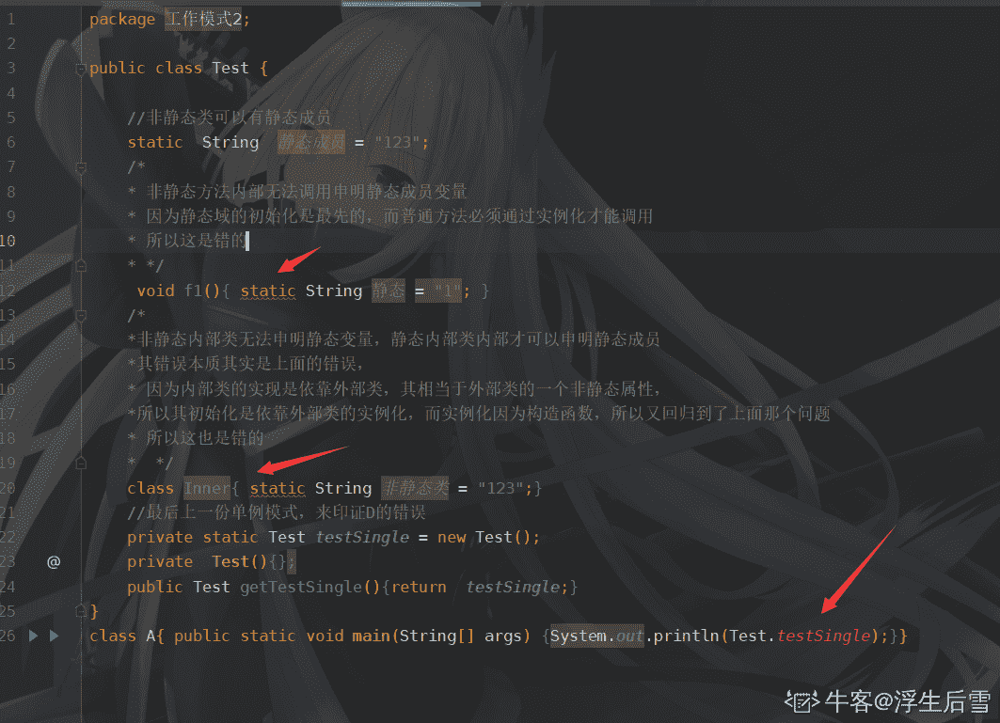
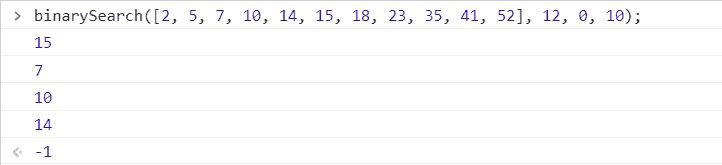

# 小米 2019 秋招 iOS 开发笔试题（A）

## 1

关于堆数据结构，下面描述中不恰当的一项是？

正确答案: D   你的答案: 空 (错误)

```cpp
用堆可以实现优先队列（priority_queue）
```

```cpp
使用堆可以实现排序算法，复杂度为 NlogN
```

```cpp
可以用大顶堆实现快速从 M 个元素中查找最小的 N 个元素的算法
```

```cpp
在大顶堆的二叉树中，第 N 层中的所有元素比第 N+1 层中的所有元素都要大
```

本题知识点

iOS 工程师 小米 堆 2019

讨论

[TheLoneRanger](https://www.nowcoder.com/profile/375332008)

c 要怎么实现呢

发表于 2019-12-17 15:58:01

* * *

[youaregenius](https://www.nowcoder.com/profile/1442508)

显然是不对的，堆排序并没有对每一层的大小排序，如大顶堆 7423 则不符合

发表于 2019-09-24 22:18:56

* * *

[天尊墨宇](https://www.nowcoder.com/profile/667959477)

选 D

发表于 2020-07-19 07:15:22

* * *

## 2

一个含有 n 个顶点的连通且无环的简单无向图，在其邻接矩阵存储结构中共有多少个零元素？

正确答案: C   你的答案: 空 (错误)

```cpp
n²-2n
```

```cpp
n²-2n-2
```

```cpp
n²-2n+2
```

```cpp
2(n-1)
```

本题知识点

iOS 工程师 小米 图 2019

讨论

[核桃补脑](https://www.nowcoder.com/profile/435527696)

n 个点的单向连通图有 n-1 条边，考虑上三角或者下三角，就是说邻接上/下三角矩阵中有 n-1 个值不为 0，又因为邻接矩阵在描述无向图时是对称的，所以有 n²-2(n-1),然而沙壁的我，居然连小学学的去括号都去错了，怀疑人生.jpg

发表于 2019-09-05 09:00:33

* * *

[风华水清](https://www.nowcoder.com/profile/405317889)

遇到不了解的，直接设一个连通无环无向图，带进去数...就能得到答案。

发表于 2020-10-03 23:14:43

* * *

[FLKID](https://www.nowcoder.com/profile/200170217)

问的是零元素而不是非零元素

发表于 2020-07-04 01:51:46

* * *

## 3

设某二叉树的前序序列为 BADC，中序序列为 ADBC，则后序序列为下面哪个？

正确答案: D   你的答案: 空 (错误)

```cpp
DABC
```

```cpp
ABCD
```

```cpp
ADCB
```

```cpp
DACB
```

本题知识点

iOS 工程师 小米 树 2019

讨论

[天尊墨宇](https://www.nowcoder.com/profile/667959477)

选 DB  A             C
      D
前序：BADC
中序：ADBC
后序：DACB

发表于 2020-07-02 13:36:37

* * *

## 4

当一台主机从一个网络移到另一个网络时，以下说法正确的是 （）

正确答案: B   你的答案: 空 (错误)

```cpp
必须改变它的 IP 地址和 MAC 地址
```

```cpp
必须改变它的 IP 地址，但不需改动 MAC 地址
```

```cpp
必须改变它的 MAC 地址，但不需改动 IP 地址
```

```cpp
MAC 地址、IP 地址都不需改动
```

本题知识点

iOS 工程师 小米 网络基础 iOS 工程师 小米 2019 iOS 工程师 小米 2019

## 5

下面对静态数据成员的描述中，正确的是

正确答案: A   你的答案: 空 (错误)

```cpp
静态数据成员可以在类体内进行初始化
```

```cpp
静态数据成员不可以被类的对象调用
```

```cpp
静态数据成员不受 private 控制符的作用
```

```cpp
静态数据成员可以直接用类名调用
```

本题知识点

iOS 工程师 小米 Java 2019

讨论

[datamade](https://www.nowcoder.com/profile/272286954)

D 选项需要考虑在 A 类通过类名访问 B 类的静态成员变量时，B 类的静态成员变量必须 public 修饰 发表于 2021-05-10 08:40:03

* * *

[大聪明凯少](https://www.nowcoder.com/profile/799851094)

这题出错了吧 A 和 D 都对啊

发表于 2021-05-17 18:56:36

* * *

[浮生后雪](https://www.nowcoder.com/profile/995843523)

答案应该是 A，D 很明显是错误的，最典型的就是单例模式。事实上 Java 的设计原则是属性私有，接口公开，方法看情况，静态数据成员也不例外，枚举类型才公开，但枚举的也不能叫成员，是实例。针对小哥的疑问，我就直接上图了。因为篇幅的原因，所以代码阅读性一般，见谅。

编辑于 2019-09-03 22:49:39

* * *

## 6

在关系数据库设计中，关系模式是用来记录用户数据的（）

正确答案: A   你的答案: 空 (错误)

```cpp
二维表
```

```cpp
视图
```

```cpp
属性
```

```cpp
实体
```

本题知识点

iOS 工程师 小米 数据库 iOS 工程师 小米 2019 iOS 工程师 小米 2019

## 7

无向图 G=(V，E)，其中 V={a,b,c,d,e,f} E={(a,b),(a,e),(a,c),(b,e),(c,f),(f,d),(e,d)}

对该图进行深度优先遍历,得到的顶点序列正确的是

正确答案: D   你的答案: 空 (错误)

```cpp
a,b,e,c,d,f
```

```cpp
a,c,f,e,b,d
```

```cpp
a,e,b,c,f,d
```

```cpp
a,b,e,d,f,c
```

本题知识点

iOS 工程师 小米 图 iOS 工程师 小米 2019 iOS 工程师 小米 2019

讨论

[Palai](https://www.nowcoder.com/profile/123764439)

我感觉没有正确答案 一共有 5 种 abedcfacfdbe  acfdebaedbcf  aedcfb

发表于 2020-12-09 23:32:26

* * *

## 8

在顺序表(2，5，7，10，14，15，18，23，35，41，52)中，用二分法查找 12，所需的关键码比较的次数为()

正确答案: C   你的答案: 空 (错误)

```cpp
2
```

```cpp
3
```

```cpp
4
```

```cpp
5
```

本题知识点

iOS 工程师 小米 查找 *iOS 工程师 小米 2019 iOS 工程师 小米 2019* *讨论

[小🐮客](https://www.nowcoder.com/profile/990177409)

答案：C 查找比较步骤：① {2, 5, 7, 10, 14, 15, 18, 23, 35, 41, 52}        start = 0, end = 10, mid = 5, **12 VS 15**② {2, 5, 7, 10, 14}                                            start = 0, end = 4,  mid = 2, **12 VS 7**③ {10, 14}                                                        start = 3, end = 4,  mid = 3, **12 VS 10**④ {14}                                                              start = 4, end = 4,  mid = 4, **12 VS 14**     结果：没找到，返回 -1 或者 false 等标识。个人测试：二分查找算法：

```cpp
function binarySearch(arr, item, start, end) {
            if (start > end) {
                return -1;
            }
            let mid = Math.floor((start + end) / 2);
            console.log(arr[mid]);                // 用于打印被比较的数值 
            if (item === arr[mid]) {
                return mid;
            } else if (item < arr[mid]) {
                return binarySearch(arr, item, start, mid - 1);
            } else {
                return binarySearch(arr, item, mid + 1, end);
            }
        }
```

发表于 2019-10-19 15:43:22

* * *

[初一十五三十](https://www.nowcoder.com/profile/807445360)

在顺序表(2，5，7，10，14，15，18，23，35，41，52)中，用二分法查找 12，所需的关键码比较的次数为()  ??? 是找 14 吧？

发表于 2019-09-10 17:23:19

* * *

## 9

有关数据流图的说法中，正确的是 _______。

正确答案: B   你的答案: 空 (错误)

```cpp
数据流图中包含有较多的计算机术语
```

```cpp
数据流图中不包含具体的物理元素
```

```cpp
数据流图中可以表示出选择和循环
```

```cpp
数据流图中有一些特殊的图表符号，不易于理解
```

本题知识点

iOS 工程师 小米 2019

## 10

下面那个方法属于 NSObject 的内省（Introspection）方法?

正确答案: B C D   你的答案: 空 (错误)

```cpp
init
```

```cpp
isKindOfClass
```

```cpp
responseToSelector
```

```cpp
isMemberOfClass
```

本题知识点

iOS 工程师 小米 iOS 2019

讨论

[Anthony_WUST](https://www.nowcoder.com/profile/400890646)

内省（Introspection）是面向对象语言和环境的一个强大特性，Objective-C 和 Cocoa 在这个方面尤其的丰富。内省是对象揭示自己作为一个运行时对象的详细信息的一种能力。这些详细信息包括对象在继承树上的位置，对象是否遵循特定的协议，以及是否可以响应特定的消息。NSObject 协议和类定义了很多内省方法，用于查询运行时信息，以便根据对象的特征进行识别。1、isKindOfClass:Class
检查对象是否为某个类的对象，包括其继承类实例化的对象
2、isMemberOfClass:Class
检查对象是否为某个类的对象，不包括继承类实例化的对象
3、respondToSelector:selector
检查对象是否包含这个方法

发表于 2019-10-21 22:57:53

* * *

## 11

在 iOS 系统中，可以数据持久化的方案有？

正确答案: A B C D   你的答案: 空 (错误)

```cpp
plist
```

```cpp
sqlite
```

```cpp
coreData
```

```cpp
NSKeyedArchiver
```

本题知识点

iOS 工程师 小米 iOS 2019

讨论

[Ryanww](https://www.nowcoder.com/profile/126034906)

iOS 数据持久化有 archive 归档 数据库 sqlite 对象关系集合 coredata 文件 plist

发表于 2020-07-01 09:31:32

* * *

## 12

关于 iOS 常用组件 UILabel 以下说法正确的是？

正确答案: A B C   你的答案: 空 (错误)

```cpp
UIlabel 继承于 UIView
```

```cpp
UIlabel 可以显示多行文本
```

```cpp
可以通过 UIFont 来设置 UIlabel 中的字体大小
```

```cpp
UIlabel 仅可以展示文字，不能响应用户的触摸事件
```

本题知识点

iOS 工程师 小米 iOS 2019

讨论

[CHN_ByteDance](https://www.nowcoder.com/profile/428675)

通过给 uilabel 添加手势也可以实现响应用户触摸事件

发表于 2020-04-15 23:18:29

* * *

## 13

下列代码：

```cpp
@property(nonatomic,assign)id<Painting>myObject;
```

下面哪个说法是错误的

正确答案: A B D   你的答案: 空 (错误)

```cpp
是说 myObject 是 Painting 分类的一部分
```

```cpp
是说 myObject 遵从于 Painting 分类
```

```cpp
是说 myObject 遵从于 Painting 协议
```

```cpp
不是合法的 Objective-C 语法格式
```

本题知识点

iOS 工程师 小米 iOS 2019

讨论

[萌萌菜菜](https://www.nowcoder.com/profile/342718714)

看错题了，以为让选择正确的呢

发表于 2021-04-25 11:05:10

* * *

[沉默的子弹](https://www.nowcoder.com/profile/858662141)

没看懂 D

发表于 2020-11-21 07:55:59

* * *

[blacklonely](https://www.nowcoder.com/profile/760254021)

id 类型不能用 assign 是这个道理么

发表于 2020-11-02 19:12:26

* * *

## 14

下列循环语句中有语法正确的是

正确答案: A B C   你的答案: 空 (错误)

```cpp
int i; for（i=1; i<10; i++）cout<<'*';
```

```cpp
int i, j; for（i=1, j＝0; i<10; i++, j++）cout<<'*';
```

```cpp
int i=0; for( ; i<10; i++) cout<<'*';
```

```cpp
for(1) cout<<'*';
```

本题知识点

iOS 工程师 小米 C++ 2019

讨论

[带带搬砖工](https://www.nowcoder.com/profile/323678054)

A 不是有个+号是中文？

发表于 2020-06-27 17:48:28

* * *

[小金子呀](https://www.nowcoder.com/profile/578730259)

for 的用法是 for( ; ;),D 可以写成 while(1) A,B,C 对 for 的用法都是正确的

发表于 2019-09-14 16:40:45

* * *

[我不想卷了](https://www.nowcoder.com/profile/588005868)

nt i 是啥，没有看到过

发表于 2019-08-20 21:32:37

* * *

## 15

以下说法正确的是（）

正确答案: A B C D E   你的答案: 空 (错误)

```cpp
内联（inline）函数改善了函数调用的执行效率
```

```cpp
类 A 的友元(friend)函数可以访问类 A 的私有成员
```

```cpp
类 A 的友元(friend)类 B 可以访问类 A 的私有成员
```

```cpp
类 A 的静态数据成员为类 A 的所有对象所共享
```

```cpp
类 A 的静态成员函数没有传递 this 指针作为参数
```

本题知识点

iOS 工程师 小米 C++ 2019

讨论

[牛客 298301954 号](https://www.nowcoder.com/profile/298301954)

 静态与非静态成员函数之间有一个主要的区别。那就是静态成员函数没有 this 指针。 

发表于 2021-07-24 15:31:32

* * *

[cshzet](https://www.nowcoder.com/profile/802932187)

内联函数以空间换时间，提高了运行速度，但所需的内存空间变大。

发表于 2020-03-02 14:11:33

* * *

[Martuil.](https://www.nowcoder.com/profile/5773704)

一、函数调用：

> 函数调用的实质是，将程序执行的顺序转移到被调用的函数所在的内存地址，将函数执行完后，再返回到原来的地址继续往下执行，因此需要保护现场并记忆执行的地址，还要恢复现场。即不断地有函数入栈，会造成栈空间或栈内存的大量消耗。栈空间是指放置函数内数据的内存空间，是有限的，假如频繁大量的使用就会造成因栈空间不足所造成的程序出错问题。而且，函数调用需要消耗一定的时间和空间，于是影响了效率。

二、频繁调用：

> 一些函数不大，但需要频繁地调用时，效率很低。引入内联函数为了提高程序中函数调用的效率。

三、内联函数：

> 程序编译时，遇到调用的内联函数时，只是将函数名替换为内联函数的函数体，这样执行时就不需要再去调用函数。但是会增加目标代码量，进而增加空间开销。所以，它是牺牲空间换取时间的节省。
> 内联函数跟普通函数一样，只是需要在函数名前加一个关键字 inline。关键字 inline 必须与函数定义体放在一起才能使函数成为内联，仅将 inline 放在函数声明前面不起任何作用。
> 例如：
> 
> ```cpp
> inline int add(int a,int b)
> 
> {
> 
> return a+b;
> 
> }
> ```
> 
> 注：内联函数一般只是简单的一两句，不能有循环语句和开关语句（switch case），如果过于复杂，编译器则会按照普通函数对待，不会当做内联函数，也不会报错。

发表于 2020-04-23 12:55:32

* * *

## 16

操作系统中用得最多的数据结构是（ ）。

正确答案: C   你的答案: 空 (错误)

```cpp
堆栈
```

```cpp
队列
```

```cpp
表格
```

```cpp
树
```

本题知识点

iOS 工程师 小米 前端工程师 操作系统 2019

讨论

[SHU-haojie](https://www.nowcoder.com/profile/788507642)

操作系统中有大量的页表、段表、设备控制表

发表于 2020-09-04 14:23:02

* * *

[-ShadowKnight](https://www.nowcoder.com/profile/719369589)

这题我个人认为是 A.堆栈

发表于 2019-08-19 00:15:25

* * *

[Brown798](https://www.nowcoder.com/profile/641312719)

确实是表格，比如在操作系统中有大量的页表，段表，设备控制表之类的表格

发表于 2019-10-12 17:02:18

* * *

## 17

下面属于 ios 多线程实现方法的是？

正确答案: B C D   你的答案: 空 (错误)

```cpp
使用@synchronized(self)
```

```cpp
使用 GCD
```

```cpp
使用 NSOperationQueue
```

```cpp
使用 NSTheard
```

本题知识点

iOS 工程师 小米 iOS 2019

讨论

[yootoo](https://www.nowcoder.com/profile/763628553)

```cpp
@synchronized(self)是锁的一种实现方式，一不小心会看成多线程。
```

发表于 2020-07-30 14:19:26

* * *

## 18

内存管理的关键字描述正确的是：

正确答案: A B D   你的答案: 空 (错误)

```cpp
retaincount 是指对象的引用计数
```

```cpp
retain 关键字可以增大对象的引用计数。
```

```cpp
release 可以减小对象的引用计数，但 autorelease 不可以
```

```cpp
dealloc 方法不能直接调用
```

本题知识点

iOS 工程师 小米 iOS 2019

讨论

[irick_](https://www.nowcoder.com/profile/35059747)

c 很奇怪 应该说 release 可以立即减少引用计数 而 aurorelease 需要等待一段时间

发表于 2020-08-28 20:22:12

* * *

## 19

下列无效的键路径是：

正确答案: A C D   你的答案: 空 (错误)

```cpp
[foo valueForKeyPath:@”1SomeMember”]
```

```cpp
[foo valueForKeyPath:@”someMember.someAttribute”]
```

```cpp
[foo valueForKeyPath:@”SOMEMEMBER@someAttibute”]
```

```cpp
[foo valueForKeyPath:@”some Member”]
```

本题知识点

iOS 工程师 小米 iOS 2019

讨论

[•729](https://www.nowcoder.com/profile/7724873)


不对啊。。。我 Xcode D 选项可以啊。。。

编辑于 2022-02-20 10:08:55

* * *

## 20

以下属于 runtime API 以及应用场景的是：

正确答案: A B C   你的答案: 空 (错误)

```cpp
Method Swizzling（方法交换）
```

```cpp
Associated Object （关联对象）
```

```cpp
动态的增加方法
```

```cpp
delegate 代理方法
```

本题知识点

iOS 工程师 小米 iOS 2019

## 21

在你面前有一个 n 阶的楼梯，你一步只能上 1 阶或 2 阶。
请问计算出你可以采用多少种不同的方式爬完这个楼梯。

本题知识点

小米 iOS 工程师 运维工程师 递归 动态规划 2019 安全工程师

讨论

[lentolove](https://www.nowcoder.com/profile/572586026)

考察斐波那契数列
题目要求：只能跳 1 阶或者 2 阶。
定义阶有种跳法

1.  假定第一次跳的是一阶，那么剩下的是 n-1 个台阶，跳法是;
2.  假定第一次跳的是 2 阶，那么剩下的是 n-2 个台阶，跳法是；
3.  总跳法为: 
4.  .

初次提交这个题会发现通过率只有 50%,是因为没有考虑到整数溢出的问题，用 BigInteger 处理就 Ok 了。

```cpp
import java.io.BufferedReader;
import java.io.IOException;
import java.io.InputStreamReader;
import java.math.BigInteger;

public class Main {

    public static void main(String[] args) throws IOException {
        BufferedReader bf = new BufferedReader(new InputStreamReader(System.in));
        int n = Integer.parseInt(bf.readLine());
        if (n < 3) {
            System.out.println(n);
            return;
        }
        BigInteger one = BigInteger.valueOf(1);
        BigInteger two = BigInteger.valueOf(2);
        BigInteger ret = BigInteger.valueOf(0);

        for (int i = 3; i <= n; i++) {
            ret = one.add(two);
            one = two;
            two = ret;
        }
        System.out.println(ret);
    }
}
```

发表于 2019-07-28 13:59:23

* * *

[折子渝](https://www.nowcoder.com/profile/517352000)

写一个 c 语言比较简洁的大整数加法

```cpp
#include <iostream>
#include <vector>
using namespace std;

int main() {
    int n;
    cin >> n;
    vector<vector<int>> dp(n + 5, vector<int> (100, 0));
    dp[1][0] = 1;
    dp[2][0] = 2;
    int len = 1;
    for (int i = 3; i <= n; i++) {
        for (int j = 0; j < len; j++) {
            dp[i][j] += dp[i - 1][j] + dp[i - 2][j];
            if (dp[i][j] > 9) {
                dp[i][j + 1] += dp[i][j] / 10;
                dp[i][j] %= 10;
                len += (j == len - 1);
            }
        }
    }
    for (int i = 0; i < len; i++) cout << dp[n][len - i - 1];
    cout << endl;
    return 0;
}
```

编辑于 2020-03-11 19:45:54

* * *

[广州市民林先生](https://www.nowcoder.com/profile/241061362)

首先这个题目的模型是斐波那契数列（参考剑指 offer 的青蛙跳台阶），思路是很清晰的，但是有一个很棘手的问题：这个题 C++没有大整数类，而题目的用例太大了，long long 也只能通过 55%的用例，所以只能通过字符串来显示。所以整道题的重点就是如何进行字符串相加，手写字符串相加函数、下面的注释很详细了，可以参考

```cpp
#include <iostream>
#include <string>
using namespace std;

string BigData(string s1, string s2){
    string res = "";
    int i = s1.size() - 1;
    int j = s2.size() - 1;
    int carry = 0;  //进位
    while (i >= 0 || j >= 0){
        // s2 一定大于 s1（斐波那契数列的后者 > 前者）
        if(i < 0){
            //当小的字符串先走完时，就剩大字符串了，同理进行逐位添加
            res = to_string((s2[j] - '0') + carry) + res;
            carry = 0;  //只剩一个字符串就不存在进位了，因为都是个位数
        } else{
            //从后往前进行逐位相加，如 123+567,从 3+7 开始往前加，别忘了加上进位
            int tmp = (s1[i] - '0') + (s2[j] - '0') + carry;
            carry = tmp / 10;  //得到进位
            tmp = tmp % 10;    //得到余数
            res = to_string(tmp) + res; //这里顺序记得不能颠倒，不然就错了
        }
        --i; --j;
    }
    //为什么下面还要判定呢？因为比如 3+7 应该等于 10，但是
    //上面的计算出的 res 只有 0(余数)，所以这里要考虑周全
    if(carry == 1)
        res = '1' + res;
    return res;
}
int main(){
    int n;
    cin >> n;
    //斐波那契
    if(n == 1){
        cout << 1 << endl;
        return 0;
    } else if(n == 2){
        cout << 2 << endl;
        return 0;
    }
    string i = "1";
    string j = "2";
    string ans = "";
    for(int k = 1; k <= n - 2; ++k){
        ans = BigData(i, j);  // i + j
        i = j;   
        j = ans;
    }
    cout << ans << endl;
    return 0;
}
```

编辑于 2020-06-03 21:22:49

* * *

## 22

给定任意一个较短的子串，和另一个较长的字符串，判断短的字符串是否能够由长字符串中的字符构建出来，且长串中的每个字符只能用一次。

本题知识点

iOS 工程师 小米 动态规划 字符串 *查找 *2019** **讨论

[ElonB](https://www.nowcoder.com/profile/623894)

```cpp
""""
一种借助字典的思路，时间复杂度较低
"""
from collections import Counter

if __name__ == "__main__":
    s, t = map(dict, map(Counter, input().strip().split()))
    flag = True
    for c in s.keys():
        if c not in t.keys() or s[c] > t[c]:
            flag = False
            break
    print("true" if flag else "false")

```

发表于 2019-07-13 15:15:14

* * *

[无心 2019](https://www.nowcoder.com/profile/991674511)

```cpp
#include <bits/stdc++.h>
using namespace std;
int main()
{
    string s,t;
    cin>>s>>t;
    map<char,int> m;   
    bool flag = true;   //用来判断能不能构建短字符串
    for(auto it : t)
        m[it]++;
    for(auto it : s)
    {
        if(m[it])
            m[it]--;
        else
            flag = false;
    }
    if(flag)
        cout<<"true";
    else
        cout<<"false";
    return 0;
}

```

发表于 2019-07-03 22:20:27

* * *

[谁的电脑](https://www.nowcoder.com/profile/743368)

```cpp
import java.util.Scanner;

public class Main {
    public static void main(String[] args) {
        Scanner scanner = new Scanner(System.in);
        String s = scanner.next();
        String t = scanner.next();
        int[] chs = new int[26];
        for (int i = 0; i < t.length(); i++) {
            chs[t.charAt(i) - 'a']++;
        }
        for (int i = 0; i < s.length(); i++) {
            chs[s.charAt(i) - 'a']--;
        }
        for (int i : chs) {
            if (i < 0) {
                System.out.println("false");
                return;
            }
        }
        System.out.println("true");
    }
}
```

编辑于 2019-07-08 17:01:30

* * ****