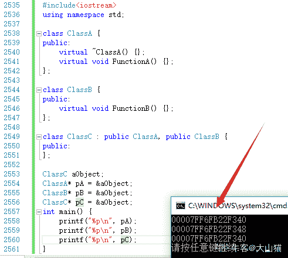

# 小米 2019 秋招 iOS 开发笔试题（B）

## 1

下面属于 ios 多线程实现方法的是？

正确答案: B C D   你的答案: 空 (错误)

```cpp
使用@synchronized(self)
```

```cpp
使用 GCD
```

```cpp
使用 NSOperationQueue
```

```cpp
使用 NSTheard
```

本题知识点

iOS 工程师 小米 iOS 2019

讨论

[yootoo](https://www.nowcoder.com/profile/763628553)

```cpp
@synchronized(self)是锁的一种实现方式，一不小心会看成多线程。
```

发表于 2020-07-30 14:19:26

* * *

## 2

内存管理的关键字描述正确的是：

正确答案: A B D   你的答案: 空 (错误)

```cpp
retaincount 是指对象的引用计数
```

```cpp
retain 关键字可以增大对象的引用计数。
```

```cpp
release 可以减小对象的引用计数，但 autorelease 不可以
```

```cpp
dealloc 方法不能直接调用
```

本题知识点

iOS 工程师 小米 iOS 2019

讨论

[irick_](https://www.nowcoder.com/profile/35059747)

c 很奇怪 应该说 release 可以立即减少引用计数 而 aurorelease 需要等待一段时间

发表于 2020-08-28 20:22:12

* * *

## 3

下列无效的键路径是：

正确答案: A C D   你的答案: 空 (错误)

```cpp
[foo valueForKeyPath:@”1SomeMember”]
```

```cpp
[foo valueForKeyPath:@”someMember.someAttribute”]
```

```cpp
[foo valueForKeyPath:@”SOMEMEMBER@someAttibute”]
```

```cpp
[foo valueForKeyPath:@”some Member”]
```

本题知识点

iOS 工程师 小米 iOS 2019

讨论

[•729](https://www.nowcoder.com/profile/7724873)


不对啊。。。我 Xcode D 选项可以啊。。。

编辑于 2022-02-20 10:08:55

* * *

## 4

以下属于 runtime API 以及应用场景的是：

正确答案: A B C   你的答案: 空 (错误)

```cpp
Method Swizzling（方法交换）
```

```cpp
Associated Object （关联对象）
```

```cpp
动态的增加方法
```

```cpp
delegate 代理方法
```

本题知识点

iOS 工程师 小米 iOS 2019

## 5

客户端每 10 秒建立一个短连接并迅速调用 close，之后该连接会进入 TIME_WAIT 状态。系统的 TIME_WAIT 等待时间配置为 10 分钟。请问在客户端稳定运行一段时间后，系统中处于 TIME_WAIT 状态的 socket 个数最接近下面哪个答案？

正确答案: D   你的答案: 空 (错误)

```cpp
1
```

```cpp
10
```

```cpp
30
```

```cpp
60
```

本题知识点

iOS 工程师 小米 网络基础 2019

讨论

[黄色变白色](https://www.nowcoder.com/profile/8547911)

10 秒建立一个，一分钟建立 6 个，10 分钟就是 60 个，超过 10 分钟的都过了 time_wait 时间

发表于 2019-10-28 07:39:39

* * *

## 6

在一棵二叉树中，度为 2 的节点有 30 个，度为 1 的节点有 10 个，则叶子节点的个数是：

正确答案: C   你的答案: 空 (错误)

```cpp
29
```

```cpp
30
```

```cpp
31
```

```cpp
32
```

本题知识点

小米 树 2019

讨论

[牛客 233424611 号](https://www.nowcoder.com/profile/233424611)

N0 = N2+1

发表于 2021-11-30 20:16:25

* * *

[脑瓜疼。。](https://www.nowcoder.com/profile/543823954)

N0=N2+1;N0=30+1=31;

发表于 2022-01-04 14:40:42

* * *

[天尊墨宇](https://www.nowcoder.com/profile/667959477)

选 CN = N2 + N1 + N0N = 2*N2 + N1 + 1
=>  N2 + 1 = N0=> N0 = 31

发表于 2020-07-03 18:01:53

* * *

## 7

静态 static 变量在不同的实例中地址是否一样？他们储存在什么区域？

正确答案: C   你的答案: 空 (错误)

```cpp
:地址一样，在堆栈区。
```

```cpp
地址不一样，在堆栈区。
```

```cpp
地址一样，在全局区。
```

```cpp
地址不一样，在全局区。
```

本题知识点

iOS 工程师 小米 操作系统 iOS 工程师 小米 2019 iOS 工程师 小米 2019

讨论

[是瑶瑶公主呀](https://www.nowcoder.com/profile/592649258)

静态变量是全局变量，存储在全局区且地址一样

发表于 2019-10-23 08:52:31

* * *

## 8

现有初始状态均为空的栈 X 和队列 Y，元素 a、b、c、d、e、f、g 依次进入栈 X，每个元素出栈后即进入队列 Y，如果出队列的顺序为 b、c、f、e、g、d、a，则要求栈 X 最小容量为

正确答案: C   你的答案: 空 (错误)

```cpp
6
```

```cpp
5
```

```cpp
4
```

```cpp
3
```

本题知识点

iOS 工程师 小米 栈 *iOS 工程师 小米 2019 iOS 工程师 小米 2019* *讨论

[五五凯](https://www.nowcoder.com/profile/89396163)

1.  a 先进栈，
2.  b 进栈然后 b 出栈，
3.  c 进栈然后 c 出栈，
4.  d、e、f 依次进栈，
5.  然后 f、e 依次出栈，
6.  随后 g 进栈，
7.  最后 g、d、a 依次出栈，

出栈顺序 bcfegda，栈里元素最多的时候是第四步之后，此时，栈里面有 a d e f 四个元素，其余时候都小于四个，所以选 C

发表于 2019-09-19 21:47:56

* * *

## 9

对于排序算法，经常关注的是其时间复杂度和稳定性。下列排序算法中平均时间复杂度是 O(nlogn)且稳定的是？

正确答案: C   你的答案: 空 (错误)

```cpp
冒泡排序
```

```cpp
插入排序
```

```cpp
归并排序
```

```cpp
快速排序
```

本题知识点

iOS 工程师 小米 排序 *iOS 工程师 小米 2019 iOS 工程师 小米 2019* *讨论

[zabanne](https://www.nowcoder.com/profile/255631471)

快速排序不是不稳定的嘛？

发表于 2019-09-04 23:56:06

* * *

## 10

在长度为 n 的顺序表的第 i（1≤i≤n+1）个位置上插入一个元素，元素的移动次数为

正确答案: A   你的答案: 空 (错误)

```cpp
n-i+1
```

```cpp
n-i
```

```cpp
i
```

```cpp
i -1
```

本题知识点

排序 *讨论

[小道仙](https://www.nowcoder.com/profile/264325265)

比如： 1    2    4    5    6 在第三个位置插入 3 需要移动的元素 4    5    6n-i    =    5 - 3    =    2 但是移动的次数是 3,所以  n-i+1

发表于 2019-10-05 11:55:51

* * *

[我是土豆土豆](https://www.nowcoder.com/profile/854761076)

在第 i 个位置上插入元素，i 的后面有 n-i 个元素，这 n-i 个元素都要后移，但是为了把新元素插入到第 i 个位置，第 i 个位置上原来的元素也得后移，所以总共有 n-i+1 个元素要后移。

发表于 2021-02-04 20:53:59

* * *

[丶 Berserker](https://www.nowcoder.com/profile/957501620)

注意看题目，i >= 0，即第 i 个元素，比如第一个元素，对应数组下标为 0.

发表于 2022-01-29 09:03:12

* * *

## 11

下列关于数据库事务 ACID 特性的说法不正确的是？

正确答案: C   你的答案: 空 (错误)

```cpp
A 指的是原子性，即事务中的所有操作要么全部成功，要么全部失败
```

```cpp
C 指的是一致性，即系统的状态只能是事务前的状态，或者是事务成功后的状态，而不会出现任何不一致的中间状态
```

```cpp
I 指的是可用性，即数据库系统要为事务执行提供尽可能高的可用性，确保大部分事务可以成功的被执行
```

```cpp
D 指的是持久性，即事务成功后即使发生机器断电，也可以恢复到事务成功后的状态
```

本题知识点

iOS 工程师 小米 数据库 2019

讨论

[小左乀](https://www.nowcoder.com/profile/489912242)

I 是指(Isolation)隔离性 事务执行互不干扰，一个事务不可能看到其他事务运行时，中间某一时刻的数据

发表于 2019-08-25 23:19:19

* * *

[怀疑一切](https://www.nowcoder.com/profile/836881958)

**原子性（Atomicity）、一致性（Consistency）、隔离性（Isolation）、持久性（Durability）。**

*   原子性是指事务是一个不可再分割的工作单位，事务中的操作要么都发生，要么都不发生。
*   一致性是指在事务开始之前和事务结束以后，数据库的完整性约束没有被破坏。这是说数据库事务不能破坏关系数据的完整性以及业务逻辑上的一致性。
*   在并发环境中，当不同的事务同时操纵相同的数据时，每个事务都有各自的完整数据空间。由并发事务所做的修改必须与任何其他并发事务所做的修改隔离。事务查看数据更新时，数据所处的状态要么是另一事务修改它之前的状态，要么是另一事务修改它之后的状态，事务不会查看到中间状态的数据。
*   在事务完成以后，该事务所对数据库所作的更改便持久的保存在数据库之中，并不会被回滚。

    即使出现了任何事故比如断电等，事务一旦提交，则持久化保存在数据库中。 

发表于 2019-09-10 19:05:58

* * *

## 12

若入栈序列为 A B C D E F，且进栈和出栈可以穿插进行，则不可能的输出序列为

正确答案: A   你的答案: 空 (错误)

```cpp
BCEAFD
```

```cpp
DCBAEF
```

```cpp
CBDAFE
```

```cpp
BDCAEF
```

本题知识点

iOS 工程师 小米 栈 *iOS 工程师 小米 2019 iOS 工程师 小米 2019* *讨论

[铁树开梨花](https://www.nowcoder.com/profile/6617833)

b，c，e，a，f，d
a 进
b 进
b 出  b
c 进
c 出  c
d 进
e 进
e 出  e
 再出的话只能出 d 或者 f 进 f 出 但 A 选项  出的是 a 如有错误之处 请大佬指出！

编辑于 2020-12-29 15:29:27

* * *

[牛客 562570965 号](https://www.nowcoder.com/profile/562570965)

记住栈是先进后出，  正确答案是 A 选项是不可能的，解释：B 出的话 A 肯定进去了，C 出的话 A 仍然再里面，E 出的话，CD 肯定进去了，别忘了 A 还没出来，所以 A 如果想出来 CD 压在 A 上面，必须 D 出然后 C 出 A 才可以出来，故 A 出是错的。

发表于 2021-02-23 11:41:03

* * *

[遍地丈母娘](https://www.nowcoder.com/profile/699145809)

有没有大佬讲讲原因啊？

发表于 2020-11-11 17:02:18

* * *

## 13

下列哪个查找最快?

正确答案: A   你的答案: 空 (错误)

```cpp
哈希表法（散列表）
```

```cpp
顺序查找
```

```cpp
二分查找
```

```cpp
二叉排序树查找
```

本题知识点

查找 *讨论

[许愿有个 offer](https://www.nowcoder.com/profile/458090646)

无论是基于线性查找表、二叉树搜索树、还是多路搜索树，凡是基于关键字比较的方法，其时间复杂度范围都为：O(logn)~O(n)由于哈希表原因，其查找时间复杂度为：O(1)

发表于 2019-09-24 21:33:41

* * *

[ΔtZ.](https://www.nowcoder.com/profile/4061297)

哈希表法：O(1)顺序查找：O(n)二分查找/二叉排序树查找：O(logn)

发表于 2020-04-05 17:05:24

* * *

[YJJNOWCODER](https://www.nowcoder.com/profile/124216047)

注意哈希表法最后得到一个散列表，可以直接查找，故时间复杂度：O（1）

发表于 2020-01-10 21:02:15

* * *

## 14

设指针 q 指向单链表中结点 A， 指针 p 指向单链表中结点 A 的后继结点 B，指针 S 指向被插入的结点 X，则在结点 A 和结点 B 插入结点 X 的操作序列为（）

正确答案: B   你的答案: 空 (错误)

```cpp
s->next=p->next; p->next=-s;
```

```cpp
s->next=p;q->next=s;
```

```cpp
p->next=s->next; s->next=p;
```

```cpp
p->next=s;s->next=q;
```

本题知识点

iOS 工程师 小米 链表 *2019* *讨论

[FANTASY201911091653574](https://www.nowcoder.com/profile/479479673)

这题的 b 答案有问题，将会导致断链插入链表中的节点不能先接前节点，否则就会丢失后节点的地址。所以应该改为 s->next=p;q->next=s;

发表于 2019-11-23 17:11:42

* * *

[笑对人生 651401001](https://www.nowcoder.com/profile/651401001)

这一题的答案有问题，B 选项的做***导致断链，应该为提交观点

```cpp
s->next=p;
p->next=s;
```

发表于 2019-10-28 11:13:31

* * *

[Despacito007](https://www.nowcoder.com/profile/893487814)

B 也不对

发表于 2020-10-30 21:33:38

* * *

## 15

设置 CALayer 的哪些属性，可能会触发离屏绘制

正确答案: A B C D   你的答案: 空 (错误)

```cpp
masksToBounds(遮罩)
```

```cpp
shouldRasterize（光栅化）
```

```cpp
allowsGroupOpacity(组不透明)
```

```cpp
shadowColor(阴影)
```

```cpp
transform(3D 变换)
```

本题知识点

iOS 工程师 小米 iOS 2019

讨论

[doyouwannadance](https://www.nowcoder.com/profile/540645161)

离屏渲染的触发方式

设置了以下属性时，都会触发离屏绘制：

shouldRasterize（光栅化）

masks（遮罩）

shadows（阴影）

edge antialiasing（抗锯齿）

group opacity（不透明）

复杂形状设置圆角等

渐变

来自[`www.jianshu.com/p/f62e81b72bba`](https://www.jianshu.com/p/f62e81b72bba)

发表于 2022-02-22 17:16:29

* * *

## 16

关于循环引用和死锁，下列说法正确的有

正确答案: C D   你的答案: 空 (错误)

```cpp
任何一个 Block，在其中使用 self 就会导致循环引用
```

```cpp
在一个 Block 中，如果只是使用 self，而不是把 self 赋值给别人，那么 self 所指对象的引用计数就不会增加，所以不会导致循环引用
```

```cpp
定义一个 Delegate 属性，用 __unsafe_unretained 修饰，不会导致循环引用
```

```cpp
主线程调用"dispatch_sync(dispatch_get_main_queue(), ^{});"会导致死锁
```

```cpp
NSTimer 对象使用结束时，只要记得设置为 nil，就不可能导致循环引用
```

本题知识点

iOS 工程师 小米 iOS 2019

讨论

[陈超 201910180648642](https://www.nowcoder.com/profile/611417946)

E.NSTimer 要加入到 RunLoop 中才能正常工作，而 RunLoop 也会对 Timer 强引用。

发表于 2020-06-23 17:15:22

* * *

## 17

观察下面一段代码:

```cpp
class ClassA
{
public:
    virtual ~ ClassA() {};
    virtual void FunctionA() {};
};
class ClassB
{
public:
    virtual void FunctionB() {};
};
class ClassC : public ClassA,public ClassB
{
public:
};
ClassC aObject;
ClassA* pA=&aObject;
ClassB* pB=&aObject;
ClassC* pC=&aObject;
```

关于 pA,pB,pC 的取值,下面的描述中正确的是:

正确答案: C E   你的答案: 空 (错误)

```cpp
pA,pB,pC 的取值相同
```

```cpp
pC=pA+pB
```

```cpp
pA 和 pB 不相同
```

```cpp
pC 不等于 pA 也不等于 pB
```

```cpp
pC 和 pA 相同
```

本题知识点

iOS 工程师 小米 C++ 2019

讨论

[拖拉机嘟嘟嘟](https://www.nowcoder.com/profile/117252758)

解释一下：ClassC 虚表指针有了两个，分别在在对象首地址偏移 0 和 4 字节，pA 指向的是基类 ClassA 基类虚表指针，pB 指向的是基类 ClassB 虚表指针，然后 pC 指向按继承顺序第一个继承的类虚表指针也就是 pA，所以 pC=pA，pB 与他们不相等，详细虚表继承板砖地址：[`blog.csdn.net/haoel/article/details/1948051`](https://blog.csdn.net/haoel/article/details/1948051)有图有真相：

发表于 2019-08-27 11:37:44

* * *

[我的天鸭](https://www.nowcoder.com/profile/243498)

答案是 C 和 E，先说结论，这种情况下，派生类的指针和第一个基类的指针应该是一样的，和第二个基类是不一样的。
pB 和 pA 的差值是虚表指针的大小，32 位机器是 4 字节，64 位机器就是 8 字节了。
虚表的含义：
在 C++中，**每个有虚函数的类或者虚继承的子类，编译器都会为它生成一个虚表，表中的每一个元素都指向一个虚函数的地址**。
此外，编译器会为包含虚函数的类加上一个成员变量，是一个指向该虚函数表的指针（常被称为 vptr），每一个由此类别派生出来的类，都有这么一个 vptr。也就是说，**如果一个类含有虚表，则该类的所有对象都会含有一个虚表指针，并且该虚表指针指向同一个虚表**。
**虚表的内容是依据类中的虚函数声明次序一一填入函数指针**。派生类别会继承基础类别的虚表（以及所有其他可以继承的成员），当我们在派生类中改写虚函数时，虚表就受了影响；表中的元素所指的函数地址将不再是基类的函数地址，而是派生类的函数地址。

发表于 2019-08-21 11:10:45

* * *

[大山猫](https://www.nowcoder.com/profile/269431238)

解析上面的牛友已经说了，看看结果吧：

发表于 2019-10-25 17:24:37

* * *

## 18

关于 Http 和 Https,下面说法正确的是：

正确答案: A D   你的答案: 空 (错误)

```cpp
Http 是超文本传输协议，信息是明文传输，Https 则是具有安全性的 ssl 加密传输协议
```

```cpp
相对于 Http，Https 不仅更安全，而且连接效率更高，传输速率也更快
```

```cpp
由于 iOS 系统本身安全性很高，所以 Apple 对于是否使用 Https 没有特别的要求
```

```cpp
Https 由于采用了证书认证机制以及非对称加密技术，所以安全性更高
```

```cpp
Https 属于传输层协议，用来保证数据传输安全
```

本题知识点

iOS 工程师 小米 网络基础 2019

讨论

[是瑶瑶公主呀](https://www.nowcoder.com/profile/592649258)

B https 协议会使页面加载时间延长近 50%，增加 10-20%耗电，还会影响缓存，增加开销

E https 不能保证安全 安全是有范围的 在黑客攻击 dos 和 dns 攻击方面几乎没用

发表于 2019-11-01 20:29:42

* * *

[生不逢时爱不逢人](https://www.nowcoder.com/profile/553046612)

http 是传输协议，HTTP 协议是属于应用层 HTTP 运行在 TCP 之上，HTTPS 是运行在 SSL/TLS 之上的 HTTP 协议，SSL/TLS 运行在 TCP 之上 

发表于 2019-09-06 10:39:05

* * *

[是杳杳呀](https://www.nowcoder.com/profile/387142561)

不是混合加密技术吗

发表于 2020-08-25 11:52:44

* * *

## 19

在定义 int a[2][3]；下面对 a 的引用正确的有（）

正确答案: A C   你的答案: 空 (错误)

```cpp
a[0][2]
```

```cpp
a[1,3]
```

```cpp
a[1>2][!1]
```

```cpp
a[2][0]
```

本题知识点

小米 C++ 2019 C 语言

讨论

[给你一份 offer](https://www.nowcoder.com/profile/865144652)

1>2 返回 0！1 返回 0 所以是 a[0][0]

发表于 2019-08-20 20:13:12

* * *

[牛客 976224598 号](https://www.nowcoder.com/profile/976224598)

d 选项行越界了

发表于 2020-08-03 18:59:07

* * *

[ArriettyandRay](https://www.nowcoder.com/profile/362100116)

使用此定义少一个，第四个是越界了

发表于 2021-05-13 07:43:23

* * *

## 20

以下哪些是 iOS 沙盒目录里的文件夹？

正确答案: A C D   你的答案: 空 (错误)

```cpp
Library
```

```cpp
Images
```

```cpp
Documents
```

```cpp
Temp
```

本题知识点

iOS 工程师 小米 iOS 2019

讨论

[猿辅导内推-校招&实习](https://www.nowcoder.com/profile/497592909)

A, C, DiOS 沙盒目录类似这样的结构：

```cpp
├── Documents
├── Library
│   ├── Caches
│   │   └── Snapshots
│   │       └── com.andyron.Sandbox
│   │           ├── 9EEA412B-07C1-44EC-995B-0C12AD87BAF9@2x.ktx
│   │           └── D3F89052-27FD-42A1-B246-B416E1772FBB@2x.ktx
│   └── Preferences
├── SystemData
└── tmp
```

发表于 2020-09-05 19:31:26

* * *

[Air_Chen](https://www.nowcoder.com/profile/143012)

tmp 吧？

发表于 2020-09-05 10:41:34

* * *

## 21

给定文本 text 和待匹配字符串 pattern，二者皆只包含小写字母，并且不为空。
在 text 中找出匹配 pattern 的最短字符串，匹配指按序包含 pattern，但不要求 pattern 连续。
如 text 为 abaacxbcbbbbacc，pattern 为 cbc，text 中满足条件的是 abaacxbcbbbbacc 下划线部分。

本题知识点

小米 Java 工程师 C++工程师 iOS 工程师 安卓工程师 运维工程师 前端工程师 算法工程师 PHP 工程师 测试工程师 字符串 *动态规划 2019 系统工程师* *讨论

[bigJunJun](https://www.nowcoder.com/profile/4833873)

给的数据是不是有问题？第三个为什么是 5,6，不是说有多个选择序列最小的吗

发表于 2019-08-27 21:59:26

* * *

[ElonB](https://www.nowcoder.com/profile/623894)

```cpp
/*
暴力枚举应该也能通过，以下介绍一种动态规划算法
设 dp[i][i+k]为 text 从 i 到 i+k 匹配到的 pattern 最长的长度
当 text[i+k]==pattern[dp[i][i + k - 1]]时， dp[i][i + k] = dp[i][i + k - 1] + 1；
否则  dp[i][i + k] = dp[i][i + k - 1] 。
边界为 k=0 时，dp[i][i] = (text[i] == pattern[0]);

因为要求最短匹配序列，所以 k 从 0 到 n 遍历；
又因为多个答案时输出起止位置最小的答案，所以 i 从 0 开始遍历。
此时第一个结果即为符合要求的答案
*/
#include<bits/stdc++.h>
using namespace std;
#define N 1000

int main()
{
//    freopen("input.txt", "r", stdin);
    char text[N], pattern[N];
    while(cin >> text >> pattern) {
        int n = strlen(text), m = strlen(pattern);
        int dp[n][n];
        memset(dp, 0, sizeof(dp));
        bool flag = false;
        for(int k = 0; k < n; k++) {
            for(int i = 0; i + k < n; i++) {
                dp[i][i + k] = dp[i][max(i + k - 1, 0)] + (text[i + k] == pattern[dp[i][max(i + k - 1, 0)]]);
                if(dp[i][i + k] >= m) {
                    flag = true;
                    cout << i << " " << i + k << endl;
                }
                if(flag) break;
            }
            if(flag) break;
        }
        if(!flag) cout << "-1 -1" << endl;
    }
    return 0;
}

```

发表于 2019-07-13 16:58:12

* * *

[你正在跳舞](https://www.nowcoder.com/profile/142049)

这个题有问题吧，给的范例和运行的用例，两个结果不一样

发表于 2019-12-25 18:44:42

* * *

## 22

我们来做一个简单的密码破译游戏。破译的规则很简单，将数字转换为字母，1 转化为 a，2 转化为 b，依此类推，26 转化为 z。现在输入的密码是一串数字，输出的破译结果是该数字串通过转换规则所能产生的所有字符串。

本题知识点

iOS 工程师 小米 字符串 *动态规划 模拟 穷举 2019* *讨论

[ElonB](https://www.nowcoder.com/profile/623894)

```cpp
""""
递归求解，一种变式 DFS
对存在'0'的情况特殊处理
"""
import sys

def dfs(s, temp, ans):
    if not s:
        ans.append(''.join(temp))
        return
    if (len(s) >= 2 and s[1] != '0') or len(s) == 1:
        dfs(s[1:], temp + (chr(int(s[0]) + ord('a') - 1),), ans)
    if (len(s) >= 3 and s[2] != '0' or len(s) == 2) and int(s[:2]) <= 26:
        dfs(s[2:], temp + (chr(int(s[:2]) + ord('a') - 1),), ans)

if __name__ == "__main__":
    for line in sys.stdin:
        s = line.strip()
        ans = []
        dfs(s, tuple(), ans)
        print(' '.join(ans))

```

发表于 2019-07-13 21:44:07

* * *

[零葬](https://www.nowcoder.com/profile/75718849)

深度优先搜索

既然是要输出所有的翻译结果，那肯定就支持暴力的 DFS 了。果不其然，数据量很小，直接从 index=0 位置进行递归求解：

1.  如果当前位置是 1，尝试当前位置单独翻译成字母 a，或者在还有下一个数字的情况下与下一个数字联合翻译成 j~s 的字母；
2.  如果当前位置是 2，尝试当前位置单独翻译成字母 b，或者在还有下一个数字的情况下与下一个数字联合翻译成 t~z 的字母；
3.  如果当前位置是大于 2 的数字，则单独将当前数字翻译成 c~i 的字母；
4.  如果当前位置是 0，说明之前的翻译有误，这个 0 本应和前一个数字结合，但本轮深搜并没有这么做，搜索无效。

```cpp
import java.io.BufferedReader;
import java.io.InputStreamReader;
import java.io.IOException;

public class Main {
    static StringBuilder ans = new StringBuilder();
    public static void main(String[] args) throws IOException {
        BufferedReader br = new BufferedReader(new InputStreamReader(System.in));
        String str;
        while((str = br.readLine()) != null){
            int[] nums = new int[str.length()];
            for(int i = 0; i < nums.length; i++){
                nums[i] = str.charAt(i) - '0';
            }
            dfs(nums, 0, new StringBuilder());
            System.out.println(ans);
            ans = new StringBuilder();
        }
    }

    private static void dfs(int[] nums, int index, StringBuilder sb) {
        if(index >= nums.length){
            ans.append(sb).append(" ");    // 翻译完了添加答案
        }else{
            // 如果单独出来个 0，之前的决定有误，只考虑不为 0 的情况
            if(nums[index] == 1){
                // nums[index]翻译成一个字符
                sb.append((char)('a' + nums[index] - 1));
                dfs(nums, index + 1, sb);
                sb.deleteCharAt(sb.length() - 1);
                // nums[index]和 nums[index+1]翻译成一个字符
                if(index < nums.length - 1){
                    int offset = 10 * nums[index] + nums[index + 1];
                    sb.append((char)('a' + offset - 1));
                    dfs(nums, index + 2, sb);
                    sb.deleteCharAt(sb.length() - 1);
                }
            }else if(nums[index] == 2){
                // nums[index]翻译成一个字符
                sb.append((char)('a' + nums[index] - 1));
                dfs(nums, index + 1, sb);
                sb.deleteCharAt(sb.length() - 1);
                // nums[index]和 nums[index+1]翻译成一个字符
                if(index < nums.length - 1 && (0 <= nums[index + 1] && nums[index + 1] <= 6)){
                    int offset = 10 * nums[index] + nums[index + 1];
                    sb.append((char)('a' + offset - 1));
                    dfs(nums, index + 2, sb);
                    sb.deleteCharAt(sb.length() - 1);
                }
            }else if(nums[index] >= 3){
                sb.append((char)('a' + nums[index] - 1));
                dfs(nums, index + 1, sb);
                sb.deleteCharAt(sb.length() - 1);
            }
        }
    }
}
```

发表于 2022-01-13 10:59:50

* * *

[Lich2020](https://www.nowcoder.com/profile/595214583)

```cpp
dfs 求解问题。

需要注意此题需要分成 3 种情况：
1.当前处理位置之后的第二位为 0， 如 120。
此时只能翻译 1，不能翻译 12，否则剩下的 0 无法翻译。

2.当前处理位置之后的第一位为 0， 如 102。
此时只能翻译 10，不能只翻译 1，否则剩下的 0 无法翻译。

3.当前处理位置之后的两位都不为 0，如 123。
此时既可翻译 1，也可翻译 12。
```

编辑于 2020-03-30 10:30:35

* * *********