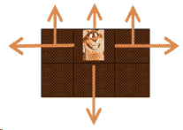

# 小米 2019 秋招安全开发笔试题（B）

## 1

以下说法不正确的是()

正确答案: D   你的答案: 空 (错误)

```cpp
Hash 算法主要被用来做数字签名、数据校验
```

```cpp
SHA-224、SHA-256、SHA-384 和 SHA-512 并称为 SHA-2
```

```cpp
已知明文攻击对 AES 算法无效
```

```cpp
非对称加密算法，就是加密、解密的密钥分为两组，并且可以互相反推
```

本题知识点

运维工程师 小米 加密和安全 安全工程师 小米 2019 安全工程师 小米 2019

讨论

[数据思维](https://www.nowcoder.com/profile/9912031)

非对称加密算法不可逆，不能反推

发表于 2019-08-29 02:02:40

* * *

[★☆110](https://www.nowcoder.com/profile/8039331)

SHA-2 可分为六个不同的算法标准，包括了：SHA-224、SHA-256、SHA-384、SHA-512、SHA-512/224、SHA-512/256。

发表于 2019-10-10 13:42:16

* * *

## 2

下面那种 DOS 发生在应用层？()

正确答案: D   你的答案: 空 (错误)

```cpp
TCP SYN 泛洪攻击
```

```cpp
UDP flood
```

```cpp
ICMP flood
```

```cpp
CC 攻击
```

本题知识点

运维工程师 小米 安全工程师 2019

讨论

[啥也不会肿么办](https://www.nowcoder.com/profile/133569065)

前两项是传输层，ICMP 是网络层

发表于 2019-09-09 19:59:49

* * *

## 3

请选出和其他选项不同的一项()

正确答案: D   你的答案: 空 (错误)

```cpp
RSA
```

```cpp
AES
```

```cpp
椭圆曲线（ECC）
```

```cpp
SHA-256
```

本题知识点

运维工程师 小米 加密和安全 安全工程师 2019

讨论

[乐易](https://www.nowcoder.com/profile/175949726)

其他三个都为加密算法，只有 sha-256 位安全散列算法，用于求消息摘要，不用于加密

发表于 2019-08-18 20:39:20

* * *

[牛客 847453968 号](https://www.nowcoder.com/profile/847453968)

看到 AC 是非对称加密，B 是对称加密算法，一下子就选了 B 没看到 D D 是哈希算法 计算散列值 前三个都是加密算法 一定要审题 看完题目 选项 不能犯这样的低级错误

发表于 2021-01-13 09:48:05

* * *

[571 有你不孤单](https://www.nowcoder.com/profile/709635731)

我选择 B，B 是对称加密 其它都是非对称加密，我搞不明白这样分类为什么是错的

发表于 2020-04-04 23:31:46

* * *

## 4

你知道的前端产生的漏洞有()

正确答案: A   你的答案: 空 (错误)

```cpp
XSS
```

```cpp
SSTI
```

```cpp
SQLi
```

```cpp
SSRF
```

本题知识点

运维工程师 小米 安全工程师 2019

## 5

linux 系统疑似遭遇账号的暴力破解行为，通过以下哪个日志文件，可以初步的进行判断(）

正确答案: B   你的答案: 空 (错误)

```cpp
/var/log/message
```

```cpp
/var/log/secure
```

```cpp
/var/log/dmesg
```

```cpp
/var/log/yum.log
```

本题知识点

运维工程师 小米 安全工程师 2019

讨论

[onion_ne](https://www.nowcoder.com/profile/895309758)

1.  /var/log/messages — 包括整体系统信息，其中也包含系统启动期间的日志。此外，mail，cron，daemon，kern 和 auth 等内容也记录 var/log/messages 日志中
2.  /var/log/dmesg — 包含内核缓冲信息（kernel ring buffer）。在系统启动时，会在屏幕上显示许多与硬件有关的信息。可以用 dmesg 查看它们
3.  /var/log/yum.log — 包含使用 yum 安装的软件包信息
4.  /var/log/secure — **包含验证和授权方面信息。例如，sshd 会将所有信息记录（其中包括失败登录）**

发表于 2019-08-16 20:45:13

* * *

## 6

通过设置 LD_PRELOAD 环境变量，能达到什么目的（）

正确答案: B   你的答案: 空 (错误)

```cpp
提前载入动态库，提高程序启动效
```

```cpp
替换掉程序依赖的动态库，达到注入程序的目的
```

```cpp
其功能等同于运行 ldconfig 命令
```

```cpp
可以更新系统依赖库到最新版本
```

本题知识点

运维工程师 小米 安全工程师 2019

## 7

关于网络端口号，以下哪个说法是正确的（）

正确答案: A   你的答案: 空 (错误)

```cpp
通过 netstat 命令，可以查看进程监听端口的情况
```

```cpp
https 协议默认端口号是 8081
```

```cpp
iptables 命令用于设置 ip 访问规则，不能设置端口访问规则
```

```cpp
一般认为，0-1024 之间的端口号为周知端口号(Well Known Ports)
```

本题知识点

运维工程师 小米 网络基础 安全工程师 2019

讨论

[取个 name 太难](https://www.nowcoder.com/profile/540555690)

A. 通过 netstat 命令，可以查看进程监听端口的情况
B. https 协议的默认端口号为 443；HTTP 协议代理服务器常用端口号:80/8080/3128/8081/9080C. iptables 既可以根据 IP 制定策略，也可以根据端口制定策略 D. 0-1023 是周知端口号

发表于 2020-10-11 09:27:33

* * *

[啥也不会肿么办](https://www.nowcoder.com/profile/133569065)

https 端口号 443iptables 既可以根据 IP 制定策略，也可以根据端口制定策略 0-1023 是周知端口号

发表于 2019-09-09 20:03:11

* * *

[aJanm](https://www.nowcoder.com/profile/987941610)

对于 D 服务器端使用的端口号这里又分为两类，最重要的一类叫做熟知端口号(well-known port number)或系统端口号，或者题目说的周知端口号。数值为 0～1023。这些数值可在网址 www.iana.org 查到。另一类叫做登记端口号，数值为 1024～49151。这类端口号是为没有熟知端口号的应用程序使用的。 客户端使用的端口号 数值为 49152～65535。

发表于 2020-07-22 15:44:16

* * *

## 8

以下程序：

```cpp
mov ax, 0
mov bx, 1
mov cx, 100
A: add ax, bx
inc bx
loop A
HLT
```

执行后（BX）= 的结果是？

正确答案: C   你的答案: 空 (错误)

```cpp
99
```

```cpp
100
```

```cpp
101
```

```cpp
102
```

本题知识点

运维工程师 小米 编程基础 *安全工程师 小米 2019 安全工程师 小米 2019* *讨论

[Guaidao](https://www.nowcoder.com/profile/300027476)

cx 是循环计数寄存器，cx=100；每次执行循环都会有 cx = cx - 1，等于 0 跳出循环总共执行一百次, bx = 100+1

发表于 2019-09-13 14:58:09

* * *

## 9

在 Windows 下，以下哪些是绕过 DEP 保护进行缓冲区溢出的方式（）

正确答案: B   你的答案: 空 (错误)

```cpp
Heap spray
```

```cpp
ROP
```

```cpp
伪造 SHE
```

```cpp
暴力破解安全 cookie
```

本题知识点

运维工程师 小米 安全工程师 2019

## 10

对于摄像头产品，下面说法错误的是()

正确答案: A   你的答案: 空 (错误)

```cpp
为了方便对摄像头进行调试和维护，设备需默认开启远程管理服务，比如 telnet
```

```cpp
为了保证用户隐私安全，视频数据传输需要加密
```

```cpp
基于安全最小化原则，设备对外尽可能少的开放不必要的服务
```

```cpp
对于设备来说，使用基于 https 的 DNS 服务会更安全
```

本题知识点

运维工程师 小米 加密和安全 安全工程师 2019

讨论

[大星星和小猩猩](https://www.nowcoder.com/profile/9374535)

D.一开始还以为是错误的，因为 DNS 和 Https 都是应用层的，所以基于 Https 的 DNS 让人感觉很荒谬。 后来上网一查，发现，此 DNS 非旧的 DNS，旧的 DNS 容易被劫持，但是通过 HTTPS 发送，并由 TLS 提供安全性保护，完整性保护源于服务器的公钥，从而保证没有人欺骗 DNS 服务器。

发表于 2020-03-13 23:36:46

* * *

[菊厂最菜萌新](https://www.nowcoder.com/profile/615491573)

开启 telnet 可能会被不怀好意的人远程开启摄像头，通过摄像头进行偷窥，造成隐私泄露

发表于 2020-07-09 21:50:21

* * *

[-̗̀(๑ᵔ⌔ᵔ๑)-̗̀(๑ᵔ⌔ᵔ๑)](https://www.nowcoder.com/profile/7167749)

不懂，为什么

发表于 2019-10-17 21:04:10

* * *

## 11

以下哪个选项是已知的不安全的加密算法（）

正确答案: A C   你的答案: 空 (错误)

```cpp
RC4
```

```cpp
AES256
```

```cpp
RSA1024
```

```cpp
3DES
```

本题知识点

运维工程师 小米 加密和安全 安全工程师 2019

讨论

[特务兔](https://www.nowcoder.com/profile/3999635)

*   破解加密的难度除了跟**加密方法**有关，还跟**密钥长度**以及**加密模式**有很大的关系。AES256 是美国 NIST 在几种加密算法竞赛中选出来的对称加密算法，是用于取代(3)DES 的，有 AES128 和 AES256（**代表密钥长度**），而 AES 存在四种模式：ECB、CBC、CFB、OFB（**代表加密模式**），并且进行 14 轮加密。*   RSA1024 是属于非对称加密，是基于大整数因式分解难度，也就是两个质数相乘很容易，但是找一个大数的质因子非常困难。量子计算机时代，RSA 有一定的风险，[要实现与 AES256 相当的加密强度，RSA 加密算法长度要达到 16384 位，另外 RSA1024 目前已经不被认为是安全的加密算法](https://link.zhihu.com/?target=https%3A/en.wikipedia.org/wiki/Shor%2527s_algorithm)。具体可以参考：[超链接](https://link.zhihu.com/?target=https%3A/en.wikipedia.org/wiki/Shor%2527s_algorithm)*   AES256 目前没有明显的漏洞，唯一的问题就是如何安全的分发密钥。*   一般加密解密都是同时应用 RSA 和 AES，使用 RSA 进行密钥分发、协商，使用 AES 进行业务数据的加解密。 

发表于 2019-09-05 10:22:39

* * *

[八块腹肌的阿兵丶](https://www.nowcoder.com/profile/1135222)

目前被破解的最长 RSA 密钥就是 768 位，RSA1024 也挺安全的吧

发表于 2019-10-30 18:36:51

* * *

[大星星和小猩猩](https://www.nowcoder.com/profile/9374535)

RC4 是一种流加密算法。

发表于 2020-03-13 13:13:18

* * *

## 12

下面哪些功能可能存在 ssrf？

正确答案: A B C D   你的答案: 空 (错误)

```cpp
分享功能
```

```cpp
转码服务
```

```cpp
在线翻译
```

```cpp
图片加载
```

本题知识点

运维工程师 小米 安全工程师 2019

## 13

Mysql sql 注入中使用延时注入时常用的语句是（）

正确答案: B C   你的答案: 空 (错误)

```cpp
wait for delay ‘0:0:10’
```

```cpp
sleep(5)
```

```cpp
benchmark(100000000,md5(1))
```

```cpp
union select
```

本题知识点

运维工程师 小米 数据库 安全工程师 2019

讨论

[归来仍是少年 v](https://www.nowcoder.com/profile/255695337)

BENCHMARK() (M)

滥用这个命令会让 mysql 停一下，会大量消耗 web 服务器资源

发表于 2019-09-04 10:15:12

* * *

[健康成长玛卡巴卡](https://www.nowcoder.com/profile/403566687)

WAITFOR 不是 SQL 的标准语句，所以它只适用于 SQL Server 数据库。

发表于 2021-04-25 16:39:42

* * *

[闲鱼总算翻了身](https://www.nowcoder.com/profile/909589300)

利用 Sleep()或 Benchmark()等函数让 MySQL 执行时间变长

发表于 2021-07-20 23:03:18

* * *

## 14

服务器入侵溯源可以依赖于？（）

正确答案: A B C D   你的答案: 空 (错误)

```cpp
网站源码分析
```

```cpp
日志分析
```

```cpp
系统存储的信息分析
```

```cpp
分析进程端口
```

本题知识点

运维工程师 小米 安全工程师 2019

## 15

关于 SELinux，以下说法正确的是（）

正确答案: A B   你的答案: 空 (错误)

```cpp
对某个程序进行了 SELinux 访问配置，即使此程序使用 root 身份运行，被禁止的资源仍然不能访问
```

```cpp
2.6 及以上版本的 linux 内核已经集成 SELinux 模块
```

```cpp
SELinux 是一款广泛应用于 linux 系统的杀掉软件
```

```cpp
SELinux 是防火墙的替代产品
```

本题知识点

运维工程师 小米 安全工程师 2019

## 16

关于 linux 文件系统权限中的 SUID，描述正确的是（）

正确答案: A B C   你的答案: 空 (错误)

```cpp
当一个设置了 SUID 位的可执行文件被执行时，无论谁来执行这个文件，他都暂时拥有文件所有者的权限
```

```cpp
可以通过 chmod u+s 命令设置 SUID 属性
```

```cpp
passwd 命令就是通过 SUID 机制，在任何用户修改密码时，有权限访问密码存储文件
```

```cpp
其他选项均不正确
```

本题知识点

运维工程师 小米 Linux 安全工程师 2019

讨论

[大星星和小猩猩](https://www.nowcoder.com/profile/9374535)

SUID 是 **Set User ID**, SGID 是 Set Group ID 的意思。SUID 的作用就是：**让本来没有相应权限的用户运行这个程序时，可以访问没有权限访问的资源。**为什么需要扩展权限呢？
因为特殊权限可以扩展系统基础权限的功能，使得 linux 权限更加强大灵活。

发表于 2020-04-05 21:52:06

* * *

[黄色变白色](https://www.nowcoder.com/profile/8547911)

suid 意味着如果 A 用户对属于他自己的 shell 脚本文件设置了这种权限，那么其他用户在执行这个脚本的时候就拥有了 A 用户的权限。所以，如果 root 用户对某一脚本设置了这一权限的话则其他用户执行该脚本的时候则拥有了 root 用户权限。权限设定方法：
字母表示法:
    chmod u+s FILE...
    chmod u-s FILE...
数字表示法:
    chmod 4755 FILE 添加 SUID 权限到二进制程序文件(添加到 DIR 无意义)
在普通三位数字权限位之前,用 4 代表添加的 SUID 位
    chmod 0xxx .... 可以删除文件的 SUID(无法删除目录的 SUID)  

发表于 2019-08-29 21:01:51

* * *

[feelinghappy](https://www.nowcoder.com/profile/6136320)

> **安全上下文**
> 
> 前提：进程有属主和属组，文件有属主和属组
> 
> *   任何一个可执行程序文件能不能启动为进程：取决发起者对程序文件是否拥有执行权限
> *   启动为进程之后，**其进程的属主为发起者**：进程的属组为发起者所属的组
> *   进程访问文件时的权限，取决于进程的发起者
>     *   进程的发起者，同文件属主，则应用文件属主权限
>     *   进程的发起者，属于文件的属组，则应用文件属组权限
>     *   应用文件“其它”权限
> 
> ** SUID 提权**
> 
> 打破了安全上下文规则
> 
> *   任何一个可执行程序文件能不能启动为进程：取决发起者对程序文件是否拥有执行权限
> *   启动为进程之后，其**进程的属主为**原程序文**件的属主：**（进程的属组没有太大意义）
> 
> 权限设定：
> 
> chmod u+**s ** FILENAME
> 
> chmod u-**s**  FILENAME
> 
> **SGID**
> 
> 默认情况下，用户创建文件时，其属组为此用户所属的基本组；
> 
> **一旦某目录被设定了 SGID，则对此目录有写权限的用户在此目录中创建的文件所属的组为此目录的属组**
> 
> 权限设定
> 
> chmod g+**s** DIR...
> 
> chmod  g-**s**  DIR...
> 
> **一个用户能不能删除于该文件，取决于该文件所在目录是否有写权限**
> 
> Sticky  粘滞位
> 
> **对于一个多人可写的目录，如果设置了 sticky，则每个用户仅能删除自己的文件**
> 
> 权限设定：
> 
> chmod  o+**t **DIR...
> 
> chmod  o-**t**  DIR...
> 
> 默认情况/tmp 目录设置了 -t 权限
> 
> 
> 
> SUID SGID STICKY
> 
>     0    0    0
> 
>       ...
> 
>     1     1     1
> 
> chmod  4777 /tmp/a.txt    ：代表特殊权限位置，该 4 代表具有 SUID 权限
> 
> 注：
> 
> SUID : user 占据属主的执行权限位
> 
> s :  属主拥有 x 权限
> 
> S：属主没有 x 权限
> 
> GUID : group ，占据属组的执行权限位
> 
> s :  group 拥有 x 权限
> 
> S：group 没有 x 权限
> 
>    Sticky : other，占据其它的执行权限位
> 
> t :  other 拥有 x 权限
> 
> T：other 没有 x 权限

发表于 2020-08-22 21:04:02

* * *

## 17

关于 sudo 命令，以下说法正确的是（）

正确答案: A B C   你的答案: 空 (错误)

```cpp
允许授权用户以超级用户或其他用户身份执行命令
```

```cpp
能限制指定用户在指定主机上运行某些命令
```

```cpp
默认情况下，只有 root 用户可以使用 sudo 命令
```

```cpp
su 命令是 sudo 命令的链接，指向 sudo 命令
```

本题知识点

运维工程师 小米 安全工程师 2019

## 18

BLE 容易遭受哪些攻击？（）

正确答案: A B C   你的答案: 空 (错误)

```cpp
重放攻击
```

```cpp
拒绝服务攻击
```

```cpp
主动和被动监听
```

```cpp
心脏滴血攻击
```

本题知识点

运维工程师 小米 安全工程师 2019 奇安信 2020

## 19

用串口连接设备，一般用到哪几个针脚？（）

正确答案: A B C   你的答案: 空 (错误)

```cpp
GND
```

```cpp
TX
```

```cpp
RX
```

```cpp
VNC
```

本题知识点

运维工程师 小米 安全工程师 2019

## 20

以下容易造成缓冲区溢出的函数是（）

正确答案: A C   你的答案: 空 (错误)

```cpp
strcpy
```

```cpp
strncat
```

```cpp
sprintf
```

```cpp
strcmp
```

本题知识点

小米 C++工程师 C++ C 语言 奇安信

讨论

[Lee124](https://www.nowcoder.com/profile/957365898)

A. strcpy     没限制长度可能导致溢出（安全版本 strncpy）B. strncat    限制了 copy 的长度就没问题，strcat 可能导致溢出 C. sprintf     和 printf()一样，有格式化字符串攻击的可能 D. strcmp    比较两个 string 长度，无危害

发表于 2020-09-01 20:35:31

* * *

[MonkeyH](https://www.nowcoder.com/profile/8391276)

1.  strcpy() :函数将源字符串复制到缓冲区。没有指定要复制字符的具体数目！如果源字符串碰巧来自用户输入，且没有专门限制其大小，则有可能会造成缓冲区溢出！
2.  strcat() :函数非常类似于 strcpy()，它可以将一个字符串合并到缓冲区末尾。
3.  sprintf()、vsprintf() : 用来格式化文本和将其存入缓冲区的通用函数

        可以看出来在对缓冲区进行写操作的时候都有可能导致内存溢出。

发表于 2019-03-20 09:21:09

* * *

[牛客 135416480 号](https://www.nowcoder.com/profile/135416480)

一脸茫然，，，

发表于 2020-11-03 19:11:33

* * *

## 21

有一只地鼠不小心跑进了一个 m*n 的矩形田地里，假设地鼠在这块田地的初始位置为（x,y），并且每次只能向相邻的上下左右四个方向移动一步，那么在最多移动 K 次的情况下，有多少条路径可以逃出这片田地（一旦出去田地的边界就不能再往回走）？
下面是样例示意图：


本题知识点

小米 Java 工程师 C++工程师 安卓工程师 运维工程师 前端工程师 测试工程师 队列 *动态规划 安全工程师 2019 2018* *讨论

[任肖乐](https://www.nowcoder.com/profile/278574475)

田鼠：麻买批

发表于 2019-04-18 13:25:18

* * *

[随缘笔试](https://www.nowcoder.com/profile/427157)

```cpp
#include <bits/stdc++.h>
using namespace std;

int m, n, x, y, k, ans;
int dx[] = {0, 1, -1, 0};
int dy[] = {1, 0, 0, -1};

bool outside(int x, int y) {
    return x < 0 || m <= x || y < 0 || n <= y;    
}

void dfs(int x, int y, int k) {
    if (k <= 0) return;
    for (int i = 0; i < 4; ++i) {
        int nx = x + dx[i], ny = y + dy[i];
        if (outside(nx, ny)) ++ans;
        else dfs(nx, ny, k - 1);
    }    
}

int main() {
    scanf("%d %d %d %d %d", &m, &n, &x, &y, &k);
    dfs(x, y, k);
    cout << ans << endl;
    return 0;
}

```

编辑于 2019-08-17 22:46:11

* * *

[nbgao](https://www.nowcoder.com/profile/211289)

```cpp
#include <bits/stdc++.h>
using namespace std;

int m,n,k;

int DFS(int x, int y, int s){
    int sum=0;
    if(s==k)
        return 0;
    if(x==0)
        sum++;
    if(y==0)
        sum++;
    if(x==m-1)
        sum++;
    if(y==n-1)
        sum++;

    if(x>0)
        sum += DFS(x-1,y,s+1);
    if(x<m-1)
        sum += DFS(x+1,y,s+1);
    if(y>0)
        sum += DFS(x,y-1,s+1);
    if(y<n-1)
        sum += DFS(x,y+1,s+1);
    return sum;
}

int main(){
    int x,y;
    cin>>m>>n>>x>>y>>k;
    cout<<DFS(x,y,0)<<endl;    
    return 0;
} 
```

发表于 2019-07-14 23:14:52

* * *

## 22

在你面前有一个 n 阶的楼梯，你一步只能上 1 阶或 2 阶。
请问计算出你可以采用多少种不同的方式爬完这个楼梯。

本题知识点

小米 iOS 工程师 运维工程师 递归 动态规划 2019 安全工程师

讨论

[lentolove](https://www.nowcoder.com/profile/572586026)

考察斐波那契数列
题目要求：只能跳 1 阶或者 2 阶。
定义阶有种跳法

1.  假定第一次跳的是一阶，那么剩下的是 n-1 个台阶，跳法是;
2.  假定第一次跳的是 2 阶，那么剩下的是 n-2 个台阶，跳法是；
3.  总跳法为: 
4.  .

初次提交这个题会发现通过率只有 50%,是因为没有考虑到整数溢出的问题，用 BigInteger 处理就 Ok 了。

```cpp
import java.io.BufferedReader;
import java.io.IOException;
import java.io.InputStreamReader;
import java.math.BigInteger;

public class Main {

    public static void main(String[] args) throws IOException {
        BufferedReader bf = new BufferedReader(new InputStreamReader(System.in));
        int n = Integer.parseInt(bf.readLine());
        if (n < 3) {
            System.out.println(n);
            return;
        }
        BigInteger one = BigInteger.valueOf(1);
        BigInteger two = BigInteger.valueOf(2);
        BigInteger ret = BigInteger.valueOf(0);

        for (int i = 3; i <= n; i++) {
            ret = one.add(two);
            one = two;
            two = ret;
        }
        System.out.println(ret);
    }
}
```

发表于 2019-07-28 13:59:23

* * *

[折子渝](https://www.nowcoder.com/profile/517352000)

写一个 c 语言比较简洁的大整数加法

```cpp
#include <iostream>
#include <vector>
using namespace std;

int main() {
    int n;
    cin >> n;
    vector<vector<int>> dp(n + 5, vector<int> (100, 0));
    dp[1][0] = 1;
    dp[2][0] = 2;
    int len = 1;
    for (int i = 3; i <= n; i++) {
        for (int j = 0; j < len; j++) {
            dp[i][j] += dp[i - 1][j] + dp[i - 2][j];
            if (dp[i][j] > 9) {
                dp[i][j + 1] += dp[i][j] / 10;
                dp[i][j] %= 10;
                len += (j == len - 1);
            }
        }
    }
    for (int i = 0; i < len; i++) cout << dp[n][len - i - 1];
    cout << endl;
    return 0;
}
```

编辑于 2020-03-11 19:45:54

* * *

[广州市民林先生](https://www.nowcoder.com/profile/241061362)

首先这个题目的模型是斐波那契数列（参考剑指 offer 的青蛙跳台阶），思路是很清晰的，但是有一个很棘手的问题：这个题 C++没有大整数类，而题目的用例太大了，long long 也只能通过 55%的用例，所以只能通过字符串来显示。所以整道题的重点就是如何进行字符串相加，手写字符串相加函数、下面的注释很详细了，可以参考

```cpp
#include <iostream>
#include <string>
using namespace std;

string BigData(string s1, string s2){
    string res = "";
    int i = s1.size() - 1;
    int j = s2.size() - 1;
    int carry = 0;  //进位
    while (i >= 0 || j >= 0){
        // s2 一定大于 s1（斐波那契数列的后者 > 前者）
        if(i < 0){
            //当小的字符串先走完时，就剩大字符串了，同理进行逐位添加
            res = to_string((s2[j] - '0') + carry) + res;
            carry = 0;  //只剩一个字符串就不存在进位了，因为都是个位数
        } else{
            //从后往前进行逐位相加，如 123+567,从 3+7 开始往前加，别忘了加上进位
            int tmp = (s1[i] - '0') + (s2[j] - '0') + carry;
            carry = tmp / 10;  //得到进位
            tmp = tmp % 10;    //得到余数
            res = to_string(tmp) + res; //这里顺序记得不能颠倒，不然就错了
        }
        --i; --j;
    }
    //为什么下面还要判定呢？因为比如 3+7 应该等于 10，但是
    //上面的计算出的 res 只有 0(余数)，所以这里要考虑周全
    if(carry == 1)
        res = '1' + res;
    return res;
}
int main(){
    int n;
    cin >> n;
    //斐波那契
    if(n == 1){
        cout << 1 << endl;
        return 0;
    } else if(n == 2){
        cout << 2 << endl;
        return 0;
    }
    string i = "1";
    string j = "2";
    string ans = "";
    for(int k = 1; k <= n - 2; ++k){
        ans = BigData(i, j);  // i + j
        i = j;   
        j = ans;
    }
    cout << ans << endl;
    return 0;
}
```

编辑于 2020-06-03 21:22:49

* * ***