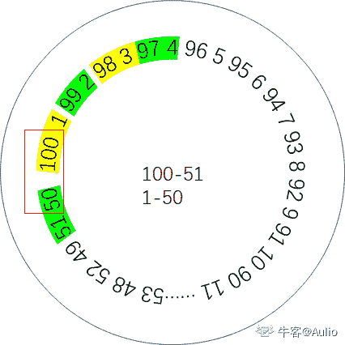

# 小米 2019 秋招测试开发笔试题（A）

## 1

设 m 和都是 int 类型,那么以下 for 循环语句的执行情况是( )

```cpp
for (m = 0, n = -1; n = 0; m++, n++)
n++;
```

正确答案: D   你的答案: 空 (错误)

```cpp
循环体一次也不执行
```

```cpp
循环体执行一次 是无限循环
```

```cpp
有限次循环
```

```cpp
循环结束判断条件不合法
```

本题知识点

Java 工程师 C++工程师 测试工程师 小米 Java 测试开发工程师 2019 C++ C 语言

讨论

[moaster](https://www.nowcoder.com/profile/395954105)

for 循环的结束判定条件  是  boolean 型    n = 0 是 int 类型 会有编译异常 

发表于 2019-09-01 16:25:35

* * *

[6201908100753982](https://www.nowcoder.com/profile/707626581)

？？？？

发表于 2019-08-22 12:43:05

* * *

[bobbie.ho](https://www.nowcoder.com/profile/426351696)

上来就是一个 D 我也是醉了 n = 0 不是 boolean 型的所以语法错误 for(初始化语句；判断条件语句；控制条件语句){
循环体语句；
}

发表于 2019-08-21 22:37:04

* * *

## 2

在一个双向循环链表中,指针 p 所指向的节点(非尾节点)之后插入指针 s 指向的节点,其修改指针的操作是（）

正确答案: D   你的答案: 空 (错误)

```cpp
p->next->prev=s; p->next=s; s->prev=p; s->next=p->next;
```

```cpp
s->next =p->next;s->prev=p; p->next=s;p->next->prev=s;
```

```cpp
s->prev=p; s->next=p->next; p->next=s; p->next->prev=s;
```

```cpp
s->prev=p; s->next=p->next; p->next->prev=s; p->next=s;
```

本题知识点

Java 工程师 C++工程师 测试工程师 小米 链表 *C++ 测试开发工程师 小米 2019 测试开发工程师 小米 2019* *讨论

[骑猪看日落 123](https://www.nowcoder.com/profile/369627459)

。。。画个链表图照着选项走一遍就知道了

发表于 2019-10-16 15:25:41

* * *

[头大的想象](https://www.nowcoder.com/profile/768519563)

p->next=s 要放在最后

发表于 2019-09-06 20:31:56

* * *

[半窗](https://www.nowcoder.com/profile/336927969)

要先找到 p 的下一个节点，让 p->next->prev=s->next,如果不先找到 p 的下一节点，插入后就找不到下一节点了

发表于 2019-09-22 14:29:49

* * *

## 3

如果一个展览馆参观者到达的速率是每分钟 20 人，平均每个人在馆内停留 30 分钟，那么该展览馆至少需要容纳 __ 人才行？（）

正确答案: C   你的答案: 空 (错误)

```cpp
400
```

```cpp
500
```

```cpp
600
```

```cpp
700
```

本题知识点

Java 工程师 C++工程师 测试工程师 小米 数学运算 测试开发工程师 小米 2019 测试开发工程师 小米 2019

讨论

[锦鲤超越保佑我](https://www.nowcoder.com/profile/234430431)

假设你是第一个，从自己进去到离开一共又进了多少人。20×30

发表于 2019-08-22 08:11:39

* * *

[JGod](https://www.nowcoder.com/profile/626417404)

这题我以为是考时间点和时间片...假设 30 分钟是，馆内 600 人，在 30-31 分钟之间，是会进人的，不是在 31 分钟时，退出人时，再进新一分钟的人。

发表于 2020-06-02 20:11:49

* * *

[offer 垃圾变身 offer 收割机！](https://www.nowcoder.com/profile/195483163)

20 和 30 的最小公约数

发表于 2019-09-19 09:42:23

* * *

## 4

将 1,2,3,......,99,100 任意排列成一个圈，相邻两数的差的绝对值求和最多为（ ）

正确答案: C   你的答案: 空 (错误)

```cpp
500
```

```cpp
2500
```

```cpp
5000
```

```cpp
1000
```

本题知识点

Java 工程师 C++工程师 测试工程师 小米 数学运算 测试开发工程师 小米 2019 测试开发工程师 小米 2019

讨论

[【pearls】](https://www.nowcoder.com/profile/169606213)

排成一圈的情况下，100、1、99、2、98、3......51、49、50。那么第一个 100 和最后一个 50 相差 50，所以结果就是等差数列 1、2、3...99 的和再加 50=5000.

发表于 2019-09-01 21:52:46

* * *

[Aulio](https://www.nowcoder.com/profile/148068085)

奇数位按照 100-51 递减，偶数位按照 1-50 递增，能确保差值的绝对值最大.两两之间算一组，每一组的差值绝对值依次为 99、98、97、96……1，还有最后 50 跟 100 的差值 50，按照等差数列求和公式，（a[0]+a[n]）*n/2，再加上 50，得 5000

编辑于 2019-10-31 21:52:13

* * *

[超越保佑来个 offer](https://www.nowcoder.com/profile/211799241)

看清楚是任意排成一排,所以 100-->1-->99......这样排的和最大求和就是一个等差数列 99+98+97+.....+1

发表于 2019-08-17 21:19:07

* * *

## 5

设有图书管理数据库：
图书(总编号 C(6),分类号 C(8),书名 C(16),作者 C(6),出版单位 C(20),单价 N(6,2))
读者(借书证号 C(4),单位 C(8),姓名 C(6),性别 C(2),职称 C(6),地址 C(20))
借阅(借书证号 C(4),总编号 C(6),借书日期 D(8))
对于图书管理数据库，查询 0001 号借书证的读者姓名和所借图书的书名。
SQL 语句正确的是 ______：SELECT 姓名,书名 FROM 借阅,图书,读者 WHERE
  借阅.借书证号="0001" AND
  ___
  ___

正确答案: B   你的答案: 空 (错误)

```cpp
图书.分类号=借阅.分类号 AND;
读者.借书证号=借阅.借书证号
```

```cpp
图书.总编号=借阅.总编号 AND;
读者.借书证号=借阅.借书证号
```

```cpp
读者.总编号=借阅.总编号 AND;
读者.借书证号=借阅.借书证号
```

```cpp
图书.总编号=借阅.总编号 AND;
读者.书名=借阅.书名
```

本题知识点

Java 工程师 C++工程师 测试工程师 小米 数据库 SQL 测试开发工程师 2019

讨论

[业余爱好者](https://www.nowcoder.com/profile/563759697)

中文看着难受、

发表于 2021-02-05 14:48:44

* * *

[98 年饭崽](https://www.nowcoder.com/profile/56600133)

仔细！仔细！注意表与表之间的中介联系，本题图书的总编号借阅中的总编号;借阅表中的借书证号读者表中的借书证号；借阅表将图书表和读者表联系在一起！

发表于 2020-02-24 17:23:58

* * *

[噼里啪啦砰、砰、砰](https://www.nowcoder.com/profile/184179031)

A 借阅没有分类号 C 读者没有总编号 D 读者没有书名

发表于 2020-09-08 09:28:05

* * *

## 6

设有两个数据库表，父表和子表之间是一对多的联系，为控制子表和父表的关联，可以设置"参照完整性规则"，为此要求这两个表(  )。

正确答案: B   你的答案: 空 (错误)

```cpp
在父表连接字段上建立普通索引，在子表连接字段上建立主索引
```

```cpp
在父表连接字段上建立主索引，在子表连接字段上建立普通索引
```

```cpp
在父表连接字段上不需要建立任何索引，在子表连接字段上建立普通索引
```

```cpp
在父表和子表的连接字段上都要建立主索引
```

本题知识点

Java 工程师 C++工程师 测试工程师 小米 数据库 测试开发工程师 2019

讨论

[张（...）♡](https://www.nowcoder.com/profile/94110983)

用订单表和订单项表解释一下，订单表相当于父表，订单项表相当于子表，一个订单中可以包括多个订单项。订单 id 是父表的主键，根据订单 id 在子表查询相应的订单项集合。因为使用的是订单 id，所以应该对应父表是主索引，而在子表中只是一个普通字段，所以是普通索引。

发表于 2019-09-29 14:44:44

* * *

[海海不掉头发](https://www.nowcoder.com/profile/493926724)

选 B，

```cpp
在父表连接字段上建立主索引，在子表连接字段上建立普通索引。
```

发表于 2021-05-12 15:35:53

* * *

## 7

在分时系统中,时间片一定,( ),响应时间越长.

正确答案: B   你的答案: 空 (错误)

```cpp
内存越多
```

```cpp
用户数越多
```

```cpp
后备福利
```

```cpp
用户数越少
```

本题知识点

Java 工程师 C++工程师 测试工程师 小米 操作系统 测试开发工程师 2019

讨论

[是瑶瑶公主呀](https://www.nowcoder.com/profile/592649258)

时间片固定的，每个用户的占有时间就是固定的，那么用户数越多等待时间越长

发表于 2019-10-23 08:37:24

* * *

## 8

某公司使用包过滤防火墙控制进出公司局域网的数据,在不考虑使用代理服务器的情况下,下面描述错误的是”该防火墙能够(  )

正确答案: D   你的答案: 空 (错误)

```cpp
使员工不能直接访问 FTP 服务器端口号为 21 的 FTP 地址.
```

```cpp
使公司员工只能访问 Internet 上与其业务联系的公司的 IP 地址.
```

```cpp
仅允许公司中具有某些特定 IP 地址的计算机可以访问外部网络
```

```cpp
仅允许 HTTP 协议通过,不允许其他协议通过,例如 TCP/UDP.
```

本题知识点

Java 工程师 C++工程师 测试工程师 小米 网络基础 测试开发工程师 小米 2019 测试开发工程师 小米 2019

讨论

[只想划水](https://www.nowcoder.com/profile/743029166)

包过滤防火墙工作在网络层，可以根据数据包包头中的各项信息来控制站点与站点、站点与网络、网络与网络之间的相互访问，但无法控制传输数据的内容，因为内容是应用层数据，HTTP 协议属于应用层协议，包过滤防火墙并不会去检测过滤。并且 HTTP 协议是通过 TCP 协议实现的。所以 D 错误。

发表于 2019-08-12 13:49:25

* * *

[沉鱼](https://www.nowcoder.com/profile/612950621)

21 端口用于连接，20 端口用于传输数据。进行 FTP 文件传输中，客户端首先连接到 FTP 服务器的 21 端口，进行用户的认证，认证成功后，要传输文件时，服务器会开一个端口为 20 来进行传输数据文件。 也就是说，端口 20 才是真正传输所用到的端口，端口 21 只用于 FTP 的登陆认证。我们平常下载文件时，会遇到下载到 99%时，文件不完成，不能成功的下载。 其实是因为文件下载完毕后，还要在 21 端口再行进行用户认证，而下载文件的时间如果过长，客户机与服务器的 21 端口的连接会被服务器认为是超时连接而中断掉，就是这个原因。解决方法就是设置 21 端口的响应时间。

发表于 2019-10-30 20:06:12

* * *

## 9

下面程序段的时间复杂度是（）

```cpp
i= k = 0;
while (k < n) {
    i++;
    k += i;
}
```

正确答案: B   你的答案: 空 (错误)

```cpp
O(n)
```

```cpp
O(n^(1/2))
```

```cpp
O(n*i)
```

```cpp
O(n+i)
```

本题知识点

复杂度

讨论

[情愿啊](https://www.nowcoder.com/profile/682762648)

设 q 为一共要执行的次数 1           2               3    ....   qk=0+1; k=1+1    k=2+1 ... 1+2+3+...+q=n ==>q(1+q)/2=n==>q²+q=2n

q²+q+1/4=2n+1/4
(q+1/2)=(2n+1/4)¹/2
q=(2n+1/4)¹/2-1/2
所以 T(n)=O(n¹/2)

发表于 2019-10-10 15:24:47

* * *

[时文康](https://www.nowcoder.com/profile/101764790)

加是开根号，乘是取对数

发表于 2019-12-17 17:25:14

* * *

[小 haes](https://www.nowcoder.com/profile/4961098)

写写数字, 观察规律 i= 1, 2, 3, 4,   5,   6,   7,   8k=1, 3, 6, 10, 15, 21, 28, 36 把 k 的数字两个两个一起看的话, 也就是(1,3), (6,10), (15, 21), (7,8), 求和后可以发现规律(1+3=4), (6+10=16), (15+21=36), (28+36=64)也就是 2², 4², 6², 8²...偶数的平方循环在 x²>=n 时终止, 可得 x 等于根号 n,也就是 n^(1/2)循环的次数是 x/2, 时间复杂度为 O((1/2)n^(1/2)), 一般而言时间复杂度认为常系数为 1, 所以答案就是 O(n^(1/2))

发表于 2019-11-26 09:04:22

* * *

## 10

软件内部质量的特性中，以下哪几种是正确的？（）

正确答案: A B D   你的答案: 空 (错误)

```cpp
可靠性
```

```cpp
易用性
```

```cpp
实用性
```

```cpp
效率性
```

本题知识点

Java 工程师 C++工程师 测试工程师 小米 软件工程 测试开发工程师 2019

讨论

[只想划水](https://www.nowcoder.com/profile/743029166)

**软件质量的内在特性：**
1\. **功能性**：软件所实现的功能满足用户需求的程度．功能性反映了所开发的软件满足用户称述的或蕴涵的需求的程度，即用户要求的功能是否全部实现了。 2\. **可靠性**：在规定的时间和条件下，软件所能维持其性能水平的程度。可靠性对某些软件是重要的质量要求，它除了反映软件满足用户需求正常运行的程度，且反映了在故障发生时能继续运行的程度。 
3\. **易使用性**：对于一个软件，用户学习、操作、准备输入和理解输出时，所做努力的程度。易使用性反映了与用户的友善性，即用户在使用本软件时是否方便。 
4. **效率**：在指定的条件下，用软件实现某种功能所需的计算机资源（包括时间）的有效程度。效率反映了在完成功能要求时，有没有浪费资源，此外"资源";这个术语有比较广泛的含义，它包括了内存、外存的使用，通道能力及处理时间。 
5\. **可维修性**：在一个可运行软件中，为了满足用户需求、环境改变或软件错误发生时，进行相应修改所做的努力程度。可维修性反映了在用户需求改变或软件环境发生变更时，对软件系统进行相应修改的容易程度。一个易于维护的软件系统也是一个易理解、易测试和易修改的软件，以便纠正或增加新的功能，或允许在不同软件环境上进行操作。 
6\. **可移植性**：从一个计算机系统或环境转移到另一个计算机系统或环境的容易程度。

发表于 2019-08-12 14:56:20

* * *

## 11

软件测试的基本标准中哪些是正确的？（）

正确答案: A B D   你的答案: 空 (错误)

```cpp
应当把“尽早地和不断地进行软件测试”作为软件测试者的座右铭
```

```cpp
尽量避免测试的随意性
```

```cpp
不必兼顾合理的输入和不合理的输入数据
```

```cpp
完全测试是不可能的，测试需要终止
```

本题知识点

Java 工程师 C++工程师 测试工程师 小米 软件测试 测试开发工程师 2019

讨论

[树先生啊](https://www.nowcoder.com/profile/631917178)

ABD
(1)所有的测试都应追溯到用户需求。 (2)应当把“尽早地和不断地进行软件测试”作为座右铭。 (3)pareto 原则：测试发现的错误中 80%很可能起源于 20%的模块中。
(4)完全测试是不可能的，测试需要终止。
(5)应由独立的第三方来构造测试。
(6)充分注意测试中的群集现象。
**(7)尽量避免测试的随意性。**
(8)兼顾合理的输入和不合理的输入数据。 (9)程序修改后要回归测试。
(10)应长期保留用例，直至系统废弃。

发表于 2019-03-06 18:54:21

* * *

[margo 馒头](https://www.nowcoder.com/profile/94624507)

A 和 D 难道不是矛盾的吗……

发表于 2020-07-12 22:14:01

* * *

[牛客 990014037 号](https://www.nowcoder.com/profile/990014037)

完全测试是不可能的，测试需要终止的意思应该就是说不可能做到完整的测试一个系统，所以在满足通过标准的情况下就可以终止测试了

发表于 2020-03-23 23:33:19

* * *

## 12

编写测试用例前需要做哪些准备工作？（）

正确答案: A B C D   你的答案: 空 (错误)

```cpp
阅读产品规格书
```

```cpp
阅读已有的 bug 列表
```

```cpp
阅读接口描述
```

```cpp
阅读已有的测试用例
```

本题知识点

Java 工程师 C++工程师 测试工程师 小米 软件测试 测试开发工程师 2019

讨论

[牛客 990167708 号](https://www.nowcoder.com/profile/990167708)

用例还没写，我在想 BUG 从哪来

发表于 2021-06-04 07:49:35

* * *

[xfyl](https://www.nowcoder.com/profile/512470783)

不需要看已有的用例吗？确定用例的时候不是还要别人商量，以保测试用例更全面，这两个感觉差别不大啊

发表于 2019-09-04 20:22:18

* * *

[钢铁直男黑脸](https://www.nowcoder.com/profile/5835152)

这是一个多选标题，一定要仔细看每一个选项呀，前三个都应该选

发表于 2019-08-21 13:21:05

* * *

## 13

编写测试用例的目的是什么？（）

正确答案: A C D   你的答案: 空 (错误)

```cpp
从测试用例追溯回功能需求以确保没有需求被疏忽
```

```cpp
总结前人的经验，为后人提供借鉴
```

```cpp
用测试用例来验证产品需求模型的正确性
```

```cpp
通过测试用例以确认是否达到了产品期望的要求
```

本题知识点

Java 工程师 C++工程师 测试工程师 小米 软件测试 测试开发工程师 2019

讨论

[溪云初起日沉阁](https://www.nowcoder.com/profile/255357918)

***后人哀之，而不鉴之，亦使后人而复哀后人也。  ——《******阿房宫赋******》***后人只会大喊 “ **悲哀** ”！而不会借鉴。所以，我们不需要为后人提供借鉴。

发表于 2021-06-06 16:04:42

* * *

[眇，](https://www.nowcoder.com/profile/699670122)

为什么要选 b，给后人提供经验。说得也太玄幻了。一般现在的工作不会想到给后人提供经验吧

发表于 2019-11-20 02:38:10

* * *

[树先生啊](https://www.nowcoder.com/profile/631917178)

ACD，1.根据用户需求所要求的产品特性写出黑盒[功能测试](https://www.baidu.com/s?wd=%E5%8A%9F%E8%83%BD%E6%B5%8B%E8%AF%95&tn=SE_PcZhidaonwhc_ngpagmjz&rsv_dl=gh_pc_zhidao)用例。客户通过使用[测试用例](https://www.baidu.com/s?wd=%E6%B5%8B%E8%AF%95%E7%94%A8%E4%BE%8B&tn=SE_PcZhidaonwhc_ngpagmjz&rsv_dl=gh_pc_zhidao)以确认是否达到了期望的要求。还要从测试用例追溯回功能需求以确保没有需求被疏忽，并且确保所有测试结果与测试用例相一致。同时，要使用测试用例来验证需求模型的正确性，如对话框图和原型等。·
2.测试用例的代表性:
a.能够代表各种合理和不合理的、合法的和非法的、边界和越界的,以及极限的输入数据、操作和环境设置等;
b.测试结果的可判定性:即测试执行结果的正确性是可判定的或可评估的;
c.测试结果的可再现性:即对同样的测试用例,系统的执行结果应当是相同的。

发表于 2019-03-06 18:47:00

* * *

## 14

关于磁盘引导区描述正确的是？（）

正确答案: A B   你的答案: 空 (错误)

```cpp
引导区它记录着一些硬盘最基本的信息
```

```cpp
磁盘引导区记录硬盘的分区信息
```

```cpp
磁盘引导区信息被修改了，硬盘里的数据不会丢失
```

```cpp
FORMAT 能格式化磁盘中的所有分区和信息
```

本题知识点

Java 工程师 C++工程师 测试工程师 小米 操作系统 测试开发工程师 2019

讨论

[只想划水](https://www.nowcoder.com/profile/743029166)

        **磁盘引导区****记录着磁盘的一些最基本的信息**，磁盘的第一个扇区被保留为主引导扇区，它位于整个硬盘的 0 磁道 0 柱面 1 扇区，包括硬盘主引导记录 MBR(Main Boot Record)和分区表 DPT(Disk Partition Table)以及磁盘的有效标志。其中**主引导记录的作用就是检查分区表是否正确以及确定哪个分区为引导分区，并在程序结束时把该分区的启动程序(也就是操作系统引导扇区)调入内存加以执行**。        FORMAT 需要指定要格式化的盘符。

发表于 2019-08-12 15:14:02

* * *

[MapleChen](https://www.nowcoder.com/profile/187482302)

从某些条件来看，C 是对的，毕竟引导区保存的只是地址，真正的数据在非引导区，所以说数据不会丢失也是正确的

发表于 2020-01-04 19:36:15

* * *

[夕吖~~](https://www.nowcoder.com/profile/244477406)

引导块又称启动块或启动分区计算机开机时需要一系列的初始化工作，这些初始化工作是通过执行初始化程序（自举程序）完成的 ROM 中存放很小的“自举装入程序”，通过执行该程序，找到引导块，引导块中存放完整 的初始化程序，将其读入内存，完成初始化

发表于 2020-07-08 17:27:30

* * *

## 15

使用 shell 命令 将某个文件夹下的所有 txt 文件全部找到，并删除或备份 。（）

正确答案: A C D   你的答案: 空 (错误)

```cpp
find /i -type f -name "*.txt" -exec cp {} /test \;
```

```cpp
find /i -type f -name "*.txt" -xargs cp {} /test \;
```

```cpp
find /i -type f -name "*.txt" -exec rm -rf {} \;
```

```cpp
find /i -type f -name "*.txt" -print | xargs -t -i cp {} {}.bak
```

本题知识点

Java 工程师 C++工程师 测试工程师 小米 shell 测试开发工程师 2019

讨论

[只想划水](https://www.nowcoder.com/profile/743029166)

**find pathname -options [-print -exec -ok] **
pathname    find 命令所查找的目录路径。 
-print      find 命令将匹配的文件输出到标准输出。 
-exec       find 命令对匹配的文件执行该参数所给出的 shell 命令。 
-ok 和- exec 的作用相同，只不过以一种更为安全的模式来执行该参数所给出的 shell 命令，在执行每一个命令之前，都会给出提示，让用户来确定是否执行. 

*   1\. -name   按照文件名查找文件 
*   2\. -perm   按照文件权限来查找文件 
*   3\. -mtime -n +n   按照文件的更改时间来查找文件，-n 表示文件更改时间距现在 n 天以内，+n 表示文件更改时间距现在 n 天以前。 
*   4\. -newer file1  查找更改时间比文件 file1 新的文件。 
*   5\. -type   查找某一类型的文件 
*   b - 块设备文件。 
*   d - 目录。 
*   c - 字符设备文件。 
*   p - 管道文件。 
*   l - 符号链接文件。 
*   f - 普通文件。 
*   6\. 使用-size 选项 ,按文件的大小查找文件的

**cp**命令用来将一个或多个源文件或源目录复制到指定的文件或目录中**rm -rf** 删除当前目录下的所有文件**| **管道命令，例：p1 | p2 将 p1 的标准输出作为 p2 的标准输入 xargs 是给命令传递参数的一个过滤器，也是组合多个命令的一个工具。可以将管道或标准输入（stdin）数据转换成命令行参数，也能够从文件的输出中读取数据。一般是和管道一起使用。

*   -a file 从文件中读入作为 sdtin
*   -e flag ，注意有的时候可能会是-E，flag 必须是一个以空格分隔的标志，当 xargs 分析到含有 flag 这个标志的时候就停止。
*   -p 当每次执行一个 argument 的时候询问一次用户。
*   -n num 后面加次数，表示命令在执行的时候一次用的 argument 的个数，默认是用所有的。
*   -t 表示先打印命令，然后再执行。
*   -i 或者是-I，这得看 linux 支持了，将 xargs 的每项名称，一般是一行一行赋值给 {}，可以用 {} 代替。
*   -r no-run-if-empty 当 xargs 的输入为空的时候则停止 xargs，不用再去执行了。
*   -s num 命令行的最大字符数，指的是 xargs 后面那个命令的最大命令行字符数。
*   -L num 从标准输入一次读取 num 行送给 command 命令。
*   -l 同 -L。
*   -d delim 分隔符，默认的 xargs 分隔符是回车，argument 的分隔符是空格，这里修改的是 xargs 的分隔符。
*   -x exit 的意思，主要是配合-s 使用。。
*   -P 修改最大的进程数，默认是 1，为 0 时候为 as many as it can 

**.bak**是备份文件，为文件格式扩展名。  

发表于 2019-08-12 21:00:41

* * *

[牛客 919004817 号](https://www.nowcoder.com/profile/919004817)

删除，并且备份
迷惑？ A  BC D 哪个能行？？？？？

发表于 2020-12-21 22:05:54

* * *

[21201903051925564](https://www.nowcoder.com/profile/428046903)

c 为啥会正确呢,不是说要备份吗,这样子不得被经理吊死?

发表于 2020-11-09 16:57:37

* * *

## 16

有两张表，如下图所示
表 A(仅列出部分数据作参考)
Order_id     User_id    Add_time
11701245001 10000    1498882474
11701245002 10001    1498882475
表 B：(仅列出部分数据作参考)
id     Order_id     goods_id price
1   11701245001    1001     10
2   11701245001    1002     20
3   11701245002    1001     10
问：用 SQL 查询 购买过 goods_id 为 1001 的用户 user_id（）

正确答案: B C D   你的答案: 空 (错误)

```cpp
select user_id from A where order_id = (select order_id from B where goods_id = '1001')
```

```cpp
select a.user_id from A a,B b where a.order_id=b.order_id and b.goods_id='1001'
```

```cpp
select user_id from A where order_id in (select order_id from B where goods_id = '1001')
```

```cpp
Select A.user_id from A left join B on A.order_id=B.order_id where B.goods_id='1001'
```

本题知识点

Java 工程师 C++工程师 测试工程师 小米 数据库 SQL 测试开发工程师 2019

讨论

[passpasspass](https://www.nowcoder.com/profile/8274333)

在子表元素大于 1 时， 不能用= 要用 in in（子表）

发表于 2019-09-08 10:36:34

* * *

[HoneyEvans](https://www.nowcoder.com/profile/715328950)

A 错误在于多个返回查询值不能用=，要用 in

发表于 2020-03-06 23:52:02

* * *

[葵花牌、阳光](https://www.nowcoder.com/profile/754113309)

对于 D 选项，在大多数的关系型数据库里面，如果在使用 left join 的同时，又把附表的条件放在 where 子句中，而不是 on 子句中时，实际的执行效果相当于 inner join .

发表于 2020-04-16 09:15:52

* * *

## 17

一个 bug（软件缺陷记录）包含哪些内容？（）

正确答案: A B C D   你的答案: 空 (错误)

```cpp
Affects Version
```

```cpp
Priority
```

```cpp
Description
```

```cpp
Component
```

本题知识点

Java 工程师 C++工程师 测试工程师 小米 软件工程 测试开发工程师 2019

讨论

[进击的萌新](https://www.nowcoder.com/profile/561691022)

影响版本，优先级，描述，组成

发表于 2020-11-10 09:33:33

* * *

## 18

下面哪些是测试用例设计方法？（）

正确答案: A C   你的答案: 空 (错误)

```cpp
等价类划分
```

```cpp
边界类划分
```

```cpp
错误推断
```

```cpp
因果分类
```

本题知识点

Java 工程师 C++工程师 测试工程师 小米 软件测试 测试开发工程师 2019

讨论

[钢铁直男黑脸](https://www.nowcoder.com/profile/5835152)

边界值分析 因果图法，注意专业名词

发表于 2019-08-28 12:42:33

* * *

[达克文](https://www.nowcoder.com/profile/175330967)

测试用例设计方法：

1、等价类划分

2、边界值分析

3、因果图

4、功能图分析

5、错误推测

6、判定表驱动分析

7、正交实验设计

8、场景设计

发表于 2020-04-23 11:17:30

* * *

[藤和艾莉欧。](https://www.nowcoder.com/profile/134888353)

B 应该是边界值分析 C 应该是因果图法

发表于 2019-08-05 15:13:20

* * *

## 19

关于软件测试对软件质量的意义，有以下观点，其中正确的是：（）

正确答案: A B C   你的答案: 空 (错误)

```cpp
度量与评估软件的质量
```

```cpp
保证软件质量
```

```cpp
改进软件开发过程
```

```cpp
发现软件中所有错误
```

本题知识点

Java 工程师 C++工程师 测试工程师 小米 软件测试 测试开发工程师 2019

讨论

[早安夏天 xa](https://www.nowcoder.com/profile/928914784)

教材上写着软件测试不能保证软件质量，只能提高软件质量

发表于 2019-08-20 21:48:07

* * *

[钢铁直男黑脸](https://www.nowcoder.com/profile/5835152)

我觉得保证软件质量这句话

应该理解为，在一定程度上能保证软件的质量

发表于 2019-09-05 09:40:59

* * *

[Nightscream](https://www.nowcoder.com/profile/649762383)

测试是不能保证软件质量的，因为开发人员可以不改 bug。能保证软件质量的是高质量的开发。

发表于 2019-10-30 10:08:12

* * *

## 20

有一组数据“12,15,1,18,2,35,30,11”，用选择法由小到大排序，第 2 趟交换数据后数据的顺序是（）

正确答案: B   你的答案: 空 (错误)

```cpp
11，1，2，12，35，18，30，15
```

```cpp
1，2，12，18，15，35，30，11
```

```cpp
1，2，11，12，15，18，30，35
```

```cpp
1，2，11，12，15，18，35，30
```

本题知识点

排序 *讨论

[君君 201903290917654](https://www.nowcoder.com/profile/493155953)

  按照选择排序的思路 2、第一趟排序后的结果是 1,15,12.18,2,35,30,11
3、第二趟排序后的结果是 1,2,12.18,15,35,30,11

编辑于 2019-12-04 20:16:10

* * *

[kyrielx](https://www.nowcoder.com/profile/332468353)

选择排序的思想是：第 i 趟排序，找到 L[i...n]中最小的元素与 L(i)交换位置，这样保证每一趟排序确定一个元素的最终位置。

第一趟：1,15,12,18,2,35,30,11
第二趟：1,2,12,18,15,35,30,11
第三趟：1,2,11,18,15,35,30,12
第四趟：1,2,11,12,15,35,30,18
第五趟：1,2,11,12,15,18,35,30
第六趟：1,2,11,12,15,18,30,35

编辑于 2019-12-04 20:16:17

* * *

[牛客 473366981 号](https://www.nowcoder.com/profile/473366981)

从小到大：第一趟选择一个最小的和第一个元素换位置，第二趟再选第二小的和第二个元素换位置；

发表于 2020-07-01 14:20:33

* * *

## 21

找出单向链表中的一个节点，该节点到尾指针的距离为 K。链表的倒数第 0 个结点为链表的尾指针。要求时间复杂度为 O(n)。
链表结点定义如下：
struct ListNode
{
    int m_nKey;
    ListNode* m_pNext;
}
链表节点的值初始化为 1，2，3，4，5，6，7。

本题知识点

Java 工程师 C++工程师 测试工程师 小米 数组 链表 *测试开发工程师 2019* *讨论

[ElonB](https://www.nowcoder.com/profile/623894)

```cpp
/*
链表遍历，p，q 指向头结点，
p 先走 k 步，然后 p、q 一起走 ，直到 p 为空，q 节点即为所求
*/
#include<bits/stdc++.h>
using namespace std;
#define N 1000
struct ListNode {
    int m_nKey;
    ListNode* m_pNext;
    ListNode(int x): m_nKey(x), m_pNext(NULL) {}
};

int main()
{
//    freopen("input.txt", "r", stdin);
    ListNode* list = new ListNode(1);
    ListNode *p = list, *q = list;
    for(int i = 2; i <= 7; i++) {
        ListNode* node = new ListNode(i);
        p->m_pNext = node;
        p = node;
    }
    int k;
    cin >> k;
    p = list;
    q = list;
    while(k--) {
        p = p->m_pNext;
    }
    while(p != NULL) {
        q = q->m_pNext;
        p = p->m_pNext;
    }
    cout << q->m_nKey << endl;
    return 0;
}

```

发表于 2019-07-14 10:46:57

* * *

[lzher0](https://www.nowcoder.com/profile/754906468)

```cpp
class Node:
    def __init__(self,x):
        self.val = x
        self.next = None
head = Node(0)
temp = head
for i in range(1,8):
    node = Node(i)
    temp.next = node
    temp = node

first = head.next
i = 0
k = int(input())
while i < k-1:
    first = first.next
    i += 1
slow = head.next
while first.next:
    first = first.next
    slow = slow.next
print(slow.val)
```

发表于 2019-08-09 10:05:37

* * *

[努力学习努力工作努力生活](https://www.nowcoder.com/profile/161207571)

```cpp
思路：
第一次循环遍历得到总长度
第二次遍历计数，直到 count（计数值）=总长度-k,然后当前节点即可。

import java.util.Scanner;

class ListNode {
    int val;
    ListNode next = null;

    ListNode(int val) {
        this.val = val;
    }
}
public class Test {
    public static ListNode FindKthToTail(ListNode head,int k) {

        ListNode p;
        int len=0,count=0;
        p=head;  
    	while(p!=null)
        {   
    	    len++;       
            p=p.next;
        }
        p=head;
        while(p!=null){ 
            if(len-k==count)
                return p;
            else 
            {
                count++;
                p=p.next;
            }
        }
        return null;           
    }
    public static void main(String[] args) {
    	Scanner sc=new Scanner(System.in);
    	ListNode head =new ListNode(1);   	
    	ListNode p=null;
    	p=head;
    	p.next=null;
    	for(int i=2;i<8;i++){
    		ListNode q=new ListNode(i);
    		p.next=q;
    		p=q;
    		p.next=null;     		
    	}
    	p=FindKthToTail(head,sc.nextInt());
    	System.out.print(p.val);            
	}
}
```

发表于 2019-09-26 15:26:20

* * *

## 22

输入一个无序整数数组，调整数组中数字的顺序， 所有偶数位于数组的前半部分，使得所有奇数位于数组的后半部分。
要求时间复杂度为 O(n)。

本题知识点

Java 工程师 C++工程师 测试工程师 小米 数组 排序 *测试开发工程师 2019* *讨论

[昔遥暮云](https://www.nowcoder.com/profile/294241826)

```cpp
#include <bits/stdc++.h>
using namespace std;
int main(){
    vector<int> arr;
    int t;
    while(cin>>t)
        arr.push_back(t);
    int i=0,j=arr.size()-1;
    while(i!=j){
        while(i<j&& !(arr[i]&1) )
            i++;
        while(i<j&& arr[j]&1)
            j--;
        swap(arr[i],arr[j]);
    }
    for(int k=0;k<arr.size();k++)
        cout<<arr[k]<<" ";
    return 0;
}

```

发表于 2019-11-08 21:05:32

* * *

[Chrety](https://www.nowcoder.com/profile/994602167)

```cpp
n = map(int, raw_input().split())

a, b = [], []

for i in n :
    if i % 2 == 0 :
        a.append(i)
    else : b.append(i)
    pass

a += b

for i in a :
    print i, ;
```

发表于 2019-07-20 07:58:57

* * *

[旧城里有光](https://www.nowcoder.com/profile/265025716)

```cpp
import java.util.Scanner;
public class Main {
	public static void Solution(int[] array) {
		if(array==null||array.length==0) return;
		int low = 0;
		int high = array.length-1;
		while(low<high) {
			while(low<high&&(array[low]&1)==0) {
				low++;
			}
			while(low<high&&(array[high]&1)==1) {
				high--;
			}
			if(low<high) {
				int temp = array[low];
				array[low] = array[high];
				array[high] = temp;
			}
		}
	}
	public static void main(String[] args) {
		Scanner sc = new Scanner(System.in);
		String str = sc.nextLine();
		String[] strArray = str.split(" ");
		int[] intArray = new int[strArray.length];
		for(int i = 0;i<strArray.length;i++) {
			intArray[i] = Integer.parseInt(strArray[i]);
		}
		Solution(intArray);
		for(int i = 0;i<intArray.length;i++) {
			System.out.print(intArray[i] + " ");
		}
	}
}
```

提交代码后一直卡在保存代码中，然后点交卷的时候居然通过了🤣🤣

编辑于 2019-09-10 15:38:22

* * *****