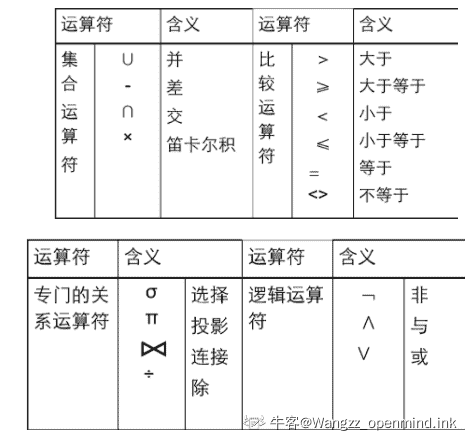
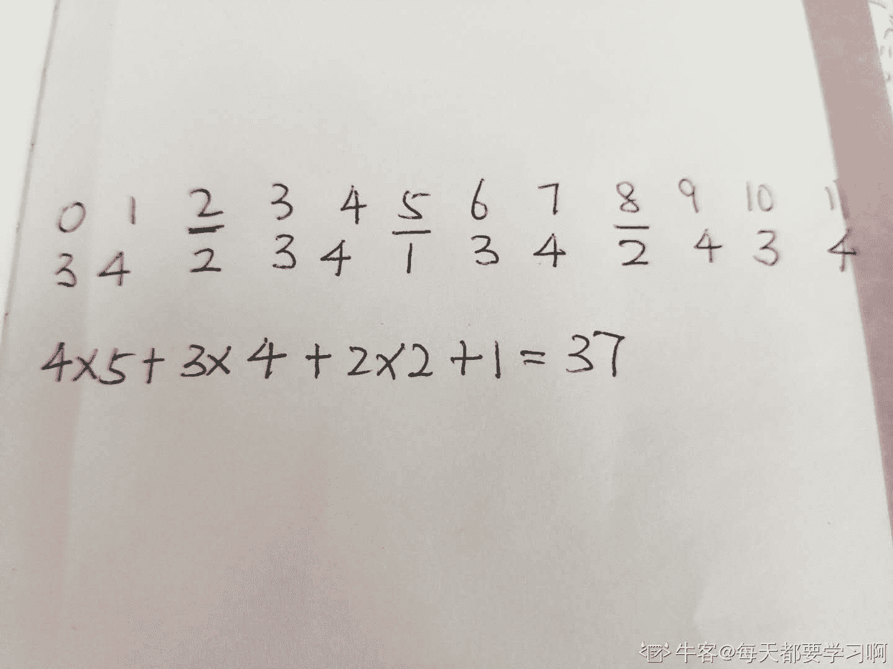
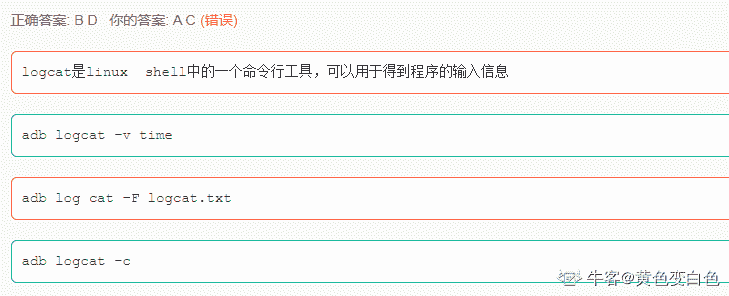
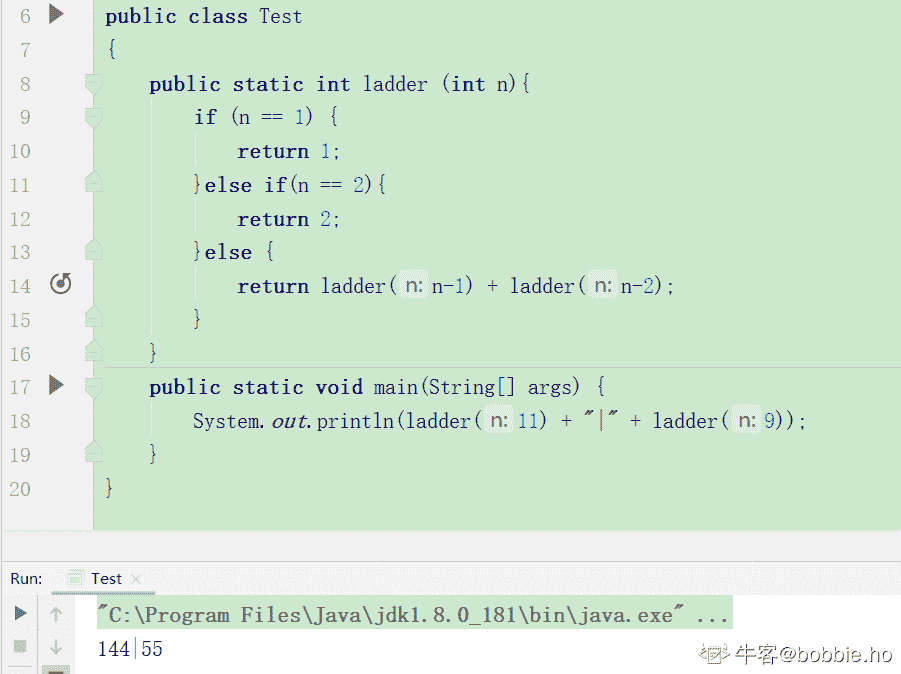

# 小米 2019 秋招测试开发笔试题（B）

## 1

假定 x 和 y 为 double 型，则表达式 x=2，y=x+3/2 的值是（）

正确答案: D   你的答案: 空 (错误)

```cpp
3.500000
```

```cpp
3
```

```cpp
2.00000
```

```cpp
3.00000
```

本题知识点

Java 工程师 C++工程师 测试工程师 小米 Java 测试开发工程师 小米 2019 测试开发工程师 小米 2019

讨论

[Zero 丶小菜鸡](https://www.nowcoder.com/profile/306398113)

3/2 是表示 int 型，int 型自动取整变为 1，x 表示是浮点型，浮点型加整形转换为 y 浮点型

发表于 2019-08-26 17:37:50

* * *

[IDEA2022.4.2](https://www.nowcoder.com/profile/181223548)

有没有选 A 的

发表于 2019-08-21 21:55:20

* * *

[亚伊瓦德利凯希](https://www.nowcoder.com/profile/989776880)

3/2 是 int 型啊，我怕是要凉

发表于 2019-09-01 16:11:32

* * *

## 2

关系型数据库管理系统应能实现的专门关系运算包括（）

正确答案: B   你的答案: 空 (错误)

```cpp
排序、索引、统计
```

```cpp
选择、投影、连接
```

```cpp
关联、更新、排序
```

```cpp
显示、打印、制表
```

本题知识点

Java 工程师 C++工程师 测试工程师 小米 数据库 测试开发工程师 2019

讨论

[wymwymwym](https://www.nowcoder.com/profile/3637369)

选择 是选择符合条件的一行或多行投影 是选择符合条件的一列或多列连接 是 2 个或 2 个以上的表组成一个新的表，通常是有条件连接

发表于 2019-10-23 19:56:57

* * *

[openmind.](https://www.nowcoder.com/profile/539390139)

> 关系代数的运算对象是关系，运算结果也是关系。

*   关系代数运算分为：**传统的集合元素**和**专门的关系运算**
    *   集合运算从【行】角度进行。
    *   关系运算从【行 or 列】角度进行



发表于 2021-03-11 21:36:24

* * *

[dal2020](https://www.nowcoder.com/profile/658796414)

选择 是选择符合条件的一行或多行 投影 是选择符合条件的一列或多列 连接 是 2 个或 2 个以上的表组成一个新的表，通常是有条件连接

发表于 2020-05-10 20:44:28

* * *

## 3

利用归并排序方法对数字序列：5，19，17，21，11，8，1 进行排序，共需要进行（ ）次比较

正确答案: B   你的答案: 空 (错误)

```cpp
10
```

```cpp
11
```

```cpp
12
```

```cpp
14
```

本题知识点

Java 工程师 C++工程师 测试工程师 小米 排序 *测试开发工程师 小米 2019 测试开发工程师 小米 2019* *讨论

[我的天鸭](https://www.nowcoder.com/profile/243498)

第一轮：（3 次）5 - 19 17 - 21 11 - 8 结果：5 19 17 21 8 11 1 第二轮：（4 次）5 - 17 19 - 17 19 - 21 8 - 1 结果：5 17 19 21 1 8 11 第三轮：（4 次）5 - 1 5 - 8 17 - 8 17 - 11

发表于 2019-08-26 17:23:09

* * *

[都行都好](https://www.nowcoder.com/profile/230629520)

我算了好几次都是 12 呀，为什么是 11 呢？求大神指点...

发表于 2019-08-17 22:23:49

* * *

## 4

有个长度为 12 的无重复有序表，按折半查找法进行查找，在表内各元素等概率情况下，查找成功所需的平均比较（三元比较）的次数为（）

正确答案: B   你的答案: 空 (错误)

```cpp
35/12
```

```cpp
37/12
```

```cpp
39/12
```

```cpp
43/12
```

本题知识点

查找 *讨论

[求面试+offer](https://www.nowcoder.com/profile/555997261)

由题目已知元素序号(即下标)范围为 1～12。查找 1 次成功的结点为：6。查找 2 次成功的结点为：3，9。查找 3 次成功的结点为：1，4，7，11。查找 4 次成功的结点为：2，5，8，10，12。成功查找所有结点的总的比较次数为:1×1+2×2+3×4+4×5=37 平均比较次数为 37／12。因此选择 B。

发表于 2019-04-18 15:15:16

* * *

[LauZyHou](https://www.nowcoder.com/profile/8203811)

一共 12 张牌。1 费 1 张，2 费 2 张，3 费 4 张，4 费 5 张(4 费最多可以 8 张)。然后计算总费用就行了，37 费。

发表于 2020-05-16 09:57:45

* * *

[来一个西安的 offer](https://www.nowcoder.com/profile/717788289)



发表于 2020-07-03 14:26:15

* * *

## 5

数组 Q[n]用来表示一个循环队列，f 为当前队列头元素的前一位置，r 为队尾元素的位置，假定队列中元素的个数小于 n，计算队列中元素的公式为（）

正确答案: D   你的答案: 空 (错误)

```cpp
r-f
```

```cpp
(n+f-c)%n
```

```cpp
n+r-f
```

```cpp
(n+r-f)%n
```

本题知识点

Java 工程师 C++工程师 测试工程师 小米 队列 *测试开发工程师 小米 2019 测试开发工程师 小米 2019* *讨论

[橙橙橙 123](https://www.nowcoder.com/profile/556960776)

计算队列的元素个数：(尾－头＋表长)%表长队列头指针为 front，队列尾指针为 rear，队列容量为 M，则元素个数为|rear-front+M|%M,注意，这个%是求余运算。

发表于 2019-10-29 13:11:44

* * *

## 6

下列数组定义及赋值，错误的是（）

正确答案: B   你的答案: 空 (错误)

```cpp
int intArray[ ];
```

```cpp
int intArray=new int[3]l; intArray[1]=1; intArray[2]=2;
```

```cpp
int a[ ]={1,2,3,4,5};
```

```cpp
int a[ ][ ]=new int[2][ ]; a[0]=new int[3]; a[1]=new int [3];
```

本题知识点

Java 工程师 C++工程师 测试工程师 小米 数组 Java 测试开发工程师 小米 2019 测试开发工程师 小米 2019

讨论

[小天 code](https://www.nowcoder.com/profile/403760568)

get 到了新技能，二维数组可以这样玩

```cpp
int a[][] = new int[2][];
a[0] = new int[3];
a[1] = new int[100];
```

发表于 2019-09-02 10:17:55

* * *

[IDEA2022.4.2](https://www.nowcoder.com/profile/181223548)

B 选项，定义数组时一定要有[ ]，一位数组就一个，二维数组就两个

发表于 2019-08-23 09:57:09

* * *

[˙＊灬潶澀.](https://www.nowcoder.com/profile/856246438)

Java 中允许先定义二维数组的外层长度

发表于 2019-08-21 19:23:16

* * *

## 7

设有向无环图 G 中的有向边集合 E ={<1,2>,<2,3>,<3,4>,<1,4>} ，则下列属于该有向图 G 的一种拓扑排序序列的是（）

正确答案: A   你的答案: 空 (错误)

```cpp
1,2,3,4
```

```cpp
2,3,4,1
```

```cpp
1,4,2,3
```

```cpp
1,2,4,3
```

本题知识点

Java 工程师 C++工程师 测试工程师 小米 图 测试开发工程师 小米 2019 测试开发工程师 小米 2019

讨论

[古古筝](https://www.nowcoder.com/profile/439917618)

只要满足以下条件即可 1 在 2 面前 2 在 3 面前 3 在 4 面前 1 在 4 面前

发表于 2019-10-29 13:09:05

* * *

[牛客 875547913 号](https://www.nowcoder.com/profile/875547913)

拓扑排序步骤：（1）在有向图中选一个没有前驱的顶点且输出；（2）从图中删除该顶点和所有以它为尾的弧。重复上述两步，直至全部顶点均已输出，或者当前图中不存在无前驱的节点为止。（后一种情况说明有向图中存在环）在该题中，我们先输出顶点 1，并将该顶点 1 及弧<1, 2>，<1, 4>从图中删除；此时无前驱的顶点只有 2，输出 2，并将顶点 2 及弧<2, 3>从图中删除；此时无前驱的顶点只有 3，输出 3，并将顶点 2 及弧<3, 4>从图中删除；此时图中仅剩顶点 4，将其输出。因此，拓扑排序的结果为：1, 2, 3, 4

发表于 2020-09-04 19:40:05

* * *

[刘诗歌](https://www.nowcoder.com/profile/406172105)

请知道本题正规解法的大佬分享下，感谢。

发表于 2019-08-26 18:44:47

* * *

## 8

从浏览器打开 http://www.mi.com ，TCP/IP 协议族中不会被使用到的协议是（）

正确答案: A   你的答案: 空 (错误)

```cpp
SMTP
```

```cpp
HTTP
```

```cpp
TCP
```

```cpp
IP
```

本题知识点

Java 工程师 C++工程师 测试工程师 小米 网络基础 测试开发工程师 2019

讨论

[Cappuccinuo](https://www.nowcoder.com/profile/6953331)

1\. 域名解析，通过域名查找出 IP 地址 - IP2\. 浏览器与网站建立 TCP 连接，三次握手 - TCP3\. HTTP 访问，HTTP-GET - HTTP4\. 浏览器与网站断开 TCP 连接，四次挥手 - TCP

发表于 2020-05-31 09:38:39

* * *

[吃饼！](https://www.nowcoder.com/profile/407702468)

http 与 SMTP 同属于应用层，tcp 属于传输层，ip 属于网络层

发表于 2019-08-23 17:11:50

* * *

[Lunarc](https://www.nowcoder.com/profile/304736704)

SMTP（简单邮件传输协议），是一种提供有效且可靠的电子邮件传输协议，控制两个相互通信的 SMTP 进程交换信息。

发表于 2019-08-23 09:20:03

* * *

## 9

一副扑克牌 54 张，红黑各一半，从里面任意翻两张，一红一黑的可能性是多少（）

正确答案: B   你的答案: 空 (错误)

```cpp
26/53
```

```cpp
27/53
```

```cpp
26/52
```

```cpp
27/52
```

本题知识点

Java 工程师 C++工程师 测试工程师 小米 概率统计 *数学运算 测试开发工程师 2019 管理培训生 牛客 2020 概率论与数理统计* *讨论

[产品白客](https://www.nowcoder.com/profile/590312595)

第一次的动作没有任何作用，关键在于第二个动作得去拿出不同颜色的牌，那肯定是 27/53

发表于 2019-10-03 21:20:28

* * *

[【pearls】](https://www.nowcoder.com/profile/169606213)

任意抽取两张牌的结果有 3 种情况：（1）两红：概率=27/54*26/53；（2）两黑：概率=27/54*26/53；（3）一红一黑=1-27/54*26/53*2=27/53；

发表于 2019-09-01 21:24:56

* * *

[祈愿 offfffffffers](https://www.nowcoder.com/profile/490028833)

1.第一次是红色，则第二抽抽到黑色的可能性是 27/53；2.第一抽是黑色则第二抽抽到红色可能性是 27/53。 实际上第一次抽什么颜色都无所谓，只需要考虑第二次抽牌的概率。

发表于 2019-12-22 20:28:06

* * *

## 10

以下对 logcat 命令描述正确的是：

正确答案: B D   你的答案: 空 (错误)

```cpp
logcat 是 linux  shell 中的一个命令行工具，可以用于得到程序的输入信息
```

```cpp
adb logcat –v time
```

```cpp
adb log cat –F logcat.txt
```

```cpp
adb logcat -c
```

本题知识点

Java 工程师 C++工程师 测试工程师 小米 Linux shell 测试开发工程师 2019

讨论

[黄色变白色](https://www.nowcoder.com/profile/8547911)

**好菜噢**

发表于 2019-08-30 17:19:41

* * *

[vivianhjh](https://www.nowcoder.com/profile/757737307)

logcat 是 Android 中一个命令行工具，可以用于得到程序的 log 信息

发表于 2019-09-07 15:58:27

* * *

[肥美的甲鱼](https://www.nowcoder.com/profile/367579753)

logcat -v time 打印 log 的同时打印系统时间

logcat -c 清除已有 log

发表于 2019-08-21 23:35:48

* * *

## 11

以下属于软件调试技术的是（）

正确答案: A C D   你的答案: 空 (错误)

```cpp
强行排错法
```

```cpp
集成测试法
```

```cpp
回溯法
```

```cpp
原因排除法
```

本题知识点

Java 工程师 C++工程师 测试工程师 小米 软件测试 测试开发工程师 2019

讨论

[Poesia](https://www.nowcoder.com/profile/421739150)

软件调试技术:试探法（强行排错法），回溯法：人工沿着程序的控制流程往跟踪代码，直到找出错误根源为止对分查找法：缩小错误的范围，归纳演绎原因排除法

编辑于 2019-08-26 14:40:06

* * *

[Ruiyu_0v0](https://www.nowcoder.com/profile/5508606)

测试的目的是暴露错误，调试的目的是发现错误发生的原因并修复解决

发表于 2021-02-15 15:06:34

* * *

[Optionz](https://www.nowcoder.com/profile/990135122)

&

调试方法：强行排错，回溯法，归纳法，演绎法等

发表于 2020-04-12 13:34:22

* * *

## 12

SQL 语句中，可以查看到学生信息表中，学生姓名的 SQL 语句为？（）

正确答案: C D   你的答案: 空 (错误)

```cpp
select 学生信息 from 学生信息
```

```cpp
select 学生信息 from 学生姓名
```

```cpp
select * from 学生信息
```

```cpp
select 学生姓名 from 学生信息
```

本题知识点

Java 工程师 C++工程师 测试工程师 小米 数据库 SQL 测试开发工程师 2019

讨论

[初雨诗清风](https://www.nowcoder.com/profile/529611720)

学生信息是一个表，而表不能作为条件查询，a 选项语法就是错误的

发表于 2020-04-06 11:32:38

* * *

[一只守护小花花的小狗呀](https://www.nowcoder.com/profile/137369056)

这题也是蛮尬的

发表于 2020-10-27 00:32:55

* * *

[莉 201907121139628](https://www.nowcoder.com/profile/801174445)

C,Dselect 查询语句：select <列名> from <表名>

编辑于 2019-07-12 13:05:59

* * *

## 13

以下哪些工具属于单元测试工具（）

正确答案: A B D   你的答案: 空 (错误)

```cpp
PureCoverage
```

```cpp
Purify
```

```cpp
VSS
```

```cpp
Quantify
```

本题知识点

Java 工程师 C++工程师 测试工程师 小米 软件测试 测试开发工程师 2019

讨论

[达克文](https://www.nowcoder.com/profile/175330967)

**单元测试工具集合:**

**Parasoft jtest**

第一个自动化 Java 单元**测试**工具.

**Parasoft C++Test**

是**单元测试**和静态分析工具，自动测试 C 和 C＋＋类别、功能或组件.

**Parasoft .TEST**

**是单元测试和静态分析工具，自动测试写在 Microsoft?.NET 框架的类别**

**Parasoft Insure++**

是一个自动化的内存错误、内存泄漏的精确检测工具。

**Parasoft CodeWizard**

是高级 C/C++源代码分析工具，采用三百种以上行业相关的编码准则，自动识别编译器未检测到的危险的编码构造。

**DevPartner Studio Professional**

是针对软件开发小组使用 Microsoft Visual C++，Microsoft Visual Basic，Java,ASP 或 HTML 设计的一套紧密配合的调试，测试和管理工具。

**Rational Purify**

是一个面向 VC, VB 或者 Java 开发的测试 Visual C/C++ 和 Java 代码中与内存有关的错误，确保整个应用程序的质量和可靠性。

**Rational Quantify**

是一个面向 VC、VB 或者 Java 开发的测试性能瓶颈检测工具

**Rational PureCoverage**

是一个面向 VC、VB 或者 Java 开发的测试覆盖程度检测工具[`blog.csdn.net/libing403/article/details/72909226?ops_request_misc=%257B%2522request%255Fid%2522%253A%2522158916342819195264555563%2522%252C%2522scm%2522%253A%252220140713.130102334.pc%255Fall.57662%2522%257D&request_id=158916342819195264555563&biz_id=0&utm_medium=distribute.pc_search_result.none-task-blog-2~all~first_rank_v2~rank_v25-2-72909226.nonecase&utm_term=%E5%8D%95%E5%85%83%E6%B5%8B%E8%AF%95%E7%9A%84%E5%B7%A5%E5%85%B7%E2%80%98%E2%80%99`](https://blog.csdn.net/libing403/article/details/72909226?ops_request_misc=%257B%2522request%255Fid%2522%253A%2522158916342819195264555563%2522%252C%2522scm%2522%253A%252220140713.130102334.pc%255Fall.57662%2522%257D&request_id=158916342819195264555563&biz_id=0&utm_medium=distribute.pc_search_result.none-task-blog-2~all~first_rank_v2~rank_v25-2-72909226.nonecase&utm_term=%E5%8D%95%E5%85%83%E6%B5%8B%E8%AF%95%E7%9A%84%E5%B7%A5%E5%85%B7%E2%80%98%E2%80%99)

发表于 2020-05-11 10:41:39

* * *

[树先生啊](https://www.nowcoder.com/profile/631917178)

C，**Rational Purify**是一个面向 VC, VB 或者 Java 开发的测试 Visual C/C++ 和 Java 代码中与内存有关的错误，确保整个应用程序的质量和可靠性。Rational Quantify 是一个面向 VC、VB 或者 Java 开发的测试性能瓶颈检测工具，它可以自动检测出影响程序段执行速度的程序性能瓶颈，提供参数分析表等等直观表格。Rational PureCoverage 是一个面向 VC、VB 或者 Java 开发的测试覆盖程度检测工具，它可以自动检测你的测试完整性和那些无法达到的部分。

发表于 2019-03-06 18:42:09

* * *

[🌟S74390E2🌟](https://www.nowcoder.com/profile/770593227)

vss 是把枪，不是什么鬼工具（奸笑）

发表于 2019-11-19 17:22:37

* * *

## 14

以下哪些是服务器性能测试中的性能指标？（　　）

正确答案: A B D   你的答案: 空 (错误)

```cpp
吞吐量
```

```cpp
响应时间
```

```cpp
磁盘大小
```

```cpp
CPU 使用率
```

本题知识点

Java 工程师 C++工程师 测试工程师 小米 软件测试 测试开发工程师 2019

讨论

[一个锤子🔨](https://www.nowcoder.com/profile/672774198)

圈重点。性能。服务器的性能，吞吐量，响应时间，cpu 使用率。磁盘大小是服务器的配置，换句话说，磁盘大和小都不是性能指标。

发表于 2019-08-21 22:30:13

* * *

[0x0offer 的菜鸡](https://www.nowcoder.com/profile/5956690)

磁盘大小是计算机硬件本身决定的

发表于 2020-04-11 21:45:32

* * *

[陈斗](https://www.nowcoder.com/profile/423470466)

看成不是了。。。

发表于 2020-04-11 21:05:14

* * *

## 15

使用软件测试工具的目的包括哪些？（　　）（非软件测试的目的）

正确答案: A B D   你的答案: 空 (错误)

```cpp
帮助测试寻找问题
```

```cpp
协助问题的诊断
```

```cpp
提高设计质量
```

```cpp
节省测试时间
```

本题知识点

Java 工程师 C++工程师 测试工程师 小米 软件测试 测试开发工程师 2019

讨论

[九亿少女的 e 梦](https://www.nowcoder.com/profile/762458752)

个人认为，工具不能提高质量，因为质量是由开发人员来提高，测试做的只是评判是否能达到质量或者有没错误，不能实质提高质量，质量应该是由一开始的需求来评判的吧

发表于 2019-09-21 15:51:11

* * *

[佐之剑](https://www.nowcoder.com/profile/987276503)

测试设计也需要用到工具，所以说提高设计质量没问题

发表于 2020-04-02 14:03:13

* * *

[美化这个世界](https://www.nowcoder.com/profile/5972381)

因为有的测试工具并不能很好的帮助到测试人员，要根据当前情况指定相关的测试方法，所以 c 选项算是半对

发表于 2019-09-11 15:45:23

* * *

## 16

输入一个整数和一棵二元树。从树的根结点开始往下访问一直到叶结点所经过的所有结点形成一条路径。打印出和与输入整数相等的所有路径。例如，输入整数 22 和如下二元树
       10      /   \   5     12 /   \4   7

正确答案: B D   你的答案: 空 (错误)

```cpp
10,5,4
```

```cpp
10，5，7
```

```cpp
10，12，4
```

```cpp
10,12
```

本题知识点

小米 树 2019

讨论

[QAAAAAAAAAAAQ](https://www.nowcoder.com/profile/849170055)

应该是图没画好， 按照答案，应该 4 和 7 是 5 的孩子，12 没有孩子。

发表于 2020-05-28 10:01:01

* * *

[白起丶](https://www.nowcoder.com/profile/815173790)

图中的二元树当做二叉排序树（BST）来理解，所以图中的根节点为 10，根的左孩子和右孩子分别为 5 和 12,5 的左孩子和右孩子分别为 4 和 7。故 4、7 和 12 都是叶子节点，从根节点 10 出发，到达叶子结点的带权路径为 22 的有 10、5、7 以及 10、12。

发表于 2020-07-03 17:24:37

* * *

[黑闪⚡](https://www.nowcoder.com/profile/962532797)

D 不对，不是叶子节点，屏蔽本题

发表于 2020-05-19 14:50:38

* * *

## 17

给定 fun 函数如下，

```cpp
int fun(int x) {
 return (x==1) ? 1 : (x + fun(x-1));
 }
```

那么以下说法正确的是（）

正确答案: A C   你的答案: 空 (错误)

```cpp
fun(10)的输出结果是 55
```

```cpp
fun(10)的输出结果是 10
```

```cpp
fun(0)的执行结果是栈溢出
```

```cpp
fun(2)的执行结果是栈溢出
```

本题知识点

Java 工程师 C++工程师 测试工程师 小米 C++ 测试开发工程师 2019

讨论

[zvan](https://www.nowcoder.com/profile/951372273)

给定的 fun 函数等同于下面函数

```cpp
#include<stdio.h>
int main()

{     int n;     int num = 0;
   scanf("%d",&n);
   for(;n>0;n--)
   {
       num+=n;
   }
    printf("%d\n",num);
    return 0;
}

```

其实就是自减求和

编辑于 2020-01-02 22:22:55

* * *

[tl174612293](https://www.nowcoder.com/profile/859079899)

栈溢出怎么是空指针异常？

发表于 2020-11-12 17:25:40

* * *

[露西恩缇努维尔](https://www.nowcoder.com/profile/408614969)

C 项有问题吧，怎末会有空指针异常昵，压根没有指针

发表于 2020-06-29 23:41:02

* * *

## 18

在你面前有一个 n 阶的楼梯，你一步只能上 1 阶或 2 阶。请问，当 N=11 时，你可以采用多少种不同的方式爬完这个楼梯（）；当 N=9 时呢？

正确答案: B C   你的答案: 空 (错误)

```cpp
11
```

```cpp
144
```

```cpp
55
```

```cpp
89
```

本题知识点

Java 工程师 C++工程师 测试工程师 小米 Java 测试开发工程师 2019

讨论

[闲 C 工作室](https://www.nowcoder.com/profile/423376092)

想起来很久以前看的电影《少年班》你需要爬 11 楼的时候，你倒回去一步只能待在第 10 楼或者第 9 楼。换句话说就是到达第 9 楼的方法次数加上第 10 楼的方法次数。如果你待在第 10 楼，就得待在第 9 楼或者第 8 楼如果你待在第 9 楼，就得待在第 8 楼或者第 7 楼......如果你待在第 3 楼，就得待在第 1 楼或者第 2 楼爬 1 楼一种方法，爬 2 楼两种方法。爬 3 楼就是爬 1 楼方法次数加 2 楼的方法次数。用数学表达就是：a（11）=a（10）+a（9）=144a（10）=a（9）+a（8）=89a（9）=a（8）+a（7）=55a（8）=a（7）+a（6）=34a（7）=a（6）+a（5）=21a（6）=a（5）+a（4）=13a（5）=a（4）+a（3）=8a（4）=a（3）+a（2）=5a（3）=a（2）+a（1）=3a（2）=2a（1）=1

发表于 2019-09-04 16:48:45

* * *

[3kna1j](https://www.nowcoder.com/profile/541130640)

代码已经有人贴出来了，讲一下个人的理解 当台阶只有一阶时，只能走一步，只有一种走法。 当两级台阶时，可以走一步，也可以一次走两步，有两种走法。 当三级台阶时，可以走一步，走三次。可以先走一步，再两步。也可以，先两步，再一步。总共三种方法。 可以看到当台阶是 3 时，第 1 级台阶选中之后(一种)，剩下可以走的方式恰好是台阶为 2 时的总数，总的数量为前两个之和，所以是 f(3)=f(1)+f(2)。即，f(n)=f(n-2)+f(n-1)，总结起来刚好是一个斐波那契数列。

发表于 2019-08-29 23:56:26

* * *

[bobbie.ho](https://www.nowcoder.com/profile/426351696)



发表于 2019-08-23 18:35:26

* * *

## 19

计算机操作系统的功能是()

正确答案: D   你的答案: 空 (错误)

```cpp
把源代码转换成目标代码
```

```cpp
提供硬件与软件之间的转换
```

```cpp
提供各种中断处理程序
```

```cpp
管理计算机资源并提供用户接口
```

本题知识点

Java 工程师 C++工程师 测试工程师 小米 前端工程师 操作系统 测试开发工程师 2019

讨论

[全废工程师](https://www.nowcoder.com/profile/304463687)

操作系统的目的提高资源利用率，提供 api，所以功能立即推😃

发表于 2019-08-25 08:17:51

* * *

## 20

一组带数字编号的球里除了两个编号之外，其它的编号都出现了两次。
请写程序找出这两个只出现一次的编号。要求时间复杂度是 O(n)，空间复杂度是 O(1)。

本题知识点

小米 Java 工程师 C++工程师 测试工程师 查找 *测试开发工程师 2019* *讨论

[ElonB](https://www.nowcoder.com/profile/623894)

```cpp
/*
异或运算 
出现两次的数异或为 0，所有值异或等于两个只出现一次数的异或；
找到一个异或为 1 的位置 t ，
位置 t 所有为 0 的值异或，所有为 1 的值异或，即为所求 
*/
#include <bits/stdc++.h>
using namespace std;
int a[1000001];
void getNumber(const int a[], int n, int&num1, int&num2)
{
    int i, yh = 0, t = 0;
    for(i = 1; i <= n; i++) {
        yh ^= a[i];
    }
    while((yh & 1) == 0) {
        t++;
        yh = yh >> 1;
    }
    num1 = 0;
    num2 = 0;
    for(i = 1; i <= n; i++) {
        if((a[i] >> t) & 1) num1 ^= a[i];
        else num2 ^= a[i];
    }

}
int main(void)
{
    int n = 0;
    while (~scanf("%d", &a[n + 1])) ++n;
    int p, q;
    getNumber(a, n, p, q);
    if (p > q) swap(p, q);
    printf("%d %d\n", p, q);
    return 0;
}

```

发表于 2019-07-14 12:10:36

* * *

[nbgao](https://www.nowcoder.com/profile/211289)

```cpp
#include <bits/stdc++.h>
using namespace std;
int main(){
    int a[1000003],n=0,x=0,y=0,s=0,t=0;
    while(cin>>a[n]){
        s ^= a[n];
        n++;
    }
    while((s&1)==0){
        t++;
        s >>= 1;
    }
    for(int i=0;i<n;i++){
        if((a[i]>>t)&1)
            x ^= a[i];
        else
            y ^= a[i];
    }
    cout<<min(x,y)<<" "<<max(x,y)<<endl;
    return 0;

}

```

发表于 2019-07-18 08:54:11

* * *

[hello 古斯卡](https://www.nowcoder.com/profile/4320188)

引用一篇文章。思路:1）如果把数组中的所有数字都依次异或一遍，则可以消掉成对出现的数字，那么还有两个数字是单一的，肯定也不同，那么最终异或的结果肯定不是 0。表示在二进制中肯定有一位是 1，那么两个不同的数字，一定有一个在该位为 1，另一个在该位为 0。如果将整个数组按照该位是否为 1 分为两部分，那么这两部分各自包含一个单一数字。

2）分为两部分的数组，分别异或，最终结果就是这两个数。

3）注意：当然不用真的分成两个数组，按照条件查找，边查找，边异或就行了。
————————————————
版权声明：本文为 CSDN 博主「杜甫如诗」的原创文章，遵循 CC 4.0 BY-SA 版权协议，转载请附上原文出处链接及本声明。
原文链接：[`blog.csdn.net/u013686654/article/details/76375369`](https://blog.csdn.net/u013686654/article/details/76375369)

发表于 2019-10-05 16:59:06

* * *

## 21

把一个数组最开始的若干个元素搬到数组的末尾，我们称之为数组的旋转。输入一个排好序的数组的一个旋转，输出旋转数组的最小元素。例如数组{3, 4, 5, 1, 2}为{1, 2, 3, 4, 5}的一个旋转，该数组的最小值为 1。

本题知识点

小米 Java 工程师 C++工程师 测试工程师 数组 排序 *查找 *测试开发工程师 2019** **讨论

[ElonB](https://www.nowcoder.com/profile/623894)

```cpp
""""
求最小值？
"""

if __name__ == "__main__":
    a = list(map(int, input().strip().split()))
    print(min(a))

```

发表于 2019-07-14 12:16:04

* * *

[昔遥暮云](https://www.nowcoder.com/profile/294241826)

```cpp
#include <bits/stdc++.h>
using namespace std;
int main(){
    int mi=INT_MAX,t;
    while(1){
        cin>>t;
        mi=min(mi,t);
        if(cin.get()=='\n')
            break;
    }
    cout<<mi;
    return 0;
}

```

编辑于 2019-11-13 19:31:51

* * *

[藤和艾莉欧。](https://www.nowcoder.com/profile/134888353)

```cpp
第一种不太推荐
如果题目有时间复杂度要求或者是测试用例给的数组特别大，这种根本 AC 不了的
#include<bits/stdc++.h>
using namespace std;
int main(){
        vector<int>num;
        int n;
        while(cin>>n)
            num.push_back(n);
        if(num.size() == 0)
            return 0;
        sort(num.begin(),num.end());   
        cout<<num[0]<<endl;
        return 0;
}
第二种是采取二分法
看到有序就应该想到二分法的（前后两个小数组分别是非递减数组，注意是非递减）
#include<bits/stdc++.h>
using namespace std;
int main(){
   vector<int>num;
   int n;
   while(cin>>n)
       num.push_back(n);
   int left=0,right=num.size()-1;
   while(left<right) {
        int mid=(left+right)>>1;
        if(num[mid]>num[right])
             left=mid+1;//当中间元素大于最后一个，表明最小值在右半区间                
        else if(num[mid]<num[right])
             right=mid;//当中间元素小于最后一个，表明最小值在左半区间，注意没有减一操作
        else right=right-1;//当中间元素 等于 最后一个，例如 2341001 说明有重复元素，将范围缩小一个        }
   cout<<num[left]<<endl;
   return 0;
}

```

编辑于 2019-08-06 10:18:16

* * ********