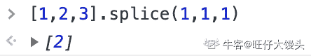
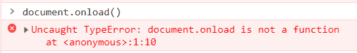
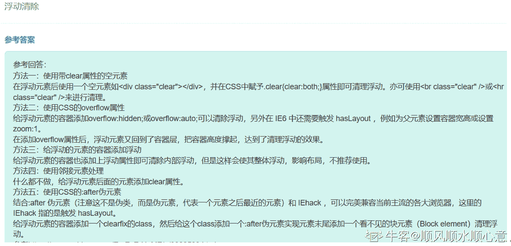
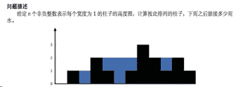

# 小米 2019 秋招前端开发笔试题（A）

## 1

TCP/IP 协议栈的网络层的主要功能是通过以下哪个协议来完成的？（）

正确答案: A   你的答案: 空 (错误)

```cpp
IP 协议
```

```cpp
TCP 协议
```

```cpp
以太网协议
```

```cpp
IGP 协议
```

本题知识点

前端工程师 小米 网络基础 前端工程师 小米 2019 前端工程师 小米 2019

讨论

[太阳☀201806270919191](https://www.nowcoder.com/profile/588552267)

网络层:IP ICMP IGMP

发表于 2019-09-05 11:00:34

* * *

## 2

以下属于行内块元素的是（）

正确答案: B   你的答案: 空 (错误)

```cpp
p
```

```cpp
img
```

```cpp
ul
```

```cpp
form
```

本题知识点

前端工程师 小米 HTML 2019

讨论

[tzk.](https://www.nowcoder.com/profile/123437373)

img 是行内块元素

编辑于 2021-03-25 18:35:29

* * *

[小萝卜虾](https://www.nowcoder.com/profile/1980751)

行内元素典型代表 span  ,a,  ,strong , em,  del,  ins

特点：★在一行上显示

 ★不能直接设置宽高

 ★元素的宽和高就是内容撑开的宽高。

行内块元素（内联元素）典型代表  input  img

特点：★在一行上显示

      ★可以设置宽高

块元素典型代表,div,h1-h6,p,ul,li

特点: ★独占一行

 ★可以设置宽高

 ★ 嵌套（包含）下，子块元素宽度（没有定义情况下）和父块元素宽度默认一致。

发表于 2020-01-17 20:56:50

* * *

[candane](https://www.nowcoder.com/profile/374306927)

img 不是行内块标签吗。。。

发表于 2019-09-25 20:38:41

* * *

## 3

以下标签不存在的是（）

正确答案: B   你的答案: 空 (错误)

```cpp
body
```

```cpp
dlv
```

```cpp
footer
```

```cpp
picture
```

本题知识点

前端工程师 小米 HTML 2019

讨论

[小雨滴滴滴滴](https://www.nowcoder.com/profile/74769624)

根本不考你细不细心，就是在考你到底知不知道 picture 标签！！！！

发表于 2019-09-04 17:39:28

* * *

[neptoo](https://www.nowcoder.com/profile/870928103)

HTML5 的 picture 标签用于为不同设备提供图像

```cpp
<picture>
  <source srcset="mdn-logo-wide.png" media="(min-width: 600px)">
  
</picture>
```

编辑于 2019-04-05 12:36:01

* * *

[twentyshaw](https://www.nowcoder.com/profile/727876600)

你是没看清 dlv 吗？你是不知道还有个 picture（是我ಠ_ಠ

发表于 2019-08-29 08:41:50

* * *

## 4

执行下列代码，输出结果为（）

```cpp
var val = 12;
function fun1(){
    console. log(val);
    var val = 20;
    console.log(val);
}
fun1();
```

正确答案: C   你的答案: 空 (错误)

```cpp
12  20
```

```cpp
12  12
```

```cpp
undefined  20
```

```cpp
20  undefined
```

本题知识点

前端工程师 小米 Javascript 2019

讨论

[梦境の彼方](https://www.nowcoder.com/profile/537188730)

函数会优先找自己的内部变量，var 变量提升，val == undefined；

编辑于 2019-10-09 22:04:39

* * *

[牛客 369037582 号](https://www.nowcoder.com/profile/369037582)

这里涉及到 JS 中的提升机制以及词法作用域的相关知识。在函数 fun1 中声明的变量 val 会被提升到函数头部，但是赋值操作并不会被提升，同时 fun1 作用域内的 val 会替换掉全局作用域中的 val。因此，题目中的代码实际上为

```cpp
var val = 12;
function fun1(){
    var val;
    console.log(val); //为赋值 undefined
    val = 20; //在原位置对变量进行赋值操作
    console.log(val); //输出 20
}
fun1();
```

发表于 2020-11-28 16:46:43

* * *

[张陈军](https://www.nowcoder.com/profile/982932884)

js 里有域的概念，函数外边的是全局值，在 fun1 函数里是局部域，可以读取外部变量，但是这个局部域里又重新定义，就不会再读取外部，覆盖

发表于 2019-10-08 00:21:42

* * *

## 5

触摸事件包括以下哪几种？（）

正确答案: A B C D   你的答案: 空 (错误)

```cpp
touchStart
```

```cpp
touchMove
```

```cpp
touchCancel
```

```cpp
touchEnd
```

本题知识点

前端工程师 小米 Javascript 2019

讨论

[旺仔大馒头](https://www.nowcoder.com/profile/8019634)

**以下是四种 touch 事件**

touchstart:     //手指放到屏幕上时触发

touchmove:      //手指在屏幕上滑动式触发

touchend:    //手指离开屏幕时触发

touchcancel:     //系统取消 touch 事件的时候触发，这个好像比较少用

每个触摸事件被触发后，会生成一个 event 对象，event 对象里额外包括以下三个触摸列表

touches:     //当前屏幕上所有手指的列表

targetTouches:      //当前 dom 元素上手指的列表，尽量使用这个代替 touches

changedTouches:     //涉及当前事件的手指的列表，尽量使用这个代替 touches

发表于 2019-08-31 17:10:21

* * *

[牛客 Ego](https://www.nowcoder.com/profile/214281961)

感觉全都是错的

发表于 2019-10-01 20:50:23

* * *

[Xiao 小](https://www.nowcoder.com/profile/4869076)

不是 touchbegun，是 touchstart。什么鬼答案啊

发表于 2019-04-17 21:01:46

* * *

## 6

以下哪几个标签 margin 的默认值是 0 （）

正确答案: A C D   你的答案: 空 (错误)

```cpp
body
```

```cpp
div
```

```cpp
form
```

```cpp
img
```

本题知识点

前端工程师 小米 HTML 2019 CSS

讨论

[陳呼呼](https://www.nowcoder.com/profile/437148815)

链接：[`www.nowcoder.com/questionTerminal/1fe60a0045dc4e518143a77dd98313ef`](https://www.nowcoder.com/questionTerminal/1fe60a0045dc4e518143a77dd98313ef)
来源：牛客网
h1~h6 标签：有默认 margin（top,bottom 且相同）值，没有默认 padding 值

dl 标签：有默认 margin  

ol,ul 标签：有默认 margin

table 标签没有默认的 margin,padding 值；th,td 标签没有默认的 margin 值，有默认的 padding 值。

p 标签有默认 margin(top,bottom)值,没有默认 padding 值。

select 标签在 Chrome,Safari,Maxthon 中有默认的 margin：2px；在 Opera,Firefox,IE6.0,7.0,8.0 没有默认的 margin 值。

发表于 2020-06-09 11:57:22

* * *

[爱学习的小丫](https://www.nowcoder.com/profile/3533184)

img 默认怎么就有 margin 了？？

发表于 2020-01-18 22:03:26

* * *

[牛客 45996995 号](https://www.nowcoder.com/profile/45996995)

这就不好玩了嘛

发表于 2019-12-12 08:12:32

* * *

## 7

以下哪些可以作为 media queries 的条件（）

正确答案: B C D   你的答案: 空 (错误)

```cpp
设备型号
```

```cpp
设备像素比
```

```cpp
设备类型
```

```cpp
设备高度
```

本题知识点

前端工程师 小米 2019

讨论

[怂怂小小小小怂](https://www.nowcoder.com/profile/34214509)

作为 media queries 的条件：设备像素比、设备类型、设备高度。使用 and 关键字用于合并多个媒体属性或合并媒体属性与媒体类型。@media tv and (min-width: 700px) and (orientation: landscape) { ... }tv 设备类型，(min-width: 700px) 设备像素比，(orientation: landscape)设备高度详见 MDN:[`developer.mozilla.org/zh-CN/docs/Web/Guide/CSS/Media_queries`](https://developer.mozilla.org/zh-CN/docs/Web/Guide/CSS/Media_queries)

发表于 2019-09-01 17:16:48

* * *

[zhouqctech](https://www.nowcoder.com/profile/1468715)

参考：[MDN: Using media queries](https://developer.mozilla.org/en-US/docs/Web/CSS/Media_Queries/Using_media_queries)
**Media queries** are useful when you want to modify your site or app depending on a **device's general type** (such as print vs. screen) or specific characteristics and parameters (such as **screen resolution** or browser **viewport width).**

发表于 2019-05-14 12:57:07

* * *

[牛客 826319263 号](https://www.nowcoder.com/profile/826319263)

转：https://developer.mozilla.org/zh-CN/docs/Web/Guide/CSS/Media_queries

发表于 2020-07-09 16:07:56

* * *

## 8

下面结果表达式为 false 的是：()

正确答案: B D   你的答案: 空 (错误)

```cpp
null == undefined
```

```cpp
[1,2,3].splice(1,1,1) == [2]
```

```cpp
let Mi = new Function();Mi.__proto__.__proto__ == Object.prototype
```

```cpp
'1' === true
```

本题知识点

前端工程师 小米 Javascript 2019

讨论

[旺仔大馒头](https://www.nowcoder.com/profile/8019634)

关于 B：splice() 方法向/从数组中添加/删除项目，然后返回被删除的项目。

注释：该方***改变原始数组。

语法

```cpp
arrayObject.splice(index,howmany,item1,.....,itemX)
```

| 参数 | 描述 |
| index | 必需。整数，规定添加/删除项目的位置，使用负数可从数组结尾处规定位置。 |
| howmany | 必需。要删除的项目数量。如果设置为 0，则不会删除项目。 |
| item1, ..., itemX | 可选。向数组添加的新项目。 |

 ```cpp
[1,2,3].splice(1,1,1) // 从第 1 个位置开始删除，删除一个项，在新增 1 这个项目 
```

数组会变成[1, 1, 3]但是这个函数返回的是被删除的项目，最终返回数组[2]但是在比较时候，他们不是同一个地址对象，因此返回 false。  

发表于 2019-08-31 16:47:55

* * *

[祯民](https://www.nowcoder.com/profile/463267767)

我多选了一个 C，这里整理了原型链的相关知识，希望对大家有帮助：

Ø **Object.prototype****只是一个普通对象，它是****js****原型链的最顶端**

** Object.prototype.__proto__=== null;//true**

** Object.prototype.prototype === undefied;//true**

**Object.prototype****只是一个普通对象****(****普通对象没有****prototype****属性，所以值是****undefined)****，****Object.prototype****是****js****原型链的最顶端，它的****__proto__****是****null(****有****__proto__****属性，但值是****null****，因为这是原型链的最顶端****)****。**

Ø **在****js****中如果****A****对象是由****B****函数构造的，那么****A.__proto__ === B.prototype****。**

**javascript****中对象是由****Object****创建的，函数是由****Function****创建的。**

Ø **内置的****Object****是其实也是一个函数对象，它是由****Function****创建的。**

**Object.__proto__ === Function.prototype;**

Ø **js****中每一个对象或函数都有****__proto__****属性，但是只有函数对象才有****prototype****属性。**

**//****函数对象**

**function Person()**

**{**

**}**

**//** **普通对象**

**var obj = {};**

**obj.__proto__ === Object.prototype;//true**

**obj.prototype === undefined;//true**

**Person.__proto__ === Function.prototype;//true**

**Person.prototype !== undefined;//true**

**原型链是基于****__proto__****形成的，继承是通过****prototype****实现的。**

Ø **Function.prototype****是个特例，它是函数对象，但是没有****prototype****属性。其他所有函数都有****prototype****属性。**

**Function.prototype.prototype === undefined;//true**

Ø **内置的****Function****也是一个函数对象，它是通过自己来创建自己的。**

**Function.__proto__=== Function.prototype;//true**

Ø **函数也是对象，因为****Function.prototype__proto__****指向****Object.prototype****。**

**typeof Function.prototype.__proto__) === "object";//true**

**Function.prototype.__proto__=== Object.prototype;//true**

发表于 2019-10-01 20:28:09

* * *

[过来吧](https://www.nowcoder.com/profile/560248471)

splice()方法返回的是删除后的项组成的数组，这里是[2] ，，"=="运算符比较对象的时候看两边是不是同一个对象，如果是返回 true，否则返回 false

编辑于 2019-08-26 10:37:02

* * *

## 9

下列不属于 document 对象方法的是？

正确答案: A C D   你的答案: 空 (错误)

```cpp
onload
```

```cpp
querySelectorAll
```

```cpp
children
```

```cpp
ajax
```

本题知识点

前端工程师 小米 Javascript 2019

讨论

[刘杰坤](https://www.nowcoder.com/profile/968274926)

这道语文题出的真不错😊

发表于 2019-10-14 10:24:08

* * *

[牛妹](https://www.nowcoder.com/profile/826546)

A.onload 为 document 对象的属性，而不是方法：  

C. ParentNode.children 是一个只读属性，返回一个节点的子元素，是一个动态更新的 HTMLCollection 类型。不是 document 对象的方法。

D. AJAX 不是 JavaScript 的规范，它只是一个缩写：Asynchronous JavaScript and XML，意思就是用 JavaScript 执行异步网络请求。在现代浏览器中主要依靠 XmlHttpRequest 对象。

编辑于 2019-08-29 11:21:20

* * *

[浅笑无殇](https://www.nowcoder.com/profile/178689)

onload 是不是属于 window 的，而不是属于 document？

发表于 2019-03-12 22:38:45

* * *

## 10

下列哪些功能默认支持跨域？（）

正确答案: B D   你的答案: 空 (错误)

```cpp
LocalStorage
```

```cpp
Image
```

```cpp
canvas
```

```cpp
iframe
```

本题知识点

前端工程师 小米 2019

讨论

[欢乐马 dudu](https://www.nowcoder.com/profile/592180446)

**跨域**：发起请求与指向资源域不相同（协议+域名+端口）
常见有**指向资源**的部件：`<a>`, `<form>`, ``, `<script>`, `<iframe>`, `<link>` 等标签以及 `Ajax`

Ref:[简书@ken_ljq](https://www.jianshu.com/p/f880878c1398)

发表于 2020-02-17 11:53:19

* * *

[门头沟传达室值班员](https://www.nowcoder.com/profile/405066145)

标签上的 src 属性不受同源策略影响

发表于 2019-10-02 19:37:40

* * *

[Xiao 小](https://www.nowcoder.com/profile/4869076)

localstorage 不支持跨域，跨域可以利用 postmessage 和 iframe 来实现

发表于 2019-04-17 20:54:57

* * *

## 11

下列关于闭包描述正确的是？（）

正确答案: A C   你的答案: 空 (错误)

```cpp
闭包内变量执行后不会被清除
```

```cpp
闭包不满足链式作用域结构
```

```cpp
(Function(){})()理论上是一个闭包
```

```cpp
闭包不耗内存，可以随意使用
```

本题知识点

前端工程师 小米 Javascript 2019

讨论

[吴锦超](https://www.nowcoder.com/profile/385289798)

题目错了！正确答案应该选择 A。C 选项的 Function 不应该大写。应该是(function () {})()或者是(new Function())()。

发表于 2020-01-07 18:10:30

* * *

[hellocc123](https://www.nowcoder.com/profile/390811897)

链式作用域是 js 本身自然存在的一种获取变量的方式。链式作用域外部可以访问内部，内部访问外部需要设置一个函数，由此产生闭包。

发表于 2020-03-18 22:28:21

* * *

[Aster_.](https://www.nowcoder.com/profile/611902284)

可以用(function(){})()来构成闭包，而不是(function(){})()是闭包。这个要明确。

发表于 2020-06-24 10:26:09

* * *

## 12

下列哪些事件不支持冒泡?（）

正确答案: A C D   你的答案: 空 (错误)

```cpp
resize
```

```cpp
click
```

```cpp
blur
```

```cpp
mouseleave
```

本题知识点

前端工程师 小米 Javascript 2019

讨论

[牛客 797574427 号](https://www.nowcoder.com/profile/797574427)

不支持冒泡：妈（mouseenter）妈(mouseleave)不(blur)放(focus)心你(load,unload,resize)

发表于 2020-11-04 20:21:57

* * *

[小🐮客](https://www.nowcoder.com/profile/990177409)

答案：A、C、D 冒泡事件很多，个人觉得记住常见的不支持冒泡事件就可以了有：①focus       ②blur       ③mouseenter       ④mouseleave       ⑤load       ⑥unload       ⑦resize

编辑于 2019-10-12 18:03:29

* * *

[别卷啦！](https://www.nowcoder.com/profile/610837318)

妈（mouseenter）妈（mouseleave）不（blur）（unload）让（resize）浪（load）费（focus） 牛

发表于 2021-05-31 22:12:36

* * *

## 13

浮动会导致页面的非正常显示，以下几种清除浮动的方法，哪个是可以使用且不会造成不稳定状态的？（）

正确答案: A B D   你的答案: 空 (错误)

```cpp
在浮动元素末尾添加一个空的标签例如 

```
通过设置父元素 overflow 值为 hidden
```cpp

```
父元素也设置浮动
```cpp

```
给父元素添加 clearfix 类
```cpp

本题知识点

                                                            前端工程师 
                                                小米 
                                                HTML 
                                                2019 
                                                CSS 

讨论

[牛客 62134823 号](https://www.nowcoder.com/profile/62134823)

                                                                    overflow:hidden 没有不稳定的影响吗？那溢出隐藏不算不稳定影响？

发表于 2020-10-16 01:50:38

* * *

[soeijjenc](https://www.nowcoder.com/profile/4562795)

                                                                    题目说了还要符合不造成不稳定浮动的要求

发表于 2019-11-29 08:52:18

* * *

[顺风顺水顺心意](https://www.nowcoder.com/profile/79771852)

                                                                      难道不是 ABCD 都可以吗？只是对于 c 来说，能清除内部拂动，但会使整体浮动造成不稳定状态，可人家也能清除啊。 

 

发表于 2019-08-25 22:52:29

* * *

## 14

        以下说法正确的是（）

正确答案:
                                                 B
                                             C
                                        你的答案:

                  空
                             (错误)

```
HTML 中表示标题的标签应该全部使用 h1
```cpp

```
应该将 h1 用作主标题（最重要的），其后是 h2（次重要的），再其次是 h3，以此类推。
```cpp

```
应该根据页面中内容的层级关系来决定使用合适的标题标签。
```cpp

```
h1 标签用来描述网页中最上层的标题。
```cpp

本题知识点

                                                            前端工程师 
                                                小米 
                                                HTML 
                                                2019 

讨论

[twentyshaw](https://www.nowcoder.com/profile/727876600)

网页最上层是 title

文章最上层是 h1

发表于 2019-08-29 08:35:11

* * *

[字节挑逗](https://www.nowcoder.com/profile/8226783)

                                                                    这种题，呵呵。。。

发表于 2019-09-06 10:34:34

* * *

[牛客 199256125 号](https://www.nowcoder.com/profile/199256125)

                                                                      这个最上层和我理解的好像不太一样...... 

发表于 2021-05-30 08:00:46

* * *

## 15

        下列说法正确的是？（）

正确答案:
                                A
                                             B
                                                         你的答案:

                  空
                             (错误)

```
display: none；不为被隐藏的对象保留其物理空间；
```cpp

```
visibility:hidden;所占据的空间位置仍然存在,仅为视觉上的完全透明；
```cpp

```
visibility:hidden;产生 reflow 和 repaint(回流与重绘)；
```cpp

```
visibility:hidden;与 display: none;两者没有本质上的区别；
```cpp

本题知识点

                                                            前端工程师 
                                                小米 
                                                2019 
                                                CSS 

讨论

[#201909111727433](https://www.nowcoder.com/profile/859543949)

Display:none 会触发 reflow

visibility:hidden 会触发 repaint 

发表于 2019-09-13 11:51:55

* * *

[一纸薄凉](https://www.nowcoder.com/profile/5105320)

                                                                      这个题真坑 
   A、 display: none；不为被隐藏的对象保留其物理空间； 
   B、 visibility:hidden;所占据的空间位置仍然存在,仅为视觉上的完全透明； 
   C、 visibility:hidden;产生 reflow 和 repaint(回流与重绘)； 
   D、 visibility:hidden;与 display: none;两者没有本质上的区别； 这样就没问题了，为毛输入题都能输入错的 

发表于 2019-03-20 23:29:12

* * *

[技术佣兵](https://www.nowcoder.com/profile/975698583)

```
display: none 直接从 DOM 中将其移除 
```cpp

```
visibility:hidden 只是在 DOM 添加样式将其隐藏并没有移除
```cpp

发表于 2020-05-20 19:37:04

* * *

## 16

        若为标准盒子模型，下列布局的描述，正确的是？

正确答案:
                                A
                                             B
                                             C
                                        你的答案:

                  空
                             (错误)

```
块级元素实际占用的宽度与它的 width 属性有关；
```cpp

```
块级元素实际占用的宽度与它的 border 属性有关；
```cpp

```
块级元素实际占用的宽度与它的 padding 属性有关；
```cpp

```
块级元素实际占用的宽度与它的 background 属性有关。
```cpp

本题知识点

                                                            前端工程师 
                                                小米 
                                                2019 
                                                CSS 

讨论

[Ped](https://www.nowcoder.com/profile/9416754)

                                                                      他这道题没有说清楚，有两种，一种是标准盒模型，一种是 IE 盒模型，标准盒模型中的块级元素实际占用的宽度只与它的 width 属性有关； 
   而 IE 盒模型就与它的 width、border、padding 属性有关

发表于 2019-03-14 10:11:55

* * *

[橘子橘子橘子皮](https://www.nowcoder.com/profile/8604073)

                                                                      如果添加属性 box-sizing:content-box;(默认) 
   css2 模型：盒子宽度计算=width+padding+border； 
   如果添加属性 box-sizing: border-box; 
   css3 模型：盒子宽度计算=width(padding 和 border 都包含在里面,不会撑开盒子)； 

发表于 2020-03-05 13:00:10

* * *

## 17

        以下哪些语言是面向对象的是（）

正确答案:
                                                 B
                                             C
                                        你的答案:

                  空
                             (错误)

```
C
```cpp

```
C++
```cpp

```
JAVA
```cpp

```
汇编
```cpp

本题知识点

                                                            C++ 
                                                Java 

讨论

[liu~<>](https://www.nowcoder.com/profile/600809040)

                                                                    c 是面向过程，c++面向对象，JAVA 面向对象，汇编是面向机器

发表于 2019-08-22 17:46:05

* * *

[伊丽莎白菜](https://www.nowcoder.com/profile/165859999)

                                                                    c++和 java 是面向对象，程序员是面向领导做开发的呢

发表于 2020-12-28 18:39:37

* * *

[你的 offer 对我打了烊](https://www.nowcoder.com/profile/598309941)

                                                                      记住几个常见的面形对象语言吧：C++，Java，python，C#，golang（Go），还有 js（这个似乎有些争议） 

发表于 2020-03-08 11:51:03

* * *

## 18

        关于栈和队列，下列说法正确的有（）

正确答案:
                                                 B
                                                              D
                       你的答案:

                  空
                             (错误)

```
可以使用队列模拟栈，但栈不能模拟队列
```cpp

```
栈和队列都不支持随机访问
```cpp

```
栈是一种树形数据结构
```cpp

```
栈具有后进先出的特征
```cpp

本题知识点

                                                            小米 
                                                栈 *队列 *2019**  **讨论

[—蘋萳](https://www.nowcoder.com/profile/4237566)

                                                                    A 双端队列可以模拟栈，两个栈可以模拟一个队列。

发表于 2020-03-12 09:54:48

* * *

[黄宗文](https://www.nowcoder.com/profile/4403932)

栈和队列是逻辑结构，能否随机访问，由他是顺序表实现，还是链表实现决定

发表于 2019-10-09 13:50:45

* * *

[牛友 78asdf7](https://www.nowcoder.com/profile/944728511)

                                                                      通过查询源码可以知道，Stack 继承了 Vector，而且 Vector 实现了 RandomAccess，因此 Stack 能够随机访问的。 

```
Stack<Integer> integers = new Stack<>();
integers.push(1);
integers.push(2);System.out.println(integers.get(1));
```cpp

 这样的语句是会输出 2。 

发表于 2019-03-26 15:45:18

* * *

## 19

        关于快速排序，下列说法正确的有（）

正确答案:
                                A
                                             B
                                                         你的答案:

                  空
                             (错误)

```
快速排序是基于比较的排序
```cpp

```
快速排序使用了分治的思想
```cpp

```
在某些特殊数据中，快速排序的时间复杂度可以达到 O(n)
```cpp

```
快速排序只能使用递归方式实现
```cpp

本题知识点

                                                            前端工程师 
                                                小米 
                                                Java 工程师 
                                                C++工程师 
                                                测试工程师 
                                                安卓工程师 
                                                运维工程师 
                                                算法工程师 
                                                排序 *2019 
                                                系统工程师*  *讨论

[游子吟](https://www.nowcoder.com/profile/264250533)

                                                                       
     “挖坑填数+分治法”，首先令 i =L; j = R; 将 a[i]挖出形成第一个坑，称 a[i]为基准数。然后 j--由后向前找比基准数小的数，找到后挖出此数填入前一个坑 a[i]中，再 i++由前向后找比基准数大的数，找到后也挖出此数填到前一个坑 a[j]中。重复进行这种“挖坑填数”直到 i==j。再将基准数填入 a[i]中，这样 i 之前的数都比基准数小，i 之后的数都比基准数大。因此将数组分成二部分再分别重复上述步骤就完成了排序。

   快排最好的情况是，每次正好中分，复杂度为 O(nlogn)。最差情况，复杂度为 O(n²)，退化成冒泡排序  

发表于 2019-03-17 17:04:11

* * *

[你永远得不到的祖奶奶](https://www.nowcoder.com/profile/855996890)

                                                                    快速排序使用了分治的思想，我现在才知道。

发表于 2020-05-28 20:42:03

* * *

[不做人了](https://www.nowcoder.com/profile/250145)

                                                                      比较的意思要和数组中其他元素比较

   计数排序 桶排序不需要 比较 

编辑于 2020-04-28 18:54:24

* * *

## 20

        关于 web 表单登录中用到的图形验证码的实现,以下做法不正确的有

正确答案:
                                A
                                             B
                                                              D
                       你的答案:

                  空
                             (错误)

```
返回给浏览器的 html 代码中包含图形验证码和文本字符串,登录前客户端判断输入内容和页面中保存的内容是否一致
```cpp

```
服务器端在返回的图片和 cookie 中同时包含图形验证码,登录前客户端判断输入内容和 cookie 保存的内容是否一致
```cpp

```
服务器端生成验证码后一方面通过图片将验证码返回给客户端,同时在服务器端保存文本的验证码,由服务器端验证输入内容是否正确
```cpp

```
浏览器通过识别图形验证码中的内容和用户输入的内容判断是否一致
```cpp

本题知识点

                                                            前端工程师 
                                                小米 
                                                HTML 
                                                2019 

讨论

[于指缝间慢慢流逝](https://www.nowcoder.com/profile/9091941)

                                                                      参考 

```
解析：A B 选项都把正确的验证码文本放在了客户端，这是违背了验证码的初衷的。爬虫或者是恶意程序依旧可以通过各种手段获取你嵌入在 html 文本或者保存在 cookie 中的正确验证码文本，模拟表单提交来达到攻击的目的。  
  D 选项更是浏览器自动无法识别图形验证码的内容。  
  C 选项才是正确的实现方式，发送到客户端的只有图片形式的验证码，服务器端保存 cookie 对应的图形验证码的正确文本。客户端表单提交时到服务器端验证。
```cpp

发表于 2019-12-31 14:52:10

* * *

[LouisTsang](https://www.nowcoder.com/profile/279403853)

                                                                    放浏览器判断太不安全啦，当然要给服务器来判断啦

发表于 2019-03-18 23:27:08

* * *

[小古月成](https://www.nowcoder.com/profile/548441671)

                                                                    放 cookie 安全吗？

发表于 2019-09-11 11:56:36

* * *

## 21

        米兔从兔米那里了解到有一个无限长的数字序列 1,  2，3，3，4，4，4,  5，5，5，5，5 ...,(已知此数列有一定规律，现将这些数字按不同数值堆叠，相同值的数字在同一层)。米兔想知道这个数字序列的第 n 个数所在的那一层之前的所有层里共有多少个数。

本题知识点

                                                            前端工程师 
                                                小米 
                                                查找 *数学 
                                                模拟 
                                                2019*  *讨论

[ElonB](https://www.nowcoder.com/profile/623894)

```
""""
斐波那契数列
"""

if __name__ == "__main__":
    n = int(input().strip())
    ans = 0
    a, b = 0, 1
    while True:
        if ans + b >= n:
            break
        ans += b
        a, b = b, a + b
    print(ans)

```cpp

发表于 2019-07-14 12:32:01

* * *

[广州市民林先生](https://www.nowcoder.com/profile/241061362)

                                                                      解析：题目 1,  2，3，3，4，4，4,  5，5，5，5，5 ...， 明显每一个相同的数组成一层，构成斐波那契数列，然后要求输入 n 为第 n 个数，输出 这个数所在层的前面所有层的数字个数之和。举个例子，输入 n = 4，也就是第四个数，而第四个数是 3，那么要求输出就应该 3 这一层之前的所有层的数字个数之和，也就是 1 和 2 的总个数，所以应该输出 2。 
   所以需要用一个 sum 来计数（计算斐波那契数列的和），这个"和"代表的就是当前(i 和 i 之前)所有的数字总个数，当 sum >= n 的时候，就可以输出答案了。那在 sum < n 的过程，需要做的工作就是 i，j 迭代，然后让 sum 依次增加 i，直到 sum >= n。这个时候的 sum 代表的是从开头加到 i 所在这一层的所有数字个数之和，而最后答案需要输出的是 i 所在这一层之前的所有数字个数之和，所以输出 sum - i 即可。代码： 

```
#include <iostream>
using namespace std;

int main(){
    long long n;
    cin >> n;
    if(n <= 1){
        cout << 0 << endl; //第 1 个数之前 没有数
        return 0;
    }
    long long i = 1;
    long long j = 1;
    long long sum = 1;
    while(sum < n) {
        j = i + j;
        i = j - i;
        sum += i;
    }
    cout << sum - i << endl;
    return 0;
}
```cpp

编辑于 2020-06-05 23:35:01

* * *

[WMYW](https://www.nowcoder.com/profile/222543223)

```
//上面都是讨论了 n 等于 1 和 2 的情况
//一步到位，不用讨论条件 n 等于 1 和 2 的情况
#include<iostream>
using namespace std;
int main()
{
    long long n;
    cin>>n;
    long long sum=0;
    long long i=1;
    long long j=-1;
    long long count=0;
    while(count<n)
    {
        sum=i+j;
        j=i;
        i=sum;
        count+=sum;
    }
    count-=sum;
    cout<<count;
}
```cpp

发表于 2020-03-12 09:39:03

* * *

## 22

            
   给定 n 个非负整数表示每个宽度为 1 的柱子的高度题，计算按此排列的柱子，下雨之后能接多少雨水。

本题知识点

                                                            前端工程师 
                                                小米 
                                                模拟 
                                                栈 *贪心 
                                                2019*  *讨论

[lentolove](https://www.nowcoder.com/profile/572586026)

```
import java.io.BufferedReader;
import java.io.IOException;
import java.io.InputStreamReader;
import java.util.Stack;

public class Solution18_ 计算题 _ 接雨水 {

    /**
     * LeetCode 42 题 接雨水 难度 Hard
     * 此题提供四种解法供参考，由于牛客网的测试数据过大，结果会出现溢出，用 long 保存结果
     * 有两个方法没有 AC 过的。
     * 但是能提供不错的思路。
     */
    public static void main(String[] args) throws IOException {
        BufferedReader bf = new BufferedReader(new InputStreamReader(System.in));
        String[] strs = bf.readLine().split(",");
        int[] nums = new int[strs.length];
        for (int i = 0; i < strs.length; i++) {
            nums[i] = Integer.parseInt(strs[i]);
        }
        System.out.println(getWater3(nums));
    }

    /**
     * 方法一：暴力法 最容易联想到的办法 复杂度过高不能过
     * 计算每个位置可以接的水
     * height[i]  找出 height[i]左边的最大值，和右边的最大值
     * 取其中的较小者减去 height[i] 就是当前位置可以接到的水的量
     * 时间复杂度为 O(n²)
     * 空间复杂度为 O（1）
     */
    private static long getWater1(int[] height) {
        if (height.length < 3) return 0;
        int n = height.length;
        long sum = 0;
        for (int i = 1; i < n - 1; i++) {//第一个位置和最最后一个位置肯定是不能接水的
            int left_max = 0, right_max = 0;//记录左边和右边的最大值
            for (int j = i - 1; j >= 0; j--) left_max = Math.max(left_max, height[j]);
            for (int j = i + 1; j < n; j++) right_max = Math.max(right_max, height[j]);
            int a = Math.min(left_max, right_max) - height[i];
            sum += a > 0 ? a : 0;
        }
        return sum;
    }

    /**
     * 方法二：牛客网能过
     * 暴力法每次都要去查找左边和右边的最大值
     * 我们不妨直接先把该值存储起来
     * 时间复杂度为 O(n)
     * 空间复杂度为 O(n)
     */
    public static long getWater(int[] height) {
        if (height.length < 2) return 0;
        int n = height.length;
        int[] left_max = new int[n];
        int[] right_max = new int[n];
        left_max[0] = height[0];
        right_max[n - 1] = height[n - 1];
        for (int i = 1; i < n; i++) {
            left_max[i] = Math.max(height[i], left_max[i - 1]);
            right_max[n - i - 1] = Math.max(height[n-i-1], right_max[n-i]);
        }
        long ans = 0;
        for (int i = 1; i < n - 1; i++) {
            ans += Math.min(left_max[i], right_max[i]) - height[i];
        }
        return ans;
    }

    /**
     * 方法三:借助栈 时间过久 没有通过
     * 如果不是很理解出栈过程，可以画画图便于理解。
     */
    private static long getWater3(int[] height) {
        long sum = 0;
        Stack<Integer> stack = new Stack<>();
        int p = 0;
        while (p < height.length) {
            //如果栈不为空并且当前指向的高度比栈顶的元素还大
            while (!stack.isEmpty() && height[p] > height[stack.peek()]) {
                //取出栈顶元素
                int h = height[stack.pop()];
                if (stack.isEmpty()) {
                    break;
                }
                int dc = p - stack.peek() - 1;//两墙之间的距离
                int min = Math.min(height[stack.peek()], height[p]) - height[h];
                sum += dc * min;
            }
            stack.add(p++);
        }
        return sum;
    }

    /**
     * 方法四：通过
     * 双指针 在一遍遍历中记录左边和右边的最大值
     */
    private static long getWater4(int[] height) {
        int max_left = 0, max_right = 0;
        long sum = 0;
        int point_left = 1, point_right = height.length - 2;
        for (int i = 1; i < height.length - 1; i++) {
            //从左往右更新
            if (height[point_left - 1] < height[point_right + 1]) {
                max_left = Math.max(max_left, height[point_left - 1]);
                int min = max_left - height[point_left];
                sum += min > 0 ? min : 0;
                point_left++;
            } else {
                max_right = Math.max(max_right, height[point_right + 1]);
                int min = max_right - height[point_right];
                sum += min > 0 ? min : 0;
                point_right--;
            }
        }
        return sum;
    }
}
```cpp

发表于 2019-07-30 16:56:44

* * *

[ElonB](https://www.nowcoder.com/profile/623894)

```
""""
特殊的单调递增
序列 a 按照最高值划分为两个数组 b、c，后半部分翻转
对每一个数组，遍历数组，
若当前最大值 t_max 小于 x，则更新 t_max = x；
若大于，则计数 t_max - x
"""

def count(a):
    ret, t_max = 0, 0
    for x in a:
        if x > t_max:
            t_max = x
        else:
            ret += t_max - x
    return ret

if __name__ == "__main__":
    a = list(map(int, input().strip().split(',')))
    b = a[a.index(max(a)):][::-1]
    c = a[:a.index(max(a)) + 1]
    ans = 0
    ans += count(b)
    ans += count(c)
    print(ans)

```cpp

发表于 2019-07-14 18:44:02

* * *

[小狒](https://www.nowcoder.com/profile/458614875)

```
var str = readline();
var arr=str.split(',');
var num=trap(arr);
console.log(num)
    function trap (height) {
        let left = 0, right = height.length - 1
        let count = 0
        let leftMax = 0, rightMax = 0
        while (left <= right) {
            leftMax = Math.max(leftMax, height[left])
            rightMax = Math.max(rightMax, height[right])
            if (leftMax < rightMax) {
                count += leftMax - height[left]
                left++
            } else {
                count += rightMax - height[right]
                right--
            }
        }
        return count

    };
```cpp

编辑于 2019-09-06 18:39:57

* * ****** 
```