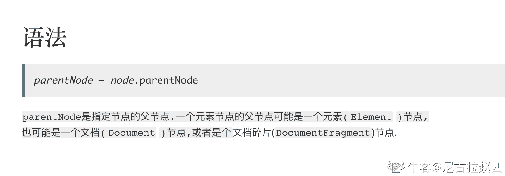
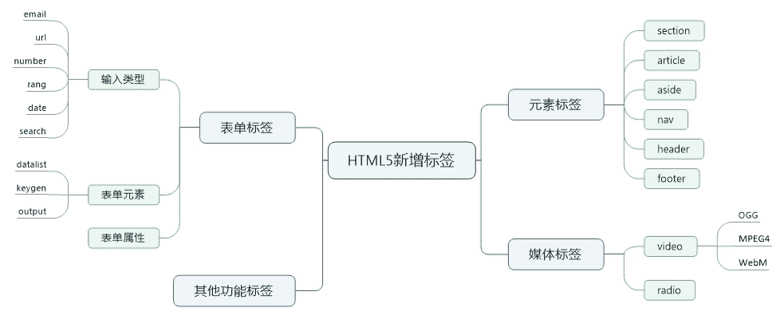

# 小米 2019 秋招前端开发笔试题（B）

## 1

某进程的页面访问顺序为 1、3、2、4、2、3、1、2，系统最多分配 3 个物理页面，采用 LRU 算法，运行过程中会出现（ ）次缺页？

正确答案: C   你的答案: 空 (错误)

```cpp
3
```

```cpp
4
```

```cpp
5
```

```cpp
6
```

本题知识点

安卓工程师 小米 前端工程师 操作系统 2019

讨论

[花与琴 de 流星](https://www.nowcoder.com/profile/44716736)

1.刚开始内存并没有这个作业，所以发生缺页中断一次。作业页面 1 进入内存。(1 次缺页中断)
2.而页面 3 又不在内存，又发生缺页中断一次(2 次页面中断)。3.作业页 2 进入内存，内容中开始没有 2 作业，所以发生缺页中断一次。(3 次缺页中断)，此时输出 1 3 24.页面 4 进入内存，发生缺页中断一次。(4 次页面中断)，4 进入内存，1 出来，此时为 3 2 45.页面 2 在内存中，不发生页面缺页中断。6.页面 3 在内存中，不会发生页面缺页中断。7.页面 1 不在内存中，发生页面缺页中断(5 次页面中断)，1 进入内存，3 出来此时为 2 4 18.页面 2 在内存中，不会发生页面缺页中断。所以总共发生 5 次页面缺页中断。

发表于 2019-09-05 17:55:47

* * *

[Anoxia13](https://www.nowcoder.com/profile/36042073)

概念：    缺页中断，就是要访问的页不在主存，需要操作系统将其调入主存后再进行访问。    LRU，Least Recently Used 的缩写，即最近最少使用，常用于[页面置换算法](https://baike.baidu.com/item/%E9%A1%B5%E9%9D%A2%E7%BD%AE%E6%8D%A2%E7%AE%97%E6%B3%95/7626091)，是为虚拟页式[存储管理](https://baike.baidu.com/item/%E5%AD%98%E5%82%A8%E7%AE%A1%E7%90%86/9827115)服务的。    过程：    1           缺 1
    3,1        缺 3
    2,3,1     缺 2
    4,2,3     缺 4
    2,4,3    
    3,2,4    
    1,3,2    缺 1
    2,1,3

发表于 2019-03-12 16:35:23

* * *

[帮辅导保姆式内推字节](https://www.nowcoder.com/profile/4490016)

关于这些题的讲解，我还准备了视屏版本。你可以在 b 站上观看我的视屏讲解：[`www.bilibili.com/video/av83427212?p=6`](https://www.bilibili.com/video/av83427212?p=6)

发表于 2020-02-04 19:42:40

* * *

## 2

将长度为 n 的单链表链接在长度为 m 的单链表后面，其算法的时间复杂度釆用大 O 形式表示应该是（ ）

正确答案: C   你的答案: 空 (错误)

```cpp
O(1)
```

```cpp
O(n)
```

```cpp
O(m)
```

```cpp
O(n+m)
```

本题知识点

安卓工程师 小米 前端工程师 链表 *2019* *讨论

[neptoo](https://www.nowcoder.com/profile/870928103)

需要先遍历长度为 m 的链表，找到链表尾部，这个时间复杂度为 O(m)，再将链表尾部的 next 指针指向长度为 n 的链表的头结点即可

发表于 2019-03-19 13:13:33

* * *

[你的 offer 对我打了烊](https://www.nowcoder.com/profile/598309941)

还以为拼接后的链表查找的复杂度，戏太多惹😅

发表于 2020-06-10 21:47:35

* * *

[会飞的鱼 97](https://www.nowcoder.com/profile/815751329)

因为 m 链表无尾指针，如果有的话是 O(1)

发表于 2022-02-25 15:10:29

* * *

## 3

操作系统中用得最多的数据结构是（ ）。

正确答案: C   你的答案: 空 (错误)

```cpp
堆栈
```

```cpp
队列
```

```cpp
表格
```

```cpp
树
```

本题知识点

iOS 工程师 小米 前端工程师 操作系统 2019

讨论

[SHU-haojie](https://www.nowcoder.com/profile/788507642)

操作系统中有大量的页表、段表、设备控制表

发表于 2020-09-04 14:23:02

* * *

[-ShadowKnight](https://www.nowcoder.com/profile/719369589)

这题我个人认为是 A.堆栈

发表于 2019-08-19 00:15:25

* * *

[Brown798](https://www.nowcoder.com/profile/641312719)

确实是表格，比如在操作系统中有大量的页表，段表，设备控制表之类的表格

发表于 2019-10-12 17:02:18

* * *

## 4

有一组数据“12,15,1,18,2,35,30,11”，用选择法由小到大排序，第 2 趟交换数据后数据的顺序是（）

正确答案: B   你的答案: 空 (错误)

```cpp
11，1，2，12，35，18，30，15
```

```cpp
1，2，12，18，15，35，30，11
```

```cpp
1，2，11，12，15，18，30，35
```

```cpp
1，2，11，12，15，18，35，30
```

本题知识点

排序 *讨论

[君君 201903290917654](https://www.nowcoder.com/profile/493155953)

  按照选择排序的思路 2、第一趟排序后的结果是 1,15,12.18,2,35,30,11
3、第二趟排序后的结果是 1,2,12.18,15,35,30,11

编辑于 2019-12-04 20:16:10

* * *

[kyrielx](https://www.nowcoder.com/profile/332468353)

选择排序的思想是：第 i 趟排序，找到 L[i...n]中最小的元素与 L(i)交换位置，这样保证每一趟排序确定一个元素的最终位置。

第一趟：1,15,12,18,2,35,30,11
第二趟：1,2,12,18,15,35,30,11
第三趟：1,2,11,18,15,35,30,12
第四趟：1,2,11,12,15,35,30,18
第五趟：1,2,11,12,15,18,35,30
第六趟：1,2,11,12,15,18,30,35

编辑于 2019-12-04 20:16:17

* * *

[牛客 473366981 号](https://www.nowcoder.com/profile/473366981)

从小到大：第一趟选择一个最小的和第一个元素换位置，第二趟再选第二小的和第二个元素换位置；

发表于 2020-07-01 14:20:33

* * *

## 5

计算机操作系统的功能是()

正确答案: D   你的答案: 空 (错误)

```cpp
把源代码转换成目标代码
```

```cpp
提供硬件与软件之间的转换
```

```cpp
提供各种中断处理程序
```

```cpp
管理计算机资源并提供用户接口
```

本题知识点

Java 工程师 C++工程师 测试工程师 小米 前端工程师 操作系统 测试开发工程师 2019

讨论

[全废工程师](https://www.nowcoder.com/profile/304463687)

操作系统的目的提高资源利用率，提供 api，所以功能立即推😃

发表于 2019-08-25 08:17:51

* * *

## 6

关于 web 表单登录中用到的图形验证码的实现,以下做法不正确的有

正确答案: A B D   你的答案: 空 (错误)

```cpp
返回给浏览器的 html 代码中包含图形验证码和文本字符串,登录前客户端判断输入内容和页面中保存的内容是否一致
```

```cpp
服务器端在返回的图片和 cookie 中同时包含图形验证码,登录前客户端判断输入内容和 cookie 保存的内容是否一致
```

```cpp
服务器端生成验证码后一方面通过图片将验证码返回给客户端,同时在服务器端保存文本的验证码,由服务器端验证输入内容是否正确
```

```cpp
浏览器通过识别图形验证码中的内容和用户输入的内容判断是否一致
```

本题知识点

前端工程师 小米 HTML 2019

讨论

[于指缝间慢慢流逝](https://www.nowcoder.com/profile/9091941)

参考

```cpp
解析：A B 选项都把正确的验证码文本放在了客户端，这是违背了验证码的初衷的。爬虫或者是恶意程序依旧可以通过各种手段获取你嵌入在 html 文本或者保存在 cookie 中的正确验证码文本，模拟表单提交来达到攻击的目的。  
  D 选项更是浏览器自动无法识别图形验证码的内容。  
  C 选项才是正确的实现方式，发送到客户端的只有图片形式的验证码，服务器端保存 cookie 对应的图形验证码的正确文本。客户端表单提交时到服务器端验证。
```

发表于 2019-12-31 14:52:10

* * *

[LouisTsang](https://www.nowcoder.com/profile/279403853)

放浏览器判断太不安全啦，当然要给服务器来判断啦

发表于 2019-03-18 23:27:08

* * *

[小古月成](https://www.nowcoder.com/profile/548441671)

放 cookie 安全吗？

发表于 2019-09-11 11:56:36

* * *

## 7

以下哪个算法可以判断出一个有向图中是否有回路：（）

正确答案: B   你的答案: 空 (错误)

```cpp
广度优先遍历
```

```cpp
拓扑排序
```

```cpp
求最短的路径
```

```cpp
求关键路径
```

本题知识点

前端工程师 小米 运维工程师 图 前端工程师 小米 2019 运维工程师 小米 2019 前端工程师 小米 2019 运维工程师 小米 2019

讨论

[liuyong1995](https://www.nowcoder.com/profile/848814784)

判断有向图是否有回路：拓扑排序、深度优先搜索

发表于 2019-09-12 11:16:03

* * *

[onlyxxx](https://www.nowcoder.com/profile/493457698)

B 拓朴排序在无环图才有解

发表于 2019-09-12 16:33:18

* * *

## 8

下面哪种排序算法不是稳定的（）

正确答案: D   你的答案: 空 (错误)

```cpp
归并排序
```

```cpp
冒泡排序
```

```cpp
插入排序
```

```cpp
快速排序
```

本题知识点

前端工程师 小米 排序 *2019* *讨论

[曹罡瑜 0829](https://www.nowcoder.com/profile/4270576)

不稳定排序：希快选堆

发表于 2019-05-15 15:27:44

* * *

[牛客 465438822 号](https://www.nowcoder.com/profile/465438822)

稳定：归并排序，冒泡排序，插入排序，基数排序不稳定：选择排序，快速排序，希尔排序，堆排序

发表于 2020-07-16 10:27:54

* * *

[liuyong1995](https://www.nowcoder.com/profile/848814784)

稳定排序：冒泡、选择、归并、基数

发表于 2019-09-12 11:17:01

* * *

## 9

排序算法分为稳定和不稳定的。通俗地讲，稳定排序就是能保证排序前两个相等的数其在序列的前后位置顺序和排序后它们两个的前后位置顺序相同。在快速排序、冒泡排序、堆排序、归并排序、插入排序这五种排序算法中，属于稳定排序的有几个？（）

正确答案: B   你的答案: 空 (错误)

```cpp
2
```

```cpp
3
```

```cpp
4
```

```cpp
5
```

本题知识点

排序 *讨论

[Z3R0](https://www.nowcoder.com/profile/5881784)

看错题目了。

考研数据结构高分笔记

一句话记忆：考研太难了，情绪不稳定，快(快速排序)些(希尔排序)选(简单选择排序)一堆(堆排序)朋友来聊天吧。

编辑于 2019-10-26 22:38:06

* * *

[王伟伟](https://www.nowcoder.com/profile/521649307)

选快堆希皆不稳选泡插：n*n 快归堆希：nlogn

发表于 2020-07-29 09:21:24

* * *

[Mr.F 啊](https://www.nowcoder.com/profile/195086450)

堆排序和快速排序属于非稳定排序。而题目问的是稳定排序，一共给了五种算法。

发表于 2019-03-12 15:11:03

* * *

## 10

某高校对一些学生进行问卷调查，在接受调查的学生中，准备参加注册会计师考试的有 63 人，准备参加英语六级考试的有 89 人，准备参加计算机考试的有 47 人，三种考试都准备参加的有 24 人，准备选择两种考试都参加的有 46 人，不参加其中任何一种考试的有 15 人。请问接受调查的学生共有多少人：（）

正确答案: A   你的答案: 空 (错误)

```cpp
120
```

```cpp
144
```

```cpp
177
```

```cpp
192
```

本题知识点

前端工程师 小米 数学运算 2019

讨论

[emcaster](https://www.nowcoder.com/profile/9814524)

(63+89+47+24+46+15)减去并集(24*3+46*2)

发表于 2019-08-05 11:21:17

* * *

[offer 在哪里 www](https://www.nowcoder.com/profile/690490378)

想象有三层饼，一层一层拿掉重叠的部分。63+89+47+15-2*24（重叠了三次，要留下唯一的一层，所以减去两层）-46（重叠了两次，要留下唯一的一层，所以减去一层）=120

发表于 2020-08-09 17:16:09

* * *

[逆旅，行人](https://www.nowcoder.com/profile/659970735)

15+63+89+47-2*24-46=120

发表于 2019-03-26 20:58:06

* * *

## 11

以下关于关系数据模型的表述哪个是正确的

正确答案: D   你的答案: 空 (错误)

```cpp
只能表示实体间的 1∶1 联系
```

```cpp
只能表示实体间的 1∶n 联系
```

```cpp
只能表示实体间的 m∶n 联系
```

```cpp
可以表示实体间的上述三种关系
```

本题知识点

前端工程师 小米 数据库 2019

讨论

[百分之九十。](https://www.nowcoder.com/profile/7648179)

一对一 一对多 多对多

发表于 2020-02-13 17:34:02

* * *

[闲鱼总算翻了身](https://www.nowcoder.com/profile/909589300)

关系数据模型还是很强的

发表于 2021-07-24 15:56:32

* * *

## 12

下面有关 html 结构描述正确的有？（）

正确答案: A B D   你的答案: 空 (错误)

```cpp
<ul> <li> </li> </ul>
```

```cpp
<ol> <li> </li> </ol>
```

```cpp
dl><dt><dd></dd></dt></dl>
```

```cpp
<table> <tr> <td></td> </tr> </table>
```

本题知识点

前端工程师 小米 HTML 2019

讨论

[﹎__ 懿切瀡缘](https://www.nowcoder.com/profile/1378923)

```cpp
<dl>
    <dt>标题</dt>
    <dd>内容</dd>
</dl>
```

编辑于 2019-04-04 15:56:51

* * *

[努力向前！](https://www.nowcoder.com/profile/544627403)

错的不是少半边括号，而是 dd 不是套在 dt 里面的

发表于 2020-04-04 23:30:31

* * *

[honng](https://www.nowcoder.com/profile/633961032)

不想记 dl dot dd table tr 之间的关系

编辑于 2020-12-09 16:18:45

* * *

## 13

Html5 重新提供了在客户端保存数据的功能 Web Storage,分别是？（ ）

正确答案: A B   你的答案: 空 (错误)

```cpp
sessionStorage
```

```cpp
localStorage
```

```cpp
localState
```

```cpp
sessionState
```

本题知识点

前端工程师 小米 HTML 2019

讨论

[高高手](https://www.nowcoder.com/profile/566035028)

Web Storage 又分为两种：

1，sessionStorage

session，指的是一次会话，其时间作用于你访问开始一个网站到你关闭这个网站。

所以你用 sessionStorage 保存的数据在你关闭网站页面的时候就会被销毁，一般用于临时的数据保存

2，localStorage

local，指的是本地，它会把数据保存到你的硬盘中，即是浏览器被关闭了，下次访问也能读取到已经保存了的数据。

值得注意的是，由于不同浏览器数据存储的位置不一样，所以每个浏览器所存储的数据都是独立的，不能在其他浏览器中获取

我们来看看最简单的实现代码：

我准备了一个 p 标签，一个输入框，两个按钮。分别用于显示读取出来的数据，提供内容的输入，提交保存，读取数据。

代码中用到了 2 个方法，setItem 和 getItem，对应的是保存和读取，

当然你也可以用 sessionStorage.[key] = value;的方式去保存，取数据的时候也非常简单，直接用 sessionStorage.[key]，你会得到你想到的东西的，

需要注意的是，用 session 保存的数据用 local 是取不到的，反过来也一样。

```cpp
<!DOCTYPE html>
<html lang="en">
<head>
    <meta charset="UTF-8">
    <title>WebStorage</title>
</head>
<body>

<p id="msg"></p>
<input type="text" id="input">
<input type="button" value="保存数据" onclick="saveStorage('input');">
<input type="button" value="读取数据" onclick="loadStorage('msg');">

<script>

function saveStorage(id) {
    var targer = document.getElementById(id);
    var str = targer.value;
    sessionStorage.setItem('message', str);
}

function loadStorage(id) {
    var target = document.getElementById(id);
    var msg = sessionStorage.getItem('message');
    target.innerHTML = msg;
}

/*function saveStorage(id) {
    var target = document.getElementById(id);
    var str = target.value;
    localStorage.setItem('message', str);
}

function loadStorage(id) {
    var target = document.getElementById(id);
    var msg = localStorage.getItem('message');
    target.innerHTML = msg;
}*/

</script>

</body>
</html>
```

发表于 2019-09-13 15:40:20

* * *

[雅婷的潇潇呀](https://www.nowcoder.com/profile/838274589)

这题真的是 AB

发表于 2019-09-01 19:20:11

* * *

[-ShadowKnight](https://www.nowcoder.com/profile/719369589)

这题明显 AB 啊

发表于 2019-08-19 00:17:19

* * *

## 14

css 中哪些属性可以继承（）

正确答案: A B C   你的答案: 空 (错误)

```cpp
font-size
```

```cpp
color
```

```cpp
font-family
```

```cpp
border
```

本题知识点

前端工程师 小米 2019 CSS

讨论

[only 丶 ting](https://www.nowcoder.com/profile/858889951)

CSS 中不能继承的属性：
    display、margin、border、padding、background、height、min-height、max- height、width、min-width、max-width、overflow、position、left、right、top、 bottom、z-index、float、clear、table-layout、vertical-align、page-break-after、 page-bread-before 和 unicode-bidi

发表于 2020-08-19 23:01:31

* * *

[会飞の猪](https://www.nowcoder.com/profile/4226501)

margin padding border display 不可以继承

发表于 2019-09-08 12:50:50

* * *

[honng](https://www.nowcoder.com/profile/633961032)

经验瞎选的，选对了

编辑于 2020-12-10 16:24:44

* * *

## 15

获取原生 JS 的父节点的是（）

正确答案: C   你的答案: 空 (错误)

```cpp
element.parent()
```

```cpp
element.getParent()
```

```cpp
element.parentNode
```

```cpp
element.parentNode()
```

本题知识点

前端工程师 小米 Javascript 2019

讨论

[select*fromuse](https://www.nowcoder.com/profile/820767)

注意区分**属性和方法**，也即有没有`()`括号。
详见：[`developer.mozilla.org/zh-CN/docs/Web/API/Node/parentNode`](https://developer.mozilla.org/zh-CN/docs/Web/API/Node/parentNode)
注意看左侧栏的属性和方法，并区分。
**总结：**
node 节点有几个常用的**属性**：

*   firstChild
*   lastChild
*   nextSibling：下一个兄弟节点
*   previousSibling：前一个兄弟节点

这些都是属性，都不需要添加括号的。

发表于 2020-03-29 11:37:01

* * *

[尼古拉赵四](https://www.nowcoder.com/profile/508750714)



发表于 2020-02-16 21:34:50

* * *

[月影城下](https://www.nowcoder.com/profile/518630237)

parentNode 是父节点，父对象感觉应该是 parentElement

发表于 2019-04-14 02:11:33

* * *

## 16

以下代码的运行结果是:

```cpp
for(var i = 0; i < 10; i++) {
    setTimeout(function() {
        console.log(i);
    }, 1000);
}
```

正确答案: B   你的答案: 空 (错误)

```cpp
0--9
```

```cpp
10 个 10
```

```cpp
10 个 9
```

```cpp
无限循环
```

本题知识点

前端工程师 小米 Javascript 2019

讨论

[也就这样吧](https://www.nowcoder.com/profile/181305822)

setTimeout 是异步操作，每次遇到它不是先运行，而是先压入执行栈。等 i 执行完 for 循环，setTimeout 才开始执行，此时的 i 已经是 10 了

发表于 2019-10-12 13:15:12

* * *

[嚯嚯嚯嘿嘿嘿](https://www.nowcoder.com/profile/5304986)

JavaScript 的任务分为同步任务和异步任务，同步任务放在主线程，形成一个执行栈；异步任务放在任务队列，只有主线程空了才会去读取任务队列的任务。setTimeout 是异步任务，所以执行完 for 循环才去执行 setTimeout，此时 for 循环的 i 已不满足 i < 10，即 i = 10 ，所以，此时输出 10 个 10

发表于 2019-10-24 09:58:46

* * *

[牛客 940360835 号](https://www.nowcoder.com/profile/940360835)

因为 settimeout 是异步操作，需要 for 循环执行完后才执行 settimeout，此时 for 循环完后就会有 10 个 settimeout 准备执行，因为 i==10 时，循环才停止，这时执行 settimeout，等待一秒后，打印十个 10

发表于 2021-02-07 17:29:15

* * *

## 17

下面代码获取 input 节点的正确方法是( )

```cpp
<form class="file" name="upload">
<input id="file" name="file" class="file"/>
</form>
```

正确答案: D   你的答案: 空 (错误)

```cpp
document.querySelectorAll('file')[0]
```

```cpp
document.getElementById('file')[0]
```

```cpp
document.getElementByTagName('file')[0]
```

```cpp
document.getElementById('file')
```

本题知识点

前端工程师 小米 Javascript 2019

讨论

[毕达哥拉斯的大树](https://www.nowcoder.com/profile/470099386)

如果忽略 D 选项的标点符号错误，那么正确答案确实是 DA: querySelectorAll 接收一个选择器做参数，正确用法：

```cpp
document.querySelectorAll(".file")[1];
```

B: 会返回 undefined，因为 getElementById 只返回符合 id 的那一个节点，而不是一个列表不能使用下标，正确写法

```cpp
document.getElementById("file");
```

C: file 根本不是一个 tag，会出错, 正确用法：

```cpp
document.getElementsByTagName("input")[0];
```

D: 仔细看选项 包裹 file 的引号，仔细看发现根本不是个引号，更正后：

```cpp
document.getElementsByClassName("file")[1];

```

总结： 严格来说没有正确答案，忽略标点符号可以选 D

编辑于 2019-10-25 09:52:07

* * *

[旺仔大馒头](https://www.nowcoder.com/profile/8019634)

选项全都是错的：A. 选择的是 file 标签的第一个元素结点，，不存在 file 标签 B. 选择的是 id 为 file，但是他不是一个数组，因此不能有下标 C. 选择的是 file 标签的第一个元素结点，不存在 file 标签 D. 选择的是 class 为 file 的第一个元素结点，此时选中的是 form 标签，而不是 input 结点。

编辑于 2019-08-31 17:07:13

* * *

[o201807261516255](https://www.nowcoder.com/profile/863002429)

全部选项都是错的。。

发表于 2019-03-31 22:38:04

* * *

## 18

下面属于 Javascript 基本数据类型的是？（ ）

正确答案: A B C   你的答案: 空 (错误)

```cpp
String
```

```cpp
Undefined
```

```cpp
Null
```

```cpp
Object
```

本题知识点

前端工程师 小米 Javascript 2019

讨论

[浪险](https://www.nowcoder.com/profile/683173318)

NNUSBNumber Null Undefined String Boolean 纳尼 USB😀😀😀

发表于 2019-08-22 10:23:53

* * *

[边个懂](https://www.nowcoder.com/profile/667814955)

**引用数据类型**：对象(Object)、数组(Array)、函数(Function)。 Object 不是基本的

发表于 2019-07-05 18:14:16

* * *

[前端-阿来](https://www.nowcoder.com/profile/488789122)

基本类型：string null undefined number boolean 复杂类型：object array date regexp function 基本包装类型：boolean number string 单体内置对象：global math 注意：以上内容该首字母全部大写！！！

发表于 2019-09-23 14:50:12

* * *

## 19

下列属于 HTML5 新元素的是？（）

正确答案: A B C   你的答案: 空 (错误)

```cpp
header
```

```cpp
nav
```

```cpp
section
```

```cpp
viewport
```

本题知识点

前端工程师 小米 HTML 2019

讨论

[IoE](https://www.nowcoder.com/profile/655404835)

来源：[`url.cn/5xCUhA1`](https://zhuanlan.zhihu.com/p/25445181)

编辑于 2019-10-14 00:23:57

* * *

[祯民](https://www.nowcoder.com/profile/463267767)

**HTML5****中常用的新特性：**

**canvas****元素：用于定义图形（图表等），只是图形容器，必须使用脚本来绘制图形。**

**audio****：用于音频播放。**

**video****：用于视频播放。**

**article****：规定独立的自包含内容。**

**header****：定义文档的页眉，介绍相关信息。**

**section****：定义文档中的节。**

**footer****：定义文档的页脚，通常有文档的作者、版权信息、联系方式等。**

**nav****：定义导航链接。**

**表单控件：**

**calender**

**date**

**time**

**email**

**url**

**search**

发表于 2019-09-27 16:26:05

* * *

[夜尽灬天明丶](https://www.nowcoder.com/profile/778746584)

[知乎-html5 新元素：https://zhuanlan.zhihu.com/p/25445181](https://zhuanlan.zhihu.com/p/25445181)

发表于 2019-09-04 11:06:34

* * *

## 20

下面有关 html5 标签说法正确的有？（）

正确答案: A C D   你的答案: 空 (错误)

```cpp
<audio>标签定义声音，比如音乐或其他音频流
```

```cpp
<canvas> 比如来自一个外部的新闻提供者的一篇新的文章，或者来自 blog 的文本，或者是来自论坛的文本。亦或是来自其他外部源内容
```

```cpp
<menu> 标签定义菜单列表。当希望列出表单控件时使用该标签
```

```cpp
<embed> 标签定义了一个容器，用来嵌入外部应用或者互动程序（插件）
```

本题知识点

前端工程师 小米 HTML 2019

讨论

[牛客 453354993 号](https://www.nowcoder.com/profile/453354993)

<canvas> 元素用于图形的绘制，通常是 JavaScript 来完成.

发表于 2020-04-27 15:19:25

* * *

[neptoo](https://www.nowcoder.com/profile/870928103)

A 明显错了，应该是。。。

发表于 2019-03-19 13:31:59

* * *

[lmy 永不言败](https://www.nowcoder.com/profile/9186281)

video 很明显的是视频啊

发表于 2019-08-27 19:59:23

* * *

## 21

设计一个函数，两个参数，第一个参数为整数的数组，第二个参数为标杆值，取数组中任意符合两个数相加为标杆值的下标相加到一起的值传入一串字符串（如下例子所示），转义为数组，除去数组中最后一位数字作为标杆值，取数组中任意符合两个数相加为标杆值的下标，输出所有符合要求的下标的和。如下解释：
value：0,1,5,11,17,16,2,5,10,30,12
index：1 3  6  8
输出结果为 18

本题知识点

前端工程师 小米 数组 穷举 字符串 *模拟 2019* *讨论

[勇敢牛牛，不怕困难！](https://www.nowcoder.com/profile/840813925)

```cpp
#include <stdio.h>
#include <stdlib.h>
#include <string.h>

const char* const DELIM = ",";

// function prototype
int foo_bar(int* nums, const int numsSize, const int k);

int main(const int argc, const char* argv[]) {

  char input[10240] = "";
  fgets(input, 10240, stdin);

  int nums[1024], numsSize = 0, k;
  char* tok = strtok(input, DELIM);
  while (tok) {
    *(nums + numsSize++) = atoi(tok);
    tok = strtok(NULL, DELIM);
  }

  k = *(nums + --numsSize); // k == goal == target（阈值)
  return fprintf(stdout, "%d", foo_bar(nums, numsSize, k)), 0;
}

int foo_bar(int* nums, const int numsSize, const int k) {
  int i, j, s = 0;
  for (i = 0; i < numsSize; ++i)
    for (j = i + 1; j < numsSize; ++j)
      if (*(nums + i) + *(nums + j) == k)
        s += i + j;

  return s;
}

```

发表于 2021-07-16 12:42:53

* * *

[好学雄](https://www.nowcoder.com/profile/3840811)

```cpp
function sumIndex(strArr){
    if(typeof strArr !== 'string') return 0
    let arr = strArr.split(',')
    arr.forEach((e,i)=>{arr[i] = parseInt(e)})
    let count = arr.pop()
    let sumIndex = 0
    for(let i=0;i<arr.length;i++){
        const x = arr[i];
        for (let j = i+1; j < arr.length; j++) {
            const y = arr[j];
            if(x+y===count) sumIndex+=(i+j)
        }
    }
    return sumIndex
}
```

发表于 2021-04-20 14:14:37

* * *

[零葬](https://www.nowcoder.com/profile/75718849)

直接双重循环，用 O(n²)的复杂度暴力求解

```cpp
import java.io.BufferedReader;
import java.io.InputStreamReader;
import java.io.IOException;

public class Main {
    public static void main(String[] args) throws IOException {
        BufferedReader br = new BufferedReader(new InputStreamReader(System.in));
        String[] params = br.readLine().trim().split(",");
        int[] arr = new int[params.length - 1];
        for(int i = 0; i < params.length - 1; i++)
            arr[i] = Integer.parseInt(params[i]);
        int benchMark = Integer.parseInt(params[params.length - 1]);
        System.out.println(solve(arr, benchMark));
    }

    private static int solve(int[] arr, int benchMark) {
        int result = 0;
        for(int i = 0; i < arr.length - 1; i++){
            for(int j = i + 1; j < arr.length; j++)
                if(arr[i] + arr[j] == benchMark) result += i + j;
        }
        return result;
    }
}
```

发表于 2021-02-27 14:40:07

* * *

## 22

设计一个函数，传入一个可序列化为树结构的字符串，将含有多个子节点的节点以数组的形式输出。

本题知识点

前端工程师 小米 树 模拟 字符串 *2019* *讨论

[ElonB](https://www.nowcoder.com/profile/623894)

```cpp
""""
字符串匹配和递归
{node: 'root', next:
    [{node: 'second_root'},
     {node: 'second_child', next:
         [{node: 'second_child_1', next:
             {node: 'second_child_1_1'}
           },
          {node: 'second_child_2'}
          ]
      },
     {node: 'third_root', next:
         {node: 'third_child', next:
             [{node: 'third_child_1', next:
                 {node: 'third_child_1_1'}
               },
              {node: 'third_child_2'}
              ]
          }
      }
     ]
 }
"""
import sys

def find_node(s, ans, dic):
    node = s[s.index("'") + 1:s.index("'") + 1 + s[s.index("'") + 1:].index("'")].strip()
    ans.append(node)  # 添加 node 名到 ans 列表中
    dic[node] = 0  # node 的子节点
    if '{' not in s:  # 没有子节点
        return
    x = s.index('{')  # 至少一个子节点，记录递归的起始位置 x+1
    stack = []  # 栈用于符号配对，此题标准格式不需要验证符号是否匹配，只记录是否为空
    y = x
    for y in range(x, len(s)):
        if s[y] == '{':
            if not stack:
                x = y  # 记录递归的起始位置
            stack.append(s[y])
        elif s[y] == '}':
            stack.pop()
            if not stack:  # 栈空则，dic[node]加一，且对字符串 s[x + 1:y] 递归
                dic[node] += 1
                find_node(s[x + 1:y], ans, dic)

if __name__ == "__main__":
    # sys.stdin = open("input.txt", "r")
    s = input().strip()
    ans = []  # 按输入顺序记录所有节点
    dic = {}  # 记录 node 有几个子节点
    find_node(s[1:-1], ans, dic)
    res = []  # 符合多个子节点要求的所有节点
    flag = False
    for c in ans:
        if dic[c] >= 2:
            res.append('"' + c + '"')
    print("[{0}]".format(','.join(res)))

```

编辑于 2019-07-14 20:25:01

* * *

[WMYW](https://www.nowcoder.com/profile/222543223)

```cpp
//直接输入输出即可
#include<iostream>
(720)#include<vector>
using namespace std;
int main()
{
    char ch;
    string name;
    vector<string> v;
    while((ch=getchar())!='\n')
    {
        if(ch=='\'')
        {
            name="";
            while((ch=getchar())!='\'')
                name+=ch;
        }
        if(ch=='[')
            v.push_back(name);
    }
    cout<<"[";
    if(v.size()==0)
    {
        cout<<"]";
        return 0;
    }
    for(auto it=v.begin();it!=v.end();it++)
    {
        if(it==v.end()-1)
            cout<<"\""<<*it<<"\""<<"]";
        else
            cout<<"\""<<*it<<"\""<<",";
    }
}
```

发表于 2020-03-15 08:06:45

* * *

[nbgao](https://www.nowcoder.com/profile/211289)

```cpp
#include <bits/stdc++.h>
using namespace std;

int main(){
    string s, t="";
    getline(cin, s);
    for(int i=0;i<s.length();i++)
        if(s[i]!=' ')
            t += s[i];
    string p = "next:[{";
    int k = 0;
    vector<string> v;
    while((k=t.find(p, k)) != string::npos){
        int r=k-1;
        while(t[r]!='\'')
            r--;
        int l=r-1;
        while(t[l]!='\'')
            l--;
        v.push_back(t.substr(l+1, r-l-1));
        k++;
    }
    cout<<"[";
    for(int i=0;i<v.size();i++){
        if(i==0)
            cout<<"\""<<v[0]<<"\"";
        else
            cout<<",\""<<v[i]<<"\"";
    }
    cout<<"]"<<endl; 
    return 0;
}
```

发表于 2020-01-08 11:19:54

* * *******