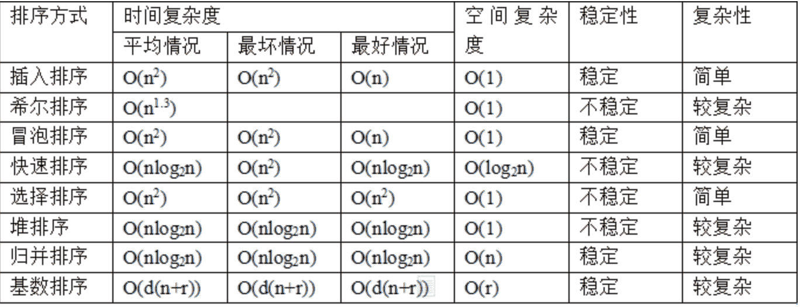
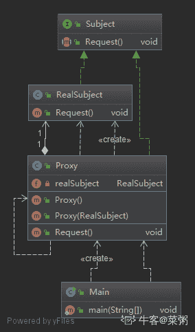

# 小米 2019 秋招软件开发笔试题（A）

## 1

以下哪些语言是面向对象的是（）

正确答案: B C   你的答案: 空 (错误)

```cpp
C
```

```cpp
C++
```

```cpp
JAVA
```

```cpp
汇编
```

本题知识点

C++ Java

讨论

[liu~<>](https://www.nowcoder.com/profile/600809040)

c 是面向过程，c++面向对象，JAVA 面向对象，汇编是面向机器

发表于 2019-08-22 17:46:05

* * *

[伊丽莎白菜](https://www.nowcoder.com/profile/165859999)

c++和 java 是面向对象，程序员是面向领导做开发的呢

发表于 2020-12-28 18:39:37

* * *

[你的 offer 对我打了烊](https://www.nowcoder.com/profile/598309941)

记住几个常见的面形对象语言吧：C++，Java，python，C#，golang（Go），还有 js（这个似乎有些争议）

发表于 2020-03-08 11:51:03

* * *

## 2

关于栈和队列，下列说法正确的有（）

正确答案: B D   你的答案: 空 (错误)

```cpp
可以使用队列模拟栈，但栈不能模拟队列
```

```cpp
栈和队列都不支持随机访问
```

```cpp
栈是一种树形数据结构
```

```cpp
栈具有后进先出的特征
```

本题知识点

小米 栈 *队列 *2019** **讨论

[—蘋萳](https://www.nowcoder.com/profile/4237566)

A 双端队列可以模拟栈，两个栈可以模拟一个队列。

发表于 2020-03-12 09:54:48

* * *

[黄宗文](https://www.nowcoder.com/profile/4403932)

栈和队列是逻辑结构，能否随机访问，由他是顺序表实现，还是链表实现决定

发表于 2019-10-09 13:50:45

* * *

[牛友 78asdf7](https://www.nowcoder.com/profile/944728511)

通过查询源码可以知道，Stack 继承了 Vector，而且 Vector 实现了 RandomAccess，因此 Stack 能够随机访问的。

```cpp
Stack<Integer> integers = new Stack<>();
integers.push(1);
integers.push(2);System.out.println(integers.get(1));
```

这样的语句是会输出 2。

发表于 2019-03-26 15:45:18

* * *

## 3

关于快速排序，下列说法正确的有（）

正确答案: A B   你的答案: 空 (错误)

```cpp
快速排序是基于比较的排序
```

```cpp
快速排序使用了分治的思想
```

```cpp
在某些特殊数据中，快速排序的时间复杂度可以达到 O(n)
```

```cpp
快速排序只能使用递归方式实现
```

本题知识点

前端工程师 小米 Java 工程师 C++工程师 测试工程师 安卓工程师 运维工程师 算法工程师 排序 *2019 系统工程师* *讨论

[游子吟](https://www.nowcoder.com/profile/264250533)

  “挖坑填数+分治法”，首先令 i =L; j = R; 将 a[i]挖出形成第一个坑，称 a[i]为基准数。然后 j--由后向前找比基准数小的数，找到后挖出此数填入前一个坑 a[i]中，再 i++由前向后找比基准数大的数，找到后也挖出此数填到前一个坑 a[j]中。重复进行这种“挖坑填数”直到 i==j。再将基准数填入 a[i]中，这样 i 之前的数都比基准数小，i 之后的数都比基准数大。因此将数组分成二部分再分别重复上述步骤就完成了排序。

快排最好的情况是，每次正好中分，复杂度为 O(nlogn)。最差情况，复杂度为 O(n²)，退化成冒泡排序

发表于 2019-03-17 17:04:11

* * *

[你永远得不到的祖奶奶](https://www.nowcoder.com/profile/855996890)

快速排序使用了分治的思想，我现在才知道。

发表于 2020-05-28 20:42:03

* * *

[不做人了](https://www.nowcoder.com/profile/250145)

比较的意思要和数组中其他元素比较
计数排序 桶排序不需要 比较

编辑于 2020-04-28 18:54:24

* * *

## 4

有一个名为 app 的 MySQL 数据库表，其建表语句如下：

```cpp
CREATE TABLE `app` (
`app_id` int(10) DEFAULT '0',//应用 ID
`version_code` int(10) DEFAULT '0',//应用的版本号
`download_count` int(10) DEFAULT '0'//当前版本的下载量
) ENGINE=InnoDB DEFAULT CHARSET=utf8mb4
```

当前表中数据记录如下，一条记录表示某个应用的某个版本的下载量记录：
+--------+--------------+----------------+
| app_id | version_code | download_count |
+--------+--------------+----------------+
|      1 |           10 |             90 |
|      1 |           11 |            100 |
|      1 |           10 |             20 |
|      2 |           15 |             10 |
|      2 |           16 |             15 |
|      2 |           17 |             30 |
|      2 |           16 |              5 |
|      3 |            2 |             50 |
+--------+--------------+----------------+

问： 下面那个 MySQL 语句可以查出每个应用中总下载量最大的版本号和次数（ ）？

正确答案: B   你的答案: 空 (错误)

```cpp
select t.app_id, t.version_code, max(t.download_sum) from (select app_id, version_code, sum(download_count) download_sum from app
group by app_id, version_code) as t group by t.app_id having t.download_sum > max(t.download_sum);
```

```cpp
select  t.version_code, max(t.download_sum) from (select app_id, version_code, sum(download_count) download_sum from app
group by app_id, version_code order by download_sum desc) as t group by t.version_code;
```

```cpp
select 1.app_id, l.version_code, max(download_sum) from app l inner join (select app_id , version_code, sum(download_count) as
download_sum from app group by app_id, version_code ) as t on l.app_id = t.app_id and l.version_code = t.version_code group by
l.app_id, l.version_code;
```

```cpp
select l.app_id, l.version_code, max(download_sum) from app l inner join (select app_id , version_code, sum(download_count) as
download_sum from app group by app_id, version_code ) as t on l.app_id = t.app_id and l.version_code = t.version_code group by
l.app_id;
```

本题知识点

Java 工程师 C++工程师 测试工程师 小米 数据库 SQL 2019

讨论

[fingerling-俞](https://www.nowcoder.com/profile/679591153)

1，先按照哪个应用的具体哪个版本分好类，from app group by app_id, version_code；2，然后取出 id，版本号，最关键的是按照聚类累加一下下载量并对其重命名，select app_id, version_code, sum(download_count) download_sum from app  group by app_id, version_code；3，之后对选出的数据按照下载量降序排序处理；select app_id, version_code, sum(download_count) download_sum from app group by app_id, version_code order by download_sum desc； 4，题目要求:**每个应用中**总下载量最大的版本号和次数，那么对整理后的新表重命名并按照应用 id 进行分类，(select app_id, version_code, sum(download_count) download_sum from app group by app_id, version_code order by download_sum desc) as t group by t.app_id5，选出每一类（也就是每一个应用）中最大下载量的数据表信息。

发表于 2020-04-24 21:06:20

* * *

[民咕咕的姨母妮](https://www.nowcoder.com/profile/698098457)

Group by 只保留分组后的第一行

发表于 2019-10-08 21:55:04

* * *

[G 凯 learlove](https://www.nowcoder.com/profile/4792384)

group 分组，还能在 select 上查不是分组选项的列？？

发表于 2019-09-14 16:15:21

* * *

## 5

不同级别的用户对同一对象拥有不同的访问权利或某个客户端不能直接操作到某个对象，但又必须和那个对象有所互动，这种情况最好使用什么设计模式。（）

正确答案: D   你的答案: 空 (错误)

```cpp
Bridge 模式
```

```cpp
Factory 模式
```

```cpp
Adapter 模式
```

```cpp
Proxy 模式
```

本题知识点

Java 工程师 C++工程师 测试工程师 小米 设计模式 2019

讨论

[雪落人未央](https://www.nowcoder.com/profile/943972467)

***模式(Proxy Pattern):一个类别可以作为其它东西的接口。为其他对象提供一种***以控制对这个对象的访问。

发表于 2019-03-18 15:24:09

* * *

[菜粥](https://www.nowcoder.com/profile/5293318)

代理模式 UML 图（IDEA 自动生成）



大话设计模式-代理模式

[`localhost.blog.csdn.net/article/details/88815614`](https://localhost.blog.csdn.net/article/details/88815614)

大话设计模式-系列文章(共 50 篇)：

[`blog.csdn.net/qq_41113081/category_8723350.html`](https://blog.csdn.net/qq_41113081/category_8723350.html)

发表于 2020-03-23 00:29:51

* * *

## 6

32 位的 ip 地址 3232238233 转换为字符串的 Ip 地址正确的是（）

正确答案: D   你的答案: 空 (错误)

```cpp
192.168.32.132
```

```cpp
192.168.40.150
```

```cpp
192.168.10.14
```

```cpp
192.168.10.153
```

本题知识点

Java 工程师 C++工程师 测试工程师 小米 网络基础 2019

讨论

[顶级自闭症患者](https://www.nowcoder.com/profile/4463985)

这个目的应该不是考硬算的最后一位是 3 所以 转换后最后应该是个奇数 d 是 153 选 d

发表于 2019-03-12 03:09:23

* * *

[看海的小宇~](https://www.nowcoder.com/profile/926914251)

3232238233 转化为二进制 110000001010100000001010 10011001 有 32 位分成 4 个八位：11000000 10101000 00001010 10011001 转化为二进：192.168.10.153

发表于 2020-02-16 17:49:11

* * *

[Fcq11](https://www.nowcoder.com/profile/5392938)

硬算的举手

发表于 2020-04-21 15:16:23

* * *

## 7

一个栈的入栈顺序为 K、L、M、N，则以下哪种出栈顺序不可能发生（）

正确答案: C   你的答案: 空 (错误)

```cpp
KLMN
```

```cpp
LKMN
```

```cpp
NLMK
```

```cpp
NMLK
```

本题知识点

Java 工程师 C++工程师 测试工程师 小米 栈 *2019* *讨论

[吴晨阳 201910121843479](https://www.nowcoder.com/profile/974380399)

这道题说白了 就一个考点 并不是 KLMN 全部进去才能出来 可以随时出来所以第一个 KLMN 说白了就是 K 入栈 然后立马出来 然后是 L 入 接着立马出 直到全部结束第二个 KL 先进入，然后出来就变成了 LK， MN 同上第三个不可能 想第一个出 N 则意味着前面 3 个都不能出 所以顺序只能是 NMLK 第四个是最普通的出栈

发表于 2019-10-21 23:00:36

* * *

[QiaoH](https://www.nowcoder.com/profile/8257111)

这题没意义，没说几个栈。一个栈的话就是后进先出。

发表于 2019-08-10 22:53:44

* * *

## 8

下列关于一颗深度为 K，具有 n 个节点二叉树的下列诉述正确的是（）

正确答案: A B   你的答案: 空 (错误)

```cpp
在这个二叉树的第 i(i>=1)层最多有 2^(i-1)个节点
```

```cpp
这个二叉树最多有(2^k)-1 个节点
```

```cpp
这个二叉树最少有 2^(k-1)个节点
```

```cpp
在完全二叉树中，这个二叉树的深度为[log n]-1
```

本题知识点

Java 工程师 C++工程师 测试工程师 小米 树 2019

讨论

[navy-blue](https://www.nowcoder.com/profile/6589754)

有一个疑问 二叉树深度为 K  题目未声明是完全二叉树 它的最少节点数应该是 K 吧

发表于 2019-03-18 21:54:51

* * *

[绅蓝](https://www.nowcoder.com/profile/1596072)

这答案在这***呢？C 明显不对，可以退化成链表

发表于 2019-03-26 10:03:17

* * *

[清风 innn](https://www.nowcoder.com/profile/558613565)

很明显 C 是错的，不要怀疑自己

发表于 2019-04-22 08:45:20

* * *

## 9

访问 https://www.mi.com/ 会经过哪些协议？（）

正确答案: A B C   你的答案: 空 (错误)

```cpp
IP
```

```cpp
TCP
```

```cpp
SSL
```

```cpp
FTP
```

本题知识点

Java 工程师 C++工程师 测试工程师 小米 网络基础 2019

讨论

[F8023Y](https://www.nowcoder.com/profile/616806788)

HTTPS 实际上应用了 Netscape 的安全[套接字](https://baike.baidu.com/item/%E5%A5%97%E6%8E%A5%E5%AD%97)层（SSL）作为 HTTP[应用层](https://baike.baidu.com/item/%E5%BA%94%E7%94%A8%E5%B1%82)的子层。

发表于 2019-09-11 12:29:13

* * *

[牛友 78asdf7](https://www.nowcoder.com/profile/944728511)

HTTPS 的安全基础是 SSL

发表于 2019-03-26 15:50:11

* * *

[QiaoH](https://www.nowcoder.com/profile/8257111)

TCP 协议是发的也是 Ip 报文

发表于 2019-08-10 22:54:53

* * *

## 10

下列数中，数值最大的是（）

正确答案: A   你的答案: 空 (错误)

```cpp
二进制数 100000011
```

```cpp
八进制数 401
```

```cpp
十进制数 258
```

```cpp
十六进制数 100
```

本题知识点

编译和体系结构

讨论

[炫歌](https://www.nowcoder.com/profile/622959792)

259  257  258  256 选 A

发表于 2020-11-13 16:14:55

* * *

[小黄路边歌手 201710171139339](https://www.nowcoder.com/profile/6789986)

二进制数：1000000011 对应十进制数：2E8+2E1+2E0=16E+2+1>258 八进制数：401 对应十进制数：4*8E2+1<258 十六进制数：100 对应十进制数：16E2>258

发表于 2019-03-27 22:48:43

* * *

[鹿邑斯基 lurriexiky](https://www.nowcoder.com/profile/9744396)

B 八进制 401=100000001C 258<2 的九次方 D 100000000

发表于 2020-11-27 13:40:55

* * *

## 11

一个作业系统中有 4 台打印机，每个作业需要独占 2 台打印机才能完成，则该系统最多可以同时执行多少作业而保证不会死锁？（）

正确答案: C   你的答案: 空 (错误)

```cpp
1
```

```cpp
2
```

```cpp
3
```

```cpp
4
```

本题知识点

Java 工程师 C++工程师 测试工程师 小米 安卓工程师 iOS 工程师 运维工程师 前端工程师 算法工程师 操作系统 2019 系统工程师

讨论

[chiefeweight](https://www.nowcoder.com/profile/922033101)

答案：C. 3 设有 x 个作业，先为每个作业分配 1 台打印机，然后再预留 1 个打印机，那么只要 1*x+1<=4，那么系统提供的打印机可以让一个作业执行，执行完以后，释放打印机；然后剩余作业又可以申请打印机，从而不会死锁。满足 1*x+1<=4 的 x 的最大值是 3。

发表于 2019-03-13 16:35:00

* * *

[超人的猫🐱](https://www.nowcoder.com/profile/235537826)

这题目千万别理解成必须同时拥有两台打印机工作才能完成，他是要求两台，可以理解为一台写前半段，另一台写后半段，所以只需要留一个空闲打印机依次完成后半段作业即可，所以三台不会死锁

发表于 2020-09-15 15:57:28

* * *

[呆瓜 20190801214656](https://www.nowcoder.com/profile/261646888)

要死锁，肯定是有请求等待的，那样子只要两台就可以死锁，资源多少都无关，只要恰好他们请求了同一个。如果没有请求等待，四个也锁不了，申请不到我就放弃了，别人也能来拿。

发表于 2019-08-27 18:03:36

* * *

## 12

关于数据库的描述正确的是（）

正确答案: A B C   你的答案: 空 (错误)

```cpp
如果数据Ａ持有某事务的排它锁，那么其它事务对数据 A，加共享锁、加排它锁都失败
```

```cpp
一个多对多的关系的表，可通过一个中间表分为两个一对多的关系的表
```

```cpp
sql 中关键字 delete 可以删除表中数据，但不能直接删除表
```

```cpp
主键最为一条记录的唯一标识，不能有重复，但允许为空
```

本题知识点

Java 工程师 C++工程师 测试工程师 小米 安卓工程师 iOS 工程师 运维工程师 前端工程师 算法工程师 数据库 2019 系统工程师

讨论

[高崇贵](https://www.nowcoder.com/profile/1461383)

1.drop  table table_name 用来删除表 2.主键用于唯一标识一条记录，不能重复，不允许为空

发表于 2019-04-01 09:52:33

* * *

[青简](https://www.nowcoder.com/profile/708069809)

用 drop 来删除表

发表于 2019-09-10 19:33:05

* * *

[小依子](https://www.nowcoder.com/profile/696704395)

A 选项：首先了解的是共享锁和排它锁都属于悲观锁。是悲观锁的不同实现。

共享锁：读锁，是读取操作创建的锁，其他用户可以并发的读取数据，但任何事务都不能对数据进行修改，知道释放了共享锁。
如果事务 T 对数据 A 加上共享锁以后，其他事务只能对数据 A 加共享锁，不能加排它锁，获取共享锁的事务只能读取数据，不能修改数据。
排它锁：写锁，用于数据修改操作。
如果事务 T 对数据 A 加上排它锁以后，其他事务不能再对数据 A 加任何类型的锁。获取到排它锁的事务既可以读取数据也可以修改数据。

编辑于 2020-09-22 19:22:22

* * *

## 13

Unix 系统中，以下哪些可以用于进程间通信（）

正确答案: A B C D   你的答案: 空 (错误)

```cpp
套接字
```

```cpp
信号量
```

```cpp
消息队列
```

```cpp
共享内存
```

本题知识点

Java 工程师 C++工程师 测试工程师 小米 安卓工程师 iOS 工程师 运维工程师 前端工程师 算法工程师 操作系统 2019 系统工程师

讨论

[高崇贵](https://www.nowcoder.com/profile/1461383)

**进程间的通信方式：**

   1.管道（pipe）及有名管道（named pipe）：

     管道可用于具有亲缘关系进程间的通信，有名管道除了具有管道所具有的功能外，它还允许无亲缘关系进程间的通信。 

2.信号（signal）：

     信号是在软件层次上对中断机制的一种模拟，它是比较复杂的通信方式，用于通知进程有某事件发生，一个进程收到一个信号与处理器收到一个中断请求效果上可以说是一致得。

    3.消息队列（message queue）：

     消息队列是消息的链接表，它克服了上两种通信方式中信号量有限的缺点，具有写权限得进程可以按照一定得规则向消息队列中添加新信息；对消息队列有读权限得进程则可以从消息队列中读取信息。       

      消息缓冲通信技术是由 Hansen 首先提出的,其基本思想是:根据”生产者-消费者”原理,利用内存中公用消息缓冲区实现进程之间的信息交换.  

              内存中开辟了若干消息缓冲区,用以存放消息.每当一个进程向另一个进程发送消息时,便申请一个消息缓冲区,并把已准备好的消息送到缓冲区,然后把该消息缓冲区插入到接收进程的消息队列中,最后通知接收进程.接收进程收到发送里程发来的通知后,从本进程的消息队列中摘下一消息缓冲区,取出所需的信息,然后把消息缓冲区不定期给系统.系统负责管理公用消息缓冲区以及消息的传递.  

              一个进程可以给若干个进程发送消息,反之,一个进程可以接收不同进程发来的消息.显然,进程中关于消息队列的操作是临界区.当发送进程正往接收进程的消息队列中添加一条消息时,接收进程不能同时从该消息队列中到出消息:反之也一样.  
    消息缓冲区通信机制包含以下列内容:    
  (1)           消息缓冲区,这是一个由以下几项组成的数据结构:  
  1、       消息长度  
  2、       消息正文  
  3、       发送者  
  4、       消息队列指针  
   （2）消息队列首指针 m-q,一般保存在 PCB 中。  

  （1）   互斥信号量 m-mutex,初值为 1，用于互斥访问消息队列，在 PCB 中设置。  
  （2）   同步信号量 m-syn,初值为 0，用于消息计数，在 PCB 中设置。  
  （3）   发送消息原语 send  
  （4）   接收消息原语 receive(a)  

   4.共享内存（shared memory）：

     可以说这是最有用的进程间通信方式。它使得多个进程可以访问同一块内存空间，不同进程可以及时看到对方进程中对共享内存中数据得更新。这种方式需要依靠某种同步操作，如互斥锁和信号量等。

  这种通信模式需要解决两个问题：第一个问题是怎样提供共享内存；第二个是公共内存的互斥关系则是程序开发人员的责任。   

   5.信号量（semaphore）：

     主要作为进程之间及同一种进程的不同线程之间得同步和互斥手段。

   6.套接字（socket）；

     这是一种更为一般得进程间通信机制，它可用于网络中不同机器之间的进程间通信，应用非常广泛。

发表于 2019-04-01 10:02:54

* * *

[promethus](https://www.nowcoder.com/profile/1761272)

**进程间通信**（IPC，InterProcess Communication）是指在不同进程之间传播或交换信息。IPC 的方式通常有管道（包括无名管道和命名管道）、消息队列、信号量、共享存储、Socket、Streams 等。其中 Socket 和 Streams 支持不同主机上的两个进程 IPC。

发表于 2019-11-03 20:24:13

* * *

[_CHENDavid](https://www.nowcoder.com/profile/564273691)

这里的通信：低级通信+高级通信

发表于 2020-08-07 10:56:44

* * *

## 14

对 C++中重载（overload）和重写（override）描述正确的有（）

正确答案: A B D   你的答案: 空 (错误)

```cpp
重载是指在同一个类或名字空间中存在多个函数，它们的函数名相同，而函数签名不同
```

```cpp
重写是指在子类中实现一个虚函数，该虚函数与其父类中的一个虚函数拥有同样的函数签名
```

```cpp
虚函数不可以重载
```

```cpp
构造函数可以重载，析构函数可以重写
```

本题知识点

Java 工程师 C++工程师 测试工程师 小米 安卓工程师 iOS 工程师 运维工程师 前端工程师 算法工程师 C++ 2019 系统工程师

讨论

[牛客 1382](https://www.nowcoder.com/profile/670324896)

**函数重载（overload）**
函数重载是指在一个类中声明多个名称相同但参数列表不同的函数，这些的参数可能个数或顺序，类型不同，但是不能靠返回类型来判断。特征是：
（1）相同的范围（在同一个作用域中）；
（2）函数名字相同；
（3）参数不同；
（4）virtual 关键字可有可无（注：函数重载与有无 virtual 修饰无关）；
（5）返回值可以不同；

**函数重写（也称为覆盖 override）**
函数重写是指子类重新定义基类的虚函数。特征是：
（1）不在同一个作用域（分别位于派生类与基类）；
（2）函数名字相同；
（3）参数相同；
（4）基类函数必须有 virtual 关键字，不能有 static 。
（5）返回值相同，否则报错；
（6）重写函数的访问修饰符可以不同；

**重定义（也称隐藏）**
（1）不在同一个作用域（分别位于派生类与基类） ；
（2）函数名字相同；
（3）返回值可以不同；
（4）参数不同。此时，不论有无 virtual 关键字，基类的函数将被隐藏（注意别与重载以及覆盖混淆）；
（5）参数相同，但是基类函数没有 virtual 关键字。此时，基类的函数被隐藏（注意别与覆盖混淆）；

发表于 2019-12-28 16:35:46

* * *

[SChen1024](https://www.nowcoder.com/profile/928646526)

构造函数不能为虚函数，析构函数可以虚函数，虚函数可以重写

发表于 2019-07-29 13:38:38

* * *

[不知道叫啥那就叫 ss 好了](https://www.nowcoder.com/profile/891136266)

总觉的 b 有点问题。函数签名的定义：

函数签名（或者*类型*签名，抑或*方法*签名）定义了[函数](https://developer.mozilla.org/en-US/docs/Glossary/Function)或[方法](https://developer.mozilla.org/en-US/docs/Glossary/Method)的输入与输出。

签名可包含以下内容：

*   [参数](https://developer.mozilla.org/en-US/docs/Glossary/Parameter)及参数的[类型](https://developer.mozilla.org/en-US/docs/Glossary/Type)
*   一个的返回值及其类型
*   可能会抛出或传回的[异常](https://developer.mozilla.org/en-US/docs/Glossary/Exception)
*   该方法在[面向对象](https://developer.mozilla.org/en-US/docs/Glossary/OOP)程序中的可用性方面的信息（如 public、static 或 prototype）。

但是重写的话可能输出不一样吧。

发表于 2020-03-18 11:45:02

* * *

## 15

假设把随机分布的整数作为关键字的元素散列到有 N 个槽的散列表中，以下哪些散列函数是比较好的散列函数？（）

正确答案: C E   你的答案: 空 (错误)

```cpp
h(k) = k / N
```

```cpp
h(k) = 1
```

```cpp
h(k) = k mod N
```

```cpp
h(k) = (k + Random(N)) mod N，其中 Random(N)返回一个 0 到 N-1 的整数
```

```cpp
h(k) = (k * 37) mod N
```

本题知识点

Java 工程师 C++工程师 测试工程师 小米 安卓工程师 iOS 工程师 运维工程师 前端工程师 算法工程师 2019 系统工程师

讨论

[水底银河](https://www.nowcoder.com/profile/535703605)

**D 是错误的**，Random(N)返回 0-N 的整数，在查找的时候会出现问题，再次使用 Random(N)不一定和上次存储产生的数字一样，这样子就会发生找不到的情况，而且题库还有道题与这个题目一样的，答案是 B

发表于 2019-06-25 16:52:57

* * *

[牛客 878174919 号](https://www.nowcoder.com/profile/878174919)

A 的结果不止 N 种，排除；B 永远映射到 1，排除；D 的结果是确定的，不满足 hash 的条件，排除。因此选 CE

发表于 2019-04-21 17:59:21

* * *

[刘先森 202007272300471](https://www.nowcoder.com/profile/446265491)

请问，如过碰巧的是。有 37 个槽，那么 k*37mod37,那永远都是 0，这种情况和 h(k) = 0 就可以划等号了，所以我觉得 E 应该是错误的，但是答案说是 C E,无奈

发表于 2020-09-07 17:37:30

* * *

## 16

以下描述正确的有（）

正确答案: A B C   你的答案: 空 (错误)

```cpp
进程拥有自己独立的堆和栈，既不共享堆，也不共享栈
```

```cpp
线程是 CPU 独立运行和独立调度的基本单位
```

```cpp
协程是一种用户态的轻量级线程
```

```cpp
进程，线程，协程的调度都由操作系统完成
```

本题知识点

Java 工程师 C++工程师 测试工程师 小米 安卓工程师 iOS 工程师 运维工程师 前端工程师 算法工程师 操作系统 2019 系统工程师

讨论

[YellowHaHa](https://www.nowcoder.com/profile/973227647)

协程由程序员控制

发表于 2019-03-12 20:28:35

* * *

[啊！啊！！啊！！！](https://www.nowcoder.com/profile/7232429)

携程由程序员控制

发表于 2019-10-12 15:05:21

* * *

[伽玛呦](https://www.nowcoder.com/profile/595847878)

什么是协程？ 协程，英文 Coroutines，是一种比线程更加轻量级的存在。正如一个进程可以拥有多个线程一样，一个线程也可以拥有多个协程。 最重要的是，协程不是被操作系统内核所管理，而完全是由程序所控制（也就是在用户态执行）。 这样带来的好处就是性能得到了很大的提升，不会像线程切换那样消耗资源。

发表于 2020-06-30 00:23:03

* * *

## 17

在游戏 Dota2 中，有一位非常强大的英雄卡尔，他有三种属性：冰、火、雷。同时卡尔身上有三个无顺序的属性槽，他可以从三种属性中任意选择三个放入属性槽中，然后通过当前的属性组合召唤技能。每种不同的属性组合都可以为卡尔召唤出不同的技能，共有十种组合：
1、冰冰冰
2、冰冰火
3、冰冰雷
4、冰火火
5、冰火雷
6、冰雷雷
7、火火火
8、火火雷
9、火雷雷
10、雷雷雷
现在我们想继续加强卡尔，如果给卡尔四种属性：冰、火、雷、风，同时给卡尔四个无顺序的属性槽，从而让卡尔可以从四种属性中任意选择四个，则请问卡尔共可以召唤出多少种不同的技能？

正确答案: B   你的答案: 空 (错误)

```cpp
28
```

```cpp
35
```

```cpp
48
```

```cpp
64
```

本题知识点

Java 工程师 C++工程师 测试工程师 小米 安卓工程师 iOS 工程师 运维工程师 前端工程师 算法工程师 数学运算 2019 系统工程师

讨论

[丢脸的菜鸡](https://www.nowcoder.com/profile/5043810)

看做 4 个箱子冰、火、雷、风，要把你的球扔进去。分组为 4、31、22、211、1111 这四种情况，对应：C41+C42·C21+C42+C43·C31+C44 = 35

发表于 2019-03-15 16:23:50

* * *

[Robin201908131105584](https://www.nowcoder.com/profile/421987241)

补充一下：看做 4 个箱子冰、火、雷、风，要把你的球扔进去。分组为 4、31、22、211、1111 这四种情况，对应：C41+C42·C21+C42+C43·C31+C44 = 351\. 四个小球扔到一个箱子：C412.四个小球扔到两个箱子：分两种情况（3，1）和（2，2）。前者需要考虑到三个小球可能在选择的两个箱子的任何一个，故 C42*C21；后者是 C423\. 四个小球扔到三个箱子：即（2，1，1），这里也需要考虑 2 个小球可能在选择的三个箱子中的任何一个，故：C43*C314\. 四个小球扔到四个箱子：（1，1，1，1），即 C44

发表于 2019-08-24 17:54:21

* * *

[masterX89](https://www.nowcoder.com/profile/389497)

还有一种思路：C73=35。

可以把题目条件抽象为：1.a+b+c+d=4; 2\. a,b,c,d>=0。

令 A=a+1，B=b+1，C=c+1，D=d+1（方便后续切割），则上述条件变为：

1\. A+B+C+D = 8; 2\. A,B,C,D>=1，那么该问题就变为：将八个球分成四组，答案就是 C73=35。

举例说明就是〇|〇|〇|〇〇〇〇〇是 1115 的情况，那么冰火雷元素为 0 个，风元素为 4 个

〇〇|〇〇|〇〇|〇〇是 2222 的情况，那么冰火雷风四元素各有一个。这个方法也适用于三个元素，在三个元素的时候是 6 个球分成 3 组。具体可以参考这篇博客[`xhksun.com/2019/03/16/%E5%B0%8F%E7%B1%B3%E7%A7%8B%E6%8B%9B%E9%9D%A2%E8%AF%95%E9%A2%98%E9%A2%98%E8%A7%A3/`](http://xhksun.com/2019/03/16/%E5%B0%8F%E7%B1%B3%E7%A7%8B%E6%8B%9B%E9%9D%A2%E8%AF%95%E9%A2%98%E9%A2%98%E8%A7%A3/)

编辑于 2019-03-19 16:33:29

* * *

## 18

A 和 B 两人在球场上进行踢点球比赛，两人交换着踢，先进球者获胜。A 踢进的概率为 0.6，B 踢进的概率为 0.5。假设 A 先踢，那么 A 最后获胜的概率最接近以下哪个选项？

正确答案: D   你的答案: 空 (错误)

```cpp
0.55
```

```cpp
0.6
```

```cpp
0.7
```

```cpp
0.75
```

本题知识点

Java 工程师 C++工程师 测试工程师 小米 概率统计 *2019 概率论与数理统计* *讨论

[程序猿 Go 师傅](https://www.nowcoder.com/profile/242025553)

A 进球的次数肯定发生在第 1，3，5，7...次，相应的概率为：
第一次进球：0.6
第三次进球：0.4*0.5*0.6
第五次进球：0.4*0.5*0.4*0.5*0.6
第 n 次进球：(0.4*0.5)^((n-1)/2)*0.6
概率的总和 p=0.2⁰*0.6+0.2¹*0.6+0.2²*0.6+...+0.2^((n-1)/2)*0.6=0.6*(0.2⁰+0.2¹+0.2²+...+0.2^((n-1)/2))=0.6*（1-0.2^((n-1)/2))）/（1-0.2）=0.75-0.75*0.2^((n-1)/2))当 n 趋紧于无穷大时，p=0.75，所以选择 D

编辑于 2019-10-21 20:57:22

* * *

[20190521](https://www.nowcoder.com/profile/823297712)

A 获胜的情况：A(进):0.6A(不进)B(不进)A(进)：0.4*0.5*0.6A(不进)B(不进)A(不进)B(不进)A(进)：0.4*0.5*0.4*0.5*0.6
·······所以 A 获胜的概率是注意这里用到级数求和公式

发表于 2019-09-11 16:12:31

* * *

[牛客 529982993 号](https://www.nowcoder.com/profile/529982993)

可能本身并没有想考级数求和，毕竟这不是数学考试。A 获胜就是概率的相加，A 第一次获胜 0.6，第三次就是（0.4*0.5*0.6 = 1.2）+ 0.6，到这里就可以选出 D 了。

发表于 2019-12-16 22:16:13

* * *

## 19

假设单链表中节点的结构为{data,next}，其中 next 指向下一个节点。若想删除结点 p（p 既不是头节点也不是尾结点）的直接后继节点，则应执行下列哪个操作？（）

正确答案: C   你的答案: 空 (错误)

```cpp
p=p->next; p->next=p->next->next
```

```cpp
p=p->next->next
```

```cpp
:p->next=p->next->next
```

```cpp
p->next->next=p->next
```

本题知识点

Java 工程师 C++工程师 测试工程师 小米 链表 *C++工程师 Java 工程师 小米 2019 C++工程师 Java 工程师 小米 2019 C++工程师 Java 工程师 小米 2019 C++工程师 Java 工程师 小米 2019* *讨论

[你别看他还小](https://www.nowcoder.com/profile/9307371)

C 答案的冒号是不是多余的，直接 p->next=p->next->next 就可以了

发表于 2019-09-06 23:10:21

* * *

[ARCHER.Yaner](https://www.nowcoder.com/profile/2053289)

一点要看见题中是指 p 的后继节点！ 一个空格把我看岔了

发表于 2020-09-07 16:57:17

* * *

[Courvoisier](https://www.nowcoder.com/profile/743924857)

要想删除节点 p 首先要保存节点 p 的指针 pre，不然 p 就丢失了

发表于 2019-09-07 08:21:54

* * *

## 20

假设一个无向图中包含 12 个顶点，其中 5 个顶点有 5 个度，7 个顶点有 7 个度，那么这个图有几条边？（）

正确答案: C   你的答案: 空 (错误)

```cpp
12
```

```cpp
25
```

```cpp
37
```

```cpp
49
```

```cpp
60
```

本题知识点

Java 工程师 C++工程师 测试工程师 小米 安卓工程师 iOS 工程师 运维工程师 前端工程师 算法工程师 图 2019 系统工程师

讨论

[绅蓝](https://www.nowcoder.com/profile/1596072)

一条边带来两个度，（7*7+5*5）/2=37

发表于 2019-03-26 10:06:07

* * *

[恶寒轻轻](https://www.nowcoder.com/profile/433179702)

无向图中，所有结点度之和=边数*2

发表于 2021-11-25 14:56:04

* * *

## 21

定义：数值序列中包含 2~16 进制整数，如果序列中有一个数，与序列中其他任何一个数大小都不相等，则这个数叫做“异数”。请找出给定数值序列中所有的“异数”.

本题知识点

小米 Java 工程师 C++工程师 测试工程师 进制转化 2019 哈希 *基础数学* *讨论

[ElonB](https://www.nowcoder.com/profile/623894)

```cpp
""""
进制转换和数组计数
"""
import sys
from collections import Counter

if __name__ == "__main__":
    # sys.stdin = open("input.txt", "r")
    a, b = [], []  # a 记录原字符串，b 记录十进制的数值
    while True:
        s = input().strip()
        if s == 'END':
            break
        a.append(s)
    for c in a:
        n, m = c.split('#')
        b.append(int(m, int(n)))
    dic = Counter(b)
    ans = []
    for i in range(len(b)):
        if dic[b[i]] == 1:
            ans.append(a[i])
    if not ans:
        print("None")
    else:
        print('\n'.join(ans))

```

发表于 2019-07-14 20:42:34

* * *

[祈祷找个好工作](https://www.nowcoder.com/profile/8780538)

import java.io.*;
import java.util.*;
 /*思路很简单,就是都变成十进制的,变成十进制有函数 Integer.parseInt(val, radix);表示将 radix 下的 val 转换为十进制,然后用一个哈希表记录就好了
*/class Pair{
    public String str;
    public int val;

    public Pair(String str, int val) {
        this.str = str;
        this.val = val;
    }

    @Override
    public String toString() {
        return str;
    }
}

public class Main {
    public static void main(String[] args) throws IOException {

        BufferedReader br = new BufferedReader(new InputStreamReader(System.in));
        String str;

        //保存字符串及其对应的十进制数
        List<Pair> list = new ArrayList<>();
        //保存对应的十进制数及其出现的次数
        Map<Integer, Integer> map = new HashMap<>();
        //输入
        while (!(str = br.readLine()).equals("END")) {
            //获取其对应的十进制的值
            int value = getVal(str);
            list.add(new Pair(str, value));
            map.put(value, map.getOrDefault(value,0) + 1);
        }

        boolean res = false;
        for (int i = 0; i < list.size(); i++) {
            if (map.get(list.get(i).val) == 1) {
                res = true;
                System.out.println(list.get(i));
            }
        }

        if (!res) {
            System.out.println("None");
        }
    }

    private static int getVal(String str) {
        String[] strs = str.split("#");
        //找出进制
        int radix = Integer.parseInt(strs[0]);
        //算出对应的十进制的值
        int val = Integer.parseInt(strs[1], radix);

        return val;
    }
}

发表于 2019-09-01 15:14:13

* * *

[LiBin195236](https://www.nowcoder.com/profile/642928915)

运行超时:您的程序未能在规定时间内运行结束，请检查是否循环有错或算法复杂度过大。
case 通过率为 86.67%---多提交几次也能过，哈哈哈

```cpp
import java.util.*;
public class Main{
    public static void main(String[] args){
        Scanner scanner = new Scanner(System.in);
        Map<Integer,Integer> map  = new LinkedHashMap<>();
        Map<Integer,String> map1  = new HashMap<>();
        while (scanner.hasNext()){
            String str = scanner.nextLine();
            if (str.equals("END")){
                break;
            }
            String[] a = str.split("#");
            int num = Integer.parseInt(a[1],Integer.parseInt(a[0]));
            map1.put(num,str);
            map.put(num, map.getOrDefault(num, 0)+1);
        }
        scanner.close();
        int sign = 0;
        for (int key: map.keySet()){
            if(map.get(key) == 1){
                sign = 1;
                System.out.println(map1.get(key));
            }
        }
        if(sign == 0){
            System.out.println("None");
        }
    }
}
```

参考其他大佬的思路，进过修改，第一次也没通过 93%
后面提交几次都通过

```cpp
import java.util.*;
public class Main{
    static class  pair{
        String key;
        int val;
        pair(String key, int val){
            this.key = key;
            this.val = val;
        }
    }
    public static void main(String[] args){
        Scanner scanner = new Scanner(System.in);
        Map map  = new HashMap();
        ArrayList list = new ArrayList();
        while (scanner.hasNext() ){
            String str = scanner.nextLine();
            if (str.equals("END")){
                break;
            }
            String[] a = str.split("#");
            String a1 = a[1];//数
            int a0 = Integer.parseInt(a[0]);
            int num = Integer.parseInt(a1,a0);
            list.add(new pair(str, num));
            map.put(num, map.getOrDefault(num, 0)+1);
        }
        int sign = 0;
        for(int i = 0; i < list.size(); i++){
            if(map.get(list.get(i).val) == 1){
                sign = 1;
                System.out.println(list.get(i).key);
            }
        }
        if(map.size() == 0 || sign == 0){
            System.out.println("None");
        }
    }
}
```

编辑于 2019-08-27 16:17:35

* * *

## 22

在米兔生活的二维世界中，建造蓄水池非常简单。
一个蓄水池可以用 n 个坐标轴上的非负整数表示，代表区间为【0-n】范围内宽度为 1 的墙壁的高度。
如下图 1，黑色部分是墙壁，墙壁的高度是[0,1,0,2,1,0,1,3,2,1,2,1] ，蓝色部分是蓄水的面积，可以看出蓄水池最大蓄水容量是 6。
现在米兔想通过增加某些墙壁的高度对蓄水池扩容，但是经费有限，最多只能增加最多 m 的高度，增加高度只能在【0-n】范围内，高度为 0 的区域也是可以增加的，为了追求最大的性价比，米兔想要找到一种最优方案，使扩容后蓄水池的容量最大，你能帮帮他么？
提示：
对于样例，图 2，图 3，是样例可能的两种扩容方案，显然图 2 是比图 3 更优的方案

本题知识点

小米 Java 工程师 C++工程师 测试工程师 模拟 动态规划 贪心 2019

讨论

[jahentao](https://www.nowcoder.com/profile/7386543)

参考 LeetCode [42\. 接雨水](https://leetcode-cn.com/problems/trapping-rain-water/)下雨后水能达到的最高位置，等于两边最大高度的较小值减去当前高度的值。
考虑结合搜索，但是不能过所有测试用例，而不是超时？明明搜索了所有可能啊。过了 15%的测试数据。

```cpp
import java.util.Scanner;

public class Main {

    static int maxHeightAns;

    public static void main(String[] args) {
        Scanner sc = new Scanner(System.in);
        int n = sc.nextInt();
        int[] heights = new int[n];
        for (int i = 0; i < n; i++) {
            heights[i] = sc.nextInt();
        }
        int m = sc.nextInt();
        int capacity = calcCapacity(heights);
        int maxHeight = 0, maxidx = -1;
        for (int i = 0; i < n; i++) {
            if (heights[i] > maxHeight) {
                maxHeight = heights[i];
                maxidx = i;
            }
        }
        find(heights, 0, m, n);
        System.out.println(maxHeightAns);
    }

    private static void find(int[] heights, int index, int m, int n) {
        if (index == n) return;
        if (0 == m) {
            maxHeightAns = Math.max(maxHeightAns, calcCapacity(heights));
            return;
        }
        for (int j = 0; j <= m; j++) {
            heights[index] += j;
            find(heights, index + 1, m - j, n);
            heights[index] -= j;
        }
    }

    private static int calcCapacity(int[] heights) {
        int water = 0;
        int peak_index = 0;
        for (int i = 0; i < heights.length; i++) {
            if (heights[i] > heights[peak_index])
                peak_index = i;
        }
        for (int i = 0, left_peak = 0; i < peak_index; i++) {
            if (heights[i] > left_peak) left_peak = heights[i];
            else water += left_peak - heights[i];
        }
        for (int i = heights.length - 1, right_peak = 0; i > peak_index; i--) {
            if (heights[i] > right_peak) right_peak = heights[i];
            else water += right_peak - heights[i];
        }
        return water;
    }
}

```

编辑于 2019-09-06 14:45:06

* * *

[科大 15 届软工代言人](https://www.nowcoder.com/profile/393908307)

个人看法，仅供参考： 许多提交成功的代码其实有点问题。    针对测试用例：n 为 9 接下来 n 个数字分别为 1 1 1 5 0 0 0 6 1 ,最后 m 为 3 输出结果应该为 22，非 21。

```cpp
import java.util.*;

public class Main{
    static int n = 0;
    static int m = 0;
    static int[] arr;
    static int maxHeight = 0;
    static int leftIndex = 0;
    static int rightIndex = 0;
    static int[] maxLeft;
    static int[] maxRight;
    static boolean[] canPut;//自己补充剪枝
    enum Type {LEFT, MID, RIGHT};

    public static void main(String[] args){
        Scanner input = new Scanner(System.in);
        n = input.nextInt();
        arr = new int[n];
        canPut = new boolean[n];
        maxHeight = 0;
        leftIndex = 0;
        rightIndex = 0;
        for(int i = 0; i < n; i++){
            arr[i] = input.nextInt();
            if(maxHeight < arr[i]){
                maxHeight = arr[i];
                leftIndex = i;
            }
            if(maxHeight == arr[i])
                rightIndex = i;
        }
        maxLeft = new int[n];
        maxRight = new int[n];
        int max = 0;
        for(int i = 0; i < n; i++) {
            maxLeft[i] = max;
            max = Math.max(max, arr[i]);
        }
        max = 0;
        for(int i = n - 1; i >= 0; i--) {
            maxRight[i] = max;
            max = Math.max(max, arr[i]);
        }
        m = input.nextInt();
        System.out.println(getCapacity(arr) + solve());
    }
    public static int solve(){
        int maxArea = 0;
        int totalArea = 0;
        //前
        for(int i = 0; i < leftIndex; i++){
            if(!canPut[i]) {
                continue;
            }
            int less = Math.min(maxHeight - arr[i], m);
            totalArea = 0;
            totalArea += addHeightAtIndex(arr, i, less);//尝试加满高
            if(less != m){//arr[i],leftIndex 撤销
                arr[i] += less;
                int temp = leftIndex;
                leftIndex = i;
                totalArea += Math.max(countRemnant(arr, Type.LEFT, m - less), 
                                        Math.max(countRemnant(arr, Type.MID, m - less),
                                             countRemnant(arr, Type.RIGHT, m - less))); //中或后
                leftIndex = temp;
                arr[i] -= less;
            }
            maxArea = Math.max(maxArea,totalArea);
        }
        //后
        for(int i = n - 1; i > rightIndex; i--){
            if(!canPut[i]) {
                continue;
            }
            int tmp = Math.min(maxHeight - arr[i], m);
            totalArea = 0;
            totalArea += addHeightAtIndex(arr, i, tmp);
            if(tmp != m){
                arr[i] += tmp;
                int temp = rightIndex;
                rightIndex = i;
                totalArea += Math.max (countRemnant(arr, Type.LEFT, m - tmp),
                                     Math.max(countRemnant(arr, Type.MID, m - tmp),
                                         countRemnant(arr, Type.RIGHT, m - tmp))); //中或前
                rightIndex = temp;
                arr[i] -= tmp;
            }
            maxArea = Math.max(maxArea,totalArea);
        }
        //中
        if(leftIndex != rightIndex) maxArea = Math.max(maxArea, countRemnant(arr, Type.MID, m)); //中
        return maxArea;
    }

    public static int countRemnant(int[] arr, Type type, int tempM){
        int maxArea = 0;
        int totArea = 0;
        if(type == Type.LEFT || type == Type.RIGHT){ //前后
            int st = type == Type.RIGHT ? rightIndex + 1 : 0;
            int en = type == Type.RIGHT ? n : leftIndex;
            for(int i = st; i < en; i++){
                if(!canPut[i]) {
                    continue;
                }
                totArea = 0;
                int less = Math.min(maxHeight - arr[i], tempM);
                totArea += addHeightAtIndex(arr, i, less);
                if(less != tempM){
                    arr[i] += less; 
                    int temp = 0;
                    if(type == Type.LEFT) {
                        temp = leftIndex;
                        leftIndex = i;
                    }else {
                        temp = rightIndex;
                        rightIndex = i;
                    }
                    totArea += countRemnant(arr, Type.MID, tempM - less);

                    if(type == Type.LEFT) 
                        leftIndex = temp;
                    else 
                        rightIndex = temp;
                    arr[i] -= less;
                }
                maxArea = Math.max(maxArea, totArea);
            }
        }
        else{ //中
            int tmp1 = tempM / 2;
            if(tmp1 == 0 && leftIndex == 0 && rightIndex == n - 1){
                return 0;
            }
            totArea = (rightIndex - leftIndex - 1) * tmp1;
            arr[leftIndex] += tmp1;
            arr[rightIndex] += tmp1;
            maxHeight += tmp1;
            if(tmp1 * 2 == tempM - 1) {//中间后剩下的两边都可能
                totArea += Math.max(countRemnant(arr, Type.LEFT, 1), countRemnant(arr, Type.RIGHT, 1));
            }

            arr[rightIndex] -= tmp1;
            arr[leftIndex] -= tmp1;
            maxHeight -= tmp1;
            maxArea = Math.max(maxArea, totArea);
        }
        return maxArea;
    }

    public static int addHeightAtIndex(int[] arr, int index, int change){
        int max = arr[index];
        int tot = 0;
        int sum = arr[index] + change;
        if(index < leftIndex){
            max = Math.max(max, maxLeft[index]);
            for(int i = index + 1; i < leftIndex && arr[i] <= sum; i++){
                max = Math.max(arr[i], max);
                tot += sum > max ? (sum - max) : 0;
            }
        }
        else if(index > rightIndex){
            max = Math.max(max, maxRight[index]);
            for(int i = index - 1; i > rightIndex && arr[i] <= sum; i--){
                max = Math.max(arr[i], max);
                tot += sum > max ? (sum - max) : 0;
            }
        }
        return tot;
    }

    public static int getCapacity(int[] arr){//现有能盛多少水
        int area = 0;
        int i = 0, j = arr.length - 1;
        int l = arr[i], r = arr[j];
        canPut[i] = true;
        canPut[j] = true;
        while(i < j){
            if(l > r){//由低到高
                area += r - arr[j];
                j--;
                if(arr[j] > r) {
                    canPut[j] = true;
                }
                r = Math.max(r, arr[j]);
            }
            else{
                area += l - arr[i];
                i++;
                if(arr[i] > l){
                    canPut[i] = true;
                }
                l = Math.max(l, arr[i]);
            }
        }
        return area;
    }
}

``` 

发表于 2021-09-06 15:10:34

* * *

[An 前码后](https://www.nowcoder.com/profile/68774994)

只能 AC30%

```cpp
import java.util.*;

public class Main {

  static int maxCapicity = 0;

  public static void main(String[] args) {
    Scanner sc = new Scanner(System.in);
    int n = sc.nextInt();
    int[] array = new int[n];
    for (int i = 0; i < n; i++) {
      array[i] = sc.nextInt();
    }
    int m = sc.nextInt();
    maxCapicity=capacity(array);
    dfs(0,array,m);
    System.out.println(maxCapicity);
  }

  static void dfs(int index, int[] array, int m) {
    if(index>=array.length) return;
    if(m==0){
      maxCapicity=Math.max(maxCapicity, capacity(array));
    }
    for (int i = 0; i <= m; i++) {
      array[index] += i;
      dfs(index + 1, array, m - i);
      array[index] -= i;
    }
  }

  static int capacity(int[] array) {
    int ans = 0;
    int n = array.length;
    int[] left_max = new int[n];
    int[] right_max = new int[n];
    left_max[0] = array[0];
    right_max[n - 1] = array[n - 1];

    for (int i = 1; i < array.length; i++) {
      left_max[i] = Math.max(left_max[i - 1], array[i]);
    }

    for (int i = array.length - 2; i >= 0; i--) {
      right_max[i] = Math.max(right_max[i + 1], array[i]);
    }

    for (int i = 0; i < n; i++) {
      ans += Math.min(right_max[i], left_max[i]) - array[i];
    }
    return ans;
  }

}
```

发表于 2021-08-14 17:10:04

* * ********