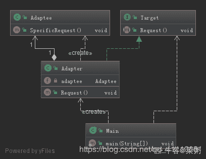
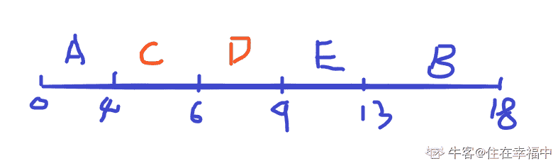
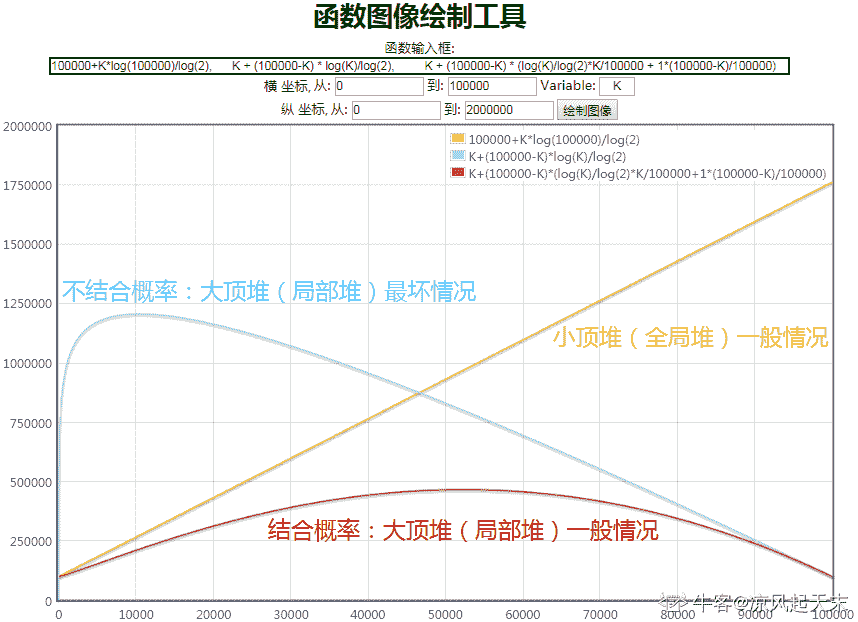
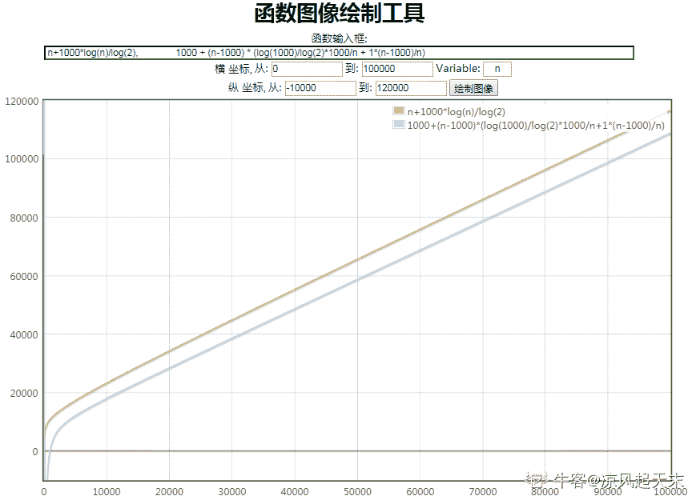

# 小米 2019 秋招软件开发笔试题（B）

## 1

以下容易造成缓冲区溢出的函数是（）

正确答案: A C   你的答案: 空 (错误)

```cpp
strcpy
```

```cpp
strncat
```

```cpp
sprintf
```

```cpp
strcmp
```

本题知识点

小米 C++工程师 C++ C 语言 奇安信

讨论

[Lee124](https://www.nowcoder.com/profile/957365898)

A. strcpy     没限制长度可能导致溢出（安全版本 strncpy）B. strncat    限制了 copy 的长度就没问题，strcat 可能导致溢出 C. sprintf     和 printf()一样，有格式化字符串攻击的可能 D. strcmp    比较两个 string 长度，无危害

发表于 2020-09-01 20:35:31

* * *

[MonkeyH](https://www.nowcoder.com/profile/8391276)

1.  strcpy() :函数将源字符串复制到缓冲区。没有指定要复制字符的具体数目！如果源字符串碰巧来自用户输入，且没有专门限制其大小，则有可能会造成缓冲区溢出！
2.  strcat() :函数非常类似于 strcpy()，它可以将一个字符串合并到缓冲区末尾。
3.  sprintf()、vsprintf() : 用来格式化文本和将其存入缓冲区的通用函数

        可以看出来在对缓冲区进行写操作的时候都有可能导致内存溢出。

发表于 2019-03-20 09:21:09

* * *

[牛客 135416480 号](https://www.nowcoder.com/profile/135416480)

一脸茫然，，，

发表于 2020-11-03 19:11:33

* * *

## 2

A 和 B 两人在球场上进行踢点球比赛，两人交换着踢，先进球者获胜。A 踢进的概率为 0.6，B 踢进的概率为 0.5。假设 A 先踢，那么 A 最后获胜的概率最接近以下哪个选项？

正确答案: D   你的答案: 空 (错误)

```cpp
0.55
```

```cpp
0.6
```

```cpp
0.7
```

```cpp
0.75
```

本题知识点

Java 工程师 C++工程师 测试工程师 小米 概率统计 *2019 概率论与数理统计* *讨论

[程序猿 Go 师傅](https://www.nowcoder.com/profile/242025553)

A 进球的次数肯定发生在第 1，3，5，7...次，相应的概率为：
第一次进球：0.6
第三次进球：0.4*0.5*0.6
第五次进球：0.4*0.5*0.4*0.5*0.6
第 n 次进球：(0.4*0.5)^((n-1)/2)*0.6
概率的总和 p=0.2⁰*0.6+0.2¹*0.6+0.2²*0.6+...+0.2^((n-1)/2)*0.6=0.6*(0.2⁰+0.2¹+0.2²+...+0.2^((n-1)/2))=0.6*（1-0.2^((n-1)/2))）/（1-0.2）=0.75-0.75*0.2^((n-1)/2))当 n 趋紧于无穷大时，p=0.75，所以选择 D

编辑于 2019-10-21 20:57:22

* * *

[20190521](https://www.nowcoder.com/profile/823297712)

A 获胜的情况：A(进):0.6A(不进)B(不进)A(进)：0.4*0.5*0.6A(不进)B(不进)A(不进)B(不进)A(进)：0.4*0.5*0.4*0.5*0.6
·······所以 A 获胜的概率是注意这里用到级数求和公式

发表于 2019-09-11 16:12:31

* * *

[牛客 529982993 号](https://www.nowcoder.com/profile/529982993)

可能本身并没有想考级数求和，毕竟这不是数学考试。A 获胜就是概率的相加，A 第一次获胜 0.6，第三次就是（0.4*0.5*0.6 = 1.2）+ 0.6，到这里就可以选出 D 了。

发表于 2019-12-16 22:16:13

* * *

## 3

假设单链表中节点的结构为{data,next}，其中 next 指向下一个节点。若想删除结点 p（p 既不是头节点也不是尾结点）的直接后继节点，则应执行下列哪个操作？（）

正确答案: C   你的答案: 空 (错误)

```cpp
p=p->next; p->next=p->next->next
```

```cpp
p=p->next->next
```

```cpp
:p->next=p->next->next
```

```cpp
p->next->next=p->next
```

本题知识点

Java 工程师 C++工程师 测试工程师 小米 链表 *C++工程师 Java 工程师 小米 2019 C++工程师 Java 工程师 小米 2019 C++工程师 Java 工程师 小米 2019 C++工程师 Java 工程师 小米 2019* *讨论

[你别看他还小](https://www.nowcoder.com/profile/9307371)

C 答案的冒号是不是多余的，直接 p->next=p->next->next 就可以了

发表于 2019-09-06 23:10:21

* * *

[ARCHER.Yaner](https://www.nowcoder.com/profile/2053289)

一点要看见题中是指 p 的后继节点！ 一个空格把我看岔了

发表于 2020-09-07 16:57:17

* * *

[Courvoisier](https://www.nowcoder.com/profile/743924857)

要想删除节点 p 首先要保存节点 p 的指针 pre，不然 p 就丢失了

发表于 2019-09-07 08:21:54

* * *

## 4

假设一个无向图中包含 12 个顶点，其中 5 个顶点有 5 个度，7 个顶点有 7 个度，那么这个图有几条边？（）

正确答案: C   你的答案: 空 (错误)

```cpp
12
```

```cpp
25
```

```cpp
37
```

```cpp
49
```

```cpp
60
```

本题知识点

Java 工程师 C++工程师 测试工程师 小米 安卓工程师 iOS 工程师 运维工程师 前端工程师 算法工程师 图 2019 系统工程师

讨论

[绅蓝](https://www.nowcoder.com/profile/1596072)

一条边带来两个度，（7*7+5*5）/2=37

发表于 2019-03-26 10:06:07

* * *

[恶寒轻轻](https://www.nowcoder.com/profile/433179702)

无向图中，所有结点度之和=边数*2

发表于 2021-11-25 14:56:04

* * *

## 5

当已有类能满足目前的需求但和当前的系统兼容性比较差的情况下，比较适合使用（ ）

正确答案: B   你的答案: 空 (错误)

```cpp
工厂模式
```

```cpp
适配器模式
```

```cpp
装饰器模式
```

```cpp
代理模式
```

本题知识点

Java 工程师 C++工程师 测试工程师 小米 设计模式 2019

讨论

[菜粥](https://www.nowcoder.com/profile/5293318)

适配器模式 UML 图（IDEA 自动生成）



大话设计模式-适配器模式：

[`localhost.blog.csdn.net/article/details/89705070`](https://localhost.blog.csdn.net/article/details/89705070)

大话设计模式-适配器模式示例：

[`localhost.blog.csdn.net/article/details/89705199`](https://localhost.blog.csdn.net/article/details/89705199)

大话设计模式-系列文章(共 50 篇)：

[`blog.csdn.net/qq_41113081/category_8723350.html`](https://blog.csdn.net/qq_41113081/category_8723350.html)

发表于 2020-03-23 00:21:44

* * *

[你别看他还小](https://www.nowcoder.com/profile/9307371)

适配器模式（Adapter）通常适用于以下场景。

*   以前开发的系统存在满足新系统功能需求的类，但其接口同新系统的接口不一致。
*   使用第三方提供的组件，但组件接口定义和自己要求的接口定义不同。

发表于 2019-09-06 23:13:15

* * *

[铁牛同学](https://www.nowcoder.com/profile/344723619)

设计模式教程：[`www.runoob.com/design-pattern/design-pattern-intro.html`](https://www.runoob.com/design-pattern/design-pattern-intro.html)

发表于 2021-11-03 19:22:08

* * *

## 6

下列关于数据库的说法错误的是（）

正确答案: B   你的答案: 空 (错误)

```cpp
一张表只能有一个主键，但可以有多个唯一索引
```

```cpp
索引可以提高查询效率所以可以尽多添加
```

```cpp
如果数据量比较大的情况可以考虑业务分表
```

```cpp
sql 语言中删除视图使用 drop 命令
```

本题知识点

Java 工程师 C++工程师 测试工程师 小米 数据库 2019

讨论

[FLFcc](https://www.nowcoder.com/profile/960202828)

索引会消耗更多的磁盘空间，并且在更新索引字段的时候，效率会更加的低下

发表于 2019-09-04 15:24:17

* * *

[桐梓林梁朝伟 666](https://www.nowcoder.com/profile/9917802)

一张表只能有一个主键，但可以有多个唯一索引记住这个

发表于 2021-07-10 20:59:53

* * *

[QiaoH](https://www.nowcoder.com/profile/8257111)

索引的添加会影响读写效率，所以是越少越好。

发表于 2019-08-10 20:03:54

* * *

## 7

下面那个语句满足如下条件?（）
假定 y=8
当 x=3 时,z=8
当 x=4 时,z=8
当 x=5 时,z=8
当 x=6 时,z=8
当 x=7 时,z=8
当 x=8 时,z=8
当 x=9 时,z=16
当 x=10 时,z=16
当 x=11 时,z=16
当 x=12 时,z=16

正确答案: B   你的答案: 空 (错误)

```cpp
z=((x+y-1) ^ (~(y-1)))
```

```cpp
z=((x+y-1) & (~(y-1)))
```

```cpp
z=((x+y-1) | (~(y-1)))
```

```cpp
都不对
```

本题知识点

Java 工程师 C++工程师 测试工程师 小米 2019

讨论

[wohmai](https://www.nowcoder.com/profile/958702721)

y - 1 = 7 转换为二进制为 0000 0111；~(y - 1)为 1111 1000；x + y - 1 即为 x + 0000 0111；很明显在 x 小于 8 时，相加的结果不会超过低四位；在 x 大于 8 后，相加结果到高四位；最后与~(y-1)进行与运算，得到题目所示结果**注意"~"为非运算符**

发表于 2019-08-05 21:36:08

* * *

[铁牛同学](https://www.nowcoder.com/profile/344723619)

& 按位与；｜ 按位或；^ 按位异或；~ 非

发表于 2021-11-03 19:30:03

* * *

## 8

双色球问题，在一个不透明的箱子里面均匀的分布着相同的 6 颗红色球和 3 颗蓝色球，求随机的抽两次球，中一个蓝色球和一个红色球的概率？（）

正确答案: D   你的答案: 空 (错误)

```cpp
1/12
```

```cpp
1/4
```

```cpp
1/8
```

```cpp
1/2
```

本题知识点

Java 工程师 C++工程师 测试工程师 小米 概率统计 *2019 概率论与数理统计* *讨论

[末离 ml](https://www.nowcoder.com/profile/505295086)

按照题目的意思应该是无放回，这样等同于一次性取两个球，所求概率为.

发表于 2020-01-17 10:24:51

* * *

[徐强 201907261758919](https://www.nowcoder.com/profile/957512126)

答案为 B

题目没有具体说明取完之后放不放回，所以我们要分两种情况讨论。

一 取完放回

一蓝一红的概率我们可以用 1–两红–两篮：=1-（6/9*6/9+3/9*3/9）=36/81 与选项不符。

二 取完不放回

思路与第一种情况一样只是概率不同 一蓝一红概率 p ：= 1- （6/9*5*8+3/9*2/8）= 1/2 B

发表于 2019-08-16 20:07:06

* * *

[WLINX](https://www.nowcoder.com/profile/444183105)

6/9 * 3/8=1/4 3/9 * 6/8=1/4 1/4 + 1/4=1/2

发表于 2019-03-11 23:40:16

* * *

## 9

现有线性表（16，37, 43，55, 73，97，110，100），对其进行散列存储， 若选用 H(K)=K%9 作为散列函数，则散列地址为 1 的元素有（）个。

正确答案: D   你的答案: 空 (错误)

```cpp
1
```

```cpp
2
```

```cpp
3
```

```cpp
4
```

本题知识点

Java 工程师 C++工程师 测试工程师 小米 链表 *2019* *讨论

[QiaoH](https://www.nowcoder.com/profile/8257111)

把上面元素 mod9 运算 结果为 1 的有 4 个。 说人话就是除以 9 余数为 1

发表于 2019-08-10 20:09:29

* * *

[山巅贝壳](https://www.nowcoder.com/profile/851329023)

考查哈希表的查找----哈希函数的构造方法---除留余数法是用关键字 k 除以某个不大于哈希表长度 m 的整数 p 所得的余数作为哈希地址的方法。即求余运算得到为 1 的个数。

编辑于 2020-04-22 09:19:10

* * *

[饭 999](https://www.nowcoder.com/profile/60223478)

37 55 73 100

发表于 2020-09-12 11:30:58

* * *

## 10

假设有四道作业，他们的提交时间和执行时间由下表给出。请计算在单道程序环境下，用非抢占式最短作业优先调度算法(SJF)时的平均周转时间和平均带权周转时间是（）
作业名 |提交时刻（时) |执行时间（小时）
A        |    0                  |    4
B        |    1                  |    5
C        |    2                  |    2
D        |    3                  |    3
E        |    4                   |    4
周转时间与平均带权周转时间计算公式参照如下：
周转时间=作业完成时间—作业提交时间;
平均周转时间=(作业 1 的周转时间+...+作业 n 的周转时间)/n;
带权周转时间=作业周转时间/作业实际运行时间;
平均带权周转时间=(作业 1 的带权周转时间+...+作业 n 的带权周转时间)/n;

正确答案: A   你的答案: 空 (错误)

```cpp
8，2.13
```

```cpp
8，2.85
```

```cpp
9，2.85
```

```cpp
9，2.13
```

本题知识点

Java 工程师 C++工程师 测试工程师 小米 操作系统 2019

讨论

[抠脚大汉 4](https://www.nowcoder.com/profile/7544433)

提交 执行 完成 周转 带权周转

A 0 4 4 4 1

B 1 5 18 17 17/5

C 2 2 6 4 2

D 3 3 9 6 2

E 4 4 13 9 9/4

平均周转 t=（4+17+4+6+9）/5

平均带权周转 t= （1+17/5+2+2+9/4）/5

发表于 2019-12-01 16:48:59

* * *

[少年乖 2](https://www.nowcoder.com/profile/4739306)

什么破题，都没说是抢占式，还是非抢占。

发表于 2019-03-14 12:44:23

* * *

[住在幸福中](https://www.nowcoder.com/profile/5839191)

1、非抢占式短作业优先：周转时间=作业完成时间—作业提交时间;
A: 4 - 0 = 4B: 18 - 1 = 17C: 6 - 2 = 4 D: 9 - 3 = 6 E: 13 - 4 = 9 平均周转时间=(作业 1 的周转时间+...+作业 n 的周转时间)/n = （4 + 17 + 4 + 6 + 9）/ 5 = 8 带权周转时间=作业周转时间/作业实际运行时间;
A: 4 / 4 = 1B: 17 / 5 = 3.4C: 4 / 2 = 2D: 6 / 3 = 2 E: 9 / 4 = 2.25 平均带权周转时间=(作业 1 的带权周转时间+...+作业 n 的带权周转时间)/n = （1 + 3.4 + 2 + 2 + 2.25）/ 5 = 2.13

发表于 2021-09-06 22:10:07

* * *

## 11

有一个队列 X，在 X 的两端都可以入队，但只允许在 X 的一端出队，在任意时间都可以做入队和出队操作。将序列{A,B,C,D,E}依次入队，则得到的出队序列可能有（）

正确答案: A B D   你的答案: 空 (错误)

```cpp
{B,A,C,D,E}
```

```cpp
{D,B,A,C,E}
```

```cpp
{D,B,C,A,E}
```

```cpp
{E,C,B,A,D}
```

本题知识点

Java 工程师 C++工程师 测试工程师 小米 队列 *2019* *讨论

[悦千言](https://www.nowcoder.com/profile/320259883)

不管如何，B 都是第二个进队的，所以出队时一定与 A 挨着，C 在 AB 左右均可，以此类推。选 ABD。

发表于 2019-09-29 18:31:21

* * *

[牛客 661540253 号](https://www.nowcoder.com/profile/661540253)

在答案里找出顺序符合 EDCBABCDE 就可以了

发表于 2020-08-13 14:17:42

* * *

[万题斩](https://www.nowcoder.com/profile/566427464)

我觉得主要是通过思考的关键点应该放在入队顺序上。A：首先验证 A 选项的可能性，A 先从右边进入，B 从左边进入，然后 C、D、E 依次从右边入队，之后统一从右边出队，符合选项正确。B：同理验证 B 选项可能性，A 先从右边进入，B 从左边进入，然后 C 从右边进入，D 从左边进入，E 再从右边进入，之后统一从右边出队，符合选项正确。D：验证 D，A 先从右边进入，B 从左边进入，C 从左边进入，D 从右边进入，E 从左边进入，然后从右边出队，符合选项正确。C：C 中既要保证依次入队，又要保证 C 在 AB 的中间，矛盾，故排除。

发表于 2019-09-02 16:48:14

* * *

## 12

关于堆数据结构，下面描述中正确的有（）

正确答案: A B C E   你的答案: 空 (错误)

```cpp
可以用堆实现优先队列（priority_queue）
```

```cpp
使用堆可以实现排序算法，复杂度为 N * log N
```

```cpp
从 M 个元素中查找最小的 N 个元素时，使用大顶堆的效率比使用小顶堆更高
```

```cpp
在大顶堆中，第 N 层中的所有元素比第 N+1 层中的所有元素都要大
```

```cpp
堆数据结构可以用数组方式存储，存储的是一棵完全二叉树
```

本题知识点

Java 工程师 C++工程师 测试工程师 小米 堆 2019

讨论

[凉风起天末](https://www.nowcoder.com/profile/709610362)

**关于 C 选项**：利用堆结构解决 top K（这里是 min K）问题有两种实现方式，以本题的 min K 为例：

**小顶堆思路**：构建一个容量为 n 的堆，建堆时间为 n，此后每次都弹出堆顶元素（最小元素）再调整，一共弹 K 次，每次调整时间为 log(n)，所以时间复杂度是 n+K*log(n)；

**大顶堆思路**：只维护一个容量为 K 的堆，所以建堆的复杂度为 K，此后遍历数组剩下的所有元素（n-K 个），每个元素都要和堆顶的元素进行比较，如果比堆顶大，则忽略（说明该元素不是最小 K 个值，概率比较难算，这里简单当作(n-K)/n），复杂度是 1，如果比堆顶小（概率简单视作 K/n），则将堆顶替换为该元素并调整堆结构（称之为堆更新），每次更新（堆调整）的复杂度为 log(K)，所以最坏时间代价为：K + (n-K) * log(K)；**结合概率**平均每个元素要比较的次数为：log(K)*K/n + 1*(n-K)/n，所以总时间复杂度是：K + (n-K) * [log(K)*K/n + 1*(n-K)/n]；
下面我们来分析一下二者的代价，假设**数据总量固定**为 10w，要求 min K 问题，将 K 作为变量，画出二者的函数图像（如下），可见，对于不同的 K 值，方法二（大顶堆）普遍比方法一好（**但是一定要注意把概率考虑进去，否则得出的结果是大顶堆的最坏情况**）。 而如果**将 K 值固定**为 1000，将数据总量 n 作为变量又如何呢？？同样的，画图观察（如下），可见，还是方法二好一点。 **局部堆（K 堆）**方法的特点是，**堆顶在比较过程中起到了关键作用**，大部分情况下，数据都被堆顶元素给拒之门外，只有少部分数据能进入堆中更新数据，另外空间效率也比较优秀。**全局堆（N 堆）**方法的特点是，当 K 非常小时，也能取得优秀的效率，但是当 K 增大时，代价就变大了，同时需要一个充分的空间来容纳所有数据。**结论**：局部堆比全局堆好用，并且 K/N 的值越大，差别越明显

编辑于 2019-10-02 15:05:01

* * *

[M 阳](https://www.nowcoder.com/profile/795783009)

C 选项我理解的是说从大顶堆不断从叶子节点中寻找最小的，然后删掉，再在叶子节点中寻找最小的，这样直至找到 N 个最小的为止，在 N 不是 1 时，不需要修改堆，反复查找叶子节点中最小的就可以了，不知道这样理解对不对

发表于 2019-09-17 09:57:01

* * *

[Hesetone](https://www.nowcoder.com/profile/1704663)

C 选项不太认同，M 和 N 关系不知道吧，万一我在 1w 个元素中查询最小的 1 个值呢，也是大顶堆效率更高吗？貌似不是吧。等大佬来解释下。


发表于 2019-03-25 20:56:22

* * *

## 13

小米 max３的屏幕分辨率是 2160*1080，长按电源键+音量下键截图，假设每个像素点占用空间 24 位 bit，预计这张图片在无损保存的情况下，占用多大存储空间（）

正确答案: A   你的答案: 空 (错误)

```cpp
6.6MB
```

```cpp
5.5MB
```

```cpp
3059KB
```

```cpp
7.3M
```

本题知识点

Java 工程师 C++工程师 测试工程师 小米 安卓工程师 iOS 工程师 运维工程师 前端工程师 算法工程师 操作系统 2019 系统工程师

讨论

[QiaoH](https://www.nowcoder.com/profile/8257111)

2160*1080*（24/8）/1024*1024=6.67419

发表于 2019-08-10 20:12:28

* * *

[jingjinghao](https://www.nowcoder.com/profile/384571149)

```cpp

```
像素点的颜色深度 24 / 8 = 3 B(yte)
```cpp

2160*1080*3 B .= 2160 * 3 KB .= 6.3780 MB 
```

发表于 2019-07-04 06:02:13

* * *

[tuweilong](https://www.nowcoder.com/profile/334452011)

图像文件的字节数=图像分辨率*颜色深度/8

不知道你的深度是多少，一般是 24
680X750X24/8=1530000 字节

1530000/1024=1494KB
1494/1024=1.46MB
以上只是基本原理算法
格式不同文件压缩品质也就是不同的。

发表于 2019-03-23 11:06:00

* * *

## 14

关于进程和线程，下列说法正确的有（）

正确答案: A D   你的答案: 空 (错误)

```cpp
线程的粒度小于进程
```

```cpp
同一进程内的线程只能串行执行
```

```cpp
一个程序只能对应一个进程
```

```cpp
线程是 CPU 调度的基本单位
```

本题知识点

Java 工程师 C++工程师 测试工程师 小米 安卓工程师 iOS 工程师 运维工程师 前端工程师 算法工程师 操作系统 2019 系统工程师

讨论

[persistenceYL](https://www.nowcoder.com/profile/714170061)

线程是 CPu 调度的最小基本单位，进程是资源分配的最小单位

发表于 2019-03-13 10:17:39

* * *

[yellow0523](https://www.nowcoder.com/profile/991597070)

一个程序最少有一个进程。进程是资源分配的基本单位，线程是 CPU 调度的基本单位。

发表于 2020-03-24 13:16:55

* * *

[牛客 529749121 号](https://www.nowcoder.com/profile/529749121)

一个进程内可以有多个线程，每个线程就是进程的一个子任务，所以线程的粒度小于进程；CPU 进行调度的基本单位（最小单位）当然是粒度更小的线程，而进程是操作系统资源分配的基本单位。

发表于 2019-12-24 11:02:16

* * *

## 15

下面可以检测运算过程中出现整型溢出的办法有（）

正确答案: B C   你的答案: 空 (错误)

```cpp
将运算结果和可以表示的最大整数进行比较
```

```cpp
检测符号位的变化
```

```cpp
将计算结果减去加数看是否与另一加数相等
```

```cpp
比较参数的长度
```

本题知识点

C++工程师 小米 C++ 2019 C 语言

讨论

[MonkeyH](https://www.nowcoder.com/profile/8391276)

选项 1 ： 运算结果进行比较的话，已经溢出导致结果变化，去比较也为时已晚。 所以不正确选项 2 ： 检测符号为变化可以防止符号溢出，正确。选项 3 ： a+b = c   c - a != b 则 c 溢出 正确选项 4 ： 参数长度    0000000000000000000000000 这个长度算溢出么 不正确

发表于 2019-03-20 10:59:38

* * *

[三丁目的永恒夕阳](https://www.nowcoder.com/profile/3918670)

其实 c 选项不太对，整型加减构成的是一个群，那么就一定有 （a+b）- a = b  无论这个过程中是否发生溢出，可参考计组教材

发表于 2020-04-20 17:55:45

* * *

[项得力](https://www.nowcoder.com/profile/1813421)

“将计算结果减去加数看是否与另一加数相等”这个选项，是错的，比如

```cpp
 #include<stdio.h>
int main(){ 
        unsigned char a=255; 
        unsigned char b=1; 
        unsigned char c; 
        c=a+b; 
        b=c-a; 
          printf("c:%d b:%d\n",c,b); 
        return 0; 
        }
```

把 unsigned char 改成 char 也一样是错的。

编辑于 2019-05-02 10:24:57

* * *

## 16

以下关于 TCP 和 UDP 的描述正确的有（）

正确答案: B D   你的答案: 空 (错误)

```cpp
TCP 和 UDP 提供面向连接的传输，通信前要先建立连接（三次握手机制）
```

```cpp
TCP 提供可靠的传输，UDP 提供不可靠的传输
```

```cpp
TCP 是面向数据报的传输，UDP 是面向字节流的传输
```

```cpp
TCP 提供拥塞控制和流量控制机制；UDP 不提供拥塞控制和流量控制机制
```

本题知识点

Java 工程师 C++工程师 测试工程师 小米 安卓工程师 iOS 工程师 运维工程师 前端工程师 算法工程师 网络基础 2019 系统工程师

讨论

[smile_Gang 求一个 offer](https://www.nowcoder.com/profile/551457875)

TCP 面向字节流传输，因此可被分割并在接收端重组；UDP 面向数据报传输

发表于 2019-09-09 23:35:42

* * *

[jianyu](https://www.nowcoder.com/profile/8330860)

TCp 面向连接、UDP 面向无连接

发表于 2019-03-16 14:42:04

* * *

[青简](https://www.nowcoder.com/profile/708069809)

tcp 是面向数据包的 面向连接的 udp 是面向报文的

发表于 2019-09-10 21:14:28

* * *

## 17

以下哪些算法的平均时间复杂度是 O(n*log n)？

正确答案: B C D   你的答案: 空 (错误)

```cpp
冒泡排序
```

```cpp
快速排序
```

```cpp
归并排序
```

```cpp
堆排序
```

本题知识点

小米 复杂度 2019

讨论

[ycyaw](https://www.nowcoder.com/profile/820401078)

希尔排序是 nlogn 的啊

发表于 2019-10-18 08:14:54

* * *

[yanl_](https://www.nowcoder.com/profile/667190757)

shell 平均时间复杂度 不是 O(N¹.3)吗？

发表于 2020-03-23 10:52:39

* * *

[小六喜欢赵小刀](https://www.nowcoder.com/profile/860595925)

在数据结构——用 c 语言描述（第 2 版）耿国华著一书中规定希尔排序时间复杂度是 O(n¹.5)，此题有误！！！

发表于 2020-03-16 09:14:51

* * *

## 18

数据库事务正确执行所需要素有哪几个（）

正确答案: A B C D   你的答案: 空 (错误)

```cpp
原子性
```

```cpp
一致性
```

```cpp
隔离性
```

```cpp
持久性
```

本题知识点

Java 工程师 C++工程师 测试工程师 小米 安卓工程师 iOS 工程师 运维工程师 前端工程师 算法工程师 数据库 2019 系统工程师

讨论

[牛客 898427848 号](https://www.nowcoder.com/profile/898427848)

事务的四大特性。原子性：原子性是指事务的操作要么全部成功，要么就失败回滚。一致性：一致性是指事务执行前和执行后从一个一致的状态到另一个一致的状态。隔离性：指的是事务开始后不被其他事务影响，也不影响其他事务，达到相互隔离。持久性：事务所作出的改变对数据库中的数据来说是永久的。大致就是这样

发表于 2020-03-19 21:13:41

* * *

[Walkingdeath](https://www.nowcoder.com/profile/622775021)

数据库事务 acid

发表于 2019-10-25 08:13:26

* * *

## 19

以下关于 C++语言中虚函数的描述正确的有（）

正确答案: A C   你的答案: 空 (错误)

```cpp
构造函数不可以是虚函数
```

```cpp
析构函数不可以是纯虚函数
```

```cpp
构造函数中不应该调用纯虚函数
```

```cpp
struct 中不可以定义虚函数
```

本题知识点

Java 工程师 C++工程师 测试工程师 小米 安卓工程师 iOS 工程师 运维工程师 前端工程师 算法工程师 C++ 2019 系统工程师

讨论

[Traveling_L1ght](https://www.nowcoder.com/profile/31501865)

虚析构函数是为了让通过基类指针或引用可以正确释放派生类对象。有时候如果想让基类成为一个抽象类，也就是不能被实例化，可以为类引入一个纯虚函数。但如果手上没有任何 pure virtual 函数时，该怎么办？由于抽象类总是会被作为基类用于派生的，而基类就该有一个虚的析构函数，并且由纯虚函数可以导致抽象类。所以常常把基类的析构函数声明为纯虚析构函数。又由于所有对象析构时，最后都会调用其基类的析构函数，所以基类的析构函数必须有定义。纯虚析构函数也不例外。
B 错误！！！

编辑于 2019-08-27 10:00:59

* * *

[荒岛 201806171614211](https://www.nowcoder.com/profile/120671452)

在父类的构造函数 和 析构函数 中都不能调用纯虚函数(不能以任何方式调用)。

发表于 2019-10-14 16:00:07

* * *

[我科研的样子很像蔡徐坤](https://www.nowcoder.com/profile/893375403)

虚函数与纯虚函数：
A、C:首先说下什么是构造函数，构造函数是用来初始化对象的。假如子类可以继承基类构造函数，那么子类对象的构造将使用基类的构造函数，而基类构造函数并不知道子类的有什么成员，显然是不符合语义的。B 参考其他答案

发表于 2020-02-27 15:37:15

* * *

## 20

下面对完全二叉树描述正确的是（）

正确答案: B C   你的答案: 空 (错误)

```cpp
叶子结点可在任一层出现
```

```cpp
某些结点有有右子树则必有左子树
```

```cpp
适用于顺序结构存储
```

```cpp
不一定适合顺序结构存储
```

本题知识点

小米 树 2019

讨论

[你别看他还小](https://www.nowcoder.com/profile/9307371)

完全二叉树：叶节点只能出现在最下层和次下层，因为只能按顺序层次排序。

发表于 2019-09-06 23:19:31

* * *

[我的天鸭](https://www.nowcoder.com/profile/243498)

完全二叉树，有左子树不一定有右子树，有右子树一定有左子树，叶子节点只能出现在倒数第一和倒数第二层

发表于 2019-08-23 15:17:39

* * *

[While.](https://www.nowcoder.com/profile/393679111)

完全二叉树，有左子树不一定有右子树，有右子树一定有左子树，叶子节点只能出现在倒数第一和倒数第二层

发表于 2020-11-05 16:13:51

* * *

## 21

给定若干个 32 位 int 数字集合，每个集合中的数字无重复，譬如：
  {1,2,3}  {2,5,6}  {8}
将其中交集不为空的集合合并，保证合并完成后所有集合之间无交集，输出合并后的集合个数以及最大集合中元素的个数。

本题知识点

小米 Java 工程师 C++工程师 测试工程师 数组 模拟 图 2019

讨论

[KzXuan](https://www.nowcoder.com/profile/83489774)

Python 优化后的并查集

```cpp
N = int(input())
sets = [list(map(int, input().split())) for _ in range(N)]
# parent 用来记每个数的父节点
# nums 用来记每个根节点的树中有几个节点
parent, nums = {}, {}

for _set in sets:
    # 对于每个集合，默认取第一个元素为根节点来构造树
    p = _set[0]
    # 根节点为 p 的树默认有 0 个元素
    nums.setdefault(p, 0)

    for s in _set:
        # 如果当前数没有出现在 parent 中，说明是个新的数，把它添加进来并以 p 作为它的父节点
        if s not in parent:
            parent[s] = p
            nums[p] += 1
        # 如果当前数已经出现过，它必然有一个父节点，且可以根据父节点向上找到根节点，
        # 于是把一路经过的所有节点都指向 p，相当于一个层级压缩，让 p 成为新的根节点
        # 同时把原先的根节点中的计数赋给 p
        else:
            while parent[s] != p:
                temp = parent[s]
                parent[s] = p
                s = temp
            parent[s] = p
            if s != p and s in nums:
                nums[p] += nums[s]
                del nums[s]

print(len(nums.keys()))
print(max(nums.values()))
```

编辑于 2019-09-06 09:33:41

* * *

[零葬](https://www.nowcoder.com/profile/75718849)

思路很简单，使用并查集来求解。当然，并查集常用的优化套路全都要用上，如：路径压缩、根据 rank 进行合并。但是在本题的数据量下，老老实实读完数据然后构建并查集是过不了的！必须一边读数据一边构建并查集，同时还要一边做集合的合并，才能勉强 AC！

```cpp
import java.io.BufferedReader;
import java.io.InputStreamReader;
import java.io.IOException;
import java.util.HashMap;

public class Main {
    public static void main(String[] args) throws IOException {
        BufferedReader br = new BufferedReader(new InputStreamReader(System.in));
        String line;
        while((line = br.readLine()) != null){
            int n = Integer.parseInt(line);
            UnionFind uf = new UnionFind();
            // 边读取数据边对并查集中的元素进行合并
            for(int i = 0; i < n; i++){
                String[] str = br.readLine().split(" ");
                int[] set = new int[str.length];
                for(int j = 0; j < set.length; j++){
                    set[j] = Integer.parseInt(str[j]);
                    uf.add(set[j]);
                    if(j > 0) {
                        uf.union(set[j], set[j - 1]);     // 合并集合
                    }
                }
            }
            // 获得连通分量数
            System.out.println(uf.getCount());
            // 获得最大连通分量大小
            System.out.println(uf.getMaxSize());
        }
    }
}

class UnionFind {
    int count;        // 连通分量数
    int maxSize;      // 最大集合的规模
    private HashMap<Integer, Integer> parent;       // 节点->根
    private HashMap<Integer, Integer> rank;         // 节点->树的大小
    public UnionFind(){
        parent = new HashMap<Integer, Integer>();
        rank = new HashMap<Integer, Integer>();
        maxSize = 1;
    }

    public void add(int num) {
        if(!parent.containsKey(num)){
            parent.put(num, num);
            rank.put(num, 1);
            count++;
        }
    }

    private int find(int x){
        int root = x;
        while(parent.get(root) != root){
            root = parent.get(root);
        }
        // 把沿途节点的根都修改为 father
        while(x != root){
            int temp = parent.get(x);
            parent.put(x, root);
            x = temp;
        }
        return root;
    }

    public void union(int x, int y){
        int rootX = find(x);
        int rootY = find(y);
        if(rootX == rootY){
            return;
        }
        int rankX = rank.get(rootX);
        int rankY = rank.get(rootY);
        if(rankX < rankY){
            parent.put(rootX, rootY);      // y 的树高就将 x 合并到 y
            rank.put(rootY, rankX + rankY);
            maxSize = Math.max(maxSize, rank.get(rootY));
        }else{
            // 高度相等时随便合并，但是树的最大高度会增加
            parent.put(rootY, rootX);
            rank.put(rootX, rankX + rankY);
            maxSize = Math.max(maxSize, rank.get(rootX));
        }
        count--;
    }

    public int getCount(){
        return count;
    }

    public int getMaxSize(){
        return maxSize;
    }
}
```

发表于 2022-01-06 15:24:52

* * *

[ElonB](https://www.nowcoder.com/profile/623894)

```cpp
/*
并查集算法
*/
#include <bits/stdc++.h>
using namespace std;

class DisjointSet
{
private:
    std::unordered_map<int, int> parent;
    std::unordered_map<int, int> rank; // 秩

public:
    void add(int x)
    {
        if(parent.find(x) == parent.end()) {
            parent[x] = x;
            rank[x] = 0;
        }
    }
    int find(int x)
    {
        // 查找根节点，并包含路径压缩，提高运行效率
        return x == parent[x] ? x : (parent[x] = find(parent[x]));
    }
    void to_union(int x1, int x2)
    {
        int f1 = find(x1);
        int f2 = find(x2);
        if (f1 == f2) return;
        // 按秩合并，find-union 操作最坏的运行时间提高至 O(log n)
        if (rank[f1] > rank[f2])
            parent[f2] = f1;
        else {
            parent[f1] = f2;
            if (rank[f1] == rank[f2])
                ++rank[f2];
        }
    }
    void printRes()
    {
        int cnt = 0, len_max;
        map<int, int> set;
        for(auto it = parent.begin(); it != parent.end(); it++) {
            find(it->first);  // 将所有节点到根节点的距离压缩至 1 步
            if(set.find(it->second) == set.end()) set[it->second] = 0;
            set[it->second]++; // 统计合并后每个集合的大小
            if(it->first == it->second) cnt++; // 当根节点为本身时，集合数加一
        }
        for(auto p = set.begin(); p != set.end(); p++)
            len_max = max(len_max, p->second);
        cout << cnt << endl << len_max << endl;
//        for(auto it = parent.begin(); it != parent.end(); it++) {
//            cout << it->first << " " << it->second << endl;
//        }
    }
};

int main(void)
{
    DisjointSet ans = DisjointSet();
    int n, a, b;
    cin >> n;
    while(n--) {
        scanf("%d", &a);
        ans.add(a);
        while(getchar() != '\n') {
            scanf("%d", &b);
            ans.add(b);
            ans.to_union(a, b);
        }
    }
    ans.printRes();
    return 0;
}

```

发表于 2019-07-15 14:19:48

* * *

## 22

给出一个数字 N，对于数字序列 1,2,3 ... N。现在在其中插入“+”, "-", " "，使得表达式的和为 M。" "的含义是把相邻的两个数字组成一个数。例如：1 + 2 3 - 4，含义是：1 + 23 - 4 = 20。
给出 N 和 M，求出所有合法的序列的个数。

本题知识点

小米 Java 工程师 C++工程师 测试工程师 穷举 2019

讨论

[nbgao](https://www.nowcoder.com/profile/211289)

```cpp
#include<bits/stdc++.h>
using namespace std;

int n,m,cnt=0;

void DFS(int sum, int p){
    if(sum==m && p==n+1)
        cnt++;
    int t = 0;
    for(int i=p;i<=n;i++,t*=10){
        t += i;
        DFS(sum+t, i+1);
        if(p!=1)
            DFS(sum-t,i+1);
    }
}

int main(){
    cin>>n>>m;
    DFS(0,1);
    cout<<cnt<<endl;
    return 0;
}
```

发表于 2019-07-20 23:53:11

* * *

[Aiben_](https://www.nowcoder.com/profile/738006385)

```cpp
//动态方程（有点难理解）：当前种类=符号位加号+符号为减号+没有符号的种类
//dp(before,des,n,ex)= dp(before - 1, before, res + des,1) + dp(before - 1, before, res - des,1) + dp(before - 1, before*pow(10, ex)+des, res,ex+1);
// before: 需要判定的符号前面的数字的个数，初始为 8
// des: 需要判定的符号后面的数字，初始为 9
// n:方程右边的结果
// ex:阶乘数，因为符号有三种可能，加号，减号，或者没有，如果没有，那么 ex 就用于计算当前值
#include<iostream>
#include<cmath>
using namespace std;
int dp(int before, int des, int res, int ex) {
	if (before == 0) {
		if (des == res) {
			return 1;
		}
		else {
			return 0;
		}
	}
	else {
		return dp(before - 1, before, res + des, 1) + dp(before - 1, before, res - des, 1) + dp(before - 1, before*pow(10, ex) + des, res, ex + 1);
	}
}
int main() {
	int m,n; 
    cin >>m>>n;

	cout << dp(m-1, m, n, 1);

}
```

发表于 2019-08-20 15:09:29

* * *

[北雷北雷](https://www.nowcoder.com/profile/488594459)

dfs 解法

```cpp
#include <iostream>
using namespace std;
int n, m;
int dfs(int sum, int current,int step) {
    //当前和，当前位，当前数字（步数）
    if (step == n + 1) {
        if (sum == m&&current == step) {
            return 1;
        }
        else return 0;
    }
        //当当前位为一的时候，不允许减操作，如 1 2 3 得到-15，通过-12-3 是不允许的。同理 1 也不能得到-1
    int temp = current;
    while (temp > 9 ) {
        temp = temp / 10;
    }
    if(temp ==1) return dfs(sum + current, step + 1, step + 1) + dfs(sum, current * 10 + step + 1, step + 1);
    else return  dfs(sum + current, step + 1,step+1) + dfs(sum - current, step + 1,step+1) + dfs(sum, current *10+ step +1,step+1);
}
int main() {
    cin >> n >> m;
    cout << dfs(0, 1,1);
    system("pause");
    return 0;
}
```

编辑于 2019-07-27 15:46:51

* * ******