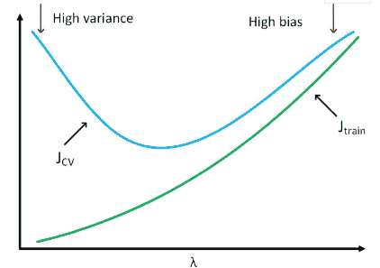
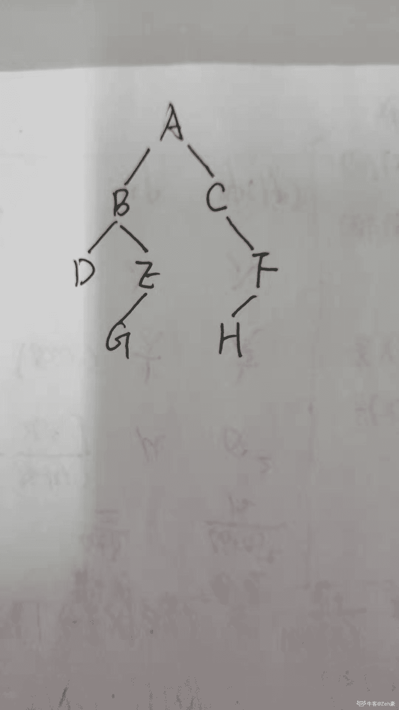
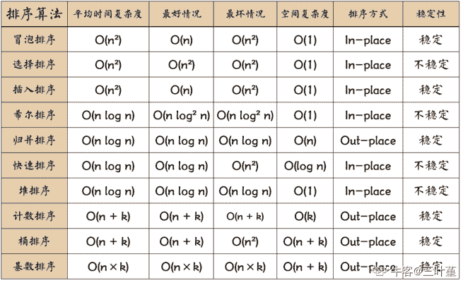
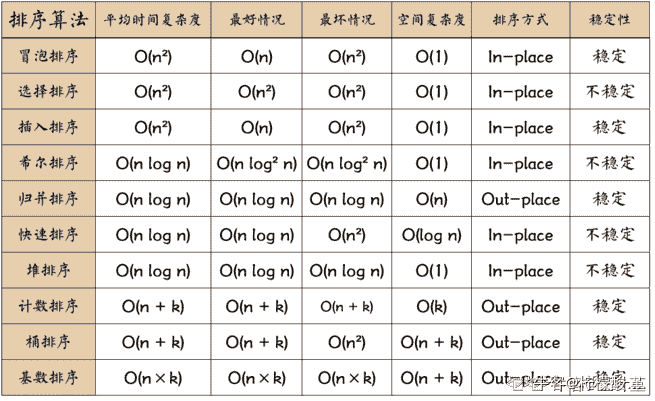
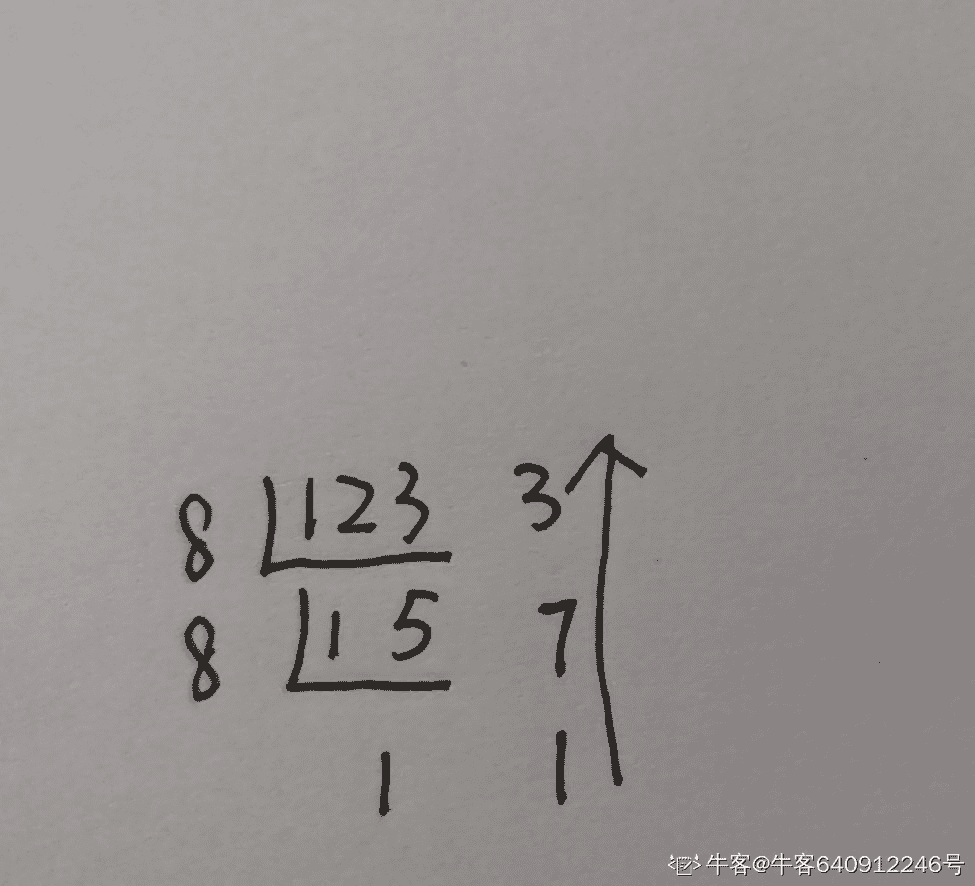

# 小米 2019 秋招算法笔试题（A）

## 1

假如使用一个较复杂的脊回归模型 (Ridge Regression)，来拟合样本数据时，通过调整正则化参数λ，来调整模型复杂度。当λ较大时，关于偏差（bias）和方差（variance），下列说法正确的是？（）

正确答案: C   你的答案: 空 (错误)

```cpp
当λ增大时，偏差减小，方差减小
```

```cpp
当λ增大时，偏差减小，方差增大
```

```cpp
当λ增大时，偏差增大，方差减小
```

```cpp
当λ增大时，偏差增大，方差增大
```

本题知识点

算法工程师 小米 机器学习 组合数学 *2019* *讨论

[cy 助我](https://www.nowcoder.com/profile/139305150)

1.λ越大，对模型中参数的惩罚力度越大，因此会有更多的参数被训练为 0，模型也就变得更加简单了。模型复杂度越低，方差小，但偏差大。2.下图为不同λ下“训练误差”和“交叉验证误差”的变化

*   当λ很小时，模型处于“高方差”状态，“训练误差”很小，“交叉验证误差”较大
*   当λ很大时，模型处于“高偏差”状态，“训练误差”和“交叉验证误差”都很大



发表于 2019-03-24 19:32:23

* * *

[张楸](https://www.nowcoder.com/profile/1550478)

λ越大，对模型中参数的惩罚力度越大，模型的复杂度越低，特征变化越简单，方差越小。

发表于 2019-12-27 15:44:32

* * *

[牛客 581010518 号](https://www.nowcoder.com/profile/581010518)

换个思路，正则化是为了防止过拟合，因此可以假设模型过拟合，如用 9 阶多项式拟合训练 10 个数据点，在测试集上的表现，模型方差大，偏差小。增加 lamda，可认为高阶项被置 0，当 lamda 过大，可能只剩常数项占主导，此时方差减小，偏差增大

发表于 2022-01-02 15:07:21

* * *

## 2

若以{4,7,8,10,12}作为叶子节点的权值构造哈弗曼树，则其带权路径长度是（）

正确答案: B   你的答案: 空 (错误)

```cpp
41
```

```cpp
93
```

```cpp
100
```

```cpp
134
```

本题知识点

算法工程师 小米 树 2019

讨论

[Restaring](https://www.nowcoder.com/profile/467555741)

一.哈弗曼树的构建    每次在所有的数值中选择最小的两个值,相加后作为新的值放入原来的集合中,重复该过程    {4,7,8,10,12}构建的哈弗曼树如下图                41        23            18
    12     11    8       10           4    7
二.带权路径    在一棵树中，从一个结点往下可以达到的孩子或孙子结点之间的通路，称为路径。通路中分支的数目称为路径长度。若规定根结点的层数为 1，则从根结点到第 L 层结点的路径长度为 L-1。    树的带权路径长度规定为所有叶子结点的带权路径长度之和，记为 WPL。三.本题的计算    WPL = 12*2 + 4*3 +7*3 + 8*2 + 10*2 =93

发表于 2019-07-29 16:52:31

* * *

## 3

已知一棵二叉树前序遍历和中序遍历分别为 ABDEGCFH 和 DBGEACHF，则该二叉树的后序遍历为（）

正确答案: B   你的答案: 空 (错误)

```cpp
GEDHFBCA
```

```cpp
DGEBHFCA
```

```cpp
ABCDEFGH
```

```cpp
ACBFEDHG
```

本题知识点

Java 工程师 C++工程师 安卓工程师 iOS 工程师 运维工程师 前端工程师 算法工程师 测试工程师 小米 树 2019

讨论

[Zeh 豪](https://www.nowcoder.com/profile/506161703)

前序遍历：先根，后左，再右；中序遍历：先左，后根，再右；后序遍历：先左，后右，再根；因为前序遍历和中序遍历分别为 ABDEGCFH 和 DBGEACHF，可得二叉树为：所以后序遍历为：

```cpp
DGEBHFCA
```

发表于 2019-08-06 21:02:18

* * *

## 4

一棵有 15 个节点的完全二叉树和一棵同样有 15 个节点的普通二叉树，叶子节点的个数最多会差多少个？（）

正确答案: C   你的答案: 空 (错误)

```cpp
3
```

```cpp
5
```

```cpp
7
```

```cpp
9
```

本题知识点

小米 树 2019

讨论

[Realself](https://www.nowcoder.com/profile/831729261)

*   节点数为 n 的完全二叉树的叶子节点数：n/2【n 为偶数】,(n+1)/2【n 为奇数】
*   普通儿二叉树的叶子节点数最少为 1
*   所以，最多会相差 7 个

发表于 2020-03-12 18:54:49

* * *

[刘诗歌](https://www.nowcoder.com/profile/406172105)

完全二叉树和单叉树的差距

发表于 2019-08-26 18:31:38

* * *

[梁亨](https://www.nowcoder.com/profile/503355187)

完全二叉树一共有 8 个叶结点，而普通二叉树最少可以有 1 个叶结点，相差最大 15-8=7

发表于 2019-08-28 20:45:01

* * *

## 5

以下函数的时间复杂度是

```cpp
void recursive(int n, int m, int o) {
    if (n <= 0) {
        printf("%d, %d \n", m, o);
    } else {
        recursive(n - 1, m + 1, o);
        recursive(n - 1, m, o + 1);
    }
}
```

正确答案: B   你的答案: 空 (错误)

```cpp
O(n*m*o)
```

```cpp
O(2^n)
```

```cpp
O(n²*m²)
```

```cpp
O(n!)
```

本题知识点

复杂度 递归

讨论

[DaBingSun](https://www.nowcoder.com/profile/830144499)

快速的排除法，当 n=1 时，执行了 2 次。带进去选 B。

发表于 2019-09-22 20:47:44

* * *

[seokfuit](https://www.nowcoder.com/profile/111207)

本题 n,m,o 三个参数中，只有 n 影响时间复杂度；recursive 内部两个 recursive 的“n”输入一样，说明两个 recursive 要么都过了 if 条件，要么都没过；最后时间复杂度 = 2⁰ + 2¹ + 2² + 。。。+ 2^(n-1) = 2^(n-1) x 2 - 1 = 2^n - 1 

发表于 2020-05-24 12:14:20

* * *

[牛客 650125723 号](https://www.nowcoder.com/profile/650125723)

随便一想，就是一个类树结构，那么树结构的复杂度就差不多了

发表于 2022-01-30 03:57:08

* * *

## 6

以下哪种排序算法平均时间复杂度最低（）

正确答案: C   你的答案: 空 (错误)

```cpp
冒泡排序
```

```cpp
插入排序
```

```cpp
归并排序
```

```cpp
选择排序
```

本题知识点

排序 *讨论

[三叶堇](https://www.nowcoder.com/profile/633774529)



发表于 2020-05-01 22:53:48

* * *

[牛客网弟中弟](https://www.nowcoder.com/profile/5002895)

归并排序的平均时间复杂度为 O(nlogn), 其他三个排序的平均时间复杂度为 O(n²)

发表于 2019-03-14 12:32:33

* * *

[柠檬酸....](https://www.nowcoder.com/profile/923492926)



发表于 2020-08-31 19:30:20

* * *

## 7

下面不属于贪心算法的是（）

正确答案: D   你的答案: 空 (错误)

```cpp
单源最短路径中的 Dijkstra 算法
```

```cpp
最小生成树的 Prim 算法
```

```cpp
最小生成树的 Kruskal 算法
```

```cpp
计算每对顶点最短路径的 Floyd-Warshall 算法
```

本题知识点

Java 工程师 C++工程师 安卓工程师 iOS 工程师 运维工程师 前端工程师 算法工程师 测试工程师 小米 贪心 算法工程师 小米 2019 算法工程师 小米 2019

讨论

[牛客网弟中弟](https://www.nowcoder.com/profile/5002895)

Floyd 算法是基于动态规划的思想，其他的三种是基于贪心算法的思想

发表于 2019-03-14 12:33:35

* * *

[牛客 561324 号](https://www.nowcoder.com/profile/561324)

Flody 算法是基于动态规划另外三种是基于贪心算法的

发表于 2019-03-12 19:44:39

* * *

## 8

以下 JAVA 程序代码的输出是

```cpp
public static void main(String args[]) {
System.out.println(14³);
}
```

正确答案: B   你的答案: 空 (错误)

```cpp
2744
```

```cpp
13
```

```cpp
17
```

```cpp
11
```

本题知识点

Java 工程师 C++工程师 安卓工程师 iOS 工程师 运维工程师 前端工程师 算法工程师 测试工程师 小米 Java 2019

讨论

[牛客用户 6324](https://www.nowcoder.com/profile/9092522)

^表示异或 就是相同是 0 不同是 114 是 11103 是 0011 所以 14³=1101，即 13

发表于 2019-03-19 12:52:34

* * *

[静信 XZJue](https://www.nowcoder.com/profile/813524429)

按位或|按位且&按位取反~按位异或^----------------------------------逻辑与&&逻辑或||非!
----------------------------------左移<<:补 0，相当于乘以 2 右移>>：补符号位，相当于除以 2 无符号右移>>>：补 0

发表于 2019-09-29 21:35:38

* * *

[今日.](https://www.nowcoder.com/profile/921844134)

^是按位异或的意思

14 的二进制编码为 1110

3 的二进制编码为 0011

可知 14³ 的结果为 1101

值为 13

发表于 2019-10-17 23:51:08

* * *

## 9

给定两个特征向量，以下哪些方法可以计算这两个向量相似度？（）

正确答案: A B D   你的答案: 空 (错误)

```cpp
欧式距离
```

```cpp
夹角余弦(Cosine)
```

```cpp
信息熵
```

```cpp
曼哈顿距离
```

本题知识点

算法工程师 小米 机器学习 组合数学 *2019* *讨论

[P-ShineBeam](https://www.nowcoder.com/profile/945440246)

熵  是用来度量不纯度的

发表于 2019-08-27 21:29:27

* * *

[offer 你来了](https://www.nowcoder.com/profile/856940262)

普通信息熵不行，要是相对熵就可以

发表于 2020-07-29 22:49:55

* * *

[牛客 632248939 号](https://www.nowcoder.com/profile/632248939)

B 夹角余弦。cosSVM 中， cosine 函数也可以用来当作核函数计算相似度 k() = similarity(样本，地标)， 虽然一般是用高斯函数来做核函数的。其他常见核函数：多项式核函数， 字符串核函数（用于文本数据）， 卡方核函数， 直方图交叉函数。。。

发表于 2019-12-10 08:35:04

* * *

## 10

以下关于正则化的描述正确的是（）

正确答案: A B C D   你的答案: 空 (错误)

```cpp
正则化可以防止过拟合
```

```cpp
L1 正则化能得到稀疏解
```

```cpp
L2 正则化约束了解空间
```

```cpp
Dropout 也是一种正则化方法
```

本题知识点

算法工程师 小米 机器学习 2019

讨论

[门扣](https://www.nowcoder.com/profile/790195824)

 L2 本质是参数解的 2 阶范数，以二维为例，L2 的最优解就是一个圆；如果你还记得话，loss func 的组成是两部分一部分是预测值和真实值之间的 error，一部分是正则项，前一部分的解空间可以看作是一个梯度下降的等高线，这样一来，loss func 的所有局部解就是每层等高线和这个圆之间的切点，所以说约束了解空间。这也是为啥 L2 会让解平滑，L1 会让解稀疏（因为 L1 的解是一个四个顶点在坐标轴上的正方形，等高线与它的交点多半落在坐标轴上，意味着某一维会变成零）
————————————————
版权声明：本文为 CSDN 博主「张哲瑞」的原创文章，遵循 CC 4.0 BY-SA 版权协议，转载请附上原文出处链接及本声明。
原文链接：[`blog.csdn.net/weixin_41791402/java/article/details/102765445`](https://blog.csdn.net/weixin_41791402/java/article/details/102765445)

编辑于 2020-04-08 00:06:46

* * *

[空空就是悟空](https://www.nowcoder.com/profile/940001276)

都对

发表于 2019-09-23 16:43:10

* * *

[GoodFellow201904261341544](https://www.nowcoder.com/profile/875109857)

为什么说 L2 正则化约束了解空间

发表于 2019-09-06 09:56:41

* * *

## 11

当发现机器学习模型过拟合时，以下操作正确的是：（）

正确答案: A B C   你的答案: 空 (错误)

```cpp
降低特征维度
```

```cpp
增加样本数量
```

```cpp
添加正则项
```

```cpp
增加特征维度
```

本题知识点

算法工程师 小米 机器学习 2019

讨论

[呆哥不是个好少年](https://www.nowcoder.com/profile/82165986)

A 也可以

因为维度不断增加就会增加整个数据空间的稀疏性，这样就更容易找到分类的超平面，所以降低维度可以帮助降低过拟合

发表于 2019-09-06 17:45:55

* * *

[小火箭、](https://www.nowcoder.com/profile/374384782)

造成过拟合两个因素：1、数据量少  2、模型复杂度过高

发表于 2019-08-27 16:17:12

* * *

[luna_rayu](https://www.nowcoder.com/profile/104496533)

过拟合引发原因：训练数据太少/模型太复杂/参数过多/噪声过多 解决方法： 1、获得更多的训练数据集 2、降低特征维度 3、正则化，在训练的时候限制权值变大 4、dropout 5、早停 hold out 6、数据清洗

发表于 2021-10-25 17:18:04

* * *

## 12

下面 关于线程和进程正确的说法有：（）

正确答案: A B C D   你的答案: 空 (错误)

```cpp
进程间相互独立，同一进程的各线程间共享。某进程内的线程在其它进程不可见。
```

```cpp
使用 start()方法可以使一个线程成为可运行的，但是它不一定立即开始运行。
```

```cpp
线程上下文切换比进程上下文切换要快得多。
```

```cpp
当一个线程因为抢先机制而停止运行，它被放在可运行队列的后面
```

本题知识点

Java 工程师 安卓工程师 运维工程师 前端工程师 算法工程师 测试工程师 小米 操作系统 2019

讨论

[夏雨潇潇-o-](https://www.nowcoder.com/profile/4188539)

当一个线程因为抢先机制而停止运行，它被放在可运行队列的后面。

发表于 2019-09-05 11:26:18

* * *

[tttted](https://www.nowcoder.com/profile/687870453)

队列是先进先出的，队列头进队列尾出。d 答案没问题。

发表于 2020-07-16 08:54:50

* * *

[王仲](https://www.nowcoder.com/profile/6614319)

d 应该是放在可运行队列的后面

编辑于 2020-09-08 21:14:09

* * *

## 13

以下说法中正确的有（）

正确答案: A B D   你的答案: 空 (错误)

```cpp
二叉树中有两个孩子的节点数一定等于叶子节点减一
```

```cpp
若一个叶节点是某二叉树中的中序遍历的最后一个节点，同时它也是该二叉树前序遍历的最后一个节点
```

```cpp
C++中 std:map 查找一个数据的复杂度是 O(1)
```

```cpp
n 个关键字中已知有 k 个关键字哈希值相同，若用现象探测法将它们存入散列表，至少需要进行 k(k-1)/2 次探测
```

本题知识点

小米 树 2019

讨论

[牛客网弟中弟](https://www.nowcoder.com/profile/5002895)

map 中查找一个数据的复杂度为 o(logn)

发表于 2019-03-14 12:39:40

* * *

[芦溪彭于晏](https://www.nowcoder.com/profile/678987627)

关于 B 选项，要看清楚叶节点的设定！

发表于 2019-04-11 15:38:59

* * *

[我的天鸭](https://www.nowcoder.com/profile/243498)

D 选项的线性探测法难道不是 K(K+1)/2 次探测？第 1 个探测 1 次，第 K 个探测 K 次

发表于 2019-08-27 16:38:41

* * *

## 14

下列哪些网络结构会发生权重共享（）

正确答案: C D   你的答案: 空 (错误)

```cpp
感知机
```

```cpp
全连接神经网络
```

```cpp
卷积神经网络
```

```cpp
循环神经网络
```

本题知识点

算法工程师 小米 2019

讨论

[GoodFellow201904261341544](https://www.nowcoder.com/profile/875109857)

会发生权值共享的网络有 CNN,RNN

发表于 2019-09-05 15:31:37

* * *

## 15

现在假设负样本量:正样本量=20:1，下列哪些方法可以处理这种不平衡的情况？（）

正确答案: A B C   你的答案: 空 (错误)

```cpp
直接训练模型，预测的时候调节阈值
```

```cpp
下采样对少样本进行扩充，以增加正样本数量
```

```cpp
随机降采样负样本
```

```cpp
训练过程中，增加负样本的权重
```

本题知识点

算法工程师 小米 机器学习 2019

讨论

[岁荣](https://www.nowcoder.com/profile/3071559)

类别不平衡的时候可以通过阈值缩放

编辑于 2021-02-20 10:26:27

* * *

[牛客 463382533 号](https://www.nowcoder.com/profile/463382533)

参考西瓜书，解决类别不平衡书中提出三种方法：1.下采样 2.过采样 3.阈值偏移所以我觉得第一个也应该选吧

发表于 2020-03-06 20:34:39

* * *

[天麒爸爸](https://www.nowcoder.com/profile/603572593)

这答案有鬼了吧，复制正样本也只是增加重复数据，对建模并不会提供额外信息的好吗？如果不通过下采样对少样本进行扩充，剩下的方法就只有在建模的时候调节权重权重了啊

发表于 2019-09-06 09:07:42

* * *

## 16

下列关于随机森林(RF)与梯度提升树(GBDT)区别说法正确的是：（）

正确答案: A C D   你的答案: 空 (错误)

```cpp
组成随机森林的树可以分类树也可以是回归树，而 GBDT 只由回归树组成。
```

```cpp
随机森林对异常值敏感，而 GBDT 对异常值不敏感。
```

```cpp
随机森林不需要进行数据预处理，即特征归一化。而 GBDT 则需要进行特征归一化。
```

```cpp
组成随机森林的树可以并行生成，而 GBDT 是串行生成。
```

本题知识点

算法工程师 小米 机器学习 2019

讨论

[鸡核王鱼奎恩](https://www.nowcoder.com/profile/468360576)

理论上树模型全部不需要归一化。因为本来也不是靠什么梯度下降法来训练的，只跟特征值的大小有关，没有改变特征值的顺序理论上不影响结果。

发表于 2019-03-31 14:45:02

* * *

[理想汽车部门直推官](https://www.nowcoder.com/profile/953506955)

GBDT 和 RF 的相同点：1.都是由多棵树组成 2.最终的结果都是由多棵树一起决定 GBDT 和 RF 的不同点：1.组成随机森林的树可以是分类树，也可以是回归树；而 GBDT 只由回归树组成 2.组成随机森林的树可以并行生成；而 GBDT 只能是串行生成 3.对于最终的输出结果而言，随机森林采用多数投票等；而 GBDT 则是将所有结果累加起来，或者加权累加起来 4.随机森林对异常值不敏感，GBDT 对异常值非常敏感；5.随机森林对训练数据一视同仁，GBDT 是基于权值的弱分类器的集成；6.随机森林是通过减少模型方差提高性能，GBDT 是通过减少模型偏差提高性能；

编辑于 2020-08-16 10:44:53

* * *

[春招再战阿里](https://www.nowcoder.com/profile/413913753)

树模型都不用归一化，C 可能有问题

发表于 2019-03-12 17:24:28

* * *

## 17

以下说法，正确的有（）

正确答案: A B C D   你的答案: 空 (错误)

```cpp
红黑树插入操作的平均时间复杂度为 O(log(n))，最坏时间复杂度为 O(log(n))
```

```cpp
归并排序的最差情况复杂度 O(n*log(n))
```

```cpp
堆排序的最差情况复杂度 O(n*log(n))
```

```cpp
不论线性表采用顺序存储结构还是链式存储结构，查找并删除值为 X 的结点的时间复杂度均为 O(n)
```

本题知识点

小米 复杂度 2019

讨论

[鬼谷 201906162153501](https://www.nowcoder.com/profile/308185473)

d 选项应该是算上查找值的时间了吧

发表于 2019-11-29 15:08:12

* * *

[祯民](https://www.nowcoder.com/profile/463267767)

这道题 D 选项答案错了对于链式存储结构，删除元素节点的时间复杂度应该为 O(1)

发表于 2019-10-04 19:43:25

* * *

[牛客 812466158 号](https://www.nowcoder.com/profile/812466158)

红黑树相关操作

发表于 2021-11-18 21:43:14

* * *

## 18

在 Linux 系统中，因为某些原因造成了一些进程变成孤儿进程，那么这些孤儿进程会被以下哪一个系统进程接管（）

正确答案: A   你的答案: 空 (错误)

```cpp
init
```

```cpp
sshd
```

```cpp
syslogd
```

```cpp
top
```

本题知识点

Java 工程师 C++工程师 安卓工程师 iOS 工程师 运维工程师 前端工程师 算法工程师 测试工程师 小米 Linux 2019 系统工程师

讨论

[SINGLE201908091343387](https://www.nowcoder.com/profile/136255951)

答案选 Ainit 进程有两个作用其中之一扮演终结父进程的角色：所有的孤儿进程都会被 init 进程接管。

发表于 2019-08-27 13:52:23

* * *

## 19

十进制数 123 的的 8 进制表示是？（）

正确答案: A   你的答案: 空 (错误)

```cpp
173
```

```cpp
176
```

```cpp
180
```

```cpp
163
```

本题知识点

编译和体系结构

讨论

[小黄路边歌手 201710171139339](https://www.nowcoder.com/profile/6789986)

参考十进制转换为二进制。用 123/8=15 余 3,15/8=1 余 7，从下往上逆着看，就是 173。写在纸上比较清晰。或者可以使用排除法，十进制数 123 结尾是数字 3，则八进制数后面也为 3，这样就可以排除 B、C，然后通过计算（163）[8]=（8E2+6*8+3=115）[10]。

发表于 2019-03-27 22:58:41

* * *

[牛客 640912246 号](https://www.nowcoder.com/profile/640912246)



发表于 2021-09-09 09:53:19

* * *

[科比的十二](https://www.nowcoder.com/profile/542507369)

用十除以 8 取余数，再将余数倒序排列

发表于 2020-06-18 09:09:07

* * *

## 20

将元素 1、2、3、4、5 进行入栈出栈操作（一次只能操作一个元素）。其中入栈需按从小到大的顺序，那么可能的出栈顺序有：（）

正确答案: A D   你的答案: 空 (错误)

```cpp
1, 3, 2, 4, 5
```

```cpp
1, 4, 2, 3, 5
```

```cpp
4, 3, 5, 1, 2
```

```cpp
4，5，3，2，1
```

本题知识点

Java 工程师 C++工程师 安卓工程师 iOS 工程师 运维工程师 前端工程师 算法工程师 测试工程师 小米 栈 *2019* *讨论

[牛客 912095327 号](https://www.nowcoder.com/profile/912095327)

A：入：1 出：1 入： 2 3 出：3 2 入：4 出：4 入：5 出：5D:入：1 2 3 4 出：4 入：5 出：5 3 2 1

发表于 2019-08-02 17:28:36

* * *

[上大-黄志栋](https://www.nowcoder.com/profile/553150667)

这个题需要注意一下入栈顺序是从小到大，虽然入栈过程中可以出栈，但需要保证整体入栈顺序是从小到大。A：入 1 出 1，入 23，出 32，入 4 出 4，入 5 出 5；整体入的顺序是 12345；D：入 1234，出 4，入 5 出 5，出 321，整个过程入栈顺序也是 12345，B，C 选项无法满足

发表于 2020-07-08 10:41:06

* * *

[牛客 648947850 号](https://www.nowcoder.com/profile/648947850)

忽然豁然开朗，分几次入栈出栈操作

发表于 2020-09-15 11:51:35

* * *

## 21

小米之家是成人糖果店。里面有很多便宜，好用，好玩的产品。中秋节快到了，小米之家想给米粉们准备一些固定金额大礼包。对于给定的一个金额，需要判断能不能用不同种产品（一种产品在礼包最多出现一次）组合出来这个金额。聪明的你来帮帮米家的小伙伴吧。

本题知识点

Java 工程师 C++工程师 安卓工程师 iOS 工程师 运维工程师 前端工程师 算法工程师 PHP 工程师 测试工程师 小米 动态规划 2019

讨论

[昀轩](https://www.nowcoder.com/profile/209410898)

python 用 01 背包解也过不了，就发现了这个方法。

```cpp
N = int(input())
price = list(map(int, input().split(' ')))
m = int(input())

possible_sum = 1
for p in price:
    possible_sum |= (possible_sum << p)
print(possible_sum >> m & 1)
```

发表于 2019-09-11 09:37:28

* * *

[yan235689147](https://www.nowcoder.com/profile/3937055)

典型的 0-1 背包问题，状态转移方程为`f[i][j]=f[i-1][j] || f[i-1][j-v[i]]`，优化为一维，从右往左更新一维数组，初始化 f[0]=1，因为 m 为 0 时不取任何物品就成立。

```cpp
int solve(){
    vector<bool> f(m + 1);
    f[0] = 1;
    for(int i = 0; i < n; i++){
        for(int j = m; j >= v[i]; j--){
            f[j] = f[j] || f[j - v[i]];
        }
    }
    return f[m];
}
```

这里数组 v 为输入的元素，n 为元素个数，m 为金额，处理输入和 main 就不放上来了。更详细的分析请参考[LeetCode 416](https://leetcode.com/problems/partition-equal-subset-sum/)。

发表于 2019-04-06 09:36:29

* * *

[零葬](https://www.nowcoder.com/profile/75718849)

```cpp
import java.io.BufferedReader;
import java.io.InputStreamReader;
import java.io.IOException;

public class Main {
    public static void main(String[] args) throws IOException {
        BufferedReader br = new BufferedReader(new InputStreamReader(System.in));
        String strN;
        while((strN = br.readLine()) != null) {
            int n = Integer.parseInt(strN);
            String[] strPrice = br.readLine().trim().split(" ");
            int[] price = new int[n];
            for(int i = 0; i < n; i++) price[i] = Integer.parseInt(strPrice[i]);
            int m = Integer.parseInt(br.readLine().trim());
            System.out.println(solve(price, m));
        }
    }

    private static int solve(int[] price, int m) {
        int n = price.length;
        // dp[i][j]表示用 0~i 的物品能否凑到价值为 j 的礼包
        boolean[][] dp = new boolean[n][m + 1];
        // 用 0~n-1 的物品肯定都能凑成价值为 0 的礼包
        for (int i = 0; i < n; i++)
            dp[i][0] = true;
        // 仅用物品 0，只能构成价值为 price[0]的礼包，所以只有相等的时候为 true
        for (int j = 0; j <= m; j++)
            if(price[0] == j) dp[0][j] = true;
        // 动态规划
        for(int i = 1; i < n; i++){
            for (int j = 1; j <= m; j++) {
                if(j < price[i])     // 无法选择物品 i，选了就会超过价值 j
                    dp[i][j] = dp[i - 1][j];
                else{
                    /*可以选择物品 i，此时的状态取决于使用 0~i-1 的物品是否构成了
                      价值为 j 的礼包，如果构成了，从状态 dp[i-1][j]直接转移过来,
                      本次不选择 i 物品。否则从 dp[i][j-price[i]]转移过来，本次
                      选择物品 i
                     */
                    dp[i][j] = dp[i - 1][j] || dp[i - 1][j - price[i]];
                }
            }
        }
        return dp[n - 1][m] ? 1: 0;
    }
}
```

发表于 2020-10-25 14:19:35

* * *

## 22

依次给出 n 个正整数 A1，A2，… ，An，将这 n 个数分割成 m 段，每一段内的所有数的和记为这一段的权重， m 段权重的最大值记为本次分割的权重。问所有分割方案中分割权重的最小值是多少？

本题知识点

Java 工程师 C++工程师 安卓工程师 iOS 工程师 运维工程师 前端工程师 算法工程师 PHP 工程师 测试工程师 小米 贪心 查找 *动态规划 2019* *讨论

[咖咧啡](https://www.nowcoder.com/profile/8816292)

```cpp
// 结果在（max(nums),sum(nums))之间，使用二分查找
// 以[7,2,5,10,8]举例，开始假设只有一个子数组,set=1 
// 第一个 mid = (10+32)/2=21, 然后把数字一个一个塞进去 
// 先塞 7, 7<21, 7+2<21, 7+2+5<21, 直到 7+2+5+10>21
// 意味着一个数组放不下, set+1=2, 然后把后面的塞完
// 如果比 m 大说明我们开的子数组太多, 也就意味值我们数组容量(mid)太小 
// 所以我们就从[22,32]区间中找, 否则在[10,21]中找  

import java.util.Scanner;
public class Main {
    public static int splitArray(int[] nums, int m) {
        int max = Integer.MIN_VALUE, sum = 0;
        for (int i : nums){
            sum += i;
            max = Math.max(max,i);
        }

        int left = max, right = sum;
        int mid, set, cur;
        while(left < right){
            mid = (left+right)/2;
            // m 是子数组数，不是 cut 数
            set = 1;
            cur = 0;
            for(int i : nums){
                if(cur+i > mid){
                    set++;
                    cur = 0;
                }
                cur+= i;
            }
            if(set > m) left = mid + 1;
            else right = mid;
        }
        return left;
    }

    public static void main(String[] args){
        Scanner sc = new Scanner(System.in);
        int n = sc.nextInt();
        int m = sc.nextInt();
        int[] nums = new int[n];
        for (int i=0; i<n; i++){
            nums[i] = sc.nextInt();
        }
        System.out.print(splitArray(nums,m));
    }
} 

```

编辑于 2019-04-13 17:07:54

* * *

[lzher0](https://www.nowcoder.com/profile/754906468)

```cpp
n, m = map(int, input().split())
num = list(map(int, input().split()))
left = max(num)
right = sum(num)
ans = right
while left < right:
    res = 0
    cnt = 1
    mid = (left+right)//2
    for i in range(len(num)):
        if res+num[i] > mid:
            cnt += 1
            res = num[i]
        else:
            res += num[i]
    if cnt <= m:
        ans = min(mid, ans)
        right = mid
    else:
        left = mid + 1
print(ans)
```

发表于 2019-08-15 10:52:46

* * *

[lentolove](https://www.nowcoder.com/profile/572586026)

```cpp
import java.io.BufferedReader;
import java.io.IOException;
import java.io.InputStreamReader;

public class Solution25_ 最优分割 {

    public static void main(String[] args) throws IOException {
        BufferedReader bf = new BufferedReader(new InputStreamReader(System.in));
        String[] line1 = bf.readLine().split(" ");
        int n = Integer.parseInt(line1[0]);
        int m = Integer.parseInt(line1[1]);
        String[] line2 = bf.readLine().split(" ");
        int[] nums = new int[n];
        int sum = 0;
        int max = 0;
        for (int i = 0; i < n; i++) {
            nums[i] = Integer.parseInt(line2[i]);
            if (max < nums[i]) {
                max = nums[i];
            }
            sum += nums[i];
        }
        System.out.println(binarySearch(nums, m, n,max,sum));

    }

    /**
     * 二分逼近法
     * 这个题的意思：假设存在数组 1 4 2 3 5 分割成 3 段，有几种分法呢，答案是 C4²: 4*3/2*1 = 6 种，
     * 即在数组的四个间隔中插入两根柱子将其分成 3 段，每一种分法中会对应有 3 个子数组的值，其中最大的值即为当前分割方法的
     * 最大权值，在所有的分割方法中找出最小的一个最大权值，听起来好像有点绕口...
     * eg：1  |  4 2 | 3 5 这种分割方法，它的最大权值为 8 而： 1 4 | 2 3 | 5 分割方法，它的最大权值为 5
     *
     *
     * 思路：假设存在一个最大值的最小值 x,反过来划分数组。子数组的权值都比 x 要小，如果组数小于 m，说明 x 还可以再小；
     * 组数大于 m，说明 x 需要变大，以容纳更多的数。减小分组数。如果组数等于 m，x 也可能再小
     * 考虑边界情况，现在把每个元素分成一组，那么 x 的最小值就是数组中最大的值；把数组当成一个组，那么 x 就是数组元素之和。
     * 即 max(nums) <= x <= sum(nums)
     * 因为每一组都是连续的，只要每一组累加的和大于了 x，那么当前元素就要放到下一组，记录有多少组即可。
     *
     * 我们通过二分逼近来确定这个 x 的值。
     * 在于这个“逼近”，这道题是在连续的数值范围中逼近，换句话说，每个组的和一定在范围之内，因此正确答案是不会被跳过的；
     */
    private static int binarySearch(int[] nums, int m, int n, int left, int right) {
        int ans = right;
        while (left <= right) {
            int mid = (left + right) / 2;
            int sum = 0;
            int count = 1;//记录数组的个数
            for (int i = 0; i < n; i++) {
                //直到当前子数组的和加上当前元素比 mid 还大，那必须将当前元素归为下一个子数组中，sum 重新计算新子数组的和
                if (sum + nums[i] > mid) {
                    count++;
                    sum = nums[i];
                } else {//当前子数组的和比 mid 小，继续加
                    sum += nums[i];
                }
            }
            //如果分完之后组数小于等于 m 说明，mid 还可以更小，即上面思路里说的 x 还能更小 右区间缩小到 mid-1；
            if (count <= m) {
                ans = Math.min(ans, mid);
                right = mid - 1;
            } else {
                left = mid + 1;
            }
        }
        return ans;
    }

    /**
     * 方法一：动态规划 此方法在牛客网上没全通过，但是是一种正确的结题思路
     */
    private static int splitArray(int[] nums, int n, int m) {
        int[][] dp = new int[n + 1][m + 1];//dp[i][j]表示前面 i 个数被分成 m 个区间中最小的权值
        int[] sub = new int[n + 1];
        for (int i = 0; i <= n; i++) {
            for (int j = 0; j <= m; j++) {
                dp[i][j] = Integer.MAX_VALUE;
            }
        }
        for (int i = 0; i < n; i++) {
            sub[i + 1] = sub[i] + nums[i];//前面 i 个元素的和
        }
        dp[0][0] = 0;
        for (int i = 1; i <= n; i++) {
            for (int j = 1; j <= m; j++) {
                for (int k = 0; k < i; k++) {
                    dp[i][j] = Math.min(dp[i][j], Math.max(dp[k][j - 1], sub[i] - sub[k]));
                }
            }
        }
        return dp[n][m];
    }
}

```

发表于 2019-08-02 21:10:15

* * ******