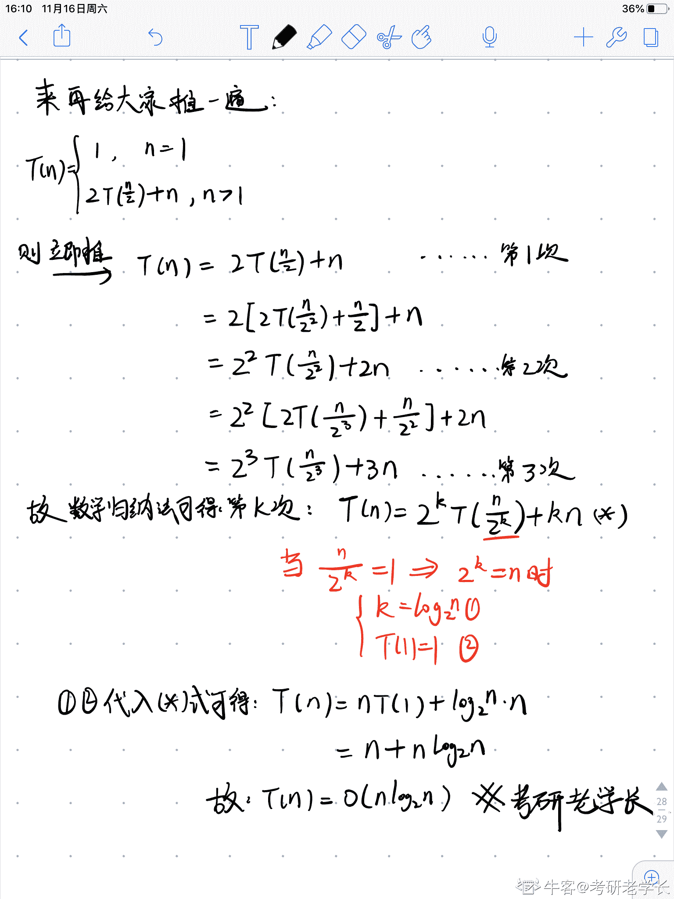
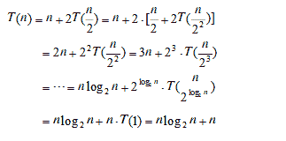
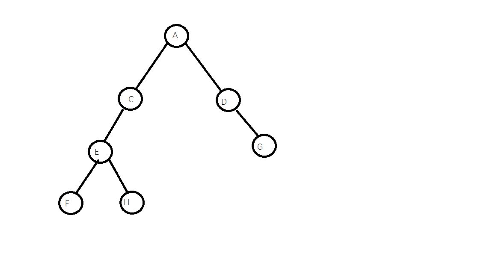

# 小米 2019 秋招算法笔试题（B）

## 1

将元素 1、2、3、4、5 进行入栈出栈操作（一次只能操作一个元素）。其中入栈需按从小到大的顺序，那么可能的出栈顺序有：（）

正确答案: A D   你的答案: 空 (错误)

```cpp
1, 3, 2, 4, 5
```

```cpp
1, 4, 2, 3, 5
```

```cpp
4, 3, 5, 1, 2
```

```cpp
4，5，3，2，1
```

本题知识点

Java 工程师 C++工程师 安卓工程师 iOS 工程师 运维工程师 前端工程师 算法工程师 测试工程师 小米 栈 *2019* *讨论

[牛客 912095327 号](https://www.nowcoder.com/profile/912095327)

A：入：1 出：1 入： 2 3 出：3 2 入：4 出：4 入：5 出：5D:入：1 2 3 4 出：4 入：5 出：5 3 2 1

发表于 2019-08-02 17:28:36

* * *

[上大-黄志栋](https://www.nowcoder.com/profile/553150667)

这个题需要注意一下入栈顺序是从小到大，虽然入栈过程中可以出栈，但需要保证整体入栈顺序是从小到大。A：入 1 出 1，入 23，出 32，入 4 出 4，入 5 出 5；整体入的顺序是 12345；D：入 1234，出 4，入 5 出 5，出 321，整个过程入栈顺序也是 12345，B，C 选项无法满足

发表于 2020-07-08 10:41:06

* * *

[牛客 648947850 号](https://www.nowcoder.com/profile/648947850)

忽然豁然开朗，分几次入栈出栈操作

发表于 2020-09-15 11:51:35

* * *

## 2

以下哪个模型属于生成模型（）

正确答案: D   你的答案: 空 (错误)

```cpp
支持向量机
```

```cpp
逻辑回归
```

```cpp
DNN
```

```cpp
朴素贝叶斯
```

本题知识点

算法工程师 小米 机器学习 2019

讨论

[myalpha](https://www.nowcoder.com/profile/331347150)

常见判别式模型有：线性回归，决策树，SVM，k 近邻，神经网络常见生成式模型有：HMM，朴素贝叶斯，GMM，LDA

发表于 2019-12-15 23:58:05

* * *

[香冷蕊不寒](https://www.nowcoder.com/profile/6466061)

判别式模型：给定 x，可通过直接建模 P(c|x)来预测 c，这样得到的是判别式模型；生成式模型：先对联合概率分布 P（x，c）建模，然后再由此获得 P(C|x)，是生成式模型。

发表于 2020-03-25 16:59:23

* * *

[kimhee](https://www.nowcoder.com/profile/898141501)

常见判别式模型有：线性回归，决策树，SVM，k 近邻，神经网络常见生成式模型有：HMM，朴素贝叶斯，GMM，LDA

发表于 2019-09-04 09:44:29

* * *

## 3

在最坏的情况下，下列排序方法中时间复杂度最小的是（）

正确答案: D   你的答案: 空 (错误)

```cpp
冒泡排序
```

```cpp
快速排序
```

```cpp
插入排序
```

```cpp
堆排序
```

本题知识点

Java 工程师 C++工程师 安卓工程师 iOS 工程师 运维工程师 前端工程师 算法工程师 测试工程师 小米 排序 *算法工程师 小米 2019 算法工程师 小米 2019* *讨论

[Sky 丶蓝调](https://www.nowcoder.com/profile/781846400)

堆排序是利用**堆**这种数据结构而设计的一种排序算法，堆排序是一种**选择排序，**它的最坏，最好，平均时间复杂度均为 O(nlogn)，它也是不稳定排序。

发表于 2019-08-22 11:15:32

* * *

[网页](https://www.nowcoder.com/profile/939778620)

冒泡排序快速排序插入排序堆排序 

发表于 2019-08-18 19:56:49

* * *

## 4

索引字段值不唯一，应该选择的索引类型为（）

正确答案: B   你的答案: 空 (错误)

```cpp
主索引
```

```cpp
普通索引
```

```cpp
候选索引
```

```cpp
唯一索引
```

本题知识点

Java 工程师 C++工程师 安卓工程师 iOS 工程师 运维工程师 前端工程师 算法工程师 测试工程师 小米 数据库 2019

讨论

[逗逗班](https://www.nowcoder.com/profile/809726648)

[知识点] 表的索引：主索引，候选索引，普通索引，唯一索引
[评析] 索引类型分类：
①主索引：主索引是一种只能在数据库表中建立不能在自由表中建立的索引。在指定的字段或表达式中，主索引的关键字绝对不允许有重复值。
②候选索引：和主索引类似，它的值也不允许在指定的字段或表达式中重复。一个表中可以有多个候选索引。
③唯一索引：唯一索引允许关键字取重复的值。当有重复值出现时，索引文件只保存重复值的第 1 次出现。提供唯一索引主要是为了兼容早期的版本。
④普通索引：普通索引允许关键字段有相同值。在一对多关系的多方，可以使用普通索引。

发表于 2019-03-16 21:33:35

* * *

[┄✄━━━━](https://www.nowcoder.com/profile/392783109)

①主索引：主索引是一种只能在数据库表中建立不能在自由表中建立的索引。在指定的字段或表达式中，主索引的关键字绝对不允许有重复值。 ②候选索引：和主索引类似，它的值也不允许在指定的字段或表达式中重复。一个表中可以有多个候选索引。 ③唯一索引：唯一索引允许关键字取重复的值。当有重复值出现时，索引文件只保存重复值的第 1 次出现。提供唯一索引主要是为了兼容早期的版本。 ④普通索引：普通索引允许关键字段有相同值。在一对多关系的多方，可以使用普通索引。

发表于 2021-05-26 23:38:44

* * *

[s1mpleO](https://www.nowcoder.com/profile/90444554)

InnoDB 只有聚簇索引（Clustered Index）与普通索引（Secondary Index），聚簇索引得是主键，所以非主键用普通索引。

发表于 2021-02-25 17:39:16

* * *

## 5

Alice 和 Bob 玩抛硬币游戏，游戏规则如下：
(1)、不断抛掷硬币，直到某一方获胜，游戏终止
(2)、Alice 获胜的条件为：第 i 轮结果为正面朝上，第 i+1 轮结果为反面朝上
(3)、Bob 获胜的条件为：第 i 轮结果为反面朝上，第 i+1 轮结果也为反面朝上
问 Alice 获胜的概率是多少？（）

正确答案: D   你的答案: 空 (错误)

```cpp
1/2
```

```cpp
1/3
```

```cpp
2/3
```

```cpp
3/4
```

本题知识点

Java 工程师 C++工程师 安卓工程师 iOS 工程师 运维工程师 前端工程师 算法工程师 测试工程师 小米 概率统计 *2019 概率论与数理统计* *讨论

[ALLENWALKER001](https://www.nowcoder.com/profile/919087034)

B 赢的前置条件是反面，但从第二次抛开始，若是反面就游戏结束，所以 B 要么在抛两次之后赢，要么就没有机会再赢了。所以 B 赢得概率就是 1/2*1/2=0.25

发表于 2019-03-28 11:16:34

* * *

[neekity](https://www.nowcoder.com/profile/7732482)

step1：两种情况 1.正 2.反 step2:   四种情况 1.正正 2.正反（alice 赢游戏结束） 3.反正 4.反反 （bob 赢游戏结束） 由 step2 可知： 正正和反正的情况才能继续 step3，所以无论如何第 i 步肯定是正，所以剩余的 1/2 情况下只有 alice 才有获胜的可能。

发表于 2019-03-13 17:09:43

* * *

[rookie_peng](https://www.nowcoder.com/profile/508307741)

第 i 轮和第 i+1 轮的结果只有四种情况:1.正正 第 i+2 轮如果是正，继续；是反，alice 赢，简而言之此种情况不外乎是多丢几次，最终还是 alice 赢 2.正反 alice 直接赢 3.反正 与第一种情况类似分析 4.反反 bob 赢综上：alice 赢得概率是 3/4

发表于 2020-07-04 17:21:21

* * *

## 6

现有一个包含 m 个节点的三叉树，即每个节点都有 3 个指向孩子节点的指针，请问：在这 3m 个指针中有（）个空指针。

正确答案: B   你的答案: 空 (错误)

```cpp
2m
```

```cpp
2m+1
```

```cpp
2m-1
```

```cpp
3m
```

本题知识点

Java 工程师 C++工程师 安卓工程师 iOS 工程师 运维工程师 前端工程师 算法工程师 测试工程师 小米 树 算法工程师 小米 2019 算法工程师 小米 2019

讨论

[dutjc](https://www.nowcoder.com/profile/841478303)

step1,m 个节点共有 3m 个指针；step2,共有 m-1 个指针指向节点，注意根节点无指针指向；3m-(m-1)=2m+1。

发表于 2019-03-15 10:20:09

* * *

[王逍遥](https://www.nowcoder.com/profile/702381038)

有 m 个指针，那么总的空指针数量是 m+1,而现在求的是 3m 个指针中的空指针的数量，所以是 3m - (m + 1) == 2m + 1

发表于 2019-10-04 17:07:40

* * *

## 7

已知某实验服从伯努利分布，P(x=1)=0.6，如果进行 2 次重复独立该实验，至少有一次实验结果为 0 的概率是多少？（）

正确答案: D   你的答案: 空 (错误)

```cpp
0.6
```

```cpp
0.4
```

```cpp
0.36
```

```cpp
0.64
```

本题知识点

Java 工程师 C++工程师 安卓工程师 iOS 工程师 运维工程师 前端工程师 算法工程师 测试工程师 小米 概率统计 *2019 概率论与数理统计* *讨论

[Lee626](https://www.nowcoder.com/profile/6064787)

至少有一次实验结果为 0 的概率是多少？结果为 0 的概率为 0.4 至少有一次：1-两次全为 1 的概率 ===》 1-0.6*0.6 = 0.64

编辑于 2020-03-27 10:28:07

* * *

[牛客 422778742 号](https://www.nowcoder.com/profile/422778742)

该实验服从伯努利分布，则假如每次伯努利实验成功的概率为 p，失败的概率 q=1-p，则 n 次独立的伯努利实验中成功 r 次的概率为：
至少有一次实验结果为 0 可以翻译为，在两次重复独立实验中，有 1 次或者两次实验结果为 0，又等价于有 1 次或者 0 次实验结果为 1\.则可以转化为计算结果 X=1 时：

所以有 1 次或者 0 次实验结果为 1，即至少有一次实验结果为 0=0.48+0.16=0.64\.选 D。

编辑于 2020-10-30 01:38:53

* * *

[cinnnnx](https://www.nowcoder.com/profile/681691640)

至少一次有 0 等于 1 - 没有 0  即 1 - 两次都为 11 - 0.6*0.6 = 0.64 

发表于 2019-08-25 16:03:09

* * *

## 8

目标变量在训练集上的 7 个实际值为[1,1,1,1,0,0,0]，目标变量的熵近似值是（log3/7=-0.847,log4/7=-0.560）（）

正确答案: A   你的答案: 空 (错误)

```cpp
0.683
```

```cpp
-0.683
```

```cpp
0.724
```

```cpp
-0.243
```

本题知识点

算法工程师 小米 机器学习 2019

讨论

[blackjacki](https://www.nowcoder.com/profile/188907475)


H(X) = -(3/7 log3/7 + 4/7 log4/7)
0.683

编辑于 2019-08-30 21:56:58

* * *

[憨子哥](https://www.nowcoder.com/profile/474133690)

怎么可能是负的 

编辑于 2019-12-04 18:28:08

* * *

[近来可好？](https://www.nowcoder.com/profile/134822053)

-(3/7 * log(3/7) + 4/7 * log(4/7))

发表于 2020-03-06 21:25:50

* * *

## 9

一个算法所需时间由下述递归方程表示：
该算法的时间复杂度是（）

正确答案: A   你的答案: 空 (错误)

```cpp
O(n*log(n))
```

```cpp
O(n²)
```

```cpp
O(n)
```

```cpp
O(log(n))
```

本题知识点

Java 工程师 C++工程师 安卓工程师 iOS 工程师 运维工程师 前端工程师 算法工程师 测试工程师 小米 复杂度 2019

讨论

[phoenixfrank](https://www.nowcoder.com/profile/969156946)



发表于 2019-11-16 16:12:37

* * *

[很棒加油](https://www.nowcoder.com/profile/699939338)



发表于 2019-04-12 14:46:45

* * *

[peerless1007](https://www.nowcoder.com/profile/4593170)

啊 T(n) 是时间复杂度，我看成了递归函数体！

发表于 2020-09-08 17:06:23

* * *

## 10

已知一棵二叉树，如果先序遍历的节点顺序是：ACEFHDG ，中序遍历是： FEHCADG ，则后序遍历结果为：（）

正确答案: D   你的答案: 空 (错误)

```cpp
CFHGEDA
```

```cpp
CDFEGHA
```

```cpp
FGHCDEA
```

```cpp
FHECGDA
```

本题知识点

Java 工程师 C++工程师 安卓工程师 iOS 工程师 运维工程师 前端工程师 算法工程师 测试工程师 小米 树 算法工程师 小米 2019 算法工程师 小米 2019

讨论

[lalala201810311250249](https://www.nowcoder.com/profile/941172239)



发表于 2019-03-14 13:54:34

* * *

## 11

以下 JAVA 程序代码的输出是

```cpp
public static void main(String args[]) {
    System.out.println(17⁵);
}
```

正确答案: C   你的答案: 空 (错误)

```cpp
12
```

```cpp
22
```

```cpp
20
```

```cpp
1419857
```

本题知识点

Java

讨论

[光头才能强](https://www.nowcoder.com/profile/5975467)

位异运算符号。运算规则是：两个数转为二进制，然后从高位开始比较，如果相同则为 0，不相同则为 1。17：0001 00015：  0000 0101 结果：0001 0100 转 10 进制：20 

发表于 2019-08-26 14:51:38

* * *

[一只老风铃](https://www.nowcoder.com/profile/9973952)

妈的看成 n 的 m 次方了

发表于 2019-08-27 10:28:00

* * *

[静信 XZJue](https://www.nowcoder.com/profile/813524429)

&按位与 |按位或 ～取反 ^异或

发表于 2020-02-08 12:54:52

* * *

## 12

假如你用 logistic Regression 算法去预测用户在网上的购买项目，然而，当你在新的用户集上验证你的假设时，你发现预测值有很大的偏差。并且你的假设在训练集上表现也很差，下面那些步骤你应该采纳，选择出正确的选项（）

正确答案: A B   你的答案: 空 (错误)

```cpp
尝试着减小正则项 λ
```

```cpp
尝试增加交叉特征
```

```cpp
减小样本量
```

```cpp
尝试更小的测试集或者特征
```

本题知识点

算法工程师 小米 机器学习 2019

讨论

[Mayday1995](https://www.nowcoder.com/profile/129911036)

很明显符合欠拟合的情况

降低“欠拟合”凤险的方法：

( 1 ）添加新特征。当特征不足或者现奇特征与样本标签的相关性不强时 3 模型容易出现欠拟合。通过挖掘“上下文特征”“ID 类特征”“组合特征”等新的特征，往往能够取得更好的效果。在深度学习潮流中，有很多模型可以帮助完成特征工程，如因子分解机、梯度提升决策树、Deep-crossing 等都可以成为丰富特征的方法。

( 2）增加模型复杂度。简单模型的学习能力较差，通过增加模型的复杂度可以便模型拥高更强的拟合能力。例如，在统性模型中添加高次 I 页，在神经网络模型中增加网络层数或神经元个数等。

( 3 ）减小正则化系数。正则化是用来防止过拟台的，但当模型出现欠拟合现象时，则需要高针对性地减小正则化系数。

发表于 2020-03-04 20:43:39

* * *

[jshlyz](https://www.nowcoder.com/profile/262117)

**欠拟合：**训练误差和验证误差都很大。**解决：**增加特征项；增加模型复杂度,如使用核函数；减小正则化系数；集成学习方法。

发表于 2020-10-07 15:26:42

* * *

[小火箭、](https://www.nowcoder.com/profile/374384782)

欠拟合

发表于 2019-08-26 19:34:34

* * *

## 13

影响基本 K-均值算法的主要因素有（）

正确答案: A B D   你的答案: 空 (错误)

```cpp
样本输入顺序
```

```cpp
模式相似性测度
```

```cpp
聚类准则
```

```cpp
初始类中心的选取
```

本题知识点

算法工程师 小米 机器学习 2019

讨论

[syoya](https://www.nowcoder.com/profile/8747720)

聚类准则也会影响聚类结果的吧？？？

发表于 2019-08-26 12:09:01

* * *

[白芝麻](https://www.nowcoder.com/profile/705825789)

具体推导详见《模式识别》的动态聚类算法，书中提到，这是一个局部搜索算法，不能保证得到全局最优解，算法结果受初始值和样本调整顺序的影响。也就是说如果在迭代的过程中，数据集不够随机，很容易陷入局部最优。

发表于 2019-03-30 09:06:57

* * *

[牛客网弟中弟](https://www.nowcoder.com/profile/5002895)

A 选项真的没有考虑到，，话说样本输入顺序是怎么影响聚类结果的啊，求大佬解答

发表于 2019-05-07 11:34:03

* * *

## 14

深度学习中，以下哪些方法可以降低模型过拟合？（）

正确答案: A B D   你的答案: 空 (错误)

```cpp
增加更多的样本
```

```cpp
Dropout
```

```cpp
增大模型复杂度，提高在训练集上的效果
```

```cpp
增加参数惩罚
```

本题知识点

Java 工程师 C++工程师 安卓工程师 iOS 工程师 运维工程师 前端工程师 算法工程师 PHP 工程师 测试工程师 小米 深度学习 2019

讨论

[理想汽车部门直推官](https://www.nowcoder.com/profile/953506955)

放置模型过拟合：1.引入正则化（参数范数惩罚）

2.Dropout

3.提前终止训练

4.增加样本量

5.参数绑定与参数共享

6.辅助分类节点(auxiliary classifiers)

7.Batch Normalization

发表于 2020-08-14 11:05:49

* * *

[Yuerya](https://www.nowcoder.com/profile/363083827)

这道题我刚开始没有选择 D，增加参数惩罚的选项，因为我将这个选项理解成了  增大惩罚参数。。。。首先，对于题目选项所说的**增加“参数惩罚”**，我觉得是个广义上的解释，比如说增加正则项或利用先验分布对参数加以控制。在这种情况下，确实是防止过拟合的方案。具体来说，在逻辑回归中，假设正则项参数为 alpha，那么 alpha 越大，模型越容易学习不足，极端情况下会欠拟合。而我理解成的增大惩罚参数，是 SVM 中的惩罚参数 C。软间隔 SVM 相当于最小化拥有正则化项的合页分布的损失，在此时这个惩罚参数 C 相当于 1/2*alpha，C 越大，alpha 越小，模型越过拟合。学好语文很重要啊。。。

发表于 2021-04-10 14:52:11

* * *

[岳麓不见鹿](https://www.nowcoder.com/profile/827970760)

正则化（regularization）会给给代价函数增加一个惩罚项，使得系数不会达到很大的值。

 发表于 2020-05-21 15:19:53

* * *

## 15

下面关于哈夫曼树的描述中，错误的是（）

正确答案: A B D   你的答案: 空 (错误)

```cpp
哈夫曼树一定是完全二叉树
```

```cpp
哈夫曼树一定是平衡二叉树
```

```cpp
哈夫曼树中权值最小的两个节点互为兄弟节点
```

```cpp
哈夫曼树中左孩子节点小于父节点，右孩子节点大于父节点
```

本题知识点

Java 工程师 C++工程师 安卓工程师 运维工程师 前端工程师 算法工程师 测试工程师 小米 树 2019

讨论

[你的 offer 对我打了烊](https://www.nowcoder.com/profile/598309941)

总结就是，除了都是树之外，哈夫曼树和完全二叉树以及平衡二叉树没有半毛钱关系

发表于 2020-03-19 10:38:10

* * *

[双双 sdfad](https://www.nowcoder.com/profile/983963689)

题目应该是正确的是：只有 C 是正确的

发表于 2019-08-28 23:45:58

* * *

[本坦库尔](https://www.nowcoder.com/profile/152134158)

完美错过正确答案

发表于 2020-05-12 20:33:43

* * *

## 16

以下哪些函数是凸函数？（）

正确答案: A C   你的答案: 空 (错误)

```cpp
f(x) = x
```

```cpp
f(x) = x3
```

```cpp
f(x) = x4
```

```cpp
f(x) = x3+x4
```

本题知识点

Java 工程师 C++工程师 安卓工程师 iOS 工程师 运维工程师 前端工程师 算法工程师 小米 组合数学 *2019* *讨论

[lalala201810311250249](https://www.nowcoder.com/profile/941172239)

二阶导数非负

发表于 2019-03-14 14:04:58

* * *

[上大-黄志栋](https://www.nowcoder.com/profile/553150667)

为什么我看的凸函数推导条件是二阶导数小于等于 0 ，即非正

发表于 2020-07-08 11:19:09

* * *

[GoodFellow201904261341544](https://www.nowcoder.com/profile/875109857)

凸函数二阶导非负

发表于 2019-09-06 12:33:58

* * *

## 17

深度学习中的激活函数需要具有哪些属性？（）

正确答案: A B D   你的答案: 空 (错误)

```cpp
计算简单
```

```cpp
非线性
```

```cpp
具有饱和区
```

```cpp
几乎处处可微
```

本题知识点

Java 工程师 C++工程师 iOS 工程师 算法工程师 小米 深度学习 2019

讨论

[Andrew_ 嵩](https://www.nowcoder.com/profile/1561274)

1\. 非线性：
即导数不是常数。这个条件是多层神经网络的基础，保证多层网络不退化成单层线性网络。这也是激活函数的意义所在。
2\. 几乎处处可微：
可微性保证了在优化中梯度的可计算性。传统的激活函数如 sigmoid 等满足处处可微。对于分段线性函数比如 ReLU，只满足几乎处处可微（即仅在有限个点处不可微）。对于 SGD 算法来说，由于几乎不可能收敛到梯度接近零的位置，有限的不可微点对于优化结果不会有很大影响。
3\. 计算简单：
非线性函数有很多。极端的说，一个多层神经网络也可以作为一个非线性函数，类似于 Network In Network 中把它当做卷积操作的做法。但激活函数在神经网络前向的计算次数与神经元的个数成正比，因此简单的非线性函数自然更适合用作激活函数。这也是 ReLU 之流比其它使用 Exp 等操作的激活函数更受欢迎的其中一个原因。
4\. 非饱和性（saturation）：
饱和指的是在某些区间梯度接近于零（即梯度消失），使得参数无法继续更新的问题。最经典的例子是 Sigmoid，它的导数在 x 为比较大的正值和比较小的负值时都会接近于 0。更极端的例子是阶跃函数，由于它在几乎所有位置的梯度都为 0，因此处处饱和，无法作为激活函数。ReLU 在 x>0 时导数恒为 1，因此对于再大的正值也不会饱和。但同时对于 x<0，其梯度恒为 0，这时候它也会出现饱和的现象（在这种情况下通常称为 dying ReLU）。Leaky ReLU 和 PReLU 的提出正是为了解决这一问题。
5\. 单调性（monotonic）：
即导数符号不变。这个性质大部分激活函数都有，除了诸如 sin、cos 等。个人理解，单调性使得在激活函数处的梯度方向不会经常改变，从而让训练更容易收敛。
6\. 输出范围有限：
有限的输出范围使得网络对于一些比较大的输入也会比较稳定，这也是为什么早期的激活函数都以此类函数为主，如 Sigmoid、TanH。但这导致了前面提到的梯度消失问题，而且强行让每一层的输出限制到固定范围会限制其表达能力。因此现在这类函数仅用于某些需要特定输出范围的场合，比如概率输出（此时 loss 函数中的 log 操作能够抵消其梯度消失的影响）、LSTM 里的 gate 函数。
7\. 接近恒等变换（identity）：
即约等于 x。这样的好处是使得输出的幅值不会随着深度的增加而发生显著的增加，从而使网络更为稳定，同时梯度也能够更容易地回传。这个与非线性是有点矛盾的，因此激活函数基本只是部分满足这个条件，比如 TanH 只在原点附近有线性区（在原点为 0 且在原点的导数为 1），而 ReLU 只在 x>0 时为线性。这个性质也让初始化参数范围的推导更为简单。这种恒等变换的性质也被其他一些网络结构设计所借鉴，比如 CNN 中的 ResNet 和 RNN 中的 LSTM。
8\. 参数少：
大部分激活函数都是没有参数的。像 PReLU 带单个参数会略微增加网络的大小。还有一个例外是 Maxout，尽管本身没有参数，但在同样输出通道数下 k 路 Maxout 需要的输入通道数是其它函数的 k 倍，这意味着神经元数目也需要变为 k 倍；但如果不考虑维持输出通道数的情况下，该激活函数又能将参数个数减少为原来的 k 倍。
归一化（normalization）：
这个是最近才出来的概念，对应的激活函数是 SELU，主要思想是使样本分布自动归一化到零均值、单位方差的分布，从而稳定训练。在这之前，这种归一化的思想也被用于网络结构的设计，比如 Batch Normalization。
--------------------- 
作者：Mrzhang 先森 
来源：CSDN 
原文：[`blog.csdn.net/zhanghao3389/article/details/85267461`](https://blog.csdn.net/zhanghao3389/article/details/85267461) 

发表于 2020-03-22 17:51:09

* * *

[ALLENWALKER001](https://www.nowcoder.com/profile/919087034)

不是 ABD 吗？

发表于 2019-03-28 11:53:45

* * *

[牛客 936529695 号](https://www.nowcoder.com/profile/936529695)

relu 系列不没有饱和区吗？

发表于 2019-07-17 18:04:46

* * *

## 18

在机器学习中，如果一味的去提高训练数据的预测能力，所选模型的复杂度往往会很高，这种现象称为过拟合。所表现的就是模型训练时候的误差很小，但在测试的时候误差很大，对于产生这种现象以下说法正确的是：（）

正确答案: A C   你的答案: 空 (错误)

```cpp
样本数量太少
```

```cpp
样本数量过多
```

```cpp
模型太复杂
```

```cpp
模型太简单
```

本题知识点

Java 工程师 C++工程师 安卓工程师 iOS 工程师 运维工程师 前端工程师 算法工程师 PHP 工程师 小米 机器学习 2019

讨论

[Code_Tiger](https://www.nowcoder.com/profile/812133399)

样本数量太少，或者模型过分复杂， 都会使得训练出来的模型“完全记住”给出的训练样本之间的关系（相当于只是背下来了试卷，但是等到高考的时候遇到新的题还是不会做） 而缺乏泛化能力 使得模型过拟合

发表于 2019-12-28 09:08:11

* * *

## 19

定义数组 int A[6][9],若将其作为参数传入方法中，则对应的形参可以定义为（）

正确答案: A D   你的答案: 空 (错误)

```cpp
int(*s)[9]
```

```cpp
int *s[9]
```

```cpp
int D[6][]
```

```cpp
int D[][9]
```

本题知识点

C++工程师 小米 C++ 2019 C 语言

讨论

[DarkWhite](https://www.nowcoder.com/profile/743312177)

选 AD 编译器会忽略数组第一维的长度，所以参数数组中第一维的长度可以省略，第二维不可以。

发表于 2019-09-06 15:43:11

* * *

[xing1223](https://www.nowcoder.com/profile/373166156)

A：int(*s)[9] ：二维数组指针，指针 s（第一维），指针 s 指向的数组（第二维）B：int *s[9]  ：指针数组，一个数组里面存放的元素是指针

发表于 2019-10-11 11:44:49

* * *

[user1687569](https://www.nowcoder.com/profile/736228835)

```cpp
A. int(*s)[9] 是表示 指向 大小为 9 的 数组指针。所以对。
```

发表于 2020-05-23 17:24:24

* * *

## 20

下面关于线程和进程正确的说法有（）

正确答案: A B C   你的答案: 空 (错误)

```cpp
进程间相互独立，同一进程的各线程间共享。某进程内的线程在其它进程不可见。
```

```cpp
线程间可以直接读写进程数据段（如全局变量）来进行通信
```

```cpp
线程上下文切换比进程上下文切换要快得多。
```

```cpp
一旦一个线程被创建，它就立即开始运行。
```

本题知识点

Java 工程师 安卓工程师 iOS 工程师 运维工程师 前端工程师 算法工程师 PHP 工程师 小米 操作系统 2019

讨论

[杨超越护体保 offer](https://www.nowcoder.com/profile/6343048)

ABC         D：线程被创建后先进入就绪状态

发表于 2020-03-01 12:36:47

* * *

[看海的小宇~](https://www.nowcoder.com/profile/926914251)

Hello?有人吗?

发表于 2020-03-01 10:13:42

* * *

[牛客 213510968 号](https://www.nowcoder.com/profile/213510968)

当线程处在不同的进程中时，切换线程也比切换进程快吗

发表于 2021-11-18 09:02:06

* * *

## 21

小米食堂每年都会举办一次厨艺大赛，假设参赛的厨师一共有 n 位（n < 1000），比赛结束后没有公布评分，但是站在领奖台上的一排厨师中每位厨师都能看到与自己相邻的厨师（左或者右）里评分比自己低（看不到比自己分数高的人的分数）的评分。比赛结束之后要发奖金，以 1K 为单位，每位厨师至少会发 1K 的奖金，另外，如果一个厨师发现自己的奖金没有高于比自己评分低的厨师的奖金，就会不满意，作为比赛组织方，小米食堂至少需要发放多少奖金才能让所有厨师满意。

本题知识点

Java 工程师 C++工程师 安卓工程师 iOS 工程师 运维工程师 前端工程师 算法工程师 PHP 工程师 测试工程师 小米 排序 *贪心 2019* *讨论

[春招再战阿里](https://www.nowcoder.com/profile/413913753)

从左至右，看自己左侧的厨师分数，比自己小的，在他的基础上加一从右至左，看自己右侧的厨师分数，比自己小的，max(自己，右侧+1)

```cpp

	point =[int(i) for i in input().split(' ')]

	n =point[0]

	money =[1 for i in range(n+1)]

	for i in range(1, n+1):

	    if i-1> 0 and i-1<=n:

	        if point[i-1] < point[i]:

	            money[i] =money[i-1]+1

	for i in range(n, 0, -1):

	    if i+1> 0 and i+1<=n:

	        if point[i+1] < point[i]:

	            money[i] =max(money[i], money[i+1]+1)

	print(sum(money)-1)

```

发表于 2019-03-12 15:44:47

* * *

[无心 2019](https://www.nowcoder.com/profile/991674511)

```cpp
#include <bits/stdc++.h>
using namespace std;
int main()
{
    int n;
    vector<int>num,p;
    while(cin>>n)
    {
        for(int i=0;i<n;i++)
        {
            int m;
            cin>>m;
            num.push_back(m);
            p.push_back(1);
        }
        for(int i=1;i<num.size();i++)
            if(num[i]>num[i-1])
                p[i]=p[i-1]+1;
        int sum=0;
        for(int j=n-2;j>=0;j--)
            if(num[j]>num[j+1])
                p[j]=max(p[j], p[j+1]+1);
        for(int j=0;j<n;j++)
            sum+=p[j];
        cout<<sum<<endl;
    }
    return 0;
}

```

发表于 2019-07-04 22:49:28

* * *

[WMYW](https://www.nowcoder.com/profile/222543223)

```cpp
//从左到右扫描找出左边连续最大的数
//从右到左扫描找出右边连续最大的数
//最后把每个数的左右其中最大的一个加起来即可
#include<iostream>
(720)#include<vector>
#include<algorithm>
using namespace std;
int main()
{
    int n;
    cin>>n;
    vector<int> v(n);
    for(int i=0;i<n;i++)
        cin>>v[i];
    vector<int> L(n);
    vector<int> R(n);
    int count=0;
    for(int i=1;i<n;i++)
    {
       if(v[i-1]<v[i])
       {
           count++;
           L[i]=count;
       }
        else
            count=0;
    }
    count=0;
    for(int j=n-2;j>=0;j--)
    {
        if(v[j]>v[j+1])
        {
            count++;
            R[j]=count;
        }
        else
            count=0;
    }
    int sum=0;
    for(int i=0;i<n;i++)
        sum+=max(L[i],R[i])+1;
    cout<<sum;
}
```

发表于 2020-03-25 10:56:06

* * *

## 22

现在有一幅扑克牌，去掉大小王 52 张牌。随机选出 4 张牌，可以任意改变扑克牌的顺序，并填入 + - * / 四个运算符，不用考虑括号，除法按整数操作，计算过程中没有浮点数，问是否能够求值得到给定的数 m。

本题知识点

Java 工程师 C++工程师 安卓工程师 iOS 工程师 运维工程师 前端工程师 算法工程师 PHP 工程师 测试工程师 小米 穷举 模拟 2019

讨论

[nbgao](https://www.nowcoder.com/profile/211289)

```cpp
#include <bits/stdc++.h>
using namespace std;

int m;
set<int> S{0,1,2,3};
bool DFS(int *a, int p, int t){
    if(S.empty())
        return p+t==m;
    vector<int> v(S.begin(), S.end());
    for(int i=0;i<v.size();i++){
        int x = v[i];
        S.erase(x);
        if(DFS(a, a[x], p+t))
            return true;
        if(DFS(a, -a[x], p+t))
            return true;
        if(DFS(a, p*a[x], t))
            return true;
        if(DFS(a, p/a[x], t))
            return true;
        S.insert(x);
    }
    return false;
}

int main(){
    int a[4];
    for(int i=0;i<4;i++)
        cin>>a[i];
    cin>>m;
    cout<<DFS(a, 0, 0)<<endl;
}

```

编辑于 2020-01-19 01:47:55

* * *

[零葬](https://www.nowcoder.com/profile/75718849)

非常惭愧，没有用什么高超诡谲的算法，直接暴力枚举竟然过了

```cpp
from itertools import permutations

# 直接暴力枚举
def solve(nums, m):
    # 生成所有数字排列
    for data in permutations(nums):
        for op1 in ['+', '-', '*', '//']:
            for op2 in ['+', '-', '*', '//']:
                for op3 in ['+', '-', '*', '//']:
                    if m == eval(str(data[0]) + op1 + str(data[1]) + op2 + str(data[2]) + op3 + str(data[3])):
                        return 1
    return 0

nums = list(map(int, input().split()))
m = int(input())
print(solve(nums, m))
```

发表于 2020-10-25 22:14:42

* * *

[barony](https://www.nowcoder.com/profile/849331148)

```cpp
from itertools import permutations
while 1:
    try:
        nums = list(map(int, input().split()))
        m = int(input())
        sta = False
        def dfs(nums, i, temp):
            if i == len(nums)-1:
                if eval(temp) == m:
                    global sta
                    sta = True
                return
            dfs(nums, i+1, temp+'+%d'%nums[i+1])
            dfs(nums, i+1, temp+'-%d'%nums[i+1])
            dfs(nums, i+1, temp+'*%d'%nums[i+1])
            dfs(nums, i+1, temp+'//%d'%nums[i+1])

        for ls in permutations(nums):
            dfs(ls, 0, 'nums[0]')
            if sta:
                break
        if sta:
            print('1')
        else:
            print('0')
    except EOFError:
        break
```

发表于 2020-09-08 16:01:36

* * *******