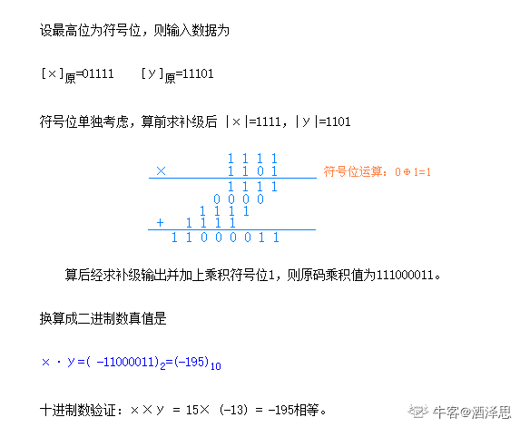
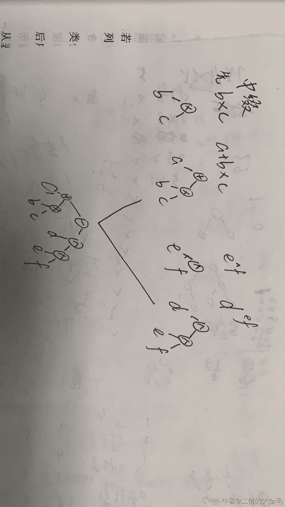
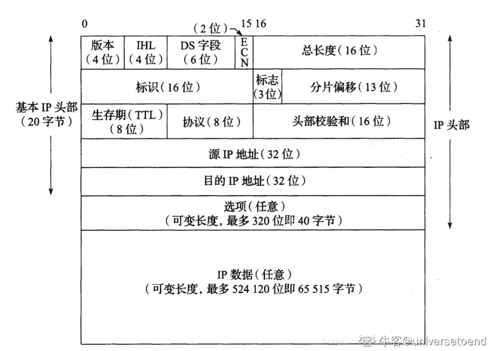
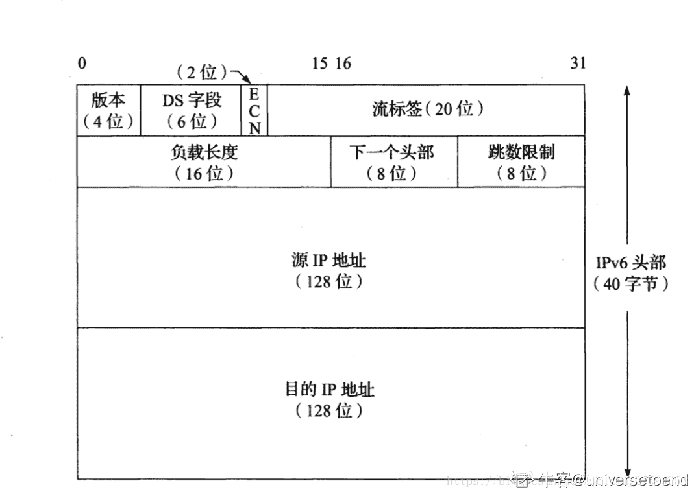
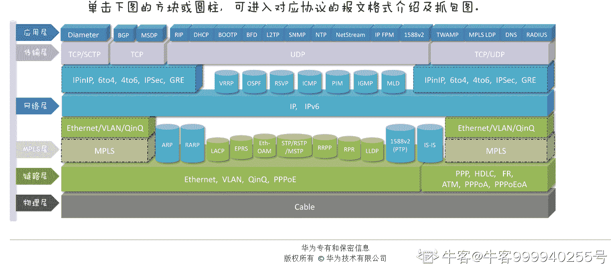

# 小米 2019 秋招运维工程师笔试题（A）

## 1

以下哪个算法可以判断出一个有向图中是否有回路：（）

正确答案: B   你的答案: 空 (错误)

```cpp
广度优先遍历
```

```cpp
拓扑排序
```

```cpp
求最短的路径
```

```cpp
求关键路径
```

本题知识点

前端工程师 小米 运维工程师 图 前端工程师 小米 2019 运维工程师 小米 2019 前端工程师 小米 2019 运维工程师 小米 2019

讨论

[liuyong1995](https://www.nowcoder.com/profile/848814784)

判断有向图是否有回路：拓扑排序、深度优先搜索

发表于 2019-09-12 11:16:03

* * *

[onlyxxx](https://www.nowcoder.com/profile/493457698)

B 拓朴排序在无环图才有解

发表于 2019-09-12 16:33:18

* * *

## 2

下列说法中正确的是（）

正确答案: A B D   你的答案: 空 (错误)

```cpp
算符优先关系表不一定存在对应的优先函数
```

```cpp
中断方式一般用于处理随机出现的服务请求
```

```cpp
对于数据空间的存贮分配，FORTRAN 采用动态贮存分配策略
```

```cpp
DMA 的数据传送不需 CPU 控制
```

本题知识点

运维工程师 小米 操作系统 2019

讨论

[诸葛大大力力](https://www.nowcoder.com/profile/618322077)

a 是啥意思，有无大佬点拨一下

发表于 2021-04-13 14:34:30

* * *

[我要拿 offer!](https://www.nowcoder.com/profile/2470771)

在 DMA 方式中，CPU 不仅能够与外围设备并行工作，而且整个数据的传送过程不需要 CPU 的干预

发表于 2019-09-15 11:27:12

* * *

[亲爱的暴躁的热心网友皮皮文](https://www.nowcoder.com/profile/3496468)

汇编里面的知识， *   ```cpp
    算符优先关系表中需要维护优先函数，所以一定包含，A 错
    ``` 

发表于 2021-10-12 20:18:31

* * *

## 3

对某二叉树进行先序遍历的结果是 ABDEGCF,中序遍历的结果是 DBEGAFC，则后序遍历的结果是：（）

正确答案: B   你的答案: 空 (错误)

```cpp
DEBFGCA
```

```cpp
DGEBFCA
```

```cpp
GDEBFCA
```

```cpp
DEBGFCA
```

本题知识点

运维工程师 小米 树 运维工程师 小米 2019 运维工程师 小米 2019

讨论

[Vintage_177](https://www.nowcoder.com/profile/536411031)

选 B 先由前序得知根结点为 A，中序得知 DBEG 在根结点的左边 FC 在根结点右边

发表于 2021-03-02 01:06:52

* * *

## 4

设 A，B 的八位二进制补码为 1111 1010 和 0000 1010 ，那么 AB 乘积的补码为：（）

正确答案: A   你的答案: 空 (错误)

```cpp
11000100
```

```cpp
10011100
```

```cpp
10100101
```

```cpp
11010101
```

本题知识点

编译和体系结构

讨论

[酒泽思](https://www.nowcoder.com/profile/588155683)

一、由原码得补码口诀：取反加一；二、已知一个数的补码，求原码的操作分两种情况：（注：原码和补码互逆过程；）

⑴如果补码的符号位为“0”，表示是一个正数，其原码就是补码。

⑵如果补码的符号位为“1”，表示是一个负数，那么求给定的这个补码的补码就是要求的原码。三、原码乘积：简单实例
四、此题解析：A 补：1111 1010 ；A 原：1000 0110；B 补：0000 1010；B 原=B 补：0000 1010；A 原乘以 B 原：10111100；补码（原码符号位不变，取反加一）：11000100

编辑于 2021-03-15 15:30:04

* * *

[rachpt](https://www.nowcoder.com/profile/571959416)

看补码知道 A 为负数，B 为正数，因此 B 原码和补码一致，A 原码=(A 补码-1) 取反 保持符号位不变。原码： A  1000 0110；B  0000 1010，不考虑符号位，直接竖式相乘，参考 [`zhidao.baidu.com/question/112193384.html`](https://zhidao.baidu.com/question/112193384.html)1010  x  0110 = 11 1100，为结果的绝对值。取反加一，符号位置 1 就得到 1100 0100。答案 A

编辑于 2019-09-07 15:30:24

* * *

[森林与鱼](https://www.nowcoder.com/profile/946185521)

八位二进制相乘如何计算，求大佬指点

发表于 2019-08-30 15:09:08

* * *

## 5

假设运算符+，-，x 是左结合的，^是右结合的，优先级从高到低依次为^，x，+，-。其对应的中缀表达式为 a+bxc-d^e^f，其对应的后缀表达式为：（）

正确答案: A   你的答案: 空 (错误)

```cpp
abc×+def^^-
```

```cpp
abc×+de^f^-
```

```cpp
ab+c×d-e^f^
```

```cpp
-+a×bc^^def
```

本题知识点

运维工程师 小米 编程基础 *2019* *讨论

[二倩的大金毛](https://www.nowcoder.com/profile/161013672)



发表于 2019-10-26 21:22:11

* * *

[行者 201904141409475](https://www.nowcoder.com/profile/972737778)

按优先级把字母放前面，符号放后面。

发表于 2019-11-18 09:49:30

* * *

## 6

对于双向循环链表,在 p 指针所指的结点之后插入 q 指针所指结点的操作应为：（）

正确答案: D   你的答案: 空 (错误)

```cpp
p->next=q; q->prev=p; p->next->prev=q; q->next=p->next;
```

```cpp
q->prev=p; q->next=p->next; p->next=q; p->next->prev=q;
```

```cpp
p->next=q; p->next->prev=q; q->prev=p; q->next=p->next;
```

```cpp
q->prev=p; q->next=p->next; p->next->prev=q; p->next=q;
```

本题知识点

运维工程师 小米 链表 *运维工程师 小米 2019 运维工程师 小米 2019* *讨论

[CWCLI](https://www.nowcoder.com/profile/969269891)

啦啦啦

发表于 2019-09-18 20:58:42

* * *

## 7

软件的需求规格说明书(SRS)需要讨论的问题有：（）

正确答案: A B D   你的答案: 空 (错误)

```cpp
用户界面问题
```

```cpp
功能需求和非功能需求
```

```cpp
软件设计规范
```

```cpp
软件暴露的接口
```

本题知识点

运维工程师 小米 软件工程 2019

讨论

[董个屁儿](https://www.nowcoder.com/profile/2016568)

软件设计规范遵守已有软件设计规范，支持已有的技术和操作系统，即使要修改也是设计阶段干的事

发表于 2019-08-30 11:26:53

* * *

## 8

以下出现在 IPv4 头部却未出现在 IPv6 头部的是（）

正确答案: B C   你的答案: 空 (错误)

```cpp
流标签
```

```cpp
校验和
```

```cpp
段偏移量
```

```cpp
版本号
```

本题知识点

运维工程师 小米 网络基础 2019

讨论

[universetoend](https://www.nowcoder.com/profile/960308249)

IPv4：
IPv6：

发表于 2020-06-08 14:44:07

* * *

[考研必胜-上岸上岸](https://www.nowcoder.com/profile/262381939)

IP6 无校验和，以减少每跳的处理时间 IPv6 不允许分片，无片偏移

发表于 2020-10-21 08:03:10

* * *

[rachpt](https://www.nowcoder.com/profile/571959416)

计算机网络系统方法 第 5 版  110 页 ipv4 首部；175 页 ipv6 首部。

发表于 2019-09-02 21:45:16

* * *

## 9

以下关于 Linux 操作系统内存的描述中，正确的有（）

正确答案: A B D   你的答案: 空 (错误)

```cpp
32 位机器，单个进程能使用的最大用户态地址空间理论上不大于 3GB
```

```cpp
若一台机器的物理内存为 2GB，则在该机器上同时运行的进程 A 和进程 B 所占物理内存之和有可能大于 2GB
```

```cpp
进程 A 是在 Linux 系统运行的一个用 C 语言编写的程序，如果在 A 中用 malloc 函数成功申请了 1GB 内存，则此时该进程必定至少占用了 1GB 的物理内存
```

```cpp
32 位机器，Linux 操作系统内存管理以“页”为基本单位，每页的大小固定为 4KB
```

本题知识点

运维工程师 小米 操作系统 2019

讨论

[弱鸡=鶸](https://www.nowcoder.com/profile/551802625)

进程 A 和 B 都有自己的虚拟地址，程序在运行的时候在一个特定的时候并不会把所有需要的数据都加载到内存中，当前不使用的数据会被置换到硬盘上，只有在使用的时候才会被置换到内存中。因此，两个进程所占的物理存储之和完全有可能大于 2GB。例如当进程 A 和 B 同时运行的时候，都只有部分数据被加载到内存中，假设在某一时刻 A 和 B 进程占用内存之和为 2GB，如果此时 A 所需的数据不在内存中，此时系统采用特定的算法把进程 A 与 B 当前可能不使用的数据置换到硬盘上。因此，选项 B 正确。---摘自网络 

发表于 2020-03-10 13:01:24

* * *

[求求 offer 啊啊啊](https://www.nowcoder.com/profile/676938017)

32 位下 windows 大概 2g，而 Linux3G，其余的都是给了内核

发表于 2020-07-22 15:35:27

* * *

[我只是想求一个 offer，给个机会面试](https://www.nowcoder.com/profile/200333)

B 我感觉有问题，所然有虚存，但是正在占的也不可能超过 2GB。物理内存是多少就是多少，感觉上应该换个说法，放在 swap 已经不算在物理内存上了吧？

发表于 2019-11-20 18:38:52

* * *

## 10

如下代码一共创建多少个进程（包含主进程）：

```cpp
int main(int argc, char* argv[]) {
    fork();
    fork() && fork() && fork();
    fork() || fork();
}
```

正确答案: D   你的答案: 空 (错误)

```cpp
15
```

```cpp
18
```

```cpp
21
```

```cpp
24
```

本题知识点

操作系统

讨论

[我的天鸭](https://www.nowcoder.com/profile/243498)

首先需要明白的是 fork()生成 1 个子进程，fork()之后有两个进程处于执行状态。因此执行完第一个 fork()，生成的进程数是 1（main）+1（子进程）看第二行的 fork() && fork() && fork()，执行完第一个 fork()，父进程返回非 0，子进程返回 0，子进程后面的 fork()均不会执行，此时产生了 1 个子进程，那么三个 fork()就产生了 3 个子进程（注意，这是 1 个进程产生的），因此执行完第二行，产生了 6 个子进程，系统中一共有 8 个进程在执行，要是不明白的自己画个二叉树就清楚了。在看第三行，fork() || fork()，原理和第二行相同，只是只有子进程才能继续，父进程只能执行第一个 fork()，执行这一行每个进程可以产生两个子进程，也就是一***生 2 * 8 = 16 个子进程所以答案就是 2 + 6 + 16 = 24

编辑于 2019-09-02 20:44:31

* * *

[鲲鹏 441](https://www.nowcoder.com/profile/790002405)

          1                      1     一个 main  一个子进程    1    1    1        1      1      1   第二行使每个父进程生出 3 个子进程第三行，以上所有进程为父进程，每个父进程生出两个子进程          11                     1111     11  11       11   11   11 数 1 的个数

发表于 2019-11-23 09:46:17

* * *

[蒙海康](https://www.nowcoder.com/profile/749955756)

fork()调用后将，从启动 fork()的这个进程（父进程）中，把代码和已有的变量拷贝一份，用于启动一个一模一样的子进程，两个进程将执行 fork（）系统调用之后的下一条指令。

同时，调用 fork()处的返回值在父进程和子进程中是不同的，在父进程中的调用处将返回生成的子进程的进程 ID，在子进程中则返回 0。

若是 frok()因为内存不足等原因创建子进程失败，它将在调用处返回一个负值。

发表于 2020-10-18 21:43:50

* * *

## 11

BGP 协议运行在 OSI 模型的哪一层（）

正确答案: G   你的答案: 空 (错误)

```cpp
物理层
```

```cpp
数据链路层
```

```cpp
网络层
```

```cpp
传输层
```

```cpp
会话层
```

```cpp
表示层
```

```cpp
应用层
```

本题知识点

运维工程师 小米 网络基础 2019

讨论

[牛客 999940255 号](https://www.nowcoder.com/profile/999940255)



发表于 2021-05-29 14:37:29

* * *

[changsan](https://www.nowcoder.com/profile/663161967)

BGP 是应用层协议，它是基于 TCP 的 ------王道

发表于 2020-03-21 15:23:14

* * *

[571 有你不孤单](https://www.nowcoder.com/profile/709635731)

计算机网络 第 7 版 谢希仁 BGP 163 页 网络层的内容 不多 bb 了

发表于 2020-04-13 23:38:25

* * *

## 12

以下对 2001:0DB8:0000:0000:036E:0000:1250:2B00 简写正确的是（ ）

正确答案: B C E   你的答案: 空 (错误)

```cpp
2001:0DB8:0000:0000:036E:0000:1250:2B
```

```cpp
2001:0DB8:0:0:036E:0:1250:2B00
```

```cpp
2001:0DB8::036E:0:1250:2B00
```

```cpp
2001:0DB8::036E::1250:2B00
```

```cpp
2001:DB8::36E:0:1250:2B00
```

本题知识点

运维工程师 小米 网络基础 2019

讨论

[暮秋柒](https://www.nowcoder.com/profile/923002302)

为了保证零压缩有一个不含混的解释，规定在任一地址中只能使用一次零压缩。 —《计算机网络（第 7 版）》

发表于 2019-10-23 14:09:42

* * *

[无聊的吃货](https://www.nowcoder.com/profile/886467531)

1.只有前导 0 可以省略 2.：：，表示这里省略了一大串 0，

发表于 2019-09-07 17:28:21

* * *

[吴老](https://www.nowcoder.com/profile/566910501)

只能压缩一次 0 为:: 之后的只能简写为一个，不能压缩省略

发表于 2021-10-18 09:50:46

* * *

## 13

如下哪些命令可以查看 Linux 主机中是否存在策略路由表（）

正确答案: A B   你的答案: 空 (错误)

```cpp
ip rule
```

```cpp
ip rule list
```

```cpp
ip route
```

```cpp
ip route policy show
```

```cpp
ip route show policy
```

本题知识点

运维工程师 小米 操作系统 2019

讨论

[求求 offer 啊啊啊](https://www.nowcoder.com/profile/676938017)

规则指向路由表，多个规则可以引用一个路由表，而且某些路由表可以没有策略指向它。如果系统管理员删除了指向某个路由表的所有规则，这个表就没有用了，但是仍然存在，直到里面的所有路由都被删除，它才会消失。
使用 ip rule 命令操作路由策略数据库    ip rule [ list | add | del ] SELECTOR ACTION （add 添加；del 删除； llist 列表）使用 ip route 命令操作静态路由表    ip route [add|del] [-net|-host] target [netmask Nm] [gw Gw] [[dev] If]

发表于 2020-05-28 09:24:17

* * *

[征途是一百级大牛](https://www.nowcoder.com/profile/803324974)

ip rule ip rule list 查看 linux 主机中是否存在策略路由表。

发表于 2021-12-24 14:50:13

* * *

## 14

以下几种存储引擎，哪个具有这些特性：支持索引、支持数据持久化、支持事务、支持数据压缩、支持 Online DDL、支持有一个或一个以上的索引包含非索引列的数据（）

正确答案: D   你的答案: 空 (错误)

```cpp
myisam
```

```cpp
memory
```

```cpp
innodb
```

```cpp
tokudb
```

本题知识点

运维工程师 小米 数据库 2019

讨论

[ZakiWeng](https://www.nowcoder.com/profile/754606456)

TokuDB 优点:
高压缩比，默认使用 zlib 进行压缩，尤其是对字符串(varchar,text 等)类型有非常高的压缩比，比较适合存储日志、原始数据等。官方宣称可以达到 1：12。
在线添加索引，不影响读写操作
HCADER 特性，支持在线字段增加、删除、扩展、重命名操作，（瞬间或秒级完成）
支持完整的 ACID 特性和事务机制
非常快的写入性能， Fractal-tree 在事务实现上有优势,无 undo log，官方称至少比 innodb 高 9 倍。
支持 show processlist 进度查看
数据量可以扩展到几个 TB；
不会产生索引碎片；
支持 hot column addition,hot indexing,mvcc
TokuDB 缺点：
不支持外键(foreign key)功能，如果您的表有外键，切换到 TokuDB 引擎后，此约束将被忽略。
TokuDB 不适大量读取的场景，因为压缩解压缩的原因。CPU 占用会高 2-3 倍，但由于压缩后空间小，IO 开销低，平均响应时间大概是 2 倍左右。
online ddl 对 text,blob 等类型的字段不适用
没有完善的热备工具，只能通过 mysqldump 进行逻辑备份
适用场景：
访问频率不高的数据或历史数据归档
数据表非常大并且时不时还需要进行 DDL 操作

发表于 2019-11-09 15:39:18

* * *

[闲鱼总算翻了身](https://www.nowcoder.com/profile/909589300)

InnoDB 呢？不需要看版本的吗

发表于 2021-07-25 20:53:56

* * *

## 15

8 块 600G 磁盘分别作 RAID 10 和 RAID 50，整个虚拟盘可用容量分别是？（）

正确答案: B   你的答案: 空 (错误)

```cpp
4800G 和 3000G
```

```cpp
2400G 和 3600G
```

```cpp
4800G 和 3600G
```

```cpp
6000G 和 4800G
```

本题知识点

运维工程师 小米 操作系统 2019

讨论

[rachpt](https://www.nowcoder.com/profile/571959416)

RAID 10 、RAID 30 、RAID 50 为 RAID0 与 RAID 1 、3、 5 组合。RAID 0 并行磁盘，不减容量，提高读写速度。RAID 1 镜像盘，如其名，可用容量一半，没有冗余校验功能，写速度较 RAID 0 慢。RAID 5 （有效容量 3//4 ?）是 RAID 3 、4 的改良版，使用奇偶冗余校验、以及大条带交叉存储的办法突破 校验盘 i/o 瓶颈。RAID 2 为海明校验 ，控制复杂，成本高等，很少使用。

发表于 2019-09-02 22:48:22

* * *

[yukiop](https://www.nowcoder.com/profile/820328513)

raid1，实际使用为 1/2，raid5 实际使用为 3/4

发表于 2020-06-30 21:28:35

* * *

## 16

如何提升处理器的计算能力？（）

正确答案: A B D E   你的答案: 空 (错误)

```cpp
增加处理器物理核心频率
```

```cpp
增加 L1 缓存频率
```

```cpp
增加 L2 缓存访问延迟
```

```cpp
增加内存通道带宽
```

```cpp
增加 L3 缓存容量
```

```cpp
减少 L2 缓存容量
```

本题知识点

运维工程师 小米 操作系统 2019

讨论

[gyz](https://www.nowcoder.com/profile/1314886)

A.主频提高处理器运算速率当然提高 B.增加 L1 缓存频率，CPu 从存储器搬移速率更快，换言之 cache 中的数据更新更快，匹配 cpu 主频理想的情况。这样硬件成本会更高。D.增加内存通道带宽，CPU 读取运算数据，一次可以读取更多，比如原来是 32 位，现在成 64 位了，鉴于现在提高速率的方法，增加核数或者增加带宽是比较常用的。

发表于 2020-01-03 16:35:19

* * *

[李仕成](https://www.nowcoder.com/profile/311711897)

L1 L2 L3 是什么意思呀，大拿们

发表于 2020-10-19 20:45:07

* * *

[李斻沭😃](https://www.nowcoder.com/profile/1384133)

D,E 确定是提高处理器？

发表于 2019-12-31 19:29:52

* * *

## 17

下列不属于 linux 内核锁的一项是（）

正确答案: D   你的答案: 空 (错误)

```cpp
Semaphore
```

```cpp
Spinlock
```

```cpp
seqlock
```

```cpp
Message
```

本题知识点

运维工程师 小米 Linux 2019

讨论

[younghang](https://www.nowcoder.com/profile/9114345)

**spin_lock(自旋锁)**：是 Linux 内核中最基础的锁机制。自旋锁不会引起调用者休眠，如果自旋锁已经呗其他的执行单元持有，调用者就会一直循环等在该自旋锁的持有者是否已经释放了锁。自旋锁适用于锁的持有者保持锁的时间比较段的情形。**读写自旋锁（****__RW_LOCK_UNLOCKED****）**：也就是没有读，没有写的请求时，读者可以获得读写锁。在读写锁没有写者的时候，读者获得器自旋锁。**seq_lock(顺序锁)**：是对读写锁的优化。也就是写锁不被读锁所阻塞。写者写的同时，读者可以读。**semaphore(信号量)**：信号量和自旋锁的区别时信号量会引起调用者的休眠。**RCU(读-拷贝)**：在访问 RCU 保护的资源时，读者不需要任何等待，而写者访问它时首先得拷贝一个副本，然后对父辈修改，最后在没有任何对读者操作 gai'zi'yuan 把指向原来的数据的指针指向新的数据，

编辑于 2020-03-30 18:02:37

* * *

[北海道](https://www.nowcoder.com/profile/6639889)

A 未知 B 和 C 有 lock 都是锁 先排除 D 消息 跟内核没关系，就它，哈哈

发表于 2019-10-02 09:32:25

* * *

[大星星和小猩猩](https://www.nowcoder.com/profile/9374535)

**Linux 的内核锁主要是自旋锁、顺序锁和信号量。**

*   **自旋锁最多只能被一个可执行线程持有**，如果一个执行线程试图请求一个已被争用（已经被持有）的自旋锁，那么这个线程就会一直进行忙循环——旋转——等待锁重新可用。要是锁未被争用，请求它的执行线程便能立刻得到它并且继续进行。自旋锁可以在任何时刻防止多于一个的执行线程同时进入临界区。
*   spin_lock 自旋锁对于临界区是不做区分的，而读写锁是对临界区做读写区分，并且度进程进入临界区的几率比较大，因为写进程进入时需要等待读进程退出临界区。**而有没有一种方法，可以保护写进程的优先权，使得写进程可以更快的获得锁？** 答案是有的，就是顺序锁。顺序锁的设计思想是：对某一个共享数据读取的时候不加锁，写的时候加锁。同时为了保证读取的过程中因为写进程修改了共享区的数据，导致读进程读取数据错误。在读取者和写入者之间引入了一个整形变量 sequence，读取者在读取之前读取 sequence, 读取之后再次读取此值，如果不相同，则说明本次读取操作过程中数据发生了更新，需要重新读取。而对于写进程在写入数据的时候就需要更新 sequence 的值。
*   **Linux 中的信号量是一种睡眠锁。如果有一个任务试图获得一个已被持有的信号量时，信号量会将其推入等待队列，然后让其睡眠。**这时处理器获得自由去执行其它代码。当持有信号量的进程将信号量释放后，在等待队列中的一个任务（优先级最高的任务）将被唤醒，从而便可以获得这个信号量。信号量的睡眠特性，使得信号量适用于锁会被长时间持有的情况；只能在进程上下文中使用，因为中断上下文中是不能被调度的；另外当代码持有信号量时，不可以再持有自旋锁。

发表于 2020-04-06 11:16:06

* * *

## 18

下列关于 mysql 的表述错误的一项是（）

正确答案: C   你的答案: 空 (错误)

```cpp
当确定数据更改加工完毕，需要进行存储时，此时，将数据传递出去，称为事务的提交
```

```cpp
触发器主要用于监视某个表的 insert、update 以及 delete 等更新操作，这些操作可以分别激活该表的 insert、update 或者 delete 类型的触发程序运行，从而实现数据的自动维护
```

```cpp
在视图上可以定义新的视图，也可以建立基本表
```

```cpp
当数据加工过程中出现错误，把数据和状态恢复到加工之前，称之为事务的回滚
```

本题知识点

运维工程师 小米 数据库 2019

讨论

[心仪 offer 快来碗里](https://www.nowcoder.com/profile/659729951)

在视图上可以建立新的视图，但是不能建立基本表。

编辑于 2020-08-31 21:21:33

* * *

[小六喜欢赵小刀](https://www.nowcoder.com/profile/860595925)

视图上可以定义新的试图，但是**不可以建立基本表！！！！！！！**

编辑于 2020-08-31 21:21:21

* * *

[h_m_w](https://www.nowcoder.com/profile/690800085)

应该是 D？回滚是 rollback，指的是回到之前的状态。至于恢复应该是 Redo 吧

发表于 2019-09-19 20:56:06

* * *

## 19

下列关于 git 命令的表述正确的选项有（）

正确答案: A B C D   你的答案: 空 (错误)

```cpp
git rebase 会试图修改你已经 commit 的东西，比如覆盖 commit 的历史等，但是不能使用 rebase 来修改已经 push 过的内容，容易出现兼容性问题。rebase 还可以来解决内容的冲突，解决两个人修改了同一份内容，然后失败的问题
```

```cpp
git reset 不修改 commit 相关的东西，只会去修改.git 目录下的东西
```

```cpp
git pull = git fetch + git merge
```

```cpp
使用 git fetch 是取回远端更新，不会对本地执行 merge 操作，不会去动你的本地的内容
```

本题知识点

运维工程师 小米 2019

## 20

下面关于数据库锁的描述正确的是（）

正确答案: C   你的答案: 空 (错误)

```cpp
只有支持事务的引擎才有锁
```

```cpp
在可以用行锁的情况下，都应该使用行锁而不要使用表锁
```

```cpp
在高并发的线上事务中，几乎无法避免锁等待或死锁的产生
```

```cpp
在做更新操作时，应该先尝试申请共享锁，成功后再申请排他锁
```

本题知识点

运维工程师 小米 数据库 2019

讨论

[牛客 733384219 号](https://www.nowcoder.com/profile/733384219)

建议改成单选。。

发表于 2020-05-29 15:04:30

* * *

[菜鸟九八号](https://www.nowcoder.com/profile/612444337)

InnoDB 支持事务，支持行锁和表锁用的比较多，Myisam 不支持事务，只支持表锁。InnoDB 之所以可以锁行，是因为 Innodb 的主索引结构上，既存储了主键值，又直接存储了行数据，可以方便的锁住行数据，而 MyIsam 索引指向另一片数据文件，没有办法精确锁住数据段共享锁又称读锁，是读取操作创建的锁。其他用户可以并发读取数据，但任何事务都不能对数据进行修改（获取数据上的排他锁），直到已释放所有共享锁。如果事务 T 对数据 A 加上共享锁后，则其他事务只能对 A 再加共享锁，不能加排他锁。获准共享锁的事务只能读数据，不能修改数据。 发表于 2020-02-22 10:35:06

* * *

[海海不掉头发](https://www.nowcoder.com/profile/493926724)

完美的避开所有正确答案....

```cpp
在高并发的线上事务中，几乎无法避免锁等待或死锁的产生
```

编辑于 2021-05-02 16:09:53

* * *

## 21

小明同学需要对一个长度为 N 的字符串进行处理，他需要按照要求执行若干步骤，每个步骤都均为下面 2 种操作中的一种，2 种操作如下：
TYPE 1\. 从字符串结尾开始算起，将第 X 个字符之前的字符移动到字符串末尾
TYPE 2\. 输出字符串索引为 X 的字符
小明尝试了很久没能完成，你可以帮他解决这个问题吗？

本题知识点

运维工程师 小米 字符串 *模拟 2019* *讨论

[牛客 2724279 号](https://www.nowcoder.com/profile/2724279)

测试用例是不是有问题啊

发表于 2019-07-06 20:00:56

* * *

[无心 2019](https://www.nowcoder.com/profile/991674511)

```cpp
#include <bits/stdc++.h>
using namespace std;
int main()
{
    int N,T,t,x;
    cin>>N>>T;
    string s,str="";
    cin>>s;
    for(int i=0;i<T;i++)
    {
        cin>>t>>x;
        if(t==1)
            s=s.substr(s.size()-x)+s.substr(0,s.size()-x);
        if(t==2)
            cout<<s[x]<<endl;
    }
    return 0;
}

```

发表于 2019-07-05 20:19:41

* * *

[LitterF](https://www.nowcoder.com/profile/826985312)

看了一眼评论，怎么都在做啊。。。算个偏移量就可以了，不要拼接字符串呀

```cpp
N,T = [int(x) for x in input().split()]
s = input()
cur = 0
for i in range(T):
    TYPE,X = [int(x) for x in input().split()]
    if TYPE==1:
        cur+=N-X
        cur%=N
    if TYPE==2:
        print(s[(cur+X)%N])
```

发表于 2019-11-29 22:32:33

* * *

## 22

有一个分布式服务集群，集群内含有 N 个服务节点，分别标记为 1 到 N。
给予一个列表 times，表示消息从两个节点间有向传递需要的时间。 times[i] = (s, d, t)，其中 s 表示发出消息的源节点，d 表示接收到消息的目标节点， t  表示信息有向传递的时间。
现在 K 节点发送了一个信号，请问至少需要多少秒才能使所有的服务节点都收到该消息？如果消息不能传递给集群内全部节点，则返回-1。

本题知识点

运维工程师 小米 图 2019

讨论

[ElonB](https://www.nowcoder.com/profile/623894)

```cpp
/*
单源最短路径
无向(有环)图无负权，考虑 Dijkstra 算法，适用于本题 
有负权，考虑 Bellman-Ford 算法（SPFA 算法）
有向图无环图，直接拓扑排序 
*/
#include <bits/stdc++.h>
using namespace std;
const int Ni = 101;
struct node {
    int point, value;
    node(int a, int b) // 构造
    {
        point = a;
        value = b;
    }
    // 重载<操作符
    bool operator<(const node &a) const
    {
        // 对小于运算符进行重载，如果两个值相等，那么继续判断 point，如果不等，则返回 false
        if (value == a.value) {
            return a.point < point;
        } else {
            return a.value < value;
        }
    }
};
vector<node> e[Ni];
int dis[Ni], n;
priority_queue<node> q;
void dijkstra();
int main()
{
    int a, b, c, k;
    char s;
    getchar();
    while(getchar() == '[') {
        scanf("%d%c%d%c%d%c%c", &a, &s, &b, &s, &c, &s, &s);
        e[a].push_back(node(b, c));
//  e[b].push_back(node(a, c));  // 无向图
    }
    scanf("%d%d", &n, &k);

    memset(dis, 0x7f, sizeof(dis));
    dis[k] = 0;
    // 优先队列，队头元素最大，要求最小且类型为 struct 需要重载<运算符
    q.push(node(k, dis[k]));
    dijkstra();

    int ans = 0;
    for (int i = 1; i <= n; i++) {
        ans = max(ans, dis[i]);
    }
    if(ans == 0x7f7f7f7f) ans = -1;
    printf("%d\n", ans);
    system("pause");
    return 0;
}
void dijkstra()
{
    while (!q.empty()) {
        node x = q.top();
        q.pop();
        for (int i = 0; i < e[x.point].size(); i++) {
            node y = e[x.point][i];
            // 核心思想：更新估算距离，松弛
            if (dis[y.point] > dis[x.point] + y.value) {
                dis[y.point] = dis[x.point] + y.value;
                q.push(node(y.point, dis[y.point]));
            }
        }
    }
}

```

编辑于 2019-07-16 11:13:05

* * *

[零葬](https://www.nowcoder.com/profile/75718849)

使用 Dijkstra 算法计算图中的最长路径，发送到所有节点的时间取决于发送到最远节点的用时

```cpp
times = eval(input())
n = int(input())
k = int(input())
A = [[] for _ in range(n + 1)]
for s, d, t in times:
    A[s].append((d, t))
# 初始化起点到所有节点的距离
dis = [float("inf")]*(n + 1)
dis[k] = 0
# 先将起点加入队列
queue = [k]
while queue:
    s = queue.pop(0)
    for d, t in A[s]:
        if dis[d] > dis[s] + t:
            dis[d] = dis[s] + t
            queue.append(d)
# 发送到所有节点的时间取决于发送到最远节点的用时
max_dis = max(dis[1:])      # 第一个节点 dis[0]没有使用，不用于计算最大值
print(-1 if max_dis == float("inf") else max_dis)
```

发表于 2021-02-27 21:30:50

* * *

[nbgao](https://www.nowcoder.com/profile/211289)

```cpp
#include <bits/stdc++.h>
using namespace std;

int N, K, G[101][101], dis[101];
bool vis[101];

void dijkstra(int s){
    dis[s] = 0;
    for(int i=0;i<N;i++){
        int k=0, Min=INT_MAX;
        for(int j=1;j<=N;j++){
            if(!vis[j] && dis[j]<Min){
                Min = dis[j];
                k = j;
            }
        }
        if(k==0)
            break;
        vis[k] = true;
        for(int v=1;v<=N;v++){
            if(!vis[v] && G[k][v]!=INT_MAX && dis[v]>dis[k]+G[k][v])
                dis[v] = dis[k] + G[k][v];
        }
    }
}

int main(){
    int s, d, t, Max=0;
    memset(vis, false, sizeof(vis));
    for(int i=0;i<101;i++){
        dis[i] = INT_MAX;
        for(int j=0;j<101;j++){
            if(i==j)
                G[i][j] = 0;
            else
                G[i][j] = INT_MAX;
        }
    }
    char c = getchar();
    while(c!=']'){
        scanf("[%d,%d,%d]", &s, &d, &t);
        if(s!=d && t<G[s][d])
            G[s][d] = t;
        c = getchar();
    }
    scanf("%d%d", &N, &K);
    dijkstra(K);
    for(int i=1;i<=N;i++)
        Max = max(Max, dis[i]);
    if(Max==INT_MAX)
        printf("-1\n");
    else
        printf("%d\n", Max);
    return 0;
}
```

发表于 2020-09-06 01:11:06

* * ****