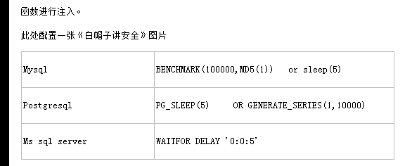

# 小米 2018 秋招安全工程师笔试题

## 1

Mysql sql 注入中使用延时注入时常用的语句是

正确答案: B C   你的答案: 空 (错误)

```cpp
wait for delay ‘0:0:10’
```

```cpp
sleep(5)
```

```cpp
benchmark(100000000,md5(1))
```

```cpp
union select
```

本题知识点

Java 工程师 C++工程师 安卓工程师 iOS 工程师 运维工程师 前端工程师 PHP 工程师 测试工程师 小米 数据库 安全工程师 2018

讨论

[daisy---张](https://www.nowcoder.com/profile/860644437)



发表于 2020-03-22 11:20:29

* * *

[咸鱼同学](https://www.nowcoder.com/profile/684987786)

MySQL 有一个内置的 BENCHMARK(count,expr)函数，可以测试某些特定操作的执行速度 参数可以是需要执行的次数和表达式。

发表于 2019-09-17 15:23:13

* * *

## 2

下列文件中哪种文件在 IIS 6.0 中会被当做 ASP 脚本解析？

正确答案: A D   你的答案: 空 (错误)

```cpp
news.asp
```

```cpp
news.asp.jpg
```

```cpp
news.asp%00.jpg
```

```cpp
news.asp;.jpg
```

本题知识点

Java 工程师 C++工程师 安卓工程师 iOS 工程师 运维工程师 前端工程师 PHP 工程师 测试工程师 小米 安全工程师 2018

讨论

[咸鱼同学](https://www.nowcoder.com/profile/684987786)

IIS6.0 有以下文件解析漏洞：在文件夹为 asp, asa 内的所有文件都会被当成 asp 脚本进行解析;文件名如：xxx.asp;yyy.jpg 的文件，会忽略分号后面的后缀，将该文件当成 asp 脚本进行解析 asa、cer、cdx 也会被当成 asp 脚本进行解析 PHP<5.3.29，且 GPC 关闭时，00 截断是将上传文件名或路径名中使用 ascll 码值为 0 的字符（也就是 null）来进行截断，%00 一般用在 URL 中用于截断 url 来进行文件包含

编辑于 2019-09-17 15:45:24

* * *

[请叫我小吴](https://www.nowcoder.com/profile/693269216)

IIS 6.0       存在目录解析、文件解析、文件类型解析等，会被当做 asp 文件进行解析。
（1）目录解析：目录名包含.asp .asa .cer 这种字样，该目录下所有文件都被当做 asp 来进行解析;
（2）文件解析：文件名如：xxx.asp;yyy.jpg 的文件，会忽略分号后面的后缀，将该文件当成 asp 脚本进行解析
（3）文件类型解析：asa、cdx、cer 也会被当成 asp 脚本进行解析，例如：test.asa 、 test.cdx 、 test.cer

发表于 2020-05-06 10:14:21

* * *

## 3

以下说法正确的是

正确答案: A D   你的答案: 空 (错误)

```cpp
linux 系统中的/var/log/lastlog 日志记录了所有用户最后登录的记录，可以用 lastlog 命令查看
```

```cpp
linux 系统中的/var/log/last 日志可以用 last 命令查看
```

```cpp
/var/log/wtmp 日志记录了登录过本系统的用户信息，可以用`tail -f`命令查看
```

```cpp
/var/run/utmp 日志记录了正在登录本系统中的用户信息，可以用`last -f`命令查看
```

本题知识点

Java 工程师 C++工程师 安卓工程师 iOS 工程师 运维工程师 前端工程师 PHP 工程师 测试工程师 小米 Linux 安全工程师 2018

讨论

[咸鱼同学](https://www.nowcoder.com/profile/684987786)

在 Linux 里，utmp 文件的绝对路径是 /var/run/utmp ，该文件通常用 who 命令来读取；wtmp 文件的绝对路径是 /var/log/wtmp ，该文件通常通过 last 命令来读取。这两个文件都不是普通的文本文件，所以不能用 cat ，less，more 等命令来查看。

utmp 日志文件记录有关当前登录的每个用户的信息。因此这个文件会随着用户登录和注销系统而不断变化，它只保留当时联机的用户记录，不会为用户保留永久的记录。系统中需要查询当前用户状态的程序，如 who、w、users、finger 等就需要访问这个文件。该日志文件并不能包括所有精确的信息，因为某些突发错误会终止用户登录会话，而系统没有及时更新 utmp 记录，因此该日志文件的记录不是百分之百值得信赖的。

wtmp 日志文件永久记录每个用户登录、注销及系统的启动、停机的事件。因此随着系统正常运行时间的增加，该文件的大小也会越来越大，增加的速度取决于系统用户登录的次数。该日志文件可以用来查看用户的登录记录，last 命令就通过访问这个文件获得这些信息，并以反序从后向前显示用户的登录记录，last 也能根据用户、终端 tty 或时间显示相应的记录。

-f 文件名

指定登录的日志文件（默认是/var/log/wtmp）

发表于 2019-09-17 15:54:21

* * *

[牛客 437896676 号](https://www.nowcoder.com/profile/437896676)

last 命令往回搜索 wtmp 来显示自从文件第一次创建以来登录过的用户 users 用单独的一行打印当前登录的用户，每个显示的用户名对应一个登录对话 w 命令查询 utmp 文件并显示当前系统中每个用户和它所运行的进程信息 who 命令查询 utmp 文件并报告当前登录的每个用户 ac 命令根据当前的/var/log/wtmp 文件中的登录进入和退出来报告用户连结的时间 wtmp 和 utmp 文件都是二进制文件，他们不能被诸如 tail 命令剪贴或合并（使用 cat 命令），用户需要使用 who、w、users、last 和 ac 来使用这两个文件包含的信息。

发表于 2021-02-11 14:57:28

* * *

[黄色变白色](https://www.nowcoder.com/profile/8547911)

牛客网的 Linux 题和我想的完全不一样，还差几十个就刷完了，绝大部分是运维相关的........

发表于 2019-08-31 07:08:52

* * *

## 4

假设在 x86 系统上，寄存器 AX=2, BX=208H, 运行下面的指令后，AX 中的结果是：

正确答案: A   你的答案: 空 (错误)

```cpp
8
```

```cpp
208H
```

```cpp
808H
```

```cpp
以上都不对
```

本题知识点

Java 工程师 C++工程师 安卓工程师 iOS 工程师 运维工程师 前端工程师 PHP 工程师 测试工程师 小米 单片机 安全工程师 2018

讨论

[dogdie](https://www.nowcoder.com/profile/808022334)

指令呢？

发表于 2019-09-09 14:03:50

* * *

[yzz111](https://www.nowcoder.com/profile/623639477)

无指令无真相

发表于 2020-04-16 10:56:28

* * *

## 5

关于 Nginx 的安全加固，以下说法正确的是

正确答案: B C D   你的答案: 空 (错误)

```cpp
nginx 的 master 进程不能以 root 权限启动
```

```cpp
nginx 的 Worker 进程不能以 root 权限启动
```

```cpp
图片等静态资源目录不能给脚本执行权限
```

```cpp
禁止访问.git、.svn 和.sql 目录，可以防止因运维操作不当造成的代码或数据泄漏
```

本题知识点

Java 工程师 C++工程师 安卓工程师 iOS 工程师 运维工程师 前端工程师 PHP 工程师 测试工程师 小米 安全工程师 2018

讨论

[咸鱼同学](https://www.nowcoder.com/profile/684987786)

Nginx 分为 Single 和 Master 两种进程模型。Single 模型即为单进程方式工作，具有较差的容错能力，不适合生产之用。Master 模型即为一个 master 进程+N 个 worker 进程的工作方式。

发表于 2019-09-17 16:05:43

* * *

## 6

Windows 平台通过栈溢出想要利用包含 stack cookie 保护的函数都有哪些可能的方式

正确答案: A B C   你的答案: 空 (错误)

```cpp
暴力猜解 cookie 内容
```

```cpp
更改函数内部变量改变逻辑
```

```cpp
SEH 覆盖
```

```cpp
创建 ROP
```

本题知识点

Java 工程师 C++工程师 安卓工程师 iOS 工程师 运维工程师 前端工程师 PHP 工程师 测试工程师 小米 安全工程师 2018

讨论

[咸鱼同学](https://www.nowcoder.com/profile/684987786)

SEH("Structured Exception Handling"),即结构化异常处理，是 Windows 操作系统提供给程序设计者的强有力的处理程序错误或异常的武器。

编辑于 2019-09-17 16:25:03

* * *

## 7

以下请求是一个订单提交的请求，请观察该请求包，说出你认为可能存在的安全风险点

正确答案: A B C D   你的答案: 空 (错误)

```cpp
CSRF
```

```cpp
订单金额篡改
```

```cpp
越权操作
```

```cpp
SQL 注入
```

本题知识点

Java 工程师 C++工程师 安卓工程师 iOS 工程师 运维工程师 前端工程师 PHP 工程师 测试工程师 小米 安全工程师 2018

## 8

SSL PINING 用于对抗哪种攻击

正确答案: A B C   你的答案: 空 (错误)

```cpp
MITM
```

```cpp
钓鱼攻击
```

```cpp
抓包修改参数
```

```cpp
水坑攻击
```

本题知识点

Java 工程师 C++工程师 安卓工程师 iOS 工程师 运维工程师 前端工程师 PHP 工程师 测试工程师 小米 安全工程师 2018

讨论

[Archcy](https://www.nowcoder.com/profile/404574575)

A.C. SSL 由于其加密协议，可以防止中间人攻击，中间人攻击（Man-in-the-MiddleAttack，简称“MITM 攻击”），抓包修改参数也算是其中的一种。B. SSL PINING 由于有证书校验，钓鱼站点不可能拥有真实站点的证书，故可以防止钓鱼攻击。D. “水坑攻击”，黑客攻击方式之一，顾名思义，是在受害者必经之路设置了一个“水坑(陷阱)”。最常见的做法是，黑客分析攻击目标的上网活动规律，寻找攻击目标经常访问的网站的弱点，先将此网站“攻破”并植入攻击代码，一旦攻击目标访问该网站就会“中招”。这种攻击是针对网站服务器的，在传输过程中的加密和认证无法防范这种攻击。我不知道 MITM 就是中间人攻击的简写，孤陋寡闻了。

发表于 2019-09-16 12:02:27

* * *

## 9

以下属于 DDOS 攻击方式的有

正确答案: B D   你的答案: 空 (错误)

```cpp
SYN Flood
```

```cpp
NTP 放大攻击
```

```cpp
CC 攻击
```

```cpp
水坑攻击
```

本题知识点

Java 工程师 C++工程师 安卓工程师 iOS 工程师 运维工程师 前端工程师 PHP 工程师 测试工程师 小米 安全工程师 2018

讨论

[Nick4](https://www.nowcoder.com/profile/233069308)

SYN Flood 是目前利用最多的 DDos 攻击，2019 第三季度占攻击方式的 79.7% 这里居然说不是

发表于 2019-11-25 11:19:08

* * *

[二当家的 y](https://www.nowcoder.com/profile/714080489)

感觉选 ABC，水坑攻击属于 DDOS 攻击方式？

发表于 2019-09-06 08:26:47

* * *

[打野发育不知所踪](https://www.nowcoder.com/profile/916330491)

AB 或 ABDA：SYN Flood 是一种广为人知的 DoS（[拒绝服务攻击](https://baike.sogou.com/lemma/ShowInnerLink.htm?lemmaId=759419&ss_c=ssc.citiao.link)）是 DDoS（[分布式拒绝服务攻击](https://baike.sogou.com/lemma/ShowInnerLink.htm?lemmaId=2113045&ss_c=ssc.citiao.link)）的方式之一，这是一种利用[TCP 协议](https://baike.sogou.com/lemma/ShowInnerLink.htm?lemmaId=20113&ss_c=ssc.citiao.link)缺陷，发送大量伪造的 TCP 连接请求，从而使得被攻击方资源耗尽（CPU 满负荷或[内存不足](https://baike.sogou.com/lemma/ShowInnerLink.htm?lemmaId=7705650&ss_c=ssc.citiao.link)）的攻击方式。D：“水坑式攻击”，是指[黑客](https://baike.baidu.com/item/%E9%BB%91%E5%AE%A2/18032087)通过分析被攻击者的网络活动规律，寻找被攻击者经常访问的网站的弱点，先攻下该网站并植入攻击代码，等待被攻击者来访时实施攻击。这种攻击行为类似《动物世界》纪录片中的一种情节：捕食者埋伏在水里或者水坑周围，等其他动物前来喝水时发起攻击猎取食物。水坑攻击已经成为 APT 攻击的一种常用手段。**APT 可能利用 DDoS**

发表于 2019-03-28 18:45:38

* * *

## 10

下列哪些权限需要在 AndroidManifest.xml 清单文件中申明? 

正确答案: B D   你的答案: 空 (错误)

```cpp
陀螺仪访问
```

```cpp
sdcard 写
```

```cpp
sdcard 读
```

```cpp
网络访问
```

本题知识点

Java 工程师 C++工程师 安卓工程师 iOS 工程师 运维工程师 前端工程师 PHP 工程师 测试工程师 小米 安全工程师 2018

讨论

[Archcy](https://www.nowcoder.com/profile/404574575)

```cpp
我只想知道
<uses-permission  android:name="android.permission.READ_EXTERNAL_STORAGE" />
是不是读取 SD 卡...
希望有大佬解答下。
```

发表于 2019-09-16 12:15:06

* * *

## 11

nmap 是端口扫描工具，并不能扫描漏洞（）

正确答案: A   你的答案: 空 (错误)

```cpp
是
```

```cpp
不是
```

本题知识点

Java 工程师 C++工程师 安卓工程师 iOS 工程师 运维工程师 前端工程师 PHP 工程师 测试工程师 小米 安全工程师 2018

讨论

[DC 梁朝伟](https://www.nowcoder.com/profile/937205440)

nmap 可以使用--script=vuln 参数扫描漏洞。

发表于 2019-09-20 03:10:31

* * *

[牛客 490517202 号](https://www.nowcoder.com/profile/490517202)

不能扫漏洞？笑死了

发表于 2019-12-18 15:32:22

* * *

[栗栗 viki](https://www.nowcoder.com/profile/648993747)

NMAP 不是有脚本能用吗 这笔试题是真实的吗？？

发表于 2020-08-23 18:25:30

* * *

## 12

Base64、MD5、AES 均属于常见的加密算法

正确答案: B   你的答案: 空 (错误)

```cpp
是
```

```cpp
不是
```

本题知识点

Java 工程师 C++工程师 安卓工程师 iOS 工程师 运维工程师 前端工程师 PHP 工程师 测试工程师 小米 加密和安全 安全工程师 小米 2018 安全工程师 小米 2018

讨论

[IThuy](https://www.nowcoder.com/profile/538710069)

base64 是一种编码方式

发表于 2019-10-02 18:28:32

* * *

[Archs](https://www.nowcoder.com/profile/608059020)

1.base64 属于编码的一种，不算是加密算法（相当于算法、密钥是公开的，所有人都可以解密）；2.md5 是 hash 算法，并不属于加密算法，因为它无法解密，是单向的函数 3.AES 属于对称加密算法的一种

发表于 2020-08-14 17:32:54

* * *

[风雨孤剑客](https://www.nowcoder.com/profile/4455961)

MD5 是单向散列函数，不是加密算法。单向加密后文件无法还原。GMTY

|  | 检测语言世界语中文简体中文繁体丹麦语乌克兰语乌兹别克语乌尔都语亚美尼亚语伊博语俄语保加利亚语信德语修纳语僧伽罗语克罗地亚语冰岛语加利西亚语加泰罗尼亚语匈牙利语南非祖鲁语卡纳达语卢森堡语印地语印尼巽他语印尼爪哇语印尼语古吉拉特语吉尔吉斯语哈萨克语土耳其语塔吉克语塞尔维亚语塞索托语夏威夷语威尔士语孟加拉语宿务语尼泊尔语巴斯克语布尔语(南非荷兰语)希伯来语希腊语***语弗里西语德语意大利语意第绪语拉丁语拉脱维亚语挪威语捷克语斯洛伐克语斯洛文尼亚语斯瓦希里语旁遮普语日语普什图语格鲁吉亚语毛利语法语波兰语波斯尼亚语波斯语泰卢固语泰米尔语泰语海地克里奥尔语爱尔兰语爱沙尼亚语瑞典语白俄罗斯语科萨科西嘉语立陶宛语索马里语约鲁巴语缅甸语罗马尼亚语老挝语芬兰语苏格兰盖尔语苗语英语荷兰语菲律宾语萨摩亚语葡萄牙语蒙古语西班牙语豪萨语越南语阿塞拜疆语阿姆哈拉语阿尔巴尼亚语阿拉伯语韩语马其顿语马尔加什语马拉地语马拉雅拉姆语马来语马耳他语高棉语齐切瓦语 |  | 世界语中文简体中文繁体丹麦语乌克兰语乌兹别克语乌尔都语亚美尼亚语伊博语俄语保加利亚语信德语修纳语僧伽罗语克罗地亚语冰岛语加利西亚语加泰罗尼亚语匈牙利语南非祖鲁语卡纳达语卢森堡语印地语印尼巽他语印尼爪哇语印尼语古吉拉特语吉尔吉斯语哈萨克语土耳其语塔吉克语塞尔维亚语塞索托语夏威夷语威尔士语孟加拉语宿务语尼泊尔语巴斯克语布尔语(南非荷兰语)希伯来语希腊语***语弗里西语德语意大利语意第绪语拉丁语拉脱维亚语挪威语捷克语斯洛伐克语斯洛文尼亚语斯瓦希里语旁遮普语日语普什图语格鲁吉亚语毛利语法语波兰语波斯尼亚语波斯语泰卢固语泰米尔语泰语海地克里奥尔语爱尔兰语爱沙尼亚语瑞典语白俄罗斯语科萨科西嘉语立陶宛语索马里语约鲁巴语缅甸语罗马尼亚语老挝语芬兰语苏格兰盖尔语苗语英语荷兰语菲律宾语萨摩亚语葡萄牙语蒙古语西班牙语豪萨语越南语阿塞拜疆语阿姆哈拉语阿尔巴尼亚语阿拉伯语韩语马其顿语马尔加什语马拉地语马拉雅拉姆语马来语马耳他语高棉语齐切瓦语 |  |  |  |  |  |

文本转语音功能仅限 200 个字符

|  |  | 选项 : 历史 : 反馈 : [Donate](https://www.paypal.com/cgi-bin/webscr?cmd=_s-xclick&hosted_button_id=GD9D8CPW8HFA2) | 关闭 |

发表于 2019-09-01 14:53:11

* * *

## 13

SSRF 不但可以用于信息内网探测，还能达到远程命令执行的效果

正确答案: A   你的答案: 空 (错误)

```cpp
是
```

```cpp
不是
```

本题知识点

Java 工程师 C++工程师 安卓工程师 iOS 工程师 运维工程师 前端工程师 PHP 工程师 测试工程师 小米 安全工程师 小米 2018 安全工程师 小米 2018

## 14

在给 FTP 服务器设计 ACL 时，如果 FTP 服务器采用了的主动模式，则对客户端只需要开放 21 端口即可

正确答案: B   你的答案: 空 (错误)

```cpp
是
```

```cpp
不是
```

本题知识点

Java 工程师 C++工程师 安卓工程师 iOS 工程师 运维工程师 前端工程师 PHP 工程师 测试工程师 小米 安全工程师 小米 2018 安全工程师 小米 2018

讨论

[木易 yr](https://www.nowcoder.com/profile/8769797)

还需要 20 端口传送数据

发表于 2019-06-29 16:13:01

* * *

## 15

只要给网站使用了 CDN 就可以防御 ARP 挂马攻击了

正确答案: B   你的答案: 空 (错误)

```cpp
是
```

```cpp
不是
```

本题知识点

Java 工程师 C++工程师 安卓工程师 iOS 工程师 运维工程师 前端工程师 PHP 工程师 测试工程师 小米 安全工程师 2018

讨论

[onion_ne](https://www.nowcoder.com/profile/895309758)

CDN 是构建在现有网络基础之上的智能虚拟网络，依靠部署在各地的边缘服务器，通过中心平台的负载均衡、内容分发、调度等功能模块，使用户就近获取所需内容，降低网络拥塞，提高用户访问响应速度和命中率。CDN 的关键技术主要有内容存储和分发技术

发表于 2019-09-09 22:05:07

* * *

[牛客 727999322 号](https://www.nowcoder.com/profile/727999322)

CDN 即内容分发网络，主要解决因传输距离和不同运营商节点造成的网络速度性能低下的问题。说的简单点，就是一组在不同运营商之间的对接点上的高速缓存服务器，把用户经常访问的静态数据资源直接缓存到节点服务器上，当用户再次请求时，会直接分发到离用户近的节点服务器上响应给用户，当用户有实际数据交互时才会从远程 Web 服务器上响应，这样可以大大提高网站的响应速度及用户体验.ARP 攻击，只要中间插入一个代理主机，就算 ARP 挂马了。所以就算是隐藏了真实的 IP，只要在传输过程中添加一个代理，就有可能造成 ARP 挂马。

编辑于 2020-10-15 17:37:16

* * *

## 16

Redis 以 root 权限监听在内网地址上是安全的，不用设置密码。

正确答案: B   你的答案: 空 (错误)

```cpp
是
```

```cpp
不是
```

本题知识点

Java 工程师 C++工程师 安卓工程师 iOS 工程师 运维工程师 前端工程师 PHP 工程师 测试工程师 小米 安全工程师 2018

## 17

CC 攻击的原理是利用了 TCP/IP 的协议缺陷，造成被攻击服务器资源耗尽的拒绝服务攻击方式。

正确答案: B   你的答案: 空 (错误)

```cpp
是
```

```cpp
不是
```

本题知识点

Java 工程师 C++工程师 安卓工程师 iOS 工程师 运维工程师 前端工程师 PHP 工程师 测试工程师 小米 安全工程师 2018

讨论

[唉呀妈呀，脑瓜疼](https://www.nowcoder.com/profile/395107182)

CC 攻击时模拟多用户请求大量数据操作的情景，类似于一个网站太多人登录了，每个人都在进行大量数据交换的操作，服务器一直在忙着处理这些请求，然后就炸了！！！

发表于 2019-08-10 17:38:16

* * *

## 18

在 php 中可以使用当前时间作为随机数种子产生随机数是安全的

正确答案: B   你的答案: 空 (错误)

```cpp
是
```

```cpp
不是
```

本题知识点

Java 工程师 C++工程师 安卓工程师 iOS 工程师 运维工程师 前端工程师 PHP 工程师 测试工程师 小米 PHP 安全工程师 小米 2018 安全工程师 小米 2018

讨论

[二当家的 y](https://www.nowcoder.com/profile/714080489)

当 php 生成随机数的函数所用的随机数种子相同时，得到的随机数也相同，通过遍历固定时间区间的的数据可以对该固定时间区间的随机数进行碰撞

发表于 2019-09-06 14:50:18

* * *

## 19

安全的使用复制类函数只需要做到目标缓冲的大小大于源缓冲的大小

正确答案: B   你的答案: 空 (错误)

```cpp
是
```

```cpp
不是
```

本题知识点

Java 工程师 C++工程师 安卓工程师 iOS 工程师 运维工程师 前端工程师 PHP 工程师 测试工程师 小米 安全工程师 小米 2018 安全工程师 小米 2018

讨论

[二当家的 y](https://www.nowcoder.com/profile/714080489)

不一定正确，如在 C 中使用 memcpy 函数时还要保证内存地址不重叠

发表于 2019-09-06 14:55:30

* * *

## 20

如在 js 源码文件中有以下语句，有什么安全风险？并写出其利用代码和修复方案。

正确答案: B   你的答案: 空 (错误)

```cpp
是
```

```cpp
不是
```

本题知识点

Java 工程师 C++工程师 安卓工程师 iOS 工程师 运维工程师 前端工程师 PHP 工程师 测试工程师 小米 安全工程师 2018

## 21

需要针对一个通过手机注册的帐号系统设计安全方案，从注册、登录、传输、存储等方面阐述你的方案

正确答案: B   你的答案: 空 (错误)

```cpp
是
```

```cpp
不是
```

本题知识点

Java 工程师 C++工程师 安卓工程师 iOS 工程师 运维工程师 前端工程师 PHP 工程师 测试工程师 小米 安全工程师 2018

讨论

[哈哈哈 4111](https://www.nowcoder.com/profile/636553259)

没有图片吧

发表于 2019-10-24 12:33:24

* * *