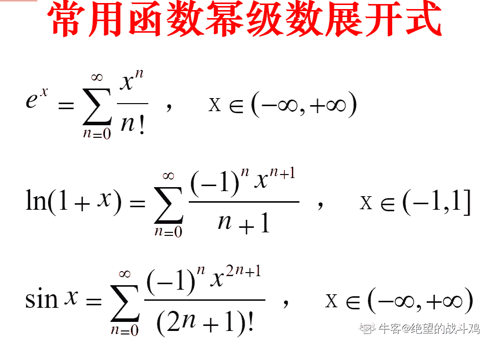
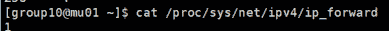

# 小米 2019 秋招运维工程师笔试题（B）

## 1

某系统拥有 N 个进程，7 个资源，每个进程需要 3 个资源，问 N 数量最多为（）时程序不会死锁？

正确答案: C   你的答案: 空 (错误)

```cpp
1
```

```cpp
2
```

```cpp
3
```

```cpp
4
```

本题知识点

运维工程师 小米 操作系统 2019 测试开发工程师 测试工程师 Shopee

讨论

[hgnulb](https://www.nowcoder.com/profile/8667211)

N*(3-1)+1≤7→N≤3

发表于 2020-03-10 10:53:33

* * *

[Cyranoid](https://www.nowcoder.com/profile/839229460)

最可能发生死锁的情况是 N 个进程各自都占据了 2 个资源，每个进程都再需要 1 个资源，2N<7 时不发生死锁。

发表于 2019-08-29 18:42:27

* * *

[Shakira](https://www.nowcoder.com/profile/2674224)

最可能发生死锁的情况是 N 个进程各自都占据了 2 个资源，每个进程都再需要 1 个资源，2N<7 时不发生死锁

发表于 2021-12-05 13:09:40

* * *

## 2

单任务系统中两个程序 A 和 B，其中

A 程序：设备 1：10s -> CPU：15s -> 设备 2：3s -> CPU：5s -> 设备 1：12s；

B 程序：CPU：18s -> 设备 1：3s -> CPU：16s -> 设备 2：2s -> 设备 2：6s；

执行顺序为 A ->B,那么 CPU 的利用率为：（）

正确答案: D   你的答案: 空 (错误)

```cpp
40%
```

```cpp
50%
```

```cpp
60%
```

```cpp
都不对
```

本题知识点

运维工程师 小米 单片机 2019

讨论

[雨木木 1](https://www.nowcoder.com/profile/947072902)

那个，15+5+16+18 不是 54 么，所以不应该是 60％么

发表于 2019-09-03 09:07:25

* * *

[274367565](https://www.nowcoder.com/profile/274367565)

不能直接相加计算，程序 A 执行过程中，在访问设备时 CPU 处于空闲，CPU 使用权会转给 B 程序

发表于 2020-06-22 11:48:27

* * *

[牛客 245066808 号](https://www.nowcoder.com/profile/245066808)

54/66？

发表于 2021-10-14 14:33:27

* * *

## 3

对[21, 49, 84, 45, 12]进行基数排序，第一趟排序的结果为：（）

正确答案: A   你的答案: 空 (错误)

```cpp
[21, 12, 84, 45, 49]
```

```cpp
[12, 21, 45, 49, 84]
```

```cpp
[12, 21, 49, 45, 84]
```

```cpp
[21, 12, 45, 49, 84]
```

本题知识点

排序 *讨论

[哞哞牛哞哞](https://www.nowcoder.com/profile/4435183)

对 10 取余排序，即按个位数大小进行排序

发表于 2019-10-10 20:41:06

* * *

[AaronSwartz1](https://www.nowcoder.com/profile/8314205)

A 对 10 取余排序

发表于 2019-04-06 20:22:36

* * *

[无神小坏](https://www.nowcoder.com/profile/859838854)

这道题不严谨，没有说是以哪边开始作为关键字，如果是以个位开始排序则是 A，如果是以十位开始排序则是 C

发表于 2021-08-25 15:01:35

* * *

## 4

已知一个栈的入栈顺序为 a b c d e，则可能的出栈顺序为：（）

正确答案: A B D   你的答案: 空 (错误)

```cpp
a b c d e
```

```cpp
c b d e a
```

```cpp
b d a c e
```

```cpp
b a d e c
```

本题知识点

运维工程师 小米 栈 *2019* *讨论

[大胖鸡蛋](https://www.nowcoder.com/profile/139645126)

b 出栈，d 出栈，说明 c 在栈顶，那么下一个出栈的是 c 不是 a

发表于 2019-09-05 20:37:11

* * *

[牛客 53501282 号](https://www.nowcoder.com/profile/53501282)

这题有问题 应该选 bc

发表于 2020-03-15 10:03:37

* * *

## 5

阅读如下 C 代码：

```cpp
float func(float a, int b)
{
  float m=1, n=1;
  int i;
  for (i=1; i <b;  i ++)
  {
    m*= a/i;
    n+=m;
  }
  return n;
}
```

当 b 无穷大的时候，函数 func 返回值最近接的选项是（）

正确答案: B   你的答案: 空 (错误)

```cpp
a^b
```

```cpp
e^a
```

```cpp
ln(1+a)
```

```cpp
a^a
```

本题知识点

小米 C++ 2019 C 语言

讨论

[-匿名](https://www.nowcoder.com/profile/121713100)

特殊法：分别令 a = 0.0; b =  0; 代入其中，循环条件不成立，返回 n,即返回 1，看选项，0 做底数没意义，排除，A,D，C 结果等于 0,选 B

发表于 2019-09-29 14:41:48

* * *

[奋斗之路不堵车](https://www.nowcoder.com/profile/603497382)



发表于 2019-10-19 12:31:02

* * *

[AC 出道](https://www.nowcoder.com/profile/171310471)


编辑于 2019-08-26 16:03:52

* * *

## 6

一个骰子六个面分别写着数字 1 至 6，先投一次，如果上面的值小于等于 3，则需要再次投掷一次。出现的结果总和至少为 6 的概率为多少？

正确答案: B   你的答案: 空 (错误)

```cpp
10/21
```

```cpp
5/12
```

```cpp
2/3
```

```cpp
1/6
```

本题知识点

运维工程师 小米 概率统计 *2019 概率论与数理统计* *讨论

[夜是故乡明](https://www.nowcoder.com/profile/6432095)

只投一次

*   第一次掷 6（）

投两次

*   第一次掷 1，第二次掷 5、6（）
*   第一次掷 2，第二次掷 4、5、6（）
*   第一次掷 3，第二次掷 3、4、5、6（）

sum =  = 

发表于 2019-09-07 22:23:02

* * *

[菜鸡准备转岗](https://www.nowcoder.com/profile/836159636)

分为两种情形 1、第一次掷 6 ： 1/62、第一次掷<=3： 1/2      第二次掷>=3： 1/21/6+1/4 = 5/12

发表于 2019-09-15 11:33:26

* * *

[cinnnnx](https://www.nowcoder.com/profile/681691640)

1\. 只投掷 1 次，只能为 6 -》 1/62\. 第一次小于等于 3，需要投第二次   a. 1 和 5 或 6   - >  1/6 * 2/6    b. 2 和 4 或 5 或 6  -> 1/6 * 3/6    c. 3 和 3 或 4 或 5 或 6  -> 1/6 * 4/6
   a,b,c 三种情况相加 = 1/6 * 2/6 + 1/6 * 3/6 + 1/6 * 4/6 = 1/4 所以总共的概率位 1/6 + 1/4 = 5/12 感觉应该有更简单的方法

发表于 2019-08-25 15:01:10

* * *

## 7

以下不属于 TCP 拥塞控制方法的是（）

正确答案: D   你的答案: 空 (错误)

```cpp
慢开始
```

```cpp
拥塞避免加法增大
```

```cpp
慢启动阈值 ssthresh 减半
```

```cpp
慢重传
```

本题知识点

运维工程师 小米 网络基础 2019

讨论

[TiAmo_9955](https://www.nowcoder.com/profile/317867636)

TCP 拥塞控制方法共有四种：慢开始，拥塞避免，快重传，快恢复所以选择 C

发表于 2019-04-25 19:12:39

* * *

[ZHAOSHUYA](https://www.nowcoder.com/profile/704089044)

  共四种：慢开始( slow-start )、拥塞避免( congestion avoidance )、快重传( fast retransmit )和快恢复( fast recovery )。 所以选 C

发表于 2019-04-25 18:03:00

* * *

[黄色变白色](https://www.nowcoder.com/profile/8547911)

    看到慢重传犹豫了下，想到 B 收到 A 的数据时要回复 ACK，但是有个机制会等 200ms，如果这段时间有数据发送到 A，那么 ACK 就和这个一起发送，很明显，我想岔了。TCP 有一种情况会进行重传：那就是收到 3 个相同的 ACK。TCP 在收到乱序到达包时就会立即发送 ACK，TCP 利用 3 个相同的 ACK 来判定数据包的丢失，此时进行快速重传。
快速重传做的事情有：
1.把 ssthresh 设置为 cwnd 的一半
2.把 cwnd 再设置为 ssthresh 的值(具体实现有些为 ssthresh+3)
3.重新进入拥塞避免阶段。

发表于 2019-09-09 07:48:56

* * *

## 8

TCP 状态变迁中，存在 TIME_WAIT 状态，请问以下正确的描述是？（）

正确答案: A C D   你的答案: 空 (错误)

```cpp
TIME_WAIT 状态可以帮助 TCP 的全双工连接可靠释放
```

```cpp
TIME_WAIT 状态是 TCP 是三次握手过程中的状态
```

```cpp
TIME_WAIT 状态是为了保证重新生成的 socket 不受之前延迟报文的影响
```

```cpp
TIME_WAIT 状态是为了让旧数据包消失在网络中
```

本题知识点

运维工程师 小米 网络基础 2019

讨论

[vegetable_bird](https://www.nowcoder.com/profile/238953438)

Time_wait 是 TCP 四次挥手中的状态

发表于 2019-08-30 16:03:58

* * *

[小白小白小小白小白](https://www.nowcoder.com/profile/410875)

不是选择不正确的吗？题目有问题吧

发表于 2020-06-10 11:13:19

* * *

[许你清安 L](https://www.nowcoder.com/profile/195264425)

D 选项：看一大佬的分析：为说明这个问题，我们先假设 TCP 协议中不存在 TIME_WAIT 状态的限制，再假设当前有一条 TCP 连接：(local_ip, local_port, remote_ip,remote_port)，因某些原因，我们先关闭，接着很快以相同的四元组建立一条新连接。本文前面介绍过，TCP 连接由四元组唯一标识，因此，在我们假设的情况中，TCP 协议栈是无法区分前后两条 TCP 连接的不同的，在它看来，这根本就是同一条连接，中间先释放再建立的过程对其来说是“感知”不到的。这样就可能发生这样的情况：前一条 TCP 连接由 local peer 发送的数据到达 remote peer 后，会被该 remot peer 的 TCP 传输层当做当前 TCP 连接的正常数据接收并向上传递至应用层（而事实上，在我们假设的场景下，这些旧数据到达 remote peer 前，旧连接已断开且一条由相同四元组构成的新 TCP 连接已建立，因此，这些旧数据是不应该被向上传递至应用层的），从而引起数据错乱进而导致各种无法预知的诡异现象。作为一种可靠的传输协议，TCP 必须在协议层面考虑并避免这种情况的发生，这正是 TIME_WAIT 状态存在的第 2 个原因。
————————————————
版权声明：本文为 CSDN 博主「Rock_N_Roll_」的原创文章，遵循 CC 4.0 BY-SA 版权协议，转载请附上原文出处链接及本声明。
原文链接：[`blog.csdn.net/u013616945/article/details/77510925/`](https://blog.csdn.net/u013616945/article/details/77510925/)

发表于 2021-10-09 21:45:48

* * *

## 9

IP/掩码位为 192.168.1.0/24 ，请问第一个可用地址和最后一个可用地址分别是什么（）

正确答案: B   你的答案: 空 (错误)

```cpp
192.168.1.1 192.168.255.255
```

```cpp
192.168.1.1 192.168.1.254
```

```cpp
192.0.0.1 192.255.255.255
```

```cpp
192.0.0.1 192.255.255.254
```

本题知识点

运维工程师 小米 网络基础 2019

讨论

[黄色变白色](https://www.nowcoder.com/profile/8547911)

192.168.1.0/24，掩码位是 24，所以主机地址只看后面 8 位就可以了。如果主机号全 0，IP 地址代表仅网络号指向的那个网段，该 IP 代表一个网段；如果主机号全 1，IP 地址代表网络号指向的全部主机，IP 地址代表广播地址 ；其他就是普通的 IP 地址，指向网域中的一个主机了所以答案就是 B 了 

发表于 2019-09-11 07:49:51

* * *

[onlyxxx](https://www.nowcoder.com/profile/493457698)

B 255 为广播地址，不能用，所以 1-254

发表于 2019-09-12 16:38:13

* * *

[学术废物](https://www.nowcoder.com/profile/6473476)

全 0 全 1 •᷄ࡇ•᷅ 脑子抽抽了

发表于 2022-03-11 10:33:29

* * *

## 10

以下协议属于 TCP/IP 协议簇中网络层的是（）

正确答案: B   你的答案: 空 (错误)

```cpp
SNMP
```

```cpp
IGMP
```

```cpp
UDP
```

```cpp
DNS
```

本题知识点

运维工程师 小米 网络基础 2019

讨论

[唔。寐](https://www.nowcoder.com/profile/4648256)

网络层只有 ARP IP ICMP IGMP IPsec5 个协议

发表于 2020-03-27 11:07:02

* * *

[吃饼！](https://www.nowcoder.com/profile/407702468)

SNAP 和 dns 属于应用层，tcp 和 udp 协议属于传输层，iGMp 是网络分组协议，属于网络层

发表于 2019-08-23 16:32:11

* * *

[信恒一斧](https://www.nowcoder.com/profile/231659730)

A.SNMP 属应用层 B.IGMP 是负责 IP 组播成员管理的协议  C.UDP 属于传输层 D.DNS 属于应用层

编辑于 2019-08-23 08:43:14

* * *

## 11

Linux 系统大致启动流程是（）

正确答案: D   你的答案: 空 (错误)

```cpp
MBR -> initrd -> uEFI-> grub
```

```cpp
MBR -> uEFI-> initrd -> grub
```

```cpp
initrd -> grub -> uEFI -> MBR
```

```cpp
uEFI-> MBR -> grub -> initrd
```

本题知识点

运维工程师 小米 Linux 2019

讨论

[归来仍是少年 v](https://www.nowcoder.com/profile/255695337)

以前的厂商启动的模式第一步是 BIOS 现在经过改进后，采取 UEFI 作为启动的第一步，UEFI 不仅能读取分区表，还能自动支持文件系统。

发表于 2019-08-24 17:17:58

* * *

[Archcy](https://www.nowcoder.com/profile/404574575)

采用 uEFI 的计算机可以支持 MBR，但是需要在 BIOS 中打开 CSM 之类的。之后->grub->initrd 就是常规操作。但是说 grub 也不太合适，毕竟 bootloader 有很多，例如 clover、rEFland 之类的。比较新的 linux 内核可以支持直接从内核启动，这种引导方式叫做 EFISTUB 贴一段 Archlinux 的 UEFI 启动过程的 wiki：

1.  系统开机 - 上电自检（Power On Self Test 或 POST）。
2.  UEFI 固件被加载，并由它初始化启动要用的硬件。
3.  固件读取其引导管理器以确定从何处（比如，从哪个硬盘及分区）加载哪个 UEFI 应用。
4.  固件按照引导管理器中的启动项目，加载 UEFI 应用。
5.  已启动的 UEFI 应用还可以启动其他应用（对应于 UEFI shell 或 rEFInd 之类的引导管理器的情况）或者启动内核及 initramfs（对应于 GRUB 之类引导器的情况），这取决于 UEFI 应用的配置。

发表于 2019-09-08 11:43:49

* * *

[延大 _ 王星星](https://www.nowcoder.com/profile/395313099)

Linux 启动流程：
1，BIOS 加电自检；
2，从硬盘 0 柱面 0 磁道 第一扇区读 512 字节的 MBR 主引导记录；
3，运行引导程序 Grub 并根据其配置加载 kernel 镜像后初始化；
4，根据/etc/inittab 中系统初始化配置执行/etc/rc.sysinit 脚本；
5，根据第 3 步读到的 runlevel 值启动对应服务；
6，运行/etc/rc.local;
7，生成终端待用户登录。

发表于 2020-05-29 12:42:30

* * *

## 12

有一台物理主机使用硬件阵列卡和多块磁盘创建单个磁盘阵列，那么阵列的基础信息会被存放在哪里？（）

正确答案: D   你的答案: 空 (错误)

```cpp
第一块磁盘的扇区头部
```

```cpp
所有磁盘的扇区头部
```

```cpp
阵列卡的缓存中
```

```cpp
所有磁盘的扇区尾部
```

本题知识点

运维工程师 小米 操作系统 2019

讨论

[是瑶瑶公主呀](https://www.nowcoder.com/profile/592649258)

阵列的基础信息存放在所有磁盘的扇区尾部 尽量记住好了

发表于 2019-11-01 17:01:06

* * *

## 13

以下哪些是和 IO 相关的协议？（）

正确答案: C D E   你的答案: 空 (错误)

```cpp
DNS
```

```cpp
NTP
```

```cpp
ATA
```

```cpp
NVMe
```

```cpp
SCSI
```

```cpp
STP
```

本题知识点

运维工程师 小米 风控 2019

## 14

修改/etc/sysctl.conf 如下哪项参数可以开启 Linux 流量转发功能（）

正确答案: C   你的答案: 空 (错误)

```cpp
net.ipv4.conf.all.rp_filter = 0
```

```cpp
net.ipv4.conf.default.rp_filter = 0
```

```cpp
net.ipv4.ip_forward = 1
```

```cpp
net.ipv4.conf.all.rp_filter = 1
```

```cpp
net.ipv4.conf.default.rp_filter = 1
```

```cpp
net.ipv4.ip_forward = 0
```

本题知识点

运维工程师 小米 Linux 2019

讨论

[特务兔](https://www.nowcoder.com/profile/3999635)

可以通过命令：cat /proc/sys/net/ipv4/ip_forward 查看，1 为开启 Linux 流量转发，0 为禁止使用

rp_filter 参数有三个值，0、1、2，具体含义：

0：不开启源地址校验。

1：开启严格的反向路径校验。对每个进来的数据包，校验其反向路径是否是最佳路径。如果反向路径不是最佳路径，则直接丢弃该数据包。

2：开启松散的反向路径校验。对每个进来的数据包，校验其源地址是否可达，即反向路径是否能通（通过任意网口），如果反向路径不同，则直接丢弃该数据包。

发表于 2019-09-09 10:52:50

* * *

[牛客 519264047 号](https://www.nowcoder.com/profile/519264047)

题目应该改成，修改为

发表于 2021-11-30 09:25:11

* * *

[夜笙丿](https://www.nowcoder.com/profile/185778492)

IP 防火墙知识吧，使用 forward 链开启转发

编辑于 2020-03-08 15:09:48

* * *

## 15

VXLAN 在云计算场景中主要解决了如下哪些问题（）

正确答案: B D   你的答案: 空 (错误)

```cpp
不同租户互访
```

```cpp
VLAN ID 不足
```

```cpp
租户隔离
```

```cpp
虚机漂移
```

本题知识点

运维工程师 小米 网络基础 2019

讨论

[十年单身换一个字节 SP](https://www.nowcoder.com/profile/3240278)

VxLAN（Virtual eXtensible Local Area Network，虚拟扩展局域网）技术很好地解决了现有 VLAN 技术无法满足大二层网络需求的问题。VxLAN 技术是一种大二层的虚拟网络技术，主要原理是引入一个 UDP 格式的外层隧道作为数据链路层，而原有数据报文内容作为隧道净荷加以传输。由于外层采用了 UDP 作为传输手段，净荷数据可以轻松地在二三层网络中传送。（摘自百度百科）

发表于 2019-09-11 11:22:14

* * *

[小小 offer 收割机](https://www.nowcoder.com/profile/645047906)

完美的避开了正确答案

发表于 2021-04-16 23:20:01

* * *

[征途是一百级大牛](https://www.nowcoder.com/profile/803324974)

VXLAN ID 不足 虚机漂移

发表于 2021-12-28 15:51:03

* * *

## 16

RDBMS 通常会实现不同的隔离级别，有些数据库中的隔离级别是可随时调整的，那么关于隔离级别以下说法正确的是（）

正确答案: A B D   你的答案: 空 (错误)

```cpp
ANSI/ISO SQL92 标准定义了四种隔离级别，分别是 Read uncommitted、Serializable、Repeatable read、Read committed
```

```cpp
在同样的运行环境下，不同隔离级别的性能从高到低的顺序是 Read uncommitted > Read committed > Repeatable read > Serializable
```

```cpp
Oracle 数据库采用的默认隔离级别和 MySQL 实现的 READ COMMITTED 相似，这个隔离级别下不会出现脏读（Dirty Read）和不可重复读（Non-Repeatable Reads），但会有幻读（Phantom Reads)
```

```cpp
Serializable 隔离级别能够完全防止脏读（Dirty Read）、不可重复读（Non-Repeatable Reads）和幻读（Phantom Reads）
```

本题知识点

运维工程师 小米 数据库 2019

讨论

[#8](https://www.nowcoder.com/profile/226543311)

所以这题选 ABD

编辑于 2019-09-18 10:16:24

* * *

[木木火火己](https://www.nowcoder.com/profile/102275828)

read committed 级别允许不可重复读，C 错

发表于 2020-09-07 23:52:26

* * *

[海压竹枝低复举，风吹山角晦还明](https://www.nowcoder.com/profile/223418881)

第一级别：读未提交（read uncommitted）                对方事务还没有提交，我们当前事务可以读取到对方未提交的数据。                读未提交存在脏读（Dirty Read）现象：表示读到了脏的数据。第二级别：读已提交（read committed）                对方事务提交之后的数据我方可以读取到。                这种隔离级别解决了: 脏读现象没有了。                读已提交存在的问题是：不可重复读。第三级别：可重复读（repeatable read）                这种隔离级别解决了：不可重复读问题。                这种隔离级别可能存在的问题是：读取到的数据是幻象。第四级别：序列化读/串行化读（serializable）                解决了所有问题。                效率低。需要事务排队。注意：可重复读隔离级别有时候能避免幻读有时候不能避免。连续多次快照读，ReadView 会产生复用，没有幻读问题。当两次快照读之间存在当前读，ReadView 会重新生成，导致幻读！！！

发表于 2021-09-07 09:51:53

* * *

## 17

以 MySQL 5.7 或更低版本为准的数据库中，如何正确选择和使用合适的数据类（）

正确答案: A B C   你的答案: 空 (错误)

```cpp
更小通常更好
```

```cpp
尽量用最简单的数据类型
```

```cpp
尽量不使用 Null 作为字段值
```

```cpp
字符串较长时优先用 Text 数据类型
```

本题知识点

运维工程师 小米 数据库 2019

讨论

[欢乐马仔](https://www.nowcoder.com/profile/128647518)

D: 应采用 varchar, 灵活可变长度

发表于 2019-10-18 12:26:38

* * *

[闲鱼总算翻了身](https://www.nowcoder.com/profile/909589300)

字符串较长时应采用 varchar, 灵活可变长度

发表于 2021-07-20 23:01:55

* * *

[海海不掉头发](https://www.nowcoder.com/profile/493926724)

*   ```cpp
    更小通常更好
    ```

*   ```cpp
    尽量用最简单的数据类型
    ```

*   ```cpp
    尽量不使用 Null 作为字段值
    ``` 

发表于 2021-05-07 16:26:35

* * *

## 18

下面关于 HDFS 中 SecondaryNameNode 描述正确的一项是（）

正确答案: C   你的答案: 空 (错误)

```cpp
它是 NameNode 的热备
```

```cpp
它对内存没有要求
```

```cpp
它的目的是帮助 NameNode 合并 editlog，减少 NameNode 启动时间
```

```cpp
SecondaryNameNode 应与 NameNode 部署到一个节点
```

本题知识点

运维工程师 小米 Hadoop 2019

讨论

[风尘子曰](https://www.nowcoder.com/profile/613954133)

SecondaryNameNode 它不是 namenode 的冗余守护进程，而是提供周期检查点和清理任务。帮助 namenode 合并 editslog，减少 namenode 启动时间。

发表于 2020-03-13 11:16:18

* * *

[谥那](https://www.nowcoder.com/profile/122232275)

secondary:并非 namenode 的热备,当 namenode 挂掉的时候,它并不马上替换掉 namenode 提供服务
辅助 namenode.分担其工作量,比如定期合并 fsimage 和 edits ,并推送给 namenode
在紧急的情况下 可辅助恢复 namenode

发表于 2020-10-06 20:08:30

* * *

[小曹冲了](https://www.nowcoder.com/profile/125636346)

SecondryNameNode 是 NameNode 的冷备份；合并 fsimage 和 fsedits 然后再发给 namenode。

发表于 2020-10-17 20:29:44

* * *

## 19

下面关于 Redis 描述错误的一项是（）

正确答案: B   你的答案: 空 (错误)

```cpp
Master 最好不要做任何持久化工作，如 RDB 内存快照和 AOF 日志文件
```

```cpp
主从复制不要用单向链表结构，用图状结构更为稳定
```

```cpp
如果数据比较重要，某个 Slave 开启 AOF 备份数据，策略设置为每秒同步一次
```

```cpp
为了主从复制的速度和连接的稳定性，Master 和 Slave 最好在同一个局域网内
```

本题知识点

运维工程师 小米 Redis 2019

讨论

[喜酒客](https://www.nowcoder.com/profile/732886366)

主从关系为：Master<–Slave1<–Slave2<–Slave3…，这样的结构也方便解决单点故障问题，实现 Slave 对 Master 的替换，也即，如果 Master 挂了，可以立马启用 Slave1 做 Master，其他不变。

发表于 2022-02-11 16:10:50

* * *

## 20

在 MySQL 中有这样一个表，记录用户的订单信息：

```cpp
Create Table orders(
    id int primary key auto_increment,
    title varchar(100) not null,
    status int not null,
    context text
) engine=innodb;
```

有一亿行数据且严格按照 id 递增，且订单 90% 的 title 都是以 xiaomi 开头的；我目前想查询订单以 `xiaomi` 开头的最近 10 条订单的状态(status) 信息，执行这样一个查询性能不佳的语句：

select * from orders where title like '%xiaomi%' order by id;
仅有以下措施可选，现在只能让你做其中唯一一个，你认为最有效的是：（）

正确答案: C   你的答案: 空 (错误)

```cpp
修改查询列的列表为 id, status
```

```cpp
建立 title 列的索引
```

```cpp
在 sql 末尾添加 limit 10
```

```cpp
修改查询条件 like '%xiaomi%' 为 like 'xiaomi%'
```

本题知识点

运维工程师 小米 数据库 2019

讨论

[暖瓶座](https://www.nowcoder.com/profile/252710411)

like 属于模糊查询，查询订单以 `xiaomi` 开头，表明不是以 xiaomi 开头和结尾的订单，多了两个单引号，所以前后要加“%”，limit 10 就是指取前 10 条的信息。

发表于 2019-08-30 23:27:33

* * *

[Mirror20190304142951](https://www.nowcoder.com/profile/801851875)

sql 中使用了 like，即使创建索引，也不会根据索引查询

发表于 2019-07-24 12:21:37

* * *

[openmind.](https://www.nowcoder.com/profile/539390139)

> LIMIT [row][offset]
> LIMIT 10 = LIMIT 0 10
> 即从索引为 0 开始即第一条记录开始向后选 10 条记录

**由于 id 是 auto_increment 所以 id 越大越是最近 =》 所以后面应该 ORDER BY id DESC 降序排列再选取前 10 行即可。**

```cpp
mysql> SELECT * FROM table LIMIT 5,10; // 检索记录行 6-15

//为了检索从某一个偏移量到记录集的结束所有的记录行，可以指定第二个参数为 -1：    
mysql> SELECT * FROM table LIMIT 95,-1; // 检索记录行 96-last.   

//如果只给定一个参数，它表示返回最大的记录行数目：    
mysql> SELECT * FROM table LIMIT 5*; //检索前 5 个记录行   
```

编辑于 2021-03-11 22:27:19

* * *

## 21

输入参数为字符串型的 n 维数组，数组的每一项值为数组 或 int 型数字。请实现一个函数，可以获取列表嵌套列表的最大深度为多少。

本题知识点

运维工程师 小米 栈 *字符串 *模拟 2019** **讨论

[fnzr1](https://www.nowcoder.com/profile/589713259)

```cpp
有括号的题目第一时间想到栈
```

s = raw_input()
count = []
m = 0
for i in s:
    if i == "[":
        count.append(i)
        if len(count)>m:
            m = len(count)

    elif i == "]":
        count.pop()
print m

发表于 2019-07-24 10:24:28

* * *

[勇敢牛牛，不怕困难！](https://www.nowcoder.com/profile/840813925)

```cpp
#include <stdio.h>
#include <stdlib.h>
#include <assert.h>

const int MAX_N = 1 << 16; // 65536

int main(const int argc, const char* const argv[]) {
  char input[MAX_N] = "";
  gets(input);

  char stk[20];
  int top = -1, ans = 0;

  const char* p = input;
  while (*p) {
    switch (*p) {
      case '[':
        *(stk + ++top) = '[';
        ans = fmax(ans, top + 1);
        break;
      case ']':
        --top;
        break;
      default:
        break;
    }
    ++p;
  }

  assert(top == -1);
  return fprintf(stdout, "%d", ans),  0;
}
```

发表于 2021-07-19 12:08:38

* * *

[零葬](https://www.nowcoder.com/profile/75718849)

O(n)复杂度直接遍历一遍字符串即可，遇到左括号就深度+1，遇到右括号就先更新最大深度，并平衡掉一个左括号（即最近一次深度的自增 1 由于一对完整括号的出现而取消，需要重新在那个基础上再计算深度）。

```cpp
import java.io.BufferedReader;
import java.io.InputStreamReader;
import java.io.IOException;

public class Main {
    public static void main(String[] args) throws IOException {
        BufferedReader br = new BufferedReader(new InputStreamReader(System.in));
        char[] str = br.readLine().trim().toCharArray();
        int maxDepth = 0;
        int depth = 0;
        for(int i = 0; i < str.length; i++){
            if(str[i] == '['){
                // 遇到左括号就将深度+1
                depth ++;
            }else if(str[i] == ']'){
                // 遇到右括号先更新一下当前最大的深度，再平衡掉一个左括号重新计算当前的 depth
                maxDepth = Math.max(maxDepth, depth);
                depth --;
            }
        }
        System.out.println(maxDepth);
    }
}
```

发表于 2021-02-27 15:06:09

* * *

## 22

在你面前有一个 n 阶的楼梯(n>=100 且 n<500)，你一步只能上 1 阶或 3 阶。
请问计算出你可以采用多少种不同的方式爬完这个楼梯（到最后一层为爬完）。(注意超大数据)

本题知识点

运维工程师 小米 递归 动态规划 2019

讨论

[卷积神经网络哦](https://www.nowcoder.com/profile/8684256)

python 的 int 型无限大(只要内存够) 因此这种题 python 是最好的选择简单的动态规划

```cpp
arr = [0 for i in range(int(input()) + 1)]
arr[0], arr[1], arr[2] = 1, 1, 1
for i in range(3, len(arr)):
    arr[i] = arr[i-1] + arr[i-3]
print(arr[-1])

```

发表于 2019-12-26 11:59:29

* * *

[freezerhan](https://www.nowcoder.com/profile/240603607)

矩阵快速幂

```cpp
def matmul(A, B):
    C = [[0, 0, 0], [0, 0, 0], [0, 0, 0]]
    for i in range(3):
        for j in range(3):
            for k in range(3):
                C[i][j] += (A[i][k] * B[k][j])
    return C

def mat_power(A, count):
    B = [[1, 0, 0], [0, 1, 0], [0, 0, 1]]
    while (count > 0) :
        if count % 2 == 1:
            B = matmul(B, A)
        A = matmul(A, A)
        count //= 2
    return B

def work():
    n = int(input())
    f = [0 for i in range(n + 1)]
    f[0] = f[1] = f[2] = 1
    f[3] = 2
    if n <= 3:
        print(f[n])
        return
    A = [[f[2], f[0], f[1]], [f[3], f[1], f[2]], [0, 0, 0]]
    B = [[1, 0, 1], [1, 0, 0], [0, 1, 0]]
    count = n - 2 - n % 2
    B = mat_power(B, count)
    B = matmul(A, B)
    if n % 2 == 1:
        print(B[1][0])
    else:
        print(B[0][0])
work()

```

发表于 2019-11-02 14:13:18

* * *

[谁的电脑](https://www.nowcoder.com/profile/743368)

```cpp
import java.io.BufferedReader;
import java.io.InputStreamReader;
import java.math.BigInteger;

public class Main {
    public static void main(String[] args) throws Exception{
        BufferedReader br = new BufferedReader(new InputStreamReader(System.in));
        int n = Integer.parseInt(br.readLine());
        BigInteger[] count = new BigInteger[n];
        count[0] = new BigInteger("1");
        count[1] = new BigInteger("1");
        count[2] = new BigInteger("2");
        for (int i = 3; i < n; i++) {
            count[i] = count[i - 1].add(count[i - 3]);
        }
        System.out.println(count[n - 1]);
    }
}
```

编辑于 2019-07-15 17:02:40

* * ******