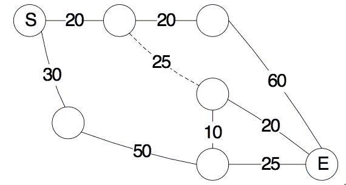

# 搜狗 2019 秋招研究员试卷部分编程题合集（第二场）

## 1

定义如下图所示的比赛地图：
 
S 表示比赛起点，E 表示比赛终点。实线表示陆路，虚线表示水路。兔子只能走陆路，乌龟既可以走陆路也可以走水路。每条路径的长度在图中给出。假定兔子和乌龟足够聪明，问谁先到达终点。

本题知识点

小米 Java 工程师 C++工程师 iOS 工程师 安卓工程师 运维工程师 前端工程师 算法工程师 PHP 工程师 测试工程师 图 搜狗 2019

讨论

[牛客 543855079 号](https://www.nowcoder.com/profile/543855079)

同时到达，都足够聪明了，路上兔子背着乌龟，水里乌龟拖着兔子

发表于 2019-07-12 11:28:09

* * *

[北雷北雷](https://www.nowcoder.com/profile/488594459)

通用 Dijkstra 求全路径点到点的距离代码，稍微修改就可以适用本题

```cpp
/*
Dijkstra 算法求单源无向图最短路径
*/
#include <bits/stdc++.h>
using namespace std;
struct node {
    int point, value;
    node(int a, int b) // 构造
    {
        point = a;
        value = b;
    }
    // 重载<操作符 由小到大排序
    bool operator<(const node &a) const
    {
        // 对小于运算符进行重载，如果两个值相等，那么继续判断 point，如果不等，则返回 false
        if (value == a.value) {
            return a.point < point;
        } else {
            return a.value < value;
        }
    }
};
class Dijkstra{
public:
    Dijkstra(int count):n(count){
        processE();//处理输入
        result = vector<vector<int>>(count,vector<int>(count));
    };
    //求解无向图中所有点之前的距离
    void solver(bool debug=true){
        for(unsigned int i=1;i<=n;++i){
            result.push_back(dijkstra(i));
            if(debug){
                for(int x:result.back()){
                    cout<<x<<' ';
                }
                cout<<endl;
            }
        }
    }
    //start 是实际的标号，从 1 开始，在处理中数组从 0 开始
    vector<int> dijkstra(int start)
    {    vector<int> dis(n+1,INT_MAX);
        priority_queue<node> q;//每次求解需要的优先队列
        dis[start] = 0;
        q.push(node(start, dis[start] ));

        while (!q.empty()) {
            node x = q.top();
            q.pop();
            for (int i = 0; i < e[x.point].size(); i++) {
                node y = e[x.point][i];
                // 核心思想：更新估算距离，松弛
                if (dis[y.point] > dis[x.point] + y.value) {
                    dis[y.point] = dis[x.point] + y.value;
                    q.push(node(y.point, dis[y.point]));
                }
            }
        }
        return vector<int>(dis.begin()+1,dis.end());
    }
    void processE(){
        //这个函数用来处理 e[Ni]需要将 start,end ,length 添加到 e[start]->(end,length)和 e[end]->(start,length)
        //形如 e[start].push_back(node(end[[2,1,1],[2,3,1],[3,4,1]], length));
        int a, b, c, k;
        char s;
        getchar();
        while(getchar() == '[') {
            scanf("%d%c%d%c%d%c%c", &a, &s, &b, &s, &c, &s, &s);
            e[a].push_back(node(b, c));
            e[b].push_back(node(a,c));
        }
    }
private:
    vector<vector<int>> result;//最后的结果矩阵
    const static int Ni = 101 ;//最大的边的集合
    vector<node> e[Ni];//用起点表示的边的集合
    int n ;//实际的边的个数

};

int main(){
    Dijkstra(4).solver();
}
```

编辑于 2019-09-04 21:12:01

* * *

[牛客 497864927 号](https://www.nowcoder.com/profile/497864927)

dijskra 算法分别计算兔子和乌龟的最短路径，再除以速度得到时间。只需注意由于兔子不可走水路，所以求兔子的最短路径时需跳过水路。求最短路径时采用优先队列进行优化。

```cpp
#include <cstdio>
#include <vector>
#include <queue>
#include <climits>
using namespace std;

struct Edge{ int from, to, dist, type; };
struct HeapNode
{
    int u;
    long d;
    bool operator<(const HeapNode& rhs) const 
    {
        return d>=rhs.d;
    }
};
vector<Edge> edges;

// flag=true 表示可走水路
int dijskra(vector<vector<int>>& G, int s, int t, bool flag)
{
    int n = G.size()-1;
    vector<bool> visited(n+1, false);
    vector<long> d(n+1, INT_MAX);
    priority_queue<HeapNode> Q;
    d[s] = 0;
    Q.push((HeapNode){s,0});
    while (!Q.empty())
    {
        int u = Q.top().u;
        Q.pop();
        if (u==t) break;
        if (visited[u]) continue;
        visited[u] = true;
        int num = G[u].size();
        for (int i = 0; i < num; ++i)
        {
            Edge& e = edges[G[u][i]];
            if (!flag && e.type==1) continue;
            if (d[u]+e.dist < d[e.to] && !visited[e.to])
            {
                d[e.to] = d[u]+e.dist;
                Q.push((HeapNode){e.to, d[e.to]});
            }
        }
    }
    return d[t];
}

int main()
{
    int n, m, v1, v2;
    scanf("%d%d%d%d", &v1,&v2,&n,&m);
    vector<vector<int>> G(n+1);
    for (int i = 0; i < m; ++i)
    {
        int from, to, dist, type;
        scanf("%d%d%d%d", &from, &to, &dist, &type);
        edges.push_back((Edge){from, to, dist, type});
        G[from].push_back(edges.size()-1);
        edges.push_back((Edge){to, from, dist, type});
        G[to].push_back(edges.size()-1);
    }
    double dist1 = dijskra(G,1,n,false);  // 兔子的最短路径
    double dist2 = dijskra(G,1,n,true);   // 乌龟的最短路径
    int result = 0;
    if (dist1/v1 < dist2/v2)
        result = 1;
    else if (dist1/v1 > dist2/v2)
        result = -1;
    printf("%d\n", result);

    return 0;
}
```

编辑于 2020-12-24 21:39:56

* * *

## 2

一群探险家被困古巴比伦迷宫 ，经过努力，探险家破译出了密码。原来通关需要先打开前方的 M 个机关的任意一个或多个为打开状态，然后关闭所有机关才能安全通过。探险家还发现了一种带有凸起的圆盘，圆盘可以用来同时反转若干个机关的状态（打开状态反转为关闭状态，关闭状态反转为打开状态，这若干个机关必须同时反转）。为了速记，探险家们用十六进制数字表示一个圆盘。如圆盘能同时控制第 3、4、5 个开关，圆盘就记为 1C（11100）。每次操作一个圆盘，比特位为 1 的位置的机关同时被反转；而且每个圆盘使用一次后就会碎掉。目前探险家收集到了 N 个圆盘，问现在探险家可以顺利走出迷宫么？

若探险家手里有 0、1、2、3、5 五个圆盘，M=7，由于存在 1 xor 2 xor 3 = 0， 因此结果是 yes；
若探险家手里有 0、1、2、2、5 五个圆盘，M=7，由于存在 2 xor 2 = 0， 因此结果是 yes；
若探险家手里有 0、1、3、5、9 五个圆盘，M=7，由于不存组合使得 xor = 0， 因此结果是 no。

本题知识点

小米 Java 工程师 C++工程师 iOS 工程师 安卓工程师 运维工程师 前端工程师 算法工程师 PHP 工程师 测试工程师 穷举 数学 搜狗 2019

讨论

[XiaKIsGod](https://www.nowcoder.com/profile/7446963)

//线性基模板题 但是二进制位可能有 360 位 用 bitset 就可以 细节处理一下就可以过 ```cpp
#include <bits/stdc++.h>
#define LL long long
#define pb push_back
#define mem(x,v) memset(x,v,sizeof(x))
#define rep(i,a,n) for(int i = a;i<n;i++)
#define per(i,a,n) for(int i = n-1;i>=a;i--)
using namespace std;
constint N = 400;
int T,n,m;
chars[N];
string ss[] = {"0000","0001","0010","0011","0100","0101","0110","0111","1000","1001","1010","1011","1100","1101","1110","1111"};
string buff;
bitset<N> b[N];
bitset<N> bs[N];
int main()
{
    //freopen("1.in","r",stdin);
    scanf("%d",&T);
    rep(i,1,N) b[i].set(i-1);
    while(T--){
        rep(i,0,N) bs[i] = 0;
        scanf("%d %d",&m,&n);
        bool flag = false;
        bitset<N> bi = 0;
        rep(i,0,m) bi.set(i);
        rep(i,0,n){
            scanf("%s",s);buff = "";
            int len = strlen(s);
            if(flag) continue;
            if(len==1&&s[0]=='0') continue;
            rep(j,0,N/4-len) buff.append("0000");
            rep(j,0,len){
                if(s[j]>='0'&&s[j]<='9') buff.append(ss[s[j] - '0']) ;
                else buff.append(ss[s[j] - 'A'+ 10]) ;
            }
            bitset<N> t(buff);
            t = t&bi;
            //cout<<t<<endl;
            per(j,1,N){
                if((t&b[j])!=b[0]){
                    if(bs[j]==b[0]){
                        bs[j] = t;
                        break;
                    }else{
                        t = t^bs[j];
                        if(t==b[0]){
                            flag = true;
                            break;
                        }
                    }
                }
            }
        }
        if(flag) printf("yes\n");
        else printf("no\n");
    } 
    return 0;
}
``` 

发表于 2019-06-12 18:33:17

* * *

[nbgao](https://www.nowcoder.com/profile/211289)

```cpp
#include <bits/stdc++.h>
using namespace std;

const int N = 361;
bitset<N> b1[N], b2[N];
string s;
vector<string> v;

void DFS(int i, string s){
    if(i==4){
        v.push_back(s);
        return;
    }
    DFS(i+1, s+'0');
    DFS(i+1, s+'1');
}

int main(){
    for(int i=1;i<N;i++)
        b1[i].set(i-1);
    DFS(0, "");
    sort(v.begin(), v.end());
    int T, m, n;
    scanf("%d", &T);
    while(T--){
        for(int i=0;i<N;i++)
            b2[i] = 0;
        scanf("%d%d", &m, &n);
        bool flag = false;
        bitset<N> bt = 0;
        for(int i=0;i<m;i++)
            bt.set(i);
        for(int i=0;i<n;i++){
            char str[N];
            scanf("%s", str);
            int l = strlen(str);
            s = "";
            if(flag)
                continue;
            if(l==1 && str[0]=='0')
                continue;
            for(int j=0;j<N/4-l;j++)
                s.append("0000");
            for(int j=0;j<l;j++){
                if(isdigit(str[j]))
                    s.append(v[str[j]-'0']);
                else
                    s.append(v[str[j]-'A'+10]);
            }
            bitset<N> t(s);
            t &= bt;
            for(int j=1;j<N;j++){
                if((t&b1[j]) != b1[0]){
                    if(b2[j] == b1[0]){
                        b2[j] = t;
                        break;
                    }else{
                        t ^= b2[j];
                        if(t == b1[0]){
                            flag = true;
                            break;
                        }
                    }
                }
            }
        }
        puts(flag?"yes":"no");
    }
    return 0;
}
```

发表于 2020-11-17 12:57:06

* * *