# 顺丰科技 2019 秋招 Java 开发工程师客观题合集

## 1

二叉排序树的链表节点定义如下：

```cpp
typedef struct BiTnode{
    int key_value;
    struct BiTnode *L,*R;/*节点的左、右树指针*/
}
```

请补充完整查找键值 key 的函数。

```cpp
BSTree lookup_key(BSTree root,int key)
{
    if() return NULL;
    else 
        if(key == root->key_value)
            return root;
        else if(key > root->key_value)
            return (1);
        else
            return (2);
}
```

正确答案: D   你的答案: 空 (错误)

```cpp
(1)lookup_key(root->R,key)
(2)lookup_key(NULL,key)
```

```cpp
(1)lookup_key(root->R,root.key_value)
(2)lookup_key(root->L,root.key_value)
```

```cpp
(1)lookup_key(root->L,key)
(2)lookup_key(root->R,key)
```

```cpp
(1)lookup_key(root->R,key)
(2)lookup_key(root->L,key)
```

本题知识点

顺丰科技 树 2019

讨论

[can~can~can](https://www.nowcoder.com/profile/46803557)

关键字 key 比根值大，则去与右子树对应的值比较；当关键字 key 值比根值小，则去与左之树对应的值比较。因为二叉排序树的值大小是，左子树<根<右子树

发表于 2019-03-14 09:38:12

* * *

[跳跳糖的 QQ 糖](https://www.nowcoder.com/profile/622864262)

二叉排序数的（递归）定义：1、若左子树非空，则左子树所有节点的值均小于它的根节点；2、若右子树非空，则右子树所有节点的值均大于于它的根节点；3、左右子树也分别为二叉排序树。

发表于 2019-03-12 20:33:38

* * *

[学术废物](https://www.nowcoder.com/profile/6473476)

根右左

发表于 2022-03-19 12:08:01

* * *

## 2

对序列（12,18,22,38,39,49,79,89）进行排序，最不适合的算法是（）

正确答案: B   你的答案: 空 (错误)

```cpp
冒泡排序
```

```cpp
快速排序
```

```cpp
归并排序
```

```cpp
插入排序
```

本题知识点

Java 工程师 安卓工程师 顺丰科技 排序 *信息技术岗 2019 iOS 工程师 C++工程师 PHP 工程师 算法工程师 区块链* *讨论

[仰望星空 73](https://www.nowcoder.com/profile/3491497)

快排不适合对基本有序的数据集合进行排序

发表于 2019-03-14 19:42:12

* * *

[Sugar201903222055238](https://www.nowcoder.com/profile/821678589)

快排序越是无序效率越高。基本有序是 O(n2),归并是 nlogn，直接是 n

发表于 2019-03-24 21:38:02

* * *

[叶建文](https://www.nowcoder.com/profile/58213545)

我的理解是，这里冒泡排序和快速排序都是 O(n²)，之所以选快排而不是冒泡，可能是因为常数因子的问题，快排相对复杂，因此直观理解它的常数因子就更大。

发表于 2019-03-26 23:41:26

* * *

## 3

调用函数时，入参及返回地址使用了（）

正确答案: D   你的答案: 空 (错误)

```cpp
队列
```

```cpp
多维数组
```

```cpp
顺序表
```

```cpp
栈
```

本题知识点

Java 工程师 安卓工程师 顺丰科技 栈 *信息技术岗 2019 iOS 工程师 C++工程师 PHP 工程师 算法工程师 区块链* *讨论

[仰望星空 73](https://www.nowcoder.com/profile/3491497)

在函数调用过程中形成嵌套时，则应使最后被调用的函数最先返回，后进先出，栈。

编辑于 2019-03-14 19:45:37

* * *

[低头前行](https://www.nowcoder.com/profile/544455681)

调用方法时，在虚拟机栈创建栈帧，栈帧中包括局部变量表，操作数栈，动态链接，返回地址

发表于 2020-08-27 21:10:39

* * *

[摇井](https://www.nowcoder.com/profile/94064650)

突然想起了递归 不正是栈吗

发表于 2019-03-25 22:43:44

* * *

## 4

设有递归算法如下，最终打印结果是（）

```cpp
#include<stdio.h>
 int foo(int a ,int b)
 {
     if (b == 0) return 0;
     if (b % 2 == 0) return foo(a+a,b/2);
     return foo(a+a,b/2)+a;    
 }
 int main()
 { 
   printf("%d", foo(1,3));
   return 0;
 }

```

正确答案: A   你的答案: 空 (错误)

```cpp
3
```

```cpp
4
```

```cpp
5
```

```cpp
6
```

本题知识点

递归

讨论

[ＭＭＱ](https://www.nowcoder.com/profile/217762715)

计算 foo(1,3)：此时 a=1,b=3;跳过两个 if 语句进入 return foo(1+1,3/2)+1,即 foo(2,1)+1；计算 foo(2,1)：同样，跳过两个 if 语句进入 return foo(2+2,1/2)+2,即 foo(4,0)+2;计算 foo(4,0):进入第一个 if 语句，return 0；逐层返回，得 foo(2,1)=0+2=2;再返回上一层，得 foo(1,3)=2+1=3；返回结果，foo(1,3)=3;

编辑于 2019-03-12 20:50:37

* * *

[路人癸 000](https://www.nowcoder.com/profile/528623642)

编译都过不了

发表于 2019-04-02 17:00:32

* * *

[许愿建行拿到 offer](https://www.nowcoder.com/profile/217268997)

注意 b 是整数,那么 3/2 等于 1

发表于 2019-11-19 21:30:04

* * *

## 5

请指出堆排序、选择排序、冒泡排序、快速排序的平均时间复杂度（）

正确答案: A   你的答案: 空 (错误)

```cpp
nlogn、n²、n²、nlogn
```

```cpp
n²、n²、n²、nlogn
```

```cpp
nlogn、nlogn、n²、nlogn
```

```cpp
nlogn、n²、n²、n²
```

本题知识点

排序 *讨论

[程序猿 Go 师傅](https://www.nowcoder.com/profile/242025553)


编辑于 2019-10-21 17:08:55

* * *

[theWeak](https://www.nowcoder.com/profile/829551324)

想起了马士兵老师的做的（有毒）的词选炮插快归堆希统计姬 N 方 N 老 N 一三对 N 加 KN 乘 K 不稳稳稳不稳稳不稳不稳稳稳稳🤣

发表于 2019-03-20 21:06:49

* * *

[horizon201809151642286](https://www.nowcoder.com/profile/607362852)

记住：  冒泡和选择    ： n²             快速和堆排序：nlogn

发表于 2019-03-19 15:38:13

* * *

## 6

What is Static Method in Java（）

正确答案: A B C   你的答案: 空 (错误)

```cpp
It is a method which belongs to the class and not to the object(instance)
```

```cpp
A static method can access only static data. It can not access non-static data (instance variables)
```

```cpp
A static method can call only other static methods and can not call a non-static method from it.
```

```cpp
A static method can not be accessed directly by the class name and doesn’t need any object
```

本题知识点

Java 工程师 安卓工程师 顺丰科技 Java 信息技术岗 2019 iOS 工程师 C++工程师 PHP 工程师 算法工程师 区块链 运维工程师

讨论

[coderofUESTC](https://www.nowcoder.com/profile/817336)

其实这题并不严谨，不管实例成员还是实例方法，都可以在静态方法里实例化一个对象再去调用

发表于 2019-07-06 18:12:28

* * *

[pitt1997](https://www.nowcoder.com/profile/211637886)

A：静态方法是一个属于类而不属于对象(实例)的方法。（√）B：静态方法只能访问静态数据。无法访问非静态数据(实例变量)。（√）C：静态方法只能调用其他静态方法，不能从中调用非静态方法。（√）D：静态方法不能通过类名直接访问，也不需要任何对象。（×） 静态方法可以直接用类名访问。

发表于 2019-04-07 15:40:46

* * *

[EruIluvatar](https://www.nowcoder.com/profile/6090755)

我是不会这道题吗，我是没看懂英文😃

发表于 2020-03-02 18:04:40

* * *

## 7

```cpp
public class CharToString {
 public static void main(String[] args)
 {
  char myChar = 'g';
  String myStr = Character.toString(myChar);
  System.out.println("String is: "+myStr);
  myStr = String.valueOf(myChar);
  System.out.println("String is: "+myStr);
 }
}
```

此代码片段输出正确的值是（）

正确答案: A   你的答案: 空 (错误)

```cpp
String is: g
String is: g
```

```cpp
String is: 103
String is: g
```

```cpp
String is: g
String is: 103
```

```cpp
String is: 103
String is: 103
```

本题知识点

Java 工程师 安卓工程师 顺丰科技 信息技术岗 顺丰科技 2019 iOS 工程师 顺丰科技 2019 Java 工程师 顺丰科技 2019 Java 工程师 顺丰科技 2019 Java 工程师 C++工程师 PHP 工程师 顺丰科技 2019 算法工程师 顺丰科技 2019 区块链 顺丰科技 2019 算法工程师 顺丰科技 2019 运维工程师 顺丰科技 2019 安卓工程师 顺丰科技 2019

讨论

[AppleJack](https://www.nowcoder.com/profile/130490159)

```cpp
public static String valueOf(char c) { char data[] = {c}; return new String(data, true);
}
```

直接查看源码，这里相当于新建了一个 String 类返回，那么显然选 A

发表于 2019-03-15 15:42:27

* * *

[我是如此相信](https://www.nowcoder.com/profile/7988004)

Character 类的方法如下：

```cpp
public static String toString(char c) {
    return String.valueOf(c);
}
```

编辑于 2019-03-25 09:03:31

* * *

[小强开学前](https://www.nowcoder.com/profile/4208515)

粗心看成了

```cpp
Integer.valueOf() 
```

发表于 2019-03-20 14:48:21

* * *

## 8

一个空栈，如果有顺序输入序列：a1，a2，a3...an（个数大于 3），而且输出第一个元素为 a(n-1), 那么所有元素都出栈后，（）

正确答案: D   你的答案: 空 (错误)

```cpp
输出的最后元素一定为 an
```

```cpp
输出的最后元素一定为 a1
```

```cpp
不能确定元素 a1 ~ (an-2) 的输出顺序
```

```cpp
a(n-2) 一定比 a(n-3) 先出
```

本题知识点

顺丰科技 栈 *2019 C++工程师* *讨论

[horizon201809151642286](https://www.nowcoder.com/profile/607362852)

这道题，我最开始理解错误：根据这道题的题意，大概应该这样来理解，a1~an 必须是按顺序入栈的。但是他最后说第一个出栈的是 an-1,由这里可以推测，a1-an-1 都是顺序入栈了，至于 an，他可以在 a1~an-1 任意一个元素出栈的过程入栈的，所以 an 输出的顺序不能确定，但是可以确定已经入栈的元素的，他们的出栈的先后顺序

发表于 2019-03-19 15:52:19

* * *

[赵子贺](https://www.nowcoder.com/profile/6118530)

既然 an-1 先出栈，说明 an-2, an-3 已经入栈并且还未出栈，所以 D 肯定是对的 B 的话 an 始终不进栈，a1~an-2 都出栈了以后再进栈，这时候弹出的是 an 为最后一个

发表于 2019-03-12 21:17:21

* * *

[喝杯酒吧](https://www.nowcoder.com/profile/4870419)

我刚开始选择了 B：因为我觉得 a1-an-2 都已经顺序入栈了，a1 就一定会最后出栈。但我忘记了还有一个 an，当 a1 出栈后 an 可以再进栈，那么最后一个出栈的将是 an

发表于 2019-03-22 12:08:58

* * *

## 9

利用栈完成数制转换，将十进制的 169 转换为八进制，出栈序列为（）

正确答案: A   你的答案: 空 (错误)

```cpp
251
```

```cpp
521
```

```cpp
215
```

```cpp
152
```

本题知识点

Java 工程师 安卓工程师 顺丰科技 栈 *信息技术岗 2019 iOS 工程师 C++工程师 PHP 工程师 算法工程师 区块链 运维工程师* *讨论

[AppleJack](https://www.nowcoder.com/profile/130490159)

169/8 = 21 余 1  21/8 = 2 余 5  2/8 = 0 余 2 余数倒过来 251 

发表于 2019-03-15 15:48:44

* * *

[Fourousky](https://www.nowcoder.com/profile/1506987)

其实就是直接转换就完事了，转换的原理就是用堆栈实现的

发表于 2019-03-17 15:27:57

* * *

[我爱打酱油](https://www.nowcoder.com/profile/283898704)

169 转化 8 进制：169=2*8²+5*8¹+1*8⁰，栈是先进后出，那么出来的数则为 251

发表于 2019-03-14 00:58:06

* * *

## 10

主机 IP 为 200.15.13.13/23,其子网掩码是（）

正确答案: D   你的答案: 空 (错误)

```cpp
255.255.249.0
```

```cpp
255.255.2410
```

```cpp
255.255.253.0
```

```cpp
255.255.254.0
```

本题知识点

Java 工程师 安卓工程师 顺丰科技 网络基础 信息技术岗 2019 iOS 工程师 C++工程师 PHP 工程师 算法工程师 区块链 运维工程师

讨论

[youcoward](https://www.nowcoder.com/profile/998912528)

/23 的意思是前 23 位是 1，即最后（4*8-23）=9 位是 0，所以最后 16 位是 11111110 00000000，可知是 255.255.254.0

发表于 2019-03-13 19:50:28

* * *

[仰望星空 73](https://www.nowcoder.com/profile/3491497)

掩码长度为 23，也就是 11111111 11111111 11111110 00000000

发表于 2019-03-14 19:55:57

* * *

[菜🐔也要有梦](https://www.nowcoder.com/profile/5514240)

ip 地址由网络号 + 主机号组成。划分子网后为 网络号+ 子网号 + 主机号子网掩码用于掩盖网络号和子网号。1 对应网络号和子网号，0 对应主机号

发表于 2019-08-08 13:03:02

* * *

## 11

总部给某分公司分配的网络地址是 172.16.2.0/24,该分公司有三个部门，每个部门计算机不多于 30 台,在网络配置时，进行子网划分，可以使用的子网掩码是（）

正确答案: B C   你的答案: 空 (错误)

```cpp
255.255.255.128
```

```cpp
255.255.255.192
```

```cpp
255.255.255.224
```

```cpp
255.255.255.240
```

本题知识点

Java 工程师 顺丰科技 网络基础 信息技术岗 2019

讨论

[杯小年](https://www.nowcoder.com/profile/5414042)

1.分公司分配的网络地址是 172.16.2.0/24，子网掩码就是 11111111.11111111.11111111.00000000,（24 个 1）；2.分公司 3 个部门，那么至少用 2 位才能分配 3 个以上（00,01,10,11）；3.那么分部的子网掩码就要大于等于 11111111.11111111.11111111.11000000（192）了；4.又由于每个部门电脑不多于 30 台，那么至少也要给人家留出 30 台的主机地址，所以子网掩码不能是 11111111.11111111.11111111.11110000（240），因为只留出 4 位不够表示 30 台主机。

编辑于 2019-04-01 09:04:52

* * *

[半岛。](https://www.nowcoder.com/profile/397758587)

前面两位说的比较清楚了，简单补充一下 1.分公司的网络地址是 172.16.2.0/24，子网掩码长度就是 24 位 11111111.11111111.11111111.00000000（这个就不要问为什么了）；2.分公司 3 个部门，那么就用第 25 位和第 26 位来区分三个部门，11111111.11111111.11111111.**00**000000（00~11），直接排除 A；3.那么各个部门用来区分自己的子网掩码只剩下最后 6 位（27~32 位）来表示了；4.若用 255.255.255.192，最后 8 位是 11000000，只能表示 11000000~11111111 除去广播地址一共 62 台
5.若用 255.255.255.224，最后 8 位是 11100000，只能表示 11100000~11111111 除去广播地址一共 30 台
6.若用 255.255.255.240，最后 8 位是 11110000，只能表示 11110000~11111111 除去广播地址一共 14 台

发表于 2019-03-17 11:22:39

* * *

[大三想开始工作了](https://www.nowcoder.com/profile/443077457)

172.16.2.0/24 为 B 类地址，所以子网掩码肯定是 255.255 开头，因为该地址有 24 为的网络号，也就是剩下的子网掩码是：11111111.00000000，又因为有三个部门，留下两位进行表示，且这两位最大为 11，所以有 11111111.11000000（255.192），又因为 30 的二进制至少用 5 位来表示，4 位（1111）的最大值才 15,5 位的最大值 31，所以只留下 4 位时为 11111111.11110000,（255.240），所以为大于等于 192 小于 240.

发表于 2019-03-23 19:59:11

* * *

## 12

以下叙述中，不正确的有（ ）

正确答案: B D   你的答案: 空 (错误)

```cpp
单元测试对源程序中每一个程序单元进行测试，检查各个模块是否正确实现规定的功能，从而发现模块在编码中或算法中的错误。该阶段涉及编码和详细设计文档。
```

```cpp
集成测试是基于软件需求说明书的黑盒测试，是对已经集成好的软件系统进行彻底的测试，以验证软件系统的正确性和性能等满足其规约所指定的要求，检查软件的行为和输出是否正确
```

```cpp
确认测试主要是检查已实现的软件是否满足需求规格说明书中确定了的各种需求。
```

```cpp
系统测试的主要目的是检查软件单位之间的接口是否正确，主要是针对程序内部结构进行测试，特别是对程序之间的接口进行测试。
```

本题知识点

Java 工程师 安卓工程师 顺丰科技 软件测试 信息技术岗 2019 iOS 工程师 C++工程师 PHP 工程师 算法工程师 区块链 运维工程师

讨论

[程序猿 Go 师傅](https://www.nowcoder.com/profile/242025553)

B：

```cpp
系统测试是基于软件需求说明书的黑盒测试，是对已经集成好的软件系统进行彻底的测试，以验证软件系统的正确性和性能等满足其规约所指定的要求，检查软件的行为和输出是否正确

```

D：

```cpp
集成测试的主要目的是检查软件单位之间的接口是否正确，主要是针对程序内部结构进行测试，特别是对程序之间的接口进行测试。
```

BD 的概念刚好反了，所以错误

编辑于 2019-10-21 17:08:47

* * *

[牛客 500811011 号](https://www.nowcoder.com/profile/500811011)

单元测试：各个模块单独测试确认测试：确认软件需求是否都达成的测试系统测试：软件系统测试集成测试：程序接口测试

发表于 2020-04-10 22:18:05

* * *

[惠鸿飞](https://www.nowcoder.com/profile/881469708)

B 项是前半句描述的是集成测试的内容，后半句数据系统测试内容，前后矛盾 D 项描述的接口测试是属于集成测试的内容，而不属于系统测试

发表于 2019-07-18 11:22:07

* * *

## 13

关于链表，正确的是（）

正确答案: A C   你的答案: 空 (错误)

```cpp
无需实现估计空间
```

```cpp
支持随机访问
```

```cpp
增删不必挪动元素
```

```cpp
所需空间与线性表长度成正比，并且地址连续
```

```cpp
插入一个元素所需挪动元素的平均个数为 n/2
```

本题知识点

Java 工程师 安卓工程师 顺丰科技 链表 *信息技术岗 2019 iOS 工程师 C++工程师 PHP 工程师 前端工程师 算法工程师 区块链* *讨论

[Wendy20190320100524](https://www.nowcoder.com/profile/331006331)

顺丰对前端工程师是不是有什么误解？

发表于 2019-03-20 10:08:16

* * *

[零次方](https://www.nowcoder.com/profile/5915615)

A 选项是不是应该改成：无需事先估计空间

发表于 2019-03-27 23:46:23

* * *

[neekity](https://www.nowcoder.com/profile/7732482)

B 不支持随机 D 地址不连续 E 增删不必挪动元素

发表于 2019-03-15 11:04:52

* * *

## 14

以下关于链表和数组说法正确的是（）

正确答案: A B C   你的答案: 空 (错误)

```cpp
new 出来的数组也在堆中
```

```cpp
数组插入或删除元素的时间复杂度 O(n)，链表的时间复杂度 O(1)
```

```cpp
数组利用下标定位，时间复杂度为 O(1)，链表定位元素时间复杂度 O(n)
```

```cpp
对于 add 和 remove，ArrayList 要比 LinkedList 快
```

本题知识点

Java 工程师 安卓工程师 顺丰科技 数组 链表 *信息技术岗 2019 iOS 工程师 C++工程师 PHP 工程师 前端工程师 算法工程师 区块链 运维工程师* *讨论

[小夥](https://www.nowcoder.com/profile/356553)

```cpp
数组从栈中分配空间，链表从堆中分配空间
```

数组也可以是 new 的，链表也可以是用数组模拟的~~

发表于 2019-03-16 23:46:53

* * *

[smile_ll](https://www.nowcoder.com/profile/41411708)

..new 出来的东西不应该都是堆中的吗

发表于 2019-03-15 09:19:29

* * *

[牛客 650726674 号](https://www.nowcoder.com/profile/650726674)

*   ArrayList 底层实现就是数组，且 ArrayList 实现了 RandomAccess，表示它能快速随机访问存储的元素，通过下标 index 访问，只是我们需要用 get() 方法的形式， 数组支持随机访问， 查询速度快， 增删元素慢；
*   LinkedList 底层实现是链表， LinkedList 没有实现 RandomAccess 接口，链表支持顺序访问， 查询速度慢， 增删元素快

发表于 2020-03-15 22:34:32

* * *

## 15

甲乙丙 3 个进程对某类资源的需求分别是 7 个、8 个、3 个。且目前已分别得到了 3 个、3 个和 2 个资源，若系统还至少能提供（ ）个资源，则系统是安全的。

正确答案: C   你的答案: 空 (错误)

```cpp
1
```

```cpp
4
```

```cpp
2
```

```cpp
8
```

本题知识点

Java 工程师 安卓工程师 顺丰科技 操作系统 信息技术岗 顺丰科技 2019 iOS 工程师 顺丰科技 2019 Java 工程师 顺丰科技 2019 Java 工程师 顺丰科技 2019 Java 工程师 C++工程师 PHP 工程师 顺丰科技 2019 安卓工程师 前端工程师 顺丰科技 2019 算法工程师 顺丰科技 2019 区块链 顺丰科技 2019 运维工程师 顺丰科技 2019 安卓工程师 顺丰科技 2019

讨论

[赵子贺](https://www.nowcoder.com/profile/6118530)

丙需要一个，等丙执行完会释放 3 个，此时甲最多获得 6 个，因而甲还需要一个才能够正常运行，所以一共需要两个

发表于 2019-03-12 22:10:32

* * *

[锵锵骅泗客](https://www.nowcoder.com/profile/4864872)

我觉得这题答案是 D,那个榜一说的不对吧，既然说了至少，那就要考虑最坏情况，当甲：6 个 乙：7 个 丙：2 个 时，这时添加一个既可以保证无死锁，所以一共需要 3 + 4 + 1 = 8 个

发表于 2019-04-01 18:45:24

* * *

[Geek201903181326118](https://www.nowcoder.com/profile/189737124)

cpu 通过时间分片的形式给进程分配资源，丙进程需要一个资源才能开始工作，等丙进程工作完了，将资源释放，此时甲进程会获得释放的 3 个资源，甲进程拥有 6 个资源，需要再分配一个资源给甲进程方能开始工作，等甲进程工作完了 再将资源交给乙，这样才能保证系统的安全，故需要再分配 2 个资源

发表于 2019-03-18 14:10:00

* * *

## 16

32 位处理器是指处理器的（）是 32 位的

正确答案: B   你的答案: 空 (错误)

```cpp
控制总线
```

```cpp
数据总线
```

```cpp
地址总线
```

```cpp
所有的总线
```

本题知识点

Java 工程师 安卓工程师 顺丰科技 操作系统 信息技术岗 顺丰科技 2019 iOS 工程师 顺丰科技 2019 Java 工程师 顺丰科技 2019 Java 工程师 顺丰科技 2019 Java 工程师 C++工程师 PHP 工程师 顺丰科技 2019 安卓工程师 前端工程师 顺丰科技 2019 算法工程师 顺丰科技 2019 区块链 顺丰科技 2019 运维工程师 顺丰科技 2019 安卓工程师 顺丰科技 2019

讨论

[can~can~can](https://www.nowcoder.com/profile/46803557)

32 位处理器，计算机中的位数指的是[CPU](https://baike.baidu.com/item/CPU)一次能处理的最大位数。32 位计算机的 CPU 一次最多能处理 32 位数据

发表于 2019-03-13 21:54:43

* * *

[九斤 ing](https://www.nowcoder.com/profile/5228614)

1、CPU 中的位指的是一个时钟周期可以处理的数据数量。8 位为一个字节，32 位就是一次可以处理 4 个字节，64 位是一次可以处理 8 个字节 2、32 位 CPU 是指数据总线有 32 位，寄存器是暂存数据和中间结果的单元，因此寄存器的位数指的也是处理数据的长度肯定是和数据总线的根数相同，否则寄存器和 CPU 内其他单元之间将无法通信，交换数据。因此 32 位 CPU 的 32 位是包含了寄存器是 32 位的意思，但其实定义是数据总线的宽度和根数。

发表于 2019-04-14 17:23:08

* * *

[冲鸭！冲鸭！冲鸭！](https://www.nowcoder.com/profile/551437339)

32 位处理器：指的是 CPU 一次能处理数据的最大位数。

发表于 2019-08-10 19:27:13

* * *

## 17

以下关于 TCP 和 UDP 说法正确的是（）

正确答案: A C   你的答案: 空 (错误)

```cpp
TCP 数据传输慢，UDP 数据传输快
```

```cpp
TCP 通过滑动窗口机制进行拥塞控制
```

```cpp
UDP 缓冲区小于报文长度，则会丢失报文
```

```cpp
DNS 协议用于域名解析，默认 23 端口
```

本题知识点

Java 工程师 C++工程师 安卓工程师 iOS 工程师 运维工程师 前端工程师 算法工程师 测试工程师 顺丰科技 2019

讨论

[梦 N 无痕](https://www.nowcoder.com/profile/212147821)

DNS 的默认端口号是 53

发表于 2019-03-14 18:27:07

* * *

[盲夏半开](https://www.nowcoder.com/profile/2999193)

tcp 的滑动窗口进行流量控制 拥塞控制与流量控制的区别 拥塞控制是防止过多的数据注入到网络中，可以使网络中的路由器或链路不致过载，是一个全局性的过程。 流量控制是点对点通信量的控制，是一个端到端的问题，主要就是抑制发送端发送数据的速率，以便接收端来得及接收。

编辑于 2019-03-16 23:31:41

* * *

[星月交辉](https://www.nowcoder.com/profile/4473382)

DNS（Domain Name System，域名解析系统），万维网上作为域名和 IP 地址相互映射的一个分布式数据库，能够使用户更方便的访问互联网，而不用去记住能够被机器直接读取的 IP 数串。通过域名，最终得到该域名对应的 IP 地址的过程叫做域名解析（或主机名解析）。DNS 协议运行在 UDP 协议之上，使用端口号 53。

发表于 2019-03-17 18:17:19

* * *

## 18

某打车公司将驾驶里程（drivedistanced）超过 5000 里的司机信息转移到一张称为 seniordrivers 的表中,他们的详细情况被记录在表 drivers 中，正确的 sql 为（）

正确答案: D   你的答案: 空 (错误)

```cpp
insert into seniordrivers
drivedistanced>=5000 from drivers where
```

```cpp
insert seniordrivers (drivedistanced) values from drivers where drivedistanced>=5000
```

```cpp
insert into seniordrivers
(drivedistanced)values>=5000 from drivers where
```

```cpp
select * into seniordrivers from drivers where drivedistanced >=5000
```

本题知识点

Java 工程师 安卓工程师 顺丰科技 数据库 SQL 信息技术岗 顺丰科技 2019 iOS 工程师 顺丰科技 2019 Java 工程师 顺丰科技 2019 Java 工程师 顺丰科技 2019 Java 工程师 C++工程师 PHP 工程师 顺丰科技 2019 安卓工程师 前端工程师 顺丰科技 2019 算法工程师 顺丰科技 2019 区块链 顺丰科技 2019 算法工程师 顺丰科技 2019 运维工程师 顺丰科技 2019 安卓工程师 顺丰科技 2019

讨论

[LIUKAI915](https://www.nowcoder.com/profile/661521241)

SQL SELECT INTO 语句可用于创建表的备份复件。
SELECT INTO 语句
SELECT INTO 语句从一个表中选取数据，然后把数据插入另一个表中。
SELECT INTO 语句常用于创建表的备份复件或者用于对记录进行存档。
SQL SELECT INTO 语法
您可以把所有的列插入新表：
SELECT * INTO new_table_name [IN externaldatabase] FROM old_tablename
或者只把希望的列插入新表：
SELECT column_name(s) INTO new_table_name [IN externaldatabase] FROM old_tablename
SQL SELECT INTO 实例 - 制作备份复件
下面的例子会制作 "Persons" 表的备份复件：
SELECT * INTO Persons_backup FROM Persons
IN 子句可用于向另一个数据库中拷贝表：
SELECT * INTO Persons IN 'Backup.mdb' FROM Persons
如果我们希望拷贝某些域，可以在 SELECT 语句后列出这些域：
SELECT LastName,FirstName
INTO Persons_backup
FROM Persons

发表于 2019-04-11 09:59:56

* * *

[赵子贺](https://www.nowcoder.com/profile/6118530)

SELECT INTO FROM 句式[`www.cnblogs.com/mq0036/p/4155136.html`](https://www.cnblogs.com/mq0036/p/4155136.html)

发表于 2019-03-12 22:32:33

* * *

[旧城俨然回眸笑](https://www.nowcoder.com/profile/6223383)

select into:copy information from one table into anotherselect */colums into newtable (in external db )from table

发表于 2020-06-23 16:10:18

* * *

## 19

关于 SpringMVC，以下说法错误的是？（）

正确答案: D   你的答案: 空 (错误)

```cpp
SpringMVC 的核心入口是 DispatcherServlet
```

```cpp
@RequestMapping 注解既可以用在类上也可以用在方法上
```

```cpp
@PathVariable 作用是取出 url 中的模板变量作为参数
```

```cpp
controller 默认是单例，通过@Scope(“prototype”)注解改为多例，成员变量共享
```

本题知识点

Java 工程师 C++工程师 安卓工程师 运维工程师 前端工程师 算法工程师 PHP 工程师 测试工程师 顺丰科技 Spring 信息技术岗 顺丰科技 2019 iOS 工程师 顺丰科技 2019 Java 工程师 顺丰科技 2019 Java 工程师 顺丰科技 2019 Java 工程师 C++工程师 PHP 工程师 顺丰科技 2019 算法工程师 顺丰科技 2019 区块链 顺丰科技 2019 运维工程师 顺丰科技 2019

讨论

[小夥](https://www.nowcoder.com/profile/356553)

选项 A 错误，是 DispatcherServlet，少写了 er

发表于 2019-03-16 23:58:42

* * *

[FANL1N9](https://www.nowcoder.com/profile/9897163)

单例模式下会共享普通成员变量和静态成员变量,多例模式下普通成员变量不共享,静态成员共享. 
在开发中,springMVC 优先使用单例模式,而且尽量不要在 controller 中设定成员变量. 
如果要定义成员变量并为成员变量赋值可以配置 source.properties,通过读取配置文件为成员变量初始化. 

发表于 2019-03-14 14:44:22

* * *

[jianyu](https://www.nowcoder.com/profile/8330860)

```cpp
@Scope(“prototype”)表示每获取一个 bean 创建一个对象。这虽然看起来是多例。但成员变量并不共享。
要想成员变量共享，可设置为“session”或“globalSession”
```

发表于 2019-03-16 08:44:44

* * *

## 20

文法 G[E]：

```cpp
E-> T|E+T|E - T
T-> F|T*F|T/F
F ->(E)|i
```

以下论述正确的是（）

正确答案: A C D   你的答案: 空 (错误)

```cpp
该文法的开始符号是 E
```

```cpp
该文法的终结符号集合为{+、-、*、/、(、)}
```

```cpp
该文法的非终结符号集合为{E、T、F}
```

```cpp
句型 T+T*F+I 的简单短语为 i、T*F、第一个 T
```

本题知识点

Java 工程师 C++工程师 安卓工程师 运维工程师 前端工程师 算法工程师 PHP 工程师 测试工程师 顺丰科技 编译和体系结构 信息技术岗 2019 iOS 工程师 区块链

讨论

[虚煌](https://www.nowcoder.com/profile/355450679)

大佬们谁能讲讲这是啥文法，完全看不懂啊

发表于 2019-03-31 18:16:18

* * *

[赵子贺](https://www.nowcoder.com/profile/6118530)

B: i 也是终结符 D: 关于直接短语(简单短语)[`blog.csdn.net/u014297473/article/details/45825663`](https://blog.csdn.net/u014297473/article/details/45825663)

发表于 2019-03-12 23:31:42

* * *

[牛客 443317450 号](https://www.nowcoder.com/profile/443317450)

出的都是什么鬼？

发表于 2020-08-26 23:06:07

* * *

## 21

关于 SpringMVC，以下说法错误的是？（）

正确答案: D   你的答案: 空 (错误)

```cpp
SpringMvc 的核心入口是 DispatchServlet
```

```cpp
@RequestMapping 注解既可以用在类上也可以用在方法上
```

```cpp
@PathVariable 作用是取出 url 中的模板变量作为参数
```

```cpp
controller 默认是单例，通过@Scope(“prototype”)注解改为多例，成员变量共享
```

本题知识点

Java 工程师 C++工程师 安卓工程师 运维工程师 前端工程师 算法工程师 PHP 工程师 测试工程师 顺丰科技 Spring 信息技术岗 2019 iOS 工程师 区块链

讨论

[steve_nashNo1](https://www.nowcoder.com/profile/994963719)

选项 D 的问题在于 “ 成员变量共享”成员变量是由对象所私有的。不是静态变量 静态变量可以共享，成员变量不行

发表于 2019-08-09 15:27:56

* * *

[大卫不加班](https://www.nowcoder.com/profile/767377095)

多例坑定就不是线程共享的啦

发表于 2019-03-31 21:54:59

* * *

[WZhongH](https://www.nowcoder.com/profile/766162503)

通过 @PathVariable 可以将 URL 中占位符参数{xxx}绑定到处理器类的方法形参中@PathVariable(“xxx“) 
@RequestMapping("user/{id}/{name}")
    public ModelAndView test(@PathVariable("id") Long ids ,@PathVariable("name") String names){
        ModelAndView mv = new ModelAndView();
        mv.addObject("msg","占位符映射：id:"+ids+";name:"+names);
        mv.setViewName("hello2");
        return mv;
    }

请求路径：http://localhost:8080/hello/user/123/jack 占位符映射：id:"123";name:"jack"

发表于 2020-03-18 17:47:13

* * *

## 22

文法 G[E]：

```cpp
E-> T|E+T|E - T
T-> F|T*F|T/F
F ->(E)|i
```

以下论述正确的是（）

正确答案: A C D   你的答案: 空 (错误)

```cpp
该文法的开始符号是 E
```

```cpp
该文法的终结符号集合为{+、-、*、/、(、)}
```

```cpp
该文法的非终结符号集合为{E、T、F}
```

```cpp
句型 T+T*F+I 的简单短语为 i、T*F、第一个 T
```

本题知识点

Java 工程师 C++工程师 安卓工程师 iOS 工程师 运维工程师 前端工程师 算法工程师 测试工程师 顺丰科技 编译和体系结构 信息技术岗 2019 PHP 工程师 区块链

讨论

[人海追风](https://www.nowcoder.com/profile/896834337)

立即推，学过也看不懂

发表于 2020-10-21 10:22:53

* * *

[种花家梧桐](https://www.nowcoder.com/profile/96616709)

这是一个上下文无关文法，编译原理的内容。
首先**终结符是一个语言的不可再分的基本符号，大意就是组成语言的基本符号，或者是小写。在程序设计语言中，就是常提到的单词符号，比如保留字，标识符，常数，算符等。**则该题 B 选项就可以答出，终结符号的集合就是{+，-，*，/，（，），i，| }。题目中少了 i 和 | ，这两个很容易被忽略。
接下来，**非终结符，一般会用大写字母表示，与终结符相比，应该就很容易理解出大意，简单来说就是还可以向下推导的大写字母。也称为语法变量，用来代表语法单位，比如“算法表达式”、”布尔表达式“等。**则该题的 C 选项就可以答出，该文法的非终结符号集合为{E、T、F}。
开始符号则是这个文法的开始，从非终结符开始。那么就可以看出，这个文法的非终结符的开始则是 E，所以 A 选项是对滴。
D 选项就是把句型 T+T*F+i 拆开就行，要用语法树，具体过程有点繁琐，但不复杂。**想要进一步了解的可以自己搜索编译原理语法树与文法二义性自行学习。**欢迎讨论。

编辑于 2022-03-22 21:17:11

* * *

[一学就会一做就废](https://www.nowcoder.com/profile/710923749)

终结符还有个 i

发表于 2021-03-27 21:52:04

* * *

## 23

off-heap 是指那种内存（）

正确答案: B   你的答案: 空 (错误)

```cpp
JVM GC 能管理的内存
```

```cpp
JVM 进程管理的内存
```

```cpp
在 JVM 老年代内存区
```

```cpp
在 JVM 新生代内存
```

本题知识点

Java 工程师 顺丰科技 Java 2019

讨论

[程序猿 Go 师傅](https://www.nowcoder.com/profile/242025553)

off-heap 叫做堆外内存，将你的对象从堆中脱离出来序列化，然后存储在一大块内存中，这就像它存储到磁盘上一样，但它仍然在 RAM 中。对象在这种状态下不能直接使用，它们必须首先反序列化，也不受垃圾收集。序列化和反序列化将会影响部分性能（所以可以考虑使用 FST-serialization）使用堆外内存能够降低 GC 导致的暂停。堆外内存不受垃圾收集器管理，也不属于老年代，新生代。

编辑于 2019-10-21 17:08:39

* * *

[球球大作战😬😬😬](https://www.nowcoder.com/profile/583033419)

**堆外内存意味着把内存对象分配在 Java 虚拟机的堆以外的内存，这些内存直接受操作系统管理（而不是虚拟机）**。**不属于老年代和新生代。****JVM GC 回收堆和方法区，排除法选择 B**这样做的结果就是能保持一个较小的堆，以减少垃圾收集对应用的影响。使用堆外内存能够降低 GC 导致的暂停。
堆外内存，它和内存池一样，也能缩短垃圾回收时间，但是它适用的对象和内存池完全相反。内存池往往适用于生命期较短的可变对象，而生命期中等或较长的对象，正是堆外内存要解决的。堆外内存有以下特点：

对于大内存有良好的伸缩性
对垃圾回收停顿的改善可以明显感觉到
在进程间可以共享，减少虚拟机间的复制
当然堆外内存也有它自己的问题，最大的问题就是你的数据结构变得不那么直观，如果数据结构比较复杂，就要对它进行串行化（serialization），而串行化本身也会影响性能。另一个问题是由于你可以使用更大的内存，你可能开始担心虚拟内存（即硬盘）的速度对你的影响了。
--------------------- 
作者：universe_ant 
来源：CSDN 
原文：[`blog.csdn.net/universe_ant/article/details/52145450`](https://blog.csdn.net/universe_ant/article/details/52145450) 
版权声明：本文为博主原创文章，转载请附上博文链接！

发表于 2019-07-26 23:31:16

* * *

[左手 201809131222262](https://www.nowcoder.com/profile/337184788)

1）程序计数器

   几乎不占有内存。用于取下一条执行的指令。

   2）堆

   所有通过 new 创建的对象的内存都在堆中分配，其大小可以通过-Xmx 和-Xms 来控制。堆被划分为新生代和旧生

代，新生代又被进一步划分为 Eden 和 Survivor 区，最后 Survivor 由 FromSpace 和 ToSpace 组成，结构图如下所示：

    新生代。新建的对象都是用新生代分配内存，Eden 空间不足的时候，会把存活的对象转移到 Survivor 中，新生代

大小可以由-Xmn 来控制，也可以用-XX:SurvivorRatio 来控制 Eden 和 Survivor 的比例旧生代。用于存放新生代中经过

多次垃圾回收仍然存活的对象。

                 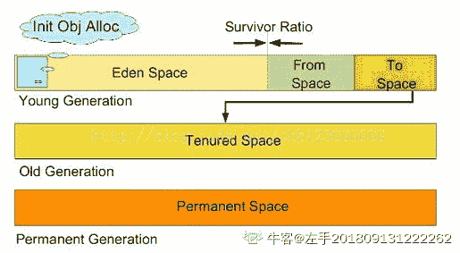

   3）栈

   每个线程执行每个方法的时候都会在栈中申请一个栈帧，每个栈帧包括局部变量区和操作数栈，用于存放此次方

法调用过程中的临时变量、参数和中间结果。

   4）本地方法栈

   用于支持 native 方法的执行，存储了每个 native 方法调用的状态

   5）方法区

   存放了要加载的类信息、静态变量、final 类型的常量、属性和方法信息。JVM 用永久代（PermanetGeneration）

来存放方法区，（在 JDK 的 HotSpot 虚拟机中，可以认为方法区就是永久代，但是在其他类型的虚拟机中，没有永久代

的概念，有关信息可以看周志明的书）可通过-XX:PermSize 和-XX:MaxPermSize 来指定最小值和最大值。

发表于 2019-12-24 20:47:42

* * *

## 24

下面程序的运行结果（）

```cpp
        List<String> aa = new ArrayList<String>();
        aa.add("F1");
        aa.add("F2");
        aa.add("F3");
        for (String temp : aa) {
            if ("F3".equals(temp)) {
                aa.remove(temp);
            }
        }

        for (String temp : aa){
             System.out.println(temp);
        }
```

正确答案: A   你的答案: 空 (错误)

```cpp
抛异常
```

```cpp
F1F2
```

```cpp
F1F2F3
```

```cpp
F1
```

本题知识点

Java 工程师 顺丰科技 Java Java 工程师 顺丰科技 2019 Java 工程师 顺丰科技 2019

讨论

[半岛。](https://www.nowcoder.com/profile/397758587)

就这么说吧，对于集合的三种遍历方式删除：**1.普通 for 循环：可以删除**        注意每次删除之后索引要--
**2.Iterator 遍历：可以删除**        不过要使用 Iterator 类中的 remove 方法，如果用 List 中的 remove 方***报错
**3.增强 for 循环 foreach：不能删除**        强制用 List 中的 remove 方***报错

发表于 2019-03-17 22:29:38

* * *

[程序猿 Go 师傅](https://www.nowcoder.com/profile/242025553)

在用 Iterator 遍历 ArrayList 的时候，如果调用 ArrayList 的 remove 方法使得 ArrayList 的大小发生了改变，那么会抛出 ConcurrentModificationException 异常。在这里 for  (String temp : aa)遍历操作就是通过 Iterator 实现的。

编辑于 2019-10-21 17:08:33

* * *

[没意思了](https://www.nowcoder.com/profile/4559796)

报错原因:如图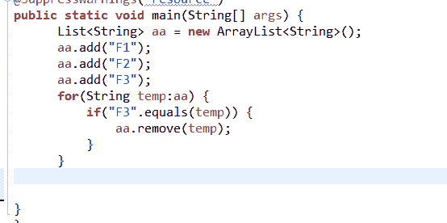
底层迭代器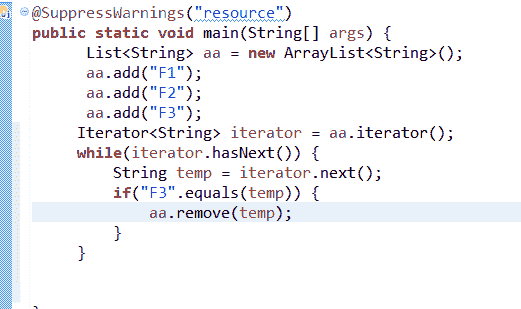
arraylist 内部实现的迭代器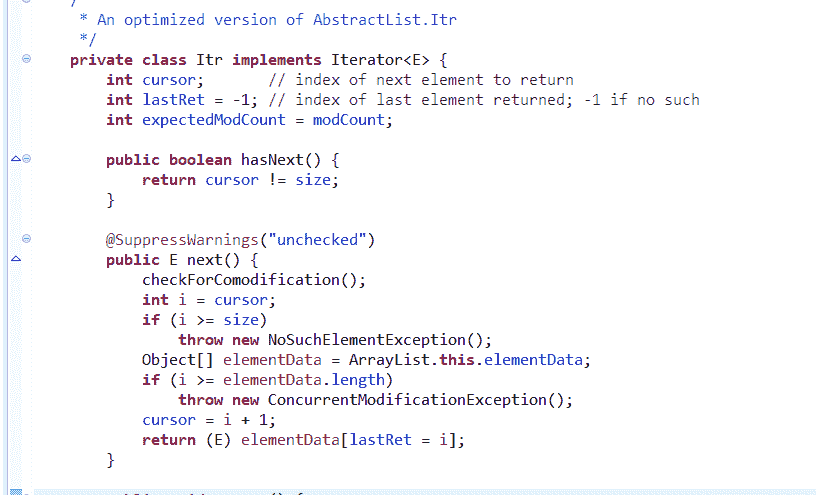
出现异常的原因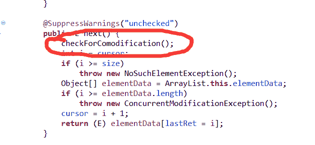
进去看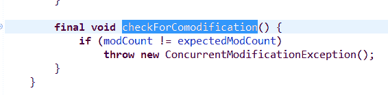
迭代器初始化的时候默认 int expectedModCount = modCount;
你在迭代的时候调用了 arraylist 的 remove()导致 modCount++而 expectedModcount 还是初始化时候的值。导致不相等走这个逻辑抛出 throw new ConcurrentModificationException();如果改成 remove("F2")不会报错因为这个方法返回 false 不走 next()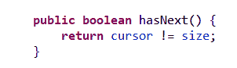
如果使用迭代器的 remove()方法可以看出有个 modCount =expectedModCount 复制过程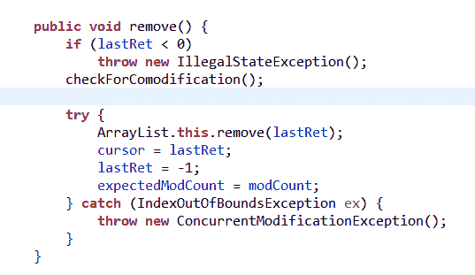
其实抛不抛异常只要看他什么情况下走 throw 逻辑就行

发表于 2019-08-13 16:08:06

* * *

## 25

下面程序运行完之后，t2 与 t3 的关系为（）

```cpp
        Object obj=new Object();
        List aList=new ArrayList();
        List bList=new LinkedList();

        long t1=System.currentTimeMillis();
        for(int i=0;i<50000;i++){
            aList.add(0,obj);
        }
        long t2=System.currentTimeMillis()-t1;

        t1=System.currentTimeMillis();
        for(int i=0;i<50000;i++){
            bList.add(0,obj);
        }
        long t3=System.currentTimeMillis()-t1; 
```

正确答案: D   你的答案: 空 (错误)

```cpp
t2
```

```cpp
t2=t3
```

```cpp
不确定
```

```cpp
t2>t3
```

本题知识点

Java 工程师 顺丰科技 Java 2019

讨论

[silencewmy](https://www.nowcoder.com/profile/4621540)

ArrayList 内部是动态数组实现，在增加空间时会复制全部数据到新的容量大一些的数组中。而 LinkedList 内部为双向链表，可以按需分配空间，扩展容量简单，因此 LinkedList 用时少。

发表于 2019-03-17 00:33:26

* * *

[越刷题越幸运](https://www.nowcoder.com/profile/47400333)

List aList=newArrayList();List bList=newLinkedList();aList.add(0,obj); //0 代表下标，obj 代表对象。每个对象都插入到下标 0 的位置。
bList.add(0,obj);
此题考察的是 ArrayList 和 LinkedList 的特征：同样是新增 5000 个对象，LinkedLIst 比 ArrayList 更快。ArrayList：增删慢，查询快。由于是数据组实现，需要连续的内存空间，如果删除数组中间的值，为了保证下标的有效性，需要将后面的数据往前移，所以删除慢。当插入 A 对象到 B 对象的前面时，需要将 B 对象和 B 对象之后的所有对象后移一位，再插入 A 对象。所以插入慢。数组的大小是固定的，如果数组满了，需要重新分配空间，new 一个新数组并 copy 旧数据之后再增加新数据，所以增加慢。因为是连续内存空间，可以通过下标查询数据，所以查询快。LInkedList：增删快，查询慢。由于是链表实现，当前节点的 next 指向下一个节点，prev 指向上一个节点，不需要连续的内存空间，所以增删快。因为不是连续内存空间，所以不能使用下标查询，只能通过 next 遍历，所以查询慢。

编辑于 2019-09-14 18:43:47

* * *

[去冰](https://www.nowcoder.com/profile/979816009)

粗心了，没注意到有 aList 和 bList。 以为两次 for 循环都是操作的 alist。 aList 是 ArrayList(add 慢)， bList 是 LinkedList（add 快）。 答案明了。

发表于 2019-03-14 16:54:29

* * *

## 26

None

正确答案: C   你的答案: 空 (错误)

```cpp
Set>与原生态类型 Set 没有区别
```

```cpp
Java 的泛型是在运行时检查是不是适配
```

```cpp
泛型信息在运行时被擦除
```

```cpp
if( ob instance of Set)
{
Set> s= ob;
}
上面这段代码不会产生 warning
```

本题知识点

Java 工程师 顺丰科技 2019

讨论

[javajs](https://www.nowcoder.com/profile/331820924)

C

发表于 2019-05-11 23:23:46

* * *

## 27

下面程序的运行结果是（）

```cpp
public class ClassA {
    static int count = 0;
    static {
        count++;
        System.out.println("A");
    }
    public ClassA() {
        System.out.println("B");
    }
}
public class ClassB {
    static {
        ClassA t2;
        System.out.println("C");
    }
    public static void main(String[] args) {
        Class c1;
        Class c2;
        Class c3;
        try {
            c1 = ClassA.class;
            c2 = Class.forName("ClassA");
            ClassA a = new ClassA();  
            c3 = a.getClass();
        } catch (ClassNotFoundException e) {
            e.printStackTrace();
            return;
        }
        if (c2 == c1&& c1 == c3) {
            System.out.println("D");
        } else {
            System.out.println("E");
        }
        System.out.println(ClassA.count);
    }
}
```

正确答案: A   你的答案: 空 (错误)

```cpp
C  A   B  D  1
```

```cpp
C  A  B  D  2
```

```cpp
A  C  B  D  2
```

```cpp
C  A  B  E  1
```

```cpp
A  C  B  E  3
```

本题知识点

Java 工程师 顺丰科技 Java Java 工程师 顺丰科技 2019 Java 工程师 顺丰科技 2019

讨论

[程序猿 Go 师傅](https://www.nowcoder.com/profile/242025553)

这道题主要考的类的加载机制：1.被标明为启动类的类（即包含 main()方法的类）要初始化，所以 ClassB 最先初始化 2.ClassB 没有父类，所以初始化自身的静态变量和静态块赋值（按照声明顺序），输出“C”3.ClassA a = new  ClassA(); 初始化 ClassA，输出“AB”4.因为类的加载信息只会在永久代里留存一份，所以 c1，c2，c3 实际上共用同一个 ClassA.class 对象，所以输出“D”5.静态块 static{}只会执行一次，所以 count=1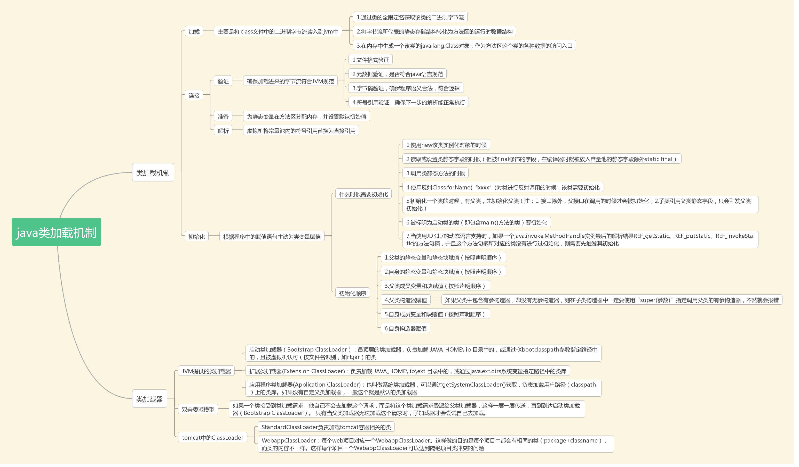 

编辑于 2019-10-21 17:08:22

* * *

[之渊](https://www.nowcoder.com/profile/662789664)

看了其他人的解析，发现他们似乎都没有认真执行过这段代码，特别是  ：  ClassA a = new ClassA(); 初始化 ClassA，输出“AB”  这个是错的。因为 在  c2 = Class.forName("ClassA"); 这时候 ClassA 类被初始化了。 这时候会执行静态代码块，输出 A，只是没有执行 构造方法。这时候 ClassA a = new ClassA(); 仅仅只是执行了 构造代码块 输出了 B 因为  类的静态代码块 只会 执行一次。 jvm 会执行静态代码段，你要记住一个概念，静态代码是和 class 绑定的，class 装载成功就表示执行了你的静态代码了。而且以后不会再走这段静态代码了。 这里同时考察了 Class.forName("ClassA") 加载和 new ClassA() 的区别

发表于 2019-07-23 10:12:53

* * *

[tuyouxian](https://www.nowcoder.com/profile/633383262)

触发类的初始化的四种情况: 1.通过 new 关键字实例化对象，读取或设置类的静态变量，调用类的静态方法， 2.通过反射方式执行以上三种行为 3.初始化子类的时候，会触发父类的初始化 4.作为程序的入口直接运行时（就是类中直接调用 main 函数） 那么题中 b 类是程序的入口（main）;分割线 (づ ●─● )づ首先对 b 进行类加载，也就是会调用静态变量或静态方法块，第一个输出 C; 分割线(づ ●─● )づ继续，补充一点:类加载只会执行一遍;那么 c1==c2==c3,三个 Class 对象指向的都是同一份内存空间; 分割线(づ ●─● )づ再补充一点:类的生命周期:加载，连接，初始化，使用，卸载;分割线(づ ●─● )づ new A（）执行时，会对 A 进行类加载，并且到达使用阶段，也就是会调用构造器，那么输出就是 AB; 分割线(づ ●─● )づ上面提到 c1==c2==c3,那么输出 C; 分割线(づ ●─● )づ上面也提到类的加载只会执行一遍，所以 count 为 1。 纯手机码，欢迎补充指正(づ ●─● )づ

编辑于 2019-07-22 09:51:34

* * *

## 28

开闭原则相关的面向对象设计原则（）

正确答案: A B C   你的答案: 空 (错误)

```cpp
里氏代换原则(Liskov Substitution Principle LSP)
```

```cpp
依赖倒转原则（Dependence Inversion Principle）
```

```cpp
接口隔离原则（Interface Segregation Principle）
```

```cpp
复用原则
```

本题知识点

Java 工程师 顺丰科技 Spring 2019

讨论

[小夥](https://www.nowcoder.com/profile/356553)

**单一职责原则**：应该有且仅有一个原因引起类的变更(一个接口或一个类只有一个原则，它就只负责一件事)
**里式替换原则**：子类型必须能替换掉它们的基类型
**依赖倒置原则**：    高层模块不应该依赖低层模块，两者都应该依赖其抽象    抽象不应该依赖细节
    细节应该依赖抽象
**接口隔离原则**：
    客户端不应该依赖它不需要的接口
    类间的依赖关系应该建立在最小的接口上
**迪米特法则**：只与直接朋友进行通信

发表于 2019-03-17 00:10:09

* * *

[秋千上的小灰狗](https://www.nowcoder.com/profile/166244097)

面向对象共有六大原则：开闭原则、单一职责原则、里式替换原则、依赖倒置原则、接口隔离原则、迪米特法则。开闭原则：开闭原则的定义是软件中的对象(类，模块，函数等)应该对于扩展是开放的，但是对于修改是关闭的。单一职责原则：就一个类而言，应该仅有一个引起他变化的原因。也就是说一个类应该只负责一件事情。里式替换原则：“子类能够替换基类，否则不应当设计为其子类。”也就是说，子类只能去扩展基类，而不是隐藏或覆盖基类。依赖倒置原则：模块间的依赖是通过抽象来发生的，实现类之间不发生直接的依赖关系，其依赖关系是通过接口是来实现的。 接口隔离原则：客户端不应该依赖他不需要的接口。 迪米特法则：一个对象应该对其他对象保持最小的了解。 

发表于 2019-09-04 11:39:21

* * *

[垃圾程序员](https://www.nowcoder.com/profile/426323188)

开闭原则是一个非常基础的原则，其他的五个原则都是开闭原则的具体，也就是说其他的五个原则是指导设计的工具和方法，而开闭原则才是它们的精神领袖。所以这么说吧，只要我们遵守好其他的五大原则，那么我们设计的软件自然就遵守了开闭原则，现在我们再好好回顾一下其他五大原则： 参考链接:https://blog.csdn.net/king123456man/article/details/81626086

发表于 2019-08-24 23:34:58

* * *

## 29

AOP 技术优势在于（）

正确答案: B   你的答案: 空 (错误)

```cpp
通过接口、抽象及组合增强对象内部能力
```

```cpp
将核心关注点与横切关注点完全隔离
```

```cpp
有利增强业务安全性
```

```cpp
让一些公共逻辑更好的分布在对象核心逻辑中
```

本题知识点

Java 工程师 顺丰科技 Spring 2019

讨论

[zwxbest](https://www.nowcoder.com/profile/737552053)

```cpp
让一些公共逻辑更好的分布在对象核心逻辑中
```

发表于 2019-07-16 01:10:10

* * *

[贝先生.](https://www.nowcoder.com/profile/1903959)

Aop:面相切面编程，与传统 oop 相比，传统 oop 编程是自顶向下的编写主业务逻辑，但往往需要参杂着一些与主业务逻辑无关或关系不大的逻辑，这就产生了横切性问题。Aop 能很好的隔离和管理这些与主业务逻辑关联不大的业务代码，使得代码的可读性和可维护性大大提高。

发表于 2019-08-04 13:22:13

* * *

[半岛。](https://www.nowcoder.com/profile/397758587)

记下就行了

发表于 2019-03-17 22:38:47

* * *

## 30

有以下结果表 tt_tmp，数据如下
gt,result
-----------------------
2018-05-19 S
2018-05-19 S
2018-05-19 F
2018-05-19 F
2018-05-20 S
2018-05-20 F
2018-05-20 F

需要统计以下结果
gt  success failure
2018-05-19 2 2
2018-05-20 1 2

sql 语句怎么写（）

正确答案: A B D   你的答案: 空 (错误)

```cpp
select gt, sum(case when result='S' then 1 else 0 end)'success',
sum(case when result='F' then 1 else 0 end)'failure' from tt_tmp group by gt
```

```cpp
select s.gt,s.success,f.failure from
(select gt,count(*) as 'success' from tt_tmp where result='S'group by gt) s inner join

(select gt,count(*) as 'failure' from tt_tmp where result='F'group by gt) f

 on s.gt=f.gt
```

```cpp
select gt, sum(case when result='F' then 1 else 0 end)'success',
sum(case when result='S' then 1 else 0 end)'failure' from tt_tmp group by gt
```

```cpp
select s.gt,s.success,f.failure from
(select gt,count(*) as 'success' from tt_tmp where result='S'group by gt) s,
(select gt,count(*) as 'failure' from tt_tmp where result='F'group by gt) f where  s.gt=f.gt
```

本题知识点

Java 工程师 顺丰科技 数据库 2019

讨论

[Fea](https://www.nowcoder.com/profile/616604198)

答案 B 是不是写错了，应该是 select s.gt,s.success,f.failure from
(select gt,count(*) as 'success' from tt_tmp where result='S'group by gt) s inner join
(select gt,count(*) as 'failure' from tt_tmp where result='F'group by gt) f
on s.gt=f.gt;

发表于 2019-09-25 16:40:07

* * *

[闲鱼总算翻了身](https://www.nowcoder.com/profile/909589300)

D 是什么意思

发表于 2021-07-21 17:01:50

* * *

[Luda 小卤蛋](https://www.nowcoder.com/profile/421528719)

fon 拼写这个错误，我们要忽略吗？

发表于 2019-03-18 20:28:40

* * *

## 31

以下程序输出（）

```cpp
public static void main(String[] args) {
   int num = 2;
   switch (num) {
   case 1:
        ++num;
   case 2:
        ++num;
   case 3:
        ++num;
   default:
        ++num;
   break;
   }
   System.out.println(num);
 }
}
```

正确答案: D   你的答案: 空 (错误)

```cpp
2
```

```cpp
3
```

```cpp
4
```

```cpp
5
```

本题知识点

Java 工程师 顺丰科技 Java 2019

讨论

[半岛。](https://www.nowcoder.com/profile/397758587)

记住一点，遇到 break 才跳出

发表于 2019-03-17 22:41:13

* * *

[冷飒](https://www.nowcoder.com/profile/1766220)

匹配到 case 2 num->3 但是其后没有 break,所以继续执行 case 3 num->4、default  num->5 而后结束,所以答案为 5 注意细节！

发表于 2019-03-12 21:17:53

* * *

[JasonCeng](https://www.nowcoder.com/profile/7985527)

本题考查了 switch 语句中的“***穿透***”概念。

发表于 2019-03-21 11:36:07

* * *

## 32

分析以下代码，说法正确的是（）

```cpp
 public static void main(String[] args) {
     System.out.println(val());
 }

 public static int val() {
     int num = 5;
     try {
     num = num / 0;
 } catch (Exception e) {
     num = 10;
 } finally {
     num = 15;
 }
 return num;
 }
```

正确答案: D   你的答案: 空 (错误)

```cpp
运行时报错
```

```cpp
程序正常运行，输出值为 5
```

```cpp
程序正常运行，输出值为 10
```

```cpp
程序正常运行，输出值为 15
```

本题知识点

Java 工程师 顺丰科技 Java 2019

讨论

[小飞龙 007](https://www.nowcoder.com/profile/941991238)

情况 1： try{} catch(){}finally{} return;
显然程序按顺序执行。

情况 2: try{ return; }catch(){} finally{} return;

先执行 try 块中 return 语句（包括 return 语句中的表达式运算），但不返回；
执行 finally 语句中全部代码
最后执行 try 中 return 返回
finally 块之后的语句 return 不执行，因为程序在 try 中已经 return。
情况 3: try{ } catch(){return;} finally{} return;
1、程序先执行 try，如果遇到异常执行 catch 块，

有异常：
执行 catch 中 return 语句，但不返回
执行 finally 语句中全部代码，
最后执行 catch 块中 return 返回。 finally 块后的 return 语句不再执行。
无异常：执行完 try 再 finally 再 return…
情况 4: try{ return; }catch(){} finally{return;}

执行 try 块 return 语句（包括 return 语句中的表达式运算），但不返回；
再执行 finally 块，
执行 finally 块，有 return，从这里返回。
此时 finally 块的 return 值，就是代码执行完后的值

情况 5: try{} catch(){return;}finally{return;}

程序执行 catch 块中 return 语句（包括 return 语句中的表达式运算），但不返回；
再执行 finally 块，
执行 finally 块，有 return，从这里返回。
情况 6: try{ return;}catch(){return;} finally{return;}
1、程序执行 try 块中 return 语句（包括 return 语句中的表达式运算），但不返回；

有异常：

执行 catch 块中 return 语句（包括 return 语句中的表达式运算），但不返回；
再执行 finally 块
执行 finally 块，有 return，从这里返回。
无异常：

再执行 finally 块

执行 finally 块，有 return，从这里返回。。-------------------------------------------------------------------------------------------------------原文链接[`blog.csdn.net/xx326664162/article/details/50266995`](https://blog.csdn.net/xx326664162/article/details/50266995)

发表于 2019-09-18 10:22:15

* * *

[崔思哲](https://www.nowcoder.com/profile/150907953)

针对不同情况，我标记运算过程，至于理论，评论小飞龙说的很详细了，我就不凑热闹了。情况 1: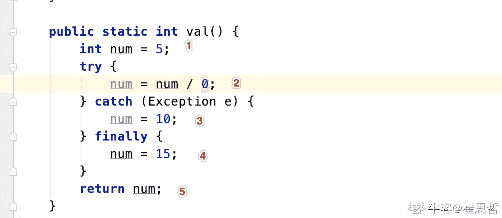
情况 2：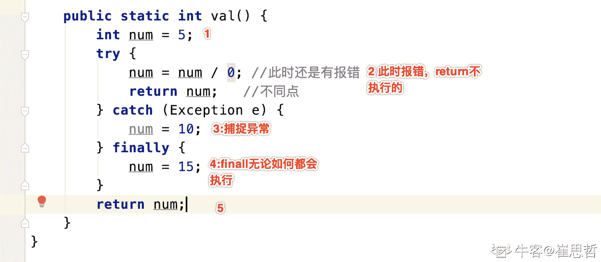
情况 3: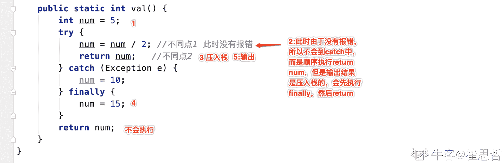
基本上大家讨论的都是这三种情况之一，应该是够了.如果有问题欢迎讨论。

发表于 2020-03-26 17:41:35

* * *

[fatcat22](https://www.nowcoder.com/profile/146716150)

无论有无异常，finally 块中的代码一定会执行且在最后执行，因此 num 输出为 15

发表于 2019-08-11 18:26:25

* * *

## 33

以下哪些内存区域属于 JVM 规范？（　　）

正确答案: A D E   你的答案: 空 (错误)

```cpp
方法区
```

```cpp
实例变量
```

```cpp
静态变量
```

```cpp
程序计数器
```

```cpp
虚拟机栈
```

本题知识点

Java 工程师 顺丰科技 Java 2019

讨论

[程序猿 Go 师傅](https://www.nowcoder.com/profile/242025553)

jvm 规范如图所示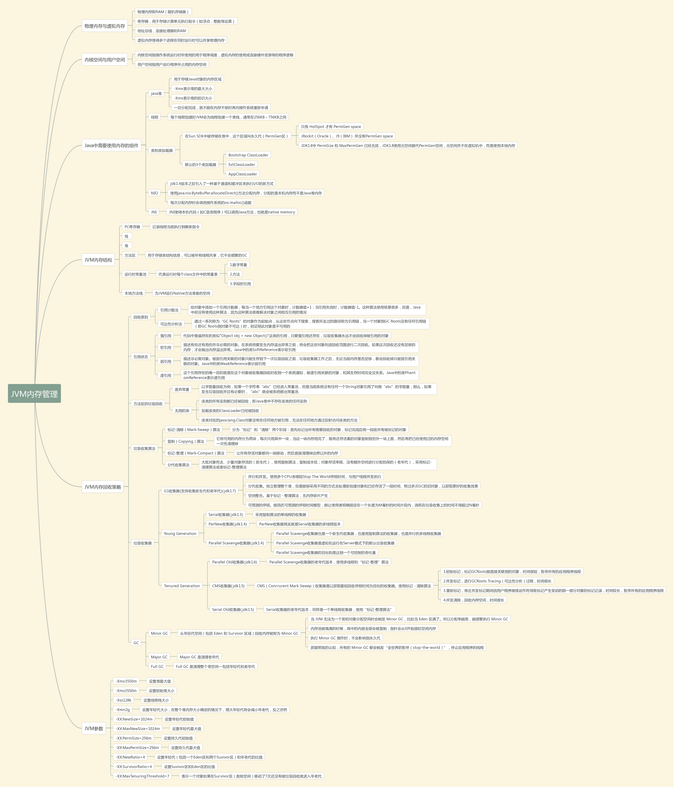

编辑于 2019-10-21 17:08:15

* * *

[项小象](https://www.nowcoder.com/profile/688772256)

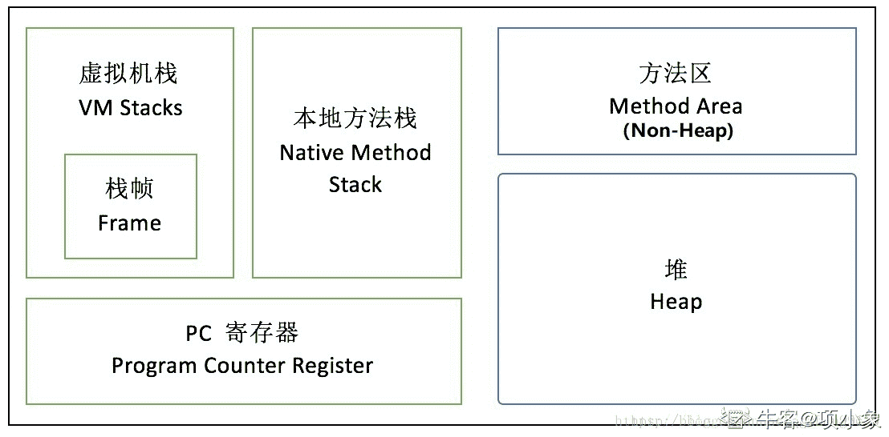

发表于 2020-07-06 15:06:22

* * *

[jianyu](https://www.nowcoder.com/profile/8330860)

JVM 内存区：程序计数器、虚拟机栈、本地方法栈、堆、方法区（包括常量池）。不属于 JVM 内存区：直接内存（Direct Memory），用户 I/O 操作

发表于 2019-03-16 09:24:40

* * *

## 34

下面的选项中哪些属于工厂模式()

正确答案: B C D   你的答案: 空 (错误)

```cpp
静态工厂模式
```

```cpp
工厂方法模式
```

```cpp
抽象工厂模式
```

```cpp
简单工厂模式
```

本题知识点

Java 工程师 顺丰科技 设计模式 2019

讨论

[jianyu](https://www.nowcoder.com/profile/8330860)

工厂模式可理解为：当客户获取产品时，工厂模式作为获取产品的接口。1、简单工厂模式：由接口直接负责获取产品 2、工厂方法模式：客户必须清楚地指出想获取哪种产品；由接口的子类负责获取产品 3、抽象工厂模式：客户不知道其想获取哪种产品；由接口中判断调用哪个子类，通过子类获取产品。

编辑于 2019-03-16 09:46:52

* * *

[king 丶友](https://www.nowcoder.com/profile/974774847)

工厂模式:简单工厂模式:简单工厂模式的实质是由一个工厂类根据传入的参数，动态决定应该创建哪一个产品类（这些产品类继承自一个父类或接口）的实例。通俗来说就是一个工厂将所有产品逻辑都涵括了工厂方法模式:将各个产品细分，一个工厂主要负责一个产品的逻辑抽象工厂模式:针对各个产品的产品族又进一步细分了而静态工厂模式好像是简单工厂模式的其中一种注: 简单工厂模式不是二十三种设计模式中的一种

发表于 2021-05-10 08:59:21

* * *

[大三想开始工作了](https://www.nowcoder.com/profile/443077457)

简单工厂模式中，如果返回新建的一个对象的引用的方法是静态的，就称之为静态工厂。

发表于 2019-03-23 21:11:51

* * *

## 35

关系模式如 R=({A,B,C,D,E},{AB→CE,E→AB,C→D})属于第几范式（）

正确答案: B   你的答案: 空 (错误)

```cpp
1NF
```

```cpp
2NF
```

```cpp
3NF
```

```cpp
4NF
```

本题知识点

Java 工程师 顺丰科技 数据库 2019

讨论

[jianyu](https://www.nowcoder.com/profile/8330860)

表不可再分，属于 1NF；E——AB，又 AB——CE，所以 E——C；又 c——D，所以 E——D；得 E 决定 AB、C、D。一个表只有一个列为主键==》2NF

发表于 2019-03-16 09:50:51

* * *

[找工作拿 offer](https://www.nowcoder.com/profile/58345362)

第一范式：对于表中的每一行，必须且仅仅有唯一的行值.在一行中的每一列仅有唯一的值并且具有原子性. 第二范式要求非主键列是主键的子集，非主键列活动必须完全依赖整个主键。主键必须有唯一性的元素,一个主键可以由一个或更多的组成唯一值的列组成。一旦创建，主键无法改变，外键关联一个表的主键。主外键关联意味着一对多的关系. 第三范式要求非主键列互不依赖. 第四范式禁止主键列和非主键列一对多关系不受约束 第五范式将表分割成尽可能小的块，为了排除在表中所有的冗余.

发表于 2019-07-30 00:54:33

* * *

[大三想开始工作了](https://www.nowcoder.com/profile/443077457)

E 可以推出全部，所以它是主键，第三范式要求消除传递依赖，这里 E->AB，AB->CE，E 又可以推出 CE

发表于 2019-03-23 21:27:17

* * *

## 36

已知 tm_employee 表中具有默认约束 df_adress，删除该约束的语句为（）

正确答案: A   你的答案: 空 (错误)

```cpp
alter talbe tm_employee drop constraint df_adress
```

```cpp
alter talbe tm_employee remove constraint df_adress
```

```cpp
alter talbe tm_employee delete constraint df_adress
```

```cpp
remove constraint df_adress from talbe tm_employee
```

本题知识点

Java 工程师 顺丰科技 数据库 2019

讨论

[Ajax96](https://www.nowcoder.com/profile/771349203)

（来自百度）数据库中删除约束的方法：
1、sql server 中删除约束的语句是：
alter table 表名 drop constraint 约束名
sp_helpconstraint 表名 找到数据表中的所有列的约束
2、oracle 中删除约束的语句：
先找到表的约束名称，执行：
select * from user_constraints； 其中 CONSTRAINT_NAME 为表的约束名称
然后删除约束：
alter table 表名 drop constraint 约束名 cascade;
3、mysql 中删除约束的语句是：
1）删除主键约束：
alter table 表名 drop primary key;
2）删除外键约束：alter table 表名 drop foreign key 外键（区分大小写）;

发表于 2019-03-19 14:59:41

* * *

[桐梓林梁朝伟 666](https://www.nowcoder.com/profile/9917802)

不管是 SQL sever oracle mysql 他们删除主键约束的关键字均为 drop

发表于 2021-07-09 08:49:35

* * *

[泡泡小姐姐](https://www.nowcoder.com/profile/857964663)

delete 是数据 drop 是对象

发表于 2021-09-28 14:54:59

* * *

## 37

关于数据库三级模式结构说法正确的是()

正确答案: B C   你的答案: 空 (错误)

```cpp
三级模式包括外模式，内模式，物理模式
```

```cpp
内模式对应的是物理级
```

```cpp
外模式是某个或某几个用户所看到的数据库的数据视图，是与某一应用有关的数据的逻辑表示
```

```cpp
物理模式又称存储模式，对应于物理级
```

本题知识点

Java 工程师 顺丰科技 数据库 2019

讨论

[今天 yy 收到 offer 了！](https://www.nowcoder.com/profile/633565650)

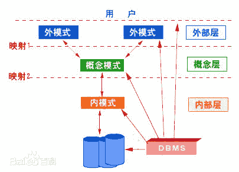

①模式（schema）：

       模式也称逻辑模式，是数据库中全体数据的逻辑结构和特征的描述，是所有用户的公共数据视图。

②外模式（external schema）：

       外模式也称子模式（subschema）或用户模式，它是数据库用固话（包括应用程序员和最终用户）能够看见和使用的局部数据的逻辑结构和特征的描述，是数据库用户的数据视图，是与某一应用有关的数据的逻辑表示。

③内模式（internal schema）：

       内模式也称存储模式（storage schema），一个数据库只有一个内模式。它是数据物理存储和存储方式的描述，是数据在数据库内部的组织方式。

发表于 2019-03-13 00:15:02

* * *

[宇轩-BKGER](https://www.nowcoder.com/profile/2802590)

D 哪里错了

发表于 2019-03-17 21:05:08

* * *

[┄✄━━━━](https://www.nowcoder.com/profile/392783109)

内模式又称存储模式，但不叫物理模式

发表于 2021-05-11 18:52:11

* * ********