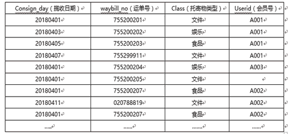
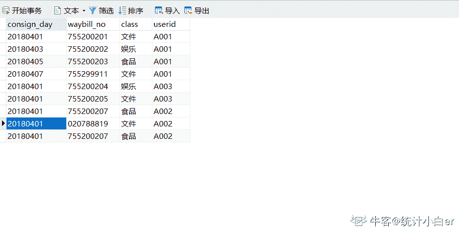
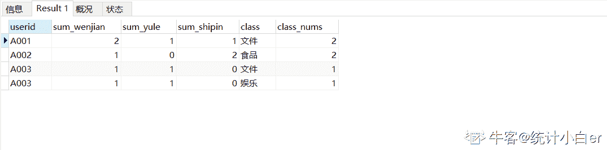
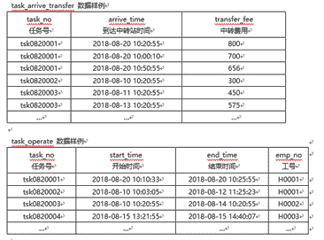
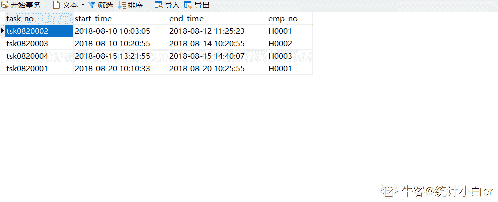
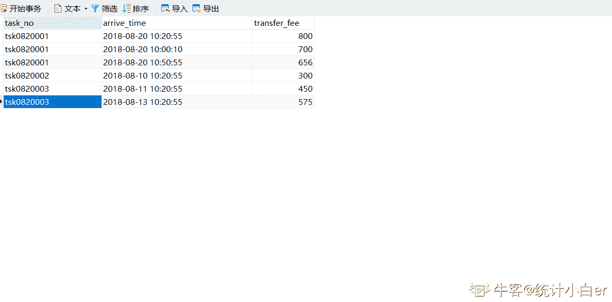
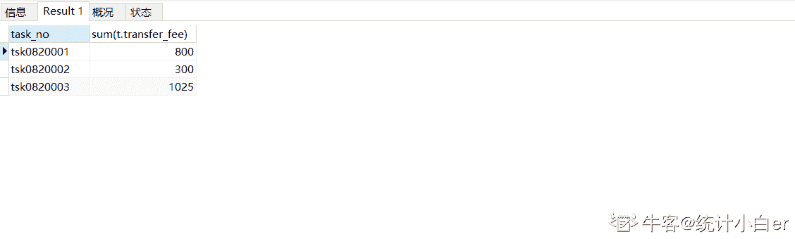

# 顺丰科技 2019 秋招大数据挖掘与分析工程师客观题合集

## 1

二叉排序树的链表节点定义如下：

```cpp
typedef struct BiTnode{
    int key_value;
    struct BiTnode *L,*R;/*节点的左、右树指针*/
}
```

请补充完整查找键值 key 的函数。

```cpp
BSTree lookup_key(BSTree root,int key)
{
    if() return NULL;
    else 
        if(key == root->key_value)
            return root;
        else if(key > root->key_value)
            return (1);
        else
            return (2);
}
```

正确答案: D   你的答案: 空 (错误)

```cpp
(1)lookup_key(root->R,key)
(2)lookup_key(NULL,key)
```

```cpp
(1)lookup_key(root->R,root.key_value)
(2)lookup_key(root->L,root.key_value)
```

```cpp
(1)lookup_key(root->L,key)
(2)lookup_key(root->R,key)
```

```cpp
(1)lookup_key(root->R,key)
(2)lookup_key(root->L,key)
```

本题知识点

顺丰科技 树 2019

讨论

[can~can~can](https://www.nowcoder.com/profile/46803557)

关键字 key 比根值大，则去与右子树对应的值比较；当关键字 key 值比根值小，则去与左之树对应的值比较。因为二叉排序树的值大小是，左子树<根<右子树

发表于 2019-03-14 09:38:12

* * *

[跳跳糖的 QQ 糖](https://www.nowcoder.com/profile/622864262)

二叉排序数的（递归）定义：1、若左子树非空，则左子树所有节点的值均小于它的根节点；2、若右子树非空，则右子树所有节点的值均大于于它的根节点；3、左右子树也分别为二叉排序树。

发表于 2019-03-12 20:33:38

* * *

[学术废物](https://www.nowcoder.com/profile/6473476)

根右左

发表于 2022-03-19 12:08:01

* * *

## 2

对序列（12,18,22,38,39,49,79,89）进行排序，最不适合的算法是（）

正确答案: B   你的答案: 空 (错误)

```cpp
冒泡排序
```

```cpp
快速排序
```

```cpp
归并排序
```

```cpp
插入排序
```

本题知识点

Java 工程师 安卓工程师 顺丰科技 排序 *信息技术岗 2019 iOS 工程师 C++工程师 PHP 工程师 算法工程师 区块链* *讨论

[仰望星空 73](https://www.nowcoder.com/profile/3491497)

快排不适合对基本有序的数据集合进行排序

发表于 2019-03-14 19:42:12

* * *

[Sugar201903222055238](https://www.nowcoder.com/profile/821678589)

快排序越是无序效率越高。基本有序是 O(n2),归并是 nlogn，直接是 n

发表于 2019-03-24 21:38:02

* * *

[叶建文](https://www.nowcoder.com/profile/58213545)

我的理解是，这里冒泡排序和快速排序都是 O(n²)，之所以选快排而不是冒泡，可能是因为常数因子的问题，快排相对复杂，因此直观理解它的常数因子就更大。

发表于 2019-03-26 23:41:26

* * *

## 3

调用函数时，入参及返回地址使用了（）

正确答案: D   你的答案: 空 (错误)

```cpp
队列
```

```cpp
多维数组
```

```cpp
顺序表
```

```cpp
栈
```

本题知识点

Java 工程师 安卓工程师 顺丰科技 栈 *信息技术岗 2019 iOS 工程师 C++工程师 PHP 工程师 算法工程师 区块链* *讨论

[仰望星空 73](https://www.nowcoder.com/profile/3491497)

在函数调用过程中形成嵌套时，则应使最后被调用的函数最先返回，后进先出，栈。

编辑于 2019-03-14 19:45:37

* * *

[低头前行](https://www.nowcoder.com/profile/544455681)

调用方法时，在虚拟机栈创建栈帧，栈帧中包括局部变量表，操作数栈，动态链接，返回地址

发表于 2020-08-27 21:10:39

* * *

[摇井](https://www.nowcoder.com/profile/94064650)

突然想起了递归 不正是栈吗

发表于 2019-03-25 22:43:44

* * *

## 4

设有递归算法如下，最终打印结果是（）

```cpp
#include<stdio.h>
 int foo(int a ,int b)
 {
     if (b == 0) return 0;
     if (b % 2 == 0) return foo(a+a,b/2);
     return foo(a+a,b/2)+a;    
 }
 int main()
 { 
   printf("%d", foo(1,3));
   return 0;
 }

```

正确答案: A   你的答案: 空 (错误)

```cpp
3
```

```cpp
4
```

```cpp
5
```

```cpp
6
```

本题知识点

递归

讨论

[ＭＭＱ](https://www.nowcoder.com/profile/217762715)

计算 foo(1,3)：此时 a=1,b=3;跳过两个 if 语句进入 return foo(1+1,3/2)+1,即 foo(2,1)+1；计算 foo(2,1)：同样，跳过两个 if 语句进入 return foo(2+2,1/2)+2,即 foo(4,0)+2;计算 foo(4,0):进入第一个 if 语句，return 0；逐层返回，得 foo(2,1)=0+2=2;再返回上一层，得 foo(1,3)=2+1=3；返回结果，foo(1,3)=3;

编辑于 2019-03-12 20:50:37

* * *

[路人癸 000](https://www.nowcoder.com/profile/528623642)

编译都过不了

发表于 2019-04-02 17:00:32

* * *

[许愿建行拿到 offer](https://www.nowcoder.com/profile/217268997)

注意 b 是整数,那么 3/2 等于 1

发表于 2019-11-19 21:30:04

* * *

## 5

请指出堆排序、选择排序、冒泡排序、快速排序的平均时间复杂度（）

正确答案: A   你的答案: 空 (错误)

```cpp
nlogn、n²、n²、nlogn
```

```cpp
n²、n²、n²、nlogn
```

```cpp
nlogn、nlogn、n²、nlogn
```

```cpp
nlogn、n²、n²、n²
```

本题知识点

排序 *讨论

[程序猿 Go 师傅](https://www.nowcoder.com/profile/242025553)


编辑于 2019-10-21 17:08:55

* * *

[theWeak](https://www.nowcoder.com/profile/829551324)

想起了马士兵老师的做的（有毒）的词选炮插快归堆希统计姬 N 方 N 老 N 一三对 N 加 KN 乘 K 不稳稳稳不稳稳不稳不稳稳稳稳🤣

发表于 2019-03-20 21:06:49

* * *

[horizon201809151642286](https://www.nowcoder.com/profile/607362852)

记住：  冒泡和选择    ： n²             快速和堆排序：nlogn

发表于 2019-03-19 15:38:13

* * *

## 6

What is Static Method in Java（）

正确答案: A B C   你的答案: 空 (错误)

```cpp
It is a method which belongs to the class and not to the object(instance)
```

```cpp
A static method can access only static data. It can not access non-static data (instance variables)
```

```cpp
A static method can call only other static methods and can not call a non-static method from it.
```

```cpp
A static method can not be accessed directly by the class name and doesn’t need any object
```

本题知识点

Java 工程师 安卓工程师 顺丰科技 Java 信息技术岗 2019 iOS 工程师 C++工程师 PHP 工程师 算法工程师 区块链 运维工程师

讨论

[coderofUESTC](https://www.nowcoder.com/profile/817336)

其实这题并不严谨，不管实例成员还是实例方法，都可以在静态方法里实例化一个对象再去调用

发表于 2019-07-06 18:12:28

* * *

[pitt1997](https://www.nowcoder.com/profile/211637886)

A：静态方法是一个属于类而不属于对象(实例)的方法。（√）B：静态方法只能访问静态数据。无法访问非静态数据(实例变量)。（√）C：静态方法只能调用其他静态方法，不能从中调用非静态方法。（√）D：静态方法不能通过类名直接访问，也不需要任何对象。（×） 静态方法可以直接用类名访问。

发表于 2019-04-07 15:40:46

* * *

[EruIluvatar](https://www.nowcoder.com/profile/6090755)

我是不会这道题吗，我是没看懂英文😃

发表于 2020-03-02 18:04:40

* * *

## 7

```cpp
public class CharToString {
 public static void main(String[] args)
 {
  char myChar = 'g';
  String myStr = Character.toString(myChar);
  System.out.println("String is: "+myStr);
  myStr = String.valueOf(myChar);
  System.out.println("String is: "+myStr);
 }
}
```

此代码片段输出正确的值是（）

正确答案: A   你的答案: 空 (错误)

```cpp
String is: g
String is: g
```

```cpp
String is: 103
String is: g
```

```cpp
String is: g
String is: 103
```

```cpp
String is: 103
String is: 103
```

本题知识点

Java 工程师 安卓工程师 顺丰科技 信息技术岗 顺丰科技 2019 iOS 工程师 顺丰科技 2019 Java 工程师 顺丰科技 2019 Java 工程师 顺丰科技 2019 Java 工程师 C++工程师 PHP 工程师 顺丰科技 2019 算法工程师 顺丰科技 2019 区块链 顺丰科技 2019 算法工程师 顺丰科技 2019 运维工程师 顺丰科技 2019 安卓工程师 顺丰科技 2019

讨论

[AppleJack](https://www.nowcoder.com/profile/130490159)

```cpp
public static String valueOf(char c) { char data[] = {c}; return new String(data, true);
}
```

直接查看源码，这里相当于新建了一个 String 类返回，那么显然选 A

发表于 2019-03-15 15:42:27

* * *

[我是如此相信](https://www.nowcoder.com/profile/7988004)

Character 类的方法如下：

```cpp
public static String toString(char c) {
    return String.valueOf(c);
}
```

编辑于 2019-03-25 09:03:31

* * *

[小强开学前](https://www.nowcoder.com/profile/4208515)

粗心看成了

```cpp
Integer.valueOf() 
```

发表于 2019-03-20 14:48:21

* * *

## 8

一个空栈，如果有顺序输入序列：a1，a2，a3...an（个数大于 3），而且输出第一个元素为 a(n-1), 那么所有元素都出栈后，（）

正确答案: D   你的答案: 空 (错误)

```cpp
输出的最后元素一定为 an
```

```cpp
输出的最后元素一定为 a1
```

```cpp
不能确定元素 a1 ~ (an-2) 的输出顺序
```

```cpp
a(n-2) 一定比 a(n-3) 先出
```

本题知识点

顺丰科技 栈 *2019 C++工程师* *讨论

[horizon201809151642286](https://www.nowcoder.com/profile/607362852)

这道题，我最开始理解错误：根据这道题的题意，大概应该这样来理解，a1~an 必须是按顺序入栈的。但是他最后说第一个出栈的是 an-1,由这里可以推测，a1-an-1 都是顺序入栈了，至于 an，他可以在 a1~an-1 任意一个元素出栈的过程入栈的，所以 an 输出的顺序不能确定，但是可以确定已经入栈的元素的，他们的出栈的先后顺序

发表于 2019-03-19 15:52:19

* * *

[赵子贺](https://www.nowcoder.com/profile/6118530)

既然 an-1 先出栈，说明 an-2, an-3 已经入栈并且还未出栈，所以 D 肯定是对的 B 的话 an 始终不进栈，a1~an-2 都出栈了以后再进栈，这时候弹出的是 an 为最后一个

发表于 2019-03-12 21:17:21

* * *

[喝杯酒吧](https://www.nowcoder.com/profile/4870419)

我刚开始选择了 B：因为我觉得 a1-an-2 都已经顺序入栈了，a1 就一定会最后出栈。但我忘记了还有一个 an，当 a1 出栈后 an 可以再进栈，那么最后一个出栈的将是 an

发表于 2019-03-22 12:08:58

* * *

## 9

利用栈完成数制转换，将十进制的 169 转换为八进制，出栈序列为（）

正确答案: A   你的答案: 空 (错误)

```cpp
251
```

```cpp
521
```

```cpp
215
```

```cpp
152
```

本题知识点

Java 工程师 安卓工程师 顺丰科技 栈 *信息技术岗 2019 iOS 工程师 C++工程师 PHP 工程师 算法工程师 区块链 运维工程师* *讨论

[AppleJack](https://www.nowcoder.com/profile/130490159)

169/8 = 21 余 1  21/8 = 2 余 5  2/8 = 0 余 2 余数倒过来 251 

发表于 2019-03-15 15:48:44

* * *

[Fourousky](https://www.nowcoder.com/profile/1506987)

其实就是直接转换就完事了，转换的原理就是用堆栈实现的

发表于 2019-03-17 15:27:57

* * *

[我爱打酱油](https://www.nowcoder.com/profile/283898704)

169 转化 8 进制：169=2*8²+5*8¹+1*8⁰，栈是先进后出，那么出来的数则为 251

发表于 2019-03-14 00:58:06

* * *

## 10

主机 IP 为 200.15.13.13/23,其子网掩码是（）

正确答案: D   你的答案: 空 (错误)

```cpp
255.255.249.0
```

```cpp
255.255.2410
```

```cpp
255.255.253.0
```

```cpp
255.255.254.0
```

本题知识点

Java 工程师 安卓工程师 顺丰科技 网络基础 信息技术岗 2019 iOS 工程师 C++工程师 PHP 工程师 算法工程师 区块链 运维工程师

讨论

[youcoward](https://www.nowcoder.com/profile/998912528)

/23 的意思是前 23 位是 1，即最后（4*8-23）=9 位是 0，所以最后 16 位是 11111110 00000000，可知是 255.255.254.0

发表于 2019-03-13 19:50:28

* * *

[仰望星空 73](https://www.nowcoder.com/profile/3491497)

掩码长度为 23，也就是 11111111 11111111 11111110 00000000

发表于 2019-03-14 19:55:57

* * *

[菜🐔也要有梦](https://www.nowcoder.com/profile/5514240)

ip 地址由网络号 + 主机号组成。划分子网后为 网络号+ 子网号 + 主机号子网掩码用于掩盖网络号和子网号。1 对应网络号和子网号，0 对应主机号

发表于 2019-08-08 13:03:02

* * *

## 11

总部给某分公司分配的网络地址是 172.16.2.0/24,该分公司有三个部门，每个部门计算机不多于 30 台,在网络配置时，进行子网划分，可以使用的子网掩码是（）

正确答案: B C   你的答案: 空 (错误)

```cpp
255.255.255.128
```

```cpp
255.255.255.192
```

```cpp
255.255.255.224
```

```cpp
255.255.255.240
```

本题知识点

Java 工程师 顺丰科技 网络基础 信息技术岗 2019

讨论

[杯小年](https://www.nowcoder.com/profile/5414042)

1.分公司分配的网络地址是 172.16.2.0/24，子网掩码就是 11111111.11111111.11111111.00000000,（24 个 1）；2.分公司 3 个部门，那么至少用 2 位才能分配 3 个以上（00,01,10,11）；3.那么分部的子网掩码就要大于等于 11111111.11111111.11111111.11000000（192）了；4.又由于每个部门电脑不多于 30 台，那么至少也要给人家留出 30 台的主机地址，所以子网掩码不能是 11111111.11111111.11111111.11110000（240），因为只留出 4 位不够表示 30 台主机。

编辑于 2019-04-01 09:04:52

* * *

[半岛。](https://www.nowcoder.com/profile/397758587)

前面两位说的比较清楚了，简单补充一下 1.分公司的网络地址是 172.16.2.0/24，子网掩码长度就是 24 位 11111111.11111111.11111111.00000000（这个就不要问为什么了）；2.分公司 3 个部门，那么就用第 25 位和第 26 位来区分三个部门，11111111.11111111.11111111.**00**000000（00~11），直接排除 A；3.那么各个部门用来区分自己的子网掩码只剩下最后 6 位（27~32 位）来表示了；4.若用 255.255.255.192，最后 8 位是 11000000，只能表示 11000000~11111111 除去广播地址一共 62 台
5.若用 255.255.255.224，最后 8 位是 11100000，只能表示 11100000~11111111 除去广播地址一共 30 台
6.若用 255.255.255.240，最后 8 位是 11110000，只能表示 11110000~11111111 除去广播地址一共 14 台

发表于 2019-03-17 11:22:39

* * *

[大三想开始工作了](https://www.nowcoder.com/profile/443077457)

172.16.2.0/24 为 B 类地址，所以子网掩码肯定是 255.255 开头，因为该地址有 24 为的网络号，也就是剩下的子网掩码是：11111111.00000000，又因为有三个部门，留下两位进行表示，且这两位最大为 11，所以有 11111111.11000000（255.192），又因为 30 的二进制至少用 5 位来表示，4 位（1111）的最大值才 15,5 位的最大值 31，所以只留下 4 位时为 11111111.11110000,（255.240），所以为大于等于 192 小于 240.

发表于 2019-03-23 19:59:11

* * *

## 12

以下叙述中，不正确的有（ ）

正确答案: B D   你的答案: 空 (错误)

```cpp
单元测试对源程序中每一个程序单元进行测试，检查各个模块是否正确实现规定的功能，从而发现模块在编码中或算法中的错误。该阶段涉及编码和详细设计文档。
```

```cpp
集成测试是基于软件需求说明书的黑盒测试，是对已经集成好的软件系统进行彻底的测试，以验证软件系统的正确性和性能等满足其规约所指定的要求，检查软件的行为和输出是否正确
```

```cpp
确认测试主要是检查已实现的软件是否满足需求规格说明书中确定了的各种需求。
```

```cpp
系统测试的主要目的是检查软件单位之间的接口是否正确，主要是针对程序内部结构进行测试，特别是对程序之间的接口进行测试。
```

本题知识点

Java 工程师 安卓工程师 顺丰科技 软件测试 信息技术岗 2019 iOS 工程师 C++工程师 PHP 工程师 算法工程师 区块链 运维工程师

讨论

[程序猿 Go 师傅](https://www.nowcoder.com/profile/242025553)

B：

```cpp
系统测试是基于软件需求说明书的黑盒测试，是对已经集成好的软件系统进行彻底的测试，以验证软件系统的正确性和性能等满足其规约所指定的要求，检查软件的行为和输出是否正确

```

D：

```cpp
集成测试的主要目的是检查软件单位之间的接口是否正确，主要是针对程序内部结构进行测试，特别是对程序之间的接口进行测试。
```

BD 的概念刚好反了，所以错误

编辑于 2019-10-21 17:08:47

* * *

[牛客 500811011 号](https://www.nowcoder.com/profile/500811011)

单元测试：各个模块单独测试确认测试：确认软件需求是否都达成的测试系统测试：软件系统测试集成测试：程序接口测试

发表于 2020-04-10 22:18:05

* * *

[惠鸿飞](https://www.nowcoder.com/profile/881469708)

B 项是前半句描述的是集成测试的内容，后半句数据系统测试内容，前后矛盾 D 项描述的接口测试是属于集成测试的内容，而不属于系统测试

发表于 2019-07-18 11:22:07

* * *

## 13

关于链表，正确的是（）

正确答案: A C   你的答案: 空 (错误)

```cpp
无需实现估计空间
```

```cpp
支持随机访问
```

```cpp
增删不必挪动元素
```

```cpp
所需空间与线性表长度成正比，并且地址连续
```

```cpp
插入一个元素所需挪动元素的平均个数为 n/2
```

本题知识点

Java 工程师 安卓工程师 顺丰科技 链表 *信息技术岗 2019 iOS 工程师 C++工程师 PHP 工程师 前端工程师 算法工程师 区块链* *讨论

[Wendy20190320100524](https://www.nowcoder.com/profile/331006331)

顺丰对前端工程师是不是有什么误解？

发表于 2019-03-20 10:08:16

* * *

[零次方](https://www.nowcoder.com/profile/5915615)

A 选项是不是应该改成：无需事先估计空间

发表于 2019-03-27 23:46:23

* * *

[neekity](https://www.nowcoder.com/profile/7732482)

B 不支持随机 D 地址不连续 E 增删不必挪动元素

发表于 2019-03-15 11:04:52

* * *

## 14

以下关于链表和数组说法正确的是（）

正确答案: A B C   你的答案: 空 (错误)

```cpp
new 出来的数组也在堆中
```

```cpp
数组插入或删除元素的时间复杂度 O(n)，链表的时间复杂度 O(1)
```

```cpp
数组利用下标定位，时间复杂度为 O(1)，链表定位元素时间复杂度 O(n)
```

```cpp
对于 add 和 remove，ArrayList 要比 LinkedList 快
```

本题知识点

Java 工程师 安卓工程师 顺丰科技 数组 链表 *信息技术岗 2019 iOS 工程师 C++工程师 PHP 工程师 前端工程师 算法工程师 区块链 运维工程师* *讨论

[小夥](https://www.nowcoder.com/profile/356553)

```cpp
数组从栈中分配空间，链表从堆中分配空间
```

数组也可以是 new 的，链表也可以是用数组模拟的~~

发表于 2019-03-16 23:46:53

* * *

[smile_ll](https://www.nowcoder.com/profile/41411708)

..new 出来的东西不应该都是堆中的吗

发表于 2019-03-15 09:19:29

* * *

[牛客 650726674 号](https://www.nowcoder.com/profile/650726674)

*   ArrayList 底层实现就是数组，且 ArrayList 实现了 RandomAccess，表示它能快速随机访问存储的元素，通过下标 index 访问，只是我们需要用 get() 方法的形式， 数组支持随机访问， 查询速度快， 增删元素慢；
*   LinkedList 底层实现是链表， LinkedList 没有实现 RandomAccess 接口，链表支持顺序访问， 查询速度慢， 增删元素快

发表于 2020-03-15 22:34:32

* * *

## 15

甲乙丙 3 个进程对某类资源的需求分别是 7 个、8 个、3 个。且目前已分别得到了 3 个、3 个和 2 个资源，若系统还至少能提供（ ）个资源，则系统是安全的。

正确答案: C   你的答案: 空 (错误)

```cpp
1
```

```cpp
4
```

```cpp
2
```

```cpp
8
```

本题知识点

Java 工程师 安卓工程师 顺丰科技 操作系统 信息技术岗 顺丰科技 2019 iOS 工程师 顺丰科技 2019 Java 工程师 顺丰科技 2019 Java 工程师 顺丰科技 2019 Java 工程师 C++工程师 PHP 工程师 顺丰科技 2019 安卓工程师 前端工程师 顺丰科技 2019 算法工程师 顺丰科技 2019 区块链 顺丰科技 2019 运维工程师 顺丰科技 2019 安卓工程师 顺丰科技 2019

讨论

[赵子贺](https://www.nowcoder.com/profile/6118530)

丙需要一个，等丙执行完会释放 3 个，此时甲最多获得 6 个，因而甲还需要一个才能够正常运行，所以一共需要两个

发表于 2019-03-12 22:10:32

* * *

[锵锵骅泗客](https://www.nowcoder.com/profile/4864872)

我觉得这题答案是 D,那个榜一说的不对吧，既然说了至少，那就要考虑最坏情况，当甲：6 个 乙：7 个 丙：2 个 时，这时添加一个既可以保证无死锁，所以一共需要 3 + 4 + 1 = 8 个

发表于 2019-04-01 18:45:24

* * *

[Geek201903181326118](https://www.nowcoder.com/profile/189737124)

cpu 通过时间分片的形式给进程分配资源，丙进程需要一个资源才能开始工作，等丙进程工作完了，将资源释放，此时甲进程会获得释放的 3 个资源，甲进程拥有 6 个资源，需要再分配一个资源给甲进程方能开始工作，等甲进程工作完了 再将资源交给乙，这样才能保证系统的安全，故需要再分配 2 个资源

发表于 2019-03-18 14:10:00

* * *

## 16

32 位处理器是指处理器的（）是 32 位的

正确答案: B   你的答案: 空 (错误)

```cpp
控制总线
```

```cpp
数据总线
```

```cpp
地址总线
```

```cpp
所有的总线
```

本题知识点

Java 工程师 安卓工程师 顺丰科技 操作系统 信息技术岗 顺丰科技 2019 iOS 工程师 顺丰科技 2019 Java 工程师 顺丰科技 2019 Java 工程师 顺丰科技 2019 Java 工程师 C++工程师 PHP 工程师 顺丰科技 2019 安卓工程师 前端工程师 顺丰科技 2019 算法工程师 顺丰科技 2019 区块链 顺丰科技 2019 运维工程师 顺丰科技 2019 安卓工程师 顺丰科技 2019

讨论

[can~can~can](https://www.nowcoder.com/profile/46803557)

32 位处理器，计算机中的位数指的是[CPU](https://baike.baidu.com/item/CPU)一次能处理的最大位数。32 位计算机的 CPU 一次最多能处理 32 位数据

发表于 2019-03-13 21:54:43

* * *

[九斤 ing](https://www.nowcoder.com/profile/5228614)

1、CPU 中的位指的是一个时钟周期可以处理的数据数量。8 位为一个字节，32 位就是一次可以处理 4 个字节，64 位是一次可以处理 8 个字节 2、32 位 CPU 是指数据总线有 32 位，寄存器是暂存数据和中间结果的单元，因此寄存器的位数指的也是处理数据的长度肯定是和数据总线的根数相同，否则寄存器和 CPU 内其他单元之间将无法通信，交换数据。因此 32 位 CPU 的 32 位是包含了寄存器是 32 位的意思，但其实定义是数据总线的宽度和根数。

发表于 2019-04-14 17:23:08

* * *

[冲鸭！冲鸭！冲鸭！](https://www.nowcoder.com/profile/551437339)

32 位处理器：指的是 CPU 一次能处理数据的最大位数。

发表于 2019-08-10 19:27:13

* * *

## 17

以下关于 TCP 和 UDP 说法正确的是（）

正确答案: A C   你的答案: 空 (错误)

```cpp
TCP 数据传输慢，UDP 数据传输快
```

```cpp
TCP 通过滑动窗口机制进行拥塞控制
```

```cpp
UDP 缓冲区小于报文长度，则会丢失报文
```

```cpp
DNS 协议用于域名解析，默认 23 端口
```

本题知识点

Java 工程师 C++工程师 安卓工程师 iOS 工程师 运维工程师 前端工程师 算法工程师 测试工程师 顺丰科技 2019

讨论

[梦 N 无痕](https://www.nowcoder.com/profile/212147821)

DNS 的默认端口号是 53

发表于 2019-03-14 18:27:07

* * *

[盲夏半开](https://www.nowcoder.com/profile/2999193)

tcp 的滑动窗口进行流量控制 拥塞控制与流量控制的区别 拥塞控制是防止过多的数据注入到网络中，可以使网络中的路由器或链路不致过载，是一个全局性的过程。 流量控制是点对点通信量的控制，是一个端到端的问题，主要就是抑制发送端发送数据的速率，以便接收端来得及接收。

编辑于 2019-03-16 23:31:41

* * *

[星月交辉](https://www.nowcoder.com/profile/4473382)

DNS（Domain Name System，域名解析系统），万维网上作为域名和 IP 地址相互映射的一个分布式数据库，能够使用户更方便的访问互联网，而不用去记住能够被机器直接读取的 IP 数串。通过域名，最终得到该域名对应的 IP 地址的过程叫做域名解析（或主机名解析）。DNS 协议运行在 UDP 协议之上，使用端口号 53。

发表于 2019-03-17 18:17:19

* * *

## 18

某打车公司将驾驶里程（drivedistanced）超过 5000 里的司机信息转移到一张称为 seniordrivers 的表中,他们的详细情况被记录在表 drivers 中，正确的 sql 为（）

正确答案: D   你的答案: 空 (错误)

```cpp
insert into seniordrivers
drivedistanced>=5000 from drivers where
```

```cpp
insert seniordrivers (drivedistanced) values from drivers where drivedistanced>=5000
```

```cpp
insert into seniordrivers
(drivedistanced)values>=5000 from drivers where
```

```cpp
select * into seniordrivers from drivers where drivedistanced >=5000
```

本题知识点

Java 工程师 安卓工程师 顺丰科技 数据库 SQL 信息技术岗 顺丰科技 2019 iOS 工程师 顺丰科技 2019 Java 工程师 顺丰科技 2019 Java 工程师 顺丰科技 2019 Java 工程师 C++工程师 PHP 工程师 顺丰科技 2019 安卓工程师 前端工程师 顺丰科技 2019 算法工程师 顺丰科技 2019 区块链 顺丰科技 2019 算法工程师 顺丰科技 2019 运维工程师 顺丰科技 2019 安卓工程师 顺丰科技 2019

讨论

[LIUKAI915](https://www.nowcoder.com/profile/661521241)

SQL SELECT INTO 语句可用于创建表的备份复件。
SELECT INTO 语句
SELECT INTO 语句从一个表中选取数据，然后把数据插入另一个表中。
SELECT INTO 语句常用于创建表的备份复件或者用于对记录进行存档。
SQL SELECT INTO 语法
您可以把所有的列插入新表：
SELECT * INTO new_table_name [IN externaldatabase] FROM old_tablename
或者只把希望的列插入新表：
SELECT column_name(s) INTO new_table_name [IN externaldatabase] FROM old_tablename
SQL SELECT INTO 实例 - 制作备份复件
下面的例子会制作 "Persons" 表的备份复件：
SELECT * INTO Persons_backup FROM Persons
IN 子句可用于向另一个数据库中拷贝表：
SELECT * INTO Persons IN 'Backup.mdb' FROM Persons
如果我们希望拷贝某些域，可以在 SELECT 语句后列出这些域：
SELECT LastName,FirstName
INTO Persons_backup
FROM Persons

发表于 2019-04-11 09:59:56

* * *

[赵子贺](https://www.nowcoder.com/profile/6118530)

SELECT INTO FROM 句式[`www.cnblogs.com/mq0036/p/4155136.html`](https://www.cnblogs.com/mq0036/p/4155136.html)

发表于 2019-03-12 22:32:33

* * *

[旧城俨然回眸笑](https://www.nowcoder.com/profile/6223383)

select into:copy information from one table into anotherselect */colums into newtable (in external db )from table

发表于 2020-06-23 16:10:18

* * *

## 19

允许信号在两个方向上传输，但某一时刻只允许信号在一个信道上单向传输的通信是（ ）

正确答案: B   你的答案: 空 (错误)

```cpp
单工通信
```

```cpp
半双工通信
```

```cpp
全双工通信
```

```cpp
时工通信
```

本题知识点

Java 工程师 安卓工程师 顺丰科技 通信原理 信息技术岗 2019 iOS 工程师 C++工程师 PHP 工程师 算法工程师 运维工程师

讨论

[CS 之前 P 为首](https://www.nowcoder.com/profile/6532970)

1.  单工数据传输只支持数据在一个方向上传输；在同一时间只有一方能接受或发送信息，不能实现双向通信。

2.  半双工数据传输允许数据在两个方向上传输,在某时刻,只允许数据在一个方向上传输；
3.  全双工数据通信允许数据同时在两个方向上传输,在同一时间可以同时接受和发送信息，进行双向通信；

发表于 2019-03-15 18:43:12

* * *

[牛客 842055369 号](https://www.nowcoder.com/profile/842055369)

B

发表于 2021-07-04 02:05:45

* * *

[牛客 50309818 号](https://www.nowcoder.com/profile/50309818)

单工

发表于 2021-06-26 14:17:52

* * *

## 20

LR 分析法属于（）

正确答案: D   你的答案: 空 (错误)

```cpp
自顶向下分析法
```

```cpp
LALR 分析法
```

```cpp
SLR 分析法
```

```cpp
自底向上分析法
```

本题知识点

Java 工程师 安卓工程师 顺丰科技 编译和体系结构 信息技术岗 2019 iOS 工程师 C++工程师 PHP 工程师 算法工程师 运维工程师

讨论

[信自己](https://www.nowcoder.com/profile/5222489)

这个真的会考到吗？见都没见过。。。。

发表于 2019-08-28 19:55:49

* * *

[陈易斯](https://www.nowcoder.com/profile/1628023)

[`blog.csdn.net/yongchaocsdn/article/details/78704553`](https://blog.csdn.net/yongchaocsdn/article/details/78704553)

发表于 2019-03-14 21:40:06

* * *

[PKU_xiaowei](https://www.nowcoder.com/profile/291394677)

阿这

发表于 2020-08-29 14:27:17

* * *

## 21

下面哪种 UML 图描述的是一个实体基于事件反应的动态行为，显示了该实体如何根据当前所处的状态对不同的事件做出反应（ ）

正确答案: B   你的答案: 空 (错误)

```cpp
活动图
```

```cpp
状态图
```

```cpp
配置图
```

```cpp
构件图
```

本题知识点

Java 工程师 安卓工程师 顺丰科技 UML 信息技术岗 2019 iOS 工程师 C++工程师 PHP 工程师 算法工程师 运维工程师

讨论

[小 123456](https://www.nowcoder.com/profile/886247949)

用例图

描述角色以及角色与用例之间的连接关系。说明的是谁要使用系统，以及他们使用该系统可以做些什么。一个[用例图](https://baike.baidu.com/item/%E7%94%A8%E4%BE%8B%E5%9B%BE)包含了多个模型元素，如系统、参与者和用例，并且显示了这些元素之间的各种关系，如泛化、关联和依赖。

类图

[类图](https://baike.baidu.com/item/%E7%B1%BB%E5%9B%BE)是描述系统中的类，以及各个类之间的关系的静态视图。能够让我们在正确编写代码以前对系统有一个全面的认识。类图是一种模型类型，确切的说，是一种静态模型类型。类图表示类、接口和它们之间的协作关系。

对象图

与[类图](https://baike.baidu.com/item/%E7%B1%BB%E5%9B%BE)极为相似，它是类图的实例，对象图显示类的多个对象实例，而不是实际的类。它描述的不是类之间的关系，而是对象之间的关系。 

包图

包图用于描述系统的分层结构，由包或类组成，表示包与包之间的关系。 

活动图

描述用例要求所要进行的活动，以及活动间的约束关系，有利于识别并行活动。能够演示出系统中哪些地方存在功能，以及这些功能和系统中其他组件的功能如何共同满足前面使用[用例图](https://baike.baidu.com/item/%E7%94%A8%E4%BE%8B%E5%9B%BE)[建模](https://baike.baidu.com/item/%E5%BB%BA%E6%A8%A1)的商务需求。 

状态图

描述类的对象所有可能的状态，以及事件发生时状态的转移条件。可以捕获对象、子系统和系统的生命周期。他们可以告知一个对象可以拥有的状态，并且事件(如消息的接收、时间的流逝、错误、条件变为真等)会怎么随着时间的推移来影响这些状态。一个[状态图](https://baike.baidu.com/item/%E7%8A%B6%E6%80%81%E5%9B%BE)应该连接到所有具有清晰的可标识状态和复杂行为的类；该图可以确定类的行为，以及该行为如何根据当前的状态变化，也可以展示哪些事件将会改变类的对象的状态。状态图是对[类图](https://baike.baidu.com/item/%E7%B1%BB%E5%9B%BE)的补充。 

序列图（[顺序图](https://baike.baidu.com/item/%E9%A1%BA%E5%BA%8F%E5%9B%BE)）

序列图是用来显示你的参与者如何以一系列顺序的步骤与系统的对象交互的模型。顺序图可以用来展示对象之间是如何进行交互的。顺序图将显示的重点放在消息序列上，即强调消息是如何在对象之间被发送和接收的。 

协作图

和序列图相似，显示对象间的动态合作关系。可以看成是类图和[顺序图](https://baike.baidu.com/item/%E9%A1%BA%E5%BA%8F%E5%9B%BE)的交集，[协作图](https://baike.baidu.com/item/%E5%8D%8F%E4%BD%9C%E5%9B%BE)[建模](https://baike.baidu.com/item/%E5%BB%BA%E6%A8%A1)对象或者角色，以及它们彼此之间是如何通信的。如果强调时间和顺序，则使用序列图；如果强调上下级关系，则选择协作图；这两种图合称为交互图。

构件图（[组件图](https://baike.baidu.com/item/%E7%BB%84%E4%BB%B6%E5%9B%BE)）

描述代码[构件](https://baike.baidu.com/item/%E6%9E%84%E4%BB%B6)的[物理结构](https://baike.baidu.com/item/%E7%89%A9%E7%90%86%E7%BB%93%E6%9E%84)以及各种构建之间的依赖关系。用来[建模](https://baike.baidu.com/item/%E5%BB%BA%E6%A8%A1)软件的组件及其相互之间的关系，这些图由构件标记符和构件之间的关系构成。在组件图中，构件是软件单个组成部分，它可以是一个文件，产品、[可执行文件](https://baike.baidu.com/item/%E5%8F%AF%E6%89%A7%E8%A1%8C%E6%96%87%E4%BB%B6)和脚本等。 

部署图（配置图）

是用来[建模](https://baike.baidu.com/item/%E5%BB%BA%E6%A8%A1)系统的物理部署。例如计算机和设备，以及它们之间是如何连接的。[部署图](https://baike.baidu.com/item/%E9%83%A8%E7%BD%B2%E5%9B%BE)的使用者是开发人员、系统集成人员和测试人员。部署图用于表示一组物理结点的集合及结点间的相互关系，从而建立了系统[物理层](https://baike.baidu.com/item/%E7%89%A9%E7%90%86%E5%B1%82)面的模型。

发表于 2019-03-20 22:23:14

* * *

[牛客 692444208 号](https://www.nowcoder.com/profile/692444208)

只认识状态图

发表于 2021-03-09 18:50:59

* * *

## 22

 在关系模式 R(U,F)中,X，Y，Z 是 U 中属性，则多值依赖的传递律是（）

正确答案: D   你的答案: 空 (错误)

```cpp
如果 X→→Y，Y→→Z，则 X→→Z
```

```cpp
如果 X→→Y，Y→→Z，则 X→→YZ
```

```cpp
如果 X→→Y，Y→→Z，则 X→→Y Z
```

```cpp
如果 X→→Y，Y→→Z，则 X→→Z-Y
```

本题知识点

Java 工程师 安卓工程师 顺丰科技 编译和体系结构 信息技术岗 2019 iOS 工程师 C++工程师 PHP 工程师 算法工程师 运维工程师

讨论

[大月佥槑](https://www.nowcoder.com/profile/499970558)

区别多值依赖和函数依赖：[`blog.chinaunix.net/uid-411974-id-88303.html`](http://blog.chinaunix.net/uid-411974-id-88303.html)

发表于 2019-04-08 22:28:07

* * *

[Moody..未来可期](https://www.nowcoder.com/profile/247953307)

关于函数依赖和多值依赖，可以找到一个完整的推理规则集：A1.（函数依赖的自反律）：如果 Y∈X∈U，则 X→Y。A2.（函数依赖的增广律）：如果 X→Y,且 Z∈U,则 XZ→YZ。A3.（函数依赖的传递律）：如果 X→Y，Y→Z，则 X→Z。A4.（多值依赖的补规则）：如果 X→→Y，则 X→→（U-X-Y）。A5.（多值依赖的增广律）：如果 X→→Y，且 V∈W，则 WX→→VY。A6.（多值依赖的传递律）：如果 X→→Y，Y→→Z，则 X→→（Z-Y）。A7.（从函数依赖导出多值依赖）：如果 X→Y，则 X→→Y。A8.（从多值依赖导出函数依赖）：如果 X→→Y，Z∈Y，Y∩W=∮，W→Z，则 X→Z。A9.（多值依赖的合并律）：如果 X→→Y，X→→Z，则 X→→YZ。A10.（多值依赖的伪传递律）：如果 X→→Y，WY→→Z，则 WX→→（Z-WY）。A11.（多值依赖与函数依赖混合传递律）：如果 X→→Y，XY→Z，则 X→（Z-Y）。A12.（多值依赖的分解律）：如果 X→→Y，X→→Z，则 X→→（Y∩X），X→→（Y-Z），X→→（Z-Y）。

发表于 2021-03-03 12:19:40

* * *

[江小洁](https://www.nowcoder.com/profile/668501864)

多值依赖的性质及证明：[`www.zhihu.com/question/27348823`](https://www.zhihu.com/question/27348823)

发表于 2019-09-09 22:50:42

* * *

## 23

下面关于 JAVA 的垃圾回收机制，正确的是（ ）

正确答案: B   你的答案: 空 (错误)

```cpp
当调用“System.gc()”来强制回收时，系统会立即回收垃圾
```

```cpp
垃圾回收不能确定具体的回收时间
```

```cpp
程序可明确地标识某个局部变量的引用不再被使用
```

```cpp
程序可以显式地立即释放对象占有的内存
```

本题知识点

Java 工程师 安卓工程师 顺丰科技 Java 信息技术岗 顺丰科技 2019 iOS 工程师 顺丰科技 2019 Java 工程师 C++工程师 PHP 工程师 顺丰科技 2019 安卓工程师 前端工程师 顺丰科技 2019 算法工程师 顺丰科技 2019 运维工程师 顺丰科技 2019 安卓工程师 顺丰科技 2019

讨论

[ღ.ᵧₒᵤ](https://www.nowcoder.com/profile/213859533)

垃圾回收是 jvm 自动进行的，可以调用 System.GC（）；提醒 jvm，但是具体什么时间不确定。

发表于 2019-07-31 20:47:05

* * *

[帅老∏](https://www.nowcoder.com/profile/588172056)

顺丰总算出了道人题

发表于 2019-09-12 23:27:59

* * *

[晚飞的笨鸟](https://www.nowcoder.com/profile/390434101)

系统自动回收垃圾

发表于 2019-03-16 10:28:09

* * *

## 24

关于 SpringMVC，以下说法错误的是？（）

正确答案: D   你的答案: 空 (错误)

```cpp
SpringMVC 的核心入口是 DispatcherServlet
```

```cpp
@RequestMapping 注解既可以用在类上也可以用在方法上
```

```cpp
@PathVariable 作用是取出 url 中的模板变量作为参数
```

```cpp
controller 默认是单例，通过@Scope(“prototype”)注解改为多例，成员变量共享
```

本题知识点

Java 工程师 C++工程师 安卓工程师 运维工程师 前端工程师 算法工程师 PHP 工程师 测试工程师 顺丰科技 Spring 信息技术岗 顺丰科技 2019 iOS 工程师 顺丰科技 2019 Java 工程师 顺丰科技 2019 Java 工程师 顺丰科技 2019 Java 工程师 C++工程师 PHP 工程师 顺丰科技 2019 算法工程师 顺丰科技 2019 区块链 顺丰科技 2019 运维工程师 顺丰科技 2019

讨论

[小夥](https://www.nowcoder.com/profile/356553)

选项 A 错误，是 DispatcherServlet，少写了 er

发表于 2019-03-16 23:58:42

* * *

[FANL1N9](https://www.nowcoder.com/profile/9897163)

单例模式下会共享普通成员变量和静态成员变量,多例模式下普通成员变量不共享,静态成员共享. 
在开发中,springMVC 优先使用单例模式,而且尽量不要在 controller 中设定成员变量. 
如果要定义成员变量并为成员变量赋值可以配置 source.properties,通过读取配置文件为成员变量初始化. 

发表于 2019-03-14 14:44:22

* * *

[jianyu](https://www.nowcoder.com/profile/8330860)

```cpp
@Scope(“prototype”)表示每获取一个 bean 创建一个对象。这虽然看起来是多例。但成员变量并不共享。
要想成员变量共享，可设置为“session”或“globalSession”
```

发表于 2019-03-16 08:44:44

* * *

## 25

文法 G[E]：

```cpp
E-> T|E+T|E - T
T-> F|T*F|T/F
F ->(E)|i
```

以下论述正确的是（）

正确答案: A C D   你的答案: 空 (错误)

```cpp
该文法的开始符号是 E
```

```cpp
该文法的终结符号集合为{+、-、*、/、(、)}
```

```cpp
该文法的非终结符号集合为{E、T、F}
```

```cpp
句型 T+T*F+I 的简单短语为 i、T*F、第一个 T
```

本题知识点

Java 工程师 C++工程师 安卓工程师 运维工程师 前端工程师 算法工程师 PHP 工程师 测试工程师 顺丰科技 编译和体系结构 信息技术岗 2019 iOS 工程师 区块链

讨论

[虚煌](https://www.nowcoder.com/profile/355450679)

大佬们谁能讲讲这是啥文法，完全看不懂啊

发表于 2019-03-31 18:16:18

* * *

[赵子贺](https://www.nowcoder.com/profile/6118530)

B: i 也是终结符 D: 关于直接短语(简单短语)[`blog.csdn.net/u014297473/article/details/45825663`](https://blog.csdn.net/u014297473/article/details/45825663)

发表于 2019-03-12 23:31:42

* * *

[牛客 443317450 号](https://www.nowcoder.com/profile/443317450)

出的都是什么鬼？

发表于 2020-08-26 23:06:07

* * *

## 26

关于 SpringMVC，以下说法错误的是？（）

正确答案: D   你的答案: 空 (错误)

```cpp
SpringMvc 的核心入口是 DispatchServlet
```

```cpp
@RequestMapping 注解既可以用在类上也可以用在方法上
```

```cpp
@PathVariable 作用是取出 url 中的模板变量作为参数
```

```cpp
controller 默认是单例，通过@Scope(“prototype”)注解改为多例，成员变量共享
```

本题知识点

Java 工程师 C++工程师 安卓工程师 运维工程师 前端工程师 算法工程师 PHP 工程师 测试工程师 顺丰科技 Spring 信息技术岗 2019 iOS 工程师 区块链

讨论

[steve_nashNo1](https://www.nowcoder.com/profile/994963719)

选项 D 的问题在于 “ 成员变量共享”成员变量是由对象所私有的。不是静态变量 静态变量可以共享，成员变量不行

发表于 2019-08-09 15:27:56

* * *

[大卫不加班](https://www.nowcoder.com/profile/767377095)

多例坑定就不是线程共享的啦

发表于 2019-03-31 21:54:59

* * *

[WZhongH](https://www.nowcoder.com/profile/766162503)

通过 @PathVariable 可以将 URL 中占位符参数{xxx}绑定到处理器类的方法形参中@PathVariable(“xxx“) 
@RequestMapping("user/{id}/{name}")
    public ModelAndView test(@PathVariable("id") Long ids ,@PathVariable("name") String names){
        ModelAndView mv = new ModelAndView();
        mv.addObject("msg","占位符映射：id:"+ids+";name:"+names);
        mv.setViewName("hello2");
        return mv;
    }

请求路径：http://localhost:8080/hello/user/123/jack 占位符映射：id:"123";name:"jack"

发表于 2020-03-18 17:47:13

* * *

## 27

文法 G[E]：

```cpp
E-> T|E+T|E - T
T-> F|T*F|T/F
F ->(E)|i
```

以下论述正确的是（）

正确答案: A C D   你的答案: 空 (错误)

```cpp
该文法的开始符号是 E
```

```cpp
该文法的终结符号集合为{+、-、*、/、(、)}
```

```cpp
该文法的非终结符号集合为{E、T、F}
```

```cpp
句型 T+T*F+I 的简单短语为 i、T*F、第一个 T
```

本题知识点

Java 工程师 C++工程师 安卓工程师 iOS 工程师 运维工程师 前端工程师 算法工程师 测试工程师 顺丰科技 编译和体系结构 信息技术岗 2019 PHP 工程师 区块链

讨论

[人海追风](https://www.nowcoder.com/profile/896834337)

立即推，学过也看不懂

发表于 2020-10-21 10:22:53

* * *

[种花家梧桐](https://www.nowcoder.com/profile/96616709)

这是一个上下文无关文法，编译原理的内容。
首先**终结符是一个语言的不可再分的基本符号，大意就是组成语言的基本符号，或者是小写。在程序设计语言中，就是常提到的单词符号，比如保留字，标识符，常数，算符等。**则该题 B 选项就可以答出，终结符号的集合就是{+，-，*，/，（，），i，| }。题目中少了 i 和 | ，这两个很容易被忽略。
接下来，**非终结符，一般会用大写字母表示，与终结符相比，应该就很容易理解出大意，简单来说就是还可以向下推导的大写字母。也称为语法变量，用来代表语法单位，比如“算法表达式”、”布尔表达式“等。**则该题的 C 选项就可以答出，该文法的非终结符号集合为{E、T、F}。
开始符号则是这个文法的开始，从非终结符开始。那么就可以看出，这个文法的非终结符的开始则是 E，所以 A 选项是对滴。
D 选项就是把句型 T+T*F+i 拆开就行，要用语法树，具体过程有点繁琐，但不复杂。**想要进一步了解的可以自己搜索编译原理语法树与文法二义性自行学习。**欢迎讨论。

编辑于 2022-03-22 21:17:11

* * *

[一学就会一做就废](https://www.nowcoder.com/profile/710923749)

终结符还有个 i

发表于 2021-03-27 21:52:04

* * *

## 28

在 hive 中下列哪些命令可以实现去重（）

正确答案: A B C   你的答案: 空 (错误)

```cpp
distinct
```

```cpp
group by
```

```cpp
row_number
```

```cpp
having
```

本题知识点

Java 工程师 C++工程师 算法工程师 顺丰科技 Hive

讨论

[贰拾伍 201910091657467](https://www.nowcoder.com/profile/625295356)

row_number 是排完序后再取 topN，相同于去重

发表于 2020-03-29 12:57:46

* * *

[牛客 108939770 号](https://www.nowcoder.com/profile/108939770)

select* 

 from(

        select *,row_number() over (partitionby tran_idorder by timestamp asc) num from table

  ) t 

wheret.num=1; 

分析：

row_number()over (partition by tran_idorder by timestamp desc) num   取 num=1 的           
意思是先根据 tran_id 进行分组，并在分组内部按 timestamp 降序排序，row_number()函数计算的值就表示某个 tran_id 组内部排序后的顺序编号（该编号在一个组内是连续并且唯一的) 。
所以最后直接去每个分组内的第一个（num=1）即可。
————————————————
版权声明：本文为 CSDN 博主「默一鸣」的原创文章，遵循 CC 4.0 BY-SA 版权协议，转载请附上原文出处链接及本声明。
原文链接：https://blog.csdn.net/yimingsilence/article/details/70140877

编辑于 2021-03-18 18:52:20

* * *

[游泳健将 SSS](https://www.nowcoder.com/profile/242565499)

我查到的...row_number() over(partition by)

发表于 2020-10-23 11:19:16

* * *

## 29

表关联时，以下哪种说法是正确的（）

正确答案: D   你的答案: 空 (错误)

```cpp
左连接时，结果集数据的行数一定等于左表
```

```cpp
左连接时，结果集数据的行数一定等于右表
```

```cpp
右连接时，结果集数据的行数一定等于右表
```

```cpp
左连接时，结果集的行数可能大于左表的行数
```

本题知识点

Java 工程师 C++工程师 算法工程师 顺丰科技 数据库

讨论

[Eyjafjalla](https://www.nowcoder.com/profile/655671018)

左连接时，如果 left join on 的条件在右表中有所重复，那么最终记录数目会大于原表数量，具体可参见这套题目的 36 题，两个表左连接会出现最后一个选项表述的情况。

发表于 2019-07-30 11:32:28

* * *

[DavidBlank](https://www.nowcoder.com/profile/449318950)

我觉得有点问题，左连接的时候按理说应和坐标的行数是一样的，右表没有的可以补 null，右连接自然是以右表数据为基准，感觉有问题

发表于 2019-07-23 15:33:28

* * *

[QAQ 不要做只咸鱼啊](https://www.nowcoder.com/profile/583948943)

如果右表符合条件的记录数大于 1 条，就会出现 1:n 的情况，这样 left join 后的结果，记录数会多于左表的记录数。

发表于 2019-08-29 13:54:42

* * *

## 30

有一张学生成绩表 sc（sno 学号，class 课程，score 成绩），示例如下：
请问哪个语句可以查询出每个学生的英语、数学的成绩（行转列，一个学生输出一行记录，比如输出[1, 89, 90]）？

正确答案: D   你的答案: 空 (错误)

```cpp
select sno,class,score from sc where class in('english','math')
```

```cpp
select sno,
if(class='english',score,0),
if(class='math',score,0)
from sc
where class in('english','math')
```

```cpp
select sno,
case when class='english' then score else 0  end ,
case when class='math' then score else 0 end
from sc
where class in('english','math')
```

```cpp
select sno,
sum(if(class='english',score,0)) as english,
sum( if(class='math',score,0) ) as math
from sc
where class in('english','math')
group by sno
```

本题知识点

Java 工程师 C++工程师 算法工程师 顺丰科技 数据库 SQL

讨论

[softwareGxy](https://www.nowcoder.com/profile/560840485)

```cpp
错误答案 C：没达到行转列的目的
select sno,
case when class='english' then score else 0 end ,
case when class='math' then score else 0 end
from sc
where class in('english','math')
结果：一个学生最终会出现两条记录（英语和数学），每条记录都是满足当前 class 条件的那门课程成绩正常，其余课程成绩为 0
张三 80 0
张三 0 79
王五 60 0
王五 0 88
修改为：
select sno,
sum(case when class='english' then score else 0 end ) as english,
sum(case when class='math' then score else 0 end) as math
from sc
where class in('english','math')
group by sno;

正确答案 D：
 select sno,
sum(if(class='english',score,0)) as english,
sum( if(class='math',score,0) ) as math
from sc
where class in('english','math')
group by sno
如果科目为 English 为真，English 成绩+score，否则+0！！！
结果：
张三 80 79
王五 60 88
```

发表于 2020-09-08 09:15:38

* * *

[大开啊大开](https://www.nowcoder.com/profile/474489845)

mysql 执行顺序是先找 from 表，然后再 where，然后 Group by 这些，最后 Select 后的语句。这道题先找到这个表，再看 where 后，只把 class 为英语数学的筛选出来，然后通过学号分组，每个学生的成绩放到一条记录里，英语数学成绩这两个字段便是查找完每个学生的记录后得到的，需要用到 sum

发表于 2020-03-20 14:26:19

* * *

[啥也学不会](https://www.nowcoder.com/profile/630484307)

此题 C 项不对的原因是缺少了分组聚合，因为每个学生是有多门课的成绩的。例：case when class=‘english’ then score else 0 end，此时会出现一条英语成绩正常，其他科目成绩为 0 的记录，以此类推一个学生最终会出现多条记录，每条记录都是满足当前 class 条件的那门课程成绩正常，其余课程成绩为 0，为了满足行转列且每个学生一条记录，那么还需要对生成的结果按照学号分组聚合（此处 sum、max、min 都行）

发表于 2020-07-04 22:30:21

* * *

## 31

关于 K-means 聚类算法说法正确的是（）

正确答案: A B C   你的答案: 空 (错误)

```cpp
对大数据集有较高的效率并且具有可伸缩性。
```

```cpp
是一种无监督学习方法。
```

```cpp
k 值无法自动获取，初始聚类中心随机选择。
```

```cpp
初始聚类中心的选择对聚类结果影响不大。
```

本题知识点

Java 工程师 C++工程师 算法工程师 顺丰科技 机器学习

讨论

[星月交辉](https://www.nowcoder.com/profile/4473382)

聚类是一个将数据集中在某些方面相似的数据成员进行分类组织的过程，聚类就是一种发现这种内在结构的技术，聚类技术经常被称为无监督学习。K 均值聚类算法是先随机选取 K 个对象作为初始的聚类中心，然后计算每个对象与各个种子聚类中心之间的距离，把每个对象分配给距离它最近的聚类中心。k-means 聚类算法是局部收敛的；k-means 的聚类结果和初始聚类中心点的选取有关；k-means 聚类算法的时间复杂度是 O(NKT)，其中 N 为样本个数，K 为聚类团数量，T 为迭代次数；k-means 聚类算法无法自动确定聚类团数量。

K-Means 的主要优点有：①原理比较简单，实现也是很容易，收敛速度快。②聚类效果较优。③算法的可解释度比较强。④主要需要调参的参数仅仅是簇数 k。K-Means 的主要缺点有：①K 值的选取不好把握②对于不是凸的数据集比较难收敛③如果各隐含类别的数据不平衡，比如各隐含类别的数据量严重失衡，或者各隐含类别的方差不同，则聚类效果不佳。④采用迭代方法，得到的结果只是局部最优。⑤对噪音和异常点比较的敏感。 

发表于 2019-03-17 18:29:24

* * *

[iamzdz](https://www.nowcoder.com/profile/3788607)

为什么对大数据集有较高的效率？？ 大的数据集计算量不是会很大？？

发表于 2019-08-08 11:18:54

* * *

[无聊的咸鱼瘫](https://www.nowcoder.com/profile/448866055)

K-Means 的主要优点有：①原理比较简单，实现也是很容易，收敛速度快。②聚类效果较优。③算法的可解释度比较强。④主要需要调参的参数仅仅是簇数 k。K-Means 的主要缺点有：①K 值的选取不好把握②对于不是凸的数据集比较难收敛③如果各隐含类别的数据不平衡，比如各隐含类别的数据量严重失衡，或者各隐含类别的方差不同，则聚类效果不佳。④采用迭代方法，得到的结果只是局部最优。⑤对噪音和异常点比较的敏感。

发表于 2019-08-12 11:01:11

* * *

## 32

下列算法常用于聚类的问题是（）

正确答案: A   你的答案: 空 (错误)

```cpp
k-means
```

```cpp
逻辑回归模型
```

```cpp
决策树模型
```

```cpp
随机森林模型
```

本题知识点

Java 工程师 C++工程师 算法工程师 顺丰科技 机器学习

讨论

[黑眼圈熊猫 201903081010373](https://www.nowcoder.com/profile/655152227)

k-means：k 均值聚类算法，其随机选择 k 个点作为初始聚类中心，然后计算每个对象与 k 个点的距离并形成 k 个簇，每次计算都会重新计算聚类中心；逻辑回归模型：拟合一条曲线，一般用于二分类问题，估计某种事物的可能性。注意，这里的可能性不指概率；决策树模型：直观运用概率分析的一种图解法；随机森林模型：包含多个决策树的分类器。

发表于 2019-07-22 21:00:57

* * *

## 33

网点 755WM 有两个单元区域 A 和 B，单元区域 A 有 5 名员工，单元区域 B 有 8 名员工，历史上单元区域 A 和 B 的投诉率分别是 0.1%,0.15%，现在 755WM 有一个投诉，问投诉发生在单元区域 A 的概率是多少（）

正确答案: A   你的答案: 空 (错误)

```cpp
0.29
```

```cpp
0.39
```

```cpp
0.13
```

```cpp
0.5
```

本题知识点

Java 工程师 C++工程师 算法工程师 顺丰科技 概率统计 *概率论与数理统计* *讨论

[小蝌蚪加油啊](https://www.nowcoder.com/profile/820403381)

贝叶斯公式目的：求解 P(A|投诉)=P(投诉|A) *P(A) ／P(投诉)其中：P(投诉)=P(投诉|A)P(A)+P(投诉|B)P(B)，P(投诉|A)=0.1%，P(投诉|B)=0.15%，P(A)=5/13，P(B)=8/13 代入即得答案。

发表于 2019-09-21 15:23:49

* * *

[夜是故乡明](https://www.nowcoder.com/profile/6432095)

贝叶斯条件概率重新统计概率 0.01×5／(0.01×5+0.015×8)＝0.29

发表于 2019-09-07 15:35:12

* * *

[王小懒](https://www.nowcoder.com/profile/594413163)

0.01×5／(0.01×5+0.015×8)＝0.29

发表于 2019-03-14 15:09:41

* * *

## 34

在 Hive 中一个查询语句执行后显示的结果为：
20180812  50；20180813  32；20180814 NULL，则最有可能的查询语句是（）

正确答案: B   你的答案: 空 (错误)

```cpp
SELECT inc_day,count(task_no) FROM 任务表 WHERE inc_day<=20180814
```

```cpp
SELECT inc_day,count(task_no) FROM 任务表 WHERE inc_day<=20180814 GROUP BY inc_day
```

```cpp
SELECT  inc_day,count(task_no) FROM 任务表 WHERE inc_day<=20180814 ORDER BY inc_day
```

```cpp
SELECT inc_day,count(task_no) FROM 任务表 HAVING inc_day<=20180814 GROUP BY inc_day
```

本题知识点

Java 工程师 C++工程师 算法工程师 顺丰科技 Hive

讨论

[softwareGxy](https://www.nowcoder.com/profile/560840485)

**having 子句与 where 都是设定条件筛选的语句，有相似之处也有区别：**

1.having 是在分组后对数据进行过滤

   where 是在分组前对数据进行过滤

2.having 后面可以使用聚合函数

   where 后面不可以使用聚合

3.在查询过程中执行顺序：**from>where>group（含聚合）>having>order>select。**

    聚合语句(sum,min,max,avg,count)要比 having 子句优先执行，所以 having 后面可以使用聚合函数。而 where 子句在查询过程中执行优先级别优先于聚合语句(sum,min,max,avg,count)，所有 where 条件中不能使用聚合函数。

    select sum(num) as rmb from order where id>10;
    //先查询出 id 大于 10 的数据，再执行聚合语句 sum(num)

    //执行以下语句会报错，因为 where 子句先于 sum(num)执行，执行 where 子句的时候还没有 sum(num)，所以会报错。
    select sum(num) as rmb from order where sum(num)>10;

    对分组数据再次判断时要用 having
    select reports，count(*) from employees group by reports having count(*) > 4;
    //首先查询了 select reports，count(*) from employees group by reports，在此基础上查找 count(*) > 4 的数据。

    聚合函数：
    例如 SUM, COUNT, MAX, AVG 等，这些函数和其它函数的根本区别就是它们一般作用在多条记录上。

    总结：HAVING 子句可以让我们直接筛选成组后的各组数据，也可以在聚合后对组记录进行筛选，而 WHERE 子句在聚合前先筛选记录，也就是说作用在 GROUP BY 子句和 HAVING 子句前。

发表于 2020-07-30 09:57:42

* * *

[牛客 296518206 号](https://www.nowcoder.com/profile/296518206)

为什么会出现 NULL 值呢，就算字段值都为空那也得是 0 啊

发表于 2020-08-14 17:22:04

* * *

[赫米特 321](https://www.nowcoder.com/profile/267631659)

select 中出现 item1、聚合函数处理的 item2，就要 group by item1.

发表于 2020-07-24 11:42:50

* * *

## 35

在 oracle 数据库中，有一张表 waybill_constype 记录了客户使用快递的信息。
（consign_day int comment “揽收日期” ,waybill_no varchar(30) “运单号“,class varchar(10) “托寄物类型”,userid  varchar(20) comment “会员号”），请统计各个会员在 4 月份揽收的文件、娱乐、食品的件量以及主要托寄物类型（托寄物类型件量最多的就是主要托寄物类型）
waybill_constype 中 waybill_no 是运单号，class 是托寄物类型（）

你的答案

本题知识点

Java 工程师 C++工程师 算法工程师 顺丰科技 数据库

讨论

[Eveone](https://www.nowcoder.com/profile/527577494)

select  userid,sum(case when class='文件' then 1 else 0 end) as filessum,sum(case when class=' 娱乐' then 1 else 0 end) as eSum,sum(case when class=' 食品' then 1 else 0 end) as foodSum,max(filessum,sSum,foodSum) as '主要物托寄类型' from waybill_constype where month(consign_day)=4 group by userid

发表于 2019-08-29 00:14:57

* * *

[Molyniuke](https://www.nowcoder.com/profile/250086078)

select user_id,mainclass,sum(cnt_class) as total from (SELECT user_id,class, count(1) as cnt_class, last_value(class) over (partition by user_id order by count(1))as main_class from waybill_constype where month(consign-day)=4
group by user_id,class ) group by user_id

发表于 2019-07-30 11:30:22

* * *

[统计小白 er](https://www.nowcoder.com/profile/944444835)

想的很基础，一步一步来的，暂未想优化做法，各位前辈如有好方法，可以多多指教~

```cpp
-- 第一部分：
-- 各个会员的托寄类型分别是文件、娱乐和食品的件量
select
userid,
sum(case when class = '文件' then 1 else 0 end) as sum_wenjian,
sum(case when class = '娱乐' then 1 else 0 end) as sum_yule,
sum(case when class = '食品' then 1 else 0 end) as sum_shipin
from waybill_constype
where substr(consign_day,5,2) = '04'
group by userid;

-- select userid,
-- row_number() over(partition by userid order by class desc)
-- from waybill_constype;

-- 第二部分：
-- 可以使用窗口函数处理，因为我的工具是 MySQL，该版本还不支持窗口函数，故
-- 使用非窗口函数
-- 对每个会员的每种类型进行数量降序操作
select 
userid,class,count(userid) as class_nums
from waybill_constype
where substr(consign_day,5,2) = '04'
group by userid,class
order by userid,count(userid) desc
;

-- 先获取每个会员的不同托运类型的最大件数

select 
a.userid,max(class_nums) as class_max_num
from (
    select 
    userid,class,count(userid) as class_nums
    from waybill_constype
    where substr(consign_day,5,2) = '04'
    group by userid,class
    order by userid,count(userid) desc
)a 
group by a.userid;

-- 将上面两个结果进行拼接

select 
t1.userid,t1.class,t1.class_nums
from (
    select 
    userid,class,count(userid) as class_nums
    from waybill_constype
    where substr(consign_day,5,2) = '04'
    group by userid,class
    order by userid,count(userid) desc

)t1 
join (
    select 
    a.userid,max(class_nums) as class_max_num
    from (
        select 
        userid,class,count(userid) as class_nums
        from waybill_constype
        where substr(consign_day,5,2) = '04'
        group by userid,class
        order by userid,count(userid) desc
    )a 
    group by a.userid
)t2 
on t1.userid = t2.userid
and t1.class_nums = t2.class_max_num;

-- 最终将 第一部分 和 第二部分 进行表连接处理
-- 得到最终的结果：
select 
tt1.userid,tt1.sum_wenjian,tt1.sum_yule,tt1.sum_shipin,
tt2.class,tt2.class_nums
from (
    select
    userid,
    sum(case when class = '文件' then 1 else 0 end) as sum_wenjian,
    sum(case when class = '娱乐' then 1 else 0 end) as sum_yule,
    sum(case when class = '食品' then 1 else 0 end) as sum_shipin
    from waybill_constype
    where substr(consign_day,5,2) = '04'
    group by userid
) tt1 
join (
    select 
    t1.userid,t1.class,t1.class_nums
    from (
        select 
        userid,class,count(userid) as class_nums
        from waybill_constype
        where substr(consign_day,5,2) = '04'
        group by userid,class
        order by userid,count(userid) desc

    )t1 
    join (
        select 
        a.userid,max(class_nums) as class_max_num
        from (
            select 
            userid,class,count(userid) as class_nums
            from waybill_constype
            where substr(consign_day,5,2) = '04'
            group by userid,class
            order by userid,count(userid) desc
        )a 
        group by a.userid
    )t2 
    on t1.userid = t2.userid
    and t1.class_nums = t2.class_max_num
) tt2 
on tt1.userid = tt2.userid ;

```

我是自己创建了一个数据表，也通过代码测试。相关数据如下：这里，个人感到满意的地方是，这种要求的数据可能会有多个第一，目前代码可以将其都进行相关展示。see you ~

编辑于 2021-02-27 20:39:24

* * *

## 36

在 mysql 中，有任务中转表 task_arrive_transfer(task_no varchar(20) comment "任务号",arrive_time datetime comment "到达中转站时间"，transfer_fee int "中转费用" ),任务操作表 task_operate(task_no varchar(20) "任务号",start_time datetime "任务开始时间",end_time datetime "任务结束时间"， emp_no varchar(20) comment "工号")。历史原因，任务中转表中进入了一些脏数据，若任务的到达中转场时间在每个任务开始前或者任务结束后，则为脏数据；一般来说，任务的执行流程是开始----到达中转站（到达次数>=0）----结束；请计算出在任务开始执行时间是 8 月份的任务中，每个任务的中转总费用。

你的答案

本题知识点

Java 工程师 C++工程师 算法工程师 顺丰科技 数据库

讨论

[叁木](https://www.nowcoder.com/profile/469374684)

select a.task_no, sum(case when a.arrive_time＞b.start_time and a.arrive_time＜b.end_time then transfer else 0) as money_sum from task_arrive_transfer a left join task_operate b  on a.task_no=b.task_no   where month(b.start_time)=8 group by a.task_no

编辑于 2019-08-30 14:18:33

* * *

[统计小白 er](https://www.nowcoder.com/profile/944444835)

```cpp
-- 

-- 若任务的到达中转场时间在每个任务开始前或者任务结束后，则为脏数据。

-- 要求：请计算出在任务开始执行时间是 8 月份的任务中，每个任务的中转总费用。

-- 首先，对数据进行一个清洗：删除脏数据。

-- 条件 1：开始执行时间是 8 月份
-- 条件 2：每个任务的中转总费用

-- 数据拼接
-- 数据清洗
-- (为了方便查询，将结果创建一个视图）
create view task_cor
as
select 
    tko.task_no,tko.start_time,tko.end_time,tko.emp_no,
    tat.arrive_time,tat.transfer_fee
from task_operate as tko
join task_arrive_transfer as tat
on tko.task_no = tat.task_no 
where (tat.arrive_time >= tko.start_time
AND tat.arrive_time <= tko.end_time
)
and substr(tko.start_time,6,2) = '08'
;

-- 查询每个任务的中转总费用

select task_no,sum(transfer_fee)
from task_cor
group by task_no;

-- 如果不创建视图的话，可以将两者进行合并
select t.task_no,sum(t.transfer_fee)
from (
    select 
        tko.task_no,tko.start_time,tko.end_time,tko.emp_no,
        tat.arrive_time,tat.transfer_fee
    from task_operate as tko
    join task_arrive_transfer as tat
    on tko.task_no = tat.task_no 
    where (tat.arrive_time >= tko.start_time
    AND tat.arrive_time <= tko.end_time
    )
    and substr(tko.start_time,6,2) = '08'
)t
group by t.task_no;

```







发表于 2021-02-27 23:55:28

* * *

[daisy---张](https://www.nowcoder.com/profile/860644437)

```cpp
select a.task_no,
SUM(a.transfer_fee) as money_sum
from task_arrive_transfer a,task_operate b
where a.task_no=b.task_no 
and SUBSTRING(start_time,7,1)=8 
and a.arrive_time between b.start_time and c.end_time 
group by a.task_no 
```

如有错误，欢迎大家帮忙指教

发表于 2020-08-20 10:23:36

* * *********