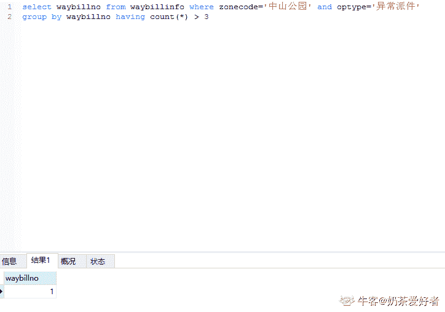
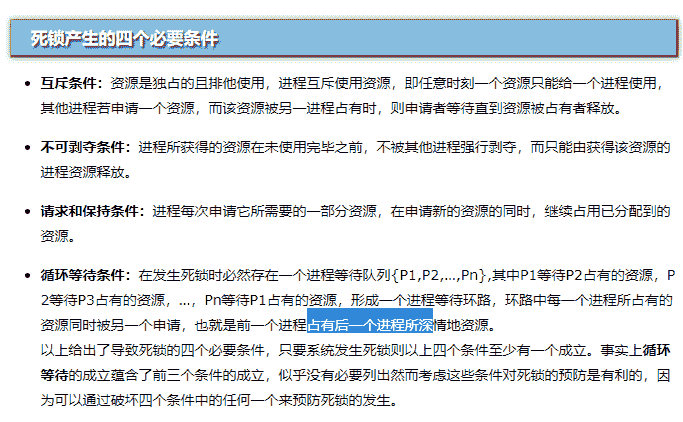
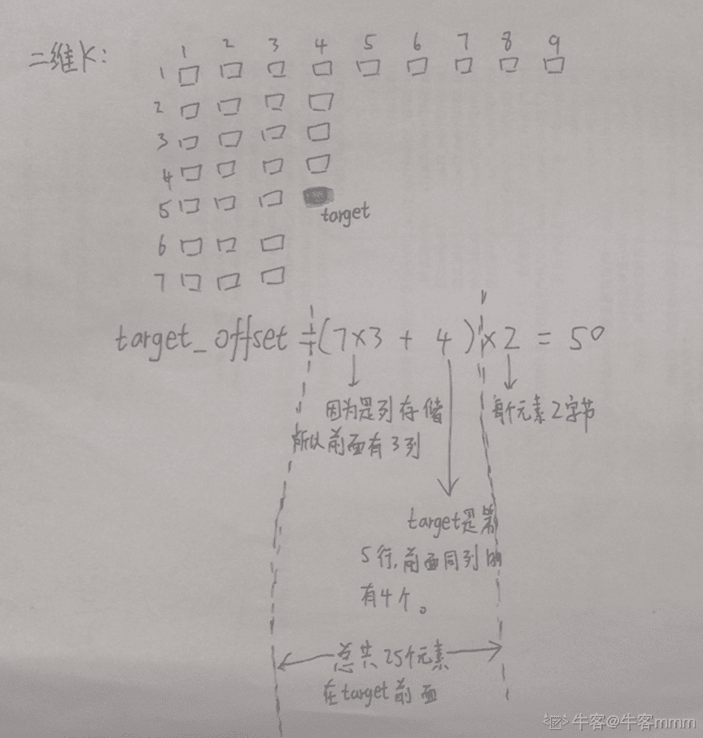

# 顺丰科技 2019 秋招前端开发工程师客观题合集

## 1

关于链表，正确的是（）

正确答案: A C   你的答案: 空 (错误)

```cpp
无需实现估计空间
```

```cpp
支持随机访问
```

```cpp
增删不必挪动元素
```

```cpp
所需空间与线性表长度成正比，并且地址连续
```

```cpp
插入一个元素所需挪动元素的平均个数为 n/2
```

本题知识点

Java 工程师 安卓工程师 顺丰科技 链表 *信息技术岗 2019 iOS 工程师 C++工程师 PHP 工程师 前端工程师 算法工程师 区块链* *讨论

[Wendy20190320100524](https://www.nowcoder.com/profile/331006331)

顺丰对前端工程师是不是有什么误解？

发表于 2019-03-20 10:08:16

* * *

[零次方](https://www.nowcoder.com/profile/5915615)

A 选项是不是应该改成：无需事先估计空间

发表于 2019-03-27 23:46:23

* * *

[neekity](https://www.nowcoder.com/profile/7732482)

B 不支持随机 D 地址不连续 E 增删不必挪动元素

发表于 2019-03-15 11:04:52

* * *

## 2

以下关于链表和数组说法正确的是（）

正确答案: A B C   你的答案: 空 (错误)

```cpp
new 出来的数组也在堆中
```

```cpp
数组插入或删除元素的时间复杂度 O(n)，链表的时间复杂度 O(1)
```

```cpp
数组利用下标定位，时间复杂度为 O(1)，链表定位元素时间复杂度 O(n)
```

```cpp
对于 add 和 remove，ArrayList 要比 LinkedList 快
```

本题知识点

Java 工程师 安卓工程师 顺丰科技 数组 链表 *信息技术岗 2019 iOS 工程师 C++工程师 PHP 工程师 前端工程师 算法工程师 区块链 运维工程师* *讨论

[小夥](https://www.nowcoder.com/profile/356553)

```cpp
数组从栈中分配空间，链表从堆中分配空间
```

数组也可以是 new 的，链表也可以是用数组模拟的~~

发表于 2019-03-16 23:46:53

* * *

[smile_ll](https://www.nowcoder.com/profile/41411708)

..new 出来的东西不应该都是堆中的吗

发表于 2019-03-15 09:19:29

* * *

[牛客 650726674 号](https://www.nowcoder.com/profile/650726674)

*   ArrayList 底层实现就是数组，且 ArrayList 实现了 RandomAccess，表示它能快速随机访问存储的元素，通过下标 index 访问，只是我们需要用 get() 方法的形式， 数组支持随机访问， 查询速度快， 增删元素慢；
*   LinkedList 底层实现是链表， LinkedList 没有实现 RandomAccess 接口，链表支持顺序访问， 查询速度慢， 增删元素快

发表于 2020-03-15 22:34:32

* * *

## 3

甲乙丙 3 个进程对某类资源的需求分别是 7 个、8 个、3 个。且目前已分别得到了 3 个、3 个和 2 个资源，若系统还至少能提供（ ）个资源，则系统是安全的。

正确答案: C   你的答案: 空 (错误)

```cpp
1
```

```cpp
4
```

```cpp
2
```

```cpp
8
```

本题知识点

Java 工程师 安卓工程师 顺丰科技 操作系统 信息技术岗 顺丰科技 2019 iOS 工程师 顺丰科技 2019 Java 工程师 顺丰科技 2019 Java 工程师 顺丰科技 2019 Java 工程师 C++工程师 PHP 工程师 顺丰科技 2019 安卓工程师 前端工程师 顺丰科技 2019 算法工程师 顺丰科技 2019 区块链 顺丰科技 2019 运维工程师 顺丰科技 2019 安卓工程师 顺丰科技 2019

讨论

[赵子贺](https://www.nowcoder.com/profile/6118530)

丙需要一个，等丙执行完会释放 3 个，此时甲最多获得 6 个，因而甲还需要一个才能够正常运行，所以一共需要两个

发表于 2019-03-12 22:10:32

* * *

[锵锵骅泗客](https://www.nowcoder.com/profile/4864872)

我觉得这题答案是 D,那个榜一说的不对吧，既然说了至少，那就要考虑最坏情况，当甲：6 个 乙：7 个 丙：2 个 时，这时添加一个既可以保证无死锁，所以一共需要 3 + 4 + 1 = 8 个

发表于 2019-04-01 18:45:24

* * *

[Geek201903181326118](https://www.nowcoder.com/profile/189737124)

cpu 通过时间分片的形式给进程分配资源，丙进程需要一个资源才能开始工作，等丙进程工作完了，将资源释放，此时甲进程会获得释放的 3 个资源，甲进程拥有 6 个资源，需要再分配一个资源给甲进程方能开始工作，等甲进程工作完了 再将资源交给乙，这样才能保证系统的安全，故需要再分配 2 个资源

发表于 2019-03-18 14:10:00

* * *

## 4

32 位处理器是指处理器的（）是 32 位的

正确答案: B   你的答案: 空 (错误)

```cpp
控制总线
```

```cpp
数据总线
```

```cpp
地址总线
```

```cpp
所有的总线
```

本题知识点

Java 工程师 安卓工程师 顺丰科技 操作系统 信息技术岗 顺丰科技 2019 iOS 工程师 顺丰科技 2019 Java 工程师 顺丰科技 2019 Java 工程师 顺丰科技 2019 Java 工程师 C++工程师 PHP 工程师 顺丰科技 2019 安卓工程师 前端工程师 顺丰科技 2019 算法工程师 顺丰科技 2019 区块链 顺丰科技 2019 运维工程师 顺丰科技 2019 安卓工程师 顺丰科技 2019

讨论

[can~can~can](https://www.nowcoder.com/profile/46803557)

32 位处理器，计算机中的位数指的是[CPU](https://baike.baidu.com/item/CPU)一次能处理的最大位数。32 位计算机的 CPU 一次最多能处理 32 位数据

发表于 2019-03-13 21:54:43

* * *

[九斤 ing](https://www.nowcoder.com/profile/5228614)

1、CPU 中的位指的是一个时钟周期可以处理的数据数量。8 位为一个字节，32 位就是一次可以处理 4 个字节，64 位是一次可以处理 8 个字节 2、32 位 CPU 是指数据总线有 32 位，寄存器是暂存数据和中间结果的单元，因此寄存器的位数指的也是处理数据的长度肯定是和数据总线的根数相同，否则寄存器和 CPU 内其他单元之间将无法通信，交换数据。因此 32 位 CPU 的 32 位是包含了寄存器是 32 位的意思，但其实定义是数据总线的宽度和根数。

发表于 2019-04-14 17:23:08

* * *

[冲鸭！冲鸭！冲鸭！](https://www.nowcoder.com/profile/551437339)

32 位处理器：指的是 CPU 一次能处理数据的最大位数。

发表于 2019-08-10 19:27:13

* * *

## 5

以下关于集合类 ArrayList、LinkedList、HashMap 描述错误的是（）

正确答案: C   你的答案: 空 (错误)

```cpp
HashMap 实现 Map 接口，它允许任何类型的键和值对象，并允许将 null 用作键或值
```

```cpp
ArrayList 和 LinkedList 均实现了 List 接口
```

```cpp
添加和删除元素时，ArrayList 的表现更佳
```

```cpp
ArrayList 的访问速度比 LinkedList 快
```

本题知识点

Java 工程师 安卓工程师 顺丰科技 Java 前端工程师 2019

讨论

[人余月半子](https://www.nowcoder.com/profile/514787832)

   1\. List 是一个有序集合，可以存放重复的数据 (有序：存进是什么顺序，取出时还是什么顺序)
                (1).ArrayList 底层是数组适合查询，不适合增删元素。
                (2).LiskedList 底层是双向链表适合增删元素，不适合查询操作。
                (3).Vector 底层和 ArrayList 相同，但是 Vector 是线程安全的，效率较低很少使用
   2\. Set 是一个无序集合，不允许放重复的数据 (无序不可重复，存进和取出的顺序不一样)
                (1).HashSet 底层是哈希表/散列表
                (2).TreeSet 继承 sartedSet 接口（无需不可重复，但存进去的元素可以按照元素的大小自动排序）
   3\. Map 是一个无序集合，以键值对的方式存放数据，键对象不允许重复，值对象可以重复。                (1).HashMap 实现不同步，线程不安全。  HashTable 线程安全                (2).HashMap 中的 key-value 都是存储在 Entry 中的。                (3).HashMap 可以存 null 键和 null 值，不保证元素的顺序恒久不变，它的底层使用的是数组和链表，通过 hashCode()方法和 equals 方法保证键的唯一性

编辑于 2020-10-10 22:54:29

* * *

[稀饭.冯](https://www.nowcoder.com/profile/723797851)

数组的插入和删除效率比较低，读取的效率高，因为地址是连续的

发表于 2019-03-21 19:17:35

* * *

[牛客-120 抢救中心](https://www.nowcoder.com/profile/6165623)

（补充）Hashtable 和 HashMap 的区别
1.继承不同。     public class Hashtable extends Dictionary implements Map public class HashMap extends  AbstractMap implements Map 2.Hashtable 中的方法是同步的，而 HashMap 中的方法在缺省情况下是非同步的。在多线程并发的环境下，可以直接使用 Hashtable，但是要使用 HashMap 的话就要自己增加同步处理了。3.Hashtable 中， key 和 value 都不允许出现 null 值。 在 HashMap 中， null 可以作为键，这样的键只有一个；可以有一个或多个键所对应的值为 null 。当 get() 方法返回 null 值时，即可以表示 HashMap 中没有该键，也可以表示该键所对应的值为 null 。因此，在 HashMap 中不能由 get() 方法来判断 HashMap 中是否存在某个键， 而应该用 containsKey() 方法来判断。 4.两个遍历方式的内部实现上不同。Hashtable、HashMap 都使用了 Iterator。而由于历史原因，Hashtable 还使用了 Enumeration 的方式。5.哈希值的使用不同，HashTable 直接使用对象的 hashCode。而 HashMap 重新计算 hash 值。6.Hashtable 和 HashMap 它们两个内部实现方式的数组的初始大小和扩容的方式。HashTable 中 hash 数组默认大小是 11，增加的方式是 old*2+1。HashMap 中 hash 数组的默认大小是 16，而且一定是 2 的指数。

发表于 2020-06-19 16:11:58

* * *

## 6

某打车公司将驾驶里程（drivedistanced）超过 5000 里的司机信息转移到一张称为 seniordrivers 的表中,他们的详细情况被记录在表 drivers 中，正确的 sql 为（）

正确答案: D   你的答案: 空 (错误)

```cpp
insert into seniordrivers
drivedistanced>=5000 from drivers where
```

```cpp
insert seniordrivers (drivedistanced) values from drivers where drivedistanced>=5000
```

```cpp
insert into seniordrivers
(drivedistanced)values>=5000 from drivers where
```

```cpp
select * into seniordrivers from drivers where drivedistanced >=5000
```

本题知识点

Java 工程师 安卓工程师 顺丰科技 数据库 SQL 信息技术岗 顺丰科技 2019 iOS 工程师 顺丰科技 2019 Java 工程师 顺丰科技 2019 Java 工程师 顺丰科技 2019 Java 工程师 C++工程师 PHP 工程师 顺丰科技 2019 安卓工程师 前端工程师 顺丰科技 2019 算法工程师 顺丰科技 2019 区块链 顺丰科技 2019 算法工程师 顺丰科技 2019 运维工程师 顺丰科技 2019 安卓工程师 顺丰科技 2019

讨论

[LIUKAI915](https://www.nowcoder.com/profile/661521241)

SQL SELECT INTO 语句可用于创建表的备份复件。
SELECT INTO 语句
SELECT INTO 语句从一个表中选取数据，然后把数据插入另一个表中。
SELECT INTO 语句常用于创建表的备份复件或者用于对记录进行存档。
SQL SELECT INTO 语法
您可以把所有的列插入新表：
SELECT * INTO new_table_name [IN externaldatabase] FROM old_tablename
或者只把希望的列插入新表：
SELECT column_name(s) INTO new_table_name [IN externaldatabase] FROM old_tablename
SQL SELECT INTO 实例 - 制作备份复件
下面的例子会制作 "Persons" 表的备份复件：
SELECT * INTO Persons_backup FROM Persons
IN 子句可用于向另一个数据库中拷贝表：
SELECT * INTO Persons IN 'Backup.mdb' FROM Persons
如果我们希望拷贝某些域，可以在 SELECT 语句后列出这些域：
SELECT LastName,FirstName
INTO Persons_backup
FROM Persons

发表于 2019-04-11 09:59:56

* * *

[赵子贺](https://www.nowcoder.com/profile/6118530)

SELECT INTO FROM 句式[`www.cnblogs.com/mq0036/p/4155136.html`](https://www.cnblogs.com/mq0036/p/4155136.html)

发表于 2019-03-12 22:32:33

* * *

[旧城俨然回眸笑](https://www.nowcoder.com/profile/6223383)

select into:copy information from one table into anotherselect */colums into newtable (in external db )from table

发表于 2020-06-23 16:10:18

* * *

## 7

下面关于 JAVA 的垃圾回收机制，正确的是（ ）

正确答案: B   你的答案: 空 (错误)

```cpp
当调用“System.gc()”来强制回收时，系统会立即回收垃圾
```

```cpp
垃圾回收不能确定具体的回收时间
```

```cpp
程序可明确地标识某个局部变量的引用不再被使用
```

```cpp
程序可以显式地立即释放对象占有的内存
```

本题知识点

Java 工程师 安卓工程师 顺丰科技 Java 信息技术岗 顺丰科技 2019 iOS 工程师 顺丰科技 2019 Java 工程师 C++工程师 PHP 工程师 顺丰科技 2019 安卓工程师 前端工程师 顺丰科技 2019 算法工程师 顺丰科技 2019 运维工程师 顺丰科技 2019 安卓工程师 顺丰科技 2019

讨论

[ღ.ᵧₒᵤ](https://www.nowcoder.com/profile/213859533)

垃圾回收是 jvm 自动进行的，可以调用 System.GC（）；提醒 jvm，但是具体什么时间不确定。

发表于 2019-07-31 20:47:05

* * *

[帅老∏](https://www.nowcoder.com/profile/588172056)

顺丰总算出了道人题

发表于 2019-09-12 23:27:59

* * *

[晚飞的笨鸟](https://www.nowcoder.com/profile/390434101)

系统自动回收垃圾

发表于 2019-03-16 10:28:09

* * *

## 8

不是存储结构的是（）

正确答案: A   你的答案: 空 (错误)

```cpp
二叉树
```

```cpp
双向链表
```

```cpp
哈希表
```

```cpp
循环队列
```

本题知识点

前端工程师 顺丰科技 树 安卓工程师 2019

讨论

[EmmaLuo](https://www.nowcoder.com/profile/6834010)

树只是表现数据的层次关系，不是一种存储结构，通常使用链表来存储树结构

发表于 2019-03-19 00:05:50

* * *

[牛客 607878169 号](https://www.nowcoder.com/profile/607878169)

数据的逻辑结构包括：集合、线性结构、树形结构、图状结构或网状结构。数据的存储结构（物理结构）包括：顺序存储、链式存储、索引存储和散列存储。

发表于 2020-07-29 16:35:43

* * *

[Palai](https://www.nowcoder.com/profile/123764439)

加一个易错点吧：循环队列是用顺序表表示的队列  

发表于 2020-12-09 23:20:17

* * *

## 9

关于链表，正确的是（）

正确答案: A C   你的答案: 空 (错误)

```cpp
无需实现估计空间
```

```cpp
支持随机访问
```

```cpp
增删不必挪动元素
```

```cpp
所需空间与线性表长度成正比，并且地址连续
```

```cpp
插入一个元素所需挪动元素的平均个数为 n/2
```

本题知识点

前端工程师 顺丰科技 链表 *安卓工程师 2019* *讨论

[Keep_It_Real](https://www.nowcoder.com/profile/514951970)

线性表是逻辑上的，顺序表是空间上的。而链表不具有顺序

发表于 2019-12-16 14:31:58

* * *

[打怪升级 666](https://www.nowcoder.com/profile/857963147)

链表是一种物理存储单元上非连续、非顺序的存储结构。每一个节点里会存到下一个节点的指针。

发表于 2019-03-13 17:05:04

* * *

[牛客 406706698 号](https://www.nowcoder.com/profile/406706698)

A.无需实现估计空间：链表不是线性的.不需要事先计算存储空间，因为他是单个结点连成的，你要加一个结点,就增长一点空间.B.支持随机访问：链表不是线性的，不能像数组一样根据索引随机访问元素，需要依次遍历结点才能访问所需数据.C.增删无需挪动元素：同理非线性，物理上散列存储，根据前驱后继访问相邻结点，股增删无需挪动元素，改变指针指向即可 D.根据 A 得知无需计算空间 E.根据 C 得知无需挪动元素

发表于 2021-10-09 11:43:29

* * *

## 10

幼儿园老师挑一组同样花色的扑克牌，让小朋友按牌面数字大小排成一列，小朋友依次从左到右找到合适位置放入扑克牌、这种方法类似以下哪种算法（）

正确答案: D   你的答案: 空 (错误)

```cpp
快速排序
```

```cpp
冒泡排序
```

```cpp
归并排序
```

```cpp
插入排序
```

本题知识点

排序 *讨论

[-LLLjr_](https://www.nowcoder.com/profile/886845118)

1.快速排序：

思想:1.在待排序的元素任取一个元素作为基准(通常选第一个元素，但最的选择方法是从待排序元素中随机选取一个作为基准)，称为基准元素；

       2.将待排序的元素进行分区，比基准元素大的元素放在它的右边，比其小的放在它的左边；

       3.对左右两个分区重复以上步骤直到所有元素都是有序的

2.冒泡排序：

1.比较相邻的元素。如果第一个比第二个大，就交换他们两个。

2.对每一对相邻元素作同样的工作，从开始第一对到结尾的最后一对。在这一点，最后的元素应该会是最大的数。

3.针对所有的元素重复以上的步骤，除了最后一个。

4.持续每次对越来越少的元素重复上面的步骤，直到没有任何一对数字需要比较。

3.归并排序：

第一步:申请空间，使其大小为两个已经排序序列之和，该空间用来存放合并后的序列

第二步:设定两个[指针](https://baike.so.com/doc/1043844-1104112.html)，最初位置分别为两个已经排序序列的起始位置

第三步:比较两个指针所指向的元素，选择相对小的元素放入到合并空间，并移动指针到下一位置

重复步骤 3 直到某一指针超出序列尾

将另一序列剩下的所有元素直接复制到合并序列尾

4.插入排序：

⒈从有序数列和无序数列{a2,a3，…，an}开始进行排序；

⒉处理第 i 个元素时（i=2,3，…，n），数列{a1,a2，…，ai-1}是已有序的，而数列{ai,ai+1，…，an}是无序的。用 ai 与 ai-1，a i-2，…，a1 进行比较，找出合适的位置将 ai 插入；

⒊重复第二步，共进行 n-i 次插入处理，数列全部有序。

发表于 2019-04-11 20:55:29

* * *

## 11

关于 HTTP,不正确的是（）

正确答案: B C D E   你的答案: 空 (错误)

```cpp
位于 OSI 的第七层
```

```cpp
必须依赖 DNS 服务
```

```cpp
HTTP keep-alive 是为保持用户登录会话
```

```cpp
状态码的类别有：
1XX（信息性状态码）
2XX（成功状态码）
3XX（重定向状态码）
4XX(认证错误状态码）
5XX（服务器错误状态码）
```

```cpp
HTTP 是使用 Cookie 技术的有状态协议
```

本题知识点

前端工程师 顺丰科技 网络基础 安卓工程师 2019

讨论

[恐农让梨](https://www.nowcoder.com/profile/280855)

http keep-alive 是为了保持 tpc socket 连接

发表于 2019-03-20 10:43:10

* * *

[魂一百](https://www.nowcoder.com/profile/671034181)

HTTP 无状态协议，是指协议对于事务处理没有记忆能力。缺少状态意味着如果后续处理需要前面的信息，则它必须重传，这样导致可能每次连接传送的数据量增大。另一方面，在的服务器不需要先前信息时它的应答较快。 保持 HTTP 连接状态的技术，一个是 Cookie，而另一个是 Session。 在客户端存储信息使用 Cookie 在服务端存储信息使用 Session

发表于 2019-09-06 11:16:26

* * *

[哆啦柠檬](https://www.nowcoder.com/profile/254660313)

B 项：如果不使用域名，可以直接通过 IP 地址+端口访问页面，就不需要域名解析了

发表于 2019-08-26 21:06:43

* * *

## 12

PING 不通某个主机 IP，可能的原因有（）

正确答案: A B C   你的答案: 空 (错误)

```cpp
网络不可用
```

```cpp
防火墙隔断
```

```cpp
主机停机
```

```cpp
22 端口被禁用
```

本题知识点

前端工程师 顺丰科技 网络基础 安卓工程师 2019

讨论

[恐农让梨](https://www.nowcoder.com/profile/280855)

22 端口一般是 ssh 端口

发表于 2019-03-20 10:44:28

* * *

[tru-th](https://www.nowcoder.com/profile/4137824)

&

PING：ICMP 重要应用，用来测试两个主机之间的连通性

使用 ICMP 回送请求与回送回答报文

PING 是应用层直接使用网络层 ICMP 的一个例子，没有通过运输层的 TCP 或 UDP

发表于 2020-04-20 17:52:18

* * *

[中二少年](https://www.nowcoder.com/profile/5357461)

ping 是 ICMP 协议，并不是通常所说的 tcp/udp 端口；ICMP 不像 tcp/udp 有端口，但它确实含有两个域：类型 type 和代码 code，而这些与端口作用不同。

发表于 2019-03-19 13:39:40

* * *

## 13

甲乙丙 3 个进程对某类资源的需求分别是 7 个、8 个、3 个。且目前已分别得到了 3 个、3 个和 2 个资源，若系统还至少能提供（ ）个资源，则系统是安全的。

正确答案: C   你的答案: 空 (错误)

```cpp
1
```

```cpp
4
```

```cpp
2
```

```cpp
8
```

本题知识点

前端工程师 顺丰科技 操作系统 安卓工程师 2019

讨论

[B.F.-kenway](https://www.nowcoder.com/profile/467180558)

先给丙进程一个资源，让它成功执行，释放三个资源；然后给甲进程，此时一共 3+3=6 个资源，还需要一个才能使甲进程启动，故 1+1；最后将甲释放的给乙进程，可以满足，所以共 2 个。

发表于 2019-11-30 20:03:31

* * *

[张启明](https://www.nowcoder.com/profile/287893265)

这题目我理解的就是（“系统至少提供多少个资源，则保证系统一定安全”），就选 D 如果改成（“系统线程调度最优情况下，系统至少提供多少个资源，则保证系统一定安全”） 选 C

发表于 2019-08-25 12:01:17

* * *

[学术废物](https://www.nowcoder.com/profile/6473476)

给 1 个丙够用了 但他用完了还资源的时候其他两个不够

发表于 2022-03-10 10:52:56

* * *

## 14

32 位处理器是指处理器的（）是 32 位的

正确答案: B   你的答案: 空 (错误)

```cpp
控制总线
```

```cpp
数据总线
```

```cpp
地址总线
```

```cpp
所有的总线
```

本题知识点

前端工程师 顺丰科技 操作系统 安卓工程师 2019

讨论

[Chen 的 offer 快快来](https://www.nowcoder.com/profile/843699874)

计算机中的位数指的是[**CPU**](https://baike.baidu.com/item/CPU)**一次能处理的最大位数**。32 位计算机的 CPU 一次最多能处理 32 位数据，即 32 位处理器是指处理器的（数据总线）是 32 位的

发表于 2020-07-17 10:42:09

* * *

[许愿建行拿到 offer](https://www.nowcoder.com/profile/217268997)

32 位处理器是指处理器的控制总线是 32 位

发表于 2019-11-01 12:41:42

* * *

## 15

利用栈完成数制转换，将十进制的 67 转换为二进制，入栈序列为（）

正确答案: D   你的答案: 空 (错误)

```cpp
1000011
```

```cpp
1010001
```

```cpp
1000101
```

```cpp
1100001
```

本题知识点

前端工程师 顺丰科技 栈 *安卓工程师 2019* *讨论

[10093735 猪猪](https://www.nowcoder.com/profile/265792281)

这题反了吧

发表于 2019-08-27 00:20:05

* * *

[给口饭吃吧求求了](https://www.nowcoder.com/profile/222508282)

之前看到一个相同考点的题目是入栈逆序，出栈顺序，这里怎么？？？

发表于 2019-07-28 15:12:47

* * *

[大星星和小猩猩](https://www.nowcoder.com/profile/9374535)

这是一个整体。

发表于 2019-07-19 17:04:53

* * *

## 16

以下关于链表和数组说法正确的是（）

正确答案: A B C   你的答案: 空 (错误)

```cpp
数组从栈中分配空间，链表从堆中分配空间
```

```cpp
数组插入或删除元素的时间复杂度 O(n)，链表的时间复杂度 O(1)
```

```cpp
数组利用下标定位，时间复杂度为 O(1)，链表定位元素时间复杂度 O(n）
```

```cpp
对于 add 和 remove，ArrayList 要比 LinkedList 快
```

本题知识点

前端工程师 顺丰科技 链表 *安卓工程师 2019* *讨论

[那年明月在](https://www.nowcoder.com/profile/3401023)

简要概括：[`blog.csdn.net/rl529014/article/details/51169677`](https://blog.csdn.net/rl529014/article/details/51169677)
数组静态分配内存，链表动态分配内存；
数组在内存中连续，链表不连续；
数组元素在栈区，链表元素在堆区；
数组利用下标定位，时间复杂度为 O(1)，链表定位元素时间复杂度 O(n)；
数组插入或删除元素的时间复杂度 O(n)，链表的时间复杂度 O(1)。

编辑于 2019-07-29 19:13:19

* * *

[lmy 永不言败](https://www.nowcoder.com/profile/9186281)

Java 中 new 的数组不也是在堆中吗，只是数组的引用在栈中，不用的语言还不一样吗，有没有大佬帮忙分析一下！~

发表于 2019-08-08 13:57:46

* * *

[意会。](https://www.nowcoder.com/profile/683204377)

数组静态分配内存，链表动态分配内存； 数组在内存中连续，链表不连续； 数组元素在栈区，链表元素在堆区； 数组利用下标定位，时间复杂度为 O(1)，链表定位元素时间复杂度 O(n)； 数组插入或删除元素的时间复杂度 O(n)，链表的时间复杂度 O(1)。

发表于 2021-10-29 17:05:02

* * *

## 17

以下类型为 Final 类型的为（）

正确答案: B C   你的答案: 空 (错误)

```cpp
HashMap
```

```cpp
StringBuffer
```

```cpp
String
```

```cpp
Hashtable
```

本题知识点

前端工程师 顺丰科技 Java 安卓工程师 2019

讨论

[眉毛密过发](https://www.nowcoder.com/profile/204442994)

**StringBuilder , StringBuffer ,String 都是 final 的，但是为什么**StringBuilder , StringBuffer 可以进行修改呢，因为不可变包括的是，引用不可变以及对象不可变，而这三个都是属于引用不可变，（也就是地址不要变，里面的内容随心所欲）**，而**StringBuilder , StringBuffer 中都包含右 append 方法，可对对象中的内容进行增加。********而 String a="123"+new String("456");实际上底层是用了一个**StringBuffer 进行 append；******

发表于 2019-09-29 15:50:42

* * *

[帐号已注销 201710221153801](https://www.nowcoder.com/profile/8234728)

关于为什么 StringBuffer 是 final 值却可以改变这个，想起之前做过的笔记:final 修饰的成员变量为基本数据类型时，赋值后无法改变。当 final 修饰的为引用变量时，在赋值后其指向地址无法改变，但对象内容可以改变。感觉应该有一定关系 另外，对于该题，final 修饰类只是限定类不可被继承，而非限定了其对象是否可变

发表于 2019-09-23 15:58:09

* * *

[zKnight201911072233319](https://www.nowcoder.com/profile/365283133)

通过阅读源码可以知道，string 与 stringbuffer 都是通过字符数组实现的。其中 string 的字符数组是 final 修饰的，所以字符数组不可以修改。stringbuffer 的字符数组没有 final 修饰，所以字符数组可以修改。string 与 stringbuffer 都是 final 修饰，只是限制他们所存储的引用地址不可修改。至于地址所指内容能不能修改，则需要看字符数组可不可以修改。

发表于 2020-03-08 22:27:02

* * *

## 18

下面关于 JAVA 的垃圾回收机制，正确的是（ ）

正确答案: B   你的答案: 空 (错误)

```cpp
当调用“System.gc()”来强制回收时，系统会立即回收垃圾
```

```cpp
垃圾回收不能确定具体的回收时间
```

```cpp
程序可明确地标识某个局部变量的引用不再被使用
```

```cpp
程序可以显式地立即释放对象占有的内存
```

本题知识点

前端工程师 顺丰科技 Java 安卓工程师 2019

讨论

[大屁孩](https://www.nowcoder.com/profile/4863810)

java 提供了一个系统级的线程，即垃圾回收器线程。用来对每一个分配出去的内存空间进行跟踪。当 JVM 空闲时，自动回收每块可能被回收的内存，GC 是完全自动的，不能被强制执行。程序员最多只能用 System.gc()来建议执行垃圾回收器回收内存，但是具体的回收时间，是不可知的。当对象的引用变量被赋值为 null，可能被当成垃圾。

发表于 2019-07-18 21:24:13

* * *

[没得感情的程序员](https://www.nowcoder.com/profile/691416082)

选 C 多半是认为置为 null，但是置为 null 不一定就不会使用了啊~那我初始化的时候还置为 null 呢况且，置为 null 只是被认为可以当垃圾回收了。不一定会马上回收局部变量分为引用变量和基本类型变量，基本类型的变量名称和值都是存储在栈中。引用变量只存储引用在栈中，值在堆中，题目中说的是局部变量的引用，而要释放这个需要 finalize()方法，这个方法即便使用了也不是一定立刻马上执行。一般局部变量都是随着方法执行结束而释放

发表于 2020-02-19 10:11:31

* * *

[686](https://www.nowcoder.com/profile/9044860)

C 为啥不对。。

发表于 2019-07-23 07:22:15

* * *

## 19

需要创建一个多选框，且和文本关联起来（单击文本就像单击核选框一样）。下列 HTML 代码中，正确的是？（）

正确答案: A D   你的答案: 空 (错误)

```cpp
<label><input type="checkbox" />记住我</label>
```

```cpp
<input type="checkbox" /><label for="checkbox">记住我</label>
```

```cpp
<input type="checkbox" id="c1" /><label>记住我</label>
```

```cpp
<input type="checkbox" id="c1" /><label for="c1">记住我</label>
```

本题知识点

前端工程师 顺丰科技 HTML 安卓工程师 2019

讨论

[弹铁蛋同学](https://www.nowcoder.com/profile/770526402)

应该是浏览器解析代码的问题，打开 F12 可见原来的答案 A：B：C:D:所以：1、用 label 包住可以 使 label 与表单元素绑定；2、laber 的 for 属性规定 label 与哪个表单元素绑定；

编辑于 2019-07-29 10:28:53

* * *

[挚安。](https://www.nowcoder.com/profile/327138629)

出现的这种情况,出来就是 F12

发表于 2019-07-25 08:44:06

* * *

[honng](https://www.nowcoder.com/profile/633961032)

我是用 app 做的。

猜测 A 可以，因为包裹了起来，猜测 D 可以，感觉 for id 有绑定的意思。

机智。

编辑于 2020-12-22 18:18:16

* * *

## 20

下面对 http 状态码描述正确的是？（）

正确答案: A D   你的答案: 空 (错误)

```cpp
1**：这类响应是临时响应，只包含状态行和某些可选的响应头信息，并以空行结束
```

```cpp
3**：表示服务端无法响应
```

```cpp
4**：表示服务端错误
```

```cpp
5**：表示服务器端错误
```

本题知识点

前端工程师 顺丰科技 网络基础 安卓工程师 2019

讨论

[盐萌怪](https://www.nowcoder.com/profile/75261744)

1XX（信息状态码）接受请求正在处理
2XX（成功状态码） 请求正常处理完毕
3XX（重定向状态码） 需要附加操作已完成请求
4XX（客户端错误状态码） 服务器无法处理请求
5XX（服务器错误状态码） 服务器处理请求出错

发表于 2019-03-14 15:00:33

* * *

[菜鸟九八号](https://www.nowcoder.com/profile/612444337)

**可供参考：**[`www.cnblogs.com/xflonga/p/9368993.html`](https://www.cnblogs.com/xflonga/p/9368993.html)

发表于 2020-03-05 10:59:01

* * *

## 21

关于 XSS 与 CSRF 两种跨站攻击描述正确的是？（）

正确答案: A B C D   你的答案: 空 (错误)

```cpp
XSS 跨站脚本攻击，主要是前端层面的，用户在输入层面插入攻击脚本，改变页面的显示。
```

```cpp
XSS 是一种网站应用程序的安全漏洞攻击，是代码注入的一种，这类攻击通常包含 HTML 及用户端脚本语言。
```

```cpp
CSRF 跨站请求伪造，以你的名义，发送恶意请求获取相关信息。
```

```cpp
CSRF 是一种挟制用户在当前已登录的 Web 应用程序上执行非本意的操作的攻击方法。
```

本题知识点

前端工程师 顺丰科技 安卓工程师 2019

讨论

[deefre](https://www.nowcoder.com/profile/36503303)

*   XSS（Cross Site Script）是利用用户对指定网站的信任
*   CSRF（Cross Site Request Forgery）是利用网站对用户的信任

编辑于 2019-08-05 16:15:10

* * *

## 22

有 var d = new Date('2018-05-09')，可以设置为 6 月份的操作是？（）

正确答案: C D   你的答案: 空 (错误)

```cpp
d.setMonth(7);
```

```cpp
d.setMonth(6);
```

```cpp
d.setMonth(5);
```

```cpp
d.setDate(40);
```

本题知识点

前端工程师 顺丰科技 Javascript 安卓工程师 2019

讨论

[亿元](https://www.nowcoder.com/profile/5383453)

setMonth(n)，这里是 0-11 分别对应 1-12 月

发表于 2019-03-21 15:31:27

* * *

[盐萌怪](https://www.nowcoder.com/profile/75261744)

d.setDate(n);
n 表示一个月中的一天的一个数值（1 ~ 31）:0 为上一个月的最后一天
-1 为上一个月最后一天之前的一天
如果当月有 31 天:
32 为下个月的第一天
如果当月有 30 天:
32 为下一个月的第二天;40 为下一个月的第 9 天;

发表于 2019-03-14 15:07:36

* * *

[D 灿](https://www.nowcoder.com/profile/918099019)

setMonth(month,day)

| 参数 | 描述 |
| month | 必需。一个表示月份的数值，该值介于 0（一月） ~ 11（十二月） 之间。 |
| day | 可选。一个表示月的某一天的数值，该值介于 1 ~ 31 之间（以本地时间计）。在 EMCAScript 标准化之前，不支持该参数。 |

发表于 2019-03-27 15:08:04

* * *

## 23

当一个进程运行时间片到，或出现更高优先级进程时，该进程状态会变为（ ）

正确答案: A   你的答案: 空 (错误)

```cpp
就绪状态
```

```cpp
阻塞状态
```

```cpp
等待状态
```

```cpp
终止状态
```

本题知识点

前端工程师 顺丰科技 操作系统 安卓工程师 2019

讨论

[neptoo](https://www.nowcoder.com/profile/870928103)

正在执行的进程由于其时间片用完被暂停执行，此时进程应从执行状态变为活动就绪状态

发表于 2019-03-22 14:12:16

* * *

[leo201902272134218](https://www.nowcoder.com/profile/201865348)

不是 阻塞吗？

发表于 2019-03-21 19:48:32

* * *

[phoenixfrank](https://www.nowcoder.com/profile/969156946)

我的理解是时间片用完或者被抢占 属于占有资源让出处理机的情况 即只缺 cpu 此时状态为就绪状态

发表于 2020-08-19 12:20:39

* * *

## 24

下列关于 final、finally、finalize 说法正确的是（ ）

正确答案: A B D   你的答案: 空 (错误)

```cpp
final 可以用来修饰类、方法、变量
```

```cpp
finally 是 java 保证重点代码一定要被执行的一种机制
```

```cpp
变量被 final 修饰后不能再指向其他对象，但可以重写
```

```cpp
finalize 设计的目的是保证对象在被垃圾收集前完成特定资源的回收
```

本题知识点

前端工程师 顺丰科技 Java 安卓工程师 2019

讨论

[也志](https://www.nowcoder.com/profile/848643305)

1.  final 用于声明属性、方法和类：
    *   final 属性不可变，指的是引用不可变，而不关心指向对象内容的变化，被 final 修饰的变量必须初始化
    *   final 方法不可被子类重写，可以实现 inline(内联)的机制
    *   final 类不可以被继承(如 String、StringBuffer)，所有的方法不可以被重写，但其内的非 final 变量可以被修改
2.  finaally 作为异常处理的一部分，只能用在 try/catch 语句中，并且附带一个语句块，表示这段语句最终一定被执行(特殊情况不会被执行，如 try 语句前出现异常或 try 语句块中出现的异常没有被捕获)，经常被用在需要释放资源的情况下或是释放锁
3.  finalize 是 Object 类的一个方法，在垃圾回收器执行时会调用被回收对象的 finalize()方法，可以覆盖此方法来实现对其他资源的回收(一旦垃圾回收器准备好释放对象占用的空间，将首先调用该方法，并且在下一次垃圾回收动作发生时，才会真正回收对象占用的内存)，从功能上来说，finalize（）方法与 c++中的析构函数比较相似，但是 Java 采用的是基于垃圾回收器的自动内存管理机制，所以 finalize（）方法在本质上不同于 C++中的析构函数。

**关于 finalize 的补充！**

判定一个对象 objA 是否可回收，至少要经历两次标记过程：

*   如果对象 objA 到 GC Roots 没有引用链，则进行第一次标记。

*   进行筛选，判断此对象是否有必要执行 finalize（）方法

    *   如果对象 objA 没有重写 finalize（）方法，或者 finalize（）方法已经被虚拟机调用过，则虚拟机视为“没有必要执行”，objA 被判定为不可触及的。
    *   如果对象 objA 重写了 finalize（）方法，且还未执行过，**那么 objA 会被插入到 F-Queue 队列中，由一个虚拟机自动创建的、低优先级的 Finalizer 线程触发其 finalize（）方法执行。**
    *   **finalize（）方法是对象逃脱死亡的最后机会**，稍后 GC 会对 F-Queue 队列中的对象进行第二次标记。**如果 objA 在 finalize（）方法中与引用链上的任何一个对象建立了联系**，那么在第二次标记时，objA 会被移出“即将回收”集合。之后，对象会再次出现没有引用存在的情况。在这个情况下，finalize 方法不会被再次调用，对象会直接变成不可触及的状态，也就是说，一个对象的 finalize 方法只会被调用一次。

发表于 2020-09-14 16:10:42

* * *

[自雷](https://www.nowcoder.com/profile/928870840)

当 final 修饰一个基本数据类型时，表示该基本数据类型的值一旦在初始化后便不能发生变化；如果 final 修饰一个引用类型时，则在对其初始化之后便不能再让其指向其他对象了，但该引用所指向的对象的内容是可以发生变化的。

发表于 2019-07-18 10:07:00

* * *

[JackieDeng](https://www.nowcoder.com/profile/877191350)


发表于 2019-08-21 14:49:25

* * *

## 25

某打车公司要将驾驶里程（drivedistanced）超过 5000 里的司机信息转存到一张称为 seniordrivers 的表中，他们的详细情况被记录在表 drivers 中，正确的 sql 语句为（）

正确答案: D   你的答案: 空 (错误)

```cpp
insert into seniordrivers where drivedistanced>=5000 from drivers
```

```cpp
insert into seniordrivers(drivedistanced) values from drivers where drivedistanced>=5000
```

```cpp
insert into seniordrivers(drivedistanced) where values>=5000 from drivers
```

```cpp
select * into seniordrivers from drivers where drivedistanced >=5000
```

本题知识点

前端工程师 顺丰科技 数据库 SQL 安卓工程师 2019

讨论

[Seaworth](https://www.nowcoder.com/profile/676817608)

INSERT INTO 语句用于**向表格中插入新的行**。

```cpp
INSERT INTO table_name VALUES (值 1, 值 2,....)
指定所要插入数据的列：
INSERT INTO table_name (列 1, 列 2,...) VALUES (值 1, 值 2,....)
```

SELECT INTO 语句**从一个表中选取数据，然后把数据插入另一个表中**。常用于创建表的备份复件或者用于对记录进行存档。

```cpp
把所有的列插入新表 
SELECT *
INTO new_table_name [IN externaldatabase] 
FROM old_tablename
```

```cpp
只把希望的列插入新表 
SELECT column_name(s)
INTO new_table_name [IN externaldatabase] 
FROM old_tablename
```

参考：[`www.w3school.com.cn/sql/sql_insert.asp`](https://www.w3school.com.cn/sql/sql_insert.asp)[`www.w3school.com.cn/sql/sql_select_into.asp`](https://www.w3school.com.cn/sql/sql_select_into.asp)

编辑于 2020-02-27 11:48:36

* * *

[虾滑](https://www.nowcoder.com/profile/153516329)

惭愧，我只用过 INSERT INTO,select into 我都没用过。。

发表于 2019-11-21 16:31:48

* * *

[value_error](https://www.nowcoder.com/profile/547846936)

insert into 要求目标表必须存在，select into 如果不存最目标表的话会自动创建

发表于 2020-06-11 09:41:41

* * *

## 26

对序列（47,31,83,91,57,18,96,16）进行快速排序（首元素为基准），第二趟排序结果是（）

正确答案: B   你的答案: 空 (错误)

```cpp
18 31 16 47 57 91 96 83
```

```cpp
16 31 18 47 57 91 96 83
```

```cpp
16 18 31 47 57 91 96 83
```

```cpp
16 18 31 47 57 91 96  83
```

本题知识点

前端工程师 顺丰科技 排序 *安卓工程师 2019* *讨论

[offer 要来了](https://www.nowcoder.com/profile/660688118)

快速排序常用的有两种方法 交换法和挖坑法牛客网所有快排的题都是挖坑法(至少我遇到的都是) 如果有疑惑的应该是习惯用的交换法(因为一开始我也是)可以自己去博客搜一下快排挖坑法🤣

发表于 2019-07-21 23:27:41

* * *

[cst_lzw](https://www.nowcoder.com/profile/614166082)


发表于 2019-09-12 15:19:04

* * *

[o201807261516255](https://www.nowcoder.com/profile/863002429)

快排：从后开始比较第一遍结果（元素 47 已经放到合适位置）

```cpp
16 31 18 | 47 | 57 91 96 83
```

第二遍针对两个部分

```cpp
16 31 18 （基准是 16，18 > 16， 位置不变，right 指针向前，31 > 16，位置不变，right 指针再向前，本轮结束）
```

```cpp
57 91 96 83 （基准是 57，元素右边都比基准大，不用移动位置，本轮结束） 
```

所以第一遍结果和第二遍一样

发表于 2019-03-31 11:45:56

* * *

## 27

Number 对象哪个方法 1 把数字转换为字符串，使用本地数字格式顺序。

你的答案 (错误)

1 参考答案 (1) toLocaleString

本题知识点

前端工程师 顺丰科技 字符串 *安卓工程师 2019* *讨论

[杯具杀手](https://www.nowcoder.com/profile/321639238)

注意是本地数字格式

发表于 2021-11-11 21:03:09

* * *

[zengkan](https://www.nowcoder.com/profile/853948589)

**toLocaleString()** 方法返回这个数字在特定语言环境下的表示字符串。

发表于 2019-05-01 23:01:32

* * *

[wyf201902261416178](https://www.nowcoder.com/profile/400735485)

😂

发表于 2019-04-03 11:33:24

* * *

## 28

下面哪个优先级最高？

正确答案: D   你的答案: 空 (错误)

```cpp
ID 选择器的样式
```

```cpp
HTML 元素选择器，伪元素选择器
```

```cpp
类选择器、属性选择器
```

```cpp
HTML 元素的内联样式
```

本题知识点

前端工程师 顺丰科技 HTML 安卓工程师 2019

讨论

[你手画我心](https://www.nowcoder.com/profile/7127955)

CSS 规范为不同类型的选择器定义了特殊性权重，特殊性权重越高，样式会被优先应用。 权重设定如下： html 选择器，权重为 1； 类选择器，权重为 10； id 选择器，权重为 100； 这里还有一种情况：在 html 标签中直接使用 style 属性，这里的 style 属性的权重为 1000； 如果加上!important;则权重是最高的

发表于 2019-03-24 20:51:58

* * *

[再不学就耕田啦](https://www.nowcoder.com/profile/437905955)

2.选择器的优先级： 内联>ID>类=伪类>元素选择器

发表于 2020-02-29 11:22:30

* * *

[zzdoreen](https://www.nowcoder.com/profile/102619713)

内联样式算选择器？

发表于 2019-09-01 20:37:37

* * *

## 29

在 HTML5 中，空标签可以不写自关闭的斜线（/）了，这些标签不包括以下哪项？

正确答案: B   你的答案: 空 (错误)

```cpp
img
```

```cpp
button
```

```cpp
br
```

```cpp
input
```

本题知识点

前端工程师 顺丰科技 HTML 安卓工程师 2019

讨论

[喔是真的菜](https://www.nowcoder.com/profile/546370159)

HTML5 中： 自关闭的斜线(/)对 ：area, base, br, col, command, embed, hr, img, input, keygen, link, meta, param, source, track, wbr 空标签无效，言即不再需要自闭合(/)这个小尾巴了，如果要写上也是可以的。

发表于 2019-04-10 11:10:01

* * *

[牛客 176075620 号](https://www.nowcoder.com/profile/176075620)

空标签可以不写自关闭的斜线（/）了，表示的是单标签可以不用写自关闭标签 双标签还是需要的

发表于 2021-06-06 12:50:11

* * *

[牛客 726755515 号](https://www.nowcoder.com/profile/726755515)

自关闭就是指这种的：<div> </div>空标签大概是这么个意思：<br>后面可以不写</br>

发表于 2020-08-21 10:52:40

* * *

## 30

下列对 Reflow（回流）和 Repaint（重绘）的描述正确的是？

正确答案: C   你的答案: 空 (错误)

```cpp
repaint 比 reflow 更加花费时间影响性能
```

```cpp
一条条地修改 DOM 的样式要比先定义好 css 的 class 然后修改 DOM 的 className 减少 reflow/repaint
```

```cpp
为 HTML 标签使用 fixed 或 absolute 的 position，那么修改他们的 CSS 是不会 reflow 的
```

```cpp
改变了某个元素的背景颜色，文字颜色等会导致 reflow
```

本题知识点

前端工程师 顺丰科技 HTML 安卓工程师 2019 CSS

讨论

[岁月如故](https://www.nowcoder.com/profile/2372633)


发表于 2019-08-20 19:44:38

* * *

[狗佳蛋](https://www.nowcoder.com/profile/296981211)

都脱流了当然不会回流啦

发表于 2019-10-25 12:54:15

* * *

[藤景树](https://www.nowcoder.com/profile/902774938)

浏览器渲染过程：

1.解析 HTML，生成 DOM 树，解析 CSS，生成 CSSOM 树。

2.将 DOM 树和 CSSOM 树结合，生成渲染树（Render tree）。

3.Layout（回流）：根据生成的渲染树，进行回流，得到节点的几何信息。

4.Painting（重绘）：根据渲染树以及回流得到的节点，获取绝对像素。

5.Display：将像素发给 GPU，展示在页面上

发表于 2019-09-10 23:57:17

* * *

## 31

下面这段 JS 程序的执行结果是：

```cpp
var user = {
 count : 1,
 getCount: function(){
  return this.count;
 }
}
var func = user.getCount
console.log(func())
```

正确答案: D   你的答案: 空 (错误)

```cpp
this.count
```

```cpp
1
```

```cpp
报错
```

```cpp
undefined
```

本题知识点

前端工程师 顺丰科技 Javascript 安卓工程师 2019

讨论

[夏花爱秋叶](https://www.nowcoder.com/profile/4085682)

// 1.调用对象未声明的属性会 undifned
    var user={};
    console.log(user.name);//undifned

    // 2.使用未赋值只声明的基本数据类型会 undifned
    var one;
    console.log(one);//undifned

    // 3.使用未声明的变量会报错
    console.log(two);//new_file.html:15 Uncaught ReferenceError: two is not defined
在本题中，this 指向的是 window,window 对象已经自动被浏览器声明了，只是还没有声明 count 属性，所以也是 undifned

发表于 2019-08-22 11:46:34

* * *

[冬天用本人](https://www.nowcoder.com/profile/3562901)

因为在函数调用时，this 才会发生绑定，而且是谁调用 this，this 就指向谁。在本题中，func 的运行环境是全局，因此 this 指向全局对象。如果去掉 this，那只是在全局调用了一个没有声明局部变量的方法。引用它就会报错。

发表于 2019-10-16 20:42:50

* * *

[唐 201909212136119](https://www.nowcoder.com/profile/423643246)

var func =user. getCount 等价于 var func=function（return this.count） 所以 this 指向 window var func =user. getCount（）表示调用方法 这个时候才输出 1

编辑于 2019-11-04 22:36:27

* * *

## 32

关于 XSS 与 CSRF 两种跨站攻击描述正确的是？（）

正确答案: A B C D   你的答案: 空 (错误)

```cpp
XSS 跨站脚本攻击，主要是前端层面的，用户在输入层面插入攻击脚本，改变页面的显示
```

```cpp
XSS 是一种网站应用程序的安全漏洞攻击，是代码注入的一种，这类攻击通常包含 HTML 及用户端脚本语言。
```

```cpp
CSRF 跨站请求伪造，以你的名义，发送恶意请求获取相关信息。
```

```cpp
CSRF 是一种挟制用户在当前已登录的 Web 应用程序上执行非本意的操作的攻击方法。
```

本题知识点

前端工程师 顺丰科技 安卓工程师 2019

## 33

以下 js 操作 Array 的方法中不能添加元素的是：（）

正确答案: B   你的答案: 空 (错误)

```cpp
push
```

```cpp
pop
```

```cpp
unshift
```

```cpp
splice
```

本题知识点

前端工程师 顺丰科技 Javascript 安卓工程师 2019

讨论

[君君 201903290917654](https://www.nowcoder.com/profile/493155953)


发表于 2019-04-02 14:56:45

* * *

[ORION🅥](https://www.nowcoder.com/profile/340932189)

添加数组项

*   数组[长度] = 数据：向数组末尾添加一个数据

*   数组.push(数据): 向数组末尾添加一个数据

*   数组.unshift(数据)：向数组起始位置添加一个数据，会导致数组每一项的下标向后移动

*   数组.splice(下标, 0, 添加的数据): 从指定下标位置开始，删除 0 个，然后在该位置插入添加的数据，如果下标超过范围，则按照范围的边界进行处理。

push、unshift、splice 可以添加多个数据

删除数据

*   delete 数组[下标]: 这种做法不会导致数组其他的属性发生变化，因此，该做***导致产生稀松数组，所以不推荐使用该做法。

*   数组.pop(): 删除数组的最后一项，该表达式返回最后一项的数据

*   数组.shift()：删除数组第一项，该表达式返回第一项的数据

*   数组.splice(下标, 删除的数量, 添加的数据): 从指定下标位置开始，删除指定数量，然后在该位置插入添加的数据，如果下标超过范围，则按照范围的边界进行处理。返回一个新数组，该数组记录被删除的数据。

编辑于 2019-12-04 14:00:13

* * *

[Lzengp](https://www.nowcoder.com/profile/411725556)

Array 对象方法 方法 concat() 连接两个或更多的数组，并返回结果。 join() 把数组的所有元素放入一个字符串。元素通过指定的分隔符进行分隔。 pop() 删除并返回数组的最后一个元素 push() 向数组的末尾添加一个或更多元素，并返回新的长度。 reverse() 颠倒数组中元素的顺序。 shift() 删除并返回数组的第一个元素 slice() 从某个已有的数组返回选定的元素 sort() 对数组的元素进行排序 splice() 删除元素，并向数组添加新元素。toSource() 返回该对象的源代码。toString() 把数组转换为字符串，并返回结果。 toLocaleString() 把数组转换为本地数组，并返回结果。 unshift() 向数组的开头添加一个或更多元素，并返回新的长度。 valueOf() 返回数组对象的原始值

发表于 2020-08-04 22:41:48

* * *

## 34

以下减少页面加载时间的方法错误的是？（）

正确答案: D   你的答案: 空 (错误)

```cpp
减少 http 请求（合并文件、合并图片）
```

```cpp
压缩 Javascript、CSS 代码
```

```cpp
服务器启用 gzip 压缩功能
```

```cpp
<script>链接写在头部
```

本题知识点

前端工程师 顺丰科技 安卓工程师 2019

讨论

[offer！Imhere](https://www.nowcoder.com/profile/734379467)

script 写在头部会导致页面加载堵塞等待

编辑于 2019-08-15 10:20:40

* * *

[王力宏](https://www.nowcoder.com/profile/224638622)

减少 http 请求也就是说 网站的图片等资源文件尽量保存在本地 不通过外链下载 否则在测试环境还是应用环境都特别慢

发表于 2020-06-03 13:06:42

* * *

## 35

在 js 中，以下不属于字符串的方法的是？（）

正确答案: C   你的答案: 空 (错误)

```cpp
split
```

```cpp
slice
```

```cpp
separate
```

```cpp
concat
```

本题知识点

前端工程师 顺丰科技 安卓工程师 2019

讨论

[飞翔的心](https://www.nowcoder.com/profile/7917142)

```cpp
split() 方法用于把一个字符串分割成字符串数组。 slice() 方法可从已有的数组中返回选定的元素。 reverse() 方法用于颠倒数组中元素的顺序。 concat() 方法用于连接两个或多个数组。
```

发表于 2019-03-13 21:26:42

* * *

[蜗牛七号](https://www.nowcoder.com/profile/1431450)

这里字符串的方法不限语言吗？为什么我没看到？有点不太理解…

发表于 2019-11-07 22:13:37

* * *

[ML_ZDD](https://www.nowcoder.com/profile/6912943)

顺丰科技的题目一言难尽 10 题 8 题答案错的一点都不严谨

发表于 2020-02-13 15:32:29

* * *

## 36

执行以下程序，输出结果为（）

```cpp
var a =[1,2,3];
var b = a.slice();
b.push(4);
console.log(a)
```

正确答案: B   你的答案: 空 (错误)

```cpp
[1,2,3,4]
```

```cpp
[1,2,3]
```

```cpp
[4]
```

```cpp
[2,3,4]
```

本题知识点

前端工程师 顺丰科技 Javascript 安卓工程师 2019

讨论

[20191021190566](https://www.nowcoder.com/profile/145460965)

一顿分析猛如虎 结果题目却问 a md

发表于 2019-11-14 10:57:20

* * *

[前端崽](https://www.nowcoder.com/profile/9301294)

JS 中`slice()`方法是选取数组的的一部分，并返回一个**新数组**。

注意：是新数组。

所以执行后跟 a 毛线关系都没有。

发表于 2019-03-24 20:29:55

* * *

[十年诀别](https://www.nowcoder.com/profile/87500801)

这题目太坏了。。。

发表于 2019-03-13 09:27:28

* * *

## 37

关于 udp 协议，不正确的是（）

正确答案: A B D   你的答案: 空 (错误)

```cpp
udp 需要三次握手，但不需要建立连接
```

```cpp
2500B 的 udp 包能够一次穿透以太网
```

```cpp
DNS、NFS 和 SNMP 使用的是 UDP
```

```cpp
UDP 和 TCP 一样都会出现粘包问题
```

本题知识点

前端工程师 顺丰科技 算法工程师 网络基础 安卓工程师 2019

讨论

[neptoo](https://www.nowcoder.com/profile/870928103)

TCP 粘包，就是发送方发送的多个数据包，到接收方后粘连在一起，导致数据包不能完整的体现发送的数据。UDP 具有消息边界，不存在粘包问题。

发表于 2019-03-15 18:38:57

* * *

[黄色变白色](https://www.nowcoder.com/profile/8547911)

DP 不存在粘包问题，是由于 UDP 发送的时候，没有经过 Nagle 算法优化，不会将多个小包合并一次发送出去。另外，在 UDP 协议的接收端，采用了链式结构来记录每一个到达的 UDP 包，这样接收端应用程序一次 recv 只能从 socket 接收缓冲区中读出一个数据包。也就是说，发送端 send 了几次，接收端必须 recv 几次（无论 recv 时指定了多大的缓冲区）。UDP 最大载荷为 1472

编辑于 2020-05-06 16:59:31

* * *

[平行线上的交点](https://www.nowcoder.com/profile/578639625)

TCP 协议中需要三次握手和四次挥手，UDP 不需要

发表于 2019-03-20 13:51:41

* * *

## 38

快件信息表 waybillinfo(id, waybillno, zonecode, optype, update_time)中存储了快件的所有操作信息，请找出在'中山公园'网点，异常派送（optype='异常派件'）次数超过 3 次的快件(waybillno)，正确的 sql 为（）

正确答案: D   你的答案: 空 (错误)

```cpp
select waybillno, count(*) from waybillinfo where zonecode='中山公园' and optype='异常派件'
and count(waybillno) >3
```

```cpp
select waybillno, count(*) from waybillinfo where zonecode='中山公园' and optype='异常派件'
order by waybillno having count(*) > 3
```

```cpp
select waybillno, count(*) from waybillinfo where zonecode='中山公园' and optype='异常派件'
having count(*) > 3
```

```cpp
select waybillno from waybillinfo where zonecode='中山公园' and optype='异常派件'
group by waybillno having count(*) > 3
```

本题知识点

前端工程师 顺丰科技 算法工程师 数据库 SQL 安卓工程师 2019

讨论

[奶茶爱好者](https://www.nowcoder.com/profile/3982698)

大概复现了一下数据库表格式，那个 waybillno 其实是快递件的唯一标志，需要查询在中山公园异常派件的快递的单号，然后因为是聚集查询的结果，需要用 having 对 group by 的查询结果做过滤。

发表于 2019-10-17 17:40:10

* * *

[弱鸡=鶸](https://www.nowcoder.com/profile/551802625)

having 只能对 group by 的结果进行操作

having 只用来在 group by 之后，having 不可单独用，必须和 group by 用

2.拿着 where 指定的约束条件，去文件/表中取出一条条记录

3.将取出的一条条记录进行分组 group by，如果没有 group by，则整体作为一组

4.将分组的结果进行 having 过滤

> [`blog.csdn.net/weixin_34268753/article/details/85990663`](https://blog.csdn.net/weixin_34268753/article/details/85990663)

编辑于 2020-08-11 10:33:21

* * *

[正儿八经的苗子](https://www.nowcoder.com/profile/575184337)

1、where 之后不能以函数作为条件 2、3、    having 是对 group by 后的数据进行筛选过滤，必须要有 group by 才能用 having。

编辑于 2020-03-23 11:47:14

* * *

## 39

死锁产生的必要条件是（ ）

正确答案: A B C E   你的答案: 空 (错误)

```cpp
互斥
```

```cpp
请求与保持
```

```cpp
循环等待
```

```cpp
优先级高
```

```cpp
非剥夺
```

本题知识点

前端工程师 顺丰科技 算法工程师 操作系统 安卓工程师 2019

讨论

[君君 201903290917654](https://www.nowcoder.com/profile/493155953)



发表于 2019-04-02 15:19:19

* * *

[大星星和小猩猩](https://www.nowcoder.com/profile/9374535)

4 个条件，缺一不可。

发表于 2020-04-01 16:33:39

* * *

## 40

那些是 OSI 层（）

正确答案: A B   你的答案: 空 (错误)

```cpp
物理层、数据链路层
```

```cpp
传输层、网络层
```

```cpp
协议层
```

```cpp
UI 层
```

```cpp
服务层
```

本题知识点

前端工程师 顺丰科技 算法工程师 网络基础 安卓工程师 2019

讨论

[大橘已定](https://www.nowcoder.com/profile/6994957)

来自：[计算机网络面试核心梳理](https://www.cnblogs.com/sgh1023/p/10507526.html)

| OSI 七层模型 | TCP/IP 模型 | 功能 | TCP/IP 协议族 |
| 应用层 | 应用层 | 直接向用户提供服务，完成用户希望完成的各种网络操作 | HTTP，FTP，TFTP，DNS，Telnet，SMTP |
| 表示层 | 进行数据编解码，数据加解密和格式转换 | 没有协议 |
| 会话层 | 解除或建立与别的节点的联系，组织和协调两个会话进程之间的通信，并对数据交换进行管理 | 没有协议 |
| 传输层 | 传输层 | 向两台主机中进程之间的通信提供通用的数据传输服务，实现端到端连接 | TCP，UDP |
| 网络层 | 网络层 | 为分组交换网上的不同主机提供通信服务，也就是进行 IP 选址和路由选择 | IP，ICMP，RIP，IGMP |
| 数据链路层 | 数据链路层 | 在物理层提供的比特流基础上，通过差错控制、流量控制的方法，将由差错的物理线路变为无差错的、能可靠传输数据帧的数据链路 | SLIP，CSLIP，PPP，ARP，RARP， |
| 物理层 | 物理层 | 利用传输介质为数据链路层提供物理连接，实现相邻计算机节点之间比特流的透明传输 | IEEE802.1 A，IEEE802.2 到 IEEE802.11 |

发表于 2019-03-28 19:47:08

* * *

[前端崽](https://www.nowcoder.com/profile/9301294)

**TCP/IP 五层模型：**

1.  物理层
2.  连接层
3.  网络层
4.  传输层
5.  应用层

**OSI 七层模型：**

1.  物理层
2.  数据链路层
3.  网络层
4.  传输层
5.  会话层
6.  表示层
7.  应用层

编辑于 2019-03-24 20:38:50

* * *

[牛客网弟中弟](https://www.nowcoder.com/profile/5002895)

OSI 七层模型：物理层、数据链路层、网络层、传输层、会话层、表示层、应用层

编辑于 2019-03-14 10:30:52

* * *

## 41

二维数组 k[1..7,1..9],每元素大小占 2 个字节，而且使用列存储，a[5,4]的偏移量为（）个字节。

正确答案: D   你的答案: 空 (错误)

```cpp
78
```

```cpp
39
```

```cpp
25
```

```cpp
50
```

本题知识点

前端工程师 顺丰科技 算法工程师 数组 安卓工程师 2019

讨论

[____ 不名](https://www.nowcoder.com/profile/1047922)

a[5,4]左边有三列，上方有 4 行。列存储的话，a[5,4]前方有 3*7+4=25 个元素，共 50 个字节。

发表于 2019-03-15 20:25:04

* * *

[牛客 mmm](https://www.nowcoder.com/profile/354362950)



发表于 2020-09-08 10:49:23

* * *

[白芝麻](https://www.nowcoder.com/profile/705825789)

首先可以确定的是 9 行 7 列，问题中的 a[5][4]指的是在第五列的第四个，这个地方大家可能误解了，还有就是二维数组转化成一维数组的公式 a[x][y]=b[x*列数+y]，其中的 x,y 的起始地址为 0，不是 1，所以这题应该减一，也就是 a[4][3],3*7+4=25,再乘以 2 结果出来了。

发表于 2019-03-19 16:34:49

* * *********