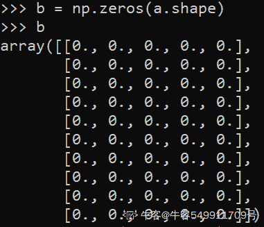

# 顺丰科技 2019 秋招人工智能与机器学习工程师笔试客观题合集

## 1

```cpp
public class CharToString {
 public static void main(String[] args)
 {
  char myChar = 'g';
  String myStr = Character.toString(myChar);
  System.out.println("String is: "+myStr);
  myStr = String.valueOf(myChar);
  System.out.println("String is: "+myStr);
 }
}
```

此代码片段输出正确的值是（）

正确答案: A   你的答案: 空 (错误)

```cpp
String is: g
String is: g
```

```cpp
String is: 103
String is: g
```

```cpp
String is: g
String is: 103
```

```cpp
String is: 103
String is: 103
```

本题知识点

Java 工程师 安卓工程师 顺丰科技 信息技术岗 顺丰科技 2019 iOS 工程师 顺丰科技 2019 Java 工程师 顺丰科技 2019 Java 工程师 顺丰科技 2019 Java 工程师 C++工程师 PHP 工程师 顺丰科技 2019 算法工程师 顺丰科技 2019 区块链 顺丰科技 2019 算法工程师 顺丰科技 2019 运维工程师 顺丰科技 2019 安卓工程师 顺丰科技 2019

讨论

[AppleJack](https://www.nowcoder.com/profile/130490159)

```cpp
public static String valueOf(char c) { char data[] = {c}; return new String(data, true);
}
```

直接查看源码，这里相当于新建了一个 String 类返回，那么显然选 A

发表于 2019-03-15 15:42:27

* * *

[我是如此相信](https://www.nowcoder.com/profile/7988004)

Character 类的方法如下：

```cpp
public static String toString(char c) {
    return String.valueOf(c);
}
```

编辑于 2019-03-25 09:03:31

* * *

[小强开学前](https://www.nowcoder.com/profile/4208515)

粗心看成了

```cpp
Integer.valueOf() 
```

发表于 2019-03-20 14:48:21

* * *

## 2

关于链表，正确的是（）

正确答案: A C   你的答案: 空 (错误)

```cpp
无需实现估计空间
```

```cpp
支持随机访问
```

```cpp
增删不必挪动元素
```

```cpp
所需空间与线性表长度成正比，并且地址连续
```

```cpp
插入一个元素所需挪动元素的平均个数为 n/2
```

本题知识点

Java 工程师 安卓工程师 顺丰科技 链表 *信息技术岗 2019 iOS 工程师 C++工程师 PHP 工程师 前端工程师 算法工程师 区块链* *讨论

[Wendy20190320100524](https://www.nowcoder.com/profile/331006331)

顺丰对前端工程师是不是有什么误解？

发表于 2019-03-20 10:08:16

* * *

[零次方](https://www.nowcoder.com/profile/5915615)

A 选项是不是应该改成：无需事先估计空间

发表于 2019-03-27 23:46:23

* * *

[neekity](https://www.nowcoder.com/profile/7732482)

B 不支持随机 D 地址不连续 E 增删不必挪动元素

发表于 2019-03-15 11:04:52

* * *

## 3

某打车公司将驾驶里程（drivedistanced）超过 5000 里的司机信息转移到一张称为 seniordrivers 的表中,他们的详细情况被记录在表 drivers 中，正确的 sql 为（）

正确答案: D   你的答案: 空 (错误)

```cpp
insert into seniordrivers
drivedistanced>=5000 from drivers where
```

```cpp
insert seniordrivers (drivedistanced) values from drivers where drivedistanced>=5000
```

```cpp
insert into seniordrivers
(drivedistanced)values>=5000 from drivers where
```

```cpp
select * into seniordrivers from drivers where drivedistanced >=5000
```

本题知识点

Java 工程师 安卓工程师 顺丰科技 数据库 SQL 信息技术岗 顺丰科技 2019 iOS 工程师 顺丰科技 2019 Java 工程师 顺丰科技 2019 Java 工程师 顺丰科技 2019 Java 工程师 C++工程师 PHP 工程师 顺丰科技 2019 安卓工程师 前端工程师 顺丰科技 2019 算法工程师 顺丰科技 2019 区块链 顺丰科技 2019 算法工程师 顺丰科技 2019 运维工程师 顺丰科技 2019 安卓工程师 顺丰科技 2019

讨论

[LIUKAI915](https://www.nowcoder.com/profile/661521241)

SQL SELECT INTO 语句可用于创建表的备份复件。
SELECT INTO 语句
SELECT INTO 语句从一个表中选取数据，然后把数据插入另一个表中。
SELECT INTO 语句常用于创建表的备份复件或者用于对记录进行存档。
SQL SELECT INTO 语法
您可以把所有的列插入新表：
SELECT * INTO new_table_name [IN externaldatabase] FROM old_tablename
或者只把希望的列插入新表：
SELECT column_name(s) INTO new_table_name [IN externaldatabase] FROM old_tablename
SQL SELECT INTO 实例 - 制作备份复件
下面的例子会制作 "Persons" 表的备份复件：
SELECT * INTO Persons_backup FROM Persons
IN 子句可用于向另一个数据库中拷贝表：
SELECT * INTO Persons IN 'Backup.mdb' FROM Persons
如果我们希望拷贝某些域，可以在 SELECT 语句后列出这些域：
SELECT LastName,FirstName
INTO Persons_backup
FROM Persons

发表于 2019-04-11 09:59:56

* * *

[赵子贺](https://www.nowcoder.com/profile/6118530)

SELECT INTO FROM 句式[`www.cnblogs.com/mq0036/p/4155136.html`](https://www.cnblogs.com/mq0036/p/4155136.html)

发表于 2019-03-12 22:32:33

* * *

[旧城俨然回眸笑](https://www.nowcoder.com/profile/6223383)

select into:copy information from one table into anotherselect */colums into newtable (in external db )from table

发表于 2020-06-23 16:10:18

* * *

## 4

关于 udp 协议，不正确的是（）

正确答案: A B D   你的答案: 空 (错误)

```cpp
udp 需要三次握手，但不需要建立连接
```

```cpp
2500B 的 udp 包能够一次穿透以太网
```

```cpp
DNS、NFS 和 SNMP 使用的是 UDP
```

```cpp
UDP 和 TCP 一样都会出现粘包问题
```

本题知识点

前端工程师 顺丰科技 算法工程师 网络基础 安卓工程师 2019

讨论

[neptoo](https://www.nowcoder.com/profile/870928103)

TCP 粘包，就是发送方发送的多个数据包，到接收方后粘连在一起，导致数据包不能完整的体现发送的数据。UDP 具有消息边界，不存在粘包问题。

发表于 2019-03-15 18:38:57

* * *

[黄色变白色](https://www.nowcoder.com/profile/8547911)

DP 不存在粘包问题，是由于 UDP 发送的时候，没有经过 Nagle 算法优化，不会将多个小包合并一次发送出去。另外，在 UDP 协议的接收端，采用了链式结构来记录每一个到达的 UDP 包，这样接收端应用程序一次 recv 只能从 socket 接收缓冲区中读出一个数据包。也就是说，发送端 send 了几次，接收端必须 recv 几次（无论 recv 时指定了多大的缓冲区）。UDP 最大载荷为 1472

编辑于 2020-05-06 16:59:31

* * *

[平行线上的交点](https://www.nowcoder.com/profile/578639625)

TCP 协议中需要三次握手和四次挥手，UDP 不需要

发表于 2019-03-20 13:51:41

* * *

## 5

快件信息表 waybillinfo(id, waybillno, zonecode, optype, update_time)中存储了快件的所有操作信息，请找出在'中山公园'网点，异常派送（optype='异常派件'）次数超过 3 次的快件(waybillno)，正确的 sql 为（）

正确答案: D   你的答案: 空 (错误)

```cpp
select waybillno, count(*) from waybillinfo where zonecode='中山公园' and optype='异常派件'
and count(waybillno) >3
```

```cpp
select waybillno, count(*) from waybillinfo where zonecode='中山公园' and optype='异常派件'
order by waybillno having count(*) > 3
```

```cpp
select waybillno, count(*) from waybillinfo where zonecode='中山公园' and optype='异常派件'
having count(*) > 3
```

```cpp
select waybillno from waybillinfo where zonecode='中山公园' and optype='异常派件'
group by waybillno having count(*) > 3
```

本题知识点

前端工程师 顺丰科技 算法工程师 数据库 SQL 安卓工程师 2019

讨论

[奶茶爱好者](https://www.nowcoder.com/profile/3982698)

大概复现了一下数据库表格式，那个 waybillno 其实是快递件的唯一标志，需要查询在中山公园异常派件的快递的单号，然后因为是聚集查询的结果，需要用 having 对 group by 的查询结果做过滤。

发表于 2019-10-17 17:40:10

* * *

[弱鸡=鶸](https://www.nowcoder.com/profile/551802625)

having 只能对 group by 的结果进行操作

having 只用来在 group by 之后，having 不可单独用，必须和 group by 用

2.拿着 where 指定的约束条件，去文件/表中取出一条条记录

3.将取出的一条条记录进行分组 group by，如果没有 group by，则整体作为一组

4.将分组的结果进行 having 过滤

> [`blog.csdn.net/weixin_34268753/article/details/85990663`](https://blog.csdn.net/weixin_34268753/article/details/85990663)

编辑于 2020-08-11 10:33:21

* * *

[正儿八经的苗子](https://www.nowcoder.com/profile/575184337)

1、where 之后不能以函数作为条件 2、3、    having 是对 group by 后的数据进行筛选过滤，必须要有 group by 才能用 having。

编辑于 2020-03-23 11:47:14

* * *

## 6

死锁产生的必要条件是（ ）

正确答案: A B C E   你的答案: 空 (错误)

```cpp
互斥
```

```cpp
请求与保持
```

```cpp
循环等待
```

```cpp
优先级高
```

```cpp
非剥夺
```

本题知识点

前端工程师 顺丰科技 算法工程师 操作系统 安卓工程师 2019

讨论

[君君 201903290917654](https://www.nowcoder.com/profile/493155953)


发表于 2019-04-02 15:19:19

* * *

[大星星和小猩猩](https://www.nowcoder.com/profile/9374535)

4 个条件，缺一不可。

发表于 2020-04-01 16:33:39

* * *

## 7

那些是 OSI 层（）

正确答案: A B   你的答案: 空 (错误)

```cpp
物理层、数据链路层
```

```cpp
传输层、网络层
```

```cpp
协议层
```

```cpp
UI 层
```

```cpp
服务层
```

本题知识点

前端工程师 顺丰科技 算法工程师 网络基础 安卓工程师 2019

讨论

[大橘已定](https://www.nowcoder.com/profile/6994957)

来自：[计算机网络面试核心梳理](https://www.cnblogs.com/sgh1023/p/10507526.html)

| OSI 七层模型 | TCP/IP 模型 | 功能 | TCP/IP 协议族 |
| 应用层 | 应用层 | 直接向用户提供服务，完成用户希望完成的各种网络操作 | HTTP，FTP，TFTP，DNS，Telnet，SMTP |
| 表示层 | 进行数据编解码，数据加解密和格式转换 | 没有协议 |
| 会话层 | 解除或建立与别的节点的联系，组织和协调两个会话进程之间的通信，并对数据交换进行管理 | 没有协议 |
| 传输层 | 传输层 | 向两台主机中进程之间的通信提供通用的数据传输服务，实现端到端连接 | TCP，UDP |
| 网络层 | 网络层 | 为分组交换网上的不同主机提供通信服务，也就是进行 IP 选址和路由选择 | IP，ICMP，RIP，IGMP |
| 数据链路层 | 数据链路层 | 在物理层提供的比特流基础上，通过差错控制、流量控制的方法，将由差错的物理线路变为无差错的、能可靠传输数据帧的数据链路 | SLIP，CSLIP，PPP，ARP，RARP， |
| 物理层 | 物理层 | 利用传输介质为数据链路层提供物理连接，实现相邻计算机节点之间比特流的透明传输 | IEEE802.1 A，IEEE802.2 到 IEEE802.11 |

发表于 2019-03-28 19:47:08

* * *

[前端崽](https://www.nowcoder.com/profile/9301294)

**TCP/IP 五层模型：**

1.  物理层
2.  连接层
3.  网络层
4.  传输层
5.  应用层

**OSI 七层模型：**

1.  物理层
2.  数据链路层
3.  网络层
4.  传输层
5.  会话层
6.  表示层
7.  应用层

编辑于 2019-03-24 20:38:50

* * *

[牛客网弟中弟](https://www.nowcoder.com/profile/5002895)

OSI 七层模型：物理层、数据链路层、网络层、传输层、会话层、表示层、应用层

编辑于 2019-03-14 10:30:52

* * *

## 8

二维数组 k[1..7,1..9],每元素大小占 2 个字节，而且使用列存储，a[5,4]的偏移量为（）个字节。

正确答案: D   你的答案: 空 (错误)

```cpp
78
```

```cpp
39
```

```cpp
25
```

```cpp
50
```

本题知识点

前端工程师 顺丰科技 算法工程师 数组 安卓工程师 2019

讨论

[____ 不名](https://www.nowcoder.com/profile/1047922)

a[5,4]左边有三列，上方有 4 行。列存储的话，a[5,4]前方有 3*7+4=25 个元素，共 50 个字节。

发表于 2019-03-15 20:25:04

* * *

[牛客 mmm](https://www.nowcoder.com/profile/354362950)


发表于 2020-09-08 10:49:23

* * *

[白芝麻](https://www.nowcoder.com/profile/705825789)

首先可以确定的是 9 行 7 列，问题中的 a[5][4]指的是在第五列的第四个，这个地方大家可能误解了，还有就是二维数组转化成一维数组的公式 a[x][y]=b[x*列数+y]，其中的 x,y 的起始地址为 0，不是 1，所以这题应该减一，也就是 a[4][3],3*7+4=25,再乘以 2 结果出来了。

发表于 2019-03-19 16:34:49

* * *

## 9

一个队列只能从右侧入队，左右侧皆可出队。顺序为 Ka、Kb、Kc、Kd、Ke 的序列入队后，不能得到的输出是（）

正确答案: D   你的答案: 空 (错误)

```cpp
Ka->Kb->Kc->Kd->Ke
```

```cpp
Ke->Kd->Kc->Kb->Ka
```

```cpp
Ka->Kb->Ke->Kc->Kd
```

```cpp
Ke->Ka->Kc->Kb->Kd
```

本题知识点

算法工程师 顺丰科技 队列 *2019* *讨论

[吃啥都不胖](https://www.nowcoder.com/profile/555139316)

把握好先进后出的原则：A.进一个出一个（Ka 右进左出，Kb 右进左出，Kc 右进左出，Kd 右进左出，Ke 右进左出，）B.所有的进去之后再依次出去（Ka，Kb，Kc，Kd，Ke 依次进入，Ke，Kd，Kc，Kb，Ka）C.Ka 右侧进，左侧出; Kb 右侧进，左侧出; Kc, Kd, Ke 依次进，Ke 右侧出，Kc 左侧出，Kd 左右均可出。

发表于 2019-06-28 10:42:45

* * *

[Yuixz](https://www.nowcoder.com/profile/180644)

D。A：均从左侧出队。B：均从右侧出队。C：先 Ka、Kb 从左侧出，再 Ke 从右侧出，再 Kc 从左侧出，最后是 Kd 出队。D：先 Ke 从右侧出，再 Ka 从左侧出，但 Kc 出队之前必须先 Kb 或 Kd 出队。故不能得到该选项的输出。

发表于 2019-09-24 15:37:52

* * *

## 10

"abcdefg" 中长度 2 的子串的个数是（）

正确答案: D   你的答案: 空 (错误)

```cpp
8
```

```cpp
7
```

```cpp
5
```

```cpp
6
```

本题知识点

算法工程师 顺丰科技 字符串 *2019* *讨论

[你的 offer 对我打了烊](https://www.nowcoder.com/profile/598309941)

是子串不是任意字符串，必须是连续的两个，n 个字符长度的字符串有 n-1 个长度为 2 的子串

发表于 2020-03-20 14:24:56

* * *

[#def](https://www.nowcoder.com/profile/142212204)

ab、cd、ef、bc、de、fg、恰好 6 个长度为 2 的字符串

发表于 2019-04-23 22:45:16

* * *

[ChengIsland](https://www.nowcoder.com/profile/658667819)

为什么'\0'不算进去？字符串的长度不包括‘\0’。

发表于 2020-07-29 17:14:39

* * *

## 11

关于链表，正确的是（）

正确答案: A C   你的答案: 空 (错误)

```cpp
无需实现估计空间
```

```cpp
支持随机访问
```

```cpp
增删不必挪动元素
```

```cpp
所需空间与线性表长度成正比，并且地址连续
```

本题知识点

算法工程师 顺丰科技 链表 *2019* *讨论

[Dr.LLL](https://www.nowcoder.com/profile/901187134)

链表不支持随机访问

发表于 2019-08-16 11:18:38

* * *

[#def](https://www.nowcoder.com/profile/142212204)

不需要增删元素，只需要改变链表地址即可

发表于 2019-04-23 22:46:21

* * *

[牛客 497162373 号](https://www.nowcoder.com/profile/497162373)

链表不支持随机访问。 链表的地址不一定连续

编辑于 2021-07-09 17:11:37

* * *

## 12

单链表的按升序排列，其中 L 指向头结点，写一个函数,若 start<元素<end，则删除，并释放空间。如 13->19->26->30->49->63,start=21,end=51,删除后为 13->19->63.结点定义及函数模板如下，请为（1)(2)(3)(4)处出选择合适的代码。

```cpp
typedef struct Node{
    int data;
    struct Node *next;
}Node,*LinkList;
int delList(LinkList L,int start,int end)
{
    (1) * q = L，*p = L->next;
     int delFlag = 0;
     while ( p )
         if ( p->data <= start)
             { q = p; p = (2);}
         else
             if ( p->data < end )
             {
                 q->next = (3); free(p);
                 p = (4); delFlag = 1;
              }
             else  break;
      if( delFlag == 0) return -1;
      return 0;
}
```

正确答案: D   你的答案: 空 (错误)

```cpp
(1)LinkList
(2)p->next
(3)p
(4)q->next
```

```cpp
(1)LinkList
(2)p->next
(3)p->next
(4)q->next
```

```cpp
(1)Node
(2)p->next
(3)p->next
(4)q
```

```cpp
(1)Node
(2)p->next
(3)p->next
(4)q->next
```

本题知识点

算法工程师 顺丰科技 链表 *2019* *讨论

[Realself](https://www.nowcoder.com/profile/831729261)

首先在 C 中，定义结构体变量时，必须要加上 struct 关键字，为了方便一般用 typedef 简化，题中 struct Node 被简化为 Node，struct Node * 被简化为 LinkList

题目中第 7 行有错误，中间的分号是错的，应该是逗号

*   （1）从后面 q->next，p->data 的使用看来，这里定义的是一级指针，应该用 Node，且 q 指向链表头结点，p 指向 data 为 13 的节点
*   （2）判断条件为 p->data<=start，是不需要删除的节点，q=p，使 q 指向当前节点，操作完成，看到整个 while 循环中，没有单独使指针 p 移动的语句，所以应在每个判断分支单独移动指针 p,所以,p=p->next
*   （3）判断条件为 p->data<end，是需要删除的节点，此时，指针 q 指向的还是前一个（并不一定是前面的节点）不需要删除的节点，让 q->next=p->next 以跳过当前节点，再 free 当前节点的资源
*   （4）操作完成后需要移动指针 p，应该是 p=q->next 而不是 p=p->next，因为此时 p 是一个悬空指针，p->next 是未定义的，而 q->next 指向的是释放资源前 p 指针下一个位置的指针

发表于 2020-03-12 13:10:05

* * *

[白酒烧烤](https://www.nowcoder.com/profile/80568422)

Node 结点定义了一个整型的数据 data 和一个结点*next，那么 next 是指向这个结点的指针，L 是一个 LinkList，因此 q 应该是一个结点类型的指针，*p 指向的是 L 中的下一个结点，当指针 p 指向的数据<=start 时，把指针 p 的值赋给指针 q，然后 p 指向 L 中的下个结点，以便下次循环对链表中的下一个结点进行判断；当指针 p 指向的数据<end 时,需要删除这个结点，将 p 指向的下个结点赋给 q 的指向，然后删除 p 中的数据，再将 p 指向刚才赋给 q 指向的结点。不知道对不对，希望大家批评指正……

发表于 2019-10-07 21:53:25

* * *

[HengV](https://www.nowcoder.com/profile/158271087)

谁能解释一下第(1)处为什么用 Node 而不用 LinkList?

发表于 2020-07-30 15:39:09

* * *

## 13

某打车公司要将驾驶里程（drivedistanced）超过 5000 里的司机信息转存到一张称为 seniordrivers 的表中，他们的详细情况被记录在表 drivers 中，正确的 sql 语句为（）

正确答案: D   你的答案: 空 (错误)

```cpp
insert into seniordrivers
drivedistanced>=5000 from drivers where
```

```cpp
insert seniordrivers (drivedistanced) values from drivers where drivedistanced>=5000
```

```cpp
insert into seniordrivers
(drivedistanced)values>=5000 from drivers where
```

```cpp
select * into seniordrivers from drivers where drivedistanced >=5000
```

本题知识点

算法工程师 顺丰科技 数据库 SQL 2019

讨论

[牛客 289730643 号](https://www.nowcoder.com/profile/289730643)

 select into from 要求目标表不存在，因为在插入时会自动创建。insert into select from 要求目标表存在

发表于 2021-11-07 09:51:51

* * *

[onionionion](https://www.nowcoder.com/profile/918862149)

ACwhere 子句有问题，B 是没有 into

发表于 2019-11-06 22:56:04

* * *

[菜鸡互啄 001](https://www.nowcoder.com/profile/847607041)

什么烂选项

发表于 2021-12-06 00:35:10

* * *

## 14

以下叙述中，正确的是（ ）

正确答案: A B C   你的答案: 空 (错误)

```cpp
通过创建唯一性索引，可以保证数据库表中每一行数据的唯一性
```

```cpp
当用户查询索引字段时，索引可以快速地执行检索操作，借助索引，在执行查询的时候不需要扫描整个表就可以快速地找到所需要的数据。
```

```cpp
创建索引和维护索引要耗费时间、空间,当对表中的数据进行增加、删除和修改的时候,会降低数据的维护速度
```

```cpp
一张表只能创建一个唯一索引
```

本题知识点

算法工程师 顺丰科技 数据库 2019

讨论

[Mongolia-Duck-king](https://www.nowcoder.com/profile/834147370)

D    MySQL 一张表可以有多个唯一索引 C   索引占用空间，所以增删改的速度会降低，但是能提高查询效率

发表于 2019-08-09 12:03:42

* * *

[桐梓林梁朝伟 666](https://www.nowcoder.com/profile/9917802)

通过创建唯一性索引，可以保证数据库表中每一行数据的唯一性唯一索引，一种[索引](https://baike.baidu.com/item/%E7%B4%A2%E5%BC%95/5716853)，不允许具有索引值相同的行，从而禁止重复的索引或键值。系统在创建该索引时检查是否有重复的键值，并在每次使用 INSERT 或 UPDATE 语句添加数据时进行检查。

发表于 2021-07-10 21:07:00

* * *

[牛客 304387765 号](https://www.nowcoder.com/profile/304387765)

 一张表可以有多个唯一索引

发表于 2021-10-19 09:41:33

* * *

## 15

用递归算法实现转换，如“uvxyz”转换后为“zyxvu”，请选择合适的语句（）

```cpp
void rev_str（char *s，int len）
{
    char ch;
    if ( len > 1)
        {
             ch = *s;
             *s = *(s+len-1);
             *(s+len-1) = ch;
             rev_str(?,?);
        }
}
```

正确答案: D   你的答案: 空 (错误)

```cpp
s,len-1
```

```cpp
s,len-2
```

```cpp
s+2,len-2
```

```cpp
s+1,len-2
```

本题知识点

递归

讨论

[HoneyEvans](https://www.nowcoder.com/profile/715328950)

*s 指向字符串的第一个，一次操作后将字符串首尾两个字符交换。一次交换后*s 指向下一个字符，同时待处理字符串长度减 2.选 D

发表于 2020-02-15 21:44:17

* * *

[THE_LIN](https://www.nowcoder.com/profile/680957182)

首先这个题其实很好选出答案，因为 s 一定是要+1 的，我们容易感到矛盾的是 len 为什么是-2 而不是-1，这是正好是因为 s 进行了+1，所以 len 需要-2，这样第二次循环*（s+len-1）才能指向字符串倒数第二个字符。

发表于 2020-06-12 08:56:18

* * *

[shope](https://www.nowcoder.com/profile/688458708)

首先，首尾字符交换(zvxyu);然后,第二个字符和倒二位置字符交换(zyxvu);最后 len＜1，递归停止。

发表于 2019-10-31 00:43:04

* * *

## 16

在有序表( 7, 13, 33, 87, 99, 97, 117, 123,129,131,137)中，使用二分查找算法查找 13 时需要的关键字比较次数是（）

正确答案: A   你的答案: 空 (错误)

```cpp
4
```

```cpp
3
```

```cpp
2
```

```cpp
5
```

本题知识点

查找 *讨论

[neekity](https://www.nowcoder.com/profile/7732482)

left, right=0,10step1\. mid=(left+right)//2=5  num[5]=97    13<97   right=mid-1=4step2. mid=(left+right)//2=2  num[2]=33    13<33   right=mid-1=1step3\. mid=(left+right)//2=0  num[0]=7      13>7     left=mid+1=1step4. mid=(left+right)//2=1  num[1]=13    13==13  break 应该是这样吧😂😂😂

发表于 2019-03-15 11:12:45

* * *

[BlackCarDriver](https://www.nowcoder.com/profile/1425406)

说好的有序呢？。。。

发表于 2020-05-06 16:07:54

* * *

[B.F.-kenway](https://www.nowcoder.com/profile/467180558)

注意最后确定的时候还要判断一次。

发表于 2020-01-16 20:46:39

* * *

## 17

以下函数的时间复杂度是( )

```cpp
void foo(int n, int x, int y) {
    int z = 0;
    if (n <= 0) {
       z = x + y;
    } else {
        foo(n - 1, x + 1, y);
        foo(n - 1, x, y + 1);
    }
}
```

正确答案: A   你的答案: 空 (错误)

```cpp
O(2^n)
```

```cpp
O(n)
```

```cpp
O(logn)
```

```cpp
O(n²)
```

本题知识点

复杂度 递归

讨论

[HDU_ducker](https://www.nowcoder.com/profile/5303747)

为什么不是 T(n)=T(n-1)+T(n-1)=2T(n-1)=...=2^n * T(1)  呢？

发表于 2019-08-28 11:35:46

* * *

[零葬](https://www.nowcoder.com/profile/75718849)

这个题有问题，没一个是对的，应该是 2^n

发表于 2020-10-28 12:00:59

* * *

[ycyaw](https://www.nowcoder.com/profile/820401078)

应该是 2^n 啊

发表于 2019-10-18 07:57:19

* * *

## 18

```cpp
public class CharToString {
 public static void main(String[] args)
 {
  char myChar = 'g';
  String myStr = Character.toString(myChar);
  System.out.println("String is: "+myStr);
  myStr = String.valueOf(myChar);
  System.out.println("String is: "+myStr);
 }
}
```

此代码片段输出正确的值是（）

正确答案: A   你的答案: 空 (错误)

```cpp
String is: g
String is: g
```

```cpp
String is: 103
String is: g
```

```cpp
String is: g
String is: 103
```

```cpp
String is: 103
String is: 103
```

本题知识点

算法工程师 顺丰科技 Java 2019

讨论

[球球大作战😬😬😬](https://www.nowcoder.com/profile/583033419)

```cpp
public static String toString(char c) { return String.valueOf(c); }
```

```cpp
 public static String valueOf(char c) { char data[] = {c}; return new String(data, true); }
```

返回的都是字符串,只有 char 变成 int 的时候才会变为对应的 assic 码

编辑于 2019-07-31 15:24:42

* * *

[越王怒江](https://www.nowcoder.com/profile/8309948)

```cpp
//源码 toString 调用 String.valueOf() valueOf 重载 返回不同的值

public static String toString(char c) { return String.valueOf(c);
}
```

```cpp
public static String valueOf(int i) { return Integer.toString(i);
}
```

```cpp
public static String valueOf(char c) { char data[] = {c}; return new String(data, true);
}
```

编辑于 2019-08-11 17:59:32

* * *

[本拉～迪](https://www.nowcoder.com/profile/990749866)

记一下，只有 char 变为 int 才需要变数字

发表于 2020-06-15 19:07:27

* * *

## 19

以下这段代码的输出结果为()

```cpp
import numpy as np
a = np.repeat(np.arange(5).reshape([1,-1]),10,axis = 0)+10.0
b = np.random.randint(5, size= a.shape)
c = np.argmin(a*b, axis=1)
b = np.zeros(a.shape)
b[np.arange(b.shape[0]), c] = 1
print b
```

正确答案: D   你的答案: 空 (错误)

```cpp
Hello World!
```

```cpp
一个 shape = (5,10) 的随机整数矩阵
```

```cpp
一个 shape = (5,10) 的 one-hot 矩阵
```

```cpp
一个 shape = (10,5) 的 one-hot 矩阵
```

本题知识点

算法工程师 顺丰科技 Python 2019

讨论

[匪怡所思](https://www.nowcoder.com/profile/549911709)

😂请原谅我是个菜鸟，一个一个拆分才弄懂到底怎么回事……


```cpp
#生成数组[0,1,2,3,4]
np.arange(5)
#原数组共有 x 个元素，reshape([n,-1])意思是将原数组重组为 n 行 x/n 列的新数组
#所以数组共有 5 个元素，重组为 1 行 5 列的数组
reshape([1,-1])
#因为 axis=0，所以是沿着横轴方向重复，增加行数
#所以原数组增加 10 行
repeat(np.arange(5).reshape([1,-1]), 10, axis = 0)
#数组每个元素都+10
a = repeat(np.arange(5).reshape([1,-1]), 10, axis = 0) + 10
```


随机生成大小为 a.shape 的数组，数组元素为 0,5)区间范围的整数。生成 a.shape 大小的全零数组。
b.shape[0]表示 b 的行数，10 行 b[np.arange(10), c]=1 表示 np.arange(10)生成的数组中，所有 c 对应的位置全置为 1。

发表于 2020-02-16 05:47:05

* * *

[关关(→o←)](https://www.nowcoder.com/profile/578096915)

```cpp
a = np.repeat(np.arange(5).reshape([1,-1]),10,axis = 0)+10.0 
```

np.repeat(a,b)将 a 重复 b 次，np.arange(5).reshape([1,-1])创建等差数组，1 行，列未知即【1，2，3，4，5】按行重复 10 次，广播每一个值加 10

```cpp
b = np.random.randint(5, size= a.shape)
```

生成[0,5)随机矩阵，大小和矩阵 a 相同 

```cpp
c = np.argmin(a*b, axis=1)

```

矩阵 a 和 b 乘积，返回每行最小值位置

```cpp
b = np.zeros(a.shape)
```

与矩阵 a 相同大小的全零矩阵

```cpp
b[np.arange(b.shape[0]), c] = 1
```

b 中所有 c 返回位置置为 1 如有错误请指正

发表于 2019-03-19 19:15:26

* * *

[老白强无敌](https://www.nowcoder.com/profile/251239404)

能不能把写这种代码的人给开除了，给这个世界一点爱！

发表于 2020-06-15 17:37:55

* * *

## 20

已知 a = [1, 2, 3]和 b = [1, 2, 4]，那么 id(a[1])==id(b[1])的执行结果 （）

正确答案: A   你的答案: 空 (错误)

```cpp
True
```

```cpp
False
```

本题知识点

算法工程师 顺丰科技 Python 2019

讨论

[newcomer](https://www.nowcoder.com/profile/291053)

python 中对于小整数对象有一个小整数对象池，范围在[-5,257）之间。对于在这个范围内的征数，不会新建对象，直接从小整数对象池中取就行。

发表于 2019-07-07 10:37:58

* * *

[Jazzzzz](https://www.nowcoder.com/profile/625461369)

id（object）是 python 的一个函数用于返回 object 的内存地址。但值得注意的是，python 为了提高内存利用效率会对一些简单的对象（如数值较小的 int 型对象，字符串等）采用重用对象内存的办法。

发表于 2019-05-22 20:49:45

* * *

[难凉热血](https://www.nowcoder.com/profile/699260031)

```cpp
print(id(a[1]) ==id (b[1])) True

```

```cpp
print((a[1]) is (b[1])) True
```

1、is 比较两个对象的 id 值是否相等，是否指向同一个内存地址；
2、== 比较的是两个对象的内容是否相等，值是否相等在 python3.6 中对于小整数对象有一个小整数对象池，范围不止在[-5,257）之间。我试了百万以上的数地址都是相同的

发表于 2019-10-09 10:50:37

* * *

## 21

Python2 中，以下不能在 list 中添加新元素的方法是（）

正确答案: B   你的答案: 空 (错误)

```cpp
append()
```

```cpp
add()
```

```cpp
extend()
```

```cpp
insert()
```

本题知识点

顺丰科技 2019 Python

讨论

[理想汽车部门直推官](https://www.nowcoder.com/profile/953506955)

list 中的操作：

list 中没有 add，add（）是字典中的操作

发表于 2020-07-18 10:09:27

* * *

[吃啥都不胖](https://www.nowcoder.com/profile/555139316)

1\. 列表可包含任何数据类型的元素，单个列表中的元素无须全为同一类型。
2\. append() 方法向列表的尾部添加一个新的元素。只接受一个参数。
3\. extend()方法只接受一个列表作为参数，并将该参数的每个元素都添加到原有的列表中。4\. insert() 将一个元素插入到列表中，但其参数有两个（如 insert(1,”g”)），第一个参数是索引点，即插入的位置，第二个参数是插入的元素。

发表于 2019-06-28 10:57:46

* * *

[谁用了我的昵称这个昵称也被占用了](https://www.nowcoder.com/profile/378067992)

参见博客园博文：[`www.cnblogs.com/yxtz271828/p/10790506.html`](https://www.cnblogs.com/yxtz271828/p/10790506.html)**append()函数：将新元素追加到列表末尾**

```cpp
In [1]: a = [1, 2, 3, 4, 5]
In [2]: a.append(6)
In [3]: a
Out[3]: [1, 2, 3, 4, 5, 6]
```

**extend(): 通过该函数可以将另一个列表中的元素逐一添加到指定列表中**
 **比如使用 append()函数：

```cpp
In [1]: a = [1, 2]
In [2]: b = [3, 4]
In [3]: a.append(b)
In [4]: a
Out[4]: [1, 2, [3, 4]]
```

使用 extend()函数的效果：

```cpp
In [1]: a = [1, 2]
In [2]: b = [3, 4]
In [3]: a.extend(b)
In [4]: a
Out[4]: [1, 2, 3, 4]
```** **insert()函数：**将新元素添加到指定索引号前面****

```cpp
**In [1]: a = [1, 2, 3, 4, 5]
In [2]: a.insert(0, 0)
In [3]: a
Out[3]: [0, 1, 2, 3, 4, 5]**
```

**insert(index, object)**

它接受两个参数，第一个参数是索引号，第二个参数是待添加的新元素  

发表于 2021-01-28 09:42:41

* * *

## 22

下列关于分类器的说法中不正确的是（）

正确答案: C   你的答案: 空 (错误)

```cpp
SVM 的目标是找到使得训练数据尽可能分开且分类间隔最大的超平面，属于结构风险最小化
```

```cpp
Naive Bayes 是一种特殊的 Bayes 分类器，其一个假定是每个变量相互条件独立。
```

```cpp
Xgboost 是一种优秀的集成算法，其优点包括速度快、对异常值不敏感、支持自定义损失函数等等
```

```cpp
随机森林中列采样的过程保证了随机性，所以就算不剪枝，也不容易出现过拟合。
```

本题知识点

算法工程师 顺丰科技 机器学习 2019

讨论

[干豆豆浆](https://www.nowcoder.com/profile/762368640)

xgboost 对异常值敏感

发表于 2019-08-04 18:25:51

* * *

[Jackson_888](https://www.nowcoder.com/profile/951951941)

随机森林不需要剪枝，因为本类就很大方差，防止过拟合 GBDT 核心在于每一棵树学的是之前所有树的结论和的残差，残差是一个加预测值后能得到真实值得累加量，xgboost 和 GBDT 差不多，不过还支持线性分类器 xgboost 可以自定损失函数，速度很快，但是对异常值很敏感

发表于 2019-08-02 00:04:15

* * *

[darthy 想成为思想极客](https://www.nowcoder.com/profile/602589253)

这个题 B 应该也是错的吧，只能说条件独立吧。

发表于 2019-09-13 12:23:46

* * *

## 23

下列关于线性回归说法错误的是（）

正确答案: D   你的答案: 空 (错误)

```cpp
在现有模型上，加入新的变量，所得到的 R² 的值总会增加
```

```cpp
线性回归的前提假设之一是残差必须服从独立正态分布
```

```cpp
残差的方差无偏估计是 SSE/(n-p)
```

```cpp
自变量和残差不一定保持相互独立
```

本题知识点

算法工程师 顺丰科技 机器学习 2019

讨论

[newcomer](https://www.nowcoder.com/profile/291053)

维基百科，线性回归。

发表于 2019-07-07 11:35:16

* * *

[南瓜风](https://www.nowcoder.com/profile/911953959)

增加一个新的特征，R² 不是有可能增加有可能不变吗？

发表于 2019-12-28 21:20:12

* * *

[是咸蛋黄呀](https://www.nowcoder.com/profile/464816781)

答案有问题吧，D 不是内生解释变量问题吗

发表于 2021-03-17 11:01:13

* * *

## 24

关于机器学习算法正确的是（）

正确答案: C   你的答案: 空 (错误)

```cpp
LR 模型在加入正则化项后 Variance 将增大
```

```cpp
线性 SVM 是寻找最小边缘的超平面的一个分类器
```

```cpp
xgboost 和 GDBT 都是属于 boosting 算法
```

```cpp
xgboost 和随机森林都是属于 bagging 算法
```

本题知识点

算法工程师 顺丰科技 机器学习 2019

讨论

[cincin 是菜鸡](https://www.nowcoder.com/profile/936525172)

个人感觉只有 C 是对的，A 项加入正则化项方差应该减小，B 项是间隔最大，D 项只有随机森林属于 bagging。

发表于 2019-08-26 09:40:12

* * *

[佳恩](https://www.nowcoder.com/profile/47690309)

哪位能解释一下 A 选项吗？为什么 LR 加入正则化 Variance 会增大，正则化之后参数更平滑了，不是变小吗

发表于 2019-03-14 20:57:50

* * *

[Yisnow.](https://www.nowcoder.com/profile/820660435)

A 选项：LR 加入正则化后过拟合能力下降（泛化能力增大），即模型的方差增大。

发表于 2020-04-07 09:06:17

* * *

## 25

以下说法正确的是（）

正确答案: D   你的答案: 空 (错误)

```cpp
增加模型复杂度，模型在测试集上的准确率就能更好
```

```cpp
L2 正则化的解通常是稀疏的，L1 正则化可以使得参数趋向于更平滑
```

```cpp
对于 PCA，我们应该选择是的模型具有最小 variance 的主成分
```

```cpp
每次使用 K-means 算法得到的聚类结果可能会不一样
```

本题知识点

算法工程师 顺丰科技 机器学习 2019

讨论

[平行线上的交点](https://www.nowcoder.com/profile/578639625)

A 肯定会过拟合好吧，最多提高训练集准确性；B 完全说反了好吧，真逗，个人认为答案只有 D

编辑于 2019-11-28 12:32:40

* * *

[彩虹＆光芒](https://www.nowcoder.com/profile/855439489)

A 选项 应该是训练集上的准确率更好吧

发表于 2019-03-14 11:36:20

* * *

[顺利毕业和拿到大厂 offer](https://www.nowcoder.com/profile/664717962)

A 选项过拟合 L1 正则化会产生稀疏矩阵的吧， 这答案是认真的吗

发表于 2019-03-27 15:34:51

* * *

## 26

下列关于 PCA 的说法错误的是（）

正确答案: A   你的答案: 空 (错误)

```cpp
PCA 的结果受异常值的影响较小
```

```cpp
对任何一个的矩阵来说，它的奇异值分解总是存在
```

```cpp
各个主成分变量之间是保持相互垂直的
```

```cpp
第一个主成分的方差总是大于其他所有的主成分的方差
```

本题知识点

算法工程师 顺丰科技 概率统计 *2019 概率论与数理统计* *讨论

[wzhao](https://www.nowcoder.com/profile/1768674)

为什么我这边显示不全

发表于 2019-03-20 22:07:19

* * *

[简雨 Jane](https://www.nowcoder.com/profile/980846978)

缺点是 PCA 算法容易受异常值的影响发生偏离

发表于 2021-03-13 15:47:52

* * *

[KaryJo](https://www.nowcoder.com/profile/438277082)

正确答案 A，然后 A 的选项不完整，呵呵

发表于 2020-09-21 16:07:15

* * *

## 27

EM 算法是（）

正确答案: B   你的答案: 空 (错误)

```cpp
有监督
```

```cpp
无监督
```

```cpp
半监督
```

```cpp
都不是
```

本题知识点

算法工程师 顺丰科技 机器学习 2019

讨论

[Joweay](https://www.nowcoder.com/profile/624075751)

EM 算法通过逐步提高极大似然的下限，以此求出极大似然函数对参数的估计，为无监督算法

发表于 2019-08-02 11:38:05

* * *

[不知道叫啥名字](https://www.nowcoder.com/profile/622038691)

EM（Expectation-Maximization）算法，称为期望最大值化算法，是无监督的算法。

发表于 2019-08-01 19:45:03

* * *

[绿杨烟外](https://www.nowcoder.com/profile/690418867)

我对 EM 的理解是他和梯度下降，坐标下降一样是一种求解未知参数的优化方法。PRML 上的解释是 EM 是专门为优化似然函数定做的特殊算法，试图为解决完备数据（complete data）问题建立工具。这题选了 D。聚类，Kmeans 显然地属于无监督。但是如果把降维也算作无监督，选 A 也不是不能理解。

发表于 2022-02-22 11:02:38

* * *

## 28

下列哪项叙述是正确的（）

正确答案: B C   你的答案: 空 (错误)

```cpp
Adaboost 可以降低方差
```

```cpp
Xgboost 可以降低偏差
```

```cpp
Random Forest 可以降低方差
```

```cpp
Decision Tree 可以降低偏差
```

本题知识点

算法工程师 顺丰科技 机器学习 2019

讨论

[neekity](https://www.nowcoder.com/profile/7732482)

Bagging 降方差 Boosting 降偏差 应该是 BC 吧？

发表于 2019-03-15 11:42:46

* * *

[PKU_xiaowei](https://www.nowcoder.com/profile/291394677)

任何一个有用的模型都可以降低偏差吧

发表于 2020-03-24 18:36:32

* * *

[cincin 是菜鸡](https://www.nowcoder.com/profile/936525172)

对于 A 选项，个人感觉是降低偏差，因为它也始于 boost 类方法。正确答案是 BC。

发表于 2019-08-26 09:43:27

* * *

## 29

以下方法属于集成方法的是（）

正确答案: A B C D   你的答案: 空 (错误)

```cpp
bagging
```

```cpp
stacking
```

```cpp
blending
```

```cpp
boosting
```

本题知识点

算法工程师 顺丰科技 机器学习 2019

讨论

[枫叶@](https://www.nowcoder.com/profile/488242410)

答案：ABCD

编辑于 2019-10-19 12:15:52

* * *

[pamelaaaa](https://www.nowcoder.com/profile/382560500)

应该全选吧？

发表于 2019-03-16 01:16:30

* * *

[你永远得不到的祖奶奶](https://www.nowcoder.com/profile/855996890)

Blend 是啥意思

发表于 2020-08-02 00:25:59

* * *

## 30

以下排序算法平均时间复杂度和插入排序相同的是（）

正确答案: A   你的答案: 空 (错误)

```cpp
冒泡排序
```

```cpp
堆排序
```

```cpp
希尔排序
```

```cpp
归并排序
```

本题知识点

排序 *讨论

[三叶堇](https://www.nowcoder.com/profile/633774529)

网上很多这种图

发表于 2020-05-04 22:33:43

* * *

[亮亮 12](https://www.nowcoder.com/profile/4218053)

```cpp
/**
 * @author yyl
 * @date 2018/11/17 下午 11:06
 * 排序法	平均时间	最差情形	    稳定度	额外空间	 备注
 * 冒泡	    O(n2)	  O(n2)  	稳定  	O(1)	n 小时较好
 * 选择   	O(n2)	  O(n2) 	不稳定   O(1)	n 小时较好
 * 插入   	O(n2)	  O(n2)	    稳定 	O(1)	大部分已排序时较好
 * 基数   	O(logRB)  O(logRB)	稳定	    O(n)
 * 快速	    O(nlogn)  O(n2)  	不稳定	O(nlogn)	n 大时较好
 * 归并   	O(nlogn)  O(nlogn)  稳定	    O(1)	n 大时较好
 * 堆	    O(nlogn)  O(nlogn)	不稳定	O(1)	n 大时较好
 */
```

发表于 2019-08-12 14:45:53

* * *

[你永远得不到的祖奶奶](https://www.nowcoder.com/profile/855996890)

我给记错了：最好和最坏的时间复杂度都一样的是：归并排序算法。同时，选择排序，插入排序和冒泡排序的时间复杂度都是 n²

编辑于 2020-05-26 23:15:37

* * *

## 31

丰巢柜中有 A、B、C、D、E、F 六个人的快递，每个人各有两个快递。现在随机取出 5 个快递，那么 5 个快递中至少有 2 个快递属于同一个人的概率是多少？（）

正确答案: B   你的答案: 空 (错误)

```cpp
0.242424242424242
```

```cpp
0.757575757575758
```

```cpp
0.606060606060606
```

```cpp
0.333333333333333
```

本题知识点

算法工程师 顺丰科技 概率统计 *2019 概率论与数理统计* *讨论

[think_lee](https://www.nowcoder.com/profile/205081922)

此题，分母如果用取柜子，取法很复杂，就直接不要取柜子这种做法(不在柜子的条件下取)，即直接从 12 个快递中取 5 个；此外，题干为至少两个快递属于同一人，反面是最多一个快递属于同一人，即 5 个快递来自不同的柜子，所以概率为 1-C（5,6）2⁵/C(5,12)

发表于 2019-03-22 17:39:32

* * *

[Jazzzzz](https://www.nowcoder.com/profile/625461369)

从 12 个快递中取 5 个，一共有 C[12]⁵中取法。至少的逆命题就是最多。该命题的逆命题则是没有一个相同的取法。即从 6 个人中选五个人（保证了快递不相同）共 C[6]⁵=C[6]¹=6 种取法，每个人的选择又有两种(从两个快递中选一个)共 2⁵种取法。所以概率为 p=6*2⁵*  /  C[12]⁵ = 0.242424...故  1-9 = 0.757575...

发表于 2019-05-22 20:59:14

* * *

[huluact](https://www.nowcoder.com/profile/356516277)

组合 C(n,m)表示从 m 中选 n 个（C(1,6)*C(3,5)*2*2*2+C(2,6)*C(1,4)*2） / (C(5,12))=0.7575

编辑于 2019-03-17 16:12:17

* * *

## 32

假设有三个人同时参加这场笔试，假设满分为 1，三个人的得分符合分布 U（0，1）。那么三个人最低分的期望为？（）

正确答案: C   你的答案: 空 (错误)

```cpp
1
```

```cpp
1/3
```

```cpp
1/4
```

```cpp
1/6
```

本题知识点

算法工程师 顺丰科技 概率统计 *2019 概率论与数理统计* *讨论

[neekity](https://www.nowcoder.com/profile/7732482)


求导得到


求期望


n=3 所以答案是 1/4

最后大家可以用代码验证一下

```cpp
import random
n=10000000
res=0
for _ in range(n):
    a=random.random()
    b=random.random()
    c=random.random()
    res+=min(a,b,c)
r=res/n
```

发表于 2019-03-15 12:23:25

* * *

[塞莱斯特的雨](https://www.nowcoder.com/profile/267374185)

对于任意一人分数 x，其是三人最低分的概率为（1-x）²
三人总期望为 1/4

发表于 2019-08-06 11:26:35

* * *

[P-ShineBeam](https://www.nowcoder.com/profile/945440246)


编辑于 2019-08-15 11:19:01

* * ***********