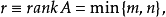

# 顺丰科技 2019 秋招运筹优化算法工程师笔试客观题合集

## 1

若使用枚举法求解 TSP 算法，则时间复杂度是（）

正确答案: B   你的答案: 空 (错误)

```cpp
n!
```

```cpp
(n-1)!
```

```cpp
n²
```

```cpp
n
```

本题知识点

算法工程师 顺丰科技 复杂度 2019

讨论

[I_Yoo](https://www.nowcoder.com/profile/942030462)

枚举法解决旅行商问题，即在一个连通图里在每一个节点上进行穷举，第一个节点为 n-1，第二个节点 n-2，……，即为(n-1)!

发表于 2019-03-23 18:15:30

* * *

[川久保玲球](https://www.nowcoder.com/profile/6629159)

TSP 问题（Traveling Salesman Problem, 旅行商问题）：假设有一个旅行商人要拜访 n 个城市，他必须选择所要走的路径，路径的限制是每个城市只能拜访一次，而且最后要回到原来出发的城市。路径的选择目标是要求得的路径路程为所有路径之中的最小值。

发表于 2020-08-19 21:57:24

* * *

## 2

设线性规划的约束条件为：


则基本可行解为 （）

正确答案: C   你的答案: 空 (错误)

```cpp
(0, 0, 4, 3)
```

```cpp
(3, 4, 0, 0)
```

```cpp
(2, 0, 1, 0)
```

```cpp
(3, 0, 4, 0)
```

本题知识点

算法工程师 顺丰科技 组合数学 *机器学习 2019* *讨论

[Fabulous_HK](https://www.nowcoder.com/profile/201232292)

都代入一遍，就知道是不是基本可行解了

发表于 2020-08-30 10:41:11

* * *

[洋 199601](https://www.nowcoder.com/profile/692287332)

只有 C 项满足第一个约束条件，所以其余约束条件就可以直接跳过了

发表于 2019-03-26 15:28:52

* * *

[门扣](https://www.nowcoder.com/profile/790195824)

一个个代进去排查

发表于 2020-05-01 17:43:30

* * *

## 3

如下代码，执行结果为：

```cpp
def f(x):
    if x == 0:
        return 0
    elif x == 1:
        return 1
    else:
        return (x*f(x-1))
print(f(5))
```

正确答案: A   你的答案: 空 (错误)

```cpp
120
```

```cpp
720
```

```cpp
24
```

```cpp
64
```

本题知识点

算法工程师 顺丰科技 2019 Python

讨论

[L＆QWQ](https://www.nowcoder.com/profile/264973017)

大概意思是说：如果 x=5，那么就返回 5*f(4) 的值。而想知道这个值，就得先算出 f(4) 等于多少。根据函数 f(x)，f(4) = 4*f(3)，所以 f(5) = 5*4*f(3)。以此类推，推到 f(5) = 5*4*3*2*f(1)。函数 f(x) 说了，当 x==1 时，返回值为 1。所以：f(5) = 5*4*3*2*1 = 120。所以，输出结果如下：

> 120

发表于 2019-11-15 10:01:36

* * *

[love_truth](https://www.nowcoder.com/profile/259223425)

谁添加顺丰的题, 全部不是 java 的..  真恶心

编辑于 2019-08-05 08:59:21

* * *

[jared456](https://www.nowcoder.com/profile/4154988)

虽然做对了，但这是一道 python 题啊

发表于 2019-08-07 19:44:14

* * *

## 4

互为对偶的两个线性规划问题的解存在关系（）

正确答案: B   你的答案: 空 (错误)

```cpp
原问题无可行解，对偶问题也无可行解
```

```cpp
对偶问题有可行解，原问题可能无可行解
```

```cpp
若最优解存在，则最优解相同
```

```cpp
一个问题无可行解，则另一个问题具有无界解
```

本题知识点

算法工程师 顺丰科技 机器学习 组合数学 *2019* *讨论

[GoodFellow201904261341544](https://www.nowcoder.com/profile/875109857)

在线性规划早期发展中最重要的发现就是对偶问题，即每一个[线性规划](https://baike.baidu.com/item/%E7%BA%BF%E6%80%A7%E8%A7%84%E5%88%92)问题(称为原始问题)都有一个与它对应的对偶线性规划问题（称为对偶问题）A  D 原问题无可行解 对偶问题可能是无可行解，也可能是***解


发表于 2019-08-15 16:43:06

* * *

[Yuerya](https://www.nowcoder.com/profile/363083827)

对于 C,   原问题与其对偶问题目标函数，一个的最大值和另一个的最小值相等。最优解是指变量 x 的，而不是指目标函数的取值 y 的。

发表于 2021-04-11 00:24:22

* * *

[游泳健将 SSS](https://www.nowcoder.com/profile/242565499)

C 为何不对？

发表于 2020-10-23 21:50:08

* * *

## 5

下图中①到⑦的最短路径为（）

正确答案: A   你的答案: 空 (错误)

```cpp
8
```

```cpp
10
```

```cpp
7
```

```cpp
9
```

本题知识点

图

讨论

[Chrety](https://www.nowcoder.com/profile/994602167)

D1->3->6->4->7

发表于 2019-08-26 08:00:45

* * *

[脑瓜疼。。](https://www.nowcoder.com/profile/543823954)

1--3--6--4--7；；；最短路径 D

发表于 2022-01-03 15:25:00

* * *

[牛客 981403128 号](https://www.nowcoder.com/profile/981403128)

1-3-6-4-7

发表于 2020-07-14 11:08:34

* * *

## 6

在下面的数学模型中，属于线性规划模型的（）

正确答案: B   你的答案: 空 (错误)

本题知识点

算法工程师 顺丰科技 组合数学 *2019* *讨论

[GoodFellow201904261341544](https://www.nowcoder.com/profile/875109857)

***线性规划问题的目标函数及约束条件均为线性函数（因此直接排除 A C D?)***线性规划的中心思想是求解出个约束条件的目标函数最优解描述线性规划问题的常用和最直观形式是标准型。标准型包括以下三个部分：一个需要极大化的线性函数: 
以下形式的问题约束：
  
  
 和非负变量：
  
  其他类型的问题，例如极小化问题，不同形式的约束问题，和有负变量的问题，都可以改写成其等价问题的标准型。所以 B 可以改写成 max S = -（3X + Y）Y - X >= -2X, Y >= 0 如有错误欢迎指出

编辑于 2019-08-15 15:42:19

* * *

[教练我想要个 offer](https://www.nowcoder.com/profile/48272671)

数学模型（1）列出约束条件及目标函数线性规划步骤（2）画出约束条件所表示的[可行域](https://baike.baidu.com/item/%E5%8F%AF%E8%A1%8C%E5%9F%9F)（3）在可行域内求目标函数的最优解及最优值描述线性规划问题的常用和最直观形式是标准型。标准型包括以下三个部分：一个需要极大化的线性函数: 
以下形式的问题约束：
  
  
 和非负变量：
  
  
其他类型的问题，例如极小化问题，不同形式的约束问题，和有负变量的问题，都可以改写成其等价问题的标准型。

发表于 2019-08-08 19:50:28

* * *

## 7

如下程序会打印多少个数:（）

```cpp
k = 1000
while k > 1:
    print k
    k = k/2
```

正确答案: B   你的答案: 空 (错误)

```cpp
1000
```

```cpp
10
```

```cpp
11
```

```cpp
9
```

本题知识点

算法工程师 顺丰科技 Python 2019

讨论

[名字想不好](https://www.nowcoder.com/profile/1952229)

python2 和 python3 的除法有坑的啊😂网站 python 出的题目也有点小坑，没说明是 2 还是 3，不过 print 没加括号，应认为是 python2。网站判的答案也是错的，它给的是 B,10 个，其实 应该是 D 9 个，第一个高赞答案是对的。python2 整数除法/时，会取整的，所以应该是 9 个。python3 除法/，结果是浮点的，所以是 10 个，除非用地板除//取整，是 9 个。

发表于 2020-02-12 10:14:10

* * *

[给我 offer 吧我要哭了](https://www.nowcoder.com/profile/230952597)

100050025012562311573 打印完 3,之后 k=1 退出循环，所以 9 次

发表于 2019-08-09 21:53:58

* * *

[磨难当头](https://www.nowcoder.com/profile/39989339)

```cpp
k = 1000
sum = 0
while k > 1:
    sum += 1
    print(k)
    k = k/2
print(sum)
# 1000
# 500.0
# 250.0
# 125.0
# 62.5
# 31.25
# 15.625
# 7.8125
# 3.90625
# 1.953125
# 10
# 代码运行应该是 10 个，python 是不会自动取整的，题目应该是取整后的结果！
```

发表于 2019-03-15 11:13:00

* * *

## 8

以下哪个算法不是整数规划的精确算法（）

正确答案: B   你的答案: 空 (错误)

```cpp
分支定价
```

```cpp
单纯型算法
```

```cpp
Benders’分解
```

```cpp
隐枚举
```

本题知识点

算法工程师

讨论

[一起学习嘛](https://www.nowcoder.com/profile/187832646)

分支定价类似于分支定界，但在求解 LP 松弛时使用列生成 。分支定界我理解就是一种有规律的枚举，所以它是可以求出精确的解。分支定界几个关键点就是设定界限函数，随着搜索的过程中逐渐更新界限，直至上界和下界重合；构建节点表，在每个分支的过程中需要将信息记录下来，按照某一个标准在节点表里储存，后续取点删点。Benders 分解技术是一种求解混合整数规划问题的算法。Benders 分解算法将具有复杂变量的规划问题分解为线性规划和整数规划，用割平面的方法分解出主问题与子问题，通过迭代的方法求解出最优值。Benders 分解算法是一个很常用的算法,用来计算像最小整数非线性规划问题和随机规划问题之类的难以计算的难题。理论上来说，Benders 算法是能解决大部分的整数规划问题。在实际运用中，它主要是从求解的运算次数和运算时间上来使求解问题得到优化单纯形算法从线性方程组找出一个个的单纯形，每一个单纯形可以求得一组解，然后再判断该解使目标函数值是增大还是变小了，决定下一步选择的单纯形。通过优化迭代，直到目标函数实现最大或最小值。隐枚举法(implicit enumeration method)一种特殊的分支定界法。对 0-1 规划问题，利用变量只能取 0 或 1 的两个值的特性，进行分支定界，以达到隐枚举的目的。0-1 规划是一种特殊的纯[整数规划](https://baike.baidu.com/item/%E6%95%B4%E6%95%B0%E8%A7%84%E5%88%92)。 

发表于 2019-03-21 16:58:48

* * *

[你的 offer 对我打了烊](https://www.nowcoder.com/profile/598309941)

顺丰的题也太。。。好吧，菜是原罪🙃

发表于 2020-03-21 20:42:54

* * *

## 9

若考虑入职的公司时，使用地点和影响力两个指标，分别占权重 17%和 83%，给出下面四所大学的指标排序结果如下，若使用层次分析法，应选择哪个公司（）

正确答案: C   你的答案: 空 (错误)

```cpp
A 公司
```

```cpp
B 公司
```

```cpp
C 公司
```

```cpp
D 公司
```

本题知识点

算法工程师 顺丰科技 组合数学 *2019* *讨论

[十月加油](https://www.nowcoder.com/profile/55493493)

A=np.array([12.7,25.6,56.9,4.8]) B=np.array([34,23.9,25,17.1]) A*0.17+B*0.83Out: array([30.379, 24.189, 30.423, 15.009])30.423 最大

发表于 2019-07-30 20:09:21

* * *

[菜鸡准备转岗](https://www.nowcoder.com/profile/836159636)


发表于 2019-08-24 13:54:02

* * *

## 10

下列函数定义中，有语法错误的是（）

正确答案: A D   你的答案: 空 (错误)

```cpp
void fun(int x, int y){x = *y;}
```

```cpp
int * fun(int *x, int y){return x += y;}
```

```cpp
void fun(int *x, int y){*x += y;}
```

```cpp
void fun(int x, int y){*x = *y;}
```

本题知识点

顺丰科技 2019 C 语言

讨论

[Tombinham](https://www.nowcoder.com/profile/495354111)

AD 错误很明显，B 可能是用于地址移位。

发表于 2020-03-27 16:47:35

* * *

[夜霄](https://www.nowcoder.com/profile/878899945)

使用 gcc 9.1.0 在 linux 平台编译如下:

```cpp
function.c: 在函数‘fun1’中:
function.c:9:29: 错误：一元 ‘*’参数类型无效(有‘int’) 
    9 | void fun1(int x, int y){x = *y;}
      |                             ^~
function.c: 在函数‘fun4’中:
function.c:12:25: 错误：一元 ‘*’参数类型无效(有‘int’) 
   12 | void fun4(int x, int y){*x = *y;}
      |                         ^~
function.c:12:30: 错误：一元 ‘*’参数类型无效(有‘int’) 
   12 | void fun4(int x, int y){*x = *y;}
      |                              ^~
```

所以答案当然是 A,D 了！

发表于 2019-08-10 16:44:29

* * *

[野猪亲了兔子](https://www.nowcoder.com/profile/969051954)

这应该是地址常量赋值，非法操作吧😀

发表于 2019-09-15 13:22:14

* * *

## 11

下列选项是随机 EOQ 的前提假设的是（）

正确答案: B   你的答案: 空 (错误)

```cpp
提前期未满足的需求被积压起来
```

```cpp
提前期未被满足的需求被释放
```

```cpp
最多允许一个订单未落实
```

```cpp
提前期的需求分布保持稳定， 不随时间变化
```

本题知识点

算法工程师 顺丰科技 机器学习 2019

讨论

[PKU_xiaowei](https://www.nowcoder.com/profile/291394677)

为什么要考 EOQ

发表于 2020-03-24 20:07:39

* * *

[牛客 997923662 号](https://www.nowcoder.com/profile/997923662)

这出的什么 nt 题？

发表于 2021-03-16 14:45:22

* * *

[Xacorn](https://www.nowcoder.com/profile/525860178)

经济订货 bai 量基本模型的假设前提有：
（1）企业一定时期的 dao 进货总量可以较 zhuan 为准确地予以预 shu 测；
（2）存货的耗用或者销售比较均衡；
（3）存货的价格稳定，且不存在数量折扣，进货日期完全由企业自行决定，并且每当存货量降为零时，下一批存货马上就到；
（4）仓储条件及所需现金不受限制；
（5）不允许出现缺货情形；
（6）所需存货市场供应充足，不会因买不到所需存货而影响其他方面。

发表于 2021-02-27 10:47:34

* * *

## 12

有如下的线性规划问题：
约束条件：


 请指出此线性规划问题的解类型

正确答案: A   你的答案: 空 (错误)

```cpp
具有唯一最优解
```

```cpp
无穷多最优解
```

```cpp
无界解
```

```cpp
无可行解
```

本题知识点

算法工程师 顺丰科技 组合数学 *2019* *讨论

[牛客 937896863 号](https://www.nowcoder.com/profile/937896863)

画出变量的可行域，直接排除 BCD

发表于 2020-08-11 15:04:45

* * *

[16 级老腊肉](https://www.nowcoder.com/profile/955823416)

交点

发表于 2019-03-17 21:47:59

* * *

## 13

以下哪个模型的系数矩阵不是全幺模矩阵（totally unimodular matrix）？ （）

正确答案: D   你的答案: 空 (错误)

```cpp
最短路问题
```

```cpp
指派问题
```

```cpp
最大流问题
```

```cpp
最小生成树问题
```

本题知识点

算法工程师 顺丰科技 组合数学 *2019* *讨论

[十月加油](https://www.nowcoder.com/profile/55493493)

如果是整数矩阵，而且 A 的所有非零 r×r 子式等于 1 或-1，则称 A 为**幺模矩阵**(unimodular matrix)。如果 A 是幺模矩阵，而且还有其各阶子式均等于 0，1 或-1，则称 A 为**全幺模矩阵**(totally unimodular matrix)。特别，当 m=n 时，整数矩阵 A 是幺模矩阵，如果或显然：(1) 全幺模矩阵的所有元素均为 0，1 或-1。(2) 两个 nxn 的幺模矩阵之积仍是幺模矩阵；在矩阵乘法下，nxn 的幺模矩阵全体构成一个群 ^([1])  。

发表于 2019-07-30 20:13:40

* * *

## 14

小王在经营健身器材店，其中 A 品牌羽毛球拍的年需求量为 8,000。每个羽毛球拍每年的储存成本为 2.50 元，每次进货的固定成本为 50 元。若他每次卖完库存就去进货，他每次进货应该订购多少数量的 A 品牌的羽毛球拍（其它成本忽略不计）？（）

正确答案: D   你的答案: 空 (错误)

```cpp
238
```

```cpp
239
```

```cpp
293
```

```cpp
283
```

本题知识点

算法工程师 顺丰科技 组合数学 *机器学习 2019* *讨论

[Arsent](https://www.nowcoder.com/profile/192569809)

假设每天卖出的牌子是平滑的，即每天卖 8000/365≈22 个每天设每次进货数量为 target 个，得到目标函数 loss = min(target²/44+50*8000/target)求解，得到 target≈283 实证：loss(238)=2968loss(239)=2971loss(283)=2141 √loss(293)=3316 有可能我想的和算的有错误的地方，大家指正吧。

编辑于 2020-01-08 20:12:20

* * *

[beyondzhao](https://www.nowcoder.com/profile/379858682)

这道题难道不是考的 EOQ 经济订货批量模型？

发表于 2019-08-28 09:47:58

* * *

[无敌小 kk](https://www.nowcoder.com/profile/257917149)

设一共采购 a 只，所以每年的存储费用为 2.5a(此处存疑)，进货次数为 8000/a 所以总费用为 y=2.5a+8000/a*50，求最小值但是问题在于 1，没给出 a 只拍子的销售过程，所以存储费用不对 2，答案算出来应该是 400 只，选项中取最大应该是 293，不知道为何取 283

发表于 2019-08-08 22:59:36

* * *

## 15

请在如下列表中，求出其最大子段和：（）

正确答案: B   你的答案: 空 (错误)

```cpp
8
```

```cpp
7
```

```cpp
9
```

```cpp
10
```

本题知识点

算法工程师 顺丰科技 组合数学 *2019* *讨论

[过客浅](https://www.nowcoder.com/profile/751103392)

明明是 7 啊……

发表于 2019-03-13 11:45:23

* * *

[磨难当头](https://www.nowcoder.com/profile/39989339)

我思考的也是 7，不知道有没有大神指点一下！

发表于 2019-03-15 11:14:41

* * *

[Fabulous_HK](https://www.nowcoder.com/profile/201232292)

取其中的连续一段，求和。哪一段的和最大，哪一段就是最大子段，他的和就是最大子段和。456 这一段的和是 7，是最大子段和

编辑于 2020-09-03 09:40:08

* * *

## 16

用 Prim 算法求解下图以 1 为起始点的最小生成树的权值之和（）


正确答案: B   你的答案: 空 (错误)

```cpp
20
```

```cpp
17
```

```cpp
19
```

```cpp
21
```

本题知识点

图

讨论

[槑 201904021459722](https://www.nowcoder.com/profile/736543754)


发表于 2020-03-23 20:39:33

* * *

[a 脚踏实地](https://www.nowcoder.com/profile/476695664)

5，2，3，3，4 什么都不会靠刷题自学

发表于 2021-09-18 20:10:02

* * *

[奋发的学渣](https://www.nowcoder.com/profile/463856027)

5.2.3.3.4

发表于 2020-07-29 10:50:58

* * *

## 17

同等顾客数量下，以下哪个旅行商变种问题的可行解数量最多（）

正确答案: D   你的答案: 空 (错误)

```cpp
旅行商问题（travelling salesman problem）
```

```cpp
带时间窗的旅行商问题 (travelling salesman problem with time windows)
```

```cpp
有紧前关系的旅行商问题 (travelling salesman problem with precedence constraints)
```

```cpp
多旅行商问题 (multiple travelling salesmen problem)
```

本题知识点

图

讨论

[淇神](https://www.nowcoder.com/profile/561565628)

送快递的就是事多

发表于 2020-04-27 17:23:15

* * *

[blackey-endless](https://www.nowcoder.com/profile/407818484)

我是这么想的，无论是时间窗还是紧前关系，都相当于给旅行商问题加了约束，那么解自然就变少了，而多旅行商问题最极端的一个情况就是只有一个旅行商去访问，其他人都不动，这时就是普通的 TSP，mtsp 还有其他情况，因此解的数量大于 tsp。

发表于 2021-09-19 10:55:32

* * *

[十月加油](https://www.nowcoder.com/profile/55493493)

```cpp

```
让 m 个旅行商各自从一个城市出发, 每位旅行商访问其中一定 数量的城市

```cpp

```

发表于 2019-07-30 20:20:51

* * *

## 18

以下哪个表达式不可以转换成线性表达式？（）

正确答案: D   你的答案: 空 (错误)

```cpp
y = |x|
```

```cpp
If x = 0, then y = 0
```

```cpp
y = min(x1, x2)
```

```cpp
y = x * x
```

本题知识点

算法工程师 顺丰科技 组合数学 *2019* *讨论

[菜鸡准备转岗](https://www.nowcoder.com/profile/836159636)

y = x² 函数是个抛物线，很明显不是线性

发表于 2019-09-16 21:43:12

* * *

[bosydne](https://www.nowcoder.com/profile/271514852)

萌新不知道说的对不对，线性是自变量的幂为 1，超过 2 就不能算线性了。直接选中 D

发表于 2019-08-16 22:38:10

* * *

[Erfinder](https://www.nowcoder.com/profile/147582063)

泰勒展开算都干成线性……😅

发表于 2022-01-04 01:07:14

* * *

## 19

优化问题


的最优目标函数值为（）

正确答案: B   你的答案: 空 (错误)

```cpp
9
```

```cpp
8
```

```cpp
7
```

```cpp
6
```

本题知识点

算法工程师 顺丰科技 机器学习 组合数学 *2019* *讨论

[C_H_](https://www.nowcoder.com/profile/511080877)

因为只能取 0，1，所以可以看一下如果这个数取 0，相当于“损失”了多少，找出损失最小的组合就行了

目标：
**4 2 4 2 1 1**
条件：
**4 4 6 2 3 2**
损失值分别是
**0 2 2 0 2 1**
损失**最小**就是**1 0 0 0 1 1**

发表于 2020-08-13 13:59:34

* * *

[cliche](https://www.nowcoder.com/profile/4531536)

满足约束条件的 x 系数取值可能为 4+2+3+2=116+2+3=114+4+3=11 因此，x1~x6 系数的可能取值为 x1=x4=x5=x6=1, else 0x2=x4=x5=x6=1, else 0x3=x4=x5=1, else 0x3=x5=x6=1, else 0x1=x2=x5=1, else 0 代入目标函数得到最大值为 8

发表于 2019-08-29 17:44:03

* * *

[小火箭、](https://www.nowcoder.com/profile/374384782)

目标函数要 max  故讨论约束条件等于 11 的条件是什么 2+3+2+4   max =8x1 = 1 or x2 = 1  #max 故 x1 =1x3 =0x4 and x6 =1  x5 = 1

发表于 2019-08-29 09:44:20

* * *

## 20

下列说法不正确的是

正确答案: B   你的答案: 空 (错误)

```cpp
梯度下降法是利用当前位置的负梯度作为搜索方向的方法
```

```cpp
批量梯度下降和随机梯度下降相比，批量梯度下降优势是对于大规模样本效率很高
```

```cpp
牛顿法和梯度下降法相比，一个劣势是求解复杂，一个优势是收敛速度加快
```

```cpp
共轭梯度法仅需利用一阶导数的信息，但是收敛速度高于梯度下降法
```

本题知识点

算法工程师 顺丰科技 机器学习 2019

讨论

[舔狗帮帮主](https://www.nowcoder.com/profile/702457958)

批量梯度下降法在每次参数更新时同时迭代所有样本，优点是迭代次数少，并行计算，缺点是在样本规模大时训练缓慢；随机梯度下降法在每次参数更新时迭代一个样本，优点时在样本规模大时训练快，缺点是迭代次数多，且容易收敛到局部最优解；牛顿法是一种计算二阶梯度的算法，与梯度下降法相比，收敛速度更快，但计算复杂，每次参数更新都要计算 Hession 矩阵的逆；

发表于 2019-08-06 10:38:13

* * *

[十月加油](https://www.nowcoder.com/profile/55493493)

说反了

发表于 2019-07-30 20:26:18

* * ***********