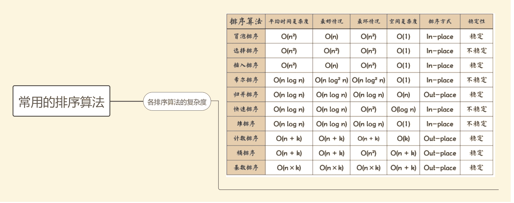
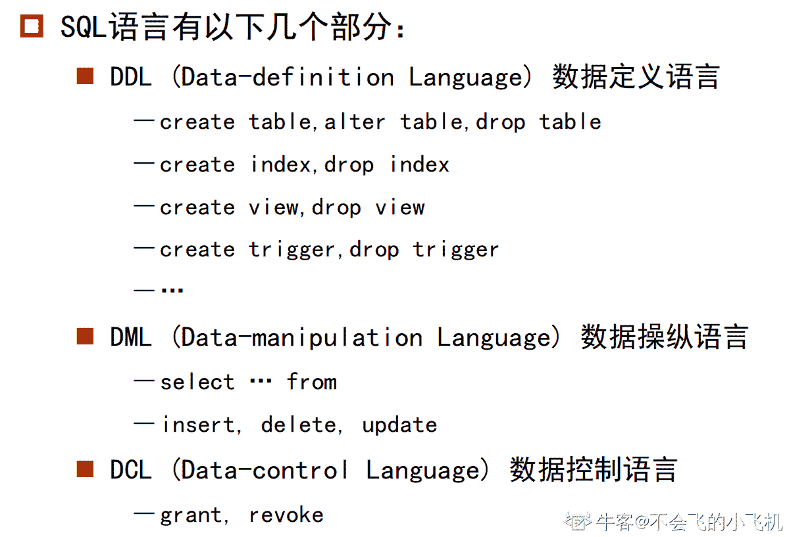

# 顺丰科技 2019 秋招运维工程师笔试客观题合集

## 1

设有递归算法如下，最终打印结果是（）

```cpp
#include<stdio.h>
 int foo(int a ,int b)
 {
     if (b == 0) return 0;
     if (b % 2 == 0) return foo(a+a,b/2);
     return foo(a+a,b/2)+a;    
 }
 int main()
 { 
   printf("%d", foo(1,3));
   return 0;
 }

```

正确答案: A   你的答案: 空 (错误)

```cpp
3
```

```cpp
4
```

```cpp
5
```

```cpp
6
```

本题知识点

递归

讨论

[ＭＭＱ](https://www.nowcoder.com/profile/217762715)

计算 foo(1,3)：此时 a=1,b=3;跳过两个 if 语句进入 return foo(1+1,3/2)+1,即 foo(2,1)+1；计算 foo(2,1)：同样，跳过两个 if 语句进入 return foo(2+2,1/2)+2,即 foo(4,0)+2;计算 foo(4,0):进入第一个 if 语句，return 0；逐层返回，得 foo(2,1)=0+2=2;再返回上一层，得 foo(1,3)=2+1=3；返回结果，foo(1,3)=3;

编辑于 2019-03-12 20:50:37

* * *

[路人癸 000](https://www.nowcoder.com/profile/528623642)

编译都过不了

发表于 2019-04-02 17:00:32

* * *

[许愿建行拿到 offer](https://www.nowcoder.com/profile/217268997)

注意 b 是整数,那么 3/2 等于 1

发表于 2019-11-19 21:30:04

* * *

## 2

请指出堆排序、选择排序、冒泡排序、快速排序的平均时间复杂度（）

正确答案: A   你的答案: 空 (错误)

```cpp
nlogn、n²、n²、nlogn
```

```cpp
n²、n²、n²、nlogn
```

```cpp
nlogn、nlogn、n²、nlogn
```

```cpp
nlogn、n²、n²、n²
```

本题知识点

排序 *讨论

[程序猿 Go 师傅](https://www.nowcoder.com/profile/242025553)



编辑于 2019-10-21 17:08:55

* * *

[theWeak](https://www.nowcoder.com/profile/829551324)

想起了马士兵老师的做的（有毒）的词选炮插快归堆希统计姬 N 方 N 老 N 一三对 N 加 KN 乘 K 不稳稳稳不稳稳不稳不稳稳稳稳🤣

发表于 2019-03-20 21:06:49

* * *

[horizon201809151642286](https://www.nowcoder.com/profile/607362852)

记住：  冒泡和选择    ： n²             快速和堆排序：nlogn

发表于 2019-03-19 15:38:13

* * *

## 3

What is Static Method in Java（）

正确答案: A B C   你的答案: 空 (错误)

```cpp
It is a method which belongs to the class and not to the object(instance)
```

```cpp
A static method can access only static data. It can not access non-static data (instance variables)
```

```cpp
A static method can call only other static methods and can not call a non-static method from it.
```

```cpp
A static method can not be accessed directly by the class name and doesn’t need any object
```

本题知识点

Java 工程师 安卓工程师 顺丰科技 Java 信息技术岗 2019 iOS 工程师 C++工程师 PHP 工程师 算法工程师 区块链 运维工程师

讨论

[coderofUESTC](https://www.nowcoder.com/profile/817336)

其实这题并不严谨，不管实例成员还是实例方法，都可以在静态方法里实例化一个对象再去调用

发表于 2019-07-06 18:12:28

* * *

[pitt1997](https://www.nowcoder.com/profile/211637886)

A：静态方法是一个属于类而不属于对象(实例)的方法。（√）B：静态方法只能访问静态数据。无法访问非静态数据(实例变量)。（√）C：静态方法只能调用其他静态方法，不能从中调用非静态方法。（√）D：静态方法不能通过类名直接访问，也不需要任何对象。（×） 静态方法可以直接用类名访问。

发表于 2019-04-07 15:40:46

* * *

[EruIluvatar](https://www.nowcoder.com/profile/6090755)

我是不会这道题吗，我是没看懂英文😃

发表于 2020-03-02 18:04:40

* * *

## 4

```cpp
public class CharToString {
 public static void main(String[] args)
 {
  char myChar = 'g';
  String myStr = Character.toString(myChar);
  System.out.println("String is: "+myStr);
  myStr = String.valueOf(myChar);
  System.out.println("String is: "+myStr);
 }
}
```

此代码片段输出正确的值是（）

正确答案: A   你的答案: 空 (错误)

```cpp
String is: g
String is: g
```

```cpp
String is: 103
String is: g
```

```cpp
String is: g
String is: 103
```

```cpp
String is: 103
String is: 103
```

本题知识点

Java 工程师 安卓工程师 顺丰科技 信息技术岗 顺丰科技 2019 iOS 工程师 顺丰科技 2019 Java 工程师 顺丰科技 2019 Java 工程师 顺丰科技 2019 Java 工程师 C++工程师 PHP 工程师 顺丰科技 2019 算法工程师 顺丰科技 2019 区块链 顺丰科技 2019 算法工程师 顺丰科技 2019 运维工程师 顺丰科技 2019 安卓工程师 顺丰科技 2019

讨论

[AppleJack](https://www.nowcoder.com/profile/130490159)

```cpp
public static String valueOf(char c) { char data[] = {c}; return new String(data, true);
}
```

直接查看源码，这里相当于新建了一个 String 类返回，那么显然选 A

发表于 2019-03-15 15:42:27

* * *

[我是如此相信](https://www.nowcoder.com/profile/7988004)

Character 类的方法如下：

```cpp
public static String toString(char c) {
    return String.valueOf(c);
}
```

编辑于 2019-03-25 09:03:31

* * *

[小强开学前](https://www.nowcoder.com/profile/4208515)

粗心看成了

```cpp
Integer.valueOf() 
```

发表于 2019-03-20 14:48:21

* * *

## 5

一个空栈，如果有顺序输入序列：a1，a2，a3...an（个数大于 3），而且输出第一个元素为 a(n-1), 那么所有元素都出栈后，（）

正确答案: D   你的答案: 空 (错误)

```cpp
输出的最后元素一定为 an
```

```cpp
输出的最后元素一定为 a1
```

```cpp
不能确定元素 a1 ~ (an-2) 的输出顺序
```

```cpp
a(n-2) 一定比 a(n-3) 先出
```

本题知识点

顺丰科技 栈 *2019 C++工程师* *讨论

[horizon201809151642286](https://www.nowcoder.com/profile/607362852)

这道题，我最开始理解错误：根据这道题的题意，大概应该这样来理解，a1~an 必须是按顺序入栈的。但是他最后说第一个出栈的是 an-1,由这里可以推测，a1-an-1 都是顺序入栈了，至于 an，他可以在 a1~an-1 任意一个元素出栈的过程入栈的，所以 an 输出的顺序不能确定，但是可以确定已经入栈的元素的，他们的出栈的先后顺序

发表于 2019-03-19 15:52:19

* * *

[赵子贺](https://www.nowcoder.com/profile/6118530)

既然 an-1 先出栈，说明 an-2, an-3 已经入栈并且还未出栈，所以 D 肯定是对的 B 的话 an 始终不进栈，a1~an-2 都出栈了以后再进栈，这时候弹出的是 an 为最后一个

发表于 2019-03-12 21:17:21

* * *

[喝杯酒吧](https://www.nowcoder.com/profile/4870419)

我刚开始选择了 B：因为我觉得 a1-an-2 都已经顺序入栈了，a1 就一定会最后出栈。但我忘记了还有一个 an，当 a1 出栈后 an 可以再进栈，那么最后一个出栈的将是 an

发表于 2019-03-22 12:08:58

* * *

## 6

利用栈完成数制转换，将十进制的 169 转换为八进制，出栈序列为（）

正确答案: A   你的答案: 空 (错误)

```cpp
251
```

```cpp
521
```

```cpp
215
```

```cpp
152
```

本题知识点

Java 工程师 安卓工程师 顺丰科技 栈 *信息技术岗 2019 iOS 工程师 C++工程师 PHP 工程师 算法工程师 区块链 运维工程师* *讨论

[AppleJack](https://www.nowcoder.com/profile/130490159)

169/8 = 21 余 1  21/8 = 2 余 5  2/8 = 0 余 2 余数倒过来 251 

发表于 2019-03-15 15:48:44

* * *

[Fourousky](https://www.nowcoder.com/profile/1506987)

其实就是直接转换就完事了，转换的原理就是用堆栈实现的

发表于 2019-03-17 15:27:57

* * *

[我爱打酱油](https://www.nowcoder.com/profile/283898704)

169 转化 8 进制：169=2*8²+5*8¹+1*8⁰，栈是先进后出，那么出来的数则为 251

发表于 2019-03-14 00:58:06

* * *

## 7

主机 IP 为 200.15.13.13/23,其子网掩码是（）

正确答案: D   你的答案: 空 (错误)

```cpp
255.255.249.0
```

```cpp
255.255.2410
```

```cpp
255.255.253.0
```

```cpp
255.255.254.0
```

本题知识点

Java 工程师 安卓工程师 顺丰科技 网络基础 信息技术岗 2019 iOS 工程师 C++工程师 PHP 工程师 算法工程师 区块链 运维工程师

讨论

[youcoward](https://www.nowcoder.com/profile/998912528)

/23 的意思是前 23 位是 1，即最后（4*8-23）=9 位是 0，所以最后 16 位是 11111110 00000000，可知是 255.255.254.0

发表于 2019-03-13 19:50:28

* * *

[仰望星空 73](https://www.nowcoder.com/profile/3491497)

掩码长度为 23，也就是 11111111 11111111 11111110 00000000

发表于 2019-03-14 19:55:57

* * *

[菜🐔也要有梦](https://www.nowcoder.com/profile/5514240)

ip 地址由网络号 + 主机号组成。划分子网后为 网络号+ 子网号 + 主机号子网掩码用于掩盖网络号和子网号。1 对应网络号和子网号，0 对应主机号

发表于 2019-08-08 13:03:02

* * *

## 8

总部给某分公司分配的网络地址是 172.16.2.0/24,该分公司有三个部门，每个部门计算机不多于 30 台,在网络配置时，进行子网划分，可以使用的子网掩码是（）

正确答案: B C   你的答案: 空 (错误)

```cpp
255.255.255.128
```

```cpp
255.255.255.192
```

```cpp
255.255.255.224
```

```cpp
255.255.255.240
```

本题知识点

Java 工程师 顺丰科技 网络基础 信息技术岗 2019

讨论

[杯小年](https://www.nowcoder.com/profile/5414042)

1.分公司分配的网络地址是 172.16.2.0/24，子网掩码就是 11111111.11111111.11111111.00000000,（24 个 1）；2.分公司 3 个部门，那么至少用 2 位才能分配 3 个以上（00,01,10,11）；3.那么分部的子网掩码就要大于等于 11111111.11111111.11111111.11000000（192）了；4.又由于每个部门电脑不多于 30 台，那么至少也要给人家留出 30 台的主机地址，所以子网掩码不能是 11111111.11111111.11111111.11110000（240），因为只留出 4 位不够表示 30 台主机。

编辑于 2019-04-01 09:04:52

* * *

[半岛。](https://www.nowcoder.com/profile/397758587)

前面两位说的比较清楚了，简单补充一下 1.分公司的网络地址是 172.16.2.0/24，子网掩码长度就是 24 位 11111111.11111111.11111111.00000000（这个就不要问为什么了）；2.分公司 3 个部门，那么就用第 25 位和第 26 位来区分三个部门，11111111.11111111.11111111.**00**000000（00~11），直接排除 A；3.那么各个部门用来区分自己的子网掩码只剩下最后 6 位（27~32 位）来表示了；4.若用 255.255.255.192，最后 8 位是 11000000，只能表示 11000000~11111111 除去广播地址一共 62 台
5.若用 255.255.255.224，最后 8 位是 11100000，只能表示 11100000~11111111 除去广播地址一共 30 台
6.若用 255.255.255.240，最后 8 位是 11110000，只能表示 11110000~11111111 除去广播地址一共 14 台

发表于 2019-03-17 11:22:39

* * *

[大三想开始工作了](https://www.nowcoder.com/profile/443077457)

172.16.2.0/24 为 B 类地址，所以子网掩码肯定是 255.255 开头，因为该地址有 24 为的网络号，也就是剩下的子网掩码是：11111111.00000000，又因为有三个部门，留下两位进行表示，且这两位最大为 11，所以有 11111111.11000000（255.192），又因为 30 的二进制至少用 5 位来表示，4 位（1111）的最大值才 15,5 位的最大值 31，所以只留下 4 位时为 11111111.11110000,（255.240），所以为大于等于 192 小于 240.

发表于 2019-03-23 19:59:11

* * *

## 9

以下叙述中，不正确的有（ ）

正确答案: B D   你的答案: 空 (错误)

```cpp
单元测试对源程序中每一个程序单元进行测试，检查各个模块是否正确实现规定的功能，从而发现模块在编码中或算法中的错误。该阶段涉及编码和详细设计文档。
```

```cpp
集成测试是基于软件需求说明书的黑盒测试，是对已经集成好的软件系统进行彻底的测试，以验证软件系统的正确性和性能等满足其规约所指定的要求，检查软件的行为和输出是否正确
```

```cpp
确认测试主要是检查已实现的软件是否满足需求规格说明书中确定了的各种需求。
```

```cpp
系统测试的主要目的是检查软件单位之间的接口是否正确，主要是针对程序内部结构进行测试，特别是对程序之间的接口进行测试。
```

本题知识点

Java 工程师 安卓工程师 顺丰科技 软件测试 信息技术岗 2019 iOS 工程师 C++工程师 PHP 工程师 算法工程师 区块链 运维工程师

讨论

[程序猿 Go 师傅](https://www.nowcoder.com/profile/242025553)

B：

```cpp
系统测试是基于软件需求说明书的黑盒测试，是对已经集成好的软件系统进行彻底的测试，以验证软件系统的正确性和性能等满足其规约所指定的要求，检查软件的行为和输出是否正确

```

D：

```cpp
集成测试的主要目的是检查软件单位之间的接口是否正确，主要是针对程序内部结构进行测试，特别是对程序之间的接口进行测试。
```

BD 的概念刚好反了，所以错误

编辑于 2019-10-21 17:08:47

* * *

[牛客 500811011 号](https://www.nowcoder.com/profile/500811011)

单元测试：各个模块单独测试确认测试：确认软件需求是否都达成的测试系统测试：软件系统测试集成测试：程序接口测试

发表于 2020-04-10 22:18:05

* * *

[惠鸿飞](https://www.nowcoder.com/profile/881469708)

B 项是前半句描述的是集成测试的内容，后半句数据系统测试内容，前后矛盾 D 项描述的接口测试是属于集成测试的内容，而不属于系统测试

发表于 2019-07-18 11:22:07

* * *

## 10

以下关于链表和数组说法正确的是（）

正确答案: A B C   你的答案: 空 (错误)

```cpp
new 出来的数组也在堆中
```

```cpp
数组插入或删除元素的时间复杂度 O(n)，链表的时间复杂度 O(1)
```

```cpp
数组利用下标定位，时间复杂度为 O(1)，链表定位元素时间复杂度 O(n)
```

```cpp
对于 add 和 remove，ArrayList 要比 LinkedList 快
```

本题知识点

Java 工程师 安卓工程师 顺丰科技 数组 链表 *信息技术岗 2019 iOS 工程师 C++工程师 PHP 工程师 前端工程师 算法工程师 区块链 运维工程师* *讨论

[小夥](https://www.nowcoder.com/profile/356553)

```cpp
数组从栈中分配空间，链表从堆中分配空间
```

数组也可以是 new 的，链表也可以是用数组模拟的~~

发表于 2019-03-16 23:46:53

* * *

[smile_ll](https://www.nowcoder.com/profile/41411708)

..new 出来的东西不应该都是堆中的吗

发表于 2019-03-15 09:19:29

* * *

[牛客 650726674 号](https://www.nowcoder.com/profile/650726674)

*   ArrayList 底层实现就是数组，且 ArrayList 实现了 RandomAccess，表示它能快速随机访问存储的元素，通过下标 index 访问，只是我们需要用 get() 方法的形式， 数组支持随机访问， 查询速度快， 增删元素慢；
*   LinkedList 底层实现是链表， LinkedList 没有实现 RandomAccess 接口，链表支持顺序访问， 查询速度慢， 增删元素快

发表于 2020-03-15 22:34:32

* * *

## 11

甲乙丙 3 个进程对某类资源的需求分别是 7 个、8 个、3 个。且目前已分别得到了 3 个、3 个和 2 个资源，若系统还至少能提供（ ）个资源，则系统是安全的。

正确答案: C   你的答案: 空 (错误)

```cpp
1
```

```cpp
4
```

```cpp
2
```

```cpp
8
```

本题知识点

Java 工程师 安卓工程师 顺丰科技 操作系统 信息技术岗 顺丰科技 2019 iOS 工程师 顺丰科技 2019 Java 工程师 顺丰科技 2019 Java 工程师 顺丰科技 2019 Java 工程师 C++工程师 PHP 工程师 顺丰科技 2019 安卓工程师 前端工程师 顺丰科技 2019 算法工程师 顺丰科技 2019 区块链 顺丰科技 2019 运维工程师 顺丰科技 2019 安卓工程师 顺丰科技 2019

讨论

[赵子贺](https://www.nowcoder.com/profile/6118530)

丙需要一个，等丙执行完会释放 3 个，此时甲最多获得 6 个，因而甲还需要一个才能够正常运行，所以一共需要两个

发表于 2019-03-12 22:10:32

* * *

[锵锵骅泗客](https://www.nowcoder.com/profile/4864872)

我觉得这题答案是 D,那个榜一说的不对吧，既然说了至少，那就要考虑最坏情况，当甲：6 个 乙：7 个 丙：2 个 时，这时添加一个既可以保证无死锁，所以一共需要 3 + 4 + 1 = 8 个

发表于 2019-04-01 18:45:24

* * *

[Geek201903181326118](https://www.nowcoder.com/profile/189737124)

cpu 通过时间分片的形式给进程分配资源，丙进程需要一个资源才能开始工作，等丙进程工作完了，将资源释放，此时甲进程会获得释放的 3 个资源，甲进程拥有 6 个资源，需要再分配一个资源给甲进程方能开始工作，等甲进程工作完了 再将资源交给乙，这样才能保证系统的安全，故需要再分配 2 个资源

发表于 2019-03-18 14:10:00

* * *

## 12

32 位处理器是指处理器的（）是 32 位的

正确答案: B   你的答案: 空 (错误)

```cpp
控制总线
```

```cpp
数据总线
```

```cpp
地址总线
```

```cpp
所有的总线
```

本题知识点

Java 工程师 安卓工程师 顺丰科技 操作系统 信息技术岗 顺丰科技 2019 iOS 工程师 顺丰科技 2019 Java 工程师 顺丰科技 2019 Java 工程师 顺丰科技 2019 Java 工程师 C++工程师 PHP 工程师 顺丰科技 2019 安卓工程师 前端工程师 顺丰科技 2019 算法工程师 顺丰科技 2019 区块链 顺丰科技 2019 运维工程师 顺丰科技 2019 安卓工程师 顺丰科技 2019

讨论

[can~can~can](https://www.nowcoder.com/profile/46803557)

32 位处理器，计算机中的位数指的是[CPU](https://baike.baidu.com/item/CPU)一次能处理的最大位数。32 位计算机的 CPU 一次最多能处理 32 位数据

发表于 2019-03-13 21:54:43

* * *

[九斤 ing](https://www.nowcoder.com/profile/5228614)

1、CPU 中的位指的是一个时钟周期可以处理的数据数量。8 位为一个字节，32 位就是一次可以处理 4 个字节，64 位是一次可以处理 8 个字节 2、32 位 CPU 是指数据总线有 32 位，寄存器是暂存数据和中间结果的单元，因此寄存器的位数指的也是处理数据的长度肯定是和数据总线的根数相同，否则寄存器和 CPU 内其他单元之间将无法通信，交换数据。因此 32 位 CPU 的 32 位是包含了寄存器是 32 位的意思，但其实定义是数据总线的宽度和根数。

发表于 2019-04-14 17:23:08

* * *

[冲鸭！冲鸭！冲鸭！](https://www.nowcoder.com/profile/551437339)

32 位处理器：指的是 CPU 一次能处理数据的最大位数。

发表于 2019-08-10 19:27:13

* * *

## 13

以下关于 TCP 和 UDP 说法正确的是（）

正确答案: A C   你的答案: 空 (错误)

```cpp
TCP 数据传输慢，UDP 数据传输快
```

```cpp
TCP 通过滑动窗口机制进行拥塞控制
```

```cpp
UDP 缓冲区小于报文长度，则会丢失报文
```

```cpp
DNS 协议用于域名解析，默认 23 端口
```

本题知识点

Java 工程师 C++工程师 安卓工程师 iOS 工程师 运维工程师 前端工程师 算法工程师 测试工程师 顺丰科技 2019

讨论

[梦 N 无痕](https://www.nowcoder.com/profile/212147821)

DNS 的默认端口号是 53

发表于 2019-03-14 18:27:07

* * *

[盲夏半开](https://www.nowcoder.com/profile/2999193)

tcp 的滑动窗口进行流量控制 拥塞控制与流量控制的区别 拥塞控制是防止过多的数据注入到网络中，可以使网络中的路由器或链路不致过载，是一个全局性的过程。 流量控制是点对点通信量的控制，是一个端到端的问题，主要就是抑制发送端发送数据的速率，以便接收端来得及接收。

编辑于 2019-03-16 23:31:41

* * *

[星月交辉](https://www.nowcoder.com/profile/4473382)

DNS（Domain Name System，域名解析系统），万维网上作为域名和 IP 地址相互映射的一个分布式数据库，能够使用户更方便的访问互联网，而不用去记住能够被机器直接读取的 IP 数串。通过域名，最终得到该域名对应的 IP 地址的过程叫做域名解析（或主机名解析）。DNS 协议运行在 UDP 协议之上，使用端口号 53。

发表于 2019-03-17 18:17:19

* * *

## 14

某打车公司将驾驶里程（drivedistanced）超过 5000 里的司机信息转移到一张称为 seniordrivers 的表中,他们的详细情况被记录在表 drivers 中，正确的 sql 为（）

正确答案: D   你的答案: 空 (错误)

```cpp
insert into seniordrivers
drivedistanced>=5000 from drivers where
```

```cpp
insert seniordrivers (drivedistanced) values from drivers where drivedistanced>=5000
```

```cpp
insert into seniordrivers
(drivedistanced)values>=5000 from drivers where
```

```cpp
select * into seniordrivers from drivers where drivedistanced >=5000
```

本题知识点

Java 工程师 安卓工程师 顺丰科技 数据库 SQL 信息技术岗 顺丰科技 2019 iOS 工程师 顺丰科技 2019 Java 工程师 顺丰科技 2019 Java 工程师 顺丰科技 2019 Java 工程师 C++工程师 PHP 工程师 顺丰科技 2019 安卓工程师 前端工程师 顺丰科技 2019 算法工程师 顺丰科技 2019 区块链 顺丰科技 2019 算法工程师 顺丰科技 2019 运维工程师 顺丰科技 2019 安卓工程师 顺丰科技 2019

讨论

[LIUKAI915](https://www.nowcoder.com/profile/661521241)

SQL SELECT INTO 语句可用于创建表的备份复件。
SELECT INTO 语句
SELECT INTO 语句从一个表中选取数据，然后把数据插入另一个表中。
SELECT INTO 语句常用于创建表的备份复件或者用于对记录进行存档。
SQL SELECT INTO 语法
您可以把所有的列插入新表：
SELECT * INTO new_table_name [IN externaldatabase] FROM old_tablename
或者只把希望的列插入新表：
SELECT column_name(s) INTO new_table_name [IN externaldatabase] FROM old_tablename
SQL SELECT INTO 实例 - 制作备份复件
下面的例子会制作 "Persons" 表的备份复件：
SELECT * INTO Persons_backup FROM Persons
IN 子句可用于向另一个数据库中拷贝表：
SELECT * INTO Persons IN 'Backup.mdb' FROM Persons
如果我们希望拷贝某些域，可以在 SELECT 语句后列出这些域：
SELECT LastName,FirstName
INTO Persons_backup
FROM Persons

发表于 2019-04-11 09:59:56

* * *

[赵子贺](https://www.nowcoder.com/profile/6118530)

SELECT INTO FROM 句式[`www.cnblogs.com/mq0036/p/4155136.html`](https://www.cnblogs.com/mq0036/p/4155136.html)

发表于 2019-03-12 22:32:33

* * *

[旧城俨然回眸笑](https://www.nowcoder.com/profile/6223383)

select into:copy information from one table into anotherselect */colums into newtable (in external db )from table

发表于 2020-06-23 16:10:18

* * *

## 15

允许信号在两个方向上传输，但某一时刻只允许信号在一个信道上单向传输的通信是（ ）

正确答案: B   你的答案: 空 (错误)

```cpp
单工通信
```

```cpp
半双工通信
```

```cpp
全双工通信
```

```cpp
时工通信
```

本题知识点

Java 工程师 安卓工程师 顺丰科技 通信原理 信息技术岗 2019 iOS 工程师 C++工程师 PHP 工程师 算法工程师 运维工程师

讨论

[CS 之前 P 为首](https://www.nowcoder.com/profile/6532970)

1.  单工数据传输只支持数据在一个方向上传输；在同一时间只有一方能接受或发送信息，不能实现双向通信。

2.  半双工数据传输允许数据在两个方向上传输,在某时刻,只允许数据在一个方向上传输；
3.  全双工数据通信允许数据同时在两个方向上传输,在同一时间可以同时接受和发送信息，进行双向通信；

发表于 2019-03-15 18:43:12

* * *

[牛客 842055369 号](https://www.nowcoder.com/profile/842055369)

B

发表于 2021-07-04 02:05:45

* * *

[牛客 50309818 号](https://www.nowcoder.com/profile/50309818)

单工

发表于 2021-06-26 14:17:52

* * *

## 16

LR 分析法属于（）

正确答案: D   你的答案: 空 (错误)

```cpp
自顶向下分析法
```

```cpp
LALR 分析法
```

```cpp
SLR 分析法
```

```cpp
自底向上分析法
```

本题知识点

Java 工程师 安卓工程师 顺丰科技 编译和体系结构 信息技术岗 2019 iOS 工程师 C++工程师 PHP 工程师 算法工程师 运维工程师

讨论

[信自己](https://www.nowcoder.com/profile/5222489)

这个真的会考到吗？见都没见过。。。。

发表于 2019-08-28 19:55:49

* * *

[陈易斯](https://www.nowcoder.com/profile/1628023)

[`blog.csdn.net/yongchaocsdn/article/details/78704553`](https://blog.csdn.net/yongchaocsdn/article/details/78704553)

发表于 2019-03-14 21:40:06

* * *

[PKU_xiaowei](https://www.nowcoder.com/profile/291394677)

阿这

发表于 2020-08-29 14:27:17

* * *

## 17

下面哪种 UML 图描述的是一个实体基于事件反应的动态行为，显示了该实体如何根据当前所处的状态对不同的事件做出反应（ ）

正确答案: B   你的答案: 空 (错误)

```cpp
活动图
```

```cpp
状态图
```

```cpp
配置图
```

```cpp
构件图
```

本题知识点

Java 工程师 安卓工程师 顺丰科技 UML 信息技术岗 2019 iOS 工程师 C++工程师 PHP 工程师 算法工程师 运维工程师

讨论

[小 123456](https://www.nowcoder.com/profile/886247949)

用例图

描述角色以及角色与用例之间的连接关系。说明的是谁要使用系统，以及他们使用该系统可以做些什么。一个[用例图](https://baike.baidu.com/item/%E7%94%A8%E4%BE%8B%E5%9B%BE)包含了多个模型元素，如系统、参与者和用例，并且显示了这些元素之间的各种关系，如泛化、关联和依赖。

类图

[类图](https://baike.baidu.com/item/%E7%B1%BB%E5%9B%BE)是描述系统中的类，以及各个类之间的关系的静态视图。能够让我们在正确编写代码以前对系统有一个全面的认识。类图是一种模型类型，确切的说，是一种静态模型类型。类图表示类、接口和它们之间的协作关系。

对象图

与[类图](https://baike.baidu.com/item/%E7%B1%BB%E5%9B%BE)极为相似，它是类图的实例，对象图显示类的多个对象实例，而不是实际的类。它描述的不是类之间的关系，而是对象之间的关系。 

包图

包图用于描述系统的分层结构，由包或类组成，表示包与包之间的关系。 

活动图

描述用例要求所要进行的活动，以及活动间的约束关系，有利于识别并行活动。能够演示出系统中哪些地方存在功能，以及这些功能和系统中其他组件的功能如何共同满足前面使用[用例图](https://baike.baidu.com/item/%E7%94%A8%E4%BE%8B%E5%9B%BE)[建模](https://baike.baidu.com/item/%E5%BB%BA%E6%A8%A1)的商务需求。 

状态图

描述类的对象所有可能的状态，以及事件发生时状态的转移条件。可以捕获对象、子系统和系统的生命周期。他们可以告知一个对象可以拥有的状态，并且事件(如消息的接收、时间的流逝、错误、条件变为真等)会怎么随着时间的推移来影响这些状态。一个[状态图](https://baike.baidu.com/item/%E7%8A%B6%E6%80%81%E5%9B%BE)应该连接到所有具有清晰的可标识状态和复杂行为的类；该图可以确定类的行为，以及该行为如何根据当前的状态变化，也可以展示哪些事件将会改变类的对象的状态。状态图是对[类图](https://baike.baidu.com/item/%E7%B1%BB%E5%9B%BE)的补充。 

序列图（[顺序图](https://baike.baidu.com/item/%E9%A1%BA%E5%BA%8F%E5%9B%BE)）

序列图是用来显示你的参与者如何以一系列顺序的步骤与系统的对象交互的模型。顺序图可以用来展示对象之间是如何进行交互的。顺序图将显示的重点放在消息序列上，即强调消息是如何在对象之间被发送和接收的。 

协作图

和序列图相似，显示对象间的动态合作关系。可以看成是类图和[顺序图](https://baike.baidu.com/item/%E9%A1%BA%E5%BA%8F%E5%9B%BE)的交集，[协作图](https://baike.baidu.com/item/%E5%8D%8F%E4%BD%9C%E5%9B%BE)[建模](https://baike.baidu.com/item/%E5%BB%BA%E6%A8%A1)对象或者角色，以及它们彼此之间是如何通信的。如果强调时间和顺序，则使用序列图；如果强调上下级关系，则选择协作图；这两种图合称为交互图。

构件图（[组件图](https://baike.baidu.com/item/%E7%BB%84%E4%BB%B6%E5%9B%BE)）

描述代码[构件](https://baike.baidu.com/item/%E6%9E%84%E4%BB%B6)的[物理结构](https://baike.baidu.com/item/%E7%89%A9%E7%90%86%E7%BB%93%E6%9E%84)以及各种构建之间的依赖关系。用来[建模](https://baike.baidu.com/item/%E5%BB%BA%E6%A8%A1)软件的组件及其相互之间的关系，这些图由构件标记符和构件之间的关系构成。在组件图中，构件是软件单个组成部分，它可以是一个文件，产品、[可执行文件](https://baike.baidu.com/item/%E5%8F%AF%E6%89%A7%E8%A1%8C%E6%96%87%E4%BB%B6)和脚本等。 

部署图（配置图）

是用来[建模](https://baike.baidu.com/item/%E5%BB%BA%E6%A8%A1)系统的物理部署。例如计算机和设备，以及它们之间是如何连接的。[部署图](https://baike.baidu.com/item/%E9%83%A8%E7%BD%B2%E5%9B%BE)的使用者是开发人员、系统集成人员和测试人员。部署图用于表示一组物理结点的集合及结点间的相互关系，从而建立了系统[物理层](https://baike.baidu.com/item/%E7%89%A9%E7%90%86%E5%B1%82)面的模型。

发表于 2019-03-20 22:23:14

* * *

[牛客 692444208 号](https://www.nowcoder.com/profile/692444208)

只认识状态图

发表于 2021-03-09 18:50:59

* * *

## 18

 在关系模式 R(U,F)中,X，Y，Z 是 U 中属性，则多值依赖的传递律是（）

正确答案: D   你的答案: 空 (错误)

```cpp
如果 X→→Y，Y→→Z，则 X→→Z
```

```cpp
如果 X→→Y，Y→→Z，则 X→→YZ
```

```cpp
如果 X→→Y，Y→→Z，则 X→→Y Z
```

```cpp
如果 X→→Y，Y→→Z，则 X→→Z-Y
```

本题知识点

Java 工程师 安卓工程师 顺丰科技 编译和体系结构 信息技术岗 2019 iOS 工程师 C++工程师 PHP 工程师 算法工程师 运维工程师

讨论

[大月佥槑](https://www.nowcoder.com/profile/499970558)

区别多值依赖和函数依赖：[`blog.chinaunix.net/uid-411974-id-88303.html`](http://blog.chinaunix.net/uid-411974-id-88303.html)

发表于 2019-04-08 22:28:07

* * *

[Moody..未来可期](https://www.nowcoder.com/profile/247953307)

关于函数依赖和多值依赖，可以找到一个完整的推理规则集：A1.（函数依赖的自反律）：如果 Y∈X∈U，则 X→Y。A2.（函数依赖的增广律）：如果 X→Y,且 Z∈U,则 XZ→YZ。A3.（函数依赖的传递律）：如果 X→Y，Y→Z，则 X→Z。A4.（多值依赖的补规则）：如果 X→→Y，则 X→→（U-X-Y）。A5.（多值依赖的增广律）：如果 X→→Y，且 V∈W，则 WX→→VY。A6.（多值依赖的传递律）：如果 X→→Y，Y→→Z，则 X→→（Z-Y）。A7.（从函数依赖导出多值依赖）：如果 X→Y，则 X→→Y。A8.（从多值依赖导出函数依赖）：如果 X→→Y，Z∈Y，Y∩W=∮，W→Z，则 X→Z。A9.（多值依赖的合并律）：如果 X→→Y，X→→Z，则 X→→YZ。A10.（多值依赖的伪传递律）：如果 X→→Y，WY→→Z，则 WX→→（Z-WY）。A11.（多值依赖与函数依赖混合传递律）：如果 X→→Y，XY→Z，则 X→（Z-Y）。A12.（多值依赖的分解律）：如果 X→→Y，X→→Z，则 X→→（Y∩X），X→→（Y-Z），X→→（Z-Y）。

发表于 2021-03-03 12:19:40

* * *

[江小洁](https://www.nowcoder.com/profile/668501864)

多值依赖的性质及证明：[`www.zhihu.com/question/27348823`](https://www.zhihu.com/question/27348823)

发表于 2019-09-09 22:50:42

* * *

## 19

下面关于 JAVA 的垃圾回收机制，正确的是（ ）

正确答案: B   你的答案: 空 (错误)

```cpp
当调用“System.gc()”来强制回收时，系统会立即回收垃圾
```

```cpp
垃圾回收不能确定具体的回收时间
```

```cpp
程序可明确地标识某个局部变量的引用不再被使用
```

```cpp
程序可以显式地立即释放对象占有的内存
```

本题知识点

Java 工程师 安卓工程师 顺丰科技 Java 信息技术岗 顺丰科技 2019 iOS 工程师 顺丰科技 2019 Java 工程师 C++工程师 PHP 工程师 顺丰科技 2019 安卓工程师 前端工程师 顺丰科技 2019 算法工程师 顺丰科技 2019 运维工程师 顺丰科技 2019 安卓工程师 顺丰科技 2019

讨论

[ღ.ᵧₒᵤ](https://www.nowcoder.com/profile/213859533)

垃圾回收是 jvm 自动进行的，可以调用 System.GC（）；提醒 jvm，但是具体什么时间不确定。

发表于 2019-07-31 20:47:05

* * *

[帅老∏](https://www.nowcoder.com/profile/588172056)

顺丰总算出了道人题

发表于 2019-09-12 23:27:59

* * *

[晚飞的笨鸟](https://www.nowcoder.com/profile/390434101)

系统自动回收垃圾

发表于 2019-03-16 10:28:09

* * *

## 20

关于 SpringMVC，以下说法错误的是？（）

正确答案: D   你的答案: 空 (错误)

```cpp
SpringMVC 的核心入口是 DispatcherServlet
```

```cpp
@RequestMapping 注解既可以用在类上也可以用在方法上
```

```cpp
@PathVariable 作用是取出 url 中的模板变量作为参数
```

```cpp
controller 默认是单例，通过@Scope(“prototype”)注解改为多例，成员变量共享
```

本题知识点

Java 工程师 C++工程师 安卓工程师 运维工程师 前端工程师 算法工程师 PHP 工程师 测试工程师 顺丰科技 Spring 信息技术岗 顺丰科技 2019 iOS 工程师 顺丰科技 2019 Java 工程师 顺丰科技 2019 Java 工程师 顺丰科技 2019 Java 工程师 C++工程师 PHP 工程师 顺丰科技 2019 算法工程师 顺丰科技 2019 区块链 顺丰科技 2019 运维工程师 顺丰科技 2019

讨论

[小夥](https://www.nowcoder.com/profile/356553)

选项 A 错误，是 DispatcherServlet，少写了 er

发表于 2019-03-16 23:58:42

* * *

[FANL1N9](https://www.nowcoder.com/profile/9897163)

单例模式下会共享普通成员变量和静态成员变量,多例模式下普通成员变量不共享,静态成员共享. 
在开发中,springMVC 优先使用单例模式,而且尽量不要在 controller 中设定成员变量. 
如果要定义成员变量并为成员变量赋值可以配置 source.properties,通过读取配置文件为成员变量初始化. 

发表于 2019-03-14 14:44:22

* * *

[jianyu](https://www.nowcoder.com/profile/8330860)

```cpp
@Scope(“prototype”)表示每获取一个 bean 创建一个对象。这虽然看起来是多例。但成员变量并不共享。
要想成员变量共享，可设置为“session”或“globalSession”
```

发表于 2019-03-16 08:44:44

* * *

## 21

文法 G[E]：

```cpp
E-> T|E+T|E - T
T-> F|T*F|T/F
F ->(E)|i
```

以下论述正确的是（）

正确答案: A C D   你的答案: 空 (错误)

```cpp
该文法的开始符号是 E
```

```cpp
该文法的终结符号集合为{+、-、*、/、(、)}
```

```cpp
该文法的非终结符号集合为{E、T、F}
```

```cpp
句型 T+T*F+I 的简单短语为 i、T*F、第一个 T
```

本题知识点

Java 工程师 C++工程师 安卓工程师 运维工程师 前端工程师 算法工程师 PHP 工程师 测试工程师 顺丰科技 编译和体系结构 信息技术岗 2019 iOS 工程师 区块链

讨论

[虚煌](https://www.nowcoder.com/profile/355450679)

大佬们谁能讲讲这是啥文法，完全看不懂啊

发表于 2019-03-31 18:16:18

* * *

[赵子贺](https://www.nowcoder.com/profile/6118530)

B: i 也是终结符 D: 关于直接短语(简单短语)[`blog.csdn.net/u014297473/article/details/45825663`](https://blog.csdn.net/u014297473/article/details/45825663)

发表于 2019-03-12 23:31:42

* * *

[牛客 443317450 号](https://www.nowcoder.com/profile/443317450)

出的都是什么鬼？

发表于 2020-08-26 23:06:07

* * *

## 22

关于 SpringMVC，以下说法错误的是？（）

正确答案: D   你的答案: 空 (错误)

```cpp
SpringMvc 的核心入口是 DispatchServlet
```

```cpp
@RequestMapping 注解既可以用在类上也可以用在方法上
```

```cpp
@PathVariable 作用是取出 url 中的模板变量作为参数
```

```cpp
controller 默认是单例，通过@Scope(“prototype”)注解改为多例，成员变量共享
```

本题知识点

Java 工程师 C++工程师 安卓工程师 运维工程师 前端工程师 算法工程师 PHP 工程师 测试工程师 顺丰科技 Spring 信息技术岗 2019 iOS 工程师 区块链

讨论

[steve_nashNo1](https://www.nowcoder.com/profile/994963719)

选项 D 的问题在于 “ 成员变量共享”成员变量是由对象所私有的。不是静态变量 静态变量可以共享，成员变量不行

发表于 2019-08-09 15:27:56

* * *

[大卫不加班](https://www.nowcoder.com/profile/767377095)

多例坑定就不是线程共享的啦

发表于 2019-03-31 21:54:59

* * *

[WZhongH](https://www.nowcoder.com/profile/766162503)

通过 @PathVariable 可以将 URL 中占位符参数{xxx}绑定到处理器类的方法形参中@PathVariable(“xxx“) 
@RequestMapping("user/{id}/{name}")
    public ModelAndView test(@PathVariable("id") Long ids ,@PathVariable("name") String names){
        ModelAndView mv = new ModelAndView();
        mv.addObject("msg","占位符映射：id:"+ids+";name:"+names);
        mv.setViewName("hello2");
        return mv;
    }

请求路径：http://localhost:8080/hello/user/123/jack 占位符映射：id:"123";name:"jack"

发表于 2020-03-18 17:47:13

* * *

## 23

文法 G[E]：

```cpp
E-> T|E+T|E - T
T-> F|T*F|T/F
F ->(E)|i
```

以下论述正确的是（）

正确答案: A C D   你的答案: 空 (错误)

```cpp
该文法的开始符号是 E
```

```cpp
该文法的终结符号集合为{+、-、*、/、(、)}
```

```cpp
该文法的非终结符号集合为{E、T、F}
```

```cpp
句型 T+T*F+I 的简单短语为 i、T*F、第一个 T
```

本题知识点

Java 工程师 C++工程师 安卓工程师 iOS 工程师 运维工程师 前端工程师 算法工程师 测试工程师 顺丰科技 编译和体系结构 信息技术岗 2019 PHP 工程师 区块链

讨论

[人海追风](https://www.nowcoder.com/profile/896834337)

立即推，学过也看不懂

发表于 2020-10-21 10:22:53

* * *

[种花家梧桐](https://www.nowcoder.com/profile/96616709)

这是一个上下文无关文法，编译原理的内容。
首先**终结符是一个语言的不可再分的基本符号，大意就是组成语言的基本符号，或者是小写。在程序设计语言中，就是常提到的单词符号，比如保留字，标识符，常数，算符等。**则该题 B 选项就可以答出，终结符号的集合就是{+，-，*，/，（，），i，| }。题目中少了 i 和 | ，这两个很容易被忽略。
接下来，**非终结符，一般会用大写字母表示，与终结符相比，应该就很容易理解出大意，简单来说就是还可以向下推导的大写字母。也称为语法变量，用来代表语法单位，比如“算法表达式”、”布尔表达式“等。**则该题的 C 选项就可以答出，该文法的非终结符号集合为{E、T、F}。
开始符号则是这个文法的开始，从非终结符开始。那么就可以看出，这个文法的非终结符的开始则是 E，所以 A 选项是对滴。
D 选项就是把句型 T+T*F+i 拆开就行，要用语法树，具体过程有点繁琐，但不复杂。**想要进一步了解的可以自己搜索编译原理语法树与文法二义性自行学习。**欢迎讨论。

编辑于 2022-03-22 21:17:11

* * *

[一学就会一做就废](https://www.nowcoder.com/profile/710923749)

终结符还有个 i

发表于 2021-03-27 21:52:04

* * *

## 24

SQL 语言可以分为多个类别，那么不属于数据操纵语言 DML 的是（）

正确答案: B   你的答案: 空 (错误)

```cpp
update
```

```cpp
grant
```

```cpp
delete
```

```cpp
insert
```

本题知识点

Java 工程师 C++工程师 算法工程师 顺丰科技 运维工程师 数据库 SQL PHP 工程师 2019

讨论

[吹泡泡~](https://www.nowcoder.com/profile/700379489)

*   数据查询语言（DQL）：是由 SELECT 子句，FROM 子句，WHERE 子句组成的查询块
*   数据操纵语言（DML）: SELECT(查询) INSERT(插入) UPDATE(更新) DELETE(删除）
*   数据定义语言（DDL）：CREATE(创建数据库或表或索引）ALTER(修改表或者数据库）DROP(删除表或索引）
*   数据控制语言（DCL）：GRANT(赋予用户权限） REVOKE(收回权限） DENY(禁止权限)
*   事务控制语言（TCL）：SAVEPOINT (设置保存点）ROLLBACK (回滚) COMMIT(提交)

发表于 2020-03-10 13:56:13

* * *

[大星星和小猩猩](https://www.nowcoder.com/profile/9374535)



发表于 2020-03-16 10:44:00

* * *

[IThuy](https://www.nowcoder.com/profile/538710069)

grant（赋予用户权限）,deny（禁止权限）,revoke（收回权限）属于数据控制语言

发表于 2019-11-01 14:16:35

* * *

## 25

int (*p[10])(int*) 声明了 p 是一个（）

正确答案: C   你的答案: 空 (错误)

```cpp
指向函数的指针
```

```cpp
返回指针的函数
```

```cpp
元素为函数指针的数组
```

```cpp
入参为数组指针的函数
```

本题知识点

C++工程师 顺丰科技 C++ 2019 C 语言

讨论

[God~Like](https://www.nowcoder.com/profile/8390058)

int (*p[10])(int*) 定义了一个指针数组，数组元素都是 int (*p)(int *)的函数指针，所以 p 是一个函数指针数组；

发表于 2019-07-17 21:22:25

* * *

[JachinGuo](https://www.nowcoder.com/profile/539115774)

int (*p[10])(int*) 声明了 p 是一个函数指针数组，函数返回类型为 int，参数类型为 int*。该数组包含了 10 个元素是 int（*p）（int*）的函数指针。

发表于 2021-01-07 11:03:49

* * *

[0x0offer 的菜鸡](https://www.nowcoder.com/profile/5956690)

```cpp
int Max(int x, int y)
 {  int z;  if (x > y) 
    { z = x; }  else { z = y; }  return z;
}
void testFuctionPointer() 
{   int(*p)(int, int);//定义一个函数指针，函数指针指向的是哈函数的地址  int a, b, c;  p = Max;  printf("请输入 a 和 b");  scanf("%d%d",&a,&b);  c = (*p)(a, b);  printf("c=%d", c);
}
```

本题考查函数指针的概念，需要加强学习

编辑于 2019-08-03 22:52:43

* * *

## 26

```cpp
#include<stdio.h>
int c[3][4];
int (*p)[4];
p=c;
```

以下能够获取 c[1][3]值的是（）

正确答案: A B C   你的答案: 空 (错误)

```cpp
*(*(p+1)+3)
```

```cpp
*((int *)p+7)
```

```cpp
*(p[1]+3)
```

```cpp
*(p+1)+3
```

本题知识点

顺丰科技 2019 C++ C 语言

讨论

[wumin199](https://www.nowcoder.com/profile/534580825)

c 表示的是 3X4 的数组      p  -->  O    O    O    O                O    O    O    O  <----  c[1][3]                O    O    O    Op 是行指针对选项 A：p+1 指向第二行， *(p+1)就表示 p[1]

发表于 2020-10-08 15:09:22

* * *

[西邮白白](https://www.nowcoder.com/profile/132008587)

AC 没啥讲的，B 为什么要转成 Int*，二维数组的本质还是一位数组，从 p，a[0][0]到 a[1][3]所跨越的刚好是 7 个整型长度。为啥是 7 个？第二行第四列。D 明显没有解引用

发表于 2020-08-13 08:09:03

* * *

[杨周阳](https://www.nowcoder.com/profile/169588143)

p 是指向“整型数组”的指针，所以+7 的那个选项还需要对它进行强制转换~

发表于 2020-08-08 15:18:04

* * *

## 27

以下不属于事务的特性的是（）

正确答案: C   你的答案: 空 (错误)

```cpp
隔离性
```

```cpp
原子性
```

```cpp
可用性
```

```cpp
一致性
```

```cpp
持久性
```

本题知识点

运维工程师 顺丰科技 数据库 2019

讨论

[牛客 606834912 号](https://www.nowcoder.com/profile/606834912)

ACID 特性 A: 原子 ： 是事务执行的最小单位。不允许分割。事务的原子性确保动作要么全部成功，要么全部失败；C: 一致 ： 执行事务的前后，数据保持不变 I:隔离    ： 并发访问事务时，一个用户的事务数据不能被其他事务所干扰。各并发事务之间的数据库是独立的 D:持久   ：一个事物被提交后，他对数据库的数据改变时持久的。即使数据库发生故障，也不应该对数据有影响

发表于 2020-05-28 22:59:04

* * *

[1417f](https://www.nowcoder.com/profile/9161466)

ACID 特性 A: 原子 C: 一致 I:隔离 D:持久

发表于 2019-03-11 16:30:45

* * *

## 28

表结构如下：

```cpp
CREATE TABLE `score` (
   `id` int(11) NOT NULL AUTO_INCREMENT,
   `sno` int(11) NOT NULL,
   `cno` tinyint(4) NOT NULL,
   `score` tinyint(4) DEFAULT NULL,
   PRIMARY KEY (`id`)
 ) ;
```

以下查询语句结果一定相等的是（）A.SELECT sum(score) / count(*) FROM score WHERE cno = 2;

B.SELECT sum(score) / count(id) FROM score WHERE cno = 2;

C.SELECT sum(score) / count(sno) FROM score WHERE cno = 2;

D.SELECT sum(score) / count(score) FROM score WHERE cno = 2;

E.SELECT sum(score) / count(1) FROM score WHERE cno = 2;

F.SELECT avg(score) FROM score WHERE cno = 2;

正确答案: D F   你的答案: 空 (错误)

```cpp
A,E,F
```

```cpp
A,D,F
```

```cpp
A,B,C,D
```

```cpp
D,F
```

```cpp
A,B,E,F
```

```cpp
A,B,C,E
```

本题知识点

运维工程师 顺丰科技 数据库 SQL 2019

讨论

[嘻嘻作者哈哈](https://www.nowcoder.com/profile/69162453)

所有的统计函数都会忽略空值(null)。A :统计所有学生的平均分，就算成绩为空的学生，最后计算 count(*)时也作为分母基数，计算得到所有学生的平均分。B :与 A 一样，因为 id 主键非空，count(id)所得分母基数是所有学生。C : 与 B 一样，非空属性 sno。D :由于 score 字段的值可能是空，空值在统计时忽略，所以 count(score)和 sum(score)统计的只是 score 不为空的学生，计算得到的平均分也只是有成绩的学生的平均分，无法计算所有学生的平均分。E: count(1)与 count(*)一样。F:avg(score)会忽略空值,故计算结果为有成绩的学生的平均分。

发表于 2020-03-24 11:37:56

* * *

[牛客 403422741 号](https://www.nowcoder.com/profile/403422741)

select count(*)和 select count(1)的区别：

一般情况下，Select Count (*)和 Select Count(1)两着返回结果是一样的。假如表没有主键(Primary key), 那么 count(1)比 count(*)快，如果有主键的话，那主键作为 count 的条件时候 count(主键)最快，如果你的表只有一个字段的话那 count(*)就是最快的。

count(*) 跟 count(1) 的结果一样，都包括对 NULL 的统计，而 count(column) 是不包括 NULL 的统计。

发表于 2020-03-10 18:53:47

* * *

[P-ShineBeam](https://www.nowcoder.com/profile/945440246)

1、count(*)包括了所有的列，相当于行数，在统计结果的时候，不会忽略列值为 NULL。

2、count(1)包括了忽略所有列，用 1 代表代码行，在统计结果的时候，不会忽略列值为 NULL。

3、count(列名)只包括列名那一列，在统计结果的时候，会忽略列值为空。

发表于 2019-08-06 20:24:36

* * *

## 29

下面有关 sql 语句中 delete、truncate 的说法正确的是？（）

正确答案: A C   你的答案: 空 (错误)

```cpp
论清理表数据的速度，truncate 一般比 delete 更快
```

```cpp
truncate 命令可以用来删除部分数据。
```

```cpp
truncate 只删除表的数据不删除表的结构
```

```cpp
delete 能够回收高水位(自增 ID 值)
```

本题知识点

运维工程师 顺丰科技 数据库 SQL 2019

讨论

[布鲁小叮当](https://www.nowcoder.com/profile/447373437)

1、处理效率：drop>trustcate>delete2、drop 删除整个表；trustcate 删除全部记录，但不删除表；delete 删除部分记录 3、delete 不影响所用 extent，高水线保持原位置不动；trustcate 会将高水线复位。

发表于 2020-03-26 22:30:47

* * *

[牛客 316107156 号](https://www.nowcoder.com/profile/316107156)

truncate 将直接删除原来的表， 并重新创建一个表， 因此执行速度比 delete 快

发表于 2020-02-25 11:32:59

* * *

[冰淇淋 lining](https://www.nowcoder.com/profile/512168081)

什么叫回收高水位线？

发表于 2020-03-05 12:32:36

* * *

## 30

OSPF 路由协议中路径类型（O、区域内路径，IA、区域间路径，E1、E1 外部路径，E2、E2 外部路径）优先级排序正确的是（）

正确答案: A   你的答案: 空 (错误)

```cpp
O>IA>E1>E2
```

```cpp
IA>O>E2>E1
```

```cpp
E1>E2>O>IA
```

```cpp
E2>E1>IA>O
```

本题知识点

运维工程师 顺丰科技 网络基础 2019

讨论

[钱多事少离家近](https://www.nowcoder.com/profile/720625582)

路由优先级越高表示最先选择该条路由域内>域间，内部>外部，外 1>外 2

编辑于 2019-08-20 13:09:01

* * *

[IPP](https://www.nowcoder.com/profile/4971128)

OSPF 中区域内路径最优先，因为优先级最高~

发表于 2019-03-22 23:56:29

* * *

## 31

以下关于协议及其端口表述正确的是（）

正确答案: A D   你的答案: 空 (错误)

```cpp
FTP 默认使用 TCP 20 端口和 TCP 21 端口
```

```cpp
SSH 默认端口为 TCP 23 端口
```

```cpp
http 和 https 默认端口都为 TCP 80 端口
```

```cpp
DNS 使用 UDP 53 端口和 TCP 53 端口
```

本题知识点

运维工程师 顺丰科技 网络基础 2019

讨论

[小 123456](https://www.nowcoder.com/profile/886247949)

HTTP 服务器，默认端口号为 80/tcp（木马 Executor 开放此端口）HTTPS（securely transferring web pages）服务器，默认端口号为 443/tcp  443/udpFTP，默认的端口号为 21/tcpSSH（安全登录）、SCP（文件传输）、端口号重定向，默认的端口号为 22/tcp

发表于 2019-03-20 22:44:59

* * *

[星云天空](https://www.nowcoder.com/profile/129828009)

DNS 占用 53 号端口，同时使用 TCP 和 UDP 协议。
DNS 在区域传输时使用 TCP 协议，其他时候使用 UDP 协议。
**区域传输**

*   辅服务器定时向主服务器查询变通，进行数据同步。如果有变动，就会进行区域传送，进行数据同步。
*   同步数据流比较大，需要保证可靠性。所以使用 TCP 协议。

**域名解析**

*   域名解析直接使用 UDP 协议，不需要三次握手，响应更快，负载低。

发表于 2019-12-23 16:31:46

* * *

[zyq18](https://www.nowcoder.com/profile/4007702)

Telnet 默认端口为 23

发表于 2020-03-28 00:33:26

* * *

## 32

以下 IP 的的子网掩码为 255.255.252.0，下列那个 IP 和其它 IP 不在同一网段（）

正确答案: B   你的答案: 空 (错误)

```cpp
10.116.67.1
```

```cpp
10.116.68.1
```

```cpp
10.116.67.254
```

```cpp
10.116.64.1
```

本题知识点

运维工程师 顺丰科技 网络基础 2019

讨论

[virusZdy](https://www.nowcoder.com/profile/677446749)

子网掩码 255.255.252.0 转换成二进制 11111111.11111111.11111100.00000000 由于 ip 前两段都一样直接从第三段解说选项 A 转换成二进制 01000011  与 子网掩码相与运算后 得到 01000000 转换后得知 10.116.64.0 网段选项 B 转换成二进制 01000100 与 子网掩码相与运算后 得到 01000100 转换后是 10.116.68.0 网段选项 C 转换成二进制 01000011 与 子网掩码相与运算后得到 01000000 转换后也是 10.116.64.0 网段选项 D 转换成二进制 01000000 与 子网掩码相与运算后得到 01000000 转换后也是 10.116.64.0 网段所以答案是 B

发表于 2020-06-01 13:49:15

* * *

[Real_JR](https://www.nowcoder.com/profile/950604140)

252：1111 1100

64： 0100 0000

68： 0100 0100

67： 0100 0011

发表于 2019-03-14 16:49:32

* * *

[clutchbear](https://www.nowcoder.com/profile/7389895)

同一网段：指的是 IP 地址与子网掩码相与得到相同的网络地址。相与：即进行 AND 运算，对二进制数有——0 和 1=0　0 和 0=0　1 和 1=1255.255.252.0 二进制为：11111111 11111111 11111111  11111100A 选项—— 00001010 01110100 01000011 00000001    相与得到 00001010 01110100 01000011 00000000，即 10.116.67.0B 选项——00001010 01110100 01000100 00000001     相与得到 00001010 01110100 01000100 00000000， 即 10.116.67.0C 选项——00001010 01110100 01000100 11111110      相与得到 00001010 01110100 01000011  11111100，  即 10.116.67.252D 选项——00001010 01110100 01000000  00000001    相与得到 00001010 01110100 01000011  00000000， 即 10.116.67.0 由此可见，C 选项与其他不同。

发表于 2019-08-14 18:23:11

* * *

## 33

以下哪些状态是 RSTP 协议的端口状态

正确答案: B C D   你的答案: 空 (错误)

```cpp
Listening
```

```cpp
Learning
```

```cpp
Discarding
```

```cpp
Forwarding
```

本题知识点

运维工程师 顺丰科技 网络基础 2019

讨论

[小 123456](https://www.nowcoder.com/profile/886247949)

STP 定义了 5 种不同的端口状态，关闭(disable)，监听（Listening），学习（Learning），阻断（Blocking）和转发（Forwarding）。 

在 RSTP 中只有三种端口状态，Discarding、Learning 和 Forwarding。关闭端口，监听端口，阻塞端口统一合并为禁止端口。

编辑于 2019-03-20 22:52:06

* * *

[小灰的发家史](https://www.nowcoder.com/profile/732746273)

RSTP 只有 3 种端口状态：Discarding（丢弃）、Leaning（学习）和 Forwarding（转发），它把 STP 中的 Blocking（阻塞）、Listening（侦听）和 Disabled（禁用）统一用一种状态--Discarding（丢弃）替代。

发表于 2020-06-18 15:23:23

* * *

[◆浅唱。独白](https://www.nowcoder.com/profile/887112470)

不是总共有五种状态吗：阻塞（blocking）、监听（listening）、学习（learning）、转发（forwarding）、关闭（disable）。

发表于 2019-03-18 18:02:58

* * *

## 34

当前主机上 iptables 配置如下（无其他 iptables 配置）：

```cpp
Chain INPUT (policy ACCEPT)
num  target     prot opt source               destination         
1    ACCEPT     all  --  10.10.10.0/24      0.0.0.0/0           
2    ACCEPT     all  --  10.10.11.0/24      0.0.0.0/0             
13   DROP       all  --  10.10.0.0/16      0.0.0.0/0        
13   DROP       all  --  10.20.0.0/16      0.0.0.0/0  
2    ACCEPT     all  --  10.20.12.0/24      0.0.0.0/0  
```

如下描述正确的是        （）

正确答案: A C   你的答案: 空 (错误)

```cpp
10.10.10.1 可以访问该主机
```

```cpp
10.20.12.1 可以访问该主机
```

```cpp
若要允许 10.20.13.1 可以访问该主机，则需要运行如下命令
iptables -I INPUT -d 10.20.13.1 -j ACCEPT
```

```cpp
若要允许 10.20.13.1 可以访问该主机，则需要运行如下命令
iptables -A INPUT -d 10.20.13.1 -j ACCEPT
```

本题知识点

运维工程师 顺丰科技 网络基础 2019

讨论

[许小哥](https://www.nowcoder.com/profile/345138269)

*   -A

    iptables -A chain firewall-rule
    **将规则添加到链的末尾。**

    指定规则应该添加到的 chain 的名称。例如，使用 INPUT 将会把规则添加到默认的 INPUT（入站）链的末尾，而使用 OUTPUT 则会将规则添加到出站链的末尾。

    -A” 的意思是附加（append），并不是添加（Add）的意思。它是将规则添加到已有的[防火墙](https://www.baidu.com/s?wd=%E9%98%B2%E7%81%AB%E5%A2%99&tn=SE_PcZhidaonwhc_ngpagmjz&rsv_dl=gh_pc_zhidao)链（chain）的末尾的操作指令。

*   -I 

    iptables -I chain [rulenum] firewall-rule

    **在链中插入一条规则。**

    将 firewall-rule 添加为 chain 中的第 rulenum 条规则，原先的第 rulenum 条及以后各条的需要顺次 +1。如上面一样，1 表示该 chain 中第一条。默认为 1，即，如果没有指定 rulenum 则将该 chain 中第一条规则替换掉。
*   iptables 的规则是先接受后拒绝，即前面的规则先生效。

发表于 2019-06-29 21:23:08

* * *

[酷炫的卡车司机](https://www.nowcoder.com/profile/5446852)

- I 是在 drop 之前插入- A 是在 drop 之后追加且 **放行规则** 需在 **禁行规则** 前方能生效。故（**B**）ACCEPT     all  --  10.20.12.0/24  0.0.0.0/0 **不生效**（**D**）iptables -A INPUT -d 10.20.13.1 -j ACCEPT 也**不生效** 

编辑于 2020-04-10 21:25:37

* * *

[我只是想求一个 offer，给个机会面试](https://www.nowcoder.com/profile/200333)

B 为啥错呢？

发表于 2019-12-18 16:32:21

* * *

## 35

使用 vim 编辑器打开一个 3000 行内容的文件后，光标处在文本最后一行的位置，现在需要清空所有内容。请问你可以使用哪个快捷键?（）

正确答案: B   你的答案: 空 (错误)

```cpp
0dd
```

```cpp
dgg
```

```cpp
dH
```

```cpp
dG
```

本题知识点

运维工程师 顺丰科技 Linux 2019

讨论

[年糕*](https://www.nowcoder.com/profile/596219597)

dd:删除当前行（0：返回行首）
ndd:删除光标行往下 n 行(含光标行)内容
dgg:删除光标当前行及以上内容
dG:删除光标当前行及以下内容
dH:删除当前页面第 1 行至光标行
p:粘贴到光标下一行
u:撤销一次操作
Ctrl + r:反撤销（一次）

发表于 2019-08-06 13:07:38

* * *

[Mongolia-Duck-king](https://www.nowcoder.com/profile/834147370)

dd:  删除当前行
ndd:删除光标行往下 n 行(含光标行)内容
dgg:删除光标当前行及以上内容
dG: 删除光标当前行及以下内容
dH :删除当前页面第 1 行至光标行
p:    粘贴到光标下一行
u:    撤销一次操作

发表于 2019-08-08 10:52:01

* * *

[牛客 469261834 号](https://www.nowcoder.com/profile/469261834)

dH 和 dgg 应该都是对的吧

发表于 2022-02-10 20:46:48

* * *

## 36

shell 脚本中，那种方法可以判断文件 test.sh 是否为可执行文件（）

正确答案: B   你的答案: 空 (错误)

```cpp
[-e test.txt]
```

```cpp
[-x test.txt]
```

```cpp
[-f test.txt]
```

```cpp
[-d test.txt]
```

本题知识点

运维工程师 顺丰科技 shell 2019

讨论

[一更的雪](https://www.nowcoder.com/profile/215629804)

-x 可执行-r 可读-w 写-e 是否存在-f 是否存在且为文件-d 是否存在且为目录另外，用 touch 创建的是文件，用 mkdir 创建的是目录

发表于 2020-06-23 16:09:38

* * *

[Evan 丶.](https://www.nowcoder.com/profile/6090029)

shell 中 a~z 的含义：[ -a FILE ] 如果 FILE 存在则为真。[ -b FILE ] 如果 FILE 存在且是一个块特殊文件则为真。[ -c FILE ] 如果 FILE 存在且是一个字特殊文件则为真。[ -d FILE ] 如果 FILE 存在且是一个目录则为真。[ -e FILE ] 如果 FILE 存在则为真。[ -f FILE ] 如果 FILE 存在且是一个普通文件则为真。[ -g FILE ] 如果 FILE 存在且已经设置了 SGID 则为真。 [ -h FILE ] 如果 FILE 存在且是一个符号连接则为真。[ -k FILE ] 如果 FILE 存在且已经设置了粘制位则为真。[ -p FILE ] 如果 FILE 存在且是一个名字管道(F 如果 O)则为真。[ -r FILE ] 如果 FILE 存在且是可读的则为真。[ -s FILE ] 如果 FILE 存在且大小不为 0 则为真。[ -t FD ] 如果文件描述符 FD 打开且指向一个终端则为真。[ -u FILE ] 如果 FILE 存在且设置了 SUID (set user ID)则为真。[ -w FILE ] 如果 FILE 如果 FILE 存在且是可写的则为真。[ -x FILE ] 如果 FILE 存在且是可执行的则为真。[ -O FILE ] 如果 FILE 存在且属有效用户 ID 则为真。[ -G FILE ] 如果 FILE 存在且属有效用户组则为真。[ -L FILE ] 如果 FILE 存在且是一个符号连接则为真。[ -N FILE ] 如果 FILE 存在 and has been mod 如果 ied since it was last read 则为真。[ -S FILE ] 如果 FILE 存在且是一个套接字则为真。[ FILE1 -nt FILE2 ] 如果 FILE1 has been changed more recently than FILE2, or 如果 FILE1 exists and FILE2 does not 则为真。[ FILE1 -ot FILE2 ] 如果 FILE1 比 FILE2 要老, 或者 FILE2 存在且 FILE1 不存在则为真。[ FILE1 -ef FILE2 ] 如果 FILE1 和 FILE2 指向相同的设备和节点号则为真。[ -o OPTIONNAME ] 如果 shell 选项 “OPTIONNAME” 开启则为真。[ -z STRING ] “STRING” 的长度为零则为真。[ -n STRING ] or [ STRING ] “STRING” 的长度为非零 non-zero 则为真。[ STRING1 == STRING2 ] 如果 2 个字符串相同。 “=” may be used instead of “==” for strict POSIX compliance 则为真。[ STRING1 != STRING2 ] 如果字符串不相等则为真。[ STRING1 < STRING2 ] 如果 “STRING1” sorts before “STRING2” lexicographically in the current locale 则为真。[ STRING1 > STRING2 ] 如果 “STRING1” sorts after “STRING2” lexicographically in the current locale 则为真。

发表于 2020-08-04 20:29:24

* * *

[牛客 392871962 号](https://www.nowcoder.com/profile/392871962)

-x 可执行 -r 可读 -w 写 -e 是否存在 -f 是否存在且为文件 -d 是否存在且为目录 另外，用 touch 创建的是文件，用 mkdir 创建的是目录

发表于 2021-03-10 17:15:06

* * *

## 37

以下哪个不是 df 命令的选项？（）

正确答案: C   你的答案: 空 (错误)

```cpp
t
```

```cpp
i
```

```cpp
m
```

```cpp
h
```

本题知识点

运维工程师 顺丰科技 Linux 2019

讨论

[唔。寐](https://www.nowcoder.com/profile/4648256)

题目不严谨，应该问哪个选项不能直接执行，四个都是 df 的的选项，但只有 df -t 需要后面接参数才能执行，其他三个都可以直接执行

发表于 2020-03-20 11:12:11

* * *

[遇光](https://www.nowcoder.com/profile/251218595)

-t：--type=TYPE，只显示指定类型的文件系统； -i：--inodes，不用硬盘容量，而是以 inode 的数量来显示； -m：以 KB 的容量显示各文件系统，相当于--block-size=1m； -h：--human-readable，以人们易读的 GB、MB、KB 等格式显示。

发表于 2019-08-17 21:37:28

* * *

[harrytc](https://www.nowcoder.com/profile/1909245)

这个不应该选择 C 吗，没有 m 参数

发表于 2019-03-18 17:30:02

* * *****