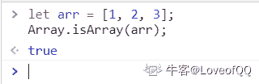
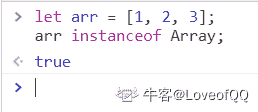
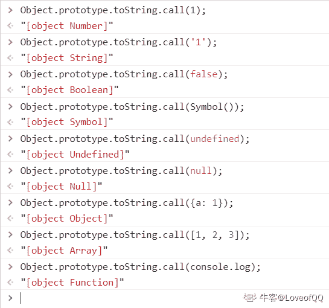
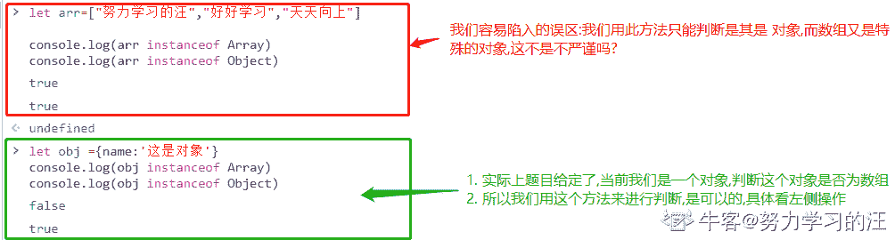
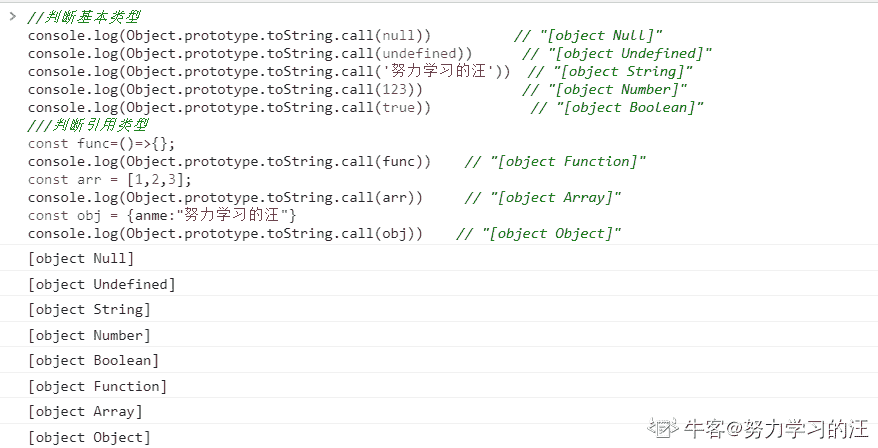

# 顺丰科技 2019 秋招安卓开发工程师笔试客观题合集

## 1

二叉排序树的链表节点定义如下：

```cpp
typedef struct BiTnode{
    int key_value;
    struct BiTnode *L,*R;/*节点的左、右树指针*/
}
```

请补充完整查找键值 key 的函数。

```cpp
BSTree lookup_key(BSTree root,int key)
{
    if() return NULL;
    else 
        if(key == root->key_value)
            return root;
        else if(key > root->key_value)
            return (1);
        else
            return (2);
}
```

正确答案: D   你的答案: 空 (错误)

```cpp
(1)lookup_key(root->R,key)
(2)lookup_key(NULL,key)
```

```cpp
(1)lookup_key(root->R,root.key_value)
(2)lookup_key(root->L,root.key_value)
```

```cpp
(1)lookup_key(root->L,key)
(2)lookup_key(root->R,key)
```

```cpp
(1)lookup_key(root->R,key)
(2)lookup_key(root->L,key)
```

本题知识点

顺丰科技 树 2019

讨论

[can~can~can](https://www.nowcoder.com/profile/46803557)

关键字 key 比根值大，则去与右子树对应的值比较；当关键字 key 值比根值小，则去与左之树对应的值比较。因为二叉排序树的值大小是，左子树<根<右子树

发表于 2019-03-14 09:38:12

* * *

[跳跳糖的 QQ 糖](https://www.nowcoder.com/profile/622864262)

二叉排序数的（递归）定义：1、若左子树非空，则左子树所有节点的值均小于它的根节点；2、若右子树非空，则右子树所有节点的值均大于于它的根节点；3、左右子树也分别为二叉排序树。

发表于 2019-03-12 20:33:38

* * *

[学术废物](https://www.nowcoder.com/profile/6473476)

根右左

发表于 2022-03-19 12:08:01

* * *

## 2

对序列（12,18,22,38,39,49,79,89）进行排序，最不适合的算法是（）

正确答案: B   你的答案: 空 (错误)

```cpp
冒泡排序
```

```cpp
快速排序
```

```cpp
归并排序
```

```cpp
插入排序
```

本题知识点

Java 工程师 安卓工程师 顺丰科技 排序 *信息技术岗 2019 iOS 工程师 C++工程师 PHP 工程师 算法工程师 区块链* *讨论

[仰望星空 73](https://www.nowcoder.com/profile/3491497)

快排不适合对基本有序的数据集合进行排序

发表于 2019-03-14 19:42:12

* * *

[Sugar201903222055238](https://www.nowcoder.com/profile/821678589)

快排序越是无序效率越高。基本有序是 O(n2),归并是 nlogn，直接是 n

发表于 2019-03-24 21:38:02

* * *

[叶建文](https://www.nowcoder.com/profile/58213545)

我的理解是，这里冒泡排序和快速排序都是 O(n²)，之所以选快排而不是冒泡，可能是因为常数因子的问题，快排相对复杂，因此直观理解它的常数因子就更大。

发表于 2019-03-26 23:41:26

* * *

## 3

调用函数时，入参及返回地址使用了（）

正确答案: D   你的答案: 空 (错误)

```cpp
队列
```

```cpp
多维数组
```

```cpp
顺序表
```

```cpp
栈
```

本题知识点

Java 工程师 安卓工程师 顺丰科技 栈 *信息技术岗 2019 iOS 工程师 C++工程师 PHP 工程师 算法工程师 区块链* *讨论

[仰望星空 73](https://www.nowcoder.com/profile/3491497)

在函数调用过程中形成嵌套时，则应使最后被调用的函数最先返回，后进先出，栈。

编辑于 2019-03-14 19:45:37

* * *

[低头前行](https://www.nowcoder.com/profile/544455681)

调用方法时，在虚拟机栈创建栈帧，栈帧中包括局部变量表，操作数栈，动态链接，返回地址

发表于 2020-08-27 21:10:39

* * *

[摇井](https://www.nowcoder.com/profile/94064650)

突然想起了递归 不正是栈吗

发表于 2019-03-25 22:43:44

* * *

## 4

设有递归算法如下，最终打印结果是（）

```cpp
#include<stdio.h>
 int foo(int a ,int b)
 {
     if (b == 0) return 0;
     if (b % 2 == 0) return foo(a+a,b/2);
     return foo(a+a,b/2)+a;    
 }
 int main()
 { 
   printf("%d", foo(1,3));
   return 0;
 }

```

正确答案: A   你的答案: 空 (错误)

```cpp
3
```

```cpp
4
```

```cpp
5
```

```cpp
6
```

本题知识点

递归

讨论

[ＭＭＱ](https://www.nowcoder.com/profile/217762715)

计算 foo(1,3)：此时 a=1,b=3;跳过两个 if 语句进入 return foo(1+1,3/2)+1,即 foo(2,1)+1；计算 foo(2,1)：同样，跳过两个 if 语句进入 return foo(2+2,1/2)+2,即 foo(4,0)+2;计算 foo(4,0):进入第一个 if 语句，return 0；逐层返回，得 foo(2,1)=0+2=2;再返回上一层，得 foo(1,3)=2+1=3；返回结果，foo(1,3)=3;

编辑于 2019-03-12 20:50:37

* * *

[路人癸 000](https://www.nowcoder.com/profile/528623642)

编译都过不了

发表于 2019-04-02 17:00:32

* * *

[许愿建行拿到 offer](https://www.nowcoder.com/profile/217268997)

注意 b 是整数,那么 3/2 等于 1

发表于 2019-11-19 21:30:04

* * *

## 5

请指出堆排序、选择排序、冒泡排序、快速排序的平均时间复杂度（）

正确答案: A   你的答案: 空 (错误)

```cpp
nlogn、n²、n²、nlogn
```

```cpp
n²、n²、n²、nlogn
```

```cpp
nlogn、nlogn、n²、nlogn
```

```cpp
nlogn、n²、n²、n²
```

本题知识点

排序 *讨论

[程序猿 Go 师傅](https://www.nowcoder.com/profile/242025553)


编辑于 2019-10-21 17:08:55

* * *

[theWeak](https://www.nowcoder.com/profile/829551324)

想起了马士兵老师的做的（有毒）的词选炮插快归堆希统计姬 N 方 N 老 N 一三对 N 加 KN 乘 K 不稳稳稳不稳稳不稳不稳稳稳稳🤣

发表于 2019-03-20 21:06:49

* * *

[horizon201809151642286](https://www.nowcoder.com/profile/607362852)

记住：  冒泡和选择    ： n²             快速和堆排序：nlogn

发表于 2019-03-19 15:38:13

* * *

## 6

What is Static Method in Java（）

正确答案: A B C   你的答案: 空 (错误)

```cpp
It is a method which belongs to the class and not to the object(instance)
```

```cpp
A static method can access only static data. It can not access non-static data (instance variables)
```

```cpp
A static method can call only other static methods and can not call a non-static method from it.
```

```cpp
A static method can not be accessed directly by the class name and doesn’t need any object
```

本题知识点

Java 工程师 安卓工程师 顺丰科技 Java 信息技术岗 2019 iOS 工程师 C++工程师 PHP 工程师 算法工程师 区块链 运维工程师

讨论

[coderofUESTC](https://www.nowcoder.com/profile/817336)

其实这题并不严谨，不管实例成员还是实例方法，都可以在静态方法里实例化一个对象再去调用

发表于 2019-07-06 18:12:28

* * *

[pitt1997](https://www.nowcoder.com/profile/211637886)

A：静态方法是一个属于类而不属于对象(实例)的方法。（√）B：静态方法只能访问静态数据。无法访问非静态数据(实例变量)。（√）C：静态方法只能调用其他静态方法，不能从中调用非静态方法。（√）D：静态方法不能通过类名直接访问，也不需要任何对象。（×） 静态方法可以直接用类名访问。

发表于 2019-04-07 15:40:46

* * *

[EruIluvatar](https://www.nowcoder.com/profile/6090755)

我是不会这道题吗，我是没看懂英文😃

发表于 2020-03-02 18:04:40

* * *

## 7

```cpp
public class CharToString {
 public static void main(String[] args)
 {
  char myChar = 'g';
  String myStr = Character.toString(myChar);
  System.out.println("String is: "+myStr);
  myStr = String.valueOf(myChar);
  System.out.println("String is: "+myStr);
 }
}
```

此代码片段输出正确的值是（）

正确答案: A   你的答案: 空 (错误)

```cpp
String is: g
String is: g
```

```cpp
String is: 103
String is: g
```

```cpp
String is: g
String is: 103
```

```cpp
String is: 103
String is: 103
```

本题知识点

Java 工程师 安卓工程师 顺丰科技 信息技术岗 顺丰科技 2019 iOS 工程师 顺丰科技 2019 Java 工程师 顺丰科技 2019 Java 工程师 顺丰科技 2019 Java 工程师 C++工程师 PHP 工程师 顺丰科技 2019 算法工程师 顺丰科技 2019 区块链 顺丰科技 2019 算法工程师 顺丰科技 2019 运维工程师 顺丰科技 2019 安卓工程师 顺丰科技 2019

讨论

[AppleJack](https://www.nowcoder.com/profile/130490159)

```cpp
public static String valueOf(char c) { char data[] = {c}; return new String(data, true);
}
```

直接查看源码，这里相当于新建了一个 String 类返回，那么显然选 A

发表于 2019-03-15 15:42:27

* * *

[我是如此相信](https://www.nowcoder.com/profile/7988004)

Character 类的方法如下：

```cpp
public static String toString(char c) {
    return String.valueOf(c);
}
```

编辑于 2019-03-25 09:03:31

* * *

[小强开学前](https://www.nowcoder.com/profile/4208515)

粗心看成了

```cpp
Integer.valueOf() 
```

发表于 2019-03-20 14:48:21

* * *

## 8

一个空栈，如果有顺序输入序列：a1，a2，a3...an（个数大于 3），而且输出第一个元素为 a(n-1), 那么所有元素都出栈后，（）

正确答案: D   你的答案: 空 (错误)

```cpp
输出的最后元素一定为 an
```

```cpp
输出的最后元素一定为 a1
```

```cpp
不能确定元素 a1 ~ (an-2) 的输出顺序
```

```cpp
a(n-2) 一定比 a(n-3) 先出
```

本题知识点

顺丰科技 栈 *2019 C++工程师* *讨论

[horizon201809151642286](https://www.nowcoder.com/profile/607362852)

这道题，我最开始理解错误：根据这道题的题意，大概应该这样来理解，a1~an 必须是按顺序入栈的。但是他最后说第一个出栈的是 an-1,由这里可以推测，a1-an-1 都是顺序入栈了，至于 an，他可以在 a1~an-1 任意一个元素出栈的过程入栈的，所以 an 输出的顺序不能确定，但是可以确定已经入栈的元素的，他们的出栈的先后顺序

发表于 2019-03-19 15:52:19

* * *

[赵子贺](https://www.nowcoder.com/profile/6118530)

既然 an-1 先出栈，说明 an-2, an-3 已经入栈并且还未出栈，所以 D 肯定是对的 B 的话 an 始终不进栈，a1~an-2 都出栈了以后再进栈，这时候弹出的是 an 为最后一个

发表于 2019-03-12 21:17:21

* * *

[喝杯酒吧](https://www.nowcoder.com/profile/4870419)

我刚开始选择了 B：因为我觉得 a1-an-2 都已经顺序入栈了，a1 就一定会最后出栈。但我忘记了还有一个 an，当 a1 出栈后 an 可以再进栈，那么最后一个出栈的将是 an

发表于 2019-03-22 12:08:58

* * *

## 9

利用栈完成数制转换，将十进制的 169 转换为八进制，出栈序列为（）

正确答案: A   你的答案: 空 (错误)

```cpp
251
```

```cpp
521
```

```cpp
215
```

```cpp
152
```

本题知识点

Java 工程师 安卓工程师 顺丰科技 栈 *信息技术岗 2019 iOS 工程师 C++工程师 PHP 工程师 算法工程师 区块链 运维工程师* *讨论

[AppleJack](https://www.nowcoder.com/profile/130490159)

169/8 = 21 余 1  21/8 = 2 余 5  2/8 = 0 余 2 余数倒过来 251 

发表于 2019-03-15 15:48:44

* * *

[Fourousky](https://www.nowcoder.com/profile/1506987)

其实就是直接转换就完事了，转换的原理就是用堆栈实现的

发表于 2019-03-17 15:27:57

* * *

[我爱打酱油](https://www.nowcoder.com/profile/283898704)

169 转化 8 进制：169=2*8²+5*8¹+1*8⁰，栈是先进后出，那么出来的数则为 251

发表于 2019-03-14 00:58:06

* * *

## 10

主机 IP 为 200.15.13.13/23,其子网掩码是（）

正确答案: D   你的答案: 空 (错误)

```cpp
255.255.249.0
```

```cpp
255.255.2410
```

```cpp
255.255.253.0
```

```cpp
255.255.254.0
```

本题知识点

Java 工程师 安卓工程师 顺丰科技 网络基础 信息技术岗 2019 iOS 工程师 C++工程师 PHP 工程师 算法工程师 区块链 运维工程师

讨论

[youcoward](https://www.nowcoder.com/profile/998912528)

/23 的意思是前 23 位是 1，即最后（4*8-23）=9 位是 0，所以最后 16 位是 11111110 00000000，可知是 255.255.254.0

发表于 2019-03-13 19:50:28

* * *

[仰望星空 73](https://www.nowcoder.com/profile/3491497)

掩码长度为 23，也就是 11111111 11111111 11111110 00000000

发表于 2019-03-14 19:55:57

* * *

[菜🐔也要有梦](https://www.nowcoder.com/profile/5514240)

ip 地址由网络号 + 主机号组成。划分子网后为 网络号+ 子网号 + 主机号子网掩码用于掩盖网络号和子网号。1 对应网络号和子网号，0 对应主机号

发表于 2019-08-08 13:03:02

* * *

## 11

总部给某分公司分配的网络地址是 172.16.2.0/24,该分公司有三个部门，每个部门计算机不多于 30 台,在网络配置时，进行子网划分，可以使用的子网掩码是（）

正确答案: B C   你的答案: 空 (错误)

```cpp
255.255.255.128
```

```cpp
255.255.255.192
```

```cpp
255.255.255.224
```

```cpp
255.255.255.240
```

本题知识点

Java 工程师 顺丰科技 网络基础 信息技术岗 2019

讨论

[杯小年](https://www.nowcoder.com/profile/5414042)

1.分公司分配的网络地址是 172.16.2.0/24，子网掩码就是 11111111.11111111.11111111.00000000,（24 个 1）；2.分公司 3 个部门，那么至少用 2 位才能分配 3 个以上（00,01,10,11）；3.那么分部的子网掩码就要大于等于 11111111.11111111.11111111.11000000（192）了；4.又由于每个部门电脑不多于 30 台，那么至少也要给人家留出 30 台的主机地址，所以子网掩码不能是 11111111.11111111.11111111.11110000（240），因为只留出 4 位不够表示 30 台主机。

编辑于 2019-04-01 09:04:52

* * *

[半岛。](https://www.nowcoder.com/profile/397758587)

前面两位说的比较清楚了，简单补充一下 1.分公司的网络地址是 172.16.2.0/24，子网掩码长度就是 24 位 11111111.11111111.11111111.00000000（这个就不要问为什么了）；2.分公司 3 个部门，那么就用第 25 位和第 26 位来区分三个部门，11111111.11111111.11111111.**00**000000（00~11），直接排除 A；3.那么各个部门用来区分自己的子网掩码只剩下最后 6 位（27~32 位）来表示了；4.若用 255.255.255.192，最后 8 位是 11000000，只能表示 11000000~11111111 除去广播地址一共 62 台
5.若用 255.255.255.224，最后 8 位是 11100000，只能表示 11100000~11111111 除去广播地址一共 30 台
6.若用 255.255.255.240，最后 8 位是 11110000，只能表示 11110000~11111111 除去广播地址一共 14 台

发表于 2019-03-17 11:22:39

* * *

[大三想开始工作了](https://www.nowcoder.com/profile/443077457)

172.16.2.0/24 为 B 类地址，所以子网掩码肯定是 255.255 开头，因为该地址有 24 为的网络号，也就是剩下的子网掩码是：11111111.00000000，又因为有三个部门，留下两位进行表示，且这两位最大为 11，所以有 11111111.11000000（255.192），又因为 30 的二进制至少用 5 位来表示，4 位（1111）的最大值才 15,5 位的最大值 31，所以只留下 4 位时为 11111111.11110000,（255.240），所以为大于等于 192 小于 240.

发表于 2019-03-23 19:59:11

* * *

## 12

以下叙述中，不正确的有（ ）

正确答案: B D   你的答案: 空 (错误)

```cpp
单元测试对源程序中每一个程序单元进行测试，检查各个模块是否正确实现规定的功能，从而发现模块在编码中或算法中的错误。该阶段涉及编码和详细设计文档。
```

```cpp
集成测试是基于软件需求说明书的黑盒测试，是对已经集成好的软件系统进行彻底的测试，以验证软件系统的正确性和性能等满足其规约所指定的要求，检查软件的行为和输出是否正确
```

```cpp
确认测试主要是检查已实现的软件是否满足需求规格说明书中确定了的各种需求。
```

```cpp
系统测试的主要目的是检查软件单位之间的接口是否正确，主要是针对程序内部结构进行测试，特别是对程序之间的接口进行测试。
```

本题知识点

Java 工程师 安卓工程师 顺丰科技 软件测试 信息技术岗 2019 iOS 工程师 C++工程师 PHP 工程师 算法工程师 区块链 运维工程师

讨论

[程序猿 Go 师傅](https://www.nowcoder.com/profile/242025553)

B：

```cpp
系统测试是基于软件需求说明书的黑盒测试，是对已经集成好的软件系统进行彻底的测试，以验证软件系统的正确性和性能等满足其规约所指定的要求，检查软件的行为和输出是否正确

```

D：

```cpp
集成测试的主要目的是检查软件单位之间的接口是否正确，主要是针对程序内部结构进行测试，特别是对程序之间的接口进行测试。
```

BD 的概念刚好反了，所以错误

编辑于 2019-10-21 17:08:47

* * *

[牛客 500811011 号](https://www.nowcoder.com/profile/500811011)

单元测试：各个模块单独测试确认测试：确认软件需求是否都达成的测试系统测试：软件系统测试集成测试：程序接口测试

发表于 2020-04-10 22:18:05

* * *

[惠鸿飞](https://www.nowcoder.com/profile/881469708)

B 项是前半句描述的是集成测试的内容，后半句数据系统测试内容，前后矛盾 D 项描述的接口测试是属于集成测试的内容，而不属于系统测试

发表于 2019-07-18 11:22:07

* * *

## 13

关于链表，正确的是（）

正确答案: A C   你的答案: 空 (错误)

```cpp
无需实现估计空间
```

```cpp
支持随机访问
```

```cpp
增删不必挪动元素
```

```cpp
所需空间与线性表长度成正比，并且地址连续
```

```cpp
插入一个元素所需挪动元素的平均个数为 n/2
```

本题知识点

Java 工程师 安卓工程师 顺丰科技 链表 *信息技术岗 2019 iOS 工程师 C++工程师 PHP 工程师 前端工程师 算法工程师 区块链* *讨论

[Wendy20190320100524](https://www.nowcoder.com/profile/331006331)

顺丰对前端工程师是不是有什么误解？

发表于 2019-03-20 10:08:16

* * *

[零次方](https://www.nowcoder.com/profile/5915615)

A 选项是不是应该改成：无需事先估计空间

发表于 2019-03-27 23:46:23

* * *

[neekity](https://www.nowcoder.com/profile/7732482)

B 不支持随机 D 地址不连续 E 增删不必挪动元素

发表于 2019-03-15 11:04:52

* * *

## 14

以下关于链表和数组说法正确的是（）

正确答案: A B C   你的答案: 空 (错误)

```cpp
new 出来的数组也在堆中
```

```cpp
数组插入或删除元素的时间复杂度 O(n)，链表的时间复杂度 O(1)
```

```cpp
数组利用下标定位，时间复杂度为 O(1)，链表定位元素时间复杂度 O(n)
```

```cpp
对于 add 和 remove，ArrayList 要比 LinkedList 快
```

本题知识点

Java 工程师 安卓工程师 顺丰科技 数组 链表 *信息技术岗 2019 iOS 工程师 C++工程师 PHP 工程师 前端工程师 算法工程师 区块链 运维工程师* *讨论

[小夥](https://www.nowcoder.com/profile/356553)

```cpp
数组从栈中分配空间，链表从堆中分配空间
```

数组也可以是 new 的，链表也可以是用数组模拟的~~

发表于 2019-03-16 23:46:53

* * *

[smile_ll](https://www.nowcoder.com/profile/41411708)

..new 出来的东西不应该都是堆中的吗

发表于 2019-03-15 09:19:29

* * *

[牛客 650726674 号](https://www.nowcoder.com/profile/650726674)

*   ArrayList 底层实现就是数组，且 ArrayList 实现了 RandomAccess，表示它能快速随机访问存储的元素，通过下标 index 访问，只是我们需要用 get() 方法的形式， 数组支持随机访问， 查询速度快， 增删元素慢；
*   LinkedList 底层实现是链表， LinkedList 没有实现 RandomAccess 接口，链表支持顺序访问， 查询速度慢， 增删元素快

发表于 2020-03-15 22:34:32

* * *

## 15

甲乙丙 3 个进程对某类资源的需求分别是 7 个、8 个、3 个。且目前已分别得到了 3 个、3 个和 2 个资源，若系统还至少能提供（ ）个资源，则系统是安全的。

正确答案: C   你的答案: 空 (错误)

```cpp
1
```

```cpp
4
```

```cpp
2
```

```cpp
8
```

本题知识点

Java 工程师 安卓工程师 顺丰科技 操作系统 信息技术岗 顺丰科技 2019 iOS 工程师 顺丰科技 2019 Java 工程师 顺丰科技 2019 Java 工程师 顺丰科技 2019 Java 工程师 C++工程师 PHP 工程师 顺丰科技 2019 安卓工程师 前端工程师 顺丰科技 2019 算法工程师 顺丰科技 2019 区块链 顺丰科技 2019 运维工程师 顺丰科技 2019 安卓工程师 顺丰科技 2019

讨论

[赵子贺](https://www.nowcoder.com/profile/6118530)

丙需要一个，等丙执行完会释放 3 个，此时甲最多获得 6 个，因而甲还需要一个才能够正常运行，所以一共需要两个

发表于 2019-03-12 22:10:32

* * *

[锵锵骅泗客](https://www.nowcoder.com/profile/4864872)

我觉得这题答案是 D,那个榜一说的不对吧，既然说了至少，那就要考虑最坏情况，当甲：6 个 乙：7 个 丙：2 个 时，这时添加一个既可以保证无死锁，所以一共需要 3 + 4 + 1 = 8 个

发表于 2019-04-01 18:45:24

* * *

[Geek201903181326118](https://www.nowcoder.com/profile/189737124)

cpu 通过时间分片的形式给进程分配资源，丙进程需要一个资源才能开始工作，等丙进程工作完了，将资源释放，此时甲进程会获得释放的 3 个资源，甲进程拥有 6 个资源，需要再分配一个资源给甲进程方能开始工作，等甲进程工作完了 再将资源交给乙，这样才能保证系统的安全，故需要再分配 2 个资源

发表于 2019-03-18 14:10:00

* * *

## 16

32 位处理器是指处理器的（）是 32 位的

正确答案: B   你的答案: 空 (错误)

```cpp
控制总线
```

```cpp
数据总线
```

```cpp
地址总线
```

```cpp
所有的总线
```

本题知识点

Java 工程师 安卓工程师 顺丰科技 操作系统 信息技术岗 顺丰科技 2019 iOS 工程师 顺丰科技 2019 Java 工程师 顺丰科技 2019 Java 工程师 顺丰科技 2019 Java 工程师 C++工程师 PHP 工程师 顺丰科技 2019 安卓工程师 前端工程师 顺丰科技 2019 算法工程师 顺丰科技 2019 区块链 顺丰科技 2019 运维工程师 顺丰科技 2019 安卓工程师 顺丰科技 2019

讨论

[can~can~can](https://www.nowcoder.com/profile/46803557)

32 位处理器，计算机中的位数指的是[CPU](https://baike.baidu.com/item/CPU)一次能处理的最大位数。32 位计算机的 CPU 一次最多能处理 32 位数据

发表于 2019-03-13 21:54:43

* * *

[九斤 ing](https://www.nowcoder.com/profile/5228614)

1、CPU 中的位指的是一个时钟周期可以处理的数据数量。8 位为一个字节，32 位就是一次可以处理 4 个字节，64 位是一次可以处理 8 个字节 2、32 位 CPU 是指数据总线有 32 位，寄存器是暂存数据和中间结果的单元，因此寄存器的位数指的也是处理数据的长度肯定是和数据总线的根数相同，否则寄存器和 CPU 内其他单元之间将无法通信，交换数据。因此 32 位 CPU 的 32 位是包含了寄存器是 32 位的意思，但其实定义是数据总线的宽度和根数。

发表于 2019-04-14 17:23:08

* * *

[冲鸭！冲鸭！冲鸭！](https://www.nowcoder.com/profile/551437339)

32 位处理器：指的是 CPU 一次能处理数据的最大位数。

发表于 2019-08-10 19:27:13

* * *

## 17

以下关于集合类 ArrayList、LinkedList、HashMap 描述错误的是（）

正确答案: C   你的答案: 空 (错误)

```cpp
HashMap 实现 Map 接口，它允许任何类型的键和值对象，并允许将 null 用作键或值
```

```cpp
ArrayList 和 LinkedList 均实现了 List 接口
```

```cpp
添加和删除元素时，ArrayList 的表现更佳
```

```cpp
ArrayList 的访问速度比 LinkedList 快
```

本题知识点

Java 工程师 安卓工程师 顺丰科技 Java 前端工程师 2019

讨论

[人余月半子](https://www.nowcoder.com/profile/514787832)

   1\. List 是一个有序集合，可以存放重复的数据 (有序：存进是什么顺序，取出时还是什么顺序)
                (1).ArrayList 底层是数组适合查询，不适合增删元素。
                (2).LiskedList 底层是双向链表适合增删元素，不适合查询操作。
                (3).Vector 底层和 ArrayList 相同，但是 Vector 是线程安全的，效率较低很少使用
   2\. Set 是一个无序集合，不允许放重复的数据 (无序不可重复，存进和取出的顺序不一样)
                (1).HashSet 底层是哈希表/散列表
                (2).TreeSet 继承 sartedSet 接口（无需不可重复，但存进去的元素可以按照元素的大小自动排序）
   3\. Map 是一个无序集合，以键值对的方式存放数据，键对象不允许重复，值对象可以重复。                (1).HashMap 实现不同步，线程不安全。  HashTable 线程安全                (2).HashMap 中的 key-value 都是存储在 Entry 中的。                (3).HashMap 可以存 null 键和 null 值，不保证元素的顺序恒久不变，它的底层使用的是数组和链表，通过 hashCode()方法和 equals 方法保证键的唯一性

编辑于 2020-10-10 22:54:29

* * *

[稀饭.冯](https://www.nowcoder.com/profile/723797851)

数组的插入和删除效率比较低，读取的效率高，因为地址是连续的

发表于 2019-03-21 19:17:35

* * *

[牛客-120 抢救中心](https://www.nowcoder.com/profile/6165623)

（补充）Hashtable 和 HashMap 的区别
1.继承不同。     public class Hashtable extends Dictionary implements Map public class HashMap extends  AbstractMap implements Map 2.Hashtable 中的方法是同步的，而 HashMap 中的方法在缺省情况下是非同步的。在多线程并发的环境下，可以直接使用 Hashtable，但是要使用 HashMap 的话就要自己增加同步处理了。3.Hashtable 中， key 和 value 都不允许出现 null 值。 在 HashMap 中， null 可以作为键，这样的键只有一个；可以有一个或多个键所对应的值为 null 。当 get() 方法返回 null 值时，即可以表示 HashMap 中没有该键，也可以表示该键所对应的值为 null 。因此，在 HashMap 中不能由 get() 方法来判断 HashMap 中是否存在某个键， 而应该用 containsKey() 方法来判断。 4.两个遍历方式的内部实现上不同。Hashtable、HashMap 都使用了 Iterator。而由于历史原因，Hashtable 还使用了 Enumeration 的方式。5.哈希值的使用不同，HashTable 直接使用对象的 hashCode。而 HashMap 重新计算 hash 值。6.Hashtable 和 HashMap 它们两个内部实现方式的数组的初始大小和扩容的方式。HashTable 中 hash 数组默认大小是 11，增加的方式是 old*2+1。HashMap 中 hash 数组的默认大小是 16，而且一定是 2 的指数。

发表于 2020-06-19 16:11:58

* * *

## 18

某打车公司将驾驶里程（drivedistanced）超过 5000 里的司机信息转移到一张称为 seniordrivers 的表中,他们的详细情况被记录在表 drivers 中，正确的 sql 为（）

正确答案: D   你的答案: 空 (错误)

```cpp
insert into seniordrivers
drivedistanced>=5000 from drivers where
```

```cpp
insert seniordrivers (drivedistanced) values from drivers where drivedistanced>=5000
```

```cpp
insert into seniordrivers
(drivedistanced)values>=5000 from drivers where
```

```cpp
select * into seniordrivers from drivers where drivedistanced >=5000
```

本题知识点

Java 工程师 安卓工程师 顺丰科技 数据库 SQL 信息技术岗 顺丰科技 2019 iOS 工程师 顺丰科技 2019 Java 工程师 顺丰科技 2019 Java 工程师 顺丰科技 2019 Java 工程师 C++工程师 PHP 工程师 顺丰科技 2019 安卓工程师 前端工程师 顺丰科技 2019 算法工程师 顺丰科技 2019 区块链 顺丰科技 2019 算法工程师 顺丰科技 2019 运维工程师 顺丰科技 2019 安卓工程师 顺丰科技 2019

讨论

[LIUKAI915](https://www.nowcoder.com/profile/661521241)

SQL SELECT INTO 语句可用于创建表的备份复件。
SELECT INTO 语句
SELECT INTO 语句从一个表中选取数据，然后把数据插入另一个表中。
SELECT INTO 语句常用于创建表的备份复件或者用于对记录进行存档。
SQL SELECT INTO 语法
您可以把所有的列插入新表：
SELECT * INTO new_table_name [IN externaldatabase] FROM old_tablename
或者只把希望的列插入新表：
SELECT column_name(s) INTO new_table_name [IN externaldatabase] FROM old_tablename
SQL SELECT INTO 实例 - 制作备份复件
下面的例子会制作 "Persons" 表的备份复件：
SELECT * INTO Persons_backup FROM Persons
IN 子句可用于向另一个数据库中拷贝表：
SELECT * INTO Persons IN 'Backup.mdb' FROM Persons
如果我们希望拷贝某些域，可以在 SELECT 语句后列出这些域：
SELECT LastName,FirstName
INTO Persons_backup
FROM Persons

发表于 2019-04-11 09:59:56

* * *

[赵子贺](https://www.nowcoder.com/profile/6118530)

SELECT INTO FROM 句式[`www.cnblogs.com/mq0036/p/4155136.html`](https://www.cnblogs.com/mq0036/p/4155136.html)

发表于 2019-03-12 22:32:33

* * *

[旧城俨然回眸笑](https://www.nowcoder.com/profile/6223383)

select into:copy information from one table into anotherselect */colums into newtable (in external db )from table

发表于 2020-06-23 16:10:18

* * *

## 19

允许信号在两个方向上传输，但某一时刻只允许信号在一个信道上单向传输的通信是（ ）

正确答案: B   你的答案: 空 (错误)

```cpp
单工通信
```

```cpp
半双工通信
```

```cpp
全双工通信
```

```cpp
时工通信
```

本题知识点

Java 工程师 安卓工程师 顺丰科技 通信原理 信息技术岗 2019 iOS 工程师 C++工程师 PHP 工程师 算法工程师 运维工程师

讨论

[CS 之前 P 为首](https://www.nowcoder.com/profile/6532970)

1.  单工数据传输只支持数据在一个方向上传输；在同一时间只有一方能接受或发送信息，不能实现双向通信。

2.  半双工数据传输允许数据在两个方向上传输,在某时刻,只允许数据在一个方向上传输；
3.  全双工数据通信允许数据同时在两个方向上传输,在同一时间可以同时接受和发送信息，进行双向通信；

发表于 2019-03-15 18:43:12

* * *

[牛客 842055369 号](https://www.nowcoder.com/profile/842055369)

B

发表于 2021-07-04 02:05:45

* * *

[牛客 50309818 号](https://www.nowcoder.com/profile/50309818)

单工

发表于 2021-06-26 14:17:52

* * *

## 20

LR 分析法属于（）

正确答案: D   你的答案: 空 (错误)

```cpp
自顶向下分析法
```

```cpp
LALR 分析法
```

```cpp
SLR 分析法
```

```cpp
自底向上分析法
```

本题知识点

Java 工程师 安卓工程师 顺丰科技 编译和体系结构 信息技术岗 2019 iOS 工程师 C++工程师 PHP 工程师 算法工程师 运维工程师

讨论

[信自己](https://www.nowcoder.com/profile/5222489)

这个真的会考到吗？见都没见过。。。。

发表于 2019-08-28 19:55:49

* * *

[陈易斯](https://www.nowcoder.com/profile/1628023)

[`blog.csdn.net/yongchaocsdn/article/details/78704553`](https://blog.csdn.net/yongchaocsdn/article/details/78704553)

发表于 2019-03-14 21:40:06

* * *

[PKU_xiaowei](https://www.nowcoder.com/profile/291394677)

阿这

发表于 2020-08-29 14:27:17

* * *

## 21

下面哪种 UML 图描述的是一个实体基于事件反应的动态行为，显示了该实体如何根据当前所处的状态对不同的事件做出反应（ ）

正确答案: B   你的答案: 空 (错误)

```cpp
活动图
```

```cpp
状态图
```

```cpp
配置图
```

```cpp
构件图
```

本题知识点

Java 工程师 安卓工程师 顺丰科技 UML 信息技术岗 2019 iOS 工程师 C++工程师 PHP 工程师 算法工程师 运维工程师

讨论

[小 123456](https://www.nowcoder.com/profile/886247949)

用例图

描述角色以及角色与用例之间的连接关系。说明的是谁要使用系统，以及他们使用该系统可以做些什么。一个[用例图](https://baike.baidu.com/item/%E7%94%A8%E4%BE%8B%E5%9B%BE)包含了多个模型元素，如系统、参与者和用例，并且显示了这些元素之间的各种关系，如泛化、关联和依赖。

类图

[类图](https://baike.baidu.com/item/%E7%B1%BB%E5%9B%BE)是描述系统中的类，以及各个类之间的关系的静态视图。能够让我们在正确编写代码以前对系统有一个全面的认识。类图是一种模型类型，确切的说，是一种静态模型类型。类图表示类、接口和它们之间的协作关系。

对象图

与[类图](https://baike.baidu.com/item/%E7%B1%BB%E5%9B%BE)极为相似，它是类图的实例，对象图显示类的多个对象实例，而不是实际的类。它描述的不是类之间的关系，而是对象之间的关系。 

包图

包图用于描述系统的分层结构，由包或类组成，表示包与包之间的关系。 

活动图

描述用例要求所要进行的活动，以及活动间的约束关系，有利于识别并行活动。能够演示出系统中哪些地方存在功能，以及这些功能和系统中其他组件的功能如何共同满足前面使用[用例图](https://baike.baidu.com/item/%E7%94%A8%E4%BE%8B%E5%9B%BE)[建模](https://baike.baidu.com/item/%E5%BB%BA%E6%A8%A1)的商务需求。 

状态图

描述类的对象所有可能的状态，以及事件发生时状态的转移条件。可以捕获对象、子系统和系统的生命周期。他们可以告知一个对象可以拥有的状态，并且事件(如消息的接收、时间的流逝、错误、条件变为真等)会怎么随着时间的推移来影响这些状态。一个[状态图](https://baike.baidu.com/item/%E7%8A%B6%E6%80%81%E5%9B%BE)应该连接到所有具有清晰的可标识状态和复杂行为的类；该图可以确定类的行为，以及该行为如何根据当前的状态变化，也可以展示哪些事件将会改变类的对象的状态。状态图是对[类图](https://baike.baidu.com/item/%E7%B1%BB%E5%9B%BE)的补充。 

序列图（[顺序图](https://baike.baidu.com/item/%E9%A1%BA%E5%BA%8F%E5%9B%BE)）

序列图是用来显示你的参与者如何以一系列顺序的步骤与系统的对象交互的模型。顺序图可以用来展示对象之间是如何进行交互的。顺序图将显示的重点放在消息序列上，即强调消息是如何在对象之间被发送和接收的。 

协作图

和序列图相似，显示对象间的动态合作关系。可以看成是类图和[顺序图](https://baike.baidu.com/item/%E9%A1%BA%E5%BA%8F%E5%9B%BE)的交集，[协作图](https://baike.baidu.com/item/%E5%8D%8F%E4%BD%9C%E5%9B%BE)[建模](https://baike.baidu.com/item/%E5%BB%BA%E6%A8%A1)对象或者角色，以及它们彼此之间是如何通信的。如果强调时间和顺序，则使用序列图；如果强调上下级关系，则选择协作图；这两种图合称为交互图。

构件图（[组件图](https://baike.baidu.com/item/%E7%BB%84%E4%BB%B6%E5%9B%BE)）

描述代码[构件](https://baike.baidu.com/item/%E6%9E%84%E4%BB%B6)的[物理结构](https://baike.baidu.com/item/%E7%89%A9%E7%90%86%E7%BB%93%E6%9E%84)以及各种构建之间的依赖关系。用来[建模](https://baike.baidu.com/item/%E5%BB%BA%E6%A8%A1)软件的组件及其相互之间的关系，这些图由构件标记符和构件之间的关系构成。在组件图中，构件是软件单个组成部分，它可以是一个文件，产品、[可执行文件](https://baike.baidu.com/item/%E5%8F%AF%E6%89%A7%E8%A1%8C%E6%96%87%E4%BB%B6)和脚本等。 

部署图（配置图）

是用来[建模](https://baike.baidu.com/item/%E5%BB%BA%E6%A8%A1)系统的物理部署。例如计算机和设备，以及它们之间是如何连接的。[部署图](https://baike.baidu.com/item/%E9%83%A8%E7%BD%B2%E5%9B%BE)的使用者是开发人员、系统集成人员和测试人员。部署图用于表示一组物理结点的集合及结点间的相互关系，从而建立了系统[物理层](https://baike.baidu.com/item/%E7%89%A9%E7%90%86%E5%B1%82)面的模型。

发表于 2019-03-20 22:23:14

* * *

[牛客 692444208 号](https://www.nowcoder.com/profile/692444208)

只认识状态图

发表于 2021-03-09 18:50:59

* * *

## 22

 在关系模式 R(U,F)中,X，Y，Z 是 U 中属性，则多值依赖的传递律是（）

正确答案: D   你的答案: 空 (错误)

```cpp
如果 X→→Y，Y→→Z，则 X→→Z
```

```cpp
如果 X→→Y，Y→→Z，则 X→→YZ
```

```cpp
如果 X→→Y，Y→→Z，则 X→→Y Z
```

```cpp
如果 X→→Y，Y→→Z，则 X→→Z-Y
```

本题知识点

Java 工程师 安卓工程师 顺丰科技 编译和体系结构 信息技术岗 2019 iOS 工程师 C++工程师 PHP 工程师 算法工程师 运维工程师

讨论

[大月佥槑](https://www.nowcoder.com/profile/499970558)

区别多值依赖和函数依赖：[`blog.chinaunix.net/uid-411974-id-88303.html`](http://blog.chinaunix.net/uid-411974-id-88303.html)

发表于 2019-04-08 22:28:07

* * *

[Moody..未来可期](https://www.nowcoder.com/profile/247953307)

关于函数依赖和多值依赖，可以找到一个完整的推理规则集：A1.（函数依赖的自反律）：如果 Y∈X∈U，则 X→Y。A2.（函数依赖的增广律）：如果 X→Y,且 Z∈U,则 XZ→YZ。A3.（函数依赖的传递律）：如果 X→Y，Y→Z，则 X→Z。A4.（多值依赖的补规则）：如果 X→→Y，则 X→→（U-X-Y）。A5.（多值依赖的增广律）：如果 X→→Y，且 V∈W，则 WX→→VY。A6.（多值依赖的传递律）：如果 X→→Y，Y→→Z，则 X→→（Z-Y）。A7.（从函数依赖导出多值依赖）：如果 X→Y，则 X→→Y。A8.（从多值依赖导出函数依赖）：如果 X→→Y，Z∈Y，Y∩W=∮，W→Z，则 X→Z。A9.（多值依赖的合并律）：如果 X→→Y，X→→Z，则 X→→YZ。A10.（多值依赖的伪传递律）：如果 X→→Y，WY→→Z，则 WX→→（Z-WY）。A11.（多值依赖与函数依赖混合传递律）：如果 X→→Y，XY→Z，则 X→（Z-Y）。A12.（多值依赖的分解律）：如果 X→→Y，X→→Z，则 X→→（Y∩X），X→→（Y-Z），X→→（Z-Y）。

发表于 2021-03-03 12:19:40

* * *

[江小洁](https://www.nowcoder.com/profile/668501864)

多值依赖的性质及证明：[`www.zhihu.com/question/27348823`](https://www.zhihu.com/question/27348823)

发表于 2019-09-09 22:50:42

* * *

## 23

下面关于 JAVA 的垃圾回收机制，正确的是（ ）

正确答案: B   你的答案: 空 (错误)

```cpp
当调用“System.gc()”来强制回收时，系统会立即回收垃圾
```

```cpp
垃圾回收不能确定具体的回收时间
```

```cpp
程序可明确地标识某个局部变量的引用不再被使用
```

```cpp
程序可以显式地立即释放对象占有的内存
```

本题知识点

Java 工程师 安卓工程师 顺丰科技 Java 信息技术岗 顺丰科技 2019 iOS 工程师 顺丰科技 2019 Java 工程师 C++工程师 PHP 工程师 顺丰科技 2019 安卓工程师 前端工程师 顺丰科技 2019 算法工程师 顺丰科技 2019 运维工程师 顺丰科技 2019 安卓工程师 顺丰科技 2019

讨论

[ღ.ᵧₒᵤ](https://www.nowcoder.com/profile/213859533)

垃圾回收是 jvm 自动进行的，可以调用 System.GC（）；提醒 jvm，但是具体什么时间不确定。

发表于 2019-07-31 20:47:05

* * *

[帅老∏](https://www.nowcoder.com/profile/588172056)

顺丰总算出了道人题

发表于 2019-09-12 23:27:59

* * *

[晚飞的笨鸟](https://www.nowcoder.com/profile/390434101)

系统自动回收垃圾

发表于 2019-03-16 10:28:09

* * *

## 24

下列关于 WebView 中描述正确的是？

正确答案: B C   你的答案: 空 (错误)

```cpp
加载本地 assets 中的文件，使用 ajax 访问远程服务器会跨域
```

```cpp
在 WebView 中下载文件需要设置 setDownloadListener
```

```cpp
通过同步 Cookie 的方式可以使 WebView 保持登录状态
```

```cpp
在访问 https 网页时收到 onReceivedSslError 回调可以使用 handler.cancel()忽略错误
```

本题知识点

Java 工程师 安卓工程师 顺丰科技 Android 2019

讨论

[没用的喵叔](https://www.nowcoder.com/profile/7903771)

A 应该是正确的。

发表于 2020-02-22 21:01:24

* * *

[Arx](https://www.nowcoder.com/profile/3295017)

忽略错误， 继续访问网页是

```cpp
  handler.proceed();
```

发表于 2020-01-17 13:54:10

* * *

[丵菲](https://www.nowcoder.com/profile/402640698)

https 是开了 ssl 的网页。这个是基本功能，不能忽略。

发表于 2021-08-08 23:28:35

* * *

## 25

Android 中常见的 Eventbus 可以理解成什么样的设计模式（）

正确答案: C   你的答案: 空 (错误)

```cpp
责任链模式
```

```cpp
策略模式
```

```cpp
观察者模式
```

```cpp
装饰者模式
```

本题知识点

Java 工程师 安卓工程师 顺丰科技 Android 2019

讨论

[等风来了就去跑](https://www.nowcoder.com/profile/2301950)

EventBus 是观察者设计模式的一种实现。EventBus 是一种用于 Android 的事件发布-订阅总线，由 GreenRobot 开发，Gihub 地址是：EventBus。它简化了应用程序内各个组件之间进行通信的复杂度，尤其是碎片之间进行通信的问题，可以避免由于使用广播通信而带来的诸多不便。

发表于 2022-02-07 15:45:18

* * *

[Pabo007](https://www.nowcoder.com/profile/784660081)

用于线程间的通讯代替 hander 或用于组件间的通讯代替 Intent

发表于 2021-09-15 15:42:15

* * *

[杨安大](https://www.nowcoder.com/profile/425661190)

Eventhub 观察内核中是否有 input 事件产生，我瞎编的

发表于 2020-03-17 23:51:19

* * *

## 26

解析 XML 的方式有（）

正确答案: B D   你的答案: 空 (错误)

```cpp
字符器类型
```

```cpp
dom
```

```cpp
流方式
```

```cpp
SAX
```

本题知识点

Java 工程师 安卓工程师 顺丰科技 2019

讨论

[凌先生](https://www.nowcoder.com/profile/754069867)

常用:sax dom pull

发表于 2019-03-19 20:54:17

* * *

## 27

两个 Activity 之间跳转，一定会执行哪些方法 ？

正确答案: A B D   你的答案: 空 (错误)

```cpp
第一个 Activity 会执行 OnPause 方法
```

```cpp
第二个 Activity 会执行 onStart 方法
```

```cpp
第一个 Activity 会执行 OnStop 方法
```

```cpp
第二个 Activity 会执行 OnResume 方法
```

本题知识点

Java 工程师 安卓工程师 顺丰科技 Android 2019

讨论

[付晓方](https://www.nowcoder.com/profile/754267102)

如果第二个 Activity 为透明的，第一个 Activity 的 onStop 方法不会执行

发表于 2019-03-25 22:01:10

* * *

[weidiezeng](https://www.nowcoder.com/profile/991175256)

选项 B 有问题，如果 ActivtiyB 采用透明主题，就不会回调 onstop，所以返回 A 是也不会回调 onStart()

编辑于 2019-09-05 17:59:57

* * *

[CoralRed](https://www.nowcoder.com/profile/1482531)

如果像地图这种，app 已经启动，但是在后台。然后从美团 app 的 activity 跳到地图 app 的 activity，此时走的应该是 onRestart（）方法吧，不一定会走 onStart（）方法了。

发表于 2019-03-15 18:19:02

* * *

## 28

请指出下面一段单例的伪代码写法问题？

```cpp
private static   SingLeton  instance;
public SingLeton static singleton(){
     synchronized (this){

       if(instance == null){
   instance = new SingLeton(); 
       }

     }
     return instance;
}
```

正确答案: A C E   你的答案: 空 (错误)

```cpp
效率不高
```

```cpp
很完美
```

```cpp
SingLeton 实例化不是原子操作，有重复实例化的可能
```

```cpp
多线程很安全
```

```cpp
多线程不安全
```

本题知识点

Java 工程师 安卓工程师 顺丰科技 设计模式 2019

讨论

[ChienSun](https://www.nowcoder.com/profile/108304699)

这个题目本身就有问题，说是伪代码又不够伪。1、static 关键字和返回值 SingLeton 顺序反了，应该是 public static SingLeton singleton2、静态方法不能用 this 作为锁，可以改成 synchronized  (SingLeton.class)下面这种方式比较推荐：

```cpp
public class SingLeton {

    private SingLeton() {}

    private static class SingLetonInstance {
        private static final SingLeton obj = new SingLeton();
    }

    public static SingLeton getInstance() {
        return SingLetonInstance.obj;
    }
}
```

编辑于 2019-03-27 14:46:23

* * *

[和雨相拥](https://www.nowcoder.com/profile/83515675)

***题目，代码都跑不通还谈什么效率

发表于 2020-09-06 20:08:31

* * *

[CoralRed](https://www.nowcoder.com/profile/1482531)

这是实现单例的最简单方法之一，它不是线程安全的（你不能保证在多线程环境中只有一个类的实例）。 如果你可以保证只会有一个线程戳，那么你肯定可以继续，但你已经被警告了！

发表于 2019-03-15 18:23:18

* * *

## 29

以下哪些是 JavaScript 的基本数据类型？（    ）

正确答案: A C D   你的答案: 空 (错误)

```cpp
String
```

```cpp
Array
```

```cpp
Number
```

```cpp
Boolean
```

本题知识点

Java 工程师 安卓工程师 顺丰科技 Javascript 2019

讨论

[今天也要学习鸭！](https://www.nowcoder.com/profile/501128274)

you are so nb，哈哈哈可以这样记 usnb u: undifined s: string symbol n: number null b: boolean

发表于 2021-04-13 10:55:31

* * *

[拥有 Serendipity](https://www.nowcoder.com/profile/262714318)

基本数据类型：String Number Boolean Number Undefined Symbol（es6 引入） 引用数据类型：Object Array Function

发表于 2020-05-25 20:47:56

* * *

[honng](https://www.nowcoder.com/profile/633961032)

JavaScript 高级程序设计（红宝书），以及 mdn 都没提到过 Array Function 类型。。。

编辑于 2021-01-02 12:29:32

* * *

## 30

下面哪些方式在同一个窗口下能够检测一个 js 对象是数组类型？（      ）

正确答案: A B D   你的答案: 空 (错误)

```cpp
Array.isArray()
```

```cpp
instanceof
```

```cpp
typeof
```

```cpp
Object.prototype.toString.call()
```

本题知识点

Java 工程师 安卓工程师 顺丰科技 Javascript 2019

讨论

[小🐮客](https://www.nowcoder.com/profile/990177409)

正确答案：A、B、DA：Array 为 js 的原生对象，它有一个静态方法：Array.isArray()，能判断参数是否为数组B：instanceof 运算符返回一个布尔值，表示对象是否为某个构造函数的实例（题目中 instance of , emem)C: typeof 能判断类型有：number、string、boolean、symbol、undefined、function；   **object、****array、null** 的变量都返回 objectD：Object.prototype.toString() 为 Object 对象的实例方法，默认情况下（即不重写该方法），返回参数的类型字符串。


发表于 2019-08-29 20:50:27

* * *

[努力学习的汪](https://www.nowcoder.com/profile/401903329)

本人对于做过的面试题全部进行了梳理解析,分享给大家.这是 JS 部分,需要的可以看看:[JavaScript 专项练习](https://gitee.com/hongjilin/hongs-study-notes/tree/master/%E6%A2%B3%E7%90%86_%E4%B8%93%E9%A1%B9%E7%BB%83%E4%B9%A0%E5%8F%8A%E7%9F%A5%E8%AF%86%E7%82%B9%E6%A2%B3%E7%90%86%E7%AC%94%E8%AE%B0/JavaScript%E4%B8%93%E9%A1%B9%E7%BB%83%E4%B9%A0/)

1.  A 选项没啥好说的,原生支持的方法

2.  B 选项 **instanceof** 运算符返回一个布尔值，表示对象是否为某个构造函数的实例,这时可能就有同学要提出疑问了:

    > *   我用这个方法,似乎无法分辨数组与对象的区别啊, arr instanceof Array/Object 似乎都会返回 **true** !这不是不严谨吗?
    > *   注意审题:检测一个 JS 对象是数组类型,既定的事实是我们当前是一个对象,然后要判断它是否为数组,不懂直接看图解
    >     

3.  C 选项 **typeof** 能判断类型有：number、string、boolean、symbol、undefined、function；

    > **object、array、null**的变量都返回 object,所以错

4.  D 选项直接上图
    

编辑于 2021-10-25 13:15:29

* * *

[云上云](https://www.nowcoder.com/profile/5245747)

AD.A 没什么解释的，原生支持的方法。D，Object.prototype.toString.call()判断类型是很准确的，后直接使用 slice（8，-1）直接取出类型很准确

发表于 2019-08-04 08:35:20

* * *

## 31

下面对于 XMLHttpRequest 对象说法错误是？（  ）

正确答案: C   你的答案: 空 (错误)

```cpp
XMLHttpRequest 对象可以在不向服务器提交整个页面的情况下，实现局部更新网页。
```

```cpp
XMLHttpRequest 对象提供了对 HTTP 协议的完全的访问，包括做出 POST 和 HEAD 请求以及普通的 GET 请求的能力。
```

```cpp
XMLHttpRequest 不能同步但是可以异步 Web 服务器的响应，并且能以文本或者一个 DOM 文档形式返回内容。
```

```cpp
XMLHttpRequest 对象是名为 AJAX 的 Web 应用程序架构的一项关键功能。
```

本题知识点

Java 工程师 安卓工程师 顺丰科技 2019

## 32

以下程序执行后返回的结果是：(   )

```cpp
var p1 = {
  name:'小明',
  age:'12',
  action:function(where,doing){
   console.log(this.age + '岁的'+this.name + '在' + where + doing);
  }  
}
var p2 = {
  name:'小红',
  age:'15'
}
console.log(p1.action.call(p2,'操场上','运动'))
```

正确答案: D   你的答案: 空 (错误)

```cpp
12 岁的小明在 undefined undefined
```

```cpp
12 岁的小明在操场上运动
```

```cpp
15 岁的小红在 undefined undefined
```

```cpp
15 岁的小红在操场上运动
```

本题知识点

Java 工程师 安卓工程师 顺丰科技 Javascript 2019

讨论

[Three_Stone](https://www.nowcoder.com/profile/67073033)

call 、bind 、 apply 这三个函数的第一个参数都是 this 的指向对象，第二个参数差别就来了： call 的参数是直接放进去的，第二第三第 n 个参数全都用逗号分隔，直接放到后面 obj.myFun.call(db,'成都', ... ,'string' )； apply 的所有参数都必须放在一个数组里面传进去 obj.myFun.apply(db,['成都', ..., 'string' ]); bind 除了返回是函数以外，它 的参数和 call 一样。 当然，三者的参数不限定是 string 类型，允许是各种类型，包括函数 、 object 等等！ 　　　　

发表于 2019-08-07 20:28:45

* * *

[20191021190566](https://www.nowcoder.com/profile/145460965)

call apply bind 问题 先普及基础知识 这三者均用于改变 this 指向问题 call apply 是立即调用 但参数形式不同

```cpp

```
let obj = {
            name: 'zs',
            age: 19,

        };
        function foo(a, b) {
            console.log(this);
            console.log(a, b);
        };
        foo.call(obj, 5, 6);//5 6
        foo.apply(obj, [7, 8]);//7 8
        foo.bind(obj)(2, 3); //不会立即调用 赋值的时候调用//2 3
```cpp

```

三者第一个值均为对象 apply 后两个数为[ ]数组形式 本题中关键是 this 指向问题  call(p2,'操场上','运动')将 p1 action 中的 This 指向改为 p2 所以 this.age 变为 p2.age  this .name 变为 p2.name 加上后面的在操场 运动就是

```cpp
15 岁的小红在操场上运动
```

```cpp
我第一次写这么多可能有不足希望指正 
```

发表于 2019-11-14 20:42:53

* * *

[one154](https://www.nowcoder.com/profile/8495710)

https://wy310.cn/2019/12/18/what-is-call-and-apply/

讲的很清晰

发表于 2019-12-31 17:56:51

* * *

## 33

关于 JavaScript 的说法，下列选项中，错误的是（）

正确答案: B   你的答案: 空 (错误)

```cpp
JavaScript 是一种动态类型，弱类型，基于原型，直译式的脚本语言
```

```cpp
JavaScript 是一门多线程的语言
```

```cpp
浏览器端的 JavaScript 包含 ECMAScript，DOM 对象以及 BOM 对象
```

```cpp
JavaScript 语言不仅可以在浏览器环境运行，也可以在 node.js 提供的服务器端平台运行
```

本题知识点

Java 工程师 安卓工程师 顺丰科技 Javascript 2019

讨论

[notMango](https://www.nowcoder.com/profile/445180413)

JavaScript 是一种专门为与网页交互而设计的语言，由下列三个不同的部分组成：

*   ECMAScript，提供核心**语言**功能
*   文档对象模型（DOM），提供**访问和操作网页内容**的方法和接口
*   浏览器对象模型（BOM）， 提供**与浏览器交互**的方法和接口

编辑于 2021-01-02 15:11:18

* * *

[攻城狮~星空🌙201905221506436](https://www.nowcoder.com/profile/235083332)

单线程单线程语言

发表于 2019-08-05 16:30:10

* * *

[牛客 778912516 号](https://www.nowcoder.com/profile/778912516)

完整的 JavaScript 实现应该由三部分组成：
核心（ECMAScript）
文档对象模型（DOM）
浏览器模型（BOM）
EMACScript 只是定义了基础的语法和语义的标准，跟具体的浏览器环境没有关系。
也就是说 EMACScript 来源于 JavaScript，又反向作为 JavaScript 的标准。

发表于 2020-11-17 15:16:26

* * *

## 34

简单实现一套 view 的注入框架（）

你的答案

本题知识点

Java 工程师 安卓工程师 顺丰科技 Android 2019

讨论

[youngpark_s](https://www.nowcoder.com/profile/774021336)

我再次声明：我 是 安卓 开发的程序员，不是***web 开发程序员，你招 web 就写 web 啊，干嘛写成安卓开发！mdzz

发表于 2019-03-13 20:11:33

* * *

[叮咚旋律](https://www.nowcoder.com/profile/7920264)

```cpp

	//copy 了一个类似的，给大家个参考 

	*/ 

	---------------------  作者：c_ 煜杰  来源：CSDN  原文：[`blog.csdn.net/c_cayujie/article/details/68953665`](https://blog.csdn.net/c_cayujie/article/details/68953665)  版权声明：本文为博主原创文章，转载请附上博文链接！ */

/**
 * @Target 描述注解的使用范围
 * 1.CONSTRUCTOR:用于描述构造器
 　2.FIELD:用于描述域
 　3.LOCAL_VARIABLE:用于描述局部变量
 　4.METHOD:用于描述方法
 　5.PACKAGE:用于描述包
 　6.PARAMETER:用于描述参数
 　7.TYPE:用于描述类、接口(包括注解类型) 或 enum 声明
 */
/**
 *  @Retention 该 Annotation 被保留的时间长短
 *  　1.SOURCE:在源文件中有效（即源文件保留）
 2.CLASS:在 class 文件中有效（即 class 保留）
 3.RUNTIME:在运行时有效（即运行时保留）
 */

	//实现 setContentView 功能

	@Target(ElementType.TYPE)

@Retention(RetentionPolicy.CLASS)
public @interface SetContent {
    int value() default -1;
}

```

```cpp
//实现 findViewById 功能

@Target(ElementType.FIELD)
@Retention(RetentionPolicy.CLASS)
public @interface BindView {
    int value();
}

```

```cpp
/**
* Created by admin on 2017/4/2.
 * 注入解析器
 * 单例
 */
 public class MyAnnotationInject {
 private static MyAnnotationInject INSTANCE;
 private List<Object> mInjectObjs = new ArrayList<Object>();
 public static MyAnnotationInject init() {
     if (INSTANCE == null) {
         INSTANCE = new MyAnnotationInject();
     }
     return INSTANCE;
 }
 /**
 * 注册需要注入的类对象
 * @param injectObj
 */
 public void regist(@NonNull Object injectObj) {
     if(mInjectObjs.contains(injectObj)){
         return;
     }
 if (injectObj instanceof Activity) {
         Activity activity = (Activity) injectObj;
 //拿到注入的 class 对象
 Class<Activity> clz = (Class<Activity>) activity.getClass();
         try {
             injectContentView(activity, clz);
             injectView(activity, clz);
         } catch (IllegalAccessException e) {
             e.printStackTrace();
         }
     }
     mInjectObjs.add(injectObj);
 }
 /**
 * 注入 view
 */
 private void injectView(Activity activity, Class<Activity> clz) throws IllegalAccessException {
     //获得所有的属性，包括 public、protected、private
     Field[] fields = clz.getDeclaredFields();
     for (Field field : fields) {
 //遍历所有属性，找到标有 Bindview 注解的属性
         if (field.isAnnotationPresent(BindView.class)) {
 //拿到 BindView 注解的值
             BindView annotation = field.getAnnotation(BindView.class);
            int viewId = annotation.value();
 //如果是私有属性，修改属性赋值之前必须加可修改权限
             field.setAccessible(true);
 //给属性重新赋值，参数 1：要修改的属性的对象 ， 参数 2 : 新值
             field.set(activity, activity.findViewById(viewId));
         }
     }
 }
 /**
 * 注入 activity 布局
 */
 private void injectContentView(Activity activity, Class<Activity> clz) {
     if (clz.isAnnotationPresent(SetContent.class)) {
         //拿到 SetContent 注解的值
         SetContent annotation = clz.getAnnotation(SetContent.class);
         int resId = annotation.value();
         if (resId != -1) {
         activity.setContentView(resId);
         }
     }
}
//定义完上边的注解，就可以使用了
@SetContent(R.layout.activity_main)
 public class MainActivity extends AppCompatActivity {
     @BindView(R.id.tv_text)
     private TextView textView;
 }
 /**
 * 注销需要注入的类对象
 * @param injectObj
 */
 public void unRegist(Object injectObj) {
     if (mInjectObjs.contains(injectObj)){
         mInjectObjs.remove(injectObj);
     }
 }
```

编辑于 2019-03-22 20:47:04

* * *

[MonkeyH](https://www.nowcoder.com/profile/8391276)

Web 后端表示 这个我看不懂

发表于 2019-03-18 20:30:37

* * ********