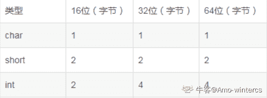

# 蘑菇街 2019 届实习生-数据仓库开发工程师笔试试题

## 1

在数据库的表定义中，限制成绩属性列的取值在 0 到 100 的范围内，属于数据的 ________ 约束

正确答案: C   你的答案: 空 (错误)

```cpp
实体完整性
```

```cpp
参照完整性
```

```cpp
用户自定义
```

```cpp
用户操作
```

本题知识点

Java 工程师 C++工程师 蘑菇街 大数据开发工程师 蘑菇街 2019

讨论

[vcy](https://www.nowcoder.com/profile/9774191)

粗略地说一下主键对应实体完整性约束外键对应参数完整性约束像 check、not null、unique 这些对应的就是用户自定义约束

发表于 2020-05-18 22:39:03

* * *

## 2

进程间的基本关系为( )

正确答案: A   你的答案: 空 (错误)

```cpp
相互独立与互相制约
```

```cpp
同步与互斥
```

```cpp
并行执行与资源共享
```

```cpp
信息传递与信息缓冲
```

本题知识点

Java 工程师 C++工程师 蘑菇街 Java 工程师 C++工程师 蘑菇街 Java 工程师 C++工程师 算法工程师 蘑菇街 系统工程师 蘑菇街 2019 大数据开发工程师 蘑菇街 2019 C++工程师 大数据开发工程师 Java 工程师 蘑菇街 2019

## 3

对进程和线程的描述,以下正确的是()

正确答案: D   你的答案: 空 (错误)

```cpp
父进程里的所有线程共享相同的地址空间,父进程的所有子进程共享相同的地址空间
```

```cpp
改变进程里面主线程的状态会影响到其他线程的行为,改变父进程的状态不会影响到其他子进程
```

```cpp
多线程会引起死锁,而多进程不会
```

```cpp
其他选项都不正确
```

本题知识点

Java 工程师 C++工程师 蘑菇街 算法工程师 系统工程师 2019 大数据开发工程师

讨论

[offer 要来了](https://www.nowcoder.com/profile/660688118)

> 父进程和子进程都有自己独立的地址空间；父进程结束，所有子进程都结束，进程结束，所有线程都结束；如果多个进程同时占有对方需要的资源而同时请求对方的资源，而它们在得到请求之前不会释放所占有的资源，那么就会导致死锁的发生，也就是进程不能实现同步。多线程和多进程都会引起死锁，一般说的死锁指的是进程间的死锁。

发表于 2019-07-24 23:42:58

* * *

## 4

下列关于时间片轮转调度算法的叙述中，哪个是不正确的？（）

正确答案: C   你的答案: 空 (错误)

```cpp
在时间片轮转调度算法中，系统将 CPU 的处理时间划分成若干个时间段。
```

```cpp
就绪队列中的就绪进程轮流在 CPU 中运行，每次最多运行一个时间片。
```

```cpp
当时间片结束，运行进程自动让出 CPU，该进程进入等待队列。
```

```cpp
如果时间片长度很小，则调度程序抢占 CPU 的次数频繁，加重系统开销。
```

本题知识点

Java 工程师 C++工程师 蘑菇街 Java 工程师 C++工程师 蘑菇街 Java 工程师 C++工程师 算法工程师 蘑菇街 系统工程师 蘑菇街 2019 大数据开发工程师 蘑菇街 2019 C++工程师 大数据开发工程师 Java 工程师 蘑菇街 2019

讨论

[牛客 53862322 号](https://www.nowcoder.com/profile/53862322)

当事件片结束时，强迫运行进程让出 CPU，该进程进入就绪队列

发表于 2019-09-08 17:24:31

* * *

[迷路的羊羔](https://www.nowcoder.com/profile/259919928)

如果在时间片结束时进程还在运行，则 CPU 将被剥夺并分配给另一个进程。

发表于 2019-04-08 10:03:08

* * *

## 5

如果某系统 15*4=112 成立，则系统采用的是几进制？

正确答案: A   你的答案: 空 (错误)

```cpp
6
```

```cpp
7
```

```cpp
8
```

```cpp
9
```

本题知识点

Java 工程师 C++工程师 蘑菇街 Java 工程师 C++工程师 蘑菇街 Java 工程师 C++工程师 算法工程师 蘑菇街 系统工程师 蘑菇街 2019 大数据开发工程师 蘑菇街 2019 C++工程师 大数据开发工程师 Java 工程师 蘑菇街 2019

讨论

[灯飞上天](https://www.nowcoder.com/profile/3249759)

设这个进制为 x 则为(x+5)*4=x²+x+2 则 x 为 3 或 6 则为 6

发表于 2019-04-02 22:15:57

* * *

[訾尤](https://www.nowcoder.com/profile/853867278)

假设采用的是 x 进制，根据等式有：
（1*x1+5*x0）*4*x0= 1*x2+1*x1+2*x0 解得 x=-3 或 x=6

发表于 2019-09-14 22:17:03

* * *

[迷路的羊羔](https://www.nowcoder.com/profile/259919928)

将个位的数相乘在对 n 取余也可以

发表于 2019-04-08 10:15:12

* * *

## 6

有关 HIVE 中 ORDER BY 和 SORT BY 用法正确的是 ( )

正确答案: B   你的答案: 空 (错误)

```cpp
SORT BY 用于分组汇总
```

```cpp
SORT BY 用于局部排序，ORDER BY 用于全局排序
```

```cpp
使用完全一致
```

```cpp
其他说法都不对
```

本题知识点

Java 工程师 C++工程师 蘑菇街 大数据开发工程师 2019

讨论

[码农小哥](https://www.nowcoder.com/profile/230212478)

Sort By:每个 Reducer 内部进行排序，对全局结果集来说不是排序。

发表于 2019-08-29 16:10:07

* * *

## 7

HDFS 是基于流数据模式访问和处理超大文件的需求开发，默认的基本的存储单位是 64M 数据块，如果需要每个数据块可分布不同节点上，具有高可靠性，高可扩展性，高吞吐量等特性，其适合的任务是（ ）

正确答案: D   你的答案: 空 (错误)

```cpp
多次写入，少次读取
```

```cpp
多次写入，多次读取
```

```cpp
一次写入，少次读取
```

```cpp
一次写入，多次读取
```

本题知识点

Java 工程师 C++工程师 蘑菇街 大数据开发工程师 2019

讨论

[脆莓啤酒](https://www.nowcoder.com/profile/558015881)

HDFS 适合一次写入多次读取

发表于 2020-10-13 20:37:40

* * *

## 8

关于数据结构的以下说法，错误的是

正确答案: C   你的答案: 空 (错误)

```cpp
红黑树插入操作的平均时间复杂度为 0（log n），最坏时间复杂度为 0（log n）
```

```cpp
B+树插入操作的平均时间复杂度为 0（log n），最坏时间复杂度为 0（log n）
```

```cpp
Hash 插入操作的平均时间复杂度为 0（log n），最坏时间复杂度为 0（n）
```

```cpp
排序链表插入操作的平均时间复杂度为 0（n），最坏时间复杂度为 0（n）
```

本题知识点

Java 工程师 C++工程师 蘑菇街 Java 工程师 C++工程师 蘑菇街 Java 工程师 C++工程师 算法工程师 蘑菇街 系统工程师 蘑菇街 2019 大数据开发工程师 蘑菇街 2019 C++工程师 大数据开发工程师 Java 工程师 蘑菇街 2019

讨论

[夏小包](https://www.nowcoder.com/profile/4204018)

、Hash 表插入操作的平均时间复杂度为 O(1)，最坏时间复杂度为 O(1)

发表于 2019-04-02 18:49:56

* * *

## 9

对一个由 A,B,C,D 随机组成的序列进行哈弗曼编码，据统计，各个元素的概率分别为：P(A)=0.4，P(B)=0.35，P(C)=0.2，P(D)=0.05，请问该编码的平均期望编码长度为（）bits？

正确答案: C   你的答案: 空 (错误)

```cpp
1.45
```

```cpp
1.7
```

```cpp
1.85
```

```cpp
1.92
```

本题知识点

Java 工程师 C++工程师 蘑菇街 大数据开发工程师 蘑菇街 2019

## 10

阅读以下 foo 函数，请问它的时间复杂度是：

int foo(intarray[], int n, int key)

{

int n1=0,n2=n-1,m;

while(n1<=n2)

{

m=(n1+n2)/2;

if(array[m]==key)

return m;

if(array[m]>key)

n2=m-1;

else

n1=m+1;

}

return -1;

}

正确答案: C   你的答案: 空 (错误)

```cpp
O(n2)
```

```cpp
O(n)
```

```cpp
O(log(n))
```

```cpp
O(nlog(n))
```

本题知识点

Java 工程师 C++工程师 蘑菇街 大数据开发工程师 蘑菇街 2019

讨论

[零葬](https://www.nowcoder.com/profile/75718849)

二分法查找，时间复杂度为 O(logn)

发表于 2020-11-27 10:29:04

* * *

## 11

如果二叉树的根节点为第 1 层，具有 500 个节点的二叉树的最小深度为（）

正确答案: B   你的答案: 空 (错误)

```cpp
8
```

```cpp
9
```

```cpp
10
```

```cpp
11
```

本题知识点

Java 工程师 C++工程师 蘑菇街 大数据开发工程师 2019

讨论

[零葬](https://www.nowcoder.com/profile/75718849)

要求树深最小，则为完全二叉树。树每层的节点数为首项为 1，公比为 2 的等比数列，根据等比数列前 n 项和公式 1(1-2^n)/(1-2) > 500，n=9

编辑于 2020-11-27 10:34:24

* * *

## 12

下列关于 java 中的 wait()方法和 sleep()方法的区别描述错误的是？

正确答案: D   你的答案: 空 (错误)

```cpp
wait()方法属于 Object 类，sleep()属于 Thread 类
```

```cpp
调用 wait()方法的时候，线程会放弃对象锁
```

```cpp
调用 sleep()方法的过程中，线程不会释放对象锁
```

```cpp
sleep()方法导致了程序暂停执行指定的时间，让出 cpu 给其他线程
```

本题知识点

Java 工程师 C++工程师 蘑菇街 算法工程师 系统工程师 2019 大数据开发工程师

讨论

[迷路的羊羔](https://www.nowcoder.com/profile/259919928)

wait()是 Object 类的方法，当一个线程执行到 wait 方法时，它就进入到一个和该对象相关的等待池，同时释放对象的机锁。 sleep() 方法是线程类（Thread）的静态方法，让调用线程进入睡眠状态，让出执行机会给其他线程，等到休眠时间结束后，线程进入就绪状态和其他线程一起竞争 cpu 的执行时间。 因为 sleep() 是 static 静态的方法，他不能改变对象的机锁，当一个 synchronized 块中调用了 sleep() 方法，线程虽然进入休眠，但是对象的机锁没有被释放，其他线程依然无法访问这个对象。

发表于 2019-04-08 11:00:59

* * *

## 13

设一组初始记录关键字序列为(45，80，55，40，42，85)，则以第一个记录关键字 45 为基准而得到一趟快速排序的结果是（）

正确答案: C   你的答案: 空 (错误)

```cpp
40，42，45，55，80，83
```

```cpp
42，40，45，80，85，88
```

```cpp
42，40，45，55，80，85
```

```cpp
42，40，45，85，55，80
```

本题知识点

Java 工程师 C++工程师 蘑菇街 Java 工程师 C++工程师 蘑菇街 Java 工程师 C++工程师 算法工程师 蘑菇街 系统工程师 蘑菇街 2019 大数据开发工程师 蘑菇街 2019 C++工程师 大数据开发工程师 Java 工程师 蘑菇街 2019

讨论

[很菜很天真](https://www.nowcoder.com/profile/813758197)

一个 cur 指针从头走到尾遇见比 45 大的区域就停下来，每次遇见一个比 45 大的数就往最后一位插入，比它小就插在前面，排完一次

发表于 2019-04-17 11:12:02

* * *

[迷路的羊羔](https://www.nowcoder.com/profile/259919928)

先从后找比基数小的交换位置，再从前面找比基数大的再交换位置。一直找直到全部走完。

发表于 2019-04-08 11:21:49

* * *

## 14

在文件"局部有序"或文件长度较小的情况下,最佳内部排序的方法是()

正确答案: A   你的答案: 空 (错误)

```cpp
直接插入排序
```

```cpp
冒泡排序
```

```cpp
简单选择排序
```

```cpp
快速排序
```

本题知识点

Java 工程师 C++工程师 蘑菇街 Java 工程师 C++工程师 蘑菇街 Java 工程师 C++工程师 算法工程师 蘑菇街 系统工程师 蘑菇街 2019 大数据开发工程师 蘑菇街 2019 C++工程师 大数据开发工程师 Java 工程师 蘑菇街 2019

讨论

[酸奶芝士](https://www.nowcoder.com/profile/782906901)

当待排序列基本有序时，对冒泡排序来说，若最大关键字位于序列首部，则每趟排序仅能使其“下沉”一个位置，要使其下沉到底部仍需 n-1 趟排序，也即时间复杂度仍为 O(n²)。 而对简单选择排序来说，其比较次数与待排序列的初始状态无关； 归并排序要求待排序列已经部分有序，而部分有序的含义是待排序列由若干有序的子序列组成，即每个子序列必须有序，并且其时间复杂度为 O(n log2n)； 直接插入排序在待排序列基本有序时，每趟的比较次数大为降低，也即 n-1 趟比较的时间复杂度由 O(n²)降至 O(n)。

发表于 2019-08-29 10:49:56

* * *

## 15

在存储对称矩阵时，为了节省空间，通常可以用一个数组以行优先方式只存储上三角阵来实现。请问如果一个 100*100 的矩阵用上述方法来实现存储，在原矩阵中位置为选项中哪一项的元素可以通过访问数组下标为 2017 的位置来获得?(   )数组和矩阵下标均从 0 开始。

正确答案: A   你的答案: 空 (错误)

```cpp
(70，22)
```

```cpp
(47，22)
```

```cpp
(20，17)
```

```cpp
(22，71)
```

本题知识点

Java 工程师 C++工程师 蘑菇街 算法工程师 系统工程师 2019 大数据开发工程师

讨论

[童心未泯丶](https://www.nowcoder.com/profile/903032739)

根据等差数列求和得公式为(100+100-(i-1))*i/2+j-i，即(201-i)*i/2+j-i 坐标在上三角的时候使用该公式，由对称矩阵可以将(70,22)坐标转换为(22,70)，带入公式得（201-22）*11+70-22=2017

发表于 2019-04-08 21:08:11

* * *

[ANAM](https://www.nowcoder.com/profile/3053712)

若点（i, j）位于上三角,则有：2017 = （100-0) + (100-1)+ ... +[ 100 - ( i - 1 ) ] + j - i         =  100*i - i*(i-1) / 2 + j-i 若 点（i,j) 位于下三角，则交换点（j, i）为其对称的上三角点

发表于 2019-04-06 21:13:36

* * *

[木千罗](https://www.nowcoder.com/profile/9090671)

这道题？不应该是 D 吗

发表于 2019-03-31 22:33:36

* * *

## 16

以下哪个算法可以判断出一个有向图中是否有回路

正确答案: B   你的答案: 空 (错误)

```cpp
广度优先遍历
```

```cpp
拓扑排序
```

```cpp
求最短路径
```

```cpp
求关键路径
```

本题知识点

Java 工程师 C++工程师 蘑菇街 Java 工程师 C++工程师 蘑菇街 Java 工程师 C++工程师 算法工程师 蘑菇街 系统工程师 蘑菇街 2019 大数据开发工程师 蘑菇街 2019 C++工程师 大数据开发工程师 Java 工程师 蘑菇街 2019

讨论

[bukun](https://www.nowcoder.com/profile/514169517)

拓扑和深搜

发表于 2020-11-03 11:50:49

* * *

## 17

若无向图 G 中含 7 个顶点，则保证图 G 在任何情况下都是连通的，则需要的边数最少是（         ）

正确答案: C   你的答案: 空 (错误)

```cpp
6
```

```cpp
15
```

```cpp
16
```

```cpp
21
```

本题知识点

Java 工程师 C++工程师 蘑菇街 大数据开发工程师 2019

讨论

[赌怪](https://www.nowcoder.com/profile/465601689)

求最小连通，因此是 6 个节点达成最小边数，再加上最后一个节点构成连通，因此为 n*（n-1）/2+1

发表于 2019-09-25 17:14:18

* * *

## 18

下列关于 CSMA/CD 协议的叙述中，错误的是 （）

正确答案: B   你的答案: 空 (错误)

```cpp
边发送数据帧，边检测是否发生冲突
```

```cpp
适用于无线网络，以实现无线链路共享
```

```cpp
需要根据网络跨距和数据传输速率限定最小帧长
```

```cpp
当信号传播延迟趋近 0 时，信道利用率趋近 100%
```

本题知识点

Java 工程师 C++工程师 蘑菇街 算法工程师 大数据开发工程师 2019

讨论

[恒律](https://www.nowcoder.com/profile/878249393)

无线网络还怎么监听

发表于 2020-03-01 22:06:31

* * *

## 19

毕业典礼后，某宿舍三位同学把自己的毕业帽扔了，随后每个人随机地拾起帽子，三个人中没有人选到自己原来带的帽子的概率是

正确答案: B   你的答案: 空 (错误)

```cpp
1/2
```

```cpp
1/3
```

```cpp
1/4
```

```cpp
1/6
```

本题知识点

Java 工程师 C++工程师 蘑菇街 Java 工程师 C++工程师 算法工程师 蘑菇街 大数据开发工程师 蘑菇街 2019 C++工程师 大数据开发工程师 Java 工程师 蘑菇街 2019

讨论

[我不是大牛哦](https://www.nowcoder.com/profile/758958255)

1/3*1/2+1/3+1/2=1/6

发表于 2019-04-06 09:49:29

* * *

[彭涣淋的梦想在飞翔](https://www.nowcoder.com/profile/210501110)

前面是三个人随机丢帽子，说明帽子不一样是相互独立的。这是一个组合问题，可以这么想。其中一个人选一个不一样的概率再乘以一个剩下里选择不一样的概率，最后一个人必然不一样。2/3 * 1/2 = 1/3

发表于 2019-04-09 17:04:29

* * *

## 20

有如下代码：请写出程序的输出结果。

| 123456789101112131415161718 | public  class  Test{    public  static  void  main(String[] args)    {        int  x = 0;        int  y = 0;        int  k = 0;        for  (int  z = 0; z < 5; z++) {            if  ((++x > 2) && (++y > 2) && (k++ > 2))            {                x++;                ++y;                k++;            }        }System.out.println(x + ”” +y + ”” +k);    }} |

正确答案: C   你的答案: 空 (错误)

```cpp
422
```

```cpp
532
```

```cpp
531
```

```cpp
431
```

本题知识点

Java 工程师 C++工程师 蘑菇街 Java 工程师 C++工程师 蘑菇街 Java 工程师 C++工程师 算法工程师 蘑菇街 系统工程师 蘑菇街 2019 大数据开发工程师 蘑菇街 2019 C++工程师 大数据开发工程师 Java 工程师 蘑菇街 2019

讨论

[童心未泯丶](https://www.nowcoder.com/profile/903032739)

&&和||都是短路运算符，只要满足前面就不用看后面

发表于 2019-04-08 21:11:36

* * *

[清风 innn](https://www.nowcoder.com/profile/558613565)

注意&&

发表于 2019-04-08 11:02:28

* * *

## 21

排序算法中，比较次数与初始序列无关的排序方法有哪些？

正确答案: D   你的答案: 空 (错误)

```cpp
shell 排序
```

```cpp
快速排序
```

```cpp
堆排序
```

```cpp
选择排序
```

本题知识点

Java 工程师 C++工程师 蘑菇街 算法工程师 系统工程师 2019 大数据开发工程师

讨论

[童心未泯丶](https://www.nowcoder.com/profile/903032739)

元素的移动次数与关键字的初始排列次序无关的是：基数排序元素的比较次数与初始序列无关是：选择排序算法的时间复杂度与初始序列无关的是：直接选择排序

发表于 2019-04-08 21:15:50

* * *

## 22

以下关于广义表的叙述中，正确的

正确答案: A   你的答案: 空 (错误)

```cpp
广义表是 0 个或多个单因素或子表组成的有限序列
```

```cpp
广义表至少有一个元素是子表
```

```cpp
广义表不可以是自身的子表
```

```cpp
广义表不能为空表
```

本题知识点

Java 工程师 C++工程师 蘑菇街 算法工程师 系统工程师 2019 大数据开发工程师

## 23

下面哪个行为被打断不会导致 InterruptedException：（ ）

正确答案: A   你的答案: 空 (错误)

```cpp
Thread.suspend
```

```cpp
Thread.join
```

```cpp
Thread.sleep
```

```cpp
Object.wait
```

```cpp
CyclicBarrier.await
```

本题知识点

Java 工程师 C++工程师 蘑菇街 大数据开发工程师 2019

## 24

下面关于 B-和 B+树的叙述中，正确的是

正确答案: A B D   你的答案: 空 (错误)

```cpp
B-树和 B+树都是平衡的多叉树
```

```cpp
B-树和 B+树都可用于文件的索引结构
```

```cpp
B-树和 B+树都能有效地支持顺序检索
```

```cpp
B-树和 B+树都能有效地支持随机检索
```

本题知识点

Java 工程师 C++工程师 蘑菇街 算法工程师 系统工程师 2019 大数据开发工程师

## 25

下列哪些操作可能带来死锁？

正确答案: C   你的答案: 空 (错误)

```cpp
lock(m1) lock(m2) unlock(m1) unlock(m2)
```

```cpp
lock(m1) lock(m2) unlock(m2) lock(m2) unlock(m1) unlock(m2)
```

```cpp
lock(m1) lock(m2) unlock(m1) lock(m1) unlock(m2) unlock(m1)
```

```cpp
lock(m1) lock(m2) unlock(m1) unlock(m2) lock(m1) unlock(m1)
```

本题知识点

Java 工程师 C++工程师 蘑菇街 算法工程师 系统工程师 2019 大数据开发工程师

讨论

[ě201903171408435](https://www.nowcoder.com/profile/987081979)

链接：[`www.nowcoder.com/questionTerminal/c572bb54bf4a44dea62d28fa0ae7e8f0`](https://www.nowcoder.com/questionTerminal/c572bb54bf4a44dea62d28fa0ae7e8f0)
来源：牛客网
假设有两个线程，线程 1 执行到 lock(m1),lock(m2),unlock(m1)，此时线程 1 持有锁 m2,想要获取锁 m1;线程 2 执行到 lock(m1),此时线程 2 持有锁 m1,想要获取锁 m2。两个线程都拿着对方想要得到的锁，造成死锁。是考虑到 2 个线程一起申请锁的，但是每个选项开头都是第一个线程申请了 m1，m2,，那第二个线程就暂时不能执行（因为申请不到 m1，m2）A、线程 1 执行 lock(m1),lock(m2),unlock(m1)，这时候线程 2 才可以申请 lock(m1),。这时候线程 1 拥有 m2，下一步是释放 m2；线程 2 拥有 m1，下一步是申请 m2。所以线程 1 释放 m2 后线程 2 获取 m2，不会死锁 B、线程 1 一直执行到 lock(m1) lock(m2) unlock(m2) lock(m2) unlock(m1)，直到线程 1 lock(m1) lock(m2) unlock(m2) lock(m2) unlock(m1)时候，线程 2 可以获取 m1，再就是线程 1 释放 m2，线程 2 获取 m2，不会死锁 D、线程 1 lock(m1) lock(m2) unlock(m1) 释放 m1，线程 2 获取到 m1。lock(m1) lock(m2) unlock(m1) unlock(m2)线程 1 释放 m2，线程 2 获得 m2。lock(m1) lock(m2) unlock(m1) unlock(m2) lock(m1) unlock(m1)但是此时线程 1 想 lock（m1）是做不到的，因为 m1 在线程 2 中，等到线程 2 lock(m1) lock(m2) unlock(m1) ，线程 1 就可以获得 m1 了

发表于 2020-03-05 13:42:11

* * *

[彭涣淋的梦想在飞翔](https://www.nowcoder.com/profile/210501110)

两个锁对资源有保护域重叠就可能死锁。

发表于 2019-04-09 17:05:49

* * *

## 26

对数据库，关于索引的理解正确的是

正确答案: B C D   你的答案: 空 (错误)

```cpp
创建索引能提高数据插入的性能
```

```cpp
索引应该根据具体的检索需求来创建，在选择性好的列上创建索引
```

```cpp
索引并非越多越好
```

```cpp
建立索引可加速查询
```

本题知识点

Java 工程师 C++工程师 蘑菇街 算法工程师 系统工程师 2019 大数据开发工程师

讨论

[RooT-T](https://www.nowcoder.com/profile/597156082)

BCD1.创建索引最原始的初衷就是提高查询速度，建立索引可以提高查询速度，节约查询时间，这也是索引最直接的优点。而不是提高插入性能。2.索引的创建和维护耗费时间，且每个索引会占用一定的物理空间。增删改数据时需要要动态的维护索引，这样会降低数据的维护速度。所以索引不是越多越好，而是需要在最恰当合适的字段上建立最好。太多的索引反而会增加维护难度。

发表于 2019-03-27 22:36:35

* * *

[越王怒江](https://www.nowcoder.com/profile/8309948)

选 BCD 索引的优点：第一，通过创建唯一性索引，可以保证数据库表中每一行数据的唯一性。
第二，可以大大加快数据的检索速度，这也是创建索引的最主要的原因。
第三，可以加速表和表之间的连接，特别是在实现数据的参考完整性方面特别有意义。
第四，在使用分组和排序子句进行数据检索时，同样可以显著减少查询中分组和排序的时间。
第五，通过使用索引，可以在查询的过程中，使用优化隐藏器，提高系统的性能
索引的缺点：
第一，创建索引和维护索引要耗费时间，这种时间随着数据量的增加而增加。
第二，索引需要占物理空间，除了数据表占数据空间之外，每一个索引还要占一定的物理空间，如果   要建立聚簇索引，那么需要的空间就会更大。
第三，当对表中的数据进行增加、删除和修改的时候，索引也要动态的维护，这样就降低了数据的维   护速度。

编辑于 2019-03-27 08:56:44

* * *

## 27

java 语言中，在同一包下，以下说法正确的是

正确答案: A B C   你的答案: 空 (错误)

```cpp
super.方法（）可以调用父类的所有非私有方法
```

```cpp
super（）可以调用父类的所有非私有构造函数
```

```cpp
super.属性可以调用父类的所有非私有属性
```

```cpp
this 和 super 可以出现在同一个构造函数中
```

本题知识点

Java 工程师 C++工程师 蘑菇街 算法工程师 系统工程师 2019 大数据开发工程师

讨论

[西门书](https://www.nowcoder.com/profile/1104069)

ABCD

编辑于 2019-04-10 11:48:47

* * *

[球球来一个 offer](https://www.nowcoder.com/profile/334614912)

D 对吗？我记错了？

发表于 2020-10-08 23:23:12

* * *

## 28

在 Linux 上，对于多进程，子进程继承了父进程的下列哪些？

正确答案: B C D   你的答案: 空 (错误)

```cpp
进程地址空间
```

```cpp
共享内存
```

```cpp
信号掩码
```

```cpp
已打开的文件描述符
```

```cpp
其他都不是
```

本题知识点

Java 工程师 C++工程师 蘑菇街 大数据开发工程师 2019

## 29

64 位机上，一个结构体有三个成员，分别是 char、int、short 类型，三个成员位于结构体中不同位置时整个结构体的大小可能是（）

正确答案: A C   你的答案: 空 (错误)

```cpp
12
```

```cpp
7
```

```cpp
8
```

```cpp
16
```

本题知识点

C++工程师 蘑菇街 2019 C 语言

讨论

[念之前，望之后](https://www.nowcoder.com/profile/837872598)

不妨设该结构成员为 char a, int b, short c。三个成员全排列，有 6 种位置情形。另外，处理器为了提高处理性能，通常会对存取数据的起始地址提出要求(也正是人们常提及的边界对齐或字节对齐问题)。①struct{char a; int b; short c;};   sizeof 为 12：char a 填充了 3 字节，short c 填充了 2 字节②struct{char a; short c; int b;};   sizeof 为 8：char a 填充了 1 字节③struct{int b; char a; short c;};   sizeof 为 8：char a 填充了 1 字节④struct{int b; short c; char a;};   sizeof 为 8：char a 填充了 1 字节⑤struct{short c;  char a; int b;};  sizeof 为 8：char a 填充了 1 字节⑥struct{short c;  int b; char a;};  sizeof 为 12：char a 填充了 3 字节，short c 填充了 2 字节以上仅个人见解，若有不当还请各位牛友指出，嘻嘻！

发表于 2021-02-27 16:42:00

* * *

[Amo-wintercs](https://www.nowcoder.com/profile/444653760)



内存对齐：假如第一个成员从 0 地址开始，储存每个成员的地址编号必须能被它的字节数整除，如果不能会填充空字节

内存补齐：如果结构体的总字节数，必须是它最大成员字节数的整数倍，如果不是，则在末尾填充空字节

发表于 2021-03-11 15:21:22

* * *

[三峡大学 1209](https://www.nowcoder.com/profile/212833684)

字节对齐

发表于 2021-02-26 11:33:13

* * *

## 30

下列关于交换机的叙述中，正确的是 （）

正确答案: D   你的答案: 空 (错误)

```cpp
通过交换机互连的一组工作站构成一个冲突域
```

```cpp
交换机每个端口所连网络构成一个独立的广播域
```

```cpp
以太网交换机可实现采用不同网络层协议的网络互联
```

```cpp
以太网交换机本质上是一种多端口网桥
```

本题知识点

Java 工程师 C++工程师 蘑菇街 算法工程师 系统工程师 2019 大数据开发工程师

## 31

近些年来大数据是个热门的词汇，如马云所说未来是 DT（DataTechnology）时代。随着大数据技术的发展，大数据处理能力得到显著的提升，比如现在流行的 hadoop,spark,hbase,keylin,vertica 等等大数据处理、存储的技术如雨后春笋般创造出来，伴随而来大数据相关行业的应用也得到了快速发展，反过来这也带动了大数据技术快速发展。我们花费大量的气力收集数据、整理数据、深度加工数据，最终的目的不外乎是为了实 DATA2VALUE(数据产生价值) ，我们寄希望于数据能够驱动业务的发展。

 大数据在互联网零售行业有着丰富的应用，作为零售的平台，帮助入驻商家提升运营能力，包括提升分析、决策的能力、销售能力等等，是平台的重要工作，基于这个目的希望能够开发一款商家分析的数据产品，来帮助提升商家的运营能力。该项目工作内容包括：需求分析、产品设计、数据架构、数据建模，应用架构、数据挖掘、数据仓库开发、数据治理等，假设你是项目的成员角色，请任选择以上 1~2 项，谈谈你的建设思路。

你的答案

本题知识点

Java 工程师 C++工程师 蘑菇街 大数据开发工程师 2019

## 32

有 N 个孩子站成一排，每个孩子有一个分值。给这些孩子派发糖果，需要满足如下需求：

1、每个孩子至少分到一个糖果

2、分值更高的孩子比他相邻位的孩子获得更多的糖果

求至少需要分发多少糖果？

本题知识点

Java 工程师 C++工程师 算法工程师 蘑菇街 数组 贪心 排序 *图 系统工程师 2019 大数据开发工程师* *讨论

[ElonB](https://www.nowcoder.com/profile/623894)

```cpp
""""
从左至右，看自己左侧的分数，若比自己小，在他的基础上加一
从右至左，看自己右侧的分数，若比自己小，max(自己，右侧+1)
"""

if __name__ == "__main__":
    a = list(map(int, input().strip().split(',')))
    n = len(a)
    ans = [1] * n
    for i in range(1, n):
        if a[i] > a[i - 1]:
            ans[i] = ans[i - 1] + 1
    for i in range(n - 2, -1, -1):
        if a[i] > a[i + 1]:
            ans[i] = max(ans[i], ans[i + 1] + 1)
    print(sum(ans))

```

发表于 2019-07-16 12:23:27

* * *

[零葬](https://www.nowcoder.com/profile/75718849)

```cpp
score = list(map(int, input().split(',')))
candy = [1]*len(score)
# 往左看调整糖果数
for i in range(1, len(score)):
    if candy[i] <= candy[i - 1] and score[i] > score[i - 1]:
        candy[i] = candy[i - 1] + 1
# 往右看调整糖果数
for i in range(len(score) - 2, 0, -1):
    if candy[i] <= candy[i + 1] and score[i] > score[i + 1]:
        candy[i] = candy[i + 1] + 1
print(sum(candy))
```

发表于 2020-11-26 16:22:08

* * *

[lmz9509](https://www.nowcoder.com/profile/122121993)

```cpp
/*
左右两次遍历，当 分数较高时，要为他加上糖果
类似于小米的厨师奖金分配题
*/
import java.io.BufferedReader;
import java.io.IOException;
import java.io.InputStreamReader;

public class Main {
    public static void main(String[] args) throws IOException{
        BufferedReader br = new BufferedReader(new InputStreamReader(System.in));
        String[] str = br.readLine().split(",");
        int[] score = new int[str.length];
        int[] sweet = new int[str.length];
        for(int i = 0;i<str.length;i++){
            score[i] = Integer.parseInt(str[i]);
            sweet[i]=1;
        }
        int sum = 0;
        //左遍历，分数高，糖果比你多；右边与左边比
        for(int i = 1;i<str.length;i++){
            if(score[i]>score[i-1]&& sweet[i]<=sweet[i-1])
                sweet[i] = sweet[i-1]+1;
        }

        //右遍历,分数高，糖果取最大的加 1；左边与右边比
        for(int i = str.length -2;i>=0;i--){
            if(score[i]>score[i+1] && sweet[i]<=sweet[i+1])
                sweet[i] = Math.max(sweet[i],sweet[i+1])+1;
            sum+=sweet[i];
        }
        System.out.println(sum+sweet[str.length-1]);
    }
}
```

发表于 2020-05-17 11:41:07

* * **