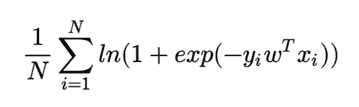
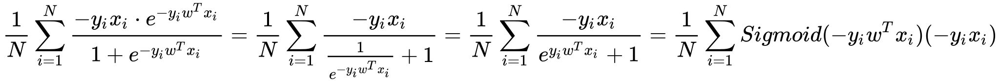

# 蘑菇街 2019 届实习生-算法工程师笔试试题

## 1

假设有 A/B 两枚硬币，A 硬币正面朝上的概率为 T，B 硬币正面朝上的概率为 2T；若按一定顺序抛这两枚硬币后收集到如下实验结果：A 正面 -> B 反面 -> B 反面 -> B 反面 -> B 正面，则对 T 的最大似然估计为?

正确答案: D   你的答案: 空 (错误)

```cpp
1/3
```

```cpp
1/2
```

```cpp
2/5
```

```cpp
1/5
```

本题知识点

算法工程师 蘑菇街 2019

讨论

[WWG1WGA](https://www.nowcoder.com/profile/891395396)

似然函数为:L = T * (1 - 2T)**3 * 2T 然后关于 T 求一阶导，领一阶导为 0，即可解出 T = 1/5 可把正面反面看清楚了！

发表于 2019-04-03 12:53:47

* * *

[给我一个 offer 叭！！！](https://www.nowcoder.com/profile/1409891)

求最大的似然估计应该是把似然函数变换成 log 函数，在求导使其等于 0L=ln(T * (1 - 2T)**3 * 2T)

发表于 2020-03-21 08:04:30

* * *

## 2

假设一台机器在一年内出现故障的概率是 64%，若假设在不同时间点该机器出现故障的概率是相同的，请问该机器在前半年出现故障的概率是?

正确答案: B   你的答案: 空 (错误)

```cpp
32%
```

```cpp
40%
```

```cpp
48%
```

```cpp
60%
```

本题知识点

算法工程师 蘑菇街 2019

讨论

[鑫光闪耀](https://www.nowcoder.com/profile/475045046)

半年出故障概率为 p（x），那么 p(x)+（1-p（x））*p（x）=64%，p（x）=40%

发表于 2019-03-27 14:54:45

* * *

[AlanSmith](https://www.nowcoder.com/profile/4386136)

曲线救国一下，设半年出故障的概率为 p，那么不出故障的概率就是 1-p，一年不出故障的概率是（1-p）²，已知条件一年不出故障的概率为 1-0.64=0.36，所以，（1-p）²=0.36，解得 p=0.4

发表于 2019-08-14 21:04:40

* * *

## 3

以下算法中属于分类算法的是?

正确答案: B   你的答案: 空 (错误)

```cpp
EM
```

```cpp
C4.5
```

```cpp
K-Means
```

```cpp
PCA
```

本题知识点

算法工程师 蘑菇街 2019

讨论

[吾人离](https://www.nowcoder.com/profile/446958007)

k-means 是聚类，不是分类

发表于 2019-04-12 14:42:34

* * *

## 4

以下为 Sigmoid 函数 f(x) = 1 / (1 + e^(-x))的梯度表达式的是?

正确答案: B   你的答案: 空 (错误)

```cpp
f(x)ln(x)+ (1 - f(x))ln(1 - f(x))
```

```cpp
f(x)(1 - f(x))
```

```cpp
f(x)ln(1- f(x))
```

```cpp
f(x)(1+ f(x))
```

本题知识点

算法工程师 蘑菇街 2019

## 5

以下为交叉熵(Cross Entropy)损失的梯度表达式的是?交叉熵:


正确答案: A   你的答案: 空 (错误)

本题知识点

算法工程师 蘑菇街 2019

讨论

[____ 不名](https://www.nowcoder.com/profile/1047922)

对其求导等于:故选 A。

编辑于 2019-04-10 15:43:39

* * *

## 6

在对图进行深度优先搜索时，一般需要用到下列哪个数据结构？

正确答案: A   你的答案: 空 (错误)

```cpp
栈
```

```cpp
队列
```

```cpp
二叉树
```

```cpp
单向链表
```

本题知识点

算法工程师 蘑菇街 2019

## 7

在将一个函数的实现从递归实现改为非递归实现时，一般需要用到下列哪个数据结构？

正确答案: A   你的答案: 空 (错误)

```cpp
栈
```

```cpp
队列
```

```cpp
二叉树
```

```cpp
双向链表
```

本题知识点

算法工程师 蘑菇街 2019

## 8

以下是凸函数的是?

正确答案: A C   你的答案: 空 (错误)

```cpp
e^(-x)
```

```cpp
log(x)
```

```cpp
xlog(x)
```

```cpp
cos(x)
```

本题知识点

算法工程师 蘑菇街 2019

讨论

[路人癸 000](https://www.nowcoder.com/profile/528623642)

一元可微函数在某个区间上是凸的，当且仅当它的导数在该区间上单调不减。

发表于 2019-04-02 17:16:23

* * *

[算法求 offer](https://www.nowcoder.com/profile/2640093)

一个函数是凸函数，二阶导数要大于 0，C 好像不满足啊

发表于 2019-03-27 23:07:58

* * *

[给我一个 offer 叭！！！](https://www.nowcoder.com/profile/1409891)

请问这道题答案对么

发表于 2020-03-18 12:33:21

* * *

## 9

以下关于 K 近邻(KNN)算法的说法中正确的是?

正确答案: A B   你的答案: 空 (错误)

```cpp
KNN 算法可以用来解决回归问题
```

```cpp
随着 K 值的增大，决策边界(decision boundary)会越来越光滑
```

```cpp
KNN 算法适合解决高维稀疏数据上的问题
```

```cpp
相对 3 近邻模型而言，1 近邻模型的 bias 更大，variance 更小
```

本题知识点

算法工程师 蘑菇街 2019

讨论

[mzchz](https://www.nowcoder.com/profile/426814935)

k 为 1 时方差更大，偏差不一定，容易过拟合。k 太大时偏差大

发表于 2019-04-12 14:42:11

* * *

## 10

以下关于深度神经网络的说法中正确的是

正确答案: C D   你的答案: 空 (错误)

```cpp
增大 L2 正则项的系数有助于减缓梯度消失问题
```

```cpp
使用梯度裁剪(gradient clipping)有助于减缓梯度消失问题
```

```cpp
若 batch size 过小，batch normalization 的效果会出现退化
```

```cpp
在使用 SGD 训练时，若训练 loss 的变化逐渐平缓不再明显下降时，通常可以通过减小 learning rate 的方式使其再进一步下降
```

本题知识点

算法工程师 蘑菇街 2019

讨论

[mzchz](https://www.nowcoder.com/profile/426814935)

梯度裁剪用于缓解梯度爆炸问题

发表于 2019-04-12 14:49:05

* * *

## 11

假设我们有用户在一个月内在某电商网站上的商品点击和购买行为数据，我们想利用该数据基于有监督学习方法预测特定用户点击特定商品后产生购买行为的概率，即将购买率预估问题看做是一个二分类问题。假设用户的购买行为十分稀疏，即购买量远小于点击量。以下说法正确的是?

正确答案: A B   你的答案: 空 (错误)

```cpp
这是一个正负类极度不平衡的数据集，因此 AUC 比较适合用于评估模型的效果
```

```cpp
如果我们将模型在所有样本上的预估值都乘以 2，则该模型模型的 AUC 不变(假设模型在所有样本上的预估值都小于 0.5)
```

```cpp
如果我们将模型在所有样本上的预估值都减去 0.01，则该模型模型的 AUC 有可能会下降(假设模型在所有样本上的预估值都大于 0.01)
```

```cpp
我们可以将数据随机切分成 10 份，选择其中 9 份作为训练集，1 份作为测试集，如此实现 10 重交叉检验可以较好地对模型的效果进行评估
```

本题知识点

算法工程师 蘑菇街 2019

讨论

[零葬](https://www.nowcoder.com/profile/75718849)

AUC 对数据倾斜是不敏感的；在数据极度倾斜的情况下，简单的 k 折交叉验证不太适用，少数类的数据仍然没有得到充分的利用，而且还有可能增加每折数据中仅有一类的风险。

发表于 2020-12-17 16:24:40

* * *

[WWG1WGA](https://www.nowcoder.com/profile/891395396)

D 答案为啥不对呀？感觉没毛病啊

发表于 2019-04-03 12:59:00

* * *

## 12

以下关于进程和线程的说法中正确的是?

正确答案: A C D   你的答案: 空 (错误)

```cpp
进程是对一段正在执行的程序的抽象
```

```cpp
进程是操作系统的最小调度单元
```

```cpp
不同的线程之间既不共享程序计数器也不共享栈
```

```cpp
若一个线程 A 打开了一个文件 F 并对其拥有读权限，则与其在同一进程下的另一线程 B 也可以对 F 进行读操作
```

本题知识点

算法工程师 蘑菇街 2019

## 13

一个进程的地址空间中不含下列哪一项？

正确答案: D   你的答案: 空 (错误)

```cpp
局部变量
```

```cpp
函数调用的参数
```

```cpp
函数调用的返回值
```

```cpp
子进程的 pid
```

本题知识点

算法工程师 蘑菇街 2019

讨论

[Trista_Wang](https://www.nowcoder.com/profile/5401931)

关于进程地址空间的详解[`blog.csdn.net/Trista_wang/article/details/99831557`](https://blog.csdn.net/Trista_wang/article/details/99831557)

发表于 2019-08-21 16:27:15

* * *

## 14

以下关于排序算法的说法中错误的是?

正确答案: A   你的答案: 空 (错误)

```cpp
快速排序的最坏时间复杂度为 O(nlog(n))
```

```cpp
快速排序不是一种稳定的排序
```

```cpp
堆排序的最坏时间复杂度为 O(nlog(n))
```

```cpp
堆排序不是一种稳定的排序
```

本题知识点

算法工程师 蘑菇街 2019

讨论

[算法求 offer](https://www.nowcoder.com/profile/2640093)

堆排序不是一种稳定的排序啊，D 没毛病吧

发表于 2019-03-28 08:36:42

* * *

## 15

请用简练的语言（2~3 句话）回答以下问题：

1) 为什么一般需要划分出额外的校验集(validation set)用于超参数调整，而不选择直接使用测试集(test set)？

2) 请解释何为鞍点（saddle point)？批量梯度下降（Batch Gradient Descent)和随机梯度下降(Stochastic Gradient Descent)在应对鞍点时有何不同的表现？

3) 当一个模型训练完后若发现训练集上的 loss 非常高，请问如何在不对代码进行全面排查的前提下，以最快速度定位是模型本身的拟合能力不足还是代码的实现存在某种错误？4) 假设我们在训练一个使用 Sigmoid 激活函数的全连接神经网络。在对其权重进行初始化时，为什么一般会倾向于让初始值的绝对值偏小？如果需要这样，为何不直接使用 0 进行初始化？

你的答案

本题知识点

算法工程师 蘑菇街 2019

讨论

[WaterXMan](https://www.nowcoder.com/profile/530994502)

1\. 为了防止出现过拟合现象 2\. 鞍点的正交函数求导为 0，但是不管在任何轴上都不是一个局部最优点; 如果使用 gradien descent，那么此时训练速度会非常慢甚至停滞，但是 loss function 并没有得到很好的优化。 批量梯度算法: 当陷入鞍点或较差的局部最优点时，梯度很难跑出来，因此可能难以保证每次得到的都是最优解随机梯度算法: 在一定程度上能够避开鞍点 3\. 设置测试集, 如果训练集 loss 不断上升，测试集 loss 不断上升：说明网络结构设计不当，训练超参数设置不当;4\. 权重的初值如果太大, 会造成梯度爆炸, 梯度爆炸可能导致神经网络不稳定，使之不能从训练数据中学习，如果权重初值为 0, 则会造成梯度下降失效, 权重无法更新, 

发表于 2019-06-13 12:02:04

* * *

## 16

假设使用表结构为(parent VARCHAR(6), child VARCHAR(6))的表来存储一颗树内所有子节点-父节点的关系。请使用 SQL 求出该树内每个节点的儿子节点和孙子节点(即儿子的儿子)的数量之和，输出的表结构为(node VARCHAR(6), cnt INTEGER)。没有儿子的节点不应该出现在结果中，即不应该包含 cnt 列为 0 的结果。

样例输入 

parent, child 

A B

A C

A D

B E

B F

E G

样例输出 

node, cnt 

A 5

B 3

E 1

你的答案

本题知识点

算法工程师 蘑菇街 2019

讨论

[牛客陈陈陈](https://www.nowcoder.com/profile/8802192)

use test;create table test1(parent char, child char);insert into test1 values ('A', 'B');insert into test1 values ('A', 'C');insert into test1 values ('A', 'D');insert into test1 values ('B', 'E');insert into test1 values ('B', 'F');insert into test1 values ('E', 'G');
select son.parent node, sum(son.cnt+grandson.cnt) cnt from (select parent, count(*) cnt from test1 group by parent) son, (    select t1.parent, count(*) cnt from test1 as t1, test1 as t2     where t1.child=t2.parent group by t1.parent) grandson where son.parent = grandson.parent group by son.parent;

发表于 2019-03-31 00:29:09

* * *

## 17

给定一个由小写字母组成的字符串 s，请将其分割成尽量多的子串，并保证每个字母最多只在其中一个子串中出现。请返回由一个或多个整数表示的分割后各子串的长度。

本题知识点

算法工程师 蘑菇街 贪心 字符串 *数学 2019* *讨论

[lentolove](https://www.nowcoder.com/profile/572586026)

```cpp
public class Main {

    public static void main(String[] args) throws IOException {
        BufferedReader bf = new BufferedReader(new InputStreamReader(System.in));
        String s = bf.readLine();
        StringBuilder sb = new StringBuilder();
        while (s.length() > 0) {
            int index = s.lastIndexOf(s.charAt(0));//首先找到第一个字符的最后索引的位置，在再这个范围内找出子串的最大长度
            for (int i = 1; i < index; i++) {
                index = Math.max(s.lastIndexOf(s.charAt(i)), index);
            }
            sb.append(index + 1).append(" ");
            s = s.substring(index + 1);
        }
        System.out.println(sb.substring(0, sb.length() - 1).toString());
    }

}
```

发表于 2019-08-21 15:42:47

* * *

[初心者托奇](https://www.nowcoder.com/profile/926219153)

```cpp
m = []
for i in input():
    for j in range(len(m)):
        if i in m[j]:
            m = m[:j] + [''.join(m[j:]) + i]
            break
    else:
        m.append(i)
print(' '.join([str(len(i)) for i in m]))

```

发表于 2020-03-17 13:04:41

* * *

[nbgao](https://www.nowcoder.com/profile/211289)

```cpp
#include <bits/stdc++.h>
using namespace std;

struct P{
    int l,r;
    bool flag;
};

int main(){
    string s;
    cin>>s;
    map<char, P> M;
    int n = s.length();
    for(int i=0;i<n;i++){
        if(M.find(s[i]) == M.end()){
            M[s[i]].l = i;
            M[s[i]].flag = false;
        }
        M[s[i]].r = i;
    }
    if(n==0)
        cout<<0<<endl;
    else{
        int l = M[s[0]].l;
        int r = M[s[0]].r;
        M[s[0]].flag = true;
        for(int i=1;i<n;i++){
            if(M[s[i]].flag)
                continue;
            M[s[i]].flag = true;
            int pl = M[s[i]].l;
            int pr = M[s[i]].r;
            if(pl > r){
                cout<<r-l+1<<" ";
                l = pl;
                r = pr;
            }else if(pr > r)
                r = pr;
        }
        cout<<r-l+1<<endl;
    }
    return 0;
}
```

发表于 2019-08-09 13:23:46

* * **