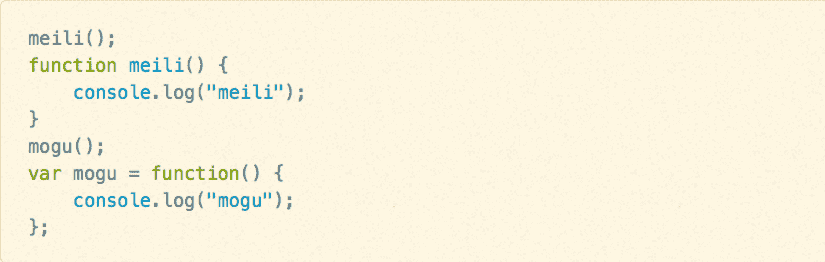
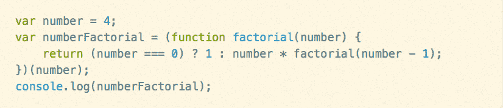
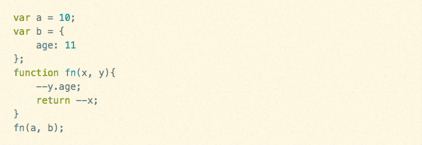
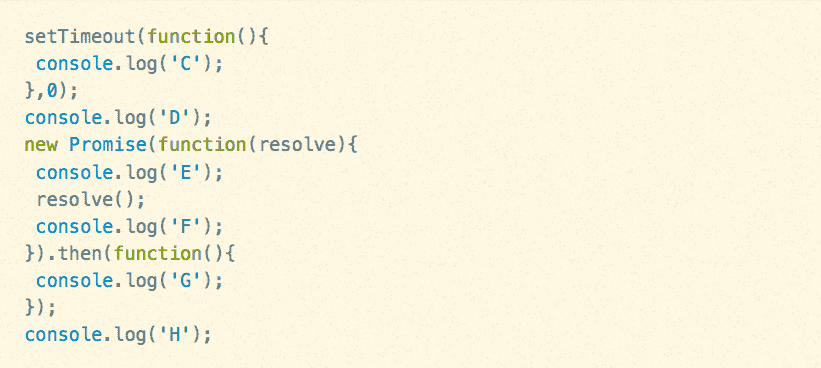
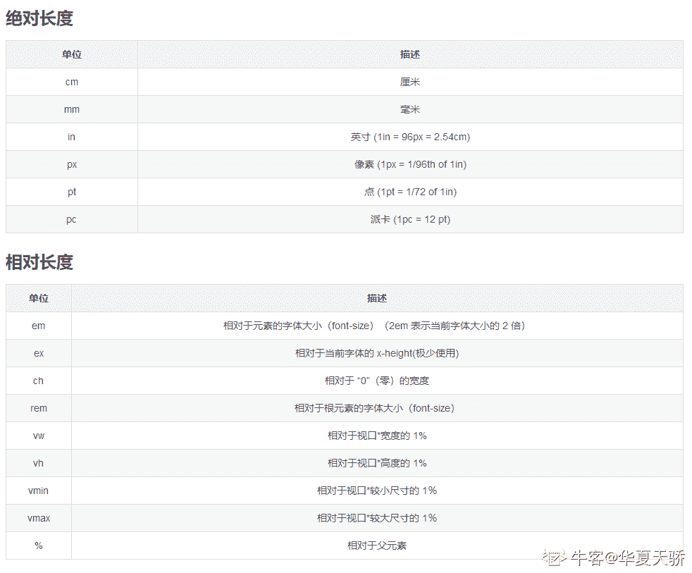
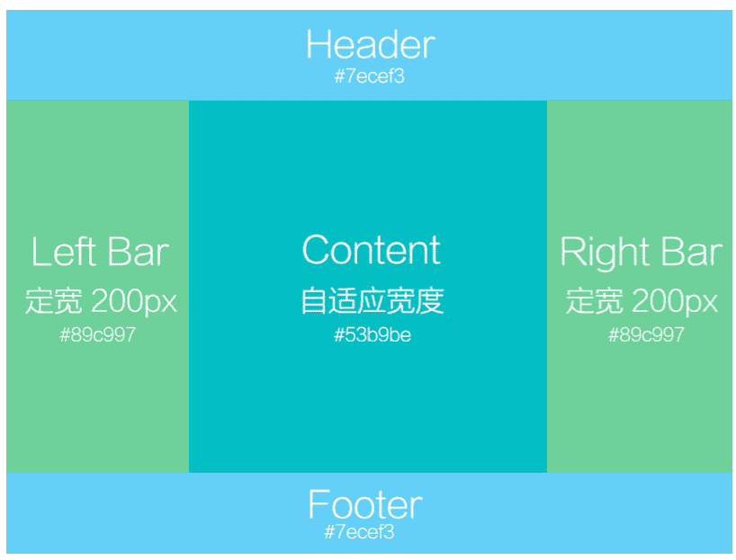

# 蘑菇街 2019 届实习生-前端开发工程师笔试试题

## 1

以下 CSS 选择器，优先级最高的为

正确答案: D   你的答案: 空 (错误)

```cpp
span:first-child
```

```cpp
#username
```

```cpp
.username span
```

```cpp
span #username
```

本题知识点

前端工程师 蘑菇街 2019 CSS

讨论

[李骏诚](https://www.nowcoder.com/profile/981842308)

可以把样式的应用方式分为几个等级，按照等级来计算权重

1、!important，加在样式属性值后，权重值为 10000
2、内联样式，如：style=””，权重值为 1000
3、ID 选择器，如：#content，权重值为 100
4、类，伪类和属性选择器，如： content、:hover 权重值为 10
5、标签选择器和伪元素选择器，如：div、p、:before 权重值为 1

6、通用选择器（*）、子选择器（>）、相邻选择器（+）、同胞选择器（~）、权重值为 0 来源：[`www.cnblogs.com/fwl8888/p/9184658.html`](https://www.cnblogs.com/fwl8888/p/9184658.html)

编辑于 2019-04-06 16:04:22

* * *

[1579](https://www.nowcoder.com/profile/154886741)

css 的优先级分为 4 个等级，分别是 A,B,C,D（A 代表是否有内联样式，有为 1，无为 0；B 代表 ID 选择器个数；C 代表类选择器、属性选择器和伪类总个数；D 代表标签选择器和伪元素总个数），比较规则就是从左往右比较。本题中，(选项)       A      B     C    D  (等级)
A              0     0      1     1B              0     1     0     0C              0     0     1     1D              0     1     0     1 综上，选项 D 的优先级最高

发表于 2020-02-27 17:44:58

* * *

[海岸 201907010109833](https://www.nowcoder.com/profile/638845998)

越具体优先级越高

发表于 2019-09-11 09:16:16

* * *

## 2

以下关于 JavaScript 的描述，不正确的是

正确答案: B   你的答案: 空 (错误)

```cpp
JavaScript 是一门弱类型语言
```

```cpp
JavaScript 是一门编译型语言
```

```cpp
JavaScript 是一门动态语言
```

```cpp
JavaScript 可以运行在浏览器端以及服务端
```

本题知识点

前端工程师 蘑菇街 2019

讨论

[GOOINGYU](https://www.nowcoder.com/profile/58527592)

**JavaScript ( ****JS **) 是一种具有[函数优先](https://developer.mozilla.org/en-US/docs/Glossary/First-class_Function)的轻量级解释型或即时编译型的编程语言。
JS 还是读一行解释一行的，所以 js 是解释型语言没毛病，动态语言应该是指是类型是动态类型的。一切皆为对象的方式。
[来源 MDN](https://developer.mozilla.org/zh-CN/docs/Web/JavaScript)

发表于 2019-03-30 13:15:48

* * *

[ha.ha](https://www.nowcoder.com/profile/152482565)

JavaScript 一种直译式脚本语言，是一种动态类型、弱类型、基于原型的语言，内置支持类型。它的解释器被称为 JavaScript 引擎，为浏览器的一部分，广泛用于客户端的脚本语言

发表于 2019-04-06 16:08:07

* * *

## 3

下列关于闭包理解错误的是

正确答案: D   你的答案: 空 (错误)

```cpp
增加一定的内存消耗
```

```cpp
使用不当可能会导致内存泄漏
```

```cpp
可以使用闭包模拟私有方法
```

```cpp
闭包会改动对象的原型链
```

本题知识点

前端工程师 蘑菇街 2019

讨论

[WEBJ2EE](https://www.nowcoder.com/profile/3930151)

作用域是链是不会被改变的

发表于 2020-01-22 11:13:19

* * *

## 4

函数 meili 和 mogu 执行后，控制台的输出值分别为 

正确答案: B   你的答案: 空 (错误)

```cpp
meili, mogu
```

```cpp
meili, TypeError: mogu is not a function
```

```cpp
TypeError: meili is not a function, mogu
```

```cpp
TypeError: meili is not a function, TypeError: mogu is not a function
```

本题知识点

前端工程师 蘑菇街 2019

讨论

[大娃想吃无骨鸭脚](https://www.nowcoder.com/profile/162569451)

function meili(){}是函数声明，可以放在代码的任何位置，也可以在任何地方成功调用；

var mogu = function(){};是函数表达式，即将一个匿名函数赋值给一个 mogu 变量，实现通过 mogu 变量来调用这个匿名函数，但它需要在声明过后才能进行调用。

发表于 2019-04-03 11:23:29

* * *

[cherrygao.](https://www.nowcoder.com/profile/882522798)

meili()是函数声明，函数声明会有一个函数声明提升的过程，所以 meili()可以正常运行；mogu()是函数表达式，函数位于一个初始化语句中，在执行函数所在语句之前变量 mogu 中不会保存对函数的引用。

发表于 2019-03-29 20:42:41

* * *

[阿鼬](https://www.nowcoder.com/profile/998956307)

function 先调用后声明在 JS 里也能作用。 var 会先提升声明，相当于 var mogu mogu() function mogu(){..}

发表于 2019-03-28 18:46:26

* * *

## 5

 以下哪项可以去除变量 str 中的所有空格 

正确答案: A   你的答案: 空 (错误)

```cpp
str.replace(`/\s*/g,""`)
```

```cpp
str.replace(`/^\s|\s$/g,""`)
```

```cpp
str.replace(`/^\s*/, ""`)
```

```cpp
str.replace(`/(\s*$)/g, ""`)
```

本题知识点

前端工程师 蘑菇街 2019

讨论

[正方形的***](https://www.nowcoder.com/profile/893687367)

str.replace(`/\s*/g,""`)`` 是 ES6 模板字符串的写法，正确答案的常见写法等价于 str.replace(/\s*/g,"")，题目用的是正则的直接量写法，即用两撇斜杠，/expression/param，expression 就是 A 中的\s*，param 就是 g,\s = [\t\n\x0B\f\r] 即空格或者空白，* 是量词，   表示 0 次或者多余 0 次； g 是即 global 的缩写，代表全局而^  表示以什么字符开始 ， $  表示以什么字符结束 ， |  表示或 B 就是去除字符串首尾一个空格，不是全部，因为没*，C 就是去除所有首空格了 D 用到了（），即分组，不好展开，简单理解，分组一个正则表达式，不但可以对整个匹配进行操作，还可以对其中（）中的子进行匹配

编辑于 2019-10-09 18:21:29

* * *

[我才是谭亮](https://www.nowcoder.com/profile/1491282)

第二个去除首尾空格 第三个去除首空格

发表于 2019-03-28 20:49:41

* * *

## 6

下列代码执行后的输出结果是


正确答案: B   你的答案: 空 (错误)

```cpp
6
```

```cpp
24
```

```cpp
0
```

```cpp
16
```

本题知识点

前端工程师 蘑菇街 2019

讨论

[牛客 182802674 号](https://www.nowcoder.com/profile/182802674)

就是递归，输出 4*3*2*1

发表于 2020-09-23 10:53:17

* * *

[Ped](https://www.nowcoder.com/profile/9416754)

这个是递归知识吗？

发表于 2019-04-02 20:09:44

* * *

## 7

image 元素的 alt 和 title 有什么异同，选出正确的说法？

正确答案: A   你的答案: 空 (错误)

```cpp
alt 和 title 同时设置的时候，alt 作为图片的替代文字出现，title 是图片的解释文字
```

```cpp
alt 和 title 同时设置的时候，title 作为图片的替代文字出现，alt 是图片的解释文字
```

```cpp
alt 和 title 同时设置的时候，alt 不起作用，title 是图片的解释文字
```

```cpp
alt 和 title 同时设置的时候，alt 作为图片的替代文字出现，title 不起作用
```

本题知识点

前端工程师 蘑菇街 前端工程师 蘑菇街 2019

讨论

[我才是谭亮](https://www.nowcoder.com/profile/1491282)

alt 属性和 title 属性的区别：前者是在图片无法加载的时候才会显示的值，而 title 是在图片正常加载鼠标划上去显示的值

发表于 2019-03-28 20:44:41

* * *

## 8

以下代码执行后 a 和 b.age 的值分别为？

正确答案: D   你的答案: 空 (错误)

```cpp
9，11
```

```cpp
10，11
```

```cpp
9，10
```

```cpp
10，10
```

本题知识点

前端工程师 蘑菇街 2019

讨论

[6pences](https://www.nowcoder.com/profile/531098485)

a 是变量，b 是对象。a 作为变量参数 10 传入函数 fn，返回的参数是 9，但这个参数并没有重新还给 a，所以 a 还是 10。b 作为对象地址传入函数 fn，在函数执行时，地址指向了 b.age 属性并做了修改，所以 b.age 变成了 10。

发表于 2019-03-31 16:05:22

* * *

[GOOINGYU](https://www.nowcoder.com/profile/58527592)

a 是基础类型，所以函数里的参数相当于另赋值了给 x 所以没有影响。b 是引用类型，所以函数里的参数是浅拷贝，会修改原对象内的值

发表于 2019-03-30 13:18:33

* * *

[果粒橙加特仑苏](https://www.nowcoder.com/profile/525724499)

a 是基础类型，b 是应用类型。

发表于 2020-12-16 15:26:26

* * *

## 9

console.log('5' + 3, '5' - 3)输出的结果是

正确答案: C   你的答案: 空 (错误)

```cpp
8，1
```

```cpp
报错
```

```cpp
53，2
```

```cpp
53, 5-3
```

本题知识点

前端工程师 蘑菇街 2019

讨论

[我才是谭亮](https://www.nowcoder.com/profile/1491282)

加法运算 第一个是字符串 +号会变成字符连接；减法运算 会尝试转化成数值型进行计算

发表于 2019-03-28 20:43:41

* * *

[富婆安排上](https://www.nowcoder.com/profile/442044548)

“5”+3 是字符串与数字之间的连接，所以数字会转成字符进行合并。 “5”-3 的运算符是-，所以会将字符串转成数字进行运算

发表于 2020-05-30 19:35:02

* * *

[仙乡何处](https://www.nowcoder.com/profile/65030072)

8 是运算出来的，可以理解。可后面的 1，是拿来的？

发表于 2019-04-03 11:31:42

* * *

## 10

在最新版的 Chrome 浏览器中，以下代码的执行结果是

正确答案: C   你的答案: 空 (错误)

```cpp
DEFHCG
```

```cpp
DHEFCG
```

```cpp
DEFHGC
```

```cpp
DHEFGC
```

本题知识点

前端工程师 蘑菇街 2019

讨论

[GOOINGYU](https://www.nowcoder.com/profile/58527592)

不同的任务源会被分配到不同的 Task 队列中，任务源可以分为 微任务
（microtask） 和 宏任务（macrotask）。在 ES6 规范中，microtask 称为 jobs，
macrotask 称为 task。setTimeout 是宏任务，而 Promise 是微任务，所以按顺序来执行的话，宏任务被放在最后，微任务的 then 放在次后

发表于 2019-03-30 13:20:58

* * *

[6pences](https://www.nowcoder.com/profile/531098485)

宏任务：包括整体代码 script，setTimeout，setInterval。微任务：Promise。代码执行顺序是先宏任务，再微任务，如果还有则需要开始新一轮循环宏任务、微任务。所以原代码执行顺序是：1.宏任务 script，先弹出 D，new 创建 promise 对象时的 EF，然后弹出 H2.微任务 promise，Promise 对象执行完 resolve()后.then 的 G3.宏任务 setTimeout 的 C 即 DEFHGC

发表于 2019-03-31 20:35:24

* * *

[李骏诚](https://www.nowcoder.com/profile/981842308)

转载 ：[`segmentfault.com/a/1190000016278115`](https://segmentfault.com/a/1190000016278115)
这一篇文章看懂了你就懂了

发表于 2019-04-06 16:39:46

* * *

## 11

下列属于 CSS 标准单位的是

正确答案: A C D   你的答案: 空 (错误)

```cpp
px
```

```cpp
rpx
```

```cpp
em
```

```cpp
rem
```

本题知识点

前端工程师 蘑菇街 2019 CSS

讨论

[他说哈哈哈](https://www.nowcoder.com/profile/7151184)

rpx 是微信小程序里面 WXSS 中的单位

发表于 2019-03-30 19:37:14

* * *

[6pences](https://www.nowcoder.com/profile/531098485)

rem 是 css3 中新增加的一个单位属性(font size of the root element),根据页面的根节点的字体大小进行转变的单位。

发表于 2019-03-31 15:59:19

* * *

[华夏天骄](https://www.nowcoder.com/profile/887870227)

[`blog.csdn.net/weixin_45852922/article/details/115799082`](https://blog.csdn.net/weixin_45852922/article/details/115799082)

发表于 2021-06-05 11:21:57

* * *

## 12

前端常见的攻击方法包括

正确答案: A B C   你的答案: 空 (错误)

```cpp
XSS
```

```cpp
CSRF
```

```cpp
SQL 注入
```

```cpp
ARP 攻击
```

本题知识点

前端工程师 蘑菇街 2019

讨论

[喃喃呐呐](https://www.nowcoder.com/profile/979887643)

 > 1、xss 攻击
> 
> 2、CSRF 攻击
> 
> 3、网络劫持攻击
> 
> 4、控制台注入代码
> 
> 5、钓鱼
> 
> 6、DDoS 攻击
> 
> 7、SQL 注入攻击
> 
> 8、点击劫持 

发表于 2020-09-20 21:13:45

* * *

[月影城下](https://www.nowcoder.com/profile/518630237)

1.ARP 攻击就是通过伪造 IP 地址和 MAC 地址实现 ARP 欺骗，能够在网络中产生大量的 ARP 通信量使[网络阻塞](https://baike.baidu.com/item/%E7%BD%91%E7%BB%9C%E9%98%BB%E5%A1%9E)，攻击者只要持续不断的发出伪造的 ARP 响应包就能更改目标[主机](https://baike.baidu.com/item/%E4%B8%BB%E6%9C%BA)ARP 缓存中的 IP-MAC 条目，造成网络中断或[中间人攻击](https://baike.baidu.com/item/%E4%B8%AD%E9%97%B4%E4%BA%BA%E6%94%BB%E5%87%BB)。不是前端的攻击方式。2.XSS 是一种经常出现在 web 应用中的计算机安全漏洞，它允许恶意 web 用户将代码植入到提供给其它用户使用的页面中。3. CSRF（Cross-site request forgery）跨站请求伪造，也被称为“One Click Attack”或者 Session Riding，通常缩写为 CSRF 或者 XSRF，是一种对网站的恶意利用。尽管听起来像跨站脚本（[XSS](https://baike.baidu.com/item/XSS)），但它与 XSS 非常不同，XSS 利用站点内的信任用户，而 CSRF 则通过伪装成受信任用户的请求来利用受信任的网站。与[XSS](https://baike.baidu.com/item/XSS)攻击相比，CSRF 攻击往往不大流行（因此对其进行防范的资源也相当稀少）和难以防范，所以被认为比[XSS](https://baike.baidu.com/item/XSS)更具危险性。4\. SQL 注入：就是通过把 SQL 命令插入到 Web[表单](https://baike.baidu.com/item/%E8%A1%A8%E5%8D%95/5380322)提交或输入域名或页面请求的查询字符串，最终达到欺骗服务器执行恶意的 SQL 命令

发表于 2019-04-14 00:28:09

* * *

## 13

下列 HTTP 请求状态码和描述正确的是

正确答案: A C D   你的答案: 空 (错误)

```cpp
200：请求已成功，请求所希望的响应头或数据体将随此响应返回
```

```cpp
302：被请求的资源已永久移动到新位置
```

```cpp
404：请求失败，请求所希望得到的资源未被在服务器上发现
```

```cpp
500：服务器遇到了一个未曾预料的状况，导致了它无法完成对请求的处理
```

本题知识点

前端工程师 蘑菇街 2019

讨论

[WahFung](https://www.nowcoder.com/profile/604794387)

301 永久重定向 302 暂时重定向

发表于 2019-03-27 23:00:14

* * *

[果粒橙加特仑苏](https://www.nowcoder.com/profile/525724499)

301 永久重定向，302,307 临时重定向。

发表于 2020-12-16 15:27:03

* * *

[已注销](https://www.nowcoder.com/profile/631714656)

500 是服务器内部错误，感觉 D 项的话 501 更合适一些。

发表于 2019-06-03 16:22:04

* * *

## 14

以下哪些 CSS 属性可以继承

正确答案: A B   你的答案: 空 (错误)

```cpp
font-size
```

```cpp
color
```

```cpp
padding
```

```cpp
margin
```

本题知识点

前端工程师 蘑菇街 2019 CSS

讨论

[喃喃呐呐](https://www.nowcoder.com/profile/979887643)

不可继承的：baidisplay、dumargin、border、padding、background、height、min-height、max- height、width、min-width、max-width、overflow、position、left、right、top、 bottom、z-index、float、clear、table-layout、vertical-align、page-break-after、 page-bread-before 和 unicode-bidi。
所有子元素可继承：visibility 和 cursor。
内联元素可继承：letter-spacing、word-spacing、white-space、line-height、color、font、 font-family、font-size、font-style、font-variant、font-weight、text- decoration、text-transform、direction。
块状元素可继承：text-indent 和 text-align。
列表元素可继承：list-style、list-style-type、list-style-position、list-style-image。
表格元素可继承：border-collapse。

发表于 2020-09-20 21:14:27

* * *

[李骏诚](https://www.nowcoder.com/profile/981842308)

转载 ：[`www.cnblogs.com/thislbq/p/5882105.html`](https://www.cnblogs.com/thislbq/p/5882105.html)

发表于 2019-04-06 16:41:20

* * *

## 15

以下()结果等于字符串 string

正确答案: A B D E   你的答案: 空 (错误)

```cpp
typeof 'string'
```

```cpp
String('string').toString()
```

```cpp
'string'.split('').sort().join('')
```

```cpp
(function(string){return string})('string')
```

```cpp
JSON.parse('{"string":"string"}').string
```

本题知识点

前端工程师 蘑菇街 2019

讨论

[6pences](https://www.nowcoder.com/profile/531098485)

输出的结果是字符串'string'，不是说结果属于字符串类型。.sort()排序数组，结果是字符串'ginrst'。

发表于 2019-03-31 16:08:35

* * *

[EsunR](https://www.nowcoder.com/profile/812415368)

'string'.split('').sort()

对字符串'string'分割为数组后进行了排序，导致再次拼接的字符串字符顺序与原来不同。

> MDN: sort() 方法用原地算法对数组的元素进行排序，并返回数组。排序算法现在是稳定的。默认排序顺序是根据字符串 Unicode 码点。

编辑于 2019-04-29 21:00:00

* * *

[我才是谭亮](https://www.nowcoder.com/profile/1491282)

```cpp
'string'.split('').sort().join('')改为'string'.split('').join('')
```

发表于 2019-03-28 20:39:20

* * *

## 16

下列不符合嵌套规范的是

正确答案: A B D   你的答案: 空 (错误)

```cpp
`<li><h2></h2><li>`
```

```cpp
`<a><a></a></a>`
```

```cpp
`<span><span></span><span>`
```

```cpp
`<i><div></div></i>`
```

本题知识点

前端工程师 蘑菇街 2019 HTML

讨论

[「、皓子’](https://www.nowcoder.com/profile/2370302)

我怎么感觉这道题选 A,B,C,D 呢。C 标签就写错了

发表于 2019-04-01 19:14:12

* * *

[6pences](https://www.nowcoder.com/profile/531098485)

行内元素不能嵌套块元素。i 属于行内元素，div 属于块元素。D 错误。

发表于 2019-03-31 16:09:24

* * *

[Despacito007](https://www.nowcoder.com/profile/893487814)

考视力...

发表于 2020-09-13 17:40:47

* * *

## 17

下列哪些方法可以有效提升 web 页面性能

正确答案: A B C   你的答案: 空 (错误)

```cpp
合并静态资源请求
```

```cpp
静态资源使用 CDN 托管
```

```cpp
开启 http 缓存
```

```cpp
使用模块化开发
```

本题知识点

前端工程师 蘑菇街 2019

讨论

[shelbaydo](https://www.nowcoder.com/profile/170869594)

模块化开发也可以提升页面性能，可以解决命名冲突，进行依赖管理，这就是提升性能吧

发表于 2019-09-23 10:22:48

* * *

[如此也好](https://www.nowcoder.com/profile/126155880)

模块化开发不能提高性能吗？

发表于 2019-04-15 11:03:03

* * *

[牛客 2482302 号](https://www.nowcoder.com/profile/2482302)

怎么会是合并呢   打成 chunk 浏览器一起下载才提高性能加快速度啊,不然 webpack 为啥生产版本打一堆 chunk

发表于 2019-04-04 11:01:04

* * *

## 18

下面的等式成立的是?

正确答案: B D   你的答案: 空 (错误)

```cpp
parseInt(46.8) `==` parseFloat(46.8)
```

```cpp
NaN `!==` NaN
```

```cpp
isNaN('abc') `==` NaN
```

```cpp
typeof NaN `===` 'number'
```

本题知识点

前端工程师 蘑菇街 2019

讨论

[我才是谭亮](https://www.nowcoder.com/profile/1491282)

js 数据类型：

**值类型(基本类型)**：字符串（String）、数字(Number)、布尔(Boolean)、空（Null）、未定义（Undefined）、Symbol。

**引用数据类型**：对象(Object)、数组(Array)、函数(Function)。

等号运算符（== 和 ===） 不能被用来判断一个值是否是 NaN。必须使用 [Number.isNaN()](https://developer.mozilla.org/zh-CN/docs/Web/JavaScript/Reference/Global_Objects/Number/isNaN) 或 [isNaN()](https://developer.mozilla.org/zh-CN/docs/Web/JavaScript/Reference/Global_Objects/isNaN) 函数。在执行自比较之中：NaN，也只有 NaN，比较之中不等于它自己。

编辑于 2019-04-29 10:26:22

* * *

[正方形的***](https://www.nowcoder.com/profile/893687367)

NaN 是一种特殊的 number,NaN 与任何值都不相等,与自己也不相等。

下面是 typeof 运算符对各个类型的返回结果：  

1.undefined:undefined  

2.null:object  

3.string:string  

4.number:number  

5.boolean:boolean  

6.function:function  

7.object:objec

发表于 2019-10-09 20:56:21

* * *

## 19

下列哪两种方法可以有效防御跨站伪造请求(CSRF)

正确答案: B C   你的答案: 空 (错误)

```cpp
过滤用户输入的特殊字符
```

```cpp
检查 Referer 字段
```

```cpp
添加校验 Token
```

```cpp
升级 Https
```

本题知识点

前端工程师 蘑菇街 2019

讨论

[呼啦婷婷](https://www.nowcoder.com/profile/262659756)


发表于 2021-06-06 21:17:06

* * *

## 20

下列方法可用于阻止事件冒泡的有

正确答案: A B D   你的答案: 空 (错误)

```cpp
event.cancelBubble = true;
```

```cpp
event.stopPropagation();
```

```cpp
event.preventDefault();
```

```cpp
return false;
```

本题知识点

前端工程师 蘑菇街 2019

讨论

[我才是谭亮](https://www.nowcoder.com/profile/1491282)

return 不仅阻止事件冒泡，也阻止事件本身，stopPropagation()只阻止事件冒泡

发表于 2019-03-28 20:30:08

* * *

[秋风的回答](https://www.nowcoder.com/profile/61118206)

reture false 能阻止冒泡？？？咱也不知道，咱也不敢说

发表于 2019-05-14 15:52:03

* * *

[Agree﹉](https://www.nowcoder.com/profile/706205720)

原生 js， return false 并不能阻止冒泡 jq 是自己封装好了，所以可以题目不太严谨啊

发表于 2019-05-12 15:16:40

* * *

## 21

编写 HTML/CSS 代码，实现如下布局。注：如能实现 left bar、content、right bar 的高度，自适应为三者的最高高度，可享额外加分 

你的答案

本题知识点

前端工程师 蘑菇街 2019

讨论

[JsonWang0102](https://www.nowcoder.com/profile/482834539)

```cpp
<!DOCTYPE html>
<html lang="en">
<head>
    <title>布局</title>
    <style>
        * {
            margin: 0;
            padding: 0;
        }

        #header {
            height: 100px;
            width: 100%;
            background-color: #7ecef3;
        }

        /*使用 absolute 单位实现高度自适应*/
        #conent {
            width: 100%;
            position: absolute;
            display: flex;
            top: 100px;
            bottom: 100px;
        }

        #left {
            width: 200px;
            /*height: 200px;*/
            background-color: #89c997;
        }

        #right {
            width: 200px;
            /*height: 200px;*/
            background-color: #89c997;
        }

        #middle {
            flex: 1;
            background-color: #53b9be;
        }

        #footer {
            height: 100px;
            width: 100%;
            position: absolute;
            bottom: 0;
            background-color: #7ecef3;
        }
    </style>
</head>
<body>
<div id="header"></div>
<div id="conent">
    <div id="left"></div>
    <div id="middle"></div>
    <div id="right"></div>
</div>
<div id="footer"></div>
</body>
</html>
```

编辑于 2019-04-13 16:51:00

* * *

[你要加油！努力！再努力～](https://www.nowcoder.com/profile/480614368)

```cpp
<!DOCTYPE html>
<html lang="en">

<head>
    <meta charset="UTF-8">
    <meta name="viewport" content="width=device-width, initial-scale=1.0">
    <meta http-equiv="X-UA-Compatible" content="ie=edge">
    <title>Document</title>
    <style>
        header,
        footer {
            height: 200px;
            background: #7ecef3;
        }
        main{
            height: 500px;
            display: flex;
        }
        main .left, main .right {
            width: 200px;
            height: 100%;
            background: #89c997;
        }
        .main {
            flex: 1;
        }
    </style>
</head>

<body>
    <header>Header</header>
    <main>
        <div class="left">Left Bar</div>
        <div class="main">Content</div>
        <div class="right">Right Bar</div>
    </main>
    <footer>Footer</footer>
</body>

</html>
```

发表于 2019-08-14 22:35:59

* * *

[丶末漓莫离](https://www.nowcoder.com/profile/387727754)

<!DOCTYPE html><html lang="en"><head><meta charset="UTF-8"><meta name="viewport" content="width=device-width,initial-scale=1.0"><style>body {display: flex;flex-direction:column;margin: 0px;padding: 0px;}#box{display: flex;min-height: 100vh;justify-content:space-between;flex-direction: column;}header,footer {flex:0 0 50px;background-color:#7ecef3;}#body {display:flex;flex:1;}#body #content {flex:1;background-color:#53b9be;}#body #left-bar {flex:0 0 200px;order:-1;background-color:#89c997;}#body #right-bar {flex:0 0 200px;background-color:#89c997;}</style><body id="holyGrail"><div id="box"><header></header><div id="body"><div id="content"></div><div id="left-bar"></div><div id="right-bar"></div></div></div><footer></footer>
</body></head></html>

发表于 2019-03-31 22:40:38

* * *

## 22

 编写一个 js 函数,传入一个非空字符串,计算出现次数最多的字符,返回该字符及 出现次数,结果可能包含多个字符。如传入“xyzzyxyz”,则返回:{y:3, z:3} 

你的答案

本题知识点

前端工程师 蘑菇街 2019

讨论

[我叫黑大帅](https://www.nowcoder.com/profile/368735820)

```cpp
        function maxString(str){
            var arr = str.split("");
            var obj = {};
            var obj2 = {};
            var max = 1;
            for (let i = 0; i < arr.length; i++) {
                var item = arr[i];
                obj[item] = (obj[item]+1) || 1;
            }
            for (var key in obj) {
                if(obj[key]>max){
                    max = obj[key];
                }
            }
            for(var key in obj){
                if(obj[key] === max){
                    obj2[key] = max;
                }
            }
            return obj2;
        }

```

编辑于 2019-04-01 21:42:24

* * *

[切图仔啊](https://www.nowcoder.com/profile/901924811)

> if(!String.prototype.countCode) {
>     String.prototype.countCode = function() {
>         let hash = {}, 
>             ret = {},
>             max = -1,
>             len = this.length;
>         for(let i = 0;i < len; i ++) {
>             hash[this[i]] = hash[this[i]] +　1 || 1;
>             if(hash[this[i]] > max) max = hash[this[i]];
>         } 
>         for(let key in hash) {
>             if(hash.hasOwnProperty(key)) {
>                 if(hash[key] === max) {
>                     ret[key] =max;
>                 }
>             }
>         }
>         return ret;
>     }
> }

编辑于 2019-04-11 19:22:56

* * *

[何者 1995](https://www.nowcoder.com/profile/985979042)

var string='aaabbb';
function select(str){
  var obj={};
  for(var i = 0;i<str.length;i++){
    if(obj[str[i]]){
      obj[str[i]]++;
    }else{
      obj[str[i]]=1;
    }
  }
  console.log(obj);
}
select(string);

发表于 2019-03-30 17:53:17

* * *