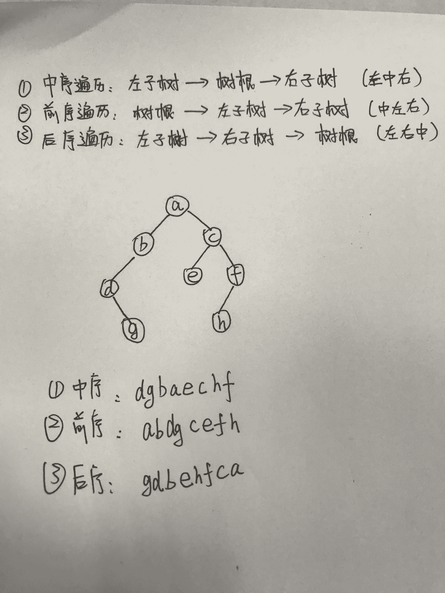

# 蘑菇街 2019 招聘-测试实习生考试试题

## 1

在下面哪个场景中，索引将是最有用的(  )

正确答案: A   你的答案: 空 (错误)

```cpp
被索引的列作为表达式的一部分
```

```cpp
被索引的列包含不同范围的值
```

```cpp
被索引的列用于 FROM 子句
```

```cpp
被索引的列被声明为 NOT NULL
```

本题知识点

测试工程师 蘑菇街 2019

讨论

[heaboy_93](https://www.nowcoder.com/profile/141583)

作为表达式的一部分,不走索引呀?????

发表于 2019-11-16 10:40:38

* * *

## 2

关于数据结构的以下说法，错误的是(  )

正确答案: C   你的答案: 空 (错误)

```cpp
红黑树插入操作的平均时间复杂度为 0（log n），最坏时间复杂度为 0（log n）
```

```cpp
B+树插入操作的平均时间复杂度为 0（log n），最坏时间复杂度为 0（log
n）
```

```cpp
Hash 插入操作的平均时间复杂度为 0（log n），最坏时间复杂度为 0（n）
```

```cpp
排序链表插入操作的平均时间复杂度为 0（n），最坏时间复杂度为 0（n）
```

本题知识点

测试工程师 蘑菇街 2019

## 3

若某二叉树的前序遍历访问顺序是 abdgcefh，中序遍历访问顺序是 dgbaechf，则其后序遍历的结点访问顺序是(  )

正确答案: D   你的答案: 空 (错误)

```cpp
bdgcefha
```

```cpp
gdbecfha
```

```cpp
bdgaechf
```

```cpp
gdbehfca
```

本题知识点

测试工程师 蘑菇街 测试工程师 蘑菇街 2019

讨论

[Big 琴](https://www.nowcoder.com/profile/742266220)



发表于 2019-04-12 10:39:43

* * *

## 4

```cpp
评估下面的一组 SQL 语句:
```

```cpp
 CREATE TABLE dept (deptno NUMBER(2), dname VARCNAR2(14), 1oc VARCNAR2 (13)); ROLLBACK; DESCRIBE DEPT
```

```cpp
 下面关于该组语句的哪个描述是正确的( ) 
```

正确答案: C   你的答案: 空 (错误)

```cpp
DESCRIBE DEPT 语句将返回一个错误 ORA-04043: object DEPT does not exist.
```

```cpp
ROLLBACK 语句将释放 DEPT 占用的存储空间
```

```cpp
DESCRIBE DEPT 语句将显示 DEPT 表的结构描述内容
```

```cpp
DESCRIBE DEPT 语句将只有在 ROLLBACK 之前引入一个 COMMIT 语句时，才会显示 DEPT 表的结构描述内容
```

本题知识点

测试工程师 蘑菇街 2019

讨论

[常耀华](https://www.nowcoder.com/profile/360755)

DESCRIBE DEPT 语句将显示 DEPT 表的结构描述内容 

CREATE TABLE 在 ORACLE 里自动提交，
而 ROLLBACK 在 COMMIT 后就不起作用了，因此这里的 ROLLBACK 对表结构语句无任何影响

发表于 2020-03-02 11:15:35

* * *

## 5

下列关于 java 中的 wait()方法和 sleep()方法的区别描述错误的是(  )

正确答案: D   你的答案: 空 (错误)

```cpp
wait()方法属于 Object 类，sleep()属于 Thread 类
```

```cpp
调用 wait()方法的时候，线程会放弃对象锁
```

```cpp
调用 sleep()方法的过程中，线程不会释放对象锁
```

```cpp
sleep()方法导致了程序暂停执行指定的时间，让出 cpu 给其他线程
```

本题知识点

测试工程师 蘑菇街 测试工程师 蘑菇街 2019

## 6

设一组初始记录关键字序列为(45，80，55，40，42，85)，则以第一个记录关键字 45 为基准而得到一趟快速排序的结果是（）

正确答案: C   你的答案: 空 (错误)

```cpp
40，42，45，55，80，83
```

```cpp
42，40，45，80，85，88
```

```cpp
42，40，45，55，80，85
```

```cpp
42，40，45，85，55，80
```

本题知识点

测试工程师 蘑菇街 测试工程师 蘑菇街 2019

讨论

[喵喵喵？咩咩咩？](https://www.nowcoder.com/profile/599694529)

这题答案应该是 D 以 45 为基准，往 45 左右两边的空数组里分别放置比 45 小的和比 45 大的数，这题通过答案选项可以判断是从后往前比较，那么比较过程如下：[] 45 [85][42] 45 [85][42 40] 45 [85][42 40] 45 [85 55][42 40] 45 [85 55 80]所以答案是 D

发表于 2019-04-04 17:29:34

* * *

[北岛凉音](https://www.nowcoder.com/profile/67133552)

先右后左 左找大右找小 45，80，55，40，42，85； 42，80，55，40，45，85； 42，45，55，40，80，85； 42，40，55，45，80，85 ； 42，40，45，55，80，85 ；

编辑于 2019-10-27 10:00:09

* * *

## 7

```cpp
有如下代码：请写出程序的输出结果(  )
```

|  
```cpp
1
```

```cpp
2
```

```cpp
3
```

```cpp
4
```

```cpp
5
```

```cpp
6
```

```cpp
7
```

```cpp
8
```

```cpp
9
```

```cpp
10
```

```cpp
11
```

```cpp
12
```

```cpp
13
```

```cpp
14
```

```cpp
15
```

```cpp
16
```

```cpp
17
```

```cpp
18
```

 |  
```cpp
public class Test
```

```cpp
{
```

```cpp
    public static void main(String[] args)
```

```cpp
    {
```

```cpp
        int x = 0;
```

```cpp
        int y = 0;
```

```cpp
        int k = 0;
```

```cpp
        for (int z = 0; z < 5; z++) {
```

```cpp
            if ((++x > 2) && (++y > 2) && (k++ > 2))
```

```cpp
            {
```

```cpp
                x++;
```

```cpp
                ++y;
```

```cpp
                k++;
```

```cpp
            }
```

```cpp
        }
```

```cpp
        System.out.println(x + ”” +y + ”” +k);
```

```cpp
    }
```

```cpp
}
```

 |

正确答案: C   你的答案: 空 (错误)

```cpp
422
```

```cpp
532
```

```cpp
531
```

```cpp
431
```

本题知识点

测试工程师 蘑菇街 2019

讨论

[喵喵喵？咩咩咩？](https://www.nowcoder.com/profile/599694529)

这题的关键在于 if 语句进行三个与的判断时，当第一个条件为非时，就不会再判断后面的两个条件了

发表于 2019-04-04 17:31:25

* * *

## 8

栈和队列共同具有的特点是(  )

正确答案: C   你的答案: 空 (错误)

```cpp
都是先进后出
```

```cpp
都是先进先出
```

```cpp
只允许在端点进行操作运算
```

```cpp
既能先进先出，也能先进后出
```

本题知识点

测试工程师 蘑菇街 测试工程师 蘑菇街 2019

## 9

在面向对象方法中，不属于“对象”基本特点的是(  )

正确答案: A   你的答案: 空 (错误)

```cpp
一致性
```

```cpp
分类性
```

```cpp
多态性
```

```cpp
标识唯一性
```

本题知识点

测试工程师 蘑菇街 2019

讨论

[lucky 多多](https://www.nowcoder.com/profile/88101615)

(1)对象唯一性。
每个对象都有自身唯一的标识，通过这种标识，可找到相应的对象。在对象的整个生命期中，它的标识都不改变，不同的对象不能有相同的标识。
(2)分类性。
分类性是指将具有一致的数据结构(属性)和行为(操作)的对象抽象成类。一个类就是这样一种抽象，它反映了与应用有关的重要性质，而忽略其他一些无关内容。任何类的划分都是主观的，但必须与具体的应用有关。
(3)继承性。
继承性是子类自动共享父类数据结构和方法的机制，这是类之间的一种关系。在定义和实现一个类的时候，可以在一个已经存在的类的基础之上来进行，把这个已经存在的类所定义的内容作为自己的内容，并加入若干新的内容。
(4)多态性(多形性)
多态性使指相同的操作或函数、过程可作用于多种类型的对象上并获得不同的结果。不同的对象，收到同一消息可以产生不同的结果，这种现象称为多态性。
多态性允许每个对象以适合自身的方式去响应共同的消息。
多态性增强了软件的灵活性和重用性。

发表于 2019-03-31 15:03:09

* * *

## 10

软件开中的瀑布模型典型地刻画了软件生存周期的阶段划分，与其最相适应的软件开发方法是哪个

正确答案: B   你的答案: 空 (错误)

```cpp
构件化方法
```

```cpp
结构化方法
```

```cpp
面向对象方法
```

```cpp
快速原型方法
```

本题知识点

测试工程师 蘑菇街 2019

## 11

TCP 和 UDP 协议的相似之处(  )

正确答案: C   你的答案: 空 (错误)

```cpp
面向连接的协议
```

```cpp
面向非连接的协议
```

```cpp
传输层协议
```

```cpp
其他项目都不对
```

本题知识点

测试工程师 蘑菇街 测试工程师 蘑菇街 2019

## 12

以下属于物理层的设备是(  )

正确答案: A   你的答案: 空 (错误)

```cpp
中继器
```

```cpp
以太网交换机
```

```cpp
桥
```

```cpp
网关
```

本题知识点

测试工程师 蘑菇街 测试工程师 蘑菇街 2019

## 13

在 OSI 参考模型中能实现路由选择、拥塞控制与互连功能的是(  )

正确答案: C   你的答案: 空 (错误)

```cpp
传输层
```

```cpp
应用层
```

```cpp
网络层
```

```cpp
物理层
```

本题知识点

测试工程师 蘑菇街 2019

## 14

在内存中，每个基本单位都被赋予一个唯一的序号，这个序号称之为

正确答案: B   你的答案: 空 (错误)

```cpp
字节
```

```cpp
地址
```

```cpp
编号
```

```cpp
容量
```

本题知识点

测试工程师 蘑菇街 2019

## 15

对一个由 A,B,C,D 随机组成的序列进行哈弗曼编码，据统计，各个元素的概率分别为：P(A)=0.4，P(B)=0.35，P(C)=0.2，P(D)=0.05，请问该编码的平均期望编码长度为（）bits？

正确答案: C   你的答案: 空 (错误)

```cpp
1.45
```

```cpp
1.7
```

```cpp
1.85
```

```cpp
1.92
```

本题知识点

测试工程师 蘑菇街 测试工程师 蘑菇街 2019

## 16

软件测试的目的是(  )

正确答案: B   你的答案: 空 (错误)

```cpp
避免软件开发中出现的错误
```

```cpp
发现软件中出现的错误
```

```cpp
容忍软件中出现的错误
```

```cpp
修改软件中出现的错误
```

本题知识点

测试工程师 蘑菇街 测试工程师 蘑菇街 2019

## 17

逻辑覆盖法不包括(  )

正确答案: C   你的答案: 空 (错误)

```cpp
分支覆盖
```

```cpp
语句覆盖
```

```cpp
需求覆盖
```

```cpp
修正条件判定覆盖
```

本题知识点

测试工程师 蘑菇街 2019

## 18

不属于单元测试内容的是(  )

正确答案: A   你的答案: 空 (错误)

```cpp
模块接口测试
```

```cpp
局部数据结构测试
```

```cpp
模块间时序测试
```

```cpp
全局数据测试
```

本题知识点

测试工程师 蘑菇街 2019

讨论

[负几万](https://www.nowcoder.com/profile/663548283)

答案错了吧

发表于 2019-10-27 23:51:47

* * *

[牛客 203118066 号](https://www.nowcoder.com/profile/203118066)

选 d 吧,单元测试应该是局部的

发表于 2021-03-24 10:00:25

* * *

[lzz@bjtu](https://www.nowcoder.com/profile/122130243)

不懂

发表于 2019-08-27 22:40:28

* * *

## 19

软件测试用例主要由测试输入数据和( )两部分组成。

正确答案: D   你的答案: 空 (错误)

```cpp
测试计划
```

```cpp
测试规则
```

```cpp
以往测试记录分析
```

```cpp
测试的预期结果
```

本题知识点

测试工程师 蘑菇街 测试工程师 蘑菇街 2019

## 20

从已发现故障的存在到找到准确的故障位置并确定故障的性质，这一过程称为(  )

正确答案: B   你的答案: 空 (错误)

```cpp
错误检测
```

```cpp
调试
```

```cpp
故障排除
```

```cpp
测试
```

本题知识点

测试工程师 蘑菇街 2019

## 21

软件测试方法从结构上分为：（）

正确答案: A B C   你的答案: 空 (错误)

```cpp
白盒测试
```

```cpp
黑盒测试
```

```cpp
灰盒测试
```

```cpp
单元测试
```

本题知识点

测试工程师 蘑菇街 2019

讨论

[higirl2020](https://www.nowcoder.com/profile/376457331)

Abc

发表于 2020-03-16 08:56:26

* * *

## 22

黑盒测试用例分析方法常见有：（ ）

正确答案: A B C D   你的答案: 空 (错误)

```cpp
等价类划分法
```

```cpp
因果图法
```

```cpp
正交法
```

```cpp
判定表法
```

本题知识点

测试工程师 蘑菇街 2019

讨论

[牛客 720535170 号](https://www.nowcoder.com/profile/720535170)

https://blog.csdn.net/hongfuqiang/article/details/78840763

发表于 2020-08-19 10:25:45

* * *

## 23

测试在软件研发周期中参与的产出物：（ ）

正确答案: B C D   你的答案: 空 (错误)

```cpp
需求文档
```

```cpp
项目计划
```

```cpp
测试用例
```

```cpp
测试报告
```

```cpp
发布计划
```

本题知识点

测试工程师 蘑菇街 2019

讨论

[lxl17865271297](https://www.nowcoder.com/profile/615076214)

项目计划等于测试计划吗？怎末感觉含含糊糊的

发表于 2020-10-11 21:57:26

* * *

## 24

测试过程中哪些会被定义为软件 Bug：（）

正确答案: B C D   你的答案: 空 (错误)

```cpp
用户体验不好
```

```cpp
功能和需求不一致
```

```cpp
处理速度低于设计要求
```

```cpp
在某些不同系统上显示不正确
```

本题知识点

测试工程师 蘑菇街 2019

讨论

[隔岸听雨](https://www.nowcoder.com/profile/90746360)

BCD

发表于 2019-03-28 18:19:34

* * *

## 25

集成测试的过程包括有以下哪些？（）

正确答案: A B C D   你的答案: 空 (错误)

```cpp
构建的确认过程
```

```cpp
系统集成测试测试组提交过程
```

```cpp
测试用例设计过程
```

```cpp
Bug 的报告过程
```

本题知识点

测试工程师 蘑菇街 Java 工程师 C++工程师 2019

## 26

对数据库，关于索引的理解正确的是（）

正确答案: B C D   你的答案: 空 (错误)

```cpp
创建索引能提高数据插入的性能
```

```cpp
索引应该根据具体的检索需求来创建，在选择性好的列上创建索引
```

```cpp
索引并非越多越好
```

```cpp
建立索引可加速查询
```

本题知识点

测试工程师 蘑菇街 2019

## 27

java 语言中，在同一包下，以下说法正确的是（）

正确答案: A B C D   你的答案: 空 (错误)

```cpp
super.方法（）可以调用父类的所有非私有方法
```

```cpp
super（）可以调用父类的所有非私有构造函数
```

```cpp
super.属性可以调用父类的所有非私有属性
```

```cpp
this 和 super 关键字可以出现在同一个构造函数中
```

本题知识点

测试工程师 蘑菇街 2019

## 28

在 Linux 上，对于多进程，子进程继承了父进程的下列哪些？

正确答案: B C D   你的答案: 空 (错误)

```cpp
进程地址空间
```

```cpp
共享内存
```

```cpp
信号掩码
```

```cpp
已打开的文件描述符
```

```cpp
其他选项都不是
```

本题知识点

测试工程师 蘑菇街 2019

## 29

64 位机上，一个结构体有三个成员，分别是 ChAr: int: short 类型，三个成员位于结构体中不同位置时整个结构体的大小可能是下面哪些值？

正确答案: A C   你的答案: 空 (错误)

```cpp
12
```

```cpp
7
```

```cpp
8
```

```cpp
16
```

本题知识点

测试工程师 蘑菇街 2019 C 语言

讨论

[小阿花 Minty](https://www.nowcoder.com/profile/724882383)

对于 64 位机来说 int 是 4 字节，char 是 1 字节，short 是 2 字节（是的这三个类型和 32 位没啥区别）第一种 int char short  ->4 1 2 ->8 第二种 int short char ->4 2 1->8 第三种 short int char  ->2 4 1->12 第四种 short char int  ->2 1 4 ->8 第五种 char int short ->1 4 2 ->12 第六种 char short int ->1 2 4 ->8

发表于 2020-09-06 10:29:53

* * *

[牛客 637427732 号](https://www.nowcoder.com/profile/637427732)

64 位机不是按照 8 字节对齐方式吗？

发表于 2021-07-07 09:25:15

* * *

[牛客 280655438 号](https://www.nowcoder.com/profile/280655438)

首先先到 int，四个字节（找最大的作为对齐标准） 接着两种可能排列 8:int+char+short int+short+char 12:char+int+short short+int+char

发表于 2020-08-24 16:47:48

* * *

## 30

关系模型的数据操纵即是建立在关系上的数据操纵，一般有 _____ 四种操作；

正确答案: A B C D   你的答案: 空 (错误)

```cpp
增加
```

```cpp
删除
```

```cpp
修改
```

```cpp
查询
```

```cpp
存储
```

本题知识点

测试工程师 蘑菇街 2019

## 31

下图是蘑菇街 web 的登录页面，根据图中的内容涉及相应的用例。

你的答案

本题知识点

测试工程师 蘑菇街 2019

## 32

输入一个字符串,按字典序打印出该字符串中字符的所有排列。例如输入字符串 abc,则打印出由字符 a,b,c 所能排列出来的所有字符串 abc,acb,bac,bca,cab 和 cba。

本题知识点

Java 工程师 C++工程师 算法工程师 蘑菇街 测试工程师 数组 递归 穷举 字符串 *系统工程师 2019 大数据开发工程师* *讨论

[lentolove](https://www.nowcoder.com/profile/572586026)

```cpp
import java.io.BufferedReader;
import java.io.IOException;
import java.io.InputStreamReader;
import java.util.*;

public class Main {

    //标准的全排列问题，有重复的全排列，偷懒的就用 set 去重，答案要求字典顺序输出，就用 TreeSet 咯，
    static TreeSet<String> output = new TreeSet<>();
    public static void main(String[] args) throws IOException {
        BufferedReader bf = new BufferedReader(new InputStreamReader(System.in));
        String s = bf.readLine();
        backtrack(s.toCharArray(), 0, s.length());
        StringBuilder sb = new StringBuilder();
        sb.append('[');
        for (String item : output) {
            sb.append(item).append(",").append(" ");
        }
        System.out.println(sb.substring(0, sb.length() - 2) + "]");
    }
    //回溯算法
    private static void backtrack(char[] chars, int first, int n) {
        if (first == n) {
            output.add(String.valueOf(chars));
            return;
        }
        for (int i = first; i < n; i++) {
            swap(chars, first, i);
            backtrack(chars, first + 1, n);
            //回溯
            swap(chars, first, i);
        }
    }

    private static void swap(char[] chars, int i, int j) {
        char temp = chars[i];
        chars[i] = chars[j];
        chars[j] = temp;
    }
}
```

发表于 2019-08-21 16:26:08

* * *

[WMYW](https://www.nowcoder.com/profile/222543223)

```cpp
//全排列算法+最后 map 排序即可
#include<iostream>
(720)#include<cstring>
#include<map>
using namespace std;
map<string,int> mm;
void Array(char *s,int k,int m)
{
    if(k==m)
        mm[s]++;
    else
    {
        for(int j=k;j<=m;j++)
        {
            swap(s[j],s[k]);
            Array(s,k+1,m);
            swap(s[j],s[k]);
        }
    }
}
int main()
{
    char s[10];
    cin>>s;
    Array(s,0,strlen(s)-1);
    auto ot=mm.end();
    ot--;
    for(auto it=mm.begin();it!=mm.end();it++)
    {
        if(it==mm.begin())
            cout<<'['<<it->first<<','<<" ";
        else if(it==ot)
            cout<<it->first<<']';
        else
            cout<<it->first<<','<<" ";
    }
}
```

发表于 2020-04-13 11:13:46

* * *

[桃崽](https://www.nowcoder.com/profile/608349580)

```cpp
import itertools
ss=input()
mm=sorted(set(map(''.join,itertools.permutations(ss))))
print("[" + ', '.join(mm) + "]")
最后输出‘，’后面还有一个空格，要不然格式不正确
```

发表于 2020-03-20 22:03:18

* * **