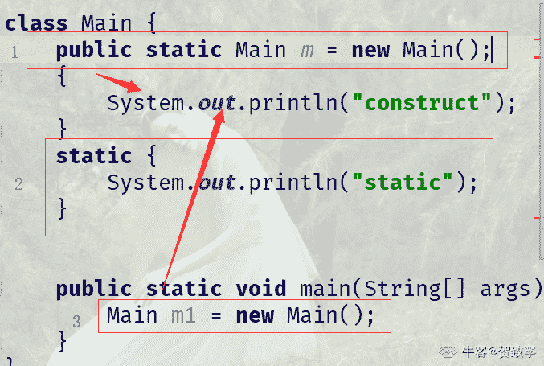

# 蘑菇街 2019 届校招-测试类笔试题

## 1

下列选项中，降低进程优先级的合理时机是( )。

正确答案: A   你的答案: 空 (错误)

```cpp
进程的时间片用完
```

```cpp
进程刚完成 I/O，进入就绪队列
```

```cpp
进程长期处于就绪队列中
```

```cpp
进程从就绪状态转为运行态
```

本题知识点

Java 工程师 C++工程师 测试工程师 蘑菇街 测试工程师 蘑菇街 2019

讨论

[lucky 多多](https://www.nowcoder.com/profile/88101615)

考查进程的基本状态转换。完成 I/O 进入就绪队列的进程尚未执行，不能降低其优先级；长期处于就绪队列的进程应提高其优先级；进程刚刚转入运行态，也不应降低其优先级；当进程的时间片用完，调度程序需要调度其他程序进入处理机执行，此时降低进程优先级是合理的。

发表于 2019-03-30 16:58:14

* * *

## 2

引入线索二叉树的目的是（）

正确答案: A   你的答案: 空 (错误)

```cpp
加快查找结点的前驱或后继结点的速度
```

```cpp
为了能在二叉树中方便插入和删除
```

```cpp
为了能方便找到双亲
```

```cpp
使二叉树的遍历结果唯一
```

本题知识点

Java 工程师 C++工程师 测试工程师 蘑菇街 测试工程师 蘑菇街 2019

讨论

[🐤201904121546909](https://www.nowcoder.com/profile/284999892)


发表于 2019-04-15 11:29:07

* * *

## 3

constructor 必须与 class 同名,但方法不能与 class 同名?下列说法正确的是( )

正确答案: B   你的答案: 空 (错误)

```cpp
class 中的 constructor 不可省略
```

```cpp
constructor 必须与 class 同名,但方法不能与 class 同名
```

```cpp
constructor 在一个对象被 new 时执行
```

```cpp
一个 class 只能定义一个 constructor
```

本题知识点

Java 工程师 C++工程师 测试工程师 蘑菇街 测试工程师 蘑菇街 2019

讨论

[槐殇树](https://www.nowcoder.com/profile/6969435)

正确答案应该是 C 吧

发表于 2019-04-22 16:59:30

* * *

[阿🐠201808061729839](https://www.nowcoder.com/profile/597105497)

方法可以和类重名，只不过构造方法是没有返回值的，答案标错了

发表于 2019-03-28 17:50:30

* * *

[不喝奶茶！](https://www.nowcoder.com/profile/32534477)

为啥不可以和类同名？

发表于 2019-08-24 16:59:44

* * *

## 4

新建一个流对象，下面哪个选项的代码是错误的？

正确答案: B   你的答案: 空 (错误)

```cpp
new
BufferedWriter(new FileWriter(“a.txt”));
```

```cpp
new
BufferedReader(new FileInputStream(“a.dat”));
```

```cpp
new
GZIPOutputStream(new FileOutputStream(“a.zip”));
```

```cpp
new
ObjectInputStream(new FileInputStream(“a.dat”));
```

本题知识点

Java 工程师 C++工程师 测试工程师 蘑菇街 测试工程师 蘑菇街 2019

讨论

[小慕.](https://www.nowcoder.com/profile/6382640)

看这个图，B 选项中的 BufferReader 是字符流的但是括号中的 FileInputStream 是字节流的，应该是不能混为一谈，正确的写法我认为应该是 new BufferReader(new FileReader("a.dat"));
如果大家有更好的解答一定一定要@我！

发表于 2020-05-12 15:13:33

* * *

[九斤 ing](https://www.nowcoder.com/profile/5228614)

Reader 只能用 FileReader 进行实例化

发表于 2019-04-14 16:11:10

* * *

## 5

数据库系统的数据独立性体现在（）

正确答案: B   你的答案: 空 (错误)

```cpp
不会因为数据的变化而影响到应用程序
```

```cpp
不会因为数据存储结构与数据逻辑结构的变化而影响应用程序
```

```cpp
不会因为存储策略的变化而影响存储结构
```

```cpp
不会因为某些存储结构的变化而影响其他的存储结构
```

本题知识点

Java 工程师 C++工程师 测试工程师 蘑菇街 2019 牛客

讨论

[周楚岚](https://www.nowcoder.com/profile/653161627)

在数据库技术中，数据独立性是指应用程序和数据结构之间相互独立，互不影响。在三层模式体系结构中，数据独立性是指数据库系统在某一层次模式上的改变不会使它的上一层模式也发生改变的能力。数据独立性分成物理数据独立性和逻辑数据独立性两级。由于数据库系统的数据独立性包括数据存储结构与数据逻辑结构的变化两方面，所以选项 C 和 D 都不全面。因为数据的变化而影响应用程序并不能真正反映数据库系统的数据独立性，所以选项 A 也不正确。

发表于 2020-08-04 01:13:55

* * *

[427894957](https://www.nowcoder.com/profile/427894957)

数据独立性是指应用程序和数据之间的依赖程度低，相互影响小。

数据独立性分成**物理数据独立性**和**逻辑数据独立性**两级。

**数据的物理独立性**是指应用程序对数据存储结构的依赖程度。数据物理独立性高是指当数据的物理结构发生变化时，应用程序不需要修改也可以常工作。

**数据的逻辑独立性**是指应用程序对数据全局逻辑结构的依赖程度。数据逻辑独立性高是指当数据库系统的数据全局逻辑结构改变时，它们对应的应用程序不需要改变仍可以正常运行

发表于 2019-09-06 09:05:57

* * *

## 6

```cpp
阅读以下代码: 
```

```cpp
               import java.io.*; 
```

```cpp
               import java.util.*;
```

```cpp
               public class foo {
```

```cpp
                                public static void main(String[] args) {
```

```cpp
                                              String s;
```

```cpp
                                              System.out.println(“s=”+s);
```

```cpp
                               }
```

```cpp
               }
```

输出结果为：（）

正确答案: C   你的答案: 空 (错误)

```cpp
代码正常编译，并输出“s=”
```

```cpp
代码正常编译，并输出“s=null”
```

```cpp
代码编译失败
```

```cpp
代码正常编译，抛出 NullPointExeception 异常
```

本题知识点

Java 工程师 C++工程师 测试工程师 蘑菇街 2019

讨论

[不喝奶茶！](https://www.nowcoder.com/profile/32534477)

必须要赋值 null 才能输出。

发表于 2019-08-24 17:02:20

* * *

[九斤 ing](https://www.nowcoder.com/profile/5228614)

代码编译失败，因为 S 没有初始化

发表于 2019-04-10 21:46:57

* * *

## 7

```cpp
有如下代码：请写出程序的输出结果(  )
```

```cpp
public class Test{
```

```cpp
public static Test t1=new Test(); 
```

```cpp
{ 
```

```cpp
System.out.println("blockA"); 
```

```cpp
} 
```

```cpp
static{ 
```

```cpp
System.out.println("blockB"); 
```

```cpp
} 
```

```cpp
public static void main(String[] args) 
```

```cpp
{ 
```

```cpp
Test t2=new Test(); 
```

```cpp
} 
```

```cpp
} 
```

正确答案: B   你的答案: 空 (错误)

```cpp
blockA、blockB
```

```cpp
blockA、blockB、blockA
```

```cpp
blockB、blockA
```

```cpp
blockB、blockA、blockA
```

本题知识点

Java 工程师 C++工程师 测试工程师 蘑菇街 2019

讨论

[采蘩](https://www.nowcoder.com/profile/264762583)

先执行静态方法再执行静态代码块

发表于 2019-04-07 17:50:17

* * *

[不喝奶茶！](https://www.nowcoder.com/profile/32534477)



发表于 2019-08-24 17:09:52

* * *

## 8

关于 Spring MVC 的核心控制器 DispatcherServlet 的作用，以下说法错误的是(  )

正确答案: C   你的答案: 空 (错误)

```cpp
它负责处理 HTTP 请求
```

```cpp
加载配置文件
```

```cpp
实现业务操作
```

```cpp
初始化上下应用对象 ApplicationContext
```

本题知识点

Java 工程师 C++工程师 测试工程师 蘑菇街 2019

讨论

[xfyl](https://www.nowcoder.com/profile/512470783)

SpringMVC 是 Spring 中的模块，它实现了 mvc 设计模式，
首先用户发起请求，请求到达 SpringMVC 的前端控制器(DispatcherServlet)，前端控制器根据用户的 url 请求*处理器映射器查找匹配该 url 的 handle，并返回一个执行链，前端控制器再请求处理器适配器调用相应的 handle 进行处理并返回给前端控制器一个 modelAndView,前端控制器再请求视图解析器对返回的逻辑视图进行解析，最后前端控制器将返回的视图进行渲染，并把数据装入到 request 域，返回给用户。*

**DispatcherServlet 作为 SpringMVC 的前端控制器，负责接收用户的请求，并根据用户的请求返回相应的视图给用户。实现业务在 service 层**。（源于百度。。。。）

发表于 2019-09-06 16:46:02

* * *

## 9

以下哪项陈述是正确的( )

正确答案: D   你的答案: 空 (错误)

```cpp
垃圾回收线程的优先级很高，以保证不再使用的内存将被及时回收
```

```cpp
垃圾收集允许程序开发者明确指定释放哪一个对象
```

```cpp
垃圾回收机制保证了 Java 程序不会出现内存溢出
```

```cpp
进入”Dead”状态的线程不会被垃圾回收器回收
```

本题知识点

Java 工程师 C++工程师 测试工程师 蘑菇街 测试工程师 蘑菇街 2019

讨论

[🐤201904121546909](https://www.nowcoder.com/profile/284999892)

A: 垃圾回收在 jvm 中优先级相当相当低.

B：垃圾收集器（GC）程序开发者只能推荐 JVM 进行回收,但何时回收,回收哪些,程序员不能控制.

C：垃圾回收机制只是回收不再使用的 JVM 内存,如果程序有严重 BUG,照样内存溢出.

D：进入 DEAD 的线程,它还可以恢复,GC 不会回收

发表于 2019-04-15 11:36:14

* * *

## 10

软件开中的瀑布模型典型地刻画了软件生存周期的阶段划分，与其最相适应的软件开发方法是哪个(  )

正确答案: B   你的答案: 空 (错误)

```cpp
构件化方法
```

```cpp
结构化方法
```

```cpp
面向对象方法
```

```cpp
快速原型方法
```

本题知识点

Java 工程师 C++工程师 测试工程师 蘑菇街 测试工程师 蘑菇街 2019

讨论

[🐤201904121546909](https://www.nowcoder.com/profile/284999892)

1．构件化方法
构件是指语义完整、语法正确和有可重用价值的单位软件，是软件重用过程中可以明确辨识的系统。结构上，它是语义描述、通讯接口和实现代码的复合体。简单地说，构件是具有一定的功能，能够独立工作或能同其他构件装配起来协调工作的程序体，构件的使用同它的开发、生产无关。从抽象程度来看，面向对象技术已达到了类级重用(代码重用)，它以类为封装的单位。这样的重用粒度还太小，不足以解决异构互操作和效率更高的重用。构件将抽象的程度提到一个更高的层次，它是对一组类的组合进行封装，并代表完成一个或多个功能的特定服务，也为用户提供了多个接口。整个构件隐藏了具体的实现，只用接口对外提供服务。2．结构化方法
结构化方法(Structured Method)是强调开发方法的结构合理性及所开发软件的结构合理性的软件开发方法。
结构是指系统内各个组成要素之间的相互联系、相互作用的框架。结构化开发方法提出了一组提高软件结构合理性的准则，如分解与抽象、模块独立性、信息隐蔽等。
针对软件生存周期各个不同的阶段，它有结构化分析(SA)、结构化设计(SD)和结构化程序设计(SP)等方法。
在系统分析阶段，按全局的观点对企业进行分析，自上而下，从粗到精，由表及里，将系统逐层逐级进行分解，最后进行逆向综合，构成系统的信息模型。在系统设计阶段，先把系统功能作为一个大模块，然后逐层分解，完成系统模块结构设计。在实施阶段，先实现系统的框架，自上而下完善系统的功能。程序的编写遵循结构化程序设计的原则，自顶向下，逐步求精。
3．面向对象方法
面向对象方法是一种非常实用的软件开发方法。它以客观时间中的对象为中心，其分析和设计思想符合人们的思维方式，分析和设计的结果与客观世界的实际比较接近，容易被人们接受。在面向对象方法中，分析和设计的界限并不明显，他们采用相同的符号表示，能方便地从分析阶段平滑地过渡到设计阶段。4．快速原型法快速原型是指快速建立起来的可以在计算机上运行的程序，它所完成的功能往往是最终软件产品功能的一个子集。快速原型模型的第一步是快速建立一个能反映用户主要需求的软件原型，让用户在计算机上使用它，通过实际操作了解目标系统的概貌。开发人员按照用户提出的意见快速地修改原型系统，然后再次请用户试用……一旦用户认为这个原型系统确实能够满足他们的需求，开发人员便可据此书写软件需求说明，并根据这份文档开发出可以满足用户真实需求的软件产品。
因此，快速原型法主要用于获取用户的真实需求，适合开发用户需求不是很明确的软件系统。 

发表于 2019-04-15 11:41:08

* * *

## 11

高度为 n 的完全二叉树最少的结点数为（  ）

正确答案: A   你的答案: 空 (错误)

```cpp
2n-1

```

```cpp
2n-1+1
```

```cpp
2n

```

```cpp
2n-1

```

本题知识点

Java 工程师 C++工程师 测试工程师 蘑菇街 2019

讨论

[阿🐠201808061729839](https://www.nowcoder.com/profile/597105497)

答案超级错误了吧？最多才是 D，最少应该是 A

发表于 2019-03-28 18:24:45

* * *

[🐤201904121546909](https://www.nowcoder.com/profile/284999892)

答案应为 A，最多为 2^n -1（此时为满二叉树），最少为 2^(n-1) （此时 n-1 层为满二叉树，n 层有一个叶子节点）

发表于 2019-04-15 11:47:00

* * *

[可爱邹](https://www.nowcoder.com/profile/234783328)

最多是 2^n -1

最少才是 2^n-1 +1 即有 n-1 层满二叉树 加一个叶节点

发表于 2019-04-11 23:00:00

* * *

## 12

进出资源图中存在（）是发生死锁的必要条件

正确答案: C   你的答案: 空 (错误)

```cpp
互斥
```

```cpp
可剥夺条件
```

```cpp
环路
```

```cpp
同步
```

本题知识点

Java 工程师 C++工程师 测试工程师 蘑菇街 2019

## 13

下列关于进程的叙述，（）是最不符合操作系统对进程的理解。

正确答案: A   你的答案: 空 (错误)

```cpp
进程是在多程序并行环境中的完整的程序
```

```cpp
进程可以由程序、数据和进程控制块描述
```

```cpp
线程(THREAD)是一种特殊的进程
```

```cpp
进程是程序在一个数据集合上运行的过程，是系统进行资源管理的一个独立单位
```

本题知识点

Java 工程师 C++工程师 测试工程师 蘑菇街 测试工程师 蘑菇街 2019

讨论

[🐤201904121546909](https://www.nowcoder.com/profile/284999892)

进程是操作系统资源分配和独立的基本单位。它包括 PCB、程序和数据，以及执行栈区，仅仅说进程是在多程序环境下的完整的程序是不合适的。

发表于 2019-04-15 11:48:45

* * *

## 14

学生关系模式 Student（ Sno，Sname，Sex，Age），Student 的属性分别表示学生的学号、姓名、性别、年龄。要在表 Student 中删除一个属性“年龄”，可选用的 SQL 语句是（）

正确答案: B   你的答案: 空 (错误)

```cpp
DELETE
Age from S
```

```cpp
ALTER
TABLE S DROP Age
```

```cpp
UPDATE
S Age
```

```cpp
ALTER
TABLE S ‘Age’
```

本题知识点

Java 工程师 C++工程师 测试工程师 蘑菇街 2019

## 15

在数据库中存储的是（ ）

正确答案: C   你的答案: 空 (错误)

```cpp
数据
```

```cpp
数据库模型
```

```cpp
数据以及数据之间的联系
```

```cpp
信息
```

本题知识点

Java 工程师 C++工程师 测试工程师 蘑菇街 测试工程师 蘑菇街 2019

## 16

以下关于测试方法的叙述中，不正确的是（ ）

正确答案: B   你的答案: 空 (错误)

```cpp
根据是否需要执行被测试代码可分为静态测试和动态测试
```

```cpp
黑盒测试也叫做结构测试，针对代码本身进行测试
```

```cpp
动态测试主要是对软件的逻辑、功能等方面进行评估
```

```cpp
白盒测试把被测试代码当成透明的盒子，完全可见
```

本题知识点

Java 工程师 C++工程师 测试工程师 蘑菇街 测试工程师 蘑菇街 2019

讨论

[学习学习学习啦啦啦啦啦](https://www.nowcoder.com/profile/789894778)

白盒测试也称结构测试或逻辑驱动测试，是一种测试用例设计方法。白盒测试一般分为静态测试和动态测试，静态测试不运行软件，主要是 对软件的编程格式、结构等方面进行评估，采用的方法是代码走查、代 码审查、程序结构。 

发表于 2019-04-07 14:48:39

* * *

## 17

用边界值法，假定 1 <X<100, 那么 X 应取的边界是（）

正确答案: C   你的答案: 空 (错误)

```cpp
X=1,X=100
```

```cpp
X=2,X=99
```

```cpp
X=1,X=100,
X=0,X=101
```

```cpp
X=0,X=101
```

本题知识点

Java 工程师 C++工程师 测试工程师 蘑菇街 测试工程师 蘑菇街 2019

讨论

[怕是不知道怎么改网名哦](https://www.nowcoder.com/profile/355382279)

我觉得应该是：1,2,99,100

发表于 2019-07-17 18:10:16

* * *

[不喝奶茶！](https://www.nowcoder.com/profile/32534477)

开区间向外取闭区间向内取

发表于 2019-08-24 17:14:14

* * *

[罗卜卜](https://www.nowcoder.com/profile/956725769)

此题有误，应为 1，2，99，100

发表于 2019-08-14 13:01:42

* * *

## 18

以下关于负载压力测试的叙述中，不正确的是（ ）

正确答案: A   你的答案: 空 (错误)

```cpp
在模拟环境下检测系统性能
```

```cpp
预见系统负载起力承受力
```

```cpp
分析系统瓶颈
```

```cpp
在应用实际部署并评估系统性能
```

本题知识点

Java 工程师 C++工程师 测试工程师 蘑菇街 测试工程师 蘑菇街 2019

讨论

[袁小袁°](https://www.nowcoder.com/profile/691041864)

1、在真实环境下检测系统性能，评估系统性能以及服务等级的满足情况；
2、预见系统负载压力承受力，在应用实际部署之前，评估系统性能；
3、分析系统瓶颈、优化系统。

发表于 2019-08-29 14:24:08

* * *

[学习学习学习啦啦啦啦啦](https://www.nowcoder.com/profile/789894778)

Alpha 和 Beta 测试： Alpha 测试是用户在开发环境下进行的测试，也可以是产品供应商内部的用户在模拟实际操作环境下 ... 1、系统检测

发表于 2019-04-07 14:50:26

* * *

## 19

以下关于 Web 测试的叙述中，不正确的是（ ）

正确答案: C   你的答案: 空 (错误)

```cpp
Web 软件的测试贯穿整个软件生命周期
```

```cpp
按系统架构划分，Web 测试分为客户端测试、服务端测试和网络测试
```

```cpp
Web 系统测试与其他系统测试测试内容基本不同但测试重点相同
```

```cpp
Web 性能测试可以采用工具辅助
```

本题知识点

Java 工程师 C++工程师 测试工程师 蘑菇街 2019

讨论

[童心未泯丶](https://www.nowcoder.com/profile/903032739)

我蒙对的。。。

发表于 2019-04-09 16:45:07

* * *

[学习学习学习啦啦啦啦啦](https://www.nowcoder.com/profile/789894778)

· 网站系统测试要点及基本方法 1. Web 测试的要点 具体介绍一个 web 的项目需要进行以下 6 个部分的测试： 1.1 功能测试 链接测试 链接是 web 应用系统的一个主要[`wenku.baidu.com/view/bc7d5c5af4335a8102d276a20029bd64783e62df.html`](https://wenku.baidu.com/view/bc7d5c5af4335a8102d276a20029bd64783e62df.html) 

编辑于 2019-04-07 14:52:25

* * *

## 20

以下关于软件可靠性管理的叙述中，不正确的是（ ）

正确答案: B   你的答案: 空 (错误)

```cpp
在需求分析阶段确定软件的可靠性目标
```

```cpp
在设计阶段进行可靠性评价
```

```cpp
在测试阶段执行可靠性测试
```

```cpp
在实施阶段收集可靠性数据
```

本题知识点

Java 工程师 C++工程师 测试工程师 蘑菇街 2019

讨论

[学习学习学习啦啦啦啦啦](https://www.nowcoder.com/profile/789894778)

事实上，在设计阶段可靠性 预测主要是相对可靠性，而不是绝对可靠性。我也不知道答案

发表于 2019-04-07 14:53:50

* * *

## 21

对手机软件的压力测试通常可以包括（）

正确答案: A B C   你的答案: 空 (错误)

```cpp
存储压力
```

```cpp
响应能力压力
```

```cpp
网络流量压力
```

```cpp
并发压力
```

本题知识点

Java 工程师 C++工程师 测试工程师 蘑菇街 2019

讨论

[vector<>](https://www.nowcoder.com/profile/255171944)

并发压力属于并发测试

发表于 2020-04-08 21:20:01

* * *

[higirl2020](https://www.nowcoder.com/profile/376457331)

Abc

发表于 2020-03-17 22:38:07

* * *

## 22

集成测试的过程包括有以下哪些？（）

正确答案: A B C D   你的答案: 空 (错误)

```cpp
构建的确认过程
```

```cpp
系统集成测试测试组提交过程
```

```cpp
测试用例设计过程
```

```cpp
Bug 的报告过程
```

本题知识点

测试工程师 蘑菇街 Java 工程师 C++工程师 2019

## 23

下面描述测试工具的功能正确的有？（）

正确答案: A B D   你的答案: 空 (错误)

```cpp
JMeter:
基于 JAVA 的压力测试工具，Badboy 用来进行脚本的录制
```

```cpp
Junit:
白盒测试工具：针对代码测试
```

```cpp
LoadRunner:进行 UI 测试工具
```

```cpp
TestLink:
用例管理工具
```

本题知识点

Java 工程师 C++工程师 测试工程师 蘑菇街 2019

讨论

[九斤 ing](https://www.nowcoder.com/profile/5228614)

LoadRunner，是一种预测系统行为和性能的负载测试工具。通过以模拟上千万用户实施并发负载及实时性能监测的方式来确认和查找问题，LoadRunner 能够对整个企业架构进行测试。

发表于 2019-04-11 12:51:42

* * *

## 24

如果要修改表中的数据,可采用下面哪种方式( )

正确答案: B D   你的答案: 空 (错误)

```cpp
选择查询
```

```cpp
操作查询
```

```cpp
表对象中的设计视图
```

```cpp
表对象中的数据视图
```

本题知识点

Java 工程师 C++工程师 测试工程师 蘑菇街 2019

## 25

下面说法不正确的有（）

正确答案: B D   你的答案: 空 (错误)

```cpp
计算函数 count 的作用是统计记录个数
```

```cpp
文本字段，最长 200 个字符
```

```cpp
数字字段，最大存储空间为 8 个字节
```

```cpp
计算函数 Expression 的作用是选择所在的字段的最后一个值
```

本题知识点

Java 工程师 C++工程师 测试工程师 蘑菇街 2019 C++

讨论

[FLKID](https://www.nowcoder.com/profile/200170217)

有谁能解释这题啥意思吗，啥语言的？

发表于 2020-08-27 19:53:59

* * *

[九斤 ing](https://www.nowcoder.com/profile/5228614)

文本字段最长 255 个字符

发表于 2019-04-11 13:27:00

* * *

[孙新](https://www.nowcoder.com/profile/2711709)

屏蔽。讲的啥玩意。

发表于 2021-01-20 19:25:55

* * *

## 26

查看工资表中实发工资为 2000 元以上(除 2000 元)至 4000 元(除 4000 元)以下的人员记录( )

正确答案: B D   你的答案: 空 (错误)

```cpp
实发工资>2000 OR 实发工资<4000
```

```cpp
实发工资>2000 AND 实发工资<4000C
```

```cpp
实发工资>=2000 AND 实发工资<=4000
```

```cpp
实发工资(Between 2000 and 4000)
```

本题知识点

Java 工程师 C++工程师 测试工程师 蘑菇街 2019

讨论

[MAÏS🌸](https://www.nowcoder.com/profile/4807015)

between 不是包括边界的吗？题目要求是不包括，求解答！

发表于 2019-05-01 10:44:37

* * *

[不喝奶茶！](https://www.nowcoder.com/profile/32534477)

[SQL](https://www.baidu.com/s?wd=SQL&tn=SE_PcZhidaonwhc_ngpagmjz&rsv_dl=gh_pc_zhidao)中 between and 是包括边界值的，not between 不包括边界值。个人感觉 D 是错的

发表于 2019-08-24 17:25:13

* * *

[学习学习学习啦啦啦啦啦](https://www.nowcoder.com/profile/789894778)

```cpp
实发工资>2000 AND 实发工资<4000C 是什么意思呢?
```

发表于 2019-04-07 14:55:56

* * *

## 27

下面选项中哪些是数据链路层的主要功能： （）

正确答案: A B C   你的答案: 空 (错误)

```cpp
提供对物理层的控制
```

```cpp
差错控制
```

```cpp
流量控制
```

```cpp
决定传输报文的最佳路由
```

本题知识点

Java 工程师 C++工程师 测试工程师 蘑菇街 2019

讨论

[玄学求 offer13466464](https://www.nowcoder.com/profile/1862510)

封装成帧，透明传输，差错检测

发表于 2019-04-03 18:35:03

* * *

[20190901](https://www.nowcoder.com/profile/63394910)

流量控制难道不是传输层？

发表于 2019-10-26 14:54:47

* * *

## 28

网络拓扑结构设计对通信子网的（ ）有着重大的影响

正确答案: A C D   你的答案: 空 (错误)

```cpp
网络性能
```

```cpp
网络体系结构
```

```cpp
网络系统的可靠性
```

```cpp
通信费用
```

本题知识点

Java 工程师 C++工程师 测试工程师 蘑菇街 2019

讨论

[战胜极限](https://www.nowcoder.com/profile/244427390)

 网络的拓扑结构与网络的体系结构无关，拓扑结构是指网络怎样把入网的计算机连接起来，它直接影响网络的性能、系统的可靠性和通信费用。网络的体系结构是指网络的理论研究和开发，它与拓扑结构无关，网络的体系结构包括网络协议，将网络层次结构模型与各层协议的集合定义为计算机网络体系结构，网络体系结构对计算机网络应该实现的功能进行了精确的定义，而这些功能是用什么样的硬件与软件去完成的，则是具体的实现问题。体系结构是抽象的，而实现是具体的，它是指能够运行的一些硬件和软件。目前较好的网络体系结构有 OSI、ATM 和 TCP/IP 网络

发表于 2019-10-19 00:36:27

* * *

## 29

下列说法正确的是（）

正确答案: A D   你的答案: 空 (错误)

```cpp
当队列中无数据元素时，称为空队列
```

```cpp
队列被称为“先进先出”表
```

```cpp
栈是一种操作不受限的线性表
```

```cpp
栈是一种只允许在一端进行插入和删除的线性表
```

本题知识点

Java 工程师 C++工程师 测试工程师 蘑菇街 2019

讨论

[玄学求 offer13466464](https://www.nowcoder.com/profile/1862510)

B 哪里错了，难道是因为队列可以用其他形式来实现，所以说错了吗

发表于 2019-04-03 18:37:13

* * *

[不喝奶茶！](https://www.nowcoder.com/profile/32534477)

B？？？？？？？

发表于 2019-08-24 17:26:43

* * *

[黄草草 xhh](https://www.nowcoder.com/profile/174416919)

B 错了么？？

发表于 2019-04-28 21:46:39

* * *

## 30

TCP 和 UDP 的区别（）

正确答案: A B   你的答案: 空 (错误)

```cpp
TCP 提供面向连接的、可靠的数据流传输
```

```cpp
UDP 提供的是非面向连接的、不可靠的数据流传输
```

```cpp
TCP 数据传输快
```

```cpp
UDP 注重数据安全性
```

本题知识点

Java 工程师 C++工程师 测试工程师 蘑菇街 2019

讨论

[🐤201904121546909](https://www.nowcoder.com/profile/284999892)

TCP 的优点： 可靠，稳定 TCP 的可靠体现在 TCP 在传递数据之前，会有三次握手来建立连接，而且在数据传递时，有确认、窗口、重传、拥塞控制机制，在数据传完后，还会断开连接用来节约系统资源。 TCP 的缺点： 慢，效率低，占用系统资源高，易被攻击 TCP 在传递数据之前，要先建连接，这会消耗时间，而且在数据传递时，确认机制、重传机制、拥塞控制机制等都会消耗大量的时间，而且要在每台设备上维护所有的传输连接，事实上，每个连接都会占用系统的 CPU、内存等硬件资源。 而且，因为 TCP 有确认机制、三次握手机制，这些也导致 TCP 容易被人利用，实现 DOS、DDOS、CC 等攻击。

UDP 的优点： 快，比 TCP 稍安全 UDP 没有 TCP 的握手、确认、窗口、重传、拥塞控制等机制，UDP 是一个无状态的传输协议，所以它在传递数据时非常快。没有 TCP 的这些机制，UDP 较 TCP 被攻击者利用的漏洞就要少一些。但 UDP 也是无法避免攻击的，比如：UDP Flood 攻击…… UDP 的缺点： 不可靠，不稳定 因为 UDP 没有 TCP 那些可靠的机制，在数据传递时，如果网络质量不好，就会很容易丢包。 基于上面的优缺点，那么： 什么时候应该使用 TCP： 当对网络通讯质量有要求的时候，比如：整个数据要准确无误的传递给对方，这往往用于一些要求可靠的应用，比如 HTTP、HTTPS、FTP 等传输文件的协议，POP、SMTP 等邮件传输的协议。 在日常生活中，常见使用 TCP 协议的应用如下： 浏览器，用的 HTTP FlashFXP，用的 FTP Outlook，用的 POP、SMTP Putty，用的 Telnet、SSH QQ 文件传输 ………… 什么时候应该使用 UDP： 当对网络通讯质量要求不高的时候，要求网络通讯速度能尽量的快，这时就可以使用 UDP。 比如，日常生活中，常见使用 UDP 协议的应用如下： QQ 语音 QQ 视频 TFTP ……

发表于 2019-04-15 17:37:44

* * *

## 31

针对图中 app 搜索图墙功能设计相关测试用例，要求能够表达清晰的测试思路和测试要点即可。 

你的答案

本题知识点

Java 工程师 C++工程师 测试工程师 蘑菇街 2019

讨论

[黄草草 xhh](https://www.nowcoder.com/profile/174416919)

功能测试：1.输入框输入各类衣服是否显示出正确的衣服类型。有无其他不同的产品出现。         2.输入框输入中英文字符，以及其他字符数字出现什么提示。   3.点击手机屏幕的各个功能控件是否能跳转出现到相应的界面。          4.点击图像能否正常进入查看          5.筛选功能能否按用户的要求执行出结果。          6.点击星星能都标记喜欢成功，以及标记后数字能否及时增长。          7.反馈是否能够调整，能否正常反馈。性能测试：1.在某一时刻许多用户对某一商品进行点击，高并发的情况。          2.数据库能够及时对商品数以及用户操作进行更新。          3.在操作该 app 时，对手机的耗电性能，cpu 是否有消耗。界面测试：1.各个图标有没有排列规范，符合审美。          2.字体大小，以及有无错别字。兼容性测试：1.在不同的手机操作平台能够正常运行。网络测试：1.该 app 对流量的使用情况。          2.网络情况不佳的情况能否使用，能否加载出图片。其他测试：1.切换 app 后，再返回该 app 是否还在之前的状态。

发表于 2019-04-28 21:47:02

* * *

[🌞☀️🍀🍀🍀🍀🍀](https://www.nowcoder.com/profile/48802066)

1.界面测试：（1）查看界面布局是否合理，页面的图片，文字等是否正确；（2）不同商品是否在不同区域显示；（3）页面的 tooltips 是否显示正确。2.功能测试：（1）点击图片或图片下方文字，页面是否会链接到该商品详情页面，详情页面的商品价格与文字描述是否显示正确；（2）点击 收藏 按钮，如果用户未登陆是否会提示用户输入用户名和密码，如果用户登陆，收藏按钮是否会变色，收藏数字是否会+1；（3）如果该商品以收藏，收藏按钮已变色，再次点击 收藏 按钮，按钮颜色是否会变为空心，是否已取消收藏，收藏数是否-1；（4）点击 返回 按钮，页面是否跳转到上一页面；（5）点击 筛选，是否出现筛选项，若出现筛选项，选择某几个条件，点击确定按钮，查看页面是否推荐的商品是否符合自己选择的筛选条件；（6）点击 销量 按钮，推荐商品是否按照销量的高低排序显示；（7）点击 搭配，推荐商品是否显示 搭配好的服饰；（8）搜索的输入框：输入内容，点击搜索，推荐的商品是否符合输入的关键字；若输入的内容无法搜索到，是否有提示；（9）点击图案和元素那两行选项，是否可以多选，推荐的商品是否与关键字相关；（10）点击 反馈，页面是否跳转到 反馈信息页面。3.性能测试：（1）点击某个商品，跳转到该商品详情页面所用时间；（2）输入关键字搜索商品所需时间；（3）收藏/取消收藏所需时间；（4）点击 反馈，页面跳转到反馈页面所需时间；（5）按条件搜索商品所需时间。4.兼容性测试：（1）不同移动终端设备下的测试功能是否正常；（2）不同设备系统下（android，iOS 等）的测试功能是否正常。5.易用性测试：是否有回到顶部的功能。6.网络测试：移动，联通，电信流量，Wi-Fi 下的测试功能是否正常，弱网条件下是否正常。

发表于 2019-09-04 15:35:02

* * *

[XIERXY](https://www.nowcoder.com/profile/8033316)

1\. 搜索关键字（字符长度、字符类型：字符串、数字、中文、特殊标点、emoji 表情）点击搜索是否有正确结果反馈 2\. 排序方式切换是否正常，同个 tab 重复点击是否重复请求重复渲染 3\. 分类对应关键字是否匹配，筛选后结果展示是否正确 4\. 弱网表现 5\. 接口异常容错表现 6\. 跳转、点击功能是否正常 7\. 操作中，切换 app 前后台是否影响功能 8\. 前端性能、后端性能测试

发表于 2019-04-19 17:54:24

* * *

## 32

有一个 X*Y 的网格，小团要在此网格上从左上角到右下角，只能走格点且只能向右或向下走。请设计一个算法，计算小团有多少种走法。给定两个正整数 int x,int y，请返回小团的走法数目。

本题知识点

Java 工程师 C++工程师 蘑菇街 测试工程师 动态规划 数学 2019

讨论

[梦秋音](https://www.nowcoder.com/profile/3416408)

```cppimport java.util.Scanner;
public class Main{
    public static void main(String[] args) {
        Scanner sc = new Scanner(System.in);
        int x = sc.nextInt();
        int y = sc.nextInt();
        System.out.println(f(x,y));
    }

    public static int f(int x,int y) {
        if(x==1) return y+1;
        if(y==1) return x+1;
        return f(x-1,y)+f(x,y-1);
    }
}
```

发表于 2019-03-29 19:32:21

* * *

[欢欢喜喜鸭老板](https://www.nowcoder.com/profile/484542006)

#include <stdio.h>int main(){
    int n,m;
    scanf("%d%d",&n,&m);
    int s[n+1][m+1];
    for(int i=0;i<=n;i++)
        s[i][0] = 1;
    for(int j=0;j<=m;j++)
        s[0][j] = 1;
    for(int i=1;i<=n;i++)
    {
        for(int j=1;j<=m;j++)
        {
                s[i][j] = s[i-1][j] + s[i][j-1];
        }
    }
    printf("%d",s[n][m]);
    return 0;
}

发表于 2019-08-23 11:25:46

* * *

[十年单身换一个字节 SP](https://www.nowcoder.com/profile/3240278)

这个是一个很简单的动态规划，4399 笔试的时候也考了这个题目。就是先把边界设为 1，然后直接每次递推，递推公式为：a[i][j]=a[i+1][j]+a[i+1][j]，但是这个个题目有一个坑，他输入 1,1 的时候输出为 2，那就意味着，长宽都要加 1.具体代码如下：

```cpp
#include<bits/stdc++.h>
```

```cpp
usingnamespacestd;
inta[11][11]={0};
intmain(){
    intm,n;
    cin>>m>>n;
    if(m==0||n==0){
        cout<<1<<endl;
        return0;
    }else{
        for(inti=0;i<=m;i++)a[i][n]=1;
        for(inti=0;i<=n;i++)a[m][i]=1;
        for(inti=m-1;i>=0;i--){
            for(intj=n-1;j>=0;j--){
                a[i][j]=a[i][j+1]+a[i+1][j];
            }
        }
        cout<<a[0][0]<<endl;
    }
    return0;
}

```

发表于 2019-03-27 20:31:02

* * *</stdio.h>