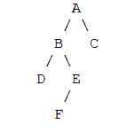
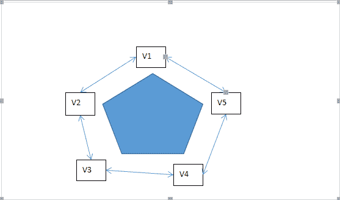
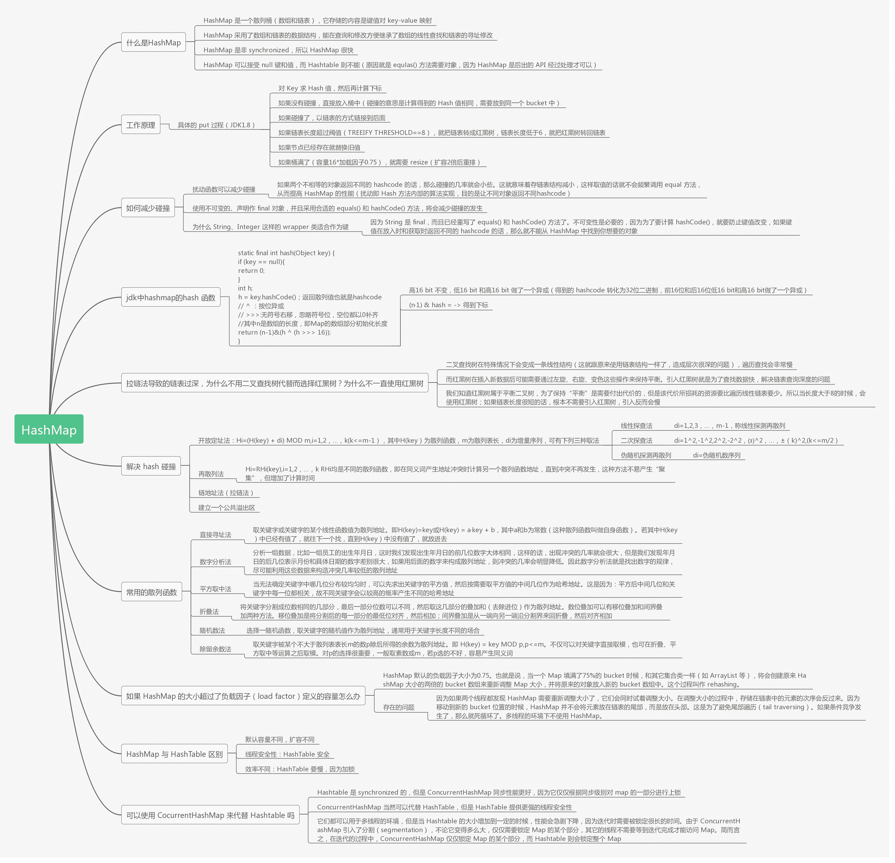
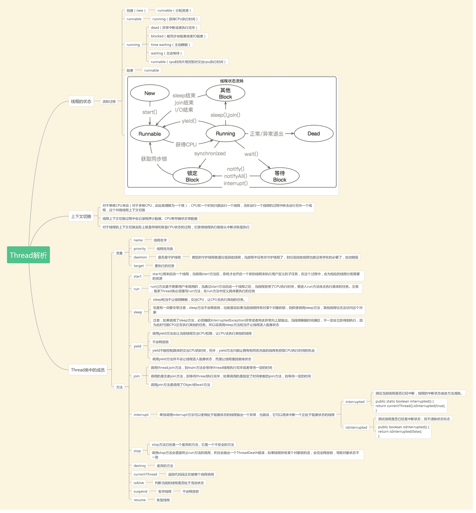
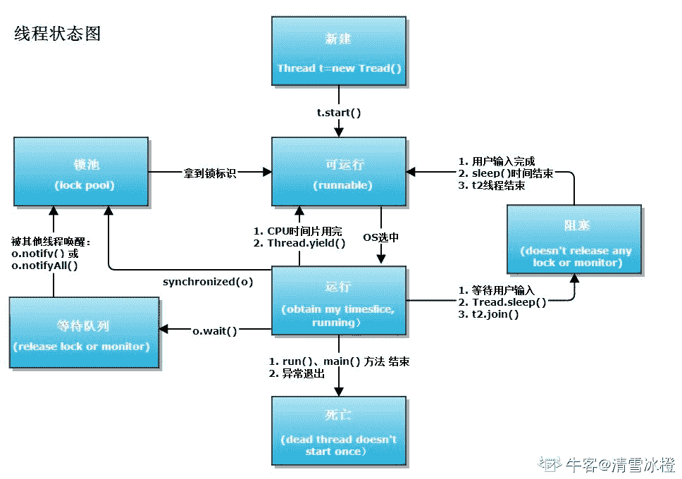
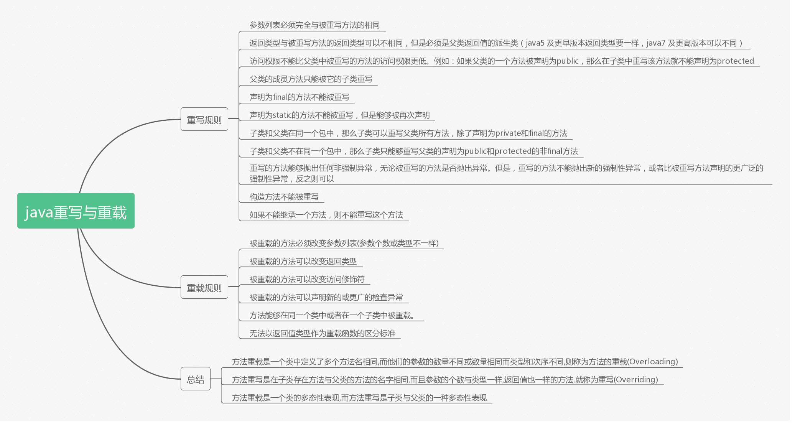

# 蘑菇街 2019 届校招-后端类岗位笔试题

## 1

若进栈序列为 1,2,3,4 假定进栈和出栈可以穿插进行，则可能的出栈序列是()

正确答案: C   你的答案: 空 (错误)

```cpp
2,4,1,3
```

```cpp
3,4,1,2
```

```cpp
1,2,3,4
```

```cpp
3,1,4,2
```

本题知识点

Java 工程师 Java 工程师 C++工程师 C++工程师 蘑菇街 蘑菇街 C++工程师 Java 工程师 蘑菇街 2019

讨论

[高崇贵](https://www.nowcoder.com/profile/1461383)

首先，栈的特点是后进先出，而且进栈和出栈穿***行，将选项一个一个模拟入栈出栈，唯一符合条件的是 C

发表于 2019-03-31 07:10:40

* * *

[龙龘 201903281622324](https://www.nowcoder.com/profile/360802483)

由于进栈和出栈可以穿***行，所以 1 进，1 出，2 进， 2 出，3 进，3 出，4 进，4 出，所以选 C。

发表于 2019-03-28 17:11:58

* * *

## 2

对某二叉树进行先序遍历的结果是 ABDEFC,中序遍历的结果是 DBFEAC，则后序遍历的结果是（）

正确答案: B   你的答案: 空 (错误)

```cpp
DBFEAC
```

```cpp
DFEBCA
```

```cpp
CFEDBA
```

```cpp
CEFBDA
```

本题知识点

Java 工程师 Java 工程师 C++工程师 C++工程师 蘑菇街 蘑菇街 C++工程师 Java 工程师 蘑菇街 2019

讨论

[chasein](https://www.nowcoder.com/profile/2885572)

对于一个选择题，由先序得出 A 是根，由中序得出最左的节点是 D，所以锁定答案 B

发表于 2019-06-19 14:10:42

* * *

[薛十三](https://www.nowcoder.com/profile/2843996)

是这样吗？

发表于 2019-03-30 20:58:02

* * *

[嘿嘿 20190625150540](https://www.nowcoder.com/profile/712089795)

二叉树：     先序: 根节点 -> 左节点 -> 右节点
    中序：左-> 根 -> 右
    后序：左 -> 右 -> 根
先序遍历的结果是 ABDEFC，A 是根。中序遍历的结果是 DBFEAC   C 是右，DB 中 B 是根，D 是左，所以结尾是 BCA

发表于 2019-11-09 12:03:42

* * *

## 3

若给定的关键字合集为{20,15,14,18,21,36,40,10}，一趟快速排序结束时，数据的排序为（）

正确答案: A   你的答案: 空 (错误)

```cpp
10,15,14,18,20,36,40,21
```

```cpp
10,15,14,18,20,40,36,21
```

```cpp
10,15,14,20,18,40,36,21
```

```cpp
15,10,14,18,20,36,40,21
```

本题知识点

Java 工程师 Java 工程师 C++工程师 C++工程师 蘑菇街 蘑菇街 C++工程师 Java 工程师 蘑菇街 2019

讨论

[16 级老腊肉](https://www.nowcoder.com/profile/955823416)

以 20 为基准，从后往前找比 20 小的数，找到与 20 交换，再从前往后找，找到比 20 大得数与 20 交换，再从后往前找，如此反复直到前后找到一个位置

发表于 2019-03-29 09:13:50

* * *

[十锁](https://www.nowcoder.com/profile/489098159)

20,15,14,18,21,36,40,1010,15,14,18,21,36,40,20 10,15,14,18,20,36,40,21

发表于 2019-04-02 18:30:46

* * *

[嘿嘿 20190625150540](https://www.nowcoder.com/profile/712089795)

以 20 为基准，比基数小的在左边，比基数大的在右边：  10 15 14 18 21 36 40 20  10 15 14 18 20 36 40 21

发表于 2019-11-09 12:06:59

* * *

## 4

设有 5000 个待排序的记录的关键字，如果需要用最快的方法选出其中最小的 10 个记录关键字，则用下列哪个方法可以达到此目的()

正确答案: B   你的答案: 空 (错误)

```cpp
快速排序
```

```cpp
堆排序
```

```cpp
归并排序
```

```cpp
插入排序
```

本题知识点

Java 工程师 Java 工程师 C++工程师 C++工程师 蘑菇街 蘑菇街 C++工程师 Java 工程师 蘑菇街 2019

讨论

[DearSummer](https://www.nowcoder.com/profile/263263310)

链接：[`www.nowcoder.com/questionTerminal/230a0186905d48939f356dcda6b3c15b?toCommentId=74727`](https://www.nowcoder.com/questionTerminal/230a0186905d48939f356dcda6b3c15b?toCommentId=74727)
来源：牛客网
首先，这个题的宗旨是以最短的时间达到**局部有序！！！！！**所以应用堆排序这样处理：

1.  取出 10 个数先进行堆排序。
2.  依次遍历剩下的 5000-10 个数，每读一个数，跟堆里最大的数进行比较，如果比堆里的最大数还大，将其舍弃读下一个数，如果比堆里的最大数小，删除最大数，将其插入到原最大数位置，并进行堆排序。
3.  重复 2 中步骤直至 5000-10 个数遍历完成。

这种做法的堆排序实际上并没有将 5000 个数全部变为有序。显然其他排序方法无法达到这样的效果。

发表于 2020-09-13 18:32:13

* * *

[16 级老腊肉](https://www.nowcoder.com/profile/955823416)

最小堆

发表于 2019-03-29 09:20:47

* * *

## 5

一个汽车公司的产品，甲厂占 40%，乙厂占 60%，甲的次品率是 1%，乙的次品率是 2%，现在抽出一件汽车时次品，问是甲生产的可能性？

正确答案: B   你的答案: 空 (错误)

```cpp
0.5
```

```cpp
0.25
```

```cpp
0.4
```

```cpp
0.15
```

本题知识点

Java 工程师 Java 工程师 C++工程师 蘑菇街 C++工程师 蘑菇街 C++工程师 Java 工程师 蘑菇街 2019

讨论

[joyh](https://www.nowcoder.com/profile/661382648)

假设有 1000 个产品，甲 400，乙 600。甲的次品 4，乙 12。已经取到次品 4/（4+12）=0.25

发表于 2019-03-30 11:01:08

* * *

[技术过硬](https://www.nowcoder.com/profile/9232985)

这种题在校招笔试中很常见，主要思想是条件概率分布。题目中说，已经抽出了一件次品，问是甲厂生产的概率是多少，很明显用甲厂生产次品的概率除以两个厂总共生产次品的概率就是需要的答案。即（4/10*1/100）/(（4/10*1/100）+(6/10*2/100))).选 B

发表于 2019-03-29 09:34:59

* * *

[嘿嘿 20190625150540](https://www.nowcoder.com/profile/712089795)

甲次品的概率  /   次品的概率 0.4*0.01 / (0.4*0.01+0.6*0.02)

发表于 2019-11-09 12:08:06

* * *

## 6

bitmap 可用于磁盘空间的管理，设某系统磁盘共有 500 块，块号从 0 到 499，第 0 字的第 0 位，表示第 0 块，第 0 字的第 1 位表示第 1 块，依次类推；若用此 bitmap 管理这 500 块的磁盘空间，当字长为 32 位时，第 i 个字第 j 位对应的块号是

正确答案: D   你的答案: 空 (错误)

```cpp
32i+j-1
```

```cpp
32j+i
```

```cpp
i+i+32
```

```cpp
32i+j
```

本题知识点

Java 工程师 C++工程师 Java 工程师 蘑菇街 C++工程师 蘑菇街 C++工程师 Java 工程师 蘑菇街 2019

讨论

[菜鸡不会写代码](https://www.nowcoder.com/profile/408303091)

根据题目中的条件可知，一个字长为 32 位，可以表示 32 个块的状态。那么，我们可以归纳得出：
第 0 块对应的是第 0 字的第 0 位，即 32×0+0；
第 1 块对应的是第 0 字的第 1 位，即 32×0+1；
……
第 31 块对应的是第 0 字的第 31 位，即 32×0+31；
第 32 块对应的是第 1 字的第 0 位，即 32×1+0；
第 33 块对应的是第 1 字的第 2 位，即 32×1+1；
……
第 63 块对应的是第 0 字的第 31 位，即 32×1+31；
那么第 i 字第 j 位对应的块号是 32×i+j。

发表于 2019-10-19 19:50:19

* * *

[joyh](https://www.nowcoder.com/profile/661382648)

带进去

发表于 2019-03-30 11:01:42

* * *

[赞就丸了](https://www.nowcoder.com/profile/618800389)

（i-1+1）x32+j

发表于 2020-02-21 21:09:15

* * *

## 7

某系统中有 13 台磁带机，K 个进程共享这些设备，每个进程最多请求使用 3 台，则系统不会死
锁的 K 值是（）

正确答案: B   你的答案: 空 (错误)

```cpp
不小于 3
```

```cpp
不大于 6
```

```cpp
不大于 13
```

```cpp
在 6 与 10 之间
```

本题知识点

Java 工程师 C++工程师 Java 工程师 蘑菇街 C++工程师 蘑菇街 C++工程师 Java 工程师 蘑菇街 2019

讨论

[仰望星空 73](https://www.nowcoder.com/profile/3491497)

最大资源申请数量 = 资源总数/线程数；（若不能整除则结果+1）3 = 13/k;k = 5

发表于 2019-03-31 18:59:42

* * *

[白云间习](https://www.nowcoder.com/profile/7776150)

每个最多请求 3 台设备，那就先给其中一个 3 台，给剩余（*）每个 2 台，2*+3=13。*=5，5+1=6。再多就不行了。

编辑于 2019-04-05 09:54:28

* * *

[YellowHaHa](https://www.nowcoder.com/profile/973227647)

假如 k == 1 系统肯定不会死锁 排除 A 和 D 如果 B 是正确的 C 肯定是正确的 排除 C 答案选 B

编辑于 2019-03-29 20:37:30

* * *

## 8

程序 P 在机器 M 上的执行时间是 20 秒，编译优化后，P 执行的指令数减少到原来的 70%，而 CPI 增加到原来的 1.2 倍，则 P 在 M 上的执行时间是（）

正确答案: A   你的答案: 空 (错误)

```cpp
16.8s
```

```cpp
14s
```

```cpp
11.8s
```

```cpp
8.4s
```

本题知识点

Java 工程师 C++工程师 蘑菇街 2019

讨论

[菜鸡🐔🐔](https://www.nowcoder.com/profile/7611329)

CPI（Cycle Per instruction）：每条指令执行时所花费的平均时钟周期数。程序 P 在机器 M 上的执行时间是 20s，由于总指令数减少到原来的 70%，但是 CPI，即每一条指令执行花费的时间增加到原来的 1.2 倍，故总执行时间为 t = 20 * 70% * 1.2 s = 16.8s。

发表于 2019-04-16 09:55:56

* * *

[子适](https://www.nowcoder.com/profile/4186419)

CPI（ Clock cycle Per Instruction）表示每条计算机指令执行所需的时钟周期，有时简称为指令的平均周期数。

发表于 2019-03-30 15:49:43

* * *

[chasein](https://www.nowcoder.com/profile/2885572)

这个题用排除法

发表于 2019-06-19 14:31:43

* * *

## 9

在 java 中，要使某个类能被同一个包中的其他类访问，但不能被这个包以外的类访问，可以( )

正确答案: A   你的答案: 空 (错误)

```cpp
让该类不使用任何关键字
```

```cpp
使用 private 关键字
```

```cpp
使用 protected 关键字
```

```cpp
使用 public 关键字
```

本题知识点

Java 工程师 C++工程师 蘑菇街 Java 工程师 C++工程师 蘑菇街 C++工程师 Java 工程师 蘑菇街 2019

讨论

[王大昭](https://www.nowcoder.com/profile/685110503)

**（1）**对于 public 修饰符，它具有最大的访问权限，可以访问任何一个在 CLASSPATH 下的类、接口、异常等。它往往用于对外的情况，也就是对象或类对外的一种接口的形式。

**（2）**对于 protected 修饰符，它主要的作用就是用来保护子类的。它的含义在于子类可以用它修饰的成员，其他的不可以，它相当于传递给子类的一种继承的东西。

**（3）**对于 default 来说，有点的时候也成为 friendly（友员），它是针对本包访问而设计的，任何处于本包下的类、接口、异常等，都可以相互访问，即使是父类没有用 protected 修饰的成员也可以。

**（4）**对于 private 来说，它的访问权限仅限于类的内部，是一种封装的体现，例如，大多数的成员变量都是修饰符为 private 的，它们不希望被其他任何外部的类访问。

发表于 2019-03-31 09:40:36

* * *

[16 级老腊肉](https://www.nowcoder.com/profile/955823416)

默认 default，包内

发表于 2019-03-29 09:31:39

* * *

## 10

在数据库系统中，视图可以提供数据的？

正确答案: C   你的答案: 空 (错误)

```cpp
并发性
```

```cpp
完善性
```

```cpp
安全性
```

```cpp
可恢复性
```

本题知识点

Java 工程师 C++工程师 蘑菇街 Java 工程师 C++工程师 蘑菇街 C++工程师 Java 工程师 蘑菇街 2019

讨论

[仰望星空 73](https://www.nowcoder.com/profile/3491497)

数据库系统概论（第五版）视图的作用：

1.  视图能够简化用户的操作。
2.  视图使用户能以多种角度看待同一数据。
3.  视图对重构数据库提供了一定程度的逻辑独立性。
4.  视图能够对机密数据提供安全保护。
5.  适当利用视图可以更清晰的表达查询。

发表于 2019-03-31 19:07:34

* * *

[阳光下的米雪](https://www.nowcoder.com/profile/916856937)

不同的用户定义不同的视图，把数据对象限制在一定的范围内，也就是说，可以通过视图机制把要保密的数据对无权存取的用户隐藏起来，从而自动的对数据提供一定程度的安全保护。

发表于 2019-03-30 14:38:27

* * *

## 11

冯 · 诺依曼计算机中指令和数据均以二进制形式存放在存储器中， CPU 区分它们的依据是（）

正确答案: C   你的答案: 空 (错误)

```cpp
指令操作码的译码结果
```

```cpp
指令和数据的寻址方式
```

```cpp
指令周期的不同阶段
```

```cpp
指令和数据所在的存储单元
```

本题知识点

Java 工程师 C++工程师 蘑菇街 2019

讨论

[16 级老腊肉](https://www.nowcoder.com/profile/955823416)

通常完成一条指令可分为取指阶段、分析阶段和执行阶段。在取指阶段通过访问存储器可将指令取出；在执行阶段通过访问存储器可将操作数取出。这样，虽然指令和数据都是以 0、1 代码形式存在存储器中，但 CPU 可以判断出在取指阶段访存取出的 0、1 代码是指令；在执行阶段访存取出的 0、1 代码是数据。 计算机区分指令和数据有以下 2 种方法：  通过不同的时间段来区分指令和数据，即在取指令阶段（或取指微程序）取出的为指令，在执行指令阶段（或相应微程序）取出的即为数据。  通过地址来源区分，由 PC 提供存储单元地址的取出的是指令，由指令地址码部分提供存储单元地址的取出的是操作数。

发表于 2019-03-29 09:47:01

* * *

[菜鸡真的不配有 offer](https://www.nowcoder.com/profile/96233020)

考查指令执行过程。
通常完成一条指令可分为取指阶段和执行阶段。在取指阶段通过访问存储器可将指令取出；在执行阶段通过访问存储器可将操作数取出。这样，虽然指令和数据都是以二进制代码形式存放在存储器中，但 CPU 可以判断在取指阶段访问存储器取出的二进制代码是指令；在执行阶段取出的二进制代码是数据。指令操作码的译码结果，得到的是本条指令要执行什么操作，如加法，减法等。指令和数据的寻址方式是不足以区分取出的内容是指令还是数据的。指令和数据都是以二进制的形式存储在主存单元中的，因此，根据指令和数据所在的存储单元是不能进行区分的。

发表于 2019-11-07 15:46:00

* * *

## 12

一个有 n 个顶点 n 条边的无向图一定是（）

正确答案: A   你的答案: 空 (错误)

```cpp
有环的
```

```cpp
连通的
```

```cpp
不连通的
```

```cpp
无环的
```

本题知识点

Java 工程师 C++工程师 蘑菇街 Java 工程师 C++工程师 蘑菇街 C++工程师 Java 工程师 蘑菇街 2019

讨论

[阳光下的米雪](https://www.nowcoder.com/profile/916856937)

如果一个无向图有 n 个顶点和 n-1 条边，可以使它连通但没有环(即生成树)，但再加一条边，在不考虑重边的情形下，就必然会构成环。

发表于 2019-03-30 14:42:04

* * *

[水底银河](https://www.nowcoder.com/profile/535703605)

两个分开的三角形，不连通

发表于 2019-06-22 18:02:31

* * *

## 13

设无向图 G 中有 n 个顶点 e 条边 ，则其对应的邻接表中的表头结点和表结点的个数分别为（）

正确答案: D   你的答案: 空 (错误)

```cpp
n,e
```

```cpp
e,n
```

```cpp
2n,e
```

```cpp
n,2e
```

本题知识点

Java 工程师 C++工程师 蘑菇街 Java 工程师 C++工程师 蘑菇街 C++工程师 Java 工程师 蘑菇街 2019

讨论

[shakker2c](https://www.nowcoder.com/profile/925777793)

对于无向图，其每条边没有方向。所以构建邻接表时，每个顶点都是其邻接点的头结点，所以邻接表的表头结点就是 n 个。邻接表的表结点为边数的 2 倍，即 2e。

发表于 2019-04-03 10:55:33

* * *

## 14

设某散列表的长度为 100，散列函数 H(k)=k % P，则 P 通常情况下最好选择( )

正确答案: B   你的答案: 空 (错误)

```cpp
99
```

```cpp
97
```

```cpp
91
```

```cpp
93
```

本题知识点

Java 工程师 C++工程师 蘑菇街 Java 工程师 C++工程师 蘑菇街 C++工程师 Java 工程师 蘑菇街 2019

讨论

[如此 201809271455765](https://www.nowcoder.com/profile/291246999)

首先明确[哈希函数](https://www.baidu.com/s?wd=%E5%93%88%E5%B8%8C%E5%87%BD%E6%95%B0&tn=SE_PcZhidaonwhc_ngpagmjz&rsv_dl=gh_pc_zhidao)的除留余法的 P 选择小于长度的最大质数比较好，所以 C 质数也就是素数，就是除了 1 和本身不能让其他除尽的

发表于 2019-03-27 15:41:28

* * *

[程序猿 Go 师傅](https://www.nowcoder.com/profile/242025553)

以下是 HashMap 的性质，可以看常用的散列函数-除留余数法块

编辑于 2019-10-21 16:58:32

* * *

[清雪冰橙](https://www.nowcoder.com/profile/514769)

我咋记得是满足 4*k+3 的最大质数... = =然后选了 c... 

发表于 2020-03-05 23:49:21

* * *

## 15

设一个顺序有序表 A[1:14]中有 14 个元素，则采用二分法查找元素 A[4]的过程中比较元素的顺序为( )

正确答案: C   你的答案: 空 (错误)

```cpp
A[1]，A[2]，A[3]，A[4]
```

```cpp
A[1]，A[14]，A[7]，A[4]
```

```cpp
A[7]，A[3]，A[5]，A[4]
```

```cpp
A[7]，A[5]，A[3]，A[4]
```

本题知识点

Java 工程师 C++工程师 Java 工程师 蘑菇街 C++工程师 蘑菇街 C++工程师 Java 工程师 蘑菇街 2019

讨论

[阳光下的米雪](https://www.nowcoder.com/profile/916856937)

（1+14）/ 2 = 7 --> 1 ~ 6 （1+6）/ 2 = 3 --> 4～6 （4+6）/ 2 = 5 --> 4 ~ 5 （4+5）/ 2 = 4

发表于 2019-03-30 14:48:16

* * *

## 16

Linux 文件权限一共 10 位长度，分成四段，第三段表示的内容是()

正确答案: C   你的答案: 空 (错误)

```cpp
文件类型
```

```cpp
文件所有者的权限
```

```cpp
文件所有者所在组的权限
```

```cpp
其他用户的权限
```

本题知识点

Java 工程师 Java 工程师 C++工程师 C++工程师 蘑菇街 蘑菇街 C++工程师 Java 工程师 蘑菇街 2019

讨论

[16 级老腊肉](https://www.nowcoder.com/profile/955823416)

ABCD 就是 1234 段

发表于 2019-03-29 09:48:44

* * *

## 17

下面的代码段

```cpp
int main() {
    int a = 7, b = 8, *p, *q, *r;
    p = &a;
    q = &b;
    r = p;
    p = q;
    q = r;
    printf("%d,%d,%d,%d\n", *p, *q, a, b);
}
```

程序运行后的输出结果是(   )

正确答案: C   你的答案: 空 (错误)

```cpp
8,7,8,7
```

```cpp
7,8,7,8
```

```cpp
8,7,7,8
```

```cpp
7,8,8,7
```

本题知识点

C++工程师 蘑菇街 2019 C 语言

讨论

[jiumeng](https://www.nowcoder.com/profile/915860712)

*   ```cpp
    int main()
    {
    int a=7,b=8,*p,*q,*r;
    p=&a;q=&b;//这时*p=7，*q=8，p 指向 a，q 指向 b
    r=p;//这时*p=7，*q=8，*r=7，r 指向 a
    p=q;//这时 p 指针被修改，指向了 b，因为 q 是指向 b 的；*p=8，*q=8，*r=7
    q=r;//这时 q 指针被修改，指向了 a，因为 r 是指向 a 的；*p=8，*q=7，*r=7
    printf("%d,%d,%d,%d\n",*p,*q,a,b);//打印 8，7，7，8
    return 0;
    } 
    ```

发表于 2020-08-03 10:29:52

* * *

[阳光下的米雪](https://www.nowcoder.com/profile/916856937)

以答案的理解来说，就是指针的位置变了，a,b 的值都不变

发表于 2019-03-30 14:53:26

* * *

[牛客 880491749 号](https://www.nowcoder.com/profile/880491749)

q 和 p 所指向的地址变了，地址的值没变。

发表于 2020-08-05 23:23:55

* * *

## 18

变量 a 是一个 64 位有符号的整数，初始值用 16 进制表示为：0x7FFFFFFFFFFFFFFF;变量 b 是一个 64 位有符号的整数，初始值用 16 进制表示为：0x8000000000000000。则 a+b 的结果用 10 进制表示为多少？

正确答案: B   你的答案: 空 (错误)

```cpp
1
```

```cpp
-1
```

```cpp
0
```

```cpp
2⁶³+2⁶²+…+2²+2¹+2⁰
```

本题知识点

Java 工程师 C++工程师 Java 工程师 蘑菇街 C++工程师 蘑菇街 C++工程师 Java 工程师 蘑菇街 2019

讨论

[子鱼 001](https://www.nowcoder.com/profile/958255)

计算机变量以补码形式存放，于是 a+b 为补码相加：  0x7FFFFFFFFFFFFFFF+0x8000000000000000=0xFFFFFFFFFFFFFFFF 而(0xFFFFFFFFFFFFFFFF)[补]化为原码，即第一位符号位不变，其他位取反后末位加 1，得原码为 0x8000000000000001，最后转换为 10 进制即为-1

发表于 2019-03-31 20:17:12

* * *

[OnlyJanuary](https://www.nowcoder.com/profile/98078704)

0x7FFFFFFFFFFFFFFF + 1 = 0X8000000000000000，则

a + b = 0X8000000000000000 - 1 + 0x8000000000000000 = -1

编辑于 2019-08-13 14:42:17

* * *

[张友印](https://www.nowcoder.com/profile/346051280)

二进制表示溢出，全 1 时表示-1。

发表于 2019-03-29 09:28:52

* * *

## 19

地址“128.10.0.0”是 （） 地址

正确答案: B   你的答案: 空 (错误)

```cpp
a 类
```

```cpp
b 类
```

```cpp
c 类
```

```cpp
d 类
```

本题知识点

Java 工程师 C++工程师 蘑菇街 2019

讨论

[仰望星空 73](https://www.nowcoder.com/profile/3491497)

128.10.0.0 转化为 2 进制为 1000 0000.0000 1010.0000 0000.0000 00000a 类地址 开头为 0b 类：10c:110d:1110

发表于 2019-03-31 19:18:18

* * *

[是瑶瑶公主呀](https://www.nowcoder.com/profile/592649258)

A 类 IP 地址的地址范围是 1.0.0.0 到 127.255.255.255B 类 IP 地址地址范围 128.0.0.0-191.255.255.255[C 类 IP 地址](https://www.baidu.com/s?wd=C%E7%B1%BBIP%E5%9C%B0%E5%9D%80&tn=SE_PcZhidaonwhc_ngpagmjz&rsv_dl=gh_pc_zhidao)范围 192.0.0.0-223.255.255.255D 类 IP 地址在历史上被叫做多播地址(multicast address)，范围从 224.0.0.0 到 239.255.255.255。

发表于 2019-10-28 17:52:29

* * *

## 20

与十进制数 28.5625 相等的四进制数是()

正确答案: B   你的答案: 空 (错误)

```cpp
121.30
```

```cpp
130.21
```

```cpp
121.31
```

```cpp
222.32
```

本题知识点

Java 工程师 C++工程师 蘑菇街 Java 工程师 C++工程师 蘑菇街 C++工程师 Java 工程师 蘑菇街 2019

讨论

[阳光下的米雪](https://www.nowcoder.com/profile/916856937)

整数部分除 4 取余，小数部分乘 4 取整数部分

发表于 2019-03-30 15:11:38

* * *

[水底银河](https://www.nowcoder.com/profile/535703605)

1*4²+3*4¹+0+2*4^-1+1*4^-2

发表于 2019-06-22 20:41:22

* * *

## 21

下面关于操作系统的叙述中错误的是（）

正确答案: A B D   你的答案: 空 (错误)

```cpp
从响应时间的角度来看，实时系统与分时系统无本质差别
```

```cpp
多道运行是现代操作系统的特征之一，它是指宏观和微观上都并行
```

```cpp
操作系统的特征是并行性、共享性、虚拟性和不确定性
```

```cpp
在分时系统中，响应时间≈时间片×用户数，因此只要时间片足够小其响应时间一定能改善。
```

本题知识点

Java 工程师 C++工程师 蘑菇街 2019

讨论

[张友印](https://www.nowcoder.com/profile/346051280)

实时操作系统是当外界事件或数据产生时，能够接受并以足够快的速度予以处理。即实时系统是保证在一定的时间限制内完成特定操作。分时操作系统：“分时”是指多个用户分享使用同一台计算机。即分时操作系统接受到每个用户的命令后，采用时间片轮转方式处理服务请求。虽然分时系统具有多路性、交互性、“独占”性和及时性的特点，但及时性也只是针对多用户而言，及时在于不会延迟执行该用户的指令，而响应时间和实时操作系统存在根本上的不同。所以**A 错误**多道程序设计是在内存中同时存放几道相互独立的程序，在管理程序的控制下穿插运行，两个或两个以上的程序在计算机系统中同处于开始到结束之间的状态，共享计算机资源。对于多 cpu 系统，可以认为是宏观和微观上都并行，而对于单核系统，仅仅是宏观上并行，在微观上仍然是穿插运行，不可能并行，所以绝对的说法宏观和微观都并行是错误的。**B 错误**操作系统的四个基本特征：*并发，共享，异步，虚拟*。**C 正确{经过大家纠正，这个选项应该是正确的。。。}**同样，分时系统定义，已经讲过，按照时间片轮转的方式处理各用户请求。当时间片减小时，如果在该时间片内能够完成用户请求的指令，那么可以缩短等待时间。而如果时间片不足以完成指令的请求时，等待的时间反而很有可能会增大。所以并不是越小等待时间越长。**D 错误{系统答案该选项错误，应该就是因为考虑极限情形，时间片不足以完成一项指令，那么就永远不可能响应了。}**

编辑于 2019-04-16 17:18:09

* * *

[XIX](https://www.nowcoder.com/profile/617955752)

这题...都错的吧

发表于 2019-06-24 14:06:30

* * *

[腹黑 gg](https://www.nowcoder.com/profile/7970791)

C 不应该是并发性吗？

发表于 2019-04-05 22:02:03

* * *

## 22

下面有关线程的说法错误的是（）

正确答案: A D   你的答案: 空 (错误)

```cpp
每个线程有自己独立的地址空间
```

```cpp
耗时的操作使用线程，提高应用程序响应
```

```cpp
多 CPU 系统中，使用线程提高 CPU 利用率
```

```cpp
线程包含 CPU 现场，可以独立执行程序
```

本题知识点

Java 工程师 C++工程师 蘑菇街 2019

讨论

[菜鸡🐔🐔](https://www.nowcoder.com/profile/7611329)

线程是进程中的一个实体，是被系统独立分配和调度的基本单位。线程基本上不拥有资源，只拥有一点运行中必不可少的资源（如程序计数器、一组寄存器和栈），它可与同属一个进程的其他线程共享进程所拥有的全部资源。

发表于 2019-04-16 16:23:29

* * *

[YellowHaHa](https://www.nowcoder.com/profile/973227647)


发表于 2019-03-29 20:45:04

* * *

## 23

下列关于 java 中的 sleep() 和 wait()方法的区别描述正确的是？

正确答案: A B C   你的答案: 空 (错误)

```cpp
wait()方法属于 Object 类，sleep()属于 Thread 类
```

```cpp
调用 wait()方法的时候，线程会放弃对象锁
```

```cpp
调用 sleep()方法的过程中，线程不会释放对象锁
```

```cpp
sleep()方法导致了程序暂停执行指定的时间，让出 cpu 给其他线程
```

本题知识点

Java 工程师 C++工程师 蘑菇街 2019

讨论

[程序猿 Go 师傅](https://www.nowcoder.com/profile/242025553)

有关 Thread 的相关可以看下图

编辑于 2019-10-21 16:58:26

* * *

[清雪冰橙](https://www.nowcoder.com/profile/514769)

sleep 并不会让出 cpu，而只占着坑等时间片到了才会让出。。。 wait 才会让出 cpu。。

发表于 2020-03-05 23:59:09

* * *

[童心未泯丶](https://www.nowcoder.com/profile/903032739)

D 选项也是对的吧 保留观点

发表于 2019-04-08 16:17:16

* * *

## 24

下面哪些不是 java8 的新特性

正确答案: C   你的答案: 空 (错误)

```cpp
lambda 表达式
```

```cpp
函数式接口
```

```cpp
jdk 模块化
```

```cpp
Stream API
```

本题知识点

Java 工程师 C++工程师 蘑菇街 2019

讨论

[小粑 123](https://www.nowcoder.com/profile/2255257)

jdk 模块化是 jdk9 中的新特性

发表于 2019-03-27 23:18:48

* * *

[古时的风筝](https://www.nowcoder.com/profile/958230288)

写了一篇关于 Stream 的详细使用文字。[`blog.nowcoder.net/n/cac8f2e8eebf46c29932ffa2c23e37d0`](https://blog.nowcoder.net/n/cac8f2e8eebf46c29932ffa2c23e37d0)

发表于 2021-01-06 11:01:38

* * *

[菜鸡🐔🐔](https://www.nowcoder.com/profile/7611329)

Java 9 新特性来临——模块化

发表于 2019-04-16 16:24:46

* * *

## 25

下列关于视图的说法正确的是（）

正确答案: A B D   你的答案: 空 (错误)

```cpp
视图是从一个或多个基本表导出的表，它是虚表
```

```cpp
某一用户可以定义若干个视图
```

```cpp
视图一经定义就可以和基本表一样被查询、删除和更新
```

```cpp
视图可以用来定义新的视图
```

本题知识点

Java 工程师 C++工程师 蘑菇街 2019

讨论

[正版沨](https://www.nowcoder.com/profile/6069573)

> 摘自《MySQL 必知必会》P161

通常，视图是可更新的（即，可以对它们使用 INSERT 、 UPDATE 和 DELETE ）。更新一个视图将更新其基表（可以回忆一下，视图本身没有数据）。如果你对视图增加或删除行，实际上是对其基表增加或删除行。但是，并非所有视图都是可更新的。基本上可以说，如果 MySQL 不能正确地确定被更新的基数据，则不允许更新（包括插入和删除）。这实
际上意味着，如果视图定义中有以下操作，则不能进行视图的更新：
  分组（使用 GROUP BY 和 HAVING ）；
  联结；
  子查询；
  并；
  聚集函数（ Min() 、 Count() 、 Sum() 等）；  DISTINCT；
  导出（计算）列。

发表于 2019-04-17 15:37:35

* * *

## 26

下面关于存储过程的描述正确的是？

正确答案: A B D   你的答案: 空 (错误)

```cpp
存储过程实际上是一组 T-SQL 语句
```

```cpp
存储过程预先被编译存放在服务器的系统中
```

```cpp
存储过程独立于数据库而存在
```

```cpp
存储过程可以完成某一特定的业务逻辑
```

本题知识点

Java 工程师 C++工程师 蘑菇街 2019

讨论

[菜鸡🐔🐔](https://www.nowcoder.com/profile/7611329)

存储过程（Stored Procedure）是在大型数据库系统中，一组为了完成特定功能的 SQL 语句集，存储在数据库中，经过第一次编译后调用不需要再次编译，用户通过指定存储过程的名字并给出参数（如果该存储过程带有参数）来执行它。存储过程是数据库中的一个重要对象。

发表于 2019-04-16 16:35:02

* * *

## 27

关于系统调用的描述中,错误的是()

正确答案: A B   你的答案: 空 (错误)

```cpp
系统调用中被调用的过程运行在"用户态"中
```

```cpp
系统调用把应用程序的请求传输给系统 io 模块执行
```

```cpp
利用系统调用能够得到操作系统提供的多种服务
```

```cpp
系统调用保护了一些只能在内核模式执行的操作指令
```

本题知识点

Java 工程师 C++工程师 蘑菇街 2019

讨论

[正义之拳](https://www.nowcoder.com/profile/451395892)

系统调用把应用程序的请求传输给系统核心态执行

发表于 2019-04-03 23:10:48

* * *

[源 201902152219372](https://www.nowcoder.com/profile/78332277)

这个题就在扯淡

发表于 2019-04-08 19:48:31

* * *

## 28

在 Java 中，以下关于方法重载和方法重写描述正确的是？

正确答案: D   你的答案: 空 (错误)

```cpp
方法重载和方法的重写实现的功能相同
```

```cpp
方法重载出现在父子关系中，方法重写是在同一类中
```

```cpp
方法重载的返回值类型必须一致，参数项必须不同
```

```cpp
方法重写的返回值类型必须相同或相容
```

本题知识点

Java 工程师 C++工程师 蘑菇街 2019

讨论

[nibuh](https://www.nowcoder.com/profile/199693126)

🌚一直以为“不定项选择题”是“多选题”，排除 AB 直接选了 CD，我是真的菜

发表于 2019-03-27 17:12:26

* * *

[程序猿 Go 师傅](https://www.nowcoder.com/profile/242025553)

有关 java 的重写与重载可以看下图

编辑于 2019-10-21 16:58:20

* * *

[序列化持久化](https://www.nowcoder.com/profile/1725842)

重写方法的返回值必须是相同类型或者是派生类，这和相同或相容矛盾吗

发表于 2019-08-15 18:56:00

* * *

## 29

下面哪些页面调度算法,当进程分配到的页面数增加时,缺页中断的次数可能增加也可能减少

正确答案: A   你的答案: 空 (错误)

```cpp
FIFO 算法
```

```cpp
LRU 算法
```

```cpp
Clock 算法
```

```cpp
LFU 算法
```

本题知识点

Java 工程师 C++工程师 蘑菇街 2019

讨论

[子鱼 001](https://www.nowcoder.com/profile/958255)

先进先出（FIFO）页面置换算***产生当所分配的物理块数增大而页故障数不减反增的异常现象，这是由 Belady 于 1969 年发现，故称为 Belady 异常。记住只有 FIFO 算法可能出现 Belady 异常，可模拟 FIFO 算法进行验证。

发表于 2019-03-31 20:01:00

* * *

## 30

下列关于轮询任务调度和可抢占式调度区别描述错误的是？

正确答案: A B   你的答案: 空 (错误)

```cpp
抢占式调度优点是其简洁性，它无需记录当前所有连接的状态
```

```cpp
轮询调度利于后面的请求及时得到响应
```

```cpp
抢占式调度有利于后面的高优先级的任务也能及时得到响应
```

```cpp
抢占式调度实现相对较复杂且可能出现低优先级的任务长期得不到调度
```

本题知识点

Java 工程师 C++工程师 蘑菇街 2019

讨论

[西伯利亚第一胖虎](https://www.nowcoder.com/profile/857949422)

轮询调度：每一次把来自用户的请求轮流分配给内部中的服务器，从 1 开始，直到 N(内部服务器个数)，然后重新开始循环。只有在当前任务主动放弃 CPU 控制权的情况下（比如任务挂起），才允许其他任务（包括高优先级的任务）控制 CPU。其优点是其简洁性，它无需记录当前所有连接的状态，所以它是一种无状态调度。但不利于后面的请求及时得到响应。

抢占式调度：允许高优先级的任务打断当前执行的任务，抢占 CPU 的控制权。这有利于后面的高优先级的任务也能及时得到响应。但实现相对较复杂且可能出现低优先级的任务长期得不到调度。

发表于 2019-04-09 21:54:21

* * *

[summerrr](https://www.nowcoder.com/profile/5030955)

```cpp
轮询调度有利于优先级低的得到响应。
```

发表于 2019-03-29 16:09:21

* * *

## 31

有一个 X*Y 的网格，小团要在此网格上从左上角到右下角，只能走格点且只能向右或向下走。请设计一个算法，计算小团有多少种走法。给定两个正整数 int x,int y，请返回小团的走法数目。

本题知识点

Java 工程师 C++工程师 蘑菇街 测试工程师 动态规划 数学 2019

讨论

[梦秋音](https://www.nowcoder.com/profile/3416408)

```cppimport java.util.Scanner;
public class Main{
    public static void main(String[] args) {
        Scanner sc = new Scanner(System.in);
        int x = sc.nextInt();
        int y = sc.nextInt();
        System.out.println(f(x,y));
    }

    public static int f(int x,int y) {
        if(x==1) return y+1;
        if(y==1) return x+1;
        return f(x-1,y)+f(x,y-1);
    }
}
```

发表于 2019-03-29 19:32:21

* * *

[欢欢喜喜鸭老板](https://www.nowcoder.com/profile/484542006)

#include <stdio.h>int main(){
    int n,m;
    scanf("%d%d",&n,&m);
    int s[n+1][m+1];
    for(int i=0;i<=n;i++)
        s[i][0] = 1;
    for(int j=0;j<=m;j++)
        s[0][j] = 1;
    for(int i=1;i<=n;i++)
    {
        for(int j=1;j<=m;j++)
        {
                s[i][j] = s[i-1][j] + s[i][j-1];
        }
    }
    printf("%d",s[n][m]);
    return 0;
}

发表于 2019-08-23 11:25:46

* * *

[十年单身换一个字节 SP](https://www.nowcoder.com/profile/3240278)

这个是一个很简单的动态规划，4399 笔试的时候也考了这个题目。就是先把边界设为 1，然后直接每次递推，递推公式为：a[i][j]=a[i+1][j]+a[i+1][j]，但是这个个题目有一个坑，他输入 1,1 的时候输出为 2，那就意味着，长宽都要加 1.具体代码如下：

```cpp
#include<bits/stdc++.h>
```

```cpp
usingnamespacestd;
inta[11][11]={0};
intmain(){
    intm,n;
    cin>>m>>n;
    if(m==0||n==0){
        cout<<1<<endl;
        return0;
    }else{
        for(inti=0;i<=m;i++)a[i][n]=1;
        for(inti=0;i<=n;i++)a[m][i]=1;
        for(inti=m-1;i>=0;i--){
            for(intj=n-1;j>=0;j--){
                a[i][j]=a[i][j+1]+a[i+1][j];
            }
        }
        cout<<a[0][0]<<endl;
    }
    return0;
}

```

发表于 2019-03-27 20:31:02

* * *

## 32

Given a string **s** and a dictionary of words **dict**, add spaces in **s** to construct a sentence where each word is a valid dictionary word.
Return all such possible sentences.

本题知识点

Java 工程师 C++工程师 蘑菇街 字符串 *模拟 穷举 2019* *讨论

[Daxong](https://www.nowcoder.com/profile/4082427)

这题的测试用例输入是个迷。。。

发表于 2019-03-28 16:38:45

* * *

[浪潮逆转啦](https://www.nowcoder.com/profile/878106553)

思路讲解和代码实现：[`blog.csdn.net/Leeycw96/article/details/89336456`](https://blog.csdn.net/Leeycw96/article/details/89336456)

发表于 2019-04-16 17:23:39

* * *

[清雪冰橙](https://www.nowcoder.com/profile/514769)

前缀树+dfs。。。需要吐槽的是：1\. 输入格式问题(我吐了..2\. 输出格式，正向扫描的小伙伴们肯定会 wa 在题目给的测试样例，需要对所有的结果句子取个反才能 A 掉.. （为什么题目不描述清楚？

```cpp
# include<iostream>
(720)#include<cstring>
# include<map>
(747)# include<algorithm>
# include<vector>
(721)# include<cmath>
#include <sstream>
using namespace std;

struct tri_node{
    tri_node * children[26];
    bool isWord;
    tri_node(){
        for(int i=0; i<26; ++i)
            children[i] = NULL;
        isWord = false;
    }
};

void insert( tri_node* rt, string word ){
    int i=0;
    while(i<word.size()){
        if (rt->children[word[i]-'a']==NULL)
            rt->children[word[i]-'a'] = new tri_node();
        rt = rt->children[word[i]-'a'];
        ++i;
    }
    rt->isWord = true;
}

bool search( tri_node * rt, string word ){
    int i=0;
    while(i<word.size()){
        if ( !rt->children[word[i]-'a'] )
            return false;
        rt = rt->children[word[i]-'a'];
        ++i;
    }
    return rt && rt->isWord;
}

vector<string> split( string ip, char c ){
    if ( ip.size()==0 || (ip.size()==1 && ip[0]==c) ) return {};
    istringstream  iss(ip);
    vector<string> res;
    string tmp;
    while( getline(iss, tmp, c) ){
        res.push_back(tmp);
    }
    return res;
}

void dfs(tri_node* rt , string s, int i, vector<string>&res, string cur){
    string f = "";
    if (i>=s.size() && cur.size()>0){
        cur.pop_back();
        res.push_back(cur);
        return;
    }
    for(int t=i; t<s.size(); ++t){
        f+=s[t];
        if (search(rt, f)){
            // 找到这个单词了
            dfs(rt, s, t+1, res, cur +f+ ' ');
        }
    }
}

int main(void){
    int n,m;
    string s, dic;
    getline(cin, s);
    getline(cin,dic);
    s = split(s, '\"')[1];
    vector<string> tmp = split(dic,'\"');
    vector<string> words;
    for(int i=1; i<tmp.size(); i+=2){
        words.push_back(tmp[i]);
    }
    tri_node * rt = new tri_node();

    for(auto&word:words)
        insert(rt, word);

    vector<string> res;
    dfs(rt, s, 0, res,"");
    reverse(res.begin(), res.end());

    cout<<"[";
    for(int i=0; i<res.size(); ++i){
        cout<<res[i];
        if (i+1<res.size())
            cout<<", ";
    }
    cout<<"]"<<endl;

    return 0;
}
```

发表于 2020-03-05 23:35:13

* * **</stdio.h>