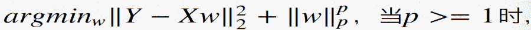
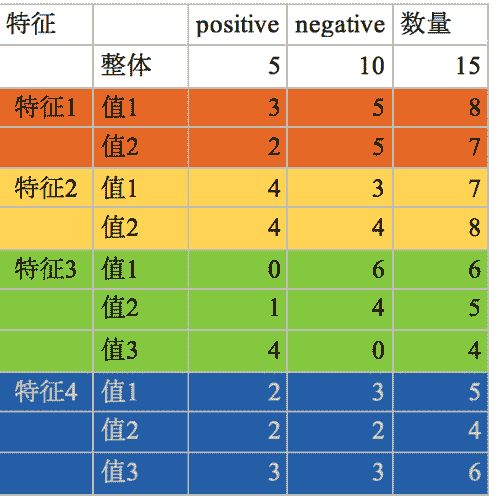
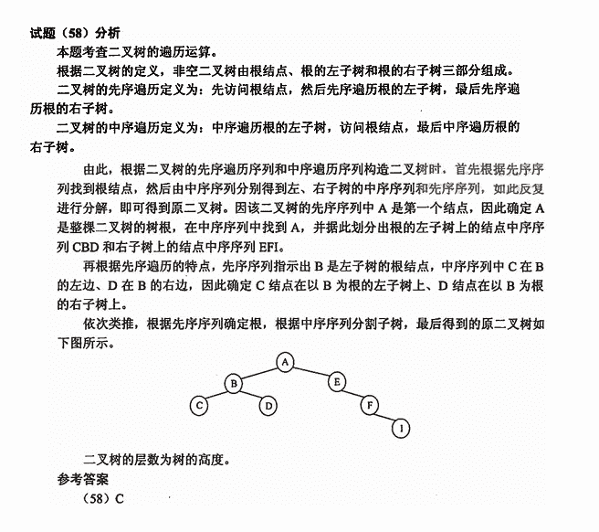

# 蘑菇街 2019 届校招-算法类笔试题

## 1

恰有两个小孩的家庭，若已知一家有一个男孩，则这家小孩都是男孩的概率为？

正确答案: A   你的答案: 空 (错误)

```cpp
1/3
```

```cpp
1/4
```

```cpp
1/6
```

```cpp
1/2
```

本题知识点

算法工程师 蘑菇街 算法工程师 蘑菇街 2019

讨论

[二十马赫](https://www.nowcoder.com/profile/50854161)

主要看题目 一个男孩 说的不是头胎男孩，而是两个孩子中一个是男孩。（A 男 B 男，A 女 B 男，A 女 B 女，A 男 B 女）
四种情况平均分配概率 每个 25%
所以因为知道有一个男孩儿 可以直接剔除 A 女 B 女的这一选项 所以 就剩下平均等概率发生的 三种

发表于 2019-04-10 10:26:03

* * *

[大华 20180913213321](https://www.nowcoder.com/profile/697941871)

不要从生物角度看这道题。

发表于 2019-03-31 22:21:18

* * *

[lyndonlcf](https://www.nowcoder.com/profile/9031155)

逆概公式；

> P(全男|一男)=P(全男)P(一男|全男)/P(一男)；

2 个孩子的情况有四种可能：男男、男女、女男、女女；
全部男孩的情况下有一个男孩的概率是 1；
而 P(一男)=;3/4；带进去就可以；得 1/3；

发表于 2019-03-27 16:25:13

* * *

## 2

操作系统实现内存管理的常使用的数据结构为？

正确答案: D   你的答案: 空 (错误)

```cpp
栈
```

```cpp
队列
```

```cpp
数组
```

```cpp
链表
```

本题知识点

算法工程师 蘑菇街 算法工程师 蘑菇街 2019

讨论

[邱先生](https://www.nowcoder.com/profile/6623790)

不是栈吗？难道我记错了？有小伙伴能给个答案吗？

发表于 2019-04-18 00:34:19

* * *

[牛客网弟中弟](https://www.nowcoder.com/profile/5002895)

操作系统实现内存管理的常用数据结构是链表

发表于 2019-03-30 10:26:02

* * *

[mzchz](https://www.nowcoder.com/profile/426814935)

位图

链表

发表于 2019-03-28 11:02:06

* * *

## 3

正负样本采样比从 1:1 到 1:5, auc 的变化会:

正确答案: D   你的答案: 空 (错误)

```cpp
变大
```

```cpp
变小
```

```cpp
不确定
```

```cpp
不变
```

本题知识点

算法工程师 蘑菇街 算法工程师 蘑菇街 2019

讨论

[neekity](https://www.nowcoder.com/profile/7732482)

ROC 相对于 PR 的优势就是不受正负样本比例的影响，AUC 是 ROC 下的面积

发表于 2019-03-28 14:07:46

* * *

## 4

下列哪个优化算法适合稀疏数据：

正确答案: D   你的答案: 空 (错误)

```cpp
sgd
+ momentum
```

```cpp
nesterov
```

```cpp
LBFGS
```

```cpp
Adagrad
```

本题知识点

算法工程师 蘑菇街 算法工程师 蘑菇街 2019

讨论

[mzchz](https://www.nowcoder.com/profile/426814935)

数据稀疏的话使用自适应的优化算法更好

发表于 2019-03-28 11:30:35

* * *

## 5

以下带正则的线性回归模型：

增加会对 bias 和 variance 带来什么影响(假设所有 weights 都大于 1)?

正确答案: B   你的答案: 空 (错误)

```cpp
bias 增加，variance 增加
```

```cpp
bias 增加，variance 减小
```

```cpp
bias 减小，variance 增加
```

```cpp
bias 减小，variance 减小
```

```cpp
信息不充分，无法判断
```

本题知识点

算法工程师 蘑菇街 算法工程师 蘑菇街 2019

讨论

[如果没有人看着我那该多快乐](https://www.nowcoder.com/profile/569308407)

啥增加啊

发表于 2019-08-08 14:13:20

* * *

[mzchz](https://www.nowcoder.com/profile/426814935)

p 增大则 w 受抑制程度增大，b 相应变大，总体方差变小

发表于 2019-03-28 11:33:08

* * *

## 6

当需要从中挑选一个特征来构建决策树模型时，以下哪种准则的最大化 最合适？

正确答案: C   你的答案: 空 (错误)

```cpp
P(Y|Xj)
```

```cpp
P(Y)
- P(Y|Xj)
```

```cpp
H(Y)
- H(Y|Xj)
```

```cpp
H(Y|Xj)
```

```cpp
H(Y)-P(Y)
```

本题知识点

算法工程师 蘑菇街 2019

讨论

[mzchz](https://www.nowcoder.com/profile/426814935)

最大化信息增益 ID3

发表于 2019-03-28 12:51:18

* * *

## 7

神经网络，非线性激活函数包括 sigmoid/tanh/ReLU 等

正确答案: D   你的答案: 空 (错误)

```cpp
加速反向传播时的梯度计算
```

```cpp
只在最后输出层才会用到
```

```cpp
总是输出 0/1
```

```cpp
其他说法都不正确
```

本题知识点

算法工程师 蘑菇街 2019

讨论

[Hova88](https://www.nowcoder.com/profile/49126766)

激活函数是网络正向传播时，参数传递所用到的函数，不同的网络类型应用不同的网络激活函数。A ：加速反向传播计算的是 优化方法(Optimizer)B：输出层常用 softmax/sigmod 隐藏层常用的是 relu/tanhC: 输出各种都有 ，大多数是-1 到 1 之间

发表于 2019-08-26 21:36:53

* * *

## 8


以上特征信息增益最大的是?

正确答案: C   你的答案: 空 (错误)

```cpp
特征 1
```

```cpp
特征 2
```

```cpp
特征 3
```

```cpp
特征 4
```

本题知识点

算法工程师 蘑菇街 算法工程师 蘑菇街 2019

讨论

[朕蹲厕唱忐忑](https://www.nowcoder.com/profile/945749079)

纯计算，套公式就可以了，样本 D 的信息熵为 1.3774，四个特征的信息增益分别为 0.4659，0.3843，1.1368，0.3871

发表于 2019-04-19 16:21:31

* * *

[风竹之谷](https://www.nowcoder.com/profile/8608357)

这个题有问题吧

发表于 2019-07-03 09:21:14

* * *

## 9

两个人吃苹果，抛硬币决定，抛到正面的人先吃，先抛的人吃到苹果的概率是多少？

正确答案: D   你的答案: 空 (错误)

```cpp
1/2
```

```cpp
3/4
```

```cpp
1/4
```

```cpp
2/3
```

本题知识点

算法工程师 蘑菇街 算法工程师 蘑菇街 2019

讨论

[白芝麻](https://www.nowcoder.com/profile/705825789)

或者用公式做 p=1/2+1/4*p，也可以解出 p

编辑于 2019-03-28 22:46:42

* * *

[暮光星灵](https://www.nowcoder.com/profile/304356545)

p=1/2+1/8+1/2⁵+1/2⁷....

发表于 2019-03-31 10:21:03

* * *

[残月絮辰](https://www.nowcoder.com/profile/713873949)

1.  公式法：
    假设所求的先抛者吃到苹果的概率为 p，那么把 p 分到两个子情况中
    1.  先抛者第 1 次扔就扔到了正面吃到苹果，概率为 1/2
    2.  先抛者第 2 次及以后扔到了正面吃到苹果，概率为(1/2 * 1/2 * p) = 1/4 * p
        怎么理解呢？先抛者第 1 次扔到反面*后抛者第 1 次扔到反面*先抛者扔到正面的总概率
    3.  所以 p = 1/2 + 1/4 * p，解这个方程式，得 p= 2/3
2.  等比数列求和：
    观察先抛者每次获胜的概率
    1.  先抛者第 1 次就得正面的概率：1/2
    2.  先抛者第 2 次就得正面的概率：1/2 * 1/2
    3.  先抛者第 3 次就得正面的概率：1/2 * 1/2 * 1/2
    4.  先抛者第 4 次就得正面的概率：1/2 * 1/2 * 1/2 * 1/2
    5.  …………………………………………………………………….
    6.  sum = 1/2 + 1/4 + 1/8 + 1/16 + …… = 2/3

发表于 2021-10-21 16:47:43

* * *

## 10

下列说法正确的是

正确答案: A   你的答案: 空 (错误)

```cpp
单隐层神经网络可以拟合任意单值连续函数
```

```cpp
测试集的准确率越高越好
```

```cpp
深度神经网络做序列标注优于传统机器学习方法
```

```cpp
参数越多拟合能力越强从而泛化能力越强
```

本题知识点

算法工程师 蘑菇街 算法工程师 蘑菇街 2019

讨论

[拾陆 humin](https://www.nowcoder.com/profile/334013855)

通常情况下，以测试误差作为泛化误差的近似，但是我们在选择测试集时，通常选取的都是与训练数据在同一数据集中的数据，也就意味着测试集并不能很好的代表未知新样本，假如测试集上的效果足够好，有可能出现的情况是训练处的模型出现了过拟合。

发表于 2019-04-10 21:02:58

* * *

[朕蹲厕唱忐忑](https://www.nowcoder.com/profile/945749079)

参数越多，对样本拟合能力越好，泛化能力越差

发表于 2019-04-19 16:24:19

* * *

## 11

若实现一个未加入任何优化的递归版本的斐波那契序列实现，该递归版本实现的时间复杂度和空间复杂度是怎样的?(不考虑整数溢出和机器的内存限制）

正确答案: B   你的答案: 空 (错误)

```cpp
时间复杂度 O(n)，
空间复杂度 O(2^n)
```

```cpp
时间复杂度 O(2^n), 空间复杂度 O(n)
```

```cpp
时间复杂度 O(n), 空间复杂度 O(n)
```

```cpp
时间复杂度 O(2^n), 空间复杂度 O(2^n)
```

本题知识点

算法工程师 蘑菇街 2019

讨论

[mzchz](https://www.nowcoder.com/profile/426814935)

递归的时间复杂度是树的节点数，空间复杂度是树的高度。因此是 n 平方和 n

发表于 2019-03-28 13:01:42

* * *

## 12

已知二叉树的先序序列为 ABCDEFI，中序序列为 CBDAEFI,该二叉树的高度为（）

正确答案: C   你的答案: 空 (错误)

```cpp
2
```

```cpp
3
```

```cpp
4
```

```cpp
5
```

本题知识点

算法工程师 蘑菇街 2019

讨论

[牛客网弟中弟](https://www.nowcoder.com/profile/5002895)

这题答案不应该是 4？？？

发表于 2019-03-30 10:28:08

* * *

[如风 918](https://www.nowcoder.com/profile/4392707)



发表于 2019-04-08 20:45:36

* * *

[巨乖](https://www.nowcoder.com/profile/8495234)

深度 路径上结点的个数高度 路径上的线段数？所以高度是 3？有没有明确定义和标准啊

发表于 2019-04-08 16:00:22

* * *

## 13

假设你有一个非常大的训练集合，如下机器学习算法中，你觉着有哪些是能够使用 map-reduce 框架并能将训练集划分到多台机器上进行并行训练的（）

正确答案: B C   你的答案: 空 (错误)

```cpp
逻辑斯特回归（LR)，以及随机梯度下降(SGD)
```

```cpp
线性回归及批量梯度下降(BGD)
```

```cpp
神经网络及批量梯度下降(BGD)
```

```cpp
针对单条样本进行训练的在线学习
```

本题知识点

算法工程师 蘑菇街 2019

讨论

[cincin 是菜鸡](https://www.nowcoder.com/profile/936525172)

A 也没啥毛病吧

发表于 2019-08-30 16:19:37

* * *

[mzchz](https://www.nowcoder.com/profile/426814935)

LR，SVM，NN，KNN，KMeans，DT，NB 都可以用 map reduce 并行

发表于 2019-03-28 13:09:56

* * *

## 14

对如下神经网络的描述，正确的是（）

正确答案: C D   你的答案: 空 (错误)

```cpp
对于两层神经网络（输入层/输出层/无隐藏层）可以训练拟合 XOR 操作
```

```cpp
假如神经网络过拟合了，一个可行的操作是减少正则化项的系数
```

```cpp
任何二元逻辑函数（输入为 0/1)，可以使用神经网络来进行建模
```

```cpp
假如神经网络过拟合了，一个可行的操作是增加正则化项的系数
```

本题知识点

算法工程师 蘑菇街 2019

讨论

[朕蹲厕唱忐忑](https://www.nowcoder.com/profile/945749079)

XOR 最少需要 3 层神经网络才可做到

发表于 2019-04-19 16:27:25

* * *

## 15

优化单线程计算密集型的程序运行速度的方法有

正确答案: A D   你的答案: 空 (错误)

```cpp
优化程序
```

```cpp
提升内存大小
```

```cpp
提升缓存大小
```

```cpp
提升 CPU 主频
```

```cpp
增加机器核数
```

```cpp
提升 IO 速度
```

本题知识点

算法工程师 蘑菇街 2019

讨论

[代码敲的的再六也不如手推 SVM 爽](https://www.nowcoder.com/profile/408514205)

求解答

发表于 2019-04-15 21:57:42

* * *

## 16

下列哪几个优化算法适合大规模训练集的场景：

正确答案: A B D   你的答案: 空 (错误)

```cpp
minibatch
sgd
```

```cpp
Adam
```

```cpp
LBFSG
```

```cpp
FTRL
```

本题知识点

算法工程师 蘑菇街 2019

讨论

[mzchz](https://www.nowcoder.com/profile/426814935)

FTRL 是对每一维单独训练，属于一种在线学习优化算法。由于对参数的每一维单独训练，所以可以用于大规模数据训练

发表于 2019-03-28 13:13:10

* * *

## 17

随机数字序列要多长才能使得序列中 7 出现的概率至少是 9/10？

你的答案

本题知识点

算法工程师 蘑菇街 2019

讨论

[哦哈](https://www.nowcoder.com/profile/993085104)

每一次出现 7 的概率为 0.1，不出现 7 的概率为 0.9，而 1-(0.9）^x >=0.9，每一次就代表随机的序列长度，算出约为 22

发表于 2019-03-31 14:07:45

* * *

[没有昵称的昵称 2255](https://www.nowcoder.com/profile/690509442)

```cpp
至少要有 22 个随机数组成的序列；
```

发表于 2019-03-28 15:10:07

* * *

## 18

请设计一个推荐系统, 结合用户行为推荐商品. 其中基础的推荐的物料为商品集合, 所需的其他数据可以自己设计.请描述算法实现及基本的系统框架.

你的答案

本题知识点

算法工程师 蘑菇街 2019

讨论

[给我一个 offer 叭！！！](https://www.nowcoder.com/profile/1409891)

[`www.woshipm.com/pd/2707270.html/comment-page-1`](http://www.woshipm.com/pd/2707270.html/comment-page-1)

发表于 2020-03-09 11:46:12

* * *

## 19

给定一个字符串，输出所有指定长度为 n 的子串，没有则输出-1

本题知识点

算法工程师 蘑菇街 字符串 *穷举 2019* *讨论

[白面葫芦娃 or 仙子狗尾巴花](https://www.nowcoder.com/profile/432344345)

```cpp
strs = raw_input()
n = input()

if len(strs)< n or n<0:
    print -1
else:
    for i in range(len(strs)-n+1):
        print strs[i:i+n],

```

发表于 2019-03-31 19:21:51

* * *

[Chrety](https://www.nowcoder.com/profile/994602167)

```cpp
s = str(input())
n = input()
if n > len(s): print -1

elif n < 0 :
        print -1

else :
    i = 0
    while i + n <= len(s) :
        print s[i : i + n],
        i += 1
        pass
```

发表于 2019-07-20 08:00:01

* * *

[萌萌萌哒](https://www.nowcoder.com/profile/248105111)

JavaScript(Node) 😎题目:蘑菇街🍄-输出指定长度字符串（穷举+slice）

```cpp
//穷举 字符串
// stringObject.slice(start,end)
//一个新的字符串。包括字符串 stringObject 从 start 开始（包括 start）到 end 结束（不包括 end）为止的所有字符
//-1 指字符串的最后一个字符
const readline = require('readline')
const rl = readline.createInterface({
    input: process.stdin,
    ouput: process.stdout
})
let inArr = []
rl.on('line',line=>{
    if(!line) return
    inArr.push(line)
    if(inArr.length === 2){
        let s = inArr[0]
        let n = +inArr[1]
        let res = []
        if(s.length < n || s == '' || n<1){
            console.log(-1)
        }else{
            for (let i = 0; i <= s.length-n; i++) {
                res.push(s.slice(i,i+n))
            }
        console.log(res.join(' '))
        }
    }
})
``` 

发表于 2020-02-26 21:48:15

* * *

## 20

请编写一段代码，实现两个单向有序链表的合并

本题知识点

算法工程师 蘑菇街 模拟 链表 *2019* *讨论

[无心 2019](https://www.nowcoder.com/profile/991674511)

```cpp
#include <bits/stdc++.h>
using namespace std;
struct ListNode{
    int val;
    ListNode* next;
    ListNode(int x): val(x), next(NULL){}
};
ListNode* createList(vector<int>& nums){
    if(nums.size() == 0)
        return NULL;
    ListNode* head = new ListNode(nums[0]);
    ListNode* curNode = head;
    for(int i = 1; i < nums.size(); ++i){
        curNode->next = new ListNode(nums[i]);
        curNode = curNode->next;
    }
    return head;
}
ListNode* MergeTwoListNode(ListNode* l1, ListNode* l2){
    if(!l1)
        return l2;
    if(!l2)
        return l1;
    if(l1->val < l2->val){
        l1->next = MergeTwoListNode(l1->next, l2);
        return l1;
    }
    else{
        l2->next = MergeTwoListNode(l1, l2->next);
        return l2;
    }
}
int main()
{
    vector<int> nums1, nums2;
    int num1, num2;
    while(cin >> num1)
    {
        nums1.push_back(num1);
        if(cin.get() == '\n')
            break;
    }
    while(cin >> num2)
    {
        nums2.push_back(num2);
        if(cin.get() == '\n')
            break;
    }
    ListNode* head1 = createList(nums1);
    ListNode* head2 = createList(nums2);
    ListNode* res = MergeTwoListNode(head1, head2);
    ListNode* p=res;
    while(p)
    {
        cout<<p->val<<" ";
        p=p->next;
    }
    return 0;
}

老实做链表还不如写数组
#include <bits/stdc++.h>
using namespace std;
int main()
{
    vector<int> nums1, nums2,nums;
    int num1, num2;
    while(cin >> num1)
    {
        nums1.push_back(num1);
        nums.push_back(num1);
        if(cin.get() == '\n')
            break;
    }
    while(cin >> num2)
    {
        nums2.push_back(num2);
        nums.push_back(num2);
        if(cin.get() == '\n')
            break;
    }
    sort(nums.begin(),nums.end());
    for(int i=0;i<nums.size();i++)
        cout<<nums[i]<<" ";
    return 0;
}

```

发表于 2019-07-09 11:01:06

* * *

[lit677](https://www.nowcoder.com/profile/601494123)

a = list(map(int, input().split()))
b = list(map(int, input().split()))
s = sorted(a + b)
strl = map(str, s)

```cpp
print(" ".join(strl))
```

发表于 2019-04-05 11:37:59

* * *

[萌萌萌哒](https://www.nowcoder.com/profile/248105111)

JavaScript(Node) 😎题目:蘑菇街🍄-链表合并（1.arr1.concat(arr2) 2.[...arr1,...arr2]） ```cpp
//链表
// 1.arr1.concat(arr2)
// 2.[...arr1,...arr2]
const readline = require('readline')
const rl = readline.createInterface({
    input: process.stdin,
    ouput: process.stdout
})
let inArr = []
rl.on('line',line=>{
    if(!line) return
    inArr.push(line)
    if(inArr.length === 2){
        let list1 = inArr[0].split(' ').map(e => +e)
        let list2 = inArr[1].split(' ').map(e => +e)
        // let res = list1.concat(list2)
        let res = [...list1, ...list2]
        res.sort((a,b) =>a-b)
        console.log(res.join(' '))
    }
})
``` 

编辑于 2020-02-26 21:48:37

* * ***