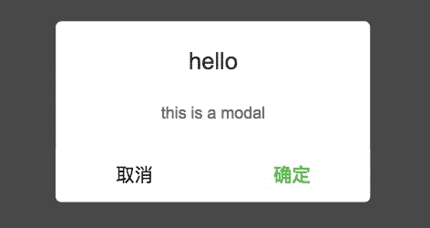

# 蘑菇街 2019 届校招-前端开发工程师笔试题（2）

## 1

以下关于 HTTP 的状态码中描述错误的是:

正确答案: B   你的答案: 空 (错误)

```cpp
200 OK 客户端请求成功
```

```cpp
302 Moved Permanently 请求永久重定向
```

```cpp
403 Forbidden 服务器收到请求，但是拒绝提供服务
```

```cpp
500 Internal Server Error 服务器发生不可预期的错误，导致无法完成客户端的请求
```

本题知识点

前端工程师 蘑菇街 安卓工程师 2019

讨论

[Domun](https://www.nowcoder.com/profile/4400195)

*   301：永久重定向，表示请求的资源分配了新的 URL（永久性）。
*   302：临时重定向，请求的资源分配到了其他的 URL（临时性的）。

发表于 2019-03-27 17:23:15

* * *

[zhouqctech](https://www.nowcoder.com/profile/1468715)

[301 Moved Permanently](https://developer.mozilla.org/en-US/docs/Web/HTTP/Status/301): This response code means that the URI of the requested resource has been changed permanently. Probably, the new URI would be given in the response.[302 Found](https://developer.mozilla.org/en-US/docs/Web/HTTP/Status/302): This response code means that the URI of requested resource has been changed *temporarily*. New changes in the URI might be made in the future. Therefore, this same URI should be used by the client in future requests.

发表于 2019-04-06 21:40:01

* * *

[江寒](https://www.nowcoder.com/profile/463993283)

```cpp
200("OK")
一切正常。实体主体中的文档（若存在的话）是某资源的表示。

400("Bad Request")
客户端方面的问题。实体主题中的文档（若存在的话）是一个错误消息。希望客户端能够理解此错误消息，并改正问题。

500("Internal Server Error")
服务期方面的问题。实体主体中的文档（如果存在的话）是一个错误消息。该错误消息通常无济于事，因为客户端无法修复服务器方面的问题。

301("Moved Permanently")
当客户端触发的动作引起了资源 URI 的变化时发送此响应代码。另外，当客户端向一个资源的旧 URI 发送请求时，也发送此响应代码。

404("Not Found") 和 410("Gone")
当客户端所请求的 URI 不对应于任何资源时，发送此响应代码。404 用于服务器端不知道客户端要请求哪个资源的情况；410 用于服务器端知道客户端所请求的资源曾经存在，但现在已经不存在了的情况。

409("Conflict")
当客户端试图执行一个”会导致一个或多个资源处于不一致状态“的操作时，发送此响应代码。

```

编辑于 2019-09-12 21:07:46

* * *

## 2

对于以下 HTML，下列选项中哪一个 CSS 选择器效果与其他的不同:    ```cpphtml
    <p><span>A</span><span>B</span><span>C</span></p>
    ```

正确答案: B   你的答案: 空 (错误)

```cpp
`span:first-child`
```

```cpp
`span:nth-child(0)`
```

```cpp
`span:nth-child(-n+1)`
```

```cpp
`span:nth-last-child(3)`
```

本题知识点

前端工程师 蘑菇街 安卓工程师 2019

讨论

[HarryLit](https://www.nowcoder.com/profile/204924857)

选 B。

```cpp
A. `span:first-child`
```

结果是返回第一个 span 元素

```cpp
B. `span:nth-child(0)`
```

里面填写 0 不会返回任何元素，应该写 1 才能正常返回第 1 个元素

```cpp
C. `span:nth-child(-n+1)`
```

:nth-child(-n+1) 代表的是 返回的时序列中小于或等于 1 的元素

```cpp
D. `span:nth-last-child(3)`
```

代表倒数第 3 个元素，只有 3 个 span 元素，倒数第 3 就是顺数第 1 个

编辑于 2019-04-15 14:08:50

* * *

[neptoo](https://www.nowcoder.com/profile/870928103)

:nth-child(-n+1) 表示周期性选择，n 是计数器（从 0 开始）

发表于 2019-03-28 09:54:22

* * *

[༄追࿆梦࿆的࿆青࿆鸟࿆࿐](https://www.nowcoder.com/profile/1234529)

nth-child(n):n 为 0 的话不会选中任何元素

编辑于 2019-03-27 18:54:33

* * *

## 3

以下关于原型链的描述正确的是:

正确答案: C   你的答案: 空 (错误)

```cpp
通过原型链继承的属性和对象自己定义的属性等效
```

```cpp
通过原型链可以模拟对象的私有属性
```

```cpp
在对象上访问不存在的属性时,会依次遍历整条原型链
```

```cpp
所有 JavaScript 中的对象都是位于原型链顶端的 `Object` 的实例
```

本题知识点

前端工程师 蘑菇街 安卓工程师 2019

讨论

[WahFung](https://www.nowcoder.com/profile/604794387)

D.Object.create(null) 没有原型，所以并不是所有的对象的顶层对象都是 OBject

发表于 2019-03-27 22:05:44

* * *

[学习充实中。。。](https://www.nowcoder.com/profile/3475669)

Object.prototype 和 Function.prototype 对象是由引擎创建的，所以不是所有对象都是 Object 实例，但是 Object 的实例一定是对象

发表于 2019-03-31 00:35:48

* * *

[o201807261516255](https://www.nowcoder.com/profile/863002429)

JavaScript 中没有私有成员的概念；所有对象属性都是公有的。不过，倒是有一个私有变量的概念。任何在函数中定义的变量，都可以认为是私有变量，因为不能在函数的外部访问这些变量。

发表于 2019-03-30 18:40:10

* * *

## 4

攻击者使用无效 IP 地址，利用 TCP 连接的三次握手过程，连续发送会话请求，使受害主机处于开放会话的请求之中，直至连接超时，最终因耗尽资源而停止响应。这种攻击被称为:

正确答案: D   你的答案: 空 (错误)

```cpp
DNS 欺骗攻击
```

```cpp
DDoS 攻击
```

```cpp
XSS 攻击
```

```cpp
SYN Flooding 攻击
```

本题知识点

前端工程师 蘑菇街 安卓工程师 2019

讨论

[SylvieHsu](https://www.nowcoder.com/profile/454299769)

D 由于 TCP 基于连接的，为了在服务端和客户端之间传送 TCP 数据，必须先建立一个虚拟电路，也就是 TCP 连接，建立 TCP 连接的过程也就是我们熟悉的**“三次握手”**过程：首先，请求端（客户端）发送一个包含 SYN 标志的 TCP 报文，表示客户端欲发起通信连接；第二步，服务器在收到客户端的 SYN 报文后，将返回一个 SYN+ACK 的报文，表示客户端的请求被接受；第三步，客户端也返回一个确认报文 ACK 给服务器端，到此一个 TCP 连接完成。问题就出在 TCP 连接的三次握手中，假设一个用户向服务器发送了 SYN 报文后突然死机或掉线，那么服务器在发出 SYN+ACK 应答报文后是无法收到客户端的 ACK 报文的，这种情况下服务器端一般会重试（再次发送 SYN+ACK 给客户端）并等待一段时间后丢弃这个未完成的连接，这段时间的长度我们称为 SYN Timeout，一般来说这个时间是分钟的数量级（大约为 30 秒-2 分钟）；如果有一个恶意的攻击者大量模拟这种情况，服务器端将为了维护一个非常大的半连接列表而消耗非常多的资源，**最终导致服务器端忙于处理攻击者伪造的** **TCP** **连接请求而无暇理睬客户的正常请求**，此时从正常客户的角度看来，服务器失去响应，这种情况我们称作：服务器端受到了**SYN Flooding**攻击。

编辑于 2019-03-31 17:50:02

* * *

[阿鼬](https://www.nowcoder.com/profile/998956307)

其实感觉这题 DDoS 和 syn 洪泛攻击都可以选吧，洪泛攻击也算是 DDoS 的一种。

发表于 2019-03-27 22:54:35

* * *

## 5

以下 Javascript 代码执行后的输出结果依次是:    ```cppjavascript
    console.log(typeof undefined == typeof NULL);
    console.log(typeof function () {} == typeof class {});
    ```

正确答案: C   你的答案: 空 (错误)

```cpp
false, true
```

```cpp
false, false
```

```cpp
true, true
```

```cpp
true, false
```

本题知识点

前端工程师 蘑菇街 安卓工程师 2019

讨论

[WahFung](https://www.nowcoder.com/profile/604794387)

貌似给第一个给坑了，NULL 不是 null，typeof 返回的应该是"undefined"，所以第一个比较是为 true。

发表于 2019-03-27 22:09:32

* * *

[SylvieHsu](https://www.nowcoder.com/profile/454299769)

```cpp
console.log(typeof undefined)//undefined
console.log(typeof NULL)//undefined
console.log(typeof function () {})//function
console.log(typeof class {})//function

//注意：
console.log(typeof null)//object
```

编辑于 2019-03-31 17:55:15

* * *

[夜寻极光。](https://www.nowcoder.com/profile/868966489)

 typeof NULL 中是 NULL 不是 null，所以为 undefinedtypeof class {} 为 es6 新出的类，不过本质上也是一个函数 

发表于 2021-09-01 19:42:27

* * *

## 6

以下 Javascript 代码执行后的输出结果依次是:()
    ```cppjavascript
    var tmp = {};
    var A = function() {};
    A.prototype = tmp;

    var a = new A();
    A.prototype = {};

    var b = Object.create(tmp);
    b.constructor = A.constructor;

    console.log(a instanceof A);
    console.log(b instanceof A);
    ```

正确答案: D   你的答案: 空 (错误)

```cpp
true, false
```

```cpp
false, true
```

```cpp
true, true
```

```cpp
false, false
```

本题知识点

前端工程师 蘑菇街 安卓工程师 2019

讨论

[GrayJay](https://www.nowcoder.com/profile/187441049)

因为在构造实例 a 之前，a 的隐式原型指向 tmp，但是在实例了 a 之后，a 的隐式原型依旧指向 tmp，但是 A.prototype 已经改变。instanceof 操作符的原理：左侧对象：A，搜寻他自身的隐式原型。右侧对象：B，则是返回他的 prototype 属性 a.__proto__  = tmpA.prototype = {}所以不相等同理，第二个也如此搜索

发表于 2019-03-28 10:42:18

* * *

[-LLLjr_](https://www.nowcoder.com/profile/886845118)

var tmp = {}; var A = function () {}; A.prototype = tmp; var a = new A(); A.prototype = {};// 在用 A new 出了一个对象 a 后，改写了 A 的原型对象 prototype 会导致 a 无法再在 A 的原型对象上进行查找 var b = Object.create(tmp);// 这是一个创建对象的方法，b 的隐式原型（__proto__）指向 tmp b.constructor = A.constructor; // 将 A 的构造函数（Function）赋给 b，我理解其实这句话没什么影响，构造函数和原型函数本质上是有很大区别的。。。// A instanceof B 即判断 A 是否是 B 的一个实例对象 console.log(a instanceof A); // 因为改写过 A 的原型对象，因此 a 不再是 A 的实例，a.__proto__ != A.prototype console.log(b instanceof A); // 只是具有相同的构造函数，并不符合 instanceof 判断为 true 的条件 

编辑于 2019-04-11 00:07:45

* * *

## 7

在 Javascript 中限制只能输入零和非零开头的数字，正确的正则表达式是:

正确答案: A   你的答案: 空 (错误)

```cpp
`^(0|[1-9][0-9]*)$`
```

```cpp
`^(0|[1-9][0-9])$`
```

```cpp
`^\+[1-9][0-9]*$`
```

```cpp
`^(0|[1-9][1-9]*)$`
```

本题知识点

前端工程师 蘑菇街 安卓工程师 2019

讨论

[独孤剑走偏锋](https://www.nowcoder.com/profile/6787764)

A: 匹配 0 或非 0 开头的数字

B: 匹配 0 或非 0 开头的两位数

C: 匹配带正号("+")的非 0 开头的数字

D: 匹配 0 或每一位都不为 0 的数字

发表于 2019-04-02 14:50:45

* * *

[neptoo](https://www.nowcoder.com/profile/870928103)

我理解成了只能输入数字，以零和非零开头。。。

发表于 2019-03-28 10:05:50

* * *

[牛客 206597936 号](https://www.nowcoder.com/profile/206597936)

正确答案 AB 只能匹配 0-99C  匹配+1 ->  无穷大 D  不能匹配 10  20 ...

发表于 2021-01-20 10:53:00

* * *

## 8

以下 Javascript 代码执行后的输出结果是:
    ```cppjavascript
    function a(m, n) {
        var b = function (l) {
            return l <= m ? l * b(l + 1) : 1;
        }

        return b(m - n + 1);
    }

    console.log(a(4, 2));
    ```

正确答案: C   你的答案: 空 (错误)

```cpp
0
```

```cpp
8
```

```cpp
12
```

```cpp
24
```

本题知识点

前端工程师 蘑菇街 安卓工程师 2019

讨论

[我才是谭亮](https://www.nowcoder.com/profile/1491282)

考察闭包：a(4,2) = b(3) = 3*b(4) = 3*4*b(5) = 3*4*1 = 12

发表于 2019-03-28 19:29:45

* * *

## 9

以下 Javascript 代码执行后的结果是:()

    ```cppjavascript
    [ 'a', ,'b', ,].length
    ```

正确答案: C   你的答案: 空 (错误)

```cpp
2
```

```cpp
3
```

```cpp
4
```

```cpp
5
```

本题知识点

前端工程师 蘑菇街 安卓工程师 2019

讨论

[夜陌 201903291015573](https://www.nowcoder.com/profile/141968863)

基本来选了 D，感觉是 5， 然后就动手试了一下

【‘a’】显示 1，【‘a’，】显示 1

所以原题【‘a’，，‘b’，，】就是 4 了，

最后一个“，”后面如果没有内容就不加一个长度，如果后面有东西就会有一个长度

发表于 2019-03-29 20:01:00

* * *

[学无止境 super](https://www.nowcoder.com/profile/204757120)

如果考虑到浏览器的兼容性，在 IE8 及之前版本，这道题答案应该是 D 吧。

发表于 2019-03-27 23:26:45

* * *

[夜寻极光。](https://www.nowcoder.com/profile/868966489)

懂了， [ 'a', ,'b', ,] 最后一个‘，’后面没内容的话就不算它了

发表于 2021-09-01 19:46:41

* * *

## 10

关于 cookie、sessionStorage 和 localStorage，以下哪个说法是错误的:

正确答案: C   你的答案: 空 (错误)

```cpp
sessionStorage 和 localStorage 的存储空间比 cookie 的存储空间更大
```

```cpp
sessionStorage 和 localStorage 比 cookie 有更多丰富易用的接口
```

```cpp
cookie、sessionStorage 和 localStorage 都可以在浏览器和服务器间来回传递
```

```cpp
sessionStorage 和 localStorage 都有各自独立的存储空间
```

本题知识点

前端工程师 蘑菇街 安卓工程师 2019

讨论

[忽然之间灵光一现](https://www.nowcoder.com/profile/97935761)

cookie 的大小有限制，大约为 4K 左右。sessionStorage:约 5M，生命周期为关闭浏览器窗口，在同一个窗口(页面)下数据可以共享。localStorage:约 20M，永久生效，除非手动删除（服务器方式访问然后清除缓存），可以多窗口（页面）共享。 

发表于 2019-04-10 17:37:37

* * *

[chrisping](https://www.nowcoder.com/profile/2860760)

貌似 localstorage 和 sessionstorage 一直放在本地

发表于 2019-03-28 09:19:50

* * *

[「、皓子’](https://www.nowcoder.com/profile/2370302)

cookie:一般由服务器生成 可设置失效时间 大小为 4k 左右 每次请求都会携带在 http 头中 需要程序员自己封装，原生的 cookie 接口不友好 localStorage: 永久保存 一般为 5M 仅在客户端中保存，不参与和服务器的通讯 sessionStorage：仅在当前会话下有效，关于页面或浏览器后被清楚 一般为 5M 仅在客户端保存，不参与和服务器通信

发表于 2019-03-31 14:51:23

* * *

## 11

以下哪些 HTML 标签属于行内元素:

正确答案: B C D E   你的答案: 空 (错误)

```cpp
`p`
```

```cpp
`span`
```

```cpp
`canvas`
```

```cpp
`label`
```

```cpp
`img`
```

本题知识点

前端工程师 蘑菇街 HTML 安卓工程师 2019

讨论

[IAmFineThankS](https://www.nowcoder.com/profile/385254898)

img 应该属于行内块元素吧~~

发表于 2019-05-06 10:56:17

* * *

[1997—2020](https://www.nowcoder.com/profile/585869748)

我想说，canvas 跟 img 不都是可置换元素吗？为什么选 img 不选 canvas？？？

发表于 2019-09-10 21:33:41

* * *

[我才是谭亮](https://www.nowcoder.com/profile/1491282)

解释一下 e 选项，一般行内元素设置不了宽高，但行内置换元素是根据元素的标签和属性，决定其显示内容，比如  <textarea> <select> <object> 。所以不要以为能设置图片宽高而认为 img 不是行内元素哦 <p>发表于 2019-03-28 19:44:11</p> <hr/> <h2>12</h2> 以下描述正确的是: <p>正确答案: A B D   你的答案: 空 <span class="font-orange">(错误)</span> </p> <div class="result-answer-item green-answer-item"> <pre>`inline-block` 可以设置高度,`inline` 不可以设置高度</pre> </div> <div class="result-answer-item green-answer-item"> <pre>`inline-block` 和 `inline` 都可以设置 `padding-left`</pre> </div> <div class="result-answer-item"> <pre>`inline-block` 可以设置 `margin-left`，inline 不可以</pre> </div> <div class="result-answer-item green-answer-item"> <pre>`block` 会独占一行，`inline-block` 不会</pre> </div> <div class="js-question-evaluate" data-id="339007"/> <p>本题知识点</p> <div class="tags-box"> <a class="tag-label">前端工程师 </a> <a class="tag-label">蘑菇街 </a> <a class="tag-label">安卓工程师 </a> <a class="tag-label">2019 </a> </div> <p>讨论</p> <p><a href="https://www.nowcoder.com/profile/97935761">忽然之间灵光一现</a></p> <pre><span style="color: rgb(51,51,51);">常见的块元素有<span><h1>~<h6></span>、<span><p></span>、<span><div></span>、<span><ul></span>、<span><ol></span>、<span><li></span>等，其中<span><div></span>标签是最典型的块元素。</span></pre> <p> 块级元素的特点： </p> <p> <span><span style="color: rgb(51,51,51);">（<span>1</span>）总是从新行开始</span></span> </p> <p> <span><span><span style="color: rgb(51,51,51);">（<span>2</span>）高度，行高、外边距以及内边距都可以控制。</span></span></span> </p> <p> <span><span style="color: rgb(51,51,51);">（<span>3</span>）宽度默认是容器的<span>100%</span></span></span> </p> <p> <span><span style="color: rgb(51,51,51);">（<span>4</span>）可以容纳内联元素和其他块元素。</span></span> </p> <pre><span style="color: rgb(51,51,51);">常见的行内元素有<span><a></span>、<span><strong></span>、<span><b></span>、<span><em></span>、<span><i></span>、<span><del></span>、<span><s></span>、<span><ins></span>、<span><u></span>、<span><span></span>等，其中<span><span></span>标签最典型的行内元素。</span></pre> <p> <span>行内元素的特点：</span> </p> <p> <span><span style="color: rgb(51,51,51);">（<span>1</span>）和相邻行内元素在一行上。</span></span> </p> <p> <span><span style="color: rgb(51,51,51);">（<span>2</span>）高、宽无效，但水平方向的<span>padding</span>和<span>margin</span>可以设置，垂直方向的无效。</span></span> </p> <p> <span><span style="color: rgb(51,51,51);">（<span>3</span>）默认宽度就是它本身内容的宽度。</span></span> </p> <p> <span><span style="color: rgb(51,51,51);">（<span>4</span>）行内元素只能容纳文本或则其他行内元素。（<span>a</span>特殊<span> a</span>里面可以放块级元素 ）</span></span> </p> <pre><span style="color: rgb(51,51,51);">在行内元素中有几个特殊的标签——<span></span>、<span><input /></span>、<span><td></span>，可以对它们设置宽高和对齐属性，也称它们为行内块元素。</span></pre> <pre><span style="color: rgb(51,51,51);">行内块元素的特点：</span></pre> <pre><span style="color: rgb(51,51,51);">（<span>1</span>）和相邻行内元素（行内块）在一行上<span>,</span>但是之间会有空白缝隙。</span></pre> <pre><span style="color: rgb(51,51,51);">（<span>2</span>）默认宽度就是它本身内容的宽度。</span></pre>     （<span>3</span>）高度，行高、外边距以及内边距都可以控制。 <p>发表于 2019-04-10 17:46:29</p> <hr/> <p><a href="https://www.nowcoder.com/profile/4226501">会飞の猪</a></p> <div> inline (行内元素) 不可以设置宽高 也不自动换行  可以设置 margin padding （竖直方向除外）            </div> <div> block（块级元素）可以设置宽高 可以自动和换行 可以设置 margin padding            </div> <div> lnline-block（行内置换元素） 不自动换行 可以设置宽高 可以设置 margin padding   具有 inline 同行属性 以及 block 宽高属性 </div> <div> 所以正确答案 ABD </div> <div> 在 a 中 inline-block 设置高度正确 因为其具有 block 的宽高特性 </div> <div> 在 b 中 注意是 padding-left 可以说是无论是 inline block 还是 inline-block 都具有这功能 </div> <div> 在 c 中 inline-block 可以设置 margin-left ，inline 也可以设置 margin-left 属性。 </div> <div> 在 d 中 block 会占一行 正确 inline-block 因具有 inline 的行内特性 不会自动换行 所以不会占一行 </div> <div>   </div> <div> <br/> </div> <p>发表于 2019-04-01 16:15:55</p> <hr/> <p><a href="https://www.nowcoder.com/profile/868966489">夜寻极光。</a></p> <div> 简洁明了： </div> <div> 行内元素设置 padding-top、padding-bottom、margin-top、margin-bottom 无效！ </div> <div> 但是设置 padding-left、padding-right、margin-left、margin-right 有效！ </div> <p>发表于 2021-09-01 19:52:56</p> <hr/> <h2>13</h2> 以下关于跨域的描述哪些是正确的: <p>正确答案: B C D   你的答案: 空 <span class="font-orange">(错误)</span> </p> <div class="result-answer-item"> <pre>Web 字体、图片等资源文件加载都不受浏览器跨域限制</pre> </div> <div class="result-answer-item green-answer-item"> <pre>CSS 文件的加载不受跨域限制</pre> </div> <div class="result-answer-item green-answer-item"> <pre>window.onerror 方法默认情况下无法获取跨域脚本的报错详情</pre> </div> <div class="result-answer-item green-answer-item"> <pre>canvas 中使用 drawImage 贴图会受跨域限制</pre> </div> <div class="js-question-evaluate" data-id="339008"/> <p>本题知识点</p> <div class="tags-box"> <a class="tag-label">前端工程师 </a> <a class="tag-label">蘑菇街 </a> <a class="tag-label">HTML </a> <a class="tag-label">CSS </a> <a class="tag-label">安卓工程师 </a> <a class="tag-label">2019 </a> </div> <p>讨论</p> <p><a href="https://www.nowcoder.com/profile/249573107">牛客 249573107 号</a></p> <div> <p> 如果想通过 onerror 函数收集不同域的 js 错误，我们需要做两件事： </p> <ol> <li> 相关的 js 文件上加上 Access-Control-Allow-Origin:*的 response header </li><li> 引用相关的 js 文件时加上 crossorigin 属性 </li></ol> </div> 链接：<a href="https://www.jianshu.com/p/315ffe6797b8" target="_blank">https://www.jianshu.com/p/315ffe6797b8</a><br/> <br/> <br/> <p>发表于 2021-02-03 22:43:23</p> <hr/> <p><a href="https://www.nowcoder.com/profile/594899962">Chacix</a></p> <div> css 文件的加载肯定不收跨域限制，a 站点能引用 B 站点的样式 d </div> <div> canvas 的 drawImage 使用跨域图片，会报错 </div> <div> 解决方案 1、 </div> <div> 如果图片不大不多可以使用 base64 </div> <div> 解决方案 2、 </div> <div> 实例的 image 对象的设置 img.crossOrigin = ' ';并且在服务器端设置 Access-Control-Allow-Origin:*(或运行的域名) </div> <p>发表于 2019-03-29 14:16:44</p> <hr/> <p><a href="https://www.nowcoder.com/profile/894835544">就叫 Eden 啦</a></p> <div> 图片 script 这些可以跨域 src 本质是 get 请求 </div> <div> 但是字体 不一定了，有的是不允许跨域请求的 </div> <p>发表于 2019-04-02 18:24:32</p> <hr/> <h2>14</h2> 以下关于闭包的描述哪些是正确的: <p>正确答案: A B C D   你的答案: 空 <span class="font-orange">(错误)</span> </p> <div class="result-answer-item green-answer-item"> <pre>函数内再嵌套函数</pre> </div> <div class="result-answer-item green-answer-item"> <pre>参数和变量不会被垃圾回收机制回收</pre> </div> <div class="result-answer-item green-answer-item"> <pre>内部函数可以引用外层的参数和变量</pre> </div> <div class="result-answer-item green-answer-item"> <pre>闭包会导致原始作用域链不释放,造成内存泄漏</pre> </div> <div class="js-question-evaluate" data-id="339009"/> <p>本题知识点</p> <div class="tags-box"> <a class="tag-label">前端工程师 </a> <a class="tag-label">蘑菇街 </a> <a class="tag-label">安卓工程师 </a> <a class="tag-label">2019 </a> </div> <p>讨论</p> <p><a href="https://www.nowcoder.com/profile/5245747">云上云</a></p> 闭包不一定会导致内存泄露，不正当的使用才会导致 <p>发表于 2019-04-09 09:16:17</p> <hr/> <p><a href="https://www.nowcoder.com/profile/604794387">WahFung</a></p> 感觉 A 的描述不太正确啊，应该是函数内嵌套一个函数，并把该函数 return 出去 <p>发表于 2019-03-27 22:14:09</p> <hr/> <p><a href="https://www.nowcoder.com/profile/594128858">匿/名</a></p> <div> d 太绝对了,不当操作才会导致内存泄漏. </div> <div> 应该改成  <pre>闭包可能会导致原始作用域链不释放,造成内存泄漏</pre> </div> <div> <br/> </div> <p>发表于 2019-04-08 21:30:20</p> <hr/> <h2>15</h2> 在 ECMAScript6 中，promise 的状态有: <p>正确答案: A C D   你的答案: 空 <span class="font-orange">(错误)</span> </p> <div class="result-answer-item green-answer-item"> <pre>Pending</pre> </div> <div class="result-answer-item"> <pre>Pause</pre> </div> <div class="result-answer-item green-answer-item"> <pre>Fulfilled</pre> </div> <div class="result-answer-item green-answer-item"> <pre>Rejected</pre> </div> <div class="js-question-evaluate" data-id="339010"/> <p>本题知识点</p> <div class="tags-box"> <a class="tag-label">前端工程师 </a> <a class="tag-label">蘑菇街 </a> <a class="tag-label">安卓工程师 </a> <a class="tag-label">2019 </a> </div> <p>讨论</p> <p><a href="https://www.nowcoder.com/profile/886845118">-LLLjr_</a></p> <div> <span style="color: rgb(51,51,51);">Promise 异步操作有三种状态，在创建完成后立即进入 pending（进行中）</span> </div> <div> <span style="color: rgb(51,51,51);">如果 resolve 函数被调用则修改其状态为 fulfilled；</span> </div> <div> <span style="color: rgb(51,51,51);">如果是 reject 函数被调用则修改其 状态为 reject；</span> </div> <div> <span style="color: rgb(51,51,51);">无论何时 promise 对象都只有一种状态，且改变后即不可再修改</span> </div> <p>发表于 2019-04-10 21:30:35</p> <hr/> <p><a href="https://www.nowcoder.com/profile/753034559">胡西诚 Flacko</a></p> Promise 异步操作有三种状态：pending（进行中）、fulfilled（已成功）和 rejected（已失败）。除了异步操作的结果，任何其他操作都无法改变这个状态 <p>发表于 2019-04-01 18:40:13</p> <hr/> <h2>16</h2> 以下关于 let 和 const 的说法中正确的是: <p>正确答案: A B C   你的答案: 空 <span class="font-orange">(错误)</span> </p> <div class="result-answer-item green-answer-item"> <pre>let 声明的变量值和类型都可以改变</pre> </div> <div class="result-answer-item green-answer-item"> <pre>const 声明的常量不可以改变</pre> </div> <div class="result-answer-item green-answer-item"> <pre>两者都不存在变量提升，同时存在暂时性死区，只能在声明的位置后面使用</pre> </div> <div class="result-answer-item"> <pre>const 可以先声明再初始化，可以后赋值</pre> </div> <div class="js-question-evaluate" data-id="339011"/> <p>本题知识点</p> <div class="tags-box"> <a class="tag-label">前端工程师 </a> <a class="tag-label">蘑菇街 </a> <a class="tag-label">安卓工程师 </a> <a class="tag-label">2019 </a> </div> <p>讨论</p> <p><a href="https://www.nowcoder.com/profile/2860760">chrisping</a></p> b 不太严谨 <p>发表于 2019-03-28 09:24:28</p> <hr/> <p><a href="https://www.nowcoder.com/profile/482834539">JsonWang0102</a></p> <span style="color: rgb(204,0,0);"><span style="font-weight: 700;">const</span></span><span style="color: rgb(85,85,85);">：用于声明<span style="font-weight: 700;"><u>常量</u></span>。注意：定义的变量的时候，必须同时初始化，且其值之后</span><span style="color: rgb(85,85,85);">不可以修改。 </span> <p>发表于 2019-04-13 15:32:32</p> <hr/> <p><a href="https://www.nowcoder.com/profile/524739894">Noah_</a></p> <div> const obj = {} </div> <div> obj = {'a',1,'hello'} </div> <div> ????? </div> <p>发表于 2019-04-07 18:56:25</p> <hr/> <h2>17</h2> 对以下 Javascript 代码运行结果的描述错误的是:()<br/> <br/>     ```cppjavascript<br/>     var a = {},<br/>         b = { key: 'b' },<br/>         c = { key: 'c' };<br/> <br/>     a[b] = 123;<br/>     a[c] = 456;<br/>     ```<br/> <div> <br/> </div> <p>正确答案: A B D   你的答案: 空 <span class="font-orange">(错误)</span> </p> <div class="result-answer-item green-answer-item"> <pre>变量 `a` 有两个属性</pre> </div> <div class="result-answer-item green-answer-item"> <pre>`console.log(a[b])` 输出 `123`</pre> </div> <div class="result-answer-item"> <pre>`console.log(a[c])` 输出 `456`</pre> </div> <div class="result-answer-item green-answer-item"> <pre>`console.log(a[a])` 输出 `undefined`</pre> </div> <div class="js-question-evaluate" data-id="339012"/> <p>本题知识点</p> <div class="tags-box"> <a class="tag-label">前端工程师 </a> <a class="tag-label">蘑菇街 </a> <a class="tag-label">安卓工程师 </a> <a class="tag-label">2019 </a> </div> <p>讨论</p> <p><a href="https://www.nowcoder.com/profile/604794387">WahFung</a></p> 对象添加属性有两种方式 第一种点语法,如 obj.a=1；第二种[]语法，如 var a = 'hello', obj[a] = 'Joe' ,此时访问 obj.hello 可以得到'Jeo' 。题目传入的是一个对象，所以会隐式调用对象的 toString 方法，把对象转化为字符串 。执行 a[b] = 123 时 , a 对象里是这样的 { '[object Object]' : 123 } 。同理, a[c] = 345 , 把[object Object]重新赋值 。所以 a 对象只有一个属性； 输出 a[b] 相当于输出 a 的[object Object]属性，得到 345； a[a]同样得到 345； <p>编辑于 2019-03-27 22:37:35</p> <hr/> <p><a href="https://www.nowcoder.com/profile/558938736">hilone</a></p> obj[x]相当于 obj 在内存中申请了一块空间用来存储变量属性，所以 obj[a],obj[b]....的内存地址都是指向同一块内存的，所以不管是 obj[]什么，只要是[]里面的都会指向同一个内存地址，重复赋值会覆盖之前的 <p>编辑于 2019-04-15 10:54:34</p> <hr/> <p><a href="https://www.nowcoder.com/profile/493155953">君君 201903290917654</a></p> <a href="https://blog.csdn.net/hellokingqwe/article/details/52688017" target="_blank">https://blog.csdn.net/hellokingqwe/article/details/52688017</a>  这个上面解释得挺详细的。 <p>发表于 2019-04-01 14:35:55</p> <hr/> <h2>18</h2> 假设以下 div<br/>     ```cpphtml<br/>         <div class="a">hello</div><br/>     ```<br/>     绑定的 click 事件如下<br/>     ```cppjavascript<br/>         let a = document.querySelector('.a');<br/>         a.addEventListener('click', ()=>{<br/>             console.log(1);<br/>         });<br/>     ```<br/>     以下哪些方法在点击上面的 div 后，输出 1 之前输出 2:()<br/> <p>正确答案: B C D   你的答案: 空 <span class="font-orange">(错误)</span> </p> <div class="result-answer-item"> <pre>```cppjavascript<br/>a.addEventListener('click', ()=>{<br/>console.log(2);<br/>});<br/>```</pre> </div> <div class="result-answer-item green-answer-item"> <pre>```cppjavascript<br/>a.addEventListener('click', ()=>{<br/>console.log(2);<br/>}, true);<br/>```</pre> </div> <div class="result-answer-item green-answer-item"> <pre>```cppjavascript<br/>a.addEventListener('touchstart', ()=>{<br/>console.log(2);<br/>});<br/>```</pre> </div> <div class="result-answer-item green-answer-item"> <pre>```cppjavascript<br/>a.addEventListener('touchend', ()=>{<br/>console.log(2);<br/>});<br/>```</pre> </div> <div class="js-question-evaluate" data-id="339013"/> <p>本题知识点</p> <div class="tags-box"> <a class="tag-label">前端工程师 </a> <a class="tag-label">蘑菇街 </a> <a class="tag-label">安卓工程师 </a> <a class="tag-label">2019 </a> </div> <p>讨论</p> <p><a href="https://www.nowcoder.com/profile/863002429">o201807261516255</a></p> <div> <span><span>在触摸屏幕上的元素时，事件（包括鼠标事件）发生的顺序如下</span> <br/> </span> </div> <div> <span>(1) </span><span>touchstart<br/> </span> </div> <span>(2) </span><span>mouseover<br/> </span><span>(3) </span><span>mousemove</span><span>（一次）<br/> </span><span>(4) </span><span>mousedown<br/> </span><span>(5) </span><span>mouseup<br/> </span><span>(6) </span><span>click<br/> </span> <div> <span>(7) </span><span>touchend</span> </div> <div> <span><br/> </span> </div> <div> <span>DOM 事件流：捕获阶段--目标阶段--冒泡</span> </div> <div> <span><br/> </span> </div> <div> <span>那么 D 选项应该不对，但是在手机的 Chrome 测试，是 touchend 先输出，大概是因为移动端的 click 有延时吧，希望大佬可以解答一下。<br/> </span> </div> <p>编辑于 2019-04-04 14:57:39</p> <hr/> <p><a href="https://www.nowcoder.com/profile/576330039">123***</a></p> click 在移动端有延迟的 <p>发表于 2019-04-04 15:30:09</p> <hr/> <p><a href="https://www.nowcoder.com/profile/463008189">Jswei</a></p> B 应该是不正确的吧，点击 a 触发 click 事件，a 是事件源，也就是在事件源上绑定的 click 事件，执行事件顺序应该是哪个事件先绑定就先执行，而题目中并没有明确指出选项中的事件先绑定还是题干中的事件先绑定，所以不明确。 <p>发表于 2019-04-03 22:55:40</p> <hr/> <h2>19</h2> 以下哪些方法可以优化滚动性能: <p>正确答案: A B C D   你的答案: 空 <span class="font-orange">(错误)</span> </p> <div class="result-answer-item green-answer-item"> <pre>在滚动中对滚动函数进行节流处理</pre> </div> <div class="result-answer-item green-answer-item"> <pre>滚动中减少导致重绘的操作</pre> </div> <div class="result-answer-item green-answer-item"> <pre>滚动中减少导致重排的操作</pre> </div> <div class="result-answer-item green-answer-item"> <pre>通过给滚动内的子元素开启硬件加速</pre> </div> <div class="js-question-evaluate" data-id="339014"/> <p>本题知识点</p> <div class="tags-box"> <a class="tag-label">前端工程师 </a> <a class="tag-label">蘑菇街 </a> <a class="tag-label">安卓工程师 </a> <a class="tag-label">2019 </a> </div> <p>讨论</p> <p><a href="https://www.nowcoder.com/profile/385254898">IAmFineThankS</a></p> D: 所谓的硬件加速 其实就是指 GPU 渲染 <p>发表于 2019-05-08 17:56:40</p> <hr/> <h2>20</h2>  以下请求是一个订单提交的请求，请观察该请求包，说出你认为可能存在的安全风险点:()<br/>     ```cpp<br/>     POST http://test.mogujie.com/insert.html HTTP/1.1<br/>     Host: test.mogujie.com<br/>     Referer: http://test.mogujie.com/index.php?data=58<br/>     Cookie: uid=1504174654; <br/>     addressid=1&productid=123&num=1&price=120<br/>     ```<br/> <p>正确答案: A B C D   你的答案: 空 <span class="font-orange">(错误)</span> </p> <div class="result-answer-item green-answer-item"> <pre>CSRF</pre> </div> <div class="result-answer-item green-answer-item"> <pre>订单金额篡改</pre> </div> <div class="result-answer-item green-answer-item"> <pre>越权操作</pre> </div> <div class="result-answer-item green-answer-item"> <pre>SQL 注入</pre> </div> <div class="js-question-evaluate" data-id="339015"/> <p>本题知识点</p> <div class="tags-box"> <a class="tag-label">前端工程师 </a> <a class="tag-label">蘑菇街 </a> <a class="tag-label">安卓工程师 </a> <a class="tag-label">2019 </a> </div> <p>讨论</p> <p><a href="https://www.nowcoder.com/profile/493155953">君君 201903290917654</a></p> <ol> <li> CSRF 攻击 <a href="https://www.cnblogs.com/lovesong/p/5233195.html" target="_blank">https://www.cnblogs.com/lovesong/p/5233195.html</a> </li> <li> web 越权操作<a href="https://blog.csdn.net/tanzhen1991910/article/details/53220593" target="_blank">https://blog.csdn.net/tanzhen1991910/article/details/53220593</a> <br/> </li> <li> <a href="https://www.2cto.com/article/201310/250877.html" target="_blank"><span style="font-weight: 700;">SQL 注入攻击</span> https://www.2cto.com/article/201310/250877.html</a><br/> </li> </ol> <p>发表于 2019-04-01 15:58:48</p> <hr/> <p><a href="https://www.nowcoder.com/profile/1007816">Curtion</a></p> 我以为后端是个不走寻常路的人..uid 看着像一个用户 id，其实是一个 sessionid。想啥呢.. <p>发表于 2019-04-20 17:03:49</p> <hr/> <h2>21</h2> 请实现一个弹出对话框组件, 如下图(可以使用 vue, jquery, react 等框架)<br/> <br/> <p>你的答案</p> <div class="design-answer-box"/> <div class="subject-upload-list"> </div> <div class="js-question-evaluate" data-id="339016"/> <p>本题知识点</p> <div class="tags-box"> <a class="tag-label">前端工程师 </a> <a class="tag-label">蘑菇街 </a> <a class="tag-label">安卓工程师 </a> <a class="tag-label">2019 </a> </div> <p>讨论</p> <p><a href="https://www.nowcoder.com/profile/784199424">我是闷葫芦啊</a></p> <pre class="prettyprint lang-js">Vue.component('alert-box',{ template:`<div> <div v-if="active"> <h2>{{ tit }}</h2> <p>{{ main }}</p> </div> <ul> <li @click="handleNo">取消</li> <li @click="handleOk">确定</li> </ul> </div>`, props:{ tit:String, main:String }, data:function(){   return {   active:true } }, methode:{ handleOk:function(){ this.active = false; }, handleNo:function(){ this.active = false; } } })</pre> <br/> <p>编辑于 2019-04-14 18:12:09</p> <hr/> <p><a href="https://www.nowcoder.com/profile/897041260">curry300000000000</a></p> <pre class="prettyprint lang-html"><!DOCTYPE html> <html> <head> <span>    </span><title></title> <span>    </span><style type="text/css"> <span>        </span>/*ddd*/ <span>        </span>.bg{ <span>            </span>height: 200px; <span>            </span>width: 360px; <span>            </span>text-align: center; <span>            </span>margin: 300px auto; <span>            </span>background-color: white; <span>            </span>border-radius: 5px; <span>        </span>} <span>        </span>.hello{ <span>            </span>font-size: 25px; <span>            </span>text-align: center; <span>            </span>padding: 20px; <span>        </span>} <span>        </span>.modal{ <span>            </span>color: gray; <span>            </span>font-size: 18px; <span>            </span>padding: 15px 0 25px 0; <span>            </span>text-align: center; <span>        </span>} <span>        </span>.bt{ <span>            </span>width: 280px; <span>            </span>margin: auto; <span>            </span>padding-top: 18px; <span>            </span>font-size: 22px; <span>        </span>} <span>        </span>.qx{ <span>            </span>width: 110px; <span>            </span>cursor: pointer; <span>            </span>text-align: left; <span>            </span>display: inline-block; <span>        </span>} <span>        </span>.qd{ <span>            </span>width: 110px; <span>            </span>color: green; <span>            </span>text-align: right; <span>            </span>cursor: pointer; <span>            </span>display: inline-block; <span>        </span>} <span>    </span></style> </head> <body bgcolor="black"> <span>    </span><div class="bg"> <span>        </span> <span>        </span><div class="hello">hello</div> <span>        </span><div class="modal">this is a modal</div><span>    </span> <span>        </span><div class="bt"> <span>            </span><div class="qx">取消</div> <span>            </span><div class="qd">确定</div> <span>        </span></div><span>    </span> <span>    </span></div> </body> </html> </pre> <br/> <p>发表于 2019-04-07 13:46:44</p> <hr/> <h2>22</h2> 编写一个 Javascript 函数，传入一个数组，对数组中的元素进行去重并返回一个无重复元素的数组，数组的元素可以是数字、字符串、数组和对象。举例说明：<br/>     1\. 如传入的数组元素为[123, "meili", "123", "mogu", 123],则输出：[123, "meili", "123", "mogu"]<br/>     2\. 如传入的数组元素为[123, [1, 2, 3], [1, "2", 3], [1, 2, 3], "meili"],则输出：[123, [1, 2, 3], [1, "2", 3], "meili"]<br/>     3\. 如传入的数组元素为[123, {a: 1}, {a: {b: 1}}, {a: "1"}, {a: {b: 1}}, "meili"],则输出：[123, {a: 1}, {a: {b: 1}}, {a: "1"}, "meili"]<br/> <p>你的答案</p> <div class="design-answer-box"/> <div class="subject-upload-list"> </div> <div class="js-question-evaluate" data-id="339017"/> <p>本题知识点</p> <div class="tags-box"> <a class="tag-label">前端工程师 </a> <a class="tag-label">蘑菇街 </a> <a class="tag-label">安卓工程师 </a> <a class="tag-label">2019 </a> </div> <p>讨论</p> <p><a href="https://www.nowcoder.com/profile/95069648">Chris201904042131210</a></p> <div style="color: rgb(51,51,51);vertical-align: baseline;"> function removeDuplicate(arr) { </div> <div style="color: rgb(51,51,51);vertical-align: baseline;">   return[...(newSet(arr.map(n => JSON.stringify(n))))].map(n => JSON.parse(n)) </div> <div style="color: rgb(51,51,51);vertical-align: baseline;"> } </div> <p>发表于 2019-04-04 22:58:00</p> <hr/> <p><a href="https://www.nowcoder.com/profile/5609283">gradient</a></p> <div style="color: rgb(171,178,191);"> <div> <span style="color: rgb(229,192,123);">Array</span>.<span style="color: rgb(224,108,117);">prototype</span>.<span style="color: rgb(97,175,239);">unique</span> <span style="color: rgb(86,182,194);">=</span> <span style="color: rgb(198,120,221);">function</span>(){ </div> <div> <span style="color: rgb(198,120,221);">let</span> <span style="color: rgb(224,108,117);">hash</span> <span style="color: rgb(86,182,194);">=</span> <span style="color: rgb(198,120,221);">new</span> <span style="color: rgb(229,192,123);">Map</span>() </div> <div> <span style="color: rgb(198,120,221);">let</span> <span style="color: rgb(224,108,117);">result</span> <span style="color: rgb(86,182,194);">=</span> [] </div> <div> <span style="color: rgb(198,120,221);">let</span> <span style="color: rgb(224,108,117);">item</span> </div> <div> <span style="color: rgb(198,120,221);">for</span> (<span style="color: rgb(198,120,221);">let</span> <span style="color: rgb(224,108,117);">i</span> <span style="color: rgb(86,182,194);">=</span> <span style="color: rgb(209,154,102);">0</span>; <span style="color: rgb(224,108,117);">i</span> < <span style="color: rgb(229,192,123);">this</span>.<span style="color: rgb(224,108,117);">length</span>; <span style="color: rgb(224,108,117);">i</span><span style="color: rgb(86,182,194);">++</span>) { </div> <div> <span style="color: rgb(229,192,123);">console</span>.<span style="color: rgb(97,175,239);">log</span>(<span style="color: rgb(229,192,123);">Object</span>.<span style="color: rgb(224,108,117);">prototype</span>.<span style="color: rgb(224,108,117);">toString</span>.<span style="color: rgb(97,175,239);">call</span>(<span style="color: rgb(229,192,123);">this</span>[<span style="color: rgb(224,108,117);">i</span>])) </div> <div> <span style="color: rgb(198,120,221);">if</span> (<span style="color: rgb(229,192,123);">Object</span>.<span style="color: rgb(224,108,117);">prototype</span>.<span style="color: rgb(224,108,117);">toString</span>.<span style="color: rgb(97,175,239);">call</span>(<span style="color: rgb(229,192,123);">this</span>[<span style="color: rgb(224,108,117);">i</span>]) <span style="color: rgb(86,182,194);">===</span> <span style="color: rgb(152,195,121);">'[object Object]'</span> </div> <div> <span style="color: rgb(86,182,194);">||</span> <span style="color: rgb(229,192,123);">Object</span>.<span style="color: rgb(224,108,117);">prototype</span>.<span style="color: rgb(224,108,117);">toString</span>.<span style="color: rgb(97,175,239);">call</span>(<span style="color: rgb(229,192,123);">this</span>[<span style="color: rgb(224,108,117);">i</span>]) <span style="color: rgb(86,182,194);">===</span> <span style="color: rgb(152,195,121);">'[object Array]'</span>) { </div> <div> <span style="color: rgb(224,108,117);">item</span> <span style="color: rgb(86,182,194);">=</span> <span style="color: rgb(209,154,102);">JSON</span>.<span style="color: rgb(86,182,194);">stringify</span>(<span style="color: rgb(229,192,123);">this</span>[<span style="color: rgb(224,108,117);">i</span>]) </div> <div> } <span style="color: rgb(198,120,221);">else</span> { </div> <div> <span style="color: rgb(224,108,117);">item</span> <span style="color: rgb(86,182,194);">=</span> <span style="color: rgb(229,192,123);">this</span>[<span style="color: rgb(224,108,117);">i</span>] </div> <div> } </div> <div> <span style="color: rgb(198,120,221);">if</span> (<span style="color: rgb(86,182,194);">!</span><span style="color: rgb(224,108,117);">hash</span>.<span style="color: rgb(97,175,239);">has</span>(<span style="color: rgb(224,108,117);">item</span>)) { </div> <div> <span style="color: rgb(224,108,117);">hash</span>.<span style="color: rgb(97,175,239);">set</span>(<span style="color: rgb(224,108,117);">item</span>, <span style="color: rgb(209,154,102);">true</span>) </div> <div> <span style="color: rgb(224,108,117);">result</span>.<span style="color: rgb(97,175,239);">push</span>(<span style="color: rgb(229,192,123);">this</span>[<span style="color: rgb(224,108,117);">i</span>]) </div> <div> } </div> <div> } </div> <div> <span style="color: rgb(198,120,221);">return</span> <span style="color: rgb(224,108,117);">result</span> </div> <div> } </div> </div> <p>发表于 2019-04-04 11:06:14</p> <hr/> <p><a href="https://www.nowcoder.com/profile/488269917">cassiehuang22</a></p> <pre class="prettyprint lang-js"> <div style="color: rgb(212,212,212);"> <div> <span style="color: rgb(86,156,214);">function</span> <span style="color: rgb(220,220,170);">delRepeat</span>(<span style="color: rgb(156,220,254);">arr</span>) { </div> <div> <span style="color: rgb(86,156,214);">const</span> <span style="color: rgb(156,220,254);">result</span> = []; </div> <div> <span style="color: rgb(197,134,192);">for</span> (<span style="color: rgb(86,156,214);">let</span> <span style="color: rgb(156,220,254);">i</span> = <span style="color: rgb(181,206,168);">0</span>; <span style="color: rgb(156,220,254);">i</span> < <span style="color: rgb(156,220,254);">arr</span>.<span style="color: rgb(156,220,254);">length</span>; <span style="color: rgb(156,220,254);">i</span>++) { </div> <div> <span style="color: rgb(197,134,192);">if</span> (<span style="color: rgb(156,220,254);">i</span> === <span style="color: rgb(181,206,168);">0</span>) { </div> <div> <span style="color: rgb(156,220,254);">result</span>.<span style="color: rgb(220,220,170);">push</span>(<span style="color: rgb(156,220,254);">arr</span>[<span style="color: rgb(156,220,254);">i</span>]); </div> <div> } <span style="color: rgb(197,134,192);">else</span> <span style="color: rgb(197,134,192);">if</span> (<span style="color: rgb(220,220,170);">isAdd</span>(<span style="color: rgb(156,220,254);">result</span>, <span style="color: rgb(156,220,254);">arr</span>[<span style="color: rgb(156,220,254);">i</span>])){ </div> <div> <span style="color: rgb(156,220,254);">result</span>.<span style="color: rgb(220,220,170);">push</span>(<span style="color: rgb(156,220,254);">arr</span>[<span style="color: rgb(156,220,254);">i</span>]) </div> <div> } </div> <div> } </div> <div> <span style="color: rgb(197,134,192);">return</span> <span style="color: rgb(156,220,254);">result</span>; </div> <div> } </div> <div> <span style="color: rgb(86,156,214);">function</span> <span style="color: rgb(220,220,170);">isAdd</span>(<span style="color: rgb(156,220,254);">result</span>, <span style="color: rgb(156,220,254);">val</span>) { </div> <div> <span style="color: rgb(197,134,192);">for</span> (<span style="color: rgb(86,156,214);">let</span> <span style="color: rgb(156,220,254);">value</span> <span style="color: rgb(86,156,214);">of</span> <span style="color: rgb(156,220,254);">result</span>) { </div> <div> <span style="color: rgb(197,134,192);">if</span> (<span style="color: rgb(220,220,170);">isEqual</span>(<span style="color: rgb(156,220,254);">value</span>, <span style="color: rgb(156,220,254);">val</span>)) <span style="color: rgb(197,134,192);">return</span> <span style="color: rgb(86,156,214);">false</span>; </div> <div> } </div> <div> <span style="color: rgb(197,134,192);">return</span> <span style="color: rgb(86,156,214);">true</span>; </div> <div> } </div> <div> <span style="color: rgb(86,156,214);">function</span> <span style="color: rgb(220,220,170);">isEqual</span>(<span style="color: rgb(156,220,254);">val1</span>, <span style="color: rgb(156,220,254);">val2</span>) { </div> <div> <span style="color: rgb(86,156,214);">let</span> <span style="color: rgb(156,220,254);">type1</span> = <span style="color: rgb(86,156,214);">typeof</span> <span style="color: rgb(156,220,254);">val1</span>; </div> <div> <span style="color: rgb(86,156,214);">let</span> <span style="color: rgb(156,220,254);">type2</span> = <span style="color: rgb(86,156,214);">typeof</span> <span style="color: rgb(156,220,254);">val2</span>; </div> <div> <span style="color: rgb(197,134,192);">if</span> (<span style="color: rgb(156,220,254);">type1</span> !== <span style="color: rgb(156,220,254);">type2</span>) <span style="color: rgb(197,134,192);">return</span> <span style="color: rgb(86,156,214);">false</span>; </div> <div> <span style="color: rgb(197,134,192);">if</span> (<span style="color: rgb(156,220,254);">type1</span> !== <span style="color: rgb(206,145,120);">'object'</span>) <span style="color: rgb(197,134,192);">return</span> <span style="color: rgb(156,220,254);">val1</span> === <span style="color: rgb(156,220,254);">val2</span>; </div> <div> <span style="color: rgb(197,134,192);">for</span> (<span style="color: rgb(86,156,214);">let</span> <span style="color: rgb(156,220,254);">key</span> <span style="color: rgb(86,156,214);">of</span> <span style="color: rgb(78,201,176);">Object</span>.<span style="color: rgb(220,220,170);">keys</span>(<span style="color: rgb(156,220,254);">val1</span>)) { </div> <div> <span style="color: rgb(197,134,192);">if</span> (!<span style="color: rgb(156,220,254);">val2</span>[<span style="color: rgb(156,220,254);">key</span>]) <span style="color: rgb(197,134,192);">return</span> <span style="color: rgb(86,156,214);">false</span>; </div> <div> <span style="color: rgb(197,134,192);">if</span>(!<span style="color: rgb(220,220,170);">isEqual</span>(<span style="color: rgb(156,220,254);">val1</span>[<span style="color: rgb(156,220,254);">key</span>], <span style="color: rgb(156,220,254);">val2</span>[<span style="color: rgb(156,220,254);">key</span>])) <span style="color: rgb(197,134,192);">return</span> <span style="color: rgb(86,156,214);">false</span>; </div> <div> } </div> <div> <span style="color: rgb(197,134,192);">return</span> <span style="color: rgb(86,156,214);">true</span>; </div> <div> } </div> </div> </pre> <br/> <p>发表于 2019-04-02 16:35:10</p> <hr/> </object></select></textarea>