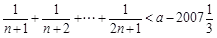
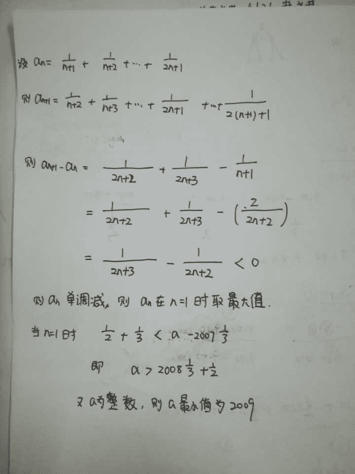
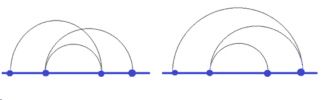

# Momenta2019 秋招技术岗笔试题

## 1

用 0 - 9 这 10 个数字组成一个首尾相连的字符串，每个数字可以重复出现多次，并且字符串中任意 2 个数字都相邻出现过。此字符串最小长度是（）

正确答案: D   你的答案: 空 (错误)

```cpp
47
```

```cpp
48
```

```cpp
49
```

```cpp
50
```

本题知识点

Java 工程师 C++工程师 Momenta 字符串 *2019* *讨论

[高辉 _gh](https://www.nowcoder.com/profile/271055343)

很简单，数字 0 必须与其他 9 个数字相邻，则 0 最少出现 5 次。每个数字的地位均等，根据对称性，50

发表于 2019-04-01 00:08:24

* * *

[ChubbyDog](https://www.nowcoder.com/profile/494436055)

将每一个数字看作一个节点，因为数字组成环，所以每一个节点(数字)的**出度(OD)等于入度(ID)**。当看作是完全无向图的时候，共有 n*(n-1)/2 条边，每一个节点有(n-1)条边。
（1）当节点数目 n 为奇数的时候，每一个节点有(n-1)条边，此时的 n-1 为偶数，如果直接将边变为有向的（不增加边数，只是将无向边变为有向的出或入边），可以有(n-1)/2 条出边或入边。 此时的边数目为 n*(n-1) /2 ，对应的节点也为 n*(n-1) /2
(2) 当节点数 n 为偶数的时候，每一节点有(n-1)条边，但此时 n-1 为奇数，无法分出均等的出边和入边，也就是说会存在某个节点用尽这 n-1 条边时还存节点尚未访问，此时只有再附加**出边**，使出度等于入度。所以要附加出边或者入边，最少的附加方案就是让每条边的出度=入度。也就是出度=入度=⌈(n-1)/2⌉ 。此时的节点数目(边数目) = n * (⌈(n-1)/2⌉)  = n*n /2 。总结： 数字数目 = n * (⌈( n - 1 ) / 2 ⌉) 本题中节点数目为 n=10，为偶数，所以需要的数字数目为 10 * 10 / 2 = 50--------------------利用对称性只能解决数字为偶数的情形，在数字为奇数的时候， 

发表于 2020-08-02 09:49:17

* * *

[大卫不加班](https://www.nowcoder.com/profile/767377095)

完全无向图，边的数量

发表于 2019-09-02 22:43:25

* * *

## 2

有 64 个节点的二叉树至少要有（） 层

正确答案: B   你的答案: 空 (错误)

```cpp
6
```

```cpp
7
```

```cpp
8
```

```cpp
9
```

本题知识点

Java 工程师 C++工程师 Momenta 树 2019

讨论

[linhuincu](https://www.nowcoder.com/profile/9434019)

二叉树的层数为 h，则总节点数等于 (2^h)-1；（2⁶）=64 < (64+1)；故需 7 层

发表于 2019-05-02 18:57:32

* * *

[无心是净 1](https://www.nowcoder.com/profile/9259791)

2 的 n 次方减一 n 为层数

发表于 2019-03-30 10:13:55

* * *

[Palai](https://www.nowcoder.com/profile/123764439)

最少的情况是满二叉树。，6 层总结点 2⁶-1=63 还多一个 第 7 层 所以 B

发表于 2020-12-09 23:16:24

* * *

## 3

 在三角形 ABC 中，已知 sinA = 10sinB * sinC, cosA = 10cosB * cosC, 那么 tanA 是 1

你的答案 (错误)

1 参考答案 (1) 11

本题知识点

Java 工程师 C++工程师 Momenta 2019

讨论

[fairydetail](https://www.nowcoder.com/profile/949437431)

cos(B+C)=cosBcosC-sinBsinC

10cos(B+C)=cosA-sinA

-10cosA=cosA-sinA

发表于 2019-03-30 17:20:34

* * *

[童心未泯丶](https://www.nowcoder.com/profile/903032739)

因为在△ABC 中，已知 sinA=10sinBsinC，cosA=10cosBcosC，
两式相减得 sinA-cosA=-10cos（B+C）=10cosA，
所以 sinA=11cosA，
所以 tanA=11；

发表于 2019-04-09 15:50:48

* * *

[16 级老腊肉](https://www.nowcoder.com/profile/955823416)

cosA-sinA=10cos(B+C)=-10cosA

发表于 2019-04-02 19:53:04

* * *

## 4

某车站每天 8:00--9:00,9:00--10:00，都恰有一辆客车到站，但到站的时刻是随机的，且两者到站的时间是相互独立的，其规律为

| 到站时刻 | 8:00--9:10 | 8:30--9:30  | 8:50--9:50 |
| 概率 |   |  |   |

一旅客 8:20 到车站，则它候车时间的数学期望为 1（精确到分）．

你的答案 (错误)

1 参考答案 (1) 27

本题知识点

Java 工程师 C++工程师 Momenta 2019

讨论

[陈效威](https://www.nowcoder.com/profile/2409413)

之前一直看错题了, 8:00--9:10 的意思是第一辆车八点, 第二辆车九点 10 分到, 而不是连续的时间区间...

X = 10 ， P(X) = 1/2  X = 30 ， P(X) = 1/3X = 50 ， P(X) = 1/6 * 1/6  X = 70 ， P(X) = 1/6 * 1/2X = 90 ， P(X) = 1/6 * 1/3E(X) = 10 * 1/2 + .... = 27.222

发表于 2019-03-31 12:54:23

* * *

[Toony](https://www.nowcoder.com/profile/574881474)

X = 10 ， P(X) = 1/2  X = 30 ， P(X) = 1/3X = 50 ， P(X) = (1-(1/2+1/3+1/6)) * 1/6  X = 70 ， P(X) = (1-(1/2+1/3+1/6)) * 1/2X = 90 ， P(X) = (1-(1/2+1/3+1/6)) * 1/3

发表于 2019-07-05 21:03:47

* * *

[16 级老腊肉](https://www.nowcoder.com/profile/955823416)

这辆车 8.20 到，所以不可能候 8.的时间，可能候的是 8.30、8.50、9.10、9.30、9.50 这五个时间，用等候的时长乘以对应的概率

发表于 2019-04-02 19:58:26

* * *

## 5

使不等式  对一切正整数 n  对一切正整数  a 的值为 1

你的答案 (错误)

1 参考答案 (1) 2009

本题知识点

Java 工程师 C++工程师 Momenta 2019

讨论

[FearIsUnreal](https://www.nowcoder.com/profile/2825614)



发表于 2019-04-20 20:03:51

* * *

[怡夫](https://www.nowcoder.com/profile/792548605)

设：an=1/（n+1)+1/(n+2)+…  +1/(2n+1)， an+1=1/(n+2)+1/(n+3)+…  +12/(n+3)， an+1-an=1/(2n+2)+1/(2n+3)-1/(n+1)＜0  所以 n 为正整数时 an 为单调递减数列， 使不等式 1/(n+1)+1/(n+2)+…  +1/(2n+1)＜a-2007 1/3 对一切正整数 n 都成立的最小正整数 a 的值， 就是 n=1 时，a＞2007 1/3+1/2+1/3=2008+1/6 成立的最小整数．即 2009． 故答案为：2009．

发表于 2019-04-02 09:01:55

* * *

[胡小黑](https://www.nowcoder.com/profile/983842835)

1/（n+1)+1/(n+2)+…  +1/(2n+1) < 积分(1,2n+1)(1/(x+1))) - 积分(1,n)(1/(x+1))) = ln((2n+2)/(n+1)) = ln2 所以 a = { 2007 + 1/3 + ln2 } 向上取整 =2009

发表于 2019-04-10 18:42:15

* * *

## 6

写出以下代码段的输出结果，并简述理由

```cpp
void test(int x[5]) {
    char
a[5][6];
    printf(“1.
%d”, sizeof(x));
    printf(“2.
%d”, sizeof(x[0]));
    printf(“3.
%d”, sizeof(a));
    printf(“4.
%d”, sizeof(a + 0));
    printf(“4.
%d”, sizeof(&a));
}
```

你的答案

本题知识点

Java 工程师 C++工程师 Momenta 2019

讨论

[linhuincu](https://www.nowcoder.com/profile/9434019)

看了评论区的解答实在看不下去了，大家水平就这么点吗？好像没一个全对，下面的结果是在 64 位机器跑的结果，（为了方便看输出加了\n）：1.20
2.4
3.30
4.4
4.4

发表于 2019-05-03 10:57:02

* * *

[陈效威](https://www.nowcoder.com/profile/2409413)

x 传入是作为数组之指针, 指针大小一直等于 8x[0] 是整数, 整数的大小为 4char 数组为 1*5*6 = 30 , 记得 char 的大小为 1a+0 为当前指针&a 为当前指针

编辑于 2019-03-31 13:02:42

* * *

[C_lover](https://www.nowcoder.com/profile/887526444)

若是 32 位，则指针大小为 4，那么答案为 4,4,30,4,4 若是 64 位，则指针大小为 8，答案为 8,8,30,8,8 若有不对之处还望指出

发表于 2019-04-03 21:57:08

* * *

## 7

用变量 p 给出下面的定义 a）一个指向指针的指针，它指向的指针是指向一个整型数的指针; b) 一个有 10 个指针的数组，该指针是指向一个整型数的指针; c) 一个指向有 10 个整型数数组的指针（A pointer to an array of 10 integers） d) 一个指向函数的指针，该函数有一个整型参数并返回一个整型数; e) 一个有 10 个指针的数组，该指针指向一个函数，该函数有一个整型参数并返回一个整型数;

你的答案

本题知识点

Java 工程师 C++工程师 Momenta 2019

讨论

[拿 offer 拿到手软 666](https://www.nowcoder.com/profile/6764086)

a) int **p;b) int *p[10];c) int (*p)[10];d) int (*p)(int n);e) int (*p[10])(int n);

发表于 2019-04-04 12:54:34

* * *

[mohhao](https://www.nowcoder.com/profile/369230406)

```cpp
int ** p
```

```cpp
int * p[10]
```

```cpp
int (*p)[10]
int *p(int)

```
int (*p[10])(int)
```cpp

```

发表于 2019-04-05 11:15:17

* * *

[一个炸](https://www.nowcoder.com/profile/449849562)

int p ;int*a[10]int (*a)[10]int (*a[10])(int) 

发表于 2019-04-02 11:28:25

* * *

## 8

设有 k≥1 堆硬币，各堆分别含有 n1,n2...nk 枚硬币。

游戏中两个人交替拿取硬币，每次只能从剩余硬币数大于 0 的其中一堆取走任意数量硬币（至少 1 枚，至多取完），取走最后一枚硬币的人取胜。在游戏双方均足够理智的情况下，给出先手必胜的条件。

你的答案

本题知识点

Java 工程师 C++工程师 Momenta 2019

讨论

[zfy_Farry](https://www.nowcoder.com/profile/671612793)

该问题属于尼姆博弈问题的推广，若要先手必胜只需要 n1，n2，...，nk 中硬币的个数按位异或，即 n1xor n2 xor n3 ... xor nk 不为零就行了。

发表于 2019-04-23 15:57:21

* * *

[机械从入门到单身](https://www.nowcoder.com/profile/8878170)

n,m 问题，总体堆的异或运算不为 0，就好了

发表于 2019-04-19 23:12:08

* * *

[lalalahs](https://www.nowcoder.com/profile/718095)

k=1 时必胜 k=2 且 n1 不等于 n2 时，必胜策略是每次拿多的让两堆相等 k=3 且存在两堆相等时，必胜策略是把另外一堆全拿走，收敛为 k=2 的情况。k=3 且每堆都不等时，推不出来了……太复杂了

发表于 2019-04-12 16:29:00

* * *

## 9

假如让你对总量为 500G 的文件（单个文件约为 1M）进行去重，你会怎么做，简述理由和考虑。

你的答案

本题知识点

Java 工程师 C++工程师 Momenta 2019

讨论

[linhuincu](https://www.nowcoder.com/profile/9434019)

归并排序不太可取，由于 500G 内存已经很大，归并排序的空间复杂度为 O(n)，采用归并排序意味着还需要有一个至少 500G 的内存。可以采用空间复杂度为 O(1)的同时时间复杂度为 O(nlogn)的非递归版堆排序或者希尔排序对 500G 内存按大小排序；内存大小不一样的文件肯定不是同一文件，之后再对内存大小相同的文件进行去重操作即可。

编辑于 2019-05-03 17:32:44

* * *

[mohhao](https://www.nowcoder.com/profile/369230406)

归并排序所有小文件，归并的过程中去重根据内存大小确定排序树的数量

发表于 2019-04-05 11:40:03

* * *

## 10

假如让你对总量为 500G 的文件（单个文件约为 1M）进行去重，你会怎么做，简述理由和考虑。

你的答案

本题知识点

Java 工程师 C++工程师 Momenta 2019

## 11

简述简单工厂模式、工厂模式、抽象工厂模式。

你的答案

本题知识点

Java 工程师 C++工程师 Momenta 2019

讨论

[陈效威](https://www.nowcoder.com/profile/2409413)

Simple Factory Pattern :    Create a specialized object 有一个专门生产某个产品的类
Factory Pattern:

*   Create an interface for creating object, but let subclasses to decide which class to instance
*   生成父类，在使用过程中将父类实例化为子类

Abstract Factory Pattern:

*   Create a family of specialized object
*   由不同的 function 定义生成那种子类

发表于 2019-03-31 13:13:13

* * *

## 12

你有一套 40 张的卡牌，其中有若干张红牌，问至少有多少张红牌可以使得洗牌后，顺序翻 5 张，出现两张红牌的概率大于 80%，给出计算过程。

你的答案

本题知识点

Java 工程师 C++工程师 Momenta 2019

## 13

有 L 升汽油，m 块钱，有若干条路段，行驶完每条路段消耗 1 升汽油和 c 元路费，加油费每升 g 元，问最多可以开多少条路段？

你的答案

本题知识点

Java 工程师 C++工程师 Momenta 2019

讨论

[我是个机器人](https://www.nowcoder.com/profile/886458180)

if(m/c <=L) return m/c;else return (m-c*L)/(g+c)+L;

发表于 2019-08-05 17:14:58

* * *

[孙曦](https://www.nowcoder.com/profile/238515047)

(m-Lc)/(g+c)

发表于 2019-07-15 23:02:38

* * *

[AI 研习社](https://www.nowcoder.com/profile/509094518)

1

发表于 2019-04-12 15:49:22

* * *

## 14

简述 join、inner join、outer join、left join、right join 的区别。

你的答案

本题知识点

Java 工程师 C++工程师 Momenta 2019

讨论

[AI 研习社](https://www.nowcoder.com/profile/509094518)

1

发表于 2019-04-12 15:49:25

* * *

## 15

列举常见数据库的类型，并分别至少举出一个例子和至少一个 connector（不限编程语言）。

你的答案

本题知识点

Java 工程师 C++工程师 Momenta 2019

## 16

写出以下代码段的输出结果，并简述理由。

```cpp
setTimeout(() => {
  console.log(1)
}, 0);
new Promise((resolve) => {
  console.log(2);
  for( var i=0 ; i<1000000 ; i++ ) {
     i == 9999 && resolve();
  }
  console.log(3);
}).then(() => {
  console.log(4);
});
console.log(5);

```

你的答案

本题知识点

Java 工程师 C++工程师 Momenta 2019

讨论

[DOUBLEMINT€](https://www.nowcoder.com/profile/782876552)

2,3,5,4,1

发表于 2019-12-04 21:27:22

* * *

## 17

前端性能优化可以从哪些地方入手？怎么做？请简述。

你的答案

本题知识点

Java 工程师 C++工程师 Momenta 2019

## 18

写出以下代码段的输出结果，并简述理由。

```cpp
void test(int x[5]) {
    char a[5][6];

    printf(“1. %d”, sizeof(x));
    printf(“2. %d”, sizeof(x[0]));
    printf(“3. %d”, sizeof(a));
    printf(“4. %d”, sizeof(a + 0));
    printf(“4. %d”, sizeof(&a));
}

```

你的答案

本题知识点

Java 工程师 C++工程师 Momenta 2019

## 19

结合代码，解释 C++的虚函数表。

你的答案

本题知识点

Java 工程师 C++工程师 Momenta 2019

## 20

在训练一个神经网络的时候存在多任务的情况，不同的任务有不同的 loss 函数表达式，请问要注意什么问题？如何解决这个问题？

你的答案

本题知识点

Java 工程师 C++工程师 Momenta 2019

讨论

[mohhao](https://www.nowcoder.com/profile/369230406)

注意各个 loss 的权重，最好可以自适应权重

发表于 2019-04-05 11:47:23

* * *

## 21

请对自己已经了解的一些主流的物体检测的算法们做一些分类，并同时写出你的分类标准。

你的答案

本题知识点

Java 工程师 C++工程师 Momenta 2019

## 22

请详细描述一下 FasterRCNN 训练 RPN 部分的输入输出极其对应含义，尽可能给出多的细节。

你的答案

本题知识点

Java 工程师 C++工程师 Momenta 2019

## 23

写出 NMS（Non-Maximum Suppression）算法的伪代码。

你的答案

本题知识点

Java 工程师 C++工程师 Momenta 2019

## 24

给定两幅图像上匹配的特征点对 x, x'，写出匹配点对与两帧图像之间的基础矩阵(fundamental matrix，以 F 表示）之间的关系，写出匹配点对与两帧图像之间的单应矩阵( Homography，以 H 表示）之间的关系。

你的答案

本题知识点

Java 工程师 C++工程师 Momenta 2019

讨论

[mohhao](https://www.nowcoder.com/profile/369230406)

不会

发表于 2019-04-05 11:49:59

* * *

[wszwzy123](https://www.nowcoder.com/profile/652605383)

x^T*F*x'=0x'=H*p

发表于 2019-04-03 20:32:09

* * *

[suger+](https://www.nowcoder.com/profile/142877925)

```cpp
#include <iostream>
#include <stdio.h>
#include <stdlib.h>
int IsValidMobile(char* number) {
 int flag = 0;
 if (strlen(number) != 13)
  flag = 1;
 else {
  for (int i = 0; i < 13; i++) {
   if (number[i]<'0' && number[i]>'9')
    flag = 2;
   break;
  }
  if (flag != 2 && (number[0] != 8 || number[1] != 6 || number[2] != 1))
   flag = 3;
  else
   flag = 0;
 }
 return flag;
}

```

发表于 2019-04-02 15:08:07

* * *

## 25

写出你对图像特征点的理解，一类或多类均可（如 ORB，SIFT 等）。

你的答案

本题知识点

Java 工程师 C++工程师 Momenta 2019

讨论

[mohhao](https://www.nowcoder.com/profile/369230406)

haar 小波

发表于 2019-04-05 11:50:28

* * *

[wszwzy123](https://www.nowcoder.com/profile/652605383)

图像特征指的是纹理特征 FAST 不具有旋转不变性和角度不变性，在中心像素周围有连续 N 个像素的灰度大于或小于某阈值时，就被识别为 FAST 特征点 ORB 具有旋转和尺度不变性，在 FAST 特征点的基础上增加了 BRIEF 描述子用于特征匹配；通过图像金字塔实现了尺度不变性，通过计算灰度质心实现了角度不变性；BRIEF 描述子的计算方法是在中心像素周围按照某种模式取 128 个点对，将 128 个点对的灰度差二值化为 128 位，通过计算两个特征点描述子之间的汉明距离判断是否为同一特征点

发表于 2019-04-03 20:34:52

* * *

## 26

大 M 布置给小 M 一个题目：首先给出 n 个在横坐标上的点，然后连续的用半圆连接他们：首先连接第一个点与第二点(以第一个点和第二点作为半圆的直径)。然后连接第二个第三个点，直到第 n 个点。现在需要判定这些半圆是否相交了，在端点处相交不算半圆相交。如下图所示。

本题知识点

Java 工程师 C++工程师 Momenta 排序 *数学 2019* *讨论

[nbgao](https://www.nowcoder.com/profile/211289)

```cpp
#include <bits/stdc++.h>
using namespace std;

bool F(int l1, int r1, int l2, int r2){
    return (l2<r1 && l2>l1 && r2>r1) || (r2<r1 && r2>l1 && l2<l1);
}

int main(){
    int T,n,l1,r1,l2,r2;
    cin>>T;
    while(T--){
        cin>>n;
        int a[n];
        for(int i=0;i<n;i++)
            cin>>a[i];
        bool flag = true;
        for(int i=2;i<n && flag;i++){
            l1 = min(a[i], a[i-1]);
            r1 = max(a[i], a[i-1]);
            for(int j=i-2;j>0;j--){
                l2 = min(a[j], a[j-1]);
                r2 = max(a[j], a[j-1]);
                if(F(l1, r1, l2, r2)){
                    flag = false;
                    break;
                }
            }
        }
        cout<<(flag?'n':'y')<<endl;
    }
    return 0;
}
```

发表于 2019-08-24 02:23:45

* * *

[ElonB](https://www.nowcoder.com/profile/623894)

```cpp
""""
找到规律本题不难，对连续的 3 个值 p1，p2，p3
若 p3 落在 p1、p2 中间，则 p1、p2 区间两侧不能再取值用 flag[]=False 标记，
否则，p1、p2 构成的区间内不能再取值。
by the way：
本题 -1000000 ≤ ai ≤ 1000000，对每一个整数设置并修改 flag 时空复杂度较高，
所以通过排序好的 b 只对经过的点设置 flag，没有经过的点设置 flag 是没意义的。
"""
if __name__ == "__main__":
    T = int(input())
    for _ in range(T):
        n = int(input())
        a = list(map(int, input().strip().split()))
        if len(a) <= 3:
            print('n')
            continue
        b = sorted(a)

        flag = [True] * len(b)  # 所有点都可取
        ans = True  # 初始设为没有相交点
        p1, p2 = a[0], a[1]
        for i in range(2, len(a)):
            if flag[b.index(a[i])] == False:  # 判断此点是否在之前标记为不可取
                ans = False  # 存在一个相交点，即停止遍历并输出结果
                break
            if min(p1, p2) < a[i] < max(p1, p2):  # 更新区间外的 flag 为 False
                for j in range(0, b.index(min(p1, p2))):
                    flag[j] = False
                for j in range(b.index(max(p1, p2)) + 1, len(b)):
                    flag[j] = False
            else:  # 更新区间内 flag 为 False
                for j in range(b.index(min(p1, p2)) + 1, b.index((max(p1, p2)))):
                    flag[j] = False
            p1, p2 = p2, a[i]
        print('n' if ans else 'y')

```

发表于 2019-07-16 16:21:48

* * *

[牛客 926620913 号](https://www.nowcoder.com/profile/926620913)

python3:最后一组超时啦

```cpp
while True:
    try:
        n = int(input())
        for case in range(n):
            m1 = int(input())
            list1 = list(map(int,input().split()))
            one = list()
            for i in range(len(list1)):
                if i <m1-1:
                    one.append((list1[i],list1[i+1]))
            count = 0
            flag = False
            #print(one)
            for i in one:
                k1,k2 = i[0],i[1]
                count+=1
                for j in range(count,len(one)):
                    ppp = one[j]
                    p1,p2 = ppp[0],ppp[1]

                    if (min(k1,k2)<min(p1,p2) and max(k1,k2)>min(p1,p2) and max(k1,k2)<max(p1,p2))&nbs***bsp;(max(k1,k2)>max(p1,p2) and min(k1,k2)<max(p1,p2) and min(k1,k2)>min(p1,p2)):
                        flag =True
                        break
                else:
                    continue
                break
            if flag == True:
                print('y')
            else:
                print("n")

    except:
        break
```

发表于 2022-01-08 18:31:48

* * *

## 27

小 M 和大 M 要通过选择元素组成队列进行得分 pk。目前存在队列 S1,S2,S3...Sn,每个元素包括 2 个正整数属性 set 和 value.从中选出任意 K 个元素 S[i1],S[i2]...S[ik],保证顺序不变即 i1 < i2 < i3< ... < ik,组成新的队列 P1,P2,P3......Pk.我们通过一个机制评价队列的好坏:

Base=P1.value+P2.value+...Pk.value,

Bonus=10*t;t 为新队列中 Pi.set=P(i+1).set 的 i 个数.

最终得分 Score=Base-Bonus;求 Score 的最大值和取最大值时新队列元素个数的最小值.

本题知识点

Java 工程师 C++工程师 Momenta 动态规划 队列 *模拟 数学 2019* *讨论

[ElonB](https://www.nowcoder.com/profile/623894)

```cpp
""""
动态规划求解，或 DFS
参考@无心 2019 代码，设 dp[n]为选中 Si 且以 Si 结尾的最大值，
dp[n] = max{ dp[0]+Score, dp[1]+Score, ... ,dp[n-1]+Score, Base }
"""

class node:
    def __init__(self, set, value):
        self.set = set
        self.value = value

if __name__ == "__main__":
    N = int(input())
    S = []
    for _ in range(N):
        a, b = map(int, input().strip().split())
        S.append(node(a, b))
    dp, cnt = [], []
    for j in range(N):
        t_max, t_cnt = 0, 0
        for i in range(j):
            tmp = dp[i] - 10 * (1 if S[i].set == S[j].set else 0)
            if tmp > t_max:
                t_max = tmp
                t_cnt = cnt[i]
            elif tmp == t_max:
                t_cnt = min(t_cnt, cnt[i])
        dp.append(t_max + S[j].value)
        cnt.append(t_cnt + 1)
    ans_max, ans_cnt = 0, 0
    for i in range(N):
        if ans_max < dp[i]:
            ans_max = dp[i]
            ans_cnt = cnt[i]
        elif ans_max == dp[i]:
            ans_cnt = min(ans_cnt, cnt[i])
    print(ans_max, ans_cnt)
```

编辑于 2019-07-16 17:41:35

* * *

[无心 2019](https://www.nowcoder.com/profile/991674511)

```cpp
#include <bits/stdc++.h>
using namespace std;
int main()
{
    int n;
    cin>>n;
    int s[n][2];
    for(int i=0;i<n;i++)
        cin>>s[i][0]>>s[i][1];
    int dp[n],num[n];
    int i, j, ans = 0, ansNum = 0, cur, curNum;
    for (i = 0; i < n; ++i)
    {
        cur = curNum = 0;
        for (j = 0; j < i; ++j)
        {
            if (cur < dp[j] - (s[i][0] == s[j][0] ? 10 : 0))
            {
                cur = dp[j] - (s[i][0] == s[j][0]? 10 : 0);
                curNum = num[j];
            }
        }
        dp[i] = cur + s[i][1];
        num[i] = curNum + 1;
        if (ans < dp[i])
        {
            ans = dp[i];
            ansNum = num[i];
        }
    }
    cout<<ans<<" " <<ansNum<<endl;
    return 0;
}

```

发表于 2019-07-09 18:18:39

* * *

[WMYW](https://www.nowcoder.com/profile/222543223)

```cpp
//用 unordered_map 即可，在输入做判断
#include<iostream>
(720)#include<unordered_map>
#include<vector>
using namespace std;
int main()
{
    int n;
    cin>>n;
    int set,value;
    unordered_map<int,vector<int>> m;
    int set11,value11;
    while(n)
    {
        cin>>set>>value;
        if(set11!=set||value>value11||value>10)
        {
            if(set11!=set)
                m[set].push_back(value);
            else
            {
                if(value11>10)
                    m[set].push_back(value-10);
                else
                    m[set11][m[set11].size()-1]=value;
            }
            set11=set;
            value11=value;
        }
        n--;
    }
    int sum=0,num=0;
    for(auto it:m)
    {
        for(auto ot:it.second)
        {
            sum+=ot;
            num++;
        }
    }
    cout<<sum<<" "<<num;
}
```

发表于 2020-04-21 10:00:29

* * *

## 28

小 M 突然对怪数产生了兴趣。假设一个数 n，如果[n/1]+[n/2]+...+n/k 为一个偶数，那么这个数是一个怪数，现在给定一个区间[a,b]，求[a,b]之间有多少怪数。

[x]表示不大于 x 的最大整数。

本题知识点

Java 工程师 C++工程师 Momenta 数学 2019 数组

讨论

[初心者托奇](https://www.nowcoder.com/profile/926219153)

找规律呗，它要你输出数量，又不是真要你去算哪些符合要求~观察可得，[i²,(i + 1)²)中的数为怪数（i 为一切偶自然数，左闭右开区间）。例如，0 是怪数，123 不是怪数，45678 是怪数，9101112131415 又不是怪数，16~24 又是怪数，25~35 又不是怪数……找到规律就 so easy 了。

```cpp
a,b = list(map(int,input().split())),[0,0]
for i in range(2):
    b[i] = sum([j * 2 - 1 for j in range(1,int(a[i] ** 0.5) + 1,2)])
    if 1 - int(a[i] ** 0.5) % 2:
        b[i] += a[i] - int(a[i] ** 0.5) ** 2 + i
print(b[1] - b[0])
```

编辑于 2020-03-17 15:58:07

* * *

[WMYW](https://www.nowcoder.com/profile/222543223)

```cpp
//参考@初心者托奇的思路写的
#include<iostream>
#include<math.h>
using namespace std;
int main()
{
    unsigned int a,b;
    cin>>a>>b;
    int num=0;
    int i=0;
    while(pow(i,2)<a)
    {
        i++;
    }
    while(pow(i,2)<=b)
    {
        if((i-1)%2==0)
        {
            num+=pow(i,2)-a;
            a=pow(i,2);
            i++;
        }
        else
        {
            a=pow(i,2);
            i++;
        }
    }
    if((i-1)%2==0)
        num+=b-a+1;
    cout<<num;
    return 0;
}
```

编辑于 2020-04-23 12:01:59

* * *

[nbgao](https://www.nowcoder.com/profile/211289)

```cpp
#include <bits/stdc++.h>
#define ll long long
using namespace std;

ll F(ll x){
    if(x<0)
        return 0;
    else if(x==0)
        return 1;
    ll s=0, v = sqrt(x);
    if(v%2){
        s = v*(v+1)/2;
    }else{
        ll t = v-1;
        s = t*(t+1)/2;
        s += x-v*v+1;
    }
    return s;
}

int main(){
    ll a, b;
    cin>>a>>b;
    cout<<F(b)-F(a-1)<<endl;

    return 0;
}
```

发表于 2019-11-21 23:38:42

* * *

## 29

小 M 最近爱上了扫雷游戏，就是在一个 n*m 的区域中，有地雷，每一个方格上都有一个数字 s，表示在这个方格周围有 s 颗雷，现在给你一张表明地雷的图，并且指定一个位置点开，请输出点开后的数字情况，若点开的地方的数字为 0，则向该方格周围扩展，直到遇到数字或者地图边界为止，若点开的地方为地雷,那么直接输出"GG"。

周围指的是上，左上，左，左下，下，右下，右，右上八个方向。

本题知识点

Java 工程师 C++工程师 Momenta 模拟 数组 2019

讨论

[勇敢牛牛，不怕困难！](https://www.nowcoder.com/profile/840813925)

```cpp

```
#include <stdio.h>
#include <stdlib.h>
#include <stdbool.h>
#include <string.h>
#include <errno.h>

#define N 1001

#define OK 1
#define ERROR -1
#define MEM_OVERFLOW -2

#define not !

typedef int Status;

// 两维平面的纵横坐标系
typedef struct Coordintate {
  int x;
  int y;
} Coord;

// =============== 循环队列的存储结构表示与实现 ===============
typedef Coord QElemType;

typedef struct {
  QElemType* base;
  int front;
  int rear;
  int capacity;
} SqQueue;

Status InitQueue(SqQueue* Q, int capacity) {
  if (capacity < 1) {
    printf("InitQueue ERROR: The capacity %d Must be > 0!", capacity);
    return ERROR;
  }
  if (!(Q->base = (QElemType*) malloc((capacity + 1) * sizeof(QElemType)))) {
    printf("InitQueue Memory Overflow: %s\n", strerror(errno));
    exit(MEM_OVERFLOW);
  }
  Q->front = Q->rear = 0;
  Q->capacity = capacity + 1;
  return OK;
}

bool QueueEmpty(SqQueue* Q) {
  return Q->front == Q->rear;
}

bool QueueFull(SqQueue* Q) {
  return (Q->rear + 1) % Q->capacity == Q->front;
}

size_t QueueLength(SqQueue* Q) {
  return (Q->rear - Q->front + Q->capacity) % Q->capacity;
}

Status EnQueue(SqQueue* Q, QElemType e) {
  if (QueueFull(Q)) {
    puts("EnQueue ERROR: The queue is full!");
    return ERROR;
  }
  Q->rear = (Q->rear + 1) % Q->capacity;
  *(Q->base + Q->rear) = e;
  return OK;
}

Status DeQueue(SqQueue* Q, QElemType* ret) {
  if (QueueEmpty(Q)) {
    puts("DeQueue ERROR: The queue is empty!");
    return ERROR;
  }
  Q->front = (Q->front + 1) % Q->capacity;
  *ret = *(Q->base + Q->front);
  return OK;
}

Status DestroyQueue(SqQueue* Q) {
  free(Q->base);
  return OK;
}
// =============== 循环队列的存储结构表示与实现 ===============

// =============== The global variable area ===============
char board[N][N];
int visited[N][N];
int m, n, sx, sy;
// =============== The global variable area ===============

// =============== function declaration ===============
/** 初始化棋盘 */
void initBoard(void);
/** 广度优先搜索算法 */
void breadth_first_search_algorithm();
/** 在电脑屏幕上打印扫雷棋盘 */
void printBoard(void);
// =============== function declaration ===============

int main(const int argc, const char** argv) {
  initBoard();
  // corner case
  if (board[sy][sx] == '*')
    return puts("GG"), 0; // GAME OVER == GG

  // two solutions
  breadth_first_search_algorithm();
  // depth_first_search_algorithm();
  printBoard();
  return 0;
}

void initBoard(void) {
  int x, y;
  scanf("%d%d", &m, &n);
  scanf("%d%d", &sy, &sx);

  getchar();
  for (y = 1; y <= m; ++y) {
    for (x = 1; x <= n; ++x)
      scanf("%c", &board[y][x]);
    getchar();
  }

  memset(visited, 0x0000, sizeof visited);
} 

void breadth_first_search_algorithm(void) {
  SqQueue Q;
  InitQueue(&Q, 2000);

  EnQueue(&Q, (Coord) {.x = sx, .y = sy});
  visited[sy][sx] = 1; // mark as visited

  Coord coord;
  int x, y, r, c, cnt;
  while (not QueueEmpty(&Q)) {
    DeQueue(&Q, &coord);
    x = coord.x, y = coord.y;

    cnt = 0; // 当前坐标四周 8 个方向的**数量
    for (r = fmax(1, y - 1); r <= fmin(m, y + 1); ++r)
      for (c = fmax(1, x - 1); c <= fmin(n, x + 1); ++c)
        cnt += board[r][c] == '*';

    board[y][x] = cnt + 48;
    if (cnt) continue;
    for (r = fmax(1, y - 1); r <= fmin(m, y + 1); ++r)
      for (c = fmax(1, x - 1); c <= fmin(n, x + 1); ++c) {
        if (visited[r][c]) continue;
        EnQueue(&Q, (Coord) {.x = c, .y = r});
        visited[r][c] = 1; // mark as viisted
      }
  }

  DestroyQueue(&Q);
}

void printBoard(void) {
  int x, y;
  for (y = 1; y <= m; ++y) {
    for (x = 1; x <= n; ++x)
      printf("%c", board[y][x]);
    putchar('\n');
  }
}
```cpp

```

编辑于 2021-07-05 17:22:11

* * *

[ElonB](https://www.nowcoder.com/profile/623894)

```cpp
/*
连通图的遍历
*/
#include <bits/stdc++.h>
using namespace std;
#define N 1002

int n, m, x, y;
int dx[8] = {-1, -1, 0, 1, 1, 1, 0, -1};
int dy[8] = {0, -1, -1, -1, 0, 1, 1, 1};
char a[N][N];
bool display[N][N], vis[N][N];

void count()
{
    for(int i = 1; i <= n; i++) {
        for(int j = 1; j <= m; j++) {
            if(a[i][j] == '*') {
                display[i][j] = true;
                for(int k = 0; k < 8; k++) {
                    if(a[i + dx[k]][j + dy[k]] == '*' || a[i + dx[k]][j + dy[k]] == 0) continue;
                    if(a[i + dx[k]][j + dy[k]] == '.') {
                        a[i + dx[k]][j + dy[k]] = '1';
                    } else {
                        a[i + dx[k]][j + dy[k]]++;
                    }
                }
            }
        }
    }
    for(int i = 1; i <= n; i++) {
        for(int j = 1; j <= m; j++) {
            if(a[i][j] == '.') {
                a[i][j] = '0';
            }
        }
    }
}
void sweep()
{
    display[x][y] = true;
    if(a[x][y] != '0') return;
    queue<pair<int, int>> Q;
    Q.push(make_pair(x, y));
    vis[x][y] = true;
    int i, j;
    while(!Q.empty()) {
        tie(i, j) = Q.front();
        Q.pop();
        for(int k = 0; k < 8; k++) {
            display[i + dx[k]][j + dy[k]] = true;
            if(a[i + dx[k]][j + dy[k]] == '0' && vis[i + dx[k]][j + dy[k]] == false) {
                vis[i + dx[k]][j + dy[k]] = true;
                Q.push(make_pair(i + dx[k], j + dy[k]));
            }
        }
    }
}
void print()
{
    if(a[x][y] == '*') {
        printf("GG\n");
        return;
    }
    for(int i = 1; i <= n; i++) {
        for(int j = 1; j <= m; j++) {
            if(display[i][j]) {
                printf("%c", a[i][j]);
            } else {
                printf(".");
            }
        }
        cout << endl;
    }
}

int main()
{
//    freopen("input.txt","r",stdin);
    int i, j;
    cin >> n >> m >> x >> y;
    memset(a, 0, sizeof(a));
    memset(display, 0, sizeof(display));
    memset(vis, 0, sizeof(vis));
    for(i = 1; i <= n; i++) {
        getchar();
        for(j = 1; j <= m; j++) {
            cin >> a[i][j];
        }
    }
    count();  // 统计全图各点周围的雷数
    sweep();  // 连通图扫描出显示区域
    print();  // 输出显示区域
}

```

编辑于 2019-07-16 20:49:35

* * *

[nbgao](https://www.nowcoder.com/profile/211289)

```cpp
#include <bits/stdc++.h>
using namespace std;

char G[1002][1002];
int n,m;
int dir[8][2] = {{0,-1}, {0,1}, {-1,0}, {1,0}, {-1,-1}, {-1,1}, {1,-1}, {1,1}};

struct P{
    int x,y;
};

int F(int x, int y){
    int cnt = 0;
    for(int i=x-1;i<=x+1;i++)
        for(int j=y-1;j<=y+1;j++)
            if(G[i][j]=='*')
                cnt++;
    G[x][y] = '0' + cnt;
    return cnt;
}

void BFS(int x, int y){
    queue<P> q;
    q.push(P{x,y});
    while(!q.empty()){
        P p = q.front();
        q.pop();
        for(int i=0;i<8;i++){
            int xx = p.x + dir[i][0];
            int yy = p.y + dir[i][1];
            if(xx==0 || xx==n+1 || yy==0 || yy==m+1 || G[xx][yy]!='.')
                continue;
            int s = F(xx,yy);
            if(s==0)
                q.push(P{xx,yy});
        }
    }
    return;
}

int main(){
    int x,y;
    cin>>n>>m>>x>>y;
    for(int i=1;i<=n;i++)
        for(int j=1;j<=m;j++)
            cin>>G[i][j];
    if(G[x][y]=='*')
        cout<<"GG"<<endl;
    else{
        if(F(x,y)==0)
            BFS(x,y);
        for(int i=1;i<=n;i++){
            for(int j=1;j<=m;j++)
                cout<<G[i][j];
            cout<<endl;
        }
    }
    return 0;
}
```

发表于 2019-11-17 03:52:17

* * *

## 30

小 M 给你一个长度为 n 的数组，我们定义 median 数为该数组从小到大排序后，下标为(n-1)/2 的数字。下标从 0 开始，(n-1)/2 表示整数除法，即向下取整。现在我们已经得到了一个初始的数组，我们希望这个数组的 median 数是一个给定数字 x。所以我们需要加入一些数到数组中从而完成我们的目标。数组中的元素可以重复，请问，最少需要加入多少个数字才能达成这个目标。

本题知识点

Java 工程师 C++工程师 Momenta 数组 查找 *贪心 模拟 2019* *讨论

[nbgao](https://www.nowcoder.com/profile/211289)

```cpp
#include <bits/stdc++.h>
using namespace std;

int main(){
    int n,x;
    cin>>n>>x;
    int a[n];
    int m = (n-1)/2, l=0, r=0, e=0;
    for(int i=0;i<n;i++){
        cin>>a[i];
        if(a[i]==x)
            e++;
        else if(a[i]<x)
            l++;
        else
            r++;
    }
    if(l<=m){
        if(r<n-m)
            cout<<0<<endl;
        else
            cout<<r-l-e<<endl;
    }else{
        cout<<l+1-r-e<<endl;
    }

    return 0;
}
```

编辑于 2019-08-14 07:57:05

* * *

[offer 給我，我要回家](https://www.nowcoder.com/profile/93889150)

```cpp
import java.util.*;
public class Main{
    public static void main(String[]args){
        Scanner sc=new Scanner(System.in);
                //至少添加的次数，即结果
        int res=0;
        int nums=sc.nextInt();
        int target=sc.nextInt();
                //小于中位数的个数
        int min=0;
                //大于中位数的个数
        int max=0;
                //等于中位数的个数
        int same=0;
                //中位数是否存在
        boolean isExist=false;
        for(int i=0;i<nums;i++){
            int temp=sc.nextInt();
            if(temp>target){
                max++;

            }
            else if(temp<target){
                min++;
            }
            else if(temp==target){
                              //中位数已存在,保存多出来的个数
                  if(isExist){
                    same++;
                  }else{
                isExist=true;}
            }
        }
                //如果不存在中位数,添加中位数，次数加一
        if(isExist==false) res++;
                //如果 max 大于 min 的时候,记录差值为 dif
//如果 dif 大于 same 时，中位数的左边要添加 dif-same-1 个数组
//举例：中位数为 3  1 2 3 3 3 4 4 4 4 4 4 4
//因为中位数永远位于左边，所以可以少添加一个 
//如果 dif 小于 same 时，添加 0
//举例： 中位数为 3  1 2 2 3 3 3 3 4 4 4 4
        if(max>min){
            int dif=max-min;
            dif=dif>same?dif-same-1:0;
            res+=(dif);
        }
                //如果 min 大于 max 情况的时候 ，记录差值为 dif
//如果 dif 大于 same 时 中位数的右边要添加 dif-same 个数字：举例 中位数为 3  1 2 2 2 2 3 3 4 4 
                //如果 dif 小于等于 same 时 添加 0：举例 中位数为 3  1 2 2 2 3 3 3 3 4 
        else if(min>max){
            int dif=min-max;
            dif=dif>same?dif-same:0;
            res+=(dif);
        }

        System.out.print(res);
    }
}
```

发表于 2019-09-13 14:45:57

* * *

[ElonB](https://www.nowcoder.com/profile/623894)

```cpp
""""
n 最大为 500，暴力尝试
"""

def median(a, x):
    ans = 0
    if a[(len(a) - 1) // 2] == x:
        ans = 0
    while a[(len(a) - 1) // 2] > x:
        a.insert(0, a[0])
        ans += 1
    while a[(len(a) - 1) // 2] < x:
        a.append(a[-1])
        ans += 1
    return ans

if __name__ == "__main__":
    n, x = map(int, input().strip().split())
    a = list(map(int, input().strip().split()))
    if x in a:
        a.sort()
        ans = median(a, x)
    else:
        a.append(x)
        a.sort()
        ans = median(a, x) + 1
    print(ans)
```

发表于 2019-07-16 21:28:52

* * *

## 31

k 倍多重正整数集合的定义是：在一个多重集合（元素可以重复）中，不存在一个正整数是另一个正整数的 k 倍。

现在小 M 有 n 个正整数，你可以选择其中一些数构成 k 倍多重正整数集合。请求出最多能选出多少数来构成它。

本题知识点

Java 工程师 C++工程师 Momenta 贪心 动态规划 哈希 *穷举 2019* *讨论

[ElonB](https://www.nowcoder.com/profile/623894)

```cpp
/*
找规律
*/
#include <bits/stdc++.h>
using namespace std;

int main()
{
//  freopen("input.txt","r",stdin);
    int n, k, i, x, t_min;
    cin >> n >> k;
    map<int, int> dic;
    for(i = 0; i < n; i++) {
        cin >> x;
        dic[x]++;
    }
    if(k == 1) {
        cout << dic.size() << endl;
        return 0;
    }
    for(auto it = dic.begin(); it != dic.end(); it++) {
        if(dic.find(it->first * k) == dic.end()) continue;
        if(it->second < 1 || dic[it->first * k] < 1) continue;
        t_min = min(it->second, dic[it->first * k]);
        n -= t_min;
        it->second -= t_min;
        dic[it->first * k] -= t_min;
    }
    cout << n << endl;
}

```

发表于 2019-07-17 10:48:34

* * *

[nbgao](https://www.nowcoder.com/profile/211289)

```cpp
#include <bits/stdc++.h>
using namespace std;

int main(){
    int n,k,x,t;
    cin>>n>>k;
    map<int, int> M;
    for(int i=0;i<n;i++){
        cin>>x;
        M[x]++;
    }
    if(k==1){
        cout<<M.size()<<endl;
    }else{
        for(map<int,int>::iterator it=M.begin();it!=M.end();it++){
            x = (it->first)*k;
            if(M.find(x)==M.end())
                continue;
            if(it->second==0 || M[x]==0)
                continue;
            t = min(it->second, M[x]);
            n -= t;
            M[x] -= t;
            it->second -= t;
        }
        cout<<n<<endl;
    }
    return 0;
}
```

发表于 2019-08-15 12:09:00

* * *

[1781 的小提琴](https://www.nowcoder.com/profile/867468248)

```cpp
#include <iostream>
#include <algorithm>
#include <map>
#include <vector>
#include <cstdio>
using namespace std;

int main(){
    int n,k,tmp;
    map<int,int> dict;
    cin>>n>>k;
    for(int i=0;i<n;i++){
        cin>>tmp;
        dict[tmp]++;
    }
    int ans=0;
    if(k==1){
        ans = dict.size();
        cout<<ans<<endl;
        return 0;
    }
    for(map<int,int>::iterator it=dict.begin();it!=dict.end();it++){
        if(it->second==0) continue;
        vector<int> v;
        vector<decltype(it)> its;
        for(auto kit = it;kit!=dict.end();kit = dict.find(kit->first*k)){ // log_k(max(a))
            v.push_back(kit->second);
            its.push_back(kit);
            kit->second = 0;
            // printf("v: %d, count: %d\n",kit->first, kit->second);
        }
        if(v.size()==1){
            ans += v[0];
            continue;
        }
        if(v.size()==2){
            ans += max(v[0],v[1]);
            continue;
        }
        // 问题转化成了: 在数组 v 中, 找出子序列的最大和, 要求子序列满足选取的数组元素之间要么隔了 1 个数要么隔了 2 个数
        vector<int> f(v.size()); // 递推方程: f[i] = v[i] + max(f[i-2], f[i-3])
        f[0] = v[0];
        f[1] = v[1];
        f[2] = v[0]+v[2];
        for(int i=3;i<v.size();i++){
            f[i] = v[i] + max(f[i-2], f[i-3]);
        }
        ans += max(f[v.size()-1], f[v.size()-2]);
    }
    cout<<ans<<endl;
    return 0;
}
```

发表于 2019-09-27 15:06:28

* * *

## 32

小 M 给你一串含有 c 个正整数的数组, 想让你帮忙求出有多少个下标的连续区间, 它们的和大于等于 x。

本题知识点

Java 工程师 C++工程师 Momenta 贪心 分治 数组 穷举 2019

讨论

[nbgao](https://www.nowcoder.com/profile/211289)

```cpp
#include <bits/stdc++.h>
using namespace std;

int main(){
    int c,x;
    cin>>c>>x;
    int a[c];
    for(int i=0;i<c;i++)
        cin>>a[i];
    long sum=0,t=0;
    for(int i=0,j=0;i<c;i++){
        for(;j<c && t<x;j++)
            t += a[j];
        if(j==c && t<x)
            break;
        sum += c-j+1;
        t -= a[i];
    }
    cout<<sum<<endl;
    return 0;
}
```

发表于 2019-11-11 02:11:15

* * *

[零葬](https://www.nowcoder.com/profile/75718849)

这个题真是，时间复杂度要求还蛮高的，试了普通前缀和的做***超时，还是得剪枝内层循环，让滑窗的左右端点通过最少的移动来求出答案。(1) 先将左端点**j**固定在 0 位置，移动右端点**i**，直到区间和>=x，在此时固定左端点的情况下，右端点已经没有必要再往右移了，右边的**c-i**个右端点肯定满足区间和不小于 x，可以产生**c-i**个符合条件的区间。(2) 固定右端点**i**，右移左端点**j**看是否还能满足区间和不小于 x，满足的话，计数就不断地累加**c-i**。(3) 回到(1)继续右移右端点，重复(1)(2)步骤

```cpp
import java.io.BufferedReader;
import java.io.InputStreamReader;
import java.io.IOException;

public class Main {
    public static void main(String[] args) throws IOException {
        BufferedReader br = new BufferedReader(new InputStreamReader(System.in));
        String[] params = br.readLine().trim().split(" ");
        int c = Integer.parseInt(params[0]), x = Integer.parseInt(params[1]);
        params = br.readLine().trim().split(" ");
        int[] arr = new int[c];
        for(int i = 0; i < c; i++) arr[i] = Integer.parseInt(params[i]);
        long sum = 0, count = 0;
        int j = 0;
        for(int i = 0; i < c; i++) {
            sum += arr[i];
            while(sum >= x && j <= i){
                count += c - i;
                sum -= arr[j];
                j ++;
            }
        }
        System.out.println(count);
    }
}
```

编辑于 2021-04-18 21:48:13

* * *

[scutlwy](https://www.nowcoder.com/profile/4660462)

```cpp
import java.util.*;

public class Main{
    public static void main(String[] args){
        Scanner sc = new Scanner(System.in);
        int c = sc.nextInt();
        int x = sc.nextInt();
        int[] arr = new int[c];
        for(int i = 0; i < c; i++){
            arr[i] = sc.nextInt();
        }
        System.out.println(intervalNums(arr, x));
    }

    private static long intervalNums(int[] arr, int x){
        // 这里要用 long 记录，否则只能 a45%
        long res = 0;
        int left = 0,  right = 0;
        long sum = arr[left];
        while(left < arr.length){
            // 符合条件则左指针移动，同时 sum 减去窗口左端值
            if(sum >= x){
                res += arr.length - right;
                sum -= arr[left];
                left++;
            }else{
                // 不符合则右指针向右移动扩大窗口，同时 sum 加上当前窗口右端值
                // 当窗口右端到达数组末尾则不能扩大。因为窗口都开到最大还不符合，所以可以直接退出
                right++;
                if(right == arr.length){
                    break;    
                }
                sum += arr[right];
            }
        }
        return res;
    }
}
```

发表于 2020-08-19 17:04:09

* * *

## 33

小 M 有一个 N*M 的方格，行列下标均从 0 开始。其中有 K 个方格中有数字，表示为(X, Y)方格中有数字 C。对方格有 2 种操作，交换方格的两行或者交换方格的两列。

小 M 希望随时能够知道在经过一系列交换之后某一方格中是否含有数字，并且如果有的话，数字是多少。

本题知识点

Java 工程师 C++工程师 Momenta 数组 模拟 哈希 *2019* *讨论

[ElonB](https://www.nowcoder.com/profile/623894)

```cpp
/*
查询交换操作
本题单次的查询、交换操作需要 O(1)完成
交换优化：将指向行列的数字交换
查询优化：设置 unordered_map 字典
*/
#include <bits/stdc++.h>
using namespace std;
unordered_map<long, int> dic;

int main(void)
{
//    freopen("input.txt", "r", stdin);
    int n, m, k, t, x, y, c, Q, a, b, ans;
    cin >> n >> m >> k;
    int pointX[n], pointY[m];
    for (int i = 0; i < n; ++i) {
        pointX[i] = i;
    }
    for (int i = 0; i < m; ++i) {
        pointY[i] = i;
    }
    for(int i = 0; i < k; i++) {
        scanf("%d%d%d", &x, &y, &c);
        dic[x * m + y] = c;
    }
    cin >> t;
    while(t--) {
        scanf("%d%d%d", &Q, &a, &b);
        if(Q == 2) {
            int key = pointX[a] * m + pointY[b];
            int ans;
            if(dic.find(key) == dic.end()) ans = -1;
            else ans = dic[key];
            printf("%d\n", ans);
        } else if(Q == 0) {
            swap(pointX[a], pointX[b]);
        } else {
            swap(pointY[a], pointY[b]);
        }
    }
    return 0;
}

```

发表于 2019-07-17 16:16:20

* * *

[nbgao](https://www.nowcoder.com/profile/211289)

```cpp
#include <bits/stdc++.h>
using namespace std;

int main(){
    int n, m, k, x, y, c, t, q, a, b;
    cin>>n>>m>>k;
    unordered_map<long, int> M;
    int px[n], py[m];
    for(int i=0;i<n;i++)
        px[i] = i;
    for(int i=0;i<m;i++)
        py[i] = i;
    for(int i=0;i<k;i++){
        cin>>x>>y>>c;
        M[x*m+y] = c;
    }
    cin>>t;
    while(t--){
        cin>>q>>a>>b;
        if(q==0)
            swap(px[a], px[b]);
        else if(q==1)
            swap(py[a], py[b]);
        else if(q==2){
            int s = px[a]*m  + py[b];
            if(M.find(s) == M.end())
                cout<<-1<<endl;
            else
                cout<<M[s]<<endl;
        }
    }
    return 0;
}
```

编辑于 2020-01-07 10:57:42

* * *

[wszwzy123](https://www.nowcoder.com/profile/652605383)

开辟一个临时数组，数组的长度为 max(n,m)，用于交换

发表于 2019-04-03 21:12:01

* * *

## 34

实现大数乘法，输入是两个字符串如
n1 = '340282366920938463463374607431768211456'
n2 = '340282366920938463463374607431768211456'
输出
'115792089237316195423570985008687907853269984665640564039457584007913129639936'
要求：不能使用对大数相乘有内建支持的语言；需要包含对输入字符串的合法性校验

本题知识点

Java 工程师 C++工程师 Momenta 数组 模拟 数学 2019

讨论

[无心 2019](https://www.nowcoder.com/profile/991674511)

```cpp
#include <bits/stdc++.h>
using namespace std;
int main()
{
    string st1,st2;
    cin>>st1;
    cin>>st2;
    int n = st1.size(),m = st2.size();
    int a[n + m];
    fill(a, a + n + m, 0);
    for (int i = 0; i < n; ++i)
        for (int j = 0; j < m; ++j) 
            a[n + m - i - j - 2] += (st1[i] - '0') * (st2[j] - '0');
    for (int i = 0; i < n + m - 1; ++i) 
    {
        a[i + 1] += a[i] / 10;
        a[i] %= 10;
    }
    int r = n + m - 1;
    for (; r && !a[r]; r--);
    for (;r >= 0;--r)
        cout<<a[r];
    cout<<endl;
    return 0;
}

```

发表于 2019-07-10 19:46:08

* * *

[Chrety](https://www.nowcoder.com/profile/994602167)

犯规了

```cpp
n, m = map(int, raw_input().split())
print n * m
```

发表于 2019-07-20 08:02:08

* * *

[初心者托奇](https://www.nowcoder.com/profile/926219153)

py 之能一行绝不两行

```cpp
print(eval('*'.join(map(lambda x:str(int(x)),input().split()))))
```

发表于 2020-03-17 21:55:54

* * *

## 35

将中缀表达式转为后缀表达式，输入 a+b*c/d-a+f/b 输出 abc*d/+a-fb/+
要求：语言不限；输入输出均为单个字符串；操作数用单个小写字母表示，操作符只需支持 +-*/，按照四则运算顺序确定优先级，不包含括号

本题知识点

Java 工程师 C++工程师 Momenta 栈 *模拟 2019* *讨论

[nbgao](https://www.nowcoder.com/profile/211289)

```cpp
#include <bits/stdc++.h>
using namespace std;

int main(){
    string s;
    cin>>s;
    stack<char> S;
    map<char,int> P;
    P['+'] = P['-'] = 1;
    P['*'] = P['/'] = 2;
    for(int i=0;i<s.length();i++){
        if(isalpha(s[i]))
            cout<<s[i];
        else{
            while(!S.empty() && P[s[i]]<=P[S.top()]){
                cout<<S.top();
                S.pop();
            }
            S.push(s[i]);
        }
    }
    while(!S.empty()){
        cout<<S.top();
        S.pop();
    }
    cout<<endl;
    return 0;
}
```

发表于 2019-11-25 12:54:48

* * *

[算法才是灵魂](https://www.nowcoder.com/profile/4088795)

思路：
从左到右遍历中缀表达式的每个数字和符号，若是数字就输出，即成为后缀表达式的一部分；若是符号，则判断其与栈顶符号的优先级，是右括号或优先级低于栈顶符号（乘除优先加减）则栈顶元素依次出找并输出，并将当前符号进栈，一直到最终输出后缀表达式为止。

```cpp
s = input()
stack = []
res = []
d = {}
d['+'] = 1
d['-'] = 1
d['*'] = 2
d['/'] = 2
for e in s:
    if e in '+-*/':
        while len(stack) > 0 and d[stack[-1]] >= d[e]:
            res.append(stack.pop())
        stack.append(e)
    else:
        res.append(e)
res += stack[::-1]
print("".join(res))
```

发表于 2019-08-29 18:03:46

* * *

[零葬](https://www.nowcoder.com/profile/75718849)

常规方法，用栈将中缀表达式转化成后缀表达式。准备一个符号栈和一个字符数组，然后遍历表达式中的字符：(1) 由于后缀表达式是数字在前，运算符在后，如果遇到数字字符，直接追加到字符数组。(2) 如果遇到运算符，我们先要检查一下符号栈是否为空，为空就直接将运算符压入到符号栈。由于符号栈的栈顶是我们马上要进行的运算，因此要保证栈顶运算的优先级最高。如果栈顶不为空，我们就需要比较一下当前运算符和栈顶运算符的优先级，如果当前运算符的优先级大，直接入栈，栈顶运算符的优先级仍然保持最高；如果当前运算符的优先级更小，说明栈顶的运算符需要紧接在某些数字的后面了，这些数字需要先进行运算，一直弹栈追加运算符到字符数组中，直到栈顶的优先级小于当前运算符的优先级（等于也要弹栈，因为同级运算符要保证从左往右的运算顺序），然后当前运算符入符号栈。遍历完成后可能符号栈中还存在运算符，全部弹出追加到字符数组中即可，这样字符数组中的字符顺序就构成了后缀表达式。

```cpp
import java.io.BufferedReader;
import java.io.InputStreamReader;
import java.io.IOException;
import java.util.Stack;
import java.util.HashMap;

public class Main {
    public static void main(String[] args) throws IOException {
        BufferedReader br = new BufferedReader(new InputStreamReader(System.in));
        String expr = br.readLine().trim();
        HashMap<Character, Integer> priority = new HashMap<>();    // 存放运算符的优先级
        priority.put('+', 0);
        priority.put('-', 0);
        priority.put('*', 1);
        priority.put('/', 1);
        Stack<Character> sign = new Stack<>();
        StringBuilder res = new StringBuilder();
        for(int i = 0; i < expr.length(); i++){
            char c = expr.charAt(i);
            if(c == '+' || c == '-' || c == '*' || c == '/'){     // 运算符号
                while(!sign.isEmpty() && priority.get(sign.peek()) >= priority.get(c))
                    res.append(sign.pop());      // 保持符号栈的栈顶优先级最高
                sign.add(c);
            }else
                res.append(c);     // 如果是数字直接入 list
        }
        while(!sign.isEmpty()) res.append(sign.pop());
        System.out.println(res);
    }
}
```

编辑于 2021-04-13 13:46:22

* * *

## 36

实现一个最小栈，有三种操作，min：得到栈中的最小值，push：在栈顶插入一个元素，pop：弹出栈顶元素，使这三种操作的时间复杂度都是 O(1)
要求：语言不限

本题知识点

Java 工程师 C++工程师 Momenta 栈 *模拟 2019* *讨论

[nbgao](https://www.nowcoder.com/profile/211289)

```cpp
#include <bits/stdc++.h>
using namespace std;

int main(){
    int Q, op, x;
    cin>>Q;
    stack<int> S, S_min;
    while(Q--){
        cin>>op;
        if(op==0)
            cout<<S_min.top()<<endl;
        else if(op==1){
            cin>>x;
            S.push(x);
            if(S_min.empty() || x<=S_min.top())
                S_min.push(x);
        }else if(op==2){
            cout<<S.top()<<endl;
            if(S.top() == S_min.top())
                S_min.pop();
            S.pop();
        }
    }
    return 0;
}
```

发表于 2019-12-19 23:53:48

* * *

[无问~西东](https://www.nowcoder.com/profile/3510888)

```cpp
import java.util.Scanner;
import java.util.Stack;

class MinStack{
    // 最小栈，存入栈中的元素的一个数组，长度为 2，一个是入栈的元素，另一个是之前入栈内的最小元素
    //数组栈, [当前值, 当前最小值]
    private Stack<int[]> stack = new Stack<>();
    // 构造方法
    public MinStack(){};

    // push 方法
    public void push(int val){
        if(stack.isEmpty()){
            stack.push(new int[]{val, val});
        }else{
            stack.push(new int[]{val, Math.min(val, stack.peek()[1])});
        }
    }

    // pop 方法
    public int pop(){
        return stack.pop()[0];
    }

    // getMin 方法
    public int getMin(){
        return stack.peek()[1];
    }

}
// https://www.nowcoder.com/practice/a4d17eb2e9884359839f8ec559043761
public class Main {

    public static void main(String[] args) {
        Scanner in = new Scanner(System.in);
        int Q, op;
        Q = in.nextInt();
        MinStack minStack = new MinStack();
        for(int i = 0; i < Q; i++){
            op = in.nextInt();
            if(op == 0){
                System.out.println(minStack.getMin());
            }else if(op == 1){
                minStack.push(in.nextInt());
            }else if(op == 2){
                System.out.println(minStack.pop());
            }
        }
    }
}
```

发表于 2022-02-17 01:09:20

* * *

[零葬](https://www.nowcoder.com/profile/75718849)

用两个栈实现，两个栈中的元素位置保持同步，其中一个栈是正常的栈，另一个是最小栈，最小栈的特点是始终保持栈顶是当前栈中最小的元素。(1) 压栈时，最小栈会先检查此时要压入的元素是否比栈顶小，小就直接压入，大就仍然压入栈顶元素，表示这次压栈并未改变栈中元素的最小值。(2) 弹栈时，两个栈都弹栈即可。(3) 求最小值时，返回最小栈的栈顶即可。

```cpp
import java.io.BufferedReader;
import java.io.InputStreamReader;
import java.io.IOException;
import java.util.Stack;

class MinStack {
    private Stack<Integer> stack = new Stack<>();
    private Stack<Integer> minStack = new Stack<>();
    public void push(int val) {
        stack.push(val);
        if(minStack.isEmpty()){
            minStack.push(val);
        }else{
            if(val < minStack.peek())
                minStack.push(val);
            else
                minStack.push(minStack.peek());
        }
    }

    public int pop() {
        minStack.pop();
        return stack.pop();
    }

    public int min() {
        return minStack.peek();
    }
}

public class Main {
    public static void main(String[] args) throws IOException {
        BufferedReader br = new BufferedReader(new InputStreamReader(System.in));
        MinStack stack = new MinStack();
        int n = Integer.parseInt(br.readLine().trim());
        for(int i = 0; i < n; i++){
            String[] params = br.readLine().trim().split(" ");
            int op = Integer.parseInt(params[0]);
            if(op == 0){
                System.out.println(stack.min());
            }else if(op == 2){
                System.out.println(stack.pop());
            }else
                stack.push(Integer.parseInt(params[1]));
        }
    }
}
```

发表于 2021-04-12 17:59:50

* * *

## 37

给定一个二叉树，判断其是否是一个有效的二叉搜索树。
假设一个二叉搜索树具有如下特征：
节点的左子树只包含小于当前节点的数。
节点的右子树只包含大于当前节点的数。
所有左子树和右子树自身必须也是二叉搜索树。例如：输入：
    5
   / \
  1   3
     / \
    4   6
输出: false 二叉树节点定义如下，如果使用其他语言，其二叉树节点定义类似：
/**
 * C++
 * struct TreeNode {
 *     int val;
 *     TreeNode *left;
 *     TreeNode *right;
 *     TreeNode(int x) : val(x), left(NULL), right(NULL) {}
 * };
 */

# Python
# class TreeNode(object):
#     def __init__(self, x):
#         self.val = x
#         self.left = None
#         self.right = None

/**
 * Go
 * type TreeNode struct {
 *     Val int
 *     Left *TreeNode
 *     Right *TreeNode
 * }
 */

本题知识点

Java 工程师 C++工程师 Momenta 树 递归 2019

讨论

[nbgao](https://www.nowcoder.com/profile/211289)

```cpp
#include <bits/stdc++.h>
using namespace std;

struct TreeNode{
    int val;
    TreeNode *left, *right;
    TreeNode(int x):val(x),left(NULL),right(NULL){}
};

bool isBinarySearchTree(int &pre, TreeNode *root){
    if(root==NULL)
        return true;
    if(!isBinarySearchTree(pre, root->left))
        return false;
    if(pre>=root->val)
        return false;
    else
        pre = root->val;
    if(!isBinarySearchTree(pre, root->right))
        return false;
    return true;
}

int main(){
    int n,t,v,l,r;
    cin>>n>>t;
    TreeNode *T = (TreeNode*)malloc(sizeof(TreeNode)*(n+1));
    TreeNode *R = &T[t];
    for(int i=1;i<=n;i++){
        cin>>v>>l>>r;
        T[i].val = v;
        T[i].left = l?&T[l]:0;
        T[i].right = r?&T[r]:0;
    }
    int pre = -1;
    cout<<(isBinarySearchTree(pre,R)?"true":"false")<<endl;
    return 0;
}
```

发表于 2019-09-15 09:04:20

* * *

[康斯坦奇](https://www.nowcoder.com/profile/8568203)

Python 版本的 case：73.33%，AC 不了，不知道为啥？

```cpp
class TreeNode:
    def __init__(self,val):
        self.val = val
        self.left = None
        self.right = None
class Solution:
    def isBinarySearchTree(self,root):
        if root == None:
            return True
        result = self.midOrder(root)
        for i in range(len(result)):
            if i == len(result)-1:
                break
            if result[i] > result[i+1]:
                return False
        return True
    def midOrder(self,root):
        if root == None:
            return []
        return self.midOrder(root.left) + [root.val] + self.midOrder(root.right)
    def createTree(self,line,i):
        if i < 0:
            return None
        a,b,c = line[i]
        root = TreeNode(a)
        root.left = self.createTree(line,b-1)
        root.right = self.createTree(line,c-1)
        return root
s = Solution()
input1 = [int(x) for x in input().split()]
array = []
for i in range(input1[0]):
    input2 = [int(x) for x in input().split()]
    array.append(input2)
root= s.createTree(array,input1[1] - 1)
print('true' if s.isBinarySearchTree(root) else 'false')
```

发表于 2019-08-21 12:54:13

* * *

[零葬](https://www.nowcoder.com/profile/75718849)

先重建二叉树，再判断中序遍历的序列是否是递增的，不过中序遍历需要迭代实现，递归实现会栈溢出。

```cpp
import java.io.BufferedReader;
import java.io.InputStreamReader;
import java.io.IOException;
import java.util.ArrayList;
import java.util.Stack;
import java.util.Queue;
import java.util.LinkedList;

class TreeNode {
    public int val;             // 本结点 value
    public int leftId = 0;      // 左孩子的节点编号
    public int rightId = 0;     // 右孩子的节点编号
    TreeNode left, right;       // 左右孩子节点引用
    public TreeNode(int val, int leftId, int rightId){
        this.val = val;
        this.leftId = leftId;
        this.rightId = rightId;
        left = null;
        right = null;
    }
}

public class Main {
    static TreeNode[] nodes;
    static ArrayList<Integer> inorderSeq;
    public static void main(String[] args) throws IOException {
        BufferedReader br = new BufferedReader(new InputStreamReader(System.in));
        String[] params = br.readLine().trim().split(" ");
        int n = Integer.parseInt(params[0]), root = Integer.parseInt(params[1]);
        nodes = new TreeNode[n + 1];
        for(int i = 1; i <= n; i++) {
            params = br.readLine().trim().split(" ");
            int val = Integer.parseInt(params[0]);
            int leftId = Integer.parseInt(params[1]);
            int rightId = Integer.parseInt(params[2]);
            TreeNode node = new TreeNode(val, leftId, rightId);
            nodes[i] = node;
        }
        // 重建二叉树
        TreeNode tree = nodes[root];
        Queue<TreeNode> queue = new LinkedList<>();
        queue.offer(tree);
        while(!queue.isEmpty()){
            TreeNode node = queue.poll();
            if(node.leftId != 0) {
                node.left = nodes[node.leftId];       // 找到左孩子
                queue.offer(node.left);
            }
            if(node.rightId != 0) {
                node.right = nodes[node.rightId];     // 找到右孩子
                queue.offer(node.right);
            }
        }
        // 通过中序遍历来验证是否是二叉搜索树
        inorderSeq = inorder(tree);
        boolean res = true;
        for(int i = 1; i < inorderSeq.size(); i++){
            if(inorderSeq.get(i) <= inorderSeq.get(i - 1)){
                res = false;     // 中序遍历序列不是递增的
                break;
            }
        }
        System.out.println(res);
    }

    public static ArrayList<Integer> inorder(TreeNode root) {
        ArrayList<Integer> res = new ArrayList<>();
        if(root == null) return res;
        TreeNode pre = null;
        Stack<TreeNode> stack = new Stack<>();
        while(root != null || !stack.isEmpty()){
            while(root != null) {
                stack.push(root);
                root = root.left;
            }
            root = stack.pop();
            res.add(root.val);
            root = root.right;
        }
        return res;
    }
}
```

发表于 2021-04-13 11:24:55

* * *********