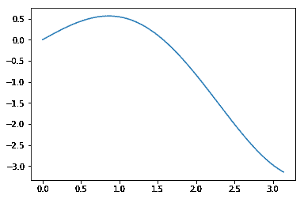
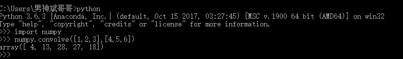

# 创新工场 DeeCamp2018 年人工智能训练营在线笔试第一套 A 卷

## 1

有关机器学习分类算法的 Precision 和 Recall，以下定义中正确的是（假定 tp = true positive, tn = true negative, fp = false positive, fn = false negative）

正确答案: A   你的答案: 空 (错误)

```cpp
Precision= tp / (tp + fp), Recall = tp / (tp + fn)
```

```cpp
Precision = tp / (tn + fp), Recall = tp /(tp + fn)
```

```cpp
Precision = tp / (tn + fn), Recall = tp /(tp + fp)
```

```cpp
Precision = tp / (tp + fp), Recall = tp /(tn + fn)
```

本题知识点

算法工程师 创新工场 机器学习

讨论

[西南交一枝花](https://www.nowcoder.com/profile/368491811)

本题分类问题，同等于检索问题（精确度==查准率，召回率==查全率）。分类结果以混淆矩阵表现，, , 1、精确度对应预测正确的占预测情况中正类（真正类+假正类）的比例；2、召回率对应预测正确的占真实情况正类（真正类+假负类）的比例。

发表于 2019-04-25 10:59:52

* * *

[橙汁果果果](https://www.nowcoder.com/profile/1447930)

精准率 Precision:预测为正且实际为正的样本（TP）占所有预测为正样本的比率，所有预测为正的样本包括把正类预测成正类（TP）,把负类预测成正类(FP)，相对于预测的样本而言。召回率 Recall:预测为正的样本（TP）占真实正样本的比率，真实正样本包括把正类预测成正类(TP)，把正类预测成负类(FN)，相对于原样本而言。

发表于 2019-05-27 14:50:09

* * *

[空空就是悟空](https://www.nowcoder.com/profile/940001276)

**精确率(precision)**的公式是 Precision= tp / (tp + fp), 它计算的是所有"正确被检索的样本(TP)"占所有"实际被检索到的样本(TP+FP)"的比例；

**召回率(recall)**的公式是 Recall = tp / (tp + fn), 它计算的是所有"正确被检索的样本(TP)"占所有"应该检索到的正确样本(TP+FN)"的比例。

发表于 2019-04-04 12:17:40

* * *

## 2

下面有关计算机基本原理的说法中，正确的一项是：（）

正确答案: D   你的答案: 空 (错误)

```cpp
堆栈（stack）在内存中总是由高地址向低地址方向增长的。
```

```cpp
发生函数调用时，函数的参数总是通过压入堆栈（stack）的方式来传递的。
```

```cpp
在 64 位计算机上，Python3 代码中的 int 类型可以表示的最大数值是 2⁶⁴-1。
```

```cpp
在任何计算机上，Python3 代码中的 float 类型都没有办法直接表示[0,1]区间内的所有实数。
```

本题知识点

Python

讨论

[Better-M](https://www.nowcoder.com/profile/7751240)

A：Intel 中规定，栈是从高地址向低地址生长的；堆是由低地址向高地址增长的。ARM 就没有规定的很死，可以选择栈是升序还是降序。B：x64 下面在 x64 下函数调用的前 4 个参数总是放在寄存器中传递，剩余的参数则压入堆栈中。而 x86 上则是全部压入堆栈中(除了 fastcall 方式)。这 4 个用于存放参数的寄存器分别是：存放整数参数的 RCX，RDX，R8，R9；存放浮点数参数的 XMM0，XMM1，XMM2，XMM3。C：

*   在 32 位机器上，整数的位数为 32 位，取值范围为-231～231-1，即-2147483648～2147483647
*   在 64 位系统上，整数的位数为 64 位，取值范围为-263～263-1，即-9223372036854775808～9223372036854775807

D：只要知道，计算机里的浮点类型只是一种用离散方式近似表达实数区间的方法，就可以知道，Python 里的 float 是不可能涵盖 [0,1] 区间内的所有实数的。即，只是---近似---表示，不是真正的能表达实数区间。

发表于 2019-04-13 15:21:13

* * *

[NewGK-95](https://www.nowcoder.com/profile/808761186)

区间之间数是连续的有无穷个实数，而计算机只能表示离散的确定的实数，这是一道数学问题吧！

发表于 2019-04-03 21:10:41

* * *

[布可](https://www.nowcoder.com/profile/1212350)

Python3 代码中的 int 类型没有限制了，所以没有可以表示的最大值，但是提供了 sy***axsize 来表示一个大于任何我们实际工作中能够表示的最大的整型数值

发表于 2019-05-17 18:31:15

* * *

## 3

有关矩阵运算，以下说法中正确的是：（）

正确答案: A   你的答案: 空 (错误)

```cpp
矩阵运算可以在并行或分布式系统上以并发方式执行。
```

```cpp
矩阵乘法运算在任何时候都不满足交换律。
```

```cpp
m*n 的矩阵在内存或文件中存储时，需要的字节数总是与 m*n 成正比。
```

```cpp
空矩阵是指所有元素都为 0 的矩阵。
```

本题知识点

Java 工程师 C++工程师 安卓工程师 运维工程师 前端工程师 算法工程师 PHP 工程师 测试工程师 创新工场 组合数学 *讨论

[算法蛋黄酱](https://www.nowcoder.com/profile/6702014)

不仅与矩阵的大小有关，应该更是与矩阵存储的内容有关（Long 比 int 多一个字节存储要求）

发表于 2019-04-09 00:46:27

* * *

[胡卫 201904241745308](https://www.nowcoder.com/profile/916186113)

C: 跟矩阵的储存方式有关。比如对稀疏矩阵有利的方式就是只存非 0 元，那么需要的字节数就跟非 0 元数量成正比了。

发表于 2019-04-24 20:54:16

* * *

[szxy](https://www.nowcoder.com/profile/668426986)

选项 c，在 txt 里输了两个矩阵实验了一下，不是这样的

发表于 2019-04-15 17:25:43

* * *

## 4

有关 TensorFlow API，以下说法中正确的是：（）

正确答案: D   你的答案: 空 (错误)

```cpp
tf.Variable 和一般编程语言中“变量（Variable）”的含义完全相同。
```

```cpp
tf.placeholder 定义的对象，对应于深度神经网络中的“超参数（Hyperparameter）”。
```

```cpp
通过 tf.constant 定义的对象，因为是常量，所以，在 session.run()运行前就可以用 eval()方法获得对象的值。
```

```cpp
session.run()运行一个训练过程时，TensorFlow 会使用符号执行（SymbolicExecution）对计算图进行优化。
```

本题知识点

算法工程师 创新工场 机器学习

讨论

[西南交一枝花](https://www.nowcoder.com/profile/368491811)

A 选项 tf 中 变量的定义和初始化是分开的，一般编程语言定义即初始化。如 tf.Varialbe(3, name='x'),  只是定义，或者说"画"好流程图，还需要使用 run(tf.global_variables_initializer()) 初始化图中所有变量或其他初始化变量的方式。B 选项 tf.placeholder() 通俗讲作用为占位符，先定义好过程，在执行的时候再”喂"具体值(输入数据)C 选项 可以同 A 选项一同解释，必须要等到 run 之后才能得到具体值。D 选项 TensorFlow 使用了向量运算的符号图方法，事先定义图，然后使用 SymbolicExecuption 进行优化。 正确

发表于 2019-04-25 11:20:56

* * *

[why_smile](https://www.nowcoder.com/profile/747325630)

B:所谓超参数，就是[机器学习](http://lib.csdn.net/base/machinelearning)模型里面的框架参数，比如聚类方法里面类的个数，或者话题模型里面话题的个数等等，都称为超参数。它们跟训练过程中学习的参数（权重）是不一样的，通常是手工设定，不断试错调整，或者对一系列穷举出来的参数组合一通枚举（叫做网格搜索）。

发表于 2019-05-10 16:18:51

* * *

[Fabulous_HK](https://www.nowcoder.com/profile/201232292)

[`www.zhihu.com/question/27639400`](https://www.zhihu.com/question/27639400)

编辑于 2020-08-31 10:52:35

* * *

## 5

以下哪一个正则表达式不能与字符串“https://www.tensorflow.org/”（不含引号）匹配？（）

正确答案: B   你的答案: 空 (错误)

```cpp
[a-z]+://[a-z.]+/
```

```cpp
https[://]www[.]tensorflow[.]org[/]
```

```cpp
[htps]+://www.tensorflow.org/
```

```cpp
[a-zA-Z.:/]+
```

本题知识点

Java 工程师 C++工程师 运维工程师 算法工程师 PHP 工程师 测试工程师 创新工场 Java

讨论

[Chen 的 offer 快快来](https://www.nowcoder.com/profile/843699874)

正则表达式的规则

1\. 任意一个字符表示匹配任意对应的字符，如 a 匹配 a，7 匹配 7，-匹配-。

2\. []代表匹配中括号中其中任一个字符，如[abc]匹配 a 或 b 或 c。

3\. -在中括号里面和外面代表含义不同，如在外时，就匹配-，如果在中括号内[a-b]表示匹配 26 个小写字母中的任一个；[a-zA-Z]匹配大小写共 52 个字母中任一个；[0-9]匹配十个数字中任一个。

4\. ^在中括号里面和外面含义不同，如在外时，就表示开头，如⁷[0-9]表示匹配开头是 7 的，且第二位是任一数字的字符串；如果在中括号里面，表示除了这个字符之外的任意字符(包括数字，特殊字符)，如[^abc]表示匹配出去 abc 之外的其他任一字符。

5\. .表示匹配任意的字符。

6\. \d 表示数字。

7\. \D 表示非数字。

8. \s 表示由空字符组成，[ \t\n\r\x\f]。

9. \S 表示由非空字符组成，[^\s]。

10. \w 表示字母、数字、下划线，[a-zA-Z0-9_]。

11. \W 表示不是由字母、数字、下划线组成。

12. ?: 表示出现 0 次或 1 次。

13. +表示出现 1 次或多次。

14. *表示出现 0 次、1 次或多次。

15. {n}表示出现 n 次。

16. {n,m}表示出现 n~m 次。

17. {n,}表示出现 n 次或 n 次以上。

18. XY 表示 X 后面跟着 Y，这里 X 和 Y 分别是正则表达式的一部分。

19. X|Y 表示 X 或 Y，比如"food|f"匹配的是 foo（d 或 f），而"(food)|f"匹配的是 food 或 f。

20. (X)子表达式，将 X 看做是一个整体

详见：https://www.jianshu.com/p/3c076c6b2dc8

发表于 2020-07-15 17:07:34

* * *

[陈效威](https://www.nowcoder.com/profile/2409413)

```cpp
[://]

```

这是个很明显的陷阱[ ] 里面是不重复的，所以等价于[:/]如果[ ]后面没有带+号的话，是不会贪婪匹配的，就只能匹配到://中的其中一个 

编辑于 2019-06-01 10:15:45

* * *

[OfferOverFlowError](https://www.nowcoder.com/profile/1686028)

```cpp
public class Test {

    public static void main(String[] args) {
        String content = "https://www.tensorflow.org/";

        String patternA = "[a-z]+://[a-z.]+/";
        String patternB = "https[://]www[.]tensorflow[.]org[/]";
        String patternC = "[htps]+://www.tensorflow.org/";
        String patternD = "[a-zA-Z.:/]+";

        System.out.println(Pattern.matches(patternA, content)); // true
        System.out.println(Pattern.matches(patternB, content)); // false
        System.out.println(Pattern.matches(patternC, content)); // true
        System.out.println(Pattern.matches(patternD, content)); // true
    }
}
```

B. [://] 表示匹配 :// 中的任何一个字符，也就是匹配 : 或 /C. [htps] 表示匹配 htps 中的任何一个字符，[htps]+ 表示一次或多次匹配前面的字符或子表达式，所以 [htps]+ 可以匹配 https

发表于 2019-10-12 10:11:08

* * *

## 6

一个长度为 n 的正整数数列，先递减再递增，如果要找到数列中最小的正整数，最优算法的平均时间复杂度是？

正确答案: D   你的答案: 空 (错误)

```cpp
O(n)
```

```cpp
O(nlog(n))
```

```cpp
O(n²)
```

```cpp
O(log(n))
```

本题知识点

复杂度

讨论

[emiedon](https://www.nowcoder.com/profile/5022019)

二分法找中点，中点左右两边数都比中点大就结束，否则就向较低的一边搜索

发表于 2019-04-15 20:15:44

* * *

[onsix](https://www.nowcoder.com/profile/99934366)

根据 big-O notation 的定义，C 和 D 两个选项不是等价的吗？

发表于 2019-06-01 13:56:25

* * *

[yaqin123](https://www.nowcoder.com/profile/5904949)

二分法

发表于 2019-04-03 23:17:07

* * *

## 7

函数 cos(x)的曲线与 x 轴相交，围成了许多个大小相同的封闭区域（如下图中的阴影区域）。

在每个封闭区域里画矩形，且只考虑矩形的底边与 x 轴重合的情况。请问，每个封闭区域可以容纳的最大矩形的面积是多少（精确到小数点后三位）？

正确答案: D   你的答案: 空 (错误)

```cpp
1.571
```

```cpp
0.870
```

```cpp
0.782
```

```cpp
1.122
```

本题知识点

Java 工程师 C++工程师 iOS 工程师 前端工程师 算法工程师 测试工程师 创新工场 阿里巴巴 组合数学 *讨论

[德鲁同学](https://www.nowcoder.com/profile/406992647)

```cpp
import numpy as np
import matplotlib.pyplot as plt

x = np.arange(0, np.pi, 0.002)
y = x*np.cos(x)

max(y)*2# 乘以 2 是因为只考虑了 x 轴正半轴
plt.plot(x,y)##

```
1.1221924452421692
```cpp

```



编辑于 2019-04-29 20:45:03

* * *

[我不是小菜鸡;)](https://www.nowcoder.com/profile/5687591)

li = []
for i in np.arange(0, math.pi/2, 0.001):
    li.append(math.sin(i)*(math.pi-2*i))
sorted_li = sorted(li)
print(sorted_li[-1])

发表于 2019-04-25 20:56:46

* * *

[Aizening](https://www.nowcoder.com/profile/786511700)

很简单  近似计算就可以了  JAVA 也能秒出答案题目给的图不准确把  那个 5 和 10 标的有歧义。题目说的就是给了 cos(x)
public class Main {
    public static void main(String[] args) {
//        double w = Math.PI*2/(20.0/3);
        double w = 1;
        double l = 5.0/3;
        double maxS = 0;
        for (double x = 0; x < l; x+=0.00001) {
            double h = Math.cos(w*x);
            if(maxS<h*x)
                maxS = h*x;
        }
        System.out.println(maxS*2);
    }
}
//1.1221926763553334

编辑于 2019-06-01 17:31:45

* * *

## 8

假设可以不考虑计算机运行资源（如内存）的限制，以下 python3 代码的预期运行结果是：（）

```cpp
import math
def sieve(size):
    sieve= [True] * size
    sieve[0] = False
    sieve[1] = False
    for i in range(2, int(math.sqrt(size)) + 1):
        k= i * 2
        while k < size:
           sieve[k] = False
           k += i
    return sum(1 for x in sieve if x)
print(sieve(10000000000))
```

正确答案: B   你的答案: 空 (错误)

```cpp
455052510
```

```cpp
455052511
```

```cpp
455052512
```

```cpp
455052513
```

本题知识点

Java 工程师 运维工程师 前端工程师 算法工程师 测试工程师 创新工场 阿里巴巴 Python

讨论

[小黄人的黄](https://www.nowcoder.com/profile/868249902)

本题是通过排除法找素数的个数，以 size 为 20 为例，算法的思想就是先假设 size 以内的所有的数都为素数(sieve = [True] * size),然后在找到 size 以内的所有的因数(2,math.sqrt(size)+1)p 排除掉所有因数的乘数(sieve[k]=False)，剩下的就是 size 内所有的素数。
math.sqrt(size)+1 为 size 以内的所有数的最大公因数。

发表于 2020-07-18 15:28:25

* * *

[Anascetic](https://www.nowcoder.com/profile/5234727)

怎么会有这种题，求 100 亿以内的质数个数，我求的出来我还会在这做题？？

发表于 2019-10-31 11:04:51

* * *

[青春带笑 work](https://www.nowcoder.com/profile/307221123)

[`sweet.ua.pt/tos/bib/5.4.pdf`](http://sweet.ua.pt/tos/bib/5.4.pdf)

发表于 2020-04-29 10:43:59

* * *

## 9

一维离散卷积的定义是：

给定一维数组 a = [1, 2, 3], v = [4, 5, 6]，它们的离散卷积结果是：（）

正确答案: C   你的答案: 空 (错误)

```cpp
[6,12, 32, 27, 12]
```

```cpp
[4, 13, 28, 24, 18]
```

```cpp
[4, 13, 28, 27, 18]
```

```cpp
[6, 12, 32, 24, 12]
```

本题知识点

C++工程师 安卓工程师 iOS 工程师 运维工程师 前端工程师 算法工程师 创新工场 阿里巴巴 组合数学 *讨论

[Better-M](https://www.nowcoder.com/profile/7751240)

方法一：手算（当然也可以自己写个小的 for 循环 code）/*当 n==0 的时候，a[0]*v[0-0]=a[0]*v[0]=4m+1,a[1]*v[-1]越界，只有 4。当 n==1 的时候，a[0]*v[1-0]=1*5=5m+1,a[1]*v[1-1]=2*4=8m+1 越界，所以结果是 5+8=13 当 n==2 的时候，a[0]*v[2-0]=1*6=6m+1,a[1]*v[2-1]=2*5=10,m+1,a[2]*v[2-2]=3*4=12,m+1 越界，所以结果是 6+10+12=28。当 n==3 的时候,a[0]*v[3-0]越界（但是下面还是有计算的可能，所以可以继续算）m+1,a[1]*v[3-1]=2*6=12,m+1,a[2]*v[3-2]=3*5=15,m+1,越界。所以结果是 12+15=27 当 n==4 的时候 a[0]*v[4-0]越界 m+1,a[1]*v[4-1]越界 m+1,a[2]*v[4-2]=3*6=18m+1,越界，所以结果是 18 所以答案是 C*/方法二：numpy 自带的卷积运算函数。使用 numpy 自带的函数： 

发表于 2019-04-13 14:57:00

* * *

[堇月](https://www.nowcoder.com/profile/244320403)

分别计算 m 为 0，1，2，3，4 时对应的结果，例如当 m=4 时，标号和为 4 的只有 v[2]和 a[2]，乘积为 3*6=18；当 m=3 时，标号和为 3 的组合可以有：v[2]和 a[1]，v[1]和 a[2]，和为 6*2+3*5=27

发表于 2019-04-09 21:47:47

* * *

[sususuxi00](https://www.nowcoder.com/profile/686644232)

旋转+滑窗：[`www.cnblogs.com/wujing-hubei/p/5682766.html`](https://www.cnblogs.com/wujing-hubei/p/5682766.html)

发表于 2021-09-14 18:40:34

* * *

## 10

下面这个被污损的二维码中，存储的信息是：（）

正确答案: A   你的答案: 空 (错误)

```cpp
Artificial Intelligence
```

```cpp
Computer Science
```

```cpp
Machine Learning
```

```cpp
Deep Learning
```

本题知识点

算法工程师 创新工场 阿里巴巴 机器学习

讨论

[Better-M](https://www.nowcoder.com/profile/7751240)

其实二维码中间的小黑点部分，拥有大量的冗余，一般程度的变形和污损是不影响识别的，最影响识别的是三个大方框，因为它们起定位作用。了解了这样的知识，只要打开画板，把缺失最厉害的那个大方框补齐整，就可以微信扫码看结果了。

发表于 2019-04-13 19:58:09

* * *

[uaetalp](https://www.nowcoder.com/profile/976365441)

除了蒙，想不到其他解法

发表于 2019-04-09 13:08:24

* * *

[Victor2019](https://www.nowcoder.com/profile/831418384)

用微信就可以扫描出来了，哈哈哈

发表于 2019-04-26 18:46:03

* * *

## 11

有一张图灵奖得主的肖像照片，被一个学生用简单的异或加密方法，编码成了如下这样的字符串：

```cpp
MG4rZiJpImkvaixpLGwrbjRxN3MxdzN3M3s+fTl9OX4EQgdCAUkCSQxID0sJTAtQF1IRVBNWE1sZWhhcGiBnJStrImUmZSFmLGcgZixrKGoobypwKnIwdzJ0Mns/QANCOkAEQQFGAEYMSAxID0oJURVTEVURVhJYGVsYXxheGiIvZSdjJ2MmZyNnI2UvaiNoL2wraitwN3YzczJ7PGstcTR3BEwIRgBEAkkPSA1JDk0LURZVEVQTVBxaH1wZXmUgJ2AkYyZhJGEnZyJiI2ktZi1rL2sobChwPkA7ctWz8ILCv9eeJHYMQgZJA0kMSQhKCFAUUhFVEVQQWhldGF9lXtqf22HanyWeJmAkYyZiImktZy1qLWgxbNSH/K/EhtJlKHYhg+GyIHwFRgBGD0sOTQlOFVIWVRFUE1YZXRldGF/Ymtmd2GHan9uf2mAkYyBmIGcsZClkyJP7ufqJ13MSVANwNGong+6XOX8CRABHDE0OTQhRFFIRVRBUE1sZXBgh2JvfnNmd2JzbnNufJGElYyBlJmg3lC13NHXVkT9c2Y3eidiW23IVSDtuMEcARA1JDUsJTAtTFlURVxNZHl0YXN6a3Z3cm9ma2Z3YnNie2p8kYCd5KnUWdSdt0ogdafTYn5IodyhGfg9rTD91OkcNRg9NDk0LURdSEVUQVxJbGVzflt2V05jemt6b2J3cndic2pw2ejFFI3Mhc9RxPmDTtChObysYJW84RioddzNCA0YNRg9KCFEUUxZSEFQTWBlb05LQk9OV3ZvSl9+a3Jvend2YNW82djFlJZ3XSzVjylR1RxFPGzBoOGpeE3wyfzpHAEcMSwhOFU4WUhFVEFcfWteS1pTWkNCW05vdmd2a35/Ujy9nLGU+h8mUM0Y9RB5OCkcVWAhLGjBpKg5qNH8+fgFGDUYPSglNFVIXVRBUEF3XkNeT1pPXlNKU0ZLSm9yY3I3YY9aU2mE2YC5nBSwAbDJ9AmbZcwlRB2bVlSh6PnwERANJDUsJTwlQFlUWVBJW15HXkNWR1pPXkdeR15XcjP6LJJ/acdJBC2kkvD9HJZfTbM2w2mzZYNKogLU+kzFDBUADSQ1IDkoOTBVTFlQTVNSR1Y/KjtSS1JDWkNWbyrHef9idPU4FVT6f27komNCQyYb5h8qF+LLo3oL3/Wk3eztABkICRgJLCEwVUxZVEFfKkcqPy5HLkNeMyJHXif9obnk4QApTZFgxYMSa3pXdtce48rTto/Ww79S5+79lA3Q5fAdCAUYCRg5MClEXVRBWyYzIi8iQyY3VjM6P1L7QKBFwE1xuJ29BMmDNZcOXxar7sOqimNjnrvSxn8+B2TxAPnw4QAZFAkgMSgpPFFIWVc2JworOi8+NyYvMivhhFyQ/WG4gewcbcQJlxJDQjPSNz7n5gv60+7nnpZrWmsfBQj16OUEHQgBGDE0ITgpTF1LCgsGGwoXCiM2FwYwlb2cmPyxuJkM/FUAUl/FhNZ/Xk/m7woH8tOq29q7/vfXb5HM4ez97BUAGRAJJDEwIUBdSw4TGg8KEwYfMg/iMPkgRKWk2dAFFJgxJK7jpvc6fJbzjq/el77n4u8G876We246XAHU9eztBB0cCSQ9KCUwUVcCHw4DNhsGEwYT4gDgoFFp0N38uZEYGRdWl4a3vt8a7/qjxv/Sq5c6K2pHQiMS6tAd3PXg8fTpDBEcMSw9NFFPGgseFw4TAhsaD/oNgAA1aEzF1UwZtLWnIoOOs6LnxvcO5+rGS25LKus/s0o3MuMszQjB5P3o4QARFA0sJTQpQxIDEg8WCwYPGgPWRQA0GVxBNPWwLY9mV+Ln/s/Wq+4Lzuveh596L2JzN7rzrp5b4/X0+dj94PnwERA1GDEoKTvq++oHGg8eDx4Pom00JBEkYcCNuD2ItbPuFz7n+tfK58rr0oJHEm4H3uva/wonCqpmUP3Y9eD59OkAARgxLCE77vP+/x4HEgcWB6JdIPhZEEkQNSDCaJ2Unl9aHwoj/gPKt7siPiNmGOFEii8xnP3nQiyh3MHk4ezl/B0YNSA9M+br4vfuB+7z+vv6wRxRtfxRPF0QyZSlnPXLfl8+F+bfp1ovc13EnQmhaMpTIexsx2oIreDp7PXs+fgZEAEYPTf66+br7vv66/r3E2gseaFEWRA93IWU6RjlALGPUgfmt6qmWjjhrBV0cIh1m3FRtRsOLNHcxcjJ9PHwGQgFHD0r8u/m6+br5v/u9+6/NO3kpE3s2fy5tA1AIRT9m0ov5rf69JHfbazJHGzlia90kHC4cZyJpKng8dzx9OkABSQxL/bv9uPy9/r3+vPi7m0xMNGpSOHYtbwVXG0QwntWJ6bjccBWR2ihBPlANGHfeRGoMHGshdgd5Nng8ezlBAUgNSvO28rb/uP67/7byuZtIF7rfV0YGRSgOTxFDM3EglPiaMEMpfWkWWhxjeh0m17s4lclo33A+dTB7PHg4QQdHAkjyt/O387bytvy3/bfojvDZlakBPUk4fCJtIDdlIGIgcQ1BNikIUA9XKmlpKCnWlnHFliNuMXExdjx4OEAHRQJI9rT2svC28rjzt/236LEHJB9v6Is6VwBsAyEEq5Le7Z8bWTdn3ZfCiTlZeFQAjIa7/748ZipzM3YzeDh/BUQCRvGz8bPwufG287Xztuy0EScaKwJgPVc2aytlMmnu1uuL32nTmtKOI38teGBEA4+P/OzY1m0ocjB3Mns8ejtFAUf2s/Cz9LX2svOy9rbqpAwzDUFtXAVEFlgUbMyPNZjz1rqo2WnSg9tmJHwPcTSos8OCp8tuKHE3dDx7P38FRQBJ8bLosPSz8bX2tfGy9aAtX9hKSjUPaD5aHncngtx/K6W4xOiR3WXYssZ4P3ou14fJhrYwai5sMHQwdz5/OkUASfWx66/0tPGw6q71r+uq/IvdM0Ig04M5XAJAPWDUjwFl+oCYsceD47LSeAx+INCa3Zq9L2oubTZ0M3Y5fDpAA0fqr+ut6rHqr/Wv9bHqsvyI5XVDK/uwAVQCQiqe3J81TQZAII/sofmRyVA5u+ivJmncmCNoLWw1cjF4P3w6QgFG66zpremt6bH2sPWv9oPwtsrd82w6kjFRF00wZytxMn8DTT11y7XyrikkOXUDRjtyJp4paSxsNXUxdz9+BEAHRemt6a3rsvWs9LPqruiggNE5b4DUyn4OUR1IP2o8fCCfMUcIT97e65wGbh4NUwZydPeJImgvbDVyM3k/fzpAAknoremq6rPqrfWs6LeI/ilRNWswaNNSGV0efD1yKHU0ay1AFX34t8h5Ko4oVw1WSESZuyFqLW00czF7OX0FQgBL6a/pqums6a3or+mz5PDrcCWaAH0BewFdZkkzdCqYN24tbypo0ZUgQMiMJZzIfAN4zYIsayxsNHI9eDx+AUUAS+iq6KruqOms77Hqs5v+r+/wuz9HKW9lWhJEM2slbCOdI2crbdidDW/NYS2UIUTQn9+dLmkvbDVyMnk8fgBHDUntq+mt76ruq+Kx9bfvxYbr6K73cj5eeiUOQzuc2notYydqOWwmfwiSIkI6dw57KnwqhNhwKGordz99OX8GRgJF7KnrpuCo7afhp+uZPdil5ZyQk9sDKGArHX0ybyJtP3kocDV2NlsRRAJNEiRmJGszParwkypvNXY+fDpAAEQAR+6r6avmoem48a7InjpgteS7h8KqDylmJAl6A3cgQAF7PW4ibTsgRwZCCU4PVAQRbiqEzLPddTd4PHoEQDtDA0buqu2q9IHUl8uK05LffvLlo6LNQmteZlUXXTt1PkUycSl1NGgyJlYBayxhSzBl0Z0zmtuYzXAydz16OkE6QABH7qvnrcKTyI/Xh8eGyWUo0aHF9kR5JB9RDCYLdgx9NHwxezpvOShrQjl6N3ImZtqX2WzbatNrOXk8eztBBUAAROyj6ITLhsKEw4fNh82MLJuE5YhNdCsaXhEicUoRTQVCOX88RBUmCHgLUztuKH8siPGAMn3eYAZ5Pnw4fgRBBEXntNWNzInJgfmM1pHWgMJ00P+mqBglbyJlUmotbyUHSgJ/DFkKIBx9FCEEbS91KY/r3zR+I6ggSTB6OH46QQdC/ZfRiMCAw43Dh8uM3pnPljqCs+H+KmAgGUkWMngAaUsHSBdSAVBmVgd4AnMxZyyay7zaQQ3ftXcCdjh+O0EBQ9GY35vNu/6Hy4jEh8idJYwkfsTzpYtiIRBGBF1FDUFdA1EfIxFJFiUIajJ1PXg9ZtiVNlIWt6XYAkA4fgVDB0LRkNeb3JPLiMma0YTDkCJz1nUDjbbh8StkRQdFGzZ9NGdfY1tlWR0pFUcDSTNNAW4+ZQ1cZ72l5stQOUE6QgZBxovMkSWY2GbdjiNy0YTdbypgO23+86XYdioUTgtVGyloI28jdVZnJmRSAn4zUBtSMGQQI2+/pfCKQwZBBUAEfh5KPpbKm9tsIprTfguewGEHZjadyLaz4YEFcVYWQQNPE1VmLm1cZSAYVAxfbysYTAR+YCZsu6HBpJsSfgdDOHotZwROC2wlaCRrJ5cUJSmUPkEhZ8RijtgvQEc1FkoAfTlEHFEWIxxfZFphKWk4CF53SWksa7+h06vaCUA7QTt6peGpoDVXDHAsbDhrLCMSmi9IPWi+YzePVJv5OXdRAHw7RQZACVESWgFQRzxGFxoqRUZqM3KNoMiV4N9QMXsFf7DzreGlpx9TLHcAUytAd0XaShlrpc9waCZNgJtDIBVMDEgGTxxVAnIBL1cUUhdmJnlXczV8iKvzgPDnUjJ3Onyx87fyqOGqfhp5PkYPc24uNEAbUJ3hzi/NldO1fTAXVxZNFVcaSyNQej9XFU4Idyp2IHI1fI+gwYvMv2gMdj95sfOq8LD3pfsXTS1zCXwONAx7ZyLe4aX5xUk9kRMBFl0aTxg5YGgKEU85SxdBAkctayVwMHu9pM2T1remC3s9drbvqeyo7LfhuksInj1HPyxhdRgoAarVlXYeFmnfL3IlElRwPhtobxVDN0MXTQNNMmoueTZ7vLnNkc+M+jZBPXix+bj7tvS286X+F1IpdTBXc30XKDg3Wh5DLHV7ynxRLw1ZeV0AfEwNRzZGF0g9QTJ3OHg9cbqQwZHdm+zHSzx7hcKAopnypvy44eEwAmg/QXVSAykfIHoDfXkZOyiFbjQ/JmtF315ZB0U7RhJLNEUwaTR+CQvfn8Pk15j3nkQyeb/5t8Pio6rxjcWliHB5KXNqKDclcVBiBEYENlxGe8xSYSwIRzA7VwBGO3sTQjlELGMzfQ4oy+zYnNvmyrNoB3ix+7zloqHI1aHFvuEBLzN5bjw3VHshEyxrA3eILS0afmMEGEMSFUwFey58EUsDeTBiNEk18aGaop7N49+lggt5uPy587XgkL+J8Y7ovyQeQxEyClNzLxdMbV19J/2DGjdFCQpiRhZDAnoxegxVPnYwGDRcfpOw7aKeyOGnrNMFew==

```

已知肖像照片是 64x64 像素的 0~255 级灰度图片，内存中用 raw bitmap 方式，每个像素用一个字节存储。对肖像照片的原始数据，学生使用的加密代码片段如下（Python3 代码，代码中的 key 值是未知的加密密钥）：

```cpp
_KEY_LEN = 2
bitmap = PIL.Image.open(image_path).tobytes()
encrypted = []
for index, byte in enumerate(bitmap):

encrypted.append(byte ^ key[index % _KEY_LEN])
return
base64.standard_b64encode(bytes(encrypted))

```

（1）请问：这张被加密的照片，是以下哪位图灵奖得主的肖像？（）

(A) Marvin Minsky

(B) John L. Hennessy

(C) Donald E. Knuth

(D) Raj Reddy

(E) John McCarthy

(F) Edsger W. Dijkstra

(G) John Hopcroft

(H) Alan Kay(2)请写出本题解题的主要思路，以及解题时使用的主要代码片段。

你的答案

本题知识点

算法工程师 创新工场 阿里巴巴 机器学习

讨论

[垂泽](https://www.nowcoder.com/profile/337002768)

 (F) Edsger W. Dijkstra   [`en.wikipedia.org/wiki/Edsger_W._Dijkstra`](https://en.wikipedia.org/wiki/Edsger_W._Dijkstra)
不管 key 是啥直接画，勉强可以看出来，，

```cpp
import base64 import PIL res = 'MG4rZiJpImkvaixpLGwrbjRxN3MxdzN3M3s+fTl9OX4EQgdCAUkCSQxID0sJTAtQF1IRVBNWE1sZWhhcGiBnJStrImUmZSFmLGcgZixrKGoobypwKnIwdzJ0Mns/QANCOkAEQQFGAEYMSAxID0oJURVTEVURVhJYGVsYXxheGiIvZSdjJ2MmZyNnI2UvaiNoL2wraitwN3YzczJ7PGstcTR3BEwIRgBEAkkPSA1JDk0LURZVEVQTVBxaH1wZXmUgJ2AkYyZhJGEnZyJiI2ktZi1rL2sobChwPkA7ctWz8ILCv9eeJHYMQgZJA0kMSQhKCFAUUhFVEVQQWhldGF9lXtqf22HanyWeJmAkYyZiImktZy1qLWgxbNSH/K/EhtJlKHYhg+GyIHwFRgBGD0sOTQlOFVIWVRFUE1YZXRldGF/Ymtmd2GHan9uf2mAkYyBmIGcsZClkyJP7ufqJ13MSVANwNGong+6XOX8CRABHDE0OTQhRFFIRVRBUE1sZXBgh2JvfnNmd2JzbnNufJGElYyBlJmg3lC13NHXVkT9c2Y3eidiW23IVSDtuMEcARA1JDUsJTAtTFlURVxNZHl0YXN6a3Z3cm9ma2Z3YnNie2p8kYCd5KnUWdSdt0ogdafTYn5IodyhGfg9rTD91OkcNRg9NDk0LURdSEVUQVxJbGVzflt2V05jemt6b2J3cndic2pw2ejFFI3Mhc9RxPmDTtChObysYJW84RioddzNCA0YNRg9KCFEUUxZSEFQTWBlb05LQk9OV3ZvSl9+a3Jvend2YNW82djFlJZ3XSzVjylR1RxFPGzBoOGpeE3wyfzpHAEcMSwhOFU4WUhFVEFcfWteS1pTWkNCW05vdmd2a35/Ujy9nLGU+h8mUM0Y9RB5OCkcVWAhLGjBpKg5qNH8+fgFGDUYPSglNFVIXVRBUEF3XkNeT1pPXlNKU0ZLSm9yY3I3YY9aU2mE2YC5nBSwAbDJ9AmbZcwlRB2bVlSh6PnwERANJDUsJTwlQFlUWVBJW15HXkNWR1pPXkdeR15XcjP6LJJ/acdJBC2kkvD9HJZfTbM2w2mzZYNKogLU+kzFDBUADSQ1IDkoOTBVTFlQTVNSR1Y/KjtSS1JDWkNWbyrHef9idPU4FVT6f27komNCQyYb5h8qF+LLo3oL3/Wk3eztABkICRgJLCEwVUxZVEFfKkcqPy5HLkNeMyJHXif9obnk4QApTZFgxYMSa3pXdtce48rTto/Ww79S5+79lA3Q5fAdCAUYCRg5MClEXVRBWyYzIi8iQyY3VjM6P1L7QKBFwE1xuJ29BMmDNZcOXxar7sOqimNjnrvSxn8+B2TxAPnw4QAZFAkgMSgpPFFIWVc2JworOi8+NyYvMivhhFyQ/WG4gewcbcQJlxJDQjPSNz7n5gv60+7nnpZrWmsfBQj16OUEHQgBGDE0ITgpTF1LCgsGGwoXCiM2FwYwlb2cmPyxuJkM/FUAUl/FhNZ/Xk/m7woH8tOq29q7/vfXb5HM4ez97BUAGRAJJDEwIUBdSw4TGg8KEwYfMg/iMPkgRKWk2dAFFJgxJK7jpvc6fJbzjq/el77n4u8G876We246XAHU9eztBB0cCSQ9KCUwUVcCHw4DNhsGEwYT4gDgoFFp0N38uZEYGRdWl4a3vt8a7/qjxv/Sq5c6K2pHQiMS6tAd3PXg8fTpDBEcMSw9NFFPGgseFw4TAhsaD/oNgAA1aEzF1UwZtLWnIoOOs6LnxvcO5+rGS25LKus/s0o3MuMszQjB5P3o4QARFA0sJTQpQxIDEg8WCwYPGgPWRQA0GVxBNPWwLY9mV+Ln/s/Wq+4Lzuveh596L2JzN7rzrp5b4/X0+dj94PnwERA1GDEoKTvq++oHGg8eDx4Pom00JBEkYcCNuD2ItbPuFz7n+tfK58rr0oJHEm4H3uva/wonCqpmUP3Y9eD59OkAARgxLCE77vP+/x4HEgcWB6JdIPhZEEkQNSDCaJ2Unl9aHwoj/gPKt7siPiNmGOFEii8xnP3nQiyh3MHk4ezl/B0YNSA9M+br4vfuB+7z+vv6wRxRtfxRPF0QyZSlnPXLfl8+F+bfp1ovc13EnQmhaMpTIexsx2oIreDp7PXs+fgZEAEYPTf66+br7vv66/r3E2gseaFEWRA93IWU6RjlALGPUgfmt6qmWjjhrBV0cIh1m3FRtRsOLNHcxcjJ9PHwGQgFHD0r8u/m6+br5v/u9+6/NO3kpE3s2fy5tA1AIRT9m0ov5rf69JHfbazJHGzlia90kHC4cZyJpKng8dzx9OkABSQxL/bv9uPy9/r3+vPi7m0xMNGpSOHYtbwVXG0QwntWJ6bjccBWR2ihBPlANGHfeRGoMHGshdgd5Nng8ezlBAUgNSvO28rb/uP67/7byuZtIF7rfV0YGRSgOTxFDM3EglPiaMEMpfWkWWhxjeh0m17s4lclo33A+dTB7PHg4QQdHAkjyt/O387bytvy3/bfojvDZlakBPUk4fCJtIDdlIGIgcQ1BNikIUA9XKmlpKCnWlnHFliNuMXExdjx4OEAHRQJI9rT2svC28rjzt/236LEHJB9v6Is6VwBsAyEEq5Le7Z8bWTdn3ZfCiTlZeFQAjIa7/748ZipzM3YzeDh/BUQCRvGz8bPwufG287Xztuy0EScaKwJgPVc2aytlMmnu1uuL32nTmtKOI38teGBEA4+P/OzY1m0ocjB3Mns8ejtFAUf2s/Cz9LX2svOy9rbqpAwzDUFtXAVEFlgUbMyPNZjz1rqo2WnSg9tmJHwPcTSos8OCp8tuKHE3dDx7P38FRQBJ8bLosPSz8bX2tfGy9aAtX9hKSjUPaD5aHncngtx/K6W4xOiR3WXYssZ4P3ou14fJhrYwai5sMHQwdz5/OkUASfWx66/0tPGw6q71r+uq/IvdM0Ig04M5XAJAPWDUjwFl+oCYsceD47LSeAx+INCa3Zq9L2oubTZ0M3Y5fDpAA0fqr+ut6rHqr/Wv9bHqsvyI5XVDK/uwAVQCQiqe3J81TQZAII/sofmRyVA5u+ivJmncmCNoLWw1cjF4P3w6QgFG66zpremt6bH2sPWv9oPwtsrd82w6kjFRF00wZytxMn8DTT11y7XyrikkOXUDRjtyJp4paSxsNXUxdz9+BEAHRemt6a3rsvWs9LPqruiggNE5b4DUyn4OUR1IP2o8fCCfMUcIT97e65wGbh4NUwZydPeJImgvbDVyM3k/fzpAAknoremq6rPqrfWs6LeI/ilRNWswaNNSGV0efD1yKHU0ay1AFX34t8h5Ko4oVw1WSESZuyFqLW00czF7OX0FQgBL6a/pqums6a3or+mz5PDrcCWaAH0BewFdZkkzdCqYN24tbypo0ZUgQMiMJZzIfAN4zYIsayxsNHI9eDx+AUUAS+iq6KruqOms77Hqs5v+r+/wuz9HKW9lWhJEM2slbCOdI2crbdidDW/NYS2UIUTQn9+dLmkvbDVyMnk8fgBHDUntq+mt76ruq+Kx9bfvxYbr6K73cj5eeiUOQzuc2notYydqOWwmfwiSIkI6dw57KnwqhNhwKGordz99OX8GRgJF7KnrpuCo7afhp+uZPdil5ZyQk9sDKGArHX0ybyJtP3kocDV2NlsRRAJNEiRmJGszParwkypvNXY+fDpAAEQAR+6r6avmoem48a7InjpgteS7h8KqDylmJAl6A3cgQAF7PW4ibTsgRwZCCU4PVAQRbiqEzLPddTd4PHoEQDtDA0buqu2q9IHUl8uK05LffvLlo6LNQmteZlUXXTt1PkUycSl1NGgyJlYBayxhSzBl0Z0zmtuYzXAydz16OkE6QABH7qvnrcKTyI/Xh8eGyWUo0aHF9kR5JB9RDCYLdgx9NHwxezpvOShrQjl6N3ImZtqX2WzbatNrOXk8eztBBUAAROyj6ITLhsKEw4fNh82MLJuE5YhNdCsaXhEicUoRTQVCOX88RBUmCHgLUztuKH8siPGAMn3eYAZ5Pnw4fgRBBEXntNWNzInJgfmM1pHWgMJ00P+mqBglbyJlUmotbyUHSgJ/DFkKIBx9FCEEbS91KY/r3zR+I6ggSTB6OH46QQdC/ZfRiMCAw43Dh8uM3pnPljqCs+H+KmAgGUkWMngAaUsHSBdSAVBmVgd4AnMxZyyay7zaQQ3ftXcCdjh+O0EBQ9GY35vNu/6Hy4jEh8idJYwkfsTzpYtiIRBGBF1FDUFdA1EfIxFJFiUIajJ1PXg9ZtiVNlIWt6XYAkA4fgVDB0LRkNeb3JPLiMma0YTDkCJz1nUDjbbh8StkRQdFGzZ9NGdfY1tlWR0pFUcDSTNNAW4+ZQ1cZ72l5stQOUE6QgZBxovMkSWY2GbdjiNy0YTdbypgO23+86XYdioUTgtVGyloI28jdVZnJmRSAn4zUBtSMGQQI2+/pfCKQwZBBUAEfh5KPpbKm9tsIprTfguewGEHZjadyLaz4YEFcVYWQQNPE1VmLm1cZSAYVAxfbysYTAR+YCZsu6HBpJsSfgdDOHotZwROC2wlaCRrJ5cUJSmUPkEhZ8RijtgvQEc1FkoAfTlEHFEWIxxfZFphKWk4CF53SWksa7+h06vaCUA7QTt6peGpoDVXDHAsbDhrLCMSmi9IPWi+YzePVJv5OXdRAHw7RQZACVESWgFQRzxGFxoqRUZqM3KNoMiV4N9QMXsFf7DzreGlpx9TLHcAUytAd0XaShlrpc9waCZNgJtDIBVMDEgGTxxVAnIBL1cUUhdmJnlXczV8iKvzgPDnUjJ3Onyx87fyqOGqfhp5PkYPc24uNEAbUJ3hzi/NldO1fTAXVxZNFVcaSyNQej9XFU4Idyp2IHI1fI+gwYvMv2gMdj95sfOq8LD3pfsXTS1zCXwONAx7ZyLe4aX5xUk9kRMBFl0aTxg5YGgKEU85SxdBAkctayVwMHu9pM2T1remC3s9drbvqeyo7LfhuksInj1HPyxhdRgoAarVlXYeFmnfL3IlElRwPhtobxVDN0MXTQNNMmoueTZ7vLnNkc+M+jZBPXix+bj7tvS286X+F1IpdTBXc30XKDg3Wh5DLHV7ynxRLw1ZeV0AfEwNRzZGF0g9QTJ3OHg9cbqQwZHdm+zHSzx7hcKAopnypvy44eEwAmg/QXVSAykfIHoDfXkZOyiFbjQ/JmtF315ZB0U7RhJLNEUwaTR+CQvfn8Pk15j3nkQyeb/5t8Pio6rxjcWliHB5KXNqKDclcVBiBEYENlxGe8xSYSwIRzA7VwBGO3sTQjlELGMzfQ4oy+zYnNvmyrNoB3ix+7zloqHI1aHFvuEBLzN5bjw3VHshEyxrA3eILS0afmMEGEMSFUwFey58EUsDeTBiNEk18aGaop7N49+lggt5uPy587XgkL+J8Y7ovyQeQxEyClNzLxdMbV19J/2DGjdFCQpiRhZDAnoxegxVPnYwGDRcfpOw7aKeyOGnrNMFew==' encrypted = base64.standard_b64decode(res) print(len(encrypted)) img = PIL.Image.frombytes('L', (64, 64), encrypted) img.show() 
```

发表于 2019-04-14 15:22:04

* * *

[ZeratuuLL](https://www.nowcoder.com/profile/491627410)

就想吐槽一下....画出来了....key 也找了个大差不差,....但就没认对人....

发表于 2019-04-16 10:38:21

* * *

[Chillax201904261255381](https://www.nowcoder.com/profile/243324981)

import base64
import PIL
res = 'MG4rZiJpImkvaixpLGwrbjRxN3MxdzN3M3s+fTl9OX4EQgdCAUkCSQxID0sJTAtQF1IRVBNWE1sZWhhcGiBnJStrImUmZSFmLGcgZixrKGoobypwKnIwdzJ0Mns/QANCOkAEQQFGAEYMSAxID0oJURVTEVURVhJYGVsYXxheGiIvZSdjJ2MmZyNnI2UvaiNoL2wraitwN3YzczJ7PGstcTR3BEwIRgBEAkkPSA1JDk0LURZVEVQTVBxaH1wZXmUgJ2AkYyZhJGEnZyJiI2ktZi1rL2sobChwPkA7ctWz8ILCv9eeJHYMQgZJA0kMSQhKCFAUUhFVEVQQWhldGF9lXtqf22HanyWeJmAkYyZiImktZy1qLWgxbNSH/K/EhtJlKHYhg+GyIHwFRgBGD0sOTQlOFVIWVRFUE1YZXRldGF/Ymtmd2GHan9uf2mAkYyBmIGcsZClkyJP7ufqJ13MSVANwNGong+6XOX8CRABHDE0OTQhRFFIRVRBUE1sZXBgh2JvfnNmd2JzbnNufJGElYyBlJmg3lC13NHXVkT9c2Y3eidiW23IVSDtuMEcARA1JDUsJTAtTFlURVxNZHl0YXN6a3Z3cm9ma2Z3YnNie2p8kYCd5KnUWdSdt0ogdafTYn5IodyhGfg9rTD91OkcNRg9NDk0LURdSEVUQVxJbGVzflt2V05jemt6b2J3cndic2pw2ejFFI3Mhc9RxPmDTtChObysYJW84RioddzNCA0YNRg9KCFEUUxZSEFQTWBlb05LQk9OV3ZvSl9+a3Jvend2YNW82djFlJZ3XSzVjylR1RxFPGzBoOGpeE3wyfzpHAEcMSwhOFU4WUhFVEFcfWteS1pTWkNCW05vdmd2a35/Ujy9nLGU+h8mUM0Y9RB5OCkcVWAhLGjBpKg5qNH8+fgFGDUYPSglNFVIXVRBUEF3XkNeT1pPXlNKU0ZLSm9yY3I3YY9aU2mE2YC5nBSwAbDJ9AmbZcwlRB2bVlSh6PnwERANJDUsJTwlQFlUWVBJW15HXkNWR1pPXkdeR15XcjP6LJJ/acdJBC2kkvD9HJZfTbM2w2mzZYNKogLU+kzFDBUADSQ1IDkoOTBVTFlQTVNSR1Y/KjtSS1JDWkNWbyrHef9idPU4FVT6f27komNCQyYb5h8qF+LLo3oL3/Wk3eztABkICRgJLCEwVUxZVEFfKkcqPy5HLkNeMyJHXif9obnk4QApTZFgxYMSa3pXdtce48rTto/Ww79S5+79lA3Q5fAdCAUYCRg5MClEXVRBWyYzIi8iQyY3VjM6P1L7QKBFwE1xuJ29BMmDNZcOXxar7sOqimNjnrvSxn8+B2TxAPnw4QAZFAkgMSgpPFFIWVc2JworOi8+NyYvMivhhFyQ/WG4gewcbcQJlxJDQjPSNz7n5gv60+7nnpZrWmsfBQj16OUEHQgBGDE0ITgpTF1LCgsGGwoXCiM2FwYwlb2cmPyxuJkM/FUAUl/FhNZ/Xk/m7woH8tOq29q7/vfXb5HM4ez97BUAGRAJJDEwIUBdSw4TGg8KEwYfMg/iMPkgRKWk2dAFFJgxJK7jpvc6fJbzjq/el77n4u8G876We246XAHU9eztBB0cCSQ9KCUwUVcCHw4DNhsGEwYT4gDgoFFp0N38uZEYGRdWl4a3vt8a7/qjxv/Sq5c6K2pHQiMS6tAd3PXg8fTpDBEcMSw9NFFPGgseFw4TAhsaD/oNgAA1aEzF1UwZtLWnIoOOs6LnxvcO5+rGS25LKus/s0o3MuMszQjB5P3o4QARFA0sJTQpQxIDEg8WCwYPGgPWRQA0GVxBNPWwLY9mV+Ln/s/Wq+4Lzuveh596L2JzN7rzrp5b4/X0+dj94PnwERA1GDEoKTvq++oHGg8eDx4Pom00JBEkYcCNuD2ItbPuFz7n+tfK58rr0oJHEm4H3uva/wonCqpmUP3Y9eD59OkAARgxLCE77vP+/x4HEgcWB6JdIPhZEEkQNSDCaJ2Unl9aHwoj/gPKt7siPiNmGOFEii8xnP3nQiyh3MHk4ezl/B0YNSA9M+br4vfuB+7z+vv6wRxRtfxRPF0QyZSlnPXLfl8+F+bfp1ovc13EnQmhaMpTIexsx2oIreDp7PXs+fgZEAEYPTf66+br7vv66/r3E2gseaFEWRA93IWU6RjlALGPUgfmt6qmWjjhrBV0cIh1m3FRtRsOLNHcxcjJ9PHwGQgFHD0r8u/m6+br5v/u9+6/NO3kpE3s2fy5tA1AIRT9m0ov5rf69JHfbazJHGzlia90kHC4cZyJpKng8dzx9OkABSQxL/bv9uPy9/r3+vPi7m0xMNGpSOHYtbwVXG0QwntWJ6bjccBWR2ihBPlANGHfeRGoMHGshdgd5Nng8ezlBAUgNSvO28rb/uP67/7byuZtIF7rfV0YGRSgOTxFDM3EglPiaMEMpfWkWWhxjeh0m17s4lclo33A+dTB7PHg4QQdHAkjyt/O387bytvy3/bfojvDZlakBPUk4fCJtIDdlIGIgcQ1BNikIUA9XKmlpKCnWlnHFliNuMXExdjx4OEAHRQJI9rT2svC28rjzt/236LEHJB9v6Is6VwBsAyEEq5Le7Z8bWTdn3ZfCiTlZeFQAjIa7/748ZipzM3YzeDh/BUQCRvGz8bPwufG287Xztuy0EScaKwJgPVc2aytlMmnu1uuL32nTmtKOI38teGBEA4+P/OzY1m0ocjB3Mns8ejtFAUf2s/Cz9LX2svOy9rbqpAwzDUFtXAVEFlgUbMyPNZjz1rqo2WnSg9tmJHwPcTSos8OCp8tuKHE3dDx7P38FRQBJ8bLosPSz8bX2tfGy9aAtX9hKSjUPaD5aHncngtx/K6W4xOiR3WXYssZ4P3ou14fJhrYwai5sMHQwdz5/OkUASfWx66/0tPGw6q71r+uq/IvdM0Ig04M5XAJAPWDUjwFl+oCYsceD47LSeAx+INCa3Zq9L2oubTZ0M3Y5fDpAA0fqr+ut6rHqr/Wv9bHqsvyI5XVDK/uwAVQCQiqe3J81TQZAII/sofmRyVA5u+ivJmncmCNoLWw1cjF4P3w6QgFG66zpremt6bH2sPWv9oPwtsrd82w6kjFRF00wZytxMn8DTT11y7XyrikkOXUDRjtyJp4paSxsNXUxdz9+BEAHRemt6a3rsvWs9LPqruiggNE5b4DUyn4OUR1IP2o8fCCfMUcIT97e65wGbh4NUwZydPeJImgvbDVyM3k/fzpAAknoremq6rPqrfWs6LeI/ilRNWswaNNSGV0efD1yKHU0ay1AFX34t8h5Ko4oVw1WSESZuyFqLW00czF7OX0FQgBL6a/pqums6a3or+mz5PDrcCWaAH0BewFdZkkzdCqYN24tbypo0ZUgQMiMJZzIfAN4zYIsayxsNHI9eDx+AUUAS+iq6KruqOms77Hqs5v+r+/wuz9HKW9lWhJEM2slbCOdI2crbdidDW/NYS2UIUTQn9+dLmkvbDVyMnk8fgBHDUntq+mt76ruq+Kx9bfvxYbr6K73cj5eeiUOQzuc2notYydqOWwmfwiSIkI6dw57KnwqhNhwKGordz99OX8GRgJF7KnrpuCo7afhp+uZPdil5ZyQk9sDKGArHX0ybyJtP3kocDV2NlsRRAJNEiRmJGszParwkypvNXY+fDpAAEQAR+6r6avmoem48a7InjpgteS7h8KqDylmJAl6A3cgQAF7PW4ibTsgRwZCCU4PVAQRbiqEzLPddTd4PHoEQDtDA0buqu2q9IHUl8uK05LffvLlo6LNQmteZlUXXTt1PkUycSl1NGgyJlYBayxhSzBl0Z0zmtuYzXAydz16OkE6QABH7qvnrcKTyI/Xh8eGyWUo0aHF9kR5JB9RDCYLdgx9NHwxezpvOShrQjl6N3ImZtqX2WzbatNrOXk8eztBBUAAROyj6ITLhsKEw4fNh82MLJuE5YhNdCsaXhEicUoRTQVCOX88RBUmCHgLUztuKH8siPGAMn3eYAZ5Pnw4fgRBBEXntNWNzInJgfmM1pHWgMJ00P+mqBglbyJlUmotbyUHSgJ/DFkKIBx9FCEEbS91KY/r3zR+I6ggSTB6OH46QQdC/ZfRiMCAw43Dh8uM3pnPljqCs+H+KmAgGUkWMngAaUsHSBdSAVBmVgd4AnMxZyyay7zaQQ3ftXcCdjh+O0EBQ9GY35vNu/6Hy4jEh8idJYwkfsTzpYtiIRBGBF1FDUFdA1EfIxFJFiUIajJ1PXg9ZtiVNlIWt6XYAkA4fgVDB0LRkNeb3JPLiMma0YTDkCJz1nUDjbbh8StkRQdFGzZ9NGdfY1tlWR0pFUcDSTNNAW4+ZQ1cZ72l5stQOUE6QgZBxovMkSWY2GbdjiNy0YTdbypgO23+86XYdioUTgtVGyloI28jdVZnJmRSAn4zUBtSMGQQI2+/pfCKQwZBBUAEfh5KPpbKm9tsIprTfguewGEHZjadyLaz4YEFcVYWQQNPE1VmLm1cZSAYVAxfbysYTAR+YCZsu6HBpJsSfgdDOHotZwROC2wlaCRrJ5cUJSmUPkEhZ8RijtgvQEc1FkoAfTlEHFEWIxxfZFphKWk4CF53SWksa7+h06vaCUA7QTt6peGpoDVXDHAsbDhrLCMSmi9IPWi+YzePVJv5OXdRAHw7RQZACVESWgFQRzxGFxoqRUZqM3KNoMiV4N9QMXsFf7DzreGlpx9TLHcAUytAd0XaShlrpc9waCZNgJtDIBVMDEgGTxxVAnIBL1cUUhdmJnlXczV8iKvzgPDnUjJ3Onyx87fyqOGqfhp5PkYPc24uNEAbUJ3hzi/NldO1fTAXVxZNFVcaSyNQej9XFU4Idyp2IHI1fI+gwYvMv2gMdj95sfOq8LD3pfsXTS1zCXwONAx7ZyLe4aX5xUk9kRMBFl0aTxg5YGgKEU85SxdBAkctayVwMHu9pM2T1remC3s9drbvqeyo7LfhuksInj1HPyxhdRgoAarVlXYeFmnfL3IlElRwPhtobxVDN0MXTQNNMmoueTZ7vLnNkc+M+jZBPXix+bj7tvS286X+F1IpdTBXc30XKDg3Wh5DLHV7ynxRLw1ZeV0AfEwNRzZGF0g9QTJ3OHg9cbqQwZHdm+zHSzx7hcKAopnypvy44eEwAmg/QXVSAykfIHoDfXkZOyiFbjQ/JmtF315ZB0U7RhJLNEUwaTR+CQvfn8Pk15j3nkQyeb/5t8Pio6rxjcWliHB5KXNqKDclcVBiBEYENlxGe8xSYSwIRzA7VwBGO3sTQjlELGMzfQ4oy+zYnNvmyrNoB3ix+7zloqHI1aHFvuEBLzN5bjw3VHshEyxrA3eILS0afmMEGEMSFUwFey58EUsDeTBiNEk18aGaop7N49+lggt5uPy587XgkL+J8Y7ovyQeQxEyClNzLxdMbV19J/2DGjdFCQpiRhZDAnoxegxVPnYwGDRcfpOw7aKeyOGnrNMFew=='
encrypted = base64.standard_b64decode(res)
print(len(encrypted))
img = PIL.Image.frombytes('L', (64, 64), encrypted)
img.show()

发表于 2019-04-26 14:56:24

* * ****