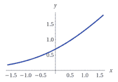
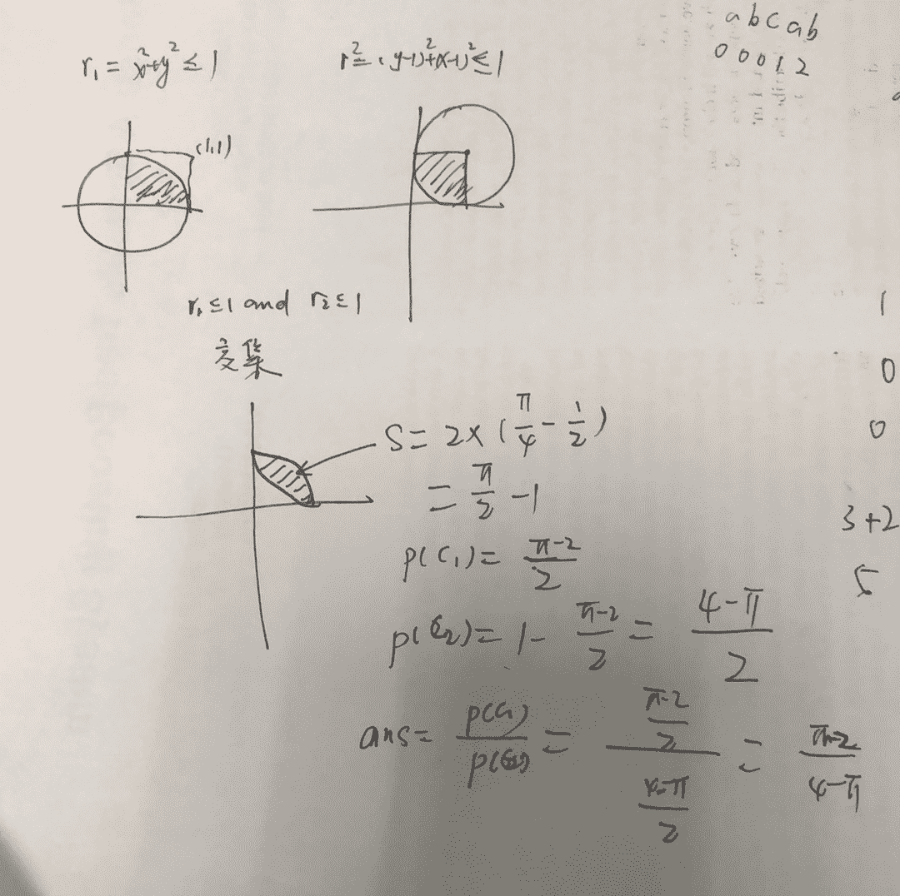
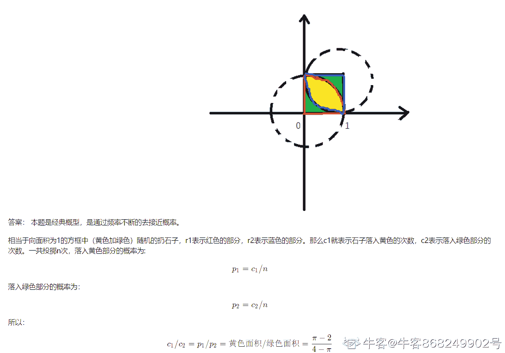
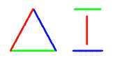

# 创新工场 DeeCamp2018 年人工智能训练营在线笔试第二套 A 卷

## 1

下图显示的机器学习使用的激活函数（Activation function）的图形，是下列哪一个函数的图形？（）

正确答案: C   你的答案: 空 (错误)

本题知识点

算法工程师 创新工场 机器学习

讨论

[大雄哥](https://www.nowcoder.com/profile/7455398)

把 x=0 带进去，前两个答案可以排除。最后一个函数是 sigmoid 函数，图形是 s 型也可以排除。所以选第三个。

编辑于 2019-04-04 22:45:17

* * *

[一碟好菜](https://www.nowcoder.com/profile/911810217)

将 X=0 和正极限 带入分析，选 C

发表于 2019-04-21 17:24:05

* * *

[牛客 679014875 号](https://www.nowcoder.com/profile/679014875)

SoftPlus 激活函数

发表于 2020-09-16 15:33:13

* * *

## 2

有关深度学习加速芯片，以下的说法中不正确的是：（）

正确答案: C   你的答案: 空 (错误)

```cpp
GPU 既可以做游戏图形加速，也可以做深度学习加速
```

```cpp
用于玩游戏的高配置显卡，也可以用于深度学习计算。
```

```cpp
Google  TPU 已经发展了三代，它们只能用于推断（Inference）计算，不能用于训练（Training）计算
```

```cpp
FPGA 最早是作为 CPLD 的竞争技术而出现的
```

本题知识点

Java 工程师 C++工程师 安卓工程师 iOS 工程师 运维工程师 前端工程师 算法工程师 PHP 工程师 测试工程师 创新工场 深度学习

讨论

[emiedon](https://www.nowcoder.com/profile/5022019)

TPU 要是这么菜，google 还研究它干啥

发表于 2019-04-09 20:42:01

* * *

[RISC](https://www.nowcoder.com/profile/599606820)

注意看清题目！习惯性选对的而且从Ａ开始看起，所以直接选了 A 

发表于 2019-06-04 14:00:52

* * *

[牛客 357813895 号](https://www.nowcoder.com/profile/357813895)

玩游戏的 AMD 显卡可以用来深度学习训练吗？用 opencl 吗？

发表于 2020-10-15 09:56:34

* * *

## 3

有关机器学习算法，以下说法中不正确的是：（）

正确答案: D   你的答案: 空 (错误)

```cpp
之所以说监督学习和无监督学习之间并不存在一条严格的界限，是因为很难客观地区分监督者给定的一个值是特征（feature）还是目标（target）。
```

```cpp
当深度学习网络的最后一层是一个 softmax 分类器时，我们可以把网络的前面部分看成是一种表示学习（Representation Learning）的计算单元。
```

```cpp
一个聚类算法将样本分成 k 个不同的聚类（cluster），从另一个角度说，这个聚类算法其实是为样本中的每一个实例提供了一种 k 维的 one-hot 编码方式
```

```cpp
随机梯度下降（Stochastic Gradient Descent）算法是用小规模的样本近似估计梯度的方法，适合在大规模数据上训练深度神经网络，但在逻辑回归、SVM 等算法中的作用很有限。
```

本题知识点

算法工程师 创新工场 机器学习

讨论

[_luffy](https://www.nowcoder.com/profile/824570443)

对于 D 选项，查了下，逻辑回归和 SVM 都可以用随机梯度下降 对于 A 选项不太明白，我觉得很好区分呀

发表于 2019-04-08 11:19:31

* * *

[anroxi](https://www.nowcoder.com/profile/466829635)

SGD 是单个样本，mini-batch GD 是小批量

发表于 2019-04-15 22:51:37

* * *

[苦头陀](https://www.nowcoder.com/profile/610890994)

随机梯度下降算法是常用的迭代算法，是对无法求得解析解的一种权宜之计，与数据规模无关

发表于 2019-05-13 10:09:32

* * *

## 4

有关深度神经网络的训练（Training）和推断（Inference），以下说法中不正确的是：（）

正确答案: B   你的答案: 空 (错误)

```cpp
将数据分组部署在不同 GPU 上进行训练能提高深度神经网络的训练速度。
```

```cpp
TensorFlow 使用 GPU 训练好的模型，在执行推断任务时，也必须在 GPU 上运行。
```

```cpp
将模型中的浮点数精度降低，例如使用 float16 代替 float32，可以压缩训练好的模型的大小。
```

```cpp
GPU 所配置的显存的大小，对于在该 GPU 上训练的深度神经网络的复杂度、训练数据的批次规模等，都是一个无法忽视的影响因素。
```

本题知识点

Java 工程师 C++工程师 安卓工程师 iOS 工程师 运维工程师 前端工程师 算法工程师 PHP 工程师 测试工程师 创新工场 深度学习

讨论

[苦头陀](https://www.nowcoder.com/profile/610890994)

GPU 只是用来加速计算，与模型本身没有直接的关系

发表于 2019-05-13 10:11:23

* * *

[牛客 722897863 号](https://www.nowcoder.com/profile/722897863)

推断时可以指定运行的设备(CPU or GPU)

发表于 2022-01-17 13:29:58

* * *

[Albert089](https://www.nowcoder.com/profile/656491742)

C 也有问题吧？改变已训练好的模型的数值精度难道不会改变结果精度？那模型量化还要校准表干什么

发表于 2021-06-03 15:12:19

* * *

## 5

有关广度优先搜索（Breadth-first Search）和深度优先搜索（Depth-first Search），以下说法中正确的是：（）

正确答案: A   你的答案: 空 (错误)

```cpp
广度优先搜索和深度优先搜索都可以用于遍历一棵树。
```

```cpp
在解决迷宫问题时，深度优先搜索总会比广度优先搜索更快地找到迷宫出口。
```

```cpp
在解决最短路径问题时，Dijkstra 算法（Dijkstra's algorithm）本质上是一种考虑了边（Edge）的权重的深度优先搜索。
```

```cpp
广度优先搜索需要在搜索的每一层保存该层的所有结点，这一操作只能用队列这种数据结构来完成。
```

本题知识点

创新工场 树

讨论

[小崽子子](https://www.nowcoder.com/profile/532016036)

Dijkstra 算法是广度优先

发表于 2019-04-21 15:33:30

* * *

[牛客 990255411 号](https://www.nowcoder.com/profile/990255411)

对一个图的遍历不管是 BFS 或 DFS 都可以。B 选项在解决迷宫问题时，除了一些特殊迷宫，广度比深度能更快找到出口，只是消耗内存更大。C 选项 Dijkstra 算法是广度优先。D 选项，用数组也能实现。

发表于 2020-04-17 20:27:13

* * *

[兔十三](https://www.nowcoder.com/profile/320892413)

广搜比深搜要快，但是占的内存也大

发表于 2019-04-15 17:26:47

* * *

## 6

对于下面的 python3 函数，如果输入的参数 n 非常大，函数的返回值会趋近于以下哪一个值（选项中的值用 Python 表达式来表示）（）

```cpp
import random 
def foo(n):   
        random.seed()
     c1 = 0
     c2 = 0
     for i in range(n):
        x = random.random()
        y = random.random()
        r1 = x * x + y * y
        r2 = (1 - x) * (1 - x) + (1 - y) * (1 - y)
        if r1 <= 1 and r2 <= 1:
           c1 += 1
         else:
           c2 += 1
    return   c1 / c2
```

正确答案: B   你的答案: 空 (错误)

```cpp
4 / 3
```

```cpp
(math.pi - 2) / (4 - math.pi)
```

```cpp
math.e ** (6 / 21)
```

```cpp
math.tan(53 / 180 * math.pi)
```

本题知识点

Java 工程师 C++工程师 前端工程师 算法工程师 测试工程师 创新工场 Python

讨论

[neekity](https://www.nowcoder.com/profile/7732482)



发表于 2019-04-03 17:48:49

* * *

[小黄人的黄](https://www.nowcoder.com/profile/868249902)



发表于 2020-07-17 16:39:40

* * *

[李睿 ABC](https://www.nowcoder.com/profile/7932405)

random.random()生成 0 和 1 之间的随机浮点数 float

发表于 2019-04-04 11:31:49

* * *

## 7

某二叉树共有 4 个结点，前序（先根序）遍历该二叉树的 4 个结点并记录各结点取值，得到的结果是“abcd”。那么，该二叉树有多少种可能的拓扑结构？（）

正确答案: A   你的答案: 空 (错误)

```cpp
14
```

```cpp
16
```

```cpp
10
```

```cpp
12
```

本题知识点

Java 工程师 C++工程师 运维工程师 前端工程师 算法工程师 测试工程师 创新工场 树

讨论

[StOrM3K](https://www.nowcoder.com/profile/6359871)

不要被先序遍历迷惑，其实就是 4 个结点的二叉树有多少种典型的卡特兰数应用。

发表于 2019-04-03 16:55:26

* * *

[大佬求带。。](https://www.nowcoder.com/profile/248966335)

递推公式：递推时每次固定根节点再考虑规定 f(0)=1f(n) = f(n-1)f(0) + f(n-2)f(1)...f(0)f(n-1)解：f(1) = 1f(2) = f(1)f(0) + f(0)f(1) = 2f(3) = f(2)f(0) + f(1)f(1) + f(0)f(2) = 5f(4) = f(3)f(0) + f(2)f(1) + f(1)f(2) + f(0)f(3) = 14

编辑于 2019-04-12 15:49:09

* * *

[小崽子子](https://www.nowcoder.com/profile/532016036)

n 个节点的二叉树一共有((2n)!)/(n!*(n+1)!)种

发表于 2019-04-21 15:42:28

* * *

## 8

一个 4x3 的矩阵如下图所示：

对这个矩阵做奇异值分解（Singular Value Decomposition）后，非 0 的奇异值（Singular Value）个数是：（）

正确答案: B   你的答案: 空 (错误)

```cpp
1
```

```cpp
2
```

```cpp
3
```

```cpp
4
```

本题知识点

Java 工程师 C++工程师 运维工程师 前端工程师 算法工程师 创新工场 组合数学 *讨论

[Hhhy 云帆](https://www.nowcoder.com/profile/1815195)

矩阵的秩等于它的非零奇异值的个数

发表于 2019-04-03 18:13:47

* * *

[ou 牛客](https://www.nowcoder.com/profile/7589509)

原来秩的另一种叫法叫非零奇异值

发表于 2019-04-07 23:04:17

* * *

[陈效威](https://www.nowcoder.com/profile/2409413)

经过行变化原矩阵行等价于 ：1 2 30 1 2
0 0 00 0 0 秩为 2，矩阵的秩等于它的非零奇异值的个数故非零奇异值 2

发表于 2019-06-01 09:22:54

* * *

## 9

给定词典 [a, b, c, d, e]，基于这个五单词词典的三个文档（document）内容如下：

DocA: [a, b, b, d, d]

DocB: [b, b, b, e, e, e, d]

DocC: [d, d, b, b, e]

如果使用 bag-of-words model 将每个文档表示成五维的向量，例如，DocA 可以被表示为 {a:1, b:2, c:0, d:2, e:0}。基于这三个五维向量，计算两两之间的余弦相似性（Cosine similarity），最相似的两个向量是：

正确答案: B   你的答案: 空 (错误)

```cpp
DocA 和 DocB 的向量
```

```cpp
DocA 和 DocC 的向量
```

```cpp
DocB 和 DocC 的向量
```

```cpp
三个向量两两间的余弦相似性是一样的
```

本题知识点

C++工程师 算法工程师 创新工场 组合数学 *讨论

[StOrM3K](https://www.nowcoder.com/profile/6359871)

A = (1,2,0,2,0)B = (0,3,0,1,3)C = (0,2,0,2,1) 直接计算 cos θ = A·B / |A||B|可见，AC 是 cos 值最大的。相似性范围从-1 到 1：-1 意味着两个向量指向的方向正好截然相反，1 表示它们的指向是完全相同的，0 通常表示它们之间是独立的当然，直接看，也应该是 AC，然而我做错了😤

发表于 2019-04-03 16:49:14

* * *

[Vel_](https://www.nowcoder.com/profile/533582347)

```cpp
import numpy as np 

vector1 = np.array([1,2,0,2,0])
vector2 = np.array([0,3,0,1,3])
vector3 = np.array([0,2,0,2,1])

op12=np.dot(vector1,vector2)/(np.linalg.norm(vector1)*(np.linalg.norm(vector2)))
print(op12)
op13=np.dot(vector1,vector3)/(np.linalg.norm(vector1)*(np.linalg.norm(vector3)))
print(op13)
op23=np.dot(vector3,vector2)/(np.linalg.norm(vector3)*(np.linalg.norm(vector2)))
print(op23
```

0.6117752903214979
0.8888888888888888
0.8411910241920597

发表于 2019-04-22 02:18:31

* * *

[我是一个粉刷匠 123](https://www.nowcoder.com/profile/596119076)

应该是越大越相似==居然算成了最小的

发表于 2019-04-14 00:22:04

* * *

## 10

有一个画图用的函数库，提供三个 API 接口：

```cpp
set_color(color) # 设置画笔颜色。初始画笔颜色为黑色。
move_to(x, y)   # 移动画笔到给定的坐标。初始坐标为(0,0)。
line_to(x, y)   # 在画笔的当前位置到给定的终点坐标之间画一条线段。
```

已知每调用 set_color 函数一次，要支付 3 元；每调用 move_to 函数一次，要支付 2 元；调用 line_to 函数免费。请问，要从初始状态开始，用这个函数库画出下图，最少支付多少钱就可以完成？（图中，左侧红绿蓝三条线段相互连接，右侧红绿蓝三条线段相互分离）（）

正确答案: A   你的答案: 空 (错误)

```cpp
19 元
```

```cpp
21 元
```

```cpp
22 元
```

```cpp
23 元
```

本题知识点

Java 工程师 C++工程师 安卓工程师 iOS 工程师 运维工程师 前端工程师 算法工程师 PHP 工程师 测试工程师 创新工场 Windows

讨论

[兜兜风](https://www.nowcoder.com/profile/8764610)

初始坐标不是(0,0)吗？不用算移动步数？？？

发表于 2019-04-14 21:00:37

* * *

[哈哈哈方](https://www.nowcoder.com/profile/205238169)

右绿-左绿-左蓝-右蓝-右红-左红  3+2——2——3——2——3+2——2

发表于 2019-04-27 09:51:56

* * *

[嘻哈哈嘻](https://www.nowcoder.com/profile/486895551)

移动画笔 2 变绿色 3 画右绿 0 移动画笔 2 画左绿 0 变蓝色 3 不用移动笔画左蓝 0 移动画笔 2 画右蓝 0 移动画笔 2 变红色 3 画右红 0 移动画笔 2 画左红 0 2+3+2+3+2+2+3+2=19

发表于 2020-06-21 15:37:13

* * *

## 11

一个粗心的发报员在发送莫尔斯电码（Morse Code）的时候，忘记在发送字母和单词之间停顿，结果收报系统收到的是下面这样的一个没有分隔符的点（.）划（-）的序列（请忽略换行符）。

```cpp
.-.-....-.-...--.-...-....--...-.-...-.--.------..-...-..-.-.---...-..-..---..-..
....--..-.--.-...-.--......-.........-..-.----.-.....-....--.-.-.--.-..---..-....
..-...-..-.--.-.----......-.--.-----..-------.-.-..---.-.-.--..-.-...............
--...--....--..-....-.-----.....-...-------.-......-.........-..-..--.-....-...--
....-.--.-.....--..-.....--..-.---.--...-.-.-..-.-.....---.-.-.-.----....-..-....
.--..----......-...-.--.-...--.....--.....-.......-....---..-..--...-------.--...
.---..---.....-.-.-....-.-...--..-....---..--.--...-.-.-..-.-.....---.-.-.-.----.
...-..-.....--..----.
```

（1）已知这份报文的原始内容是一部著名英文小说的片段，请问，这部小说的作者是： (A) H. G. Wells

(B) J. K. Rowling

(C) Isaac Asimov

(D) Lewis Carroll

(E) Jack London

(F) Stephen King

(G) J. R. R. Tolkien

(H) Edgar Rice Burroughs

(2)  请写出本题解题的主要思路，以及解题时使用的主要代码片段。 

你的答案

本题知识点

算法工程师 创新工场 机器学习

讨论

[uaetalp](https://www.nowcoder.com/profile/976365441)

先建立一个字典，将英文字母作为 key，其莫尔斯编码作为 value。然后对每个作家的名作中的关键字生成莫尔斯电码，比如 J.K.Rowling 的 harry 或者 potter 之类的关键字，然后检查给出的电码里是否含有这些关键字来确定是不是此作者。既然是用片段就能猜到作者，片段中应该包含其代表作品名字之类的决定性信息。所以这个方法应该有效，经过测试，给定的莫尔斯电码中含有 love 和 life，所以猜测是 Jack London 的热爱生命。（以上解析纯属胡乱猜测，大家看看就好~）

发表于 2019-04-09 12:16:50

* * *

[做一个爱笑的 boy](https://www.nowcoder.com/profile/551157193)

由题意可知，小说由英文书写，也就是 26 个英文字母组成。每个英文字母的编码可以通过霍夫曼树对每个字母进行编码，所有的字母都由 0 和 1 表示，对应的是上述中的“.”和“-”。我们通过这个将其转换成一个字符串。并且通过这组 0 和 1 组成的字符串存入内存，通过霍夫曼树的编码进行匹配，得到对应的编码的对应的字母。Morse_code = “0101000.....”array_HFM = [000000,0000001,.....]code = len(array_HFM[0])context = ""
for i in range(0,len(Morse_code),code):    for j in range(len(array_HFM)):        if array_HFM[j] == Morse_code[i:i+code]:            如果想等则得到对应的字母存入列表中            context = context + 对应的字母
print(context)

发表于 2019-04-08 17:05:19

* * *

[陈效威](https://www.nowcoder.com/profile/2409413)

2） 将匹配问题转化成深度优先搜索问题：     摩斯代码是将 26 个英文字母映射成（.）划（-）的序列，所以我们可以从第一个字符开始，尝试最长匹配，如果匹配成功就进入下一层，如果下一层没有能匹配的字母，就返回上一层，改成稍短一点的可行映射。直到所有的序列都能匹配成英文字母。这样就把摩斯代码翻译成了英文字母串

发表于 2019-06-01 08:42:38

* * ***