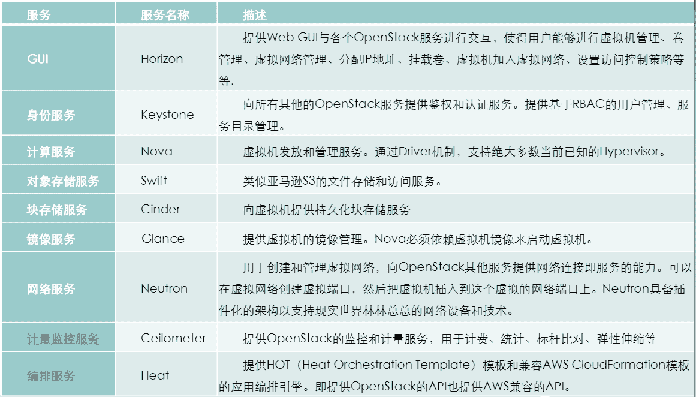
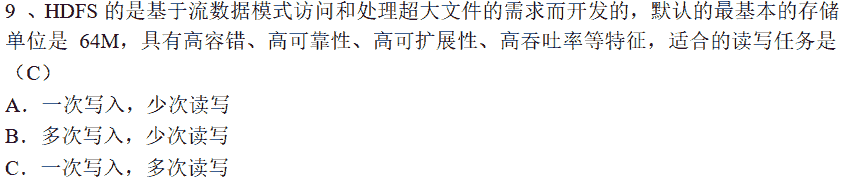
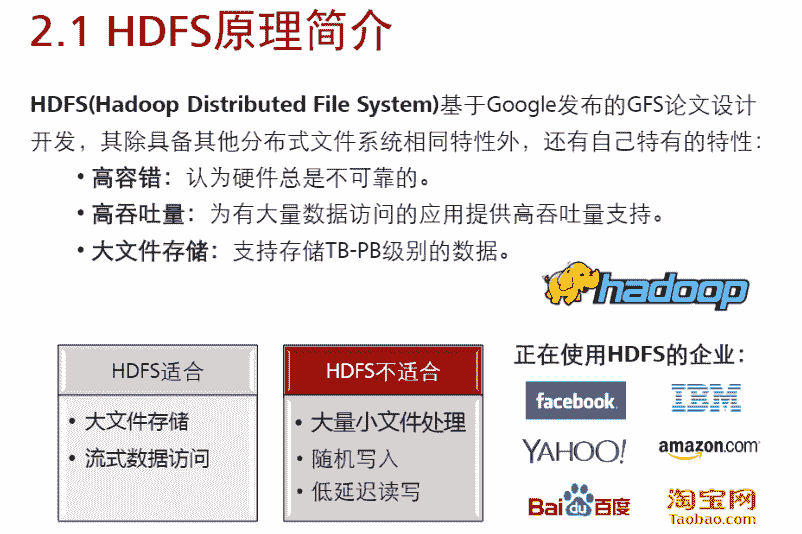

# 二千零一十九、华为网络精英挑战赛初赛模拟题 _ 网络技术方向

## 1

（判断题）小型机通常采用 RISC 和 unix 操作系统。

正确答案: A   你的答案: 空 (错误)

```cpp
T
```

```cpp
F
```

本题知识点

运维工程师 前端工程师 算法工程师 PHP 工程师 测试工程师 华为

讨论

[男南楠难](https://www.nowcoder.com/profile/873954499)

小型机通常采用 RISC（[精简指令集](https://www.baidu.com/s?wd=%E7%B2%BE%E7%AE%80%E6%8C%87%E4%BB%A4%E9%9B%86&tn=SE_PcZhidaonwhc_ngpagmjz&rsv_dl=gh_pc_zhidao)）处理器，运行[UNIX 操作系统](https://www.baidu.com/s?wd=UNIX%E6%93%8D%E4%BD%9C%E7%B3%BB%E7%BB%9F&tn=SE_PcZhidaonwhc_ngpagmjz&rsv_dl=gh_pc_zhidao)，主流品牌有 IBM P、HP9000、ALPHA、SUN 等，一般运用于电信计费、[银行清算](https://www.baidu.com/s?wd=%E9%93%B6%E8%A1%8C%E6%B8%85%E7%AE%97&tn=SE_PcZhidaonwhc_ngpagmjz&rsv_dl=gh_pc_zhidao)、铁路调度、[电力调度](https://www.baidu.com/s?wd=%E7%94%B5%E5%8A%9B%E8%B0%83%E5%BA%A6&tn=SE_PcZhidaonwhc_ngpagmjz&rsv_dl=gh_pc_zhidao)等企业级客户的关键业务。与 PC 服务器相比小型机具有以下特点：
1.性能高。小型机在[计算能力](https://www.baidu.com/s?wd=%E8%AE%A1%E7%AE%97%E8%83%BD%E5%8A%9B&tn=SE_PcZhidaonwhc_ngpagmjz&rsv_dl=gh_pc_zhidao)、I/O 带宽等性能远超过 PC 服务器，tpmC 值可达上千万。
2.安全性高。采用 HA、RAID 等技术有效保证了系统“故障导向安全”性能；采用[UNIX 操作系统](https://www.baidu.com/s?wd=UNIX%E6%93%8D%E4%BD%9C%E7%B3%BB%E7%BB%9F&tn=SE_PcZhidaonwhc_ngpagmjz&rsv_dl=gh_pc_zhidao)具有很好的系统管理性，很少收病毒侵袭。
3.扩展性强。小型机的 CPU 数量、主频、内存、I/O、存储等有很大的扩展空间，同样的机型可以满足客户不同时期的使用需求。
4.价格昂贵。设备价格从数万到数百万，需要专业的技术人员管理。
目前市场流行的小型机有：
IBM P 系列：P550\P570\P590\P595,P750
HP RX 系列:RX2XXX\RX4000\RX6000
HP ALPHA 系列:ES40\ES47\ES80

发表于 2019-04-10 16:59:26

* * *

## 2

（单选题）磁盘接口的类型包括：1、SAS；2、SATA；3、NL-SAS；4、SCSI；5、IDE。请对上述五种类型的接口速率由快到慢进行排序，正确的一项是？

正确答案: B   你的答案: 空 (错误)

```cpp
12345
```

```cpp
13245
```

```cpp
31254
```

```cpp
21354
```

本题知识点

运维工程师 前端工程师 算法工程师 PHP 工程师 测试工程师 运维工程师 前端工程师 算法工程师 PHP 工程师 测试工程师 华为

讨论

[男南楠难](https://www.nowcoder.com/profile/873954499)

目前所能见到的硬盘接口类型主要有 IDE、SATA、SCSI、SAS、FC 等等。 IDE 是俗称的并口，SATA 是俗称的串口，这两种硬盘是个人电脑和低端服务器常见的硬盘。SCSI 是"小型计算机系统专用接口"的简称，SCSI 硬盘就是采用这种接口的硬盘。SAS 就是串口的 SCSI 接口。一般服务器硬盘采用这两类接口，其性能比上述两种硬盘要高，稳定性更强，但是价格高，容量小，噪音大。FC 是光纤通道，和 SCIS 接口一样光纤通道最初也不是为硬盘设计开发的接口技术，是专门为网络系统设计的，但随着存储系统对速度的需求，才逐渐应用到硬盘系统中。SSD 也称作电子硬盘或者固态电子盘，是由控制单元和固态存储单元（DRAM 或 FLASH 芯片）组成的硬盘。固态硬盘的接口规范和定义、功能及使用方法上与普通硬盘的相同，在产品外形和尺寸上也与普通硬盘一致。新一代的固态硬盘普遍采用 SATA-2 接口。但其成本较高。一. IDE
       IDE（Integrated Drive Electronics 集成驱动器电子）的缩写，它的本意是指把控制器与盘体集成在一起的硬盘驱动器，是一种硬盘的传输接口，它有另一个名称叫做 ATA（Advanced Technology Attachment），这两个名词都有厂商在用，指的是相同的东西。
       IDE 的规格后来有所进步，而推出了 EIDE（Enhanced IDE）的规格名称，而这个规格同时又被称为 Fast ATA。所不同的是 Fast ATA 是专指硬盘接口，而 EIDE 还制定了连接光盘等非硬盘产品的标准。而这个连接非硬盘类的 IDE 标准，又称为 ATAPI 接口。而之后再推出更快的接口，名称都只剩下 ATA 的字样，像是 Ultra ATA、ATA/66、ATA/100 等。
       早期的 IDE 接口有两种传输模式，一个是 PIO（Programming I/O）模式，另一个是 DMA（Direct Memory Access）。虽然 DMA 模式系统资源占用少，但需要额外的驱动程序或设置，因此被接受的程度比较低。后来在对速度要求愈来愈高的情况下，DMA 模式由于执行效率较好，操作系统开始直接支持，而且厂商更推出了愈来愈快的 DMA 模式传输速度标准。而从英特尔的 430TX 芯片组开始，就提供了对 Ultra DMA 33 的支持，提供了最大 33MB/sec 的的数据传输率，以后又很快发展到了 ATA 66，ATA 100 以及迈拓提出的 ATA 133 标准，分别提供 66MB/sec，100MB/sec 以及 133MB/sec 的最大数据传输率。值得注意的是，迈拓提出的 ATA 133 标准并没能获得业界的广泛支持，硬盘厂商中只有迈拓自己才采用 ATA 133 标准，而日立（IBM），希捷和西部数据则都采用 ATA 100 标准，芯片组厂商中也只有 VIA，SIS，ALi 以及 nViidia 对次标准提供支持，芯片组厂商中英特尔则只支持 ATA 100 标准。
        各种 IDE 标准都能很好的向下兼容，例如 ATA 133 兼容 ATA 66/100 和 Ultra DMA33，而 ATA 100 也兼容 Ultra DMA 33/66。
       要特别注意的是，对 ATA 66 以及以上的 IDE 接口传输标准而言，必须使用专门的 80 芯 IDE 排线，其与普通的 40 芯 IDE 排线相比，增加了 40 条地线以提高信号的稳定性。二.  SATA
        使用 SATA（Serial ATA）口的硬盘又叫串口硬盘。2001 年，由 Intel、APT、Dell、IBM、希捷、迈拓这几大厂商组成的 Serial ATA***会正式确立了 Serial ATA 1.0 规范。
        2002 年，虽然串行 ATA 的相关设备还未正式上市，但 Serial ATA***会已抢先确立了 Serial ATA 2.0 规范（SATA II）。
        Serial ATA 采用串行连接方式，串行 ATA 总线使用嵌入式时钟信号，具备了更强的纠错能力，与以往相比其最大的区别在于能对传输指令（不仅仅是数据）进行检查，如果发现错误会自动矫正，这在很大程度上提高了数据传输的可靠性。串行接口还具有结构简单、支持热插拔的优点。
        串口硬盘是一种完全不同于并行 ATA 的新型硬盘接口类型，由于采用串行方式传输数据而知名。相对于并行 ATA 来说，就具有非常多的优势。
       a). Serial ATA 以连续串行的方式传送数据，一次只会传送 1 位数据。这样能减少 SATA 接口的针脚数目，使连接电缆数目变少，效率也会更高。
       b). 实际上，Serial ATA 仅用四支针脚就能完成所有的工作，分别用于连接电缆、连接地线、发送数据和接收数据，同时这样的架构还能降低系统能耗和减小系统复杂性。
       c). Serial ATA 的起点更高、发展潜力更大，Serial ATA 1.0 定义的数据传输率可达 150MB/s；这比最快的并行 ATA（即 ATA/133）所能达到 133MB/s 的最高数据传输率还高；而在 Serial ATA 2.0 的数据传输率达到 300MB/s；最终 SATA 将实现 600MB/s 的最高数据传输率。
       在选购主板时，其实并无必要太在意 IDE 接口传输标准有多快，其实在 ATA 100，ATA 133 以及 SATA 150 下硬盘性能都差不多，因为受限于硬盘的机械结构和数据存取方式，硬盘的性能瓶颈是硬盘的内部数据传输率而非外部接口标准，目前主流硬盘的内部数据传输率离 ATA 100 的 100MB/sec 都还差得很远。所以要按照自己的具体需求选购。三.  SATA II
        SATA 的速度是每秒 1.5Gbps(150MB/sec)，SATA2（Serial ATA 2.0 规范）的速度是每秒 3Gbps(300MB/sec)。SATAⅡ接口主板能插 SATA 硬盘，SATA 接口主板不能插 SATAⅡ盘硬，这都是向下兼容的。
        SATA II 是在 SATA 的基础上发展起来的，其主要特征是外部传输率从 SATA 的 1.5G 进一步提高到了 3G，此外还包括 NCQ（Native Command Queuing，原生命令队列）、端口多路器（Port Multiplier）、交错启动（Staggered Spin-up）等一系列的技术特征。单纯的外部传输率达到 3Gbps 并不是真正的 SATA II。
       SATA II 的关键技术就是 3Gbps 的外部传输率和 NCQ 技术。 NCQ 技术可以对硬盘的指令执行顺序进行优化，避免像传统硬盘那样机械地按照接收指令的先后顺序移动磁头读写硬盘的不同位置，与此相反，它会在接收命令后对其进行排序，排序后的磁头将以高效率的顺序进行寻址，从而避免磁头反复移动带来的损耗，延长硬盘寿命。
       另外并非所有的 SATA 硬盘都可以使用 NCQ 技术，除了硬盘本身要支持 NCQ 之外，也要求主板芯片组的 SATA 控制器支持 NCQ。此外，NCQ 技术不支持 FAT 文件系统，只支持 NTFS 文件系统。
       由于 SATA 设备市场比较混乱，不少 SATA 设备提供商在市场宣传中滥用“SATA II”的现象愈演愈烈，例如某些号称“SATA II”的硬盘却仅支持 3Gbps 而不支持 NCQ，而某些只具有 1.5Gbps 的硬盘却又支持 NCQ。所以，由希捷(Seagate)所主导的 SATA-IO(Serial ATA International Organization，SATA 国际组织，原 SATA 工作组)又宣布了 SATA 2.5 规范，收录了原先 SATA II 所具有的大部分功能——从 3Gbps 和 NCQ 到交错启动(Staggered Spin-up)、热插拔(Hot Plug)、端口多路器(Port Multiplier)以及比较新的 eSATA(External SATA，外置式 SATA 接口)等等。
       值得注意的是，部分采用较早的仅支持 1.5Gbps 的南桥芯片(例如 VIA VT8237 和 NVIDIA nForce2 MCP-R/MCP-Gb)的主板在使用 SATA II 硬盘时，可能会出现找不到硬盘或蓝屏的情况。不过大部分硬盘厂商都在硬盘上设置了一个速度选择跳线，以便强制选择 1.5Gbps 或 3Gbps 的工作模式(少数硬盘厂商则是通过相应的工具软件来设置)，只要把硬盘强制设置为 1.5Gbps，SATA II 硬盘照样可以在老主板上正常使用。
       SATA 硬盘在设置 RAID 模式时，一般都需要安装主板芯片组厂商所提供的驱动，但也有少数较老的 SATA RAID 控制器在打了最新补丁的某些版本的 Windows XP 系统里不需要加载驱动就可以组建 RAID。四.  SCSI
        SCSI 的英文全称为“Small Computer System Interface”（小型计算机系统接口），是同 IDE（ATA）完全不同的接口，IDE 接口是普通 PC 的标准接口，而 SCSI 并不是专门为硬盘设计的接口，是一种广泛应用于小型机上的高速数据传输技术。SCSI 接口具有应用范围广、多任务、带宽大、CPU 占用率低，以及热插拔等优点，但较高的价格使得它很难如 IDE 硬盘般普及，因此 SCSI 硬盘主要应用于中、高端服务器和高档工作站中。五.  SAS
       SAS(Serial Attached SCSI)即串行连接 SCSI，是新一代的 SCSI 技术。和现在流行的 Serial ATA(SATA)硬盘相同，都是采用串行技术以获得更高的传输速度，并通过缩短连结线改善内部空间等。SAS 是并行 SCSI 接口之后开发出的全新接口。此接口的设计是为了改善存储系统的效能、可用性和扩充性，并且提供与 SATA 硬盘的兼容性。
       SAS 的接口技术可以向下兼容 SATA。具体来说，二者的兼容性主要体现在物理层和协议层的兼容。
       a). 在物理层，SAS 接口和 SATA 接口完全兼容，SATA 硬盘可以直接使用在 SAS 的环境中，从接口标准上而言，SATA 是 SAS 的一个子标准，因此 SAS 控制器可以直接操控 SATA 硬盘，但是 SAS 却不能直接使用在 SATA 的环境中，因为 SATA 控制器并不能对 SAS 硬盘进行控制；
       b). 在协议层，SAS 由 3 种类型协议组成，根据连接的不同设备使用相应的协议进行数据传输。其中串行 SCSI 协议(SSP)用于传输 SCSI 命令；SCSI 管理协议(SMP)用于对连接设备的维护和管理；SATA 通道协议(STP)用于 SAS 和 SATA 之间数据的传输。因此在这 3 种协议的配合下，SAS 可以和 SATA 以及部分 SCSI 设备无缝结合。
        SAS 系统的背板(Backplane)既可以连接具有双端口、高性能的 SAS 驱动器，也可以连接高容量、低成本的 SATA 驱动器。所以 SAS 驱动器和 SATA 驱动器可以同时存在于一个存储系统之中。但需要注意的是，SATA 系统并不兼容 SAS，所以 SAS 驱动器不能连接到 SATA 背板上。由于 SAS 系统的兼容性，使用户能够运用不同接口的硬盘来满足各类应用在容量上或效能上的需求，因此在扩充存储系统时拥有更多的弹性，让存储设备发挥最大的投资效益。
        在系统中，每一个 SAS 端口可以最多可以连接 16256 个外部设备，并且 SAS 采取直接的点到点的串行传输方式，传输的速率高达 3Gbps，估计以后会有 6Gbps 乃至 12Gbps 的高速接口出现。
       SAS 的接口也做了较大的改进，它同时提供了 3.5 英寸和 2.5 英寸的接口，因此能够适合不同服务器环境的需求。
     SAS 依靠 SAS 扩展器来连接更多的设备，目前的扩展器以 12 端口居多，不过根据板卡厂商产品研发计划显示，未来会有 28、36 端口的扩展器引入，来连接 SAS 设备、主机设备或者其他的 SAS 扩展器。
     和传统并行 SCSI 接口比较起来，SAS 不仅在接口速度上得到显著提升(现在主流 Ultra 320 SCSI 速度为 320MB/sec，而 SAS 才刚起步速度就达到 300MB/sec，未来会达到 600MB/sec 甚至更多)，而且由于采用了串行线缆，不仅可以实现更长的连接距离，还能够提高抗干扰能力，并且这种细细的线缆还可以显著改善机箱内部的散热情况。

发表于 2019-04-10 17:02:55

* * *

[牛牛苹果](https://www.nowcoder.com/profile/186434756)

串行最快

发表于 2021-02-14 14:15:08

* * *

## 3

（判断题）传统的数据中心硬件包括 X86 服务器、小型机和大型机，存储和网络设备。

正确答案: A   你的答案: 空 (错误)

```cpp
T
```

```cpp
F
```

本题知识点

运维工程师 前端工程师 算法工程师 PHP 工程师 测试工程师 华为

讨论

[FuryJiang](https://www.nowcoder.com/profile/728330112)

1.  基础设施层：一套集中对外提供信息服务的 IT 设施（如：服务器、存储、网络）

发表于 2019-04-10 17:30:37

* * *

## 4

（单选题）以下哪项用来确定路由优先级？

正确答案: A   你的答案: 空 (错误)

```cpp
路由协议算法的优劣
```

```cpp
到目标网络的跳数
```

```cpp
发送接口的带宽
```

```cpp
物理链路的可靠性
```

本题知识点

运维工程师 前端工程师 算法工程师 PHP 工程师 测试工程师 运维工程师 前端工程师 算法工程师 PHP 工程师 测试工程师 华为

讨论

[男南楠难](https://www.nowcoder.com/profile/873954499)

路由协议的优先级（Preference，即**管理距离****Administrative Distance**）一般为一个 0 到 255 之间的数字，数字越大则优先级越低

发表于 2019-04-10 17:05:44

* * *

## 5

（判断题）华为公司将网络和业务安全性保障的责任和公司的商业利益放在同等重要的位置。

正确答案: B   你的答案: 空 (错误)

```cpp
T
```

```cpp
F
```

本题知识点

运维工程师 前端工程师 算法工程师 PHP 工程师 测试工程师 华为

讨论

[男南楠难](https://www.nowcoder.com/profile/873954499)

华为把网络安全和隐私保护放在业务运营中作为最高纲领，将投入 20 亿美元，用 5 年的时间来全方位提升软件工程能力，使得产品能够更好地面向未来以及更复杂的网络安全环境。”

     梁华称，这并不是因为某一个国家，而是面向全球经营的需要，并且也是技术发展的必然投入。此前华为公司创始人任正非署名签署的一份网络安全声明显示，华为承诺将构筑并全面实施端到端的全球网络安全保障体系作为公司的重要发展战略之一，同时承诺将公司对网络和业务安全性保障的责任置于公司的商业利益之上。

发表于 2019-04-10 17:06:54

* * *

[bakezq](https://www.nowcoder.com/profile/746654652)

懂了，怎么好听怎么来。

发表于 2020-09-02 17:37:46

* * *

[水果兵台武士](https://www.nowcoder.com/profile/3931046)

安全，安全，还是安全

发表于 2021-03-04 16:33:07

* * *

## 6

（判断题）Openstack 中默认的 hypervisor 层是 Xen。

正确答案: B   你的答案: 空 (错误)

```cpp
T
```

```cpp
F
```

本题知识点

运维工程师 前端工程师 算法工程师 PHP 工程师 测试工程师 华为

讨论

[Stilwell_V](https://www.nowcoder.com/profile/759724127)

一、它是什么，能干什么
想认识一个事物，必须先弄明白它是什么，能干什么。
首先说一下，openstack 是一个搭建云平台的一个解决方案，说他不是个软件，但是我觉得说是一个软件，能够让大家认识更清晰些。openstack 能干什么，可以搭建公有云，私有云，企业云。（顺便说一下，企业云将是 openstack 的用武之地）

二、openstack 组成
上面是一个整体的认识，想进一步了解 openstack，就必须了解它的组成。其实这有点像研究生物。一般生物都有眼睛，鼻子，嘴等。那么 openstack，都有什么。openstack 更像是经过计算机的 72 变之后的产物。包括：7 个核心组件：Compute(计算)， Object Storage(对象存储)，Identity(身份认证)，Dashboard(仪表盘)， Block Storage(块存储)， Network(网络) 和 Image Service(镜像服务) 。
上面从计算机的角度做一个比喻，有不恰当的地方，大家多指正。Compute 类似计算的内存；Object Storage 类似存储器；Identity 就像登陆过程中，验证用户名和密码；Dashboard 就操作界面；Network 这个大家很容易就明白。
三、openstack 组件代号
上面各个组件有名字，其实熟悉 openstack 的都会说他们的代号。也就是专业术语。Compute(代号为“Nova”)
Identity(代号为“Keystone”)
Dashboard(代号为“Horizon”)
Image Service(代号为“Glance”)
Network(代号为“Quantum”)
Object Storage(代号为“Swift”)
Block Storage(代号为“Cinder”)
四、openstack 组件详细介绍
上面了解了，就差不多有点熟悉 openstack 了。想进一步认识，必须不能着急。下面进一步详细介绍各个组件的作用：
（1）Nova
这个是最核心的，Nova 最开始的时候，可以说是一套虚拟化管理程序，还可以管理网络和存储。
（2）keystone
这是提供身份认证和授权的组件。任何系统，身份认证和授权，其实都比较复杂。尤其 Openstack 那么庞大的项目，每个组件都需要使用统一认证和授权。
目前 keystone 要做的东西其实还是很多。没法基于角色的授权，web 管理用户等。

（3）Dashboard
(代号为“Horizon”) 为所有 OpenStack 的服务提供了一个模块化的 web-based 用户界面。使用这个 Web GUI，可以在云上完成大多数的操作，如启动实例，分配 IP 地址，设置访问控制等。
（4）Glance
这是镜像管理。
目前 Glance 的镜像存储，支持本地存储，NFS，swift，sheepdog 和 Ceph，基本是够用了。
目前 Glance 的最大需求就是多个数据中心的镜像管理，如何复制，不过这个功能已经基本实现。还有就是租户私有的 image 管理，这些目前功能都已经实现。
个人感觉：Glance 后续基本就是一个 bug 修复，稳定的阶段。
（5）Quantum
这是网络管理的组件，也是重头戏，Openstack 的未来，基本都要靠 quantum。上面介绍 nova 的时候，说过网络相关的内容，都会交给 Quantum。不过 Quantum 的开发进度不是太如人意。Flosom 规划实现功能，到 Grizzly 才实现。未来 nova network 的代码清理，估计到 H 版本都不见得可以实现。
Quantum 后端可以是商业产品或者开源。开源产品支持 Openvswitch，和 linux bridge。网络设备厂商都在积极参与，让他们的产品支持 Quantum。
（6）Swift
这是对象存储的组件。对于大部分用户来说，swift 不是必须的。你只有存储数量到一定级别，而且是非结构化数据才有这样的需求。很多人都问一个相同的问题：是否可以把虚拟机的存储放在 swift 上。简单回答：不行。你需要搞明白对象存储是干啥，擅长那些地方，那些是不行的。
swift 是 Openstack 所有组件了最成熟的,可以在线升级版本,各种版本可以混合在一起,也就是说,1.75 版本的 swift 可以和 1.48 的在一个群集里.这个是很难得的.
（7）Cinder
这是存储管理的组件。Cinder 存储管理主要是指虚拟机的存储管理。**Hypervisor**，又称**虚拟机监视器**（英语：virtual machine monitor，缩写为 VMM），是用来建立与执行[虚拟机器](https://baike.baidu.com/item/%E8%99%9A%E6%8B%9F%E6%9C%BA%E5%99%A8)的软件、固件或硬件。**KVM**
内核虚拟化，为 openstack 中默认的 Hypervisor 层。
**Qemu**
KVM 的替补，没有 KVM 执行效率高，不支持全虚拟化。
**Flavor**
新建虚拟机的配置列表，可以认为是创建虚拟机模板。
**Keypair**
SSH 连接访问实例的密钥对。
**安全组**
控制实例访问策略的容器，包含各种安全组规则。
**安全组规则**
控制实例访问的具体策略。

编辑于 2020-02-22 10:53:01

* * *

[男南楠难](https://www.nowcoder.com/profile/873954499)

**KVM**
内核虚拟化，为 openstack 中默认的 Hypervisor 层。
**Qemu**
KVM 的替补，没有 KVM 执行效率高，不支持全虚拟化。
**Flavor**
新建虚拟机的配置列表，可以认为是创建虚拟机模板。
**Keypair**
SSH 连接访问实例的密钥对。
**安全组**
控制实例访问策略的容器，包含各种安全组规则。
**安全组规则**
控制实例访问的具体策略。

发表于 2019-04-10 17:07:34

* * *

[zhangzhenren](https://www.nowcoder.com/profile/89745349)

是 KVM

发表于 2019-04-10 16:44:35

* * *

## 7

（单选题）Openstack 组件中，下列哪一项可以提供镜像服务？

正确答案: C   你的答案: 空 (错误)

```cpp
Nova
```

```cpp
Neutron
```

```cpp
Glance
```

```cpp
Swift
```

本题知识点

运维工程师 前端工程师 算法工程师 PHP 工程师 测试工程师 华为

讨论

[男南楠难](https://www.nowcoder.com/profile/873954499)



发表于 2019-04-10 17:08:32

* * *

## 8

（判断题）HDFS 是基于流数据模式访问和处理超大文件的需求而开发的，具有高容错、高可靠性、高可扩展性、高吞吐率等特征，适合的读写任务是一次写入，多次读取。

正确答案: A   你的答案: 空 (错误)

```cpp
T
```

```cpp
F
```

本题知识点

运维工程师 前端工程师 算法工程师 PHP 工程师 测试工程师 华为

讨论

[男南楠难](https://www.nowcoder.com/profile/873954499)



发表于 2019-04-10 17:10:12

* * *

[俊杰小哥](https://www.nowcoder.com/profile/391504371)



发表于 2019-04-11 16:42:25

* * *

[全世界无产阶级联合](https://www.nowcoder.com/profile/389468214)

多用于浏览器

发表于 2019-04-11 21:34:27

* * *

## 9

（单选题）下列选项中，哪一项属于大数据的核心？

正确答案: B   你的答案: 空 (错误)

```cpp
告知与许可
```

```cpp
预测
```

```cpp
匿名化
```

```cpp
规模化
```

本题知识点

运维工程师 前端工程师 算法工程师 PHP 工程师 测试工程师 华为

讨论

[牛客 530525690 号](https://www.nowcoder.com/profile/530525690)

大数据的核心：整理，分析，预测，控制

发表于 2019-04-13 20:17:38

* * *

## 10

（单选题）某超市研究销售纪录数据后发现，买啤酒的人很大概率也会购买尿布，这种情况属于数据挖掘的哪类问题？

正确答案: C   你的答案: 空 (错误)

```cpp
分类
```

```cpp
聚类
```

```cpp
关联规则发现
```

```cpp
自然语言处理
```

本题知识点

运维工程师 前端工程师 算法工程师 PHP 工程师 测试工程师 华为

讨论

[你有毒晚安](https://www.nowcoder.com/profile/523810851)

看似不相干的事物，数据层面的相关性，往往也喻示着事物间逻辑层面的关系。

发表于 2019-09-15 22:11:35

* * *

## 11

（单选题）下列选项中，哪个选项是用于处理海量数据的并行编程模式和大规模数据集的并行运算的软件架构？

正确答案: B   你的答案: 空 (错误)

```cpp
GFS
```

```cpp
MapReduce
```

```cpp
Chubby
```

```cpp
BitTable
```

本题知识点

运维工程师 前端工程师 算法工程师 PHP 工程师 测试工程师 华为

讨论

[男南楠难](https://www.nowcoder.com/profile/873954499)

MapReduce 是一种处理海量数据的并行编程模式，用于大规模数据集（通常大于 1TB）的并行运算。
“Map（映射）”、“Reduce（化简）”的概念和主要思想，都是从函数式编程语言和矢量编程语言借鉴。
适合非结构化和结构化的海量数据的搜索、挖掘、分析与机器智能学习等。

MapReduce 计算模型
分布式计算的瓶颈是网络带宽。“本地计算”是最有效的一种节约网络带宽的手段。

MapReduce 的特点
1、输入的键值是不固定的，由分析人员选择
2、对于非结构化和半结构化数据，非常有效
3、适合于大规模数据的一次写入，多次查询
4、MapReduce 其核心就是高速、流式读写操作无共享

无共享结构让 MapReduce 程序员无需考虑系统的部分失效问题；
因为自身的系统实现，能够检测到失败的 map 或 reduce 任务；
并让正常的机器重新执行这些失败的任务；
因为各个任务之间彼此独立；
任务的执行顺序是无关紧要的；

Map 函数——对一部分原始数据进行指定的操作。每个 Map 操作都针对不同的原始数据，因此 Map 与 Map 之间是互相独立的，这使得它们可以充分并行化。
Reduce 操作——对每个 Map 所产生的一部分中间结果进行合并操作，每个 Reduce 所处理的 Map 中间结果是互不交叉的，所有 Reduce 产生的最终结果经过简单连接就形成了完整

发表于 2019-04-10 17:12:18

* * *

[清清呜呜](https://www.nowcoder.com/profile/122449092)

MapReduce 是 Hadoop 的核心计算框架，是用于大规模数据集（大于 1TB）并行运算的编程模型，主要包括 Map(映射）和 Reduce（规约）两部分。当启动一个 Mapreduce 任务时，Map 端会读取 HDFS 上的数据，将数据映射成所需要的键值对类型并传到 Reduce 端。Reduce 端接收 Map 端传过来的键值对类型的数据，根据不同键进行分组，对每一组键相同的数据进行处理，得到新的键值对并输出到 HDFS，这就是 MapReduce 的核心思想。

发表于 2019-04-10 20:48:32

* * *

## 12

（判断题）人工智能（Artificial Intelligence）是研究、开发用于模拟、延伸和扩展人的智能的理论、方法、技术及应用系统的一门新的技术科学。

正确答案: A   你的答案: 空 (错误)

```cpp
T
```

```cpp
F
```

本题知识点

运维工程师 前端工程师 算法工程师 PHP 工程师 测试工程师 华为

讨论

[201909171710441](https://www.nowcoder.com/profile/592527390)

，把

发表于 2019-09-18 18:43:57

* * *

## 13

（判断题）机器学习是人工智能的核心研究领域之一，任何一个没有学习能力的系统都很难被认为是一个真正的智能系统。

正确答案: A   你的答案: 空 (错误)

```cpp
T
```

```cpp
F
```

本题知识点

运维工程师 前端工程师 算法工程师 PHP 工程师 测试工程师 华为

讨论

[201909171710441](https://www.nowcoder.com/profile/592527390)

的

发表于 2019-09-18 18:44:29

* * *

## 14

（单选题）以下是针对哪种机器学习算法的描述？
系统从环境到行为映射的学习，以获得最大的数值的奖赏信号，然后进行闭路循环，与其他机器学习算法不同，它着重与从交互中进行以目标为导向的学习。

正确答案: B   你的答案: 空 (错误)

```cpp
监督学习
```

```cpp
强化学习
```

```cpp
半监督学习
```

```cpp
聚类学习
```

本题知识点

运维工程师 前端工程师 算法工程师 PHP 工程师 测试工程师 华为

讨论

[永青](https://www.nowcoder.com/profile/671623942)

有惩罚和奖赏关键词的可以初步判定为强化学习

发表于 2019-04-10 17:09:25

* * *

[牛客 879671609 号](https://www.nowcoder.com/profile/879671609)

B

发表于 2020-10-22 18:37:22

* * *

## 15

（判断题）5G 可以每平方公里支持 1 百万个连接。

正确答案: A   你的答案: 空 (错误)

```cpp
T
```

```cpp
F
```

本题知识点

运维工程师 前端工程师 算法工程师 PHP 工程师 测试工程师 华为

讨论

[男南楠难](https://www.nowcoder.com/profile/873954499)

**5G 传输速率峰值**

该标准要求单个 5G 基站至少能够支持 20Gbps 的下行链路以及 10Gbps 的上行链路，这是单个基站可以处理的总流量。理论上，如果固定的无线宽带用户使用专用的点到点连接，那么他们可以获得接近 5G 的速度。实际上，基站覆盖范围内的用户将分配使用 20Gbps 以及 10Gbps 这一数据吞吐量。

**5G 连接密度**

5G 必须支持每平方公里内至少 100 万台连接设备。这听起来很夸张，但是这更像是为物联网准备的。当所有的交通灯、停车位、以及车辆都支持 5G 时，将会达到这一惊人的连接密度。

**5G 移动性**

与 LTE 和 LTE-Advanced 类似，5G 标准要求基站能够支持速度高达 500km/h 的设备（比如高铁）连接。此外，该草案还讨论了不同物理位置对基站设置的不同需求。比如，室内以及人口面密度较高的城市中心则不需要担心高铁能否连接，但是农村或者郊区则需要支考虑到对行人、车辆以及高速列车的支持。

**5G 能效**

5G 规范要求在负载下保持高能效，并且在空闲的状态下能够迅速切换成低能耗模式。为了实现这一点，5G 无线电必须在 10ms 内从全速模式切换到节能模式。

**5G 延迟**

在理想情况下，5G 网络的延迟最大不能超过 4ms，而 LTE 网络对延迟的要求则是 20ms。不过，要想实现超稳定低延迟通信（URLLC），5G 的延迟必须低于 1ms。

**5G 频谱效率**

从草案的规定来看，5G 的峰值频谱效率（每赫兹频谱传输的比特）与 LTE-advanced 非常接近，都是上行 30bits/Hz、下行 15bits/Hz，这相当于 8x4 MIMO。

**5G 实际传输速率**

最后，不管单个 5G 基站的峰值容量是多少，该草案要求每个用户的下载和上传速度必须达到 100Mbps 以及 50Mbps。这些听起来和 LTE-Advanced 很接近，但是 5G 能够让你一直保持 100Mbps 的下载速度，而不是靠运气。

除此之外，该草案还要求增强 5G 的稳定性和可靠性，例如数据包必须在 1ms 内到达基站，并且切换 5G 基站的中断时间应该为 0ms，也就是说切换过程是瞬时的，中间不允许有数据丢失。

发表于 2019-04-10 17:13:25

* * *

[永青](https://www.nowcoder.com/profile/671623942)

5G 每平方公里允许 1 百万个连接，时延控制在 5 毫秒，流量 10Gbit/s

发表于 2019-04-10 17:11:31

* * *

## 16

（单选题）下列哪一种云服务是把应用或数据作为一种服务交付给客户的？

正确答案: A   你的答案: 空 (错误)

```cpp
SaaS
```

```cpp
PaaS
```

```cpp
IaaS
```

本题知识点

运维工程师 前端工程师 算法工程师 PHP 工程师 测试工程师 华为

讨论

[男南楠难](https://www.nowcoder.com/profile/873954499)

3 形式
IaaS：基础设施即服务
IaaS(Infrastructure-as-a- Service)：基础设施即服务。消费者通过 Internet 可以从完善的计算机基础设施获得服务。
PaaS：平台即服务
PaaS(Platform-as-a- Service)：平台即服务。PaaS 实际上是指将软件研发的平台作为一种服务，以 SaaS 的模式提交给用户。因此，PaaS 也是[SaaS 模式](https://www.baidu.com/s?wd=SaaS%E6%A8%A1%E5%BC%8F&tn=SE_PcZhidaonwhc_ngpagmjz&rsv_dl=gh_pc_zhidao)的一种应用。但是，PaaS 的出现可以加快 SaaS 的发展，尤其是加快 SaaS 应用的开发速度。
SaaS：[软件即服务](https://www.baidu.com/s?wd=%E8%BD%AF%E4%BB%B6%E5%8D%B3%E6%9C%8D%E5%8A%A1&tn=SE_PcZhidaonwhc_ngpagmjz&rsv_dl=gh_pc_zhidao)
SaaS(Software-as-a- Service)：[软件即服务](https://www.baidu.com/s?wd=%E8%BD%AF%E4%BB%B6%E5%8D%B3%E6%9C%8D%E5%8A%A1&tn=SE_PcZhidaonwhc_ngpagmjz&rsv_dl=gh_pc_zhidao)。它是一种通过 Internet 提供软件的模式，用户无需购买软件，而是向提供商租用基于 Web 的软件，来管理企业经营活动。
按需计算
顾名思义，按需(on—demand)计算将计算机资源(处理能力、存储等)打包成类似公共设施的可计量的服务。在这一模式中，客户只需为他们所需的处理能力和存储支付费用。那些具有很大的需求高峰并伴有低得多的正常使用期的公司特别受益于效用计算。当然，该公司需要为高峰使用支付更多，但是，当高峰结束，正常使用模式恢复时，他们的费用会迅速下降。
按需计算服务的客户端基本上将这些服务作为异地虚拟服务器来使用。无须投资自己的物理基础设施，公司与云服务提供商之间执行现用现付的方案。
按需计算本身并不是一个新概念，但它因云计算而获得新的生命。在过去的岁月里，按需计算由一台服务器通过某种分时方式而提供。

发表于 2019-04-10 17:14:12

* * *

## 17

（多选题）Openstack 项目中提供块存储服务和对象存储服务的组件是下列哪两个？

正确答案: C D   你的答案: 空 (错误)

```cpp
Nova
```

```cpp
Keystone
```

```cpp
Cinder
```

```cpp
Swift
```

本题知识点

运维工程师 前端工程师 算法工程师 PHP 工程师 测试工程师 华为

讨论

[永青](https://www.nowcoder.com/profile/671623942)

本题中：Nova 提供计算服务            keystone   提供身份验证服务        cinder 提供块存储服务     swift  提供对象存储服务所以选择 C D

发表于 2019-04-14 12:31:13

* * *

[小叮咚~](https://www.nowcoder.com/profile/6127128)

 Openstack object Storage（Swift）
1 Swift 是 OpenStack 的对象存储（object Storage）项目，是一个可扩展并且提供了冗余的存储系统。
2 对象和文件分散存储在同一个集群中的多台服务器的磁盘上，由 OpenStack 负责数据的复制和一致性。
3 对象存储系统是用于存储大量静态数据的分布式存储系统，没有主节点或者管理节点，便于系统的扩展和数据的冗余和持久化。
4 存储的集群可以通过添加服务器完成横向的扩展。
5 如果集群中服务器或者磁盘出现失败情况，Openstack 会复制数据到集群中的其他节点。

Openstack Block Storage（Cinder）
1 Cinder 是 OpenStack 的块存储服务。
2 为云环境提供块设备的创建、添加和卸载。
3 Cinder 目前支持多种存储平台（Linux server storage ,Ceph,CloudByte,Coraid,EMC(VMAX and VNX),GlusterFS,IBM Storage(Storwize family,SAN Volume Controller,and XIV Storage System),Linux LIO,NetApp,Nexenta,Scality,SolidFire and HP(Store Virtual and StoreServ 3Par falilies)）
4 块设备适用于对应性能要求较高的应用场景：比如数据库。
5 块设备的快照功能可以实现基于块存储卷的数据备份，而且也可以利用快照进行数据恢复。

发表于 2019-04-11 13:24:38

* * *

## 18

（多选题）以下哪些因素是人工智能发展迅速的必要因素？

正确答案: A C   你的答案: 空 (错误)

```cpp
硬件
```

```cpp
人们对 AI 的态度
```

```cpp
算力
```

```cpp
给机器注入情感
```

本题知识点

运维工程师 前端工程师 算法工程师 PHP 工程师 测试工程师 华为

讨论

[永青](https://www.nowcoder.com/profile/671623942)

对 AI 发展影响较大的因素有：硬件    算法   算力  数据  场景本题涉及的有  硬件和算力      故选择 A C

发表于 2019-04-14 12:34:08

* * *

## 19

（多选题）以下哪些频段可以用于 5G?

正确答案: A B C   你的答案: 空 (错误)

```cpp
3.5GHZ
```

```cpp
900MHz
```

```cpp
39GHz
```

```cpp
150GHz
```

本题知识点

运维工程师 前端工程师 算法工程师 PHP 工程师 测试工程师 华为

讨论

[CassielCoder](https://www.nowcoder.com/profile/323083001)

①Frequency range 1 （FR1）：就是我们通常讲的 6GHz 以下频段

•频率范围：450MHz - 6.0GHz

•最大信道带宽 100MHz

②Frequency range 2 （FR2）：就是毫米波频段

•频率范围：24.25GHz - 52.6GHz

•最大信道带宽 400MHz

发表于 2019-04-10 18:59:06

* * *

[36°](https://www.nowcoder.com/profile/609426520)

3.5GHz 是 C 频段作为 5G 使用的，900MHz 也是可以作为 5G 使用的，39Ghz 是作为 6GHz 以上的使用的，80GHz 以上就是可见光了

发表于 2019-04-10 16:47:42

* * *

## 20

（多选题）以下哪些是 Massive MIMO 带来的好处？

正确答案: A B C   你的答案: 空 (错误)

```cpp
3D 赋型可以增强高楼的覆盖
```

```cpp
MU-BF 可以提升小区速率
```

```cpp
Massive MIMO 的波束更窄，可以降低干扰
```

```cpp
Massive MIMO 的天线重量可以大幅度降低，对部署要求降低
```

本题知识点

运维工程师 前端工程师 算法工程师 PHP 工程师 测试工程师 华为

讨论

[男南楠难](https://www.nowcoder.com/profile/873954499)

高复用增益和分集增益：大规模 MIMO 系统的空间分辨率与现有 MIMO 系统相比显著提高，它能深度挖掘空间维度资源，使得基站覆盖范围内的多个用户在同一时频资源上利用大规模 MIMO 提供的空间自由度与基站同时进行通信，提升频谱资源在多个用户之间的复用能力，从而在不需要增加基站密度和带宽的条件下大幅度提高频谱效率。

 高能量效率：大规模 MIMO 系统可形成更窄的波束，集中辐射于更小的空间区域内，从而使基站与 UE 之间的射频传输链路上的能量效率更高，减少基站发射功率损耗，是构建未来高能效绿色宽带无线通信系统的重要技术。

 高空间分辨率：大规模 MIMO 系统具有更好的鲁棒性能。由于天线数目远大于 UE 数目，系统具有很高的空间自由度，系统具有很强的抗干扰能力。当基站天线数目趋于无穷时，加性高斯白噪声和瑞利衰落等负面影响全都可以忽略不计。

发表于 2019-04-10 17:15:28

* * *

[HuanRen](https://www.nowcoder.com/profile/207002215)

毫米波频段部署大规模天线是得益于毫米波频率高，波长短，因此天线间隔小，故而能够部署更多的小尺寸天线。

发表于 2020-04-03 10:18:15

* * *

[许愿 OFFER6](https://www.nowcoder.com/profile/172645119)

大规模天线技术

发表于 2020-02-25 15:27:26

* * *