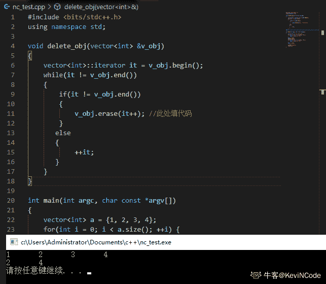
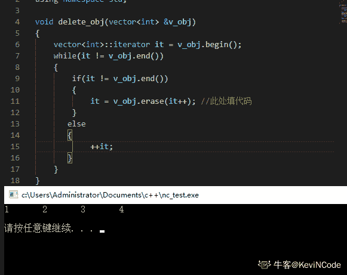

# 二千零一十九、华为网络精英挑战赛初赛模拟题 _ 基础开发 C 方向

## 1

（判断题）小型机通常采用 RISC 和 unix 操作系统。

正确答案: A   你的答案: 空 (错误)

```cpp
T
```

```cpp
F
```

本题知识点

C++工程师 华为 2019

讨论

[小丑骑士](https://www.nowcoder.com/profile/778081061)

小型机操作系统一般是 UNIX，PC 服务器操作系统一般是 windows。但是题干中 RISC 不是操作系统，是精简指令集计算机，是计算机***处理器的一种设计模式，这种设计思路对指令数目和[寻址方式](https://baike.baidu.com/item/%E5%AF%BB%E5%9D%80%E6%96%B9%E5%BC%8F)都做了精简，使其实现更容易，指令[并行执行](https://baike.baidu.com/item/%E5%B9%B6%E8%A1%8C%E6%89%A7%E8%A1%8C)程度更好，编译器的效率更高，是 CPU 的设计模式，对应 ARM。RISC 专注高性能、高性能功耗比、小体积以及移动设备领域，CISC 专注桌面、高性能和民用市场。

发表于 2019-04-11 09:41:17

* * *

[gapex](https://www.nowcoder.com/profile/3810926)

x86/x86_64 指令集是精简指令集？！

发表于 2020-08-05 17:19:18

* * *

## 2

（单选题）磁盘接口的类型包括：1、SAS；2、SATA；3、NL-SAS；4、SCSI；5、IDE。请对上述五种类型的接口速率由快到慢进行排序，正确的一项是？

正确答案: B   你的答案: 空 (错误)

```cpp
12345
```

```cpp
13245
```

```cpp
31254
```

```cpp
21354
```

本题知识点

C++工程师 华为 2019

讨论

[小丑骑士](https://www.nowcoder.com/profile/778081061)

IDE 电子集成驱动器，“硬盘控制器”与“盘体”集成在一起的硬盘驱动器，一般指的是最早出现的 ATA-1,速度较慢，目前已经逐渐淘汰。SCSI 指的是小型计算机接口，其速度，性能和稳定性能都优于 IDE，主要面向服务器和工作站市场。SATA 指的是 Serial Advanced Technology Attachment，是串行 ATA。优点是持热插拔 ，传输速度快，执行效率高。SAS 是指 SAS 是 Serial Attach SCSI，串行 SCSI。NL-SAS 是采用了 SAS 的磁盘接口和 SATA 的盘体的综合体。首先串行速度高于非串行的，SCSI 是高于 IDE（ATA）的。

发表于 2019-04-11 09:57:12

* * *

[努力加油吧小牛](https://www.nowcoder.com/profile/620861406)

SAS SATA SCSI

编辑于 2019-04-20 14:24:52

* * *

## 3

（判断题）传统的数据中心硬件包括 X86 服务器、小型机和大型机，存储和网络设备。

正确答案: A   你的答案: 空 (错误)

```cpp
T
```

```cpp
F
```

本题知识点

C++工程师 华为 2019

## 4

（单选题）以下哪项用来确定路由优先级？

正确答案: A   你的答案: 空 (错误)

```cpp
路由协议算法的优劣
```

```cpp
到目标网络的跳数
```

```cpp
发送接口的带宽
```

```cpp
物理链路的可靠性
```

本题知识点

C++工程师 华为 2019

讨论

[陈效威](https://www.nowcoder.com/profile/2409413)

路由协议的优先级（Preference，即**管理距离****Administrative Distance**）一般为一个 0 到 255 之间的数字，数字越大则优先级越低。 | 华为路由器路由优先级 

&#124; 路由协议 &#124; 优先级 &#124;
&#124; DIRECT &#124; 0 &#124;
&#124; OSPF &#124; 10 &#124;
&#124; STATIC &#124; 60 &#124;
&#124; IGRP &#124; 80 &#124;
&#124; RIP &#124; 110 &#124;
&#124; OSPFASE &#124; 150 &#124;
&#124; BGP &#124; 170 &#124;

 |

路由的优先级的概念是优先级高的新路由协议可替代优先级低的同信宿路由，反之，则不然。路由优先级在不同协议时候，比较 preference 的大小，而在路由协议相同时候由于 preference 相同，则再比较 metric 的大小，进而确定最终选择的路由。 

发表于 2019-04-10 19:28:48

* * *

[小丑骑士](https://www.nowcoder.com/profile/778081061)

路由优先级也被称为路由的“管理距离”，是一个正整数，范围 0~255，它用于指定**路由协议的优先级**。

发表于 2019-04-11 09:59:27

* * *

[牛客 211455511 号](https://www.nowcoder.com/profile/211455511)

b

发表于 2019-12-31 09:59:45

* * *

## 5

（判断题）华为公司将网络和业务安全性保障的责任和公司的商业利益放在同等重要的位置。

正确答案: B   你的答案: 空 (错误)

```cpp
T
```

```cpp
F
```

本题知识点

C++工程师 华为 2019

讨论

[无能狂怒轩](https://www.nowcoder.com/profile/740648719)

我的理解：企业重视利益 -》 利益和安全同等级 = 企业重视安全

发表于 2020-02-12 20:16:56

* * *

[踏上不归路](https://www.nowcoder.com/profile/220948689)

商业肯定是安全为主。利益为次，基本常识

发表于 2019-07-25 16:19:47

* * *

[小丑骑士](https://www.nowcoder.com/profile/778081061)

行测题。哪家公司会告诉别人我的目的就是为了赚钱？？？？

发表于 2019-04-11 10:00:52

* * *

## 6

（判断题）在 shell 命令行方式下，一行只能写一个指令，每次只能使用一个命令。

正确答案: B   你的答案: 空 (错误)

```cpp
T
```

```cpp
F
```

本题知识点

C++工程师 华为 2019

讨论

[小丑骑士](https://www.nowcoder.com/profile/778081061)

在执行 Shell 命令时多个命令可以在一个命令行上运行，但此时要使用分号(;)分隔命令，长 Shell 命令行可以使用反斜线字符(\)在命令行上扩充

发表于 2019-04-11 10:05:30

* * *

## 7

（判断题）将编译程序分成若干个“遍”是为了使程序的结构更加清晰。

正确答案: A   你的答案: 空 (错误)

```cpp
T
```

```cpp
F
```

本题知识点

C++工程师 华为 2019

讨论

[gapex](https://www.nowcoder.com/profile/3810926)

编译过程和程序本身有关系？！分多阶段编译是为了支持模块化啊！每次只需要编译修改过的单元，否则全部重新编译，整个过程太耗时

发表于 2020-08-05 17:22:14

* * *

## 8

（单选题）匹配"英文字母文件名:一个或者多个空格 行号"的正则表达式为：

正确答案: C   你的答案: 空 (错误)

```cpp
[a-Z]:+[ ]*[0-9]+
```

```cpp
[a-zA-Z]:+[ ]+[0-9]*
```

```cpp
[a-zA-Z]+:[ ]+[0-9]+
```

```cpp
[a-Z]+:[ ]+[0-9]*
```

本题知识点

C++工程师 华为 2019

讨论

[小丑骑士](https://www.nowcoder.com/profile/778081061)

限定符用来指定正则表达式的一个给定组件必须要出现多少次才能满足匹配。有 * 或 + 或 ? 或 {n} 或 {n,} 或 {n,m} 共 6 种。

| * | 匹配前面的子表达式零次或多次。例如，zo* 能匹配 "z" 以及 "zoo"。* 等价于{0,}。 |
| + | 匹配前面的子表达式一次或多次。例如，'zo+' 能匹配 "zo" 以及 "zoo"，但不能匹配 "z"。+ 等价于 {1,}。 |
| ? | 匹配前面的子表达式零次或一次。例如，"do(es)?" 可以匹配 "do" 、 "does" 中的 "does" 、 "doxy" 中的 "do" 。? 等价于 {0,1}。 |
| {n} | n 是一个非负整数。匹配确定的 n 次。例如，'o{2}' 不能匹配 "Bob" 中的 'o'，但是能匹配 "food" 中的两个 o。 |
| {n,} | n 是一个非负整数。至少匹配 n 次。例如，'o{2,}' 不能匹配 "Bob" 中的 'o'，但能匹配 "foooood" 中的所有 o。'o{1,}' 等价于 'o+'。'o{0,}' 则等价于 'o*'。 |
| {n,m} | m 和 n 均为非负整数，其中 n <= m。最少匹配 n 次且最多匹配 m 次。例如，"o{1,3}" 将匹配 "fooooood" 中的前三个 o。'o{0,1}' 等价于 'o?'。请注意在逗号和两个数之间不能有空格。 |

根据题目意思是出现一个或多个，排除带 * 的，因此选择 C

发表于 2019-04-11 10:14:20

* * *

[陈效威](https://www.nowcoder.com/profile/2409413)

+在正则表达式中的作用是: 匹配至少一个字符{n,m} 表示 n-m 个字符\d{3}\s+\d{3,8} 三个数字  \s+ 表示至少一个空格 3 到 8 个空格

```cpp
[a-zA-Z]+  至少一个字母开头 \ 
```

发表于 2019-04-10 19:35:48

* * *

## 9

（单选题）若要将当前目录中的 myfile.txt 文件压缩成 myfile.txt.tar.gz，命令为

正确答案: C   你的答案: 空 (错误)

```cpp
tar -cvf myfile.txt myfile.txt.tar.gz
```

```cpp
tar -zcvf myfile.txt myfile.txt.tar.gz
```

```cpp
tar -zcvf myfile.txt.tar.gz myfile.txt
```

```cpp
tar -cvf myfile.txt.tar.gz myfile.txt
```

本题知识点

C++工程师 华为 2019

讨论

[努力加油吧小牛](https://www.nowcoder.com/profile/620861406)

tar 命令 tar option des sou option: -c 创建压缩文件 -x 解压压缩文件 -z 使用 gzip -f 指定压缩文件 -v 显示压缩过程

发表于 2019-04-20 14:34:38

* * *

[救救我吧失业了](https://www.nowcoder.com/profile/355986647)

-z ：通过 gzip 的支持进行压缩/解压缩，此时文件最好为*.tar.gz

发表于 2019-08-28 12:23:27

* * *

[大 liang](https://www.nowcoder.com/profile/845398040)

关于选项**D**

```cpp
tar -cvf myfile.txt.tar.gz myfile.txt
```

在`Red Hat Enterprise Linux Server release 6.5`和`Ubuntu 18.04.2 LTS` 版本上 D 选项也能成功压缩，各位大佬求解

发表于 2019-07-19 16:37:26

* * *

## 10

（判断题）对于整数 n，(n & (n-1) ) == 0 的含义是判断 n 是否为偶数。

正确答案: B   你的答案: 空 (错误)

```cpp
正确
```

```cpp
错误
```

本题知识点

C++工程师 华为 C++ C 语言 2019

讨论

[陈效威](https://www.nowcoder.com/profile/2409413)

要判断奇偶数, 直接用二进制最后一位去比较就可以.if(n & 1) cout << "奇数" << endl; else  cout << "偶数" << endl;n & (n-1)  的作用是把 n 的最低位 1 设置为 0; XXX10000 -> XXX00000 所以这个表达式(n & (n-1) ) == 0 可以用来判断 n 是否是 0 或者 2 的整数倍.

编辑于 2019-04-10 19:51:37

* * *

[影囚](https://www.nowcoder.com/profile/427523057)

n & (n-1) 是将 n 的二进制形式，最右端的 1 置 0。 因此表达式 ( n & (n-1) ) == 0  的作用是判断，n 的二进制 bit 位中 1 的个数是否为 1 或 0，也就是判断 n 是否为 0 或 2 的非负整数幂 。

发表于 2021-05-31 15:45:41

* * *

[Justliangzhu](https://www.nowcoder.com/profile/674742677)

这个&有 0 则 0,-1 操作正好各项转变 01,为什么不能判断奇数偶数,真是奇了怪了.

发表于 2021-02-24 10:30:31

* * *

## 11

（判断题）不含回路的有向图一定存在拓扑排序。

正确答案: A   你的答案: 空 (错误)

```cpp
T
```

```cpp
F
```

本题知识点

C++工程师 华为 2019

讨论

[小丑骑士](https://www.nowcoder.com/profile/778081061)

```cpp
## 判断有向图是否含有回路的一个重要方法就是采用拓扑排序。

```

编辑于 2019-04-11 10:29:35

* * *

[牛客 140828590 号](https://www.nowcoder.com/profile/140828590)

一定是连通图吗？题目没有给限制

发表于 2019-12-23 16:09:38

* * *

## 12

（单选题）{0, 2, 1, 4, 3, 9, 5, 8, 6, 7} 是以数组形式存储的小顶堆，删除堆顶元素 0 后的结果是（）

正确答案: D   你的答案: 空 (错误)

```cpp
{2, 1, 4, 3, 8, 9, 5, 8, 6, 7}
```

```cpp
{1, 2, 5, 4, 3, 9, 8, 6, 7}
```

```cpp
{2, 3, 1, 4, 7, 9, 5, 8, 6}
```

```cpp
{1, 2, 5, 4, 3, 9, 7, 8, 6}
```

本题知识点

C++工程师 华为 2019

讨论

[小丑灰灰](https://www.nowcoder.com/profile/158687141)

删除堆顶，然后总是从堆尾将某个数先放置到堆顶，然后依次下调到符合完全二叉树的要求，即每个子树的两个子节点都比父节点大（最小堆）

发表于 2019-04-13 09:07:14

* * *

[三公子 Tjq](https://www.nowcoder.com/profile/315575973)

既然忘记删除小顶堆，从队尾拿一元素到根顶，然后依次下调，各子树都符合小顶堆啊。

发表于 2019-11-13 22:07:37

* * *

[dzzhyk](https://www.nowcoder.com/profile/604000464)

小顶堆 好像是 最小堆

发表于 2019-04-12 23:46:17

* * *

## 13

（单选题）20 个节点的三叉树（每个节点都有三个指向孩子节点的指针），有多少个空指针？

正确答案: C   你的答案: 空 (错误)

```cpp
40
```

```cpp
39
```

```cpp
41
```

```cpp
60
```

本题知识点

C++工程师 华为 2019

讨论

[shopeer](https://www.nowcoder.com/profile/5040750)

20*3 - (20-1) = 41

发表于 2019-04-10 21:03:18

* * *

[小丑灰灰](https://www.nowcoder.com/profile/158687141)

m 个节点的树有 m-1 条边，即有 m-1 个非空指针，所有空指针的个数为 3*m-(m-1)=2*m-1

发表于 2019-04-14 10:04:52

* * *

[影囚](https://www.nowcoder.com/profile/427523057)

每个节点的出度都是 3，根节点入度为 0，其余入度均为 1，所以空指针的个数为 总出度-总入度 = 20*3 - 19 = 41

发表于 2021-05-31 15:48:10

* * *

## 14

（判断题）局部变量可以和全局变量重名，编译的时候不会出现错误，但一旦不小心，就可能导致使用错误变量，所以在定义局部变量的时候不要和全局变量重名。

正确答案: A   你的答案: 空 (错误)

```cpp
T
```

```cpp
F
```

本题知识点

C++工程师 华为 C++ 2019

讨论

[牛客 575804409 号](https://www.nowcoder.com/profile/575804409)

首先确定一点：全局变量和局部变量是可以重名的。但是在某些情况下误用会造成结果错误。比如说，全局 m=5，局部 m=3，想要全局 m+局部 m，期待结果=8，使用全局时需要加“::”，如 ::m + m = 8 但是一旦不小心，写成 m + m，结果是 5。写一段伪代码

```cpp

```
main(){
    int m = 5;
    f(){
        int m = 3;
        //想要实现全局的 m 和局部的 m 相加，结果为 8
        ::m + m;//正确写法
        m + m;//错误写法。如果一旦不小心，就可能导致使用错误变量      }
}
```cpp

```

编辑于 2021-07-01 17:01:08

* * *

[玄洪](https://www.nowcoder.com/profile/588901377)

应该添加个“尽量”不要和全局变量重名

发表于 2021-07-15 14:04:44

* * *

[犇流](https://www.nowcoder.com/profile/139469194)

T，一般不重名，重名了了用作用域符显示

发表于 2019-10-06 16:47:36

* * *

## 15

（单选题）关于数组初始化说法错误的是：

正确答案: C   你的答案: 空 (错误)

```cpp
在函数体外定义的内置数组，其元素均初始化为 0
```

```cpp
在函数体内定义的内置数组，其元素无初始化。
```

```cpp
显式初始化的数组需要指定数组的维数值。
```

```cpp
如果其元素为类类型，则自动调用该类的默认构造函数进行初始化。
```

本题知识点

C++工程师 华为 2019

讨论

[一只黑瘦](https://www.nowcoder.com/profile/844407747)

1.  函数体外定义的内置类型数组（即内置类型的全局数组），元素初始化为 0；
2.  函数体内定义的内置类型数组，元素无初始化（注意，若只初始化部分元素，其后的元素此时也会被初始化为 0）；
3.  如果不是内置类型，则不管其在哪定义，自动调用其默认构造函数为其初始化，若该类型无默认构造函数则会报错。

发表于 2019-04-23 17:12:03

* * *

[Mr.zhangJJ](https://www.nowcoder.com/profile/988602169)

int a[] = {1,2,3}; 

发表于 2019-04-19 18:36:21

* * *

[24K 纯学渣](https://www.nowcoder.com/profile/687880680)

```cpp
/*数组的显式初始化*/
int a[] = {1,2,3,4};
/*不用指明该维数的大小*/
```

发表于 2021-07-17 16:02:09

* * *

## 16

如下代码段中空白处应填入的代码正确的是（）

```cpp
void delete_obj(std::vector<Obj> &v_obj) {
    std::vector<Obj>::iterator it = v_obj.begin();
    while(it != v_obj.end()) {
        if(!it->isEmpty()) {
            ______ //此处填代码
        }else {
            ++it;
        }
    }
}
```

正确答案: A   你的答案: 空 (错误)

```cpp
it = v_obj.erase(it++);
```

```cpp
v_obj.erase(it);
```

```cpp
it = v_obj.erase(it); it++;
```

```cpp
v_obj.erase(it++);
```

本题知识点

C++工程师 华为 C++ 2019

讨论

[牛客 181026752 号](https://www.nowcoder.com/profile/181026752)

这题应该选 A，erase 中的 it++不影响最后 it 的赋值。 A 虽然绕了一点但是是对的。D 是错的，vector 作为序列容器删除一个元素会导致后续所有元素的迭代器失效，必须得接 erase 的返回值

发表于 2020-08-09 22:14:55

* * *

[KeviNCode](https://www.nowcoder.com/profile/156327864)

废话不多说，直接上截图
D 答案就算迭代器没失效，也根本就删不干净

发表于 2020-08-11 00:25:04

* * *

[陈效威](https://www.nowcoder.com/profile/2409413)

```cpp
v_obj.erase(v_obj.begin(), v_obj.end());
一行代码就搞定了
```

发表于 2019-04-10 20:24:04

* * *

## 17

（多选题）Linux 系统的优势有：

正确答案: A B   你的答案: 空 (错误)

```cpp
多用户多任务，使用者与群组的规划
```

```cpp
稳定、高效和安全
```

```cpp
实时操作系统
```

```cpp
高游戏支持度
```

本题知识点

C++工程师 华为 2019

讨论

[中大周星驰](https://www.nowcoder.com/profile/205127224)

C 选项实时操作系统是指产生请求时，系统必须快速做出回应，一般应用于银行、军事等对响应速度要求较高的领域

发表于 2019-04-11 17:09:11

* * *

[打死小怪兽](https://www.nowcoder.com/profile/745097035)

AB

发表于 2021-03-10 09:45:07

* * *

## 18

（多选题）下面关于哈弗曼树的叙述中，不正确的是：

正确答案: A B D   你的答案: 空 (错误)

```cpp
哈夫曼树一定是完全二叉树
```

```cpp
哈夫曼树一定是平衡二叉树
```

```cpp
哈夫曼树中权值最小的两个节点互为兄弟节点
```

```cpp
哈夫曼树中左孩子节点小于父节点，右孩子节点大于父节点
```

本题知识点

C++工程师 华为 2019

讨论

[岩 3087](https://www.nowcoder.com/profile/142883831)

子节点相加等于父节点，左节点小于右节点。

发表于 2019-04-13 12:11:56

* * *

[就 TM 你叫夏洛啊](https://www.nowcoder.com/profile/8318954)

注意是不正确的

发表于 2019-04-16 17:25:31

* * *

## 19

（多选题）auto_ptr 类使用必须满足下列限制：

正确答案: A B C D   你的答案: 空 (错误)

```cpp
不要使用 auto_ptr 对象保存指向静态分配对象的指针。
```

```cpp
不要使用两个 auto_ptrs 对象指向同一对象。
```

```cpp
不要使用 auto_ptr 对象保存指向动态分配数组的指针。
```

```cpp
不要将 auto_ptr 对象存储在容器中。
```

本题知识点

C++工程师 华为 2019

讨论

[张友印](https://www.nowcoder.com/profile/346051280)

创建 auto_ptr 对象时注意的几个问题

(1) auto_ptr 的构造函数为 explicit，阻止了一般指针隐式类型转换为 auto_ptr 的构造，所以如下的创建方式是编译不过的。(2) 由于 auto_ptr 对象析构时会删除它所拥有的指针，所以使用时避免多个 auto_ptr 对象管理同一个指针。如下的使用方法应该避免。(3)auto_ptr 的内部实现中，析构函数中删除对象使用 delete 而不是 delete[]，所以 auto_ptr 不能用来管理数组指针。(4)C++中对一个空指针 NULL 执行 delete 操作是安全的。所以在 auto_ptr 的析构函数中无须判断它所拥有指针是否为空。
(5) C++的 STL 容器对于容器元素类型的要求是有值语义，即可以赋值和复制。auto_ptr 在赋值和复制时都进行了特殊操作，所以 auto_ptr 对象不能作为 STL 容器元素。

发表于 2019-05-08 13:06:55

* * *

[张小明 ZZYF](https://www.nowcoder.com/profile/208215544)

不要使用 auto_ptr 对象保存指向静态分配对象的指针。
不要使用两个 auto_ptrs 对象指向同一对象。
不要使用 auto_ptr 对象保存指向动态分配数组的指针。
不要将 auto_ptr 对象存储在容器中。

发表于 2021-07-07 11:01:02

* * *

## 20

（多选题）可以使用 memset，memcpy 直接进行初始化和拷贝的有：

正确答案: A B D   你的答案: 空 (错误)

```cpp
结构
```

```cpp
枚举
```

```cpp
类实例
```

```cpp
指针
```

本题知识点

C++工程师 华为 2019

讨论

[丿主宰丶沉浮](https://www.nowcoder.com/profile/640283163)

在网上看到这样一条评论，觉得有道理： 
**任何类都不能用 memset, 一旦暴力，就等于你***了她的内部数据，她已经崩溃了**

发表于 2019-04-10 21:16:41

* * *

[長風](https://www.nowcoder.com/profile/675632251)

"可以使用”不是"满足一定条件下可以使用"的意思吗。

发表于 2019-04-11 11:32:29

* * *

[学!](https://www.nowcoder.com/profile/4781269)

编译层面 c++里面 struct 和 class 没有本质区别, 手动运行了一遍, 两者都是报 warningstruct 能 memset class 肯定能[`stackoverflow.com/questions/92859/what-are-the-differences-between-struct-and-class-in-c`](https://stackoverflow.com/questions/92859/what-are-the-differences-between-struct-and-class-in-c)

发表于 2019-05-07 00:52:59

* * *