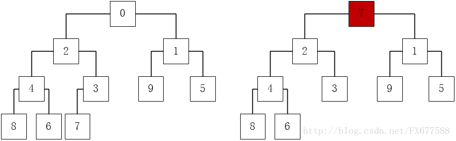
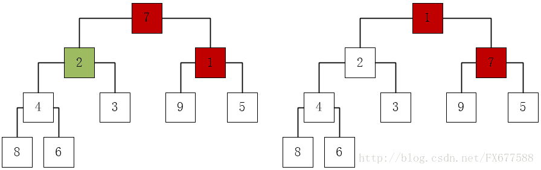
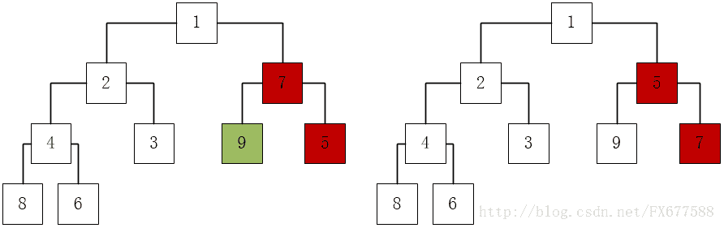
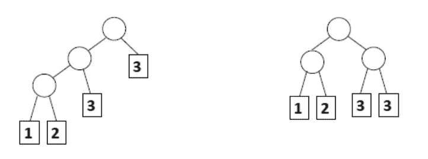
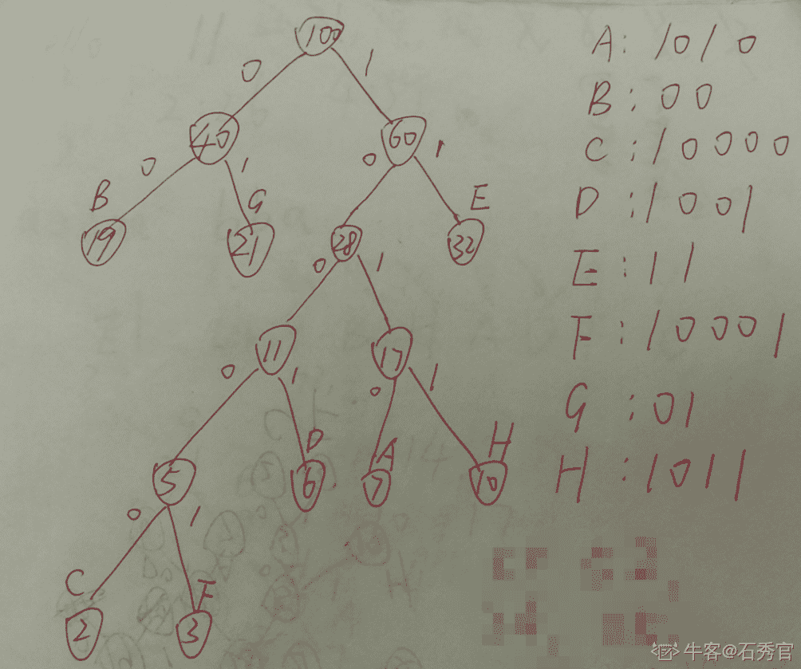

# 二千零一十九、华为网络精英挑战赛初赛模拟题 _ 基础开发 Java 方向

## 1

（判断题）小型机通常采用 RISC 和 unix 操作系统。

正确答案: A   你的答案: 空 (错误)

```cpp
T
```

```cpp
F
```

本题知识点

Java 工程师 华为 2019

讨论

[青峰啊](https://www.nowcoder.com/profile/642550043)

[小型机](https://www.baidu.com/s?wd=%E5%B0%8F%E5%9E%8B%E6%9C%BA&tn=SE_PcZhidaonwhc_ngpagmjz&rsv_dl=gh_pc_zhidao)，一般认为，传统[小型机](https://www.baidu.com/s?wd=%E5%B0%8F%E5%9E%8B%E6%9C%BA&tn=SE_PcZhidaonwhc_ngpagmjz&rsv_dl=gh_pc_zhidao)是指采用 RISC、MIPS 等专用处理器，主要支持 UNIX[操作系统](https://www.baidu.com/s?wd=%E6%93%8D%E4%BD%9C%E7%B3%BB%E7%BB%9F&tn=SE_PcZhidaonwhc_ngpagmjz&rsv_dl=gh_pc_zhidao)的封闭、专用的计算机系统，所以又称 RISC 服务器或 Unix 服务器。性能比大型机要差，比 PC 机要好。

发表于 2019-08-03 14:06:05

* * *

[南风 20191115165085](https://www.nowcoder.com/profile/844385106)

RISC 的意思就是精简指令集（Reduced Instruction Set Computing）常用于手机，PDA，导航系统，网络设备（交换机，路由器等）CISC 的意思就是复杂指令集（Complex Instruction Set Computing）都属于 CPU 范围内的知识

发表于 2019-11-15 17:49:36

* * *

[无限苦肉盖神](https://www.nowcoder.com/profile/152165957)

好多硬件题，都没听说过

发表于 2020-01-26 19:30:35

* * *

## 2

（单选题）磁盘接口的类型包括：1、SAS；2、SATA；3、NL-SAS；4、SCSI；5、IDE。请对上述五种类型的接口速率由快到慢进行排序，正确的一项是？

正确答案: B   你的答案: 空 (错误)

```cpp
12345
```

```cpp
13245
```

```cpp
31254
```

```cpp
21354
```

本题知识点

Java 工程师 华为 2019

讨论

[岚霭](https://www.nowcoder.com/profile/9457515)

BSAS 是希捷研发出来用于替代 SCSI 的接口、它的标准是 300MB/s 或者 3G/s 而 SATA 最高只能达到 150MB/s SATA-II 将传输速率提高到 300MB/s 才更接近 SAS，但 SAS 由于价格昂贵未大量发行。而 NL-SAS 是 SAS 的磁盘接口和 SATA 的盘体的综合体 IDE 的速率现在是 33.3MB/s（不过 IDE 类型的接口已经很老了 现在用的多的是 IDE 的分支 比如 ATA）SCSI 和 SATA 不太好比【我的知识水平还不能比较他们】 但是对于这题来说 SAS 最快 NL-SAS 第二 IDE 最慢 答案就出来了 选 B

发表于 2019-04-10 16:56:36

* * *

[黄尚](https://www.nowcoder.com/profile/871096168)

答案:B

1.  目前我们用的硬盘是`SATA`格式，肯定不是最慢也不是最快的，因此排除 D。
2.  `SAS` 和 `NL-SAS`，从逻辑上来看，后者之所以带前缀是为了和前者区分，因此 1 在 3 前头，所以排除 C。
3.  `SATA`和`SCSI`，从命名逻辑上看，SA 应该在 SC 前头，所以猜测`SCSI`应该比`SATA`快，又因为 A 选项直接是 12345，有点不符合答案模板，所以最终猜测结果是 B。

编辑于 2019-04-12 16:55:02

* * *

[牛客 375831651 号](https://www.nowcoder.com/profile/375831651)

我最开始确定了 IDE 是最慢的，打算在 A 和 B 中选择，但是由于 1 和 2 我以为 SATA 要比 SAS 快，导致我选择了 D

发表于 2021-07-15 10:35:28

* * *

## 3

（判断题）传统的数据中心硬件包括 X86 服务器、小型机和大型机，存储和网络设备。

正确答案: A   你的答案: 空 (错误)

```cpp
T
```

```cpp
F
```

本题知识点

Java 工程师 华为 2019

讨论

[16 级老腊肉](https://www.nowcoder.com/profile/955823416)

X86 服务器、小型机、大型机都是服务器

发表于 2019-04-13 13:34:57

* * *

[贝贝 201905012120317](https://www.nowcoder.com/profile/253317351)

A

发表于 2019-05-05 19:29:37

* * *

## 4

（单选题）以下哪项用来确定路由优先级？

正确答案: A   你的答案: 空 (错误)

```cpp
路由协议算法的优劣
```

```cpp
到目标网络的跳数
```

```cpp
发送接口的带宽
```

```cpp
物理链路的可靠性
```

本题知识点

Java 工程师 华为 2019

讨论

[刘宝宝 123](https://www.nowcoder.com/profile/82509117)

A 路由器选择路由协议的依据是路由优先级（路由优先级数量小的优先级最高）
路由优先级赋值原则：1.直连路由具有最高优先级
2.人工设置的路由条目高于动态学习到的路由条目
3.度量值算法复杂的路由协议优先级高于度量值算法简单的路由协议

发表于 2019-04-25 15:26:48

* * *

[贝贝 201905012120317](https://www.nowcoder.com/profile/253317351)

A

发表于 2019-05-05 19:30:02

* * *

[16 级老腊肉](https://www.nowcoder.com/profile/955823416)

路由器选择路由协议的依据就是路由优先级。给不同的路由协议赋予不同的路由优先级，数值小的优先级高

发表于 2019-04-13 13:36:10

* * *

## 5

（判断题）华为公司将网络和业务安全性保障的责任和公司的商业利益放在同等重要的位置。

正确答案: B   你的答案: 空 (错误)

```cpp
T
```

```cpp
F
```

本题知识点

Java 工程师 华为 2019

讨论

[牛客 3731213 号](https://www.nowcoder.com/profile/3731213)

华为同时承诺:将公司对*网络和业务安全性保障的责任*置于*公司的商业利益*之上。

发表于 2019-04-13 11:09:53

* * *

[16 级老腊肉](https://www.nowcoder.com/profile/955823416)

我以为同等地位已经很高了，没想到还有个之上

发表于 2019-04-13 13:37:12

* * *

[Mr.齐天](https://www.nowcoder.com/profile/7715301)

之上就很利害了

发表于 2019-04-17 21:12:28

* * *

## 6

（判断题）在 shell 命令行方式下，一行只能写一个指令，每次只能使用一个命令。

正确答案: B   你的答案: 空 (错误)

```cpp
T
```

```cpp
F
```

本题知识点

Java 工程师 华为 2019

讨论

[姚化吉](https://www.nowcoder.com/profile/6940209)

shell 中可以通过一行执行多个命令。有以下三种方式：1、多个命令通过分号；隔离，表示所分隔的命令会连续的执行下去，就算是错误的命令也会继续执行后面的命令 2、多个命令通过&&隔离，表示命令也会一直执行下去，但是中间有错误的命令存在就不会执行后面的命令，没错就直行至完为止。 3、多个命令通过||隔离，表示一遇到可以执行成功的命令就会停止执行后面的命令，而不管后面的命令是否正确与否。如果执行到错误的命令就是继续执行后一个命令，一直执行到遇到正确的命令为止

发表于 2019-04-10 16:58:22

* * *

[黄油素丸子](https://www.nowcoder.com/profile/290604523)

B 有分号顺序执行，|的管道等

发表于 2021-06-24 21:37:17

* * *

[牛客 779784345 号](https://www.nowcoder.com/profile/779784345)

如果 shell 环境，一行只能一个命令那么，管道有何用？

发表于 2021-09-16 18:10:09

* * *

## 7

（判断题）将编译程序分成若干个“遍”是为了使程序的结构更加清晰。

正确答案: A   你的答案: 空 (错误)

```cpp
T
```

```cpp
F
```

本题知识点

Java 工程师 华为 2019

讨论

[oblar 必胜](https://www.nowcoder.com/profile/278840621)

遍：就是对源程序或者源程序的中间结果进行从头到尾的扫描依次，并且作出相应的处理，生成新的中间结果或者目标程序。

发表于 2020-02-10 23:06:38

* * *

[shangYY](https://www.nowcoder.com/profile/641369917)

编译原理中的遍的概念

发表于 2019-09-06 15:15:23

* * *

[牛客 738524581 号](https://www.nowcoder.com/profile/738524581)

A

发表于 2021-09-06 15:14:19

* * *

## 8

（单选题）匹配"英文字母文件名:一个或者多个空格 行号"的正则表达式为：

正确答案: C   你的答案: 空 (错误)

```cpp
[a-Z]:+[ ]*[0-9]+
```

```cpp
[a-zA-Z]:+[ ]+[0-9]*
```

```cpp
[a-zA-Z]+:[ ]+[0-9]+
```

```cpp
[a-Z]+:[ ]+[0-9]*
```

本题知识点

Java 工程师 华为 2019

讨论

[AK_95](https://www.nowcoder.com/profile/5795860)

描述字符的符号: 

    [abcde] :   a/b/c/d/e 中的任意一个字符
    [^abcde]:   除了 a/b/c/d/e 之外的任意一个字符
    [a-z]   :   所有小写字母
    [A-Z]   :   所有的大写字母
    [0-9]   :   所有的数字
    [a-zA-Z0-9]:所有的大小写字母 和 数字
    [a-z&&[^abc]]   :   所有小写字母中除了 a/b/c 的字符
    [0-9&&[⁰]]    :所有数字中除了 0

快捷字符描述:
    .       :   任意一个字符
    \d      :   任意数字  ,与 [0-9]效果一致
    \D      :   任意非数字  ,与 [⁰-9]效果一致
    \s      :   所有的空白字符 \n\t\f\r\X0B 等等
    \w      :   所有的大小写字母 和 数字 与[a-zA-Z0-9]效果一致
    \W      :   相当于[^\w]
    Tips    :    以上\x 均代表一个字符！！

数量符号:
    x?      :   0 或 1 个 x
    x*      :   0 或 任意个 x
    x+      :   表示 1 个或以上个 x
    x{n}    :   n 表示数字, 描述的是 n 个 x
    x{n,}   :   至少 n 个数字
    x{n,m}  :   表示至少 n 个 x 最多 m 个 x

特殊符号:
    &&      :   与
    |       :   或
    \       :   转义符号 , 例如: .在正则表达式总具备特殊案例, 如果需要匹配.字符 ,则需要使用\.

发表于 2019-04-14 17:32:11

* * *

[16 级老腊肉](https://www.nowcoder.com/profile/955823416)

[a-zA-Z]+:至少有一个字母[ ]+:至少有一个空格[0-9]+:至少有一个数字

发表于 2019-04-13 13:51:59

* * *

[牛客 762539909 号](https://www.nowcoder.com/profile/762539909)

B

发表于 2019-12-13 07:14:52

* * *

## 9

（单选题）若要将当前目录中的 myfile.txt 文件压缩成 myfile.txt.tar.gz，命令为

正确答案: C   你的答案: 空 (错误)

```cpp
tar -cvf myfile.txt myfile.txt.tar.gz
```

```cpp
tar -zcvf myfile.txt myfile.txt.tar.gz
```

```cpp
tar -zcvf myfile.txt.tar.gz myfile.txt
```

```cpp
tar -cvf myfile.txt.tar.gz myfile.txt
```

本题知识点

Java 工程师 华为 2019

讨论

[黄尚](https://www.nowcoder.com/profile/871096168)

1.  由于文件名后缀是 tar.gz,因此命令需要带 z 才行。排除 A 和 D。
2.  压缩命令中，目标压缩文件在源文件前面。比如你想把一个 txt 文档压缩，那么命令中，你想要的压缩包名在 txt 文档名前面，即梦想走在现实的前面。B 正好相反，把现实放在梦想前面。都亵渎梦想了，你说能对吗？故选 C

编辑于 2019-04-12 17:09:16

* * *

[岚霭](https://www.nowcoder.com/profile/9457515)

Linux 下压缩命令：tar -zcvf 打包后生成的文件名全路径 要打包的目录

发表于 2019-04-10 16:58:55

* * *

[apprentice-d](https://www.nowcoder.com/profile/822383940)

梦想走在现实的前面～

发表于 2019-04-17 23:37:01

* * *

## 10

（判断题）对于整数 n，(n & (n-1) ) == 0 的含义是判断 n 是否为偶数。

正确答案: B   你的答案: 空 (错误)

```cpp
T
```

```cpp
F
```

本题知识点

Java 工程师 华为 2019

讨论

[深渊骑士](https://www.nowcoder.com/profile/319639703)

搬运来自这位大神：[borey](https://home.cnblogs.com/u/borey/)原文地址：[`www.cnblogs.com/borey/p/5626183.html`](https://www.cnblogs.com/borey/p/5626183.html)思路：初步查看很难一眼分析出表达式是什么含义，我们不妨举例分析一下，假设 n = 5，二进制表示为 101，那么 n-1 = 4，二进制表示为 100， 5 & 4 = 101 & 100 = 100 = 4 ！= 0，下面我们来看更多的例子

```cpp
5 & 4 = 101 & 100 = 4 6 & 5 = 110 & 101 = 4 7 & 6 = 111 & 110 = 6 8 & 7 = 1000 & 0111 = 0
```

我们会发现要使表达式等于 0，n-1 必须使得 n 的 n-1 都向高位进 1,也就是说满足一下条件：

```cpp
 x + 1 = n
 x & n = 0
```

我们来看看有那些数能满足要求：

```cpp
10 & 01 = 0 -------2¹ 100 & 011 = 0 -------2² 1000 & 0111 = 0 -------2³ 10000 & 01111 = 0 -------2⁴ 。。。。。。
```

所谓代码（（n & （n-1））== 0）的含义是 n 满足 2 的 n 次方

这种问题一般在于考察分析和解决问题的能力。

发表于 2020-02-18 11:30:52

* * *

[姚化吉](https://www.nowcoder.com/profile/6940209)

判断 n 是否为 2 的偶次幂或者 0

发表于 2019-04-10 16:31:29

* * *

[蓝伟鹏](https://www.nowcoder.com/profile/182952122)

n&(n-1)作用：将 n 的二进制表示中的最低位为 1 的改为 0；因此，**n >** **0** && ((n & (n - 1)) == 0 )才是判断 n 是否为偶数

发表于 2019-04-11 15:44:38

* * *

## 11

（判断题）不含回路的有向图一定存在拓扑排序。

正确答案: A   你的答案: 空 (错误)

```cpp
T
```

```cpp
F
```

本题知识点

Java 工程师 华为 2019

讨论

[青峰啊](https://www.nowcoder.com/profile/642550043)

首先，拓扑排序是指对于一个[有向无环图](https://www.baidu.com/s?wd=%E6%9C%89%E5%90%91%E6%97%A0%E7%8E%AF%E5%9B%BE&tn=SE_PcZhidaonwhc_ngpagmjz&rsv_dl=gh_pc_zhidao)G，将 G 中所有顶点排成一个线性序列，使得图中任意一对顶点 u 和 v，若<u，v> ∈E(G)，则 u 在线性序列中出现在 v 之前。那么，假设存在回路，v1,v2,v3,……,vn，v1，则边<v1,v2>∈E(G)，故 v1 在 v2 之前，类似地，v2 在 v3 之前，……，因此，得出，v1 在 vn 之前。又因为<vn,v1>∈E(G)，即 vn 在 v1 之前。相互矛盾，所以假设不成立。所以，一个图能够进行拓扑排序的一个必要条件就是图中不存在环。

发表于 2019-08-03 14:55:54

* * *

[犇流](https://www.nowcoder.com/profile/139469194)

动手画图，前提了解拓扑图，有向图。

发表于 2019-10-06 16:22:44

* * *

[pinkpink*･゜ﾟ](https://www.nowcoder.com/profile/883148695)

A

发表于 2019-09-12 00:11:45

* * *

## 12

（单选题）{0, 2, 1, 4, 3, 9, 5, 8, 6, 7} 是以数组形式存储的小顶堆，删除堆顶元素 0 后的结果是（）

正确答案: D   你的答案: 空 (错误)

```cpp
{2, 1, 4, 3, 8, 9, 5, 8, 6, 7}
```

```cpp
{1, 2, 5, 4, 3, 9, 8, 6, 7}
```

```cpp
{2, 3, 1, 4, 7, 9, 5, 8, 6}
```

```cpp
{1, 2, 5, 4, 3, 9, 7, 8, 6}
```

本题知识点

Java 工程师 华为 2019

讨论

[S.T.R](https://www.nowcoder.com/profile/864801646)

转自：[`blog.csdn.net/FX677588/article/details/77964912`](https://blog.csdn.net/FX677588/article/details/77964912)删除堆顶，然后总是从堆尾将某个数先放置到堆顶，然后依次下调到符合完全二叉树的要求，即每个子树的两个子节点都比父节点大（最小堆）。过程如下图所示：需要注意例如第三张图中，2 和 1 在与 7 比较的时候，2 和 1 先比较一次，哪个小再与 7 比较，如果比 7 小则互换，如果比 7 大则无需转换。 

发表于 2019-04-11 11:45:45

* * *

[买了否冷 20190429223028](https://www.nowcoder.com/profile/853829902)

删除堆顶，然后总是从堆尾将某个数先放置到堆顶，然后依次下调到符合完全二叉树的要求，即每个子树的两个子节点都比父节点大（最小堆）。过程如下图所示：需要注意例如第三张图中，2 和 1 在与 7 比较的时候，2 和 1 先比较一次，哪个小再与 7 比较，如果比 7 小则互换，如果比 7 大则无需转换。

发表于 2019-05-24 18:34:07

* * *

[石秀官](https://www.nowcoder.com/profile/808295082)

删除堆顶，将堆尾节点转移至堆顶，再建堆。建堆过程，左右节点先比较一次，小的再和其父节点比较。

发表于 2021-02-17 17:28:21

* * *

## 13

（单选题）20 个节点的三叉树（每个节点都有三个指向孩子节点的指针），有多少个空指针？

正确答案: C   你的答案: 空 (错误)

```cpp
40
```

```cpp
39
```

```cpp
41
```

```cpp
60
```

本题知识点

Java 工程师 华为 2019

讨论

[尚尚😝](https://www.nowcoder.com/profile/975499619)

20 个节点 三叉树  一共有 20 * 3 个节点非空指针 20 - 1 = 19 个 （根节点没有指针）剩下的的 60 - 19 = 41 个

发表于 2019-04-10 22:39:10

* * *

[Z0001199](https://www.nowcoder.com/profile/745851199)

三叉树，第 n 层有结点 3^n-1 个；3⁰+3¹+3²=13 （根结点到第 3 层总结点数），3³=27（第 3 层空指针数）；总结点 20 个，所以空指针数=第 3 层空指针数+第 4 层空指针数=（27-7）+3*（20-13）=20+3*7=20+21=41；选 C。

发表于 2019-04-10 17:47:21

* * *

[石秀官](https://www.nowcoder.com/profile/808295082)

20 个节点的三叉树（每个节点都有三个指向孩子节点的指针），则共有 20*3=60 个指针没有指针指向根节点，有 19 个指针指向除根节点外的其余节点则空指针个数 = 60 - 19 = 41

发表于 2021-02-22 15:19:57

* * *

## 14

（判断题）程序员可以根据需要控制 JVM 在特定时间进行垃圾回收。

正确答案: B   你的答案: 空 (错误)

```cpp
T
```

```cpp
F
```

本题知识点

Java 工程师 华为 2019

讨论

[闷死作大死](https://www.nowcoder.com/profile/433851177)

```cpp
System.gc();
```

 只是告诉 JVM 应该回收垃圾了, 真正什么时候回收还是 JVM 说了算

发表于 2019-04-11 18:49:15

* * *

[石秀官](https://www.nowcoder.com/profile/808295082)

System.gc()用于调用垃圾收集器，执行 System.gc()的作用只是提醒或告诉虚拟机，希望进行一次垃圾回收，至于什么时候进行回收还是取决于虚拟机，而且也不保证一定进行回收（如果-XX:+DisableExplicitGC 设置成 true，则不会进行回收）

发表于 2021-02-22 19:58:30

* * *

[打死小怪兽](https://www.nowcoder.com/profile/745097035)

B

发表于 2021-03-10 09:17:02

* * *

## 15

（单选题）下面程序运行结果是：
public class Question
{
    public static void main(String[] args)
    {
         int i = 7;
         int j = 8;
         int n = (i|j)%(i&j);
         System.out.println(n);
    }
}

正确答案: C   你的答案: 空 (错误)

```cpp
0
```

```cpp
15
```

```cpp
抛出运行时异常
```

```cpp
-15
```

本题知识点

Java 工程师 华为 2019

讨论

[一个响亮的名字娜](https://www.nowcoder.com/profile/321045153)

个人看法：|和&是按位或和与，7 是 0111,8 是 1000，按位或是 1111，按位与是 0000，但是%是求除法，分母不能为 0，所以会抛出异常。（如错误，欢迎批评指正）

发表于 2019-04-10 16:12:10

* * *

[zemo](https://www.nowcoder.com/profile/2966999)

7 是 0111,8 是 1000，按位或是 1111，按位与是 0000; n = (i|j)%(i&j) 相当于 n=15%0 运行时抛出异常

```cpp
Exception in thread "main" java.lang.ArithmeticException: / by zero
```

原因：当我们定义的被除数为整型时（short、int、long）会抛出此异常， 被除数为整型时不可为零。

发表于 2020-02-20 09:13:23

* * *

[童心未泯丶](https://www.nowcoder.com/profile/903032739)

15/0

发表于 2019-04-12 14:51:13

* * *

## 16

（单选题）下面说法错误的是：

正确答案: A   你的答案: 空 (错误)

```cpp
ArrayList 在其末尾增删元素与其他位置的增删所花费时间一样，但 Vector 末尾增删要小于其他位置增删花费的时间
```

```cpp
Vector 和 ArrayList 都实现了 List 接口
```

```cpp
对效率优先的代码，建议使用一个普通的原始的数组来代替 Vector 和 ArrayList
```

```cpp
Vector 是同步的，而 ArrayList 是非同步的
```

本题知识点

Java 工程师 华为 2019

讨论

[和影子一起双人舞、](https://www.nowcoder.com/profile/617782829)

Arraylist 在末尾进行增删的时候，内部数组下标不会发生改变，而在最前端进行删除或者增加的时候，会改变后面的下标位置（或是都向前移动，或者都向后移动），这个过程是非常耗费资源的！

发表于 2019-04-10 16:35:54

* * *

[石秀官](https://www.nowcoder.com/profile/808295082)

```cpp
ArrayList 在其末尾增删元素不需对其它位置元素进行操作（其它位置元素下标不变），
而其他位置的增删需要对其它元素进行操作（所增删元素后元素下标加一或减一）

```

发表于 2021-02-22 20:19:29

* * *

[夏小包](https://www.nowcoder.com/profile/4204018)

vector arraylist 只有在并发的时候，才会有不同的地方

发表于 2019-04-11 21:33:53

* * *

## 17

（多选题）Linux 系统的优势有：

正确答案: A B   你的答案: 空 (错误)

```cpp
多用户多任务，使用者与群组的规划
```

```cpp
稳定、高效和安全
```

```cpp
实时操作系统
```

```cpp
高游戏支持度
```

本题知识点

Java 工程师 华为 2019

讨论

[科科卡夫](https://www.nowcoder.com/profile/2970531)

实时操作系统强调一个任务从出现到执行完毕有一个可预测的时间，常用在专业领域，尤其是军事方面，比如**在制导过程中必须要在一定时间内完成决策，从而更接近目标。 咱们平常用的，像 Linux, Windows 系统，苹果，安卓强调的是吞吐量，都属于通用操作系统。

发表于 2019-04-10 23:51:03

* * *

[石秀官](https://www.nowcoder.com/profile/808295082)

Linux 是个多用户多任务的操作系统，常常会有多人同时共用一台主机。使用者的意义：只有我有权限使用我设置的文件。但其它人不行。 群组的意义：例如同一个开发团队，团员都可以使用这个组的公用文件。但其它组成员不行。 

发表于 2021-02-22 20:40:59

* * *

[zhaolei123](https://www.nowcoder.com/profile/682241479)

实时操作系统是当外界事件或数据产生时，能够接收并以足够快的速度处理，其处理的结果又能在 规定的时间内 来控制生产过程或对处理系统做出快速响应，并控制所有实时任务协调，一致运行的系统

编辑于 2019-04-14 21:51:52

* * *

## 18

（多选题）下面关于哈弗曼树的叙述中，不正确的是：

正确答案: A B D   你的答案: 空 (错误)

```cpp
哈夫曼树一定是完全二叉树
```

```cpp
哈夫曼树一定是平衡二叉树
```

```cpp
哈夫曼树中权值最小的两个节点互为兄弟节点
```

```cpp
哈夫曼树中左孩子节点小于父节点，右孩子节点大于父节点
```

本题知识点

Java 工程师 华为 2019

讨论

[......155](https://www.nowcoder.com/profile/1016809)

哈夫曼树不一定是平衡二叉树

发表于 2019-04-12 11:01:27

* * *

[AYKKK](https://www.nowcoder.com/profile/766492911)

**哈夫曼树(Huffman Tree)/最优二叉树**：给定 N 个权值作为 N 个**叶子节点**，构造一棵二叉树，该树的带权路径长度达到最小。**满二叉树**：一个二叉树，如果每一个层的结点数都达到最大值，则这个二叉树就是满二叉树。也就是说，如果一个二叉树的层数为 K，且结点总数是(2^k) -1。 **完全二叉树**：若设二叉树的深度为 h，除第 h 层外，其它各层 (1～h-1) 的结点数都达到最大个数，第 h 层所有的结点都连续集中在最左边。**平衡二叉树**：它是一棵空树或它的左右两个子树的高度差的绝对值不超过 1，并且左右两个子树都是一棵平衡二叉树。

发表于 2019-09-03 22:14:42

* * *

[石秀官](https://www.nowcoder.com/profile/808295082)



发表于 2021-02-22 21:00:01

* * *

## 19

（多选题）下面关于传值和传引用说法正确的是：

正确答案: A C D   你的答案: 空 (错误)

```cpp
call by value 不会改变实际参数的数值
```

```cpp
call by reference 能改变实际参数的参考地址
```

```cpp
call by reference 不能改变实际参数的参考地址
```

```cpp
call by reference 能改变实际参数的内容
```

本题知识点

Java 工程师 华为 2019

讨论

[Testin](https://www.nowcoder.com/profile/278298620)

传值不改变实际参数的数值，跳出代码块后，原值不改变。传引用时，代码块内的修改会直接修改对应地址处的值，因此改变实际参数的内容，不改变地址。

发表于 2019-04-14 11:01:53

* * *

[石秀官](https://www.nowcoder.com/profile/808295082)

传引用传的是地址

发表于 2021-02-22 21:05:46

* * *

[天真。。。带我回家](https://www.nowcoder.com/profile/6500524)

AC

发表于 2019-06-20 14:17:08

* * *

## 20

（多选题）Java 语言的特点，下面描述正确的是:

正确答案: A B D   你的答案: 空 (错误)

```cpp
Java 是一种面向对象的语言
```

```cpp
面向对象特征 Java 与 C++的主要不同点是：C++是多继承、而 java 是简单的接口
```

```cpp
Java 中所有的数据类型都是对象
```

```cpp
所有类都是 Object 的子类
```

本题知识点

Java 工程师 华为 2019

讨论

[(｢･ω･)｢嘿☀](https://www.nowcoder.com/profile/6503087)

答案 B 无法理解，C++是多继承、而 java 是简单的接口，Java 的接口也是多继承啊。类是单继承而已

发表于 2019-11-11 20:16:16

* * *

[e-future](https://www.nowcoder.com/profile/3938359)

1.object 是不是 object 的子类？2.Java 和 C++主要不同点真的就只是这个吗？我怎么觉得主要是运行方式不同呢

发表于 2019-04-17 13:52:04

* * *

[孙宏宇 51](https://www.nowcoder.com/profile/101548655)

**基本数据类型是在堆栈中创建的，显而易见不是对象，**也就是不能用 new 的方式获取 。java 是面向对象的编程，为了解决这个，故而每个基本数据类型都有一个对应的包装类。

发表于 2019-04-10 16:17:22

* * *