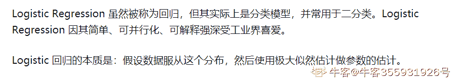

# 小鹏汽车 2019 春招 NLP 算法面试题

## 1

下面哪些算法模型可以用来完成命名实体的任务（）

正确答案: C D E F   你的答案: 空 (错误)

```cpp
GBDT
```

```cpp
LDA
```

```cpp
HMM
```

```cpp
CRF
```

```cpp
LSTM
```

```cpp
seq2seq
```

本题知识点

算法工程师 小鹏汽车 机器学习 自然语言处理 2019

讨论

[jack_kuo](https://www.nowcoder.com/profile/9590450)

包括：(1) 基于规则的方法。根据语言学上预定义的规则。但是由于语言结构本身的不确定性，规则的制定上难度较大。(2) 基于统计学的方法。利用统计学找出文本中存在的规律。        主要有隐马尔可夫(HMM)、条件随机场(CRF)模型和 Viterbi 算法、支持向量机（Support Vector Machine, SVM）。(3) 神经网络。        LSTM+CRF 模型，基于 RNN 的 seq2seq 模型

发表于 2019-04-18 12:47:04

* * *

[凌晨四点半 20190902114131](https://www.nowcoder.com/profile/721375038)

LDA 是主题模型，概括文本摘要啥的

发表于 2020-03-13 21:18:06

* * *

[牛客 54560154 号](https://www.nowcoder.com/profile/54560154)

NER 可以用分类模型，也可以用生成模型(seq2seq)

发表于 2021-03-10 19:58:48

* * *

## 2

下面哪些技术跟中文分词有关（）

正确答案: A B C   你的答案: 空 (错误)

```cpp
词语消歧
```

```cpp
未登录词识别
```

```cpp
词性标注
```

```cpp
关系识别
```

```cpp
句法分析
```

```cpp
意图识别
```

```cpp
槽位填充
```

本题知识点

算法工程师 小鹏汽车 自然语言处理 2019

讨论

[点儿点儿 7](https://www.nowcoder.com/profile/726001881)

有情出题方解释“有关”二字的意思

发表于 2020-03-19 13:10:16

* * *

[刷题上头条](https://www.nowcoder.com/profile/641551180)

不好意思我全选了

发表于 2020-06-01 04:16:38

* * *

[是啊陈呐](https://www.nowcoder.com/profile/479713267)

出题人自己也懵逼吧？？

发表于 2020-09-09 09:10:24

* * *

## 3

下面哪些方法有助于解决深度网络的梯度消失问题（）

正确答案: A C D E F G   你的答案: 空 (错误)

```cpp
控制网络深度
```

```cpp
使用 Sigmoid 激活函数
```

```cpp
预训练+微调
```

```cpp
使用 ReLU 激活函数
```

```cpp
采用 Batch Normalization
```

```cpp
使用残差结构
```

```cpp
使用 LSTM
```

本题知识点

算法工程师 小鹏汽车 自然语言处理 2019

讨论

[篱微](https://www.nowcoder.com/profile/2373841)

为什么用预训练 + 微调可以缓解？

发表于 2020-11-18 01:18:20

* * *

[DeShuiYu](https://www.nowcoder.com/profile/381741634)

为什么使用 Sigmoid 激活函数 不可以，为什么 lstm 能解决梯度消失问题

编辑于 2020-09-27 15:46:09

* * *

[牛客 686278979 号](https://www.nowcoder.com/profile/686278979)

relu 只是缓解吧，在 0-1 的范围内是没用的。

发表于 2021-09-29 16:36:08

* * *

## 4

以下几种优化算法中，哪一种最快（）

正确答案: C   你的答案: 空 (错误)

```cpp
梯度下降法
```

```cpp
牛顿法
```

```cpp
BFGS
```

```cpp
Adam
```

本题知识点

算法工程师 小鹏汽车 自然语言处理 2019

讨论

[ypadu](https://www.nowcoder.com/profile/9363014)

怀疑答案给错了。BFGS 是拟牛顿法，怎么会比牛顿法收敛快？

发表于 2019-04-16 23:24:52

* * *

## 5

以下哪些方法有助于解决模型训练过程中的过拟合问题（）

正确答案: A B C D   你的答案: 空 (错误)

```cpp
正则化
```

```cpp
Dropout
```

```cpp
Batch
Normalization
```

```cpp
提前终止训练
```

```cpp
梯度下降
```

本题知识点

算法工程师 小鹏汽车 自然语言处理 2019

讨论

[如果永不畏惧](https://www.nowcoder.com/profile/57920626)

BN 的优点： 可以将 learning rate 设置得大一点(减轻 internal covariate shift) 可以减轻梯度消失，可以保持值在梯度大的地方，尤其是 sigmoid，tanh 等 可以减小初始化参数对学习的影响 可以对抗过拟合，等同于做了 regularization 对 training 和 test 都有帮助，对 training 帮助更大李宏毅教授

发表于 2020-06-15 01:28:53

* * *

[Yenchiang](https://www.nowcoder.com/profile/570226)

Batch Normalization 有两个功能，一个是可以加快训练和收敛速度，另外一个是可以防止过拟合。

发表于 2020-07-08 00:36:03

* * *

[练习时长两年半的算法实习生](https://www.nowcoder.com/profile/676685057)

BN 不能解决过拟合啊

发表于 2019-04-16 03:50:57

* * *

## 6

下列方法中，解决欠拟合的方法有哪些（）

正确答案: B C D   你的答案: 空 (错误)

```cpp
正则化方法
```

```cpp
集成学习方法
```

```cpp
添加新特征
```

```cpp
减少正则化系数
```

本题知识点

算法工程师 小鹏汽车 自然语言处理 2019

讨论

[卷子清](https://www.nowcoder.com/profile/2031869)

emmmm xgboost 这种算法是用高偏差低方差的模型集合成的，减小了单个模型的欠拟合，请问 B 为什么不对

发表于 2019-04-16 10:00:28

* * *

[刷题上头条](https://www.nowcoder.com/profile/641551180)

欠拟合的原因：

1.模型复杂度过低。

2.特征量过少。

解决方法：增加模型复杂度，添加新特征。

那么集成方法有没有起到增加模型复杂度呢？我觉得是有的，因为它降低的模型的偏差。

发表于 2020-06-01 03:38:07

* * *

[零葬](https://www.nowcoder.com/profile/75718849)

讲道理这题把 B 归为错误就没道理

发表于 2020-11-09 12:57:49

* * *

## 7

关于 Word2vec，下列哪些说法是正确的（）

正确答案: A B C D E   你的答案: 空 (错误)

```cpp
Word2vec 是无监督学习
```

```cpp
Word2vec 利用当前特征词的上下文信息实现词向量编码，是语言模型的副产品
```

```cpp
Word2vec 能够表示词汇之间的语义相关性
```

```cpp
Word2vec 没有使用完全的深度神经网络模型
```

```cpp
Word2vec 可以采用负采样的方式来节省计算开销
```

本题知识点

算法工程师 小鹏汽车 自然语言处理 2019

讨论

[西南交一枝花](https://www.nowcoder.com/profile/368491811)

word2vec 两种类型：1、CBOW 2、Skig-gram。 每种都有两种策略（加速优化策略）：1、负采样 2、层级 softmax。 层级 softmax，使用了哈夫曼树，优化计算概率效率。负采样不使用哈夫曼树，而是利用简单的随机采样，这种用少量噪声词汇来估计的方法，类似蒙特卡洛方法。这使得不需要计算完整的概率模型，只需要训练一个二元分类模型，用来区分真实的目标词汇和采样的噪声词汇。提高训练速度，改善所得词向量的质量。

发表于 2019-04-25 15:59:18

* * *

[按太阳穴轮刮眼眶](https://www.nowcoder.com/profile/622432774)

答案有误，严格意义上来讲，Word2Vec 并不是无监督学习。应该叫半监督学习（semi-supervised），因为虽然人类不用手工标注，但是本质上模型还是有类别学习，有反向传播的过程的。参考 Quora 问答：[`www.quora.com/Is-Word2vec-a-supervised-unsupervised-learning-algorithm`](https://www.quora.com/Is-Word2vec-a-supervised-unsupervised-learning-algorithm)搜索谷歌也可以查到相关论文。（前面题目就看到有人说题目答案有误，现在信了。。）

发表于 2019-08-28 22:50:48

* * *

[Eden_Zhou](https://www.nowcoder.com/profile/703057514)

看到一个帖子，感觉挺有用的。[[NLP] 秒懂词向量 Word2vec 的本质, https://zhuanlan.zhihu.com/p/26306795](https://zhuanlan.zhihu.com/p/26306795)

发表于 2020-07-16 05:45:13

* * *

## 8

下列指标中，有哪些指标可用于模型评估（）

正确答案: A B C D   你的答案: 空 (错误)

```cpp
准确率（Accuracy）
```

```cpp
精确率（Precision）
```

```cpp
召回率（Recall）
```

```cpp
均方根误差（RMSE）
```

本题知识点

算法工程师 小鹏汽车 自然语言处理 2019

讨论

[牛客 54560154 号](https://www.nowcoder.com/profile/54560154)

对分类的评估：acc、recall、f1 对回归的评估：mse、rmse

发表于 2021-03-11 09:39:24

* * *

[食堂在逃干饭王](https://www.nowcoder.com/profile/5786634)

准确率、精确率、召回率都用于评估分类模型，此外还有 PR 曲线、F1、ROC、AUC 等指标也可用于分类模型的评估。RMSE 用于评估回归模型，此外常见的有 MSE、MAPE 等。

发表于 2020-12-28 11:13:10

* * *

[louis_ncu](https://www.nowcoder.com/profile/684852623)

参见西瓜书

发表于 2020-04-18 12:52:06

* * *

## 9

决策树有哪些常用的启发函数（）

正确答案: A B   你的答案: 空 (错误)

```cpp
最大信息增益
```

```cpp
最大信息增益率
```

```cpp
最大基尼系数
```

```cpp
最大交叉熵
```

本题知识点

算法工程师 小鹏汽车 自然语言处理 2019

讨论

[Yuerya](https://www.nowcoder.com/profile/363083827)

这道题的第三个选项 最大基尼系数  个人觉得有异议 1、首先，CART 决策树中使用的基尼指数，实际上指的是“**基尼不纯系数（Gini Impurity）**”，公式为      数值越大，不确定性越高。如果选项指的是这一个，那么**决策树选择特征的标准是，最小化基尼指数。这个选项不应该选**。2、其次，如果选项的基尼系数，指的是“**Gini coefficient**”，即在二分类问题中用作模型性能评估，表明正负两种标签的分配合理程度，      当 G=0，说明正负标签的预测概率均匀分配，模型为随机模型。也在经济学中使用，表征财富的分配是否均匀。      如果选项指的是这一个，这和决策树的启发函数有什么关系？想要评估决策树分类模型的的分类效果吗？

发表于 2021-04-10 18:01:22

* * *

[卷子清](https://www.nowcoder.com/profile/2031869)

C 选项有异议，不应该是最小 gini 指数吗

发表于 2019-04-16 09:59:12

* * *

[加油上学人](https://www.nowcoder.com/profile/900629873)

所以，最大基尼系数不该选吗？决策树不是三种？最大信息增益，最大信息增益率，最大基尼系数？

发表于 2022-02-25 22:16:42

* * *

## 10

LSTM 的遗忘门使用的是什么激活函数（）

正确答案: A   你的答案: 空 (错误)

```cpp
Sigmoid
```

```cpp
tanh
```

```cpp
ReLU
```

本题知识点

算法工程师 小鹏汽车 自然语言处理 2019

讨论

[Yenchiang](https://www.nowcoder.com/profile/570226)

LSTM 中输入门，输出门，遗忘门都是用 sigmoid 作为激活函数，生成候选记忆时使用 tanh

发表于 2020-07-08 00:29:03

* * *

[Mayday1995](https://www.nowcoder.com/profile/129911036)

选 A

gate 实际上就是一层全连接层，输入是一个向量，输出是一个 0 到 1 之间的实数向量

sigmod 函数能够将数据压缩到 0-1，符合要求

发表于 2020-03-06 09:34:31

* * *

[刷题上头条](https://www.nowcoder.com/profile/641551180)

LSTM 三个门

遗忘门：sigmoid 激活

输入门：tanh 激活

输出门：tanh 激活

发表于 2020-06-01 03:53:16

* * *

## 11

从计算角度上，Sigmoid 和 tanh 激活函数均需要计算指数，复杂度高，而 ReLU 只需要一个阈值即可得到激活值。（）

正确答案: A   你的答案: 空 (错误)

```cpp
正确
```

```cpp
错误
```

本题知识点

算法工程师 小鹏汽车 自然语言处理 2019

讨论

[社招求 offer](https://www.nowcoder.com/profile/339248261)

*   从计算的角度，Sigmoid 和 tanh 激活函数均需要计算指数，复杂度高，而 Relu 只需要一个阈值就可得到激活值。
*   Relu 的非饱和性可以有效的解决梯度消失问题，提供相对宽的激活边界
*   Relu 的单侧抑制提供了网络的稀疏表达能力

发表于 2019-07-09 15:42:33

* * *

## 12

逻辑回归是一个回归模型。（）

正确答案: B   你的答案: 空 (错误)

```cpp
正确
```

```cpp
错误
```

本题知识点

算法工程师 小鹏汽车 自然语言处理 2019

讨论

[甲壳剑齿鸟](https://www.nowcoder.com/profile/448507457)

逻辑回归是一个分类模型

发表于 2019-10-16 21:16:53

* * *

[牛客 355931926 号](https://www.nowcoder.com/profile/355931926)



发表于 2020-09-22 12:39:24

* * *

[baobaodashenxian](https://www.nowcoder.com/profile/861968701)

提问一下逻辑回归的本质不还是线性回归嘛，只是 y 的值不一样呀

发表于 2020-07-23 00:59:05

* * *

## 13

决策树通过预剪枝和后剪枝提升模型的泛化能力。（）

正确答案: A   你的答案: 空 (错误)

```cpp
正确
```

```cpp
错误
```

本题知识点

算法工程师 小鹏汽车 自然语言处理 2019

讨论

[迷茫中的星星火](https://www.nowcoder.com/profile/463869068)

预剪枝是要对划分前后泛化性能进行评估。对比决策树某节点生成前与生成后的泛化性能。 后剪枝表示先从训练集中生成一颗完整决策树。

发表于 2020-10-02 09:48:55

* * *

[UESTC_ 周乐](https://www.nowcoder.com/profile/6823159)

剪枝（pruning）是决策树学习算法对付“过拟合”的主要手段。在决策树学习中，为了尽可能正确分类训练样本，节点划分过程将不断重复，有时会造成决策树分支过多，这时就可能因为训练样本学得“太好了”，以致于把训练集自身的一些特点当做所有数据都具有的一般性质而导致过拟合。因此可通过主动去掉一些分支来降低过拟合的风险。决策树剪枝的基本策略包括预剪枝和后剪枝：（1）预剪枝（prepruning）是指在决策树生成过程中，对每个结点在划分前先进行**估计**，若当前结点的划分不能带来决策树泛化性能提升，则停止划分，并将当前结点标记为叶结点。（2）后剪枝（postpruning）是先从训练集生成一棵完整的决策树，然后自底向上地对非叶结点进行**考察**，若将该节点对应的子树替换为叶结点能带来决策树泛化性能的提升，则将该子树替换为叶结点。《机器学习》——周志华上述剪枝过程中的“评估”、“考察”在书中用性能评估方法中的留出法举了一个例子，把数据集划分为训练集和验证集，后剪枝直接用训练集训练一棵树，然后在通过剪枝判断其验证集上的性能是否有所提升，然后决定是否剪枝，预剪枝则是通过分析每个分类节点在展开成树和直接作为叶子节点时的验证集精度。

发表于 2021-08-19 11:17:14

* * *

## 14

K 均值聚类的核心目标是将给定的数据集划分为 K 个簇，并给出每个数据对应的簇中心点。（）

正确答案: A   你的答案: 空 (错误)

```cpp
正确
```

```cpp
错误
```

本题知识点

算法工程师 小鹏汽车 自然语言处理 2019

讨论

[lyruns](https://www.nowcoder.com/profile/121014811)

要是面试都是这种题多好🙄

发表于 2021-03-10 20:58:26

* * *

[牛客 54560154 号](https://www.nowcoder.com/profile/54560154)

聚类是分成若干个族，并给出每个数据对应的族中心点。

发表于 2021-03-10 19:33:52

* * *

## 15

知识图谱中的三元组遵从一种三阶谓词逻辑的表达形式。（）

正确答案: B   你的答案: 空 (错误)

```cpp
正确
```

```cpp
错误
```

本题知识点

算法工程师 小鹏汽车 自然语言处理 2019

讨论

[甲壳剑齿鸟](https://www.nowcoder.com/profile/448507457)

**一二三阶谓词**命题逻辑和谓词逻辑是人工智能领域使用最早的知识表示方法，命题逻辑定义了具有真假值的原子命题，并通过  或 且 非 蕴含 当且仅当 等逻辑连接符将多个原子命题组合成复合命题；一阶谓词逻辑在命题逻辑的基础上引入了 全称量词 ：任何 ，和存在量词 ，使得一阶谓词逻辑可以量化实体概念，比如 对于所有的海豚 都有背鳍 ，这个 所有的 就是全称量词；二阶谓词逻辑可以量化集合，三阶谓词逻辑可以量化集合的集合，高阶谓词逻辑 依此类推 。 ---参考 赵军《知识图谱》高等教育出版社**一阶谓词逻辑优点：**
结构性，能把事物的属性以及事物的各种语义联想显式的表达出来。严密性，有形式化的语法和语义，以及相关的逻辑推理。可实现性，可以转化为计算机内部形式，以便使用算法实现。**一阶谓词缺点：**
有限的可用性，一阶逻辑的逻辑归结只是半可判定性的。无法表示不确定性知识。

发表于 2019-10-16 23:22:30

* * *

[牛客 686278979 号](https://www.nowcoder.com/profile/686278979)

细节上来说，知识表示主要经历了从一阶谓词逻辑表示、产生式规则、框架表示法、脚本表示法、语义网表示法、知识图谱表示法等几种表示，各种表示方式都有其优缺点。

编辑于 2021-09-07 10:38:18

* * *

[王斌强](https://www.nowcoder.com/profile/964926235)

所以应该是二阶？

发表于 2020-08-12 14:55:00

* * *

## 16

平方损失函数适合二分类或多分类的场景，而交叉熵损失则更适合输出为连续的场景。（）

正确答案: B   你的答案: 空 (错误)

```cpp
正确
```

```cpp
错误
```

本题知识点

算法工程师 小鹏汽车 自然语言处理 2019

讨论

[每天都开心](https://www.nowcoder.com/profile/580419963)

 平方损失函数适合输出为连续的场景，而交叉熵损失则更适合二分类或多分类的场景

发表于 2019-06-25 13:21:10

* * *

[gulugulu~](https://www.nowcoder.com/profile/340275330)

最小化平方损失函数适用于误差符合高斯分布时，适用于回归任务，但分类问题中真实值与预测值之间的误差并不连续，误差也并不符合高斯分布。

发表于 2020-10-23 01:06:35

* * *

[牛客 937896863 号](https://www.nowcoder.com/profile/937896863)

平方损失函数多用于回归任务中

发表于 2020-08-11 15:07:22

* * *

## 17

神经网络训练时可以将全部参数初始化为 0。（）

正确答案: B   你的答案: 空 (错误)

```cpp
正确
```

```cpp
错误
```

本题知识点

算法工程师 小鹏汽车 自然语言处理 2019

讨论

[头发还是这么短](https://www.nowcoder.com/profile/120902802)

错误的，一般 b 会初始化为 0，但 w 一般服从高斯分布

发表于 2019-08-04 22:30:51

* * *

[牛客 668586075 号](https://www.nowcoder.com/profile/668586075)

这道题有点坑啊，你当然可以初始化为 0，只是效果不理想，做多了工作而已

发表于 2020-05-30 19:53:27

* * *

[Yenchiang](https://www.nowcoder.com/profile/570226)

没有隐层时, 可以将所有的参数初始化为 0。如果有隐层，对于隐层使用了 ReLU: 本身, 不为 0, 其余的所有层的输出都为 0\. BP 时所有梯度也都为 0, 包括输出层. 这意味着所有的非输入神经元都是 dead neurons. 学习失败，所以，最后的结论是, 一般只在训练 SLP/逻辑回归模型时才使用 0 初始化所有参数., 更实用的结论是, 深度模型都不会使用 0 初始化所有参数.

发表于 2020-07-08 00:21:10

* * *

## 18

Dropout 作用于每份小批量训练数据，由于其随机丢弃部分神经元的机制，相当于每次迭代都在训练不同结构的神经网络。（）

正确答案: A   你的答案: 空 (错误)

```cpp
正确
```

```cpp
错误
```

本题知识点

算法工程师 小鹏汽车 自然语言处理 2019

讨论

[绝世](https://www.nowcoder.com/profile/7883061)

结构还是一样的吧，只是训练改善的参数不同

发表于 2021-09-11 14:45:28

* * *

[牛客 64150481 号](https://www.nowcoder.com/profile/64150481)

A

发表于 2020-05-12 15:41:54

* * *

[louis_ncu](https://www.nowcoder.com/profile/684852623)

这种说法不严谨

发表于 2020-04-18 13:03:49

* * *

## 19

卷积操作的本质特性包括稀疏交互和参数共享。（）

正确答案: A   你的答案: 空 (错误)

```cpp
正确
```

```cpp
错误
```

本题知识点

算法工程师 小鹏汽车 自然语言处理 2019

讨论

[Yenchiang](https://www.nowcoder.com/profile/570226)

稀疏交互：使卷积核的大小远小于输入的大小； 参数共享：同一个卷积核作用在输入的每一个位置上。

发表于 2020-07-08 00:15:15

* * *

[牛客 54560154 号](https://www.nowcoder.com/profile/54560154)

系数交互：卷积核每次只和部分数据交互。

发表于 2021-03-10 19:34:49

* * *

[qnstar](https://www.nowcoder.com/profile/506039296)

通过三个重要的思想来改进机器学习系统：稀疏交互、参数共享、等变表示（平移不变性）参考 [`zhuanlan.zhihu.com/p/72359596`](https://zhuanlan.zhihu.com/p/72359596)

发表于 2020-11-22 08:37:41

* * *

## 20

Seq2Seq 模型在解码时可以使用贪心法或 Beam Search 方法。（）

正确答案: A   你的答案: 空 (错误)

```cpp
正确
```

```cpp
错误
```

本题知识点

算法工程师 小鹏汽车 自然语言处理 2019

讨论

[不要摇我可乐](https://www.nowcoder.com/profile/798421211)

seq2seq 的语言模型在解码时，每次选择出现概率最大的词作为预测值，所以属于贪心

发表于 2020-07-19 11:42:44

* * *

[yssnn](https://www.nowcoder.com/profile/98695026)

beam search 有一个超参数 beam size（束宽）记为 k。第一个时间步长，选取当前条件概率最大的 k 个词，当做候选输出序列的第一个词。之后的每个时间步长，基于上个步长的输出序列，挑选出所有组合中条件概率最大的 k 个，作为该时间步长下的候选输出序列。始终保持 [公式] 个候选。最后从 k 个候选中挑出最优的。

发表于 2021-04-07 17:05:04

* * *