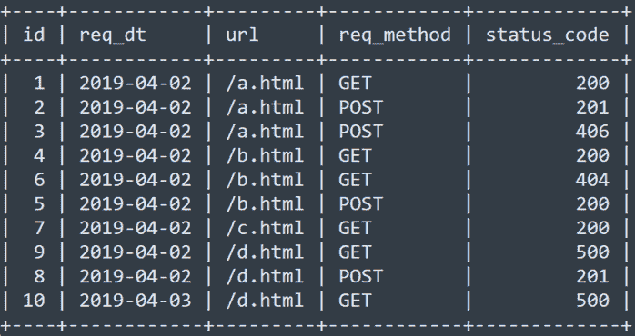
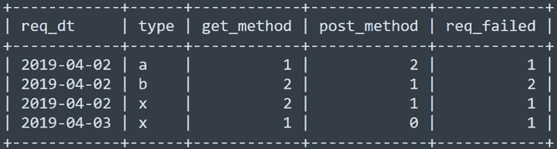

# 小鹏汽车 2019 春招互联网中心 DevOps 运维开发工程师笔试题

## 1

使用任意您熟悉的语言（C/C++、Java、Python 或者其他），实现以下功能：

在字符串中找出连续最长的递增英文字母串（26 个英文字母，不区分大小写），把这个字母串的长度作为函数值返回。

如字符串“dgefgfg455cd556bcd45”，可以得出最长的连续递增字母是 efg、bcd，所以返回 3。

你的答案

本题知识点

运维工程师 小鹏汽车 2019

讨论

[牛客 647529522 号](https://www.nowcoder.com/profile/647529522)

```cpp
def test_func(s):
    s = s.lower()
    ans = 0
    word = ''
    for char in s[1:]:
        if not char.isalpha():
            word = ''
            continue
        if word and word[-1] < char:
            word += char
        else:
            word = char
        ans = max(ans, len(word))
    return ans
```

 发表于 2020-10-17 23:32:11

* * *

[MonthYears](https://www.nowcoder.com/profile/5259604)

1.  testStr=input() ##输入一个字符串
2.  ls=[] ##定义一个空列表用于将非字母的部分转换为'.'，然后存到这个列表中
3.  numLs=[] ##用于存放连续字母的长度的空列表
4.  for i in range(len(testStr)): ## 遍历输入字符串的索引
5.  if testStr[i].isalpha(): ## 如果字符是字母
6.  ls.append(testStr[i]) ## 将其添加到列表 ls 中
7.  else: ## 否则
8.  ls.append('.') ## 添加一个'.'到列表中
9.  tempStr = ''.join(ls).lower() ## 将列表 ls 的值聚合成一个字符串
10.  tempLs = tempStr.split('.') ## 将此字符串以'.'进行分割并添加到列表 tempLs 中
11.  tempLs = [i for i in tempLs if i != ''] ## 过滤出不为空的值到列表 tempLs 中
12.  for i in tempLs: ## 遍历列表 tempLs
13.  count = 1 ## 定义一个计数器
14.  for j in range(len(i)-1): ## 遍历列表中的字符串的索引值减 1
15.  if ord(i[j])+1 == ord(i[j+1]): ## 如果该字母的 ASCII 码等于后一个字母的 ASCII 码加 1,也就是前一个字母跟后一个字母是否连续
16.  count += 1 ## 计数器加 1
17.  numLs.append(count) ## 将计数器的值添加的列表 numLs 中
18.  else: ## 否则
19.  count = 1 ## 计数器恢复为 1
20.  print(max(numLs)) ## 输出最终结果

发表于 2021-01-21 19:41:27

* * *

[mushroom 哇](https://www.nowcoder.com/profile/207222977)

test_str="dgefgfg455cd556bcd45"
list_str=[]
curr=[]
for i in range(len(test_str)):
    if test_str[i].isalpha():
         if ord(test_str[i])+1==ord(test_str[i+1]):
             if i<len(test_str)-1:
                 curr.append(test_str[i])
             else:
                 curr.append(test_str[i]+test_str[i+1])
         else:
             curr.append(test_str[i])
             list_str.append(curr)
             curr=[]
print(list_str)
print(max(len(n) for n in list_str))

发表于 2019-08-05 21:45:54

* * *

## 2

运维工程师在工作中经常需要对数量众多的服务器进行批量管控操作，例如使用 puppet、ansible 等工具能达到对应目的。然而，如果不利用相关开源工具，请您使用 shell 或者 python 等编程语言，设计一个简单的批量管控工具。

已知条件：已经拥有一台管理机，通过它能免 key SSH 到各台工作机器。以及管理机 IP 为 A，其他工作机器 IP 为 B、C、D、E 等等

工具达到以下目的：

1、 利用一台管理机器，可以批量控制其他工作机器；

2、 在管理机器输入指定命令，在其他工作机器执行并返回结果；

你的答案

本题知识点

运维工程师 小鹏汽车 2019

## 3

以下是一个日志文件，其文件名为 log.txt, 其中可能包含 N 台服务器的(例子中只写了 2 台)服务器监控数据

监控指标包括 CPU、内存、磁盘、网络流量使用率等，使用率取值范围用 0~1 之间的小数表示

数据每分钟采集一次, 每行日志的开头都是当前时间

具体格式如下: 时间 指标名 hostname=主机名 value=当前值

```cpp
2019-04-04_00:00:01 cpu.used hostname=server-01
value=0.21
2019-04-04_00:00:01 mem.used hostname=server-02
value=0.3
2019-04-04_00:01:01 disk.used hostname=server-02
value=0.32
2019-04-04_00:01:01 net.used hostname=server-01
value=0.36
2019-04-04_00:02:01 mem.used hostname=server-01
value=0.56
2019-04-04_00:02:01 net.used hostname=server-02
value=0.2
```

机器空闲率的计算方法:

当机器同时满足（CPU <30%） and （内存<40%） and （磁盘<40%） and （网络流量<30%）这几个条件的时间，占总时间的比例

请用任意您熟悉的编程语言，完成一个函数可通过给定日期,主机名获取主机当天的空闲率

例如: get_idle_ratio('server-02', '2019-04-04') 返回 0.21

你的答案

本题知识点

运维工程师 小鹏汽车 2019

## 4

SQL 编写优化

某网站访问日志已入库，日志表部分字段数据如下：

产品经理希望按天统计三类 url(将/a.html 作为 a 类，/b.html 作为 b 类，其它都算到 x 类)

-- 的请求失败次数(status_code>=400), get 和 post 方法请求次数，希望得到如下结果：



-- 建表语句

```cpp
drop table access_log;
CREATE TABLE `access_log` (

`id` bigint(20) unsigned NOT NULL AUTO_INCREMENT COMMENT '主键 id',

`req_dt` date not null comment '请求日期',

`url` varchar(50) NOT NULL COMMENT 'URL',

`req_method` varchar(16) not null default '' comment '请求方法',

`status_code` int not null default 0 comment '状态码',
  ...
(省略 20 个字段)

PRIMARY KEY (`id`)
) ENGINE=InnoDB;
```

请写出满足需求的 SQL 语句，如果你认为写出来的 SQL 有性能问题，如何优化？

你的答案

本题知识点

运维工程师 小鹏汽车 2019

## 5

运维工程师对生产环境有极高的稳定性追求，为了避免单点机房故障，他们往往会建设异地多中心的架构，为了应对故障随时在多城市、多数据中心调配流量。那么，您认为在实现异地多中心架构的过程中，运维工程师们会遇到怎样的技术难题以及其解决思路。

你的答案

本题知识点

运维工程师 小鹏汽车 2019