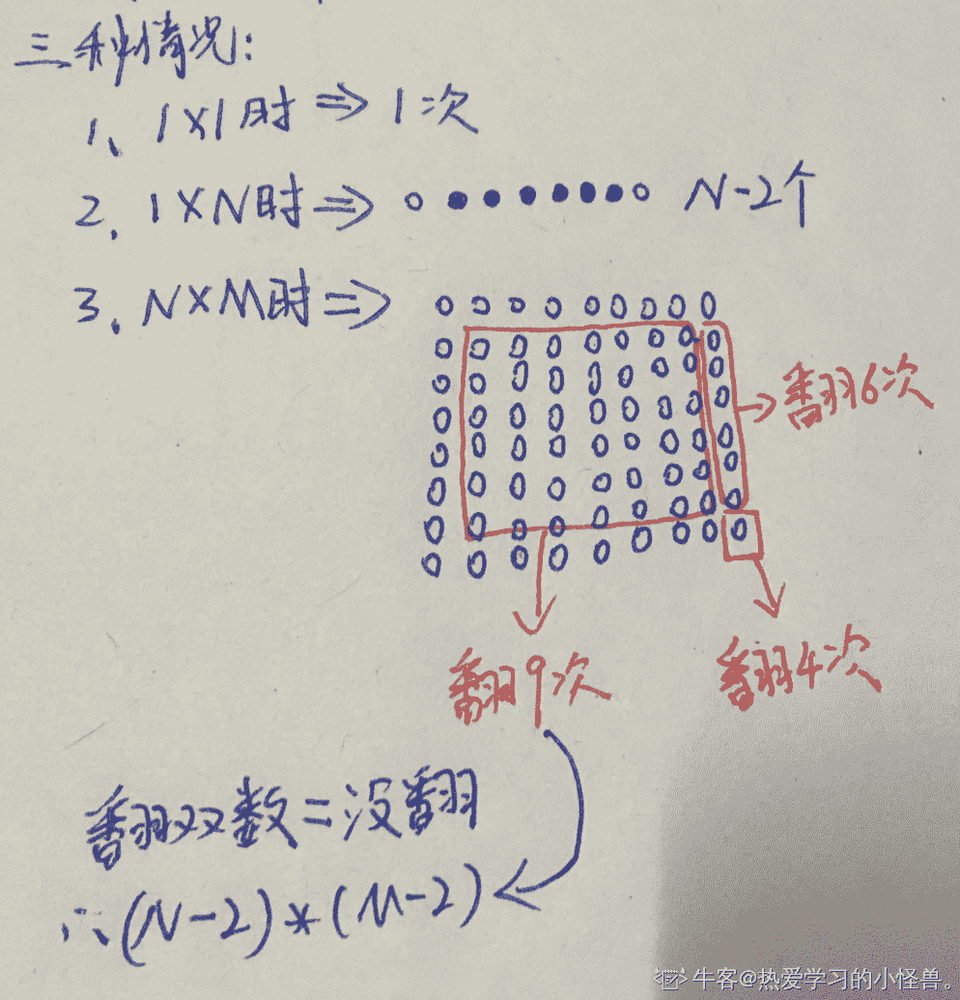

# 网易 2019 秋招笔试编程题合集（一）

## 1

你有 3 个需要完成的任务，完成这 3 个任务是需要付出代价的。
首先，你可以不花任何代价的完成一个任务；然后，在完成了第 i 个任务之后，你可以花费|A[i] - A[j]|的代价完成第 j 个任务。|x|代表 x 的绝对值。
计算出完成所有任务的最小代价。

本题知识点

Java 工程师 C++工程师 拼多多 排序 *穷举 golang 工程师 iOS 工程师 安卓工程师 运维工程师 前端工程师 算法工程师 测试工程师 PHP 工程师 网易 2019* *讨论

[无心 2019](https://www.nowcoder.com/profile/991674511)

```cpp
#include <bits/stdc++.h>
using namespace std;
int main()
{
    int a[3];
    cin>>a[0]>>a[1]>>a[2];
    sort(a,a+3);
    cout<<a[2]-a[0]<<endl;
    return 0;
}

```

编辑于 2019-07-11 20:15:19

* * *

[0b100001101000](https://www.nowcoder.com/profile/568883663)

最小代价即为三个数之间的最小差即最大减最小

```cpp
s = list(map(int, input().split()))
print(max(s)-min(s))
```

运行时间：27ms
占用内存：3440k

发表于 2019-09-02 14:38:45

* * *

[ElonB](https://www.nowcoder.com/profile/623894)

```cpp
# 最大值减最小值，多个整数也一样
a = list(map(int, input().strip().split()))
print(max(a) - min(a))

```

编辑于 2019-07-18 19:08:23

* * *

## 2

小易准备去拜访他的朋友，他的家在 0 点，但是他的朋友的家在 x 点(x > 0)，均在一条坐标轴上。小易每一次可以向前走 1，2，3，4 或者 5 步。问小易最少走多少次可以到达他的朋友的家。

本题知识点

Java 工程师 C++工程师 拼多多 数学 贪心 golang 工程师 iOS 工程师 安卓工程师 运维工程师 前端工程师 算法工程师 测试工程师 PHP 工程师 网易 2019

讨论

[咽喉上的刀](https://www.nowcoder.com/profile/5781277)

Java 解答：若 x 除 5 后有余数则+1\.

```cpp
import java.util.Scanner;

public class Main {
    public static void main(String[] args){
        Scanner input = new Scanner(System.in);
        int x = input.nextInt();
        int m = x/5;
        if (x%5 != 0)
            m++;
        System.out.println(m);
    }
}

```

发表于 2019-08-02 20:11:25

* * *

[0b100001101000](https://www.nowcoder.com/profile/568883663)

1\. 少于 5，输出 12\. 等于 5 或 5 的倍数，输出 n/53\. 大于五，输出 n/5 的向上取整综上，直接向上取整可满足全部情况：

```cpp
import math
print(math.ceil(int(input())/5))
```

运行时间：25ms
占用内存：3556k

编辑于 2019-09-02 14:49:16

* * *

[零葬](https://www.nowcoder.com/profile/75718849)

采用模拟的方式进行倒推

```cpp
import java.io.BufferedReader;
import java.io.InputStreamReader;
import java.io.IOException;

public class Main {
    public static void main(String[] args) throws IOException {
        BufferedReader br = new BufferedReader(new InputStreamReader(System.in));
        String strX;
        while((strX = br.readLine()) != null) {
            int x = Integer.parseInt(strX);
            int step = 0;
            while(true){
                // 从最大的步长 5 开始倒推
                int start = 5;
                // 如果走出这一步没有到 0 的左边，则可以跨出这一步，否则减小步长
                while(x - start < 0 && start > 0) start --;
                // 跨出这一步，步数增加
                x -= start;
                step ++;
                // 到达原点，返回总步数
                if(x == 0) break;
            }
            System.out.println(step);
        }
    }
}
```

发表于 2020-11-25 12:10:38

* * *

## 3

给定一个 N*M 的矩阵，在矩阵中每一块有一张牌，我们假定刚开始的时候所有牌的牌面向上。
现在对于每个块进行如下操作：
> 翻转某个块中的牌，并且与之相邻的其余八张牌也会被翻转。
XXX
XXX
XXX 如上矩阵所示，翻转中间那块时，这九块中的牌都会被翻转一次。
请输出在对矩阵中每一块进行如上操作以后，牌面向下的块的个数。
数据范围： 

本题知识点

C++工程师 golang 工程师 iOS 工程师 安卓工程师 运维工程师 前端工程师 算法工程师 测试工程师 PHP 工程师 Java 工程师 网易 2019

讨论

[热爱学习的小怪兽。](https://www.nowcoder.com/profile/769640169)


又因为他说 N,M(1 <= N, M <= 1,000,000,000)
所有要用 long 类型

```cpp
import java.util.*;
public class Main{
    public static void main(String args[]){
        Scanner sc=new Scanner(System.in);
        int a=sc.nextInt();
        for(int i=1;i<=a;i++){
            long A1=sc.nextLong();
            long A2=sc.nextLong();
            long s;
            if(A1==1&&A2==1){
                s=1;
            }else if(A1==1){
                s=A2-2;
            }else if(A2==1){
                s=A1-2;
            }else{
                s=(A1-2)*(A2-2);
            }
            System.out.println(s);
        }

    }
}
```

发表于 2019-09-19 23:39:56

* * *

[nbgao](https://www.nowcoder.com/profile/211289)

```cpp
#include <bits/stdc++.h>
using namespace std;

int main(){
    long long t,n,m;
    cin>>t;
    while(t--){
        cin>>n>>m;
        if(n==1 && m==1)
            cout<<1<<endl;
        else if(n==1 && m>1)
            cout<<m-2<<endl;
        else if(m==1 && n>2)   
            cout<<n-2<<endl;
        else
            cout<<(n-2)*(m-2)<<endl;
    }
    return 0;
}
```

发表于 2019-08-25 01:16:57

* * *

[无心 2019](https://www.nowcoder.com/profile/991674511)

```cpp
#include <bits/stdc++.h>
using namespace std;
int main()
{
    long long t,n,m;
    cin>>t;
    while(t--)
    {
        cin>>n>>m;
        n-=2;
        m-=2;
        if(n<m)
            swap(n,m);
        if(n<0)
        {
            cout<<1<<endl;
            continue;
        }
        if(m==-1)
            cout<<n<<endl;
        else 
            cout<<n*m<<endl;
    }
    return 0;
}

```

发表于 2019-07-11 20:39:36

* * *

## 4

在一条街上有 n 幢房子，标号从 1 到 n，两个在标号上相差为 1 的房子视为相邻，这些房子中有 k 幢房子已有住户。
现你准备搬入这条街，你能搬入一幢房子的条件是这幢房子没有人住在里面，与此同时由于你非常热爱与邻居进行交流，故而你需要你所入住的房子两边上都有住户。
现要你求最小的可能符合要求的房子数，以及最大的可能符合要求的房子数。Note: 就样例来说，#代表已有住户，-代表空位，这种情况（###---)，没有满足条件的房子，为最小，故输出 0
最大的情况为(#-#-#-)，此种情况有二个位置满足条件，为最大，故输出 2

本题知识点

Java 工程师 C++工程师 拼多多 数学 贪心 golang 工程师 iOS 工程师 安卓工程师 运维工程师 前端工程师 算法工程师 测试工程师 PHP 工程师 网易 2019

讨论

[ElonB](https://www.nowcoder.com/profile/623894)

```cpp
"""
规律题，最小值都为 0，最大值为 min(n - k, k - 1)
"""

if __name__ == "__main__":
    t = int(input().strip())
    for _ in range(t):
        n, k = map(int, input().strip().split())
        if n < 3 or k >= n or k < 2:
            ans = 0
        else:
            ans = min(n - k, k - 1)
        print(0, ans)

```

发表于 2019-07-18 19:38:34

* * *

[nbgao](https://www.nowcoder.com/profile/211289)

```cpp
#include <bits/stdc++.h>
using namespace std;

int main(){
    int t,n,k;
    cin>>t;
    while(t--){
        cin>>n>>k;
        int s = n-k;
        cout<<0<<" ";
        if(n<3 || k<=1)
            cout<<0<<endl;
        else
            cout<<min(k-1, s)<<endl;
    }
    return 0;
}
```

发表于 2019-08-26 01:25:48

* * *

[无心 2019](https://www.nowcoder.com/profile/991674511)

```cpp
#include <bits/stdc++.h>
using namespace std;
int main()
{
    int t;
    cin>>t;
    while(t--)
    {
        long long n,k;
        cin>>n>>k;
        if(k>n-k)
        {
            if(n-k>=0)
                cout<<0<<" "<<n-k<<endl;
            else
                cout<<0<<" "<<0<<endl;
        }
        else 
        {
            if(k-1>=0)
                cout<<0<<" "<<k-1<<endl;
            else
                cout<<0<<" "<<0<<endl;
        }
    }
    return 0;
}

```

编辑于 2019-07-11 20:52:58

* * *

## 5

节日到啦，牛牛和妞妞邀请了好多客人来家里做客。
他们摆出了一座高高的香槟塔，牛牛负责听妞妞指挥，往香槟塔里倒香槟。
香槟塔有个很优雅的视觉效果就是如果这一层的香槟满了，就会从边缘处往下一层流去。
妞妞会发出两种指令，指令一是往第 x 层塔内倒体积为 v 的香槟，指令二是询问第 k 层塔香槟的体积为多少。
告诉你香槟塔每层香槟塔的初始容量，你能帮牛牛快速回答妞妞的询问吗？

本题知识点

Java 工程师 C++工程师 拼多多 数组 高级结构 golang 工程师 iOS 工程师 安卓工程师 运维工程师 前端工程师 算法工程师 测试工程师 PHP 工程师 网易 2019

讨论

[Dave_lzw](https://www.nowcoder.com/profile/5261736)

```cpp
/*思路：线段树维护区间剩余容量和，查询操作直接输出，
从 x 层倒入操作则二分查找倒入的液体能到达的层数 r，此时 x 到 r-1 层剩余容量为 0，故区间更新为 0，
单点更新 r 层剩余容量 = x 到 r 层总容量 tmp - 导入液体总体积 val
（时间长没写线段树，忘了懒惰标记怎么用了，参考下楼里某位 dalao 的标记。很好用哈哈
*/
#include <bits/stdc++.h>
#define lc rt << 1 
#define rc rt << 1 | 1  
#define LL long long 
using namespace std;
const int AX = 2e5 + 666 ; 
LL s[AX<<2] ; // 维护各层剩余容量和 
int lazy[AX<<2];
LL v[AX] ; 
int n , m ; 
LL left_v , tmp ;

void pushUp( int rt ){
    s[rt] = s[lc] + s[rc];
    return ;
}

void pushDown( int rt ){
	if( lazy[rt] != -1 ){
		s[lc] = s[rc] = 0 ; 
		lazy[lc] = lazy[rc] = 1 ;
		lazy[rt] = -1 ;
	}
	return ; 
}

void build( int rt , int l , int r ){
	if( l == r ){
		scanf("%lld",&s[rt]);
		v[l] = s[rt] ;
		return ;
	}
	int mid = ( l + r ) >> 1 ; 
	build( lc , l , mid );
	build( rc , mid + 1 , r );
	pushUp(rt);
}

void update( int rt , int l , int r , int L , int R , int op ){
	if( L > r || R < l ) return ; 
	if( L <= l && R >= r ){
		if( op ){
			s[rt] = 0 ; 
			lazy[rt] = 1 ;
		}else s[rt] = left_v ;
		return ; 
	}
	int mid = ( l + r ) >> 1 ; 
	pushDown( rt ) ; 
	if( l <= mid ) update( lc , l , mid , L , R , op );
	if( R > mid ) update( rc , mid + 1 , r , L , R , op );
	pushUp(rt) ; 
}

LL query( int rt , int l , int r , int L , int R ){
	if( L <= l && R >= r ) return s[rt] ; 
	int mid = ( l + r ) >> 1 ;
	LL ans = 0 ;
	pushDown( rt );
	if( L <= mid ) ans += query( lc , l , mid , L , R ) ;
	if( R > mid ) ans += query( rc , mid + 1 , r , L , R );
	return ans ; 
}

int getR( int l , int r , int x , int val ){ // 查找从 x 层倒，能满（四声）到哪一层为止
	while( l <= r ){
		int mid = ( l + r ) >> 1 ; 
		if( query( 1 , 1 , n , x , mid ) >= val ) r = mid - 1; 
		else l = mid + 1 ; 
	}
	tmp = query( 1 , 1 , n , x , l );  //查询被倒入液体触及的所有层总容量
	return l ; 
}

int main(){
    memset( lazy , -1 , sizeof(lazy) );
    cin >> n >> m ; 
    build( 1 , 1 , n ) ; 
	int op , x ; 
	LL val ; 
	while( m-- ){
		scanf("%d",&op);
		if( op == 1 ){
			scanf("%d",&x);
			printf("%lld\n",v[x] - query( 1 , 1 , n , x , x ) );
		}else{
			scanf("%d%lld",&x,&val);
			int r = getR( x , n , x , val ) ;
			left_v = tmp - val ; 
			if( left_v <= 0 ){ //正好倒满或倒满地上了
				update( 1 , 1 , n , x , r , 1 );
			}else{
				if( r == 1 ) update( 1 , 1 , n , 1 , 1 , 0 ); //第一层都倒不满
				else{  //x 到 r-1 层被倒满，剩余体积设为 0，r 层剩余 left_v 体积 = tmp(x 到 r 层总容量)-val(总共倒入体积)
					update( 1 , 1 , n , x , r - 1 , 1 ) ;
					update( 1 , 1 , n , r , r , 0 );
				}
			}
		}
	}
    return 0 ; 
}

```

编辑于 2020-02-10 11:44:57

* * *

[热爱学习的小怪兽。](https://www.nowcoder.com/profile/769640169)

注意：不能用 for 循环，for 循环的时间复杂度太大，要用 while

```cpp
import java.util.*;
public class Main{
   public static void main(String args[]){
        Scanner sc=new Scanner(System.in);
        int ceng=sc.nextInt();
        int zhiling=sc.nextInt();
        int[] churong=new int[ceng];
        int[] xiangrong=new int[ceng];
        int j=0;

        while(j<ceng){
            int A1=sc.nextInt();
            churong[j]=A1;
            xiangrong[j]=0;
            j++;

        }
        int z=0;
        while(z<zhiling){
            int gu=sc.nextInt();
            if(gu==1){
                int k=sc.nextInt();
                int l=xiangrong[k-1];
                System.out.println(l);
            }else{
                int b=sc.nextInt();
                int x=b-1;
                int v=sc.nextInt();
                while(v>0&&x<ceng){
                    //如果 杯子已有的水<杯子 并且 v<杯子-水
                    if(xiangrong[x]<churong[x]&&v<churong[x]-xiangrong[x]){
                        xiangrong[x]=xiangrong[x]+v;
                        v=0;
                    }
                    else {
                        //v=v-（杯子-水）
                        v=v-(churong[x]-xiangrong[x]);
                        xiangrong[x]=churong[x];
                        x++;
                    }
                }
            }
            z++;

        }
   }
}
```

发表于 2019-09-20 16:59:22

* * *

[意识流选手](https://www.nowcoder.com/profile/97302105)

**Python Solution**
假设第  层初始状态值为  ，则装满的情况为该层状态值达到 。

> 假如第 1 层容积为 2，则初始状态值为-2，倒入体积 3 的酒，则状态值归 0，剩余体积 1 的酒向下流动。

```cpp
n, m = [int(i) for i in  input().split()]
a = [int(i) for i in input().split()]
st = [-i for i in a]
all_ml = [[int(i) for i in input().split()] for i in range(m)]

def pour(st, ml):
    '''香槟塔的第 x 层到体积 v 的酒'''
    x = ml[1]-1
    v = ml[2]
    while True:
        v = v + st[x]
        if v < 0:
            st[x] = v
            break
        else:
            st[x] = 0
            x += 1
            if x == len(st):
                break
    return st

def ask(a, st, ml):
    '''k 层装酒量=k 层容积+k 层状态值'''
    k = ml[1]
    print(a[k-1]+st[k-1])

for ml in all_ml:
    if ml[0] == 2:
        st = pour(st, ml)
    else:
        ask(a, st, ml)
```

编辑于 2019-08-28 15:53:44

* * *

## 6

随着又一届学生的毕业，社团主席换届选举即将进行。

一共有 n 个投票者和 m 个候选人，小易知道每一个投票者的投票对象。但是，如果小易给某个投票者一些糖果，那么这个投票者就会改变他的意向，小易让他投给谁，他就会投给谁。

由于小易特别看好这些候选人中的某一个大神，这个人的编号是 1，所以小易希望能尽自己的微薄之力让他当选主席，但是小易的糖果数量有限，所以请你帮他计算，最少需要花多少糖果让 1 号候选人当选。某个候选人可以当选的条件是他获得的票数比其他任何候选者都多。

本题知识点

Java 工程师 C++工程师 拼多多 穷举 模拟 排序 *贪心 golang 工程师 iOS 工程师 安卓工程师 运维工程师 前端工程师 算法工程师 测试工程师 PHP 工程师 网易 2019* *讨论

[XiaKIsGod](https://www.nowcoder.com/profile/7446963)

从大到小枚举 1 号的票数 比如假设 1 要 n 票当选 那么其他人多余 n-1 票的就都要收买 如果把所有超过 n-1 票的都收买了 如果这时 1 号还没有 n 票 那就从不是投 1 号和刚刚没有收买的人中从小到***人 直道 1 号满 n 票这就是这个方案要花的糖 如果把超过 n-1 票的都收买了 1 号超过了 n 票 就说明其实 1 号并不需要 n 票 并且小于 n 的也不可能是答案 只要把满足第一个条件的所要花费的糖求个最小值就是答案 复杂度 O（n*m）

```cpp

	/**

	**      author:XiaKIsGod

	**      time:2019.4

	**/

	#include <bits/stdc++.h>

	#define LL long long

	#define pb push_back

	#define endl "\n"

	#define FIN freopen("2.in","r",stdin)

	#define mem(x,v) memset(x,v,sizeof(x))

	#define rep(i,a,n) for(int i=a;i<n;i++)

	#define per(i,a,n) for(int i=n-1;i>=a;i--)

	using namespace std;

	const int N = 30100;

	const LL MAX = 10000000000000;

	int n,m,cnt,step;

	LL ans = MAX;

	LL res;

	struct P{

	    int idx,x; 

	    LL y;

	    bool operator < (constP& rhs) const{    

	        return y < rhs.y;

	    }

	}p[N];

	vector<P> G[N];

	bool vis[N];

	LL check(int sum){

	    mem(vis,0);

	    cnt = sum - G[1].size();

	    res = 0;

	    rep(i,2,m+1){

	        step = G[i].size()-sum+1;

	        rep(j,0,step){

	            cnt--;

	            res+=G[i][j].y;

	            vis[G[i][j].idx] = 1;

	        }

	    }

	    if(cnt<0) return MAX;

	    rep(i,0,n){

	        if(cnt==0) break;

	        if(p[i].x==1||vis[p[i].idx])continue;

	        cnt--;

	        res+=p[i].y;

	        vis[p[i].idx] = 1;

	    }

	    return res;

	}

	int main()

	{

	    ios::sync_with_stdio(false);

	    cin>>n>>m;

	    rep(i,0,n){

	        p[i].idx = i;

	        cin>>p[i].x>>p[i].y;

	    }

	    sort(p,p+n);

	    rep(i,0,n) G[p[i].x].pb(p[i]);

	    int l = G[1].size();

	    int r = n/2+1;

	    per(i,l,r+1){

	    LL an = check(i);

	    if(an==MAX) break;

	    ans = min(an,ans);

	    }

	    cout<<ans<<endl;

	    return0;

	}

```

编辑于 2019-07-17 07:53:32

* * *

[诸葛大力](https://www.nowcoder.com/profile/730041710)

```cpp
//package 网易 2019_A;

import java.util.ArrayList;
import java.util.Collections;
import java.util.List;
import java.util.Scanner;

/**
 * @author     ：
 * @date       ：2019/6/25 0025
 * @description:
 * 参考@XiaKIsGod 的 c 版本，写了 java 版本。
 * 思路就是暴力枚举：
 * 这个哥们当选，至少得到 k 张票，分以下两种情况
 * 1.暗箱操作每个大于等于 k 的候选者多余的票，如果暗香操作完了，则 continue，否则，转 2；
 * 2.把剩下的所有没有被暗箱操作的票聚集起来，排个序，一个一个取，直到候选者的票大于等于 k；
 */
public class Main {
    public static void main(String[] args) {
        Scanner in = new Scanner(System.in);
        // 多少张票
        int voteNum = in.nextInt();
        // 多少个候选者
        int peopleNum = in.nextInt();
        // 每个候选者的票
        int[] voteNumOfPeople = new int[peopleNum];
        // 暗箱操作某个候选者的票消耗的糖果
        List<Integer>[] cost = new ArrayList[peopleNum];
        for (int i = 0; i < peopleNum; i++) {
            cost[i] = new ArrayList<>();
        }
        // 最后的结果
        long res = Integer.MAX_VALUE;
        // 读每张票，存入 cost 和 voteNumOfPeople
        for (int i = 0; i < voteNum; i++) {
            int peopleTemp = in.nextInt() - 1;
            int costTemp = in.nextInt();
            voteNumOfPeople[peopleTemp]++;
            cost[peopleTemp].add(costTemp);
        }
        // 每个候选者暗香操作的糖果排序
        for (int i = 1; i < peopleNum; i++) {
            Collections.sort(cost[i]);
        }
        // 开始暴力枚举 这哥们至少 i 张票才能入选
        for (int i = 1; i <= voteNum; i++) {
            long costNum = 0;
            List<Integer> costTempList = new ArrayList<>();
            // 需要多少票
            int needVote = i - voteNumOfPeople[0];
            // 准备统计票数≥i 的
            for (int j = 1; j < peopleNum; j++) {
                if (voteNumOfPeople[j] >= i) {
                    int temp = voteNumOfPeople[j] - i + 1;
                    for (int k = 0; k < temp; k++) {
                        costTempList.add(cost[j].get(k));
                    }
                }
            }
            for (int j = 0; j < costTempList.size(); j++) {
                needVote--;
                costNum += costTempList.get(j);
            }
            // 光削大头的就够了，就直接返回
            if (needVote <= 0) {
                res = Math.min(res, costNum);
                continue;
            }
            // 光操作≥i 选票的还不行，在剩下的人中继续抽
            costTempList = new ArrayList<>();

            for (int j = 1; j < peopleNum; j++) {
                // 准备统计票数≥i 的剩下的部分
                if (voteNumOfPeople[j] >= i) {
                    int temp = voteNumOfPeople[j] - i + 1;
                    for (int k = temp; k < cost[j].size(); k++) {
                        costTempList.add(cost[j].get(k));
                    }
                } else {
                    // 票数没超过 i 的
                    costTempList.addAll(cost[j]);
                }
            }
            Collections.sort(costTempList);
            // 票数不够继续补
            for (int j = 0; j < costTempList.size(); j++) {
                needVote--;
                costNum += costTempList.get(j);
                if (needVote <= 0) {
                    res = Math.min(costNum, res);
                    break;
                }
            }
        }
        System.out.println(res);
    }
}

```

发表于 2019-06-27 10:38:11

* * *

[ElonB](https://www.nowcoder.com/profile/623894)

```cpp
/*
DFS,每一步有两种选择； 
1、收买花费最少的；2、收买最多得票的支持者中花费最少的
*/
#include <bits/stdc++.h>
using namespace std;
#define N 3001
int n, m;
int x[N], y[N];
bool vis[N];
long ans = LONG_MAX;
unordered_map<int, int> cnt;

int candidate_max()
{//找到最多支持者的*** 
    int candidate = -1, tmp = 0;
    for(int i = m; i > 0; --i) {
        if(cnt[i] > tmp) {
            tmp = cnt[i];
            candidate = i;
        }
    }
    return candidate;
}

pair<int, int> idx_min(int candidate)
{//找到两种选择的投票人的下标 
    int c_min = INT_MAX, t_min = INT_MAX, c_idx, t_idx;
    for(int i = 0; i < n; ++i) {
        if(vis[i]) continue;
        if(t_min > y[i]) {
            t_min = y[i];
            t_idx = i;
        }
        if(x[i] == candidate) {
            if(c_min > y[i]) {
                c_min = y[i];
                c_idx = i;
            }
        }
    }
    return make_pair(t_idx, c_idx);
}

void dfs(long cost)
{
    if(cost >= ans) return;
    int candidate = candidate_max();
    if(candidate == 1) {
        if(cost < ans) ans = cost;
        return;
    }
    pair<int, int> idx = idx_min(candidate);
    // 收买花费最少的
    vis[idx.first] = true;
    cnt[1]++;
    cnt[x[idx.first]]--;
    dfs(cost + y[idx.first]);
    vis[idx.first] = false;
    cnt[1]--;
    cnt[x[idx.first]]++;
    if(idx.first == idx.second) return;
    // 收买最多得票的支持者中花费最少的
    vis[idx.second] = true;
    cnt[1]++;
    cnt[x[idx.second]]--;
    dfs(cost + y[idx.second]);
    vis[idx.second] = false;
    cnt[1]--;
    cnt[x[idx.second]]++;
}

int main(void)
{
//    freopen("input.txt", "r", stdin);
    memset(vis, 0, sizeof(0));
    scanf("%d%d", &n, &m);
    for (int i = 0; i < n; i++) {
        scanf("%d%d", &x[i], &y[i]);
        cnt[x[i]]++;
    }
    dfs(0);
    printf("%ld", ans);
    return 0;
}
```

发表于 2019-07-18 21:27:00

* * *

## 7

小易很喜欢斑马，因为它们身上黑白相间的花纹。
一天小易得到了一串橡皮泥，这串橡皮泥只有黑色和白色，小易想把这串橡皮泥重新拼凑一下，让这个橡皮泥串中最长的连续的黑白相间的子串最长，但是小易有强迫症，所以他可以对橡皮泥串进行以下的操作 0 次或多次：
把橡皮泥串从某个地方切割开，将两个得到的两个串同时翻转，再拼接在一起。
这个橡皮泥串可能太长了，所以小易没有办法计算最终可以得到的最长的连续的黑白相间的子串的长度，希望你能帮他计算出这个长度。

本题知识点

Java 工程师 C++工程师 拼多多 字符串 *模拟 golang 工程师 iOS 工程师 安卓工程师 运维工程师 前端工程师 算法工程师 测试工程师 PHP 工程师 网易 2019* *讨论

[Dave_lzw](https://www.nowcoder.com/profile/5261736)

```cpp
/*切割并同时旋转拼接 相当于 把切割后 后面的子串 放到 前面 
如 wbwwb，切割 wbw，wb 后放前 -> wbwbw 与翻转（wbw,bw）后拼接结果一致
故将原字符串扩大 2 倍，找最长相间子串
*/
#include <bits/stdc++.h>
using namespace std;
int main(){
    string s ; 
    cin >> s ; 
    s += s ;
    int len = s.size() ;
    int res = 0 ; 
    for( int i = 0 ; i < len ; i++ ){
        int j = i + 1 ;
        while( j < len && s[j] != s[j-1] ){
            j ++ ;
        }
        res = max( res , j - i ) ; 
        i = j - 1 ;
    }
    cout << min( res , len / 2 ) << endl ;
    return 0 ; 
}
```

发表于 2020-02-11 16:20:38

* * *

[月亮上的熊猫](https://www.nowcoder.com/profile/712421409)

该变换规则不影响相对位置，计数时记得把头尾可拼接的情况考虑进去。

```cpp
s = list(input())
n = len(s)

res = 0
pre = 0
post = n-1
if s[0] != s[-1]:
    while(s[pre] != s[pre+1]):
        pre += 1
    while(s[post] != s[post-1]):
        post -= 1
    res = n - post + pre + 1
tmp = 1
for i in range(n-1):
    if s[i]!=s[i+1]:
        tmp += 1
    else:
        res = max(res,tmp)
        tmp = 1
res = max(res,tmp)
print(res)
```

编辑于 2019-08-24 16:35:44

* * *

[ElonB](https://www.nowcoder.com/profile/623894)

```cpp
"""
将串首尾相连成环(简化为将 S 加上一个首字符)，计算最长子串
能通过本题的所有测试用例
"""

if __name__ == "__main__":
    s = input().strip()
    s = s + s[0]
    ans, tmp = 0, 1
    for i in range(1, len(s)):
        if s[i] == s[i - 1]:
            ans = max(ans, tmp)
            tmp = 1
        else:
            tmp += 1
    ans = max(ans, tmp)
    print(ans)

```

编辑于 2019-08-24 16:27:40

* * ****