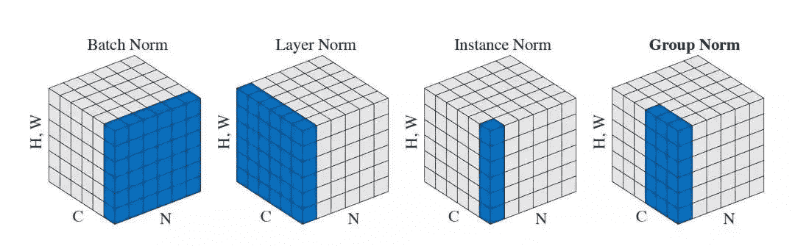
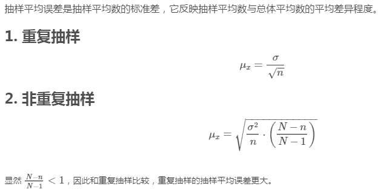
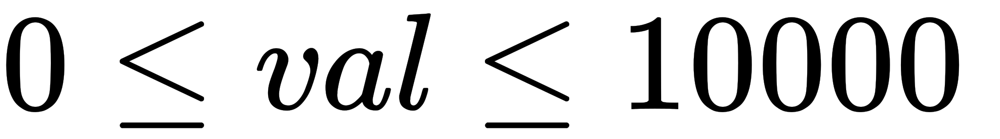

# 快手 2019 春季校园招聘笔试试题-经济学家试卷 B

## 1

    下列数据结构中，具有最高查找性能的数据结构是？

正确答案: B   你的答案: 空 (错误)

```cpp
有序链表
```

```cpp
AVL 树
```

```cpp
无序数组
```

```cpp
有向图
```

本题知识点

职能 快手 算法工程师 财务 2019

讨论

[Better-M](https://www.nowcoder.com/profile/7751240)

链表不管是有序还是无序，查找的时间复杂度都是 O（n）级别的。无序数组查找的时间复杂度是 O(n)；而有序数组可以通过二分来提高查找效率，能到 O(logn)。AVL 是高度平衡的二叉搜索树，所以由 BST 的性质，其时间复杂度能到 O（logn）。有向图的查找的时间复杂度的期望是 O（n）级别的。

发表于 2019-05-05 08:59:47

* * *

## 2

下列关于进程的叙述中，正确的是？

正确答案: A   你的答案: 空 (错误)

```cpp
进程通过进程调度程序而获得 CPU
```

```cpp
优先级是进行进程调度的重要依据，一旦确定不能改变
```

```cpp
在单 CPU 系统中，任一时刻都有 1 个进程处于运行状态
```

```cpp
进程申请 CPU 得不到满足时，其状态变为等待状态
```

本题知识点

职能 快手 算法工程师 财务 2019

讨论

[sh1ro](https://www.nowcoder.com/profile/753739534)

B、进程优先级可以改变 C、CPU 可以空转没有进程运行 D、得不到满足转为就绪状态

发表于 2019-09-10 16:23:08

* * *

[Fat-Tiger](https://www.nowcoder.com/profile/8187487)

优先级在程序运行时可以改变，动态优先级，linux 下用 top 查看

发表于 2019-08-30 18:11:39

* * *

## 3

下列**不是**SVM 的常用核函数的是？

正确答案: D   你的答案: 空 (错误)

```cpp
多项式核函数
```

```cpp
sigmoid 核函数
```

```cpp
径向基核函数
```

```cpp
logistic 核函数
```

本题知识点

职能 快手 算法工程师 财务 2019

讨论

[远走高飞的 HH](https://www.nowcoder.com/profile/997194)

SVM 常见核函数:q 次多项式核径向基函数(radial-based function)
S 型函数(Sigmoid function)

发表于 2019-05-05 12:19:38

* * *

## 4

下列关于决策树的描述中**正确**的是？

正确答案: C   你的答案: 空 (错误)

```cpp
决策树的生成算法有 ID3、CART 和 C4.5，其中 C4.5 是以信息增益作为特征划分的标准的。
```

```cpp
基尼指数越大，样本的不确定性越小。
```

```cpp
CART 算法既可以用于分类也可以用于回归。
```

```cpp
ID3 算法对决策树进行剪枝以预防出现过拟合现象。
```

本题知识点

职能 快手 算法工程师 财务 2019

讨论

[finedust](https://www.nowcoder.com/profile/311516697)

ID3 用信息增益，C4.5 用增益率，CART 用基尼指数基尼指数越小，数据集的纯度越高 CART（Classification And Regression Trees，分类回归树）是一种树构建算法，该算法既可以用于分类还可以用于回归 ID3 算法本身不带剪枝，剪枝是决策树学习算法对付过拟合的主要手段

编辑于 2019-05-05 15:59:41

* * *

[远走高飞的 HH](https://www.nowcoder.com/profile/997194)

A.ID3 使用信息增益作为属性选择度量 （C4.5 使用增益率，CART 使用基尼指数）
B.基尼指数度量数据分布区或训练元组的不纯度(基尼指数越小，数据集 D 的纯度越高)。对于离散值属性，选择该属性产生最小基尼指数的子集作为它的分裂子集，对于连续值属性，选择产生最小基尼指数点作为该属性的分裂点

发表于 2019-05-05 12:12:41

* * *

## 5

下列描述中**错误**的是？

正确答案: C   你的答案: 空 (错误)

```cpp
函数在某点的梯度方向与取得最大方向导数的方向一致。
```

```cpp
在等式约束条件下，约束的梯度向量与目标函数的梯度向量在最优解处一定平行。
```

```cpp
KKT 条件是强对偶成立的充要条件。
```

```cpp
函数在某点的梯度的模为方向导数的最大值。
```

本题知识点

职能 快手 职能 快手 算法工程师 快手 财务 快手 2019 算法工程师 快手 2019 财务 快手 2019 算法工程师 快手 2019 算法工程师 快手 2019

讨论

[卷子清](https://www.nowcoder.com/profile/2031869)

KKT 条件是强对偶性成立的必要条件,特别的,当原问题是凸优化问题时,KKT 条件就是充要条件.

发表于 2019-05-04 17:58:08

* * *

## 6

以下哪一项不属于 NoSQL（非关系型）数据库

正确答案: C   你的答案: 空 (错误)

```cpp
Redis
```

```cpp
MongoDB
```

```cpp
MySQL
```

```cpp
HBase
```

本题知识点

职能 快手 职能 快手 算法工程师 快手 财务 快手 2019 算法工程师 快手 2019 财务 快手 2019 算法工程师 快手 2019 算法工程师 快手 2019

## 7

设某公路上经过的货车与客车的数量之比为 2:1,货车中途停车修理的概率为 0.02,客车为 0.01,现有一辆汽车中途停车修理，求该汽车是货车的概率？

正确答案: C   你的答案: 空 (错误)

```cpp
2/3
```

```cpp
3/4
```

```cpp
4/5
```

```cpp
5/6
```

本题知识点

职能 快手 职能 快手 算法工程师 快手 财务 快手 2019 算法工程师 快手 2019 财务 快手 2019 算法工程师 快手 2019 算法工程师 快手 2019

讨论

[finedust](https://www.nowcoder.com/profile/311516697)

假设路上有 x 辆客车，有 2x 辆货车，则停车修理的客车数量为 0.01x，货车数量为 0.04x，所以停车修理的车是货车的概率为 4/5

发表于 2019-05-05 21:29:26

* * *

[我的上铺叫路遥](https://www.nowcoder.com/profile/719632923)

频率学派：货车 200 辆，客车 100 辆，货车停车 200*2%=4 辆，客车停车 100*1%=1 辆，总共停车 4+1=5 辆，则货车概率为 4/5。贝叶斯学派：P(货)=2/3，P(客)=2/3，P(停｜货)=2/3，P(停｜客)=1%，P(货｜停) = P(停｜货) * P(货) / P(停) = (P(停｜货) * P(货)) / (P(停｜货) * P(货) + P(停｜客) * P(客)) = (2% * 2/3) / (2% * 2/3 + 1% * 1/3) = 4/5

发表于 2020-05-08 22:45:51

* * *

[Fat-Tiger](https://www.nowcoder.com/profile/8187487)

最开始还以为是贝叶斯公式

发表于 2019-08-30 18:15:09

* * *

## 8

设计模式可以分为创建型、结构型、行为型几种，以下属于创建模式的是？

正确答案: C   你的答案: 空 (错误)

```cpp
职责链模式
```

```cpp
装饰模式
```

```cpp
单例模式
```

```cpp
观察者模式
```

本题知识点

职能 快手 算法工程师 财务 2019

讨论

[我叫什么名字](https://www.nowcoder.com/profile/828897964)

创建型模式：单例模式、抽象工厂模式、建造者模式、工厂模式、原型模式。

结构型模式：适配器模式、桥接模式、装饰模式、组合模式、外观模式、享元模式、***模式。

行为型模式：模版方法模式、命令模式、迭代器模式、观察者模式、中介者模式、备忘录模式、解释器模式、状态模式、策略模式、职责链模式(责任链模式)、访问者模式。

发表于 2019-05-07 17:36:06

* * *

## 9

在分类问题中，已知对某一组测试样本的正确分类标记为[1 0 0]，现有四个预先训练好的模型，对该测试样本的分类输出结果为 ABCD，问哪一个模型的输出与正解分类标记的交叉熵最大？

正确答案: A   你的答案: 空 (错误)

```cpp
[0.5 0.3 0.2]
```

```cpp
[0.6 0.1 0.3]
```

```cpp
[0.6 0.2 0.2]
```

```cpp
[0.8 0.1 0.1]
```

本题知识点

职能 快手 算法工程师 财务 2019

讨论

[cincin 是菜鸡](https://www.nowcoder.com/profile/936525172)

交叉熵越大，说明预测结果越不准确，A 选项是最不准确的。

发表于 2019-08-30 14:59:42

* * *

[FridayisSunny](https://www.nowcoder.com/profile/8165393)

交叉熵最大，说明结果和标签的分布差别越大，预测越不准确。

发表于 2019-11-21 16:27:52

* * *

[鲁班 7 号](https://www.nowcoder.com/profile/56645772)

分类 loss 的目的是让对的越对，错的越错。故而预测的结果在正确分类项越大，其他分类项月接近于 0，loss 越小

发表于 2019-08-16 22:29:47

* * *

## 10

对于输入维度为  [N, H, W, C]  的 Tensor, Batch Normalization 在哪个(些)维度上做归一化

正确答案: B   你的答案: 空 (错误)

```cpp
N
```

```cpp
N, C
```

```cpp
N, H
```

```cpp
H, W
```

本题知识点

职能 快手 算法工程师 财务 2019

讨论

[Dejavu_Get](https://www.nowcoder.com/profile/798831578)

不应该是 N,H,W 吗

发表于 2019-05-20 19:15:35

* * *

[WaterXMan](https://www.nowcoder.com/profile/530994502)

一个 Batch 的图像数据 shape 为[样本数 N, 通道数 C, 高度 H, 宽度 W]，将其最后两个维度 flatten，得到的是[N, C, H*W]，标准的 Batch Normalization 就是在通道 Channel 这个维度上进行移动，对所有样本的所有值求均值和方差，有几个通道，得到的就是几个均值和方差。

发表于 2019-06-11 08:49:07

* * *

## 11

以下那个不是 Batch Normalization 带来的优点？

正确答案: D   你的答案: 空 (错误)

```cpp
训练收敛速度更快
```

```cpp
防止梯度爆炸
```

```cpp
梯度曲面更加光滑
```

```cpp
减少计算量
```

本题知识点

职能 快手 算法工程师 财务 2019

讨论

[茶语 201804231515362](https://www.nowcoder.com/profile/4256078)

Bn 是在激活函数后面加的一层，增加参数，但是这样不是训练速度下去了吗

发表于 2019-08-24 16:51:06

* * *

## 12

小于 1000 并且不能被 5、7 整除的正整数个数为？

正确答案: D   你的答案: 空 (错误)

```cpp
657
```

```cpp
658
```

```cpp
685
```

```cpp
686
```

本题知识点

职能 快手 算法工程师 财务 2019

讨论

[WaterXMan](https://www.nowcoder.com/profile/530994502)

5 和 7 的最小公倍数是 35，就是找到 1000 以下的不能被 5 整除，不能被 7 整除的数。
能被 5 整除：（1000÷5-1）=199
能被 7 整除：（1001÷7-1）=142
重复计算的：999÷35=28.....？
小于 1000 既不能被 5 整除，又不能被 7 整除的正整数的个数为：999-199-142+28=686 个

编辑于 2019-06-11 08:57:20

* * *

[牛客 293217676 号](https://www.nowcoder.com/profile/293217676)

设小于 1000 能被 5 整除的数与能被 7 整除的自然数分别为 a 个、b 个，既能被 5 整除又能被 7 整除的数为 c 个，
则 5a≤1000，解得 a 最大=200；
7b≤1000，解得 b 最大=142；
35c≤1000，解得，c 最大=28．
故既不能被 5 整除，又不能被 7 整除的自然数的个数为 1000-200-142+28=686 个．
故答案为：686 个．

发表于 2020-06-26 12:00:47

* * *

[不上岸就不改名](https://www.nowcoder.com/profile/903964616)

```cpp
c=0 for i in range(1,1000): if i%5!=0 and i%7!=0: c+=1 print(c)
```

发表于 2019-08-23 21:33:10

* * *

## 13

以下哪个不是 1 x 1 卷积的优点？

正确答案: C   你的答案: 空 (错误)

```cpp
方便提升 channel 或 减少 channel 数
```

```cpp
使不同 channel 间信息交流
```

```cpp
增加模型的非线性表达能力
```

本题知识点

职能 快手 算法工程师 财务 2019

讨论

[牛客 Cver](https://www.nowcoder.com/profile/1897620)

我也觉得题目出得有问题

发表于 2020-04-12 14:39:16

* * *

[cincin 是菜鸡](https://www.nowcoder.com/profile/936525172)

整体来看，应该选 B？？因为 A 和 C 肯定是对的呀

发表于 2019-08-30 15:03:20

* * *

[earnestbin](https://www.nowcoder.com/profile/7680222)

***题目，出错了，都是优点

发表于 2019-08-09 21:48:56

* * *

## 14

以下哪种方式不能减弱类别不平衡带来的影响？

正确答案: D   你的答案: 空 (错误)

```cpp
使用 focal loss
```

```cpp
使用 online hard example miner
```

```cpp
对样本数少的类别重采样
```

```cpp
随机 shuffle 数据
```

本题知识点

职能 快手 算法工程师 财务 2019

讨论

[offerdaydaycome](https://www.nowcoder.com/profile/887596621)

shuffle 打乱数据顺序，该不平衡还是不平衡

发表于 2020-03-22 17:10:27

* * *

## 15

下列关于优化方法描述有误的是？

正确答案: B   你的答案: 空 (错误)

```cpp
SGD 是无偏的
```

```cpp
SGD with momentum 是无偏的
```

```cpp
SGD with momentum 使用了一阶动量
```

```cpp
Adam 使用了一阶动量
```

本题知识点

职能 快手 算法工程师 财务 2019

讨论

[鲁班 7 号](https://www.nowcoder.com/profile/56645772)

哪位大佬解释一下无偏是什么意思

发表于 2019-08-16 22:38:47

* * *

## 16

e^x 在 0 的泰勒展开是？

正确答案: A   你的答案: 空 (错误)

本题知识点

职能 快手 算法工程师 财务 2019

## 17

下面哪些可以看作是随机变量？

正确答案: D   你的答案: 空 (错误)

```cpp
考试成绩
```

```cpp
车的行进速度
```

```cpp
掷骰子的结果
```

```cpp
其他三个选项皆是
```

本题知识点

职能 快手 算法工程师 财务 2019

讨论

[塔里木的骆驼](https://www.nowcoder.com/profile/710199247)

传说中的随机过程随机过。

发表于 2019-09-28 12:21:30

* * *

## 18

关于线性规划的算法复杂度 以下哪些是正确的？

正确答案: C   你的答案: 空 (错误)

```cpp
simplex 在多项式复杂度的时间内可以解决线性规划问题
```

```cpp
simplex 不是多项式复杂度，而且线性规划的问题不可以在多项式时间内求解
```

```cpp
线性规划的问题可以在多项式时间内求解，但是 simplex 不是多项式复杂度
```

```cpp
因为线性规划的可行域总是凸集，所以 simplex 算法才能在多项式时间复杂度内解决线性规划问题
```

本题知识点

职能 快手 算法工程师 财务 2019

## 19

假设 A 矩阵是一个 MxN 的矩阵，B 矩阵是一个 NxN 的矩阵， A*B 的时间复杂度是？

正确答案: A   你的答案: 空 (错误)

```cpp
O(M*N2)
```

```cpp
O(M3)
```

```cpp
O(N3)
```

```cpp
O(M2N)
```

本题知识点

职能 快手 算法工程师 财务 2019

讨论

[Better-M](https://www.nowcoder.com/profile/7751240)

可以举个栗子：比如一个 3*2 的矩阵和一个 2*2 的据矩阵相乘，那么最终结果是一个 3*2 的矩阵，则该矩阵中每个元素的获得是由两次乘法和一次加法，如果只考虑乘法的计算复杂性，则每个位置需要两次乘法，所以共需要 3*2*2=12 次乘法。即 M*N² 的时间复杂度，所以选 A。

发表于 2019-05-05 09:20:27

* * *

## 20

给出一个长度为 N 的乱序的数组，请问找到第 K 大的元素的最优时间复杂度是？

正确答案: A   你的答案: 空 (错误)

```cpp
O(N log K)
```

```cpp
O(NK)
```

```cpp
O(N log N)
```

```cpp
O(K log K)
```

本题知识点

职能 快手 算法工程师 财务 2019

讨论

[ziiro](https://www.nowcoder.com/profile/433073646)

用堆，堆重排序需要 logk，n 个元素用 nlogk

发表于 2020-09-20 13:07:50

* * *

## 21

三个矩阵 A，B，C，D，大小分别是（10 x 100), (100 x 10), (10 x 1000), (1000 x 1) 请问求矩阵连乘 ABC 的计算复杂度最小的最佳顺序是？

正确答案: A   你的答案: 空 (错误)

```cpp
(AB)(CD)
```

```cpp
(A(BC))D
```

```cpp
A(B(CD))
```

```cpp
((AB)C)D
```

本题知识点

职能 快手 算法工程师 财务 2019

讨论

[worldhellooo](https://www.nowcoder.com/profile/157679415)

我觉得 A 的计算量是 10x100x10+10x1000x1+10x10x1=20100，C 的计算量为 10x1000x1+100x10x1+10x100x1=12000，感觉应该选 C 吧

发表于 2019-08-24 10:50:22

* * *

[不上岸就不改名](https://www.nowcoder.com/profile/903964616)

（m,n）和（n,p）的矩阵相乘得到（m,p）的矩阵。因此（AB）(CD)的结果是（10*10）*（10*1），显然最优。

发表于 2019-08-23 21:28:02

* * *

## 22

已知小根堆为 8,15,10,21,34,16,12，删除关键字 8 之后需重建堆，最后的叶子节点为

正确答案: C   你的答案: 空 (错误)

```cpp
21
```

```cpp
34
```

```cpp
16
```

```cpp
12
```

本题知识点

快手 测试工程师 Java 工程师 C++工程师 安卓工程师 iOS 工程师 运维工程师 前端工程师 算法工程师 PHP 工程师 财务 2019

讨论

[牛客 799323653 号](https://www.nowcoder.com/profile/799323653)

C 删除顶点后，最后一位会拿到定点进行下滤，最后与 34 这个叶子节点替换，所以最后的叶子节点是 16

发表于 2020-04-27 21:49:35

* * *

[是瑶瑶公主呀](https://www.nowcoder.com/profile/592649258)

小根堆即根节点最小，每个结点小于它的子节点，删除时把最后一个结点移动到第一个，12 移走剩下 16

发表于 2019-10-28 22:05:10

* * *

## 23

以下对 LR 和 SVM 算法的描述，正确的是？

正确答案: C   你的答案: 空 (错误)

```cpp
LR 和 SVM 都是参数模型
```

```cpp
LR 模型一般需要通过正则化项控制模型复杂度，防止过拟合；而 SVM 具有结构风险最小化理论基础，则没有过拟合风险
```

```cpp
SVM 对样本的处理方法是只考虑 Support Vectors，也就是和分类最相关的少数点，去学习分类器；而逻辑回归通过非线性映射，相对提升了与分类最相关的数据点的权重
```

```cpp
LR 不能像 SVM 一样利用核函数将特征空间向高维映射，所以 LR 不适用于非线性问题
```

本题知识点

职能 快手 算法工程师 财务 2019

## 24

下列哪一种操作实现了和神经网络中 Dropout 类似的效果？

正确答案: A   你的答案: 空 (错误)

```cpp
Bagging
```

```cpp
Boosting
```

```cpp
Stacking
```

```cpp
都不正确
```

本题知识点

职能 快手 算法工程师 财务 2019

讨论

[赤芍君](https://www.nowcoder.com/profile/383793507)

dropout 可以看作是一中极端的 bagging，每个模型都在单独的数据上训练，并通过和其它模型对应参数的共享，实现模型参数的高度正则化

发表于 2019-08-25 13:55:12

* * *

## 25

若一棵二叉树的前序遍历为 a, e, b, d, c，后序遍历为 b, c, d, e, a，则根节点的孩子节点为()

正确答案: B   你的答案: 空 (错误)

```cpp
有 e、c
```

```cpp
只有 e
```

```cpp
有 e、b
```

```cpp
无法确定
```

本题知识点

职能 快手 职能 快手 算法工程师 快手 财务 快手 2019 算法工程师 快手 2019 财务 快手 2019 算法工程师 快手 2019 算法工程师 快手 2019

## 26

设 k1,k2 是方阵 A 的两个不同的特征值，a 与 b 是分别属于 k1,k2 的特征向量，则 a 与 b 是（）

正确答案: C   你的答案: 空 (错误)

```cpp
对应分量成比例
```

```cpp
线性相关
```

```cpp
线性无关
```

```cpp
相关性不确定
```

本题知识点

职能 快手 职能 快手 算法工程师 快手 财务 快手 2019 算法工程师 快手 2019 财务 快手 2019 算法工程师 快手 2019 算法工程师 快手 2019

讨论

[Fat-Tiger](https://www.nowcoder.com/profile/8187487)

线性代数里面的知识，不同特征值对应的特征向量线性无关

发表于 2019-08-30 21:11:39

* * *

## 27

在相同样本量下，重复抽样与不重复抽样的抽样平均误差大小关系是？

正确答案: B   你的答案: 空 (错误)

```cpp
二者相同
```

```cpp
重复抽样误差大
```

```cpp
不重复抽样误差大
```

```cpp
不确定
```

本题知识点

职能 快手 职能 快手 算法工程师 快手 财务 快手 2019 算法工程师 快手 2019 财务 快手 2019 算法工程师 快手 2019 算法工程师 快手 2019

讨论

[finedust](https://www.nowcoder.com/profile/311516697)



发表于 2019-05-05 21:32:46

* * *

## 28

设有 6 个结点的无向图，该图至少应有（ ）条边才能确保是一个连通图

正确答案: A   你的答案: 空 (错误)

```cpp
5
```

```cpp
6
```

```cpp
7
```

```cpp
8
```

本题知识点

职能 快手 职能 快手 算法工程师 快手 财务 快手 2019 算法工程师 快手 2019 财务 快手 2019 算法工程师 快手 2019 算法工程师 快手 2019

讨论

[时文康](https://www.nowcoder.com/profile/101764790)

一条线，能通即可

发表于 2019-09-19 19:46:13

* * *

## 29

有 100 个人，从 1~100 编上号，开始时所有的人都站在一条线上，第一次，所有编号是 1 的倍数的人的向前走一步；第二次，所有编号是 2 的倍数的人的再向前走一步；第三次，所有编号是 3 的倍数的人的再向前走一步；  依此类推，直到把所有编号是 50 的倍数的人的向前走一步，请问现在走了奇数步的人有多少个 ？

正确答案: D   你的答案: 空 (错误)

```cpp
51
```

```cpp
52
```

```cpp
53
```

```cpp
54
```

本题知识点

职能 快手 算法工程师 财务 2019

讨论

[finedust](https://www.nowcoder.com/profile/311516697)

```cpp
a=[0]*100
for i in range(1,51):
    for j in range(1,101):
        if j%i==0:
         a[j-1]+=1
sum=0
for ai in a:
    if ai%2==1:
        sum+=1
print(sum)

```

发表于 2019-05-05 21:57:40

* * *

## 30

假设一棵完全二叉树共有 699 个结点，则在该树中叶子结点共有？

正确答案: B   你的答案: 空 (错误)

```cpp
256
```

```cpp
350
```

```cpp
352
```

```cpp
512
```

本题知识点

职能 快手 算法工程师 财务 2019

讨论

[finedust](https://www.nowcoder.com/profile/311516697)

一棵二叉树，假设度为 0 的节点个数为 n0，度为 1 的节点个数为 n1，度为 2 的节点个数为 n2，节点总数为 s 从节点看，有 n0+n1+n2=s 从树枝看，有 0*n0+1*n1+2*n2=s-1 得到：n0=n2+1 完全二叉树有 n1=0 或 1 所以完全二叉树的叶子节点个数 n0=s/2 向上取整或 n0=(s+1)/2 向下取整

编辑于 2019-05-05 22:25:29

* * *

## 31

100 个人随机两两匹配成 50 组，有多少种不同的匹配方式？

正确答案: B   你的答案: 空 (错误)

```cpp
100*99*98*...*1
```

```cpp
99*97*95*...*3
```

```cpp
98*96*94*...*2
```

```cpp
100*99*98*...*1 / 2⁵⁰
```

本题知识点

职能 快手 算法工程师 财务 2019

讨论

[Fat-Tiger](https://www.nowcoder.com/profile/8187487)

100 个人编号，从第一个人开始，99 种选择。最先选好的两人 pass，还有 98 人，继续选...

发表于 2019-08-30 21:29:01

* * *

[offerdaydaycome](https://www.nowcoder.com/profile/887596621)

平均分组问题最后要除以 Ann

发表于 2020-03-22 17:34:24

* * *

## 32

两个参与人 1 和 2，分别可选的策略是 1: (U,M,D), 2: (L,X,R)，两人策略相遇下各自的收益如下，该收益矩阵是两个人的共同知识。作为两个理性人，要求两人同时给出选择且无法讨论，他们最终会选择哪个策略？

       L       X       R

U    4, 3     5, 1    6, 2

M    2, 1     8, 4    3, 6

D    3, 0     9, 6    2, 8

正确答案: A   你的答案: 空 (错误)

```cpp
(U,L)
```

```cpp
(M,X)
```

```cpp
(D,R)
```

```cpp
(D,X)
```

本题知识点

职能 快手 算法工程师 财务 2019

讨论

[cincin 是菜鸡](https://www.nowcoder.com/profile/936525172)

感觉应该是涉及到博弈论中的纳什均衡问题，既然双方需要同时做出选择且无法讨论，那么最后的理性选择结果应该是在两者收益相等或者相差最小的情况下，两人的各自的收益尽可能大，那么只有 A 选项符合这种均衡情况。

发表于 2019-08-30 15:53:06

* * *

## 33

（C++）设 A 为基类，AX 为派生类，

```cpp
class A {
public:
  A();
  ~A();

  Data* data;
};

class AX : public A {
public:
  AX();
  ~AX();

  AXData* ax_data;
};
```

以下不会内存泄漏的写法吗？

正确答案: A C D   你的答案: 空 (错误)

```cpp
AX* p = new AX(); delete p;
```

```cpp
A* p = new AX(); delete p;
```

```cpp
std::shared_ptr<AX> p{new AX()};
```

```cpp
std::shared_ptr<A> p{new AX()};
```

本题知识点

职能 快手 算法工程师 财务 2019 C++

讨论

[HouJian](https://www.nowcoder.com/profile/5255423)

如果基类析构函数不是虚函数，Base *d = new Derived(); 这样定义的 d 在析构的时候只会调用 Base 自己的析构函数，delete d; 运行的时候，Derived 自己的数据成员不会被销毁，造成内存泄漏。也就是说题目中的 AXData* ax_data 不会被释放。

发表于 2021-01-11 10:15:59

* * *

[牛客 903822405 号](https://www.nowcoder.com/profile/903822405)

shared_ptr 创建时会记住原来的类型的析构函数，因此 D 在计数器为 0 时会调用派生类的析构函数。

发表于 2021-09-11 17:53:26

* * *

[牛客 725813083 号](https://www.nowcoder.com/profile/725813083)

D 为啥对

发表于 2021-02-22 03:28:40

* * *

## 34

以下方式能确定一种颜色的是？

正确答案: C D   你的答案: 空 (错误)

```cpp
给定颜色的 RGB 值
```

```cpp
给定颜色的 CMYK 值
```

```cpp
给定颜色的 XYZ 值
```

```cpp
给定颜色的光谱分布曲线
```

本题知识点

职能 快手 算法工程师 财务 2019

讨论

[来个 offer 吧求求了](https://www.nowcoder.com/profile/978524565)

给定 RGB 为啥不能确定颜色啊？

发表于 2020-04-12 03:20:53

* * *

## 35

以下哪几种技术适用于提升算法在单核上的性能？

正确答案: A B   你的答案: 空 (错误)

```cpp
SIMD
```

```cpp
多线程
```

```cpp
MPI
```

```cpp
Hadoop
```

本题知识点

职能 快手 算法工程师 财务 2019

## 36

影响聚类算法效果的主要因素有（）

正确答案: B C D   你的答案: 空 (错误)

```cpp
已知类别的样本质量
```

```cpp
分类准则
```

```cpp
特征选取
```

```cpp
模式相似性测度
```

本题知识点

职能 快手 算法工程师 财务 2019

讨论

[给弟弟一个 offer](https://www.nowcoder.com/profile/895606814)

A 选项不选吗？那要是大量样本的特征都有缺失怎么办，难道不会影响分类效果吗？

发表于 2019-09-16 11:57:35

* * *

## 37

L1 正则化和 L2 正则化的区别，下面哪几项是正确的？

正确答案: B D   你的答案: 空 (错误)

```cpp
L2 正则化使系数更为稀疏
```

```cpp
L1 正则化使系数更为稀疏
```

```cpp
L1 正则化使解更均匀
```

```cpp
L2 正则化使解更均匀
```

本题知识点

职能 快手 算法工程师 财务 2019

讨论

[Fat-Tiger](https://www.nowcoder.com/profile/8187487)

L1:高斯分布函数，L2 拉普拉斯分布函数

发表于 2019-08-30 21:33:55

* * *

## 38

对于一个长度为 n 的整数序列，你需要检查这个序列最多改变一个数后是否可以是非递减序列。非递减序列的定义是：array[i]<=array[i+1] , for 1<=i<n;数据范围： ， 数组中的值满足 

本题知识点

职能 算法工程师 快手 排序 *数组 穷举 财务 2019* *讨论

[Polestar_a](https://www.nowcoder.com/profile/833398956)

找逆序对儿就完事儿了呗

```cpp
res = list(map(int, input().split()))
num = 0
for i in range(1,len(res)):
    if res[i]<res[i-1]:
        num+=1
print(1 if num<=1 else 0)
```

编辑于 2019-08-10 11:14:18

* * *

[此益达非彼益达](https://www.nowcoder.com/profile/5559306)

```cpp
public class Main {
    public static void main(String[] args) {
        System.out.println(1);
    }
}
```

谁能告诉我，这样也能过？？？

发表于 2019-08-06 02:11:10

* * *

[dragonlogin](https://www.nowcoder.com/profile/2071677)

```cpp
#include <bits/stdc++.h>
using namespace std;

int main() {
    vector<int> a;
    int x;
    int len = 0;
    while (cin >> x) {
        ++len;
        a.push_back(x);
    }
    int ant = 0;
    for (int i=1; i<len - 1; ++i) {
        if (a[i] < a[i-1] || a[i] > a[i+1]) {
            a[i] = a[i-1]; // 不满足条件的， 赋值 满足条件的最小值 给它
            ++ant;
        }
        if (ant > 1) break; // 提前剪枝
    }
    if (ant > 1) {
        cout << "0" << endl;
    } else {
        cout << "1" << endl;
    }
    return 0;
}
```

发表于 2019-10-17 13:16:04

* * **