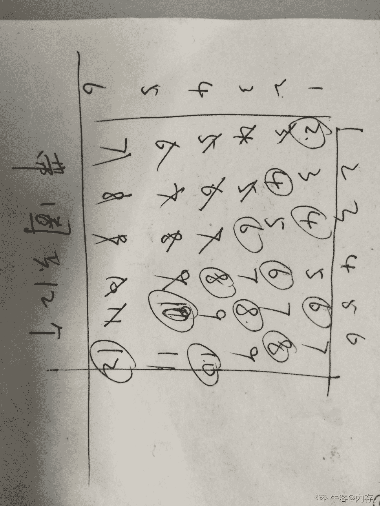
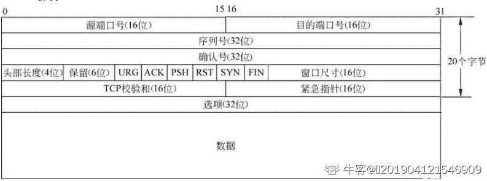
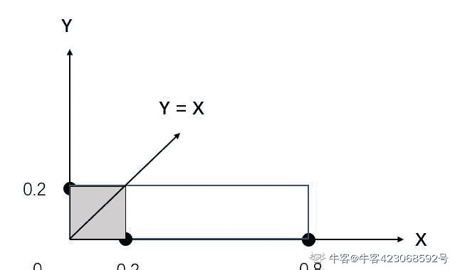
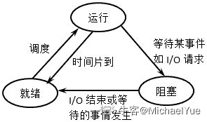
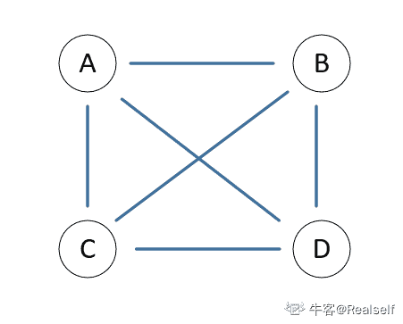
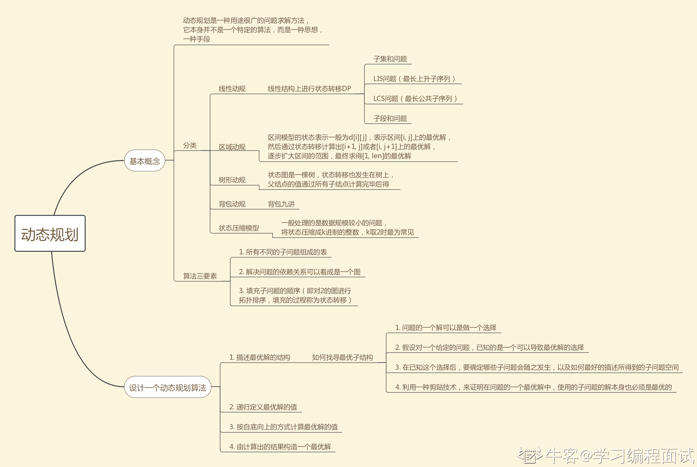
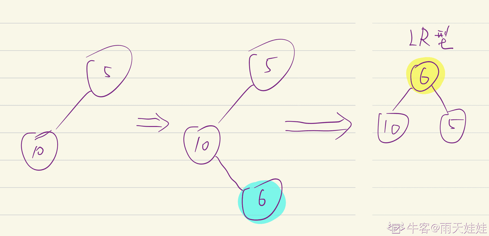

# 快手 2019 年春季校园招聘笔试试题--测试 A 试卷

## 1

OSI 七层模型中，ARP 是属于哪一层的协议？

正确答案: D   你的答案: 空 (错误)

```cpp
应用层
```

```cpp
传输层
```

```cpp
网络层
```

```cpp
数据链路层
```

本题知识点

测试工程师 快手 Java 工程师 C++工程师 安卓工程师 iOS 工程师 运维工程师 前端工程师 算法工程师 PHP 工程师 2019

讨论

[不知道该写啥](https://www.nowcoder.com/profile/434580324)

在 OSI 模型中 ARP 协议属于链路层；而在 TCP/IP 模型中，ARP 协议属于网络层。 和答案不符合  计算机网络这本书上 ARP 属于链路层  不是很懂

发表于 2019-05-06 21:18:03

* * *

[captain20180408164495](https://www.nowcoder.com/profile/2776708)

在[TCP/IP](https://www.baidu.com/s?wd=TCP%2FIP&tn=SE_PcZhidaonwhc_ngpagmjz&rsv_dl=gh_pc_zhidao)模型中，ARP 协议属于 IP 层；在 OSI 模型中，ARP 协议属于链路层。

发表于 2019-09-03 16:34:13

* * *

[🐤201904121546909](https://www.nowcoder.com/profile/284999892)

OSI 七层协议中，网络层协议：IP、ICMP（因特网控制报文协议）、ARP、RARP、OSPF、IPX、RIP、IGRP 传输层：TCP、UDP;应用层：FTP TELNET DNS SMTP

发表于 2019-09-08 10:10:34

* * *

## 2

抛掷两个骰子， 点数之和为偶数(2,4 和 4,2 为一种) 共有多少种组合？

正确答案: B   你的答案: 空 (错误)

```cpp
6
```

```cpp
12
```

```cpp
18
```

```cpp
24
```

本题知识点

测试工程师 快手 Java 工程师 C++工程师 安卓工程师 iOS 工程师 运维工程师 前端工程师 算法工程师 PHP 工程师 测试工程师 快手 测试工程师 快手 2019 C++工程师 Java 工程师 快手 2019

讨论

[莱布尼兹不会飞](https://www.nowcoder.com/profile/542514585)

需要去掉重复的组合

发表于 2020-04-12 14:51:30

* * *

[内存。](https://www.nowcoder.com/profile/39306668)



发表于 2020-03-07 17:35:54

* * *

[WhoMovedMyCheese?](https://www.nowcoder.com/profile/7628124)

题目是 2 个骰子，3+2+1+3+2+1=12, 由于 2：4 和 4：2 重复，所以排除。2：2、4、6，4：4、6，6：6，1：1、3、5，3：3、5，5：5.

发表于 2019-08-25 16:27:44

* * *

## 3

 void recursive(int n,int m,int o)

{

  if(n<=0)

  {

    printf(“%d,%d\n”,m,o);

  }

  else

  {

    recursive(n-1,m+1,o);

    recursive(n-1,m,o+1);

  }

}

以上函数的时间复杂度为

正确答案: D   你的答案: 空 (错误)

```cpp
O(n*m*o)
```

```cpp
O(n²*m²)
```

```cpp
O(2^n)
```

```cpp
O(n!)
```

本题知识点

测试工程师 快手 Java 工程师 C++工程师 安卓工程师 iOS 工程师 运维工程师 前端工程师 算法工程师 PHP 工程师 测试工程师 快手 测试工程师 快手 2019 C++工程师 Java 工程师 快手 2019

讨论

[🐤201904121546909](https://www.nowcoder.com/profile/284999892)

答案应该为 C。

T(n)=2T(n-1)+c.利用递推，T(n)=2T(n-1)+c=2(2T(n-1)+c)+c=...

发表于 2019-09-08 10:58:51

* * *

[北极电风扇](https://www.nowcoder.com/profile/274972024)

一次递归里有两次递归，所以是阶乘的复杂度？

发表于 2019-08-25 14:08:34

* * *

[孟天昊](https://www.nowcoder.com/profile/8400931)

确实是 D，因为第一次分出去是 m,m+1, 第二次分出去是 m,m+1,m+2,实际每次只需要比上一次多算一个问题。因此就是 D

发表于 2020-03-21 23:23:50

* * *

## 4

堆排序所需额外空间的复杂度是（），堆排序中自底向上构建堆的时间复杂度是（）

正确答案: C   你的答案: 空 (错误)

```cpp
Ｏ(logn)，O(n)
```

```cpp
O(logn), O(nlogn)
```

```cpp
O(1), O(n)
```

```cpp
O(1), O(nlogn)
```

本题知识点

测试工程师 快手 Java 工程师 C++工程师 安卓工程师 iOS 工程师 运维工程师 前端工程师 算法工程师 PHP 工程师 测试工程师 快手 测试工程师 快手 2019 C++工程师 Java 工程师 快手 2019

讨论

[🐤201904121546909](https://www.nowcoder.com/profile/284999892)

堆排序中自底向上构建堆的时间复杂度是 O(n），要从第一个非叶节点开始与它的叶子节点进行比较，然后移动。不是说每一层选一个根节点进行比较就可以了，是每一层的所有元素都要跟它的左右节点进行比较。堆排序中自上而下调整堆的时间为 O(nlogn),为是从最上面的根节点开始进行左右节点的比较，选择一个较小的左节点或者有节点进行交换。而因为只破坏了一层的有序性，另外一边的子树的有序性没有遭到破坏，所以，另外一边不需要进行比较，所以，每一层只需要比较一次，一共 logn 层，需要比较 logn 次。而一共会有 n 个这样的元素会被放到根节点进行这样的操作，得到 nlognn。

发表于 2019-09-08 11:17:00

* * *

[付费通](https://www.nowcoder.com/profile/5170111)

堆排序中自底向上构建堆的时间复杂度是 O(n）,堆排序中自上而下调整堆的时间为 O(nlogn). 

发表于 2019-09-19 20:27:45

* * *

## 5

栈和队列的共同点

正确答案: B   你的答案: 空 (错误)

```cpp
都是先进先出
```

```cpp
只允许在端点处插入和删除
```

```cpp
都是先进后出
```

```cpp
没有共同点
```

本题知识点

测试工程师 快手 Java 工程师 C++工程师 安卓工程师 iOS 工程师 运维工程师 前端工程师 算法工程师 PHP 工程师 测试工程师 快手 测试工程师 快手 2019 C++工程师 Java 工程师 快手 2019

讨论

[付费通](https://www.nowcoder.com/profile/5170111)

栈：先进后出 -------- 队列： 先进先出栈是从表的一端进出，而队列则是从一端进一端出

发表于 2019-09-19 20:28:38

* * *

[MichaelYue](https://www.nowcoder.com/profile/7177662)

A: 栈：先进后出 -------- 队列： 先进先出 B: 栈是从表的一端进出，而队列则是从一端进一端出

发表于 2019-08-16 14:54:54

* * *

## 6

下面哪些是对称加密算法（）

正确答案: B   你的答案: 空 (错误)

```cpp
MD5
```

```cpp
AES
```

```cpp
DSA
```

```cpp
RSA
```

本题知识点

测试工程师 快手 Java 工程师 C++工程师 安卓工程师 iOS 工程师 运维工程师 前端工程师 算法工程师 PHP 工程师 2019

讨论

[不知道该写啥](https://www.nowcoder.com/profile/434580324)

高级加密标准(AES)代替 DES,已然成为[对称密钥加密](https://baike.baidu.com/item/%E5%AF%B9%E7%A7%B0%E5%AF%86%E9%92%A5%E5%8A%A0%E5%AF%86)中最流行的算法之一。

发表于 2019-05-08 21:08:29

* * *

## 7

对 IP 数据报分片的重组通常发生在（ ）上？

正确答案: C   你的答案: 空 (错误)

```cpp
目的主机或路由器
```

```cpp
IP 数据报经过的路由器
```

```cpp
目的主机
```

```cpp
源主机
```

本题知识点

测试工程师 快手 Java 工程师 C++工程师 安卓工程师 iOS 工程师 运维工程师 前端工程师 算法工程师 PHP 工程师 测试工程师 快手 测试工程师 快手 2019 C++工程师 Java 工程师 快手 2019

讨论

[不知道该写啥](https://www.nowcoder.com/profile/434580324)

分片：把一个数据报为了适合网络传输而分成多个数据报的过程称为分片，被分片后的各个 IP 数据报可能经过不同的路径到达目标主机。同一个网络上的两台主机之间通信时，该网络的 MTU（最大传输单元）值是确定的，不存在分片问题。分片问题一般只存在于具有不同 MTU 值的互联网中。由于现在互联网主要使用路由器进行网络连接，因此分片工作通常由**路由器**负责。

重组：当分了片的 IP 数据报到达最终目标主机时，**目标主机**对各分片进行组装，恢复成源主机发送时的 IP 数据报，这个过程叫做 IP 数据报的重组。

发表于 2019-05-08 21:12:23

* * *

## 8

下列操作中，多线程环境不需要加锁的是？

正确答案: B   你的答案: 空 (错误)

```cpp
x++
```

```cpp
x=1
```

```cpp
x=y
```

```cpp
--x
```

本题知识点

测试工程师 快手 Java 工程师 C++工程师 安卓工程师 iOS 工程师 运维工程师 前端工程师 算法工程师 PHP 工程师 2019

讨论

[MichaelYue](https://www.nowcoder.com/profile/7177662)

ACD 需要先取值，而后进行计算或者赋值操作，这个过程中如果不加锁可能会被外部环境修改，造成脏读的情况，B 是直接赋值，不需要锁

发表于 2019-08-16 15:13:01

* * *

## 9

明天晚上 21:00 的宴会需要 9 瓶酒，酒窖里现有 17 瓶酒，其中有一瓶混入了慢性毒药，只对人和老鼠有影响，吃了以后，无药可医，但需且仅需 24 小时发作。现在是晚上 7:00，请问至少需要多少只老鼠才能选出宴会用的酒？

正确答案: B   你的答案: 空 (错误)

```cpp
1
```

```cpp
2
```

```cpp
3
```

```cpp
4
```

本题知识点

测试工程师 快手 Java 工程师 C++工程师 安卓工程师 iOS 工程师 运维工程师 前端工程师 算法工程师 PHP 工程师 2019

讨论

[怕是不知道怎么改网名哦](https://www.nowcoder.com/profile/355382279)

给 17 瓶酒分别从 1 编号到 17，然后分成两组:1 组是 1-9 编号的酒共 9 瓶，2 组是 10-17 编号的酒外加从 1-9 编号中的任意一瓶酒，共 9 瓶，则共需要两只老鼠试喝 2 组中的酒，则可能发生的结果为：1.喝 1 组酒的老鼠死亡，则宴会用 2 组的 9 瓶酒 2.喝 2 组酒的老鼠死亡，则宴会用 1 组的 9 瓶酒 3.2 只老鼠都死亡，则说明从 1-9 中拿出的那瓶酒是毒酒，则宴会使用剩余 16 瓶中的任意 9 瓶

发表于 2019-07-28 18:56:29

* * *

[twomangoes](https://www.nowcoder.com/profile/255812689)

为什么不是 1 个老鼠呢？题中”但需且仅需 24 小时发作“，意味着发作时间是非常准确的。
“其中有一瓶混入了慢性毒药”，意味着只有一瓶会让老鼠死亡。
那么只要每隔 1 分钟给老鼠喂不同葡萄酒，那么第二天晚上只要观察老鼠在哪个时间死亡就可以找出对应的葡萄酒。比如 7 点 1 分喂第 1 瓶，7 点 2 分喂第 2 瓶，...，7 点 17 分喂第 17 瓶

发表于 2019-08-26 15:25:29

* * *

[流水静如镜](https://www.nowcoder.com/profile/30064155)

两只老鼠，每只喝八瓶，剩下一瓶第二天，如果有老鼠死，就选没死老鼠喝的 8 瓶+剩下的 1 瓶；如果没老鼠死，那就是剩下的一瓶有毒，在老鼠喝过的 16 瓶里选 9 瓶。

发表于 2019-08-25 14:52:25

* * *

## 10

以下哪个字段不属于 TCP 头部？

正确答案: C   你的答案: 空 (错误)

```cpp
PSH
```

```cpp
RST
```

```cpp
Fragment Offset
```

```cpp
Window Size
```

本题知识点

测试工程师 快手 Java 工程师 C++工程师 安卓工程师 iOS 工程师 运维工程师 前端工程师 算法工程师 PHP 工程师 2019

讨论

[不知道该写啥](https://www.nowcoder.com/profile/434580324)

**32****位端口号**

u**32****位序号**

u**32****位确认序号**

u**4****位首部长度**

u**6****位标志字段**

ACK 置 1 时表示确认号（为合法，为 0 的时候表示数据段不包含确认信息，确认号被忽略。

RST 置 1 时重建连接。如果接收到 RST 位时候，通常发生了某些错误。

SYN 置 1 时用来发起一个连接。

FIN 置 1 时表示发端完成发送任务。用来释放连接，表明发送方已经没有数据发送了。

URG 紧急指针，告诉接收 TCP 模块紧要指针域指着紧要数据。注：一般不使用。

PSH 置 1 时请求的数据段在接收方得到后就可直接送到应用程序，而不必等到缓冲区满时才传送。注：一般不使用。

u**16****位检验和：**

检验和覆盖了整个的 TCP 报文段： TCP 首部和 TCP 数据。这是一个强制性的字段，一定是由发端计算和存储，并由收端进行验证。

u**16****位紧急指针：**

**注：**一般不使用。

只有当 U R G 标志置 1 时紧急指针才有效。紧急指针是一个正的偏移量，和序号字段中的值相加表示紧急数据最后一个字节的序号。

u**可选与变长选项**：

通常为空，可根据首部长度推算。用于发送方与接收方协商最大报文段长度（MSS），或在高速网络环境下作窗口调节因子时使用。首部字段还定义了一个时间戳选项。

u 最常见的可选字段是最长报文大小，又称为 MSS (Maximum Segment Size)。每个连接方通常都在握手的第一步中指明这个选项。它指明本端所能接收的最大长度的报文段。1460 是以太网默认的大小。

发表于 2019-05-06 21:20:55

* * *

[🐤201904121546909](https://www.nowcoder.com/profile/284999892)



发表于 2019-09-08 11:31:49

* * *

[布鲁小叮当](https://www.nowcoder.com/profile/447373437)

TCP 头部包含 Data Offset 即数据偏移，它指出 TCP 报文段的数据起始处距离 TCP 报文段的起始处有多远。而 Fragment Offset 是片偏移是 IP 分片中的概念。

发表于 2020-04-26 15:16:43

* * *

## 11

一个 7200rpm 的机械磁盘的平均寻道时间是？

正确答案: C   你的答案: 空 (错误)

```cpp
1ms
```

```cpp
2ms
```

```cpp
4ms
```

```cpp
8ms
```

本题知识点

测试工程师 快手 Java 工程师 C++工程师 安卓工程师 iOS 工程师 运维工程师 前端工程师 算法工程师 PHP 工程师 2019

讨论

[哟，我喜欢](https://www.nowcoder.com/profile/8095403)

无论目标在哪，最多转半圈就够了。60/7200/2 = 0.00417s = 4.17ms

发表于 2019-04-29 22:10:27

* * *

[相信厚积薄发](https://www.nowcoder.com/profile/439107403)

是的

发表于 2020-04-15 17:18:12

* * *

[papala](https://www.nowcoder.com/profile/699827021)

60s 的时间转 7200 圈，那么转半圈的时间就是(60/7200)/2

发表于 2020-04-14 23:00:24

* * *

## 12

MySQL 索引一般使用什么数据结构？

正确答案: B   你的答案: 空 (错误)

```cpp
二叉树
```

```cpp
B+树
```

```cpp
红黑树
```

```cpp
链表
```

本题知识点

测试工程师 快手 Java 工程师 C++工程师 安卓工程师 iOS 工程师 运维工程师 前端工程师 算法工程师 PHP 工程师 2019

讨论

[markhoo](https://www.nowcoder.com/profile/4069913)

只要心里有点 B+树，肯定能答对

发表于 2021-09-16 23:49:08

* * *

[shengwei](https://www.nowcoder.com/profile/762637308)

b 树是最早期的结构现在是 B+树，叶子节点之间互相联系

发表于 2020-12-16 14:04:48

* * *

[牛客 255405303 号](https://www.nowcoder.com/profile/255405303)

b

发表于 2020-07-26 09:43:24

* * *

## 13

下列哪种排序算法是不稳定的？

正确答案: A   你的答案: 空 (错误)

```cpp
堆排序
```

```cpp
插入排序
```

```cpp
冒泡排序
```

```cpp
归并排序
```

本题知识点

测试工程师 快手 Java 工程师 C++工程师 安卓工程师 iOS 工程师 运维工程师 前端工程师 算法工程师 PHP 工程师 测试工程师 快手 测试工程师 快手 2019 C++工程师 Java 工程师 快手 2019

讨论

[布鲁小叮当](https://www.nowcoder.com/profile/447373437)

是否稳定在于两个一样大小的值在经过排序之后是否还保持相对位置不变。不稳定排序：快排、堆排、希尔排

发表于 2020-04-26 15:20:13

* * *

[123-456](https://www.nowcoder.com/profile/849197497)

稳定的排序算法：直接插入排序、冒泡排序、归并排序，基数排序。

发表于 2019-08-19 14:31:32

* * *

## 14

下列哪项可以用来解决散列中的冲突？

正确答案: C   你的答案: 空 (错误)

```cpp
直接定址法
```

```cpp
使用简单均匀散列函数
```

```cpp
平方探查
```

```cpp
其他所有
```

本题知识点

测试工程师 快手 Java 工程师 C++工程师 安卓工程师 iOS 工程师 运维工程师 前端工程师 算法工程师 PHP 工程师 2019

讨论

[莱布尼兹不会飞](https://www.nowcoder.com/profile/542514585)

散列冲突及解决

一、开放寻址法

（1）、线性探测法

（2）、二次探测：线性探测每次探测的步长为 1，即在数组中一个一个探测，而二次探测的步长变为原来的平方。

（3）、双重散列：使用一组散列函数，直到找到空闲位置为止。

二、链表法

其中平方探查应该属于二次探测。

发表于 2020-04-12 15:06:02

* * *

## 15

对于 IPv4，一台绑定到某 ip 的 Linux 机器，如果仅作为服务端，理论上可以管理的最大 TCP 连接数是多少？

正确答案: A   你的答案: 空 (错误)

```cpp
2^(16+32+16)
```

```cpp
2^(32+16)
```

```cpp
2¹⁶
```

```cpp
2^(32+16+32+16)
```

本题知识点

测试工程师 快手 Java 工程师 C++工程师 安卓工程师 iOS 工程师 运维工程师 前端工程师 算法工程师 PHP 工程师 2019

讨论

[🐤201904121546909](https://www.nowcoder.com/profile/284999892)

TCP 采用套接字来创建和管理连接，这个 TCP 连接由发送方套接字和接收方套接字来唯一标识，即四元组，其中 ip 地址有 32 位，端口号有 16 位，服务端已经绑定到某 ip 上，即源 IP 地址已经确定。所以连接数共有 2^(16+32+16)

发表于 2019-09-08 11:54:53

* * *

[低调的我](https://www.nowcoder.com/profile/4546028)

系统用一个 4 四元组来唯一标识一个 TCP 连接：{local ip, local port,remote ip,remote port}。因为服务器已经绑定到特定 IP，所以可变的为 local port, remote ip, remote port, 即最大 TCP 连接为 2 * (16(端口数）+ 32(ip 数）+ 16（端口数））

发表于 2019-08-24 10:48:39

* * *

[不知道该写啥](https://www.nowcoder.com/profile/434580324)

server 最大 tcp 连接数
server 通常固定在某个本地端口上监听，等待 client 的连接请求。不考虑地址重用（unix 的 SO_REUSEADDR 选项）的情况下，即使 server 端有多个 ip，本地监听端口也是独占的，因此 server 端 tcp 连接 4 元组中只有 remote ip（也就是 client ip）和 remote port（客户端 port）是可变的，因此最大 tcp 连接为客户端 ip 数×客户端 port 数，对 IPV4，不考虑 ip 地址分类等因素，最大 tcp 连接数约为 2 的 32 次方（ip 数）×2 的 16 次方（port 数），也就是 server 端单机最大 tcp 连接数约为 2 的 48 次方。这个解析不对 先留着

发表于 2019-05-08 21:35:43

* * *

## 16

关系数据库规范化是为了解决关系数据库中（）问题而引入的？

正确答案: D   你的答案: 空 (错误)

```cpp
提高查询速度
```

```cpp
减少数据操作的复杂性
```

```cpp
保证数据的安全性和完整性
```

```cpp
插入、删除和数据冗余
```

本题知识点

测试工程师 快手 Java 工程师 C++工程师 安卓工程师 iOS 工程师 运维工程师 前端工程师 算法工程师 PHP 工程师 测试工程师 快手 测试工程师 快手 2019 C++工程师 Java 工程师 快手 2019

讨论

[低调的我](https://www.nowcoder.com/profile/4546028)

关系数据库[逻辑设计](https://www.baidu.com/s?wd=%E9%80%BB%E8%BE%91%E8%AE%BE%E8%AE%A1&tn=SE_PcZhidaonwhc_ngpagmjz&rsv_dl=gh_pc_zhidao)的好坏与其所含的各个关系模式设计的好坏相关。如果各个关系模式结构合理、功能简单明确、规范化程度高，就能确保所建立的数据库具有较少的数据冗余、较高的数据共享度、较好的数据一致性，并为数据库系统能够很好的应用于实际打下良好的基础。
因此，关系的规范化理论就是为解决数据冗余、删除异常和插入异常等问题而提出来的。

发表于 2019-08-24 10:50:16

* * *

## 17

某班同学要订 A、B、C、D 四种报纸，每人至少订一种，最多订四种，那么每个同学有 （）种不同的订报方式？

正确答案: C   你的答案: 空 (错误)

```cpp
7
```

```cpp
12
```

```cpp
15
```

```cpp
21
```

本题知识点

测试工程师 快手 Java 工程师 C++工程师 安卓工程师 iOS 工程师 运维工程师 前端工程师 算法工程师 PHP 工程师 测试工程师 快手 测试工程师 快手 2019 C++工程师 Java 工程师 快手 2019

讨论

[你们的大锤](https://www.nowcoder.com/profile/9178143)

组合问题：4 取 4+4 取 3+4 取 2+4 取 1，用组合公式计算

发表于 2020-02-22 20:40:04

* * *

[唠嗑 24Lee](https://www.nowcoder.com/profile/506742099)

组合问题，1,2,3,4 4,6,4,1

发表于 2019-09-04 18:18:06

* * *

## 18

寝室有 6 个同学打 dota，分为对立的两方，一方是天灾军团，一方是近卫军团。现请你设置赛程以及每场的对阵（每方最少 1 人、最多 5 人），请问至少得进行多少场比赛，才能使得赛程结束后每位同学都和其他同学做过对手（）

正确答案: B   你的答案: 空 (错误)

```cpp
2
```

```cpp
3
```

```cpp
4
```

```cpp
5
```

本题知识点

测试工程师 快手 Java 工程师 C++工程师 安卓工程师 iOS 工程师 运维工程师 前端工程师 算法工程师 PHP 工程师 2019 途虎 2021

讨论

[低调的我](https://www.nowcoder.com/profile/4546028)

假设 A B C D E F 六位同学第一场： ABC *  DEF   
第二场： ABF * DEC 第三场： BDF * EAC

发表于 2019-08-24 10:56:01

* * *

## 19

商品推荐场景中过于聚焦的商品推荐往往会损害用户的购物体验，在有些场景中，系统会通过一定程度的随机性给用户带来发现的惊喜感。假设在某推荐场景中，经计算 A 和 B 两个商品与当前访问用户的匹配度分别为 0.8 和 0.2 分，系统将随机为 A 生成一个均匀分布于 0 到 0.8 的最终得分，为 B 生成一个均匀分布于 0 到 0.2 的最终得分，那么最终 B 的分数大于 A 的分数的概率为 _____

正确答案: B   你的答案: 空 (错误)

```cpp
1/16
```

```cpp
1/8
```

```cpp
1/4
```

```cpp
1/3
```

本题知识点

测试工程师 快手 Java 工程师 C++工程师 安卓工程师 iOS 工程师 运维工程师 前端工程师 算法工程师 PHP 工程师 2019

讨论

[牛客 423068592 号](https://www.nowcoder.com/profile/423068592)

抽象成坐标轴，就好了；
参考的大佬的：[`dy.163.com/article/EVBHFN2R05311QLS.html`](https://dy.163.com/article/EVBHFN2R05311QLS.html)


发表于 2020-07-05 17:16:44

* * *

[〆、纵使相逢不应识](https://www.nowcoder.com/profile/254567101)

我也觉得是 1/8

发表于 2019-08-24 19:39:23

* * *

[阿伟一路向北](https://www.nowcoder.com/profile/769445352)

应该是 1/8 吧，这不是几何概型吗。

发表于 2020-03-18 08:25:25

* * *

## 20

一个设计得好的 OO 系统具有

正确答案: B   你的答案: 空 (错误)

```cpp
低内聚、低耦合的特征
```

```cpp
高内聚、低耦合的特征
```

```cpp
高内聚、高耦合的特征
```

```cpp
低内聚、高耦合的特征
```

本题知识点

测试工程师 快手 Java 工程师 C++工程师 安卓工程师 iOS 工程师 运维工程师 前端工程师 算法工程师 PHP 工程师 2019

讨论

[Bostonpigeons](https://www.nowcoder.com/profile/4126418)

软件设计 高内聚低耦合

发表于 2019-07-05 20:43:29

* * *

## 21

如下后序表达式的解为

```cpp
 5, 4, 6, +, *, 4, 9, 3, /, +, * 
```

正确答案: B   你的答案: 空 (错误)

```cpp
600
```

```cpp
350
```

```cpp
650
```

```cpp
588
```

本题知识点

测试工程师 快手 Java 工程师 C++工程师 安卓工程师 iOS 工程师 运维工程师 前端工程师 算法工程师 PHP 工程师 2019

讨论

[🐤201904121546909](https://www.nowcoder.com/profile/284999892)

求值方法：

从前向后扫，

遇到操作数压栈；

遇到操作符，从栈中取出 2 个操作数运算，结果压栈。

最终栈中所剩的数为结果。

发表于 2019-09-08 13:30:34

* * *

[Bostonpigeons](https://www.nowcoder.com/profile/4126418)

(5*(4+6))*(4+(9/3)) 50*7=350 

发表于 2019-07-05 20:44:43

* * *

## 22

进程栈不包含

正确答案: D   你的答案: 空 (错误)

```cpp
函数参数
```

```cpp
局部变量
```

```cpp
返回值
```

```cpp
子进程 PID
```

本题知识点

测试工程师 快手 Java 工程师 C++工程师 安卓工程师 iOS 工程师 运维工程师 前端工程师 算法工程师 PHP 工程师 2019

讨论

[Evan 丶.](https://www.nowcoder.com/profile/6090029)

这题考察了栈的作用，栈一般用于存储函数的参数、临时的局部变量、返回值等等。堆一般用于存储动态分配的内存。

发表于 2019-07-17 22:07:20

* * *

## 23

网络协议由以下哪些要素组成？

正确答案: A   你的答案: 空 (错误)

```cpp
语法、语义、同步
```

```cpp
语法、数据格式
```

```cpp
语法、控制信息、同步
```

```cpp
数据格式、控制信息
```

本题知识点

测试工程师 快手 Java 工程师 C++工程师 安卓工程师 iOS 工程师 运维工程师 前端工程师 算法工程师 PHP 工程师 2019

讨论

[Bostonpigeons](https://www.nowcoder.com/profile/4126418)

网络协议三要素：语法，语义，**同步/定时**

发表于 2019-07-05 20:49:09

* * *

## 24

关于死锁，哪种说法是正确的？

正确答案: D   你的答案: 空 (错误)

```cpp
多线程同时访问相同数据时一定会死锁
```

```cpp
操作系统内核不会死锁
```

```cpp
应用程序不能检测和避免死锁
```

```cpp
其他选项都是错误的
```

本题知识点

测试工程师 快手 Java 工程师 C++工程师 安卓工程师 iOS 工程师 运维工程师 前端工程师 算法工程师 PHP 工程师 2019

## 25

进程从运行态进入就绪态可能的原因是？

正确答案: A   你的答案: 空 (错误)

```cpp
时间片用完
```

```cpp
需要等待磁盘 IO
```

```cpp
被调度到处理器执行
```

```cpp
等待的事件已经发生
```

本题知识点

测试工程师 快手 Java 工程师 C++工程师 安卓工程师 iOS 工程师 运维工程师 前端工程师 算法工程师 PHP 工程师 测试工程师 快手 测试工程师 快手 2019 C++工程师 Java 工程师 快手 2019

讨论

[MichaelYue](https://www.nowcoder.com/profile/7177662)



发表于 2019-08-16 16:54:21

* * *

## 26

下列算法中不能解决 0/1 背包问题的是？

正确答案: B   你的答案: 空 (错误)

```cpp
动态规划
```

```cpp
贪心法
```

```cpp
回溯法
```

```cpp
分支限界法
```

本题知识点

测试工程师 快手 Java 工程师 C++工程师 安卓工程师 iOS 工程师 运维工程师 前端工程师 算法工程师 PHP 工程师 2019

讨论

[不知道该写啥](https://www.nowcoder.com/profile/434580324)

贪心算法不能保证最终能将背包装满，部分闲置的背包空间使每公斤背包空间的价值降低了。

发表于 2019-05-09 09:46:08

* * *

## 27

100 个节点全连通无向图有几条边？

正确答案: A   你的答案: 空 (错误)

```cpp
4950
```

```cpp
5050
```

```cpp
5049
```

```cpp
4949
```

本题知识点

测试工程师 快手 Java 工程师 C++工程师 安卓工程师 iOS 工程师 运维工程师 前端工程师 算法工程师 PHP 工程师 2019

讨论

[开心的兔小姐](https://www.nowcoder.com/profile/33358470)

全连通无向图的边数为 n *(n-1)/2 全连通有向图的边数为 n*(n-1)

发表于 2019-05-27 09:05:36

* * *

[原知](https://www.nowcoder.com/profile/393643081)

100 条边，每条边都通往其它边，共有 100*99=9900 条。但无向图有些边会重复，比如 A->C 和 C->A，所以 9900/2=4950 条。

发表于 2019-09-28 16:27:00

* * *

[Realself](https://www.nowcoder.com/profile/831729261)

*   4950 条边，100(100-1)/2=4950

*   **连通图**：在一个无向图中，从每一个顶点到每一个其它顶点都存在一条路径，则此**无向图**是连通的

    **有 n 个顶点的连通图最多有 n（n-1）/2 条边，最少有 n-1 条边**

    举例说明：如图所示，设 ABCD 四个点构成强连通图，则：

    1.  边数最多有(4×3)/2=6 条，如图所示

        

    2.  边数最少有 3 条，如图所示

        

*   **强连通图**：满足此连通条件的**有向图**叫做强连通图

    **有 n 个顶点的强连通图最多有 n（n-1）条边，最少有 n 条边**

    举例说明：如图所示，设 ABCD 四个点构成强连通图，则：

    1.  边数最多有 4×3=12 条，如图所示
        
    2.  边数最少有 4 条，如图所示
        
*   **完全图：每一对顶点间都存在一条边**

发表于 2020-05-06 17:08:52

* * *

## 28

一棵二叉树的先序遍历为 ABCDEF，中序遍历为 CBAEDF，则后序遍历序列为？

正确答案: A   你的答案: 空 (错误)

```cpp
C、B、E、F、D、A
```

```cpp
C、B、E、D、F、A
```

```cpp
C、E、B、F、D、A
```

```cpp
C、A、E、F、D、B
```

本题知识点

测试工程师 快手 Java 工程师 C++工程师 安卓工程师 iOS 工程师 运维工程师 前端工程师 算法工程师 PHP 工程师 测试工程师 快手 测试工程师 快手 2019 C++工程师 Java 工程师 快手 2019

讨论

[闪闪哥](https://www.nowcoder.com/profile/446873947)

答案 A

发表于 2020-04-20 00:38:33

* * *

[蜡笔没有心](https://www.nowcoder.com/profile/1685418)

              二叉树结构如下：  A                                          B     D                                       C      E   F

发表于 2020-04-19 19:30:01

* * *

## 29

动态规划算法的基本要素为？

正确答案: A   你的答案: 空 (错误)

```cpp
最优子结构性质与重叠子问题性质
```

```cpp
预排序与递归调用
```

```cpp
重叠子问题性质与贪心选择性质
```

```cpp
重叠子问题性质与预排序
```

本题知识点

测试工程师 快手 Java 工程师 C++工程师 安卓工程师 iOS 工程师 运维工程师 前端工程师 算法工程师 PHP 工程师 2019

讨论

[程序猿 Go 师傅](https://www.nowcoder.com/profile/242025553)



编辑于 2019-10-21 16:50:02

* * *

[MichaelYue](https://www.nowcoder.com/profile/7177662)

> 最优子结构性质和子问题重叠性质是该问题可用动态规划算法求解的基本要素：
> 
> 1.最优子结构
> 
>        当问题的最优解包含了其子问题的最优解时，称该问题具有最优子结构性质。问题的最优子结构性质提供了该问题可用动态规划算法求解的重要线索。
> 
>        在动态规划算法中，利用问题的最优子结构性质，以自底向上的方式递归地从子问题的最优解逐步构造出整个问题的最优解。
> 
> 2.重叠子问题
> 
>        可用动态规划算法求解的问题应具备的另一个基本要素是子问题的重叠性质。在用递归算法自顶向下求解问题时，每次产生的子问题并不总是新问题，有些子问题被反复计算多次。动态规划算法正是利用了这种子问题的重叠性质，对每一个子问题只解一次，而后将其解保存在一个表格中，当再次需要此子问题时，只要简单地用常数时间查看一下结果。通常，不同的子问题个数随问题的大小呈多项式增长。因此，用动态规划算法通常只需要多项式时间，从而获得较高的解题效率。

发表于 2019-08-16 20:57:26

* * *

## 30

连续 3 次抛一个均匀的硬币，恰好只有一次正面概率是多少？

正确答案: A   你的答案: 空 (错误)

```cpp
3/8
```

```cpp
1/4
```

```cpp
3/4
```

```cpp
1/8
```

本题知识点

测试工程师 快手 Java 工程师 C++工程师 安卓工程师 iOS 工程师 运维工程师 前端工程师 算法工程师 PHP 工程师 测试工程师 快手 测试工程师 快手 2019 C++工程师 Java 工程师 快手 2019

讨论

[Optionz](https://www.nowcoder.com/profile/990135122)

2 的 3 次方

正面 反面

正面 反面

正面 反面

所以为 3/8

发表于 2020-01-07 19:04:25

* * *

[天麒爸爸](https://www.nowcoder.com/profile/603572593)

虽然我做错了，但是这个题其实细想一下就知道了这三枚硬币并不是同时抛，因此会有先后顺序，总共 8 种情况，一次正面向上会有三种，如 100 010 001 这样就很容易了。这样的概率题还是要看清是否有顺序才行

发表于 2019-09-04 15:51:41

* * *

## 31

已知程序如下：

```cpp
int S(int n) {
    return (n<=0) ? 0 : s(n-1)+n;
}

void main() {
    cout<< S(1);
}
```

程序运行时使用栈来保存调用过程的信息，自栈底到栈顶保存的信息依次对应的是 （）

正确答案: A   你的答案: 空 (错误)

```cpp
main()→S(1)→S(0)
```

```cpp
S(0)→S(1)→main()
```

```cpp
main()→S(0)→S(1)
```

```cpp
S(1)→S(0)→main()
```

本题知识点

快手 C++工程师 2019 C 语言

讨论

[little_little_star](https://www.nowcoder.com/profile/662769870)

这题又是 408 的真题

发表于 2019-09-27 16:33:42

* * *

[牛客 313433821 号](https://www.nowcoder.com/profile/313433821)

1.程序执行顺序 main()->S(1)->S(2)。2.函数在调用过程中 PC（程序计数器）的操作是保护现场->将所有数据拷贝到栈->跳转到子函数 3.根据栈的数据结构的特点（首先栈的数据结构是处理函数调用这个情况最好的办法），先入后出，因此，栈底为 main()，栈顶为 S(1)

发表于 2021-12-17 09:39:00

* * *

[薛予怀](https://www.nowcoder.com/profile/410434042)

这题咋做

发表于 2021-08-13 08:53:53

* * *

## 32

现有一棵无重复关键字的平衡二叉树（AVL 树）,对其进行中序遍历可得到一个降序序列。下列关于该平衡二叉树的叙述中，正确的是？

正确答案: D   你的答案: 空 (错误)

```cpp
根结点的度一定为 2
```

```cpp
树中最小元素一定是叶结点
```

```cpp
最后插入的元素一定是叶结点
```

```cpp
树中最大元素一定是无左子树
```

本题知识点

测试工程师 快手 Java 工程师 C++工程师 安卓工程师 iOS 工程师 运维工程师 前端工程师 算法工程师 PHP 工程师 测试工程师 快手 测试工程师 快手 2019 C++工程师 Java 工程师 快手 2019

讨论

[强连通计算机考研](https://www.nowcoder.com/profile/3172375)

本题目明说了是降序序列。

A. 不一定嘛。只有根结点也可以。

B. 中序遍历：LPR。当没有 R 的时候，最小元素是 P，它不是叶子结点。

C. 因为要进行平衡调整，所以不一定。 LR 旋转和 RL 旋转，最后插入的结点都可能成为根节点【LR：左孩子的右子树本来就是空时；RL：右孩子的左子树本来就是空时】。比如：

 

D. 中序遍历：LPR。如果有左子树，则 P 比左子树更小，不会是最大元素。

 【来自：数据结构考研冯强】

发表于 2020-04-30 10:03:46

* * *

[原知](https://www.nowcoder.com/profile/393643081)

**平衡二叉树是一颗二叉搜索树**（我也不知道为什么，就是这么规定的），中序遍历得到一个降序序列，说明**左节点值>父节点>右节点**。如果最大元素有左子树，则左子树的值就比最大元素的值大，所以不可能有左子树，其他的选项可以对着上面的概念看。

发表于 2019-09-28 16:32:00

* * *

[_111](https://www.nowcoder.com/profile/761022322)

选 D 一开始以为是常见的升序，看错了，如果是降序的话确实 D 为正解，如果存在最大元素存在左子树，则一定有元素比最左元素要大，故不符合题意。

发表于 2020-10-30 20:26:32

* * *

## 33

下列排序算法中，元素的移动次数与关键字的初始排列次序无关的是？

正确答案: C   你的答案: 空 (错误)

```cpp
直接插入排序
```

```cpp
起泡排序
```

```cpp
基数排序
```

```cpp
快速排序
```

本题知识点

测试工程师 快手 Java 工程师 C++工程师 安卓工程师 iOS 工程师 运维工程师 前端工程师 算法工程师 PHP 工程师 测试工程师 快手 测试工程师 快手 2019 C++工程师 Java 工程师 快手 2019

讨论

[不知道该写啥](https://www.nowcoder.com/profile/434580324)

基数排序比如一个两位数的数组首先按个位从 0 到 9 分别放置，之后再上一个的基础上，按十位从 0 到 9 放置，就是排好序的。

发表于 2019-05-09 10:10:41

* * *

## 34

假定下列指令已装入指令寄存器。则执行时不可能导致 CPU 从用户态变为内核态(系统态)的 是 ？

正确答案: C   你的答案: 空 (错误)

```cpp
DIV R0,R1 ; (R0)/(R1)→R0
```

```cpp
INT n ; 产生软中断
```

```cpp
NOT R0 ; 寄存器 R0 的内容取非
```

```cpp
MOV R0,addr ; 把地址 addr 处的内存数据放入寄存器 R0 中
```

本题知识点

测试工程师 快手 Java 工程师 C++工程师 安卓工程师 iOS 工程师 运维工程师 前端工程师 算法工程师 PHP 工程师 测试工程师 快手 测试工程师 快手 2019 C++工程师 Java 工程师 快手 2019

讨论

[是瑶瑶公主呀](https://www.nowcoder.com/profile/592649258)

A 有除 0 异常的可能 B 为中断指令 C 不会发生异常 D 有缺页异常的可能

发表于 2019-10-28 22:01:25

* * *

[不知道该写啥](https://www.nowcoder.com/profile/434580324)

内核态：
1.系统中既有操作系统的程序，也有普通用户程序。为了安全性和稳定性，操作系统的程序不能随便访问，这就是内核态。即需要执行操作系统的程序就必须转换到内核态才能执行。
2\. 内核态可以使用计算机所有的硬件资源。

用户态：不能直接使用系统资源，也不能改变 CPU 的工作状态，并且只能访问这个用户程序自己的存储空间。

三种从“用户态”转换到“内核态”的最主要（触发）方式：
a.系统调用（用户进程主动发起的）：这是用户态进程“主动”要求切换到内核态的一种方式，用户态进程通过“系统调用”身子那个使用操作系统提供的服务城区完成工作！！
b.异常：当 CPU 执行运行在用户态下的程序时，发生了某些不可知的异常，这是会触发当前运行进程切换到处理此异常的内核程序中，也就转到了内核态，比如缺页异常！！
c.外围设备的中断：当外围设备完成用户请求的操作后，会向 CPU 发出相应的中断信号，这时 CPU 会暂停执行下一条即将要执行的指令转而去执行与中断信号对应的处理程序，如果先前执行的指令时用户态下的程序，那么这个转换过程自然也就发生了由用户态到内核态的切换。比如硬盘读写操作完成，系统会切换到硬盘读写的中断处理程序中执行后续操作等。from  https://blog.csdn.net/qq_28107929/article/details/81635613

发表于 2019-05-09 10:15:07

* * *

[little_little_star](https://www.nowcoder.com/profile/662769870)

我已经看到了几题 408 的真题了

发表于 2019-09-27 16:32:16

* * *

## 35

下列选项中，会导致进程从执行态变为就绪态的事件是？

正确答案: D   你的答案: 空 (错误)

```cpp
执行 P(wait)操作
```

```cpp
申请内存失败
```

```cpp
启动 I/O 设备
```

```cpp
被高优先级进程抢占
```

本题知识点

测试工程师 快手 Java 工程师 C++工程师 安卓工程师 iOS 工程师 运维工程师 前端工程师 算法工程师 PHP 工程师 2019

讨论

[是瑶瑶公主呀](https://www.nowcoder.com/profile/592649258)

P 操作表示进程请求某一资源，ABC 都因为请求某一资源会进入阻塞态，而 D 只是被剥夺了处理机资源，进入就绪态，一旦得到处理机即可运行。

发表于 2019-10-28 22:03:06

* * *

## 36

系统为某进程分配了 4 个页框，该进程已访问的页号序列为 2,0,2,9,3,4,2,8,2,4,8,4,5。若进程要 访问的下一页的页号为 7，依据 LRU 算法，应淘汰页的页号是 ？

正确答案: A   你的答案: 空 (错误)

```cpp
2
```

```cpp
3
```

```cpp
4
```

```cpp
8
```

本题知识点

测试工程师 快手 Java 工程师 C++工程师 安卓工程师 iOS 工程师 运维工程师 前端工程师 算法工程师 PHP 工程师 2019

讨论

[柳上原](https://www.nowcoder.com/profile/7159693)

窗口为 4，元素依次为 2-8-4-5，因此淘汰 2

发表于 2019-10-14 01:15:37

* * *

[MichaelYue](https://www.nowcoder.com/profile/7177662)

**LRU**是 Least Recently Used 的缩写，即最近最少使用，是一种常用的页面置换算法，选择最近最久未使用的页面予以淘汰。 该算法赋予每个页面一个访问字段，用来记录一个页面自上次被访问以来所经历的时间 t，当须淘汰一个页面时，选择现有页面中其 t 值最大的，即最近最少使用的页面予以淘汰。

发表于 2019-08-16 21:14:15

* * *

## 37

在系统内存中设置磁盘缓冲区的主要目的是？

正确答案: A   你的答案: 空 (错误)

```cpp
减少磁盘 I/O 次数
```

```cpp
减少平均寻道时间
```

```cpp
提高磁盘数据可靠性
```

```cpp
实现设备无关性
```

本题知识点

测试工程师 快手 Java 工程师 C++工程师 安卓工程师 iOS 工程师 运维工程师 前端工程师 算法工程师 PHP 工程师 2019

讨论

[赏个 offer 吧](https://www.nowcoder.com/profile/895068590)

磁盘缓冲区，磁盘的缓冲区是**硬盘**与**外部总线**交换数据的场所。作用是减少磁盘 I/O 次数，提高性能。硬盘的读数据的过程是将磁信号转化为电信号后，通过缓冲区一次次地填充与清空，再填充，再清空，一步步按照 PCI 总线的周期送出。它与缓存的不同之处在于：一、它是容量固定的**硬件**，而不像缓存是可以由操作系统在内存中动态分配的。二、它对性能的影响大大超过磁盘缓存对性能的影响；若无缓冲区，就会要求每传一个字（通常是 4 字节）就需要读一次磁盘或写一次磁盘。总而言之，磁盘缓存是属于内存的，而磁盘缓冲区是硬盘与 PCI 总线之间的容量固定的硬件。参考链接：[`blog.csdn.net/chenxiao_ji/article/details/48213517`](https://blog.csdn.net/chenxiao_ji/article/details/48213517)

发表于 2020-04-12 14:32:24

* * *

## 38

已知小根堆为 8,15,10,21,34,16,12，删除关键字 8 之后需重建堆，最后的叶子节点为

正确答案: C   你的答案: 空 (错误)

```cpp
21
```

```cpp
34
```

```cpp
16
```

```cpp
12
```

本题知识点

快手 测试工程师 Java 工程师 C++工程师 安卓工程师 iOS 工程师 运维工程师 前端工程师 算法工程师 PHP 工程师 财务 2019

讨论

[牛客 799323653 号](https://www.nowcoder.com/profile/799323653)

C 删除顶点后，最后一位会拿到定点进行下滤，最后与 34 这个叶子节点替换，所以最后的叶子节点是 16

发表于 2020-04-27 21:49:35

* * *

[是瑶瑶公主呀](https://www.nowcoder.com/profile/592649258)

小根堆即根节点最小，每个结点小于它的子节点，删除时把最后一个结点移动到第一个，12 移走剩下 16

发表于 2019-10-28 22:05:10

* * *

## 39

计算机硬件能够直接执行的是 。 Ⅰ．机器语言程序 Ⅱ．汇编语言程序 Ⅲ．硬件描述语言程序

正确答案: A   你的答案: 空 (错误)

```cpp
仅Ⅰ
```

```cpp
仅Ⅰ、Ⅱ
```

```cpp
仅Ⅰ、Ⅲ
```

```cpp
Ⅰ、Ⅱ、Ⅲ
```

本题知识点

测试工程师 快手 Java 工程师 C++工程师 安卓工程师 iOS 工程师 运维工程师 前端工程师 算法工程师 PHP 工程师 测试工程师 快手 测试工程师 快手 2019 C++工程师 Java 工程师 快手 2019

讨论

[伊人 suny](https://www.nowcoder.com/profile/320388326)

所有的需要被计算机直接执行的都是机器语言，汇编语言和高级语言只是减少了运算量。

发表于 2019-05-22 17:36:46

* * *

## 40

下面对于不同层次存储器的读写速度大小描述正确的是？

正确答案: C   你的答案: 空 (错误)

```cpp
高速缓存 > 寄存器 > 内存 > 磁盘
```

```cpp
寄存器 > 内存 > 高速缓存 > 磁盘
```

```cpp
寄存器 > 高速缓存 > 内存 > 磁盘
```

```cpp
内存 > 寄存器 > 高速缓存 > 磁盘
```

本题知识点

测试工程师 快手 Java 工程师 C++工程师 安卓工程师 iOS 工程师 运维工程师 前端工程师 算法工程师 PHP 工程师 2019

讨论

[莱布尼兹不会飞](https://www.nowcoder.com/profile/542514585)

高速缓冲存储器：存在于主存与 CPU 之间的一级存储器， 由静态存储芯片(SRAM)组成，容量比较小但速度比主存高得多， 接近于 CPU 的速度。寄存器：一般集成在 cpu 内部

发表于 2020-04-12 15:13:09

* * *

## 41

给定一个整数 n ，计算 n 与斐波那契数的最小差值(绝对值)说明：斐波那契数定义：从 0，1 开始后面的数值为前面两者之和, 即第三个数为第一和第二个数之和形如：0，1，1，2，3，5，8，13，21。。。。  其中 3 为 1 与 2 的和，5 为 2 与 3 的和，8 为 3 与 5 的和等等要计算的数值案例：输入 15，与斐波那契数相减，与 13 相减的绝对值是 2，与 21 相减的绝对值是 6，与众多斐波那契数相减的最小差值为 2 因此输入 15，输出 2 数据范围：输入的数满足 

本题知识点

测试工程师 快手 数学 穷举 2019

讨论

[这瓜保熟吗](https://www.nowcoder.com/profile/274174489)

```cpp
n = int(input())
a = 0
b = 1
pre = min(abs(n - a),abs(n - b))
while True:
    c = a+b
    t = abs(n - c)
    if t > pre:
        print(pre)
        break
    else:
        pre = t
    a = b
    b = c    

```

发表于 2019-07-14 19:39:18

* * *

[起毛球了](https://www.nowcoder.com/profile/365288695)

```cpp
#include <stdio.h>
#include <math.h>
int fb(int n)
{
	int result=1;
	int pr=1;
	int ppr;
	if(n==0)
	{
		return result-1;
	}
	else 
	{	
		if(n>=1&&n<3)
		{
			return result;
		}
		else
		{
			while(n>2)
			{
				ppr=pr;
				pr=result;
				result=ppr+pr;
				n-=1;
			}
			return result;
		}
	}
}
int value(int n)
{
	int i=0;int temp=0;
	if(n<2)
		{	
			return abs(fb(1)-1);
		}
	else
	{	temp=abs(fb(1)-n);
		for(i=2;i<=n+1;i++)
		{  
			if(abs(fb(i)-n)<=temp)
				temp=abs(fb(i)-n);	
		}

		return temp;
	}
}
int main()
{
	int n=0,a=0,i=0;
	scanf("%d",&n);
	a=value(n);
	printf("%d\n",a);
}

```

 发表于 2020-12-01 12:14:15

* * *

[男儿当自强啊](https://www.nowcoder.com/profile/911534528)

边创建斐波那契数列边比较，遇到符合的直接输出

```cpp
import java.util.*;
//给定一个正整数 n，计算 n 与斐波那契数的最小差值(绝对值)
//斐波那契数：0，1，1，2，3，5，8，13，21。。。。
public class Main {
        public static void main(String args[]){
            Scanner sc=new Scanner(System.in);
            while(sc.hasNext()){
                int n=sc.nextInt();
                int [] a=new int[n+3];
                a[0]=0;
                a[1]=1;
                for(int  i=2;i<=n+2;i++){
                    a[i]=a[i-1]+a[i-2];
                     if(n>=a[i-2]&&n<=a[i-1]){
                        System.out.print(Math.min((n-a[i-2]),(a[i-1]-n)));
                         break;
                   }
                }
            }
        }
}
```

编辑于 2020-08-05 11:22:07

* * *

## 42

给定一个字符串，请找出其中长度最长且不含有重复字符的子串，计算该子串长度。数据范围：输入的字符串长度满足  ，字符串中仅包含小写的英文字母

本题知识点

测试工程师 快手 字符串 *哈希 *2019** **讨论

[Polestar_a](https://www.nowcoder.com/profile/833398956)

类似于动态规划，每次的结果都和上一次的结果相关

```cpp
s = input()
dp = [1]*len(s)
for i in range(1,len(s)):
    temp = s[i-dp[i-1]:i]
    if s[i] not in temp:
        dp[i]=dp[i-1]+1
    else:
        index = temp.index(s[i])
        dp[i] = i-(index+i-dp[i-1])
print(max(dp))
```

编辑于 2019-08-08 23:23:49

* * *

[无心 2019](https://www.nowcoder.com/profile/991674511)

```cpp
#include <bits/stdc++.h>
using namespace std;
int main()
{
    string s,res="";
    cin>>s;
    unordered_map<char, int> h;
    int max = 0,j=0,i=0;     
    while(i<s.size()&&j<s.size())
    {
        if(h[s[j]]==0)
        {
            h[s[j]]=1;
            j++;
            if(max<=(j-i))
                max=j-i;
        }
        else
        {
            h[s[i]]=0;
            i++;
        }
    }     
    cout<<max<<endl;
    return 0;
}

```

发表于 2019-07-13 19:09:50

* * *

[小蝌蚪 666](https://www.nowcoder.com/profile/5416579)

```cpp
#include <iostream>
#include <algorithm>
#include <vector>
using namespace std;
int main(void){
    int start = 0, maximum = 0;
    vector<int> hash(256, -1);
    string s;
    cin>>s;
    for(int i = 0; i < s.length(); ++i){
        if(hash[s[i]] == -1){
            maximum = max(i-start+1, maximum);
        }else{
            start = max(hash[s[i]]+1, start);
        }
        hash[s[i]] = i;
    }
    cout<<maximum<<endl;
    return 0;
}
```

最长不重复子串问题变量：
start 表示当前不重复子串的起始位置，初始化为 0maximum 表示全局的最大不重复子串长度
数组 hash 表示字符出现的位置，全部初始化为-1 表示没有出现过算法：遍历字符串，当前字符没有出现过，i-start+1 得到不重复子串长度，和 maximum 比较取较大值当前字符出现过，start 需要往后挪，这分成两种情况：1\. 当前出现过的字符上一次出现的位置在 start 之前，此时 start 不用动 2\. 当前出现过的字符上一次出现的位置在 start 之后，此时 start 挪到该位置的下一个位置，这时不重复子串长度一定小于等于上一次计算的值，不用更新 maximum**每次都需要更新最新的字符出现位置:hash[s[i]] = i**

发表于 2019-08-20 20:03:48

* * ***