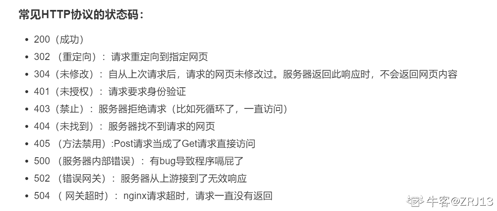
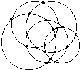

# 快手 2019 年春季校园招聘笔试试题--工程 B 试卷

## 1

```cpp
Unix 系统中，关于 inode 描述错误的是?
```

正确答案: A   你的答案: 空 (错误)

```cpp
inode 和文件是一一对应的
```

```cpp
inode 能描述文件占用的块数
```

```cpp
inode 描述了文件大小和指向数据块的指针
```

```cpp
通过 inode 实现文件的逻辑结构和物理结构的转换
```

本题知识点

算法工程师 快手 算法工程师 快手 测试工程师 快手 Java 工程师 C++工程师 安卓工程师 iOS 工程师 运维工程师 前端工程师 算法工程师 PHP 工程师 测试工程师 快手 C++工程师 Java 工程师 快手 2019 算法工程师 快手 2019 测试工程师 快手 2019

讨论

[冲鸭 y](https://www.nowcoder.com/profile/597349084)

Unix/Linux 系统内部不使用文件名，而使用 inode 号码来识别文件。对于系统来说，文件名只是 inode 号码便于识别的别称或者绰号。表面上，用户通过文件名，打开文件。实际上，系统内部这个过程分成三步：首先，系统找到这个文件名对应的 inode 号码；其次，通过 inode 号码，获取 inode 信息；最后，根据 inode 信息，找到文件数据所在的 block，读出数据。一般情况下，文件名和 inode 号码是"一一对应"关系，每个 inode 号码对应一个文件名。但是，Unix/Linux 系统允许，多个文件名指向同一个 inode 号码。这意味着，可以用不同的文件名访问同样的内容；对文件内容进行修改，会影响到所有文件名；但是，删除一个文件名，不影响另一个文件名的访问。这种情况就被称为"硬链接"（hard link）。

编辑于 2019-04-25 18:32:18

* * *

[牛客 886236767 号](https://www.nowcoder.com/profile/886236767)

我的小

发表于 2021-01-05 10:20:36

* * *

[winrh](https://www.nowcoder.com/profile/194840764)

1\. 命令        软链接：ln -s 源文件 目标文件        硬链接：ln 源文件 目标文件 2\. 理解软链接可以理解成快捷方式。它和 windows 下的快捷方式的作用是一样的.  3\. 区别

        1.硬链接和原来的文件没有什么区别，而且共享一个 inode 号（文件在文件系统上的唯一标识）；而软链接不共享 inode，也可以说是个特殊的 inode，所以和原来的 inode 有区别。

        2.若原文件删除了，则该软连接则不可以访问，而硬连接则是可以的。

        3.由于符号链接的特性，导致其可以跨越磁盘分区，但硬链接不具备这个特性.4\. 参考[        https://www.ibm.com/developerworks/cn/linux/l-cn-hardandsymb-links/](https://www.ibm.com/developerworks/cn/linux/l-cn-hardandsymb-links/) 

编辑于 2019-10-07 14:55:34

* * *

## 2

```cpp
在一个具有 n 个结点的有序单链表中插入一个新结点并仍然保持有序的时间复杂度是
```

正确答案: B   你的答案: 空 (错误)

```cpp
O(1)
```

```cpp
O(n)
```

```cpp
O(n²)
```

```cpp
O(logn)
```

本题知识点

算法工程师 快手 算法工程师 快手 测试工程师 快手 Java 工程师 C++工程师 安卓工程师 iOS 工程师 运维工程师 前端工程师 算法工程师 PHP 工程师 测试工程师 快手 C++工程师 Java 工程师 快手 2019 算法工程师 快手 2019 测试工程师 快手 2019

讨论

[冲鸭 y](https://www.nowcoder.com/profile/597349084)

依次查找应插入位置 O(n)   插入节点 O(1)

发表于 2019-04-25 18:35:34

* * *

## 3

同一个 Linux 机器的多个进程的内核页表是相同的吗？

正确答案: A   你的答案: 空 (错误)

```cpp
相同
```

```cpp
不同
```

```cpp
有时相同有时不同
```

```cpp
不知道
```

本题知识点

算法工程师 快手 测试工程师 Java 工程师 C++工程师 安卓工程师 iOS 工程师 运维工程师 前端工程师 PHP 工程师 2019

讨论

[许桥](https://www.nowcoder.com/profile/154056214)

进程页表分为用户空间页表和内核空间页表，创建进程时，内核页表是固定的

发表于 2020-01-13 18:03:10

* * *

[哟，我喜欢](https://www.nowcoder.com/profile/8095403)

> [Linux 中内核页表是干嘛用的，为什么要有内核页表？](https://www.zhihu.com/question/27160992)

发表于 2019-08-23 21:57:24

* * *

## 4

以下哪种数据结构与其它三种类型不同？

正确答案: B   你的答案: 空 (错误)

```cpp
数组
```

```cpp
堆
```

```cpp
栈
```

```cpp
队列
```

本题知识点

算法工程师 快手 测试工程师 Java 工程师 C++工程师 安卓工程师 iOS 工程师 运维工程师 前端工程师 PHP 工程师 2019

讨论

[零葬](https://www.nowcoder.com/profile/75718849)

感觉也可以理解为能不能随机访问元素啊，只有数组能够随机访问吧，其他的好像都是限制性存取

发表于 2020-10-27 11:01:13

* * *

[乱世小魔女](https://www.nowcoder.com/profile/628942604)

线性结构：数组、链表、队列、栈

发表于 2019-08-09 09:45:40

* * *

[_ooops_](https://www.nowcoder.com/profile/756272361)

线性结构和非线性结构

发表于 2020-02-20 09:45:56

* * *

## 5

以下哪一种设计模式适合解决对象之间的依赖关系？

正确答案: D   你的答案: 空 (错误)

```cpp
工厂模式
```

```cpp
外观模式
```

```cpp
单例模式
```

```cpp
观察者模式
```

本题知识点

算法工程师 快手 测试工程师 Java 工程师 C++工程师 安卓工程师 iOS 工程师 运维工程师 前端工程师 PHP 工程师 2019

讨论

[haohaozi](https://www.nowcoder.com/profile/872269032)

D，观察者模式。观察者模式类似一种通知机制，当一个对象的状态发生改变，其他依赖它的对象都可以得到通知并更新。

发表于 2019-10-13 17:30:49

* * *

[winrh](https://www.nowcoder.com/profile/194840764)

观察者模式定义了对象间的一种一对多的依赖关系，以便当一个对象的状态发生改变时，所有依赖于它的对象都得到通知并自动刷新

发表于 2019-10-07 14:59:09

* * *

## 6

设计模式是为了解决什么问题出现的？

正确答案: D   你的答案: 空 (错误)

```cpp
编程算法
```

```cpp
类型定义
```

```cpp
缺陷追踪
```

```cpp
复用扩展
```

本题知识点

算法工程师 快手 测试工程师 Java 工程师 C++工程师 安卓工程师 iOS 工程师 运维工程师 前端工程师 PHP 工程师 2019

讨论

[十七 201909041307758](https://www.nowcoder.com/profile/905772303)

设计模式（Design pattern）是一套被反复使用、多数人知晓的、经过分类编目的、代码百设计经验的总结。使用设计模式是为了可重用代码、让代码更容易被度他人理解、保证代码可靠性。
设计模式最主要解决的问题是通过封装和隔离变化点来处理软件的各种变化问题。
隔离变化的好处在于，将问系统中经常变化的部分和稳定的部分隔离，有助于增加复用性，并降低系统耦合度。很多设计模答式的意图中都明显地版指出了其对问题的解决方案，学习设计模式的要点是发现其解决方案中封装的变化点。

编辑于 2020-04-25 14:09:47

* * *

## 7

程序开发出现代码复用需要时，根据设计模式原则应当优先考虑使用的思想是？

正确答案: B   你的答案: 空 (错误)

```cpp
创建
```

```cpp
组合
```

```cpp
继承
```

```cpp
封装
```

本题知识点

算法工程师 快手 测试工程师 Java 工程师 C++工程师 安卓工程师 iOS 工程师 运维工程师 前端工程师 PHP 工程师 2019

讨论

[冲鸭 y](https://www.nowcoder.com/profile/597349084)

高聚合  低耦合  优先用组合     三押 skr

发表于 2019-04-25 18:44:33

* * *

## 8

关于下列语句哪个答案是正确的 System.out.println(4|7); 

正确答案: D   你的答案: 空 (错误)

```cpp
4
```

```cpp
5
```

```cpp
6
```

```cpp
7
```

本题知识点

算法工程师 快手 测试工程师 Java 工程师 C++工程师 安卓工程师 iOS 工程师 运维工程师 前端工程师 PHP 工程师 2019

讨论

[夜，静思](https://www.nowcoder.com/profile/315577)

111 100 ——— 111

发表于 2019-09-12 19:00:25

* * *

[乱世小魔女](https://www.nowcoder.com/profile/628942604)

按位或

编辑于 2019-08-13 19:16:58

* * *

## 9

路由器工作在网络模型中的哪一层？

正确答案: C   你的答案: 空 (错误)

```cpp
数据链路层
```

```cpp
物理层
```

```cpp
网络层
```

```cpp
应用层
```

本题知识点

算法工程师 快手 测试工程师 Java 工程师 C++工程师 安卓工程师 iOS 工程师 运维工程师 前端工程师 PHP 工程师 2019

讨论

[冲鸭 y](https://www.nowcoder.com/profile/597349084)

1. 网络层：路由器、防火墙 2.数据链路层：网卡、网桥、交换机 3.物理层：中继器、集线器

2. 路由器工作在第三层而区别于工作在第二层的交换机，是因为交换机只能读取并修改帧的结构而无法理解第三层 IP 包的报文；路由器则不但具有第一、第二层的功能，也就是说它不但能读取并修改帧的内容，还可以修改 IP 包的报头并依据目的地址来进行路由，这是它区别于二层交换机的地方，所以才说路由器工作在第三层。

发表于 2019-04-25 18:46:17

* * *

## 10

与流水线最大吞吐率高低有关的是？

正确答案: C   你的答案: 空 (错误)

```cpp
各个子过程时间
```

```cpp
最快子过程时间
```

```cpp
最慢子过程时间
```

```cpp
最后子过程时间
```

本题知识点

算法工程师 快手 测试工程师 Java 工程师 C++工程师 安卓工程师 iOS 工程师 运维工程师 前端工程师 PHP 工程师 2019

## 11

程序员写程序所使用的地址是？

正确答案: C   你的答案: 空 (错误)

```cpp
有效地址
```

```cpp
物理地址
```

```cpp
逻辑地址
```

```cpp
主存地址
```

本题知识点

算法工程师 快手 测试工程师 Java 工程师 C++工程师 安卓工程师 iOS 工程师 运维工程师 前端工程师 PHP 工程师 2019

讨论

[D3mi](https://www.nowcoder.com/profile/103347557)

逻辑地址的概念：程序员编程时使用的地址。主存物理地址：程序在主存中的实际地址。

发表于 2021-09-26 21:18:21

* * *

## 12

在 1,2,3,......999 中，有（）个数各位乘积为 0

正确答案: C   你的答案: 空 (错误)

```cpp
100
```

```cpp
101
```

```cpp
180
```

```cpp
181
```

本题知识点

算法工程师 快手 测试工程师 Java 工程师 C++工程师 安卓工程师 iOS 工程师 运维工程师 前端工程师 PHP 工程师 2019

讨论

[一个响亮的名字娜](https://www.nowcoder.com/profile/321045153)

两位数中，有 9 个（10,20，，，90）；三位数中，三种情况：（百位数上肯定不是 0）一、只有十位数上是 0，就是 9×9=81 种；二、同理，只有个位数上是 0，有 81 种；三、十位和个位都是 0，有 9 种。一共 180 种。

发表于 2019-09-03 11:25:51

* * *

[Mr.LiRong](https://www.nowcoder.com/profile/65944734)

即至少有一位包含 0 一位数不可能二位数  有 9 个三位数 ：（1）百位取值 1~9，不能为 0   （2）十位 个位至少有一个为 0 最终 9x（1+9+9）+9=180

发表于 2019-09-16 15:19:30

* * *

## 13

关于二分查找，描述正确的是

正确答案: A   你的答案: 空 (错误)

```cpp
二分查找运用了分治法的思想
```

```cpp
只能用于数组
```

```cpp
最坏情况下时间复杂度是 O(N*logN)
```

```cpp
最坏情况下时间复杂度是 O(N²)
```

本题知识点

算法工程师 快手 测试工程师 Java 工程师 C++工程师 安卓工程师 iOS 工程师 运维工程师 前端工程师 PHP 工程师 2019

讨论

[Mr.LiRong](https://www.nowcoder.com/profile/65944734)

分治算法把问题分解成若干个子问题，把子问题逐个解决，再组合到一起形成大问题的答案。

发表于 2019-09-16 15:21:20

* * *

[一个响亮的名字娜](https://www.nowcoder.com/profile/321045153)

二分查找复杂度是 O(logn)

发表于 2019-09-03 11:27:52

* * *

## 14

浏览器访问某页面，HTTP 协议返回状态码为 403 时表示:()

正确答案: B   你的答案: 空 (错误)

```cpp
找不到该页面
```

```cpp
禁止访问
```

```cpp
内部服务器访问
```

```cpp
服务器繁忙
```

本题知识点

算法工程师 快手 算法工程师 快手 测试工程师 快手 Java 工程师 C++工程师 安卓工程师 iOS 工程师 运维工程师 前端工程师 算法工程师 PHP 工程师 测试工程师 快手 C++工程师 Java 工程师 快手 2019 算法工程师 快手 2019 测试工程师 快手 2019

讨论

[ZZZ13](https://www.nowcoder.com/profile/279001689)



发表于 2020-03-10 19:19:58

* * *

[夜，静思](https://www.nowcoder.com/profile/315577)

403 Forbidden(禁止) 400 Bad Request（坏请求) 500 Internal Server Error(内部服务器错误) 502 Bad Gateway（网关故障） 1xx(临时响应) 200(成功) 3xx (重定向) 404(未找到)服务器

发表于 2019-09-12 19:09:15

* * *

## 15

找出与众不同的一个

正确答案: C   你的答案: 空 (错误)

```cpp
广州
```

```cpp
杭州
```

```cpp
贵州
```

```cpp
福州
```

本题知识点

算法工程师 快手 测试工程师 Java 工程师 C++工程师 安卓工程师 iOS 工程师 运维工程师 前端工程师 PHP 工程师 2019

讨论

[等 offer 呀等 offer](https://www.nowcoder.com/profile/160959531)

贵州是省，其他几个是市。

发表于 2019-05-07 16:00:13

* * *

## 16

树最适合用来表示

正确答案: C   你的答案: 空 (错误)

```cpp
有序数据元素
```

```cpp
无序元素数据
```

```cpp
元素之间具有分支层次关系的数据
```

```cpp
元素之间无固定联系的数据
```

本题知识点

算法工程师 快手 算法工程师 快手 测试工程师 快手 Java 工程师 C++工程师 安卓工程师 iOS 工程师 运维工程师 前端工程师 算法工程师 PHP 工程师 测试工程师 快手 C++工程师 Java 工程师 快手 2019 算法工程师 快手 2019 测试工程师 快手 2019

## 17

哪种设计模式能够在不改变对象自身的基础上，在程序运行期间给对象动态的添加职责（方法或属性）?

正确答案: B   你的答案: 空 (错误)

```cpp
代理模式
```

```cpp
装饰器模式
```

```cpp
适配器模式
```

```cpp
策略模式
```

本题知识点

算法工程师 快手 测试工程师 Java 工程师 C++工程师 安卓工程师 iOS 工程师 运维工程师 前端工程师 PHP 工程师 2019

讨论

[winrh](https://www.nowcoder.com/profile/194840764)

给对象动态地增加职责的方式称为装饰者模式。 装饰者模式能够在不改变对象自身的基础上，在程序运行期间给对象动态地添加职责。跟继承相比，装饰者是一种更轻便灵活的做法，这是一种“即用即付”的方式。

发表于 2019-10-07 15:27:06

* * *

[haohaozi](https://www.nowcoder.com/profile/872269032)

B，装饰器模式。如果是 pyton 语言，其有方便的@符合实现的装饰器，用于不改变一个函数/类方法的代码，但能够在一个函数/类方法执行的时候，给这个函数/类方法加上一些其他的功能。

发表于 2019-10-13 17:32:05

* * *

## 18

用 0,1,2,3,4,5 组成一个 4 位数，要求这个 4 位数的每一位都不一样，请问能组成的奇数 4 位数有多少？

正确答案: A   你的答案: 空 (错误)

```cpp
144
```

```cpp
156
```

```cpp
192
```

```cpp
300
```

本题知识点

算法工程师 快手 测试工程师 Java 工程师 C++工程师 安卓工程师 iOS 工程师 运维工程师 前端工程师 PHP 工程师 2019

讨论

[软粉](https://www.nowcoder.com/profile/144934468)

个位 C31 前面 3 位共有 A53 种，其中首位为 0 的油 A42 故 C31*(A53-A42)

发表于 2019-09-10 11:09:48

* * *

[Mr.LiRong](https://www.nowcoder.com/profile/65944734)

四位数   两个条件：（1）千位不能为 0  （2）个位只能为 1 3 5 先填入个位，只能从 1 3 5 中选   C31 再填入千位 ，只能从  2,4,  （1,3,5）剩余的两个 选   C41 剩余四个数   填入十位 百位。A42 最终结果 C31 * C41 * A42=144 

发表于 2019-09-16 15:28:38

* * *

[一个响亮的名字娜](https://www.nowcoder.com/profile/321045153)

3 乘 4 乘 A4 2

发表于 2019-09-03 11:30:20

* * *

## 19

5 个元素，进栈次序为 1、2、3、4、5，以下出栈序列不正确的是()

正确答案: C   你的答案: 空 (错误)

```cpp
45321
```

```cpp
14532
```

```cpp
34125
```

```cpp
23154
```

本题知识点

算法工程师 快手 测试工程师 Java 工程师 C++工程师 安卓工程师 iOS 工程师 运维工程师 前端工程师 PHP 工程师 2019

讨论

[#^.^#](https://www.nowcoder.com/profile/535251823)

栈的特点是先进后出：对于 A 答案 45321，当 1234 都进栈了，然后 4 可以出栈，5 再进栈，再出栈，栈中还剩 123，先进后出，结果就是 321，最后为 45321，是对的对于答案 B14532,1 进栈再出栈，按顺序到了 2 3 4 进栈，4 再出栈，然后 5 进 5 出，最后 3 2 出，是对的对于答案 C34125,1 2 3 进栈，后 3 出栈，4 进 4 出，这时不可能 1 出栈，因为 1 先进栈，所以一定是在 2 出栈后才出去，所以错了

发表于 2019-10-12 21:10:35

* * *

[haohaozi](https://www.nowcoder.com/profile/872269032)

对于 C 来说，34125，最先出栈的是 3，那么按照 1 2 3 4 5 的入栈顺序 ， 3 出栈，那么 1 和 2 的出栈顺序一定是相反的，不可能是 1 2 的顺序

发表于 2019-10-13 17:26:00

* * *

## 20

以下对数据事务四大特性(ACID)的描述不完全正确的是？

正确答案: B   你的答案: 空 (错误)

```cpp
事务开始之前和事务结束以后，数据库的完整性没有被破坏
```

```cpp
事务处理结束后，对主从数据库的数据修改都彻底完成
```

```cpp
一个事务中所有操作要么全部成功，要么全部失败
```

```cpp
多个并发执行的事务相互隔离
```

本题知识点

算法工程师 快手 测试工程师 Java 工程师 C++工程师 安卓工程师 iOS 工程师 运维工程师 前端工程师 PHP 工程师 2019

讨论

[严猪头的小可爱](https://www.nowcoder.com/profile/226925305)

1.原子性（Atomicity）：说的是一个事物内所有操作共同组成一个原子包，要么全部成功，要么全部失败。这是最基本的特性，保证了因为一些其他因素导致数据库异常，或者宕机。2.一致性（consistency）：数据库事物的一致性就规定了事物提交前后，永远只可能存在事物提交前的状态和事物提交后的状态，从一个一致性的状态到另一个一致性状态，而不可能出现中间的过程态。也就是说事物的执行结果是量子化状态，而不是线性状态。3.隔离性（lsolation）：事物的隔离性，基于原子性和一致性，因为事物是原子化，量子化的，所以，事物可以有多个原子包的形式并发执行，但是，每个事物互不干扰。但是，由于多个事物可能操作同一个资源，不同的事物为了保证隔离性，会有很多锁方案。4.持久性（durability）：当一个事物提交之后，数据库状态永远的发生了改变，这个事物只要提交了，哪怕提交后宕机，他也确确实实的提交了，不会出现因为刚刚宕机了而让提交不生效，是要事物提交，他就像洗不掉的纹身，永远的固化了，除非你毁了硬盘。    

发表于 2019-09-23 14:32:52

* * *

[CUG16](https://www.nowcoder.com/profile/1202647)

B 应该是考虑到了数据库中修改视图的操作，这类操作没有彻底修改实际的数据，只是修改了视图（由若干个表导出的虚拟表）所定义的变换操作。这样，经过视图对应操作得到的数据会改变，但原来实际的数据没有被彻底改变。

发表于 2020-04-11 23:31:49

* * *

[小张同学呀](https://www.nowcoder.com/profile/794051518)

B 为什么错误？

发表于 2020-03-15 10:50:23

* * *

## 21

现有 1G 数据需要排序，计算资源只有 1G 内存可用，下列排序方法中最可能出现性能问题的是？

正确答案: C   你的答案: 空 (错误)

```cpp
堆排序
```

```cpp
插入排序
```

```cpp
归并排序
```

```cpp
快速排序
```

```cpp
冒泡排序
```

本题知识点

算法工程师 快手 算法工程师 快手 测试工程师 快手 Java 工程师 C++工程师 安卓工程师 iOS 工程师 运维工程师 前端工程师 算法工程师 PHP 工程师 测试工程师 快手 C++工程师 Java 工程师 快手 2019 算法工程师 快手 2019 测试工程师 快手 2019

讨论

[贤鱼 y](https://www.nowcoder.com/profile/698113094)

堆排序 O1 插入排序 O1 归并排序 On 快速排序 Ologn 冒泡排序 O1

发表于 2020-03-02 15:06:28

* * *

[#^.^#](https://www.nowcoder.com/profile/535251823)

空间复杂度：A O(1)      C O(n)   D O(log[2] ^n)  E O(1)B 选项的空间复杂度好像是跟 A 一样的吧

发表于 2019-10-13 09:00:15

* * *

[JQlemonTree](https://www.nowcoder.com/profile/800793)

O（n）的辅助空间

空间复杂度

发表于 2019-05-22 21:15:01

* * *

## 22

ping 程序发出的是什么报文?

正确答案: C   你的答案: 空 (错误)

```cpp
UDP 请求报文
```

```cpp
TCP 请求报文
```

```cpp
ICMP 请求报文
```

```cpp
ICMP 应答报文
```

本题知识点

算法工程师 快手 测试工程师 Java 工程师 C++工程师 安卓工程师 iOS 工程师 运维工程师 前端工程师 PHP 工程师 2019

讨论

[贤鱼 y](https://www.nowcoder.com/profile/698113094)

ICMP 协议是一个网络层协议。
一个新搭建好的网络，往往需要先进行一个简单的测试，来验证网络是否畅通；但是 IP 协议并不提供可靠传输。如果丢包了，IP 协议并不能通知传输层是否丢包以及丢包的原因。
所以我们就需要一种协议来完成这样的功能–ICMP 协议。

ICMP 协议的功能
ICMP 协议的功能主要有：
1\. 确认 IP 包是否成功到达目标地址
————————————————
版权声明：本文为 CSDN 博主「honeyRJ」的原创文章，遵循 CC 4.0 BY-SA 版权协议，转载请附上原文出处链接及本声明。
原文链接：[`blog.csdn.net/baidu_37964071/article/details/80514340`](https://blog.csdn.net/baidu_37964071/article/details/80514340)

发表于 2020-03-02 15:14:30

* * *

[haohaozi](https://www.nowcoder.com/profile/872269032)

是 C。ping 程序发出 ICMP 请求报文，即 ICMP request 报文，会得到 ICMP echo 回应报文，这是网络层的协议。

发表于 2019-10-13 17:29:35

* * *

[winrh](https://www.nowcoder.com/profile/194840764)

程序发送的是 ICMP 请求报文路由发回 ICMP 应答报文，并被程序接收

发表于 2019-10-07 15:29:33

* * *

## 23

五个半径不同的圆的交点最多有几个？

正确答案: D   你的答案: 空 (错误)

```cpp
14
```

```cpp
16
```

```cpp
18
```

```cpp
20
```

本题知识点

算法工程师 快手 测试工程师 Java 工程师 C++工程师 安卓工程师 iOS 工程师 运维工程师 前端工程师 PHP 工程师 2019

讨论

[captain20180408164495](https://www.nowcoder.com/profile/2776708)

画 2 个圆，最多有 2 个交点，可以写成 2×（2-1）个交点；
画 3 个圆，最多有 6 个圆，可以写成 3×（3-1）个交点；
画 4 个大小不同的圆，最多有 12 个交点，可以写成是 4×（4-1）个交点；…
所以画 n 个圆时，最多有 n（n-1）个交点，
当 n=5 时，交点最多有：5×（5-1）=20（个），如图；
答：画 7 个大小不同的圆，最多有 20 个交点．
故答案为：20．

发表于 2019-09-02 21:04:30

* * *

[ZZZ13](https://www.nowcoder.com/profile/279001689)

两个圆最多有 2 个交点，五个圆两两相交，交点个数=2*C(5,2)=20

发表于 2020-03-10 19:34:44

* * *

[软粉](https://www.nowcoder.com/profile/144934468)

每个圆最多和其他圆有两个交点第一个圆和其余四个圆有 2*4 个交点再乘以 5 就是所有圆互相的交点  2*4*5 但是这里算重复了一次，所以再除以 22*4*5/2=20

发表于 2019-09-10 11:18:03

* * *

## 24

下列哪种排序算法是稳定排序？

正确答案: D   你的答案: 空 (错误)

```cpp
快速排序
```

```cpp
选择排序
```

```cpp
希尔排序
```

```cpp
归并排序
```

本题知识点

算法工程师 快手 算法工程师 快手 测试工程师 快手 Java 工程师 C++工程师 安卓工程师 iOS 工程师 运维工程师 前端工程师 算法工程师 PHP 工程师 测试工程师 快手 C++工程师 Java 工程师 快手 2019 算法工程师 快手 2019 测试工程师 快手 2019

讨论

[乱世小魔女](https://www.nowcoder.com/profile/628942604)

稳定：插入、冒泡、归并

发表于 2019-08-09 10:58:07

* * *

## 25

以下不是使用 TCP 的应用层协议是？

正确答案: B   你的答案: 空 (错误)

```cpp
HTTP
```

```cpp
DHCP
```

```cpp
SMTP
```

```cpp
FTP
```

本题知识点

算法工程师 快手 测试工程师 Java 工程师 C++工程师 安卓工程师 iOS 工程师 运维工程师 前端工程师 PHP 工程师 2019

讨论

[haohaozi](https://www.nowcoder.com/profile/872269032)

DHCP 是分配网络地址的协议，是工作在网络层的。

发表于 2019-10-13 17:33:16

* * *

[winrh](https://www.nowcoder.com/profile/194840764)

TCP/IP 参考模型在网络层定义了 IP 协议；在传输层定义了 TCP 和 UDP 协议；在应用层定义了 TELNET 协议、FTP 协议、SMTP 协议、RIP 协议、NFS 协议、HTTP 协议。

发表于 2019-10-07 15:37:29

* * *

## 26

已知二叉树的高度为根节点到最远叶子节点的路径上边的个数。高度为 4 的二叉平衡树，节点个数最少为？

正确答案: B   你的答案: 空 (错误)

```cpp
11
```

```cpp
12
```

```cpp
13
```

```cpp
14
```

本题知识点

算法工程师 快手 测试工程师 Java 工程师 C++工程师 安卓工程师 iOS 工程师 运维工程师 前端工程师 PHP 工程师 2019

讨论

[winrh](https://www.nowcoder.com/profile/194840764)

按照 f(n) = f(n-1) + f(n-2) +1,(n>=3)，不应该是 7？f(1) = 1f(2) = 2f(3) = 2 + 1 + 1 = 4f(4) = 4 + 2 + 1 = 7 画图就是：
O
/     \
O     O
/    \    \
O     O    O
/O

编辑于 2019-10-20 09:46:11

* * *

[哟，我喜欢](https://www.nowcoder.com/profile/8095403)

```cpp
data[i] = data[i-1] + data[i-2] + 1
```

发表于 2019-08-23 22:06:46

* * *

[贤鱼 y](https://www.nowcoder.com/profile/698113094)

平衡二叉树定义 左、右子树高度差不大于 1

发表于 2020-03-02 15:38:17

* * *

## 27

以下不属于 Linux 操作系统或者体系结构 cache 组件的是？

正确答案: D   你的答案: 空 (错误)

```cpp
TLB
```

```cpp
一级缓存
```

```cpp
二级缓存
```

```cpp
MMU
```

本题知识点

算法工程师 快手 测试工程师 Java 工程师 C++工程师 安卓工程师 iOS 工程师 运维工程师 前端工程师 PHP 工程师 2019

讨论

[许桥](https://www.nowcoder.com/profile/154056214)

MMU 是一个或一组芯片组成，一般存在与协处理器中，其功能是把虚拟地址映射为物理地址，不属于 OS 级 cache

发表于 2020-01-14 10:25:20

* * *

[贤鱼 y](https://www.nowcoder.com/profile/698113094)

A.TLB-转译后备缓冲器，也被翻译为页表缓存、转址旁路缓存，为 CPU 的一种缓存，由存储器管理单元用于改进虚拟地址到物理地址的转译速度。当前所有的桌面型及服务器型处理器（如 x86）皆使用 TLB。TLB 具有固定数目的空间槽，用于存放将虚拟地址映射至物理地址的标签页表条目。D.MMU 是 Memory Management Unit 的缩写，中文名是[内存管理](https://baike.baidu.com/item/%E5%86%85%E5%AD%98%E7%AE%A1%E7%90%86)单元，有时称作分页内存管理单元（英语：paged memory management unit，缩写为 PMMU）。它是一种负责处理[中央处理器](https://baike.baidu.com/item/%E4%B8%AD%E5%A4%AE%E5%A4%84%E7%90%86%E5%99%A8)（CPU）的[内存](https://baike.baidu.com/item/%E5%86%85%E5%AD%98)访问请求的[计算机硬件](https://baike.baidu.com/item/%E8%AE%A1%E7%AE%97%E6%9C%BA%E7%A1%AC%E4%BB%B6)。它的功能包括[虚拟地址](https://baike.baidu.com/item/%E8%99%9A%E6%8B%9F%E5%9C%B0%E5%9D%80)到[物理地址](https://baike.baidu.com/item/%E7%89%A9%E7%90%86%E5%9C%B0%E5%9D%80)的转换（即[虚拟内存](https://baike.baidu.com/item/%E8%99%9A%E6%8B%9F%E5%86%85%E5%AD%98)管理）、内存保护、中央处理器[高速缓存](https://baike.baidu.com/item/%E9%AB%98%E9%80%9F%E7%BC%93%E5%AD%98)的控制，在较为简单的计算机体系结构中，负责[总线](https://baike.baidu.com/item/%E6%80%BB%E7%BA%BF)的[仲裁](https://baike.baidu.com/item/%E4%BB%B2%E8%A3%81)以及存储体切换（bank switching，尤其是在 8 位的系统上）。

发表于 2020-03-02 15:55:06

* * *

[coco2009](https://www.nowcoder.com/profile/725048497)

应该是 D

发表于 2020-01-14 15:13:51

* * *

## 28

下列关于 M 阶 B+树的说法，哪一句是对的？

正确答案: C   你的答案: 空 (错误)

```cpp
根结点的孩子数为[2, M]
```

```cpp
不是所有的叶结点都有同样的深度
```

```cpp
叶子结点和非叶子结点中存的有一些键值是一样的
```

```cpp
所有非叶子结点的孩子数目为[M/2, M]，向上取整
```

本题知识点

算法工程师 快手 测试工程师 Java 工程师 C++工程师 安卓工程师 iOS 工程师 运维工程师 前端工程师 PHP 工程师 2019

讨论

[offer+c++](https://www.nowcoder.com/profile/1335901)

A，根节点还可能是叶子节点。 D，应该是向下取整。 BC 很明显。

发表于 2019-08-25 08:31:17

* * *

## 29

以下哪种算法只能用递归来实现？

正确答案: D   你的答案: 空 (错误)

```cpp
汉诺塔
```

```cpp
斐波那契数列
```

```cpp
快速排序
```

```cpp
其他选项都不对
```

本题知识点

算法工程师 快手 测试工程师 Java 工程师 C++工程师 安卓工程师 iOS 工程师 运维工程师 前端工程师 PHP 工程师 2019

讨论

[winrh](https://www.nowcoder.com/profile/194840764)

**所有递归都可以用非递归的方式实现**。
至于是不是循环，则方式各异。
递归的本质是压栈，**循环中加上栈操作，其实和递归没有本质区别**。
而且，递归问题用非递归的方式去解，并不会从本质上降低问题层次的深度。
写的不好一样会有溢出的问题。附链接：[`blog.csdn.net/weixin_34327761/article/details/92473036`](https://blog.csdn.net/weixin_34327761/article/details/92473036)

发表于 2019-10-07 16:25:51

* * *

[haohaozi](https://www.nowcoder.com/profile/872269032)

所有的递归，都可以用栈来实现，因为递归程序的内部，是开辟函数栈来实现的。也就是，所有的递归程序，都可以转成非递归的实现。

发表于 2019-10-13 17:28:18

* * *

## 30

有瓶啤酒,两个人掷筛子,先掷到 6 者可喝掉啤酒，请问先掷者喝到啤酒的概率是多少？

正确答案: D   你的答案: 空 (错误)

```cpp
1/2
```

```cpp
3/5
```

```cpp
4/9
```

```cpp
6/11
```

本题知识点

算法工程师 快手 测试工程师 Java 工程师 C++工程师 安卓工程师 iOS 工程师 运维工程师 前端工程师 PHP 工程师 2019

讨论

[hezxin](https://www.nowcoder.com/profile/947986931)

结果分甲赢和乙赢。甲赢：甲 6，乙 1~6（6 种情况）乙赢：甲 1~5，乙 6（5 种情况）比值 6:5，即甲 6/11 获胜

发表于 2019-09-16 16:01:47

* * *

[米米糊糊](https://www.nowcoder.com/profile/948075600)

获胜时，掷的点数是 6，因此掷到 6 的概率为 1/6，没有掷到 6 的概率为 5/6。
甲获胜时，掷的次数为奇数次，因此甲获胜的概率是：
P=1/6+(5/6)2∗(1/6)+(5/6)4∗(1/6)+⋯=(1/6)[1+(5/6)2+(5/6)4+…]=(1/6)∗1/[1−(5/6)2]=6/11ＰＳ：1/6 是第一次就胜利的概率，(5/6)2∗(1/6)是第三次才胜利的概率，(5/6)4∗(1/6)是第五次才胜利的概率，以此类推

编辑于 2019-09-05 12:27:54

* * *

[Mr.LiRong](https://www.nowcoder.com/profile/65944734)

补充 计算 1+(5/6)2+(5/6)4+…等比数列求和    当-1<q<1 时，当 n 趋近无穷大时 为 a1/(1-q)    a1=1   q=(5/6)2 

发表于 2019-09-16 15:45:19

* * *

## 31

某个 32 位浮点数，符号位 1 位，指数位 8 位，尾数部分 23 位，问该浮点数最大能表述的正数是多少？

正确答案: C   你的答案: 空 (错误)

```cpp
2⁸ - 2^(-23)
```

```cpp
(1-2^(-23)) * 2¹²⁷
```

```cpp
(2-2^(-23)) * 2¹²⁷
```

```cpp
(1-2^(-23)) * 2²⁵⁵
```

本题知识点

算法工程师 快手 测试工程师 Java 工程师 C++工程师 安卓工程师 iOS 工程师 运维工程师 前端工程师 PHP 工程师 2019

讨论

[哟，我喜欢](https://www.nowcoder.com/profile/8095403)

我记得指数位全 0 和全 1 是表示上下溢出，有效的就 1～254，然后减去偏移量 127，也就是说阶数范围是-126～127。PS: 指数位全 0（也就是价数为-127），此时 2 的-127 次方就太小太小了，所以肯定有对精度有个界限，突破这个界限的数统统把指数位标 0, 这与 int 的溢出有点不同）尾数除了 23 位外还有个隐藏位，最大值就是 1.11111...(第一个 1 是隐藏位，后面有个小数点，然后是 23 个 1)

编辑于 2019-08-23 22:55:45

* * *

## 32

float 类型的变量 a = 0.5，以下 float 变量可以认为和 a 相当的是？

正确答案: B   你的答案: 空 (错误)

```cpp
b = 1/2
```

```cpp
b = 1 - 0.5
```

```cpp
b = 1 - 1/2
```

```cpp
其他三个选项都不是
```

本题知识点

算法工程师 快手 测试工程师 Java 工程师 C++工程师 安卓工程师 iOS 工程师 运维工程师 前端工程师 PHP 工程师 2019 C++

讨论

[MonoKelvin](https://www.nowcoder.com/profile/946777261)

B 选项的 0.5 在 C++中默认为 double 类型，所以 b 不是 double 类型吗？如果是只看值相等的话就选 B 了

发表于 2020-04-11 13:58:48

* * *

[牛客 781393260 号](https://www.nowcoder.com/profile/781393260)

1/2==01.0/2==1/2.0==1.0/2.0==0.5

发表于 2021-02-24 10:18:29

* * *

## 33

一棵二叉搜索树的前序遍历序列为：30, 20, 10, 15, 25, 23, 39, 35, 42，下列哪项对应此二叉搜索树的后序遍历序列？

正确答案: D   你的答案: 空 (错误)

```cpp
10, 20, 15, 23, 25, 35, 42, 39, 30
```

```cpp
15, 10, 25, 23, 20, 42, 35, 39, 30
```

```cpp
15, 20, 10, 23, 25, 42, 35, 39, 30
```

```cpp
15, 10, 23, 25, 20, 35, 42, 39, 30
```

本题知识点

算法工程师 快手 测试工程师 Java 工程师 C++工程师 安卓工程师 iOS 工程师 运维工程师 前端工程师 PHP 工程师 2019

讨论

[Joy-spec](https://www.nowcoder.com/profile/138597076)

根据先序遍历的定义，30 是根结点。根据排序树的定义，20，10，15，25，23 位于左子树。39，35，42 位于右子树。同理，左子树根节点为 20，根据排序树的要求，10，15 位于左子树的左子树，25，23 位于左子树的右子树。递归推理就行了。

发表于 2019-09-23 21:16:15

* * *

[严猪头的小可爱](https://www.nowcoder.com/profile/226925305)

二叉查找树(Binary Search Tree)，(又:[二叉搜索树](https://baike.so.com/doc/6672991-6886834.html)，二叉排序树)它或者是一棵空树，或者是具有下列性质的[二叉树](https://baike.so.com/doc/4343861-4548914.html): 若它的左子树不空，则左子树上所有结点的值均小于它的根结点的值; 若它的右子树不空，则右子树上所有结点的值均大于它的根结点的值; 它的左、右子树也分别为[二叉排序树](https://baike.so.com/doc/6672986-6886829.html)。

发表于 2019-09-23 14:51:08

* * *

## 34

下列哪种策略不适合用于防止打印机、磁带机等资源的死锁发生？

正确答案: C   你的答案: 空 (错误)

```cpp
进程在申请新资源之前，总是先释放已有的所有资源
```

```cpp
给所有资源编号，进程必须按编号递增顺序申请新资源
```

```cpp
在进程申请新资源得不到满足时，强制剥夺其已有的资源
```

```cpp
要求进程在开始运行前必须申请到所有所需的资源
```

本题知识点

算法工程师 快手 测试工程师 Java 工程师 C++工程师 安卓工程师 iOS 工程师 运维工程师 前端工程师 PHP 工程师 2019

讨论

[白桃汁](https://www.nowcoder.com/profile/306762136)

C 这种方法常用于状态易于保存和恢复的资源，一般不能用于打印机之类的资源。

发表于 2020-04-25 21:26:24

* * *

## 35

下列关于多态性的描述，错误的是?

正确答案: C   你的答案: 空 (错误)

```cpp
C++语言的多态性分为编译时的多态性和运行时的多态性
```

```cpp
编译时的多态性可通过函数重载实现
```

```cpp
运行时的多态性可通过模板和虚函数实现
```

```cpp
实现运行时多态性的机制称为动态绑定
```

本题知识点

算法工程师 快手 算法工程师 快手 测试工程师 快手 Java 工程师 C++工程师 安卓工程师 iOS 工程师 运维工程师 前端工程师 算法工程师 PHP 工程师 测试工程师 快手 C++工程师 Java 工程师 快手 2019 算法工程师 快手 2019 测试工程师 快手 2019

讨论

[winrh](https://www.nowcoder.com/profile/194840764)

多态分为编译时多态和运行时多态；编译时多态为重载和模板，运行时多态是通过虚函数实现的。

发表于 2019-10-07 17:04:53

* * *

## 36

下面的代码是 public void func(Tree root) {
    func(root.left());
    func(root.right());
    System.out.println(root.data());
}

正确答案: C   你的答案: 空 (错误)

```cpp
前序遍历
```

```cpp
中序遍历
```

```cpp
后序遍历
```

```cpp
广度遍历
```

本题知识点

算法工程师 快手 测试工程师 Java 工程师 C++工程师 安卓工程师 iOS 工程师 运维工程师 前端工程师 PHP 工程师 2019

## 37

增加一个元素到堆中的复杂度为?

正确答案: C   你的答案: 空 (错误)

```cpp
O(log n)
```

```cpp
O(h)
```

```cpp
O(log n) 以及 O(h)  都对
```

```cpp
其他选项都不对
```

本题知识点

算法工程师 快手 测试工程师 Java 工程师 C++工程师 安卓工程师 iOS 工程师 运维工程师 前端工程师 PHP 工程师 2019

## 38

以下哪个是传输层协议？

正确答案: C   你的答案: 空 (错误)

```cpp
ICMP
```

```cpp
IP
```

```cpp
UDP
```

```cpp
ARP
```

本题知识点

算法工程师 快手 算法工程师 快手 测试工程师 快手 Java 工程师 C++工程师 安卓工程师 iOS 工程师 运维工程师 前端工程师 算法工程师 PHP 工程师 测试工程师 快手 C++工程师 Java 工程师 快手 2019 算法工程师 快手 2019 测试工程师 快手 2019

## 39

连续 3 次抛一个均匀的硬币，既有正面又有反面的概率是多少？

正确答案: C   你的答案: 空 (错误)

```cpp
1/8
```

```cpp
1/4
```

```cpp
3/4
```

```cpp
3/8
```

本题知识点

算法工程师 快手 测试工程师 Java 工程师 C++工程师 安卓工程师 iOS 工程师 运维工程师 前端工程师 PHP 工程师 2019

讨论

[软粉](https://www.nowcoder.com/profile/144934468)

1-正正正-反反反=1-1/8-1/8=3/4

发表于 2019-09-10 11:20:38

* * *

[我要 offerrr](https://www.nowcoder.com/profile/456719572)

三次全为反面：1/2*1/2*1/2 三次全为正面：1/2*1/2*1/2 即有正又有反：1-全反-全正=3/4

发表于 2020-04-12 21:28:06

* * *

[Mr.LiRong](https://www.nowcoder.com/profile/65944734)

三次抛硬币无关三次里随机挑一次为正  C31*（1/2）两次里随机挑一次为负  C21*（1/2）剩余的一次  随便 C11*（1/2）结果 C31*（1/2）*C21*（1/2） *C11*（1/2）=3/4

发表于 2019-09-16 16:04:00

* * *

## 40

内部异常（内中断）可分为故障（fault） 、陷阱（trap）和终止（abort）三类。下列有关内部异常的叙述中，错误的是 。

正确答案: D   你的答案: 空 (错误)

```cpp
内部异常的产生与当前执行指令相关
```

```cpp
内部异常的检测由 CPU 内部逻辑实现
```

```cpp
内部异常的响应发生在指令执行过程中
```

```cpp
内部异常处理后返回到发生异常的指令继续执行
```

本题知识点

算法工程师 快手 测试工程师 Java 工程师 C++工程师 安卓工程师 iOS 工程师 运维工程师 前端工程师 PHP 工程师 2019

讨论

[猫儿抓](https://www.nowcoder.com/profile/65135905)

(来自 王道论坛) 解析： 内中断是指来自 CPU 和内存内部产生的中断，包括程序运算引起的各种错误，如地址非法、校验错、页面失效、非法指令、用户程序执行特权指令自行中断（INT）和除数为零等，以上都在指令的执行过程中产生的，故 A 正确。这种检测异常的工作肯定是由 CPU（包括控制器和运算器）实现的，故 B 正确。内中断不能被屏蔽，一旦出现应立即处理，C 正确。对于 D，考虑到特殊情况，如除数为零和自行中断（INT）都会自动跳过中断指令，所以不会返回到发生异常的指令继续执行，故错误

发表于 2019-12-03 14:25:36

* * *

## 41

给定两个-100 到 100 的整数 x 和 y,对 x 只能进行加 1，减 1，乘 2 操作，问最少对 x 进行几次操作能得到 y？例如：
a=3,b=11: 可以通过 3*2*2-1，3 次操作得到 11；
a=5,b=8：可以通过(5-1)*2，2 次操作得到 8；

本题知识点

Java 工程师 C++工程师 iOS 工程师 安卓工程师 运维工程师 前端工程师 算法工程师 PHP 工程师 测试工程师 快手 队列 *2019* *讨论

[freezerhan](https://www.nowcoder.com/profile/240603607)

```cpp
#include <bits/stdc++.h>

using namespace std;

map<int,int> dp;

int Min(int x, int y, int z, int k) {
	return min(min(x, k), min(y, z));
}

int main() {
	int x, y;
	scanf("%d,%d", &x, &y);
	for (int i = -400 ; i <= 400; i++) {
		dp[i] = 1000000;
	}
	dp[y] = 0;
	for (int i = 200; i >= -200; i--) {
		for (int j = 200; j >= -200; j--) {
			dp[j] = Min(dp[j - 1] + 1, dp[j + 1] + 1, dp[j * 2] + 1, dp[j]);
		}
	}
	cout << dp[x] << "\n";
	return 0;
}
```

发表于 2019-11-27 20:01:46

* * *

[零葬](https://www.nowcoder.com/profile/75718849)

深度优先遍历

```cpp
import java.util.Scanner;

public class Main {

    static Scanner sc = new Scanner(System.in);
    static String s[] = sc.next().split(",");
    static int x = Integer.valueOf(s[0]);
    static int y = Integer.valueOf(s[1]);
    static int upBound = Math.abs(x - y);          // 操作数最小值的上界

    public static void main(String[] args) {
        dfs(x, y, 0);
        System.out.println(upBound);
    }

    private static void dfs(int x, int y, int count) {
        // 如果到了操作数的上界，直接返回
        if (count == upBound)
            return;
        // 如果两数相等，直接返回
        if (x == y){
            upBound = count;
            return;
        }
        // 否则遍历三种操作
        dfs(x + 1, y, count + 1);
        dfs(x - 1, y, count + 1);
        dfs(x * 2, y, count + 1);
    }
}
```

发表于 2020-10-27 10:50:19

* * *

[nbgao](https://www.nowcoder.com/profile/211289)

```cpp
#include <bits/stdc++.h>
using namespace std;

int x,y;

void BFS(){
    map<int,bool> vis;
    queue<pair<int,int>> q;
    q.push({x,0});
    vis[x] = false;
    while(!q.empty()){
        pair<int,int> p = q.front();
        q.pop();
        int t = p.first, cnt = p.second;
        if(t==y){
            cout<<p.second<<endl;
            return;
        }
        if(vis.find(t+1)==vis.end()){
            q.push({t+1, cnt+1});
            vis[t+1] = true;
        }
        if(vis.find(t-1)==vis.end()){
            q.push({t-1, cnt+1});
            vis[t-1] = true;
        }
        if(vis.find(2*t)==vis.end()){
            q.push({2*t, cnt+1});
            vis[2*t] = true;
        }
    }
}

int main(){
    scanf("%d,%d", &x, &y);
    BFS();
    return 0;
}
```

发表于 2019-08-31 01:45:26

* * *

## 42

输入 n ，求 n！( n 的阶乘) 末尾的第一个非零数字。如 6! = 720，因此 6 的阶乘末尾的非零位是 2。数据范围： 

本题知识点

Java 工程师 C++工程师 iOS 工程师 安卓工程师 运维工程师 前端工程师 算法工程师 PHP 工程师 测试工程师 快手 数学 2019 基础数学

讨论

[奇异](https://www.nowcoder.com/profile/9348310)

1000 的阶乘

```cpp
402387260077093773543702433923003985719374864210714632543799910429938512398629020592044208486969404800479988610197196058631666872994808558901323829669944590997424504087073759918823627727188732519779505950995276120874975462497043601418278094646496291056393887437886487337119181045825783647849977012476632889835955735432513185323958463075557409114262417474349347553428646576611667797396668820291207379143853719588249808126867838374559731746136085379534524221586593201928090878297308431392844403281231558611036976801357304216168747609675871348312025478589320767169132448426236131412508780208000261683151027341827977704784635868170164365024153691398281264810213092761244896359928705114964975419909342221566832572080821333186116811553615836546984046708975602900950537616475847728421889679646244945160765353408198901385442487984959953319101723355556602139450399736280750137837615307127761926849034352625200015888535147331611702103968175921510907788019393178114194545257223865541461062892187960223838971476088506276862967146674697562911234082439208160153780889893964518263243671616762179168909779911903754031274622289988005195444414282012187361745992642956581746628302955570299024324153181617210465832036786906117260158783520751516284225540265170483304226143974286933061690897968482590125458327168226458066526769958652682272807075781391858178889652208164348344825993266043367660176999612831860788386150279465955131156552036093988180612138558600301435694527224206344631797460594682573103790084024432438465657245014402821885252470935190620929023136493273497565513958720559654228749774011413346962715422845862377387538230483865688976461927383814900140767310446640259899490222221765904339901886018566526485061799702356193897017860040811889729918311021171229845901641921068884387121855646124960798722908519296819372388642614839657382291123125024186649353143970137428531926649875337218940694281434118520158014123344828015051399694290153483077644569099073152433278288269864602789864321139083506217095002597389863554277196742822248757586765752344220207573630569498825087968928162753848863396909959826280956121450994871701244516461260379029309120889086942028510640182154399457156805941872748998094254742173582401063677404595741785160829230135358081840096996372524230560855903700624271243416909004153690105933983835777939410970027753472000000000000000000000000000000000000000000000000000000000000000000000000000000000000000000000000000000000000000000000000000000000000000000000000000000000000000000000000000000000000000000000000000000000000000000000000000000000000000000000000000000000

答案应该是 2，给的是 4.
```

发表于 2019-04-30 09:42:27

* * *

[好好学学编程吧。。。。](https://www.nowcoder.com/profile/383451104)

| a =int(input())b =1fori inrange(1,a+1):    b =b *ic =str(b)d =list(c)forj inrange(len(d)-1,-1,-1):    ifd[j]!='0':        print(d[j])        break |

*   我觉得我没错啊。。。。它说 1000！不对 应该输出是 4 可是 1000！尾号是 2 啊 过了 70%

发表于 2019-04-26 18:22:16

* * *

[freezerhan](https://www.nowcoder.com/profile/240603607)

```cpp
#include <bits/stdc++.h>

using namespace std;

int main() {
	int n, ret = 1;
	int foo = 0, bar = 0;
	cin >> n;
	if (n == 1000) {
		cout << 4 << endl;
		return 0;
	}
	for (int i = 2; i <= n; i++) {
		int jay = i;
		while (jay % 2 == 0) foo++, jay /= 2;
		while (jay % 5 == 0) bar++, jay /= 5;
	}
	foo = min(foo, bar);
	bar = foo;
	for (int i = 2; i <= n; i++) {
		int jay = i;
		while (foo > 0 && jay % 2 == 0) {
			jay /= 2;
			foo--;
		}
		while (bar > 0 && jay % 5 == 0) {
			jay /= 5;
			bar--;
		}
		ret *= jay;
		ret %= 10;
	}
	cout << ret << "\n";
	return 0;
}
```

发表于 2019-11-28 08:53:33

* * *

## 43

给定两个字符串，已知可以使用三种方式进行变换
1\. 插入一个字符
2\. 删除一个字符
3\. 更改一个字符
请设计一个算法，找到两个字符串之间的经历几次最小变换，可以字符串 1 转换成字符串 2 数据范围：输入字符串的长度满足 

本题知识点

Java 工程师 C++工程师 iOS 工程师 安卓工程师 运维工程师 前端工程师 算法工程师 PHP 工程师 测试工程师 快手 动态规划 字符串 *2019* *讨论

[Keson201909151410175](https://www.nowcoder.com/profile/676384912)

[`www.sohu.com/a/338910260_478315`](https://www.sohu.com/a/338910260_478315)贴一篇看到的好文,这篇文章对这道题讲解的很透彻

发表于 2020-03-12 22:32:26

* * *

[真的很想要一个 offer](https://www.nowcoder.com/profile/415226990)

```cpp
#include <iostream>
using namespace std;
int main(){

    string str1, str2;
    cin >> str1 >> str2;
    int row = str1.size() + 1, col = str2.size() + 1;
    int dp[row][col];
    for(int i = 0; i < row; ++i){
        dp[i][0] = i;
    }
    for(int i = 0; i < col; ++i){
        dp[0][i] = i;
    }
    for(int i = 1; i < row; ++i){
        for(int j = 1; j < col; ++j){
            if(str1[i - 1] == str2[j - 1]){
                dp[i][j] = dp[i - 1][j - 1];
            }else{
                dp[i][j] = dp[i - 1][j - 1] + 1;
            }
            dp[i][j] = min(dp[i][j], dp[i - 1][j]  + 1);
            dp[i][j] = min(dp[i][j], dp[i][j - 1] + 1);
        }
    }
    cout << dp[row - 1][col - 1] << endl;
    return 0;
}
```

发表于 2019-07-23 19:06:00

* * *

[卷积神经网络哦](https://www.nowcoder.com/profile/8684256)

经典的编辑距离  百度编辑距离即可 dp[x][y]表示截取字符串 s1 从下标 0 - x 的字串和截距字符串 s2 下标 0-y 的字串的编辑距离

```cpp
#include<bits/stdc++.h>
using namespace std;
const int maxn = 1e3 + 3;
int dp[maxn][maxn];

int main() {
    string a, b; cin>>a>>b;
	int row = a.length(), col = b.length();
	for(int i = 0; i <= row; i++) dp[i][0] = i; //初始化  空串和 a 的编辑距离
	for(int i = 0; i <= col; i++) dp[0][i] = i; //初始化  空串和 b 的编辑距离
    for(int i = 1; i <= row; i++)
        for(int j = 1; j <= col; j++) {
            if(a[i-1] == b[j-1]) dp[i][j] = dp[i-1][j-1]; //相等时的 dp 策略
            else {//不相等时的 dp 策略
                dp[i][j] = min(dp[i-1][j-1], min(dp[i][j-1], dp[i-1][j]))+1;
            }
        }
    cout<<dp[row][col]<<endl;
}
/*
hola
hello
*/
```

发表于 2019-12-26 15:12:40

* * ***