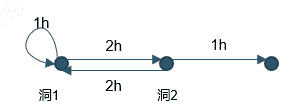

# 快手 2019 年春季校园招聘笔试试题--算法 B 试卷

## 1

关于 PCA，以下说法不正确的是？

正确答案: B   你的答案: 空 (错误)

```cpp
PCA 是无监督算法
```

```cpp
PCA 是一种非线性变换
```

```cpp
PCA 可用于降维
```

```cpp
PCA 变换等价于重建后的均方误差最小
```

本题知识点

算法工程师 快手 2019

讨论

[我要 offer 求你了](https://www.nowcoder.com/profile/496712975)

PCA 降维算法，肯定无监督，普通的 PCA 是线性变换，PCA 两种思想，最小重建误差， 最大方差，本质是一样的

发表于 2020-02-17 16:43:33

* * *

## 2

下面物体中反射率最高的物体是？

正确答案: B   你的答案: 空 (错误)

```cpp
玉米饼
```

```cpp
面巾纸
```

```cpp
满月
```

```cpp
玄色长袍
```

本题知识点

算法工程师 快手 2019

讨论

[朕蹲厕唱忐忑](https://www.nowcoder.com/profile/945749079)

可能因为面巾纸是白色，反射所有波长的光？我猜的

发表于 2019-04-25 22:30:36

* * *

## 3

以下方法中可以正确产生单位球面上的均匀分布采样点的是？注：以下用 U(a,b) 表示 [a, b] 上的均匀分布，G(a,b) 表示均值为 a，标准差为 b 的高斯分布

正确答案: A   你的答案: 空 (错误)

```cpp
取 ，然后进行归一化，使得 
```

```cpp
取 ，然后进行归一化，使得 
```

```cpp
取作为经纬度，计算出球面点坐标
```

```cpp
取作为经纬度，计算出球面点坐标
```

本题知识点

算法工程师 快手 2019

## 4

两人在玩一个拆数的游戏，开始局面由若干个数字组成，一次操作为任意选择某个数 A，把这个数替换成 B 和 C 两个数，满足 B < A, C < A, B^C = A(^表示异或运算)。 双方轮流操作，最后无法操作的人输掉游戏。如局面为 4 5，第一个人操作选择 5，拆为 1 和 4 (满足 1<5, 4<5, 1⁴=5)，操作后局面变为 4 1 4，第二个人输掉游戏，因为 1 和 4 都无法被拆。下面先手必胜的局面是：

正确答案: A   你的答案: 空 (错误)

```cpp
7 8 9
```

```cpp
5 7 9
```

```cpp
9 10 11
```

```cpp
666 666
```

本题知识点

算法工程师 快手 2019

讨论

[Disarray](https://www.nowcoder.com/profile/312316511)

转换为人话就是：数字 M 转换成二进制之后，分裂成两个数字 U 和 V，在二进制的每一位 M 只能把 1 给 U 或 V 的其中之一如果一个数字的二进制只包含 1 个 1，就不可再分了（注意，当你选择一个数字后，没选中的数字也会进入下一轮待选）答案 A：{1111000（没用）1001} =》A 选 9=》{1111000（没用）1000（没用）1（没用）}=》B 只能选 7=》{11/101/110100/10/1（没用）1000（没用）1000（没用）1（没用）}=>A 此时只需要把第一行的两个 1 分开，B 就没的分了。

发表于 2019-09-27 22:43:10

* * *

[qazwsxedcrfvtgb](https://www.nowcoder.com/profile/709753744)

应该选 B 吧，8 不能保证赢

发表于 2019-09-13 12:59:13

* * *

[Pluto201907241350990](https://www.nowcoder.com/profile/126324771)

不选 B？

发表于 2019-08-21 21:32:45

* * *

## 5

一个袋子里放着 4 个红球，6 个白球，现在随机从袋子里取两个球，取完之后发现这两个球的颜色相同，问这两个球是红色的概率是多少？

正确答案: B   你的答案: 空 (错误)

```cpp
20%
```

```cpp
28.6%
```

```cpp
31.5%
```

```cpp
50%
```

本题知识点

算法工程师 快手 2019

讨论

[朕蹲厕唱忐忑](https://www.nowcoder.com/profile/945749079)

A=两个球颜色相同，B 等于两个球都是红色。事件 AB 种类可以计算，A 有 C4 2+C6 2=21 种情况，B 有 C4 2=6 种情况，P（B|A）=6/21=28.6%

发表于 2019-04-25 22:44:20

* * *

## 6

设有 N 个物体的坐标 (x, y, z) 和速度 (vx, vy, vz)，求经过 dt 时间之后物体的新坐标，以下有两种方式（C++）：方法一：

```cpp
struct Object {
  float x, y, z;
  float vx, vy, vz;
};

Object obj[N];

for (int i = 0; i < N; i++) {
  obj[i].x += obj[i].vx * dt;
  obj[i].y += obj[i].vy * dt;
  obj[i].z += obj[i].vz * dt;
}

```

方法二：

```cpp
struct ObjectArray {
  float x[N], y[N], z[N];
  float vx[N], vy[N], vz[N];
};

ObjectArray obj_all;

for (int i = 0; i < N; i++) {
  obj_all.x[i] += obj_all.vx[i] * dt;
  obj_all.y[i] += obj_all.vy[i] * dt;
  obj_all.z[i] += obj_all.vz[i] * dt;
}
```

在最高级别的优化选项（-O3）下，两种方式运行速度相比（）

正确答案: B   你的答案: 空 (错误)

```cpp
方法一运行速度更快
```

```cpp
方法二运行速度更快
```

```cpp
两种方法速度差不多
```

本题知识点

算法工程师 快手 2019 C++

讨论

[路与舟](https://www.nowcoder.com/profile/981704079)

猜测的可能原因：

**（1）必要的假设：**

*1）使用索引对问数组的**一个**元素的**一次**访问过程用时 **m***

*2）根据结构体变量对其**一个**成员的**一次**访问过程用时 **n***

**（2）在代码 1 中，以 obj[i].x 为例分析：**

1）访问 obj[i].x 需要依次获得 obj、obj[i]、obj[i].x 的地址。

2）**obj**的地址在循环之初就可以确定了,而且在程序后续运行过程中直接重复使用即可。

3）在每更新一次 i 的时候，**obj[i]**的地址需要重新确定。根据 obj 访问 obj[i]用时 m

4）由于**obj[i].x**的地址与 obj[i]的地址间的偏移是固定的，所以在 obj[i]地址重新确定的时候，obj[i].x 的地址也需要根据 obj[i]重新确定。根据 obj[i]访问 obj[i].x 用时 n

5）访问一次 obj[i].x 用时(m+n)。**则整个循环用时 6N*(m+n).**

**（3）在代码 2 中，以 obj_all.x[i]为例分析：**

1）访问 obj_all.x[i]需要依次获得 obj_all、obj_all.x、obj_all.x[i]的地址。

2）**obj_all**的地址在循环之初就可以确定了,而且在程序后续运行过程中直接重复使用即可。

3）**obj_all.x**的地址与 obj_all 的地址的偏移是固定的，由于 obj_all 的地址固定，所以 obj_all.x 的地址固定。在循环中，obj_all.x 的地址只需要在循环之初获取一次即可，后边直接重复使用即可。根据 obj_all 访问获取 obj_all.x 的地址用时 n。

4）在每更新一次 i 的时候，**obj_all.x[i]**的地址需要重新确定。根据 obj_all.x 访问 obj.x[i]用时 m。

5)访问一次 obj_all.x[i]用时 m。**则整个循环用时（6N*m+6n）**

**（4）比较与结论**令 6N*(m+n)>=(6N*m+6n),(N,m,n 为正整数，m,n 为常数）

得：N>=1

即：**当 N>1 时，代码 2 比代码 1 高效，当 N 等于 1 时，代码 1 和代码 2 相当。也即，在效率方面，代码 2 不严格地比代码 1 更加高效，当且仅当 N 等于 1 时两者相当。**

编辑于 2022-01-06 01:32:39

* * *

[叫啥呢好](https://www.nowcoder.com/profile/880311825)

我的理解是构造 N 个对象，调用 N 次构造函数比较费劲吧。希望大佬能给出解析

发表于 2020-09-03 20:52:18

* * *

[oPluss](https://www.nowcoder.com/profile/265724362)

我觉得是从两个角度产生了效率提升：连续的内存访问增加了 cash 命中率，同时编译器更容易将此循环向量化

发表于 2020-10-23 09:40:29

* * *

## 7

当发生下列哪种情况时，进程从执行状态转变为就绪状态？

正确答案: B   你的答案: 空 (错误)

```cpp
进程被调度程序选中
```

```cpp
时间片到
```

```cpp
等待某一事件
```

```cpp
等待的事件发生
```

本题知识点

算法工程师 快手 算法工程师 快手 2019

讨论

[朕蹲厕唱忐忑](https://www.nowcoder.com/profile/945749079)

被调度程序选中以及等待某一事件，会从执行转入阻塞；等待事件发生后，会从阻塞转入就绪；

发表于 2019-04-25 22:49:06

* * *

## 8

采用邻接表存储的图的广度优先遍历算法类似于二叉树的

正确答案: D   你的答案: 空 (错误)

```cpp
先序遍历
```

```cpp
中序遍历
```

```cpp
后序遍历
```

```cpp
按层遍历
```

本题知识点

算法工程师 快手 算法工程师 快手 2019

讨论

[时文康](https://www.nowcoder.com/profile/101764790)

先序

发表于 2019-09-22 20:35:54

* * *

## 9

某卡牌游戏抽卡有 25% 的概率能抽中 SSR，同时还有连抽保底机制，4 连抽必中，也就是，如果连续 3 张都没有抽中，则下一张必定抽中。那么抽 100 次，能抽中 SSR 的次数大约是？

正确答案: B   你的答案: 空 (错误)

```cpp
接近 25 次
```

```cpp
接近 36 次
```

```cpp
接近 44 次
```

```cpp
接近 62 次
```

本题知识点

算法工程师 快手 2019

讨论

[朕蹲厕唱忐忑](https://www.nowcoder.com/profile/945749079)

1 次中 3 次不中会触发保底机制，保底机制会有 0.25*0.75³*（100-3）+1=11。正常抽有 0.25*100=25 次。一共 36 次

发表于 2019-04-26 23:09:47

* * *

[icloud001](https://www.nowcoder.com/profile/6959345)

```cpp
import random
def finden(n):
    res=0
    recent=[0,0,0]
    for i in range(n):
        tmp=random.randint(1,100)
        if tmp in range(1,26):
            res+=1
            recent[i%3]=1
        else:
            if i>2 and set(recent)=={0}:
                res+=1
    return res
```

发表于 2020-07-18 12:30:01

* * *

## 10

以下四种格式标准中，与其他三种格式标准类别不同的是？

正确答案: B   你的答案: 空 (错误)

```cpp
H.264/AVC
```

```cpp
WebM
```

```cpp
HEVC
```

```cpp
MPEG-2
```

本题知识点

算法工程师 快手 2019

## 11

以下几种图像采样格式中，在相同的尺寸下，数据量最小的是？

正确答案: A   你的答案: 空 (错误)

```cpp
YUV420
```

```cpp
YUV422
```

```cpp
YUV444
```

```cpp
RGB565
```

本题知识点

算法工程师 快手 2019

## 12

特征 X 经过神经网络前传得到 logits=[[1.0,2.0,3.0],[1.0,2.0,3.0],[1.0,2.0,3.0]]，标注 Y 的 soft embedding 为[[0.1,0.1,0.8],[0.1,0.8,0.1],[0.1,0.1,0.8]。请计算该 batch 以 softmax 为非线性变换的交叉熵损失为？

正确答案: A   你的答案: 空 (错误)

```cpp
2.82
```

```cpp
1.22
```

```cpp
3.40
```

```cpp
2.12
```

本题知识点

算法工程师 快手 2019

讨论

[零葬](https://www.nowcoder.com/profile/75718849)

将该 batch 每个样本的损失加起来，记得将 logits 带入到 softmax 函数的公式 sum(y*log(y_pred)) =2*(-0.1*log(e¹/(e¹+e²+e³))-0.1*log(e²/(e¹+e²+e³))-0.8*log(e³/(e¹+e²+e³))- 0.1*log(e¹/(e¹+e²+e³))-0.1*log(e²/(e¹+e²+e³))-0.8*log(e³/(e¹+e²+e³))= 2.82

编辑于 2020-11-08 21:16:34

* * *

## 13

下列关于 BP 反传算法描述**正确**的是？

正确答案: C   你的答案: 空 (错误)

```cpp
在使用 BP 算法训练时，数据是否打散对性能影响不大。
```

```cpp
使用 BP 算法训练时，在不发散的情况下，学习速率越小越好。
```

```cpp
随机学习通常比 batch 学习收敛更快。
```

```cpp
当使用 BP 算法时，输入数据的归一化对性能几乎没有影响。
```

本题知识点

算法工程师 快手 2019

## 14

下列关于 L1 和 L2 正则描述**错误**的是？

正确答案: D   你的答案: 空 (错误)

```cpp
L1 和 L2 正则的引入都能预防过拟合。
```

```cpp
L1 正则的引入会使得权重产生更多的 0 元素。
```

```cpp
L1 正则兼具特征选择的功能。
```

```cpp
L1 正则项是非凸的，L2 正则项是凸的。
```

本题知识点

算法工程师 快手 2019

讨论

[零葬](https://www.nowcoder.com/profile/75718849)

L1 也是凸的，只是不能像 L2 一样使用梯度下降优化

发表于 2020-10-27 22:13:59

* * *

## 15

以下四项指标中，最能全面衡量分类器性能的是？

正确答案: D   你的答案: 空 (错误)

```cpp
准确率（Accuracy）
```

```cpp
精确率（Precision）
```

```cpp
召回率（Recall）
```

```cpp
F 分数（F-score）
```

本题知识点

算法工程师 快手 2019

## 16

二进制下长度为 n 的格雷码定义为：1、序列由 2^n 个编码组成，每个编码都是长度为 n 的二进制位串。2、序列中无相同的编码。3、序列中位置相邻的两个编码恰有一位不同。比如三位的格雷码为：000 001 011 010 110 111 101 100。请问二进制整数 11010 在格雷码的第几位(00000 在第一位）。

正确答案: C   你的答案: 空 (错误)

```cpp
10
```

```cpp
18
```

```cpp
20
```

```cpp
23
```

本题知识点

算法工程师 快手 2019

讨论

[曲中](https://www.nowcoder.com/profile/487574677)

可以把码拆成两部分看，11,010 或者 110,10。110 的格雷码对应正常为 100，10 对应于 11，故对应的正常二进制为 10011。

发表于 2019-09-16 18:53:42

* * *

[牛客 936529695 号](https://www.nowcoder.com/profile/936529695)

末尾数字 1 电视 0 可能出现在 20 21 位

发表于 2019-07-16 16:05:21

* * *

## 17

一个 CNN 图像分类模型，有 1 层 maxpool （ kernel  2 x 2, stride 2)，3 层 conv （kenel 3 x 3, stride 2)，10 层 conv （kenel 3 x 3, stride 1)， 1 层 maxpool （ kernel  3 x 3, stride 1)， padding 方式都是 ”SAME“， 则最终的 feature map 的感受野多大

正确答案: A   你的答案: 空 (错误)

```cpp
16 * 16
```

```cpp
32 * 32
```

```cpp
8 * 8
```

```cpp
64 * 64
```

本题知识点

算法工程师 快手 2019

讨论

[宠主子的饲养员](https://www.nowcoder.com/profile/855405189)

奇怪了，咋算出来是 7*7。。。Padding 选择 same 的话是否是在 conv 层采用 padding 将图片补全为原来的 size？但是这样算出来也是 7*7 啊。。。

发表于 2020-04-11 17:07:53

* * *

[神级被菜虐](https://www.nowcoder.com/profile/113107937)

感觉是 2*3+1*10。。。

发表于 2020-03-21 14:49:18

* * *

[一か八か](https://www.nowcoder.com/profile/713237896)

为啥我算出来的结果都爆炸了。。尤其那 10 层 stride2 的卷积那里。。套什么公式都算不出来 16 绝了

发表于 2019-10-27 16:36:05

* * *

## 18

以下哪个算子结果跟 relu( sigmoid(x) ) 结果相等？

正确答案: D   你的答案: 空 (错误)

```cpp
relu( relu(x) )
```

```cpp
sigmoid( relu(x) )
```

```cpp
sigmoid( sigmoid(x) )
```

```cpp
relu( relu( sigmoid(x) ) )
```

本题知识点

算法工程师 快手 2019

## 19

整数 a 乘以 2，最快的计算逻辑是？

正确答案: C   你的答案: 空 (错误)

```cpp
a * 2
```

```cpp
a + a
```

```cpp
a << 1
```

```cpp
a / 0.5
```

本题知识点

算法工程师 快手 2019

讨论

[零葬](https://www.nowcoder.com/profile/75718849)

位运算最快

发表于 2020-10-27 22:14:39

* * *

## 20

以下关于矩阵的说法，正确的是？

正确答案: C   你的答案: 空 (错误)

```cpp
任意仿方阵均可相似于对角矩阵
```

```cpp
任意方阵均酉相似与上三角矩阵
```

```cpp
任意方阵均相似于上三角矩阵
```

```cpp
两方阵等价，则对应的诺尔当矩阵也等价
```

本题知识点

算法工程师 快手 2019

讨论

[清水 360](https://www.nowcoder.com/profile/728267315)

答案有错吧，应该选 B

发表于 2019-09-16 20:04:04

* * *

## 21

下面关于 logistic regression 的说法错误的是？

正确答案: A   你的答案: 空 (错误)

```cpp
LR 是非线性的
```

```cpp
L1 正则是拉普拉斯先验，而 L2 正则则是高斯先验
```

```cpp
LR 参数求解的优化方法有梯度下降法，随机梯度下降法，牛顿法等
```

```cpp
当逻辑回归类别扩展到多类别时，就是最大熵模型
```

本题知识点

算法工程师 快手 2019

## 22

已知二叉树前序遍历是 GDAFEMHZ，中序遍历是 ADEFGHMZ，请问后序遍历是?

正确答案: A   你的答案: 空 (错误)

```cpp
AEFDHZMG
```

```cpp
GEFDHZMA
```

```cpp
AEFDMZHG
```

```cpp
GEFDZHMA
```

本题知识点

算法工程师 快手 算法工程师 快手 2019

## 23

符号集 a 、 b 、 c 、 d ，它们相互独立，相应概率为 1/2 、 1/4 、 1/8/ 、 1/16 ，其中包含信息量最小的符号是

正确答案: A   你的答案: 空 (错误)

```cpp
a
```

```cpp
b
```

```cpp
c
```

```cpp
d
```

本题知识点

算法工程师 快手 算法工程师 快手 2019

讨论

[零葬](https://www.nowcoder.com/profile/75718849)

信息量=-log2(p)

发表于 2021-01-03 23:05:59

* * *

## 24

（假设 precision=TP/(TP+FP),recall=TP/(TP+FN)。）在二分类问题中，当测试集的正例和负例数量不均衡时，以下评价方案哪个是相对不合理的

正确答案: A   你的答案: 空 (错误)

```cpp
Accuracy:(TP+TN)/all
```

```cpp
F-value:2recallprecision/(recall+precision)
```

```cpp
G-mean:sqrt(precision*recall)
```

```cpp
AUC:曲线下面积
```

本题知识点

算法工程师 快手 算法工程师 快手 2019

## 25

kkt 是局部最优解的什么条件？

正确答案: B   你的答案: 空 (错误)

```cpp
一阶充分
```

```cpp
一阶必要
```

```cpp
二阶充分
```

```cpp
二阶必要
```

本题知识点

算法工程师 快手 2019

## 26

关于线性规划的算法复杂度 以下哪些是正确的？

正确答案: C   你的答案: 空 (错误)

```cpp
simplex 在多项式复杂度的时间内可以解决线性规划问题
```

```cpp
simplex 不是多项式复杂度，而且线性规划的问题不可以在多项式时间内求解
```

```cpp
线性规划的问题可以在多项式时间内求解，但是 simplex 不是多项式复杂度
```

```cpp
因为线性规划的可行域总是凸集，所以 simplex 算法才能在多项式时间复杂度内解决线性规划问题
```

本题知识点

职能 快手 算法工程师 财务 2019

## 27

你被困在一个山洞（洞穴 1）里，面前有两条路:

第一条路需要一个小时走完，但是会回到原地

第二条路需要 2 小时走完，会走到另一个洞穴（洞穴 2）

洞穴 2 有两条路可以走

第一条路需要走两个小时，会回到洞穴 1

第二条路需要走 1 个小时，会走出洞穴

已知你是路痴，选择每条路的概率都是相等的，并且不会因为走过这条路而记住它通向哪里

请问你走出洞穴的期望时间是？

正确答案: C   你的答案: 空 (错误)

```cpp
3
```

```cpp
6
```

```cpp
9
```

```cpp
12
```

本题知识点

算法工程师 快手 2019

讨论

[yrosa](https://www.nowcoder.com/profile/602803471)

设从洞 1 走出去的期望时间是 E1，从洞 2 出发走出去的期望时间是 E2。E1 = 1/2 * (1 + E1) + 1/2（2+E2)E2 = 1/2 * 1 + 1/2 * (2+E1)联立 2 式，求得 E1 = 9

发表于 2019-04-28 20:52:45

* * *

## 28

在一个长度为 1 的线段上任意取两点，求这两点的距离的期望

正确答案: B   你的答案: 空 (错误)

```cpp
1/2
```

```cpp
1/3
```

```cpp
1/6
```

```cpp
1/8
```

本题知识点

算法工程师 快手 2019

讨论

[哇哦天噜啦](https://www.nowcoder.com/profile/643116129)

设长度为 L， 取两点 x, y，那么概率服从均匀分布为： 
x, y 独立同分布，联合概率
距离期望为：
去掉绝对值，转化为 。答案为

发表于 2019-09-15 15:32:11

* * *

## 29

使用 Logistic Regression 模型对样本进行分类，分别得到训练样本的准确率和测试样本的准确率。如果在数据中增加一个新的特征，其它特征保持不变。然后重新训练测试。则下列说法正确的是？

正确答案: B   你的答案: 空 (错误)

```cpp
训练样本准确率一定会降低
```

```cpp
训练样本准确率一定增加或保持不变
```

```cpp
测试样本准确率一定会降低
```

```cpp
测试样本准确率一定增加或保持不变
```

本题知识点

算法工程师 快手 2019

## 30

有一苹果两个人抛硬币来决定谁吃这个苹果先抛到正面者吃。问先抛者吃到苹果的概率是多少？

正确答案: C   你的答案: 空 (错误)

```cpp
1/2
```

```cpp
3/4
```

```cpp
2/3
```

```cpp
1/4
```

本题知识点

算法工程师 快手 算法工程师 快手 2019

讨论

[newcomer](https://www.nowcoder.com/profile/291053)

这个题目是考察伯努利分布。先抛者先吃事件的样本点包括第一次抛到正面，第一次两人都是反面然后先抛者抛到正面，等等即将所有样本点都加和得到

编辑于 2019-05-22 17:25:41

* * *

## 31

下面关于二叉排序树的说法错误的是？

正确答案: C   你的答案: 空 (错误)

```cpp
二叉排序树的查找效率与二叉树的树形有关
```

```cpp
对二叉排序树进行中序遍历，必定得到节点关键字的有序序列
```

```cpp
在二叉排序树中，完全二叉树的查找效率最低
```

```cpp
二叉排序树的平均查找长度是 O(log2n)
```

本题知识点

算法工程师 快手 算法工程师 快手 2019

讨论

[零葬](https://www.nowcoder.com/profile/75718849)

效率最低的应该是完全退化为链表的单枝树

发表于 2020-12-17 16:21:00

* * *

## 32

一维 N 点快速傅立叶变换 FFT 的时间复杂度是多少？

正确答案: D   你的答案: 空 (错误)

```cpp
O(N)
```

```cpp
O(N*N)
```

```cpp
O(log(N))
```

```cpp
O(N*log(N))
```

本题知识点

算法工程师 快手 2019

## 33

有三个盒子，一个盒子里有钻石，其它两个什么都没有。你先选了一个盒子，放在你的书包里。你的朋友把另外两个放在他的书包里。然后他从书包里扔掉一个没有钻石的盒子。这时候问你，如果和他换书包的话:

正确答案: A   你的答案: 空 (错误)

```cpp
你得到钻石的概率大
```

```cpp
你得到钻石的概率小
```

```cpp
你得到钻石的概率不变
```

```cpp
概率大小不确定
```

本题知识点

算法工程师 快手 2019

讨论

[零葬](https://www.nowcoder.com/profile/75718849)

这是讲贝叶斯学派和频率学派的一个经典问题——三门问题[`blog.csdn.net/weixin_36200363/article/details/86631225?utm_medium=distribute.pc_relevant.none-task-blog-title-1&spm=1001.2101.3001.4242`](https://blog.csdn.net/weixin_36200363/article/details/86631225?utm_medium=distribute.pc_relevant.none-task-blog-title-1&spm=1001.2101.3001.4242)

发表于 2020-10-27 10:53:28

* * *

## 34

已知 X 病检测阳性的几率是未得 X 病时的 9 倍，若小明检测阳性，问其患 X 病的几率？假设人群中 X 病发病率为 5%

正确答案: C   你的答案: 空 (错误)

```cpp
0.28
```

```cpp
0.30
```

```cpp
0.32
```

```cpp
0.34
```

本题知识点

算法工程师 快手 2019

讨论

[太一 Ziko](https://www.nowcoder.com/profile/643213070)

检测为阳性：有没患病检测为阳性，患病检测为阳性两种情况未患病检测为阳性：95*A；患病检测为阳性：5*9A=45A 一至检测为阳性，则患病的几率为：45A/（95A+45A）=32.22%

发表于 2020-03-22 16:13:57

* * *

[WaterXMan](https://www.nowcoder.com/profile/530994502)

健康几率为 95%, 其中检测为阳性的几率设置为 A 患病几率为 5%, 其中被检测为阳性的几率为 9*A.真正患病的几率为 95%*A / (95%*A+5%*9*A) = 32%

发表于 2019-06-08 17:14:33

* * *

## 35

二维坐标系中，有两条线段，线段 A 为 0<=x<=5, y=0；线段 B 为 0<=x<=5, y=1；在线段 A 上随机点一个点 x，线段 B 上随机点一个点 y，点的位置在线段上服从均匀分布，分别以点 x、y 为圆心作单位圆，计算两个圆相交的概率

正确答案: A   你的答案: 空 (错误)

```cpp
57.28%
```

```cpp
64.16%
```

```cpp
72.42%
```

```cpp
75.14%
```

本题知识点

算法工程师 快手 2019

讨论

[consege](https://www.nowcoder.com/profile/9986906)

两个圆相交的充分必要条件是圆心距离小于 sqrt(3), 分成两种情况：1\. 当 x 在 sqrt(3) ～ 5-sqrt(3)之间时，此时 y 可以取值的范围大小为 2sqrt(3),因此这部分概率如下式第一部分所示 2\. 当 x<sqrt(3)或 x>5-sqrt(3)时，假设 x=i，则 y 可以取值的范围大小为 sqrt(3)+i ，此时相交的概率为, 求积分即可得概率，由于 x<sqrt(3)的情况和 x>5-sqrt(3)对称，所以该部分的概率如下式第二部分所示

发表于 2019-05-06 21:17:43

* * *

## 36

相对于 DNN 模型，CNN 模型做了哪些改变？

正确答案: A C   你的答案: 空 (错误)

```cpp
局部连接
```

```cpp
使用了 relu 激活函数
```

```cpp
参数共享
```

```cpp
增加了 batch normalization
```

本题知识点

算法工程师 快手 2019

## 37

哪些数据结构能够支持以下所有操作且最坏时间复杂度最低：

1.  插入一个元素
2.  查找特定元素
3.  删除特定元素

正确答案: C   你的答案: 空 (错误)

```cpp
std::vector
```

```cpp
std::list
```

```cpp
std::map
```

```cpp
std::unordered_map
```

本题知识点

算法工程师 快手 2019 C++

讨论

[牛客 4938kunn](https://www.nowcoder.com/profile/820995325)

map：底层是红黑树，不严格的平衡二叉树，能实现自动排序；
unordered_map：底层是有哈希表，可能会存在哈希冲突。

发表于 2021-07-20 08:58:29

* * *

[牛客 946479711 号](https://www.nowcoder.com/profile/946479711)

d 的最坏情况是 hash 冲突，复杂度 n

发表于 2021-02-11 14:58:13

* * *

[哎万万](https://www.nowcoder.com/profile/332026989)

求问为什么选 C 不选 D

发表于 2021-01-13 19:16:57

* * *

## 38

下列属于属于判别式模型的是？

正确答案: B D   你的答案: 空 (错误)

```cpp
HMM
```

```cpp
循环神经网络
```

```cpp
GMM
```

```cpp
SVM
```

```cpp
深度信念网络（DBN）
```

本题知识点

算法工程师 快手 2019

## 39

以下哪些语言需要在虚拟机上运行？

正确答案: B C D   你的答案: 空 (错误)

```cpp
C++
```

```cpp
Java
```

```cpp
Python
```

```cpp
Javascript
```

本题知识点

算法工程师 快手 2019 C++

讨论

[无望丶](https://www.nowcoder.com/profile/103257533)

这里说的虚拟机和编译器不是同一个概念。

发表于 2021-03-09 19:04:17

* * *

[杨篮球](https://www.nowcoder.com/profile/589518174)

？

发表于 2020-12-05 16:46:46

* * *

[牛客 102159817 号](https://www.nowcoder.com/profile/102159817)

？？

发表于 2021-07-17 17:24:45

* * *

## 40

对于视频编码技术中的 I、P、B 帧，以下说法正确的有哪些？

正确答案: A C D   你的答案: 空 (错误)

```cpp
I 帧只有帧内预测块
```

```cpp
P 帧只有帧间预测块
```

```cpp
P 帧可以有帧内预测块
```

```cpp
B 帧可以有帧内预测块
```

本题知识点

算法工程师 快手 2019

讨论

[二十马赫](https://www.nowcoder.com/profile/50854161)

ACD

编辑于 2020-12-05 17:50:40

* * *

## 41

Brotherhood 在 KWAI 建立了分部，但由于燕大人杰地灵，不是什么人都能够任意进出的，于是现在一个棘手的问题摆在了 Ezio 面前：情报的传递。
已知燕大内的 Brotherhood 一共有 n 个团体，有些团体之间有一些关系，你可以把它们看作一条边，每条边连接了两个 **不同** 的团体，现在一共有 m 条边。

现在前辈 Jumbo 要求 Ezio 将一个情报传递给燕大内的所有团体。已知 Ezio 亲自去向团体 i 告知情报的代价为 val[i] 。Ezio 当然不想一个一个去找啦，他还有很多任务要完成，于是他发现他可以利用团体之间的关系，让某一个已经被传达过情报的团体去告知另一与之有关系团体。

但是团体内部的人懒癌发作，自然不想白白地去帮 Ezio 跑 腿。具体来说，针对关系 (u,v) ，如果 Ezio 想要利用它，应该付出的代价为 cost(u,v)。
简而言之：一个团体得到情报有两种方式：1.由 Ezio 亲自告知，即代价为 val[i]。2.由一个与之有关系且已经得到情报的团体以 cost(u,v) 为代价得到情报。现在 Ezio 想要花费最少的代价让所有团体得到情报，你能帮帮他吗？
输入的第一行表示测试数据组数，满足  

数据范围：每组测试用例满足  ， 

本题知识点

算法工程师 快手 图 动态规划 递归 2019

讨论

[ADPX 丶](https://www.nowcoder.com/profile/663268252)

```cpp
import java.util.*;

public class Main{

    public static void main(String[] args){

        Scanner sc = new Scanner(System.in);
        int total = sc.nextInt();

        for (int i = 0; i < total; i++) {

            int n = sc.nextInt();
            int m = sc.nextInt();
            int[] values = new int[n];
            int[][] edgesInfo = new int[m][3];
            for (int j = 0; j < n; j++)
                values[j] = sc.nextInt();
            //System.out.println(Arrays.toString(values));

            for (int j = 0; j < m; j++) {
                edgesInfo[j][0] = sc.nextInt();
                edgesInfo[j][1] = sc.nextInt();
                edgesInfo[j][2] = sc.nextInt();
            }
            //System.out.println(Arrays.deepToString(edgesInfo));
            int minCost = minCost(n,values,edgesInfo);
            System.out.println(minCost);
       }
    }

    public static int minCost(int n, int[] vals, int[][] edgesInfo){

        Graph graph = new Graph(n + 1);
        for (int i = 0; i < vals.length; i++)
            graph.setEdge(0,i + 1,vals[i]);

        for (int i = 0; i < edgesInfo.length; i++)
            graph.setEdge(edgesInfo[i][0],edgesInfo[i][1],edgesInfo[i][2]);

        return graph.spt();
    }

    private static class Graph{
        ArrayList<Edge> edges;
        private int num;

        Graph(int num){
            this.num = num;
            edges = new ArrayList<>();
        }

        /**
         * 设置边
         */
        public void setEdge(int from, int to, int cost){

            // 创建边
            Edge edge = new Edge(from,to,cost);
            edges.add(edge);
        }

        /**
         * 最小生成树
         */
        public int spt(){

            int ans = 0;
            PriorityQueue<Edge> heap = new PriorityQueue<>();
            heap.addAll(edges);
            int count = 0;
            // 并查集
            Union union = new Union(num);

            while(count < num && !heap.isEmpty()){

                Edge edge = heap.poll();
                if(union.isSame(edge.to,edge.from)) continue;
                ans += edge.cost;
                ++count;
                union.union(edge.from, edge.to);
            }
            return ans;
        }

    }

    static class Edge implements Comparable<Edge>{
        int from;
        int to;
        int cost;

        Edge(int from, int to, int cost) {
            this.from = from;
            this.to = to;
            this.cost = cost;
        }

        @Override
        public int compareTo(Edge node) {
            return this.cost - node.cost;
        }
    }
}

/**
 * 并查集
 *    基于 rank 优化和 路径分裂 优化的并查集
 */
class Union {

    private int[] parent;
    private int[] rank;

    public Union(int capacity){
        if(capacity <= 0) throw new IllegalArgumentException("capacity must be >= 1");
        parent = new int[capacity];
        rank = new int[capacity];
        for (int i = 0; i < parent.length; i++) {
            parent[i] = i;
            rank[i] = 1;
        }
    }

    private boolean rangeCheck(int k){
        if(k >= parent.length || k < 0) throw new IllegalArgumentException("unVaild arguments k" + k);
        return true;
    }

    /**
     * 合并两个集合
     */
    public void union(int v1, int v2){

        int p1 = find(v1);
        int p2 = find(v2);
        if(p1 == p2) return;

        // 如果 p1 高度较大，将 p2 合并到 p1 上。
        // 如果 p2 高度较大，将 p1 合并到 p2 上。
        if(rank[p1] > rank[p2])
            parent[p2] = p1;
        else if(rank[p1] < rank[p2])
            parent[p1] = p2;
        else {
            parent[p1] = p2;
            ++rank[p1];
        }
    }

    /**
     * 在 find 时，将路径上的每个节点都指向其祖父节点
     */
    public int find(int v){

        rangeCheck(v);
        while(v != parent[v]) {
            int v_parent = parent[v];
            // 当前节点指向其祖父节点
            parent[v] = parent[parent[v]];
            v = v_parent;
        }
        return v;
    }

    public boolean isSame(int v1, int v2){
        return find(v1) == find(v2);
    }
}
```

编辑于 2020-07-10 22:23:48

* * *

[nbgao](https://www.nowcoder.com/profile/211289)

```cpp
#include <bits/stdc++.h>
using namespace std;

const int N = 1000003;
int val[N], p[N];
struct Edge{
    int u,v,w;
    bool operator < (const Edge &e){
        return w < e.w;
    }
}E[N*2];

int FindParent(int x){
    if(x!=p[x])
        p[x] = FindParent(p[x]);
    return p[x];
}

int main(){
    int t, n, m;
    cin>>t;
    while(t--){
        cin>>n>>m;
        for(int i=1;i<=n;i++)
            cin>>val[i];
        for(int i=1;i<=m;i++)
            cin>>E[i].u>>E[i].v>>E[i].w;
        for(int i=1;i<=n;i++){
            E[m+i].u = n+1;
            E[m+i].v = i;
            E[m+i].w = val[i];
        }
        n++;
        sort(E+1, E+n+m+1);
        int r = 0;
        for(int i=1;i<=n+m;i++)
            p[i] = i;
        for(int i=1,cnt=0;i<=n+m && cnt<n-1;i++){
            int fu = FindParent(E[i].u);
            int fv = FindParent(E[i].v);
            if(fu != fv){
                p[fv] = fu;
                r += E[i].w;
                cnt++;
            }
        }
        cout<<r<<endl;
    }
    return 0;
}
```

发表于 2020-01-20 01:54:53

* * *

[moscatp](https://www.nowcoder.com/profile/398618388)

测试用例里  1 3 8 和 1 3 9 是什么情况

发表于 2020-11-16 21:15:04

* * *

## 42

给定两个字符串，请编写代码，输出最长公共子串（Longest Common Substring），是指两个字符串中的最长的公共子串，要求子串一定是连续。数据范围：输入的两个字符串长度满足 

本题知识点

算法工程师 快手 字符串 *动态规划 2019* *讨论

[nbgao](https://www.nowcoder.com/profile/211289)

```cpp
#include <bits/stdc++.h>
using namespace std;

int main(){
    string s,s1,s2;
    cin>>s;
    int p = s.find(',');
    s1 = s.substr(0,p);
    s2 = s.substr(p+1);
    int Max = 0, m=s1.size(), n=s2.size();
    int dp[m+1][n+1];
    for(int i=0;i<m;i++)
        for(int j=0;j<n;j++){
            if(s1[i]==s2[j])
                dp[i+1][j+1] = dp[i][j] + 1;
            else
                dp[i+1][j+1] = 0;
            if(dp[i+1][j+1] > Max)
                Max = dp[i+1][j+1];
        }
    cout<<Max<<endl;
    return 0;
}
```

发表于 2019-09-10 21:55:36

* * *

[初心者托奇](https://www.nowcoder.com/profile/926219153)

这题和快手的那个（最长无重子串）如出一辙

```cpp
a,m = input().split(','),[0,1]
while sum(m) < len(a[1]) + 1:
    m[1 if a[1][m[0]:sum(m)] in a[0] else 0] += 1
print(m[1] - 1)

```

编辑于 2020-03-19 16:15:43

* * *

[皮蛋秀柚秋](https://www.nowcoder.com/profile/3283346)

```cpp
import java.util.*;
public class Main{
    public static void main(String[] args){
        Scanner scan = new Scanner(System.in);
        String s = scan.nextLine();
        String[] list = s.split(",");
        String a = list[0];
        String b = list[1];
        int len_a = a.length();
        int len_b = b.length();
        int[][] dp = new int[len_a+1][len_b+1];
        int ans = 0;
        for(int i=1;i<=len_a;++i)
            for(int j=1;j<=len_b;++j){
                if(a.charAt(i-1)==(b.charAt(j-1))){
                     dp[i][j] = dp[i-1][j-1]+1;
                     ans = Math.max(ans,dp[i][j]);
                }
                // 注意此处要求的是连续子串
                else dp[i][j] = 0;
            }
        System.out.println(ans);

    }
}
```

发表于 2020-07-01 15:46:45

* * *

## 43

给定一个按自然数顺序递增用逗号分割的数组，请找出其中第一个缺失的数。例如 0 , 1 , 2 , 3 , 4 , 5 , 7 , 8 中，第一个缺失的数是 6。        0 , 1 , 2 , 3 , 4 , 5 , 6 , 7 中，第一个缺失的数是 7。
数据范围：
None

讨论

[倔强的 Chao 哥](https://www.nowcoder.com/profile/7568857)

0 到 n 的和减去输入的 n 个数的和，不就是缺少的那个嘛

发表于 2019-08-25 19:36:47

* * *

[Josepy](https://www.nowcoder.com/profile/2525909)

```cpp
import java.util.*;
import java.io.*;

public class Main{

    public static void main(String[] args) throws IOException{
        BufferedReader br = new BufferedReader(new InputStreamReader(System.in));
        String[] str = br.readLine().split(",");
        for(int i = 0; i < str.length; i++){
            if(i == Integer.parseInt(str[i])){
                i++;
            }else{
                System.out.println(i);
                break;
            }
        }
    }
}

```

遍历一次即可，遇到缺失的直接退出就好

发表于 2020-04-26 23:23:56

* * *

[nbgao](https://www.nowcoder.com/profile/211289)

```cpp
#include <bits/stdc++.h>
using namespace std;

int main(){
    int s=0,x,k;
    char c;
    bool first=false,flag = false;
    while(cin>>x){
        if(!first){
            k = x;
            first = true;
        }
        if(x!=k && !flag){
            s = k;
            k++;
            flag = true;
        }
        k++;
        cin>>c;
        if(c=='\n')
            break;
    }
    cout<<s<<endl;
    return 0;
}
```

题目中 1,2,3,4,5,7,8 的这个用例不符合题意！

发表于 2019-09-11 21:29:40

* * **