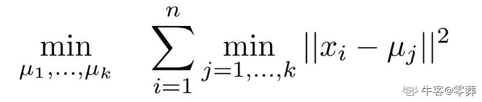
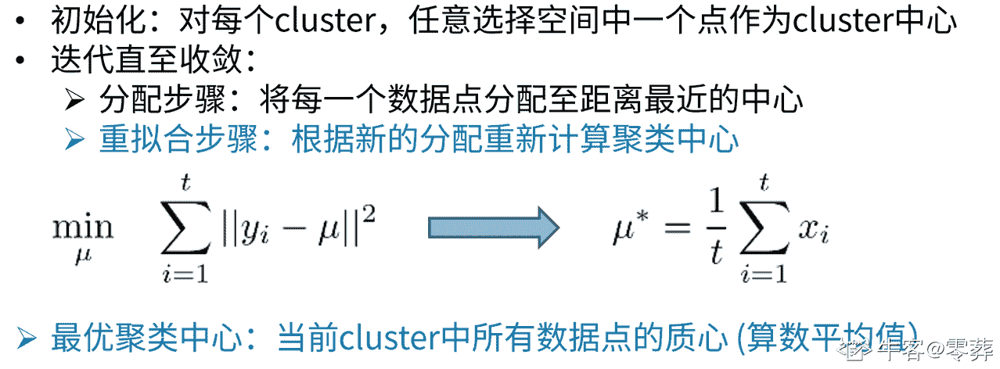

# 百度 2019 校招计算机视觉方向问答题合集

## 1

关于 K-means 聚类算法，请回答以下问题：

1) K-means 是有监督聚类还是无监督聚类？（2 分）

2) 写出将 N 个样本（X=(x1,…,xN)）聚成 K 类的 K-means 聚类算法的优化目标函数。（6 分）

3) 请用伪代码写出聚类过程。（8 分）

4) 假设样本特征维度为 D，请描述 Kmeans 算法时间复杂度。（4 分）

你的答案

本题知识点

算法工程师 百度 机器学习 2019

讨论

[55 开](https://www.nowcoder.com/profile/93418567)

1）无监督聚类 2）对于样本 xi，计算其分类：
ci 表示类别，uj 表示质心那么优化目标函数可以表示为：
N 表示样本量，ui 表示 ci 的质心 3）伪代码：def Kmeans (输入数据，类簇的个数 K):    初始计算 K 个质心点
    repeat
        计算数据中每个点到各个质心的距离，其中到质心距离最短的点被分为同一个簇，最后得到 K 个类簇
        重新计算 K 个类簇的质心
    until 知道所有样本的类簇不发生改变或达到最大迭代次数
4）假设数据量为 N，数据维度为 D，K 为簇的个数，I 为迭代次数，那么 Kmeans 算法的时间复杂度为 N*D*K*I

发表于 2019-08-08 14:30:59

* * *

[零葬](https://www.nowcoder.com/profile/75718849)

1) 无监督聚类 2) 优化目标函数如下： 3) 伪代码如下：
4) KMeans 聚类算法的时间复杂度为 O(I*n*k*m)，其中 m 为每个元素字段个数，n 为数据量，I 为迭代次数。可以看到，无论是相对于数据量、特征维度、聚类数和迭代次数，KMeans 聚类算法的时间复杂度都是线性的，是一个非常优雅高效的算法。

发表于 2020-10-26 21:39:31

* * *

[zmw007](https://www.nowcoder.com/profile/217750585)

1）无监督聚类 2）对于每一个样例 i，计算其应该属于的类：   c^((i)) :=argmin||x^((i)) -u[j]||²^(对于每一个类 j，重新计算该类的质心:)
优化目标函数:
3)伪代码：function K-Means(输入数据，中心点个数 K)
    获取输入数据的维度 Dim 和个数 N
    随机生成 K 个 Dim 维的点
    while(算法未收敛)
        对 N 个点：计算每个点属于哪一类。
        对于 K 个中心点：
            1，找出所有属于自己这一类的所有数据点
            2，把自己的坐标修改为这些数据点的中心点坐标
    end
    输出结果：
end
4）假设样本特征维度为 D，样本数为 N，k 为聚类个数，m 为迭代次数，则时间复杂度为： O（mnkd）.

发表于 2019-04-29 22:02:08

* * *

## 2

相机模型有哪些参数，写出三维空间点到图像坐标投影公式。镜头畸变系数有哪几种，对应畸变矫正的公式表达？

你的答案

本题知识点

算法工程师 百度 机器学习 2019

讨论

[zmw007](https://www.nowcoder.com/profile/217750585)

畸变:1.径向畸变；2.切向畸变径向畸变的矫正：x_{0}=x[1+k_{1}r^{2}+k_{2}r^{4}+k_{3}r^{6}];
y_{0}=y[1+k_{1}r^{2}+k_{2}r^{4}+k_{3}r^{6}] 切向畸变的矫正：x_{0}=x+[2p_{1}y+p_{2}(r^{2}+2x^{2})];
y_{0}=x+[2p_{2}x+p_{1}(r^{2}+2y^{2})] 

发表于 2019-04-29 22:09:49

* * *

## 3

系统设计题

在自动驾驶领域，障碍物的空间位置是很重要的信息。在不具备雷达等有测距能力传感器的情况下，如何仅通过单目相机计算出地面上目标的距离？

你的答案

本题知识点

算法工程师 百度 机器学习 2019

讨论

[李耳 20190711193780](https://www.nowcoder.com/profile/524561884)

使用分割算法得到地面目标的最小外接矩，然后根据与对应目标类的实际平均大小进行对比，通过大小的比值得到距离

发表于 2019-08-19 00:16:39

* * *

## 4

目前通过卷积神经网络进行检测的方法主要分为 one-stage 和 two-stage，分别写出了解的对应的算法。

在共性上两类检测算法有哪些差异？

你的答案

本题知识点

算法工程师 百度 机器学习 2019

讨论

[zmw007](https://www.nowcoder.com/profile/217750585)

one-stage:SSD、YOLO 系列 two-stage：RCNN、Fast RCNN、Faster RCNN、Mask RCNN two-stage 在 one-stage 的基础上有一个 RPN 网络（侯选框的训练），再通过目标区域检测的网络，进行检测。 

发表于 2019-04-29 22:14:11

* * *