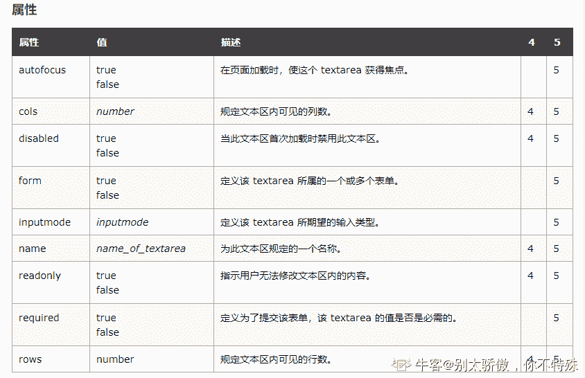

# 百度 2019 校招 Web 前端工程师笔试卷（第一批）

## 1

关于 HTTP 协议说法错误的是（）

正确答案: D   你的答案: 空 (错误)

```cpp
HTTP 报文分为请求报文和响应报文
```

```cpp
GET 请求没有请求正文
```

```cpp
HTTP 请求方法在服务器中即使部分实现了，考虑到安全问题，也不一定会用
```

```cpp
请求头的后面的空行可有可无
```

本题知识点

前端工程师 百度 2019

讨论

[安如水](https://www.nowcoder.com/profile/788092848)

HTTP 协议必不可少的三项内容：请求行，请求头，空行。缺一不可，请求内容在 get 请求中不存在，post 请求中存在

编辑于 2019-05-07 17:14:12

* * *

## 2

HTTP 是 Hyper Text Transfer Protocol（超文本传输协议）的缩写。HTTP 有两类报文：请求报文和响应报文。那么，以下那一项不是请求报文的组成部分？

正确答案: D   你的答案: 空 (错误)

```cpp
请求行
```

```cpp
请求头部
```

```cpp
空行
```

```cpp
消息报头
```

本题知识点

前端工程师 百度 2019

讨论

[菜鸡也希望能拥有 offer](https://www.nowcoder.com/profile/1929981)

一个 HTTP 请求报文由请求行（request line）、请求头部（header）、空行和请求数据 4 个部分组成。

发表于 2019-06-06 15:55:59

* * *

## 3

关于链表的说法错误的是：

正确答案: D   你的答案: 空 (错误)

```cpp
在进行头插法建立链表时先将新增结点的指针域指向头结点的后一个结点
```

```cpp
引入头节点使得对于空表和非空表的处理变得统一
```

```cpp
静态链表中的指针与循环双链表中的指针表示的意义不同
```

```cpp
采用头插法建立链表时先将头结点的指针域指向新增节点
```

本题知识点

前端工程师 百度 2019

讨论

[大智若‘俞’](https://www.nowcoder.com/profile/7277257)

D 说法错误的。选 D 首先，应该先将新增节点的 next 指向头节点的 next（保证连接线不断开）然后，再将头结点指向新增结点（新增结点就是第一个结点了）

发表于 2019-04-29 10:56:07

* * *

## 4

关于队列的说法正确的是：

正确答案: B   你的答案: 空 (错误)

```cpp
进队操作的过程中，若队列不满，先将队尾指针加 1，再送值到队尾元素
```

```cpp
在层次遍历中应用队列是为了保存下一步的处理顺序
```

```cpp
循环队列的队满条件 Q.front==Q.rear
```

```cpp
循环队列中元素在出队时指针按照逆时针方向进 1
```

本题知识点

前端工程师 百度 前端工程师 百度 2019

讨论

[Ped](https://www.nowcoder.com/profile/9416754)

D 选项有一点不理解？

发表于 2019-06-02 22:30:30

* * *

[安如水](https://www.nowcoder.com/profile/788092848)

A：先送值到到队尾元素再将队尾指针加 1C：设置标志 flag，当 front==rear 且 flag=0 时为队空，当 front==rear 且 flag=1 时为队满(flag 必须存在)，题目仅仅设头=尾可能存在满或空两种情况 D：栈顶元素 flag 为 0 时，出队时指针按照逆时针方向进 1

发表于 2019-05-10 10:53:42

* * *

## 5

下列关于栈和队列的应用说法错误的是（）

正确答案: C   你的答案: 空 (错误)

```cpp
进制的转换和表达式的求值问题都可以利用栈的特性来处理
```

```cpp
队列具有先进先出的特性，可以用来处理页面替换算法
```

```cpp
利用栈后进先出的特性求解表达式 a*(b+c)-d 的后缀表达式的结果是 abc*+d-
```

```cpp
实用栈可以模拟递归的过程，以此来消除递归。
```

本题知识点

前端工程师 百度 2019

讨论

[陌上花开 201805291926920](https://www.nowcoder.com/profile/3269756)

abc+*d-规则：从左到右遍历中缀表达式的每个数字和符号，若是数字就输出，即成为后缀表达式的一部分；若是符号，则判断其与栈顶符号的优先级，是右括号或优先级低于找顶符号（乘除优先加减）则栈顶元素依次出找并输出，并将当前符号进栈，一直到最终输出后缀表达式为止[`www.nowamagic.net/librarys/veda/detail/2307`](http://www.nowamagic.net/librarys/veda/detail/2307)

发表于 2019-05-04 10:38:23

* * *

[littleZzz](https://www.nowcoder.com/profile/2832057)

用栈将中缀表达式转为后缀表达式，数字直接输出，运算符入栈，判断当前运算符与栈顶运算符优先级，如果当前运算符优先级低于栈顶运算符，出栈；否则运算符入栈。(的运算级最高，)的运算符最低 a*(b+c)-d 输出 a(output: a)*入栈，(入栈输出 b()(output: ab)+入栈输出 c(output: abc)当前运算符为)，+出栈，(出栈，此时运算符栈中剩下*,优先级高于+，因此不出栈(output: abc+)扫描到-运算符，-优先级低于*, *出栈, -入栈(output: abc+*)输出 d(output: abc+*d)运算符出栈(output: abc+*d-)

发表于 2019-11-27 11:55:57

* * *

[安如水](https://www.nowcoder.com/profile/788092848)

abd 为何正确：a：进制的转换和表达式求值可以利用栈特性处理：比较两个运算符的优先级，然后根据优先级来决定是进行计算还是存入栈中
b：该算法总是淘汰最先进入内存的页面，即选择在内存中驻留时间最久的页面予以淘汰，该算法简单，只需把一个进程已调入内存的页面按先后次序链接成一个队列，并设置一个指针，称为替换指针，使它总是指向最老的页面。d： 用栈模拟递归,就是先将 n 入栈,不断的将未知元素入栈,直到取到已知的值的时候,出栈进行运算

发表于 2019-05-10 11:10:30

* * *

## 6

在计算机存储结构中大多数存放方式为一维，但是数组的存放方式为二维，下列属于数组存放方式的是（）

正确答案: A   你的答案: 空 (错误)

```cpp
顺序存储结构
```

```cpp
链表存储结构
```

```cpp
索引存储方式
```

```cpp
其余都不对
```

本题知识点

前端工程师 百度 2019

讨论

[不羁的风 x](https://www.nowcoder.com/profile/511741940)

数组是顺序结构存储，大学老师强调过这一点

发表于 2019-05-02 10:22:20

* * *

## 7

二叉树的遍历分为以下三种：先序遍历，遍历顺序规则为【根左右】，中序遍历：遍历顺序规则为【左根右】，后序遍历：遍历顺序规则为【左右根】，已知一棵二叉树的结点名为大写英文字母，其中序与后序遍历的顺序分别为：CBGEAFHDIJ 与 CGEBHFJIDA 则关于该二叉树的先序遍历的顺序，下列表达正确的是（）

正确答案: C   你的答案: 空 (错误)

```cpp
ABCEIJGDFH
```

```cpp
ABCEGDIJFH
```

```cpp
ABCEGDFHIJ
```

```cpp
其余都不对
```

本题知识点

前端工程师 百度 2019

讨论

[顺利毕业!!](https://www.nowcoder.com/profile/339520013)


发表于 2019-05-21 20:28:24

* * *

[不二 20180507201576](https://www.nowcoder.com/profile/8153733)

1-由后序遍历特征，根节点必在后序序列尾部，即根结点是 A； 2-由中序遍历特征，根结点必在其中间，而且其左边必全部是左子树子孙(CBGE),其右边必全部是右子树子孙(FHDIJ)； 3-继而，根据后序中的(CGEB)子树可确定 B 为 A 的左孩子，根据(HFJID)可确定 D 为 A 的右孩子；以此类推，可唯一确定一颗二叉树。

发表于 2019-05-30 08:57:52

* * *

## 8

textarea 标签的属性不包括（）

正确答案: D   你的答案: 空 (错误)

```cpp
rows
```

```cpp
cols
```

```cpp
maxlength
```

```cpp
width
```

本题知识点

前端工程师 百度 2019 HTML

讨论

[halcyonCC](https://www.nowcoder.com/profile/537780847)


发表于 2020-08-22 13:49:30

* * *

[缓月](https://www.nowcoder.com/profile/521106860)



发表于 2019-10-30 15:29:04

* * *

[s.sdn.nfv](https://www.nowcoder.com/profile/1572301)

textarea——多行文本输入框

发表于 2019-05-05 19:25:04

* * *

## 9

关于 link 和 @import 区别说法错误的是（）

正确答案: B   你的答案: 空 (错误)

```cpp
link 是 XTHML 标签，无兼容问题
```

```cpp
两者均属于 CSS 范畴
```

```cpp
link 可以使用 JavaScript 控制 DOM 改变样式，@import 不支持
```

```cpp
link 引用 CSS 时，页面加载同时加载样式，@import 需要页面完全载入以后加载
```

本题知识点

前端工程师 百度 2019 HTML CSS

讨论

[很累却不敢停下](https://www.nowcoder.com/profile/364243461)

1.link 属于**HTML 范畴**——除了加载 CSS，还能支持其他事务，且在 HTML 页面加载的同时加载 2.@import 属于**CSS 范畴**——只能加载 CSS

发表于 2020-08-18 23:46:01

* * *

[zhouling600521](https://www.nowcoder.com/profile/580686384)

link 除了引用样式文件，还可以引用图片等资源文件，而 import 只引用样式文件
<link rel="icon" sizes="any" mask href="//[www.baidu.com/img/baidu.svg](http://www.baidu.com/img/baidu.svg)">
兼容性不同，link 不存在兼容性的问题，import 在 IE5 以上支持，是 css2.1 新增的
在样式表文件可以使用 import 导入其它的样式表文件，而 link 不可以
link 引用 CSS 时，在页面载入时同时加载；@import 需要页面网页完全载入以后加载。
link 支持使用 Javascript 控制 DOM 去改变样式；而@import 不支持。
原文链接：[`blog.csdn.net/lxcao/article/details/52639442`](https://blog.csdn.net/lxcao/article/details/52639442)

发表于 2019-09-10 10:19:59

* * *

[喃喃呐呐](https://www.nowcoder.com/profile/979887643)

link 属于 html 范畴

发表于 2020-09-09 21:39:59

* * *

## 10

如果子元素都为浮动，不能解决父类高度塌陷问题的是（）

正确答案: A   你的答案: 空 (错误)

```cpp
给父元素添加 clear: both;
```

```cpp
给父元素添加 overflow: hidden;
```

```cpp
在浮动元素下方添加空 div，并添加样式 clear: both;
```

```cpp
设置父元素 :after{content: “”;clear: both; display:block;overflow: hidden;}
```

本题知识点

前端工程师 百度 2019 HTML CSS

讨论

[是个小红薯吖](https://www.nowcoder.com/profile/236456543)


发表于 2021-09-09 14:20:22

* * *

[机车双猫怪](https://www.nowcoder.com/profile/344692719)

1.直接给父元素设置高度，在子元素改变的情况下，此方法使用起来比较繁杂。
2.给父元素直接设置 *overflow:hidden;*样式 
3\. 父元结束标签之前加空 div，样式为 *clear：both*； 4.伪元素选择器,父元素加上 clearfix 

发表于 2021-01-13 10:00:14

* * *

[会飞的特洛伊](https://www.nowcoder.com/profile/921534049)

清除浮动可以使用在父元素中创建 BFC,这样父元素再计算高度的时候就会将浮动计算在内，这是 BFC 规则之一。而另一种方法就是利用 clear: both 清除，而这种方法又可以分为空元素设置与伪元素设置。

发表于 2019-05-06 21:03:05

* * *

## 11

以下哪个属性不会使 div 脱离文档流()

正确答案: D   你的答案: 空 (错误)

```cpp
position: absolute;
```

```cpp
float: right;
```

```cpp
position: fixed;
```

```cpp
position: relative;
```

本题知识点

前端工程师 百度 2019 HTML

讨论

[快乐的李勾勾](https://www.nowcoder.com/profile/985482736)

浮动（float）、固定定位（fixed）和绝对定位（absolute）都会使元素脱离文档流

发表于 2019-05-14 17:59:22

* * *

[skrheart](https://www.nowcoder.com/profile/923450454)

浮动（float）、固定定位（fixed）和绝对定位（absolute）都会使元素脱离文档流，绝对定位相对于最近的开启了定位（即 position 不为 static）的父元素进行定位相对定位（relative），相对于自身初始位置进行定位，不脱离文档流

发表于 2021-04-27 15:17:42

* * *

[Better-柏特](https://www.nowcoder.com/profile/960660722)

相对定位不脱离文档流

发表于 2019-05-26 22:09:53

* * *

## 12

1.下面哪个语句的执行结果与 '1.2.3'.split('') 相同

正确答案: A   你的答案: 空 (错误)

```cpp
'1.2.3'.split(/(\.)/)
```

```cpp
'1.2.3'.split(/(.)/)
```

```cpp
'1.2.3'.split(/(?:\.)/)
```

```cpp
'1.2.3'.split(/(?:.)/)
```

本题知识点

前端工程师 百度 2019

讨论

[zhouqctech](https://www.nowcoder.com/profile/1468715)

参考：[MDN: String.prototype.split()](https://developer.mozilla.org/en-US/docs/Web/JavaScript/Reference/Global_Objects/String/split#Description)

> If separator is a regular expression that contains capturing parentheses, then each time separator i***atched, the results (including any undefined results) of the capturing parentheses are spliced into the output array.

发表于 2019-05-19 19:41:00

* * *

[前端小小小白](https://www.nowcoder.com/profile/316918473)

C 选项中，?:表示不应该捕获匹配到的内容，所以结果中不会出现点，只有 1,2,3，与题目要求不符

发表于 2020-03-17 14:21:27

* * *

## 13

下列哪个语句不能在 Node 环境中直接运行

正确答案: A   你的答案: 空 (错误)

```cpp
console.log(env)
```

```cpp
console.log(require)
```

```cpp
console.log(module)
```

```cpp
console.log(process)
```

本题知识点

前端工程师 百度 2019

讨论

[缓月](https://www.nowcoder.com/profile/521106860)

process.env 属性返回一个包含用户环境信息的对象。返回项目运行所在环境的一些信息用 echo $NODE_ENV

发表于 2019-10-30 18:41:42

* * *

[Agree﹉](https://www.nowcoder.com/profile/706205720)

process.env

发表于 2019-05-12 17:52:30

* * *

## 14

以下哪个不是 Node 的内置模块

正确答案: D   你的答案: 空 (错误)

```cpp
http
```

```cpp
fs
```

```cpp
path
```

```cpp
io
```

本题知识点

前端工程师 百度 2019

讨论

[三金七爷](https://www.nowcoder.com/profile/38401358)

node 的内置模块有：path 模块、until 模块、fs 模块、events 模块、http 模块、jade 模块、Express 框架等。

发表于 2019-09-22 16:34:51

* * *

## 15

以下哪些项目不是基于 Node 构建的

正确答案: C   你的答案: 空 (错误)

```cpp
pm2
```

```cpp
webpack
```

```cpp
nw.js
```

```cpp
koa
```

本题知识点

前端工程师 百度 2019

讨论

[不羁的风 x](https://www.nowcoder.com/profile/511741940)

尽然和 node 有一样的结尾，可以推断是平级的

发表于 2019-05-02 10:23:52

* * *

## 16

在面向对象编程中，对象之间的继承关系可以使用 is-a 来说明，下面选项中不属于继承关系的是？

正确答案: D   你的答案: 空 (错误)

```cpp
手机与 iPhone
```

```cpp
编程语言和 js
```

```cpp
工程师与前端工程师
```

```cpp
海淀和西二旗
```

本题知识点

前端工程师 百度 2019

讨论

[不羁的风 x](https://www.nowcoder.com/profile/511741940)

没的说，西二旗是海淀的一种吗？那上地也是海淀的一种，这样会有很多个海淀区

发表于 2019-05-02 10:24:43

* * *

## 17

html5 中新增了 manifest 标签，它有什么作用？

正确答案: B   你的答案: 空 (错误)

```cpp
规定输入域中可选择多个值
```

```cpp
应用缓存资源清单
```

```cpp
验证输入字段的模式
```

```cpp
表示复选框部分选中
```

本题知识点

前端工程师 百度 2019 HTML

讨论

[不二 20180507201576](https://www.nowcoder.com/profile/8153733)

manifest 文件是一个简单的文本文件，列举出了浏览器用于离线访问而缓存的资源。

发表于 2019-05-29 21:00:13

* * *

[牛客 212454037 号](https://www.nowcoder.com/profile/212454037)

带有缓存 manifest 的 HTML 文档（用于离线浏览）manifest 文件是一个简单的文本文件，列举出了浏览器用于离线访问而缓存的资源。 HTML5 引入了应用程序缓存，即意味着 Web 应用程序可以被缓存，然后在无互联网连接的时候进行访问。 应用程序缓存使得应用程序有三个优点：

1.  离线浏览 - 用户可以在离线时使用应用程序
2.  快速 - 缓存的资源可以更快地加载
3.  减少服务器加载 - 浏览器只从服务器上下载已更新/已更改的资源 

发表于 2021-07-08 08:58:38

* * *

[牛客 570373463 号](https://www.nowcoder.com/profile/570373463)

不理解

发表于 2021-08-01 21:53:54

* * *

## 18

var a =[1,2,3,4,5];a[9]=6;  经过这些操作后，数组 a 的长度是？

正确答案: D   你的答案: 空 (错误)

```cpp
5
```

```cpp
6
```

```cpp
9
```

```cpp
10
```

本题知识点

前端工程师 百度 2019

讨论

[不二 20180507201576](https://www.nowcoder.com/profile/8153733)

a[9]=6,这时数组的下标已经扩展到 9 了，中间的没有赋值的默认为 undefined，数组下标从 0 开始，所以这时数组的长度为 10

发表于 2019-05-29 20:59:08

* * *

## 19

(function(){var a = b = 100;})();console.log(typeof a);console.log(typeof b);

正确答案: C   你的答案: 空 (错误)

```cpp
number，number
```

```cpp
undefined，undefined
```

```cpp
undefined，number
```

```cpp
number，undefined
```

本题知识点

前端工程师 百度 2019

讨论

[Ped](https://www.nowcoder.com/profile/9416754)

立即执行函数是一个块级作用域，所以我们在 window 全局环境下是访问不到里面的变量和方法的，因为 var a = b =100；相当于 b = 100；var a = b；因为 b 没有通过 var 声明，所以 b 是一个全局属性，我们可以在全局环境下通过 window.b 访问到，所以 typeof(a)为 undefined，typeof(b)为 number

发表于 2019-04-28 22:48:54

* * *

[喃喃呐呐](https://www.nowcoder.com/profile/979887643)

var a=b=0,也就是 var a=b ,b=0。b 没有 var 声明，所以 b 是全局属性，a 在函数内声明为局部变量。

发表于 2020-09-09 21:44:49

* * *

[jack4321](https://www.nowcoder.com/profile/5952163)

(function (){b=100;var a=100})()console.log(a)console.log(b)

发表于 2019-07-30 16:00:44

* * *

## 20

var res=null instanceof Object;console.log(res);代码输出是？

正确答案: B   你的答案: 空 (错误)

```cpp
true
```

```cpp
false
```

```cpp
error
```

本题知识点

前端工程师 百度 2019

讨论

[Agree﹉](https://www.nowcoder.com/profile/706205720)

typeof null // object 但是 null 并不是 object 的实例，也就是没有 .toString 等方法

发表于 2019-05-12 18:07:34

* * *

[喃喃呐呐](https://www.nowcoder.com/profile/979887643)

对于 Null 类型的值（只有 null），规范就是定义返回"object"这个字符串。但是本质上 Null 和 Object 不是一个数据类型，null 值并不是以 Object 为原型创建出来的。所以 null instanceof Object 是 false。但从这里也可以看到，null 确实是 javascript 中用来表示空引用的一个特殊值。使得它不是 instanceof Ojbect，而 typeof null 是“object”。在语义上也是可以理解的。
链接：[`www.jianshu.com/p/659cbcdcebfd`](https://www.jianshu.com/p/659cbcdcebfd)

发表于 2020-09-09 21:46:16

* * *

[不期而遇 o](https://www.nowcoder.com/profile/259877113)

instanceof 运算符用于测试构造函数的 prototype 属性是否出现在对象的原型链中的任何位置，null 不是 Object 的实例对象，null instanceof Object// false

发表于 2019-06-26 21:33:56

* * *

## 21

var strNumber = '200';var intNumber = 100;console.log(strNumber + intNumber);console.log(strNumber - intNumber);console.log(strNumber / intNumber);

正确答案: A   你的答案: 空 (错误)

```cpp
200100,100,2
```

```cpp
200,100,2
```

```cpp
200,200,undefined
```

```cpp
undefined,200,2
```

本题知识点

前端工程师 百度 2019

讨论

[呀丫哥](https://www.nowcoder.com/profile/622546091)

strNumber 是 string 类型进行+运算时，是进行字符串拼接 所以 strNumber + intNumber=200100，而-运算和/运算并没有这种规则 就直接运算

发表于 2019-07-18 20:23:05

* * *

## 22

var val = 'a';function baidu(){console.log(val);var val = 'b';console.log(val);}baidu();下面输出是:

正确答案: B   你的答案: 空 (错误)

```cpp
a b
```

```cpp
undefined b
```

```cpp
undefined undefined
```

```cpp
a undefined
```

本题知识点

前端工程师 百度 2019

讨论

[芥子 666](https://www.nowcoder.com/profile/9601294)

val 本来是全局变量，但因为在函数内被重新定义了，导致 val 变为局部变量，当函数的执行环境结束，val 使用结束

发表于 2019-09-16 15:31:50

* * *

[桂魄之残卷](https://www.nowcoder.com/profile/211221006)

Js 基础，变量声明作用域的问题

发表于 2019-05-10 00:47:57

* * *

## 23

下面哪些是 javascript 中 document 的方法？

正确答案: A C D   你的答案: 空 (错误)

```cpp
getElementById
```

```cpp
getElementsById
```

```cpp
getElementsByTagName
```

```cpp
getElementsByName
```

```cpp
cloes
```

```cpp
domain
```

本题知识点

前端工程师 百度 2019

讨论

[缓月](https://www.nowcoder.com/profile/521106860)


发表于 2019-10-30 19:06:54

* * *

[Agree﹉](https://www.nowcoder.com/profile/706205720)

cloes 是考读题认真度吗？ 有这方法额 domain 是属性，不是方法，所以也错了吗？

发表于 2019-05-12 18:17:39

* * *

## 24

关于 Linux 下查看文件的命令，下面说法不正确的是？

正确答案: A B C   你的答案: 空 (错误)

```cpp
nl 以二进制读取文件
```

```cpp
od 显示的时候输出行号
```

```cpp
more 一页一页显示文件内容，可以前翻
```

```cpp
cat 由第一行开始显示文件内容
```

本题知识点

前端工程师 百度 2019

讨论

[安如水](https://www.nowcoder.com/profile/788092848)

nl 与 cat 相似，显示时标好行号 od 以八进制格式显示文件 more 一页一页显示文件，不能前翻。less 可以前翻 cat 从第一行开始显示文件内容，并将所有内容输出

发表于 2019-05-13 09:32:59

* * *

[喃喃呐呐](https://www.nowcoder.com/profile/979887643)

cat: 从第一行开始显示全部的文本内容；
tac: 从最后一行开始，显示全部分文本内容，与 cat 相反；
nl: 显示文本时，可以输出行号；
more: 按页显示文本内容；
less: 与 more 差不多，也是按页显示文本内容，区别是 less 可以一行一行的回退，more 回退只能一页一页回退；
head: 从头开始显示文件指定的行数；
tail: 显示文件指定的结尾的行数，但每一行的位置还是原文件中的位置，不会像 tac 那样与原文件相反。
vi: Linux 文本编辑器。

发表于 2020-09-09 21:50:48

* * *

## 25

对于线程和进程的比较，下面说法不正确的是？

正确答案: B C D   你的答案: 空 (错误)

```cpp
线程可以作为调度和分派的基本单位，是能独立运行得基本单位。
```

```cpp
线程切换不会引起进程的变化
```

```cpp
进程之间可以并发执行，但是一个进程中的多个线程之间不可以并发执行
```

```cpp
线程可以拥有资源，并作为系统中拥有资源的一个基本单位。
```

```cpp
线程除了拥有自己的少量资源外，还允许多个线程共享该进程所拥有的资源，表现在：属于同一个进程的所有线程都具有相同的地址空间。
```

本题知识点

前端工程师 百度 2019

讨论

[name201904231402466](https://www.nowcoder.com/profile/577827960)

进程只作为资源分配的基本单位，线程则作为调度和分派的基本单位； 在引入线程的操作系统中，不仅进程之间可以并发执行，一个进程之间的多个线程之间也可以并发执行；传统的操作系统中，进程是拥有资源的独立单位，线程本身基本上不拥有资源，只拥有少量必不可少的资源。线程具有共享性，属于同一进程的线程共享进程的资源。

发表于 2019-08-13 22:03:06

* * *

## 26

关于页面加载过程，以下描述正确的有哪些？

正确答案: B D   你的答案: 空 (错误)

```cpp
页面加载 html 中的外联样式表时，不会阻塞后面的 JS 代码执行
```

```cpp
由于 html 的层次结构已经是树状结构，因此可以实现边加载边生成 DOM 树
```

```cpp
修改元素的颜色会造成重绘，同时触发回流
```

```cpp
页面所有资源加载完毕后，会触发 onload 事件
```

本题知识点

前端工程师 百度 2019 HTML

讨论

[陌上人](https://www.nowcoder.com/profile/3742157)

1.  css 加载不会阻塞 DOM 树的解析
2.  css 加载会阻塞 DOM 树的渲染
3.  css 加载会阻塞后面 js 语句的执行

发表于 2019-05-10 11:31:28

* * *

[offer 必拿下](https://www.nowcoder.com/profile/587622505)

一个完整的网页加载流程：
    (1)解析 HTML 结构
    (2)加载外部脚本 script 和样式表文件 link

//页面中的多个脚本文件采用同步的方式加载 会产生“线程等待”
    (3)解析并执行脚本代码      
    (4)构建 HTML DOM 模型        

(5)加载图片等外部资源文件     //图片等文件以异步线程的方式加载 不会产生等待

(6)页面加载完毕

发表于 2021-09-09 08:45:49

* * *

[.Alter](https://www.nowcoder.com/profile/4187200)

修改颜色不会触发重排（回流）

发表于 2020-03-29 17:32:41

* * *

## 27

以下代码的执行结果是什么？

```cpp
var array = [0, 1, 2, 3];
var spliceArray = array.splice(3, 1);
var sliceArray = array.slice(0, 1);
console.log(array);
```

正确答案: C   你的答案: 空 (错误)

```cpp
[0, 1, 2, 3]
```

```cpp
[1, 2, 3]
```

```cpp
[0, 1, 2]
```

```cpp
[1, 2]
```

本题知识点

前端工程师 百度 2019

讨论

[Ped](https://www.nowcoder.com/profile/9416754)

这道题的陷阱好深，首先我们要搞清楚这两个方法是改不改变原数组的，splice 方法是改变原数组的，而 slice 方法是不改变原数组的，所以在执行完第二行代码的时候 array 数组就变成了[0, 1, 2]，而因为 slice 方法是不改变原数组的所以第四行代码输出的还是[0, 1, 2]

发表于 2019-04-28 23:05:34

* * *

[喃喃呐呐](https://www.nowcoder.com/profile/979887643)

slice 方法并不会修改数组，而是返回一个子数组。
splice 会修改原数组，array.splice(3, 1)表示删除下标为 3 的一个元素并返回数组[0,1,2]。

发表于 2020-09-09 21:56:34

* * *

[缓月](https://www.nowcoder.com/profile/521106860)

.splice(3, 1)的意思是从下标为 3 即第四个数字开始删除数组后的一个元素，此时数组剩下的元素为[0,1,2]了。然后执行 3/4 句代码，slice 不对原数组进行改变，所以输出[0,1,2]。

发表于 2019-10-30 19:38:25

* * *

## 28

```cpp
var account = {
    phone: "1234567",
    getPhone: function() {
        return this.phone;
    }
};
var mycount = account.getPhone;
console.log(account.getPhone());
console.log(mycount());
```

正确答案: A   你的答案: 空 (错误)

```cpp
1234567,undefined
```

```cpp
undefined,undefined
```

```cpp
undefined, 1234567
```

```cpp
1234567,1234567
```

本题知识点

前端工程师 百度 2019

讨论

[不期而遇 o](https://www.nowcoder.com/profile/259877113)

this 的指向是看调用时的对象，第一个是 account 调用，所以 this 指向 account，account 中有 getPhone 这个方法第二个是 mycount 调用，它是 account.getPhone 的实例对象，继承了 getPhone 这个方法，mycount 是挂载在 window 上的，所以 this 指向 window

发表于 2019-06-26 22:12:15

* * *

[曹罡瑜 0829](https://www.nowcoder.com/profile/4270576)

第一个打印 主体是 account 对象，所以 this 指向 account 对象，打印 1234567 第二个打印 主体是 window， 所以 this 指向 window， 全局下没有 phone  所以打印 undefined

发表于 2019-05-15 11:12:49

* * *

[安如水](https://www.nowcoder.com/profile/788092848)

声明变量，输出函数表达式（），所以为 undefined

发表于 2019-05-13 10:43:33

* * *

## 29

下列选项中，属于面向对象主要特点的是（ ）

正确答案: A C   你的答案: 空 (错误)

```cpp
抽象
```

```cpp
复用
```

```cpp
继承
```

```cpp
重载
```

本题知识点

前端工程师 百度 2019

讨论

[喃喃呐呐](https://www.nowcoder.com/profile/979887643)

面向对象主要有四大特性，分别为：抽象、封装、继承、多态。

发表于 2020-09-09 21:58:12

* * *

[zhouling600521](https://www.nowcoder.com/profile/580686384)

面向对象的三个基本特征是：封装、继承、多态。 

发表于 2019-09-10 10:58:32

* * *

## 30

以下哪项属于 html 全局属性?

正确答案: A B C   你的答案: 空 (错误)

```cpp
id
```

```cpp
style
```

```cpp
class
```

```cpp
form
```

本题知识点

前端工程师 百度 2019 HTML

讨论

[longanWei](https://www.nowcoder.com/profile/284038206)

全局属性就是所有的标签都可以使用的属性

发表于 2020-08-06 16:59:33

* * *

[前端小小小白](https://www.nowcoder.com/profile/316918473)

****

发表于 2020-03-17 14:36:44

* * *

[牛客 279412974 号](https://www.nowcoder.com/profile/279412974)

全局属性，所有的标签都可以使用的属性

发表于 2021-06-26 23:27:28

* * *

## 31

用 html+css+js 实现一个轮播图，功能如下：

1.    支持自动播放

2.    支持移动端事件

3.    支持无限无缝切换，即滑动到第一张或者最后一张继续滑动则可以继续往前或往后翻页

4.    支持回调事件

5.    按住鼠标/手指按住图片可随鼠标/手指滑动，当移动距离超过图片的 1/2 时则翻页，不超过则恢复原样

注：是否用第三方 js 库(或者不用)，请说明原因

你的答案

本题知识点

前端工程师 百度 2019

## 32

怎样理解 JavaScript 的 Event Loop，并且试用代码举例说明 setTimeout 和 Promise 差异

你的答案

本题知识点

前端工程师 百度 2019

讨论

[IAmFineThankS](https://www.nowcoder.com/profile/385254898)

Event Loop:    1.遇到 sciprt 之后开始第一个宏任务
    2.执行过程中遇到异步请求,会将其压入任务队列,交由异步事件引擎处理
    3.执行完宏任务后，检测是否存在微任务，有的话会先执行微任务
    4.执行第二个宏任务
new Promise((resolve, reject) => {    console.log(1)
}).then(_ => {    console.log(2)
})setTimeout(_ => {    console.log(3)
}, 300)执行顺序: 1 -> 2->3promise 属于微任务, setTimeout 属于宏任务

发表于 2019-05-05 16:48:34

* * *

[Greatiga](https://www.nowcoder.com/profile/561924161)

自己总结的一篇文章关于事件循环机制、宏任务和微任务[`www.jianshu.com/p/51a313f6c41d`](https://www.jianshu.com/p/51a313f6c41d)

发表于 2020-09-03 08:19:52

* * *

[前端小小小白](https://www.nowcoder.com/profile/316918473)

[`segmentfault.com/a/1190000012925872?utm_source=tag-newest`](https://segmentfault.com/a/1190000012925872?utm_source=tag-newest)

发表于 2020-03-17 15:16:16

* * *

## 33

一个花坛中有很多花和两个喷泉。

喷泉可以浇到以自己为中心，半径为 r 的圆内的所有范围的花。

现在给出这些花的坐标和两个喷泉的坐标，要求你安排两个喷泉浇花的半径 r[1]和 r[2]，使得所有的花都能被浇到的同时, r[1]² + r[2]^(2 )的值最小。

本题知识点

前端工程师 百度 穷举 排序 *贪心 2019* *讨论

[lentolove](https://www.nowcoder.com/profile/572586026)

```cpp
public class Main {

    public static void main(String[] args) throws IOException {
        BufferedReader bf = new BufferedReader(new InputStreamReader(System.in));
        String[] line1 = bf.readLine().split(" ");
        int n = Integer.parseInt(line1[0]);
        int x1 = Integer.parseInt(line1[1]);
        int y1 = Integer.parseInt(line1[2]);
        int x2 = Integer.parseInt(line1[3]);
        int y2 = Integer.parseInt(line1[4]);
        long[][] dis = new long[n][2];
        for (int i = 0; i < n; i++) {
            String[] pos = bf.readLine().split(" ");
            /**
             * 这里不转成 long 类型的话，后面再计算距离时候会出现整数溢出，导致我的通过率一直是 20%
             */
            long x = Integer.parseInt(pos[0]);
            long y = Integer.parseInt(pos[1]);
            dis[i][0] = ((x1 - x) * (x1 - x) + (y1 - y) * (y1 - y));
            dis[i][1] = ((x2 - x) * (x2 - x) + (y2 - y) * (y2 - y));
        }
        //根据到喷泉(x1,y1)的距离从大到小进行排序
        Arrays.sort(dis, (a, b) -> b[0] > a[0] ? 1 : -1);
        long ret = Long.MAX_VALUE, d2 = 0;
        /**
         *  当 i = 0,时候,即视为将所有的点归为第一个喷泉，所以 ret = dis[i][0] + 0,每次保存到喷泉 2 的最大距离，
         *  当 n = i 时候，表示前面第 0~i 个点都归为喷泉 1，后面 i+1~n 个点都归为喷泉 2，那我们只要记录 i+1~n 中喷泉 2 的最大
         *  半径即可，最后需要注意特殊情况，当 n 个点全部归为喷泉 2 的情况，即结果要在 ret 和 d2 中取最小值
         */
        for (int i = 0; i < n; i++) {
            ret = Math.min(ret, dis[i][0] + d2);
            d2 = Math.max(d2, dis[i][1]);
        }
        System.out.println(Math.min(ret, d2));
    }
}

```

发表于 2019-08-09 13:41:34

* * *

[算法才是灵魂](https://www.nowcoder.com/profile/4088795)

时间复杂度 n²
按距离其中一个点排序
再找另一个的最大值

```cpp
n,x1,y1,x2,y2 = map(int, input().split())
flowers = []
for i in range(n):
    x,y = map(int, input().split())
    flowers.append((x,y))
l1,l2 = [], []
l = []
for x,y in flowers:
    distance1 = (x1 - x) ** 2 + (y1 - y) ** 2
    distance2 = (x2 - x) ** 2 + (y2 - y) ** 2
    l.append([distance1, distance2])
l = sorted(l, key=lambda x:x[0])
l.insert(0,[0,0])
l.append([0,0])
res = float("inf")
for i in range(len(l)-1):
    res = min(res, l[i][0] + max(l[i+1:], key=lambda x:x[1])[1])
print(res)
```

编辑于 2019-08-23 10:14:39

* * *

[零葬](https://www.nowcoder.com/profile/75718849)

先将所有的花按照与第一个喷泉的距离升序排列，然后假设第一个喷泉最远可以浇到第 i 朵花，那在这种情况下，遍历第二个喷泉要浇到剩下所有花的半径应该是多大。遍历 i 的情况和第二个喷泉要浇到剩下的花的情况，计算出最小的半径平方和即可。

```cpp
n, x1, y1, x2, y2 = map(int, input().split())
pos = []
for _ in range(n):
    pos.append(list(map(int, input().split())))
# 先将所有花按与第一个喷泉的距离排序
pos.sort(key=lambda p: (p[0] - x1)**2 + (p[1] - y1)**2)
min_value = float("inf")
# 如果第一个喷泉最远能浇到距离它第 i 远的花，那要浇到其他的花需要第二个喷泉至少有多大射程
for i in range(-1, n):
    if i < 0:
        # 第一个喷泉一朵都浇不到
        r1 = 0
    else:
        r1 = (pos[i][0] - x1)**2 + (pos[i][1] - y1)**2
    # 遍历所有的可能性
    r2 = 0
    for j in range(i + 1, n):
        r2 = max(r2, (pos[j][0] - x2)**2 + (pos[j][1] - y2)**2)
    min_value = min(min_value, r1 + r2)
print(min_value)
```

发表于 2021-02-26 22:47:56

* * *

## 34

本题展示了一个简化版的搜索框智能提示功能，请按照如下要求完成 suggest 函数。
1、当输入框的值发生变化时，系统会调用 suggest 函数，用于显示/隐藏智能提示数据，参数 items 为一个字符串数组。
2、当 items 中的字符串和输入框的值匹配时，将匹配的数据依次渲染在 ul 下的 li 节点中，并显示.js-suggest 节点，否则移除 ul 下的所有 li 节点，并隐藏.js-suggest 节点
3、输入框的值需要移除两侧空白再进行匹配
4、输入框的值为空时，按照全部不匹配处理
5、字符串使用模糊匹配，比如"北大"能匹配"北大"和"北京大学"，但不能匹配"大北京"，即按照 /北.*?大.*?/ 这个正则进行匹配
6、通过在.js-suggest 节点上添加/移除 hide 这个 class 来控制该节点的隐藏/显示
7、当前界面是执行 suggest(['不匹配数据', '根据输入框的值', '从给定字符串数组中筛选出匹配的数据，依次显示在 li 节点中', '如果没有匹配的数据，请移除所有 li 节点，并隐藏.js-suggest 节点']) 后的结果
8、请不要手动修改 html 和 css
9、不要使用第三方插件
10、请使用 ES5 语法

本题知识点

前端工程师 百度 字符串 *模拟 2019* *讨论

[gys96](https://www.nowcoder.com/profile/146077932)

function suggest(items) {
 var oinput = document.querySelector('.js-input')
    var osuggest = document.querySelector('.js-suggest')
    var oul = osuggest.querySelector('ul')
    for(var i =oul.children.length - 1;i>=0;i--){
        oul.removeChild(oul.children[i])
    }
    var val = oinput.value.trim()
    if(val == ""){
        osuggest.classList.add('hide')
        return
    }
    var str = val.split('').reduce((total,val)=>{
        if(/[\(\)\.\*\^\\\[\]\{\}\?]/.test(val)){
                val = '\\' + val
            }
            return total += val + '.*'
        },'')
    var reg = new RegExp(str,'')
    var resultstr = ""
    items.forEach(item =>{
        if(reg.test(item)){
            resultstr += `<li>${item}</li>`
        }
    })
    if(resultstr == ''){
        osuggest.classList.add('hide')
    }else {
        osuggest.classList.remove('hide')
        oul.innerHTML = resultstr
    }
}

发表于 2021-06-07 17:12:16

* * *

[Greatiga](https://www.nowcoder.com/profile/561924161)

提交没通过，把代码复制到本地测了一下，就当是做练习了。

```cpp
function suggest(items) {
    var input = document.querySelector('input');
    var ulDoc = document.querySelector('ul');
    ulDoc.childNodes.forEach(item => ulDoc.removeChild(item));
    if(input.value.trim() !== '') {
      var regExp = new RegExp((input.value.trim().split('').join('.*?')) + '.*?', 'i');
      document.querySelector('.js-suggest').hidden = false;
      items.forEach(item => {
        if(regExp.test(item)) {
            var node = document.createElement('li');
            var textNode = document.createTextNode(item);
            node.appendChild(textNode);
            ulDoc.appendChild(node);
        }
      })
    } else {
      document.querySelector('.js-suggest').hidden = true;
    }
}
```

编辑于 2020-09-03 10:24:11

* * *

[16 级老腊肉](https://www.nowcoder.com/profile/955823416)

function suggest(items) {
    var inputValue = document.querySelector('.js-input').value.trim(); // 获取 input 值
    var testUl = document.querySelector('ul');
    var testUlDiv = document.querySelector('.js-suggest');
    var allLi = Array.from(testUl.querySelectorAll('li')); // 获取展示列表
    // 特殊字符数组
    const regKey = ['(', ')', '.', '?', '^', '/', '\\', '*', '[', ']', '|', '+', '{', '}', '$'];
    for(let i=allLi.length-1;i>=0;i--){ // 处理前先清除所有子节点，注意从后往前删，否则有残留
        testUl.removeChild(allLi[i]);
    }
    if(inputValue === ''){ // 输入空不匹配
        testUlDiv.classList.add('hide');
    } else {
        var tempStr = inputValue.split('');
        var reg = '';        
        for(let i=0;i<tempStr.length;i++){
            if(regKey.indexOf(tempStr[i])>-1){ // 如果是特殊字符需要转义
                tempStr[i] = '\\' + tempStr[i];
            }
        }
        reg = new RegExp(tempStr.join('.*?')+'.*?'); // 按要求拼接
        for(let i=0;i<items.length;i++){
            if(reg.test(items[i])){ // 匹配一个添加一个
                var tempLi = document.createElement('li');
                tempLi.innerHTML = items[i];
                testUl.appendChild(tempLi);
            }
        }
        if(testUl.querySelectorAll('li').length==0){ // 所有都没有匹配上也不展示
            testUlDiv.classList.add('hide');
        }
    }
}

发表于 2022-02-23 11:30:38

* * ***