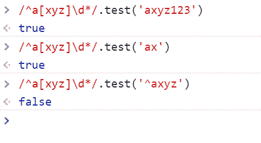

# 百度 2019 校招 Web 前端工程师笔试卷（第二批）

## 1

下面关于操作系统分页技术说法错误的是?

正确答案: B   你的答案: 空 (错误)

```cpp
固定分页是是多个作业共享主存空间，分区是事先划分好的
```

```cpp
可变分区分区大小不是预先固定的，而是按作业需求量来划分的；但是分区的个数和位置是预先确定的
```

```cpp
可变分区可以实行空闲区的合并
```

```cpp
只有请求分页处理不当会产生抖动
```

本题知识点

前端工程师 百度 2019

讨论

[宛如晴空](https://www.nowcoder.com/profile/649567520)

可变分区 [存储管理](https://baike.baidu.com/item/%E5%AD%98%E5%82%A8%E7%AE%A1%E7%90%86/9827115) 不是预先把内存中的用户区域划分成若干固定分区，而是在作业要求装入内存时，根据用户作业的大小和当时内存空间使用情况决定是否为该作业分配一个分区。因此分区大小不是预先固定的，而是按作业需求量来划分的；分区的个数和位置也不是预先确定的。

发表于 2019-04-29 21:23:34

* * *

## 2

关于 TCP 和 UDP 说法错误的是（）

正确答案: B   你的答案: 空 (错误)

```cpp
TCP 是面向连接的协议，UDP 是无连接的协议
```

```cpp
TCP 和 UDP 消息到达网络另一端都是有序的
```

```cpp
TCP 速度比较慢，UDP 速度比较快
```

```cpp
UDP 没有流量控制和拥塞控制
```

本题知识点

前端工程师 百度 2019

讨论

[夏花爱秋叶](https://www.nowcoder.com/profile/4085682)

```cpp
1.TCP 是面向连接的，属于点对点通信；UDP 是无连接的，可以点对点，可以点对多，也可以多对多
2.TCP 是安全可靠的，有重传机制，而且有序列号，会重新组装数据包；UDP 是不可靠的，没有重传机制，存在丢包可能
3.TCP 主要用于短信，微信等对安全性有较高要求的情景；而 UDP 用于即时游戏，视频通话等即使丢包也可以接受的情景
4.TCP 是面向字节流的模式，UDP 是面向数据报的模式
5.TCP 存在三握手，四挥手，而 UDP 是无连接的，所以就速度来说，TCP 慢些，UDP 会快一些

```

发表于 2020-04-08 21:40:16

* * *

[安如水](https://www.nowcoder.com/profile/788092848)

Tcp 有序，udp 无序

发表于 2019-05-13 13:39:35

* * *

## 3

下面关于 HTTP 协议说法错误的是（）

正确答案: A   你的答案: 空 (错误)

```cpp
202 状态码表示已经接受请求，并提供了请求网页
```

```cpp
请求头的后面的空行必不可少
```

```cpp
请求报文里面 Host 域和 HTTP 版本相关联
```

```cpp
302 状态码表示重定向
```

本题知识点

前端工程师 百度 前端工程师 百度 2019

讨论

[AllanXYZ](https://www.nowcoder.com/profile/123401933)

200 OK 代表请求没问题，响应实体的主体部分包含了所请求的资源
202 Accepted 代表请求已接受，但服务器还未对其执行任何动作
301 Moved Permanently 代表永久重定向
302 Found 代表临时重定向，客户端应该使用 Location 首部给出的 URL 来临时定位资源，但将来的请求仍应使用老的 URL

首部由一个空行（CRLF，carriage return & line feed）结束，表示首部列表的结束和实体主体部分的开始

URL 包含了 HTTP 协议版本、Host 域表示的主机组件、端口、路径、参数、用户名和密码。所以，请求报文中的 Host 域和 HTTP 版本是相关联的。

发表于 2019-05-05 21:19:43

* * *

[牛客 180498059 号](https://www.nowcoder.com/profile/180498059)

HTTP 状态码
2 开头表示成功处理了请求的状态代码。**（请求成功）**
3 开头表示要完成请求，需要进一步操作。**（请求被重定向）**
4 开头这些状态代码表示请求可能出错，妨碍了服务器的处理**（请求错误）**

发表于 2020-03-14 15:12:09

* * *

[zhouqctech](https://www.nowcoder.com/profile/1468715)

202：Accepted. 含义：请求已被接受，但服务器还未对其执行任何操作。不能保证服务器会完成这个请求，这只是意味着接受请求时，请求看起来是有效的。服务器应该在实体的主体部分包含对请求状态的描述，或许还应该有对请求完成时间的估计(或者包含一个指针，指向可以获取此信息的位置)

发表于 2019-05-13 11:02:14

* * *

## 4

栈 S 和队列 Q 的初始状态均为空，元素 abcdefgh 依次进入栈 S，若每个元素出栈后立即进入队列 Q，且 8 个元素的出队列顺序为 bdcfehga 则栈 S 的容量至少为？

正确答案: B   你的答案: 空 (错误)

```cpp
2
```

```cpp
3
```

```cpp
4
```

```cpp
5
```

本题知识点

前端工程师 百度 2019

讨论

[-LLLjr_](https://www.nowcoder.com/profile/886845118)

选 B， 应该为 3 队列是先进先出栈则是先进后出 a->b(in)->b(out)->c(in)->d(in)->d(out)->c(out)->e(in)->f(in)->f(out)->e(out)->g(in)-h(in)->h(out)->g(out)->a(out)

发表于 2019-05-02 17:12:52

* * *

## 5

对一组数据{49,38,65,97,76,13,27,49,55,4}进行排序，若前三趟的结果如下：（1）13,27,49,55,4,49,38,65,97,76（2）13,4,49,38,27,49,55,65,97,76（3）4,13,27,38,49,49,55,65,76,97 采用是排序算法可能是？

正确答案: A   你的答案: 空 (错误)

```cpp
希尔排序
```

```cpp
快排
```

```cpp
冒泡排序
```

```cpp
归并排序
```

本题知识点

前端工程师 百度 2019

讨论

[东封](https://www.nowcoder.com/profile/874414295)

希尔排序 希尔排序(Shell's Sort)是插入排序的一种又称“缩小增量排序”（Diminishing Increment Sort），是直接插入排序算法的一种更高效的改进版本。希尔排序是非稳定排序算法。该方法因 D.L.Shell 于 1959 年提出而得名。 希尔排序是把记录按下标的一定增量分组，对每组使用直接插入排序算法排序；随着增量逐渐减少，每组包含的关键词越来越多，当增量减至 1 时，整个文件恰被分成一组，算法便终止。[1]

发表于 2019-08-11 11:26:21

* * *

## 6

下列关于队列的说法错误的是（）

正确答案: B   你的答案: 空 (错误)

```cpp
将链式队列设计成一个带头结点的单链表可以方便插入和删除操作的统一
```

```cpp
若队列采用链式存储方式，则在进行删除操作时仅需修改尾指针
```

```cpp
双端队列的前端和后端都可以进行入队和出队操作
```

```cpp
队列的队尾指针通常指向队尾元素的下一个位置
```

本题知识点

前端工程师 百度 2019

讨论

[昼明夜暖](https://www.nowcoder.com/profile/9387926)

队列在删除操作时，是修改 front 指针啊，若队列为空，则将 front 指针赋值给 rear 指针，这时可以看做修改了尾指针。正确答案是什么意思？

发表于 2019-09-02 20:11:57

* * *

[安如水](https://www.nowcoder.com/profile/788092848)

还要修改被删除节点的前一个节点的尾指针指向被删除节点的尾指针指向的节点的头指针......

发表于 2019-05-14 14:36:19

* * *

## 7

二叉树是每个结点最多有两个子树的树结构,假设一棵二叉树的高度为 m，所有结点的度为 0，或为 2，则关于此树拥有的最少节点个数，下列选项正确的是（）

正确答案: A   你的答案: 空 (错误)

```cpp
2m-1
```

```cpp
2m-2
```

```cpp
2m+1
```

```cpp
m+1
```

本题知识点

前端工程师 百度 2019

讨论

[喃喃呐呐](https://www.nowcoder.com/profile/979887643)

节点的深度是指从根节点到该节点的最长简单路径边的条数，而高度是指从该节点到叶子节点的最长简单路径边的条数。

条数是规定根节点的深度和叶子节点的高度是 0，所以树的深度和高度是相等的，而对其他节点来说深度和高度不一定相等。

发表于 2020-09-10 21:06:01

* * *

[你瞒我瞒 201807201415884](https://www.nowcoder.com/profile/615510587)

m-1  +m

发表于 2020-11-01 18:51:45

* * *

[奥利啾](https://www.nowcoder.com/profile/557844083)

只有根节点的度为 0，其他节点的度都为 2（相当于是满二叉树了）

发表于 2019-09-09 17:34:46

* * *

## 8

对于 letter-spacing 说法正确的是（）

正确答案: C   你的答案: 空 (错误)

```cpp
此属性不可以继承；
```

```cpp
如果属性无单位时，表示文字的倍数；
```

```cpp
值可以为负数
```

```cpp
用来设置字符之间的垂直间距；
```

本题知识点

前端工程师 百度 2019

讨论

[zhouqctech](https://www.nowcoder.com/profile/1468715)

A. 属性可继承 B. 属性无单位时，无效 C. 值可以为负数 D. 用来设置字符之间的间距（没有水平间距和垂直间距的概念）

发表于 2019-05-13 11:37:58

* * *

## 9

关于盒模型描述正确的是

正确答案: C   你的答案: 空 (错误)

```cpp
IE 合模型中：盒子总宽度 = 左右 margin + 左右 border + width;
```

```cpp
标准盒模型中：盒子总宽度 = 左右 margin + 左右 border + width;
```

```cpp
标准盒模型中：盒子总宽度 = 左右 margin + 左右 border + 左右 padding + width;
```

```cpp
IE 盒模型中：盒子总宽度 = width;
```

本题知识点

前端工程师 百度 2019

讨论

[喃喃呐呐](https://www.nowcoder.com/profile/979887643)

标准盒子模型中：盒子的总宽度 ＝ 左右 margin + 左右 border + 左右 padding + width
IE 盒子模型中：盒子总宽度 ＝ 左右 margin +  width

发表于 2020-09-10 21:06:56

* * *

[zhouqctech](https://www.nowcoder.com/profile/1468715)

详情参考[Wikipedia: CSS box model](https://en.wikipedia.org/wiki/CSS_box_model)

1.  标准盒模型：等同于设置**{****box-sizing:** **content-box;****}**，**盒子总宽度 = margin-left + border-left + padding-left + width + padding-right + border-right + margin-right。**其中**，width 等于 content area 的宽度，即内容的宽度。**

2\. IE 盒模型：等同于设置**{box-sizing: border-box;}，盒子总宽度 = margin-left +** width + margin-right**。**其中，**width = **border-left + padding-left + 内容的宽度 + padding-right + border-right。****

编辑于 2019-05-13 12:13:59

* * *

[不完美卡卡](https://www.nowcoder.com/profile/4516985)

这个答案有正确的？

发表于 2019-07-21 11:33:49

* * *

## 10

请选出你认为以下 HTML 中说法不正确的选项

<p>&nbsp;&nbsp;百度一下，你就知道<br />来这里开始你的新的旅程吧。<div>加油！！</div></p>

正确答案: B   你的答案: 空 (错误)

```cpp
代码中不应该出现&nbsp;应该使用样式来设置；
```

```cpp
p 标签中可以包含任何标签；
```

```cpp
p 是段落，如需要换行，直接使用 p 标签，不需要在 p 标签中使用 br
```

```cpp
p 标签中不可以添加 div 这种块级元素标签；
```

本题知识点

前端工程师 百度 2019 HTML

讨论

[牛客 615440811 号](https://www.nowcoder.com/profile/615440811)

p 标签是块级元素，常理来说，块级元素是可以嵌套块级元素和行内元素的，但是 p 标签是个特殊，它里面不能嵌套块级元素。

发表于 2020-08-17 16:21:48

* * *

[zhouqctech](https://www.nowcoder.com/profile/1468715)

B. p 标签中不能包含某些标签，比如<li>标签等。[p 标签](https://developer.mozilla.org/en-US/docs/Web/HTML/Element/p)中只能包含[phrasing content](https://developer.mozilla.org/en-US/docs/Web/Guide/HTML/Content_categories#Phrasing_content)

发表于 2019-05-13 12:23:40

* * *

[牛客 838397722 号](https://www.nowcoder.com/profile/838397722)

p 标签内遇到下一个块级元素的标签会自动结束，例如<p>p 开始<div>xxxxx</div>p 结束</p>，会被解析为<p>p 开始</p><div>xxxxx</div><p>p 结束</p>，相当于写了两个 p 段落，这不是我们想要的结果

发表于 2021-09-05 10:07:43

* * *

## 11

<meta name="viewport" content="width=device-width, user-scalable=no, initial-scale=1.0, maximum-scale=1.0, minimum-scale=1.0, viewport-fit=cover">
以下说法错误的是

正确答案: C   你的答案: 空 (错误)

```cpp
initial-scale 表示的是初始缩放比例
```

```cpp
minimum-scale 表示允许用户缩放到的最小比例
```

```cpp
user-scalable 表示用户可以手动缩放的比例
```

```cpp
width=device-width 表示网页宽度为设备屏幕宽度
```

本题知识点

前端工程师 百度 2019 HTML

讨论

[圈～](https://www.nowcoder.com/profile/5121786)

initial-scale: viewport 的初始缩放级别（0-10 之间的正数，1 表示无缩放）minimum-scale: viewport 能缩放的最小值（0-10 之间的正数）maximum-scale: viewport 能缩放的最大值（0-10 之间的正数）user-scalable: 是否可以手动缩放（yes or no）

发表于 2020-08-21 23:14:16

* * *

[是客](https://www.nowcoder.com/profile/272146052)

就算啥都不懂 看到值为 no 也知道是不可以

发表于 2019-09-22 16:38:11

* * *

[牛客 287560791 号](https://www.nowcoder.com/profile/287560791)

initial-scale: viewport 的初始缩放级别（0-10 之间的正数，1 表示无缩放）minimum-scale: viewport 能缩放的最小值（0-10 之间的正数）maximum-scale: viewport 能缩放的最大值（0-10 之间的正数）user-scalable: 是否可以手动缩放（yes or no）

发表于 2022-02-28 14:20:57

* * *

## 12

下面哪 2 个对象的关系可以适用于面向对象里面的“继承”关系？

正确答案: B   你的答案: 空 (错误)

```cpp
车 vs 车轮
```

```cpp
车 vs 丰田车
```

```cpp
自行车 vs 摩托车
```

```cpp
玩具车 vs 丰田车
```

本题知识点

前端工程师 百度 2019

讨论

[chist](https://www.nowcoder.com/profile/9455287)

c++ primer plus b 继承 a，要满足 b is a

发表于 2019-09-03 09:47:16

* * *

[莱阳梨](https://www.nowcoder.com/profile/948160204)

B 所谓继承就子类继承了父类，在父类的基础上拓展了功能，java 单继承。但是有了接口以后就不能严格说成单继承了。

发表于 2019-07-02 15:23:49

* * *

## 13

下列描述中，不属于面向对象思想主要特征的是（）

正确答案: B   你的答案: 空 (错误)

```cpp
多态性
```

```cpp
跨平台性
```

```cpp
继承性
```

```cpp
封装性
```

本题知识点

前端工程师 百度 2019

讨论

[莱阳梨](https://www.nowcoder.com/profile/948160204)

B

发表于 2019-07-02 15:21:12

* * *

## 14

以下哪项不能提高 dom 元素操作效率：

正确答案: D   你的答案: 空 (错误)

```cpp
处理列表子元素的点击事件时，使用事件代理
```

```cpp
插入大量 DOM 元素时，使用 innerHTML 替代逐个构建元素
```

```cpp
使用 DocumentFragment 替代多次 appendChild 操作
```

```cpp
使用 addEventListener 替代 onxxx(比如 onclick) 进行事件绑定
```

本题知识点

前端工程师 百度 2019 HTML

讨论

[捌块腹肌](https://www.nowcoder.com/profile/973457488)

```cpp
处理列表子元素的点击事件时，使用事件代理  // 事件代理是根据事件冒泡原理，使用事件代理可以减少注册事件,节省内存
插入大量 DOM 元素时，使用 innerHTML 替代逐个构建元素 // 测试后发现 innerHTML 比 creaetElement 效率要高~至于为什么....没有深究~
使用 DocumentFragment 替代多次 appendChild 操作 // 将元素放入代码片段中一次插入比你创建一个插入一个效率肯定要高的多
使用 addEventListener 替代 onxxx(比如 onclick) 进行事件绑定 // 使用 addEventListener 监听事件不会被覆盖，而 on 会覆盖上一个事件
```

发表于 2021-03-11 10:21:11

* * *

[牛客 736072599 号](https://www.nowcoder.com/profile/736072599)

？

发表于 2020-08-08 20:28:19

* * *

[宅里](https://www.nowcoder.com/profile/816978025)

？

发表于 2020-08-15 16:22:37

* * *

## 15

以下标签用于在 html 中构建复选框的是

正确答案: C   你的答案: 空 (错误)

```cpp
<input type="radio"/>
```

```cpp
<input type="button"/>
```

```cpp
<input type="checkbox"/>
```

```cpp
<input type="text"/>
```

本题知识点

前端工程师 百度 2019 HTML

讨论

[机车双猫怪](https://www.nowcoder.com/profile/344692719)

单选普通复选文本

发表于 2021-01-13 09:52:35

* * *

[WEBJ2EE](https://www.nowcoder.com/profile/3930151)

C , 常识

发表于 2019-12-22 14:04:40

* * *

## 16

下面语句的执行结果是？
'a.b.c'.replace(/(.)\.(.)\.(.)/, '$2.$1.$0')

正确答案: D   你的答案: 空 (错误)

```cpp
cba
```

```cpp
c.b.a
```

```cpp
...
```

```cpp
b.a.$0
```

本题知识点

前端工程师 百度 2019

讨论

[chenlei_hero](https://www.nowcoder.com/profile/7347084)

[`www.w3school.com.cn/jsref/jsref_replace.asp`](http://www.w3school.com.cn/jsref/jsref_replace.asp)但是 replacement 中的 $ 字符具有特定的含义。如下表所示，它说明从模式匹配得到的字符串将用于替换。

| $1、$2、...、$99 | 与 regexp 中的第 1 到第 99 个子表达式相匹配的文本。 |

发表于 2019-05-18 12:49:36

* * *

[奥利啾](https://www.nowcoder.com/profile/557844083)

$0 是没有特殊意义的

发表于 2019-09-09 22:10:12

* * *

## 17

1. 以下语句中可以正常运行的是

正确答案: D   你的答案: 空 (错误)

```cpp
var 7Work = true;
```

```cpp
var hard# = true;
```

```cpp
var for = true;
```

```cpp
var $$Yourself = true;
```

本题知识点

前端工程师 百度 2019

讨论

[一只想要 Offer 的菜鸡](https://www.nowcoder.com/profile/156022867)

A 不能以数字开头 B 只允许字母下划线和美元符号或者数字 C 不能用关键字做变量名

发表于 2019-08-27 19:34:49

* * *

## 18

下列表达式中返回值为 NaN 的是

正确答案: C   你的答案: 空 (错误)

```cpp
parseInt('9527GoGo', 10)
```

```cpp
+null
```

```cpp
Number(undefined)
```

```cpp
true + 2
```

本题知识点

前端工程师 百度 2019

讨论

[阿文 _l](https://www.nowcoder.com/profile/214422400)

Number()：若值为 undefined 返回 NaN、为 null 返回 0。parseInt()：会忽略字符串前的空格，直到找到第一个非空格字符。第一个字不是数字字符或符号，返回 NaN（即值如果是 undefined，null，则返回 NaN）；解析遇到非数字字符或负号即停止；因此 a 选项返回 9527。+：与 Number()同样效果

发表于 2019-05-22 10:37:14

* * *

## 19

执行下列语句后，变量 num3 的值为 var num1 = 1;var num2 = 2;var num3 = num1++ + num2;

正确答案: A   你的答案: 空 (错误)

```cpp
3
```

```cpp
4
```

```cpp
5
```

```cpp
NaN
```

本题知识点

前端工程师 百度 2019

讨论

[HSNC_ming](https://www.nowcoder.com/profile/278636734)

num 是后自增所以应该是 1+2\. 如果是前自增那就是 2+2

发表于 2019-06-06 00:47:31

* * *

## 20

根据如下变量，下列表达式中返回值为 true 的是 var a = 1;var b = [];var c = '';var d = true;

正确答案: D   你的答案: 空 (错误)

```cpp
(a || b) === true
```

```cpp
(b && c) === true
```

```cpp
(c && d) === true
```

```cpp
(d || a) === true
```

本题知识点

前端工程师 百度 2019

讨论

[HSNC_ming](https://www.nowcoder.com/profile/278636734)

js 隐式转换 布尔值 true 可以转换成 1.

发表于 2019-06-06 00:49:53

* * *

[无限的爱人](https://www.nowcoder.com/profile/295142568)

===：称为等同符，当两边值的类型相同时，直接比较值，若类型不相同，直接返回 false；

发表于 2019-10-30 14:39:08

* * *

## 21

执行下列语句后，b.name 的值为 var name = 'tom';var a = {name: name};var b = Object.assign(a);

正确答案: B   你的答案: 空 (错误)

```cpp
name = 'jerry';
```

```cpp
tom
```

```cpp
jerry
```

```cpp
name
```

```cpp
undefined
```

本题知识点

前端工程师 百度 2019

讨论

[烟雨仔](https://www.nowcoder.com/profile/686030081)

这题题面有问题吧, 哪里有 Jerry?

发表于 2020-09-03 15:52:09

* * *

[双生*双生](https://www.nowcoder.com/profile/31138924)

**Object.assign()** 方法用于将所有可枚举属性的值从一个或多个源对象复制到目标对象。它将返回目标对象。

发表于 2019-06-11 16:07:24

* * *

## 22

执行下列语句后，a.length 的值为 var a = [];a.push(1, 2);
a.shift(3, 4);
a.concat([5, 6]);
a.splice(0, 1, 2);

正确答案: A   你的答案: 空 (错误)

```cpp
1
```

```cpp
2
```

```cpp
3
```

```cpp
4
```

本题知识点

前端工程师 百度 2019

讨论

[zhouqctech](https://www.nowcoder.com/profile/1468715)

```cpp
 var a = [];
 a.push(1, 2); // push 改变原数组 =》a: [1, 2]
 a.shift(3, 4); // shift 改变原数组 =》a: [2]
 a.concat([5, 6]); // concat 不改变原数组 => a: [2]
 a.splice(0, 1, 2); // splice 改变原数组 =》 a: [2]
 console.log(a); // [2]
 console.log(a.length); // 1
```

编辑于 2019-05-13 18:14:04

* * *

[巴拉拉拉](https://www.nowcoder.com/profile/4826142)

shift 不接收参数，concat 方法返回数组的副本，原来的 a 并不变

发表于 2019-05-05 11:01:10

* * *

[双生*双生](https://www.nowcoder.com/profile/31138924)

push() 方法可向数组的末尾添加一个或多个元素，并返回新的长度 shift() 方法用于把数组的第一个元素从其中删除，并返回第一个元素的值。concat() 方法用于连接两个或多个数组。该方法不会改变现有的数组，而仅仅会返回被连接数组的一个副本 split() 方法用于把一个字符串分割成字符串数组

发表于 2019-06-11 16:11:06

* * *

## 23

下列表达式中结果为 true 的是

正确答案: C   你的答案: 空 (错误)

```cpp
/^a[xyz]\d*/.test('^axd')
```

```cpp
/^a[xyz]\d*/.test('^axyz')
```

```cpp
/^a[xyz]\d*/.test('ax')
```

```cpp
/^a[xyz]\d*/.test('axyz123')
```

本题知识点

前端工程师 百度 2019 浩鲸云 2020

讨论

[Chihiro201901292026207](https://www.nowcoder.com/profile/417824451)

应该选 CD

发表于 2019-08-27 16:42:08

* * *

[zhouqctech](https://www.nowcoder.com/profile/1468715)

/^a[xyz]\d*/：匹配以字符"a"开头(/^a/)，"a"后面紧跟字符"x"或"y"或"z"(/^a[xyz]/)，然后紧跟 0 个或多个数字的字符串(/^a[xyz]\d*/)

编辑于 2019-05-13 18:32:45

* * *

[-LLLjr_](https://www.nowcoder.com/profile/886845118)

就感觉 D 也正确嘛

发表于 2019-05-02 17:21:53

* * *

## 24

表达式 Math.ceil(-0.5) + Math.round(-0.5) - Math.floor(-0.5) + Math.abs(0.5) 的值为

正确答案: D   你的答案: 空 (错误)

```cpp
-1.5
```

```cpp
-0.5
```

```cpp
0.5
```

```cpp
1.5
```

本题知识点

前端工程师 百度 2019

讨论

[MrOneCh](https://www.nowcoder.com/profile/451603702)

Math.ceil(-0.5)函数返回大于或等于一个给定数字的最小整数----即 0Math.round(-0.5) 四舍五入。-0.5 四舍五入为 0Math.floor(-0.5)  向下取整。-0.5 向下取整为 -1Math.abs(0.5) 函数代码的是返回参数的绝对值。故 0+0+（-1）+ 0.5 = 1.5 .选 D

发表于 2019-05-05 14:45:22

* * *

[一只想要 Offer 的菜鸡](https://www.nowcoder.com/profile/156022867)

Math.ceil 向上取整 Math.round 正数时 0.5 向上取，负数时 0.5 向下取 Math.floor 向下取整 

发表于 2019-08-27 21:48:42

* * *

[喃喃呐呐](https://www.nowcoder.com/profile/979887643)

Math.ceil()  “向上取整” 即小数部分直接舍去，并向正数部分进 1，Math.round()  “四舍五入”，为负数时，Math.round(x) ,x = -1 ~ -1.5 时结果为-1，反之为-2
Math.floor()  “向下取整

发表于 2020-09-10 21:52:20

* * *

## 25

关于 cp 复制指令，下面说法不正确的是？

正确答案: A D   你的答案: 空 (错误)

```cpp
用 root 身份将主文件夹下的.bashrc 复制到/tmp 下 并更名为 bashrc : cp /.bashrc   /tmp/bashrc
```

```cpp
复制/var/log/wtmp 到当前目录 cp  /var/log/wtmp  .
```

```cpp
复制/etc/下所有文件到/tmp 下  cp -r /etc/ /tmp
```

```cpp
创建（1）中的软链接 bashrc_  cp  -l  bashrc bashrc_
```

```cpp
若~/.bashrc 比 /tmp/bahsrc 新则复制过来 cp -u ~/.bashrc /tmp/bashrc
```

本题知识点

前端工程师 百度 2019

讨论

[赵春杨](https://www.nowcoder.com/profile/877961879)

linux 也不会啊

发表于 2020-03-14 18:18:23

* * *

[草丛有人](https://www.nowcoder.com/profile/943722054)

看不懂这道题

发表于 2019-12-17 18:49:40

* * *

## 26

关于堆的描述正确的是？

正确答案: A B D   你的答案: 空 (错误)

```cpp
高度为 h 的堆中，最多元素个数为 2h+1-1 个元素，最少有 2h 个元素
```

```cpp
假设最大堆的所有元素都不相同，那么该堆的最小元素可能不在最底层
```

```cpp
一个已经排序好的数组是一个最小堆
```

```cpp
值为{12,7,5,1,10,13,6,14,17,23}不是最小堆
```

本题知识点

前端工程师 百度 2019

讨论

[-LLLjr_](https://www.nowcoder.com/profile/886845118)

高度为 h 的堆，最多有 2^h-1 个元素，最少有 2 ^(h-1)个元素。在高度为 h 的大根堆中，关键字最小的元素存放在堆的第 h 层上的最后一个元素的位置 w 上，其中 2 ^(h-1)≤w≤2^h-1。

发表于 2019-05-02 17:26:45

* * *

[JsonWang0102](https://www.nowcoder.com/profile/482834539)

大根堆，最小元素在叶子节点中（最底层或次底层）。

发表于 2019-06-08 12:07:19

* * *

## 27

HTML5 提供的数据存储有哪些？

正确答案: A B D   你的答案: 空 (错误)

```cpp
localStorage
```

```cpp
sessionStorage
```

```cpp
cookieStorage
```

```cpp
webStorage
```

本题知识点

前端工程师 百度 2019 HTML

讨论

[许世流年 201711051007842](https://www.nowcoder.com/profile/8865229)

HTML5 中增加了两种全新的数据存储方式：WebStorage 和 WebSQLDatabase。 WebStorage 可用于临时或永久保存客户端的少量数据，WebSQLDatabase 是客户端本地化的一套数据库系统，可以将大量的数据保存在客户端，无须与服务器端进行交互，极大地减轻了服务器端的压力。 WebStorage 存储是 HTML5 为数据存储在客户端提供的一项重要功能，分为两种：sessionStorage(保存会话数据)和 loaclStorage(在客户端长期保存数据)。 sessionStorage 对象 使用 sessionStorage 对象在客户端保存的数据时间非常短暂，该数据实质上还是被保存在 session 对象中。用户在打开浏览器时，可以查看操作过程中要求临时保存的数据，一旦关闭浏览器，所有使用 sessionStorage 对象保存的数据将全部丢失。 保存数据只需调用 setItem()方法，格式：sessionStorage.setItem(key,value)。参数 key 表示被保存内容的键名，参数 value 表示被保存的内容。一旦键名设置成功，则不允许修改，不能重复，如果有重复的键名，只能修改对应的键值。 读取被保存的数据，应该调用 sessionStorage 对象中 getItem()方法，格式：sessionStorage.getItem(key)。该方法将返回一个指定键名对应的键值，如果不存在，则返回一个 null 值。 localStorage 对象 长期在客户端保存数据，应该使用 localStorage 对象，使用该对象可以将数据长期保存在客户端，直至人工清除为止。 保存数据调用对象中的 setItem()方法，格式：localStorage.setItem(key,value)。与 sessionStorage 对象保存数据一样。 读取数据调用对象中的 getItem()方法，格式：localStorage.getItem(key)。与 sessionStorage 对象读取数据一样。 localStorage 对象可以将内容长期保存在客户端，即使是重新打开浏览器也不会丢失。如果需要清除 localStorage 对象保存的内容，应该调用该对象的另一个方法 removeItem()，格式：localStorage.removeItem(key)。一旦删除成功，与键名对应的相应数据将全部被删除。

发表于 2019-05-14 11:42:41

* * *

[offer 快来我怀里~](https://www.nowcoder.com/profile/452892052)

HTML5 中增加了两种全新的数据存储方式：WebStorage 和 WebSQLDatabase。 

1.  WebStorage 可用于临时或永久保存客户端的少量数据，WebSQLDatabase 是客户端本地化的一套数据库系统，可以将大量的数据保存在客户端，无须与服务器端进行交互，极大地减轻了服务器端的压力。 
2.  WebStorage 存储是 HTML5 为数据存储在客户端提供的一项重要功能，分为两种：sessionStorage(保存会话数据)和 localStorage(在客户端长期保存数据)。

*   sessionStorage 对象：使用 sessionStorage 对象在客户端保存的数据时间非常短暂，该数据实质上还是被保存在 session 对象中。用户在打开浏览器时，可以查看操作过程中要求临时保存的数据，一旦关闭浏览器，所有使用 sessionStorage 对象保存的数据将全部丢失。 

1.  保存：保存数据只需调用 setItem()方法，格式：sessionStorage.setItem(key,value)。参数 key 表示被保存内容的键名，参数 value 表示被保存的内容。一旦键名设置成功，则不允许修改，不能重复，如果有重复的键名，只能修改对应的键值。 
2.  读取：读取被保存的数据，应该调用 sessionStorage 对象中 getItem()方法，格式：sessionStorage.getItem(key)。该方法将返回一个指定键名对应的键值，如果不存在，则返回一个 null 值。 

*   localStorage 对象：长期在客户端保存数据，应该使用 localStorage 对象，使用该对象可以将数据长期保存在客户端，直至人工清除为止。 

1.  保存：保存数据调用对象中的 setItem()方法，格式：localStorage.setItem(key,value)。
2.  读取：与 sessionStorage 对象保存数据一样。 读取数据调用对象中的 getItem()方法，格式：localStorage.getItem(key)。与 sessionStorage 对象读取数据一样。 localStorage 对象可以将内容长期保存在客户端，即使是重新打开浏览器也不会丢失。
3.  清除：如果需要清除 localStorage 对象保存的内容，应该调用该对象的另一个方法 removeItem()，格式：localStorage.removeItem(key)。一旦删除成功，与键名对应的相应数据将全部被删除。

发表于 2020-11-08 11:37:37

* * *

[牛客 62134823 号](https://www.nowcoder.com/profile/62134823)

那 D 为什么不对？

发表于 2020-10-14 00:58:18

* * *

## 28

在浏览器或者 Node.js 环境下执行以下代码片段，输出的结果可能为？

```cpp
console.log(1);
    setTimeout(function() {
    console.log(2);
}, 0);
new Promise((resolve, reject) => {
    console.log(3);
    resolve();
})
.then(() => {
    console.log(4);
});
console.log(5);
```

正确答案: A   你的答案: 空 (错误)

```cpp
1 3 5 4 2
```

```cpp
1 2 3 4 5
```

```cpp
1 5 3 4 2
```

```cpp
1 3 5 2 4
```

本题知识点

前端工程师 百度 2019

讨论

[-LLLjr_](https://www.nowcoder.com/profile/886845118)

先执行同步， 再执行异步异步，先微队列，再宏队列

发表于 2019-05-02 17:27:56

* * *

[韩雪红](https://www.nowcoder.com/profile/691349977)

不是选 D 么   异步任务  执行完不是才执行微任务么   

发表于 2020-09-13 11:56:15

* * *

[夏花爱秋叶](https://www.nowcoder.com/profile/4085682)

```cpp
// 1. setTimeout 和 setImmediate 都是宏任务，都会在下一轮宏任务执行
// 两者执行顺序不一定的！
setTimeout(function(){
	console.log("虽然是第一个宏任务，但是需要等待的时间较长，所以先执行其他阶段，之后重新进入 timers 阶段")
},3000)
setTimeout(function(){
	console.log('setTimeout')
},0)
setImmediate(function(){
	console.log('immediate')
})
// 虽然 promise 和 process.nextTick 都是属于异步任务，但是 process.nextTick 是异步任务中最快的！
// 所以一直都是先输出 3，再输出 1
new Promise((res,rej)=>res(1)).then(res=>console.log(res))
process.nextTick(()=>console.log("3"))
console.log("第一轮宏任务")

// 事件循环分为以下几个阶段:
// 1. timers:定时器阶段,处理 setTimeout 和 setInterval 的回调函数,如果定时器和计时器是属于本轮宏任务的话,否则就执行下个阶段,
// 2. I/O callback 阶段:`执行非计时器的回调函数，也就是除了 setTimeout/setInterval/setImmediate`,
// 3. idle,prepare:`只是 node.js 的 libuv 内部调用，可以忽略`,
// 4. Poll:轮询阶段,等待未返回的 I/O 事件,比如`服务器的响应,用户鼠标移动`等,
// 轮询阶段一般时间比较长,如果没有其他异步任务要处理,会一直停留在此处,等待 I/O 返回结果
// 5. check 阶段:执行 setImmediate 的回调函数,
// 6. close callback:执行关闭请求的回调函数,如关闭套接字

// 由于 setTimeout 在 timers 阶段执行，而 setImmediate 在 check 阶段执行，所以理论上 setTimeout 会比 setImmediate 先执行
// 虽然 setTimeout 可以设置时间为 0，但是 node 服务器做不到 0 毫秒，最少也要 1 毫秒
// 所以实际上，在等待 timers 阶段会结束，先执行其他阶段，去执行 setImmediate,之后再去执行 setTimeout
// 因此，输出顺序不一定！
// 推荐:http://www.ruanyifeng.com/blog/2018/02/node-event-loop.html 
```

发表于 2020-04-08 23:35:29

* * *

## 29

在 Node.js 环境下执行以下代码片段，输出的结果可能为？

```cpp
console.log(1);
process.nextTick(() => {
    console.log(2);
process.nextTick(() => {
    console.log(3);
    });
});
setTimeout(() => {
    console.log(4);
}, 10);
setImmediate(() => {
    console.log(5);
});
while (Math.random() < 0.99999);
console.log(6);
```

正确答案: A B   你的答案: 空 (错误)

```cpp
1 6 2 3 5 4
```

```cpp
1 6 2 3 4 5
```

```cpp
1 6 2 4 5 3
```

```cpp
1 6 2 5 4 3
```

本题知识点

前端工程师 百度 2019

讨论

[夏花爱秋叶](https://www.nowcoder.com/profile/4085682)

```cpp
// 1. setTimeout 和 setImmediate 都是宏任务，都会在下一轮宏任务执行
// 两者执行顺序不一定的！
setTimeout(function(){
    console.log("虽然是第一个宏任务，但是需要等待的时间较长，所以先执行其他阶段，之后重新进入 timers 阶段")
},3000)
setTimeout(function(){
    console.log('setTimeout')
},0)
setImmediate(function(){
    console.log('immediate')
})
// 虽然 promise 和 process.nextTick 都是属于异步任务，但是 process.nextTick 是异步任务中最快的！
// 所以一直都是先输出 3，再输出 1
new Promise((res,rej)=>res(1)).then(res=>console.log(res))
process.nextTick(()=>console.log("3"))
console.log("第一轮宏任务")

// 事件循环分为以下几个阶段:
// 1. timers:定时器阶段,处理 setTimeout 和 setInterval 的回调函数,如果定时器和计时器是属于本轮宏任务的话,否则就执行下个阶段,
// 2. I/O callback 阶段:`执行非计时器的回调函数，也就是除了 setTimeout/setInterval/setImmediate`,
// 3. idle,prepare:`只是 node.js 的 libuv 内部调用，可以忽略`,
// 4. Poll:轮询阶段,等待未返回的 I/O 事件,比如`服务器的响应,用户鼠标移动`等,
// 轮询阶段一般时间比较长,如果没有其他异步任务要处理,会一直停留在此处,等待 I/O 返回结果
// 5. check 阶段:执行 setImmediate 的回调函数,
// 6. close callback:执行关闭请求的回调函数,如关闭套接字

// 由于 setTimeout 在 timers 阶段执行，而 setImmediate 在 check 阶段执行，所以理论上 setTimeout 会比 setImmediate 先执行
// 虽然 setTimeout 可以设置时间为 0，但是 node 服务器做不到 0 毫秒，最少也要 1 毫秒
// 所以实际上，在等待 timers 阶段会结束，先执行其他阶段，去执行 setImmediate,之后再去执行 setTimeout
// 因此，输出顺序不一定！
// 推荐:<a href="http://www.ruanyifeng.com/blog/2018/02/node-event-loop.html" target="_blank">http://www.ruanyifeng.com/blog/2018/02/node-event-loop.html </a>
```

发表于 2020-04-08 23:37:20

* * *

[JsonWang0102](https://www.nowcoder.com/profile/482834539)

macro-task(宏任务)：包括整体代码 script，setTimeout，setInterval
micro-task(微任务)：Promise，process.nextTick

发表于 2019-06-08 12:09:52

* * *

## 30

关于 Node.js 中的进程稳定性保障，正确的有哪些？

正确答案: A B C D   你的答案: 空 (错误)

```cpp
process.on('uncaughtExpection', callback) 可以处理未捕获的 throw Error 异常
```

```cpp
process.on('unhandledRejection', callback) 用于处理未捕获的 promise reject 异常
```

```cpp
尽可能手动的为一些可能出现异常的代码片段加上 try...catch，如 JSON.parse
```

```cpp
为保证进程在系统收到信号时间时正常退出，通常我们会在 process.on('SIGTERM', callback) 去释放占用的资源
```

本题知识点

前端工程师 百度 2019

## 31

实现一个 EventEmitter 类，要求包括：on\emit\off\once 方法

你的答案

本题知识点

前端工程师 百度 2019

讨论

[AllanXYZ](https://www.nowcoder.com/profile/123401933)

```cpp
class EventEmitter {
    constructor () {
        super()
       this.events = {}
        this.onceEvents = {}  
    }

    on (type, cb) {
        if (!type || !cb) {
            return false
        }
        this.events[type] = this.events[type] || []
        this.events[type].push(cb)
    }

    emit (type) {
        if (!type) {
            return false
        }
        this.events[type] && this.events[type].forEach(eventCb => {
            eventCb.apply(this, [...arguments].slice(1))
        })
        this.onceEvents[type] && this.onceEvents[type].forEach(eventCb => {
            eventCb.apply(this, [...arguments].slice(1))
        })
        delete this.onceEvents[type]
    }

    off (type) {
        if (!type) {
            return false
        }
        delete this.events[type]
        delete this.onceEvents[type]
    }

    once (type, cb) {
        if (!type || !cb) {
            return false
        }
        this.onceEvents[type] = this.onceEvents[type] || []
        this.onceEvents[type].push(cb)
    }
}
```

发表于 2019-05-02 16:09:55

* * *

[喃喃呐呐](https://www.nowcoder.com/profile/979887643)

```cpp
class EventEmitter{
      	constructor(){
            this._events = Object.create(null)
        }

        on(event,callback){
            let callbacks = this._events[event] || []
            this._events[event] = callbacks
            return this
        }
        off(event,callback){
            let callbacks = this._events[event]
            this._events[event] = callbacks && callbacks.filter(fn => fn !== callback)
            return this
        }
        emit(...args){
            const event = args[0]
            const params = [].slice.call(args,1)
            const callbacks = this._events[event]
            callbacks.forEach(fn => fn.apply(this.params))
            return this
        }
        once(event,callback){
            let wrapFanc = (...args) => {
                callback.apply(this.args)
                this.off(event,wrapFanc)
            }
            this.on(event,wrapFanc)
            return this
        }
    }
```

发表于 2020-09-11 09:34:27

* * *

[小宇点](https://www.nowcoder.com/profile/217429291)

```cpp
class EventEmitter{
    constructor(){
        this.cacheEvenet = {};
    }
    on(type, hanlder){
        if(!this.cacheEvenet){
            this.cacheEvenet = {};
        }
        if(!this.cacheEvenet[type]){
            this.cacheEvenet[type] = [hanlder];   
        }else{
            this.cacheEvenet[type].push(hanlder);
        }
    }
    emit(type){
        var params = arguments.length > 1 ? Array.prototype.slice.call(arguments, 1) : [];
        if(this.cacheEvenet[type]){
            this.cacheEvenet[type].forEach(item => {
                item.apply(this, params);
            })
        }
    }
    off(){
        this.cacheEvenet = {};
    }
    once(type){
        if(this.cacheEvenet[type]){
            var len = this.cacheEvenet[type].length;
            for(var i = 0; i < len; i++){
                if(typeof this.cacheEvenet[type][i] === 'function'){
                    var fn = this.cacheEvenet[type][i];
                    fn();
                    this.cacheEvenet[type][i] = null;
                }
            }
        }
    }
}
```

发表于 2020-05-08 00:08:29

* * *

## 32

如何提升页面加载速度，并简述原理

你的答案

本题知识点

前端工程师 百度 2019

讨论

[AllanXYZ](https://www.nowcoder.com/profile/123401933)

页面的加载过程主要分为下载、解析、渲染三个步骤，下面从这三个方面阐述提升加载速度的方法：1、加快文件下载速度，减小资源文件下载对页面解析的阻塞。页面加载过程首先会下载 HTML 文件，然后自上而下开始解析，解析过程中如果遇到外部资源则会开始下载，直至下载完成才会继续解析。所以，加快文件下载速度方式是有效的提升页面加载速度的方法。具体可以是 1）通过设置 CDN、HTTP 缓存等方式，减少 HTTP 传输时间；2）对文件进行压缩，减小文件体积；3）对 script、CSS 文件引用标签设置异步下载属性，避免对 HTML 文件解析产生阻塞 2、将样式写在 head 中，将 JS 代码或文件引用写在 body 的最后。在 HTML 文件下载的过程中，会同步的对文件流进行解析成 DOM 结构，当遇到 CSS 代码时，会将其解析成 CSSOM 树；当遇到 JS 脚本时，会将其同步执行，并且阻塞继续解析，执行之后方才继续解析。最后，将 DOM 和 CSSOM 渲染至页面上。所以，将样式写在 head 中，可以尽早地构建 CSSOM 树；将 JS 代码写在 body 最后，不会对 DOM 解析造成阻塞，可以最快地完成页面地构建 3、尽可能地提升浏览器渲染速度。包括 1）避免出现冗余 HTML 标签，提升 DOM 结构地构建速度；2）精简 CSS 样式及选择器，提升 CSSOM 构建及匹配速度；3）如果是单页面应用，则页面结构依赖 JS 的执行。可以优化 JS 代码，尽早输出首屏结构；或采用服务端渲染的方式，直接传输 HTML 结构，减少首屏时间

发表于 2019-05-02 16:59:26

* * *

[喃喃呐呐](https://www.nowcoder.com/profile/979887643)

（1） 减少 http 请求次数：CSS Sprites, JS、CSS 源码压缩、图片大小控制合适；网页 Gzip，CDN 托管，data 缓存 ，图片服务器。
（2） 前端模板 JS+数据，减少由于 HTML 标签导致的带宽浪费，前端用变量保存 AJAX 请求结果，每次操作本地变量，不用请求，减少请求次数
（3） 用 innerHTML 代替 DOM 操作，减少 DOM 操作次数，优化 javascript 性能。
（4） 当需要设置的样式很多时设置 className 而不是直接操作 style。
（5） 少用全局变量、缓存 DOM 节点查找的结果。减少 IO 读取操作。
（6） 避免使用 CSS Expression（css 表达式)又称 Dynamic properties(动态属性)。
（7） 图片预加载，将样式表放在顶部，将脚本放在底部 加上时间戳。

发表于 2020-09-11 09:51:05

* * *

## 33

牛牛和妞妞正在玩一个猜数游戏，妞妞心里想两个不相等的正数，把这两个正数的和 y 告诉牛牛。妞妞声称这两个数都不超过 x，让牛牛猜这两个数是多少。牛牛每猜一次，妞妞会告诉他猜对了还是猜错了，猜对了就停止游戏，猜错了就直到牛牛猜对为止。
妞妞为了加大难度，有时会误报 x 的大小，如果牛牛可以判断出了这个 x 是错误的，就会直接询问妞妞答案。
牛牛最坏情况下要猜多少次才能猜到妞妞想的数呢？

本题知识点

前端工程师 百度 数学 穷举 2019

讨论

[lmz9509](https://www.nowcoder.com/profile/122121993)

```cpp
/*
假设两个数时 a,b
想法：首先当 2*x<y 的时候，这个 x 就是错的，直接输出 0
然后判断 x 与 y 的大小关系，当 x<Y 时，这时候 a,b，就是根据 x 来变化的，a 取值最大为 x，b 起始位 y-x,递减，b 递增
当 y<x 的时候，a,b 就是依据 y 来决定，a 最大为 y，b 起始位 0

示例： 7 10
a    b
7    3
6    4
5    5
后面是重复的

示例：8    5
a    b
5    0
4    1
3    2
后面是重复的

这个规律我们发现只需要用(x-(y-x)+1)/2 或者 y/2 就可以得到最坏的次数

*/
import java.io.BufferedReader;
import java.io.IOException;
import java.io.InputStreamReader;
public class Main{
    public static void main(String[] args)throws IOException{
        BufferedReader br = new BufferedReader(new InputStreamReader(System.in));
        String[] str = br.readLine().split(" ");
        long x = Long.parseLong(str[0]);
        long y = Long.parseLong(str[1]);
        if(x*2<y){
            System.out.println(0);
            return;
        }
        if(x<y)
            System.out.print((x-(y-x)+1)/2);
        if(y<=x)
            System.out.print(y/2);
    }
}

```

发表于 2020-05-07 12:43:41

* * *

[nbgao](https://www.nowcoder.com/profile/211289)

```cpp
#include <bits/stdc++.h>
using namespace std;

int main(){
    long x,y;
    cin>>x>>y;
    if(x>=y)
        cout<<((y-1)>>1)<<endl;
    else{
        if((x<<1)<y)
            cout<<0<<endl;
        else
            cout<<x-(y>>1)<<endl;
    }
    return 0;
}
```

发表于 2019-08-19 23:04:22

* * *

[零葬](https://www.nowcoder.com/profile/75718849)

有如下两种情况：1.x 有误的情况：如果 2x<=y，则 x 肯定有误，因为两个不超过 x 的数相加是不可能等于 y 的。2.其他情况又分为两种：(1) x < y：如题中所给示例(7,10)，从 x 开始入手，尝试顺序为(7,3)->(6,4)->(5,5)->(4,6)->(3,7)，5 个数对中有 2 个数对其实是重复的，排除相等的(5,5)，其实一共只需要尝试 2 次，2=5/2；如果将 y 改成 11 的话很明显就会多一次，因为奇数不存在两个相等数的情况。所以在这种情况下尝试的最多次数由 x 和 y-x 的差距决定（因为根据 x 入手拼凑数对时，一个数为 x，另一个数为 y-x），为[x-(y-x)+1]/2=(2x-y+1)/2。(2) x > y：如果是这种情况，如(8,5)，就直接从 y 入手，尝试顺序为(4,1)->(3,2)->(2,3)->(1,4)，有 2 个数对是重复的，只需要猜 2 次，2=5/2，而将 y 改为 6，偶数会有一次是两数相等的情况，应该排除，所以仍然是 2 次。在这种情况下尝试的最多次数由 y 决定，为 y/2。

```cpp
import java.io.BufferedReader;
import java.io.InputStreamReader;
import java.io.IOException;

public class Main {
    public static void main(String[] args) throws IOException {
        BufferedReader br = new BufferedReader(new InputStreamReader(System.in));
        String[] params = br.readLine().trim().split(" ");
        long x = Long.parseLong(params[0]);
        long y = Long.parseLong(params[1]);
        if(2*x <= y){
            // 两个数都不超过 x，加起来是不可能为 y 的
            System.out.println(0);
        }else{
            if(x < y){
                if(y % 2 == 0)
                    System.out.println((2*x - y) / 2);
                else
                    System.out.println((2*x - y) / 2 + 1);
            }else{
                System.out.println(y / 2);
            }
        }
    }
}
```

发表于 2021-02-25 20:53:18

* * *

## 34

页面上存在 id 为 jsBlink 的下划线闪动节点，请按照如下需求实现 output 函数
1、函数 output 接收一个字符串参数，每隔 200 毫秒在闪动节点之前逐个显示字符
2、请新建 span 节点放置每个字符，其中 span 必须存在 class "word"，并随机加上 color1 ~ color24 中的任一个 class（请使用系统随机函数）
3、每次输出指定字符串前，请将闪动节点之前的所有其他节点移除
4、不要销毁或者重新创建闪动节点
5、如果输出字符为空格、<、>，请分别对其进行 HTML 转义，如果是\n 请直接输出<br />，其他字符不需要做处理
6、请不要手动调用 output 函数
7、当前界面为系统执行 output('hello world\n 你好世界') 之后，最终的界面，过程请参考以下图片
8、请不要手动修改 html 和 css
9、不要使用第三方插件 10、请使用 ES5 语法

本题知识点

前端工程师 百度 字符串 *模拟 2019* *讨论

[清^欢](https://www.nowcoder.com/profile/61309973)

```cpp
function output(str) {
    //删除原有结点
    var contents = document.getElementsByClassName('content');
    var jsBlink = document.getElementById('jsBlink');
    var childs = contents[0].childNodes;
    while(childs.length > 0){
        if(childs[0] == jsBlink){
            break;
        }
        contents[0].removeChild(childs[0]);
    }
    var i = 0;
    //每隔 200 毫秒输出字符
    var fun = setInterval(function(){
        if(i == str.length) clearInterval(fun);
        else{
            var c = str[i];
            if(c == '\n'){
                console.log(c);
                var br = document.createElement('br');
                contents[0].insertBefore(br, jsBlink);
            }else{
                var newSpan = document.createElement('span');
                newSpan.className = "word color" + (Math.floor(Math.random() * 24) + 1);
                if(c == '<'){
                    c = '&lt';
                }else if(c == '>'){
                    c = '&gt';
                }else if(c == ' '){
                    c = '&nbsp';
                }
                newSpan.innerHTML = c;
                contents[0].insertBefore(newSpan, jsBlink);
            }
            i++;
        }
    }, 200);
}
```

发表于 2020-03-14 13:33:12

* * *

[鱼忘七秒](https://www.nowcoder.com/profile/713232187)

```cpp
function output(str) {
            //先删除原有的节点  
            var showContent = document.getElementsByClassName("content");
            var childSpan = document.getElementsByClassName("word");
            console.log(showContent)
            console.log(childSpan)
            while (childSpan.length > 0) {
                showContent[0].removeChild(childSpan[0]);
            }
            //删除剩下的换行 
            var brr = document.getElementsByTagName("br"); 
            if (brr.length > 0) {
                showContent[0].removeChild(brr[0]);
            }          

            //转义  
            var arr = str.split('');
            console.log(arr)
            for (var i = 0; i < arr.length; i++) {
                if (arr[i] != " " || arr[i] != "<" || arr[i] != ">") {

                } else {
                    arr[i] = arr[i].replace(/[<>\ ]/g, function (c) {
                        switch (c) {
                            case "<":
                                return '&lt';
                                break;
                            case ">":
                                return '&gt';
                                break;                      
                            case "\ ":
                                return '&nbsp';
                                break;                           
                        }
                    })
                }
            }
            console.log(arr);

            //获取闪动节点  
            var blink = document.getElementById("jsBlink");
            //设置定时器  
            var j = 0;
            var sId;
            var tId;
            var show = setInterval(function () {
                if (j >= arr.length) {
                    clearInterval(show);
                    sId = setTimeout(function () {
                        //先删除原有的节点  
                        var showContent = document.getElementsByClassName("content");
                        var childSpan = document.getElementsByClassName("word");
                        console.log(showContent)
                        console.log(childSpan)
                        while (childSpan.length > 0) {
                            showContent[0].removeChild(childSpan[0]);
                        }
                        //删除剩下的换行 
                        var brr = document.getElementsByTagName("br");
                        showContent[0].removeChild(brr[0]);
                    }, 500);

                    tId = setTimeout(function () {
                        output("hello world\n 你好世界");
                    }, 1000)
                    return
                }
                if (arr[j] == "\n") {
                    var newChild = document.createElement("br");
                    showContent[0].insertBefore(newChild, blink);
                } else {
                    var newChild = document.createElement("span");
                    newChild.innerHTML = arr[j];    //包括空格
                    newChild.className = "word" + " color" + (Math.floor(Math.random() * (24 - 1 + 1)) + 1);
                    showContent[0].insertBefore(newChild, blink);
                }
                j++;
            }, 200);
        }

        output("hello world\n 你好世界")
```

注意开始和最后闪动节点闪了两处

发表于 2019-08-19 00:27:23

* * *

[小宇点](https://www.nowcoder.com/profile/217429291)

```cpp
function output(str) {
            var content = document.getElementsByClassName('content')[0];
            //每次都清空页面，只保留一个闪光点
            content.innerHTML = '<span class="blink" id="jsBlink">|</span>';
            var strArr = str.split('');
            var contentSpan = document.getElementsByClassName('word');
            var jsBlink = document.getElementById('jsBlink');
            //把每一个特殊的字符转义
            strArr = strArr.map(function (item) {
                if (item === '<') {
                    return '&lt;'
                } else if (item === '>') {
                    return '&gt;'
                } else if (item === '\n') {
                    return '<br>'
                } else {
                    return item;
                }
            })
            var i = 0;
            var timer = setInterval(() => {
                if(i === strArr.length){
                    clearInterval(timer);
                }else{
                    var span = document.createElement('span');
                    span.classList.add('word');
                    var strNum = 'color' + Math.floor(Math.random() * (23 - 0) + 0);
                    span.classList.add(strNum);
                    span.innerHTML = strArr[i];
                    content.insertBefore(span, jsBlink);
                    i++;
                }
            }, 200)

        }
```

发表于 2020-05-08 00:37:12

* * **