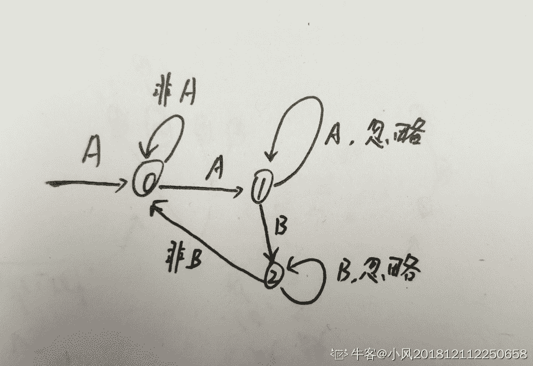
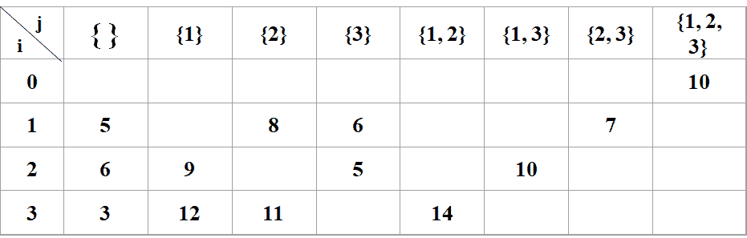

# 字节跳动 2019 春招研发部分编程题汇总

## 1

我叫王大锤，是一家出版社的编辑。我负责校对投稿来的英文稿件，这份工作非常烦人，因为每天都要去修正无数的拼写错误。但是，优秀的人总能在平凡的工作中发现真理。我发现一个发现拼写错误的捷径：1\. 三个同样的字母连在一起，一定是拼写错误，去掉一个的就好啦：比如 helllo -> hello2\. 两对一样的字母（AABB 型）连在一起，一定是拼写错误，去掉第二对的一个字母就好啦：比如 helloo -> hello3\. 上面的规则优先“从左到右”匹配，即如果是 AABBCC，虽然 AABB 和 BBCC 都是错误拼写，应该优先考虑修复 AABB，结果为 AABCC 我特喵是个天才！我在蓝翔学过挖掘机和程序设计，按照这个原理写了一个自动校对器，工作效率从此起飞。用不了多久，我就会出任 CEO，当上董事长，迎娶白富美，走上人生巅峰，想想都有点小激动呢！……万万没想到，我被开除了，临走时老板对我说： “做人做事要兢兢业业、勤勤恳恳、本本分分，人要是行，干一行行一行。一行行行行行；要是不行，干一行不行一行，一行不行行行不行。” 我现在整个人红红火火恍恍惚惚的……请听题：请实现大锤的自动校对程序数据范围：  ，每个用例的字符串长度满足 

本题知识点

Java 工程师 C++工程师 安卓工程师 iOS 工程师 运维工程师 算法工程师 PHP 工程师 测试工程师 字节跳动 字符串 *模拟 2019* *讨论

[小风 201812112250658](https://www.nowcoder.com/profile/32467579)

自动机是一个非常方便的工具

```cpp
#include<iostream>
#include<string>
using namespace std;

int main() {
	//自动机
	int n;
	cin >> n;

	while (n--) {
		int state = 0;//初始化为状态 0
		char cur;//当前字符
		string str;//目标字符串

		cin >> str;
		char last = str[0];//初始化为第一个字符

		string ans = "";
		ans += str[0];//初始化

		for (int i = 1; i < str.size(); ++i) {//开始
			cur = str[i];
			switch (state)
			{
			case 0:
			{
				if (cur == last)//如果是相等的，进入状态 1，否则继续状态 0；
					state = 1;	//进入状态 1：AA 形式
				else state = 0; //继续状态 0：AB 形式，即正常形式
				break;
			}
			case 1:
			{
				if (cur == last)
					continue;//AAA,忽略即可
				else
					state = 2;//进入状态 3：AAB 形式
				break;
			}
			case 2:
			{
				if (cur == last)
					continue;//AABB，忽略即可
				else
					state = 0;//AABC，就是状态 0
				break;
			}
			default:
				break;
			}
			ans = ans + cur;
			last = cur;
		}
		cout << ans << endl;
	}
	return 0;
}
```

编辑于 2019-08-16 14:47:08

* * *

[Lunatic201904011812400](https://www.nowcoder.com/profile/313619677)

 ```cpp
public class Main {
    public static void main(String[] args) {
        Scanner scanner = new Scanner(System.in);
        int line = scanner.nextInt();
        scanner.nextLine();
        for (int i = 0; i < line; i++) {
            System.out.println(scanner.nextLine().replaceAll("(.)\\1+","$1$1").replaceAll("(.)\\1(.)\\2","$1$1$2"));
        }
    }
}
```

😛😛 

编辑于 2019-08-22 10:59:47

* * *

[无心 2019](https://www.nowcoder.com/profile/991674511)

```cpp
#include <bits/stdc++.h>
using namespace std;
int main() 
{
    int n;
    cin>>n;
    string s;
    while(n--)
    {
        cin>>s;
        int j=0;
        for(int i=0;i<s.size();i++)
        {
            s[j++]=s[i];   //j 还没用
            if(j>=3&&s[j-1]==s[j-2]&&s[j-2]==s[j-3]) 
                j--;
            if(j>=4&&s[j-1]==s[j-2]&&s[j-3]==s[j-4]) 
                j--;
        }
        s.erase(s.begin()+j,s.end());
        cout<<s<<endl;
    }
}

```

发表于 2019-07-19 21:43:49

* * *

## 2

我叫王大锤，是一名特工。我刚刚接到任务：在字节跳动大街进行埋伏，抓捕恐怖分子孔连顺。和我一起行动的还有另外两名特工，我提议 1\. 我们在字节跳动大街的 N 个建筑中选定 3 个埋伏地点。2\. 为了相互照应，我们决定相距最远的两名特工间的距离不超过 D 。我特喵是个天才! 经过精密的计算，我们从 X 种可行的埋伏方案中选择了一种。这个方案万无一失，颤抖吧，孔连顺！……万万没想到，计划还是失败了，孔连顺化妆成小龙女，混在 cosplay 的队伍中逃出了字节跳动大街。只怪他的伪装太成功了，就是杨过本人来了也发现不了的！请听题：给定 N（可选作为埋伏点的建筑物数）、 D（相距最远的两名特工间的距离的最大值）以及可选建筑的坐标，计算在这次行动中，大锤的小队有多少种埋伏选择。注意：1\. 两个特工不能埋伏在同一地点 2\. 三个特工是等价的：即同样的位置组合( A , B , C ) 只算一种埋伏方法，不能因“特工之间互换位置”而重复使用数据范围： 

本题知识点

Java 工程师 C++工程师 安卓工程师 iOS 工程师 运维工程师 算法工程师 PHP 工程师 测试工程师 字节跳动 数学 2019 查找 *动态规划* *讨论

[算法才是灵魂](https://www.nowcoder.com/profile/4088795)

时间复杂度 O(N)

```cpp
n, dist = map(int, input().split())
nums = list(map(int, input().split()))

res = 0
left = 0
right = 2

while left < n-2:
    while right < n and nums[right] - nums[left] <= dist:
        right += 1
    if right - 1 - left >= 2:
        num = right - left - 1
        res += num * (num - 1) // 2
    left += 1

print(res % 99997867)
```

发表于 2019-05-28 20:42:25

* * *

[MissXy_](https://www.nowcoder.com/profile/637913)

```cpp
#include <iostream> 
#include <vector>
using namespace std;

long long C(long long n){
    return (n-1) * n / 2;
}

int main()
{
    long long n, d, count = 0;
    cin>> n>> d;
    vector<long long> v(n);
    for (int i = 0, j = 0; i < n; i++) {
        cin>> v[i];
        while (i >= 2 && (v[i] - v[j]) > d) {
            j++;
        }
        count += C(i - j);
    }
    cout << count % 99997867; 
    return 0;
}

```

发表于 2019-06-20 15:29:44

* * *

[kakifuu](https://www.nowcoder.com/profile/671043394)

```cpp
import java.util.*;

public class Main {
    private int mod = 99997867;

    private void sln() {
        Scanner sc = new Scanner(System.in);
        int N = sc.nextInt(), D = sc.nextInt();
        long cnt = 0;
        if (N <= 2) {
            System.out.println(-1);
            return;
        }
        int[] locs = new int[N];
        for (int i = 0; i < N; i++) {
            locs[i] = sc.nextInt();
        }
        sc.close();
        int left = 0, right = 2;
        while (right < N) {
            if (locs[right] - locs[left] > D) left++;
            else if (right - left < 2) right++;
            else {
                cnt += calC(right - left);
                right++;
            }
        }
        cnt %= mod;
        System.out.println(cnt);
    }

    private long calC(long num) {
        return num * (num - 1) / 2;
    }

    public static void main(String[] args) {
        new Main().sln();
    }
}

```

发表于 2019-08-08 09:02:43

* * *

## 3

小包最近迷上了一款叫做雀魂的麻将游戏，但是这个游戏规则太复杂，小包玩了几个月了还是输多赢少。于是生气的小包根据游戏简化了一下规则发明了一种新的麻将，只留下一种花色，并且去除了一些特殊和牌方式（例如七对子等），具体的规则如下：

1.  总共有 36 张牌，每张牌是 1~9。每个数字 4 张牌。
2.  你手里有其中的 14 张牌，如果这 14 张牌满足如下条件，即算作和牌

*   14 张牌中有 2 张相同数字的牌，称为雀头。
*   除去上述 2 张牌，剩下 12 张牌可以组成 4 个顺子或刻子。顺子的意思是递增的连续 3 个数字牌（例如 234,567 等），刻子的意思是相同数字的 3 个数字牌（例如 111,777）

例如：1 1 1 2 2 2 6 6 6 7 7 7 9 9 可以组成 1,2,6,7 的 4 个刻子和 9 的雀头，可以和牌 1 1 1 1 2 2 3 3 5 6 7 7 8 9 用 1 做雀头，组 123,123,567,789 的四个顺子，可以和牌 1 1 1 2 2 2 3 3 3 5 6 7 7 9 无论用 1 2 3 7 哪个做雀头，都无法组成和牌的条件。现在，小包从 36 张牌中抽取了 13 张牌，他想知道在剩下的 23 张牌中，再取一张牌，取到哪几种数字牌可以和牌。

本题知识点

Java 工程师 C++工程师 安卓工程师 iOS 工程师 运维工程师 算法工程师 PHP 工程师 测试工程师 字节跳动 动态规划 穷举 模拟 2019

讨论

[牛客 7587184 号](https://www.nowcoder.com/profile/7587184)

```cpp
def isHu(nums):
    """
    判断是否可以胡牌
    :param nums:
    :return:
    """
    if not nums:
        return True
    n = len(nums)
    count0 = nums.count(nums[0])
    # 没出现过雀头，且第一个数字出现的次数 >= 2,去掉雀头剩下的能不能和牌
    if n % 3 != 0 and count0 >= 2 and isHu(nums[2:]) == True:
        return True
    # 如果第一个数字出现次数 >= 3，去掉这个刻子后看剩下的能和牌
    if count0 >= 3 and isHu(nums[3:]) == True:
        return True
    # 如果存在顺子，移除顺子后剩下的能和牌
    if nums[0] + 1 in nums and nums[0] + 2 in nums:
        last_nums = nums.copy()
        last_nums.remove(nums[0])
        last_nums.remove(nums[0] + 1)
        last_nums.remove(nums[0] + 2)
        if isHu(last_nums) == True:
            return True
    # 以上条件都不满足，则不能和牌
    return False

def main(nums):
    """
    遍历所有可以抓到的牌看能不能胡牌
    :return:
    """
    d = {}
    for i in nums:
        d[i] = d.get(i,0) + 1
    card_list = set(range(1,10)) - {i for i,v in d.items() if v==4}
    res = []
    for i in card_list:
        if isHu(sorted(nums + [i])):  # 如果这种抽牌方式可以和牌
            res.append(i)  # 加入和牌类型列表
    res = ' '.join(str(x) for x in sorted(res)) if res else '0'
    print(res)

s = input()
nums = [int(x) for x in s.split()]
main(nums)
```

发表于 2019-05-14 13:37:42

* * *

[kakifuu](https://www.nowcoder.com/profile/671043394)

```cpp
import java.util.*;

public class Main {

    private void sln() {
        Scanner sc = new Scanner(System.in);
        int[] state = new int[9], helpArr = new int[9];
        ArrayList<Integer> res = new ArrayList<>();
        for (int i = 0; i < 13; i++) {
            int num = sc.nextInt();
            state[num - 1]++;
        }
        for (int i = 0; i < 9; i++) {
            if (state[i] < 4) {
                int num = i + 1;
                System.arraycopy(state, 0, helpArr, 0, 9);
                helpArr[i]++;
                if (canHu(helpArr, 14, false)) res.add(num);
            }
        }
        if (res.isEmpty()) System.out.println(0);
        else {
            StringBuffer sbf = new StringBuffer();
            sbf.append(res.get(0));
            for (int i = 1; i < res.size(); i++) {
                sbf.append(" ");
                sbf.append(res.get(i));
            }
            System.out.println(sbf.toString());
        }
    }

    private boolean canHu(int[] arr, int total, boolean hasHead) {
        if (total == 0) return true;
        if (!hasHead) {
            for (int i = 0; i < 9; i++) {
                if (arr[i] >= 2) {
                    arr[i] -= 2;
                    if (canHu(arr, total - 2, true)) return true;
                    arr[i] += 2;
                }
            }
            return false;
        } else {
            for (int i = 0; i < 9; i++) {
                if (arr[i] > 0) {
                    if (arr[i] >= 3) {
                        arr[i] -= 3;
                        if (canHu(arr, total - 3, true)) return true;
                        arr[i] += 3;
                    }
                    if (i + 2 < 9 && arr[i + 1] > 0 && arr[i + 2] > 0) {
                        arr[i]--;
                        arr[i + 1]--;
                        arr[i + 2]--;
                        if (canHu(arr, total - 3, true)) return true;
                        arr[i]++;
                        arr[i + 1]++;
                        arr[i + 2]++;
                    }
                }
            }
        }
        return false;
    }

    public static void main(String[] args) {
        new Main().sln();
    }
}

```

发表于 2019-08-08 14:37:24

* * *

[oo201710311708385](https://www.nowcoder.com/profile/2456289)

C++ 借助 map 解决

```cpp
#include<iostream>
#include<map>
#include<vector>
using namespace std;
bool isHu(map<int, int> mp, int num){
    if(num<=0)return true;
    while(mp[mp.begin()->first]==0)mp.erase(mp.begin());
    map<int, int>::iterator it = mp.begin();
    if(num%3!=0 && (it->second)>=2){
        mp[it->first]-=2;
        if(isHu(mp, num-2))return true;
        mp[it->first]+=2;
    }
    if((it->second)>=3){
        mp[it->first]-=3;
        if(isHu(mp, num-3))return true;
        mp[it->first]+=3;
    }
    if((it->second)>0 && mp[(it->first)+1]>0 && mp[(it->first)+2]>0){
        mp[it->first]--;
        mp[(it->first)+1]--;
        mp[(it->first)+2]--;
        if(isHu(mp, num-3))return true;
        mp[(it->first)]++;
        mp[(it->first)+1]++;
        mp[(it->first)+2]++;
    }
    return false;
}
int main(){
    map<int, int> mp;
    int tmp;
    for(int i=0;i<13;i++){
        cin>>tmp;
        mp[tmp]++;
    }
    vector<int> ans;
    for(int i=1;i<10;i++){
        if(mp[i]<4){
            ++mp[i];
            if(isHu(mp, 14))
                ans.push_back(i);
            --mp[i];
        }
    }
    if(ans.empty())cout<<0<<endl;
    else{
        for(int i:ans)cout<<i<<' ';
    }

    return 0;
}

```

发表于 2019-09-05 16:25:00

* * *

## 4

       小明是一名算法工程师，同时也是一名铲屎官。某天，他突发奇想，想从猫咪的视频里挖掘一些猫咪的运动信息。为了提取运动信息，他需要从视频的每一帧提取“猫咪特征”。一个猫咪特征是一个两维的 vector<x, y>。如果 x_1=x_2 and y_1=y_2，那么这俩是同一个特征。       因此，如果喵咪特征连续一致，可以认为喵咪在运动。也就是说，如果特征<a, b>在持续帧里出现，那么它将构成特征运动。比如，特征<a, b>在第 2/3/4/7/8 帧出现，那么该特征将形成两个特征运动 2-3-4 和 7-8。现在，给定每一帧的特征，特征的数量可能不一样。小明期望能找到最长的特征运动。

本题知识点

Java 工程师 C++工程师 安卓工程师 iOS 工程师 运维工程师 算法工程师 PHP 工程师 测试工程师 字节跳动 数组 查找 *模拟 哈希 *2019** **讨论

[张旭 ST](https://www.nowcoder.com/profile/998543)

用 Map 做，省事很多！！！

```cpp
#include <iostream>
#include <vector>
#include <map>
using namespace std;

int main()
{
    int n, m;
    cin >> n;

    int len;
    pair<int, int> xy;

    while (n--)
    {
        cin >> m;

        int maxCnt = 0;
        map<pair<int, int>, int> preFeaTimes;
        map<pair<int, int>, int> feaTimes;
        while (m--)
        {
            cin >> len;
            for (int i = 0; i < len; i++)
            {
                cin >> xy.first >> xy.second;

                if (preFeaTimes.count(xy))
                    feaTimes[xy] = preFeaTimes[xy] + 1;
                else
                    feaTimes[xy] = 1;

                if (feaTimes[xy] > maxCnt)
                    maxCnt = feaTimes[xy];
            }
            preFeaTimes.clear();
            preFeaTimes.swap(feaTimes);
        }
        cout << maxCnt << endl;
    }

    return 0;
}
```

发表于 2019-08-29 11:21:57

* * *

[L201807081518415](https://www.nowcoder.com/profile/590060423)

我想知道有什么方法能让一个数组中的数的组合成为 map 的键值。做题的时候没想到，只能把数组转换程字符串作为 map 的键值了。很难受

```cpp
import java.util.*;
public class Main {
    public static void main(String[] args) {
        Scanner sc = new Scanner(System.in);
        int N = sc.nextInt();
        for(int i = 0; i < N; ++i){
            HashMap<String, Integer> mem = new HashMap<>();
            HashMap<String, Integer> temp_mem = new HashMap<>();
            int M = sc.nextInt();
            int max = 1;
            for(int j = 0; j < M; ++j){
                temp_mem.clear();
                int n = sc.nextInt();
                for(int k = 0; k < n; ++k){
                    int x = sc.nextInt();
                    int y = sc.nextInt();
                    String key = String.valueOf(x) + " " + String.valueOf(y);
                    temp_mem.put(key, mem.getOrDefault(key, 0) + 1);
                    max = Math.max(temp_mem.get(key), max);
                }
                mem.clear();
                mem.putAll(temp_mem);
            }
            if(max <= 1){
                System.out.println(1);
            }else{
                System.out.println(max);
            }
        }

    }
}
```

发表于 2019-08-09 21:45:28

* * *

[不知名～](https://www.nowcoder.com/profile/6451990)

基本的想法是这样的，比如案例数据：

```cpp
1
8
2 1 1 2 2
2 1 1 1 4
2 1 1 2 2
2 2 2 1 4
0
0
1 1 1
1 1 1
```

使用 map 记录动作上一次出现的帧数和当前连续帧数，同时记录下当前连续的最长帧数 res。
第一组数：（1，1）-> (0，1)    ,    (2，2) -> (0，1)      res = 1;即代表(1,1)上次出现在 0 时刻，当前连续动作为 1；(2,2)上次出现在 0 时刻，当前连续动作为 1
第二组数：（1，1）-> (1，2)    ,    (1，4) -> (1，1)      res = 2;即代表(1,1)上次出现在 1 时刻，当前连续动作为 2；(1,4)上次出现在 1 时刻，当前连续动作为 1 第三组数：（1，1）-> (2，3)    ,    (2，2) -> (2，1)      res = 3;即代表(1,1)上次出现在 2 时刻，当前连续动作为 3；(2,2)上次出现在 2 时刻，当前连续动作为 1 第四组数：（2，2）-> (3，2)    ,    (1，4) -> (3，1)      res = 3;代码如下：(实际上需要写个 while(N--),但是好像测试用例都是 1 组，就懒得改了)#include<iostream>
#include<map>
#include<algorithm>
using namespace std;

int main() {
    int N; cin >> N; //测试用例数
    int M; cin >> M; //帧数
    map<pair<int, int>, pair<int, int> > record;

    int amounts, x, y;
    int res = 1;
    for (int i = 0; i < M; i++) {//每一组测试用例
        cin >> amounts;
        for (int j = 0; j < amounts; j++) { //每一组特征
            cin >> x >> y;
            if (record.find(make_pair(x, y)) == record.end()) {
                record.insert(make_pair(make_pair(x, y), make_pair(i, 1)));
            }
            else {
                auto iter = record.find(make_pair(x, y));
                if (i - iter->second.first == 1) {//连续出现
                    iter->second.first = i; iter->second.second += 1;
                    res = max(res, iter->second.second);
                }
                else { //没有连续出现
                    iter->second.first = i;
                    iter->second.second = 1;
                }
            }
        }
    }
    cout << res << endl;
    return 0;
} 

编辑于 2019-08-08 09:43:24

* * *

## 5

小明目前在做一份毕业旅行的规划。打算从北京出发，分别去若干个城市，然后再回到北京，每个城市之间均乘坐高铁，且每个城市只去一次。由于经费有限，希望能够通过合理的路线安排尽可能的省一些路上的花销。给定一组城市和每对城市之间的火车票的价钱，找到每个城市只访问一次并返回起点的最小车费花销。

本题知识点

Java 工程师 C++工程师 安卓工程师 iOS 工程师 运维工程师 算法工程师 PHP 工程师 测试工程师 字节跳动 队列 *查找 *动态规划 2019** **讨论

[田九](https://www.nowcoder.com/profile/177489801)

import java.util.Scanner;/** * @作者:田九 * @创建时间:2019 年 8 月 12 日 * @项目名称:algorithm.tsp_ 旅行商问题 * @类名称：TSP2 * @类描述：用动态规划的方法解决 tsp 问题 *//**动态规划模型构造 * 对于 4 个城市的情况城市的邻接表如下：          S0  S1  S2  S3     S0   0   3    6     7   S1   5   0    2     7      S2   6   6   0     2   S3   3   3    5     0 假设找出的一条最短的回路：S0S1S2 S3S0 我们可以利用结论： "S1 S2 S3 S0 "必然是从 S1 到 S0 通过其它各点的一条最短路径(如果不是，则会出现矛盾)Length(总回路) = Length(S0，S1)  + Length(S1,S2,S3,S0)从上面的公式把总回路长度分解：Length(回路) =Min{ Length(0,1)+Length(1,…,0)， Length(0,2)+Length(2,…,0)，Length(0,3)+Length(3,…,0)}规范化地表达上面的公式 d(i，V) 表示从 i 点经过点集Ｖ各点一次之后回到出发点的最短距离 d(i，V') ＝ min {Cik+d(k,V－{k})}    (k∈V') d(k，{ }) ＝ Cik  (k≠i)                          其中，Ｃik 表示 i 到 k 的距离     从城市 0 出发，经城市 1、2、3 然后回到城市 0 的最短路径长度是：d(0, {1, 2, 3})=min{C01+ d(1, { 2, 3}), C02+ d(2, {1, 3}),C03+ d(3, {1, 2})}这是最后一个阶段的决策，它必须依据 d(1, { 2, 3})、d(2, {1, 3})和 d(3, {1, 2})的计算结果,而： d(1, {2, 3})=min{C12+d(2, {3}), 　C13+ d(3, {2})}d(2, {1, 3})=min{C21+d(1, {3}), 　C23+ d(3, {1})}d(3, {1, 2})=min{C31+d(1, {2}), 　C32+ d(2, {1})}继续写下去：d(1, {2})= C12+d(2, {})   d(2, {3})=C23+d(3, {})   d(3, {2})= C32+d(2, {})  d(1, {3})= C13+d(3, {})   d(2, {1})=C21+d(1, {})   d(3, {1})= C31+d(1, {})建立 dp 表
*///对之前大佬代码的解读//注意:经过的路线是一条经过所有城市的闭合回路, 因此从哪一点出发是无所谓的, 因此不妨设从城市 0 出发。
public class TSP2 {
    public static void main(String[] args) {

        Scanner in = new Scanner(System.in);
        int cityNum = in.nextInt();// 城市数目
        int[][] dist = new int[cityNum][cityNum];// 距离矩阵，距离为欧式空间距离
        for (int i = 0; i < dist.length; i++)
            for (int j = 0; j < cityNum; j++) {
                dist[i][j] = in.nextInt();
            }
        in.close();

        int V = 1 << (cityNum - 1);// 对 1 进行左移 n-1 位，值刚好等于 2^(n-1)
        // dp 表，n 行，2^(n-1)列
        int[][] dp = new int[cityNum][V];
        // 初始化 dp 表第一列
        for (int i = 0; i < cityNum; i++)  dp[i][0] = dist[i][0];

        //设想一个数组城市子集 V[j]，长度为 V,且 V[j] = j,对于 V[j]即为压缩状态的城市集合
        //从 1 到 V-1  用二进制表示的话，刚好可以映射成除了 0 号城市外的剩余 n-1 个城市在不在子集 V[j]，1 代表在，0 代表不在
        //若有总共有 4 个城市的话，除了第 0 号城市，对于 1-3 号城市
        //111 = V-1 = 2³ - 1  = 7 ，从高位到低位表示 3 到 1 号城市都在子集中
        //而 101 = 5 ，表示 3,1 号城市在子集中，而其他城市不在子集中
        //这里 j 不仅是 dp 表的列坐标值，如上描述，j 的二进制表示城市相应城市是否在子集中
        for (int j = 1; j < V; j++)   
            for (int i = 0; i < cityNum; i++) { //这个 i 不仅代表城市号，还代表第 i 次迭代
                dp[i][j] = Integer.MAX_VALUE; //为了方便求最小值,先将其设为最大值
                if (((j >> (i - 1)) & 1) == 0) { 
                    // 因为 j 就代表城市子集 V[j],((j >> (i - 1))是把第 i 号城市取出来
                    //并位与上 1，等于 0，说明是从 i 号城市出发，经过城市子集 V[j]，回到起点 0 号城市
                    for (int k = 1; k < cityNum; k++) { // 这里要求经过子集 V[j]里的城市回到 0 号城市的最小距离
                        if (((j >> (k - 1)) & 1) == 1) { //遍历城市子集 V[j]
                            //设 s=j ^ (1 << (k - 1))
                            //dp[k][j ^ (1 << (k - 1))，是将 dp 定位到，从 k 城市出发，经过城市子集 V[s]，回到 0 号城市所花费的最小距离
                            //怎么定位到城市子集 V[s]呢，因为如果从 k 城市出发的，经过城市子集 V[s]的话
                            //那么 V[s]中肯定不包含 k 了，那么在 j 中把第 k 个城市置 0 就可以了，而 j ^ (1 << (k - 1))的功能就是这个
                            dp[i][j] = Math.min(dp[i][j], dist[i][k] + dp[k][j ^ (1 << (k - 1))]); //^异或
                            //还有怎么保证 dp[k][j ^ (1 << (k - 1))]的值已经得到了呢，
                            //注意所有的计算都是以 dp 表为准，从左往右从上往下的计算的，每次计算都用到左边列的数据
                            //而 dp 表是有初试值的，所以肯定能表格都能计算出来
                        }
                    }
                }
            }
        System.out.println(dp[0][V - 1]);
    }
}

 编辑于 2019-08-13 17:47:03

* * *

[繁星似尘](https://www.nowcoder.com/profile/6169998)

```cpp
不会，参考了前面的答案，为其添加了注释
```

```cpp
#include <iostream>
#include <vector>
#include <algorithm>
using namespace std;

int getAns(vector<vector<int>> &nums){
    const int MAX = 0x0fffffff;
    int n = nums.size();
    int stateNum = 1 << n;
    // dp[i][j]中的 i 是一个二进制形式的数，表示经过城市的集合，如 0111 表示经过了城市 0,1,2
    // dp[i][j]表示经过了 i 中的城市，并且以 j 结尾的路径长度
    vector<vector<int> > dp(stateNum,vector<int>(n,MAX));
    dp[1][0] = 0; //从城市 0 出发，所以经过城市 0，以城市 0 结尾的路径为 0
    //从城市 0 出发，更新和其他城市的距离
    for(int i=1;i<stateNum;i++){
        for(int j=0;j<n;j++){
            if(dp[i][j] != MAX){ //如果已经访问过
                for(int k=0;k<n;k++){
                    if( (i & (1 << k) ) == 0){ 
                        //没有访问过 k，且从这里到 k 的距离小于原来的距离，则更新
                        dp[i | (1 << k)][k] = min(dp[i | (1 << k)][k],dp[i][j] + nums[j][k]);
                    }
                }
            }
        }
    }
    int res = MAX;
    for(int i=1;i<n;i++){
        res = min(res,dp[stateNum-1][i] + nums[i][0]);
    }
    return res;
}
int main(int argc, char const *argv[])
{
   int n;
    while(cin>>n){
        vector<vector<int>> edges(n,vector<int>(n,0));
        int x;
        for(int i=0; i<n; i++){
            for(int j=0; j<n; j++){
                cin>>edges[i][j];
            }
        }
        cout<<getAns(edges)<<endl;
    }
    return 0;
}
```

发表于 2019-07-24 21:49:41

* * *

[_Edison](https://www.nowcoder.com/profile/893565383)

这题就是一个经典的 NP 旅行商问题，解法有很多种，递归可能会超时，递推的动态规划在这里比较推荐。注意他这里城市个数为 20，如果直接用普通数组实现 dp 数组的话，内存一定会超，因为有 20 个城市，所以数组第二维的大小会达到 1048576，这肯定是会超时的，结果也如人所料，如果用普通数组实现 dp 数组的话，在内存不超的情况下最后测试用例最多通过 83%。但是如果使用 vector 的话就不会，我们可以通过 n 动态的给 vector 分配内存，最后 100%通过所有测试用例。代码如下：

```cpp
#include<stdio.h>
#include<iostream>
#include<vector>
#include<cmath>
#include<cstring>

using namespace std;
int main(){
    int n;
    int dis[22][22];
    scanf("%d",&n);
    int jh = pow(2,n-1)-1;
    vector<vector<int>> dp;
    for(int i=0;i<n;i++){
        dp.push_back(vector<int>());
        for(int j=0;j<=jh;j++){
            dp[i].push_back(99999);
        }
    }
    for(int i=0;i<n;i++)
        for(int j=0;j<n;j++)
            scanf("%d",&dis[i][j]);

    for(int i=1;i<n;i++){
        dp[i][0] = dis[i][0];
    }
    for(int i=1;i<=jh;i++){
        for(int j=0;j<n;j++){
            if(j!=0 && i>>(j-1) & 1 == 1)
                continue;
            else{
                for(int k = 1;k<n;k++){
                    if(i>>(k-1) & 1 == 0)
                        continue;
                    else{
                        if(dp[j][i]>(dp[k][i ^ (1<<(k-1))] + dis[j][k]))
                            dp[j][i] = dp[k][i ^ (1<<(k-1))] + dis[j][k];
                    }
                }
            }
        }

    }
   printf("%d",dp[0][jh]);
    return 0;

}
```

大概解释一下动态规划的递推关系，我们定义 dp[j][i]为从点 j 出发经过除了出发点 0 以为的集合 i（这里的集合 i 是使用二进制表示的一个集合，比如 1，3 号点二进制表示维 101=5，1，2，3 号点可以表示为 111=7）因此举个例子，如果有 4 个城市 0，1，2，3 号城市，那么从 0 号城市出发，最后经过 1，2，3 号城市最后回到 0 号城市可以表示为：dp[0][{1,2,3}] = dp[0][7] = min{dis[0][1]+dp[1][{2,3}],dis[0][2]+dp[2][{1,3}],dis[0][3]+dp[3][{1,2}]}dp[1][{2,3}]的意思就是从 1 号点出发，经过 2，3 号点最后回到 0 号点，其他都同理就不再赘述。通过上式不断迭代最后有 dp[1][{}]意思就是从 1 号点出发不经过任何点回到 0 的最短距离，那么这个距离直接就是 dis[1][0]其他以此类推。有了这个递推公式后就可以用动态规划解决了，当然这种方式还是一种用空间换时间的办法，当 n 很大的时候也会出现无法解决的情况，这就是 NP 问题的棘手和复杂之处。

发表于 2019-10-03 05:28:36

* * *

## 6

Z 国的货币系统包含面值 1 元、4 元、16 元、64 元共计 4 种硬币，以及面值 1024 元的纸币。现在小 Y 使用 1024 元的纸币购买了一件价值为的商品，请问最少他会收到多少硬币？

本题知识点

Java 工程师 C++工程师 安卓工程师 iOS 工程师 运维工程师 算法工程师 PHP 工程师 测试工程师 字节跳动 数学 模拟 2019

讨论

[土豪 gold](https://www.nowcoder.com/profile/785257874)

```cpp
//纯数学思路
#include <iostream>
using namespace std;
int main()
{
    int num;
    while(cin>>num)
    {
        int cash=1024-num;
        int num_64=cash/64;
        int num_16=cash%64/16;
        int num_4=cash%64%16/4;
        int num_1=cash%64%16%4;
        cout<<num_64+num_16+num_4+num_1<<endl;
    }
    return 0;
}

```

发表于 2019-06-29 16:35:30

* * *

[算法才是灵魂](https://www.nowcoder.com/profile/4088795)

01 背包

```cpp
n = 1024 - int(input())

dp = [1024] * (n+1)
dp[0] = 0

money = [1,4,16,64]

for i in range(1,n+1):
    for m in money:
        if i - m >= 0:
            dp[i] = min(dp[i-m] + 1, dp[i])

print(dp[-1])
```

发表于 2019-05-28 20:48:35

* * *

[敲多码代](https://www.nowcoder.com/profile/194554)

```cpp
#include <iostream>
#include <vector>
#include <algorithm>
using namespace std;

//方法一，贪心，必然可以找清楚，从最大的开始找
int RecvNum(int num)
{
    int sum=0;//要找回的硬币数量
    int amount=64;
    for(int i=0;i<4;i++)//四种硬币
    {
        sum+=num/amount;//有多少个 64 元
        num%=amount;//找完 64 的硬币之后剩下的钱
        amount>>=2;//换下一个面值
    }
    return sum;
}

//方法二 使用动态规划 
//dp[i]：找 i 元钱最少需要多少硬币
//base: dp[0]=0;dp[1]=1
//状态转移方程：dp[i]=min(dp[i],dp[i-amount]+1);

//类比
//背包问题：装最少的东西将容量为 1024-N 的背包装满，每次可以装 1/4/16/64
//爬楼梯问题：爬最少的次数爬完 1024-N 层楼梯，每次可以爬 1/4/16/64 层
int RecvNum_dp(int num)
{
    vector<int> dp(num+1,num+1);//都赋上最大值
    int amount[4]{1,4,16,64};
    //base
    dp[0]=0;dp[1]=1;
    for(int i=2;i<=num;i++)
    {
        for(int j=0;j<4;j++)
        {
            if(i>=amount[j])
                dp[i]=min(dp[i],dp[i-amount[j]]+1);
        }
    }
    return dp[num];
}

int main()
{
    int N;//花的钱
    cin>>N;
    cout<<RecvNum_dp(1024-N)<<endl;    
    return 0;
}

```

编辑于 2020-05-16 12:23:50

* * *

## 7

机器人正在玩一个古老的基于 DOS 的游戏。游戏中有 N+1 座建筑——从 0 到 N 编号，从左到右排列。编号为 0 的建筑高度为 0 个单位，编号为 i 的建筑的高度为 H(i)个单位。 起初， 机器人在编号为 0 的建筑处。每一步，它跳到下一个（右边）建筑。假设机器人在第 k 个建筑，且它现在的能量值是 E, 下一步它将跳到第个 k+1 建筑。它将会得到或者失去正比于与 H(k+1)与 E 之差的能量。如果 H(k+1) > E 那么机器人就失去 H(k+1) - E 的能量值，否则它将得到 E - H(k+1) 的能量值。游戏目标是到达第个 N 建筑，在这个过程中，能量值不能为负数个单位。现在的问题是机器人以多少能量值开始游戏，才可以保证成功完成游戏？

本题知识点

Java 工程师 C++工程师 安卓工程师 iOS 工程师 运维工程师 算法工程师 PHP 工程师 测试工程师 字节跳动 查找 *2019* *讨论

[嫑葱 3Q](https://www.nowcoder.com/profile/816132233)

```cpp
import math

n = int(input())
H = [int(i) for i in input().split()]
E0 = 0
for i in range(n):
    E0 += H[i] / 2**(i+1)
print(math.ceil(E0))
```

由题干描述可以得出：进而归纳得出：令所有的，则需满足：求得：

编辑于 2019-08-08 17:03:05

* * *

[方之野](https://www.nowcoder.com/profile/8795087)

```cpp
从后往前逆推
```

```cpp
#include<iostream>
#include<vector>
 #include<cmath>
 using namespace std;
 int main(){
 int N;
 int ans = 0;
 cin >> N;
 vector<int>D(N,0);
 for(int i = 0;i<N;i++)
 cin >>D[i];
 for(int j=N-1;j>=0;j--){
 ans = ceil((D[j]+ans)/2.0);//注意 c++中除法整数/整数为 0，ceil 向上取整要整数/float 类型
 }
 cout<<ans<<endl;
 return 0;
 }
```

编辑于 2019-07-24 16:20:34

* * *

[雷凌云](https://www.nowcoder.com/profile/174189833)

```cpp
input()
arr = list(map(int, input().split(' ')))
# 假设跳跃前能力为 E,要跳的高度为 H，那么跳跃后的能量就是 2E-H，
# 那么跳跃后的能量加上高度就是跳跃前的两倍，然后从后往前逆推。
E = 0    # 跳到最后一步的能力值设为 0
arr.reverse()
for H in arr:
    E = (E + H + 1) >> 1
print(E)
```

 发表于 2019-08-18 15:45:57

* * ********