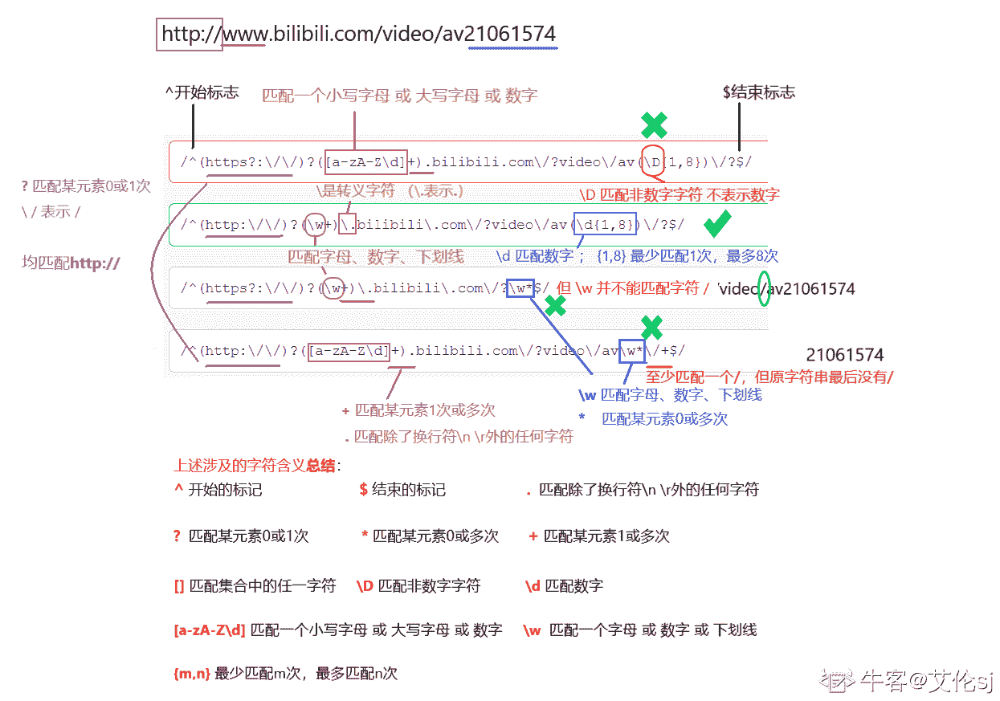
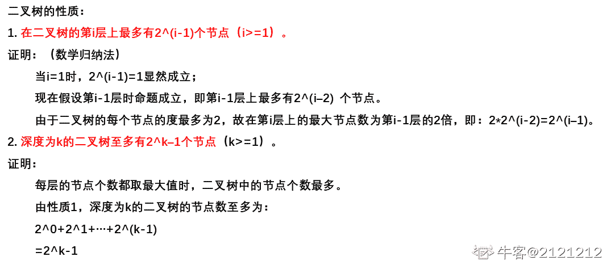
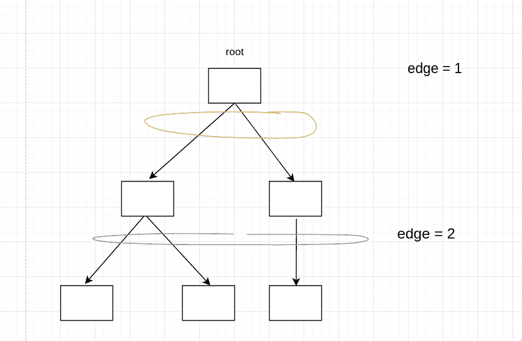
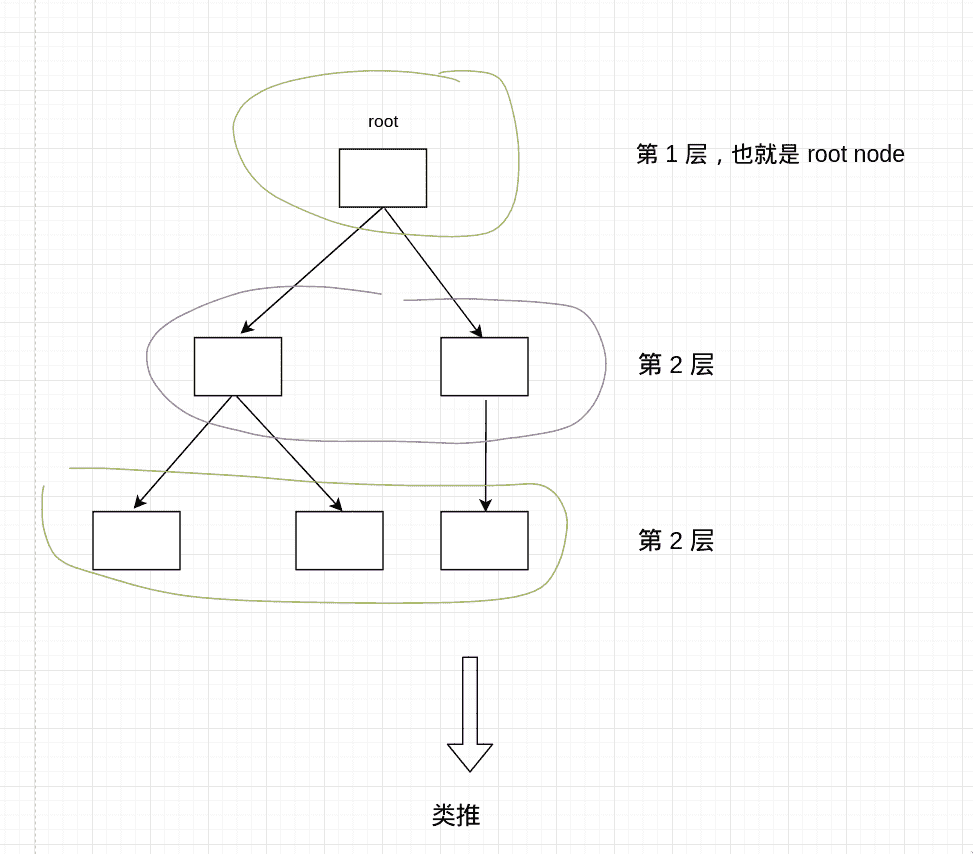
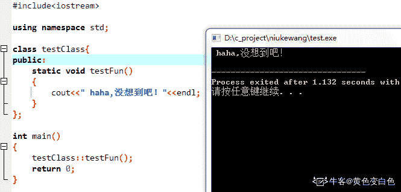
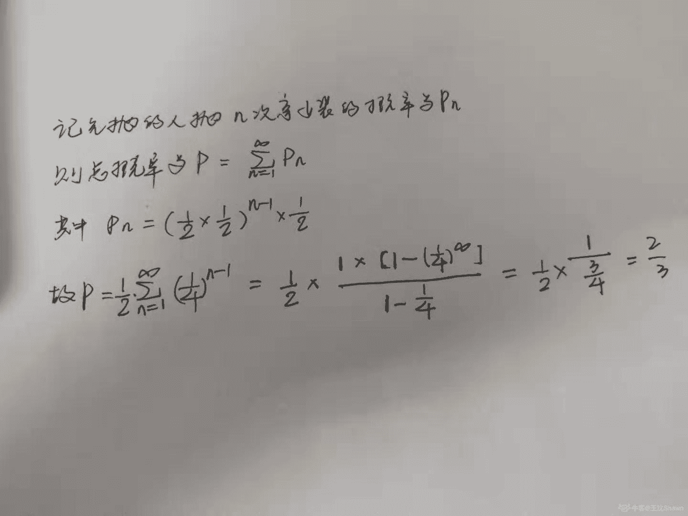
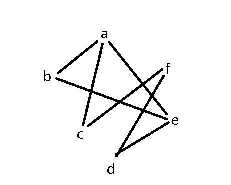
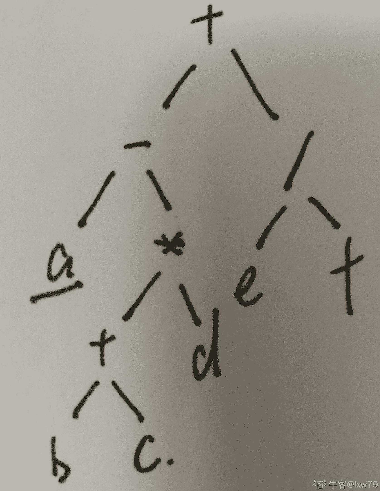
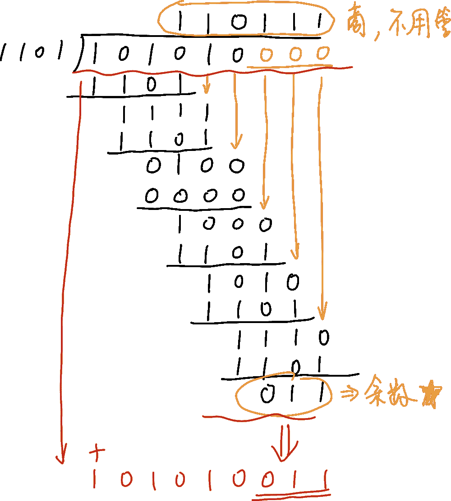

# 哔哩哔哩 2019 秋招技术岗（前端、运维、后端、移动端）第一套笔试题

## 1

下面哪些项是 TCP 具有的能力？（）

正确答案: A B D   你的答案: 空 (错误)

```cpp
有连接
```

```cpp
数据可靠传输
```

```cpp
数据按序到达
```

```cpp
端到端流量控制
```

本题知识点

Java 工程师 C++工程师 iOS 工程师 运维工程师 前端工程师 算法工程师 PHP 工程师 测试工程师 哔哩哔哩 网络基础 安卓工程师 2019

讨论

[可乐乐乐](https://www.nowcoder.com/profile/414844110)

tcp 按序传输 但不一定按序到达

发表于 2019-05-11 11:10:50

* * *

[KKaaaaa](https://www.nowcoder.com/profile/340735437)

TCP 数据报还要由下层的[IP 协议](https://www.baidu.com/s?wd=IP%E5%8D%8F%E8%AE%AE&tn=SE_PcZhidaonwhc_ngpagmjz&rsv_dl=gh_pc_zhidao)封装，由于[IP 数据报](https://www.baidu.com/s?wd=IP%E6%95%B0%E6%8D%AE%E6%8A%A5&tn=SE_PcZhidaonwhc_ngpagmjz&rsv_dl=gh_pc_zhidao)到达目的后可能顺序变乱，因此 TCP 报文顺序也可能变乱。因此到达目的后如果报文顺序混乱，[TCP 协议](https://www.baidu.com/s?wd=TCP%E5%8D%8F%E8%AE%AE&tn=SE_PcZhidaonwhc_ngpagmjz&rsv_dl=gh_pc_zhidao)会进行排序。

发表于 2019-08-30 22:20:01

* * *

[彦祖丶](https://www.nowcoder.com/profile/4900747)

TCP 不确保数据能按序到达

发表于 2019-09-24 10:35:46

* * *

## 2

在公司局域网上 ping www.bilibili.com 没有涉及到的网络协议是？（）

正确答案: A   你的答案: 空 (错误)

```cpp
TCP
```

```cpp
DNS
```

```cpp
ICMP
```

```cpp
ARP
```

本题知识点

Java 工程师 C++工程师 iOS 工程师 运维工程师 前端工程师 算法工程师 PHP 工程师 测试工程师 哔哩哔哩 网络基础 C++工程师 iOS 工程师 安卓工程师 运维工程师 前端工程师 Java 工程师 哔哩哔哩 2019

讨论

[nanoRIPE](https://www.nowcoder.com/profile/134791218)

涉及了 UDP

发表于 2019-05-18 00:11:13

* * *

[飞鸟与她](https://www.nowcoder.com/profile/9158041)

域名 DNS，ping 指令 ICMP 协议发送（ICMP 请求回显数据包），通过 IP 获取 mac 地址的 ARP

发表于 2019-05-19 10:49:19

* * *

## 3

以下哪个数据结构底层是用红黑树实现的?()

正确答案: C   你的答案: 空 (错误)

```cpp
vector
```

```cpp
list
```

```cpp
map
```

```cpp
deque
```

本题知识点

Java 工程师 C++工程师 哔哩哔哩 树 2019

讨论

[风刚才唱歌](https://www.nowcoder.com/profile/681045696)

map  散列表+红黑树（jdk1.8）

发表于 2019-08-19 20:01:27

* * *

[编程小海浪](https://www.nowcoder.com/profile/797024057)

map 是红黑树实现的

发表于 2019-08-19 14:15:50

* * *

[GGGGinóbili](https://www.nowcoder.com/profile/407891871)

map

发表于 2019-07-18 17:18:38

* * *

## 4

以下 ip 地址中不属于私网地址的是：（）

正确答案: C   你的答案: 空 (错误)

```cpp
192.168.1.26
```

```cpp
172.21.213.56
```

```cpp
127.2.0.1
```

```cpp
10.1.1.200
```

本题知识点

Java 工程师 C++工程师 iOS 工程师 运维工程师 前端工程师 算法工程师 PHP 工程师 测试工程师 哔哩哔哩 网络基础 C++工程师 iOS 工程师 安卓工程师 运维工程师 前端工程师 Java 工程师 哔哩哔哩 2019

讨论

[小区张学友](https://www.nowcoder.com/profile/726558159)

[IP 地址](https://baike.baidu.com/item/IP%E5%9C%B0%E5%9D%80) [1]  分为 5 类，其中 A，B，C 三类中各保留了 3 个区域作为私网地址，也就是局域网用的，私网地址不能在公网上出现，只能用在内部网路中，所有的路由器都不能发送目标地址为私网地址的数据报。私网地址是：A 类地址：10.0.0.0～10.255.255.255B 类地址：172.16.0.0 ～172.31.255.255C 类地址：192.168.0.0～192.168.255.255（百度百科）

发表于 2019-09-02 13:54:23

* * *

[可乐乐乐](https://www.nowcoder.com/profile/414844110)

10.0.0.0-10.255.255.255172.16.0.0-172.31.255.255192.168.0.0-192.168.255.255

发表于 2019-05-11 11:25:02

* * *

[Java 后端练习生](https://www.nowcoder.com/profile/534037268)

私网地址如下：A 类：10.0.0.0-10.255.255.255B 类：172.16.0.0-172.31.255.255C 类：192.168.0.0-192.168.255.255

发表于 2021-04-21 17:20:38

* * *

## 5

以下排序算法中，最坏情况时间复杂度与其他选项不同的是（）

正确答案: D   你的答案: 空 (错误)

```cpp
冒泡排序
```

```cpp
插入排序
```

```cpp
快速排序
```

```cpp
归并排序
```

本题知识点

排序 *讨论

[可乐乐乐](https://www.nowcoder.com/profile/414844110)


发表于 2019-05-11 11:30:58

* * *

[牛客 401350549 号](https://www.nowcoder.com/profile/401350549)

题目说的是最坏情况时间复杂度与**其他选项不同**的是，所以选项中最坏情况分别为 O(n*n),O(n*n),O(n*n)和 nlogn；故选 D

发表于 2020-06-21 20:49:28

* * *

[你永远得不到的祖奶奶](https://www.nowcoder.com/profile/855996890)

归并最好最坏都是 nlogn。

发表于 2020-05-28 21:20:18

* * *

## 6

以下哪一项正则能正确的匹配网址: [`www.bilibili.com/video/av21061574`](http://www.bilibili.com/video/av21061574) （）

正确答案: B   你的答案: 空 (错误)

```cpp
/^(https?:\/\/)?([a-zA-Z\d]+).bilibili.com\/?video\/av(\D{1,8})\/?$/
```

```cpp
/^(http:\/\/)?(\w+)\.bilibili\.com\/?video\/av(\d{1,8})\/?$/
```

```cpp
/^(https?:\/\/)?(\w+)\.bilibili\.com\/?\w*$/
```

```cpp
/^(http:\/\/)?([a-zA-Z\d]+).bilibili.com\/?video\/av\w*\/+$/
```

本题知识点

Java Javascript

讨论

[我的天鸭](https://www.nowcoder.com/profile/243498)

楼上的回答有点问题，我来简单的梳理一下这道题用到的正则表达式的知识点：首先，**^表示匹配输入的开始**，**$表示匹配输入的结束**每个选项从前向后看，http 都能够严格匹配**?表示匹配某元素 0 次或 1 次**，这里四个选项都没有问题，能够匹配 0 次或 1 次字符 s 接下来:严格匹配，\/\/严格匹配两个//接着往下看，**[]表示字符集合，它用在正则表达式中表示匹配集合中的任一字符**A D 选项中的 [a-zA-Z\d] 表示匹配一个小写字母 或者 大写字母 或者 数字 B C 选项中的 **\w 表示匹配字母数字或下划线**（注意这里比 A D 中能多匹配下划线类型）**+表示匹配某元素 1 次或多次**，到这里四个选项都能够完美匹配字符 www
**.可以匹配除了换行符\n \r 外的任何字符**接下来我们看选项 A，bilibili com video av 都严格匹配，而 **\D 表示匹配一个非数字字符**而非数字字符，av 后的数字是无法匹配成功的，A 错误 B 选项，\d 匹配数字，{m,n}表示最少匹配 m 次，最多匹配 n 次，\/?能匹配末尾的 0 个或 1 个/字符，B 正确 C 选项，***表示匹配某元素 0 次或多次**，但 \w 并不能匹配字符 /，C 错误 D 选项，前面都对，错在最后的\/+至少要匹配一个/，而原字符串最后并没有/

发表于 2019-08-04 16:40:13

* * *

[艾伦 sj](https://www.nowcoder.com/profile/972579575)



发表于 2021-02-16 17:28:21

* * *

[人余月半子](https://www.nowcoder.com/profile/514787832)

| \ | 将下一字符标记为特殊字符、文本、反向引用或八进制转义符。例如，"n"匹配字符"n"。"\n"匹配换行符。序列"\\"匹配"\"，"\("匹配"("。 |
| ^ | 匹配输入字符串开始的位置。如果设置了 RegExp 对象的 Multiline 属性，^ 还会与"\n"或"\r"之后的位置匹配。 |
| $ | 匹配输入字符串结尾的位置。如果设置了 RegExp 对象的 Multiline 属性，$ 还会与"\n"或"\r"之前的位置匹配。 |
| * | 零次或多次匹配前面的字符或子表达式。例如，zo* 匹配"z"和"zoo"。* 等效于 {0,}。 |
| + | 一次或多次匹配前面的字符或子表达式。例如，"zo+"与"zo"和"zoo"匹配，但与"z"不匹配。+ 等效于 {1,}。 |
| ? | 零次或一次匹配前面的字符或子表达式。例如，"do(es)?"匹配"do"或"does"中的"do"。? 等效于 {0,1}。 |
| {*n*} | *n* 是非负整数。正好匹配 *n* 次。例如，"o{2}"与"Bob"中的"o"不匹配，但与"food"中的两个"o"匹配。 |
| {*n*,} | *n* 是非负整数。至少匹配 *n* 次。例如，"o{2,}"不匹配"Bob"中的"o"，而匹配"foooood"中的所有 o。"o{1,}"等效于"o+"。"o{0,}"等效于"o*"。 |
| {*n*,*m*} | *m* 和 *n* 是非负整数，其中 *n* <= *m*。匹配至少 *n* 次，至多 *m* 次。例如，"o{1,3}"匹配"fooooood"中的头三个 o。'o{0,1}' 等效于 'o?'。注意：您不能将空格插入逗号和数字之间。 |
| ? | 当此字符紧随任何其他限定符（*、+、?、{*n*}、{*n*,}、{*n*,*m*}）之后时，匹配模式是"非贪心的"。"非贪心的"模式匹配搜索到的、尽可能短的字符串，而默认的"贪心的"模式匹配搜索到的、尽可能长的字符串。例如，在字符串"oooo"中，"o+?"只匹配单个"o"，而"o+"匹配所有"o"。 |
| . | 匹配除"\r\n"之外的任何单个字符。若要匹配包括"\r\n"在内的任意字符，请使用诸如"[\s\S]"之类的模式。 |
| (*pattern*) | 匹配 *pattern* 并捕获该匹配的子表达式。可以使用 **9** 属性从结果"匹配"集合中检索捕获的匹配。若要匹配括号字符 ( )，请使用"("或者")"。 |
| (?:*pattern*) | 匹配 *pattern* 但不捕获该匹配的子表达式，即它是一个非捕获匹配，不存储供以后使用的匹配。这对于用"or"字符 (&#124;) 组合模式部件的情况很有用。例如，'industr(?:y&#124;ies) 是比 'industry&#124;industries' 更经济的表达式。 |
| (?=*pattern*) | 执行正向预测先行搜索的子表达式，该表达式匹配处于匹配 *pattern* 的字符串的起始点的字符串。它是一个非捕获匹配，即不能捕获供以后使用的匹配。例如，'Windows (?=95&#124;98&#124;NT&#124;2000)' 匹配"Windows 2000"中的"Windows"，但不匹配"Windows 3.1"中的"Windows"。预测先行不占用字符，即发生匹配后，下一匹配的搜索紧随上一匹配之后，而不是在组成预测先行的字符后。 |
| (?!*pattern*) | 执行反向预测先行搜索的子表达式，该表达式匹配不处于匹配 *pattern* 的字符串的起始点的搜索字符串。它是一个非捕获匹配，即不能捕获供以后使用的匹配。例如，'Windows (?!95&#124;98&#124;NT&#124;2000)' 匹配"Windows 3.1"中的 "Windows"，但不匹配"Windows 2000"中的"Windows"。预测先行不占用字符，即发生匹配后，下一匹配的搜索紧随上一匹配之后，而不是在组成预测先行的字符后。 |
| *x*&#124;*y* | 匹配 *x* 或 *y*。例如，'z&#124;food' 匹配"z"或"food"。'(z&#124;f)ood' 匹配"zood"或"food"。 |
| [*xyz*] | 字符集。匹配包含的任一字符。例如，"[abc]"匹配"plain"中的"a"。 |
| [^*xyz*] | 反向字符集。匹配未包含的任何字符。例如，"[^abc]"匹配"plain"中"p"，"l"，"i"，"n"。 |
| [*a-z*] | 字符范围。匹配指定范围内的任何字符。例如，"[a-z]"匹配"a"到"z"范围内的任何小写字母。 |
| [^*a-z*] | 反向范围字符。匹配不在指定的范围内的任何字符。例如，"[^a-z]"匹配任何不在"a"到"z"范围内的任何字符。 |
| \b | 匹配一个字边界，即字与空格间的位置。例如，"er\b"匹配"never"中的"er"，但不匹配"verb"中的"er"。 |
| \B | 非字边界匹配。"er\B"匹配"verb"中的"er"，但不匹配"never"中的"er"。 |
| \c*x* | 匹配 *x* 指示的控制字符。例如，\cM 匹配 Control-M 或回车符。*x* 的值必须在 A-Z 或 a-z 之间。如果不是这样，则假定 c 就是"c"字符本身。 |
| \d | 数字字符匹配。等效于 [0-9]。 |
| \D | 非数字字符匹配。等效于 [⁰-9]。 |
| \f | 换页符匹配。等效于 \x0c 和 \cL。 |
| \n | 换行符匹配。等效于 \x0a 和 \cJ。 |
| \r | 匹配一个回车符。等效于 \x0d 和 \cM。 |
| \s | 匹配任何空白字符，包括空格、制表符、换页符等。与 [ \f\n\r\t\v] 等效。 |
| \S | 匹配任何非空白字符。与 [^ \f\n\r\t\v] 等效。 |
| \t | 制表符匹配。与 \x09 和 \cI 等效。 |
| \v | 垂直制表符匹配。与 \x0b 和 \cK 等效。 |
| \w | 匹配任何字类字符，包括下划线。与"[A-Za-z0-9_]"等效。 |
| \W | 与任何非单词字符匹配。与"[^A-Za-z0-9_]"等效。 |
| \x*n* | 匹配 *n*，此处的 *n* 是一个十六进制转义码。十六进制转义码必须正好是两位数长。例如，"\x41"匹配"A"。"\x041"与"\x04"&"1"等效。允许在正则表达式中使用 ASCII 代码。 |
| *num* | 匹配 *num*，此处的 *num* 是一个正整数。到捕获匹配的反向引用。例如，"(.)\1"匹配两个连续的相同字符。 |
| *n* | 标识一个八进制转义码或反向引用。如果 *n* 前面至少有 *n* 个捕获子表达式，那么 *n* 是反向引用。否则，如果 *n* 是八进制数 (0-7)，那么 *n* 是八进制转义码。 |
| *nm* | 标识一个八进制转义码或反向引用。如果 *nm* 前面至少有 *nm* 个捕获子表达式，那么 *nm* 是反向引用。如果 *nm* 前面至少有 *n* 个捕获，则 *n* 是反向引用，后面跟有字符 *m*。如果两种前面的情况都不存在，则 *nm* 匹配八进制值 *nm*，其中 *n* 和 *m* 是八进制数字 (0-7)。 |
| \nml | 当 *n* 是八进制数 (0-3)，*m* 和 *l* 是八进制数 (0-7) 时，匹配八进制转义码 *nml*。 |
| \u*n* | 匹配 *n*，其中 *n* 是以四位十六进制数表示的 Unicode 字符。例如，\u00A9 匹配版权符号 (©)。 |

发表于 2019-11-06 12:48:43

* * *

## 7

以下设计模式的应用场景中，属于代理模式的选项有（）

正确答案: C D   你的答案: 空 (错误)

```cpp
树形结构的遍历
```

```cpp
产品簇创建场景
```

```cpp
防火墙
```

```cpp
CopyOnWriteList
```

本题知识点

Java 工程师 C++工程师 安卓工程师 iOS 工程师 运维工程师 前端工程师 算法工程师 PHP 工程师 测试工程师 哔哩哔哩 设计模式 2019

讨论

[挪威北](https://www.nowcoder.com/profile/613357033)

JUC 中与 ArrayList 有关的线程安全容器类​CopyOnWriteArrayList，在对数组进行 remove()、clear()、set()和 add()​操作时，在方法里先用 ReentrantLock 加锁​，再复制一个新数组，修改操作在新数组上完成，再将原数组指向到新数组中，最后解锁。这里的新数组就相当于一个***

发表于 2019-08-20 15:38:50

* * *

[么么么么么么么么么么么](https://www.nowcoder.com/profile/647470320)

代理模式一般用于对有价值(稀缺)资源的管理，如数据库的连接等，目的是提高这些资源的利用率或者系统性能。 代理模式的定义：为其他对象提供一种代理以控制对这个对象的访问。在某些情况下，一个对象不适合或者不能直接引用另一个对象，而代理对象可以在客户端和目标对象之间起到中介的作用。

发表于 2021-10-18 15:19:01

* * *

[听风者 201809290813325](https://www.nowcoder.com/profile/380675160)

jdk***模式 cglib***模式

发表于 2019-08-20 18:44:38

* * *

## 8

由 3 个“1”和 5 个“0”组成的 8 位二进制补码，能表示的最小整数（）

正确答案: B   你的答案: 空 (错误)

```cpp
-126
```

```cpp
-125
```

```cpp
-32
```

```cpp
-3
```

本题知识点

编译和体系结构

讨论

[God~Like](https://www.nowcoder.com/profile/8390058)

既然求最小整数，那肯定先想到负数，则最高位（符号位）一定为 1，原码中肯定是 1 所在的位数越高，值越小，而补码是由原码取反加 1 得到的，则在补码中 1 所在的位数一定要越低，即补码为 1000 0011；由补码求得原码：1111 1101=-(64+32+16+8+4+1)=-125;

发表于 2019-08-03 20:38:44

* * *

[SereneMA](https://www.nowcoder.com/profile/187007874)

A -126 原码     11111110 补码      符号位不变，其余取反再加 1             10000010 B -125 原码      11111101 补码      10000011

发表于 2019-07-03 16:09:14

* * *

[伊万夫斯基](https://www.nowcoder.com/profile/815472960)

基本概念: 1.正数的原码、反码、补码都相同； 2.负数的原码：最高位为 1，其余位为真值的绝对值； 3.负数的反码：在原码的基础上，符号位不变，其余位按位取反； 4.负数的补码：在原码的基础上，符号位不变，其余位取反，最后加 1；也就是在反码的基础上加 1。 负数的补码向源码转换步骤 1\. -12 的补码：1111 0100 2\. 最高位不变，其余位取反：1000 1011 3\. 加一得到原码：1000 1100 思路分析: 1\. 求最小的值，那么肯定是负数最小，最高位为 1 表示为负数 2\. 剩下的 5 个 0 和 2 个 1 要组成一个补码，只有 1000 0011 这种补码形式转换成原码后值最大 操作步骤 1\. 最高位不变，其余位去反 1111 1100 2.加 1 1111 1101 计算后得到-（64+32+16+8+4+1）＝-125

发表于 2019-08-15 00:26:18

* * *

## 9

深度为 k 的二叉树至多有几个结点（）

正确答案: C   你的答案: 空 (错误)

```cpp
2^k
```

```cpp
2^(k-1)
```

```cpp
2^k-1
```

```cpp
2^k+1
```

本题知识点

Java 工程师 C++工程师 前端工程师 算法工程师 PHP 工程师 测试工程师 哔哩哔哩 树 iOS 工程师 安卓工程师 运维工程师 2019

讨论

[2121212](https://www.nowcoder.com/profile/523363)



编辑于 2019-10-23 13:44:11

* * *

[SereneMA](https://www.nowcoder.com/profile/187007874)

一棵深度为 k，且有 2^k-1 个节点的二叉树，称为满二叉树。这种树的特点是每一层上的节点数都是最大节点数。而在一棵二叉树中，除最后一层外，若其余层都是满的，并且最后一层或者是满的，或者是在右边缺少连续若干节点，则此二叉树为完全二叉树。具有 n 个节点的完全二叉树的深度为 floor(log2n)+1。深度为 k 的完全二叉树，至少有 2k-1 个叶子节点，至多有 2k-1 个节点。

发表于 2019-07-03 16:12:23

* * *

[edte](https://www.nowcoder.com/profile/278445364)

基本概念

首先，需要区分深度和层数的概念。

深度，depth，即 x node 到 root 的 edge 的个数，tree 的 depth，即 leaf 的 depth 最大的那个。



那么 root 本身的 depth 为多少，就需要先规定，一般规定为 0，不过一般也有人规定 为 1。

然后层数，是 node 的概念



`所以，如果 root 的 depth 为 0，那么，depth 为 k 的 node，和第 k 层，是同一层。`

题目分析

题目就是，tree 最多 node 的数为多少，那么 tree 的最大 node 数，就需要每一层都需要是最大的 node 数。

那么问题就转换成，每一层的最大 node 数为多少。

深度为 k 的 tree，那么默认就是一共 k 层。

答案


第 1 层最多  个

第 2 层最多  个

第 3 层最多  个

第 4 层最多  个

第 5 层最多  个

.

.

.

第 i 层最多  个

我们现在再来看每一层的最大 node 数


如果 root 的 depth 为 1

那么，实际上就比 root 的 depth 为 0 的要少一层，所以，就是 ，不过这里答案就已经有了，即 C

发表于 2020-09-15 19:26:19

* * *

## 10

以下软件设计模式的应用场景中，属以下 git 命令中，用于显示工作区和当前分支文件的差异的命令是（）

正确答案: D   你的答案: 空 (错误)

```cpp
git diff
```

```cpp
git diff HEAD HEAD^
```

```cpp
git diff --cached
```

```cpp
git diff HEAD
```

本题知识点

Java 工程师 C++工程师 安卓工程师 iOS 工程师 运维工程师 前端工程师 算法工程师 PHP 工程师 测试工程师 哔哩哔哩 Java 工程师 C++工程师 安卓工程师 iOS 工程师 运维工程师 前端工程师 算法工程师 PHP 工程师 测试工程师 哔哩哔哩 Java 工程师 C++工程师 安卓工程师 iOS 工程师 运维工程师 前端工程师 算法工程师 PHP 工程师 测试工程师 哔哩哔哩 设计模式 C++工程师 iOS 工程师 安卓工程师 运维工程师 前端工程师 Java 工程师 哔哩哔哩 2019

讨论

[飞鸟与她](https://www.nowcoder.com/profile/9158041)

*   `git diff`：是查看 workspace 与 index 的差别的。
*   `git diff --***d`：是查看 index 与 local repositorty 的差别的。
*   `git diff HEAD`：是查看 workspace 和 local repository 的差别的。（HEAD 指向的是 local repository 中最新提交的版本）

* * *

作者：风竹夜
来源：CSDN
原文：http***log.csdn.net/GW569453350game/article/details/46998395
版权声明：本文为博主原创文章，转载请附上博文链接！

发表于 2019-05-18 21:17:55

* * *

[后知后觉的 Jim](https://www.nowcoder.com/profile/317274447)

```cpp
显示暂存区 cash 和工作区 workplace 的代码差异 
 $ git diff 

```

```cpp
显示暂存区和上一个 commit 的差异  
$ git diff --cached [file]

```

```cpp
显示工作区 workplace 与当前分支最新 commit 之间的差异  
$ git diff HEAD

```

```cpp
git 命令
https://www.jianshu.com/p/46ffff059092

```

编辑于 2019-11-29 23:52:05

* * *

## 11

以下哪些技术属于局域网技术（）

正确答案: A D   你的答案: 空 (错误)

```cpp
FDDI
```

```cpp
ATM
```

```cpp
ISDN
```

```cpp
令牌环
```

本题知识点

Java 工程师 C++工程师 前端工程师 算法工程师 PHP 工程师 测试工程师 哔哩哔哩 网络基础 iOS 工程师 安卓工程师 运维工程师 2019

讨论

[土[doge]欧尼](https://www.nowcoder.com/profile/9554843)

局域网技术令牌环网光纤分布式数据接口 FDDI（Fiber Distributed Data Interface）广域网技术综合业务数字网（ISDN）就是一种采用电路交换技术的广域网技术。ATM，帧中继，SMDS 以及 X.25 等都是采用包交换技术的广域网技术。

发表于 2019-11-13 23:03:40

* * *

[尘汐双子](https://www.nowcoder.com/profile/208481202)

ATM 是 Asynchronous Transfer Mode（ATM）[异步传输模式](https://baike.baidu.com/item/%E5%BC%82%E6%AD%A5%E4%BC%A0%E8%BE%93%E6%A8%A1%E5%BC%8F/511955)的缩写，是实现[B-ISDN](https://baike.baidu.com/item/B-ISDN)的业务的核心技术之一。ATM 是以信元为基础的一种[分组交换](https://baike.baidu.com/item/%E5%88%86%E7%BB%84%E4%BA%A4%E6%8D%A2/1193080)和复用技术。它是一种为了多种业务设计的通用的面向连接的传输模式。它适用于[局域网](https://baike.baidu.com/item/%E5%B1%80%E5%9F%9F%E7%BD%91/98626)和[广域网](https://baike.baidu.com/item/%E5%B9%BF%E5%9F%9F%E7%BD%91/422004)，它具有高速[数据传输率](https://baike.baidu.com/item/%E6%95%B0%E6%8D%AE%E4%BC%A0%E8%BE%93%E7%8E%87)和支持许多种类型如声音、数据、传真、实时视频、CD 质量音频和图像的通信。百度百科：[`baike.baidu.com/item/ATM%E7%BD%91%E7%BB%9C/1174087?fr=aladdin`](https://baike.baidu.com/item/ATM%E7%BD%91%E7%BB%9C/1174087?fr=aladdin)然后 B 项怎么就不对了？？？？

发表于 2019-08-16 18:01:23

* * *

[Ped](https://www.nowcoder.com/profile/9416754)

对这道题表示懵逼？

发表于 2019-06-04 19:31:47

* * *

## 12

线程的那些资源可以共享（）

正确答案: A C   你的答案: 空 (错误)

```cpp
堆
```

```cpp
栈
```

```cpp
静态变量
```

```cpp
存储器
```

本题知识点

Java 工程师 C++工程师 前端工程师 算法工程师 PHP 工程师 测试工程师 哔哩哔哩 操作系统 iOS 工程师 安卓工程师 运维工程师 2019

讨论

[小伯克](https://www.nowcoder.com/profile/596862621)

a. 堆  由于堆是在进程空间中开辟出来的，所以它是理所当然地被共享的；因此 new 出来的都是共享的（16 位平台上分全局堆和局部堆，局部堆是独享的）b. 全局变量 它是与具体某一函数无关的，所以也与特定线程无关；因此也是共享的 c. 静态变量 虽然对于局部变量来说，它在代码中是“放”在某一函数中的，但是其存放位置和全局变量一样，存于堆中开辟的.bss 和.data 段，是共享的 d. 文件等公用资源  这个是共享的，使用这些公共资源的线程必须同步。Win32 提供了几种同步资源的方式，包括信号、临界区、事件和互斥体。独享的资源有

发表于 2019-05-29 16:00:48

* * *

[哟，我喜欢](https://www.nowcoder.com/profile/8095403)

线程是 CPU 调度最小单位，每个线程都有它自己的一组 CPU 寄存器，称为线程的上下文。

发表于 2019-07-04 12:26:12

* * *

[橙猫](https://www.nowcoder.com/profile/193842753)

堆区：允许程序在运行时动态地申请某个大小的内存。 栈区：由编译器自动分配释放，存放**函数的参数值**，**局部变量**等值。其操作方式类似于数据结构中的栈。全局区：**全局变量和静态变量**的存储是放在一块的，初始化的全局变量和静态变量在一块区域， 未初始化的全局变量和未初始化的静态变量在相邻的另一块区域。程序结束后有系统释放。每个线程都有自己的一组 CPU 寄存器

发表于 2021-05-09 10:12:03

* * *

## 13

列哪个是建立 TCP 连接的正确流程：（）

正确答案: A   你的答案: 空 (错误)

```cpp
客户端向服务器端发送 SYN 包；服务端向客户端发送 SYN+ACK；客户端回复 ACK。
```

```cpp
客户端向服务器端发送 SYN 包；服务端向客户端发送 SYN+ACK。
```

```cpp
客户端向服务器端发送 FIN；服务器端回复 ACK，并进入 wait 状态；服务器端确认并发送 FIN；客户端回复 ACK。
```

```cpp
客户端向服务器端发送 FIN；服务器端回复 ACK，并进入 wait 状态；服务器端确认并发送 FIN。
```

本题知识点

Java 工程师 C++工程师 前端工程师 算法工程师 PHP 工程师 测试工程师 哔哩哔哩 网络基础 iOS 工程师 安卓工程师 运维工程师 2019

讨论

[黄色变白色](https://www.nowcoder.com/profile/8547911)

A 是连接时的 3 次握手，C 是断开时的 4 次挥手

发表于 2019-08-17 13:34:03

* * *

[你若肯来，花自盛开](https://www.nowcoder.com/profile/532607226)

客户端：SYN 建立链接服务器：SYN+ACK(ACK 确认链接)客户端：ACK

发表于 2020-01-12 09:26:14

* * *

## 14

以下说法正确的是：（）

正确答案: B   你的答案: 空 (错误)

```cpp
非静态方法的使用效率比静态方法的效率高。
```

```cpp
非静态方法不存在线程安全的问题。
```

```cpp
非静态方法可以直接通过类名.方法名的方法来调用。
```

```cpp
非静态方法中不可调用静态方法 。
```

本题知识点

Java 工程师 C++工程师 iOS 工程师 前端工程师 算法工程师 PHP 工程师 测试工程师 哔哩哔哩 C++ Java C++工程师 iOS 工程师 安卓工程师 运维工程师 前端工程师 Java 工程师 哔哩哔哩 2019

讨论

[gybcloud](https://www.nowcoder.com/profile/664012)

牛客上的题质量越来越差。

发表于 2019-08-13 13:32:17

* * *

[eicomtpmh](https://www.nowcoder.com/profile/140180)

非静态方法使用数据保存于栈中，是线程私有的。

发表于 2019-08-18 15:40:22

* * *

[黄色变白色](https://www.nowcoder.com/profile/8547911)

#include <iostream>using namespace std;
class testClass{
    void testFun()  {  cout<<" haha,没想到吧！"<<endl;  }
};
int main()
{
    testClass::testFun();   
    return }这样会报错， [Error] cannot call member function 'void testClass::testFun()' without object 所以非静态方法要通过创建实例来调用
静态方法才可以通过类名直接调用
 编辑于 2019-08-06 17:43:02

* * *

## 15

两个人抛硬币，规定第一个抛出正面的人必须穿女装，请问先抛的人穿女装的概率多大？（）

正确答案: C   你的答案: 空 (错误)

```cpp
1/2
```

```cpp
1/3
```

```cpp
2/3
```

```cpp
5/6
```

本题知识点

Java 工程师 C++工程师 iOS 工程师 运维工程师 前端工程师 算法工程师 PHP 工程师 测试工程师 哔哩哔哩 概率统计 *安卓工程师 2019 概率论与数理统计* *讨论

[哟，我喜欢](https://www.nowcoder.com/profile/8095403)

文字游戏，如果有人穿女装，那人是“**先抛的人**”概率多大。000110110 正 1 负，前 3 种是有人穿女装，其中**先抛的人**占 2

发表于 2019-07-04 12:34:51

* * *

[王沈 Shawn](https://www.nowcoder.com/profile/7840614)



发表于 2019-08-06 01:25:12

* * *

[听南秋雨夜凉凉](https://www.nowcoder.com/profile/112817253)

原题轮流抛硬币才是 2/3，没有轮流只能说是 1/2

发表于 2019-08-16 16:06:15

* * *

## 16

有限状态自动机能识别（）

正确答案: B   你的答案: 空 (错误)

```cpp
上下文无关文法
```

```cpp
正规文法
```

```cpp
上下文有关文法
```

```cpp
短语文法
```

本题知识点

Java 工程师 C++工程师 iOS 工程师 运维工程师 前端工程师 算法工程师 PHP 工程师 测试工程师 哔哩哔哩 编译和体系结构 安卓工程师 2019

讨论

[嘘，安静。](https://www.nowcoder.com/profile/847434120)

百度得知。😁

发表于 2019-08-20 22:25:47

* * *

## 17

按照二叉树的定义,具有 3 个结点的二叉树有几种。（）

正确答案: C   你的答案: 空 (错误)

```cpp
3
```

```cpp
4
```

```cpp
5
```

```cpp
6
```

本题知识点

Java 工程师 C++工程师 运维工程师 前端工程师 算法工程师 PHP 工程师 测试工程师 哔哩哔哩 树 iOS 工程师 安卓工程师 2019

讨论

[天尊墨宇](https://www.nowcoder.com/profile/667959477)

选 C 判断多少个节点有多少种二叉树。卡特兰公式 C（2n，n）/（n+1）

发表于 2020-07-03 18:07:00

* * *

[#$](https://www.nowcoder.com/profile/8818093)

判断多少个节点有多少种二叉树。公式 C（2n，n）/（n+1）

发表于 2020-04-03 08:44:57

* * *

[无恙 201910271905184](https://www.nowcoder.com/profile/32043790)

这题不严谨吧，如果三个结点值不同，那就有 28 种二叉树了。 答案说的是树形有几种

发表于 2019-11-09 20:00:49

* * *

## 18

无向图 G=(V,E)，其中 V={a,b,c,d,e,f} E={(a,b),(a,e),(a,c),(b,e),(c,f),(f,d),(e,d)} 对该图进行深度优先遍历,得到的顶点序列正确的是（）

正确答案: D   你的答案: 空 (错误)

```cpp
a,b,e,c,d,f
```

```cpp
a,c,f,e,b,d
```

```cpp
a,e,b,c,f,d
```

```cpp
a,b,e,d,f,c
```

本题知识点

Java 工程师 C++工程师 安卓工程师 iOS 工程师 前端工程师 算法工程师 PHP 工程师 测试工程师 哔哩哔哩 图 运维工程师 2019

讨论

[長歌當行](https://www.nowcoder.com/profile/585514245)

深度优先，A.a,b,e,d,f,c(从 a-b 路线走)B.a,c,f,d,e,b（从 a-c 路线走）C.a,e,b,d,f,c 或者 a,e,d,f,c,b(从 a-e 路线走)不晓得对不对，如果错的话，请路过的指正一下，谢谢


发表于 2019-08-06 14:14:25

* * *

[老板！来罐 82 年雪碧](https://www.nowcoder.com/profile/210026566)



发表于 2019-07-27 15:55:31

* * *

[前进 73757](https://www.nowcoder.com/profile/412454900)

C 选项当遍历到 b 后, b 进栈后又出栈, 栈顶是 e,然后应该去遍历和 e 相连但是没有被遍历的元素, 即 d. 所以 C 选项的顺序应该是 aebdfc

发表于 2022-03-06 20:24:27

* * *

## 19

如果文法 G 存在一个句子，满足下列条件 之一时，则称该文法是二义文法。（）

正确答案: B C D   你的答案: 空 (错误)

```cpp
该句子的最左推导与最右推导相同
```

```cpp
该句子有两个不同的最左推导
```

```cpp
该句子有两棵不同的最右推导
```

```cpp
该句子有两棵不同的语法树
```

本题知识点

Java 工程师 C++工程师 安卓工程师 运维工程师 前端工程师 算法工程师 PHP 工程师 测试工程师 哔哩哔哩 编译和体系结构 iOS 工程师 2019

讨论

[字节挑逗](https://www.nowcoder.com/profile/8226783)

见编译原理相关章节

发表于 2019-09-04 10:21:48

* * *

## 20

设指针 q 指向单链表中结点 A，指针 p 指向单链表中结点 A 的后继结点 B，指针 s 指向被插入的结点 X，则在结点 A 和结点 B 插入结点 X 的操作序列为（）

正确答案: B   你的答案: 空 (错误)

```cpp
s->next=p->next; p->next=-s;
```

```cpp
q->next=s; s->next=p;
```

```cpp
p->next=s->next;
s->next=p;
```

```cpp
p->next=s; s->next=q;
```

本题知识点

Java 工程师 C++工程师 iOS 工程师 前端工程师 算法工程师 PHP 工程师 测试工程师 哔哩哔哩 链表 *C++工程师 iOS 工程师 安卓工程师 运维工程师 前端工程师 Java 工程师 哔哩哔哩 2019* *讨论

[独一无二，璐](https://www.nowcoder.com/profile/945251218)

应该是 s->next=q->next;q->next=s 吧

发表于 2019-08-22 13:36:54

* * *

[安坐如山](https://www.nowcoder.com/profile/65207315)

没有正确答案

发表于 2019-08-21 10:45:24

* * *

[年年有肝](https://www.nowcoder.com/profile/985341976)

A 和 B 有区别么？

发表于 2021-04-20 13:34:46

* * *

## 21

a - (b + c) * d + e / f 的逆波兰式是 1

你的答案 (错误)

1 参考答案 (1) abc+d*-ef/+

本题知识点

Java 工程师 C++工程师 运维工程师 前端工程师 算法工程师 PHP 工程师 测试工程师 哔哩哔哩 字符串 *iOS 工程师 安卓工程师 2019* *讨论

[飞鸟与她](https://www.nowcoder.com/profile/9158041)

逆波兰式即表达式树的后缀遍历，题中所给的 a - (b + c) * d + e / f 则为中缀遍历，将中缀表达式转换为后缀表达式满足以下的规则：

*   读取到操作数（a、b、c...）立即输出；
*   读取到操作符（-、+、*、(）放入栈中；
*   当读取到右括号时，将栈中的元素弹出输出，直到将左括号弹出；

另外，当入栈如果栈顶的操作符优先级大于当前操作符时，需要将栈顶操作符弹出，优先级如下：* 等于 / 大于 - 等于 +。

**特别注意的是：当栈顶元素是左括号时，除非当前的操作符是右括号，否则将不会弹出——**可以理解为左括号的操作符非常的低****

编辑于 2019-05-18 22:13:29

* * *

[lxw79](https://www.nowcoder.com/profile/136086023)

二叉树法

将最终进行的运算符记为根节点，将两边的表达式分别记为左右子树，依次进行直到所有的运算符与数字或字母标在一棵二叉树上。然后对二叉树进行后序遍历即可。

编辑于 2019-09-10 15:07:09

* * *

[ChiSing](https://www.nowcoder.com/profile/376531846)

abc+-d*ef/+

发表于 2020-01-09 16:02:26

* * *

## 22

当前发送帧数据为 101010，发送方和接收方约定除数为 1101，用循环冗余算法进行封装后，接收方拿到的数据是 1

你的答案 (错误)

1 参考答案 (1) 101010011

本题知识点

Java 工程师 C++工程师 iOS 工程师 前端工程师 算法工程师 测试工程师 哔哩哔哩 编程基础 *安卓工程师 运维工程师 2019* *讨论

[土[doge]欧尼](https://www.nowcoder.com/profile/9554843)



发表于 2019-11-13 16:27:28

* * *

[JosephChen](https://www.nowcoder.com/profile/532837405)

原始数据 101010*1000=101010000；模二除：101010000/1101=110111......11；模二加：101010000+11=101010011 此为最终结果；

发表于 2019-06-26 21:45:54

* * *

## 23

一个完全二叉树有 870 个节点 其叶子节点个数为 1

你的答案 (错误)

1 参考答案 (1) 435

本题知识点

Java 工程师 C++工程师 安卓工程师 iOS 工程师 运维工程师 前端工程师 算法工程师 测试工程师 哔哩哔哩 树 2019

讨论

[JosephChen](https://www.nowcoder.com/profile/532837405)

参考答案错了，为了避免后来者被误导，我特意写一遍详细的解析：答案：435 解析：（一种比较笨的解法）1 层满二叉树节点数=2¹-1；2 层满                        2²-1;...9 层满                        2⁹-1=51110                                         1023 所以 870 个节点是一个 10 层的完全二叉树，且它的        第十层有 870-511=359 个叶子节点；
        第九层有 256 个节点                其中 180 个节点有孩子节点（下一层的 359 个叶子）
                剩下 256-180=76 个节点
总计：76+359=435 各节点

发表于 2019-06-26 21:55:06

* * *

[小区张学友](https://www.nowcoder.com/profile/726558159)

直接除以 2 再向上取整不就完事了

发表于 2019-09-02 14:18:32

* * *

[飞鸟与她](https://www.nowcoder.com/profile/9158041)

因为深度为 k 的二叉树至多有`2^k-1`个结点，可得该二叉树的结点数量在`(2⁹-1, 2¹⁰-1)`之间，所以可以推断该完全二叉树的深度为 10，其结点的数量为：深度为 9 的满二叉树结点数量 + 第 10 层叶子的数量`leaf_count`：

可得：`leaf_count + (2⁹ - 1) = 870`，得 `x = 359`

编辑于 2019-05-18 22:24:51

* * *

## 24

设某棵二叉树的中序遍历序列为 cadb，前序遍历序列为 acbd，这个二叉树的后序遍历序列是 1

你的答案 (错误)

1 参考答案 (1) cdba

本题知识点

Java 工程师 C++工程师 安卓工程师 iOS 工程师 运维工程师 前端工程师 算法工程师 测试工程师 哔哩哔哩 树 2019

讨论

[長歌當行](https://www.nowcoder.com/profile/585514245)

L(左节点)、R(右节点)、P(父节点)先序遍历 PLR 中序遍历 LPR 后序遍历 LRP 即无论哪个遍历，左右节点一定是先左后右，而先，中，后代表这父节点在什么时候遍历

发表于 2019-08-06 14:55:27

* * *

[SereneMA](https://www.nowcoder.com/profile/187007874)

根在前，从左往右   前序遍历序列为 acbd   根为 a  根在中，从左往右   中序遍历序列为 cadb    根不再最前、最后 说明 左 右子树不为空 还原 ac   b        d 根在后，从左往右 后序  cdba

发表于 2019-07-03 19:26:55

* * *

## 25

设一组初始关键字序列为(38,65,97,76,13,27,10)，则第 3 趟冒泡排序结束后的结果为 1

你的答案 (错误)

1 参考答案 (1) 38,13,27,10,65,76,97

本题知识点

Java 工程师 C++工程师 安卓工程师 iOS 工程师 运维工程师 前端工程师 算法工程师 测试工程师 哔哩哔哩 排序 *2019* *讨论

[RealW](https://www.nowcoder.com/profile/483320787)

我带了个括号就错了...

发表于 2019-08-17 16:27:24

* * *

[Ped](https://www.nowcoder.com/profile/9416754)

表示对这道题的答案产生怀疑，什么才算一趟？

发表于 2019-06-04 19:46:05

* * *

[北纬 23º8＇](https://www.nowcoder.com/profile/916142224)

（10，13，27，38，65，97，76） 冒泡排序一趟的结果是将最小元素交换到待排序列的第一个位置

发表于 2019-11-05 16:03:56

* * *

## 26

在 TCP/IP 网络中，TCP 协议工作在 1 ，FTP 协议工作在 2

你的答案 (错误)

12 参考答案 (1) 传输层
(2) 应用层

本题知识点

Java 工程师 C++工程师 安卓工程师 iOS 工程师 运维工程师 前端工程师 算法工程师 测试工程师 哔哩哔哩 网络基础 2019

讨论

[老苦瓜](https://www.nowcoder.com/profile/133714627)

计算机网络第八版书上用的是运输层

发表于 2019-09-10 17:36:16

* * *

[编程小海浪](https://www.nowcoder.com/profile/797024057)

在 TCP/IP 网络中，TCP 协议工作在传输层 1 ，FTP 协议工作在 应用层

发表于 2019-08-19 14:22:50

* * *

## 27

HTTP 协议中的禁止访问(Forbidden)的状态码是 1

你的答案 (错误)

1 参考答案 (1) 403

本题知识点

Java 工程师 C++工程师 安卓工程师 iOS 工程师 运维工程师 前端工程师 算法工程师 测试工程师 哔哩哔哩 网络基础 2019

讨论

[个人生命学被迫研究爱好者](https://www.nowcoder.com/profile/569049617)

常见 HTTP 状态码 200          ok  服务器成功处理请求 301/302  重定向  请求的 URL 已经转移 304        未修改   客户缓存的资源是最新的 客户端使用缓存内容 403        Forbidden   禁止。服务器拒绝请求 404       NotFound      未找到资源 405   Method Not Allowed  不允许使用的方法

发表于 2019-08-20 16:35:31

* * *

## 28

在 SQL 查询时，如果去掉查询结果中的重复组，需使用 1 参数

你的答案 (错误)

1 参考答案 (1) distinct

本题知识点

Java 工程师 C++工程师 安卓工程师 iOS 工程师 运维工程师 前端工程师 算法工程师 测试工程师 哔哩哔哩 数据库 SQL 2019

讨论

[天启 ddd](https://www.nowcoder.com/profile/5436924)

最好还是大写啊

发表于 2019-06-06 14:15:19

* * *

[nimo5555](https://www.nowcoder.com/profile/790771872)

distinct

发表于 2019-08-23 13:51:41

* * *

[极乐 disco](https://www.nowcoder.com/profile/866892783)

select distinct 字段名  from 表名 。对于查询多个字段同时不重复记录 select distinct 字段名 1，字段名 2，字段名 3  from 表名 删除重复记录

Delete from tablename where id not in (select max(id) from tablename group by col1,col2,...) 

发表于 2020-09-20 16:19:16

* * *

## 29

执行 C 语言程序段“y=1; x=5; while(x--); y++;”后，y 的值为 1

你的答案 (错误)

1 参考答案 (1) 2

本题知识点

Java 工程师 C++工程师 安卓工程师 iOS 工程师 运维工程师 前端工程师 算法工程师 测试工程师 哔哩哔哩 C++ 2019

讨论

[summerrr](https://www.nowcoder.com/profile/5030955)

没看到 while 后边的分号。。。

发表于 2019-05-07 10:15:00

* * *

[Ped](https://www.nowcoder.com/profile/9416754)

有毒，又是一道靠眼力的题目

发表于 2019-06-04 20:03:47

* * *

[u3dstudent](https://www.nowcoder.com/profile/896927963)

果然有一双好的眼睛是很重要的！

发表于 2019-08-22 11:06:11

* * *

## 30

对下列递归函数 int f(int n) { return((n==0)?1:f(n-1)+2);}，函数调用 f(3)的返回值是 1

你的答案 (错误)

1 参考答案 (1) 7

本题知识点

Java 工程师 C++工程师 安卓工程师 iOS 工程师 运维工程师 前端工程师 算法工程师 哔哩哔哩 C++ Java 2019

讨论

[SereneMA](https://www.nowcoder.com/profile/187007874)

f(3)=f(2)+2f(2)=f(1)+2f(1)=f(0)+2f(0)=1 即 f(3)=1+2+2+2

发表于 2019-07-03 20:19:55

* * *

[Zn 微凉](https://www.nowcoder.com/profile/6020390)

就(1).看不到题目！

发表于 2019-08-13 17:37:54

* * *

## 31

实现一个 HTML 语法检查器。HTML 语法规则简化如下：标签必须闭合，可以由开始和结束两个标签闭合，如，也可以自闭合，
如<div />
标签可以嵌套如<div><a></a></div>或者 <div><a/></div>，但是标签不能交叉：<div><a></div></a>是不允许的标签里可以有属性
如<div id="a<1"></div>
属性的规则是 name="任意非引号字符"，多属性声明之间必须有空格，属性声明不符合规则时，整段 HTML 都算语法错误
输入文本只会出现字母 a-z 和<>"=
请用任意语言实现一个 HTML 语法检查器函数，有语法错误返回 1，没有语法错误返回 0

本题知识点

哔哩哔哩 Java 工程师 C++工程师 iOS 工程师 安卓工程师 运维工程师 前端工程师 算法工程师 PHP 工程师 测试工程师 字符串 *栈 *模拟 2019 golang 工程师** **讨论

[牛客 7587184 号](https://www.nowcoder.com/profile/7587184)

测试样例都是空的随缘法过了 85%.......

```cpp
import random
print(random.choice([0,1]))
```

编辑于 2019-05-19 02:07:12

* * *

[邂逅的瞬间](https://www.nowcoder.com/profile/793728490)

```cpp
import java.util.*;
import java.util.Stack;

public class Main{

    public static void main(String[] args){
        Scanner input = new Scanner(System.in);
        String str = input.nextLine();
        int result = 1;
        if(solve(str)) result = 0;
        System.out.println(result);
    }

    public static boolean solve(String str){
        str = str.trim(); //消除前后的空格
        if(str == null && str.length() == 0) return false;
        Stack<String> stack = new Stack<>(); //记录标签的入栈顺序
        int i = 0;
        while(i < str.length()){
            if(i == 0 && str.charAt(i) != '<') return false; //第一个字符不是<，则表明不是以标签开始
            if(i == str.length() - 1 && str.charAt(i) != '>') return false; //最后的字符不是>，则表明不是以标签结束
            if(str.charAt(i) == '<'){
                int j = i + 1;
                //'<'之后如果是标签，紧跟在'<'之后的字符必定是 a-z 或者'/'
                if(j < str.length() && (str.charAt(j) >= 'a' && str.charAt(j) <= 'z' || str.charAt(j) == '/')){
                    //获取标签字符串<xx xx="">
                    boolean inStr = false; //是否处于字符串"里面
                    while(j < str.length()){
                        if(!inStr && str.charAt(j) == '>'){  //标签结束
                            if(!checkAtt(str.substring(i + 1, j), stack)) //传入的标签已经去除'<'和'>'字符
                                return false; //属性有语法错误
                            i = j;
                            break;
                        }
                        else if(str.charAt(j) == '"') inStr = !inStr;
                        j++;
                    }
                }
            }
            i++;
        }
        if(stack.isEmpty()) return true;
        return false;
    }

    public static boolean checkAtt(String str, Stack<String> stack){  //处理标签里面的属性
        if(str == null && str.length() == 0) return true;
        int type = 0; //记录标签的类型，0 为开始标签<x>，1 为结束标签</x>,2 为自闭合标签<x/>
        if(str.charAt(0) == '/'){  //判断是否是结束标签
            if(!(str.length() >= 2 && str.charAt(1) >= 'a' && str.charAt(1) <= 'z')) return false; //结束标签的'/'之后必须紧跟字母
            type = 1; //为结束标签
            str = str.substring(1);
        }
        str = str.trim(); //去除字符串后面的空格
        if(str.charAt(str.length() - 1) == '/'){ //判断是否是自闭合标签
            if(type == 1) return false; //不能同时为结束标签，又是自闭合标签
            type = 2;
            str = str.substring(0, str.length() - 1);// 去除最后的'/'
        }
        int i = 0;
        //获取标签的名字，并判断是否符合闭合规则
        while(i < str.length() && str.charAt(i) != ' ') i++;
        String name = str.substring(0, i);
        if(type == 0) stack.push(name);
        else if(type == 1){
            if(!stack.isEmpty() && stack.peek().equals(name)) stack.pop();
            else return false;
        }
        //判断其属性是否有语法错误
        boolean hasAtt = false; //判断该标签是否有属性，针对结束标签不能有属性
        boolean hasBlank = false; //判断属性 name 之前是否有空格
        while(i < str.length()){
            while(i < str.length() && str.charAt(i) == ' ') {hasBlank = true; i++;}
            while(i < str.length() && str.charAt(i) != '=' && str.charAt(i) != ' ') i++; //获取属性名字
            if(i < str.length() && str.charAt(i) == '='){ //如果没有'='说明不是属性，不进行处理
                i++;
                if(i >= str.length() || str.charAt(i) != '"') return false; //'='之后必须是双引号
                i++;
                while(i < str.length() && str.charAt(i) != '"') i++; //寻找下一个双引号
                if(i >= str.length()) return false;
                if(!hasBlank) return false; //属性之前没有空格，语法错误
            }
            hasBlank = false;
            hasAtt = true;
            i++;
        }
        if(type == 1 && hasAtt) return false; //结束标签不能有属性
        return true;
    }
}

/*

	1、’<’之后的字符如果不是 a-z，则认为不是开始标签，可认为是标签的文本部分

	2、“</”之后的字符如果不是 a-z 或者空格，则认为不是结束标签，认为是标签的文本部分

	3、结束标签不能有属性，<a/>中’/’之后不能有属性

	4、标签的文本部分可能是单独的双引号（例子：<div>”</div>，输出 0）

	5、题目说属性的规则是 name=”任意非引号字符”，所以属性的’=’前和后都不能有空格

	6、题目说属性之间必须有空格，这说明不是属性之间，就允许没有空格。超级坑的例子：

	<fff><a name="x></a></fff><div>"/></fff><x o="p" q="rst"><z addr="></x>>"></z><y/><x/></x><u v="sfa"d"d"/>

	答案输出 0。最后的 v=”sfa”d”d”，在不违背题目条件的情况下，只能认为 v=”sfa”是属性，而 d”d”不是属性，可以没有空格。同时也说明了，在标签里不是属性的字符串是允许存在的，没有错误的。

	7、整个 HTML 字符串的前面和后面不能是文本内容

	8、采用 stack 判断标签的闭合状态

	9、如果采用练习模式，是没有例子的。估计是因为提示的例子是 HTML 字符串，所以浏览器会视其为 html 代码而执行，so 可以采用浏览器检查代码看例子。当然浏览器会对错误的字符串进行处理，比如<a/>，在浏览器里会被处理为<a></a>。如果只有<a>，没有结束标签时，浏览器会自动补齐，添加</a>

10、我是菜鸟，对 html 的语法规则不是很了解，想了两天，呜~好惨
*/
```

发表于 2019-07-25 20:39:03

* * *

[你和代码一样迷人](https://www.nowcoder.com/profile/377236445)

比较无语, 这个题 emmmmm.随缘

```cpp
let str = readline();
function checkHTML(s) {
    let flag = s;
    let arr = [];
    let reg1 = /(<(\w+) *([a-zA-Z0-9= "]*)>)\w*(<\/(\w+)>)/i;
    let reg2 = /(<(\w+) *([a-zA-Z0-9= "]*)\/>)/i;
    while (reg1.test(flag) || reg2.test(flag)) {
        if (reg1.test(flag)) {
            flag = flag.replace(reg1, (a, b, c, d, e, f, g) => {
                arr.push([a, b, c, d, e, f, g]);
                return '';
            });
        }else{
            flag = flag.replace(reg2, (a, b, c, d) => {
                arr.push([a, b, c, d]);
                return '';
            });
        }
    }
    return flag.length === 0 ? 0 : 1;
}
console.log(checkHTML(str));

```

自己测试是可以, 如果有不对的地方还请指正

发表于 2019-09-09 10:48:37

* * ********</iostream>*