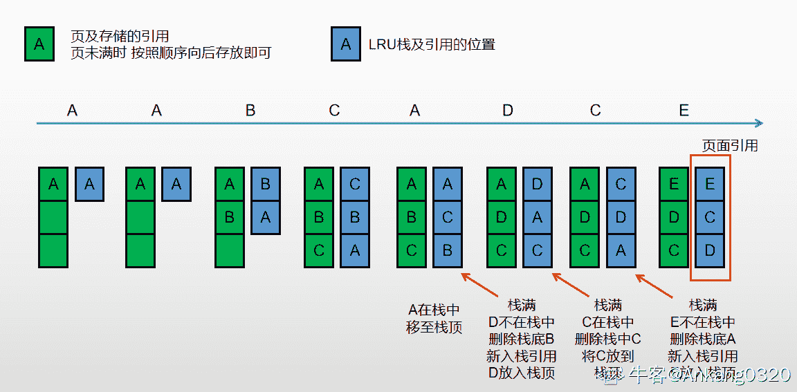

# 哔哩哔哩 2019 秋招技术岗（前端、运维、后端、移动端）第二套笔试题

## 1

有 4 种颜色的球，白的有 13 个，绿的有 11 个，黑的有 18 个，红的有 25 个，至少取出多少个球，才能保证有 15 个颜色一样（）

正确答案: B   你的答案: 空 (错误)

```cpp
52
```

```cpp
53
```

```cpp
54
```

```cpp
55
```

本题知识点

Java 工程师 C++工程师 前端工程师 算法工程师 哔哩哔哩 概率统计 *iOS 工程师 安卓工程师 2019* *讨论

[chasein](https://www.nowcoder.com/profile/2885572)

这个题答案应该选择 B，如果是 52 个的话，有一种情况就不满足题意，比如：13 个白，11 个绿，14 个黑，14 个红，刚好 52 个，但是没有 15 个颜色一样的球，所以答案应该选择 B

发表于 2019-06-21 19:33:17

* * *

[夜是故乡明](https://www.nowcoder.com/profile/6432095)

11+13+14+14+1=53 此时才能保证必定有 15 个颜色一样的小球。

发表于 2019-09-08 13:52:29

* * *

[问纤](https://www.nowcoder.com/profile/857851073)

52? 拿完所有白的绿的，再拿 14 个红的和 14 个黑的，一共 52 个，可还是不能保证有 15 个同色的呀！

发表于 2019-05-20 11:55:48

* * *

## 2

DNS 是用来做什么的？（）

正确答案: B   你的答案: 空 (错误)

```cpp
计算机网络相互连接进行通信而设计的协议
```

```cpp
万维网上作为域名和 IP 地址相互映射的一个分布式数据库
```

```cpp
完成内容分发功能
```

```cpp
网络防火墙
```

本题知识点

Java 工程师 C++工程师 运维工程师 前端工程师 算法工程师 PHP 工程师 测试工程师 哔哩哔哩 网络基础 C++工程师 iOS 工程师 安卓工程师 运维工程师 前端工程师 Java 工程师 哔哩哔哩 2019

讨论

[擎宇要努力努力再努力](https://www.nowcoder.com/profile/271692105)

域名系统（[英文](https://baike.baidu.com/item/%E8%8B%B1%E6%96%87)：Domain Name System，[缩写](https://baike.baidu.com/item/%E7%BC%A9%E5%86%99)：DNS）是[互联网](https://baike.baidu.com/item/%E4%BA%92%E8%81%94%E7%BD%91)的一项服务。它作为将[域名](https://baike.baidu.com/item/%E5%9F%9F%E5%90%8D)和[IP 地址](https://baike.baidu.com/item/IP%E5%9C%B0%E5%9D%80)相互[映射](https://baike.baidu.com/item/%E6%98%A0%E5%B0%84)的一个[分布式数据库](https://baike.baidu.com/item/%E5%88%86%E5%B8%83%E5%BC%8F%E6%95%B0%E6%8D%AE%E5%BA%93)，能够使人更方便地访问[互联网](https://baike.baidu.com/item/%E4%BA%92%E8%81%94%E7%BD%91)。

发表于 2020-11-25 22:57:02

* * *

[ypqhappy](https://www.nowcoder.com/profile/274908649)

DNS 就是把域名和 IP 地址联系在一起的服务，有了 DNS 服务器，你就不用输入 IP 地址来访问一个网站，可以通过输入网址访问。

发表于 2020-11-25 22:04:54

* * *

## 3

下列程序输出结果是:（）

```cpp
#include <stdio.h>
#define N 20
void fun (int a[N],int n,int m) { 
int i,j; 
for (i=m;i>n;i--)  
a[i+1]=a[i];
}
int main() {  
int i,a[N]={1,2,3,4,5,6,7,8,9,10};  
fun(a,2,9);  
for(i=0;i<5;i++) {     
printf("%d",a[i]); 
   }  
return 0;
}
``` 

正确答案: A   你的答案: 空 (错误)

```cpp
12344
```

```cpp
23244
```

```cpp
24256
```

```cpp
21344
```

本题知识点

Java 工程师 C++工程师 安卓工程师 iOS 工程师 运维工程师 前端工程师 算法工程师 测试工程师 哔哩哔哩 C++ C++工程师 iOS 工程师 安卓工程师 运维工程师 前端工程师 Java 工程师 哔哩哔哩 2019

讨论

[沙漠中的码农](https://www.nowcoder.com/profile/932477955)

A 这道题不需要计算，a[i+1]=a[i]  且在一个 i>n 的前提下，a[1]最起码没有被交换到，四个选项只要 A a[0]没变

发表于 2019-08-22 16:12:21

* * *

[原光](https://www.nowcoder.com/profile/57885668)

fun 函数的范围为 a4-a10，不是 a3-a10，因为 a3=a[2+1],即 a[2+1]=a2,将 a2 的值赋予 a3，但 a2 不符合条件 i>2,所以 a3 的值无法取到，即，a3 的值不变仍是 a3=4，但后面的值依次改变，a10=10；a9=9···a4=4.所以输出 a[i]为 12344（为了方便输入，我没有每一个数组都加上[]，但不影响阅读和理解）。

发表于 2019-09-23 14:54:36

* * *

## 4

接收 TCP 为了表明已收到源节点的 SYN 数据包，向源节点发送以下哪种类型的数据包？（）

正确答案: A   你的答案: 空 (错误)

```cpp
SYN-ACK
```

```cpp
SYN-2
```

```cpp
ACK
```

```cpp
RESYNC
```

本题知识点

Java 工程师 C++工程师 安卓工程师 iOS 工程师 运维工程师 前端工程师 算法工程师 测试工程师 哔哩哔哩 网络基础 2019

讨论

[酸奶芝士](https://www.nowcoder.com/profile/782906901)

第一次握手：客户端发送 syn 包(seq=x)到服务器，并进入 SYN_SEND 状态，等待服务器确认;第二次握手：服务器收到 syn 包，必须确认客户的 SYN(ack=x+1)，同时自己也发送一个 SYN 包(seq=y)，即 SYN+ACK 包，此时服务器进入 SYN_RECV 状态;由上面可以得知题目要求是说表明已收到源节点的 SYN 数据包，即向源节点发送确认包**ack（x+1）**

发表于 2019-08-31 11:02:15

* * *

[Jarlin](https://www.nowcoder.com/profile/7985304)

应该是 SYN-ACK 吧

发表于 2019-08-17 17:15:48

* * *

[牛客 113839108 号](https://www.nowcoder.com/profile/113839108)

第一次握手：客户端发送 SYN 包（seq=x）到服务器，并进入 SYN_SEND 状态，等待服务器确认；第二次握手：服务器收到 SYN 包，必须确认客户的 SYN（ack=x+1）,同时自己也发送一个 SYN 包（seq=y），即 SYN+ACK 包，此时服务器 SYN_RECV 状态；上面可知题目要求是说表明已收到源节点的 SYN 数据包，即向源节点发送确认包 ACK(X+1)

发表于 2022-01-12 14:29:04

* * *

## 5

以下哪个功能比较适合使用 UDP 协议？（）

正确答案: A   你的答案: 空 (错误)

```cpp
数据多播
```

```cpp
可靠连接
```

```cpp
流量控制
```

```cpp
拥塞控制
```

本题知识点

Java 工程师 C++工程师 安卓工程师 iOS 工程师 运维工程师 前端工程师 算法工程师 测试工程师 哔哩哔哩 网络基础 2019

讨论

[たんほうきょく](https://www.nowcoder.com/profile/985152874)

UDP 是面向无连接，尽最大努力到达，不可靠的，UDP 具有较好的实时性，工作效率比 TCP 高，适用于对高速传输和实时性有较高的通信或广播通信。TCP 是连接的，按序发送，可靠地，是点对点的

编辑于 2019-07-21 15:26:31

* * *

[HackerLZH](https://www.nowcoder.com/profile/771225830)

多播即组播，向多个节点传输数据，如果分别要建立连接，开销很大，所以用 udp

发表于 2022-01-15 14:39:12

* * *

[牛客 609351626 号](https://www.nowcoder.com/profile/609351626)

TCP Transmission Control Protocol UDP User Datagram Protocol

发表于 2021-11-12 19:10:28

* * *

## 6

linux 中哪个命令可以将普通用户转换成超级用户？（）

正确答案: D   你的答案: 空 (错误)

```cpp
super
```

```cpp
passwd
```

```cpp
tar
```

```cpp
su
```

本题知识点

Java 工程师 C++工程师 安卓工程师 iOS 工程师 运维工程师 前端工程师 算法工程师 测试工程师 哔哩哔哩 Linux C++工程师 iOS 工程师 安卓工程师 运维工程师 前端工程师 Java 工程师 哔哩哔哩 2019

讨论

[ceeeeeeeeeeeb](https://www.nowcoder.com/profile/542410100)

su 命令变更除了 root 外其他使用者的身份。

发表于 2019-08-13 23:20:06

* * *

## 7

下列依次为合法的二进制、八进制和十六进制数的选项是？（）

正确答案: D   你的答案: 空 (错误)

```cpp
12,77,10
```

```cpp
12,80,10
```

```cpp
11,78,19
```

```cpp
11,77,19
```

本题知识点

Java 工程师 C++工程师 安卓工程师 iOS 工程师 运维工程师 前端工程师 算法工程师 测试工程师 哔哩哔哩 编程基础 *C++工程师 iOS 工程师 安卓工程师 运维工程师 前端工程师 Java 工程师 哔哩哔哩 2019* *讨论

[邮子有我](https://www.nowcoder.com/profile/248772111)

基本概念：二进制满 2 进 1 八进制满 8 进 116 进制满 16 进 1 题中：A 中二进制不应存在 2B 中八进制不应存在 8C 选项同理因而正确答案为 D

发表于 2019-08-31 20:56:15

* * *

[酸奶芝士](https://www.nowcoder.com/profile/782906901)

二进制 0-1，八进制 0-7，十六进制 0-15，如上题：A 和 B 选项：2 不属于二进制，并且 B 中 8 不属于八进制。C：8 不属于八进制

发表于 2019-08-31 11:06:10

* * *

[东石](https://www.nowcoder.com/profile/776970252)

D 思路：二进制逢二进一，八进制逢八进一，十六进制逢十六进一，因此选 D

发表于 2019-09-02 14:33:16

* * *

## 8

C++ 某基类有构造函数 A()，析构函数 ~A()，其派生类 B 的构造函数和析构函数分别为 B() 和 ~B()，那么对于派生类 B 的构造和析构，下列说法正确的是 （）

正确答案: B   你的答案: 空 (错误)

```cpp
构造时，先调用 A()，再调用 B()，析构时，先调用 ~A()，再调用 ~B()
```

```cpp
构造时，先调用 A()，再调用 B()，析构时，先调用 ~B()，再调用 ~A()
```

```cpp
构造时，先调用 B()，再调用 A()，析构时，先调用 ~A()，再调用 ~B()
```

```cpp
构造时，先调用 B()，再调用 A()，析构时，先调用 ~B()，再调用 ~A()
```

本题知识点

Java 工程师 C++工程师 安卓工程师 iOS 工程师 运维工程师 前端工程师 算法工程师 测试工程师 哔哩哔哩 C++ 2019

讨论

[たんほうきょく](https://www.nowcoder.com/profile/985152874)

父类先构造，然后子类构造，结束时，子类先析构，然后父类最后析构

发表于 2019-07-21 15:28:47

* * *

[拖拉机嘟嘟嘟](https://www.nowcoder.com/profile/117252758)

构造和析构相反进行，可以想象成构造从内到外构造（父类到子类），析构从外到内拆除（子类到父类）。今天阳光明媚，砖还是很烫手。

发表于 2019-08-17 12:07:51

* * *

[_ooops_](https://www.nowcoder.com/profile/756272361)

先构造的后析构，后构造的先析构

发表于 2020-01-15 18:27:55

* * *

## 9

面向对象方法的多态性是指（）

正确答案: C   你的答案: 空 (错误)

```cpp
一个类可以派生出多个特殊类
```

```cpp
一个对象在不同的运行环境中可以有不同的变体
```

```cpp
针对一消息，不同的对象可以以适合自身的方式加以响应
```

```cpp
一个对象可以是由多个其他对象组合而成的
```

本题知识点

Java 工程师 C++工程师 安卓工程师 运维工程师 前端工程师 算法工程师 测试工程师 哔哩哔哩 C++ Java iOS 工程师 2019

讨论

[吴二叔](https://www.nowcoder.com/profile/976330702)

C 听起来好别扭，我觉得是：对于同一个父类方法，不同的子类会有不同的实现方式

编辑于 2019-08-29 15:30:07

* * *

[这是怎么一肥事](https://www.nowcoder.com/profile/6031985)

总是要把知识点玩成文字游戏，看着挺累

发表于 2019-10-28 16:10:28

* * *

[惠鸿飞](https://www.nowcoder.com/profile/881469708)

c 选项的确不好理解，《疯狂 java 讲义》的标准解释是： 相同类型的变量、调用同一个方法时呈现出多种不同的行为特征，这就是多态。

发表于 2019-09-12 11:12:27

* * *

## 10

java 中，静态变量 static 在不同线程的不同实例中地址是否一样？他们储存在什么区域？（）

正确答案: C   你的答案: 空 (错误)

```cpp
地址一样，在堆栈区。
```

```cpp
地址不一样，在堆栈区。
```

```cpp
地址一样，在全局区。
```

```cpp
地址不一样，在全局区。
```

本题知识点

Java 工程师 C++工程师 安卓工程师 iOS 工程师 运维工程师 前端工程师 算法工程师 测试工程师 哔哩哔哩 Java C++工程师 iOS 工程师 安卓工程师 运维工程师 前端工程师 Java 工程师 哔哩哔哩 2019

讨论

[刷面试题的](https://www.nowcoder.com/profile/953744962)

类信息、常量、静态变量等数据储存在方法区，只会在类加载的时候储存一次，地址一样。因为方法区又称作为 Non-Heap（非堆），直接把 ABD 都排除了，我也不知道全局区是个啥...

发表于 2019-08-04 15:29:22

* * *

[IDEA2022.4.2](https://www.nowcoder.com/profile/181223548)

static 变量存储在方法区，线程共享，全局区是方法区的一部分，其实用排除法也可以知道 static 变量不可能位于堆栈区

发表于 2019-09-15 17:36:31

* * *

[蔳莼菂䒕黃苽](https://www.nowcoder.com/profile/273370193)

地址一样,在方法区,Java 虚拟机规范把方法区描述为堆的一个逻辑部分.所以,全局区是个什么?

发表于 2019-09-10 16:55:20

* * *

## 11

一个无序 double 型数组(可以修改内容)，长度 n，找出前 k 个最小值的算法复杂度最低的是：（）

正确答案: C   你的答案: 空 (错误)

```cpp
O(nLog n)
```

```cpp
O(nLog k)
```

```cpp
O(n)
```

```cpp
O(log n)
```

本题知识点

Java 工程师 C++工程师 安卓工程师 iOS 工程师 运维工程师 前端工程师 算法工程师 测试工程师 哔哩哔哩 复杂度 C++工程师 iOS 工程师 安卓工程师 运维工程师 前端工程师 Java 工程师 哔哩哔哩 2019

讨论

[小狼狗刷刷题](https://www.nowcoder.com/profile/364416022)

当 k=1，即找出数组的最小值，必须遍历数组所有元素，O(n)，排除其他答案，选 C。

发表于 2019-08-16 14:23:30

* * *

[M฿](https://www.nowcoder.com/profile/645772284)

可以考虑桶排序 将 double 乘以一个足够大的数变成 Long  排序，算法复杂度就是 O（n）

编辑于 2020-12-08 11:15:08

* * *

[Kofe](https://www.nowcoder.com/profile/429757428)

类似抽象的变量，让其特殊化即可轻松解题。

发表于 2019-09-10 02:08:36

* * *

## 12

让 12345 依次入栈，过程中可以随时弹出栈顶元素并输出，则不可能的输出序列是：（）

正确答案: B   你的答案: 空 (错误)

```cpp
12345
```

```cpp
43512
```

```cpp
54321
```

```cpp
45321
```

本题知识点

Java 工程师 C++工程师 安卓工程师 iOS 工程师 运维工程师 前端工程师 算法工程师 测试工程师 哔哩哔哩 栈 *2019* *讨论

[_ 老地方](https://www.nowcoder.com/profile/290616569)

B43521

发表于 2019-11-16 23:56:31

* * *

## 13

已知二叉树 Node 定义如下, 现在需要设计一个方法交换左子树和右子树, 下列方法中, 可以实现交换的是? （） ```cpp
class Node {
public:

Node* left;

Node* right;

char content;

Node(char content);
private:

Node(const Node&);

Node& operator=(const Node& node);
};
``` 

正确答案: D   你的答案: 空 (错误)

```cpp
void swap(Node root) {
Node* temp = root.left;
root.left = root.right;
root.right = temp;
}
```

```cpp
void swap(Node& left, Node& right)
{
Node temp = left;
left = right;
right = temp;
}
```

```cpp
void
swap(Node* left, Node* right) {
Node* temp = left;
left = right;
right = temp;
}
```

```cpp
void swap(Node*& left, Node*&
right) {
Node* temp = left;
left = right;
right = temp;
}
```

本题知识点

Java 工程师 C++工程师 运维工程师 前端工程师 算法工程师 PHP 工程师 测试工程师 哔哩哔哩 树 C++工程师 iOS 工程师 安卓工程师 运维工程师 前端工程师 Java 工程师 哔哩哔哩 2019

讨论

[tgzl](https://www.nowcoder.com/profile/7187868)

表示 go 语言 acd 都对

发表于 2019-09-09 20:17:26

* * *

[M฿](https://www.nowcoder.com/profile/645772284)

此题 为 c++ 要使用指针  java 引用不适用

发表于 2019-09-09 17:59:27

* * *

[面向++offer 编程](https://www.nowcoder.com/profile/647535630)

B D 应该都对啊

发表于 2019-09-08 10:54:32

* * *

## 14

阿凡提骑驴过桥，他共有甲、乙、丙、丁 4 头驴，骑甲驴过桥要 20 分钟，乙驴过河要 30 分钟，丙驴过河要 40 分钟，丁驴最磨叽过河要 50 分钟。每次只能赶 2 头驴过桥，请问要把 4 头驴都赶过桥去，最少要多少分钟? （）

正确答案: D   你的答案: 空 (错误)

```cpp
190
```

```cpp
170
```

```cpp
180
```

```cpp
160
```

本题知识点

Java 工程师 C++工程师 安卓工程师 iOS 工程师 运维工程师 前端工程师 算法工程师 测试工程师 哔哩哔哩 数学运算 2019

讨论

[董冻冻](https://www.nowcoder.com/profile/76070815)

第一次过桥：20+30 的驴，  30 分钟回去：20 分钟第二次过桥：40+50 的驴，50 分钟回去：30 分钟最后：20+30 的驴，30 分钟一共：30+20+50+30+30=160 分钟

发表于 2019-08-18 11:11:59

* * *

[个人生命学被迫研究爱好者](https://www.nowcoder.com/profile/569049617)

题目没有说清楚 又是过桥又是过河 应该说清楚 过河要骑驴  每次只能带两头驴 

发表于 2019-08-20 17:17:04

* * *

[且归酒事](https://www.nowcoder.com/profile/426884419)

两种过桥方式，都是 160 分钟。第 1 种：第一次过桥：20+30 的驴，  30 分钟回去：20 分钟第二次过桥：40+50 的驴，50 分钟回去：30 分钟最后：20+30 的驴，30 分钟一共：30+20+50+30+30=160 分钟第 2 种：第一次过桥：20+30 的驴，  30 分钟回去：20 分钟第二次过桥：20+40 的驴，40 分钟回去：20 分钟最后：20+50 的驴，50 分钟一共：30+20+40+20+50=160 分钟

发表于 2019-09-03 11:18:00

* * *

## 15

HTTP 定义了与服务器交互的不同方法，最基本的方法有 4 种 （）

正确答案: A   你的答案: 空 (错误)

```cpp
GET,POST, PUT, DELETE
```

```cpp
GET, POST, PUSH, PULL
```

```cpp
GET, POST, UPDATE, REMOVE
```

```cpp
GET,POST, UPLOAD, DOWNLOAD
```

本题知识点

Java 工程师 C++工程师 安卓工程师 iOS 工程师 运维工程师 前端工程师 算法工程师 测试工程师 哔哩哔哩 网络基础 2019

讨论

[晏大哥](https://www.nowcoder.com/profile/265280690)

get 查看

post 创建

put 更新或创建

delete 删除

发表于 2019-10-30 14:41:56

* * *

## 16

在 24×24 的网格中用点描出一个汉字，存储 1024 个汉字需要多少字节？（）

正确答案: B   你的答案: 空 (错误)

```cpp
64KB
```

```cpp
72KB
```

```cpp
96KB
```

```cpp
128KB
```

本题知识点

编译和体系结构

讨论

[老板！来罐 82 年雪碧](https://www.nowcoder.com/profile/210026566)

点阵就是一个二进制位表示一个点,于是 24*24 点阵需要 24*24 个二进制位,一个字节是 8 个位,所以一个汉字需要 24*24/8=72 字节, 你有 1024 个汉字,那当然就是((24*24)/8)*1024

发表于 2019-07-25 16:59:32

* * *

[nokehubert](https://www.nowcoder.com/profile/112792384)

24*24，带个 6*6，带 36 玩的都是好人，五毛钱赌 72KB，老 E,KB.....

发表于 2019-09-09 15:05:14

* * *

## 17

当前页面为 http://www.bilibili.com, 以下有几个请求属于跨域？（）

```cpp
https://live.bilibili.com

http://www.bilibili.com:443

http://www.bilibili.com/index.html

http://biligame.com/

```

正确答案: C   你的答案: 空 (错误)

```cpp
1
```

```cpp
2
```

```cpp
3
```

```cpp
4
```

本题知识点

Java 工程师 C++工程师 安卓工程师 运维工程师 前端工程师 算法工程师 测试工程师 哔哩哔哩 网络基础 iOS 工程师 2019

讨论

[Ped](https://www.nowcoder.com/profile/9416754)

第一个：协议不同和子域不同；最后一个：域名不同；不过第二个我就有点不清楚了，http 的默认端口不是 80 吗，而 https 的默认端口是 443，为什么第二个不属于跨域？

发表于 2019-05-21 16:46:11

* * *

[燕然勒石](https://www.nowcoder.com/profile/6848896)

同源策略：是指协议，域名，端口都要相同，其中有一个不同都会产生跨域；答案应该是：1，2，4

发表于 2019-09-09 22:24:49

* * *

[个人生命学被迫研究爱好者](https://www.nowcoder.com/profile/569049617)

跨域：协议 http://子域名 www 主域名 bilibili.com 端口  http 默认 80 端口有一个不同就算跨域 答案应该是 3 个吧  第一个 子域名跟协议不同  第二个 端口号不同(443 是 https 的第四个 主域名不同

发表于 2019-08-20 17:32:20

* * *

## 18

HTTP CODE 中 403 代表什么含义？（）

正确答案: C   你的答案: 空 (错误)

```cpp
服务器当前无法处理请求
```

```cpp
服务器不能或不会处理该请求
```

```cpp
服务器收到请求但拒绝提供服务
```

```cpp
服务器无法回应且不知原因
```

本题知识点

Java 工程师 C++工程师 安卓工程师 iOS 工程师 运维工程师 前端工程师 算法工程师 测试工程师 哔哩哔哩 网络基础 2019

讨论

[魂一百](https://www.nowcoder.com/profile/671034181)

400 （错误请求） 服务器不理解请求的语法。 401 （未授权） 请求要求身份验证。 对于需要登录的网页，服务器可能返回此响应。 403 （禁止） 服务器拒绝请求。 404 （未找到） 服务器找不到请求的网页。 405 （方法禁用） 禁用请求中指定的方法。 406 （不接受） 无法使用请求的内容特性响应请求的网页。

发表于 2019-09-06 15:16:35

* * *

[飞得更高~](https://www.nowcoder.com/profile/172089380)

400 （错误请求） 服务器不理解请求的语法。 401 （未授权） 请求要求身份验证。 对于需要登录的网页，服务器可能返回此响应。 403 （禁止） 服务器拒绝请求。 404 （未找到） 服务器找不到请求的网页。 405 （方法禁用） 禁用请求中指定的方法。 406 （不接受） 无法使用请求的内容特性响应请求的网页。

发表于 2019-11-26 22:33:20

* * *

[牛客 283437650 号](https://www.nowcoder.com/profile/283437650)

**总体来说是：****400 （错误请求） 服务器不理解请求的语法。 401 （未授权） 请求要求身份验证。 对于需要登录的网页，服务器可能返回此响应。 403 （禁止） 服务器拒绝请求。 404 （未找到） 服务器找不到请求的网页。 405 （方法禁用） 禁用请求中指定的方法。 406 （不接受） 无法使用请求的内容特性响应请求的网页。**

发表于 2020-09-20 17:20:00

* * *

## 19

属于非专用网络的 IP 段是？（）

正确答案: D   你的答案: 空 (错误)

```cpp
10.0.0.0–10.255.255.255
```

```cpp
172.16.0.0–172.31.255.255
```

```cpp
192.168.0.0–192.168.255.255
```

```cpp
127.0.0.0–127.255.255.255
```

本题知识点

Java 工程师 C++工程师 安卓工程师 iOS 工程师 运维工程师 前端工程师 算法工程师 测试工程师 哔哩哔哩 网络基础 2019

讨论

[imsl](https://www.nowcoder.com/profile/97865770)

私网 IP 有三段，A、B、[C 类地址](https://www.baidu.com/s?wd=C%E7%B1%BB%E5%9C%B0%E5%9D%80&tn=SE_PcZhidaonwhc_ngpagmjz&rsv_dl=gh_pc_zhidao)每类都有一段
A: 10.0.0.0~10.255.255.255 /8
B:172.16.0.0~172.31.255.255 /16
C:192.168.0.0~192.168.255.255 /24

发表于 2019-08-09 16:07:38

* * *

[亦云苍狗](https://www.nowcoder.com/profile/3404475)

```cpp
因为 D 选项的 127.255.255.255 是 0111 1111.1111 1111.1111 1111.1111 1111 这种 IP 是专用有特殊用途的网络。
```

发表于 2019-09-25 15:09:21

* * *

## 20

以下哪些是 HTTP2.0 加入的新特性？（）

正确答案: C   你的答案: 空 (错误)

```cpp
keep-alive
```

```cpp
Pipelining
```

```cpp
server push
```

```cpp
SSL/TSL
```

本题知识点

Java 工程师 C++工程师 安卓工程师 iOS 工程师 运维工程师 前端工程师 算法工程师 测试工程师 哔哩哔哩 网络基础 2019

讨论

[奔腾的小马达](https://www.nowcoder.com/profile/224349141)

1.Http2.0 采用二进制文本而非文本格式 2.Http2.0 是完全多路复用的，非有序阻塞的，只需要一个连接即可实现并行 3.使用报头压缩，降低了开销 4.Http2.0 让服务器可以将响应主动推送到客户端的缓存中。

发表于 2019-08-09 09:29:09

* * *

[牛客 935471786 号](https://www.nowcoder.com/profile/935471786)

1.Http2.0 采用二进制文本而非文本格式 2.Http2.0 是完全多路复用的，非有序阻塞的，只需要一个连接即可实现并行 3.使用报头压缩，降低了开销 4.Http2.0 让服务器可以将响应主动推送到客户端的缓存中。

发表于 2022-01-25 15:06:20

* * *

## 21

当一个进程执行系统调用而陷入内核代码中执行时，我们就称进程处于 1 态

你的答案 (错误)

1 参考答案 (1) 内核

本题知识点

Java 工程师 C++工程师 安卓工程师 iOS 工程师 运维工程师 前端工程师 算法工程师 测试工程师 哔哩哔哩 操作系统 2019

讨论

[meteorX](https://www.nowcoder.com/profile/822986782)

内核运行态

发表于 2019-11-02 22:03:28

* * *

[223s](https://www.nowcoder.com/profile/641616950)

吧内核态和管态弄混了

发表于 2020-07-16 20:51:26

* * *

## 22

drop、delete 与 truncate 分别在什么场景之下使用？不再需要一张表的时候用 1。想删除部分数据行时候用(delete)。保留表而删除所有数据的时候用 2

你的答案 (错误)

12 参考答案 (1) drop
(2) truncate

本题知识点

Java 工程师 C++工程师 安卓工程师 iOS 工程师 运维工程师 前端工程师 算法工程师 测试工程师 哔哩哔哩 数据库 2019

讨论

[门头沟小陀螺](https://www.nowcoder.com/profile/2011771)

彻底删除一张表难道不是 drop？参考答案怎么写的是 delete

发表于 2019-05-21 16:33:26

* * *

[苏小糖!](https://www.nowcoder.com/profile/746788350)

答案应该是 drop 吧 1.drop (删除表)：删除内容和定义，释放空间。简单来说就是**把整个表去掉**.2.truncate (清空表中的数据)：删除内容、释放空间但不删除定义(**保留表的数据结构**)。3.delete (删除表中的数据)：delete 语句用于**删除表中的行**。

发表于 2019-08-23 10:11:46

* * *

[223s](https://www.nowcoder.com/profile/641616950)

沙雕题目，我还以为我错了呢

发表于 2020-07-16 20:52:26

* * *

## 23

请将这串二进制数字 101000011010011111，转换为十六进制：1。（不需要带 0x，字母为大写）

你的答案 (错误)

1 参考答案 (1) 2869F

本题知识点

Java 工程师 C++工程师 安卓工程师 iOS 工程师 运维工程师 前端工程师 算法工程师 测试工程师 哔哩哔哩 编程基础 *2019* *讨论

[会飞的粉红猪精](https://www.nowcoder.com/profile/208722102)

F 还要区分大小写的吗，写大写咋能错呀

发表于 2019-07-30 10:05:24

* * *

[CIMP](https://www.nowcoder.com/profile/121566221)

从又至左，每 4 个二进制位为一个单位，8421 码来转换成十六进制，不够位用 0 补全，转换为 8 进制的话 3 个二进制位为一个单位，同上。

发表于 2020-03-02 19:13:53

* * *

[223s](https://www.nowcoder.com/profile/641616950)

 0x2869f，来你告诉我哪里错了？

发表于 2020-07-16 20:52:48

* * *

## 24

TCP 三次握手时，客户端发送 SYN 报文给服务器端，服务器端收到 SYN 报文，回应一个 1，客户端收到服务器端的 2 报文回应一个 3，最终进入 4 状态。

你的答案 (错误)

1234 参考答案 (1) SYN
(2) SYN
(3) ACK
(4) Established

本题知识点

Java 工程师 C++工程师 安卓工程师 iOS 工程师 运维工程师 前端工程师 算法工程师 测试工程师 哔哩哔哩 网络基础 2019

讨论

[_random](https://www.nowcoder.com/profile/5246141)

为什么不是 SYN+ACK？

发表于 2019-08-13 17:03:30

* * *

[Anne 琪琪](https://www.nowcoder.com/profile/919213170)

三次握手： 第一次握手：客户端发送 syn 包(syn=x)到服务器，并进入 SYN_SEND 状态，等待服务器确认； 第二次握手：服务器收到 syn 包，必须确认客户的 SYN（ack=x+1），同时自己也发送一个 SYN 包（syn=y），即 SYN+ACK 包，此时服务器进入 SYN_RECV 状态； 第三次握手：客户端收到服务器的 SYN＋ACK 包，向服务器发送确认包 ACK(ack=y+1)，此包发送完毕，客户端和服务器进入 ESTABLISHED 状态，完成三次握手。

发表于 2019-09-12 22:43:32

* * *

[tgzl](https://www.nowcoder.com/profile/7187868)

 SYN＋ACK

发表于 2019-09-09 20:11:11

* * *

## 25

假设某一虚拟存储系统采用先进先出页面淘汰算法，有一个进程在内存中占 3 页 1，当访问如下页面序列号后 1,2,3,1,2,4,2,3,5,3,4,5,6 会产生 2 次缺页

你的答案 (错误)

12 参考答案 (1) 开始时内存为空
(2) 6

本题知识点

Java 工程师 C++工程师 安卓工程师 iOS 工程师 运维工程师 前端工程师 算法工程师 测试工程师 哔哩哔哩 操作系统 2019

讨论

[沙家浜](https://www.nowcoder.com/profile/2891318)

我也是醉了

发表于 2019-05-11 18:46:07

* * *

[223s](https://www.nowcoder.com/profile/641616950)

最开始的一次加载数据进入内存也算缺页？？？

发表于 2020-07-16 20:55:33

* * *

[Thpffcj](https://www.nowcoder.com/profile/7025035)

为什么是 6 次缺页呢？感觉应该是 3 次啊

发表于 2020-01-14 15:29:13

* * *

## 26

LRU 的 cache 长度为 3,初始为空。依次访问元素 A,A,B,C,A,D,C,E 后，cache 里的内容是 1

你的答案 (错误)

1 参考答案 (1) E,C,D

本题知识点

Java 工程师 C++工程师 安卓工程师 iOS 工程师 运维工程师 前端工程师 算法工程师 测试工程师 哔哩哔哩 操作系统 2019

讨论

[Ankang0320](https://www.nowcoder.com/profile/866249541)

**最近最少使用算法（Least-Recent-Used，LRU）**。当页满的时候，而新引用又不在页中，即发生缺页错误，需要根据 LRU 从现有页中选择一个进行置换。注意 LRU 并不统计使用次数，而是通过维持一个与页的帧数大小相同的栈来确定该被置换的引用。LRU 机制通常用于缺页置换。**LRU 实现**：最大为页的帧数大小的栈，若是新引用，且栈不满，新引用放到栈顶，已有引用保持相对顺序下移；若是已有引用，则从栈中删除该引用后将该引用放到栈顶。若是新引用且栈满，选择栈底引用删除，将新引用放到栈顶。即栈顶为最近使用引用，而栈底为最近最少使用引用。每次需要置换时，选择栈底引用进行置换。**栈与页对应**：注意栈中顺序与页中储存的对应，若 A 置换 B，那么在页中将 A 存放到原先存放 B 的位置，而栈中，从栈底删除 B，将 A 放到栈顶。**这道题的 CACHE 指 LRU 栈的大小，并且****没有问缺页置换后页中的存放位置，而只是问栈中元素的顺序，所以只看栈中顺序即可，不需要确定页中的存储位置。****** 

编辑于 2019-08-20 15:12:10

* * *

[tgzl](https://www.nowcoder.com/profile/7187868)

 写的 ECD,算错

发表于 2019-09-09 20:05:29

* * *

[我要从南走到北～](https://www.nowcoder.com/profile/102608364)

我写了个 D,C,E 算错。。。这题没规定正反顺序吧

发表于 2019-08-20 00:59:03

* * *

## 27

请写出以下 java 代码的输出内容 1

```cpp
public class TestCount {

public static void main(String args[]) {

Count count = new Count( );

count.count(count.getCount( )).getCount( );

new Count( ).count(count.getCount( ));
    }

public static class Count {
        volatile Integer count = 2018;

public Count count(Integer count) {

System.out.println(++count);

return this;

}

public Integer getCount( ) {

System.out.println(++count);

return count;

}
    }
}
```

你的答案 (错误)

1 参考答案 (1) 2019 2020 2020 2021 2022

本题知识点

Java 工程师 C++工程师 安卓工程师 运维工程师 前端工程师 算法工程师 PHP 工程师 测试工程师 哔哩哔哩 Java iOS 工程师 2019

讨论

[嘿朋友](https://www.nowcoder.com/profile/630475841)

代码的执行过程 count.（2）count(（1）count.getCount( )).（3）getCount( );newCount( ).（5）count(（4）count.getCount( ));（1）输出 2019，然后返回值是 2019，传给 count(int count)函数，此时，count 对象内的变量值为 2019（2）count 函数使用的是 getCount()返回的一个临时变量，值为 2019，所以打印 2020，此时 count 对象内的 count 值为 2019（3）getCount() 使用的是 count 对象里面的 count 变量，输出 2020，此时 count 对象内的 count 值为 2020（4）getCount() 使用的是 count 对象里面的 count 变量，输出 2021，并且返回一个临时的变量 2021，此时 count 对象内的 count 值为 2021（5）count()使用的是（4）中函数返回的临时变量 2021，所以打印 2022，此时 count 对象内的 count 值为 2021

发表于 2020-01-15 20:37:59

* * *

[太锈了得用钢丝球](https://www.nowcoder.com/profile/963747418)

哪位牛油来解释一下，不太懂

发表于 2020-01-04 14:01:32

* * *

[Zn 微凉](https://www.nowcoder.com/profile/6020390)

就(1).看不到题目！

发表于 2019-08-13 17:28:12

* * *

## 28

git 操作：退回到 commit 16a14245 并丢掉所有改动

```cpp

git   116a14245

```

你的答案 (错误)

1 参考答案 (1) reset --hard HEAD

本题知识点

Java 工程师 C++工程师 安卓工程师 iOS 工程师 运维工程师 前端工程师 算法工程师 PHP 工程师 测试工程师 哔哩哔哩 2019

讨论

[我要从南走到北～](https://www.nowcoder.com/profile/102608364)

不应该是 reset --hard 就行了吗？后面都有版本号了，还加个 HEAD 干啥，而且 HEAD 不就是当前吗，这操作有啥意义啊

发表于 2019-08-20 00:56:26

* * *

## 29

写一个正则去除字段串两端的空格,正则为 1

你的答案 (错误)

1 参考答案 (1) /^\s+|\s+$/g

本题知识点

Java 工程师 C++工程师 安卓工程师 运维工程师 前端工程师 算法工程师 哔哩哔哩 编程基础 *Java iOS 工程师 2019* *讨论

[你的 offer 对我打了烊](https://www.nowcoder.com/profile/598309941)

背去吧你😁\d      匹配一个数字字符。等价于 [0-9]。\D     匹配一个非数字字符。等价于 [⁰-9]。
\f       匹配一个换页符。等价于 \x0c 和 \cL。
\n      匹配一个换行符。等价于 \x0a 和 \cJ。
\r       匹配一个回车符。等价于 \x0d 和 \cM。
\s      匹配任何空白字符，包括空格、制表符、换页符等等。等价于 [ \f\n\r\t\v]。
\S      匹配任何非空白字符。等价于 [^ \f\n\r\t\v]。
\t       匹配一个制表符。等价于 \x09 和 \cI。
\v      匹配一个垂直制表符。等价于 \x0b 和 \cK。
\w     匹配字母、数字、下划线。等价于'[A-Za-z0-9_]'。
\W    匹配非字母、数字、下划线。等价于 '[^A-Za-z0-9_]'。

发表于 2020-03-04 18:59:14

* * *

[Zn 微凉](https://www.nowcoder.com/profile/6020390)

就(1).看不到题目！

发表于 2019-08-13 17:28:27

* * *

## 30

以下样式中的 h1 的实际 font-size 为 1px; ```cpp
html {

font-size: 32px;
}
body {

font-size: 16px;

margin: auto;

padding: 0;

width: 10rem;
}
h1{font-size: 2rem;}
``` 

你的答案 (错误)

1 参考答案 (1) 64

本题知识点

Java 工程师 C++工程师 安卓工程师 iOS 工程师 运维工程师 前端工程师 算法工程师 测试工程师 哔哩哔哩 HTML 2019

讨论

[我是胖纸](https://www.nowcoder.com/profile/223913617)

rem 是相对于页面根元素<html>，这样就意味着，我们只需要在根元素确定一个参考值即可，其它元素设置 rem 大小都是以 html 的字体大小设置为参考值进行一个字体大小缩放

发表于 2019-08-14 09:47:31

* * *

[我要当学霸 11](https://www.nowcoder.com/profile/214545535)

如果 html 里定义了 font-size 那么 1rem 就等于 html 里定义的 font-size,如果没有那么就是默认 1rem=16px

发表于 2019-08-12 16:34:11

* * *

## 31

22 娘和 33 娘接到了小电视君的扭蛋任务：
一共有两台扭蛋机，编号分别为扭蛋机 2 号和扭蛋机 3 号，22 娘使用扭蛋机 2 号，33 娘使用扭蛋机 3 号。
扭蛋机都不需要投币，但有一项特殊能力：
扭蛋机 2 号：如果塞 x（x 范围为>=0 整数）个扭蛋进去，然后就可以扭到 2x+1 个
扭蛋机 3 号：如果塞 x（x 范围为>=0 整数）个扭蛋进去，然后就可以扭到 2x+2 个
22 娘和 33 娘手中没有扭蛋，需要你帮她们设计一个方案，两人“轮流扭”（谁先开始不限，扭到的蛋可以交给对方使用），用“最少”的次数，使她们能够最后恰好扭到 N 个交给小电视君。

本题知识点

哔哩哔哩 Java 工程师 C++工程师 iOS 工程师 安卓工程师 运维工程师 前端工程师 算法工程师 PHP 工程师 测试工程师 数学 递归 2019 golang 工程师

讨论

[0b100001101000](https://www.nowcoder.com/profile/568883663)

```cpp
n = int(input())
o = []
while n:
    o.append('3' if n%2 == 0 else '2')
    n = (n-1)//2
print(''.join(o[::-1]))
```

发表于 2019-09-09 15:52:50

* * *

[chasein](https://www.nowcoder.com/profile/2885572)

```cpp
import java.util.*;
public class Main{
    public static void main(String[] args){
        Scanner sc = new Scanner(System.in);
            while(sc.hasNext()){
                int num = sc.nextInt();
                StringBuilder res = new StringBuilder();
                while(num != 0){
                    if(num % 2 == 0){
                        num = (num - 2) / 2;
                        res.insert(0, "3");
                    }else{
                        num = (num - 1) / 2;
                        res.insert(0, "2");
                    }
                }
                System.out.println(res);
            }
    }
}
```

发表于 2019-06-23 12:32:36

* * *

[雷凌云](https://www.nowcoder.com/profile/174189833)

这道题可以简化成走方格初始位置是 x=0，然后每步有两种选择 1、第一种选择是走到编号为 2*x+1 的方格，代号为 ‘2’2、第一种选择是走到编号为 2*x+2 的方格，代号为 ‘3’求一种可以正好走到 编号为 n 的方式

```cpp
# 逆推法：根据最后一步的奇偶，判断前一步的选择
n = int(input())
res = ''
while n > 0:
    if (n-2) % 2:
        n = (n-1) // 2
        res = '2' + res
    else:
        n = (n-2) // 2
        res = '3' + res
print(res)
```

发表于 2019-08-22 16:01:14

* * ******